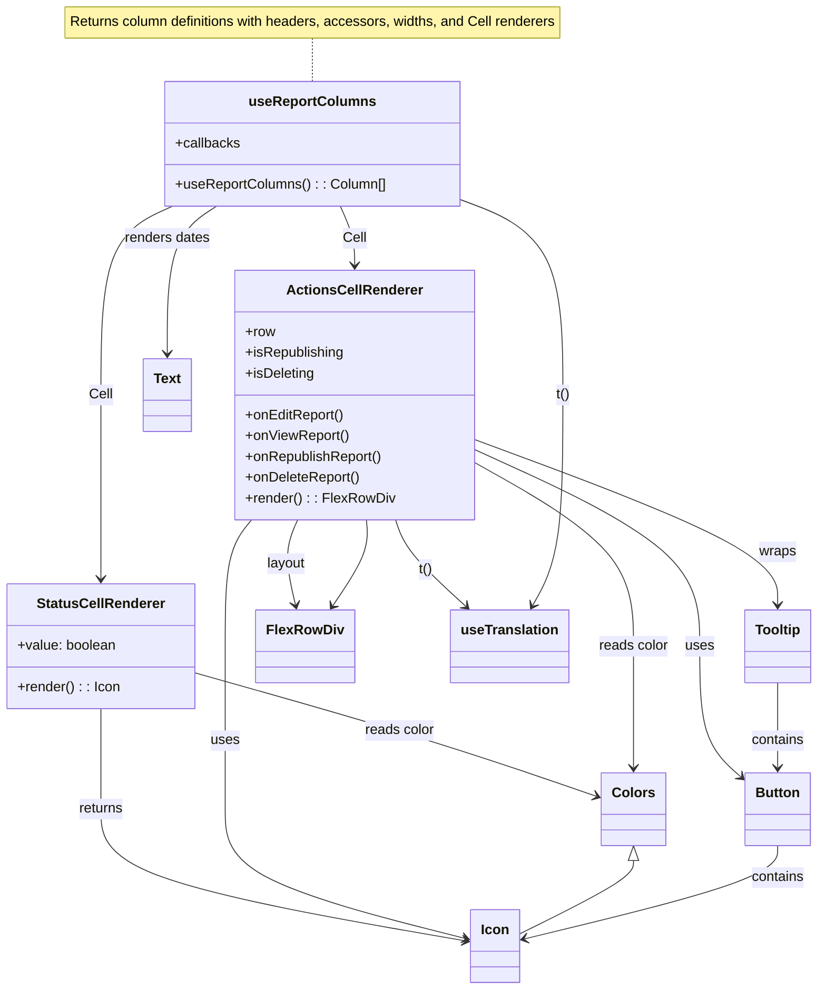

# Diagram: web/portal/src/pages/administration/report-management/search/ReportManagement.Search.columns.tsx

> Auto-generated by Obscura crawlers

## Mermaid

### SVG

<svg id="container" width="926.64453125" xmlns="http://www.w3.org/2000/svg" class="classDiagram" height="1142" viewBox="0 0 926.64453125 1142" role="graphics-document document" aria-roledescription="class"><g><defs><marker id="container_class-aggregationStart" class="marker aggregation class" refX="18" refY="7" markerWidth="190" markerHeight="240" orient="auto"><path d="M 18,7 L9,13 L1,7 L9,1 Z"></path></marker></defs><defs><marker id="container_class-aggregationEnd" class="marker aggregation class" refX="1" refY="7" markerWidth="20" markerHeight="28" orient="auto"><path d="M 18,7 L9,13 L1,7 L9,1 Z"></path></marker></defs><defs><marker id="container_class-extensionStart" class="marker extension class" refX="18" refY="7" markerWidth="190" markerHeight="240" orient="auto"><path d="M 1,7 L18,13 V 1 Z"></path></marker></defs><defs><marker id="container_class-extensionEnd" class="marker extension class" refX="1" refY="7" markerWidth="20" markerHeight="28" orient="auto"><path d="M 1,1 V 13 L18,7 Z"></path></marker></defs><defs><marker id="container_class-compositionStart" class="marker composition class" refX="18" refY="7" markerWidth="190" markerHeight="240" orient="auto"><path d="M 18,7 L9,13 L1,7 L9,1 Z"></path></marker></defs><defs><marker id="container_class-compositionEnd" class="marker composition class" refX="1" refY="7" markerWidth="20" markerHeight="28" orient="auto"><path d="M 18,7 L9,13 L1,7 L9,1 Z"></path></marker></defs><defs><marker id="container_class-dependencyStart" class="marker dependency class" refX="6" refY="7" markerWidth="190" markerHeight="240" orient="auto"><path d="M 5,7 L9,13 L1,7 L9,1 Z"></path></marker></defs><defs><marker id="container_class-dependencyEnd" class="marker dependency class" refX="13" refY="7" markerWidth="20" markerHeight="28" orient="auto"><path d="M 18,7 L9,13 L14,7 L9,1 Z"></path></marker></defs><defs><marker id="container_class-lollipopStart" class="marker lollipop class" refX="13" refY="7" markerWidth="190" markerHeight="240" orient="auto"><circle stroke="black" fill="transparent" cx="7" cy="7" r="6"></circle></marker></defs><defs><marker id="container_class-lollipopEnd" class="marker lollipop class" refX="1" refY="7" markerWidth="190" markerHeight="240" orient="auto"><circle stroke="black" fill="transparent" cx="7" cy="7" r="6"></circle></marker></defs><g class="root"><g class="clusters"></g><g class="edgePaths"><path d="M351.93,44L351.93,48.167C351.93,52.333,351.93,60.667,351.93,69C351.93,77.333,351.93,85.667,351.93,89.833L351.93,94" id="edgeNote1" class="edge-thickness-normal edge-pattern-dotted relation" style="fill: none;;;fill: none" data-edge="true" data-et="edge" data-id="edgeNote1" data-points="W3sieCI6MzUxLjkyOTY4NzUsInkiOjQ0fSx7IngiOjM1MS45Mjk2ODc1LCJ5Ijo2OX0seyJ4IjozNTEuOTI5Njg3NSwieSI6OTR9XQ=="></path><path d="M114.266,818L114.266,824.167C114.266,830.333,114.266,842.667,114.266,862C114.266,881.333,114.266,907.667,114.266,934C114.266,960.333,114.266,986.667,183.008,1012.019C251.749,1037.371,389.233,1061.742,457.975,1073.927L526.717,1086.113" id="id_StatusCellRenderer_Icon_1" class="edge-thickness-normal edge-pattern-solid relation" style=";;;" data-edge="true" data-et="edge" data-id="id_StatusCellRenderer_Icon_1" data-points="W3sieCI6MTE0LjI2NTYyNSwieSI6ODE4fSx7IngiOjExNC4yNjU2MjUsInkiOjg1NX0seyJ4IjoxMTQuMjY1NjI1LCJ5Ijo5MzR9LHsieCI6MTE0LjI2NTYyNSwieSI6MTAxM30seyJ4Ijo1MzIuNjI1LCJ5IjoxMDg3LjE1OTg3Mzc4Mzg1NX1d" marker-end="url(#container_class-dependencyEnd)"></path><path d="M220.531,776.73L265.642,789.775C310.753,802.82,400.974,828.91,476.54,852.72C552.105,876.531,613.015,898.062,643.47,908.827L673.925,919.592" id="id_StatusCellRenderer_Colors_2" class="edge-thickness-normal edge-pattern-solid relation" style=";;;" data-edge="true" data-et="edge" data-id="id_StatusCellRenderer_Colors_2" data-points="W3sieCI6MjIwLjUzMTI1LCJ5Ijo3NzYuNzI5NzQ0ODU0NjAyNH0seyJ4Ijo0OTEuMTk1MzEyNSwieSI6ODU1fSx7IngiOjY3OS41ODIwMzEyNSwieSI6OTIxLjU5MjA4NTcxNDc4NTF9XQ==" marker-end="url(#container_class-dependencyEnd)"></path><path d="M534.313,506.317L592.08,528.097C649.848,549.878,765.383,593.439,823.15,625.386C880.918,657.333,880.918,677.667,880.918,687.833L880.918,698" id="id_ActionsCellRenderer_Tooltip_3" class="edge-thickness-normal edge-pattern-solid relation" style=";;;" data-edge="true" data-et="edge" data-id="id_ActionsCellRenderer_Tooltip_3" data-points="W3sieCI6NTM0LjMxMjUsInkiOjUwNi4zMTY4MDcwMzAzOTE4M30seyJ4Ijo4ODAuOTE3OTY4NzUsInkiOjYzN30seyJ4Ijo4ODAuOTE3OTY4NzUsInkiOjcwNH1d" marker-end="url(#container_class-dependencyEnd)"></path><path d="M534.313,517.803L577.21,537.669C620.108,557.535,705.904,597.268,748.801,635.3C791.699,673.333,791.699,709.667,791.699,746C791.699,782.333,791.699,818.667,799.681,843.901C807.663,869.135,823.626,883.27,831.608,890.338L839.59,897.406" id="id_ActionsCellRenderer_Button_4" class="edge-thickness-normal edge-pattern-solid relation" style=";;;" data-edge="true" data-et="edge" data-id="id_ActionsCellRenderer_Button_4" data-points="W3sieCI6NTM0LjMxMjUsInkiOjUxNy44MDI4NDg0MzMzNjE2fSx7IngiOjc5MS42OTkyMTg3NSwieSI6NjM3fSx7IngiOjc5MS42OTkyMTg3NSwieSI6NzQ2fSx7IngiOjc5MS42OTkyMTg3NSwieSI6ODU1fSx7IngiOjg0NC4wODIwMzEyNSwieSI6OTAxLjM4MzA5OTgyNDg2ODZ9XQ==" marker-end="url(#container_class-dependencyEnd)"></path><path d="M285.239,600L280.288,606.167C275.337,612.333,265.434,624.667,260.483,649C255.531,673.333,255.531,709.667,255.531,746C255.531,782.333,255.531,818.667,255.531,850C255.531,881.333,255.531,907.667,255.531,934C255.531,960.333,255.531,986.667,300.746,1011.568C345.96,1036.469,436.389,1059.938,481.603,1071.672L526.817,1083.406" id="id_ActionsCellRenderer_Icon_5" class="edge-thickness-normal edge-pattern-solid relation" style=";;;" data-edge="true" data-et="edge" data-id="id_ActionsCellRenderer_Icon_5" data-points="W3sieCI6Mjg1LjIzOTIwOTI1NDE0MzY1LCJ5Ijo2MDB9LHsieCI6MjU1LjUzMTI1LCJ5Ijo2Mzd9LHsieCI6MjU1LjUzMTI1LCJ5Ijo3NDZ9LHsieCI6MjU1LjUzMTI1LCJ5Ijo4NTV9LHsieCI6MjU1LjUzMTI1LCJ5Ijo5MzR9LHsieCI6MjU1LjUzMTI1LCJ5IjoxMDEzfSx7IngiOjUzMi42MjUsInkiOjEwODQuOTEzNjYxNjc5MDI4OH1d" marker-end="url(#container_class-dependencyEnd)"></path><path d="M337.455,600L334.74,606.167C332.025,612.333,326.594,624.667,326.027,641.022C325.459,657.376,329.754,677.753,331.902,687.941L334.05,698.129" id="id_ActionsCellRenderer_FlexRowDiv_6" class="edge-thickness-normal edge-pattern-solid relation" style=";;;" data-edge="true" data-et="edge" data-id="id_ActionsCellRenderer_FlexRowDiv_6" data-points="W3sieCI6MzM3LjQ1NTM2OTQ3NTEzODEsInkiOjYwMH0seyJ4IjozMjEuMTY0MDYyNSwieSI6NjM3fSx7IngiOjMzNS4yODcyNzA2NDIyMDE4NiwieSI6NzA0fV0=" marker-end="url(#container_class-dependencyEnd)"></path><path d="M445.8,600L447.725,606.167C449.649,612.333,453.499,624.667,466.551,641.314C479.603,657.962,501.859,678.924,512.987,689.405L524.115,699.886" id="id_ActionsCellRenderer_useTranslation_7" class="edge-thickness-normal edge-pattern-solid relation" style=";;;" data-edge="true" data-et="edge" data-id="id_ActionsCellRenderer_useTranslation_7" data-points="W3sieCI6NDQ1LjgwMDMyODAzODY3NCwieSI6NjAwfSx7IngiOjQ1Ny4zNDc2NTYyNSwieSI6NjM3fSx7IngiOjUyOC40ODIzMzIyODIxMTAxLCJ5Ijo3MDR9XQ==" marker-end="url(#container_class-dependencyEnd)"></path><path d="M534.313,532.97L564.374,550.308C594.436,567.647,654.56,602.323,684.622,637.828C714.684,673.333,714.684,709.667,714.684,746C714.684,782.333,714.684,818.667,714.684,842C714.684,865.333,714.684,875.667,714.684,880.833L714.684,886" id="id_ActionsCellRenderer_Colors_8" class="edge-thickness-normal edge-pattern-solid relation" style=";;;" data-edge="true" data-et="edge" data-id="id_ActionsCellRenderer_Colors_8" data-points="W3sieCI6NTM0LjMxMjUsInkiOjUzMi45Njk4OTAwOTA3NDA1fSx7IngiOjcxNC42ODM1OTM3NSwieSI6NjM3fSx7IngiOjcxNC42ODM1OTM3NSwieSI6NzQ2fSx7IngiOjcxNC42ODM1OTM3NSwieSI6ODU1fSx7IngiOjcxNC42ODM1OTM3NSwieSI6ODkyfV0=" marker-end="url(#container_class-dependencyEnd)"></path><path d="M519.07,230.616L538.205,238.013C557.34,245.41,595.609,260.205,614.744,297.769C633.879,335.333,633.879,395.667,633.879,456C633.879,516.333,633.879,576.667,628.137,617.127C622.395,657.587,610.911,678.173,605.169,688.467L599.427,698.76" id="id_useReportColumns_useTranslation_9" class="edge-thickness-normal edge-pattern-solid relation" style=";;;" data-edge="true" data-et="edge" data-id="id_useReportColumns_useTranslation_9" data-points="W3sieCI6NTE5LjA3MDMxMjUsInkiOjIzMC42MTU2MzYxMjY4NTEzfSx7IngiOjYzMy44Nzg5MDYyNSwieSI6Mjc1fSx7IngiOjYzMy44Nzg5MDYyNSwieSI6NDU2fSx7IngiOjYzMy44Nzg5MDYyNSwieSI6NjM3fSx7IngiOjU5Ni41MDM1NDc4Nzg0NDA0LCJ5Ijo3MDR9XQ==" marker-end="url(#container_class-dependencyEnd)"></path><path d="M194.941,238L181.495,244.167C168.049,250.333,141.157,262.667,127.711,299C114.266,335.333,114.266,395.667,114.266,456C114.266,516.333,114.266,576.667,114.266,612C114.266,647.333,114.266,657.667,114.266,662.833L114.266,668" id="id_useReportColumns_StatusCellRenderer_10" class="edge-thickness-normal edge-pattern-solid relation" style=";;;" data-edge="true" data-et="edge" data-id="id_useReportColumns_StatusCellRenderer_10" data-points="W3sieCI6MTk0Ljk0MDU4MTk5NTQxMjg2LCJ5IjoyMzh9LHsieCI6MTE0LjI2NTYyNSwieSI6Mjc1fSx7IngiOjExNC4yNjU2MjUsInkiOjQ1Nn0seyJ4IjoxMTQuMjY1NjI1LCJ5Ijo2Mzd9LHsieCI6MTE0LjI2NTYyNSwieSI6Njc0fV0=" marker-end="url(#container_class-dependencyEnd)"></path><path d="M384.25,238L387.018,244.167C389.787,250.333,395.323,262.667,398.091,274C400.859,285.333,400.859,295.667,400.859,300.833L400.859,306" id="id_useReportColumns_ActionsCellRenderer_11" class="edge-thickness-normal edge-pattern-solid relation" style=";;;" data-edge="true" data-et="edge" data-id="id_useReportColumns_ActionsCellRenderer_11" data-points="W3sieCI6Mzg0LjI1MDIxNTAyMjkzNTgsInkiOjIzOH0seyJ4Ijo0MDAuODU5Mzc1LCJ5IjoyNzV9LHsieCI6NDAwLjg1OTM3NSwieSI6MzEyfV0=" marker-end="url(#container_class-dependencyEnd)"></path><path d="M244.982,238L235.823,244.167C226.663,250.333,208.343,262.667,199.183,291C190.023,319.333,190.023,363.667,190.023,385.833L190.023,408" id="id_useReportColumns_Text_12" class="edge-thickness-normal edge-pattern-solid relation" style=";;;" data-edge="true" data-et="edge" data-id="id_useReportColumns_Text_12" data-points="W3sieCI6MjQ0Ljk4MjQzOTc5MzU3Nzk4LCJ5IjoyMzh9LHsieCI6MTkwLjAyMzQzNzUsInkiOjI3NX0seyJ4IjoxOTAuMDIzNDM3NSwieSI6NDE0fV0=" marker-end="url(#container_class-dependencyEnd)"></path><path d="M714.684,993.25L714.684,996.542C714.684,999.833,714.684,1006.417,693.442,1020.552C672.201,1034.687,629.717,1056.374,608.476,1067.218L587.234,1078.061" id="id_Colors_Icon_13" class="edge-thickness-normal edge-pattern-solid relation" style=";;;" data-edge="true" data-et="edge" data-id="id_Colors_Icon_13" data-points="W3sieCI6NzE0LjY4MzU5Mzc1LCJ5Ijo5NzZ9LHsieCI6NzE0LjY4MzU5Mzc1LCJ5IjoxMDEzfSx7IngiOjU4Ny4yMzQzNzUsInkiOjEwNzguMDYxMjg2ODIxMzE0fV0=" marker-start="url(#container_class-extensionStart)"></path><path d="M880.918,976L880.918,982.167C880.918,988.333,880.918,1000.667,832.942,1018.641C784.965,1036.615,689.013,1060.231,641.037,1072.038L593.061,1083.846" id="id_Button_Icon_14" class="edge-thickness-normal edge-pattern-solid relation" style=";;;" data-edge="true" data-et="edge" data-id="id_Button_Icon_14" data-points="W3sieCI6ODgwLjkxNzk2ODc1LCJ5Ijo5NzZ9LHsieCI6ODgwLjkxNzk2ODc1LCJ5IjoxMDEzfSx7IngiOjU4Ny4yMzQzNzUsInkiOjEwODUuMjc5OTA5NDU5MzExNX1d" marker-end="url(#container_class-dependencyEnd)"></path><path d="M880.918,788L880.918,799.167C880.918,810.333,880.918,832.667,880.918,849C880.918,865.333,880.918,875.667,880.918,880.833L880.918,886" id="id_Tooltip_Button_15" class="edge-thickness-normal edge-pattern-solid relation" style=";;;" data-edge="true" data-et="edge" data-id="id_Tooltip_Button_15" data-points="W3sieCI6ODgwLjkxNzk2ODc1LCJ5Ijo3ODh9LHsieCI6ODgwLjkxNzk2ODc1LCJ5Ijo4NTV9LHsieCI6ODgwLjkxNzk2ODc1LCJ5Ijo4OTJ9XQ==" marker-end="url(#container_class-dependencyEnd)"></path><path d="M374.693,698.968L381.403,688.64C388.112,678.312,401.531,657.656,407.76,641.161C413.989,624.667,413.029,612.333,412.549,606.167L412.069,600" id="id_FlexRowDiv_ActionsCellRenderer_16" class="edge-thickness-normal edge-pattern-solid relation" style=";;;" data-edge="true" data-et="edge" data-id="id_FlexRowDiv_ActionsCellRenderer_16" data-points="W3sieCI6MzcxLjQyNDY3MDI5ODE2NTE1LCJ5Ijo3MDR9LHsieCI6NDE0Ljk0OTIxODc1LCJ5Ijo2Mzd9LHsieCI6NDEyLjA2ODk3NDQ0NzUxMzgsInkiOjYwMH1d" marker-start="url(#container_class-dependencyStart)"></path></g><g class="edgeLabels"><g class="edgeLabel"><g class="label" data-id="edgeNote1" transform="translate(0, 0)"><foreignObject width="0" height="0">

</foreignObject></g></g><g class="edgeLabel" transform="translate(114.265625, 934)"><g class="label" data-id="id_StatusCellRenderer_Icon_1" transform="translate(-26.265625, -12)"><foreignObject width="52.53125" height="24">

returns

</foreignObject></g></g><g class="edgeLabel" transform="translate(451.83605, 843.61814)"><g class="label" data-id="id_StatusCellRenderer_Colors_2" transform="translate(-40.5234375, -12)"><foreignObject width="81.046875" height="24">

reads color

</foreignObject></g></g><g class="edgeLabel" transform="translate(880.91796875, 637)"><g class="label" data-id="id_ActionsCellRenderer_Tooltip_3" transform="translate(-21.390625, -12)"><foreignObject width="42.78125" height="24">

wraps

</foreignObject></g></g><g class="edgeLabel" transform="translate(791.69921875, 746)"><g class="label" data-id="id_ActionsCellRenderer_Button_4" transform="translate(-16.4921875, -12)"><foreignObject width="32.984375" height="24">

uses

</foreignObject></g></g><g class="edgeLabel" transform="translate(255.53125, 855)"><g class="label" data-id="id_ActionsCellRenderer_Icon_5" transform="translate(-16.4921875, -12)"><foreignObject width="32.984375" height="24">

uses

</foreignObject></g></g><g class="edgeLabel" transform="translate(324.05632, 650.72076)"><g class="label" data-id="id_ActionsCellRenderer_FlexRowDiv_6" transform="translate(-22.65625, -12)"><foreignObject width="45.3125" height="24">

layout

</foreignObject></g></g><g class="edgeLabel" transform="translate(478.80739, 657.21239)"><g class="label" data-id="id_ActionsCellRenderer_useTranslation_7" transform="translate(-8.078125, -12)"><foreignObject width="16.15625" height="24">

t()

</foreignObject></g></g><g class="edgeLabel" transform="translate(714.68359375, 746)"><g class="label" data-id="id_ActionsCellRenderer_Colors_8" transform="translate(-40.5234375, -12)"><foreignObject width="81.046875" height="24">

reads color

</foreignObject></g></g><g class="edgeLabel" transform="translate(633.87890625, 456)"><g class="label" data-id="id_useReportColumns_useTranslation_9" transform="translate(-8.078125, -12)"><foreignObject width="16.15625" height="24">

t()

</foreignObject></g></g><g class="edgeLabel" transform="translate(114.265625, 456)"><g class="label" data-id="id_useReportColumns_StatusCellRenderer_10" transform="translate(-13.375, -12)"><foreignObject width="26.75" height="24">

Cell

</foreignObject></g></g><g class="edgeLabel" transform="translate(400.859375, 275)"><g class="label" data-id="id_useReportColumns_ActionsCellRenderer_11" transform="translate(-13.375, -12)"><foreignObject width="26.75" height="24">

Cell

</foreignObject></g></g><g class="edgeLabel" transform="translate(190.0234375, 275)"><g class="label" data-id="id_useReportColumns_Text_12" transform="translate(-49.8671875, -12)"><foreignObject width="99.734375" height="24">

renders dates

</foreignObject></g></g><g class="edgeLabel"><g class="label" data-id="id_Colors_Icon_13" transform="translate(0, 0)"><foreignObject width="0" height="0">

</foreignObject></g></g><g class="edgeLabel" transform="translate(880.91796875, 1013)"><g class="label" data-id="id_Button_Icon_14" transform="translate(-30.890625, -12)"><foreignObject width="61.78125" height="24">

contains

</foreignObject></g></g><g class="edgeLabel" transform="translate(880.91796875, 855)"><g class="label" data-id="id_Tooltip_Button_15" transform="translate(-30.890625, -12)"><foreignObject width="61.78125" height="24">

contains

</foreignObject></g></g><g class="edgeLabel"><g class="label" data-id="id_FlexRowDiv_ActionsCellRenderer_16" transform="translate(0, 0)"><foreignObject width="0" height="0">

</foreignObject></g></g></g><g class="nodes"><g class="node default" id="classId-StatusCellRenderer-0" transform="translate(114.265625, 746)"><g class="basic label-container"><path d="M-106.265625 -72 L106.265625 -72 L106.265625 72 L-106.265625 72" stroke="none" stroke-width="0" fill="#ECECFF" style=""></path><path d="M-106.265625 -72 C-42.490468665042265 -72, 21.28468766991547 -72, 106.265625 -72 M-106.265625 -72 C-46.62925246609908 -72, 13.007120067801836 -72, 106.265625 -72 M106.265625 -72 C106.265625 -32.90332174591184, 106.265625 6.193356508176322, 106.265625 72 M106.265625 -72 C106.265625 -17.169311774619345, 106.265625 37.66137645076131, 106.265625 72 M106.265625 72 C41.86260044764249 72, -22.540424104715015 72, -106.265625 72 M106.265625 72 C31.268167934876445 72, -43.72928913024711 72, -106.265625 72 M-106.265625 72 C-106.265625 43.19868850252941, -106.265625 14.397377005058807, -106.265625 -72 M-106.265625 72 C-106.265625 16.839928289657088, -106.265625 -38.320143420685824, -106.265625 -72" stroke="#9370DB" stroke-width="1.3" fill="none" stroke-dasharray="0 0" style=""></path></g><g class="annotation-group text" transform="translate(0, -48)"></g><g class="label-group text" transform="translate(-70.75, -48)"><g class="label" style="font-weight: bolder" transform="translate(0,-12)"><foreignObject width="141.5" height="24">

StatusCellRenderer

</foreignObject></g></g><g class="members-group text" transform="translate(-94.265625, 0)"><g class="label" style="" transform="translate(0,-12)"><foreignObject width="114.234375" height="24">

+value: boolean

</foreignObject></g></g><g class="methods-group text" transform="translate(-94.265625, 48)"><g class="label" style="" transform="translate(0,-12)"><foreignObject width="117.78125" height="24">

+render() : : Icon

</foreignObject></g></g><g class="divider" style=""><path d="M-106.265625 -24 C-26.631346695509137 -24, 53.002931608981726 -24, 106.265625 -24 M-106.265625 -24 C-62.977935911665924 -24, -19.690246823331847 -24, 106.265625 -24" stroke="#9370DB" stroke-width="1.3" fill="none" stroke-dasharray="0 0" style=""></path></g><g class="divider" style=""><path d="M-106.265625 24 C-23.908005583590693 24, 58.44961383281861 24, 106.265625 24 M-106.265625 24 C-40.58283653027364 24, 25.099951939452723 24, 106.265625 24" stroke="#9370DB" stroke-width="1.3" fill="none" stroke-dasharray="0 0" style=""></path></g></g><g class="node default" id="classId-ActionsCellRenderer-1" transform="translate(400.859375, 456)"><g class="basic label-container"><path d="M-133.453125 -144 L133.453125 -144 L133.453125 144 L-133.453125 144" stroke="none" stroke-width="0" fill="#ECECFF" style=""></path><path d="M-133.453125 -144 C-45.25920514350257 -144, 42.93471471299486 -144, 133.453125 -144 M-133.453125 -144 C-40.4523087974668 -144, 52.5485074050664 -144, 133.453125 -144 M133.453125 -144 C133.453125 -49.89243683469496, 133.453125 44.215126330610076, 133.453125 144 M133.453125 -144 C133.453125 -32.83879132862299, 133.453125 78.32241734275402, 133.453125 144 M133.453125 144 C61.15712702365583 144, -11.138870952688336 144, -133.453125 144 M133.453125 144 C70.28946794327413 144, 7.125810886548265 144, -133.453125 144 M-133.453125 144 C-133.453125 49.77654311870779, -133.453125 -44.446913762584416, -133.453125 -144 M-133.453125 144 C-133.453125 31.141353238233222, -133.453125 -81.71729352353356, -133.453125 -144" stroke="#9370DB" stroke-width="1.3" fill="none" stroke-dasharray="0 0" style=""></path></g><g class="annotation-group text" transform="translate(0, -120)"></g><g class="label-group text" transform="translate(-74.3125, -120)"><g class="label" style="font-weight: bolder" transform="translate(0,-12)"><foreignObject width="148.625" height="24">

ActionsCellRenderer

</foreignObject></g></g><g class="members-group text" transform="translate(-121.453125, -72)"><g class="label" style="" transform="translate(0,-12)"><foreignObject width="34.5" height="24">

+row

</foreignObject></g><g class="label" style="" transform="translate(0,12)"><foreignObject width="114.71875" height="24">

+isRepublishing

</foreignObject></g><g class="label" style="" transform="translate(0,36)"><foreignObject width="80.3125" height="24">

+isDeleting

</foreignObject></g></g><g class="methods-group text" transform="translate(-121.453125, 24)"><g class="label" style="" transform="translate(0,-12)"><foreignObject width="114.140625" height="24">

+onEditReport()

</foreignObject></g><g class="label" style="" transform="translate(0,12)"><foreignObject width="119.640625" height="24">

+onViewReport()

</foreignObject></g><g class="label" style="" transform="translate(0,36)"><foreignObject width="158.5625" height="24">

+onRepublishReport()

</foreignObject></g><g class="label" style="" transform="translate(0,60)"><foreignObject width="132.640625" height="24">

+onDeleteReport()

</foreignObject></g><g class="label" style="" transform="translate(0,84)"><foreignObject width="168.59375" height="24">

+render() : : FlexRowDiv

</foreignObject></g></g><g class="divider" style=""><path d="M-133.453125 -96 C-65.32340713768755 -96, 2.8063107246248933 -96, 133.453125 -96 M-133.453125 -96 C-30.839102131803074 -96, 71.77492073639385 -96, 133.453125 -96" stroke="#9370DB" stroke-width="1.3" fill="none" stroke-dasharray="0 0" style=""></path></g><g class="divider" style=""><path d="M-133.453125 0 C-67.50886989408664 0, -1.5646147881732873 0, 133.453125 0 M-133.453125 0 C-54.22432974631319 0, 25.004465507373624 0, 133.453125 0" stroke="#9370DB" stroke-width="1.3" fill="none" stroke-dasharray="0 0" style=""></path></g></g><g class="node default" id="classId-useReportColumns-2" transform="translate(351.9296875, 166)"><g class="basic label-container"><path d="M-167.140625 -72 L167.140625 -72 L167.140625 72 L-167.140625 72" stroke="none" stroke-width="0" fill="#ECECFF" style=""></path><path d="M-167.140625 -72 C-75.33982427852672 -72, 16.46097644294656 -72, 167.140625 -72 M-167.140625 -72 C-64.80574419890925 -72, 37.529136602181495 -72, 167.140625 -72 M167.140625 -72 C167.140625 -15.289128954624545, 167.140625 41.42174209075091, 167.140625 72 M167.140625 -72 C167.140625 -36.73492135680996, 167.140625 -1.4698427136199257, 167.140625 72 M167.140625 72 C58.74449688489507 72, -49.65163123020986 72, -167.140625 72 M167.140625 72 C98.73426171935563 72, 30.32789843871126 72, -167.140625 72 M-167.140625 72 C-167.140625 32.26912185865286, -167.140625 -7.461756282694282, -167.140625 -72 M-167.140625 72 C-167.140625 34.86412218969993, -167.140625 -2.271755620600146, -167.140625 -72" stroke="#9370DB" stroke-width="1.3" fill="none" stroke-dasharray="0 0" style=""></path></g><g class="annotation-group text" transform="translate(0, -48)"></g><g class="label-group text" transform="translate(-69.140625, -48)"><g class="label" style="font-weight: bolder" transform="translate(0,-12)"><foreignObject width="138.28125" height="24">

useReportColumns

</foreignObject></g></g><g class="members-group text" transform="translate(-155.140625, 0)"><g class="label" style="" transform="translate(0,-12)"><foreignObject width="74.6875" height="24">

+callbacks

</foreignObject></g></g><g class="methods-group text" transform="translate(-155.140625, 48)"><g class="label" style="" transform="translate(0,-12)"><foreignObject width="241.140625" height="24">

+useReportColumns() : : Column[]

</foreignObject></g></g><g class="divider" style=""><path d="M-167.140625 -24 C-85.22646614914046 -24, -3.3123072982809276 -24, 167.140625 -24 M-167.140625 -24 C-40.74141816727905 -24, 85.6577886654419 -24, 167.140625 -24" stroke="#9370DB" stroke-width="1.3" fill="none" stroke-dasharray="0 0" style=""></path></g><g class="divider" style=""><path d="M-167.140625 24 C-76.41909466007851 24, 14.302435679842972 24, 167.140625 24 M-167.140625 24 C-37.545980199969705 24, 92.04866460006059 24, 167.140625 24" stroke="#9370DB" stroke-width="1.3" fill="none" stroke-dasharray="0 0" style=""></path></g></g><g class="node default" id="classId-Button-3" transform="translate(880.91796875, 934)"><g class="basic label-container"><path d="M-36.8359375 -42 L36.8359375 -42 L36.8359375 42 L-36.8359375 42" stroke="none" stroke-width="0" fill="#ECECFF" style=""></path><path d="M-36.8359375 -42 C-11.498090767180422 -42, 13.839755965639156 -42, 36.8359375 -42 M-36.8359375 -42 C-9.815627385314958 -42, 17.204682729370084 -42, 36.8359375 -42 M36.8359375 -42 C36.8359375 -21.893140238557105, 36.8359375 -1.786280477114211, 36.8359375 42 M36.8359375 -42 C36.8359375 -17.08178554837165, 36.8359375 7.836428903256703, 36.8359375 42 M36.8359375 42 C11.987846183617563 42, -12.860245132764874 42, -36.8359375 42 M36.8359375 42 C8.734128128729864 42, -19.36768124254027 42, -36.8359375 42 M-36.8359375 42 C-36.8359375 19.48151374140211, -36.8359375 -3.036972517195778, -36.8359375 -42 M-36.8359375 42 C-36.8359375 25.045346944887573, -36.8359375 8.090693889775146, -36.8359375 -42" stroke="#9370DB" stroke-width="1.3" fill="none" stroke-dasharray="0 0" style=""></path></g><g class="annotation-group text" transform="translate(0, -18)"></g><g class="label-group text" transform="translate(-24.8359375, -18)"><g class="label" style="font-weight: bolder" transform="translate(0,-12)"><foreignObject width="49.671875" height="24">

Button

</foreignObject></g></g><g class="members-group text" transform="translate(-24.8359375, 30)"></g><g class="methods-group text" transform="translate(-24.8359375, 60)"></g><g class="divider" style=""><path d="M-36.8359375 6 C-18.54256186520399 6, -0.24918623040797883 6, 36.8359375 6 M-36.8359375 6 C-15.509510676495449 6, 5.816916147009103 6, 36.8359375 6" stroke="#9370DB" stroke-width="1.3" fill="none" stroke-dasharray="0 0" style=""></path></g><g class="divider" style=""><path d="M-36.8359375 24 C-10.797317609260205 24, 15.24130228147959 24, 36.8359375 24 M-36.8359375 24 C-11.223217819483093 24, 14.389501861033814 24, 36.8359375 24" stroke="#9370DB" stroke-width="1.3" fill="none" stroke-dasharray="0 0" style=""></path></g></g><g class="node default" id="classId-Icon-4" transform="translate(559.9296875, 1092)"><g class="basic label-container"><path d="M-27.3046875 -42 L27.3046875 -42 L27.3046875 42 L-27.3046875 42" stroke="none" stroke-width="0" fill="#ECECFF" style=""></path><path d="M-27.3046875 -42 C-14.369386330338417 -42, -1.4340851606768332 -42, 27.3046875 -42 M-27.3046875 -42 C-13.01662086272147 -42, 1.2714457745570584 -42, 27.3046875 -42 M27.3046875 -42 C27.3046875 -20.82831548688333, 27.3046875 0.34336902623334, 27.3046875 42 M27.3046875 -42 C27.3046875 -14.199147844783717, 27.3046875 13.601704310432567, 27.3046875 42 M27.3046875 42 C7.492103238258704 42, -12.320481023482593 42, -27.3046875 42 M27.3046875 42 C8.636367467845524 42, -10.031952564308952 42, -27.3046875 42 M-27.3046875 42 C-27.3046875 10.150036981647713, -27.3046875 -21.699926036704575, -27.3046875 -42 M-27.3046875 42 C-27.3046875 13.134930370292977, -27.3046875 -15.730139259414045, -27.3046875 -42" stroke="#9370DB" stroke-width="1.3" fill="none" stroke-dasharray="0 0" style=""></path></g><g class="annotation-group text" transform="translate(0, -18)"></g><g class="label-group text" transform="translate(-15.3046875, -18)"><g class="label" style="font-weight: bolder" transform="translate(0,-12)"><foreignObject width="30.609375" height="24">

Icon

</foreignObject></g></g><g class="members-group text" transform="translate(-15.3046875, 30)"></g><g class="methods-group text" transform="translate(-15.3046875, 60)"></g><g class="divider" style=""><path d="M-27.3046875 6 C-12.649488498772955 6, 2.0057105024540895 6, 27.3046875 6 M-27.3046875 6 C-6.1616604814532785 6, 14.981366537093443 6, 27.3046875 6" stroke="#9370DB" stroke-width="1.3" fill="none" stroke-dasharray="0 0" style=""></path></g><g class="divider" style=""><path d="M-27.3046875 24 C-16.191618674950874 24, -5.078549849901744 24, 27.3046875 24 M-27.3046875 24 C-7.969628845973791 24, 11.365429808052419 24, 27.3046875 24" stroke="#9370DB" stroke-width="1.3" fill="none" stroke-dasharray="0 0" style=""></path></g></g><g class="node default" id="classId-Tooltip-5" transform="translate(880.91796875, 746)"><g class="basic label-container"><path d="M-37.7265625 -42 L37.7265625 -42 L37.7265625 42 L-37.7265625 42" stroke="none" stroke-width="0" fill="#ECECFF" style=""></path><path d="M-37.7265625 -42 C-8.789084838694741 -42, 20.148392822610518 -42, 37.7265625 -42 M-37.7265625 -42 C-15.532608492500888 -42, 6.661345514998224 -42, 37.7265625 -42 M37.7265625 -42 C37.7265625 -22.304535103840973, 37.7265625 -2.6090702076819454, 37.7265625 42 M37.7265625 -42 C37.7265625 -17.82143543233762, 37.7265625 6.357129135324762, 37.7265625 42 M37.7265625 42 C13.949785563473657 42, -9.826991373052685 42, -37.7265625 42 M37.7265625 42 C19.48467727369079 42, 1.2427920473815774 42, -37.7265625 42 M-37.7265625 42 C-37.7265625 10.61899799890265, -37.7265625 -20.7620040021947, -37.7265625 -42 M-37.7265625 42 C-37.7265625 13.599563686055852, -37.7265625 -14.800872627888296, -37.7265625 -42" stroke="#9370DB" stroke-width="1.3" fill="none" stroke-dasharray="0 0" style=""></path></g><g class="annotation-group text" transform="translate(0, -18)"></g><g class="label-group text" transform="translate(-25.7265625, -18)"><g class="label" style="font-weight: bolder" transform="translate(0,-12)"><foreignObject width="51.453125" height="24">

Tooltip

</foreignObject></g></g><g class="members-group text" transform="translate(-25.7265625, 30)"></g><g class="methods-group text" transform="translate(-25.7265625, 60)"></g><g class="divider" style=""><path d="M-37.7265625 6 C-11.124635608562638 6, 15.477291282874724 6, 37.7265625 6 M-37.7265625 6 C-15.503612085765127 6, 6.719338328469746 6, 37.7265625 6" stroke="#9370DB" stroke-width="1.3" fill="none" stroke-dasharray="0 0" style=""></path></g><g class="divider" style=""><path d="M-37.7265625 24 C-19.499351742882187 24, -1.2721409857643735 24, 37.7265625 24 M-37.7265625 24 C-10.019448147848859 24, 17.687666204302282 24, 37.7265625 24" stroke="#9370DB" stroke-width="1.3" fill="none" stroke-dasharray="0 0" style=""></path></g></g><g class="node default" id="classId-Text-6" transform="translate(190.0234375, 456)"><g class="basic label-container"><path d="M-27.3828125 -42 L27.3828125 -42 L27.3828125 42 L-27.3828125 42" stroke="none" stroke-width="0" fill="#ECECFF" style=""></path><path d="M-27.3828125 -42 C-8.077004875735572 -42, 11.228802748528857 -42, 27.3828125 -42 M-27.3828125 -42 C-9.909385668232837 -42, 7.564041163534327 -42, 27.3828125 -42 M27.3828125 -42 C27.3828125 -9.118035565929134, 27.3828125 23.763928868141733, 27.3828125 42 M27.3828125 -42 C27.3828125 -17.4018859691727, 27.3828125 7.196228061654601, 27.3828125 42 M27.3828125 42 C10.706928145233416 42, -5.968956209533168 42, -27.3828125 42 M27.3828125 42 C15.265743908200214 42, 3.1486753164004284 42, -27.3828125 42 M-27.3828125 42 C-27.3828125 21.37378027678792, -27.3828125 0.7475605535758376, -27.3828125 -42 M-27.3828125 42 C-27.3828125 9.927118268041596, -27.3828125 -22.145763463916808, -27.3828125 -42" stroke="#9370DB" stroke-width="1.3" fill="none" stroke-dasharray="0 0" style=""></path></g><g class="annotation-group text" transform="translate(0, -18)"></g><g class="label-group text" transform="translate(-15.3828125, -18)"><g class="label" style="font-weight: bolder" transform="translate(0,-12)"><foreignObject width="30.765625" height="24">

Text

</foreignObject></g></g><g class="members-group text" transform="translate(-15.3828125, 30)"></g><g class="methods-group text" transform="translate(-15.3828125, 60)"></g><g class="divider" style=""><path d="M-27.3828125 6 C-6.902699570599125 6, 13.57741335880175 6, 27.3828125 6 M-27.3828125 6 C-11.480819925953275 6, 4.4211726480934495 6, 27.3828125 6" stroke="#9370DB" stroke-width="1.3" fill="none" stroke-dasharray="0 0" style=""></path></g><g class="divider" style=""><path d="M-27.3828125 24 C-16.04918252414675 24, -4.715552548293498 24, 27.3828125 24 M-27.3828125 24 C-11.848963432626116 24, 3.6848856347477685 24, 27.3828125 24" stroke="#9370DB" stroke-width="1.3" fill="none" stroke-dasharray="0 0" style=""></path></g></g><g class="node default" id="classId-FlexRowDiv-7" transform="translate(344.140625, 746)"><g class="basic label-container"><path d="M-53.609375 -42 L53.609375 -42 L53.609375 42 L-53.609375 42" stroke="none" stroke-width="0" fill="#ECECFF" style=""></path><path d="M-53.609375 -42 C-28.44796091623901 -42, -3.2865468324780167 -42, 53.609375 -42 M-53.609375 -42 C-27.206679650954193 -42, -0.8039843019083861 -42, 53.609375 -42 M53.609375 -42 C53.609375 -23.062217295981952, 53.609375 -4.1244345919639045, 53.609375 42 M53.609375 -42 C53.609375 -16.97667114426252, 53.609375 8.046657711474957, 53.609375 42 M53.609375 42 C17.87299486401448 42, -17.86338527197104 42, -53.609375 42 M53.609375 42 C19.459872685883653 42, -14.689629628232694 42, -53.609375 42 M-53.609375 42 C-53.609375 18.62785147455557, -53.609375 -4.744297050888861, -53.609375 -42 M-53.609375 42 C-53.609375 8.402567855966936, -53.609375 -25.194864288066128, -53.609375 -42" stroke="#9370DB" stroke-width="1.3" fill="none" stroke-dasharray="0 0" style=""></path></g><g class="annotation-group text" transform="translate(0, -18)"></g><g class="label-group text" transform="translate(-41.609375, -18)"><g class="label" style="font-weight: bolder" transform="translate(0,-12)"><foreignObject width="83.21875" height="24">

FlexRowDiv

</foreignObject></g></g><g class="members-group text" transform="translate(-41.609375, 30)"></g><g class="methods-group text" transform="translate(-41.609375, 60)"></g><g class="divider" style=""><path d="M-53.609375 6 C-21.330014196892527 6, 10.949346606214945 6, 53.609375 6 M-53.609375 6 C-26.674752319739035 6, 0.2598703605219299 6, 53.609375 6" stroke="#9370DB" stroke-width="1.3" fill="none" stroke-dasharray="0 0" style=""></path></g><g class="divider" style=""><path d="M-53.609375 24 C-18.29921672533824 24, 17.01094154932352 24, 53.609375 24 M-53.609375 24 C-31.014628980231233 24, -8.419882960462466 24, 53.609375 24" stroke="#9370DB" stroke-width="1.3" fill="none" stroke-dasharray="0 0" style=""></path></g></g><g class="node default" id="classId-Colors-8" transform="translate(714.68359375, 934)"><g class="basic label-container"><path d="M-35.1015625 -42 L35.1015625 -42 L35.1015625 42 L-35.1015625 42" stroke="none" stroke-width="0" fill="#ECECFF" style=""></path><path d="M-35.1015625 -42 C-16.02152077504523 -42, 3.0585209499095427 -42, 35.1015625 -42 M-35.1015625 -42 C-7.1421997434360165 -42, 20.817163013127967 -42, 35.1015625 -42 M35.1015625 -42 C35.1015625 -18.50898153062552, 35.1015625 4.982036938748962, 35.1015625 42 M35.1015625 -42 C35.1015625 -9.3662406941788, 35.1015625 23.2675186116424, 35.1015625 42 M35.1015625 42 C16.31791863566518 42, -2.4657252286696405 42, -35.1015625 42 M35.1015625 42 C20.94539047383737 42, 6.789218447674742 42, -35.1015625 42 M-35.1015625 42 C-35.1015625 18.335636360698096, -35.1015625 -5.328727278603807, -35.1015625 -42 M-35.1015625 42 C-35.1015625 14.660137452718633, -35.1015625 -12.679725094562734, -35.1015625 -42" stroke="#9370DB" stroke-width="1.3" fill="none" stroke-dasharray="0 0" style=""></path></g><g class="annotation-group text" transform="translate(0, -18)"></g><g class="label-group text" transform="translate(-23.1015625, -18)"><g class="label" style="font-weight: bolder" transform="translate(0,-12)"><foreignObject width="46.203125" height="24">

Colors

</foreignObject></g></g><g class="members-group text" transform="translate(-23.1015625, 30)"></g><g class="methods-group text" transform="translate(-23.1015625, 60)"></g><g class="divider" style=""><path d="M-35.1015625 6 C-8.426429086034812 6, 18.248704327930376 6, 35.1015625 6 M-35.1015625 6 C-18.279386217839694 6, -1.457209935679387 6, 35.1015625 6" stroke="#9370DB" stroke-width="1.3" fill="none" stroke-dasharray="0 0" style=""></path></g><g class="divider" style=""><path d="M-35.1015625 24 C-9.737057731313204 24, 15.627447037373592 24, 35.1015625 24 M-35.1015625 24 C-16.319040755280657 24, 2.463480989438686 24, 35.1015625 24" stroke="#9370DB" stroke-width="1.3" fill="none" stroke-dasharray="0 0" style=""></path></g></g><g class="node default" id="classId-useTranslation-9" transform="translate(573.07421875, 746)"><g class="basic label-container"><path d="M-66.0859375 -42 L66.0859375 -42 L66.0859375 42 L-66.0859375 42" stroke="none" stroke-width="0" fill="#ECECFF" style=""></path><path d="M-66.0859375 -42 C-13.375545518313636 -42, 39.33484646337273 -42, 66.0859375 -42 M-66.0859375 -42 C-16.123845001400703 -42, 33.838247497198594 -42, 66.0859375 -42 M66.0859375 -42 C66.0859375 -10.571620728550847, 66.0859375 20.856758542898305, 66.0859375 42 M66.0859375 -42 C66.0859375 -17.683961876927654, 66.0859375 6.632076246144692, 66.0859375 42 M66.0859375 42 C23.26667924284699 42, -19.55257901430602 42, -66.0859375 42 M66.0859375 42 C35.971058999245415 42, 5.856180498490836 42, -66.0859375 42 M-66.0859375 42 C-66.0859375 13.547134876289888, -66.0859375 -14.905730247420223, -66.0859375 -42 M-66.0859375 42 C-66.0859375 17.80733129964651, -66.0859375 -6.38533740070698, -66.0859375 -42" stroke="#9370DB" stroke-width="1.3" fill="none" stroke-dasharray="0 0" style=""></path></g><g class="annotation-group text" transform="translate(0, -18)"></g><g class="label-group text" transform="translate(-54.0859375, -18)"><g class="label" style="font-weight: bolder" transform="translate(0,-12)"><foreignObject width="108.171875" height="24">

useTranslation

</foreignObject></g></g><g class="members-group text" transform="translate(-54.0859375, 30)"></g><g class="methods-group text" transform="translate(-54.0859375, 60)"></g><g class="divider" style=""><path d="M-66.0859375 6 C-20.448664530697464 6, 25.188608438605073 6, 66.0859375 6 M-66.0859375 6 C-33.43747123516645 6, -0.789004970332897 6, 66.0859375 6" stroke="#9370DB" stroke-width="1.3" fill="none" stroke-dasharray="0 0" style=""></path></g><g class="divider" style=""><path d="M-66.0859375 24 C-32.78962315841718 24, 0.5066911831656427 24, 66.0859375 24 M-66.0859375 24 C-25.053788267881785 24, 15.97836096423643 24, 66.0859375 24" stroke="#9370DB" stroke-width="1.3" fill="none" stroke-dasharray="0 0" style=""></path></g></g><g class="node undefined" id="note0" transform="translate(351.9296875, 26)"><g class="basic label-container"><path d="M-290.5625 -18 L290.5625 -18 L290.5625 18 L-290.5625 18" stroke="none" stroke-width="0" fill="#fff5ad" style="fill:#fff5ad !important;stroke:#aaaa33 !important"></path><path d="M-290.5625 -18 C-163.94975524569466 -18, -37.33701049138932 -18, 290.5625 -18 M-290.5625 -18 C-157.9368723328062 -18, -25.311244665612378 -18, 290.5625 -18 M290.5625 -18 C290.5625 -5.754225013921129, 290.5625 6.491549972157742, 290.5625 18 M290.5625 -18 C290.5625 -8.745701596156502, 290.5625 0.5085968076869953, 290.5625 18 M290.5625 18 C171.4296206705689 18, 52.296741341137846 18, -290.5625 18 M290.5625 18 C102.007595001879 18, -86.547309996242 18, -290.5625 18 M-290.5625 18 C-290.5625 5.911173016813091, -290.5625 -6.177653966373818, -290.5625 -18 M-290.5625 18 C-290.5625 6.126225151367187, -290.5625 -5.747549697265626, -290.5625 -18" stroke="#aaaa33" stroke-width="1.3" fill="none" stroke-dasharray="0 0" style="fill:#fff5ad !important;stroke:#aaaa33 !important"></path></g><g class="label" style="text-align:left !important;white-space:nowrap !important" transform="translate(-284.5625, -12)"><rect></rect><foreignObject width="569.125" height="24">

Returns column definitions with headers, accessors, widths, and Cell renderers

</foreignObject></g></g></g></g></g></svg>
