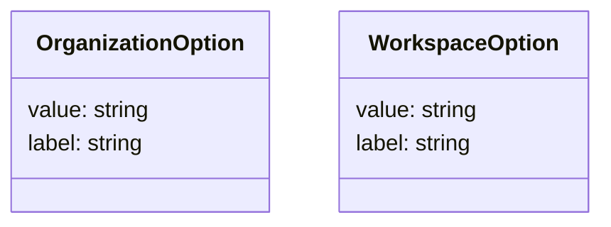

# Diagram: web/portal/src/pages/administration/report-management/types/CommonOption.types.ts

> Auto-generated by Obscura crawlers

## Mermaid

### SVG

<svg id="container" width="427.734375" xmlns="http://www.w3.org/2000/svg" class="classDiagram" height="160" viewBox="0 0 427.734375 160" role="graphics-document document" aria-roledescription="class"><g><defs><marker id="container_class-aggregationStart" class="marker aggregation class" refX="18" refY="7" markerWidth="190" markerHeight="240" orient="auto"><path d="M 18,7 L9,13 L1,7 L9,1 Z"></path></marker></defs><defs><marker id="container_class-aggregationEnd" class="marker aggregation class" refX="1" refY="7" markerWidth="20" markerHeight="28" orient="auto"><path d="M 18,7 L9,13 L1,7 L9,1 Z"></path></marker></defs><defs><marker id="container_class-extensionStart" class="marker extension class" refX="18" refY="7" markerWidth="190" markerHeight="240" orient="auto"><path d="M 1,7 L18,13 V 1 Z"></path></marker></defs><defs><marker id="container_class-extensionEnd" class="marker extension class" refX="1" refY="7" markerWidth="20" markerHeight="28" orient="auto"><path d="M 1,1 V 13 L18,7 Z"></path></marker></defs><defs><marker id="container_class-compositionStart" class="marker composition class" refX="18" refY="7" markerWidth="190" markerHeight="240" orient="auto"><path d="M 18,7 L9,13 L1,7 L9,1 Z"></path></marker></defs><defs><marker id="container_class-compositionEnd" class="marker composition class" refX="1" refY="7" markerWidth="20" markerHeight="28" orient="auto"><path d="M 18,7 L9,13 L1,7 L9,1 Z"></path></marker></defs><defs><marker id="container_class-dependencyStart" class="marker dependency class" refX="6" refY="7" markerWidth="190" markerHeight="240" orient="auto"><path d="M 5,7 L9,13 L1,7 L9,1 Z"></path></marker></defs><defs><marker id="container_class-dependencyEnd" class="marker dependency class" refX="13" refY="7" markerWidth="20" markerHeight="28" orient="auto"><path d="M 18,7 L9,13 L14,7 L9,1 Z"></path></marker></defs><defs><marker id="container_class-lollipopStart" class="marker lollipop class" refX="13" refY="7" markerWidth="190" markerHeight="240" orient="auto"><circle stroke="black" fill="transparent" cx="7" cy="7" r="6"></circle></marker></defs><defs><marker id="container_class-lollipopEnd" class="marker lollipop class" refX="1" refY="7" markerWidth="190" markerHeight="240" orient="auto"><circle stroke="black" fill="transparent" cx="7" cy="7" r="6"></circle></marker></defs><g class="root"><g class="clusters"></g><g class="edgePaths"></g><g class="edgeLabels"></g><g class="nodes"><g class="node default" id="classId-OrganizationOption-0" transform="translate(100.109375, 80)"><g class="basic label-container"><path d="M-92.109375 -72 L92.109375 -72 L92.109375 72 L-92.109375 72" stroke="none" stroke-width="0" fill="#ECECFF" style=""></path><path d="M-92.109375 -72 C-28.99028986291517 -72, 34.12879527416966 -72, 92.109375 -72 M-92.109375 -72 C-54.832790437720234 -72, -17.55620587544047 -72, 92.109375 -72 M92.109375 -72 C92.109375 -31.079044594210174, 92.109375 9.841910811579652, 92.109375 72 M92.109375 -72 C92.109375 -15.727675794510056, 92.109375 40.54464841097989, 92.109375 72 M92.109375 72 C34.19103295721086 72, -23.727309085578284 72, -92.109375 72 M92.109375 72 C25.99027857013263 72, -40.12881785973474 72, -92.109375 72 M-92.109375 72 C-92.109375 34.72856034020407, -92.109375 -2.5428793195918615, -92.109375 -72 M-92.109375 72 C-92.109375 33.46310994409171, -92.109375 -5.073780111816575, -92.109375 -72" stroke="#9370DB" stroke-width="1.3" fill="none" stroke-dasharray="0 0" style=""></path></g><g class="annotation-group text" transform="translate(0, -48)"></g><g class="label-group text" transform="translate(-71.625, -48)"><g class="label" style="font-weight: bolder" transform="translate(0,-12)"><foreignObject width="143.25" height="24">

OrganizationOption

</foreignObject></g></g><g class="members-group text" transform="translate(-80.109375, 0)"><g class="label" style="" transform="translate(0,-12)"><foreignObject width="88.59375" height="24">

value: string

</foreignObject></g><g class="label" style="" transform="translate(0,12)"><foreignObject width="86.109375" height="24">

label: string

</foreignObject></g></g><g class="methods-group text" transform="translate(-80.109375, 72)"></g><g class="divider" style=""><path d="M-92.109375 -24 C-52.734779080362486 -24, -13.360183160724972 -24, 92.109375 -24 M-92.109375 -24 C-54.48594976599075 -24, -16.862524531981506 -24, 92.109375 -24" stroke="#9370DB" stroke-width="1.3" fill="none" stroke-dasharray="0 0" style=""></path></g><g class="divider" style=""><path d="M-92.109375 48 C-52.49274315321194 48, -12.87611130642388 48, 92.109375 48 M-92.109375 48 C-24.034232771807424 48, 44.04090945638515 48, 92.109375 48" stroke="#9370DB" stroke-width="1.3" fill="none" stroke-dasharray="0 0" style=""></path></g></g><g class="node default" id="classId-WorkspaceOption-1" transform="translate(330.9765625, 80)"><g class="basic label-container"><path d="M-88.7578125 -72 L88.7578125 -72 L88.7578125 72 L-88.7578125 72" stroke="none" stroke-width="0" fill="#ECECFF" style=""></path><path d="M-88.7578125 -72 C-44.870176980261476 -72, -0.9825414605229525 -72, 88.7578125 -72 M-88.7578125 -72 C-46.4915746859718 -72, -4.225336871943597 -72, 88.7578125 -72 M88.7578125 -72 C88.7578125 -32.61348768555055, 88.7578125 6.773024628898895, 88.7578125 72 M88.7578125 -72 C88.7578125 -17.99299127381167, 88.7578125 36.01401745237666, 88.7578125 72 M88.7578125 72 C39.7787029390329 72, -9.200406621934206 72, -88.7578125 72 M88.7578125 72 C21.122466483967855 72, -46.51287953206429 72, -88.7578125 72 M-88.7578125 72 C-88.7578125 26.450732920519407, -88.7578125 -19.098534158961186, -88.7578125 -72 M-88.7578125 72 C-88.7578125 31.484083278427477, -88.7578125 -9.031833443145047, -88.7578125 -72" stroke="#9370DB" stroke-width="1.3" fill="none" stroke-dasharray="0 0" style=""></path></g><g class="annotation-group text" transform="translate(0, -48)"></g><g class="label-group text" transform="translate(-64.921875, -48)"><g class="label" style="font-weight: bolder" transform="translate(0,-12)"><foreignObject width="129.84375" height="24">

WorkspaceOption

</foreignObject></g></g><g class="members-group text" transform="translate(-76.7578125, 0)"><g class="label" style="" transform="translate(0,-12)"><foreignObject width="88.59375" height="24">

value: string

</foreignObject></g><g class="label" style="" transform="translate(0,12)"><foreignObject width="86.109375" height="24">

label: string

</foreignObject></g></g><g class="methods-group text" transform="translate(-76.7578125, 72)"></g><g class="divider" style=""><path d="M-88.7578125 -24 C-33.76475118413234 -24, 21.228310131735327 -24, 88.7578125 -24 M-88.7578125 -24 C-31.33284728871405 -24, 26.0921179225719 -24, 88.7578125 -24" stroke="#9370DB" stroke-width="1.3" fill="none" stroke-dasharray="0 0" style=""></path></g><g class="divider" style=""><path d="M-88.7578125 48 C-19.359656304710867 48, 50.038499890578265 48, 88.7578125 48 M-88.7578125 48 C-43.367922710587024 48, 2.021967078825952 48, 88.7578125 48" stroke="#9370DB" stroke-width="1.3" fill="none" stroke-dasharray="0 0" style=""></path></g></g></g></g></g></svg>
