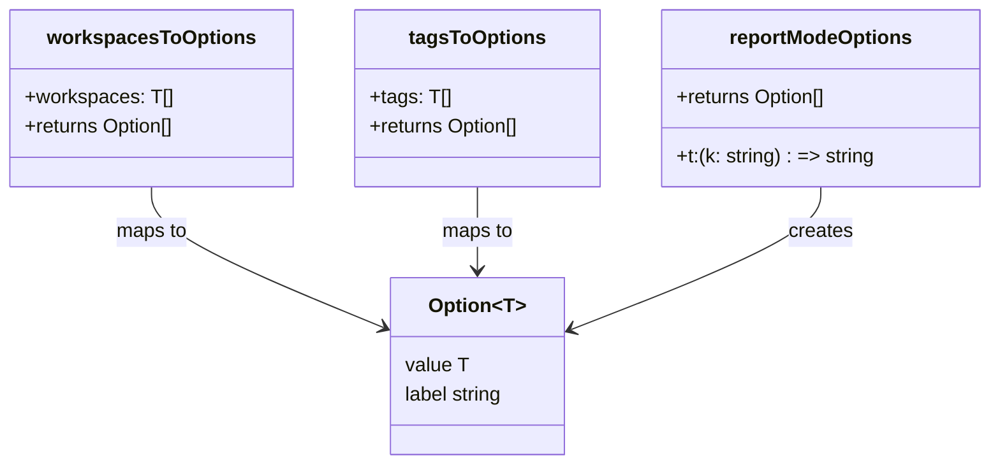

# Diagram: web/portal/src/pages/administration/report-management/utils/ReportManagement.options.utils.ts

> Auto-generated by Obscura crawlers

## Mermaid

### SVG

<svg id="container" width="802.8671875" xmlns="http://www.w3.org/2000/svg" class="classDiagram" height="378" viewBox="0 0 802.8671875 378" role="graphics-document document" aria-roledescription="class"><g><defs><marker id="container_class-aggregationStart" class="marker aggregation class" refX="18" refY="7" markerWidth="190" markerHeight="240" orient="auto"><path d="M 18,7 L9,13 L1,7 L9,1 Z"></path></marker></defs><defs><marker id="container_class-aggregationEnd" class="marker aggregation class" refX="1" refY="7" markerWidth="20" markerHeight="28" orient="auto"><path d="M 18,7 L9,13 L1,7 L9,1 Z"></path></marker></defs><defs><marker id="container_class-extensionStart" class="marker extension class" refX="18" refY="7" markerWidth="190" markerHeight="240" orient="auto"><path d="M 1,7 L18,13 V 1 Z"></path></marker></defs><defs><marker id="container_class-extensionEnd" class="marker extension class" refX="1" refY="7" markerWidth="20" markerHeight="28" orient="auto"><path d="M 1,1 V 13 L18,7 Z"></path></marker></defs><defs><marker id="container_class-compositionStart" class="marker composition class" refX="18" refY="7" markerWidth="190" markerHeight="240" orient="auto"><path d="M 18,7 L9,13 L1,7 L9,1 Z"></path></marker></defs><defs><marker id="container_class-compositionEnd" class="marker composition class" refX="1" refY="7" markerWidth="20" markerHeight="28" orient="auto"><path d="M 18,7 L9,13 L1,7 L9,1 Z"></path></marker></defs><defs><marker id="container_class-dependencyStart" class="marker dependency class" refX="6" refY="7" markerWidth="190" markerHeight="240" orient="auto"><path d="M 5,7 L9,13 L1,7 L9,1 Z"></path></marker></defs><defs><marker id="container_class-dependencyEnd" class="marker dependency class" refX="13" refY="7" markerWidth="20" markerHeight="28" orient="auto"><path d="M 18,7 L9,13 L14,7 L9,1 Z"></path></marker></defs><defs><marker id="container_class-lollipopStart" class="marker lollipop class" refX="13" refY="7" markerWidth="190" markerHeight="240" orient="auto"><circle stroke="black" fill="transparent" cx="7" cy="7" r="6"></circle></marker></defs><defs><marker id="container_class-lollipopEnd" class="marker lollipop class" refX="1" refY="7" markerWidth="190" markerHeight="240" orient="auto"><circle stroke="black" fill="transparent" cx="7" cy="7" r="6"></circle></marker></defs><g class="root"><g class="clusters"></g><g class="edgePaths"><path d="M122.57,152L122.57,158.167C122.57,164.333,122.57,176.667,153.892,195.701C185.214,214.736,247.857,240.472,279.179,253.34L310.501,266.208" id="id_workspacesToOptions_Option_1" class="edge-thickness-normal edge-pattern-solid relation" style=";;;" data-edge="true" data-et="edge" data-id="id_workspacesToOptions_Option_1" data-points="W3sieCI6MTIyLjU3MDMxMjUsInkiOjE1Mn0seyJ4IjoxMjIuNTcwMzEyNSwieSI6MTg5fSx7IngiOjMxNi4wNTA3ODEyNSwieSI6MjY4LjQ4NzYyNTMyOTQyNjh9XQ==" marker-end="url(#container_class-dependencyEnd)"></path><path d="M387.887,152L387.887,158.167C387.887,164.333,387.887,176.667,387.887,188C387.887,199.333,387.887,209.667,387.887,214.833L387.887,220" id="id_tagsToOptions_Option_2" class="edge-thickness-normal edge-pattern-solid relation" style=";;;" data-edge="true" data-et="edge" data-id="id_tagsToOptions_Option_2" data-points="W3sieCI6Mzg3Ljg4NjcxODc1LCJ5IjoxNTJ9LHsieCI6Mzg3Ljg4NjcxODc1LCJ5IjoxODl9LHsieCI6Mzg3Ljg4NjcxODc1LCJ5IjoyMjZ9XQ==" marker-end="url(#container_class-dependencyEnd)"></path><path d="M666.75,152L666.75,158.167C666.75,164.333,666.75,176.667,633.177,195.956C599.604,215.246,532.457,241.491,498.884,254.614L465.311,267.737" id="id_reportModeOptions_Option_3" class="edge-thickness-normal edge-pattern-solid relation" style=";;;" data-edge="true" data-et="edge" data-id="id_reportModeOptions_Option_3" data-points="W3sieCI6NjY2Ljc1LCJ5IjoxNTJ9LHsieCI6NjY2Ljc1LCJ5IjoxODl9LHsieCI6NDU5LjcyMjY1NjI1LCJ5IjoyNjkuOTIxMzA0NDAyNjM5MDd9XQ==" marker-end="url(#container_class-dependencyEnd)"></path></g><g class="edgeLabels"><g class="edgeLabel" transform="translate(122.5703125, 189)"><g class="label" data-id="id_workspacesToOptions_Option_1" transform="translate(-29.2578125, -12)"><foreignObject width="58.515625" height="24">

maps to

</foreignObject></g></g><g class="edgeLabel" transform="translate(387.88671875, 189)"><g class="label" data-id="id_tagsToOptions_Option_2" transform="translate(-29.2578125, -12)"><foreignObject width="58.515625" height="24">

maps to

</foreignObject></g></g><g class="edgeLabel" transform="translate(666.75, 189)"><g class="label" data-id="id_reportModeOptions_Option_3" transform="translate(-26.171875, -12)"><foreignObject width="52.34375" height="24">

creates

</foreignObject></g></g></g><g class="nodes"><g class="node default" id="classId-Option-0" transform="translate(387.88671875, 298)"><g class="basic label-container"><path d="M-71.8359375 -72 L71.8359375 -72 L71.8359375 72 L-71.8359375 72" stroke="none" stroke-width="0" fill="#ECECFF" style=""></path><path d="M-71.8359375 -72 C-40.98412806669616 -72, -10.132318633392309 -72, 71.8359375 -72 M-71.8359375 -72 C-14.408935286725857 -72, 43.018066926548286 -72, 71.8359375 -72 M71.8359375 -72 C71.8359375 -15.459970276073406, 71.8359375 41.08005944785319, 71.8359375 72 M71.8359375 -72 C71.8359375 -30.88195336366681, 71.8359375 10.23609327266638, 71.8359375 72 M71.8359375 72 C21.296240274988158 72, -29.243456950023685 72, -71.8359375 72 M71.8359375 72 C36.44572630962449 72, 1.0555151192489802 72, -71.8359375 72 M-71.8359375 72 C-71.8359375 38.8943716927041, -71.8359375 5.788743385408196, -71.8359375 -72 M-71.8359375 72 C-71.8359375 18.676679698559283, -71.8359375 -34.64664060288143, -71.8359375 -72" stroke="#9370DB" stroke-width="1.3" fill="none" stroke-dasharray="0 0" style=""></path></g><g class="annotation-group text" transform="translate(0, -48)"></g><g class="label-group text" transform="translate(-37.5625, -48)"><g class="label" style="font-weight: bolder" transform="translate(0,-12)"><foreignObject width="75.125" height="24">

Option&lt;T&gt;

</foreignObject></g></g><g class="members-group text" transform="translate(-59.8359375, 0)"><g class="label" style="" transform="translate(0,-12)"><foreignObject width="51.40625" height="24">

value T

</foreignObject></g><g class="label" style="" transform="translate(0,12)"><foreignObject width="82.109375" height="24">

label string

</foreignObject></g></g><g class="methods-group text" transform="translate(-59.8359375, 72)"></g><g class="divider" style=""><path d="M-71.8359375 -24 C-14.793910079505189 -24, 42.24811734098962 -24, 71.8359375 -24 M-71.8359375 -24 C-37.51999070987309 -24, -3.2040439197461836 -24, 71.8359375 -24" stroke="#9370DB" stroke-width="1.3" fill="none" stroke-dasharray="0 0" style=""></path></g><g class="divider" style=""><path d="M-71.8359375 48 C-30.770633491047462 48, 10.294670517905075 48, 71.8359375 48 M-71.8359375 48 C-22.508529881720882 48, 26.818877736558235 48, 71.8359375 48" stroke="#9370DB" stroke-width="1.3" fill="none" stroke-dasharray="0 0" style=""></path></g></g><g class="node default" id="classId-workspacesToOptions-1" transform="translate(122.5703125, 80)"><g class="basic label-container"><path d="M-114.5703125 -72 L114.5703125 -72 L114.5703125 72 L-114.5703125 72" stroke="none" stroke-width="0" fill="#ECECFF" style=""></path><path d="M-114.5703125 -72 C-37.99351473741437 -72, 38.583283025171255 -72, 114.5703125 -72 M-114.5703125 -72 C-61.57297993772058 -72, -8.575647375441164 -72, 114.5703125 -72 M114.5703125 -72 C114.5703125 -34.64015377490045, 114.5703125 2.719692450199105, 114.5703125 72 M114.5703125 -72 C114.5703125 -16.39545917175674, 114.5703125 39.20908165648652, 114.5703125 72 M114.5703125 72 C53.803055726572865 72, -6.964201046854271 72, -114.5703125 72 M114.5703125 72 C45.04298793251836 72, -24.484336634963284 72, -114.5703125 72 M-114.5703125 72 C-114.5703125 37.74313162339222, -114.5703125 3.4862632467844463, -114.5703125 -72 M-114.5703125 72 C-114.5703125 16.87231831117407, -114.5703125 -38.25536337765186, -114.5703125 -72" stroke="#9370DB" stroke-width="1.3" fill="none" stroke-dasharray="0 0" style=""></path></g><g class="annotation-group text" transform="translate(0, -48)"></g><g class="label-group text" transform="translate(-80.5, -48)"><g class="label" style="font-weight: bolder" transform="translate(0,-12)"><foreignObject width="161" height="24">

workspacesToOptions

</foreignObject></g></g><g class="members-group text" transform="translate(-102.5703125, 0)"><g class="label" style="" transform="translate(0,-12)"><foreignObject width="118.796875" height="24">

+workspaces: T[]

</foreignObject></g><g class="label" style="" transform="translate(0,12)"><foreignObject width="124.640625" height="24">

+returns Option[]

</foreignObject></g></g><g class="methods-group text" transform="translate(-102.5703125, 72)"></g><g class="divider" style=""><path d="M-114.5703125 -24 C-58.64504871664341 -24, -2.7197849332868174 -24, 114.5703125 -24 M-114.5703125 -24 C-34.01419695072957 -24, 46.54191859854086 -24, 114.5703125 -24" stroke="#9370DB" stroke-width="1.3" fill="none" stroke-dasharray="0 0" style=""></path></g><g class="divider" style=""><path d="M-114.5703125 48 C-65.57594855932831 48, -16.581584618656635 48, 114.5703125 48 M-114.5703125 48 C-23.390270628167826 48, 67.78977124366435 48, 114.5703125 48" stroke="#9370DB" stroke-width="1.3" fill="none" stroke-dasharray="0 0" style=""></path></g></g><g class="node default" id="classId-tagsToOptions-2" transform="translate(387.88671875, 80)"><g class="basic label-container"><path d="M-100.74609375 -72 L100.74609375 -72 L100.74609375 72 L-100.74609375 72" stroke="none" stroke-width="0" fill="#ECECFF" style=""></path><path d="M-100.74609375 -72 C-54.4347368527526 -72, -8.1233799555052 -72, 100.74609375 -72 M-100.74609375 -72 C-51.16418557518215 -72, -1.5822774003643048 -72, 100.74609375 -72 M100.74609375 -72 C100.74609375 -22.627199586514614, 100.74609375 26.745600826970772, 100.74609375 72 M100.74609375 -72 C100.74609375 -19.944205794852067, 100.74609375 32.111588410295866, 100.74609375 72 M100.74609375 72 C53.29027394111694 72, 5.834454132233887 72, -100.74609375 72 M100.74609375 72 C38.753090419658676 72, -23.239912910682648 72, -100.74609375 72 M-100.74609375 72 C-100.74609375 19.377077345430415, -100.74609375 -33.24584530913917, -100.74609375 -72 M-100.74609375 72 C-100.74609375 17.25224477419657, -100.74609375 -37.49551045160686, -100.74609375 -72" stroke="#9370DB" stroke-width="1.3" fill="none" stroke-dasharray="0 0" style=""></path></g><g class="annotation-group text" transform="translate(0, -48)"></g><g class="label-group text" transform="translate(-52.8515625, -48)"><g class="label" style="font-weight: bolder" transform="translate(0,-12)"><foreignObject width="105.703125" height="24">

tagsToOptions

</foreignObject></g></g><g class="members-group text" transform="translate(-88.74609375, 0)"><g class="label" style="" transform="translate(0,-12)"><foreignObject width="64.453125" height="24">

+tags: T[]

</foreignObject></g><g class="label" style="" transform="translate(0,12)"><foreignObject width="124.640625" height="24">

+returns Option[]

</foreignObject></g></g><g class="methods-group text" transform="translate(-88.74609375, 72)"></g><g class="divider" style=""><path d="M-100.74609375 -24 C-40.07508643552265 -24, 20.5959208789547 -24, 100.74609375 -24 M-100.74609375 -24 C-57.38224048908458 -24, -14.01838722816916 -24, 100.74609375 -24" stroke="#9370DB" stroke-width="1.3" fill="none" stroke-dasharray="0 0" style=""></path></g><g class="divider" style=""><path d="M-100.74609375 48 C-56.71806045681561 48, -12.690027163631214 48, 100.74609375 48 M-100.74609375 48 C-26.07911311160474 48, 48.58786752679052 48, 100.74609375 48" stroke="#9370DB" stroke-width="1.3" fill="none" stroke-dasharray="0 0" style=""></path></g></g><g class="node default" id="classId-reportModeOptions-3" transform="translate(666.75, 80)"><g class="basic label-container"><path d="M-128.1171875 -72 L128.1171875 -72 L128.1171875 72 L-128.1171875 72" stroke="none" stroke-width="0" fill="#ECECFF" style=""></path><path d="M-128.1171875 -72 C-60.87121755042871 -72, 6.374752399142579 -72, 128.1171875 -72 M-128.1171875 -72 C-62.01237609203824 -72, 4.092435315923524 -72, 128.1171875 -72 M128.1171875 -72 C128.1171875 -27.881161247475667, 128.1171875 16.237677505048666, 128.1171875 72 M128.1171875 -72 C128.1171875 -17.921763270405258, 128.1171875 36.156473459189485, 128.1171875 72 M128.1171875 72 C52.87148155007581 72, -22.374224399848373 72, -128.1171875 72 M128.1171875 72 C52.339301125804795 72, -23.43858524839041 72, -128.1171875 72 M-128.1171875 72 C-128.1171875 22.082916094576206, -128.1171875 -27.83416781084759, -128.1171875 -72 M-128.1171875 72 C-128.1171875 41.70980382998657, -128.1171875 11.419607659973138, -128.1171875 -72" stroke="#9370DB" stroke-width="1.3" fill="none" stroke-dasharray="0 0" style=""></path></g><g class="annotation-group text" transform="translate(0, -48)"></g><g class="label-group text" transform="translate(-72.109375, -48)"><g class="label" style="font-weight: bolder" transform="translate(0,-12)"><foreignObject width="144.21875" height="24">

reportModeOptions

</foreignObject></g></g><g class="members-group text" transform="translate(-116.1171875, 0)"><g class="label" style="" transform="translate(0,-12)"><foreignObject width="124.640625" height="24">

+returns Option[]

</foreignObject></g></g><g class="methods-group text" transform="translate(-116.1171875, 48)"><g class="label" style="" transform="translate(0,-12)"><foreignObject width="160.125" height="24">

+t:(k: string) : =&gt; string

</foreignObject></g></g><g class="divider" style=""><path d="M-128.1171875 -24 C-29.71174365225187 -24, 68.69370019549626 -24, 128.1171875 -24 M-128.1171875 -24 C-62.66051980261088 -24, 2.796147894778244 -24, 128.1171875 -24" stroke="#9370DB" stroke-width="1.3" fill="none" stroke-dasharray="0 0" style=""></path></g><g class="divider" style=""><path d="M-128.1171875 24 C-55.96061961544427 24, 16.195948269111454 24, 128.1171875 24 M-128.1171875 24 C-49.73480576811323 24, 28.647575963773534 24, 128.1171875 24" stroke="#9370DB" stroke-width="1.3" fill="none" stroke-dasharray="0 0" style=""></path></g></g></g></g></g></svg>
