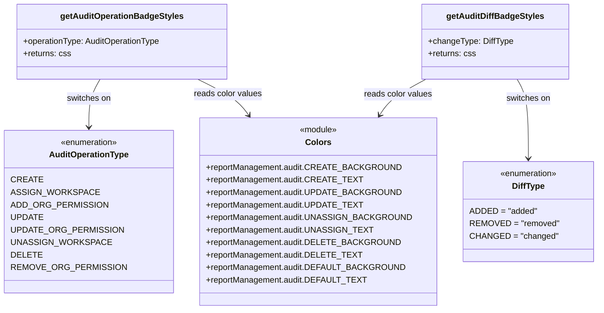

# Diagram: web/portal/src/pages/administration/report-management/utils/auditBadgeStyles.ts

> Auto-generated by Obscura crawlers

## Mermaid

```mermaid
classDiagram
class DiffType <<enumeration>> {
  ADDED = "added"
  REMOVED = "removed"
  CHANGED = "changed"
}
class AuditOperationType <<enumeration>> {
  CREATE
  ASSIGN_WORKSPACE
  ADD_ORG_PERMISSION
  UPDATE
  UPDATE_ORG_PERMISSION
  UNASSIGN_WORKSPACE
  DELETE
  REMOVE_ORG_PERMISSION
}
class Colors <<module>> {
  +reportManagement.audit.CREATE_BACKGROUND
  +reportManagement.audit.CREATE_TEXT
  +reportManagement.audit.UPDATE_BACKGROUND
  +reportManagement.audit.UPDATE_TEXT
  +reportManagement.audit.UNASSIGN_BACKGROUND
  +reportManagement.audit.UNASSIGN_TEXT
  +reportManagement.audit.DELETE_BACKGROUND
  +reportManagement.audit.DELETE_TEXT
  +reportManagement.audit.DEFAULT_BACKGROUND
  +reportManagement.audit.DEFAULT_TEXT
}
class getAuditOperationBadgeStyles {
  +operationType: AuditOperationType
  +returns: css
}
class getAuditDiffBadgeStyles {
  +changeType: DiffType
  +returns: css
}
getAuditOperationBadgeStyles --> AuditOperationType : switches on
getAuditOperationBadgeStyles --> Colors : reads color values
getAuditDiffBadgeStyles --> DiffType : switches on
getAuditDiffBadgeStyles --> Colors : reads color values
```

> SVG rendering failed for this diagram.
