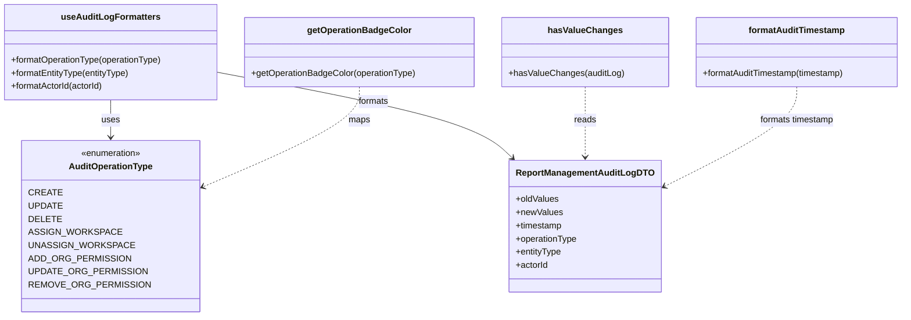
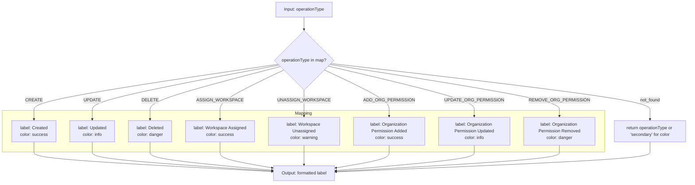
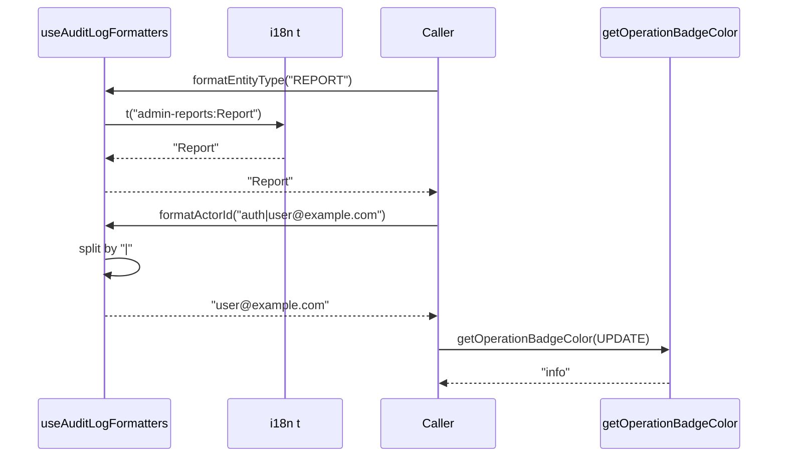
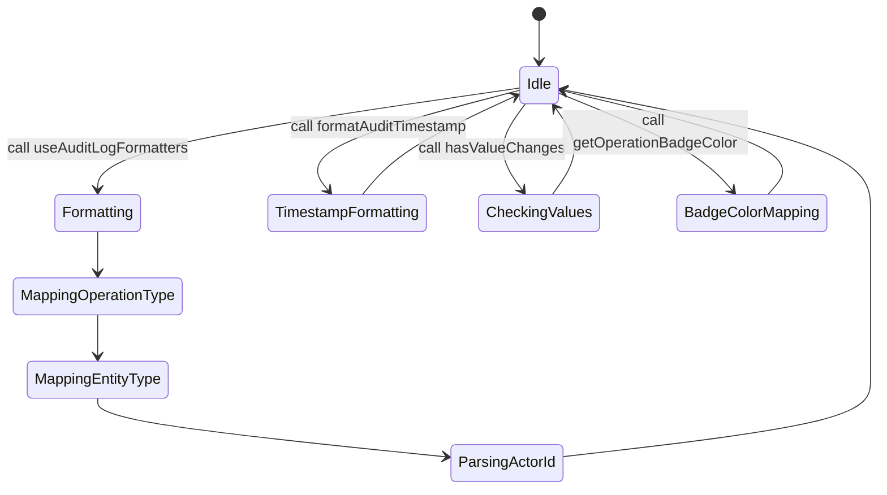
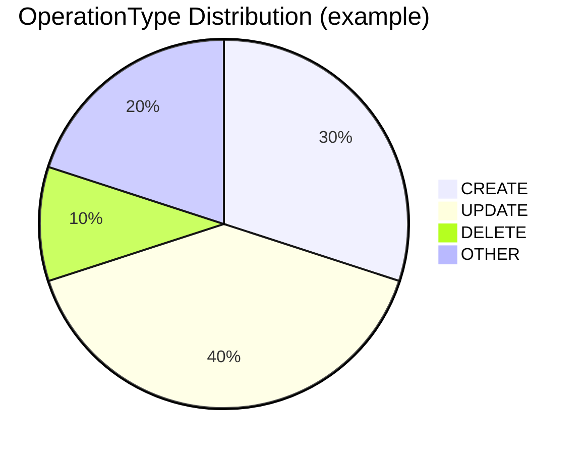

# Diagram: web/portal/src/pages/administration/report-management/utils/auditLogFormatters.ts

> Auto-generated by Obscura crawlers

## Diagram 1

### SVG

<svg id="container" width="1635.4453125" xmlns="http://www.w3.org/2000/svg" class="classDiagram" height="576" viewBox="0 0 1635.4453125 576" role="graphics-document document" aria-roledescription="class"><g><defs><marker id="container_class-aggregationStart" class="marker aggregation class" refX="18" refY="7" markerWidth="190" markerHeight="240" orient="auto"><path d="M 18,7 L9,13 L1,7 L9,1 Z"></path></marker></defs><defs><marker id="container_class-aggregationEnd" class="marker aggregation class" refX="1" refY="7" markerWidth="20" markerHeight="28" orient="auto"><path d="M 18,7 L9,13 L1,7 L9,1 Z"></path></marker></defs><defs><marker id="container_class-extensionStart" class="marker extension class" refX="18" refY="7" markerWidth="190" markerHeight="240" orient="auto"><path d="M 1,7 L18,13 V 1 Z"></path></marker></defs><defs><marker id="container_class-extensionEnd" class="marker extension class" refX="1" refY="7" markerWidth="20" markerHeight="28" orient="auto"><path d="M 1,1 V 13 L18,7 Z"></path></marker></defs><defs><marker id="container_class-compositionStart" class="marker composition class" refX="18" refY="7" markerWidth="190" markerHeight="240" orient="auto"><path d="M 18,7 L9,13 L1,7 L9,1 Z"></path></marker></defs><defs><marker id="container_class-compositionEnd" class="marker composition class" refX="1" refY="7" markerWidth="20" markerHeight="28" orient="auto"><path d="M 18,7 L9,13 L1,7 L9,1 Z"></path></marker></defs><defs><marker id="container_class-dependencyStart" class="marker dependency class" refX="6" refY="7" markerWidth="190" markerHeight="240" orient="auto"><path d="M 5,7 L9,13 L1,7 L9,1 Z"></path></marker></defs><defs><marker id="container_class-dependencyEnd" class="marker dependency class" refX="13" refY="7" markerWidth="20" markerHeight="28" orient="auto"><path d="M 18,7 L9,13 L14,7 L9,1 Z"></path></marker></defs><defs><marker id="container_class-lollipopStart" class="marker lollipop class" refX="13" refY="7" markerWidth="190" markerHeight="240" orient="auto"><circle stroke="black" fill="transparent" cx="7" cy="7" r="6"></circle></marker></defs><defs><marker id="container_class-lollipopEnd" class="marker lollipop class" refX="1" refY="7" markerWidth="190" markerHeight="240" orient="auto"><circle stroke="black" fill="transparent" cx="7" cy="7" r="6"></circle></marker></defs><g class="root"><g class="clusters"></g><g class="edgePaths"><path d="M201.684,182L201.684,188.167C201.684,194.333,201.684,206.667,201.684,218C201.684,229.333,201.684,239.667,201.684,244.833L201.684,250" id="id_useAuditLogFormatters_AuditOperationType_1" class="edge-thickness-normal edge-pattern-solid relation" style=";;;" data-edge="true" data-et="edge" data-id="id_useAuditLogFormatters_AuditOperationType_1" data-points="W3sieCI6MjAxLjY4MzU5Mzc1LCJ5IjoxODJ9LHsieCI6MjAxLjY4MzU5Mzc1LCJ5IjoyMTl9LHsieCI6MjAxLjY4MzU5Mzc1LCJ5IjoyNTZ9XQ==" marker-end="url(#container_class-dependencyEnd)"></path><path d="M395.367,131.736L472.047,146.28C548.727,160.824,702.087,189.912,790.815,215.933C879.543,241.954,903.639,264.908,915.687,276.385L927.735,287.862" id="id_useAuditLogFormatters_ReportManagementAuditLogDTO_2" class="edge-thickness-normal edge-pattern-solid relation" style=";;;" data-edge="true" data-et="edge" data-id="id_useAuditLogFormatters_ReportManagementAuditLogDTO_2" data-points="W3sieCI6Mzk1LjM2NzE4NzUsInkiOjEzMS43MzYxNTgxMjI4ODgyfSx7IngiOjg1NS40NDcyNjU2MjUsInkiOjIxOX0seyJ4Ijo5MzIuMDc5NjgzNDUyMDcyNiwieSI6MjkyfV0=" marker-end="url(#container_class-dependencyEnd)"></path><path d="M1058.051,158L1058.051,168.167C1058.051,178.333,1058.051,198.667,1058.051,220C1058.051,241.333,1058.051,263.667,1058.051,274.833L1058.051,286" id="id_hasValueChanges_ReportManagementAuditLogDTO_3" class="edge-thickness-normal edge-pattern-dashed relation" style=";;;" data-edge="true" data-et="edge" data-id="id_hasValueChanges_ReportManagementAuditLogDTO_3" data-points="W3sieCI6MTA1OC4wNTA3ODEyNSwieSI6MTU4fSx7IngiOjEwNTguMDUwNzgxMjUsInkiOjIxOX0seyJ4IjoxMDU4LjA1MDc4MTI1LCJ5IjoyOTJ9XQ==" marker-end="url(#container_class-dependencyEnd)"></path><path d="M653.148,158L653.148,168.167C653.148,178.333,653.148,198.667,603.141,230.211C553.133,261.756,453.118,304.512,403.111,325.891L353.103,347.269" id="id_getOperationBadgeColor_AuditOperationType_4" class="edge-thickness-normal edge-pattern-dashed relation" style=";;;" data-edge="true" data-et="edge" data-id="id_getOperationBadgeColor_AuditOperationType_4" data-points="W3sieCI6NjUzLjE0ODQzNzUsInkiOjE1OH0seyJ4Ijo2NTMuMTQ4NDM3NSwieSI6MjE5fSx7IngiOjM0Ny41ODU5Mzc1LCJ5IjozNDkuNjI3MTQyNTQ4MTI4OX1d" marker-end="url(#container_class-dependencyEnd)"></path><path d="M1441.309,158L1441.309,168.167C1441.309,178.333,1441.309,198.667,1400.163,229.553C1359.017,260.44,1276.725,301.881,1235.579,322.601L1194.433,343.321" id="id_formatAuditTimestamp_ReportManagementAuditLogDTO_5" class="edge-thickness-normal edge-pattern-dashed relation" style=";;;" data-edge="true" data-et="edge" data-id="id_formatAuditTimestamp_ReportManagementAuditLogDTO_5" data-points="W3sieCI6MTQ0MS4zMDg1OTM3NSwieSI6MTU4fSx7IngiOjE0NDEuMzA4NTkzNzUsInkiOjIxOX0seyJ4IjoxMTg5LjA3NDIxODc1LCJ5IjozNDYuMDE5NTQ4Njg4MjYwNn1d" marker-end="url(#container_class-dependencyEnd)"></path></g><g class="edgeLabels"><g class="edgeLabel" transform="translate(201.68359375, 219)"><g class="label" data-id="id_useAuditLogFormatters_AuditOperationType_1" transform="translate(-16.4921875, -12)"><foreignObject width="32.984375" height="24">

uses

</foreignObject></g></g><g class="edgeLabel" transform="translate(677.39892, 185.2294)"><g class="label" data-id="id_useAuditLogFormatters_ReportManagementAuditLogDTO_2" transform="translate(-28.1953125, -12)"><foreignObject width="56.390625" height="24">

formats

</foreignObject></g></g><g class="edgeLabel" transform="translate(1058.05078125, 219)"><g class="label" data-id="id_hasValueChanges_ReportManagementAuditLogDTO_3" transform="translate(-20.0078125, -12)"><foreignObject width="40.015625" height="24">

reads

</foreignObject></g></g><g class="edgeLabel" transform="translate(653.1484375, 219)"><g class="label" data-id="id_getOperationBadgeColor_AuditOperationType_4" transform="translate(-19.703125, -12)"><foreignObject width="39.40625" height="24">

maps

</foreignObject></g></g><g class="edgeLabel" transform="translate(1441.30859375, 219)"><g class="label" data-id="id_formatAuditTimestamp_ReportManagementAuditLogDTO_5" transform="translate(-69.203125, -12)"><foreignObject width="138.40625" height="24">

formats timestamp

</foreignObject></g></g></g><g class="nodes"><g class="node default" id="classId-useAuditLogFormatters-0" transform="translate(201.68359375, 95)"><g class="basic label-container"><path d="M-193.68359375 -87 L193.68359375 -87 L193.68359375 87 L-193.68359375 87" stroke="none" stroke-width="0" fill="#ECECFF" style=""></path><path d="M-193.68359375 -87 C-111.33822404623339 -87, -28.992854342466785 -87, 193.68359375 -87 M-193.68359375 -87 C-89.47144989574623 -87, 14.740693958507535 -87, 193.68359375 -87 M193.68359375 -87 C193.68359375 -24.37106073163841, 193.68359375 38.25787853672318, 193.68359375 87 M193.68359375 -87 C193.68359375 -43.93289340444681, 193.68359375 -0.8657868088936169, 193.68359375 87 M193.68359375 87 C72.54019921269283 87, -48.60319532461435 87, -193.68359375 87 M193.68359375 87 C60.50356197491084 87, -72.67646980017832 87, -193.68359375 87 M-193.68359375 87 C-193.68359375 25.04410906421367, -193.68359375 -36.91178187157266, -193.68359375 -87 M-193.68359375 87 C-193.68359375 22.73208670237136, -193.68359375 -41.53582659525728, -193.68359375 -87" stroke="#9370DB" stroke-width="1.3" fill="none" stroke-dasharray="0 0" style=""></path></g><g class="annotation-group text" transform="translate(0, -63)"></g><g class="label-group text" transform="translate(-85.3515625, -63)"><g class="label" style="font-weight: bolder" transform="translate(0,-12)"><foreignObject width="170.703125" height="24">

useAuditLogFormatters

</foreignObject></g></g><g class="members-group text" transform="translate(-181.68359375, -15)"></g><g class="methods-group text" transform="translate(-181.68359375, 15)"><g class="label" style="" transform="translate(0,-12)"><foreignObject width="278.015625" height="24">

+formatOperationType(operationType)

</foreignObject></g><g class="label" style="" transform="translate(0,12)"><foreignObject width="218.078125" height="24">

+formatEntityType(entityType)

</foreignObject></g><g class="label" style="" transform="translate(0,36)"><foreignObject width="170.890625" height="24">

+formatActorId(actorId)

</foreignObject></g></g><g class="divider" style=""><path d="M-193.68359375 -39 C-61.932741614757106 -39, 69.81811052048579 -39, 193.68359375 -39 M-193.68359375 -39 C-113.9090482496422 -39, -34.134502749284394 -39, 193.68359375 -39" stroke="#9370DB" stroke-width="1.3" fill="none" stroke-dasharray="0 0" style=""></path></g><g class="divider" style=""><path d="M-193.68359375 -15 C-44.120253950489456 -15, 105.44308584902109 -15, 193.68359375 -15 M-193.68359375 -15 C-74.4963695894511 -15, 44.69085457109779 -15, 193.68359375 -15" stroke="#9370DB" stroke-width="1.3" fill="none" stroke-dasharray="0 0" style=""></path></g></g><g class="node default" id="classId-formatAuditTimestamp-1" transform="translate(1441.30859375, 95)"><g class="basic label-container"><path d="M-186.13671875 -63 L186.13671875 -63 L186.13671875 63 L-186.13671875 63" stroke="none" stroke-width="0" fill="#ECECFF" style=""></path><path d="M-186.13671875 -63 C-51.64009290566091 -63, 82.85653293867819 -63, 186.13671875 -63 M-186.13671875 -63 C-84.60520598764569 -63, 16.92630677470862 -63, 186.13671875 -63 M186.13671875 -63 C186.13671875 -21.759419736873724, 186.13671875 19.481160526252552, 186.13671875 63 M186.13671875 -63 C186.13671875 -33.653677415715165, 186.13671875 -4.307354831430324, 186.13671875 63 M186.13671875 63 C71.55199714887874 63, -43.03272445224252 63, -186.13671875 63 M186.13671875 63 C103.69218641745245 63, 21.247654084904894 63, -186.13671875 63 M-186.13671875 63 C-186.13671875 27.111699173823382, -186.13671875 -8.776601652353236, -186.13671875 -63 M-186.13671875 63 C-186.13671875 26.229629760226935, -186.13671875 -10.54074047954613, -186.13671875 -63" stroke="#9370DB" stroke-width="1.3" fill="none" stroke-dasharray="0 0" style=""></path></g><g class="annotation-group text" transform="translate(0, -39)"></g><g class="label-group text" transform="translate(-84.8515625, -39)"><g class="label" style="font-weight: bolder" transform="translate(0,-12)"><foreignObject width="169.703125" height="24">

formatAuditTimestamp

</foreignObject></g></g><g class="members-group text" transform="translate(-174.13671875, 9)"></g><g class="methods-group text" transform="translate(-174.13671875, 39)"><g class="label" style="" transform="translate(0,-12)"><foreignObject width="263.421875" height="24">

+formatAuditTimestamp(timestamp)

</foreignObject></g></g><g class="divider" style=""><path d="M-186.13671875 -15 C-54.88065924480392 -15, 76.37540026039215 -15, 186.13671875 -15 M-186.13671875 -15 C-82.26112233091476 -15, 21.614474088170482 -15, 186.13671875 -15" stroke="#9370DB" stroke-width="1.3" fill="none" stroke-dasharray="0 0" style=""></path></g><g class="divider" style=""><path d="M-186.13671875 9 C-98.15805517850202 9, -10.17939160700405 9, 186.13671875 9 M-186.13671875 9 C-95.72337489895955 9, -5.310031047919097 9, 186.13671875 9" stroke="#9370DB" stroke-width="1.3" fill="none" stroke-dasharray="0 0" style=""></path></g></g><g class="node default" id="classId-hasValueChanges-2" transform="translate(1058.05078125, 95)"><g class="basic label-container"><path d="M-147.12109375 -63 L147.12109375 -63 L147.12109375 63 L-147.12109375 63" stroke="none" stroke-width="0" fill="#ECECFF" style=""></path><path d="M-147.12109375 -63 C-51.52676319447622 -63, 44.067567361047566 -63, 147.12109375 -63 M-147.12109375 -63 C-39.98359540777025 -63, 67.1539029344595 -63, 147.12109375 -63 M147.12109375 -63 C147.12109375 -23.600128296311162, 147.12109375 15.799743407377676, 147.12109375 63 M147.12109375 -63 C147.12109375 -23.964015515643617, 147.12109375 15.071968968712767, 147.12109375 63 M147.12109375 63 C84.77186205514593 63, 22.422630360291848 63, -147.12109375 63 M147.12109375 63 C70.5400629374923 63, -6.040967875015411 63, -147.12109375 63 M-147.12109375 63 C-147.12109375 13.087622062223502, -147.12109375 -36.824755875552995, -147.12109375 -63 M-147.12109375 63 C-147.12109375 33.67093963080184, -147.12109375 4.34187926160368, -147.12109375 -63" stroke="#9370DB" stroke-width="1.3" fill="none" stroke-dasharray="0 0" style=""></path></g><g class="annotation-group text" transform="translate(0, -39)"></g><g class="label-group text" transform="translate(-63.3515625, -39)"><g class="label" style="font-weight: bolder" transform="translate(0,-12)"><foreignObject width="126.703125" height="24">

hasValueChanges

</foreignObject></g></g><g class="members-group text" transform="translate(-135.12109375, 9)"></g><g class="methods-group text" transform="translate(-135.12109375, 39)"><g class="label" style="" transform="translate(0,-12)"><foreignObject width="206.890625" height="24">

+hasValueChanges(auditLog)

</foreignObject></g></g><g class="divider" style=""><path d="M-147.12109375 -15 C-35.58534470117495 -15, 75.9504043476501 -15, 147.12109375 -15 M-147.12109375 -15 C-68.44570652883306 -15, 10.229680692333886 -15, 147.12109375 -15" stroke="#9370DB" stroke-width="1.3" fill="none" stroke-dasharray="0 0" style=""></path></g><g class="divider" style=""><path d="M-147.12109375 9 C-49.40443435114831 9, 48.31222504770338 9, 147.12109375 9 M-147.12109375 9 C-84.42048534495272 9, -21.719876939905447 9, 147.12109375 9" stroke="#9370DB" stroke-width="1.3" fill="none" stroke-dasharray="0 0" style=""></path></g></g><g class="node default" id="classId-getOperationBadgeColor-3" transform="translate(653.1484375, 95)"><g class="basic label-container"><path d="M-207.78125 -63 L207.78125 -63 L207.78125 63 L-207.78125 63" stroke="none" stroke-width="0" fill="#ECECFF" style=""></path><path d="M-207.78125 -63 C-107.88632006452646 -63, -7.991390129052917 -63, 207.78125 -63 M-207.78125 -63 C-91.79767546048258 -63, 24.18589907903484 -63, 207.78125 -63 M207.78125 -63 C207.78125 -34.24641061577278, 207.78125 -5.4928212315455625, 207.78125 63 M207.78125 -63 C207.78125 -17.963770969857563, 207.78125 27.072458060284873, 207.78125 63 M207.78125 63 C123.77132264243187 63, 39.76139528486374 63, -207.78125 63 M207.78125 63 C92.92456345343564 63, -21.932123093128723 63, -207.78125 63 M-207.78125 63 C-207.78125 15.642565209836668, -207.78125 -31.714869580326663, -207.78125 -63 M-207.78125 63 C-207.78125 32.02110661041099, -207.78125 1.0422132208219779, -207.78125 -63" stroke="#9370DB" stroke-width="1.3" fill="none" stroke-dasharray="0 0" style=""></path></g><g class="annotation-group text" transform="translate(0, -39)"></g><g class="label-group text" transform="translate(-90.5, -39)"><g class="label" style="font-weight: bolder" transform="translate(0,-12)"><foreignObject width="181" height="24">

getOperationBadgeColor

</foreignObject></g></g><g class="members-group text" transform="translate(-195.78125, 9)"></g><g class="methods-group text" transform="translate(-195.78125, 39)"><g class="label" style="" transform="translate(0,-12)"><foreignObject width="301.0625" height="24">

+getOperationBadgeColor(operationType)

</foreignObject></g></g><g class="divider" style=""><path d="M-207.78125 -15 C-95.15590254437724 -15, 17.469444911245517 -15, 207.78125 -15 M-207.78125 -15 C-110.86620337870946 -15, -13.951156757418914 -15, 207.78125 -15" stroke="#9370DB" stroke-width="1.3" fill="none" stroke-dasharray="0 0" style=""></path></g><g class="divider" style=""><path d="M-207.78125 9 C-65.45085167132416 9, 76.87954665735168 9, 207.78125 9 M-207.78125 9 C-99.97419868561312 9, 7.8328526287737645 9, 207.78125 9" stroke="#9370DB" stroke-width="1.3" fill="none" stroke-dasharray="0 0" style=""></path></g></g><g class="node default" id="classId-ReportManagementAuditLogDTO-4" transform="translate(1058.05078125, 412)"><g class="basic label-container"><path d="M-131.0234375 -120 L131.0234375 -120 L131.0234375 120 L-131.0234375 120" stroke="none" stroke-width="0" fill="#ECECFF" style=""></path><path d="M-131.0234375 -120 C-57.07743190672147 -120, 16.868573686557056 -120, 131.0234375 -120 M-131.0234375 -120 C-72.97717082873321 -120, -14.930904157466415 -120, 131.0234375 -120 M131.0234375 -120 C131.0234375 -49.01506621303972, 131.0234375 21.969867573920567, 131.0234375 120 M131.0234375 -120 C131.0234375 -45.64400511012647, 131.0234375 28.711989779747057, 131.0234375 120 M131.0234375 120 C44.108798687919005 120, -42.80584012416199 120, -131.0234375 120 M131.0234375 120 C73.00991088068972 120, 14.996384261379418 120, -131.0234375 120 M-131.0234375 120 C-131.0234375 69.60643487400634, -131.0234375 19.212869748012665, -131.0234375 -120 M-131.0234375 120 C-131.0234375 59.11359934347799, -131.0234375 -1.7728013130440132, -131.0234375 -120" stroke="#9370DB" stroke-width="1.3" fill="none" stroke-dasharray="0 0" style=""></path></g><g class="annotation-group text" transform="translate(0, -96)"></g><g class="label-group text" transform="translate(-119.0234375, -96)"><g class="label" style="font-weight: bolder" transform="translate(0,-12)"><foreignObject width="238.046875" height="24">

ReportManagementAuditLogDTO

</foreignObject></g></g><g class="members-group text" transform="translate(-119.0234375, -48)"><g class="label" style="" transform="translate(0,-12)"><foreignObject width="78.5" height="24">

+oldValues

</foreignObject></g><g class="label" style="" transform="translate(0,12)"><foreignObject width="84.546875" height="24">

+newValues

</foreignObject></g><g class="label" style="" transform="translate(0,36)"><foreignObject width="85.6875" height="24">

+timestamp

</foreignObject></g><g class="label" style="" transform="translate(0,60)"><foreignObject width="112.609375" height="24">

+operationType

</foreignObject></g><g class="label" style="" transform="translate(0,84)"><foreignObject width="83.671875" height="24">

+entityType

</foreignObject></g><g class="label" style="" transform="translate(0,108)"><foreignObject width="59.453125" height="24">

+actorId

</foreignObject></g></g><g class="methods-group text" transform="translate(-119.0234375, 120)"></g><g class="divider" style=""><path d="M-131.0234375 -72 C-30.11771211835324 -72, 70.78801326329352 -72, 131.0234375 -72 M-131.0234375 -72 C-49.62778019064167 -72, 31.767877118716655 -72, 131.0234375 -72" stroke="#9370DB" stroke-width="1.3" fill="none" stroke-dasharray="0 0" style=""></path></g><g class="divider" style=""><path d="M-131.0234375 96 C-73.78243686908709 96, -16.541436238174185 96, 131.0234375 96 M-131.0234375 96 C-48.2423583841327 96, 34.5387207317346 96, 131.0234375 96" stroke="#9370DB" stroke-width="1.3" fill="none" stroke-dasharray="0 0" style=""></path></g></g><g class="node default" id="classId-AuditOperationType-5" transform="translate(201.68359375, 412)"><g class="basic label-container"><path d="M-145.90234375 -156 L145.90234375 -156 L145.90234375 156 L-145.90234375 156" stroke="none" stroke-width="0" fill="#ECECFF" style=""></path><path d="M-145.90234375 -156 C-68.32536255328097 -156, 9.251618643438064 -156, 145.90234375 -156 M-145.90234375 -156 C-32.78644428236933 -156, 80.32945518526134 -156, 145.90234375 -156 M145.90234375 -156 C145.90234375 -34.63225058710316, 145.90234375 86.73549882579368, 145.90234375 156 M145.90234375 -156 C145.90234375 -83.0173566121241, 145.90234375 -10.034713224248208, 145.90234375 156 M145.90234375 156 C37.46428804526337 156, -70.97376765947325 156, -145.90234375 156 M145.90234375 156 C66.35397499977347 156, -13.19439375045306 156, -145.90234375 156 M-145.90234375 156 C-145.90234375 33.33581630870658, -145.90234375 -89.32836738258683, -145.90234375 -156 M-145.90234375 156 C-145.90234375 74.01791580063215, -145.90234375 -7.964168398735694, -145.90234375 -156" stroke="#9370DB" stroke-width="1.3" fill="none" stroke-dasharray="0 0" style=""></path></g><g class="annotation-group text" transform="translate(-55.5546875, -132)"><g class="label" style="" transform="translate(0,-12)"><foreignObject width="111.109375" height="24">

«enumeration»

</foreignObject></g></g><g class="label-group text" transform="translate(-73.4453125, -108)"><g class="label" style="font-weight: bolder" transform="translate(0,-12)"><foreignObject width="146.890625" height="24">

AuditOperationType

</foreignObject></g></g><g class="members-group text" transform="translate(-133.90234375, -60)"><g class="label" style="" transform="translate(0,-12)"><foreignObject width="52.40625" height="24">

CREATE

</foreignObject></g><g class="label" style="" transform="translate(0,12)"><foreignObject width="55.234375" height="24">

UPDATE

</foreignObject></g><g class="label" style="" transform="translate(0,36)"><foreignObject width="52.234375" height="24">

DELETE

</foreignObject></g><g class="label" style="" transform="translate(0,60)"><foreignObject width="146.34375" height="24">

ASSIGN_WORKSPACE

</foreignObject></g><g class="label" style="" transform="translate(0,84)"><foreignObject width="167.859375" height="24">

UNASSIGN_WORKSPACE

</foreignObject></g><g class="label" style="" transform="translate(0,108)"><foreignObject width="164.515625" height="24">

ADD_ORG_PERMISSION

</foreignObject></g><g class="label" style="" transform="translate(0,132)"><foreignObject width="190.609375" height="24">

UPDATE_ORG_PERMISSION

</foreignObject></g><g class="label" style="" transform="translate(0,156)"><foreignObject width="194.359375" height="24">

REMOVE_ORG_PERMISSION

</foreignObject></g></g><g class="methods-group text" transform="translate(-133.90234375, 156)"></g><g class="divider" style=""><path d="M-145.90234375 -84 C-30.52292647595945 -84, 84.8564907980811 -84, 145.90234375 -84 M-145.90234375 -84 C-52.900940881774446 -84, 40.10046198645111 -84, 145.90234375 -84" stroke="#9370DB" stroke-width="1.3" fill="none" stroke-dasharray="0 0" style=""></path></g><g class="divider" style=""><path d="M-145.90234375 132 C-65.17647668275855 132, 15.549390384482905 132, 145.90234375 132 M-145.90234375 132 C-40.53990495710502 132, 64.82253383578995 132, 145.90234375 132" stroke="#9370DB" stroke-width="1.3" fill="none" stroke-dasharray="0 0" style=""></path></g></g></g></g></g></svg>

## Diagram 2

### SVG

<svg id="container" width="2808.828125" xmlns="http://www.w3.org/2000/svg" class="flowchart" height="669.625" viewBox="0 0 2808.828125 669.625" role="graphics-document document" aria-roledescription="flowchart-v2"><g><marker id="container_flowchart-v2-pointEnd" class="marker flowchart-v2" viewBox="0 0 10 10" refX="5" refY="5" markerUnits="userSpaceOnUse" markerWidth="8" markerHeight="8" orient="auto"><path d="M 0 0 L 10 5 L 0 10 z" class="arrowMarkerPath" style="stroke-width: 1; stroke-dasharray: 1, 0;"></path></marker><marker id="container_flowchart-v2-pointStart" class="marker flowchart-v2" viewBox="0 0 10 10" refX="4.5" refY="5" markerUnits="userSpaceOnUse" markerWidth="8" markerHeight="8" orient="auto"><path d="M 0 5 L 10 10 L 10 0 z" class="arrowMarkerPath" style="stroke-width: 1; stroke-dasharray: 1, 0;"></path></marker><marker id="container_flowchart-v2-circleEnd" class="marker flowchart-v2" viewBox="0 0 10 10" refX="11" refY="5" markerUnits="userSpaceOnUse" markerWidth="11" markerHeight="11" orient="auto"><circle cx="5" cy="5" r="5" class="arrowMarkerPath" style="stroke-width: 1; stroke-dasharray: 1, 0;"></circle></marker><marker id="container_flowchart-v2-circleStart" class="marker flowchart-v2" viewBox="0 0 10 10" refX="-1" refY="5" markerUnits="userSpaceOnUse" markerWidth="11" markerHeight="11" orient="auto"><circle cx="5" cy="5" r="5" class="arrowMarkerPath" style="stroke-width: 1; stroke-dasharray: 1, 0;"></circle></marker><marker id="container_flowchart-v2-crossEnd" class="marker cross flowchart-v2" viewBox="0 0 11 11" refX="12" refY="5.2" markerUnits="userSpaceOnUse" markerWidth="11" markerHeight="11" orient="auto"><path d="M 1,1 l 9,9 M 10,1 l -9,9" class="arrowMarkerPath" style="stroke-width: 2; stroke-dasharray: 1, 0;"></path></marker><marker id="container_flowchart-v2-crossStart" class="marker cross flowchart-v2" viewBox="0 0 11 11" refX="-1" refY="5.2" markerUnits="userSpaceOnUse" markerWidth="11" markerHeight="11" orient="auto"><path d="M 1,1 l 9,9 M 10,1 l -9,9" class="arrowMarkerPath" style="stroke-width: 2; stroke-dasharray: 1, 0;"></path></marker><g class="root"><g class="clusters"><g class="cluster" id="Mapping" data-look="classic"><rect style="" x="8" y="405.625" width="2497.828125" height="152"></rect><g class="cluster-label" transform="translate(1225.7265625, 405.625)"><foreignObject width="62.375" height="24">

Mapping

</foreignObject></g></g></g><g class="edgePaths"><path d="M1410.828,62L1410.828,66.167C1410.828,70.333,1410.828,78.667,1410.828,86.333C1410.828,94,1410.828,101,1410.828,104.5L1410.828,108" id="L_A_B_0" class="edge-thickness-normal edge-pattern-solid edge-thickness-normal edge-pattern-solid flowchart-link" style=";" data-edge="true" data-et="edge" data-id="L_A_B_0" data-points="W3sieCI6MTQxMC44MjgxMjUsInkiOjYyfSx7IngiOjE0MTAuODI4MTI1LCJ5Ijo4N30seyJ4IjoxNDEwLjgyODEyNSwieSI6MTEyfV0=" marker-end="url(#container_flowchart-v2-pointEnd)"></path><path d="M1312.659,233.456L1122.716,255.984C932.773,278.512,552.886,323.569,362.943,352.263C173,380.958,173,393.292,173,404.958C173,416.625,173,427.625,173,433.125L173,438.625" id="L_B_C_0" class="edge-thickness-normal edge-pattern-solid edge-thickness-normal edge-pattern-solid flowchart-link" style=";" data-edge="true" data-et="edge" data-id="L_B_C_0" data-points="W3sieCI6MTMxMi42NTg5NjkzOTIxNTk0LCJ5IjoyMzMuNDU1ODQ0MzkyMTU5NTJ9LHsieCI6MTczLCJ5IjozNjguNjI1fSx7IngiOjE3MywieSI6NDA1LjYyNX0seyJ4IjoxNzMsInkiOjQ0Mi42MjV9XQ==" marker-end="url(#container_flowchart-v2-pointEnd)"></path><path d="M1316.003,236.799L1176.988,258.77C1037.973,280.741,759.944,324.683,620.929,352.821C481.914,380.958,481.914,393.292,481.914,406.958C481.914,420.625,481.914,435.625,481.914,443.125L481.914,450.625" id="L_B_D_0" class="edge-thickness-normal edge-pattern-solid edge-thickness-normal edge-pattern-solid flowchart-link" style=";" data-edge="true" data-et="edge" data-id="L_B_D_0" data-points="W3sieCI6MTMxNi4wMDI1NjMzMzM4Mjk2LCJ5IjoyMzYuNzk5NDM4MzMzODI5Nn0seyJ4Ijo0ODEuOTE0MDYyNSwieSI6MzY4LjYyNX0seyJ4Ijo0ODEuOTE0MDYyNSwieSI6NDA1LjYyNX0seyJ4Ijo0ODEuOTE0MDYyNSwieSI6NDU0LjYyNX1d" marker-end="url(#container_flowchart-v2-pointEnd)"></path><path d="M1322.04,242.837L1233.505,263.802C1144.969,284.766,967.899,326.696,879.363,353.827C790.828,380.958,790.828,393.292,790.828,404.958C790.828,416.625,790.828,427.625,790.828,433.125L790.828,438.625" id="L_B_E_0" class="edge-thickness-normal edge-pattern-solid edge-thickness-normal edge-pattern-solid flowchart-link" style=";" data-edge="true" data-et="edge" data-id="L_B_E_0" data-points="W3sieCI6MTMyMi4wNDAxMjI3MTc4MjU0LCJ5IjoyNDIuODM2OTk3NzE3ODI1NDN9LHsieCI6NzkwLjgyODEyNSwieSI6MzY4LjYyNX0seyJ4Ijo3OTAuODI4MTI1LCJ5Ijo0MDUuNjI1fSx7IngiOjc5MC44MjgxMjUsInkiOjQ0Mi42MjV9XQ==" marker-end="url(#container_flowchart-v2-pointEnd)"></path><path d="M1336.308,257.105L1297.061,275.691C1257.814,294.278,1179.321,331.452,1140.075,356.205C1100.828,380.958,1100.828,393.292,1100.828,404.958C1100.828,416.625,1100.828,427.625,1100.828,433.125L1100.828,438.625" id="L_B_F_0" class="edge-thickness-normal edge-pattern-solid edge-thickness-normal edge-pattern-solid flowchart-link" style=";" data-edge="true" data-et="edge" data-id="L_B_F_0" data-points="W3sieCI6MTMzNi4zMDc2NzA3NjU0OTQ1LCJ5IjoyNTcuMTA0NTQ1NzY1NDk0Nn0seyJ4IjoxMTAwLjgyODEyNSwieSI6MzY4LjYyNX0seyJ4IjoxMTAwLjgyODEyNSwieSI6NDA1LjYyNX0seyJ4IjoxMTAwLjgyODEyNSwieSI6NDQyLjYyNX1d" marker-end="url(#container_flowchart-v2-pointEnd)"></path><path d="M1410.828,331.625L1410.828,337.792C1410.828,343.958,1410.828,356.292,1410.828,368.625C1410.828,380.958,1410.828,393.292,1410.828,402.958C1410.828,412.625,1410.828,419.625,1410.828,423.125L1410.828,426.625" id="L_B_G_0" class="edge-thickness-normal edge-pattern-solid edge-thickness-normal edge-pattern-solid flowchart-link" style=";" data-edge="true" data-et="edge" data-id="L_B_G_0" data-points="W3sieCI6MTQxMC44MjgxMjUsInkiOjMzMS42MjV9LHsieCI6MTQxMC44MjgxMjUsInkiOjM2OC42MjV9LHsieCI6MTQxMC44MjgxMjUsInkiOjQwNS42MjV9LHsieCI6MTQxMC44MjgxMjUsInkiOjQzMC42MjV9XQ==" marker-end="url(#container_flowchart-v2-pointEnd)"></path><path d="M1485.349,257.105L1524.595,275.691C1563.842,294.278,1642.335,331.452,1681.582,356.205C1720.828,380.958,1720.828,393.292,1720.828,402.958C1720.828,412.625,1720.828,419.625,1720.828,423.125L1720.828,426.625" id="L_B_H_0" class="edge-thickness-normal edge-pattern-solid edge-thickness-normal edge-pattern-solid flowchart-link" style=";" data-edge="true" data-et="edge" data-id="L_B_H_0" data-points="W3sieCI6MTQ4NS4zNDg1NzkyMzQ1MDU1LCJ5IjoyNTcuMTA0NTQ1NzY1NDk0Nn0seyJ4IjoxNzIwLjgyODEyNSwieSI6MzY4LjYyNX0seyJ4IjoxNzIwLjgyODEyNSwieSI6NDA1LjYyNX0seyJ4IjoxNzIwLjgyODEyNSwieSI6NDMwLjYyNX1d" marker-end="url(#container_flowchart-v2-pointEnd)"></path><path d="M1499.616,242.837L1588.151,263.802C1676.687,284.766,1853.757,326.696,1942.293,353.827C2030.828,380.958,2030.828,393.292,2030.828,402.958C2030.828,412.625,2030.828,419.625,2030.828,423.125L2030.828,426.625" id="L_B_I_0" class="edge-thickness-normal edge-pattern-solid edge-thickness-normal edge-pattern-solid flowchart-link" style=";" data-edge="true" data-et="edge" data-id="L_B_I_0" data-points="W3sieCI6MTQ5OS42MTYxMjcyODIxNzQ2LCJ5IjoyNDIuODM2OTk3NzE3ODI1NDN9LHsieCI6MjAzMC44MjgxMjUsInkiOjM2OC42MjV9LHsieCI6MjAzMC44MjgxMjUsInkiOjQwNS42MjV9LHsieCI6MjAzMC44MjgxMjUsInkiOjQzMC42MjV9XQ==" marker-end="url(#container_flowchart-v2-pointEnd)"></path><path d="M1505.669,236.784L1644.862,258.758C1784.055,280.731,2062.442,324.678,2201.635,352.818C2340.828,380.958,2340.828,393.292,2340.828,402.958C2340.828,412.625,2340.828,419.625,2340.828,423.125L2340.828,426.625" id="L_B_J_0" class="edge-thickness-normal edge-pattern-solid edge-thickness-normal edge-pattern-solid flowchart-link" style=";" data-edge="true" data-et="edge" data-id="L_B_J_0" data-points="W3sieCI6MTUwNS42Njg4MDA2MDUwODQ1LCJ5IjoyMzYuNzg0MzI0Mzk0OTE1NTZ9LHsieCI6MjM0MC44MjgxMjUsInkiOjM2OC42MjV9LHsieCI6MjM0MC44MjgxMjUsInkiOjQwNS42MjV9LHsieCI6MjM0MC44MjgxMjUsInkiOjQzMC42MjV9XQ==" marker-end="url(#container_flowchart-v2-pointEnd)"></path><path d="M1509.181,233.272L1702.789,255.831C1896.397,278.39,2283.612,323.507,2477.22,352.233C2670.828,380.958,2670.828,393.292,2670.828,404.958C2670.828,416.625,2670.828,427.625,2670.828,433.125L2670.828,438.625" id="L_B_K_0" class="edge-thickness-normal edge-pattern-solid edge-thickness-normal edge-pattern-solid flowchart-link" style=";" data-edge="true" data-et="edge" data-id="L_B_K_0" data-points="W3sieCI6MTUwOS4xODA3ODM5MzY0MjU1LCJ5IjoyMzMuMjcyMzQxMDYzNTc0NTd9LHsieCI6MjY3MC44MjgxMjUsInkiOjM2OC42MjV9LHsieCI6MjY3MC44MjgxMjUsInkiOjQwNS42MjV9LHsieCI6MjY3MC44MjgxMjUsInkiOjQ0Mi42MjV9XQ==" marker-end="url(#container_flowchart-v2-pointEnd)"></path><path d="M173,520.625L173,526.792C173,532.958,173,545.292,173,555.625C173,565.958,173,574.292,359.296,586.284C545.592,598.277,918.185,613.93,1104.481,621.756L1290.777,629.582" id="L_C_L_0" class="edge-thickness-normal edge-pattern-solid edge-thickness-normal edge-pattern-solid flowchart-link" style=";" data-edge="true" data-et="edge" data-id="L_C_L_0" data-points="W3sieCI6MTczLCJ5Ijo1MjAuNjI1fSx7IngiOjE3MywieSI6NTU3LjYyNX0seyJ4IjoxNzMsInkiOjU4Mi42MjV9LHsieCI6MTI5NC43NzM0Mzc1LCJ5Ijo2MjkuNzQ5NjUxMjkxOTU1NH1d" marker-end="url(#container_flowchart-v2-pointEnd)"></path><path d="M481.914,508.625L481.914,516.792C481.914,524.958,481.914,541.292,481.914,553.625C481.914,565.958,481.914,574.292,616.725,586.005C751.536,597.718,1021.158,612.812,1155.969,620.358L1290.78,627.905" id="L_D_L_0" class="edge-thickness-normal edge-pattern-solid edge-thickness-normal edge-pattern-solid flowchart-link" style=";" data-edge="true" data-et="edge" data-id="L_D_L_0" data-points="W3sieCI6NDgxLjkxNDA2MjUsInkiOjUwOC42MjV9LHsieCI6NDgxLjkxNDA2MjUsInkiOjU1Ny42MjV9LHsieCI6NDgxLjkxNDA2MjUsInkiOjU4Mi42MjV9LHsieCI6MTI5NC43NzM0Mzc1LCJ5Ijo2MjguMTI4MzM0NzA3MDI1MX1d" marker-end="url(#container_flowchart-v2-pointEnd)"></path><path d="M790.828,520.625L790.828,526.792C790.828,532.958,790.828,545.292,790.828,555.625C790.828,565.958,790.828,574.292,874.155,585.447C957.481,596.602,1124.134,610.58,1207.461,617.568L1290.787,624.557" id="L_E_L_0" class="edge-thickness-normal edge-pattern-solid edge-thickness-normal edge-pattern-solid flowchart-link" style=";" data-edge="true" data-et="edge" data-id="L_E_L_0" data-points="W3sieCI6NzkwLjgyODEyNSwieSI6NTIwLjYyNX0seyJ4Ijo3OTAuODI4MTI1LCJ5Ijo1NTcuNjI1fSx7IngiOjc5MC44MjgxMjUsInkiOjU4Mi42MjV9LHsieCI6MTI5NC43NzM0Mzc1LCJ5Ijo2MjQuODkxMzgxMDQ4Mzg3MX1d" marker-end="url(#container_flowchart-v2-pointEnd)"></path><path d="M1100.828,520.625L1100.828,526.792C1100.828,532.958,1100.828,545.292,1100.828,555.625C1100.828,565.958,1100.828,574.292,1132.495,583.77C1164.162,593.249,1227.495,603.872,1259.162,609.184L1290.829,614.496" id="L_F_L_0" class="edge-thickness-normal edge-pattern-solid edge-thickness-normal edge-pattern-solid flowchart-link" style=";" data-edge="true" data-et="edge" data-id="L_F_L_0" data-points="W3sieCI6MTEwMC44MjgxMjUsInkiOjUyMC42MjV9LHsieCI6MTEwMC44MjgxMjUsInkiOjU1Ny42MjV9LHsieCI6MTEwMC44MjgxMjUsInkiOjU4Mi42MjV9LHsieCI6MTI5NC43NzM0Mzc1LCJ5Ijo2MTUuMTU3NzYyMDk2Nzc0MX1d" marker-end="url(#container_flowchart-v2-pointEnd)"></path><path d="M1410.828,532.625L1410.828,536.792C1410.828,540.958,1410.828,549.292,1410.828,557.625C1410.828,565.958,1410.828,574.292,1410.828,581.958C1410.828,589.625,1410.828,596.625,1410.828,600.125L1410.828,603.625" id="L_G_L_0" class="edge-thickness-normal edge-pattern-solid edge-thickness-normal edge-pattern-solid flowchart-link" style=";" data-edge="true" data-et="edge" data-id="L_G_L_0" data-points="W3sieCI6MTQxMC44MjgxMjUsInkiOjUzMi42MjV9LHsieCI6MTQxMC44MjgxMjUsInkiOjU1Ny42MjV9LHsieCI6MTQxMC44MjgxMjUsInkiOjU4Mi42MjV9LHsieCI6MTQxMC44MjgxMjUsInkiOjYwNy42MjV9XQ==" marker-end="url(#container_flowchart-v2-pointEnd)"></path><path d="M1720.828,532.625L1720.828,536.792C1720.828,540.958,1720.828,549.292,1720.828,557.625C1720.828,565.958,1720.828,574.292,1689.161,583.77C1657.495,593.249,1594.161,603.872,1562.494,609.184L1530.828,614.496" id="L_H_L_0" class="edge-thickness-normal edge-pattern-solid edge-thickness-normal edge-pattern-solid flowchart-link" style=";" data-edge="true" data-et="edge" data-id="L_H_L_0" data-points="W3sieCI6MTcyMC44MjgxMjUsInkiOjUzMi42MjV9LHsieCI6MTcyMC44MjgxMjUsInkiOjU1Ny42MjV9LHsieCI6MTcyMC44MjgxMjUsInkiOjU4Mi42MjV9LHsieCI6MTUyNi44ODI4MTI1LCJ5Ijo2MTUuMTU3NzYyMDk2Nzc0MX1d" marker-end="url(#container_flowchart-v2-pointEnd)"></path><path d="M2030.828,532.625L2030.828,536.792C2030.828,540.958,2030.828,549.292,2030.828,557.625C2030.828,565.958,2030.828,574.292,1947.502,585.447C1864.175,596.602,1697.522,610.58,1614.195,617.568L1530.869,624.557" id="L_I_L_0" class="edge-thickness-normal edge-pattern-solid edge-thickness-normal edge-pattern-solid flowchart-link" style=";" data-edge="true" data-et="edge" data-id="L_I_L_0" data-points="W3sieCI6MjAzMC44MjgxMjUsInkiOjUzMi42MjV9LHsieCI6MjAzMC44MjgxMjUsInkiOjU1Ny42MjV9LHsieCI6MjAzMC44MjgxMjUsInkiOjU4Mi42MjV9LHsieCI6MTUyNi44ODI4MTI1LCJ5Ijo2MjQuODkxMzgxMDQ4Mzg3MX1d" marker-end="url(#container_flowchart-v2-pointEnd)"></path><path d="M2340.828,532.625L2340.828,536.792C2340.828,540.958,2340.828,549.292,2340.828,557.625C2340.828,565.958,2340.828,574.292,2205.836,586.006C2070.844,597.721,1800.86,612.817,1665.868,620.365L1530.877,627.913" id="L_J_L_0" class="edge-thickness-normal edge-pattern-solid edge-thickness-normal edge-pattern-solid flowchart-link" style=";" data-edge="true" data-et="edge" data-id="L_J_L_0" data-points="W3sieCI6MjM0MC44MjgxMjUsInkiOjUzMi42MjV9LHsieCI6MjM0MC44MjgxMjUsInkiOjU1Ny42MjV9LHsieCI6MjM0MC44MjgxMjUsInkiOjU4Mi42MjV9LHsieCI6MTUyNi44ODI4MTI1LCJ5Ijo2MjguMTM1OTIwNjk4OTI0N31d" marker-end="url(#container_flowchart-v2-pointEnd)"></path><path d="M2670.828,520.625L2670.828,526.792C2670.828,532.958,2670.828,545.292,2670.828,555.625C2670.828,565.958,2670.828,574.292,2480.837,586.299C2290.845,598.307,1910.862,613.989,1720.871,621.83L1530.879,629.671" id="L_K_L_0" class="edge-thickness-normal edge-pattern-solid edge-thickness-normal edge-pattern-solid flowchart-link" style=";" data-edge="true" data-et="edge" data-id="L_K_L_0" data-points="W3sieCI6MjY3MC44MjgxMjUsInkiOjUyMC42MjV9LHsieCI6MjY3MC44MjgxMjUsInkiOjU1Ny42MjV9LHsieCI6MjY3MC44MjgxMjUsInkiOjU4Mi42MjV9LHsieCI6MTUyNi44ODI4MTI1LCJ5Ijo2MjkuODM1NDQxNDY4MjU0fV0=" marker-end="url(#container_flowchart-v2-pointEnd)"></path></g><g class="edgeLabels"><g class="edgeLabel"><g class="label" data-id="L_A_B_0" transform="translate(0, 0)"><foreignObject width="0" height="0">

</foreignObject></g></g><g class="edgeLabel" transform="translate(173, 368.625)"><g class="label" data-id="L_B_C_0" transform="translate(-26.203125, -12)"><foreignObject width="52.40625" height="24">

CREATE

</foreignObject></g></g><g class="edgeLabel" transform="translate(481.9140625, 368.625)"><g class="label" data-id="L_B_D_0" transform="translate(-27.6171875, -12)"><foreignObject width="55.234375" height="24">

UPDATE

</foreignObject></g></g><g class="edgeLabel" transform="translate(790.828125, 368.625)"><g class="label" data-id="L_B_E_0" transform="translate(-26.1171875, -12)"><foreignObject width="52.234375" height="24">

DELETE

</foreignObject></g></g><g class="edgeLabel" transform="translate(1100.828125, 368.625)"><g class="label" data-id="L_B_F_0" transform="translate(-73.171875, -12)"><foreignObject width="146.34375" height="24">

ASSIGN_WORKSPACE

</foreignObject></g></g><g class="edgeLabel" transform="translate(1410.828125, 368.625)"><g class="label" data-id="L_B_G_0" transform="translate(-83.9296875, -12)"><foreignObject width="167.859375" height="24">

UNASSIGN_WORKSPACE

</foreignObject></g></g><g class="edgeLabel" transform="translate(1720.828125, 368.625)"><g class="label" data-id="L_B_H_0" transform="translate(-82.2578125, -12)"><foreignObject width="164.515625" height="24">

ADD_ORG_PERMISSION

</foreignObject></g></g><g class="edgeLabel" transform="translate(2030.828125, 368.625)"><g class="label" data-id="L_B_I_0" transform="translate(-95.3046875, -12)"><foreignObject width="190.609375" height="24">

UPDATE_ORG_PERMISSION

</foreignObject></g></g><g class="edgeLabel" transform="translate(2340.828125, 368.625)"><g class="label" data-id="L_B_J_0" transform="translate(-97.1796875, -12)"><foreignObject width="194.359375" height="24">

REMOVE_ORG_PERMISSION

</foreignObject></g></g><g class="edgeLabel" transform="translate(2670.828125, 368.625)"><g class="label" data-id="L_B_K_0" transform="translate(-37.6484375, -12)"><foreignObject width="75.296875" height="24">

not_found

</foreignObject></g></g><g class="edgeLabel"><g class="label" data-id="L_C_L_0" transform="translate(0, 0)"><foreignObject width="0" height="0">

</foreignObject></g></g><g class="edgeLabel"><g class="label" data-id="L_D_L_0" transform="translate(0, 0)"><foreignObject width="0" height="0">

</foreignObject></g></g><g class="edgeLabel"><g class="label" data-id="L_E_L_0" transform="translate(0, 0)"><foreignObject width="0" height="0">

</foreignObject></g></g><g class="edgeLabel"><g class="label" data-id="L_F_L_0" transform="translate(0, 0)"><foreignObject width="0" height="0">

</foreignObject></g></g><g class="edgeLabel"><g class="label" data-id="L_G_L_0" transform="translate(0, 0)"><foreignObject width="0" height="0">

</foreignObject></g></g><g class="edgeLabel"><g class="label" data-id="L_H_L_0" transform="translate(0, 0)"><foreignObject width="0" height="0">

</foreignObject></g></g><g class="edgeLabel"><g class="label" data-id="L_I_L_0" transform="translate(0, 0)"><foreignObject width="0" height="0">

</foreignObject></g></g><g class="edgeLabel"><g class="label" data-id="L_J_L_0" transform="translate(0, 0)"><foreignObject width="0" height="0">

</foreignObject></g></g><g class="edgeLabel"><g class="label" data-id="L_K_L_0" transform="translate(0, 0)"><foreignObject width="0" height="0">

</foreignObject></g></g></g><g class="nodes"><g class="node default" id="flowchart-A-0" transform="translate(1410.828125, 35)"><rect class="basic label-container" style="" x="-105.734375" y="-27" width="211.46875" height="54"></rect><g class="label" style="" transform="translate(-75.734375, -12)"><rect></rect><foreignObject width="151.46875" height="24">

Input: operationType

</foreignObject></g></g><g class="node default" id="flowchart-B-1" transform="translate(1410.828125, 221.8125)"><polygon points="109.8125,0 219.625,-109.8125 109.8125,-219.625 0,-109.8125" class="label-container" transform="translate(-109.3125, 109.8125)"></polygon><g class="label" style="" transform="translate(-82.8125, -12)"><rect></rect><foreignObject width="165.625" height="24">

operationType in map?

</foreignObject></g></g><g class="node default" id="flowchart-C-3" transform="translate(173, 481.625)"><rect class="basic label-container" style="" x="-130" y="-39" width="260" height="78"></rect><g class="label" style="" transform="translate(-100, -24)"><rect></rect><foreignObject width="200" height="48">

label: Created\ncolor: success

</foreignObject></g></g><g class="node default" id="flowchart-D-5" transform="translate(481.9140625, 481.625)"><rect class="basic label-container" style="" x="-128.9140625" y="-27" width="257.828125" height="54"></rect><g class="label" style="" transform="translate(-98.9140625, -12)"><rect></rect><foreignObject width="197.828125" height="24">

label: Updated\ncolor: info

</foreignObject></g></g><g class="node default" id="flowchart-E-7" transform="translate(790.828125, 481.625)"><rect class="basic label-container" style="" x="-130" y="-39" width="260" height="78"></rect><g class="label" style="" transform="translate(-100, -24)"><rect></rect><foreignObject width="200" height="48">

label: Deleted\ncolor: danger

</foreignObject></g></g><g class="node default" id="flowchart-F-9" transform="translate(1100.828125, 481.625)"><rect class="basic label-container" style="" x="-130" y="-39" width="260" height="78"></rect><g class="label" style="" transform="translate(-100, -24)"><rect></rect><foreignObject width="200" height="48">

label: Workspace Assigned\ncolor: success

</foreignObject></g></g><g class="node default" id="flowchart-G-11" transform="translate(1410.828125, 481.625)"><rect class="basic label-container" style="" x="-130" y="-51" width="260" height="102"></rect><g class="label" style="" transform="translate(-100, -36)"><rect></rect><foreignObject width="200" height="72">

label: Workspace Unassigned\ncolor: warning

</foreignObject></g></g><g class="node default" id="flowchart-H-13" transform="translate(1720.828125, 481.625)"><rect class="basic label-container" style="" x="-130" y="-51" width="260" height="102"></rect><g class="label" style="" transform="translate(-100, -36)"><rect></rect><foreignObject width="200" height="72">

label: Organization Permission Added\ncolor: success

</foreignObject></g></g><g class="node default" id="flowchart-I-15" transform="translate(2030.828125, 481.625)"><rect class="basic label-container" style="" x="-130" y="-51" width="260" height="102"></rect><g class="label" style="" transform="translate(-100, -36)"><rect></rect><foreignObject width="200" height="72">

label: Organization Permission Updated\ncolor: info

</foreignObject></g></g><g class="node default" id="flowchart-J-17" transform="translate(2340.828125, 481.625)"><rect class="basic label-container" style="" x="-130" y="-51" width="260" height="102"></rect><g class="label" style="" transform="translate(-100, -36)"><rect></rect><foreignObject width="200" height="72">

label: Organization Permission Removed\ncolor: danger

</foreignObject></g></g><g class="node default" id="flowchart-K-19" transform="translate(2670.828125, 481.625)"><rect class="basic label-container" style="" x="-130" y="-39" width="260" height="78"></rect><g class="label" style="" transform="translate(-100, -24)"><rect></rect><foreignObject width="200" height="48">

return operationType or 'secondary' for color

</foreignObject></g></g><g class="node default" id="flowchart-L-29" transform="translate(1410.828125, 634.625)"><rect class="basic label-container" style="" x="-116.0546875" y="-27" width="232.109375" height="54"></rect><g class="label" style="" transform="translate(-86.0546875, -12)"><rect></rect><foreignObject width="172.109375" height="24">

Output: formatted label

</foreignObject></g></g></g></g></g></svg>

## Diagram 3

### SVG

<svg id="container" width="1063.5" xmlns="http://www.w3.org/2000/svg" height="633" viewBox="-50 -10 1063.5 633" role="graphics-document document" aria-roledescription="sequence"><g><rect x="764.5" y="547" fill="#eaeaea" stroke="#666" width="199" height="65" name="getOperationBadgeColor" rx="3" ry="3" class="actor actor-bottom"></rect><text x="864" y="579.5" dominant-baseline="central" alignment-baseline="central" class="actor actor-box" style="text-anchor: middle; font-size: 16px; font-weight: 400;"><tspan x="864" dy="0">getOperationBadgeColor</tspan></text></g><g><rect x="475" y="547" fill="#eaeaea" stroke="#666" width="150" height="65" name="C" rx="3" ry="3" class="actor actor-bottom"></rect><text x="550" y="579.5" dominant-baseline="central" alignment-baseline="central" class="actor actor-box" style="text-anchor: middle; font-size: 16px; font-weight: 400;"><tspan x="550" dy="0">Caller</tspan></text></g><g><rect x="275" y="547" fill="#eaeaea" stroke="#666" width="150" height="65" name="T" rx="3" ry="3" class="actor actor-bottom"></rect><text x="350" y="579.5" dominant-baseline="central" alignment-baseline="central" class="actor actor-box" style="text-anchor: middle; font-size: 16px; font-weight: 400;"><tspan x="350" dy="0">i18n t</tspan></text></g><g><rect x="0" y="547" fill="#eaeaea" stroke="#666" width="188" height="65" name="U" rx="3" ry="3" class="actor actor-bottom"></rect><text x="94" y="579.5" dominant-baseline="central" alignment-baseline="central" class="actor actor-box" style="text-anchor: middle; font-size: 16px; font-weight: 400;"><tspan x="94" dy="0">useAuditLogFormatters</tspan></text></g><g><line id="actor3" x1="864" y1="65" x2="864" y2="547" class="actor-line 200" stroke-width="0.5px" stroke="#999" name="getOperationBadgeColor"></line><g id="root-3"><rect x="764.5" y="0" fill="#eaeaea" stroke="#666" width="199" height="65" name="getOperationBadgeColor" rx="3" ry="3" class="actor actor-top"></rect><text x="864" y="32.5" dominant-baseline="central" alignment-baseline="central" class="actor actor-box" style="text-anchor: middle; font-size: 16px; font-weight: 400;"><tspan x="864" dy="0">getOperationBadgeColor</tspan></text></g></g><g><line id="actor2" x1="550" y1="65" x2="550" y2="547" class="actor-line 200" stroke-width="0.5px" stroke="#999" name="C"></line><g id="root-2"><rect x="475" y="0" fill="#eaeaea" stroke="#666" width="150" height="65" name="C" rx="3" ry="3" class="actor actor-top"></rect><text x="550" y="32.5" dominant-baseline="central" alignment-baseline="central" class="actor actor-box" style="text-anchor: middle; font-size: 16px; font-weight: 400;"><tspan x="550" dy="0">Caller</tspan></text></g></g><g><line id="actor1" x1="350" y1="65" x2="350" y2="547" class="actor-line 200" stroke-width="0.5px" stroke="#999" name="T"></line><g id="root-1"><rect x="275" y="0" fill="#eaeaea" stroke="#666" width="150" height="65" name="T" rx="3" ry="3" class="actor actor-top"></rect><text x="350" y="32.5" dominant-baseline="central" alignment-baseline="central" class="actor actor-box" style="text-anchor: middle; font-size: 16px; font-weight: 400;"><tspan x="350" dy="0">i18n t</tspan></text></g></g><g><line id="actor0" x1="94" y1="65" x2="94" y2="547" class="actor-line 200" stroke-width="0.5px" stroke="#999" name="U"></line><g id="root-0"><rect x="0" y="0" fill="#eaeaea" stroke="#666" width="188" height="65" name="U" rx="3" ry="3" class="actor actor-top"></rect><text x="94" y="32.5" dominant-baseline="central" alignment-baseline="central" class="actor actor-box" style="text-anchor: middle; font-size: 16px; font-weight: 400;"><tspan x="94" dy="0">useAuditLogFormatters</tspan></text></g></g><g></g><defs><symbol id="computer" width="24" height="24"><path transform="scale(.5)" d="M2 2v13h20v-13h-20zm18 11h-16v-9h16v9zm-10.228 6l.466-1h3.524l.467 1h-4.457zm14.228 3h-24l2-6h2.104l-1.33 4h18.45l-1.297-4h2.073l2 6zm-5-10h-14v-7h14v7z"></path></symbol></defs><defs><symbol id="database" fill-rule="evenodd" clip-rule="evenodd"><path transform="scale(.5)" d="M12.258.001l.256.004.255.005.253.008.251.01.249.012.247.015.246.016.242.019.241.02.239.023.236.024.233.027.231.028.229.031.225.032.223.034.22.036.217.038.214.04.211.041.208.043.205.045.201.046.198.048.194.05.191.051.187.053.183.054.18.056.175.057.172.059.168.06.163.061.16.063.155.064.15.066.074.033.073.033.071.034.07.034.069.035.068.035.067.035.066.035.064.036.064.036.062.036.06.036.06.037.058.037.058.037.055.038.055.038.053.038.052.038.051.039.05.039.048.039.047.039.045.04.044.04.043.04.041.04.04.041.039.041.037.041.036.041.034.041.033.042.032.042.03.042.029.042.027.042.026.043.024.043.023.043.021.043.02.043.018.044.017.043.015.044.013.044.012.044.011.045.009.044.007.045.006.045.004.045.002.045.001.045v17l-.001.045-.002.045-.004.045-.006.045-.007.045-.009.044-.011.045-.012.044-.013.044-.015.044-.017.043-.018.044-.02.043-.021.043-.023.043-.024.043-.026.043-.027.042-.029.042-.03.042-.032.042-.033.042-.034.041-.036.041-.037.041-.039.041-.04.041-.041.04-.043.04-.044.04-.045.04-.047.039-.048.039-.05.039-.051.039-.052.038-.053.038-.055.038-.055.038-.058.037-.058.037-.06.037-.06.036-.062.036-.064.036-.064.036-.066.035-.067.035-.068.035-.069.035-.07.034-.071.034-.073.033-.074.033-.15.066-.155.064-.16.063-.163.061-.168.06-.172.059-.175.057-.18.056-.183.054-.187.053-.191.051-.194.05-.198.048-.201.046-.205.045-.208.043-.211.041-.214.04-.217.038-.22.036-.223.034-.225.032-.229.031-.231.028-.233.027-.236.024-.239.023-.241.02-.242.019-.246.016-.247.015-.249.012-.251.01-.253.008-.255.005-.256.004-.258.001-.258-.001-.256-.004-.255-.005-.253-.008-.251-.01-.249-.012-.247-.015-.245-.016-.243-.019-.241-.02-.238-.023-.236-.024-.234-.027-.231-.028-.228-.031-.226-.032-.223-.034-.22-.036-.217-.038-.214-.04-.211-.041-.208-.043-.204-.045-.201-.046-.198-.048-.195-.05-.19-.051-.187-.053-.184-.054-.179-.056-.176-.057-.172-.059-.167-.06-.164-.061-.159-.063-.155-.064-.151-.066-.074-.033-.072-.033-.072-.034-.07-.034-.069-.035-.068-.035-.067-.035-.066-.035-.064-.036-.063-.036-.062-.036-.061-.036-.06-.037-.058-.037-.057-.037-.056-.038-.055-.038-.053-.038-.052-.038-.051-.039-.049-.039-.049-.039-.046-.039-.046-.04-.044-.04-.043-.04-.041-.04-.04-.041-.039-.041-.037-.041-.036-.041-.034-.041-.033-.042-.032-.042-.03-.042-.029-.042-.027-.042-.026-.043-.024-.043-.023-.043-.021-.043-.02-.043-.018-.044-.017-.043-.015-.044-.013-.044-.012-.044-.011-.045-.009-.044-.007-.045-.006-.045-.004-.045-.002-.045-.001-.045v-17l.001-.045.002-.045.004-.045.006-.045.007-.045.009-.044.011-.045.012-.044.013-.044.015-.044.017-.043.018-.044.02-.043.021-.043.023-.043.024-.043.026-.043.027-.042.029-.042.03-.042.032-.042.033-.042.034-.041.036-.041.037-.041.039-.041.04-.041.041-.04.043-.04.044-.04.046-.04.046-.039.049-.039.049-.039.051-.039.052-.038.053-.038.055-.038.056-.038.057-.037.058-.037.06-.037.061-.036.062-.036.063-.036.064-.036.066-.035.067-.035.068-.035.069-.035.07-.034.072-.034.072-.033.074-.033.151-.066.155-.064.159-.063.164-.061.167-.06.172-.059.176-.057.179-.056.184-.054.187-.053.19-.051.195-.05.198-.048.201-.046.204-.045.208-.043.211-.041.214-.04.217-.038.22-.036.223-.034.226-.032.228-.031.231-.028.234-.027.236-.024.238-.023.241-.02.243-.019.245-.016.247-.015.249-.012.251-.01.253-.008.255-.005.256-.004.258-.001.258.001zm-9.258 20.499v.01l.001.021.003.021.004.022.005.021.006.022.007.022.009.023.01.022.011.023.012.023.013.023.015.023.016.024.017.023.018.024.019.024.021.024.022.025.023.024.024.025.052.049.056.05.061.051.066.051.07.051.075.051.079.052.084.052.088.052.092.052.097.052.102.051.105.052.11.052.114.051.119.051.123.051.127.05.131.05.135.05.139.048.144.049.147.047.152.047.155.047.16.045.163.045.167.043.171.043.176.041.178.041.183.039.187.039.19.037.194.035.197.035.202.033.204.031.209.03.212.029.216.027.219.025.222.024.226.021.23.02.233.018.236.016.24.015.243.012.246.01.249.008.253.005.256.004.259.001.26-.001.257-.004.254-.005.25-.008.247-.011.244-.012.241-.014.237-.016.233-.018.231-.021.226-.021.224-.024.22-.026.216-.027.212-.028.21-.031.205-.031.202-.034.198-.034.194-.036.191-.037.187-.039.183-.04.179-.04.175-.042.172-.043.168-.044.163-.045.16-.046.155-.046.152-.047.148-.048.143-.049.139-.049.136-.05.131-.05.126-.05.123-.051.118-.052.114-.051.11-.052.106-.052.101-.052.096-.052.092-.052.088-.053.083-.051.079-.052.074-.052.07-.051.065-.051.06-.051.056-.05.051-.05.023-.024.023-.025.021-.024.02-.024.019-.024.018-.024.017-.024.015-.023.014-.024.013-.023.012-.023.01-.023.01-.022.008-.022.006-.022.006-.022.004-.022.004-.021.001-.021.001-.021v-4.127l-.077.055-.08.053-.083.054-.085.053-.087.052-.09.052-.093.051-.095.05-.097.05-.1.049-.102.049-.105.048-.106.047-.109.047-.111.046-.114.045-.115.045-.118.044-.12.043-.122.042-.124.042-.126.041-.128.04-.13.04-.132.038-.134.038-.135.037-.138.037-.139.035-.142.035-.143.034-.144.033-.147.032-.148.031-.15.03-.151.03-.153.029-.154.027-.156.027-.158.026-.159.025-.161.024-.162.023-.163.022-.165.021-.166.02-.167.019-.169.018-.169.017-.171.016-.173.015-.173.014-.175.013-.175.012-.177.011-.178.01-.179.008-.179.008-.181.006-.182.005-.182.004-.184.003-.184.002h-.37l-.184-.002-.184-.003-.182-.004-.182-.005-.181-.006-.179-.008-.179-.008-.178-.01-.176-.011-.176-.012-.175-.013-.173-.014-.172-.015-.171-.016-.17-.017-.169-.018-.167-.019-.166-.02-.165-.021-.163-.022-.162-.023-.161-.024-.159-.025-.157-.026-.156-.027-.155-.027-.153-.029-.151-.03-.15-.03-.148-.031-.146-.032-.145-.033-.143-.034-.141-.035-.14-.035-.137-.037-.136-.037-.134-.038-.132-.038-.13-.04-.128-.04-.126-.041-.124-.042-.122-.042-.12-.044-.117-.043-.116-.045-.113-.045-.112-.046-.109-.047-.106-.047-.105-.048-.102-.049-.1-.049-.097-.05-.095-.05-.093-.052-.09-.051-.087-.052-.085-.053-.083-.054-.08-.054-.077-.054v4.127zm0-5.654v.011l.001.021.003.021.004.021.005.022.006.022.007.022.009.022.01.022.011.023.012.023.013.023.015.024.016.023.017.024.018.024.019.024.021.024.022.024.023.025.024.024.052.05.056.05.061.05.066.051.07.051.075.052.079.051.084.052.088.052.092.052.097.052.102.052.105.052.11.051.114.051.119.052.123.05.127.051.131.05.135.049.139.049.144.048.147.048.152.047.155.046.16.045.163.045.167.044.171.042.176.042.178.04.183.04.187.038.19.037.194.036.197.034.202.033.204.032.209.03.212.028.216.027.219.025.222.024.226.022.23.02.233.018.236.016.24.014.243.012.246.01.249.008.253.006.256.003.259.001.26-.001.257-.003.254-.006.25-.008.247-.01.244-.012.241-.015.237-.016.233-.018.231-.02.226-.022.224-.024.22-.025.216-.027.212-.029.21-.03.205-.032.202-.033.198-.035.194-.036.191-.037.187-.039.183-.039.179-.041.175-.042.172-.043.168-.044.163-.045.16-.045.155-.047.152-.047.148-.048.143-.048.139-.05.136-.049.131-.05.126-.051.123-.051.118-.051.114-.052.11-.052.106-.052.101-.052.096-.052.092-.052.088-.052.083-.052.079-.052.074-.051.07-.052.065-.051.06-.05.056-.051.051-.049.023-.025.023-.024.021-.025.02-.024.019-.024.018-.024.017-.024.015-.023.014-.023.013-.024.012-.022.01-.023.01-.023.008-.022.006-.022.006-.022.004-.021.004-.022.001-.021.001-.021v-4.139l-.077.054-.08.054-.083.054-.085.052-.087.053-.09.051-.093.051-.095.051-.097.05-.1.049-.102.049-.105.048-.106.047-.109.047-.111.046-.114.045-.115.044-.118.044-.12.044-.122.042-.124.042-.126.041-.128.04-.13.039-.132.039-.134.038-.135.037-.138.036-.139.036-.142.035-.143.033-.144.033-.147.033-.148.031-.15.03-.151.03-.153.028-.154.028-.156.027-.158.026-.159.025-.161.024-.162.023-.163.022-.165.021-.166.02-.167.019-.169.018-.169.017-.171.016-.173.015-.173.014-.175.013-.175.012-.177.011-.178.009-.179.009-.179.007-.181.007-.182.005-.182.004-.184.003-.184.002h-.37l-.184-.002-.184-.003-.182-.004-.182-.005-.181-.007-.179-.007-.179-.009-.178-.009-.176-.011-.176-.012-.175-.013-.173-.014-.172-.015-.171-.016-.17-.017-.169-.018-.167-.019-.166-.02-.165-.021-.163-.022-.162-.023-.161-.024-.159-.025-.157-.026-.156-.027-.155-.028-.153-.028-.151-.03-.15-.03-.148-.031-.146-.033-.145-.033-.143-.033-.141-.035-.14-.036-.137-.036-.136-.037-.134-.038-.132-.039-.13-.039-.128-.04-.126-.041-.124-.042-.122-.043-.12-.043-.117-.044-.116-.044-.113-.046-.112-.046-.109-.046-.106-.047-.105-.048-.102-.049-.1-.049-.097-.05-.095-.051-.093-.051-.09-.051-.087-.053-.085-.052-.083-.054-.08-.054-.077-.054v4.139zm0-5.666v.011l.001.02.003.022.004.021.005.022.006.021.007.022.009.023.01.022.011.023.012.023.013.023.015.023.016.024.017.024.018.023.019.024.021.025.022.024.023.024.024.025.052.05.056.05.061.05.066.051.07.051.075.052.079.051.084.052.088.052.092.052.097.052.102.052.105.051.11.052.114.051.119.051.123.051.127.05.131.05.135.05.139.049.144.048.147.048.152.047.155.046.16.045.163.045.167.043.171.043.176.042.178.04.183.04.187.038.19.037.194.036.197.034.202.033.204.032.209.03.212.028.216.027.219.025.222.024.226.021.23.02.233.018.236.017.24.014.243.012.246.01.249.008.253.006.256.003.259.001.26-.001.257-.003.254-.006.25-.008.247-.01.244-.013.241-.014.237-.016.233-.018.231-.02.226-.022.224-.024.22-.025.216-.027.212-.029.21-.03.205-.032.202-.033.198-.035.194-.036.191-.037.187-.039.183-.039.179-.041.175-.042.172-.043.168-.044.163-.045.16-.045.155-.047.152-.047.148-.048.143-.049.139-.049.136-.049.131-.051.126-.05.123-.051.118-.052.114-.051.11-.052.106-.052.101-.052.096-.052.092-.052.088-.052.083-.052.079-.052.074-.052.07-.051.065-.051.06-.051.056-.05.051-.049.023-.025.023-.025.021-.024.02-.024.019-.024.018-.024.017-.024.015-.023.014-.024.013-.023.012-.023.01-.022.01-.023.008-.022.006-.022.006-.022.004-.022.004-.021.001-.021.001-.021v-4.153l-.077.054-.08.054-.083.053-.085.053-.087.053-.09.051-.093.051-.095.051-.097.05-.1.049-.102.048-.105.048-.106.048-.109.046-.111.046-.114.046-.115.044-.118.044-.12.043-.122.043-.124.042-.126.041-.128.04-.13.039-.132.039-.134.038-.135.037-.138.036-.139.036-.142.034-.143.034-.144.033-.147.032-.148.032-.15.03-.151.03-.153.028-.154.028-.156.027-.158.026-.159.024-.161.024-.162.023-.163.023-.165.021-.166.02-.167.019-.169.018-.169.017-.171.016-.173.015-.173.014-.175.013-.175.012-.177.01-.178.01-.179.009-.179.007-.181.006-.182.006-.182.004-.184.003-.184.001-.185.001-.185-.001-.184-.001-.184-.003-.182-.004-.182-.006-.181-.006-.179-.007-.179-.009-.178-.01-.176-.01-.176-.012-.175-.013-.173-.014-.172-.015-.171-.016-.17-.017-.169-.018-.167-.019-.166-.02-.165-.021-.163-.023-.162-.023-.161-.024-.159-.024-.157-.026-.156-.027-.155-.028-.153-.028-.151-.03-.15-.03-.148-.032-.146-.032-.145-.033-.143-.034-.141-.034-.14-.036-.137-.036-.136-.037-.134-.038-.132-.039-.13-.039-.128-.041-.126-.041-.124-.041-.122-.043-.12-.043-.117-.044-.116-.044-.113-.046-.112-.046-.109-.046-.106-.048-.105-.048-.102-.048-.1-.05-.097-.049-.095-.051-.093-.051-.09-.052-.087-.052-.085-.053-.083-.053-.08-.054-.077-.054v4.153zm8.74-8.179l-.257.004-.254.005-.25.008-.247.011-.244.012-.241.014-.237.016-.233.018-.231.021-.226.022-.224.023-.22.026-.216.027-.212.028-.21.031-.205.032-.202.033-.198.034-.194.036-.191.038-.187.038-.183.04-.179.041-.175.042-.172.043-.168.043-.163.045-.16.046-.155.046-.152.048-.148.048-.143.048-.139.049-.136.05-.131.05-.126.051-.123.051-.118.051-.114.052-.11.052-.106.052-.101.052-.096.052-.092.052-.088.052-.083.052-.079.052-.074.051-.07.052-.065.051-.06.05-.056.05-.051.05-.023.025-.023.024-.021.024-.02.025-.019.024-.018.024-.017.023-.015.024-.014.023-.013.023-.012.023-.01.023-.01.022-.008.022-.006.023-.006.021-.004.022-.004.021-.001.021-.001.021.001.021.001.021.004.021.004.022.006.021.006.023.008.022.01.022.01.023.012.023.013.023.014.023.015.024.017.023.018.024.019.024.02.025.021.024.023.024.023.025.051.05.056.05.06.05.065.051.07.052.074.051.079.052.083.052.088.052.092.052.096.052.101.052.106.052.11.052.114.052.118.051.123.051.126.051.131.05.136.05.139.049.143.048.148.048.152.048.155.046.16.046.163.045.168.043.172.043.175.042.179.041.183.04.187.038.191.038.194.036.198.034.202.033.205.032.21.031.212.028.216.027.22.026.224.023.226.022.231.021.233.018.237.016.241.014.244.012.247.011.25.008.254.005.257.004.26.001.26-.001.257-.004.254-.005.25-.008.247-.011.244-.012.241-.014.237-.016.233-.018.231-.021.226-.022.224-.023.22-.026.216-.027.212-.028.21-.031.205-.032.202-.033.198-.034.194-.036.191-.038.187-.038.183-.04.179-.041.175-.042.172-.043.168-.043.163-.045.16-.046.155-.046.152-.048.148-.048.143-.048.139-.049.136-.05.131-.05.126-.051.123-.051.118-.051.114-.052.11-.052.106-.052.101-.052.096-.052.092-.052.088-.052.083-.052.079-.052.074-.051.07-.052.065-.051.06-.05.056-.05.051-.05.023-.025.023-.024.021-.024.02-.025.019-.024.018-.024.017-.023.015-.024.014-.023.013-.023.012-.023.01-.023.01-.022.008-.022.006-.023.006-.021.004-.022.004-.021.001-.021.001-.021-.001-.021-.001-.021-.004-.021-.004-.022-.006-.021-.006-.023-.008-.022-.01-.022-.01-.023-.012-.023-.013-.023-.014-.023-.015-.024-.017-.023-.018-.024-.019-.024-.02-.025-.021-.024-.023-.024-.023-.025-.051-.05-.056-.05-.06-.05-.065-.051-.07-.052-.074-.051-.079-.052-.083-.052-.088-.052-.092-.052-.096-.052-.101-.052-.106-.052-.11-.052-.114-.052-.118-.051-.123-.051-.126-.051-.131-.05-.136-.05-.139-.049-.143-.048-.148-.048-.152-.048-.155-.046-.16-.046-.163-.045-.168-.043-.172-.043-.175-.042-.179-.041-.183-.04-.187-.038-.191-.038-.194-.036-.198-.034-.202-.033-.205-.032-.21-.031-.212-.028-.216-.027-.22-.026-.224-.023-.226-.022-.231-.021-.233-.018-.237-.016-.241-.014-.244-.012-.247-.011-.25-.008-.254-.005-.257-.004-.26-.001-.26.001z"></path></symbol></defs><defs><symbol id="clock" width="24" height="24"><path transform="scale(.5)" d="M12 2c5.514 0 10 4.486 10 10s-4.486 10-10 10-10-4.486-10-10 4.486-10 10-10zm0-2c-6.627 0-12 5.373-12 12s5.373 12 12 12 12-5.373 12-12-5.373-12-12-12zm5.848 12.459c.202.038.202.333.001.372-1.907.361-6.045 1.111-6.547 1.111-.719 0-1.301-.582-1.301-1.301 0-.512.77-5.447 1.125-7.445.034-.192.312-.181.343.014l.985 6.238 5.394 1.011z"></path></symbol></defs><defs><marker id="arrowhead" refX="7.9" refY="5" markerUnits="userSpaceOnUse" markerWidth="12" markerHeight="12" orient="auto-start-reverse"><path d="M -1 0 L 10 5 L 0 10 z"></path></marker></defs><defs><marker id="crosshead" markerWidth="15" markerHeight="8" orient="auto" refX="4" refY="4.5"><path fill="none" stroke="#000000" stroke-width="1pt" d="M 1,2 L 6,7 M 6,2 L 1,7" style="stroke-dasharray: 0, 0;"></path></marker></defs><defs><marker id="filled-head" refX="15.5" refY="7" markerWidth="20" markerHeight="28" orient="auto"><path d="M 18,7 L9,13 L14,7 L9,1 Z"></path></marker></defs><defs><marker id="sequencenumber" refX="15" refY="15" markerWidth="60" markerHeight="40" orient="auto"><circle cx="15" cy="15" r="6"></circle></marker></defs><text x="324" y="80" text-anchor="middle" dominant-baseline="middle" alignment-baseline="middle" class="messageText" dy="1em" style="font-size: 16px; font-weight: 400;">formatEntityType("REPORT")</text><line x1="549" y1="113" x2="98" y2="113" class="messageLine0" stroke-width="2" stroke="none" marker-end="url(#arrowhead)" style="fill: none;"></line><text x="221" y="128" text-anchor="middle" dominant-baseline="middle" alignment-baseline="middle" class="messageText" dy="1em" style="font-size: 16px; font-weight: 400;">t("admin-reports:Report")</text><line x1="95" y1="161" x2="346" y2="161" class="messageLine0" stroke-width="2" stroke="none" marker-end="url(#arrowhead)" style="fill: none;"></line><text x="224" y="176" text-anchor="middle" dominant-baseline="middle" alignment-baseline="middle" class="messageText" dy="1em" style="font-size: 16px; font-weight: 400;">"Report"</text><line x1="349" y1="209" x2="98" y2="209" class="messageLine1" stroke-width="2" stroke="none" marker-end="url(#arrowhead)" style="stroke-dasharray: 3, 3; fill: none;"></line><text x="321" y="224" text-anchor="middle" dominant-baseline="middle" alignment-baseline="middle" class="messageText" dy="1em" style="font-size: 16px; font-weight: 400;">"Report"</text><line x1="95" y1="257" x2="546" y2="257" class="messageLine1" stroke-width="2" stroke="none" marker-end="url(#arrowhead)" style="stroke-dasharray: 3, 3; fill: none;"></line><text x="324" y="272" text-anchor="middle" dominant-baseline="middle" alignment-baseline="middle" class="messageText" dy="1em" style="font-size: 16px; font-weight: 400;">formatActorId("auth|user@example.com")</text><line x1="549" y1="305" x2="98" y2="305" class="messageLine0" stroke-width="2" stroke="none" marker-end="url(#arrowhead)" style="fill: none;"></line><text x="95" y="320" text-anchor="middle" dominant-baseline="middle" alignment-baseline="middle" class="messageText" dy="1em" style="font-size: 16px; font-weight: 400;">split by "|"</text><path d="M 95,353 C 155,343 155,383 95,373" class="messageLine0" stroke-width="2" stroke="none" marker-end="url(#arrowhead)" style="fill: none;"></path><text x="321" y="398" text-anchor="middle" dominant-baseline="middle" alignment-baseline="middle" class="messageText" dy="1em" style="font-size: 16px; font-weight: 400;">"user@example.com"</text><line x1="95" y1="431" x2="546" y2="431" class="messageLine1" stroke-width="2" stroke="none" marker-end="url(#arrowhead)" style="stroke-dasharray: 3, 3; fill: none;"></line><text x="706" y="446" text-anchor="middle" dominant-baseline="middle" alignment-baseline="middle" class="messageText" dy="1em" style="font-size: 16px; font-weight: 400;">getOperationBadgeColor(UPDATE)</text><line x1="551" y1="479" x2="860" y2="479" class="messageLine0" stroke-width="2" stroke="none" marker-end="url(#arrowhead)" style="fill: none;"></line><text x="709" y="494" text-anchor="middle" dominant-baseline="middle" alignment-baseline="middle" class="messageText" dy="1em" style="font-size: 16px; font-weight: 400;">"info"</text><line x1="863" y1="527" x2="554" y2="527" class="messageLine1" stroke-width="2" stroke="none" marker-end="url(#arrowhead)" style="stroke-dasharray: 3, 3; fill: none;"></line></svg>

## Diagram 4

### SVG

<svg id="container" width="956.7340087890625" xmlns="http://www.w3.org/2000/svg" class="statediagram" height="528" viewBox="0 0 956.7340087890625 528" role="graphics-document document" aria-roledescription="stateDiagram"><g><defs><marker id="container_stateDiagram-barbEnd" refX="19" refY="7" markerWidth="20" markerHeight="14" markerUnits="userSpaceOnUse" orient="auto"><path d="M 19,7 L9,13 L14,7 L9,1 Z"></path></marker></defs><g class="root"><g class="clusters"></g><g class="edgePaths"><path d="M592.148,22L592.148,26.167C592.148,30.333,592.148,38.667,592.232,47.083C592.315,55.5,592.482,64,592.565,68.25L592.648,72.5" id="edge0" class="edge-thickness-normal edge-pattern-solid transition" style="fill:none;;;fill:none" data-edge="true" data-et="edge" data-id="edge0" data-points="W3sieCI6NTkyLjE0ODQzNzUsInkiOjIyfSx7IngiOjU5Mi4xNDg0Mzc1LCJ5Ijo0N30seyJ4Ijo1OTIuNjQ4NDM3NSwieSI6NzIuNX1d" marker-end="url(#container_stateDiagram-barbEnd)"></path><path d="M570.836,95.6L493.48,106.5C416.125,117.4,261.414,139.2,184.142,158.35C106.87,177.5,107.036,194,107.12,202.25L107.203,210.5" id="edge1" class="edge-thickness-normal edge-pattern-solid transition" style="fill:none;;;fill:none" data-edge="true" data-et="edge" data-id="edge1" data-points="W3sieCI6NTcwLjgzNTkzNzUsInkiOjk1LjYwMDM3NDk3Nzg3MTQ4fSx7IngiOjEwNi43MDMxMjUsInkiOjE2MX0seyJ4IjoxMDcuMjAzMTI1LCJ5IjoyMTAuNX1d" marker-end="url(#container_stateDiagram-barbEnd)"></path><path d="M107.203,250.5L107.12,254.583C107.036,258.667,106.87,266.833,106.87,275.167C106.87,283.5,107.036,292,107.12,296.25L107.203,300.5" id="edge2" class="edge-thickness-normal edge-pattern-solid transition" style="fill:none;;;fill:none" data-edge="true" data-et="edge" data-id="edge2" data-points="W3sieCI6MTA3LjIwMzEyNSwieSI6MjUwLjV9LHsieCI6MTA2LjcwMzEyNSwieSI6Mjc1fSx7IngiOjEwNy4yMDMxMjUsInkiOjMwMC41fV0=" marker-end="url(#container_stateDiagram-barbEnd)"></path><path d="M107.203,340.5L107.12,344.583C107.036,348.667,106.87,356.833,106.87,365.167C106.87,373.5,107.036,382,107.12,386.25L107.203,390.5" id="edge3" class="edge-thickness-normal edge-pattern-solid transition" style="fill:none;;;fill:none" data-edge="true" data-et="edge" data-id="edge3" data-points="W3sieCI6MTA3LjIwMzEyNSwieSI6MzQwLjV9LHsieCI6MTA2LjcwMzEyNSwieSI6MzY1fSx7IngiOjEwNy4yMDMxMjUsInkiOjM5MC41fV0=" marker-end="url(#container_stateDiagram-barbEnd)"></path><path d="M107.203,430.5L107.12,434.583C107.036,438.667,106.87,446.833,171.22,457.485C235.57,468.136,364.438,481.272,428.871,487.84L493.305,494.408" id="edge4" class="edge-thickness-normal edge-pattern-solid transition" style="fill:none;;;fill:none" data-edge="true" data-et="edge" data-id="edge4" data-points="W3sieCI6MTA3LjIwMzEyNSwieSI6NDMwLjV9LHsieCI6MTA2LjcwMzEyNSwieSI6NDU1fSx7IngiOjQ5My4zMDQ2ODc1LCJ5Ijo0OTQuNDA4MDQ1OTc3MDExNX1d" marker-end="url(#container_stateDiagram-barbEnd)"></path><path d="M614.211,493.621L669.965,487.184C725.719,480.747,837.227,467.874,892.98,453.937C948.734,440,948.734,425,948.734,410C948.734,395,948.734,380,948.734,365C948.734,350,948.734,335,948.734,320C948.734,305,948.734,290,948.734,275C948.734,260,948.734,245,948.734,226C948.734,207,948.734,184,893.022,161.787C837.31,139.574,725.885,118.147,670.173,107.434L614.461,96.721" id="edge5" class="edge-thickness-normal edge-pattern-solid transition" style="fill:none;;;fill:none" data-edge="true" data-et="edge" data-id="edge5" data-points="W3sieCI6NjE0LjIxMDkzNzUsInkiOjQ5My42MjEyMzQyNzAzNjIxfSx7IngiOjk0OC43MzQzNzUsInkiOjQ1NX0seyJ4Ijo5NDguNzM0Mzc1LCJ5Ijo0MTB9LHsieCI6OTQ4LjczNDM3NSwieSI6MzY1fSx7IngiOjk0OC43MzQzNzUsInkiOjMyMH0seyJ4Ijo5NDguNzM0Mzc1LCJ5IjoyNzV9LHsieCI6OTQ4LjczNDM3NSwieSI6MjMwfSx7IngiOjk0OC43MzQzNzUsInkiOjE2MX0seyJ4Ijo2MTQuNDYwOTM3NSwieSI6OTYuNzIwNzU2NzQyNTQ1NH1d" marker-end="url(#container_stateDiagram-barbEnd)"></path><path d="M570.836,98.113L529.695,108.594C488.555,119.075,406.273,140.038,372.234,158.769C338.194,177.5,352.397,194,359.498,202.25L366.599,210.5" id="edge6" class="edge-thickness-normal edge-pattern-solid transition" style="fill:none;;;fill:none" data-edge="true" data-et="edge" data-id="edge6" data-points="W3sieCI6NTcwLjgzNTkzNzUsInkiOjk4LjExMjYzMjU2MDMwNzY2fSx7IngiOjMyMy45OTIxODc1LCJ5IjoxNjF9LHsieCI6MzY2LjU5ODc4ODQ5NjM3NjgsInkiOjIxMC41fV0=" marker-end="url(#container_stateDiagram-barbEnd)"></path><path d="M400.972,210.5L407.906,202.25C414.84,194,428.709,177.5,457.02,159.51C485.331,141.521,528.083,122.042,549.46,112.302L570.836,102.563" id="edge7" class="edge-thickness-normal edge-pattern-solid transition" style="fill:none;;;fill:none" data-edge="true" data-et="edge" data-id="edge7" data-points="W3sieCI6NDAwLjk3MTUyNDAwMzYyMzIsInkiOjIxMC41fSx7IngiOjQ0Mi41NzgxMjUsInkiOjE2MX0seyJ4Ijo1NzAuODM1OTM3NSwieSI6MTAyLjU2MjU3NTA4NDg3ODU2fV0=" marker-end="url(#container_stateDiagram-barbEnd)"></path><path d="M577.567,112.5L571.325,120.583C565.084,128.667,552.6,144.833,552.6,161.167C552.6,177.5,565.084,194,571.325,202.25L577.567,210.5" id="edge8" class="edge-thickness-normal edge-pattern-solid transition" style="fill:none;;;fill:none" data-edge="true" data-et="edge" data-id="edge8" data-points="W3sieCI6NTc3LjU2NjkxNTc2MDg2OTYsInkiOjExMi41fSx7IngiOjU0MC4xMTcxODc1LCJ5IjoxNjF9LHsieCI6NTc3LjU2NjkxNTc2MDg2OTYsInkiOjIxMC41fV0=" marker-end="url(#container_stateDiagram-barbEnd)"></path><path d="M606.785,210.5L612.473,202.25C618.162,194,629.54,177.5,629.54,161.167C629.54,144.833,618.162,128.667,612.473,120.583L606.785,112.5" id="edge9" class="edge-thickness-normal edge-pattern-solid transition" style="fill:none;;;fill:none" data-edge="true" data-et="edge" data-id="edge9" data-points="W3sieCI6NjA2Ljc4NDUzMzUxNDQ5MjgsInkiOjIxMC41fSx7IngiOjY0MC45MTc5Njg3NSwieSI6MTYxfSx7IngiOjYwNi43ODQ1MzM1MTQ0OTI4LCJ5IjoxMTIuNX1d" marker-end="url(#container_stateDiagram-barbEnd)"></path><path d="M614.461,101.418L638.87,111.348C663.28,121.279,712.099,141.139,743.693,159.32C775.288,177.5,789.657,194,796.842,202.25L804.027,210.5" id="edge10" class="edge-thickness-normal edge-pattern-solid transition" style="fill:none;;;fill:none" data-edge="true" data-et="edge" data-id="edge10" data-points="W3sieCI6NjE0LjQ2MDkzNzUsInkiOjEwMS40MTc4NTY3Mjk1NDUxOX0seyJ4Ijo3NjAuOTE3OTY4NzUsInkiOjE2MX0seyJ4Ijo4MDQuMDI2NjY0NDAyMTczOSwieSI6MjEwLjV9XQ==" marker-end="url(#container_stateDiagram-barbEnd)"></path><path d="M838.809,210.5L845.827,202.25C852.846,194,866.882,177.5,829.49,158.702C792.099,139.904,703.28,118.808,658.87,108.26L614.461,97.712" id="edge11" class="edge-thickness-normal edge-pattern-solid transition" style="fill:none;;;fill:none" data-edge="true" data-et="edge" data-id="edge11" data-points="W3sieCI6ODM4LjgwOTI3MzA5NzgyNjEsInkiOjIxMC41fSx7IngiOjg4MC45MTc5Njg3NSwieSI6MTYxfSx7IngiOjYxNC40NjA5Mzc1LCJ5Ijo5Ny43MTE5ODUxMjAwNTQxMX1d" marker-end="url(#container_stateDiagram-barbEnd)"></path></g><g class="edgeLabels"><g class="edgeLabel"><g class="label" data-id="edge0" transform="translate(0, 0)"><foreignObject width="0" height="0">

</foreignObject></g></g><g class="edgeLabel" transform="translate(106.703125, 161)"><g class="label" data-id="edge1" transform="translate(-98.703125, -12)"><foreignObject width="197.40625" height="24">

call useAuditLogFormatters

</foreignObject></g></g><g class="edgeLabel"><g class="label" data-id="edge2" transform="translate(0, 0)"><foreignObject width="0" height="0">

</foreignObject></g></g><g class="edgeLabel"><g class="label" data-id="edge3" transform="translate(0, 0)"><foreignObject width="0" height="0">

</foreignObject></g></g><g class="edgeLabel"><g class="label" data-id="edge4" transform="translate(0, 0)"><foreignObject width="0" height="0">

</foreignObject></g></g><g class="edgeLabel"><g class="label" data-id="edge5" transform="translate(0, 0)"><foreignObject width="0" height="0">

</foreignObject></g></g><g class="edgeLabel" transform="translate(415.76921, 137.61835)"><g class="label" data-id="edge6" transform="translate(-98.5859375, -12)"><foreignObject width="197.171875" height="24">

call formatAuditTimestamp

</foreignObject></g></g><g class="edgeLabel"><g class="label" data-id="edge7" transform="translate(0, 0)"><foreignObject width="0" height="0">

</foreignObject></g></g><g class="edgeLabel" transform="translate(540.1171875, 161)"><g class="label" data-id="edge8" transform="translate(-77.5390625, -12)"><foreignObject width="155.078125" height="24">

call hasValueChanges

</foreignObject></g></g><g class="edgeLabel"><g class="label" data-id="edge9" transform="translate(0, 0)"><foreignObject width="0" height="0">

</foreignObject></g></g><g class="edgeLabel" transform="translate(718.09, 143.57658)"><g class="label" data-id="edge10" transform="translate(-100, -24)"><foreignObject width="200" height="48">

call getOperationBadgeColor

</foreignObject></g></g><g class="edgeLabel"><g class="label" data-id="edge11" transform="translate(0, 0)"><foreignObject width="0" height="0">

</foreignObject></g></g></g><g class="nodes"><g class="node default" id="state-root_start-0" transform="translate(592.1484375, 15)"><circle class="state-start" r="7" width="14" height="14"></circle></g><g class="node  statediagram-state" id="state-Idle-11" transform="translate(592.1484375, 92)"><g class="basic label-container outer-path"><path d="M-16.8125 -20 C-4.279715037036675 -20, 8.25306992592665 -20, 16.8125 -20 C16.8125 -20, 16.8125 -20, 16.8125 -20 C16.917390500305988 -19.995661696816803, 17.022281000611976 -19.991323393633603, 17.225396727361662 -19.982922465033347 C17.335534481016207 -19.969193808357463, 17.445672234670752 -19.955465151681576, 17.63547295140367 -19.931806517013612 C17.771634315425676 -19.903256481275488, 17.90779567944768 -19.874706445537363, 18.039927435703998 -19.847001329696653 C18.16730303239719 -19.809079971547895, 18.29467862909038 -19.771158613399134, 18.435997346023417 -19.729086208503173 C18.574848206275256 -19.67490643470696, 18.7136990665271 -19.62072666091074, 18.820977123264846 -19.578866633275286 C18.938594326506383 -19.52136708631338, 19.05621152974792 -19.463867539351476, 19.19223696518537 -19.397368756032446 C19.265038480943495 -19.353988468591734, 19.33783999670162 -19.31060818115102, 19.547240790612136 -19.185832391312644 C19.616547717071036 -19.136348196944045, 19.68585464352994 -19.086864002575442, 19.88356356344834 -18.94570254698197 C19.956162270848413 -18.884214578332532, 20.02876097824848 -18.82272660968309, 20.198907858128706 -18.678619553365657 C20.292982557955 -18.584544853539363, 20.38705725778129 -18.490470153713073, 20.491119553365657 -18.386407858128706 C20.596662923275424 -18.261793036751506, 20.702206293185192 -18.13717821537431, 20.75820254698197 -18.07106356344834 C20.842021206691108 -17.953668226240808, 20.92583986640025 -17.836272889033275, 20.998332391312644 -17.734740790612136 C21.047329364680316 -17.65251325964886, 21.096326338047987 -17.57028572868558, 21.209868756032446 -17.37973696518537 C21.24745089748666 -17.302861466103586, 21.28503303894088 -17.225985967021806, 21.391366633275286 -17.008477123264846 C21.44877315527512 -16.86135681608667, 21.506179677274957 -16.714236508908492, 21.541586208503173 -16.623497346023417 C21.56793295053964 -16.53500019951691, 21.5942796925761 -16.446503053010407, 21.659501329696653 -16.227427435703994 C21.681956589898977 -16.120333389074325, 21.704411850101298 -16.013239342444656, 21.744306517013612 -15.82297295140367 C21.76138544969696 -15.685957704757922, 21.77846438238031 -15.548942458112172, 21.795422465033347 -15.412896727361662 C21.80047575105777 -15.290719535748126, 21.8055290370822 -15.168542344134591, 21.8125 -15 C21.8125 -15, 21.8125 -15, 21.8125 -15 C21.8125 -5.039207749565861, 21.8125 4.921584500868278, 21.8125 15 C21.8125 15, 21.8125 15, 21.8125 15 C21.808110517744794 15.106127896182105, 21.803721035489584 15.21225579236421, 21.795422465033347 15.412896727361662 C21.780327022192278 15.53399948374834, 21.765231579351205 15.65510224013502, 21.744306517013612 15.822972951403669 C21.711746570936292 15.978258454757722, 21.67918662485897 16.133543958111773, 21.659501329696653 16.227427435703994 C21.619764415392996 16.360901378022177, 21.58002750108934 16.494375320340357, 21.541586208503173 16.623497346023417 C21.483546418847002 16.772240579114545, 21.425506629190835 16.92098381220567, 21.391366633275286 17.008477123264846 C21.35425638397927 17.084387351508653, 21.317146134683252 17.160297579752456, 21.209868756032446 17.379736965185366 C21.149942833592206 17.480305639213075, 21.090016911151967 17.580874313240784, 20.998332391312644 17.734740790612133 C20.93439760567073 17.82428702943019, 20.870462820028813 17.913833268248247, 20.75820254698197 18.07106356344834 C20.676815016151387 18.167157639518255, 20.59542748532081 18.26325171558817, 20.491119553365657 18.386407858128706 C20.384793231582023 18.49273417991234, 20.278466909798393 18.59906050169597, 20.198907858128706 18.678619553365657 C20.08834244884592 18.77226367821526, 19.977777039563136 18.865907803064868, 19.88356356344834 18.94570254698197 C19.792070873374396 19.011027072108764, 19.700578183300447 19.076351597235558, 19.547240790612136 19.185832391312644 C19.420765458464 19.26119533129557, 19.29429012631586 19.336558271278495, 19.19223696518537 19.397368756032446 C19.111041465088775 19.437062817294148, 19.029845964992184 19.476756878555847, 18.820977123264846 19.578866633275286 C18.697035792856532 19.627228690473526, 18.573094462448214 19.67559074767177, 18.435997346023417 19.729086208503173 C18.344289497054937 19.7563888180773, 18.252581648086462 19.78369142765143, 18.039927435703998 19.847001329696653 C17.878328258323698 19.880885114003583, 17.716729080943402 19.914768898310513, 17.63547295140367 19.931806517013612 C17.490446290413992 19.949884071453504, 17.345419629424317 19.96796162589339, 17.225396727361662 19.982922465033347 C17.08262150912923 19.988827691740557, 16.9398462908968 19.994732918447767, 16.8125 20 C16.8125 20, 16.8125 20, 16.8125 20 C7.368635095470065 20, -2.07522980905987 20, -16.8125 20 C-16.8125 20, -16.8125 20, -16.8125 20 C-16.966160119493058 19.993644570446488, -17.119820238986115 19.987289140892976, -17.225396727361662 19.982922465033347 C-17.32175705143007 19.970911163164402, -17.418117375498475 19.958899861295457, -17.63547295140367 19.931806517013612 C-17.745240791649746 19.908790621245885, -17.85500863189582 19.885774725478157, -18.039927435703994 19.847001329696653 C-18.18525328972609 19.80373594840136, -18.330579143748185 19.760470567106072, -18.435997346023417 19.729086208503173 C-18.582976503002865 19.67173476348179, -18.729955659982313 19.61438331846041, -18.820977123264846 19.578866633275286 C-18.950794010563122 19.515403024194846, -19.080610897861398 19.451939415114406, -19.19223696518537 19.397368756032446 C-19.275577547989396 19.3477085477268, -19.358918130793427 19.298048339421157, -19.547240790612133 19.185832391312644 C-19.628172426309128 19.128048314077972, -19.709104062006123 19.070264236843304, -19.88356356344834 18.94570254698197 C-19.983308488231785 18.86122290502048, -20.08305341301523 18.77674326305899, -20.198907858128706 18.67861955336566 C-20.28536685222591 18.592160559268457, -20.371825846323112 18.505701565171254, -20.491119553365657 18.386407858128706 C-20.576535051405077 18.285557970162014, -20.661950549444498 18.18470808219532, -20.758202546981966 18.07106356344834 C-20.84989520250269 17.94264000893598, -20.94158785802341 17.814216454423626, -20.998332391312644 17.734740790612133 C-21.045802866439253 17.655075054240545, -21.093273341565858 17.575409317868957, -21.209868756032446 17.37973696518537 C-21.276726988386915 17.24297626499385, -21.34358522074138 17.10621556480233, -21.391366633275286 17.00847712326485 C-21.441437252784617 16.88015712292002, -21.491507872293948 16.75183712257519, -21.541586208503173 16.623497346023417 C-21.587791588166148 16.468296211561952, -21.63399696782912 16.313095077100492, -21.659501329696653 16.227427435703994 C-21.688040829487623 16.09131631991807, -21.71658032927859 15.955205204132149, -21.744306517013612 15.82297295140367 C-21.75599434723624 15.729207669322074, -21.767682177458866 15.635442387240479, -21.795422465033347 15.412896727361664 C-21.80101532375464 15.277673870718315, -21.80660818247593 15.142451014074966, -21.8125 15 C-21.8125 15, -21.8125 15, -21.8125 15 C-21.8125 7.735527913636843, -21.8125 0.4710558272736858, -21.8125 -15 C-21.8125 -15, -21.8125 -15, -21.8125 -15 C-21.808642832293835 -15.093257716987262, -21.804785664587673 -15.186515433974522, -21.795422465033347 -15.41289672736166 C-21.777959991851183 -15.552988916637139, -21.76049751866902 -15.693081105912617, -21.744306517013612 -15.822972951403669 C-21.723323079280252 -15.92304755480705, -21.702339641546892 -16.023122158210434, -21.659501329696653 -16.227427435703994 C-21.635097608475256 -16.3093980903392, -21.610693887253856 -16.391368744974404, -21.541586208503173 -16.623497346023417 C-21.485974611050313 -16.766017655823017, -21.430363013597454 -16.908537965622617, -21.39136663327529 -17.008477123264846 C-21.352636752103624 -17.087700361463686, -21.313906870931955 -17.166923599662525, -21.209868756032446 -17.379736965185366 C-21.12652824284552 -17.519600392608723, -21.04318772965859 -17.65946382003208, -20.998332391312644 -17.734740790612133 C-20.935750956753413 -17.8223915433026, -20.873169522194182 -17.91004229599307, -20.75820254698197 -18.07106356344834 C-20.677136784564425 -18.166777728270873, -20.59607102214688 -18.262491893093408, -20.49111955336566 -18.386407858128706 C-20.37911845894022 -18.498408952554147, -20.267117364514775 -18.610410046979588, -20.198907858128706 -18.678619553365657 C-20.10941630439968 -18.754415033025595, -20.019924750670654 -18.830210512685532, -19.88356356344834 -18.945702546981966 C-19.772725561444545 -19.02483935934423, -19.661887559440746 -19.103976171706496, -19.547240790612136 -19.185832391312644 C-19.437719281846245 -19.251093045321408, -19.32819777308035 -19.316353699330175, -19.192236965185366 -19.397368756032446 C-19.07885271512187 -19.452798938281195, -18.965468465058372 -19.508229120529943, -18.82097712326485 -19.578866633275286 C-18.704747316472243 -19.62421964462127, -18.588517509679637 -19.669572655967254, -18.43599734602342 -19.729086208503173 C-18.31726327818373 -19.764434872045477, -18.19852921034404 -19.799783535587782, -18.039927435703994 -19.847001329696653 C-17.88237030629847 -19.880037585668628, -17.72481317689294 -19.9130738416406, -17.635472951403674 -19.931806517013612 C-17.534497940167086 -19.944393039038193, -17.433522928930497 -19.956979561062774, -17.225396727361662 -19.982922465033347 C-17.0891429049986 -19.988557964812223, -16.952889082635533 -19.9941934645911, -16.8125 -20 C-16.8125 -20, -16.8125 -20, -16.8125 -20" stroke="none" stroke-width="0" fill="#ECECFF" style=""></path><path d="M-16.8125 -20 C-3.743613586044468 -20, 9.325272827911064 -20, 16.8125 -20 M-16.8125 -20 C-6.820581864908556 -20, 3.1713362701828878 -20, 16.8125 -20 M16.8125 -20 C16.8125 -20, 16.8125 -20, 16.8125 -20 M16.8125 -20 C16.8125 -20, 16.8125 -20, 16.8125 -20 M16.8125 -20 C16.928371230719954 -19.9952075304474, 17.044242461439904 -19.9904150608948, 17.225396727361662 -19.982922465033347 M16.8125 -20 C16.94229196750955 -19.994631764514825, 17.0720839350191 -19.989263529029653, 17.225396727361662 -19.982922465033347 M17.225396727361662 -19.982922465033347 C17.33739430895886 -19.968961981046174, 17.449391890556058 -19.955001497059005, 17.63547295140367 -19.931806517013612 M17.225396727361662 -19.982922465033347 C17.353042406129255 -19.96701144776803, 17.480688084896848 -19.951100430502716, 17.63547295140367 -19.931806517013612 M17.63547295140367 -19.931806517013612 C17.765566549808288 -19.90452875793393, 17.895660148212905 -19.87725099885425, 18.039927435703998 -19.847001329696653 M17.63547295140367 -19.931806517013612 C17.733535618813747 -19.91124493789576, 17.831598286223826 -19.890683358777903, 18.039927435703998 -19.847001329696653 M18.039927435703998 -19.847001329696653 C18.11949793441023 -19.823312165854833, 18.199068433116462 -19.799623002013018, 18.435997346023417 -19.729086208503173 M18.039927435703998 -19.847001329696653 C18.1429984026929 -19.816315773315395, 18.246069369681805 -19.78563021693414, 18.435997346023417 -19.729086208503173 M18.435997346023417 -19.729086208503173 C18.566523070705856 -19.67815491268653, 18.697048795388294 -19.627223616869887, 18.820977123264846 -19.578866633275286 M18.435997346023417 -19.729086208503173 C18.570610092667533 -19.676560151768363, 18.70522283931165 -19.62403409503355, 18.820977123264846 -19.578866633275286 M18.820977123264846 -19.578866633275286 C18.95850431583989 -19.51163368562758, 19.096031508414935 -19.444400737979876, 19.19223696518537 -19.397368756032446 M18.820977123264846 -19.578866633275286 C18.95640381481603 -19.51266055800625, 19.09183050636722 -19.44645448273721, 19.19223696518537 -19.397368756032446 M19.19223696518537 -19.397368756032446 C19.29737691222489 -19.334718946113256, 19.402516859264413 -19.272069136194062, 19.547240790612136 -19.185832391312644 M19.19223696518537 -19.397368756032446 C19.2782519220773 -19.346114966666725, 19.364266878969225 -19.294861177301, 19.547240790612136 -19.185832391312644 M19.547240790612136 -19.185832391312644 C19.665216764786823 -19.10159916477724, 19.78319273896151 -19.017365938241834, 19.88356356344834 -18.94570254698197 M19.547240790612136 -19.185832391312644 C19.633947727307692 -19.123924828421462, 19.720654664003252 -19.06201726553028, 19.88356356344834 -18.94570254698197 M19.88356356344834 -18.94570254698197 C20.00240176595614 -18.845051723684417, 20.121239968463943 -18.744400900386864, 20.198907858128706 -18.678619553365657 M19.88356356344834 -18.94570254698197 C19.96106382083568 -18.88006317725744, 20.038564078223022 -18.81442380753291, 20.198907858128706 -18.678619553365657 M20.198907858128706 -18.678619553365657 C20.267596805525468 -18.609930605968895, 20.33628575292223 -18.541241658572133, 20.491119553365657 -18.386407858128706 M20.198907858128706 -18.678619553365657 C20.258352783128927 -18.619174628365435, 20.317797708129152 -18.55972970336521, 20.491119553365657 -18.386407858128706 M20.491119553365657 -18.386407858128706 C20.56667339224115 -18.297201609134756, 20.642227231116646 -18.207995360140806, 20.75820254698197 -18.07106356344834 M20.491119553365657 -18.386407858128706 C20.585894031371893 -18.274507843395792, 20.68066850937813 -18.16260782866288, 20.75820254698197 -18.07106356344834 M20.75820254698197 -18.07106356344834 C20.81359158413292 -17.993486390101733, 20.868980621283864 -17.91590921675513, 20.998332391312644 -17.734740790612136 M20.75820254698197 -18.07106356344834 C20.85240858828372 -17.939119793123414, 20.946614629585472 -17.807176022798487, 20.998332391312644 -17.734740790612136 M20.998332391312644 -17.734740790612136 C21.04995916013764 -17.648099893423733, 21.10158592896264 -17.561458996235327, 21.209868756032446 -17.37973696518537 M20.998332391312644 -17.734740790612136 C21.050419147443037 -17.647327935121055, 21.102505903573434 -17.55991507962997, 21.209868756032446 -17.37973696518537 M21.209868756032446 -17.37973696518537 C21.268425268294344 -17.25995770486552, 21.326981780556245 -17.140178444545676, 21.391366633275286 -17.008477123264846 M21.209868756032446 -17.37973696518537 C21.277015176691933 -17.2423867663937, 21.34416159735142 -17.105036567602028, 21.391366633275286 -17.008477123264846 M21.391366633275286 -17.008477123264846 C21.441850477860832 -16.87909811780999, 21.492334322446382 -16.749719112355134, 21.541586208503173 -16.623497346023417 M21.391366633275286 -17.008477123264846 C21.42668352393897 -16.917967689458106, 21.462000414602656 -16.827458255651365, 21.541586208503173 -16.623497346023417 M21.541586208503173 -16.623497346023417 C21.577146999889536 -16.504050753315653, 21.6127077912759 -16.384604160607886, 21.659501329696653 -16.227427435703994 M21.541586208503173 -16.623497346023417 C21.577949447232914 -16.501355380202256, 21.614312685962652 -16.379213414381095, 21.659501329696653 -16.227427435703994 M21.659501329696653 -16.227427435703994 C21.6831896619659 -16.114452598727514, 21.70687799423515 -16.001477761751037, 21.744306517013612 -15.82297295140367 M21.659501329696653 -16.227427435703994 C21.676493986087813 -16.14638574126268, 21.693486642478973 -16.06534404682137, 21.744306517013612 -15.82297295140367 M21.744306517013612 -15.82297295140367 C21.75663018946415 -15.724106643321191, 21.76895386191469 -15.62524033523871, 21.795422465033347 -15.412896727361662 M21.744306517013612 -15.82297295140367 C21.758337447706054 -15.710410213137914, 21.772368378398493 -15.59784747487216, 21.795422465033347 -15.412896727361662 M21.795422465033347 -15.412896727361662 C21.801272896912003 -15.271446325938632, 21.807123328790656 -15.129995924515603, 21.8125 -15 M21.795422465033347 -15.412896727361662 C21.80110655106116 -15.275468197804594, 21.806790637088977 -15.138039668247528, 21.8125 -15 M21.8125 -15 C21.8125 -15, 21.8125 -15, 21.8125 -15 M21.8125 -15 C21.8125 -15, 21.8125 -15, 21.8125 -15 M21.8125 -15 C21.8125 -5.941606506116559, 21.8125 3.116786987766883, 21.8125 15 M21.8125 -15 C21.8125 -6.088083005394843, 21.8125 2.823833989210314, 21.8125 15 M21.8125 15 C21.8125 15, 21.8125 15, 21.8125 15 M21.8125 15 C21.8125 15, 21.8125 15, 21.8125 15 M21.8125 15 C21.80581130509078 15.161717732900518, 21.799122610181566 15.323435465801037, 21.795422465033347 15.412896727361662 M21.8125 15 C21.805722805713206 15.163857450573271, 21.79894561142641 15.327714901146543, 21.795422465033347 15.412896727361662 M21.795422465033347 15.412896727361662 C21.77667389659835 15.563306578843807, 21.75792532816335 15.713716430325952, 21.744306517013612 15.822972951403669 M21.795422465033347 15.412896727361662 C21.77733741067695 15.557983556215996, 21.75925235632055 15.70307038507033, 21.744306517013612 15.822972951403669 M21.744306517013612 15.822972951403669 C21.718407865511438 15.946489284175103, 21.692509214009267 16.07000561694654, 21.659501329696653 16.227427435703994 M21.744306517013612 15.822972951403669 C21.724558705760963 15.91715458190228, 21.70481089450831 16.011336212400888, 21.659501329696653 16.227427435703994 M21.659501329696653 16.227427435703994 C21.628574158299557 16.331309973225046, 21.59764698690246 16.4351925107461, 21.541586208503173 16.623497346023417 M21.659501329696653 16.227427435703994 C21.615590745566664 16.374920487845294, 21.571680161436678 16.522413539986594, 21.541586208503173 16.623497346023417 M21.541586208503173 16.623497346023417 C21.49700852538713 16.737740156854947, 21.45243084227109 16.85198296768648, 21.391366633275286 17.008477123264846 M21.541586208503173 16.623497346023417 C21.490292203039242 16.754952615866696, 21.438998197575312 16.886407885709975, 21.391366633275286 17.008477123264846 M21.391366633275286 17.008477123264846 C21.32263422827616 17.149071504876538, 21.253901823277037 17.289665886488233, 21.209868756032446 17.379736965185366 M21.391366633275286 17.008477123264846 C21.326037327844393 17.14211035344637, 21.260708022413503 17.275743583627893, 21.209868756032446 17.379736965185366 M21.209868756032446 17.379736965185366 C21.142586334696855 17.49265143731288, 21.075303913361267 17.605565909440397, 20.998332391312644 17.734740790612133 M21.209868756032446 17.379736965185366 C21.158260402244096 17.46634695795474, 21.10665204845575 17.552956950724113, 20.998332391312644 17.734740790612133 M20.998332391312644 17.734740790612133 C20.921026050944466 17.84301505707375, 20.843719710576284 17.951289323535367, 20.75820254698197 18.07106356344834 M20.998332391312644 17.734740790612133 C20.9468752091332 17.806811058433972, 20.895418026953756 17.878881326255815, 20.75820254698197 18.07106356344834 M20.75820254698197 18.07106356344834 C20.663556002645446 18.182812527182858, 20.56890945830892 18.294561490917374, 20.491119553365657 18.386407858128706 M20.75820254698197 18.07106356344834 C20.700794576089965 18.138845026598993, 20.64338660519796 18.206626489749645, 20.491119553365657 18.386407858128706 M20.491119553365657 18.386407858128706 C20.42549797860287 18.452029432891493, 20.359876403840087 18.517651007654276, 20.198907858128706 18.678619553365657 M20.491119553365657 18.386407858128706 C20.39521342814823 18.48231398334613, 20.299307302930803 18.57822010856356, 20.198907858128706 18.678619553365657 M20.198907858128706 18.678619553365657 C20.121731200590755 18.743984847998398, 20.044554543052808 18.809350142631143, 19.88356356344834 18.94570254698197 M20.198907858128706 18.678619553365657 C20.134445464572114 18.733216415706924, 20.06998307101552 18.787813278048187, 19.88356356344834 18.94570254698197 M19.88356356344834 18.94570254698197 C19.773308300594998 19.02442329158794, 19.66305303774166 19.10314403619391, 19.547240790612136 19.185832391312644 M19.88356356344834 18.94570254698197 C19.79537461602347 19.008668245195732, 19.707185668598598 19.071633943409495, 19.547240790612136 19.185832391312644 M19.547240790612136 19.185832391312644 C19.42223859287221 19.260317533719498, 19.29723639513228 19.33480267612635, 19.19223696518537 19.397368756032446 M19.547240790612136 19.185832391312644 C19.40851775305069 19.268493379636812, 19.26979471548924 19.35115436796098, 19.19223696518537 19.397368756032446 M19.19223696518537 19.397368756032446 C19.050015088778313 19.466896794755524, 18.90779321237126 19.536424833478602, 18.820977123264846 19.578866633275286 M19.19223696518537 19.397368756032446 C19.06042730737686 19.46180657125263, 18.92861764956835 19.526244386472815, 18.820977123264846 19.578866633275286 M18.820977123264846 19.578866633275286 C18.704851335133366 19.624179056413748, 18.588725547001886 19.66949147955221, 18.435997346023417 19.729086208503173 M18.820977123264846 19.578866633275286 C18.724545723029657 19.616494282409896, 18.628114322794467 19.654121931544505, 18.435997346023417 19.729086208503173 M18.435997346023417 19.729086208503173 C18.31188583742172 19.76603580552374, 18.18777432882002 19.80298540254431, 18.039927435703998 19.847001329696653 M18.435997346023417 19.729086208503173 C18.34336500389593 19.756664051615743, 18.25073266176844 19.784241894728314, 18.039927435703998 19.847001329696653 M18.039927435703998 19.847001329696653 C17.941208509930924 19.867700511723022, 17.84248958415785 19.888399693749395, 17.63547295140367 19.931806517013612 M18.039927435703998 19.847001329696653 C17.941020129294117 19.867740010988854, 17.842112822884236 19.888478692281055, 17.63547295140367 19.931806517013612 M17.63547295140367 19.931806517013612 C17.53467892277827 19.944370479579234, 17.43388489415287 19.956934442144856, 17.225396727361662 19.982922465033347 M17.63547295140367 19.931806517013612 C17.549896807860883 19.942473572181907, 17.464320664318095 19.953140627350205, 17.225396727361662 19.982922465033347 M17.225396727361662 19.982922465033347 C17.103333224242252 19.987971048866875, 16.981269721122842 19.9930196327004, 16.8125 20 M17.225396727361662 19.982922465033347 C17.113582777619154 19.987547124203424, 17.001768827876642 19.992171783373497, 16.8125 20 M16.8125 20 C16.8125 20, 16.8125 20, 16.8125 20 M16.8125 20 C16.8125 20, 16.8125 20, 16.8125 20 M16.8125 20 C6.6538850171349395 20, -3.504729965730121 20, -16.8125 20 M16.8125 20 C5.33324710417633 20, -6.14600579164734 20, -16.8125 20 M-16.8125 20 C-16.8125 20, -16.8125 20, -16.8125 20 M-16.8125 20 C-16.8125 20, -16.8125 20, -16.8125 20 M-16.8125 20 C-16.898447632129194 19.996445179640038, -16.984395264258392 19.992890359280075, -17.225396727361662 19.982922465033347 M-16.8125 20 C-16.956227003065155 19.994055407180916, -17.09995400613031 19.988110814361832, -17.225396727361662 19.982922465033347 M-17.225396727361662 19.982922465033347 C-17.35858454976948 19.966320620283717, -17.491772372177294 19.949718775534087, -17.63547295140367 19.931806517013612 M-17.225396727361662 19.982922465033347 C-17.362225597254298 19.965866764188046, -17.499054467146934 19.948811063342745, -17.63547295140367 19.931806517013612 M-17.63547295140367 19.931806517013612 C-17.773269262248665 19.902913668976556, -17.911065573093662 19.874020820939496, -18.039927435703994 19.847001329696653 M-17.63547295140367 19.931806517013612 C-17.76069110838072 19.905551030499986, -17.88590926535777 19.87929554398636, -18.039927435703994 19.847001329696653 M-18.039927435703994 19.847001329696653 C-18.163540644747183 19.8102000828822, -18.28715385379037 19.77339883606775, -18.435997346023417 19.729086208503173 M-18.039927435703994 19.847001329696653 C-18.145813522632547 19.815477675797233, -18.251699609561104 19.783954021897813, -18.435997346023417 19.729086208503173 M-18.435997346023417 19.729086208503173 C-18.555362116169512 19.682509930660725, -18.674726886315607 19.635933652818274, -18.820977123264846 19.578866633275286 M-18.435997346023417 19.729086208503173 C-18.5518401653872 19.683884200120495, -18.667682984750982 19.638682191737818, -18.820977123264846 19.578866633275286 M-18.820977123264846 19.578866633275286 C-18.96777340122918 19.50710230589786, -19.11456967919351 19.43533797852043, -19.19223696518537 19.397368756032446 M-18.820977123264846 19.578866633275286 C-18.896687983455507 19.54185384908147, -18.97239884364617 19.504841064887653, -19.19223696518537 19.397368756032446 M-19.19223696518537 19.397368756032446 C-19.321503667355497 19.320342520544664, -19.450770369525625 19.243316285056878, -19.547240790612133 19.185832391312644 M-19.19223696518537 19.397368756032446 C-19.31379372759173 19.32493664746111, -19.435350489998093 19.252504538889777, -19.547240790612133 19.185832391312644 M-19.547240790612133 19.185832391312644 C-19.62187562455589 19.132544144116583, -19.696510458499652 19.07925589692052, -19.88356356344834 18.94570254698197 M-19.547240790612133 19.185832391312644 C-19.63114782262285 19.125923921942373, -19.715054854633564 19.066015452572106, -19.88356356344834 18.94570254698197 M-19.88356356344834 18.94570254698197 C-19.997941309326734 18.848829537742176, -20.112319055205127 18.751956528502383, -20.198907858128706 18.67861955336566 M-19.88356356344834 18.94570254698197 C-19.949096365910275 18.89019909454329, -20.01462916837221 18.834695642104617, -20.198907858128706 18.67861955336566 M-20.198907858128706 18.67861955336566 C-20.266973287163836 18.610554124330527, -20.33503871619897 18.542488695295397, -20.491119553365657 18.386407858128706 M-20.198907858128706 18.67861955336566 C-20.26493228494647 18.612595126547895, -20.330956711764237 18.54657069973013, -20.491119553365657 18.386407858128706 M-20.491119553365657 18.386407858128706 C-20.589179738003487 18.270628416906526, -20.687239922641318 18.15484897568435, -20.758202546981966 18.07106356344834 M-20.491119553365657 18.386407858128706 C-20.547264143773422 18.320118065497095, -20.60340873418119 18.253828272865483, -20.758202546981966 18.07106356344834 M-20.758202546981966 18.07106356344834 C-20.820218873053193 17.98420429444108, -20.88223519912442 17.89734502543382, -20.998332391312644 17.734740790612133 M-20.758202546981966 18.07106356344834 C-20.83939554002552 17.95734570121679, -20.920588533069076 17.843627838985242, -20.998332391312644 17.734740790612133 M-20.998332391312644 17.734740790612133 C-21.047394132452997 17.652404565301687, -21.096455873593346 17.570068339991238, -21.209868756032446 17.37973696518537 M-20.998332391312644 17.734740790612133 C-21.06145879101841 17.628801022711468, -21.12458519072418 17.522861254810802, -21.209868756032446 17.37973696518537 M-21.209868756032446 17.37973696518537 C-21.260372866646982 17.276429155706133, -21.31087697726152 17.173121346226896, -21.391366633275286 17.00847712326485 M-21.209868756032446 17.37973696518537 C-21.265710081177787 17.26551170888469, -21.32155140632313 17.151286452584017, -21.391366633275286 17.00847712326485 M-21.391366633275286 17.00847712326485 C-21.438405938082155 16.887925716707688, -21.48544524288903 16.767374310150526, -21.541586208503173 16.623497346023417 M-21.391366633275286 17.00847712326485 C-21.437586608470454 16.890025478545795, -21.483806583665626 16.77157383382674, -21.541586208503173 16.623497346023417 M-21.541586208503173 16.623497346023417 C-21.56706895315687 16.537902315568232, -21.592551697810567 16.452307285113047, -21.659501329696653 16.227427435703994 M-21.541586208503173 16.623497346023417 C-21.576307924983247 16.506869156244136, -21.611029641463325 16.390240966464855, -21.659501329696653 16.227427435703994 M-21.659501329696653 16.227427435703994 C-21.679081864584013 16.13404358277301, -21.69866239947137 16.04065972984203, -21.744306517013612 15.82297295140367 M-21.659501329696653 16.227427435703994 C-21.684821102098333 16.106671903957473, -21.710140874500013 15.985916372210951, -21.744306517013612 15.82297295140367 M-21.744306517013612 15.82297295140367 C-21.762777685971802 15.674788529252446, -21.78124885492999 15.52660410710122, -21.795422465033347 15.412896727361664 M-21.744306517013612 15.82297295140367 C-21.75614911291508 15.727966066111161, -21.767991708816545 15.632959180818652, -21.795422465033347 15.412896727361664 M-21.795422465033347 15.412896727361664 C-21.801595763496213 15.263640131645614, -21.807769061959082 15.114383535929566, -21.8125 15 M-21.795422465033347 15.412896727361664 C-21.800182600277846 15.297807268134047, -21.804942735522346 15.18271780890643, -21.8125 15 M-21.8125 15 C-21.8125 15, -21.8125 15, -21.8125 15 M-21.8125 15 C-21.8125 15, -21.8125 15, -21.8125 15 M-21.8125 15 C-21.8125 7.993989261681111, -21.8125 0.9879785233622211, -21.8125 -15 M-21.8125 15 C-21.8125 5.855559308124782, -21.8125 -3.288881383750436, -21.8125 -15 M-21.8125 -15 C-21.8125 -15, -21.8125 -15, -21.8125 -15 M-21.8125 -15 C-21.8125 -15, -21.8125 -15, -21.8125 -15 M-21.8125 -15 C-21.807208481908173 -15.12793711195183, -21.80191696381635 -15.25587422390366, -21.795422465033347 -15.41289672736166 M-21.8125 -15 C-21.808050605606688 -15.107576438129218, -21.803601211213376 -15.215152876258436, -21.795422465033347 -15.41289672736166 M-21.795422465033347 -15.41289672736166 C-21.77567164315399 -15.571347128298877, -21.755920821274632 -15.729797529236093, -21.744306517013612 -15.822972951403669 M-21.795422465033347 -15.41289672736166 C-21.77992634547359 -15.537213901209528, -21.764430225913838 -15.661531075057395, -21.744306517013612 -15.822972951403669 M-21.744306517013612 -15.822972951403669 C-21.724634091299457 -15.91679505178318, -21.7049616655853 -16.01061715216269, -21.659501329696653 -16.227427435703994 M-21.744306517013612 -15.822972951403669 C-21.723201503624303 -15.923627375697565, -21.702096490234993 -16.024281799991464, -21.659501329696653 -16.227427435703994 M-21.659501329696653 -16.227427435703994 C-21.622599643208158 -16.351378015665254, -21.58569795671966 -16.475328595626515, -21.541586208503173 -16.623497346023417 M-21.659501329696653 -16.227427435703994 C-21.628123810487473 -16.33282266486069, -21.59674629127829 -16.438217894017384, -21.541586208503173 -16.623497346023417 M-21.541586208503173 -16.623497346023417 C-21.485947452920723 -16.76608725614417, -21.430308697338273 -16.908677166264926, -21.39136663327529 -17.008477123264846 M-21.541586208503173 -16.623497346023417 C-21.49395966339396 -16.745553720494645, -21.44633311828475 -16.867610094965876, -21.39136663327529 -17.008477123264846 M-21.39136663327529 -17.008477123264846 C-21.324276667678205 -17.145711841380585, -21.25718670208112 -17.28294655949632, -21.209868756032446 -17.379736965185366 M-21.39136663327529 -17.008477123264846 C-21.34653886889767 -17.100173780929975, -21.301711104520056 -17.1918704385951, -21.209868756032446 -17.379736965185366 M-21.209868756032446 -17.379736965185366 C-21.13921010007545 -17.498317490086954, -21.06855144411845 -17.61689801498854, -20.998332391312644 -17.734740790612133 M-21.209868756032446 -17.379736965185366 C-21.127586765890122 -17.51782396173059, -21.0453047757478 -17.655910958275815, -20.998332391312644 -17.734740790612133 M-20.998332391312644 -17.734740790612133 C-20.93076838521178 -17.82937006894737, -20.86320437911092 -17.923999347282606, -20.75820254698197 -18.07106356344834 M-20.998332391312644 -17.734740790612133 C-20.91801627976658 -17.847230503891574, -20.837700168220515 -17.959720217171014, -20.75820254698197 -18.07106356344834 M-20.75820254698197 -18.07106356344834 C-20.681529478034424 -18.16159128489128, -20.604856409086874 -18.252119006334215, -20.49111955336566 -18.386407858128706 M-20.75820254698197 -18.07106356344834 C-20.69152804567732 -18.149785998382875, -20.624853544372666 -18.22850843331741, -20.49111955336566 -18.386407858128706 M-20.49111955336566 -18.386407858128706 C-20.42968508932377 -18.447842322170597, -20.368250625281878 -18.509276786212485, -20.198907858128706 -18.678619553365657 M-20.49111955336566 -18.386407858128706 C-20.407474126734456 -18.47005328475991, -20.323828700103252 -18.55369871139111, -20.198907858128706 -18.678619553365657 M-20.198907858128706 -18.678619553365657 C-20.124141548074334 -18.74194338781526, -20.049375238019962 -18.805267222264867, -19.88356356344834 -18.945702546981966 M-20.198907858128706 -18.678619553365657 C-20.114190460517403 -18.75037152905415, -20.0294730629061 -18.82212350474264, -19.88356356344834 -18.945702546981966 M-19.88356356344834 -18.945702546981966 C-19.814691816223352 -18.99487602934967, -19.745820068998363 -19.044049511717372, -19.547240790612136 -19.185832391312644 M-19.88356356344834 -18.945702546981966 C-19.749306898960405 -19.041559962975455, -19.61505023447247 -19.137417378968944, -19.547240790612136 -19.185832391312644 M-19.547240790612136 -19.185832391312644 C-19.45576898643213 -19.24033775588819, -19.36429718225212 -19.294843120463742, -19.192236965185366 -19.397368756032446 M-19.547240790612136 -19.185832391312644 C-19.415821301327888 -19.26414140948478, -19.28440181204364 -19.342450427656917, -19.192236965185366 -19.397368756032446 M-19.192236965185366 -19.397368756032446 C-19.095699816746084 -19.444562892156, -18.999162668306802 -19.491757028279558, -18.82097712326485 -19.578866633275286 M-19.192236965185366 -19.397368756032446 C-19.076321284569367 -19.45403647926944, -18.960405603953372 -19.51070420250644, -18.82097712326485 -19.578866633275286 M-18.82097712326485 -19.578866633275286 C-18.72240306491571 -19.61733035020037, -18.623829006566574 -19.655794067125456, -18.43599734602342 -19.729086208503173 M-18.82097712326485 -19.578866633275286 C-18.674437950661375 -19.636046395860415, -18.527898778057896 -19.69322615844554, -18.43599734602342 -19.729086208503173 M-18.43599734602342 -19.729086208503173 C-18.296465580367354 -19.77062661495416, -18.156933814711287 -19.81216702140515, -18.039927435703994 -19.847001329696653 M-18.43599734602342 -19.729086208503173 C-18.30804768499645 -19.767178473008933, -18.18009802396948 -19.80527073751469, -18.039927435703994 -19.847001329696653 M-18.039927435703994 -19.847001329696653 C-17.929235269594297 -19.87021103621701, -17.8185431034846 -19.893420742737366, -17.635472951403674 -19.931806517013612 M-18.039927435703994 -19.847001329696653 C-17.93699316527058 -19.86858437655183, -17.83405889483716 -19.890167423407007, -17.635472951403674 -19.931806517013612 M-17.635472951403674 -19.931806517013612 C-17.52351132143818 -19.945762519634567, -17.411549691472683 -19.95971852225552, -17.225396727361662 -19.982922465033347 M-17.635472951403674 -19.931806517013612 C-17.49672726887468 -19.949101148304862, -17.357981586345687 -19.966395779596112, -17.225396727361662 -19.982922465033347 M-17.225396727361662 -19.982922465033347 C-17.071614743749862 -19.989282934924095, -16.91783276013806 -19.995643404814842, -16.8125 -20 M-17.225396727361662 -19.982922465033347 C-17.07727131132264 -19.989048977558696, -16.929145895283618 -19.995175490084044, -16.8125 -20 M-16.8125 -20 C-16.8125 -20, -16.8125 -20, -16.8125 -20 M-16.8125 -20 C-16.8125 -20, -16.8125 -20, -16.8125 -20" stroke="#9370DB" stroke-width="1.3" fill="none" stroke-dasharray="0 0" style=""></path></g><g class="label" style="" transform="translate(-13.8125, -12)"><rect></rect><foreignObject width="27.625" height="24">

Idle

</foreignObject></g></g><g class="node  statediagram-state" id="state-Formatting-2" transform="translate(106.703125, 230)"><g class="basic label-container outer-path"><path d="M-42.5 -20 C-21.14878841284121 -20, 0.2024231743175804 -20, 42.5 -20 C42.5 -20, 42.5 -20, 42.5 -20 C42.64287671356907 -19.994090575414614, 42.785753427138154 -19.988181150829227, 42.91289672736166 -19.982922465033347 C43.02386756303748 -19.969089964791806, 43.134838398713285 -19.955257464550265, 43.32297295140367 -19.931806517013612 C43.466898151571804 -19.901628576024766, 43.61082335173993 -19.87145063503592, 43.727427435703994 -19.847001329696653 C43.84439560442333 -19.812178397100745, 43.96136377314267 -19.77735546450484, 44.12349734602342 -19.729086208503173 C44.262312950645104 -19.674920191496533, 44.40112855526679 -19.620754174489893, 44.508477123264846 -19.578866633275286 C44.63447132047208 -19.51727182350611, 44.76046551767932 -19.45567701373693, 44.879736965185366 -19.397368756032446 C44.96974793425124 -19.34373386024446, 45.05975890331711 -19.290098964456472, 45.234740790612136 -19.185832391312644 C45.3675268563927 -19.091024962614682, 45.500312922173265 -18.99621753391672, 45.57106356344834 -18.94570254698197 C45.66171758107023 -18.86892251062729, 45.752371598692115 -18.79214247427261, 45.886407858128706 -18.678619553365657 C45.98766321507123 -18.57736419642313, 46.08891857201376 -18.476108839480606, 46.17861955336566 -18.386407858128706 C46.24486301016706 -18.30819435647747, 46.31110646696846 -18.22998085482623, 46.44570254698197 -18.07106356344834 C46.49588511424182 -18.000778504896306, 46.54606768150167 -17.930493446344272, 46.685832391312644 -17.734740790612136 C46.72931164209336 -17.661773192940274, 46.77279089287407 -17.58880559526841, 46.89736875603245 -17.37973696518537 C46.949142458861935 -17.27383216332151, 47.000916161691414 -17.167927361457654, 47.07886663327529 -17.008477123264846 C47.13131295470117 -16.87406872070453, 47.18375927612706 -16.739660318144207, 47.229086208503176 -16.623497346023417 C47.259270171176034 -16.522111202601582, 47.2894541338489 -16.42072505917975, 47.34700132969665 -16.227427435703994 C47.37641935995495 -16.087126415994167, 47.40583739021325 -15.946825396284343, 47.43180651701361 -15.82297295140367 C47.44865528688254 -15.687804179322303, 47.46550405675147 -15.552635407240933, 47.48292246503335 -15.412896727361662 C47.486567821032004 -15.324760145305046, 47.49021317703066 -15.236623563248427, 47.5 -15 C47.5 -15, 47.5 -15, 47.5 -15 C47.5 -6.250399598895607, 47.5 2.4992008022087866, 47.5 15 C47.5 15, 47.5 15, 47.5 15 C47.493225183516195 15.163799960597359, 47.4864503670324 15.32759992119472, 47.48292246503335 15.412896727361662 C47.468926608260574 15.525178086114838, 47.454930751487794 15.637459444868016, 47.43180651701361 15.822972951403669 C47.41367216310279 15.909459650993258, 47.39553780919197 15.995946350582845, 47.34700132969665 16.227427435703994 C47.310620006030014 16.349630147757384, 47.274238682363375 16.47183285981077, 47.229086208503176 16.623497346023417 C47.19720119692316 16.705211627512977, 47.16531618534315 16.786925909002537, 47.07886663327529 17.008477123264846 C47.012847404386186 17.14352161443698, 46.94682817549709 17.27856610560912, 46.89736875603245 17.379736965185366 C46.840530505169866 17.475123857710965, 46.783692254307276 17.57051075023656, 46.685832391312644 17.734740790612133 C46.61103696529867 17.83949830270981, 46.5362415392847 17.94425581480749, 46.44570254698197 18.07106356344834 C46.360670684915206 18.171460493278033, 46.27563882284844 18.271857423107726, 46.17861955336566 18.386407858128706 C46.10846674627205 18.456560665222312, 46.038313939178444 18.52671347231592, 45.886407858128706 18.678619553365657 C45.797568522857 18.753862632170367, 45.70872918758529 18.829105710975078, 45.57106356344834 18.94570254698197 C45.49826557917192 18.997679308723278, 45.42546759489551 19.049656070464582, 45.234740790612136 19.185832391312644 C45.158262546163655 19.231403533514662, 45.08178430171518 19.276974675716676, 44.879736965185366 19.397368756032446 C44.796598412507215 19.43801271781961, 44.713459859829065 19.478656679606775, 44.508477123264846 19.578866633275286 C44.356392081264865 19.63821040081408, 44.204307039264876 19.69755416835288, 44.12349734602342 19.729086208503173 C43.99845977081709 19.766311507497235, 43.87342219561077 19.8035368064913, 43.727427435703994 19.847001329696653 C43.63206570260012 19.866996582444894, 43.536703969496244 19.886991835193133, 43.32297295140367 19.931806517013612 C43.22545416370222 19.943962221223824, 43.127935376000764 19.956117925434036, 42.91289672736166 19.982922465033347 C42.77721562399355 19.988534276979372, 42.64153452062543 19.994146088925397, 42.5 20 C42.5 20, 42.5 20, 42.5 20 C9.336429865707764 20, -23.827140268584472 20, -42.5 20 C-42.5 20, -42.5 20, -42.5 20 C-42.6052146993569 19.99564828784487, -42.7104293987138 19.991296575689738, -42.91289672736166 19.982922465033347 C-42.99950149992808 19.97212719139097, -43.0861062724945 19.961331917748595, -43.32297295140367 19.931806517013612 C-43.42527272047505 19.910356511103583, -43.52757248954642 19.888906505193553, -43.727427435703994 19.847001329696653 C-43.85699089262769 19.80842861733614, -43.9865543495514 19.769855904975632, -44.12349734602342 19.729086208503173 C-44.252284231046794 19.67883341002695, -44.381071116070174 19.628580611550728, -44.508477123264846 19.578866633275286 C-44.645825670336755 19.511721020092384, -44.783174217408664 19.444575406909486, -44.879736965185366 19.397368756032446 C-45.02020254713489 19.31366943662896, -45.16066812908442 19.229970117225477, -45.234740790612136 19.185832391312644 C-45.318857093836485 19.125774505167744, -45.402973397060826 19.065716619022844, -45.57106356344834 18.94570254698197 C-45.659021371733836 18.87120608344953, -45.74697918001932 18.79670961991709, -45.886407858128706 18.67861955336566 C-45.94522022613996 18.619807185354407, -46.00403259415121 18.56099481734315, -46.17861955336566 18.386407858128706 C-46.233629146330294 18.32145815444593, -46.28863873929493 18.256508450763157, -46.44570254698197 18.07106356344834 C-46.50335751887075 17.990312751039014, -46.56101249075952 17.909561938629686, -46.685832391312644 17.734740790612133 C-46.733014714547714 17.655558635510054, -46.780197037782784 17.57637648040798, -46.89736875603244 17.37973696518537 C-46.95473986832865 17.262382479251652, -47.01211098062486 17.14502799331793, -47.07886663327528 17.00847712326485 C-47.11329857243043 16.920235625804693, -47.14773051158557 16.831994128344533, -47.229086208503176 16.623497346023417 C-47.25769600425264 16.527398736090667, -47.28630580000209 16.43130012615792, -47.34700132969665 16.227427435703994 C-47.379501786713746 16.072425648687787, -47.41200224373084 15.917423861671583, -47.43180651701361 15.82297295140367 C-47.445015987550114 15.717000353632192, -47.458225458086616 15.611027755860714, -47.48292246503335 15.412896727361664 C-47.48766445501632 15.298245980109506, -47.4924064449993 15.183595232857348, -47.5 15 C-47.5 15, -47.5 15, -47.5 15 C-47.5 8.805722835540113, -47.5 2.6114456710802276, -47.5 -15 C-47.5 -15, -47.5 -15, -47.5 -15 C-47.49550604842996 -15.108653731338567, -47.49101209685992 -15.217307462677134, -47.48292246503335 -15.41289672736166 C-47.468450391704074 -15.52899851975406, -47.4539783183748 -15.645100312146457, -47.43180651701361 -15.822972951403669 C-47.40977190833107 -15.928060818943536, -47.38773729964852 -16.033148686483404, -47.34700132969665 -16.227427435703994 C-47.31219519706687 -16.344339174331843, -47.277389064437095 -16.461250912959695, -47.229086208503176 -16.623497346023417 C-47.17440667120688 -16.763628990358434, -47.11972713391059 -16.90376063469345, -47.07886663327529 -17.008477123264846 C-47.019484247185254 -17.12994573550185, -46.96010186109522 -17.251414347738848, -46.89736875603245 -17.379736965185366 C-46.824086539056566 -17.502720393574386, -46.75080432208069 -17.625703821963405, -46.685832391312644 -17.734740790612133 C-46.63129944425695 -17.811118935177305, -46.57676649720126 -17.887497079742477, -46.44570254698197 -18.07106356344834 C-46.36184461847413 -18.170074432544148, -46.2779866899663 -18.26908530163995, -46.17861955336566 -18.386407858128706 C-46.06608142379522 -18.498945987699148, -45.95354329422477 -18.611484117269587, -45.886407858128706 -18.678619553365657 C-45.77804066471776 -18.77040188434244, -45.66967347130681 -18.862184215319225, -45.57106356344834 -18.945702546981966 C-45.45796432993853 -19.02645384760786, -45.34486509642871 -19.107205148233756, -45.234740790612136 -19.185832391312644 C-45.13214217340852 -19.24696789733836, -45.02954355620491 -19.308103403364083, -44.879736965185366 -19.397368756032446 C-44.7586921501614 -19.456543960289533, -44.637647335137444 -19.515719164546624, -44.508477123264846 -19.578866633275286 C-44.3593093351678 -19.637072084808832, -44.210141547070755 -19.69527753634238, -44.12349734602342 -19.729086208503173 C-44.000233693902274 -19.76578338771301, -43.87697004178112 -19.802480566922846, -43.727427435703994 -19.847001329696653 C-43.57236515259266 -19.87951447141098, -43.41730286948132 -19.91202761312531, -43.32297295140367 -19.931806517013612 C-43.2113865765596 -19.94571574413246, -43.099800201715524 -19.95962497125131, -42.91289672736166 -19.982922465033347 C-42.79419791317267 -19.987831884303308, -42.675499098983664 -19.99274130357327, -42.5 -20 C-42.5 -20, -42.5 -20, -42.5 -20" stroke="none" stroke-width="0" fill="#ECECFF" style=""></path><path d="M-42.5 -20 C-24.644292715428463 -20, -6.7885854308569265 -20, 42.5 -20 M-42.5 -20 C-14.429400788663319 -20, 13.641198422673362 -20, 42.5 -20 M42.5 -20 C42.5 -20, 42.5 -20, 42.5 -20 M42.5 -20 C42.5 -20, 42.5 -20, 42.5 -20 M42.5 -20 C42.58640700497659 -19.996426179838526, 42.672814009953186 -19.99285235967705, 42.91289672736166 -19.982922465033347 M42.5 -20 C42.612698128031575 -19.99533877094538, 42.725396256063156 -19.99067754189076, 42.91289672736166 -19.982922465033347 M42.91289672736166 -19.982922465033347 C42.99534083441428 -19.97264581780641, 43.07778494146689 -19.96236917057947, 43.32297295140367 -19.931806517013612 M42.91289672736166 -19.982922465033347 C43.05548450984713 -19.96514891648197, 43.19807229233261 -19.94737536793059, 43.32297295140367 -19.931806517013612 M43.32297295140367 -19.931806517013612 C43.41406719430109 -19.91270606286541, 43.50516143719851 -19.893605608717213, 43.727427435703994 -19.847001329696653 M43.32297295140367 -19.931806517013612 C43.44633243368251 -19.905940753601254, 43.56969191596134 -19.880074990188895, 43.727427435703994 -19.847001329696653 M43.727427435703994 -19.847001329696653 C43.82921449179325 -19.81669801015134, 43.931001547882516 -19.786394690606027, 44.12349734602342 -19.729086208503173 M43.727427435703994 -19.847001329696653 C43.86252139337539 -19.806782115925827, 43.997615351046775 -19.766562902155, 44.12349734602342 -19.729086208503173 M44.12349734602342 -19.729086208503173 C44.21312954784165 -19.69411161482359, 44.30276174965989 -19.65913702114401, 44.508477123264846 -19.578866633275286 M44.12349734602342 -19.729086208503173 C44.26060173541018 -19.675587909753208, 44.397706124796926 -19.62208961100324, 44.508477123264846 -19.578866633275286 M44.508477123264846 -19.578866633275286 C44.65171576210343 -19.508841529687803, 44.79495440094201 -19.438816426100324, 44.879736965185366 -19.397368756032446 M44.508477123264846 -19.578866633275286 C44.620623896760094 -19.52404141645752, 44.73277067025534 -19.46921619963976, 44.879736965185366 -19.397368756032446 M44.879736965185366 -19.397368756032446 C44.96783701737004 -19.344872519552833, 45.055937069554716 -19.29237628307322, 45.234740790612136 -19.185832391312644 M44.879736965185366 -19.397368756032446 C44.99435756645574 -19.32906970239384, 45.108978167726114 -19.260770648755237, 45.234740790612136 -19.185832391312644 M45.234740790612136 -19.185832391312644 C45.350979523091986 -19.102839531506582, 45.46721825557184 -19.019846671700517, 45.57106356344834 -18.94570254698197 M45.234740790612136 -19.185832391312644 C45.36443273952668 -19.09323411959538, 45.49412468844122 -19.000635847878115, 45.57106356344834 -18.94570254698197 M45.57106356344834 -18.94570254698197 C45.67511461655747 -18.857575800368448, 45.779165669666604 -18.769449053754926, 45.886407858128706 -18.678619553365657 M45.57106356344834 -18.94570254698197 C45.67467560177871 -18.85794762691908, 45.778287640109085 -18.77019270685619, 45.886407858128706 -18.678619553365657 M45.886407858128706 -18.678619553365657 C45.995855301530966 -18.569172109963397, 46.105302744933226 -18.459724666561137, 46.17861955336566 -18.386407858128706 M45.886407858128706 -18.678619553365657 C45.999891135072296 -18.565136276422066, 46.11337441201589 -18.45165299947848, 46.17861955336566 -18.386407858128706 M46.17861955336566 -18.386407858128706 C46.25175015912469 -18.300062715068943, 46.32488076488373 -18.213717572009177, 46.44570254698197 -18.07106356344834 M46.17861955336566 -18.386407858128706 C46.276089535855675 -18.271325267265667, 46.37355951834569 -18.15624267640263, 46.44570254698197 -18.07106356344834 M46.44570254698197 -18.07106356344834 C46.540560212430805 -17.93820713672035, 46.63541787787964 -17.80535070999236, 46.685832391312644 -17.734740790612136 M46.44570254698197 -18.07106356344834 C46.49774825662261 -17.998169011630527, 46.54979396626324 -17.925274459812712, 46.685832391312644 -17.734740790612136 M46.685832391312644 -17.734740790612136 C46.74804785188788 -17.630329775824425, 46.81026331246312 -17.525918761036714, 46.89736875603245 -17.37973696518537 M46.685832391312644 -17.734740790612136 C46.74087219059383 -17.642372089271245, 46.79591198987501 -17.550003387930353, 46.89736875603245 -17.37973696518537 M46.89736875603245 -17.37973696518537 C46.96209353455607 -17.2473403145575, 47.02681831307969 -17.114943663929633, 47.07886663327529 -17.008477123264846 M46.89736875603245 -17.37973696518537 C46.9340557902414 -17.30469243723905, 46.97074282445035 -17.229647909292733, 47.07886663327529 -17.008477123264846 M47.07886663327529 -17.008477123264846 C47.11299427648632 -16.92101546947421, 47.147121919697355 -16.833553815683572, 47.229086208503176 -16.623497346023417 M47.07886663327529 -17.008477123264846 C47.12073593034509 -16.9011753110028, 47.16260522741489 -16.79387349874075, 47.229086208503176 -16.623497346023417 M47.229086208503176 -16.623497346023417 C47.27030160315093 -16.485057275770398, 47.3115169977987 -16.346617205517383, 47.34700132969665 -16.227427435703994 M47.229086208503176 -16.623497346023417 C47.274251565268365 -16.471789586895724, 47.319416922033554 -16.32008182776803, 47.34700132969665 -16.227427435703994 M47.34700132969665 -16.227427435703994 C47.375070568138156 -16.09355909913478, 47.40313980657967 -15.959690762565568, 47.43180651701361 -15.82297295140367 M47.34700132969665 -16.227427435703994 C47.376639777078715 -16.086075198528086, 47.40627822446078 -15.944722961352179, 47.43180651701361 -15.82297295140367 M47.43180651701361 -15.82297295140367 C47.44411166869489 -15.724255225660377, 47.456416820376155 -15.625537499917085, 47.48292246503335 -15.412896727361662 M47.43180651701361 -15.82297295140367 C47.44382244380642 -15.726575524016507, 47.455838370599224 -15.630178096629345, 47.48292246503335 -15.412896727361662 M47.48292246503335 -15.412896727361662 C47.487419606491926 -15.304165871628989, 47.4919167479505 -15.195435015896317, 47.5 -15 M47.48292246503335 -15.412896727361662 C47.488770132045204 -15.271513174254478, 47.49461779905707 -15.130129621147294, 47.5 -15 M47.5 -15 C47.5 -15, 47.5 -15, 47.5 -15 M47.5 -15 C47.5 -15, 47.5 -15, 47.5 -15 M47.5 -15 C47.5 -4.942970730802218, 47.5 5.114058538395565, 47.5 15 M47.5 -15 C47.5 -4.058784171004152, 47.5 6.882431657991695, 47.5 15 M47.5 15 C47.5 15, 47.5 15, 47.5 15 M47.5 15 C47.5 15, 47.5 15, 47.5 15 M47.5 15 C47.49450873619484 15.132766518040155, 47.489017472389676 15.265533036080312, 47.48292246503335 15.412896727361662 M47.5 15 C47.493637841481984 15.153822810854962, 47.48727568296397 15.307645621709923, 47.48292246503335 15.412896727361662 M47.48292246503335 15.412896727361662 C47.46984038400792 15.517847346441405, 47.45675830298249 15.622797965521148, 47.43180651701361 15.822972951403669 M47.48292246503335 15.412896727361662 C47.46892377097992 15.52520084811734, 47.45492507692649 15.637504968873015, 47.43180651701361 15.822972951403669 M47.43180651701361 15.822972951403669 C47.40663206469726 15.943035419883296, 47.38145761238092 16.063097888362922, 47.34700132969665 16.227427435703994 M47.43180651701361 15.822972951403669 C47.40273047608799 15.96164294919657, 47.37365443516236 16.100312946989472, 47.34700132969665 16.227427435703994 M47.34700132969665 16.227427435703994 C47.320443067096186 16.316635067260815, 47.293884804495725 16.405842698817636, 47.229086208503176 16.623497346023417 M47.34700132969665 16.227427435703994 C47.301539069315965 16.380132476496446, 47.25607680893528 16.532837517288893, 47.229086208503176 16.623497346023417 M47.229086208503176 16.623497346023417 C47.196381786240245 16.707311597118803, 47.163677363977314 16.791125848214193, 47.07886663327529 17.008477123264846 M47.229086208503176 16.623497346023417 C47.196987795569136 16.705758528312103, 47.164889382635096 16.788019710600793, 47.07886663327529 17.008477123264846 M47.07886663327529 17.008477123264846 C47.028315395960206 17.11188133195084, 46.97776415864513 17.215285540636838, 46.89736875603245 17.379736965185366 M47.07886663327529 17.008477123264846 C47.03383866146279 17.10058331178376, 46.988810689650286 17.19268950030267, 46.89736875603245 17.379736965185366 M46.89736875603245 17.379736965185366 C46.814209489977294 17.51929622067492, 46.73105022392214 17.658855476164472, 46.685832391312644 17.734740790612133 M46.89736875603245 17.379736965185366 C46.84425104252587 17.468879990393994, 46.79113332901929 17.55802301560262, 46.685832391312644 17.734740790612133 M46.685832391312644 17.734740790612133 C46.602423459887454 17.851562267652675, 46.519014528462264 17.968383744693217, 46.44570254698197 18.07106356344834 M46.685832391312644 17.734740790612133 C46.626320681982335 17.81809212561167, 46.56680897265202 17.90144346061121, 46.44570254698197 18.07106356344834 M46.44570254698197 18.07106356344834 C46.387628330682254 18.139631661065437, 46.32955411438253 18.208199758682532, 46.17861955336566 18.386407858128706 M46.44570254698197 18.07106356344834 C46.35336482268113 18.180086508517878, 46.26102709838029 18.28910945358741, 46.17861955336566 18.386407858128706 M46.17861955336566 18.386407858128706 C46.11466115605465 18.450366255439715, 46.05070275874364 18.51432465275072, 45.886407858128706 18.678619553365657 M46.17861955336566 18.386407858128706 C46.074766269832516 18.490261141661847, 45.970912986299375 18.594114425194988, 45.886407858128706 18.678619553365657 M45.886407858128706 18.678619553365657 C45.79900838727184 18.752643129218185, 45.71160891641497 18.826666705070714, 45.57106356344834 18.94570254698197 M45.886407858128706 18.678619553365657 C45.77586603055537 18.772243705526172, 45.665324202982035 18.865867857686688, 45.57106356344834 18.94570254698197 M45.57106356344834 18.94570254698197 C45.453712464905394 19.0294896208917, 45.336361366362446 19.113276694801424, 45.234740790612136 19.185832391312644 M45.57106356344834 18.94570254698197 C45.44754014450093 19.033896572955587, 45.32401672555351 19.122090598929205, 45.234740790612136 19.185832391312644 M45.234740790612136 19.185832391312644 C45.11723053846323 19.255853303135222, 44.999720286314336 19.3258742149578, 44.879736965185366 19.397368756032446 M45.234740790612136 19.185832391312644 C45.14724895650748 19.237966208481847, 45.05975712240283 19.290100025651046, 44.879736965185366 19.397368756032446 M44.879736965185366 19.397368756032446 C44.7453393275276 19.46307175750751, 44.61094168986985 19.528774758982575, 44.508477123264846 19.578866633275286 M44.879736965185366 19.397368756032446 C44.79346366064182 19.43954520462537, 44.707190356098266 19.4817216532183, 44.508477123264846 19.578866633275286 M44.508477123264846 19.578866633275286 C44.398710790059994 19.621697589401105, 44.28894445685514 19.664528545526927, 44.12349734602342 19.729086208503173 M44.508477123264846 19.578866633275286 C44.3552096951419 19.63867176931094, 44.201942267018964 19.698476905346592, 44.12349734602342 19.729086208503173 M44.12349734602342 19.729086208503173 C44.00737601875142 19.763657025476828, 43.891254691479425 19.798227842450487, 43.727427435703994 19.847001329696653 M44.12349734602342 19.729086208503173 C44.004098421815925 19.76463280836213, 43.88469949760843 19.800179408221087, 43.727427435703994 19.847001329696653 M43.727427435703994 19.847001329696653 C43.62116536701851 19.869282142468823, 43.51490329833303 19.891562955240992, 43.32297295140367 19.931806517013612 M43.727427435703994 19.847001329696653 C43.5959341906317 19.874572563820962, 43.46444094555942 19.902143797945268, 43.32297295140367 19.931806517013612 M43.32297295140367 19.931806517013612 C43.173067355800406 19.95049223001886, 43.02316176019714 19.969177943024103, 42.91289672736166 19.982922465033347 M43.32297295140367 19.931806517013612 C43.19176823798729 19.94816116748525, 43.06056352457092 19.964515817956887, 42.91289672736166 19.982922465033347 M42.91289672736166 19.982922465033347 C42.78410172122993 19.98824946589092, 42.6553067150982 19.993576466748493, 42.5 20 M42.91289672736166 19.982922465033347 C42.829607270577334 19.986367342447796, 42.746317813793006 19.989812219862245, 42.5 20 M42.5 20 C42.5 20, 42.5 20, 42.5 20 M42.5 20 C42.5 20, 42.5 20, 42.5 20 M42.5 20 C16.205829300943503 20, -10.088341398112995 20, -42.5 20 M42.5 20 C14.326388519243896 20, -13.847222961512209 20, -42.5 20 M-42.5 20 C-42.5 20, -42.5 20, -42.5 20 M-42.5 20 C-42.5 20, -42.5 20, -42.5 20 M-42.5 20 C-42.58660571427427 19.996417961161182, -42.67321142854855 19.99283592232236, -42.91289672736166 19.982922465033347 M-42.5 20 C-42.588512917716095 19.99633907864333, -42.67702583543218 19.99267815728666, -42.91289672736166 19.982922465033347 M-42.91289672736166 19.982922465033347 C-43.0320049043854 19.968075646250586, -43.15111308140915 19.95322882746782, -43.32297295140367 19.931806517013612 M-42.91289672736166 19.982922465033347 C-43.02896095208526 19.968455074509105, -43.14502517680886 19.953987683984863, -43.32297295140367 19.931806517013612 M-43.32297295140367 19.931806517013612 C-43.469432079518306 19.901097267206364, -43.61589120763294 19.870388017399115, -43.727427435703994 19.847001329696653 M-43.32297295140367 19.931806517013612 C-43.40693839710199 19.914200814451267, -43.49090384280031 19.896595111888924, -43.727427435703994 19.847001329696653 M-43.727427435703994 19.847001329696653 C-43.81001467203826 19.822414044150182, -43.89260190837251 19.797826758603712, -44.12349734602342 19.729086208503173 M-43.727427435703994 19.847001329696653 C-43.863059172011425 19.80662201228909, -43.99869090831886 19.766242694881527, -44.12349734602342 19.729086208503173 M-44.12349734602342 19.729086208503173 C-44.24153203473051 19.683028930048735, -44.3595667234376 19.6369716515943, -44.508477123264846 19.578866633275286 M-44.12349734602342 19.729086208503173 C-44.21005166672934 19.695312607760428, -44.29660598743527 19.661539007017687, -44.508477123264846 19.578866633275286 M-44.508477123264846 19.578866633275286 C-44.64073065350411 19.514211822046235, -44.772984183743375 19.449557010817188, -44.879736965185366 19.397368756032446 M-44.508477123264846 19.578866633275286 C-44.62699989952726 19.520924378639616, -44.74552267578968 19.46298212400395, -44.879736965185366 19.397368756032446 M-44.879736965185366 19.397368756032446 C-44.96110806457007 19.34888210511706, -45.04247916395477 19.300395454201677, -45.234740790612136 19.185832391312644 M-44.879736965185366 19.397368756032446 C-44.954038507658794 19.353094646678812, -45.02834005013222 19.308820537325182, -45.234740790612136 19.185832391312644 M-45.234740790612136 19.185832391312644 C-45.3623524529894 19.0947194156345, -45.48996411536666 19.003606439956357, -45.57106356344834 18.94570254698197 M-45.234740790612136 19.185832391312644 C-45.34229345256395 19.10904126666163, -45.44984611451577 19.032250142010618, -45.57106356344834 18.94570254698197 M-45.57106356344834 18.94570254698197 C-45.68463110583752 18.849515745093914, -45.798198648226695 18.75332894320586, -45.886407858128706 18.67861955336566 M-45.57106356344834 18.94570254698197 C-45.69104789318943 18.844081003434532, -45.81103222293052 18.742459459887094, -45.886407858128706 18.67861955336566 M-45.886407858128706 18.67861955336566 C-45.98410138790465 18.580926023589715, -46.0817949176806 18.48323249381377, -46.17861955336566 18.386407858128706 M-45.886407858128706 18.67861955336566 C-45.993240693520534 18.571786717973833, -46.10007352891236 18.464953882582005, -46.17861955336566 18.386407858128706 M-46.17861955336566 18.386407858128706 C-46.28119551557018 18.265296648408576, -46.38377147777471 18.144185438688446, -46.44570254698197 18.07106356344834 M-46.17861955336566 18.386407858128706 C-46.24090270691104 18.312870277696117, -46.303185860456416 18.239332697263524, -46.44570254698197 18.07106356344834 M-46.44570254698197 18.07106356344834 C-46.52799027928934 17.955812423477965, -46.61027801159671 17.840561283507594, -46.685832391312644 17.734740790612133 M-46.44570254698197 18.07106356344834 C-46.535744386114814 17.94495212114578, -46.625786225247666 17.818840678843216, -46.685832391312644 17.734740790612133 M-46.685832391312644 17.734740790612133 C-46.7495683717031 17.62777801432586, -46.813304352093546 17.520815238039585, -46.89736875603244 17.37973696518537 M-46.685832391312644 17.734740790612133 C-46.758378053139175 17.612993461255087, -46.8309237149657 17.491246131898038, -46.89736875603244 17.37973696518537 M-46.89736875603244 17.37973696518537 C-46.95461356250223 17.262640841949125, -47.01185836897202 17.145544718712884, -47.07886663327528 17.00847712326485 M-46.89736875603244 17.37973696518537 C-46.9515278194689 17.268952830211266, -47.005686882905366 17.158168695237165, -47.07886663327528 17.00847712326485 M-47.07886663327528 17.00847712326485 C-47.12840362455624 16.8815246948638, -47.17794061583721 16.754572266462745, -47.229086208503176 16.623497346023417 M-47.07886663327528 17.00847712326485 C-47.137843528026096 16.857332295640916, -47.196820422776916 16.70618746801698, -47.229086208503176 16.623497346023417 M-47.229086208503176 16.623497346023417 C-47.26935724559956 16.48822931686996, -47.30962828269593 16.352961287716496, -47.34700132969665 16.227427435703994 M-47.229086208503176 16.623497346023417 C-47.275694713198526 16.466942138447298, -47.32230321789387 16.310386930871175, -47.34700132969665 16.227427435703994 M-47.34700132969665 16.227427435703994 C-47.365811611428164 16.13771708851936, -47.384621893159675 16.048006741334724, -47.43180651701361 15.82297295140367 M-47.34700132969665 16.227427435703994 C-47.37499166046204 16.093935427098483, -47.40298199122741 15.96044341849297, -47.43180651701361 15.82297295140367 M-47.43180651701361 15.82297295140367 C-47.45088322914851 15.669930576519125, -47.469959941283406 15.516888201634579, -47.48292246503335 15.412896727361664 M-47.43180651701361 15.82297295140367 C-47.45044354583399 15.673457923274436, -47.46908057465437 15.5239428951452, -47.48292246503335 15.412896727361664 M-47.48292246503335 15.412896727361664 C-47.48800809169867 15.28993761114287, -47.493093718363994 15.166978494924075, -47.5 15 M-47.48292246503335 15.412896727361664 C-47.488945839572 15.267264957932465, -47.49496921411065 15.121633188503266, -47.5 15 M-47.5 15 C-47.5 15, -47.5 15, -47.5 15 M-47.5 15 C-47.5 15, -47.5 15, -47.5 15 M-47.5 15 C-47.5 5.323519163070319, -47.5 -4.352961673859362, -47.5 -15 M-47.5 15 C-47.5 4.808651407921838, -47.5 -5.382697184156324, -47.5 -15 M-47.5 -15 C-47.5 -15, -47.5 -15, -47.5 -15 M-47.5 -15 C-47.5 -15, -47.5 -15, -47.5 -15 M-47.5 -15 C-47.495450311950925 -15.110001315157504, -47.490900623901844 -15.22000263031501, -47.48292246503335 -15.41289672736166 M-47.5 -15 C-47.49355814181153 -15.155749771225105, -47.487116283623074 -15.31149954245021, -47.48292246503335 -15.41289672736166 M-47.48292246503335 -15.41289672736166 C-47.46521465020206 -15.554957162966742, -47.44750683537077 -15.697017598571826, -47.43180651701361 -15.822972951403669 M-47.48292246503335 -15.41289672736166 C-47.46854423937618 -15.528245629501544, -47.45416601371901 -15.64359453164143, -47.43180651701361 -15.822972951403669 M-47.43180651701361 -15.822972951403669 C-47.40496950176988 -15.950964546068704, -47.37813248652614 -16.07895614073374, -47.34700132969665 -16.227427435703994 M-47.43180651701361 -15.822972951403669 C-47.40235136996435 -15.963450989206647, -47.37289622291508 -16.103929027009624, -47.34700132969665 -16.227427435703994 M-47.34700132969665 -16.227427435703994 C-47.31186128353901 -16.34546077010088, -47.27672123738136 -16.463494104497766, -47.229086208503176 -16.623497346023417 M-47.34700132969665 -16.227427435703994 C-47.30807781854101 -16.358169205009705, -47.269154307385364 -16.48891097431542, -47.229086208503176 -16.623497346023417 M-47.229086208503176 -16.623497346023417 C-47.19469806911642 -16.71162659429734, -47.16030992972966 -16.799755842571265, -47.07886663327529 -17.008477123264846 M-47.229086208503176 -16.623497346023417 C-47.188885455236104 -16.726523046996263, -47.148684701969025 -16.829548747969113, -47.07886663327529 -17.008477123264846 M-47.07886663327529 -17.008477123264846 C-47.018710188511115 -17.131529097827425, -46.95855374374694 -17.254581072390007, -46.89736875603245 -17.379736965185366 M-47.07886663327529 -17.008477123264846 C-47.03915112751193 -17.089716488790707, -46.99943562174857 -17.170955854316567, -46.89736875603245 -17.379736965185366 M-46.89736875603245 -17.379736965185366 C-46.81596500672208 -17.51635008344303, -46.73456125741171 -17.65296320170069, -46.685832391312644 -17.734740790612133 M-46.89736875603245 -17.379736965185366 C-46.82874508170608 -17.49490235026216, -46.760121407379714 -17.61006773533895, -46.685832391312644 -17.734740790612133 M-46.685832391312644 -17.734740790612133 C-46.634429383563734 -17.80673518242304, -46.583026375814825 -17.878729574233944, -46.44570254698197 -18.07106356344834 M-46.685832391312644 -17.734740790612133 C-46.606717433176044 -17.84554818386843, -46.52760247503944 -17.95635557712473, -46.44570254698197 -18.07106356344834 M-46.44570254698197 -18.07106356344834 C-46.3477553737961 -18.18670957230133, -46.249808200610225 -18.30235558115432, -46.17861955336566 -18.386407858128706 M-46.44570254698197 -18.07106356344834 C-46.38877956213787 -18.138272404654273, -46.33185657729377 -18.205481245860206, -46.17861955336566 -18.386407858128706 M-46.17861955336566 -18.386407858128706 C-46.10218861937954 -18.462838792114823, -46.02575768539342 -18.53926972610094, -45.886407858128706 -18.678619553365657 M-46.17861955336566 -18.386407858128706 C-46.08602894367161 -18.478998467822755, -45.99343833397756 -18.571589077516805, -45.886407858128706 -18.678619553365657 M-45.886407858128706 -18.678619553365657 C-45.76426823128195 -18.782066540445207, -45.6421286044352 -18.885513527524758, -45.57106356344834 -18.945702546981966 M-45.886407858128706 -18.678619553365657 C-45.76196992701639 -18.784013104863348, -45.63753199590407 -18.88940665636104, -45.57106356344834 -18.945702546981966 M-45.57106356344834 -18.945702546981966 C-45.454084801186845 -19.02922377789644, -45.33710603892535 -19.112745008810915, -45.234740790612136 -19.185832391312644 M-45.57106356344834 -18.945702546981966 C-45.44280035455349 -19.037280717932266, -45.31453714565865 -19.128858888882565, -45.234740790612136 -19.185832391312644 M-45.234740790612136 -19.185832391312644 C-45.123471822386136 -19.252134305147955, -45.01220285416014 -19.318436218983262, -44.879736965185366 -19.397368756032446 M-45.234740790612136 -19.185832391312644 C-45.09967431507159 -19.266314541602195, -44.96460783953105 -19.346796691891747, -44.879736965185366 -19.397368756032446 M-44.879736965185366 -19.397368756032446 C-44.763680354935495 -19.454105375569284, -44.647623744685625 -19.51084199510612, -44.508477123264846 -19.578866633275286 M-44.879736965185366 -19.397368756032446 C-44.74584488050274 -19.462824607717902, -44.6119527958201 -19.528280459403362, -44.508477123264846 -19.578866633275286 M-44.508477123264846 -19.578866633275286 C-44.36549770435476 -19.634657375658968, -44.22251828544467 -19.69044811804265, -44.12349734602342 -19.729086208503173 M-44.508477123264846 -19.578866633275286 C-44.394833132693144 -19.623210656000868, -44.281189142121434 -19.66755467872645, -44.12349734602342 -19.729086208503173 M-44.12349734602342 -19.729086208503173 C-43.99388119498226 -19.76767460858215, -43.8642650439411 -19.806263008661126, -43.727427435703994 -19.847001329696653 M-44.12349734602342 -19.729086208503173 C-44.025899541959355 -19.758142333683573, -43.92830173789529 -19.787198458863976, -43.727427435703994 -19.847001329696653 M-43.727427435703994 -19.847001329696653 C-43.64064774966788 -19.865197116405092, -43.553868063631754 -19.883392903113528, -43.32297295140367 -19.931806517013612 M-43.727427435703994 -19.847001329696653 C-43.60650114005119 -19.87235690752421, -43.48557484439839 -19.897712485351768, -43.32297295140367 -19.931806517013612 M-43.32297295140367 -19.931806517013612 C-43.238110056789864 -19.94238466579563, -43.15324716217606 -19.952962814577642, -42.91289672736166 -19.982922465033347 M-43.32297295140367 -19.931806517013612 C-43.23459193809647 -19.942823198833427, -43.14621092478927 -19.953839880653245, -42.91289672736166 -19.982922465033347 M-42.91289672736166 -19.982922465033347 C-42.76767027065565 -19.988929075713767, -42.62244381394964 -19.994935686394182, -42.5 -20 M-42.91289672736166 -19.982922465033347 C-42.79352713930394 -19.987859627715736, -42.67415755124622 -19.992796790398124, -42.5 -20 M-42.5 -20 C-42.5 -20, -42.5 -20, -42.5 -20 M-42.5 -20 C-42.5 -20, -42.5 -20, -42.5 -20" stroke="#9370DB" stroke-width="1.3" fill="none" stroke-dasharray="0 0" style=""></path></g><g class="label" style="" transform="translate(-39.5, -12)"><rect></rect><foreignObject width="79" height="24">

Formatting

</foreignObject></g></g><g class="node  statediagram-state" id="state-MappingOperationType-3" transform="translate(106.703125, 320)"><g class="basic label-container outer-path"><path d="M-87.3671875 -20 C-29.459014848694146 -20, 28.44915780261171 -20, 87.3671875 -20 C87.3671875 -20, 87.3671875 -20, 87.3671875 -20 C87.51924279423108 -19.99371094651031, 87.67129808846215 -19.987421893020617, 87.78008422736166 -19.982922465033347 C87.92130221913808 -19.96531966071579, 88.0625202109145 -19.94771685639823, 88.19016045140367 -19.931806517013612 C88.31473538015568 -19.90568590127588, 88.4393103089077 -19.87956528553815, 88.594614935704 -19.847001329696653 C88.69122559083601 -19.81823909148652, 88.78783624596802 -19.78947685327639, 88.99068484602341 -19.729086208503173 C89.09522213045545 -19.688295633540037, 89.1997594148875 -19.6475050585769, 89.37566462326485 -19.578866633275286 C89.48791327737908 -19.52399161005783, 89.6001619314933 -19.469116586840375, 89.74692446518537 -19.397368756032446 C89.8821129519628 -19.31681390282632, 90.01730143874022 -19.236259049620188, 90.10192829061214 -19.185832391312644 C90.18146412758092 -19.129044895214882, 90.2609999645497 -19.07225739911712, 90.43825106344833 -18.94570254698197 C90.52722986166668 -18.87034134908674, 90.61620865988503 -18.794980151191513, 90.7535953581287 -18.678619553365657 C90.84065203507743 -18.591562876416933, 90.92770871202616 -18.50450619946821, 91.04580705336566 -18.386407858128706 C91.15041959987799 -18.262892057860125, 91.2550321463903 -18.139376257591543, 91.31289004698196 -18.07106356344834 C91.37153605365576 -17.988924720459963, 91.43018206032956 -17.906785877471584, 91.55301989131264 -17.734740790612136 C91.60222157812495 -17.65216970616073, 91.65142326493728 -17.569598621709325, 91.76455625603245 -17.37973696518537 C91.81520215773396 -17.276139117401883, 91.86584805943549 -17.1725412696184, 91.94605413327528 -17.008477123264846 C92.00154314241 -16.8662709803995, 92.0570321515447 -16.724064837534154, 92.09627370850318 -16.623497346023417 C92.14306300155339 -16.466334881067795, 92.18985229460361 -16.30917241611217, 92.21418882969665 -16.227427435703994 C92.24587072765321 -16.07632953585757, 92.27755262560977 -15.925231636011151, 92.29899401701361 -15.82297295140367 C92.31888287520228 -15.663415158141847, 92.33877173339094 -15.503857364880025, 92.35010996503335 -15.412896727361662 C92.35555912251057 -15.281148246470499, 92.36100827998779 -15.149399765579338, 92.3671875 -15 C92.3671875 -15, 92.3671875 -15, 92.3671875 -15 C92.3671875 -4.258829452924401, 92.3671875 6.482341094151199, 92.3671875 15 C92.3671875 15, 92.3671875 15, 92.3671875 15 C92.36085691034997 15.153059545998508, 92.35452632069993 15.306119091997017, 92.35010996503335 15.412896727361662 C92.3370416344818 15.517737033659847, 92.32397330393026 15.622577339958031, 92.29899401701361 15.822972951403669 C92.26850358316794 15.968388498344824, 92.23801314932227 16.113804045285978, 92.21418882969665 16.227427435703994 C92.18185598086342 16.336031560502686, 92.1495231320302 16.44463568530138, 92.09627370850318 16.623497346023417 C92.06574473557183 16.70173639829535, 92.03521576264046 16.779975450567285, 91.94605413327528 17.008477123264846 C91.89686377835733 17.109097602513874, 91.84767342343937 17.209718081762897, 91.76455625603245 17.379736965185366 C91.7193322804326 17.455632588901025, 91.67410830483276 17.53152821261669, 91.55301989131264 17.734740790612133 C91.49356863445513 17.818007456655444, 91.43411737759763 17.90127412269876, 91.31289004698196 18.07106356344834 C91.25640351580843 18.137757084779203, 91.19991698463488 18.20445060611007, 91.04580705336566 18.386407858128706 C90.96938683668962 18.462828074804747, 90.89296662001358 18.53924829148079, 90.7535953581287 18.678619553365657 C90.67021640775543 18.749237922069142, 90.58683745738216 18.819856290772627, 90.43825106344833 18.94570254698197 C90.33573022917716 19.018901015722527, 90.23320939490598 19.092099484463088, 90.10192829061214 19.185832391312644 C89.97368989231026 19.262245890692988, 89.8454514940084 19.33865939007333, 89.74692446518537 19.397368756032446 C89.64018174174333 19.449552093760627, 89.5334390183013 19.501735431488807, 89.37566462326485 19.578866633275286 C89.29369349902574 19.61085186520717, 89.21172237478662 19.642837097139054, 88.99068484602341 19.729086208503173 C88.86396827296774 19.76681136681432, 88.73725169991206 19.804536525125467, 88.594614935704 19.847001329696653 C88.49928922007885 19.866989030373773, 88.4039635044537 19.886976731050893, 88.19016045140367 19.931806517013612 C88.0387561741406 19.950679040492933, 87.88735189687755 19.969551563972253, 87.78008422736166 19.982922465033347 C87.64730583932585 19.988414219785163, 87.51452745129005 19.993905974536975, 87.3671875 20 C87.3671875 20, 87.3671875 20, 87.3671875 20 C46.38057200915319 20, 5.393956518306382 20, -87.3671875 20 C-87.3671875 20, -87.3671875 20, -87.3671875 20 C-87.47742389100391 19.995440589141996, -87.58766028200782 19.990881178283992, -87.78008422736166 19.982922465033347 C-87.9033623061681 19.96755586853543, -88.02664038497456 19.95218927203751, -88.19016045140367 19.931806517013612 C-88.35133840320228 19.898011054423325, -88.5125163550009 19.86421559183304, -88.594614935704 19.847001329696653 C-88.68176342497864 19.821056100314394, -88.76891191425328 19.795110870932135, -88.99068484602341 19.729086208503173 C-89.09738888828389 19.68745016201179, -89.20409293054436 19.64581411552041, -89.37566462326485 19.578866633275286 C-89.48397028541206 19.525919221372586, -89.59227594755924 19.47297180946989, -89.74692446518537 19.397368756032446 C-89.87012815249146 19.323955293229687, -89.99333183979755 19.250541830426926, -90.10192829061214 19.185832391312644 C-90.19368133618869 19.120321975929937, -90.28543438176524 19.054811560547233, -90.43825106344833 18.94570254698197 C-90.50368863917899 18.890279747470565, -90.56912621490963 18.834856947959157, -90.7535953581287 18.67861955336566 C-90.81972087158363 18.612494039910736, -90.88584638503856 18.546368526455808, -91.04580705336566 18.386407858128706 C-91.13290505758039 18.283571438874624, -91.22000306179513 18.180735019620542, -91.31289004698196 18.07106356344834 C-91.37049436741572 17.990383692815747, -91.42809868784946 17.909703822183154, -91.55301989131264 17.734740790612133 C-91.62548728512402 17.61312481193242, -91.6979546789354 17.49150883325271, -91.76455625603245 17.37973696518537 C-91.82654120329305 17.252944728983994, -91.88852615055364 17.126152492782623, -91.94605413327528 17.00847712326485 C-91.99503385722757 16.882952848629596, -92.04401358117985 16.75742857399434, -92.09627370850318 16.623497346023417 C-92.13069856800269 16.50786628126493, -92.16512342750218 16.392235216506446, -92.21418882969665 16.227427435703994 C-92.24062446261658 16.10135012111918, -92.26706009553652 15.97527280653436, -92.29899401701361 15.82297295140367 C-92.31492178714556 15.695192873244956, -92.33084955727752 15.567412795086243, -92.35010996503335 15.412896727361664 C-92.35567894954357 15.278251095923071, -92.3612479340538 15.143605464484477, -92.3671875 15 C-92.3671875 15, -92.3671875 15, -92.3671875 15 C-92.3671875 8.07635593784952, -92.3671875 1.1527118756990387, -92.3671875 -15 C-92.3671875 -15, -92.3671875 -15, -92.3671875 -15 C-92.36366949572582 -15.085057501242975, -92.36015149145165 -15.170115002485948, -92.35010996503335 -15.41289672736166 C-92.33124582134775 -15.564233777970479, -92.31238167766213 -15.715570828579295, -92.29899401701361 -15.822972951403669 C-92.27450277897138 -15.93977702159838, -92.25001154092915 -16.05658109179309, -92.21418882969665 -16.227427435703994 C-92.17170070465785 -16.370142531982, -92.12921257961904 -16.512857628260008, -92.09627370850318 -16.623497346023417 C-92.05260241435731 -16.73541728100268, -92.00893112021146 -16.847337215981938, -91.94605413327528 -17.008477123264846 C-91.89658264855888 -17.109672662708057, -91.84711116384247 -17.21086820215127, -91.76455625603245 -17.379736965185366 C-91.69146399187399 -17.502401611614957, -91.61837172771554 -17.625066258044544, -91.55301989131264 -17.734740790612133 C-91.48879842783506 -17.82468854672126, -91.42457696435748 -17.914636302830385, -91.31289004698196 -18.07106356344834 C-91.20921028698527 -18.19347802475904, -91.10553052698856 -18.315892486069743, -91.04580705336566 -18.386407858128706 C-90.96573891465533 -18.466475996839037, -90.885670775945 -18.546544135549368, -90.7535953581287 -18.678619553365657 C-90.68575413584695 -18.736078137659902, -90.61791291356519 -18.79353672195415, -90.43825106344833 -18.945702546981966 C-90.33025989448146 -19.022806759623947, -90.22226872551458 -19.099910972265928, -90.10192829061214 -19.185832391312644 C-89.9762330568051 -19.260730493580088, -89.85053782299805 -19.33562859584753, -89.74692446518537 -19.397368756032446 C-89.63968821050703 -19.44979336648024, -89.53245195582868 -19.502217976928033, -89.37566462326485 -19.578866633275286 C-89.24029180697724 -19.63168927010531, -89.10491899068964 -19.68451190693533, -88.99068484602341 -19.729086208503173 C-88.90241082789288 -19.755366522343987, -88.81413680976235 -19.7816468361848, -88.594614935704 -19.847001329696653 C-88.44667728327603 -19.878020593451605, -88.29873963084806 -19.909039857206558, -88.19016045140367 -19.931806517013612 C-88.08947096016945 -19.94435744900701, -87.98878146893524 -19.956908381000414, -87.78008422736167 -19.982922465033347 C-87.63243476516566 -19.989029291962133, -87.48478530296964 -19.99513611889092, -87.3671875 -20 C-87.3671875 -20, -87.3671875 -20, -87.3671875 -20" stroke="none" stroke-width="0" fill="#ECECFF" style=""></path><path d="M-87.3671875 -20 C-51.478887813482345 -20, -15.59058812696469 -20, 87.3671875 -20 M-87.3671875 -20 C-32.635519311427544 -20, 22.096148877144913 -20, 87.3671875 -20 M87.3671875 -20 C87.3671875 -20, 87.3671875 -20, 87.3671875 -20 M87.3671875 -20 C87.3671875 -20, 87.3671875 -20, 87.3671875 -20 M87.3671875 -20 C87.51020438640472 -19.994084777823247, 87.65322127280946 -19.988169555646493, 87.78008422736166 -19.982922465033347 M87.3671875 -20 C87.52177484673688 -19.993606220044004, 87.67636219347374 -19.98721244008801, 87.78008422736166 -19.982922465033347 M87.78008422736166 -19.982922465033347 C87.94101329997515 -19.962862677051753, 88.10194237258864 -19.94280288907016, 88.19016045140367 -19.931806517013612 M87.78008422736166 -19.982922465033347 C87.94347533527076 -19.9625557846722, 88.10686644317988 -19.94218910431106, 88.19016045140367 -19.931806517013612 M88.19016045140367 -19.931806517013612 C88.32502348493291 -19.903528712552216, 88.45988651846214 -19.875250908090816, 88.594614935704 -19.847001329696653 M88.19016045140367 -19.931806517013612 C88.32608708507026 -19.90330569905532, 88.46201371873684 -19.874804881097027, 88.594614935704 -19.847001329696653 M88.594614935704 -19.847001329696653 C88.74795780834886 -19.801349178546133, 88.90130068099373 -19.75569702739561, 88.99068484602341 -19.729086208503173 M88.594614935704 -19.847001329696653 C88.67708276376749 -19.822449593532635, 88.75955059183097 -19.797897857368614, 88.99068484602341 -19.729086208503173 M88.99068484602341 -19.729086208503173 C89.11984721131384 -19.678686897172106, 89.24900957660425 -19.62828758584104, 89.37566462326485 -19.578866633275286 M88.99068484602341 -19.729086208503173 C89.1346903836353 -19.672895073359587, 89.27869592124718 -19.616703938216002, 89.37566462326485 -19.578866633275286 M89.37566462326485 -19.578866633275286 C89.46936903779107 -19.53305733637742, 89.56307345231728 -19.48724803947956, 89.74692446518537 -19.397368756032446 M89.37566462326485 -19.578866633275286 C89.45670915930721 -19.53924637384263, 89.53775369534956 -19.499626114409974, 89.74692446518537 -19.397368756032446 M89.74692446518537 -19.397368756032446 C89.86907732363277 -19.324581451318107, 89.99123018208016 -19.25179414660377, 90.10192829061214 -19.185832391312644 M89.74692446518537 -19.397368756032446 C89.82905991844733 -19.34842664906568, 89.9111953717093 -19.299484542098913, 90.10192829061214 -19.185832391312644 M90.10192829061214 -19.185832391312644 C90.23164001328946 -19.093220001400113, 90.36135173596678 -19.000607611487585, 90.43825106344833 -18.94570254698197 M90.10192829061214 -19.185832391312644 C90.224613006992 -19.09823718746245, 90.34729772337187 -19.010641983612256, 90.43825106344833 -18.94570254698197 M90.43825106344833 -18.94570254698197 C90.53760402371961 -18.861554882028052, 90.63695698399087 -18.77740721707413, 90.7535953581287 -18.678619553365657 M90.43825106344833 -18.94570254698197 C90.5271111067193 -18.87044192939654, 90.61597114999027 -18.795181311811113, 90.7535953581287 -18.678619553365657 M90.7535953581287 -18.678619553365657 C90.84719402237626 -18.58502088911811, 90.94079268662381 -18.491422224870558, 91.04580705336566 -18.386407858128706 M90.7535953581287 -18.678619553365657 C90.83727581432025 -18.594939097174112, 90.9209562705118 -18.51125864098257, 91.04580705336566 -18.386407858128706 M91.04580705336566 -18.386407858128706 C91.10448187225765 -18.317130630370908, 91.16315669114964 -18.24785340261311, 91.31289004698196 -18.07106356344834 M91.04580705336566 -18.386407858128706 C91.12112659464945 -18.297478243778535, 91.19644613593324 -18.208548629428368, 91.31289004698196 -18.07106356344834 M91.31289004698196 -18.07106356344834 C91.39463033158944 -17.956579171688404, 91.47637061619692 -17.84209477992847, 91.55301989131264 -17.734740790612136 M91.31289004698196 -18.07106356344834 C91.4061765521832 -17.940407683564153, 91.49946305738443 -17.809751803679962, 91.55301989131264 -17.734740790612136 M91.55301989131264 -17.734740790612136 C91.62010563846987 -17.622156380343146, 91.68719138562709 -17.509571970074155, 91.76455625603245 -17.37973696518537 M91.55301989131264 -17.734740790612136 C91.62576234855854 -17.612663195927936, 91.69850480580442 -17.490585601243737, 91.76455625603245 -17.37973696518537 M91.76455625603245 -17.37973696518537 C91.822944988436 -17.260300904051263, 91.88133372083956 -17.14086484291716, 91.94605413327528 -17.008477123264846 M91.76455625603245 -17.37973696518537 C91.83654944016237 -17.232472553251394, 91.9085426242923 -17.085208141317416, 91.94605413327528 -17.008477123264846 M91.94605413327528 -17.008477123264846 C91.9865851871165 -16.904604934467343, 92.02711624095772 -16.800732745669844, 92.09627370850318 -16.623497346023417 M91.94605413327528 -17.008477123264846 C92.00573278745311 -16.85553384036319, 92.06541144163093 -16.70259055746153, 92.09627370850318 -16.623497346023417 M92.09627370850318 -16.623497346023417 C92.13567392298685 -16.491154358464506, 92.17507413747053 -16.358811370905592, 92.21418882969665 -16.227427435703994 M92.09627370850318 -16.623497346023417 C92.13389906299713 -16.497116008080308, 92.17152441749107 -16.370734670137203, 92.21418882969665 -16.227427435703994 M92.21418882969665 -16.227427435703994 C92.23695592513768 -16.11884617862594, 92.2597230205787 -16.010264921547886, 92.29899401701361 -15.82297295140367 M92.21418882969665 -16.227427435703994 C92.24341760071052 -16.088029034719828, 92.27264637172439 -15.948630633735664, 92.29899401701361 -15.82297295140367 M92.29899401701361 -15.82297295140367 C92.31315827333667 -15.709340612097735, 92.32732252965974 -15.595708272791798, 92.35010996503335 -15.412896727361662 M92.29899401701361 -15.82297295140367 C92.31518752330592 -15.69306101253508, 92.33138102959823 -15.563149073666489, 92.35010996503335 -15.412896727361662 M92.35010996503335 -15.412896727361662 C92.35470089452345 -15.301898286093103, 92.35929182401354 -15.190899844824543, 92.3671875 -15 M92.35010996503335 -15.412896727361662 C92.35494137160856 -15.296084086230824, 92.35977277818378 -15.179271445099987, 92.3671875 -15 M92.3671875 -15 C92.3671875 -15, 92.3671875 -15, 92.3671875 -15 M92.3671875 -15 C92.3671875 -15, 92.3671875 -15, 92.3671875 -15 M92.3671875 -15 C92.3671875 -4.3885422071556395, 92.3671875 6.222915585688721, 92.3671875 15 M92.3671875 -15 C92.3671875 -5.608987795584847, 92.3671875 3.7820244088303063, 92.3671875 15 M92.3671875 15 C92.3671875 15, 92.3671875 15, 92.3671875 15 M92.3671875 15 C92.3671875 15, 92.3671875 15, 92.3671875 15 M92.3671875 15 C92.36285956043164 15.104639931200916, 92.3585316208633 15.20927986240183, 92.35010996503335 15.412896727361662 M92.3671875 15 C92.36144420382281 15.138860098981656, 92.35570090764561 15.277720197963314, 92.35010996503335 15.412896727361662 M92.35010996503335 15.412896727361662 C92.33917940869794 15.500586801445236, 92.32824885236253 15.588276875528809, 92.29899401701361 15.822972951403669 M92.35010996503335 15.412896727361662 C92.33032504656404 15.571620667211944, 92.31054012809473 15.730344607062225, 92.29899401701361 15.822972951403669 M92.29899401701361 15.822972951403669 C92.26537696869083 15.983300006543264, 92.23175992036805 16.14362706168286, 92.21418882969665 16.227427435703994 M92.29899401701361 15.822972951403669 C92.26700551595847 15.975533108478057, 92.23501701490332 16.128093265552444, 92.21418882969665 16.227427435703994 M92.21418882969665 16.227427435703994 C92.17174376758308 16.369997886165883, 92.12929870546952 16.512568336627773, 92.09627370850318 16.623497346023417 M92.21418882969665 16.227427435703994 C92.18767641334465 16.3164810724268, 92.16116399699264 16.405534709149606, 92.09627370850318 16.623497346023417 M92.09627370850318 16.623497346023417 C92.05782177585081 16.722041203869843, 92.01936984319846 16.820585061716272, 91.94605413327528 17.008477123264846 M92.09627370850318 16.623497346023417 C92.0506145057478 16.740511854146728, 92.00495530299243 16.85752636227004, 91.94605413327528 17.008477123264846 M91.94605413327528 17.008477123264846 C91.89691501717853 17.108992791829877, 91.84777590108176 17.209508460394904, 91.76455625603245 17.379736965185366 M91.94605413327528 17.008477123264846 C91.88090676683079 17.141738191301265, 91.81575940038628 17.274999259337683, 91.76455625603245 17.379736965185366 M91.76455625603245 17.379736965185366 C91.68288124134597 17.5168053254831, 91.60120622665949 17.653873685780837, 91.55301989131264 17.734740790612133 M91.76455625603245 17.379736965185366 C91.6899652646977 17.504916800346482, 91.61537427336297 17.6300966355076, 91.55301989131264 17.734740790612133 M91.55301989131264 17.734740790612133 C91.50422204979628 17.803086420090015, 91.45542420827991 17.8714320495679, 91.31289004698196 18.07106356344834 M91.55301989131264 17.734740790612133 C91.48322087784894 17.83250039152629, 91.41342186438523 17.930259992440444, 91.31289004698196 18.07106356344834 M91.31289004698196 18.07106356344834 C91.24480621446554 18.151449992600288, 91.17672238194912 18.231836421752234, 91.04580705336566 18.386407858128706 M91.31289004698196 18.07106356344834 C91.25572489244325 18.138558333872403, 91.19855973790455 18.206053104296466, 91.04580705336566 18.386407858128706 M91.04580705336566 18.386407858128706 C90.97933538524471 18.452879526249653, 90.91286371712377 18.519351194370604, 90.7535953581287 18.678619553365657 M91.04580705336566 18.386407858128706 C90.96646195865364 18.465752952840724, 90.88711686394163 18.54509804755274, 90.7535953581287 18.678619553365657 M90.7535953581287 18.678619553365657 C90.63981078772292 18.77499016860741, 90.52602621731714 18.87136078384916, 90.43825106344833 18.94570254698197 M90.7535953581287 18.678619553365657 C90.63838527719734 18.77619751443553, 90.52317519626597 18.8737754755054, 90.43825106344833 18.94570254698197 M90.43825106344833 18.94570254698197 C90.35444068427944 19.005542007549586, 90.27063030511053 19.0653814681172, 90.10192829061214 19.185832391312644 M90.43825106344833 18.94570254698197 C90.32696374893489 19.025160162310055, 90.21567643442144 19.10461777763814, 90.10192829061214 19.185832391312644 M90.10192829061214 19.185832391312644 C90.0102833430389 19.24044092695665, 89.91863839546569 19.295049462600662, 89.74692446518537 19.397368756032446 M90.10192829061214 19.185832391312644 C90.0025416390036 19.245053981270644, 89.90315498739504 19.304275571228644, 89.74692446518537 19.397368756032446 M89.74692446518537 19.397368756032446 C89.62242783972795 19.458231447584357, 89.49793121427052 19.519094139136264, 89.37566462326485 19.578866633275286 M89.74692446518537 19.397368756032446 C89.64619824660014 19.446610803762002, 89.5454720280149 19.495852851491563, 89.37566462326485 19.578866633275286 M89.37566462326485 19.578866633275286 C89.24724731340604 19.6289752230748, 89.11883000354722 19.67908381287431, 88.99068484602341 19.729086208503173 M89.37566462326485 19.578866633275286 C89.28963931782627 19.61243381162016, 89.20361401238769 19.64600098996503, 88.99068484602341 19.729086208503173 M88.99068484602341 19.729086208503173 C88.8552213479368 19.7694154392223, 88.71975784985018 19.809744669941427, 88.594614935704 19.847001329696653 M88.99068484602341 19.729086208503173 C88.90305787448085 19.755173888228516, 88.8154309029383 19.78126156795386, 88.594614935704 19.847001329696653 M88.594614935704 19.847001329696653 C88.47378368159755 19.872336979407564, 88.3529524274911 19.897672629118475, 88.19016045140367 19.931806517013612 M88.594614935704 19.847001329696653 C88.48963390871502 19.869013536271463, 88.38465288172603 19.891025742846274, 88.19016045140367 19.931806517013612 M88.19016045140367 19.931806517013612 C88.04357852996017 19.950077934466897, 87.89699660851667 19.968349351920185, 87.78008422736166 19.982922465033347 M88.19016045140367 19.931806517013612 C88.0672312329086 19.947129628119065, 87.94430201441354 19.962452739224517, 87.78008422736166 19.982922465033347 M87.78008422736166 19.982922465033347 C87.6575891836214 19.987988897518978, 87.53509413988114 19.99305533000461, 87.3671875 20 M87.78008422736166 19.982922465033347 C87.65348746291035 19.988158545942483, 87.52689069845906 19.993394626851615, 87.3671875 20 M87.3671875 20 C87.3671875 20, 87.3671875 20, 87.3671875 20 M87.3671875 20 C87.3671875 20, 87.3671875 20, 87.3671875 20 M87.3671875 20 C36.513047181098464 20, -14.341093137803071 20, -87.3671875 20 M87.3671875 20 C45.96860165220512 20, 4.570015804410247 20, -87.3671875 20 M-87.3671875 20 C-87.3671875 20, -87.3671875 20, -87.3671875 20 M-87.3671875 20 C-87.3671875 20, -87.3671875 20, -87.3671875 20 M-87.3671875 20 C-87.51722834069727 19.993794264924777, -87.66726918139454 19.98758852984955, -87.78008422736166 19.982922465033347 M-87.3671875 20 C-87.50197701628238 19.994425064368617, -87.63676653256478 19.98885012873723, -87.78008422736166 19.982922465033347 M-87.78008422736166 19.982922465033347 C-87.92573548941719 19.964767054151793, -88.07138675147273 19.946611643270234, -88.19016045140367 19.931806517013612 M-87.78008422736166 19.982922465033347 C-87.92820566521787 19.964459147059344, -88.07632710307409 19.945995829085337, -88.19016045140367 19.931806517013612 M-88.19016045140367 19.931806517013612 C-88.33807686609528 19.900791706343693, -88.48599328078689 19.869776895673773, -88.594614935704 19.847001329696653 M-88.19016045140367 19.931806517013612 C-88.35002627308893 19.898286179176214, -88.50989209477419 19.864765841338816, -88.594614935704 19.847001329696653 M-88.594614935704 19.847001329696653 C-88.70222172243129 19.814965401271902, -88.80982850915859 19.782929472847155, -88.99068484602341 19.729086208503173 M-88.594614935704 19.847001329696653 C-88.74494349424397 19.80224657873669, -88.89527205278392 19.75749182777672, -88.99068484602341 19.729086208503173 M-88.99068484602341 19.729086208503173 C-89.11420075196915 19.680890152445354, -89.23771665791487 19.632694096387535, -89.37566462326485 19.578866633275286 M-88.99068484602341 19.729086208503173 C-89.10397076586011 19.684881905411956, -89.21725668569681 19.640677602320743, -89.37566462326485 19.578866633275286 M-89.37566462326485 19.578866633275286 C-89.47565914907145 19.529982288348787, -89.57565367487803 19.481097943422288, -89.74692446518537 19.397368756032446 M-89.37566462326485 19.578866633275286 C-89.45118085900432 19.541948995177986, -89.52669709474378 19.505031357080682, -89.74692446518537 19.397368756032446 M-89.74692446518537 19.397368756032446 C-89.85867499322849 19.330779894829778, -89.97042552127161 19.264191033627107, -90.10192829061214 19.185832391312644 M-89.74692446518537 19.397368756032446 C-89.85153007058369 19.335037344621107, -89.95613567598201 19.272705933209767, -90.10192829061214 19.185832391312644 M-90.10192829061214 19.185832391312644 C-90.21868199011811 19.102471852117002, -90.33543568962408 19.019111312921357, -90.43825106344833 18.94570254698197 M-90.10192829061214 19.185832391312644 C-90.21743326953317 19.103363421478015, -90.33293824845421 19.020894451643386, -90.43825106344833 18.94570254698197 M-90.43825106344833 18.94570254698197 C-90.55555714264341 18.84634936593721, -90.67286322183847 18.74699618489245, -90.7535953581287 18.67861955336566 M-90.43825106344833 18.94570254698197 C-90.54443180136278 18.8557720493482, -90.6506125392772 18.765841551714427, -90.7535953581287 18.67861955336566 M-90.7535953581287 18.67861955336566 C-90.83394985377433 18.598265057720038, -90.91430434941995 18.517910562074412, -91.04580705336566 18.386407858128706 M-90.7535953581287 18.67861955336566 C-90.8201343008872 18.612080610607165, -90.8866732436457 18.545541667848667, -91.04580705336566 18.386407858128706 M-91.04580705336566 18.386407858128706 C-91.14661931576272 18.267379044836307, -91.24743157815976 18.14835023154391, -91.31289004698196 18.07106356344834 M-91.04580705336566 18.386407858128706 C-91.14155957525934 18.27335306915998, -91.23731209715301 18.160298280191256, -91.31289004698196 18.07106356344834 M-91.31289004698196 18.07106356344834 C-91.38601549767276 17.96864499731893, -91.45914094836357 17.866226431189517, -91.55301989131264 17.734740790612133 M-91.31289004698196 18.07106356344834 C-91.40622337979296 17.940342097415932, -91.49955671260396 17.80962063138352, -91.55301989131264 17.734740790612133 M-91.55301989131264 17.734740790612133 C-91.6170194861347 17.627335612227398, -91.68101908095673 17.51993043384266, -91.76455625603245 17.37973696518537 M-91.55301989131264 17.734740790612133 C-91.63019308630928 17.60522745856401, -91.70736628130591 17.475714126515886, -91.76455625603245 17.37973696518537 M-91.76455625603245 17.37973696518537 C-91.83088601262943 17.244057279434127, -91.89721576922643 17.108377593682885, -91.94605413327528 17.00847712326485 M-91.76455625603245 17.37973696518537 C-91.80591145946472 17.295143544468303, -91.847266662897 17.210550123751236, -91.94605413327528 17.00847712326485 M-91.94605413327528 17.00847712326485 C-91.98533436116134 16.907810526660334, -92.0246145890474 16.80714393005582, -92.09627370850318 16.623497346023417 M-91.94605413327528 17.00847712326485 C-91.9848487621897 16.909055010168213, -92.02364339110412 16.809632897071577, -92.09627370850318 16.623497346023417 M-92.09627370850318 16.623497346023417 C-92.12402947618487 16.530267365803173, -92.15178524386657 16.437037385582933, -92.21418882969665 16.227427435703994 M-92.09627370850318 16.623497346023417 C-92.13234224262091 16.502345275544474, -92.16841077673865 16.381193205065532, -92.21418882969665 16.227427435703994 M-92.21418882969665 16.227427435703994 C-92.23971885459795 16.105669163806844, -92.26524887949924 15.983910891909696, -92.29899401701361 15.82297295140367 M-92.21418882969665 16.227427435703994 C-92.2466038390758 16.072833167159647, -92.27901884845494 15.918238898615298, -92.29899401701361 15.82297295140367 M-92.29899401701361 15.82297295140367 C-92.31161147978061 15.721749718950191, -92.32422894254762 15.62052648649671, -92.35010996503335 15.412896727361664 M-92.29899401701361 15.82297295140367 C-92.31816488134974 15.669175243190475, -92.33733574568586 15.51537753497728, -92.35010996503335 15.412896727361664 M-92.35010996503335 15.412896727361664 C-92.3566872547274 15.253872524226429, -92.36326454442147 15.094848321091193, -92.3671875 15 M-92.35010996503335 15.412896727361664 C-92.35647657364191 15.258966323237223, -92.36284318225046 15.105035919112781, -92.3671875 15 M-92.3671875 15 C-92.3671875 15, -92.3671875 15, -92.3671875 15 M-92.3671875 15 C-92.3671875 15, -92.3671875 15, -92.3671875 15 M-92.3671875 15 C-92.3671875 4.75314846503014, -92.3671875 -5.49370306993972, -92.3671875 -15 M-92.3671875 15 C-92.3671875 5.827616041876208, -92.3671875 -3.3447679162475836, -92.3671875 -15 M-92.3671875 -15 C-92.3671875 -15, -92.3671875 -15, -92.3671875 -15 M-92.3671875 -15 C-92.3671875 -15, -92.3671875 -15, -92.3671875 -15 M-92.3671875 -15 C-92.36177030381765 -15.130975728027376, -92.3563531076353 -15.261951456054755, -92.35010996503335 -15.41289672736166 M-92.3671875 -15 C-92.36341003525273 -15.091330677109982, -92.35963257050545 -15.182661354219963, -92.35010996503335 -15.41289672736166 M-92.35010996503335 -15.41289672736166 C-92.33368207299876 -15.544689019112118, -92.31725418096416 -15.676481310862576, -92.29899401701361 -15.822972951403669 M-92.35010996503335 -15.41289672736166 C-92.33392865028834 -15.542710859892379, -92.31774733554334 -15.6725249924231, -92.29899401701361 -15.822972951403669 M-92.29899401701361 -15.822972951403669 C-92.26760731187824 -15.972663012130385, -92.23622060674285 -16.122353072857102, -92.21418882969665 -16.227427435703994 M-92.29899401701361 -15.822972951403669 C-92.2688020778593 -15.966964911884153, -92.23861013870498 -16.11095687236464, -92.21418882969665 -16.227427435703994 M-92.21418882969665 -16.227427435703994 C-92.17888959477784 -16.345995475724067, -92.14359035985902 -16.464563515744135, -92.09627370850318 -16.623497346023417 M-92.21418882969665 -16.227427435703994 C-92.18060132577638 -16.340245872651778, -92.1470138218561 -16.45306430959956, -92.09627370850318 -16.623497346023417 M-92.09627370850318 -16.623497346023417 C-92.03974374456216 -16.768371227423128, -91.98321378062113 -16.913245108822835, -91.94605413327528 -17.008477123264846 M-92.09627370850318 -16.623497346023417 C-92.04586327263388 -16.75268822106192, -91.99545283676458 -16.881879096100423, -91.94605413327528 -17.008477123264846 M-91.94605413327528 -17.008477123264846 C-91.90135050868585 -17.099919848934544, -91.8566468840964 -17.19136257460424, -91.76455625603245 -17.379736965185366 M-91.94605413327528 -17.008477123264846 C-91.87753394167868 -17.14863741542344, -91.80901375008207 -17.288797707582034, -91.76455625603245 -17.379736965185366 M-91.76455625603245 -17.379736965185366 C-91.7044387729357 -17.480627119474654, -91.64432128983894 -17.58151727376394, -91.55301989131264 -17.734740790612133 M-91.76455625603245 -17.379736965185366 C-91.68507610530796 -17.51312186848588, -91.60559595458345 -17.64650677178639, -91.55301989131264 -17.734740790612133 M-91.55301989131264 -17.734740790612133 C-91.50435303175658 -17.802902968440335, -91.45568617220052 -17.871065146268535, -91.31289004698196 -18.07106356344834 M-91.55301989131264 -17.734740790612133 C-91.48919105125255 -17.82413864341034, -91.42536221119245 -17.91353649620855, -91.31289004698196 -18.07106356344834 M-91.31289004698196 -18.07106356344834 C-91.23228465908507 -18.16623416510148, -91.15167927118817 -18.261404766754616, -91.04580705336566 -18.386407858128706 M-91.31289004698196 -18.07106356344834 C-91.2497992405513 -18.14555473784066, -91.18670843412063 -18.22004591223298, -91.04580705336566 -18.386407858128706 M-91.04580705336566 -18.386407858128706 C-90.9775554741368 -18.454659437357567, -90.90930389490794 -18.522911016586427, -90.7535953581287 -18.678619553365657 M-91.04580705336566 -18.386407858128706 C-90.96085218215795 -18.47136272933642, -90.87589731095022 -18.556317600544137, -90.7535953581287 -18.678619553365657 M-90.7535953581287 -18.678619553365657 C-90.64936715317903 -18.766896339934533, -90.54513894822936 -18.855173126503413, -90.43825106344833 -18.945702546981966 M-90.7535953581287 -18.678619553365657 C-90.6792025517506 -18.741627046338127, -90.6048097453725 -18.804634539310594, -90.43825106344833 -18.945702546981966 M-90.43825106344833 -18.945702546981966 C-90.32244990505683 -19.028382984893934, -90.20664874666532 -19.111063422805902, -90.10192829061214 -19.185832391312644 M-90.43825106344833 -18.945702546981966 C-90.36397676902766 -18.998733373906354, -90.28970247460698 -19.051764200830746, -90.10192829061214 -19.185832391312644 M-90.10192829061214 -19.185832391312644 C-90.0145751947057 -19.237883538459737, -89.92722209879925 -19.289934685606827, -89.74692446518537 -19.397368756032446 M-90.10192829061214 -19.185832391312644 C-89.96304755936796 -19.268587344676046, -89.82416682812378 -19.351342298039448, -89.74692446518537 -19.397368756032446 M-89.74692446518537 -19.397368756032446 C-89.63565684519412 -19.451764180891242, -89.52438922520285 -19.50615960575004, -89.37566462326485 -19.578866633275286 M-89.74692446518537 -19.397368756032446 C-89.64676622409532 -19.44633313648411, -89.54660798300527 -19.495297516935775, -89.37566462326485 -19.578866633275286 M-89.37566462326485 -19.578866633275286 C-89.25987402088703 -19.624048266526817, -89.1440834185092 -19.669229899778347, -88.99068484602341 -19.729086208503173 M-89.37566462326485 -19.578866633275286 C-89.27642879594408 -19.617588573254395, -89.17719296862332 -19.656310513233503, -88.99068484602341 -19.729086208503173 M-88.99068484602341 -19.729086208503173 C-88.85727554859173 -19.76880387719027, -88.72386625116005 -19.808521545877362, -88.594614935704 -19.847001329696653 M-88.99068484602341 -19.729086208503173 C-88.88112815671622 -19.761702648077684, -88.771571467409 -19.794319087652195, -88.594614935704 -19.847001329696653 M-88.594614935704 -19.847001329696653 C-88.49833480004266 -19.867189151210827, -88.40205466438132 -19.887376972725, -88.19016045140367 -19.931806517013612 M-88.594614935704 -19.847001329696653 C-88.50536263157937 -19.865715569898125, -88.41611032745476 -19.884429810099597, -88.19016045140367 -19.931806517013612 M-88.19016045140367 -19.931806517013612 C-88.05175055968965 -19.949059292023428, -87.91334066797565 -19.96631206703324, -87.78008422736167 -19.982922465033347 M-88.19016045140367 -19.931806517013612 C-88.08117468312717 -19.945391578861873, -87.97218891485068 -19.958976640710137, -87.78008422736167 -19.982922465033347 M-87.78008422736167 -19.982922465033347 C-87.62953032535344 -19.98914942048136, -87.47897642334522 -19.995376375929375, -87.3671875 -20 M-87.78008422736167 -19.982922465033347 C-87.66237456653951 -19.98779097261743, -87.54466490571735 -19.992659480201514, -87.3671875 -20 M-87.3671875 -20 C-87.3671875 -20, -87.3671875 -20, -87.3671875 -20 M-87.3671875 -20 C-87.3671875 -20, -87.3671875 -20, -87.3671875 -20" stroke="#9370DB" stroke-width="1.3" fill="none" stroke-dasharray="0 0" style=""></path></g><g class="label" style="" transform="translate(-84.3671875, -12)"><rect></rect><foreignObject width="168.734375" height="24">

MappingOperationType

</foreignObject></g></g><g class="node  statediagram-state" id="state-MappingEntityType-4" transform="translate(106.703125, 410)"><g class="basic label-container outer-path"><path d="M-71.8671875 -20 C-37.087638659652 -20, -2.3080898193040014 -20, 71.8671875 -20 C71.8671875 -20, 71.8671875 -20, 71.8671875 -20 C72.01599898445436 -19.993845111475096, 72.16481046890871 -19.987690222950192, 72.28008422736166 -19.982922465033347 C72.43610686037127 -19.963474264110573, 72.5921294933809 -19.9440260631878, 72.69016045140367 -19.931806517013612 C72.83255527520916 -19.9019494622039, 72.97495009901463 -19.872092407394184, 73.094614935704 -19.847001329696653 C73.19839937670113 -19.816103362900073, 73.30218381769826 -19.78520539610349, 73.49068484602341 -19.729086208503173 C73.574780990686 -19.696271791028995, 73.65887713534858 -19.66345737355482, 73.87566462326485 -19.578866633275286 C74.02000331492732 -19.50830374663172, 74.16434200658978 -19.437740859988153, 74.24692446518537 -19.397368756032446 C74.32218089621483 -19.352525656602126, 74.39743732724428 -19.307682557171802, 74.60192829061214 -19.185832391312644 C74.67295132350178 -19.13512292050322, 74.74397435639142 -19.0844134496938, 74.93825106344833 -18.94570254698197 C75.04017904911592 -18.85937394676749, 75.1421070347835 -18.773045346553012, 75.2535953581287 -18.678619553365657 C75.34984249409072 -18.582372417403647, 75.44608963005273 -18.486125281441634, 75.54580705336566 -18.386407858128706 C75.62099735498428 -18.297630836762867, 75.69618765660289 -18.20885381539703, 75.81289004698196 -18.07106356344834 C75.90747869925185 -17.938583913120326, 76.00206735152175 -17.80610426279231, 76.05301989131264 -17.734740790612136 C76.10345775255415 -17.65009513779118, 76.15389561379565 -17.565449484970223, 76.26455625603245 -17.37973696518537 C76.33259696654267 -17.240557467265475, 76.40063767705288 -17.10137796934558, 76.44605413327528 -17.008477123264846 C76.48574583877227 -16.90675599992001, 76.52543754426927 -16.805034876575174, 76.59627370850318 -16.623497346023417 C76.62285659865195 -16.534206991990015, 76.64943948880072 -16.444916637956613, 76.71418882969665 -16.227427435703994 C76.74465290801562 -16.082137584033305, 76.77511698633461 -15.936847732362613, 76.79899401701361 -15.82297295140367 C76.81335515376472 -15.70776114452158, 76.82771629051582 -15.592549337639491, 76.85010996503335 -15.412896727361662 C76.8563628684695 -15.261715460841941, 76.86261577190564 -15.11053419432222, 76.8671875 -15 C76.8671875 -15, 76.8671875 -15, 76.8671875 -15 C76.8671875 -5.690875503884042, 76.8671875 3.6182489922319157, 76.8671875 15 C76.8671875 15, 76.8671875 15, 76.8671875 15 C76.86055549281855 15.160347150007835, 76.8539234856371 15.32069430001567, 76.85010996503335 15.412896727361662 C76.83712794667889 15.517044596539156, 76.82414592832443 15.621192465716652, 76.79899401701361 15.822972951403669 C76.774941846578 15.937683012163017, 76.7508896761424 16.052393072922367, 76.71418882969665 16.227427435703994 C76.67861735766076 16.346909904081144, 76.64304588562486 16.466392372458298, 76.59627370850318 16.623497346023417 C76.55632606987572 16.72587436976872, 76.51637843124828 16.828251393514023, 76.44605413327528 17.008477123264846 C76.38556575160172 17.132208085628157, 76.32507736992817 17.255939047991472, 76.26455625603245 17.379736965185366 C76.18505332725104 17.513160094997666, 76.10555039846963 17.646583224809966, 76.05301989131264 17.734740790612133 C75.99113548009608 17.821415301369857, 75.92925106887952 17.908089812127585, 75.81289004698196 18.07106356344834 C75.73920848469383 18.158059219652785, 75.6655269224057 18.24505487585723, 75.54580705336566 18.386407858128706 C75.4304318515425 18.50178305995187, 75.31505664971934 18.617158261775028, 75.2535953581287 18.678619553365657 C75.18468890558589 18.736980341669344, 75.11578245304307 18.79534112997303, 74.93825106344833 18.94570254698197 C74.81329987746602 19.03491597902476, 74.68834869148372 19.12412941106755, 74.60192829061214 19.185832391312644 C74.4893966152322 19.252886715296576, 74.37686493985225 19.319941039280508, 74.24692446518537 19.397368756032446 C74.14995155771011 19.44477592176785, 74.05297865023485 19.492183087503257, 73.87566462326485 19.578866633275286 C73.77986660052095 19.61624713774588, 73.68406857777704 19.65362764221647, 73.49068484602341 19.729086208503173 C73.35406734680544 19.769759000244527, 73.21744984758746 19.81043179198588, 73.094614935704 19.847001329696653 C73.01332525725986 19.864045982865267, 72.93203557881573 19.881090636033885, 72.69016045140367 19.931806517013612 C72.5292311688765 19.951866331160918, 72.36830188634933 19.971926145308224, 72.28008422736166 19.982922465033347 C72.11954206472569 19.989562537996765, 71.95899990208972 19.996202610960182, 71.8671875 20 C71.8671875 20, 71.8671875 20, 71.8671875 20 C42.195579176290494 20, 12.52397085258098 20, -71.8671875 20 C-71.8671875 20, -71.8671875 20, -71.8671875 20 C-71.99576967858724 19.99468180175478, -72.12435185717447 19.98936360350956, -72.28008422736166 19.982922465033347 C-72.42866987941264 19.96440128282031, -72.57725553146362 19.945880100607273, -72.69016045140367 19.931806517013612 C-72.78055413023306 19.912852955703354, -72.87094780906246 19.893899394393095, -73.094614935704 19.847001329696653 C-73.23000223902942 19.806694783140767, -73.36538954235483 19.76638823658488, -73.49068484602341 19.729086208503173 C-73.57316919112063 19.696900717171033, -73.65565353621783 19.664715225838894, -73.87566462326485 19.578866633275286 C-74.02210319071868 19.507277179910595, -74.16854175817251 19.435687726545904, -74.24692446518537 19.397368756032446 C-74.32416308978976 19.351344525603018, -74.40140171439414 19.305320295173594, -74.60192829061214 19.185832391312644 C-74.71283204703896 19.10664863119471, -74.82373580346578 19.027464871076774, -74.93825106344833 18.94570254698197 C-75.04263067518879 18.857297525402608, -75.14701028692923 18.768892503823242, -75.2535953581287 18.67861955336566 C-75.3359769426533 18.59623796884107, -75.41835852717789 18.51385638431648, -75.54580705336566 18.386407858128706 C-75.64944033028016 18.26404827928946, -75.75307360719465 18.141688700450217, -75.81289004698196 18.07106356344834 C-75.89971810018511 17.949453308402155, -75.98654615338828 17.82784305335597, -76.05301989131264 17.734740790612133 C-76.13049377343431 17.604722840458347, -76.20796765555598 17.474704890304558, -76.26455625603245 17.37973696518537 C-76.32316515920583 17.259850537543166, -76.38177406237922 17.139964109900966, -76.44605413327528 17.00847712326485 C-76.49924986090272 16.87214815720874, -76.55244558853016 16.735819191152636, -76.59627370850318 16.623497346023417 C-76.63650493178379 16.48836304911972, -76.6767361550644 16.353228752216026, -76.71418882969665 16.227427435703994 C-76.73152569301351 16.144744143159695, -76.74886255633035 16.0620608506154, -76.79899401701361 15.82297295140367 C-76.81476938509817 15.696415514290475, -76.83054475318274 15.56985807717728, -76.85010996503335 15.412896727361664 C-76.85392594971815 15.320634724028698, -76.85774193440294 15.228372720695734, -76.8671875 15 C-76.8671875 15, -76.8671875 15, -76.8671875 15 C-76.8671875 8.824692135755999, -76.8671875 2.649384271512, -76.8671875 -15 C-76.8671875 -15, -76.8671875 -15, -76.8671875 -15 C-76.86221736595516 -15.120166762104184, -76.85724723191032 -15.240333524208365, -76.85010996503335 -15.41289672736166 C-76.83767114348717 -15.512686815754787, -76.825232321941 -15.612476904147913, -76.79899401701361 -15.822972951403669 C-76.77285490197583 -15.947636107363184, -76.74671578693807 -16.0722992633227, -76.71418882969665 -16.227427435703994 C-76.68445739169871 -16.32729357553682, -76.65472595370076 -16.427159715369648, -76.59627370850318 -16.623497346023417 C-76.54738312826699 -16.74879316489374, -76.49849254803081 -16.87408898376406, -76.44605413327528 -17.008477123264846 C-76.37851594134993 -17.146628702989684, -76.3109777494246 -17.28478028271452, -76.26455625603245 -17.379736965185366 C-76.20303612024446 -17.482981074416593, -76.14151598445649 -17.58622518364782, -76.05301989131264 -17.734740790612133 C-75.98421322638703 -17.831110520921577, -75.91540656146141 -17.927480251231017, -75.81289004698196 -18.07106356344834 C-75.74196052573402 -18.15480989093665, -75.67103100448607 -18.23855621842496, -75.54580705336566 -18.386407858128706 C-75.45269476779447 -18.4795201436999, -75.35958248222326 -18.5726324292711, -75.2535953581287 -18.678619553365657 C-75.17411624756605 -18.745934926236288, -75.0946371370034 -18.813250299106915, -74.93825106344833 -18.945702546981966 C-74.80712132758828 -19.039327378847087, -74.6759915917282 -19.132952210712208, -74.60192829061214 -19.185832391312644 C-74.47535962314197 -19.261250947075766, -74.34879095567179 -19.336669502838888, -74.24692446518537 -19.397368756032446 C-74.14047834902219 -19.449407091297637, -74.03403223285902 -19.501445426562825, -73.87566462326485 -19.578866633275286 C-73.74634381224237 -19.629327770322853, -73.6170230012199 -19.67978890737042, -73.49068484602341 -19.729086208503173 C-73.38387881329248 -19.76088374213431, -73.27707278056154 -19.792681275765446, -73.094614935704 -19.847001329696653 C-72.94696077123817 -19.87796115227673, -72.79930660677233 -19.908920974856805, -72.69016045140367 -19.931806517013612 C-72.56872977439777 -19.94694283511724, -72.44729909739188 -19.96207915322087, -72.28008422736167 -19.982922465033347 C-72.16598746506014 -19.987641542029277, -72.0518907027586 -19.992360619025202, -71.8671875 -20 C-71.8671875 -20, -71.8671875 -20, -71.8671875 -20" stroke="none" stroke-width="0" fill="#ECECFF" style=""></path><path d="M-71.8671875 -20 C-28.74378615273443 -20, 14.37961519453114 -20, 71.8671875 -20 M-71.8671875 -20 C-26.32942272405552 -20, 19.208342051888962 -20, 71.8671875 -20 M71.8671875 -20 C71.8671875 -20, 71.8671875 -20, 71.8671875 -20 M71.8671875 -20 C71.8671875 -20, 71.8671875 -20, 71.8671875 -20 M71.8671875 -20 C71.9713459646231 -19.995691974036607, 72.0755044292462 -19.991383948073214, 72.28008422736166 -19.982922465033347 M71.8671875 -20 C71.95613572490888 -19.99632107420466, 72.04508394981774 -19.992642148409317, 72.28008422736166 -19.982922465033347 M72.28008422736166 -19.982922465033347 C72.37375596066158 -19.971246295654193, 72.46742769396153 -19.959570126275043, 72.69016045140367 -19.931806517013612 M72.28008422736166 -19.982922465033347 C72.41956226585046 -19.965536545666907, 72.55904030433925 -19.94815062630047, 72.69016045140367 -19.931806517013612 M72.69016045140367 -19.931806517013612 C72.79595292440725 -19.909624168101566, 72.9017453974108 -19.88744181918952, 73.094614935704 -19.847001329696653 M72.69016045140367 -19.931806517013612 C72.79022785744992 -19.910824588407344, 72.89029526349616 -19.88984265980108, 73.094614935704 -19.847001329696653 M73.094614935704 -19.847001329696653 C73.20300302358764 -19.814732797839685, 73.31139111147127 -19.782464265982718, 73.49068484602341 -19.729086208503173 M73.094614935704 -19.847001329696653 C73.17454052949269 -19.823206449468426, 73.25446612328139 -19.7994115692402, 73.49068484602341 -19.729086208503173 M73.49068484602341 -19.729086208503173 C73.59694429751436 -19.687623641868388, 73.7032037490053 -19.646161075233607, 73.87566462326485 -19.578866633275286 M73.49068484602341 -19.729086208503173 C73.58926163587547 -19.690621425742343, 73.68783842572752 -19.652156642981513, 73.87566462326485 -19.578866633275286 M73.87566462326485 -19.578866633275286 C74.0136519491812 -19.51140874014395, 74.15163927509754 -19.44395084701261, 74.24692446518537 -19.397368756032446 M73.87566462326485 -19.578866633275286 C74.02053538604076 -19.508043632914237, 74.16540614881669 -19.437220632553192, 74.24692446518537 -19.397368756032446 M74.24692446518537 -19.397368756032446 C74.37239909226977 -19.322602106839017, 74.49787371935417 -19.247835457645593, 74.60192829061214 -19.185832391312644 M74.24692446518537 -19.397368756032446 C74.33386584111645 -19.345562940739924, 74.42080721704752 -19.293757125447407, 74.60192829061214 -19.185832391312644 M74.60192829061214 -19.185832391312644 C74.68525223152686 -19.126340240982948, 74.76857617244158 -19.066848090653252, 74.93825106344833 -18.94570254698197 M74.60192829061214 -19.185832391312644 C74.68862240337013 -19.12393398453689, 74.77531651612814 -19.062035577761137, 74.93825106344833 -18.94570254698197 M74.93825106344833 -18.94570254698197 C75.0290502139214 -18.8687995893726, 75.11984936439444 -18.79189663176323, 75.2535953581287 -18.678619553365657 M74.93825106344833 -18.94570254698197 C75.02301333715072 -18.873912563183143, 75.10777561085308 -18.80212257938432, 75.2535953581287 -18.678619553365657 M75.2535953581287 -18.678619553365657 C75.34399320180533 -18.58822170968903, 75.43439104548196 -18.497823866012403, 75.54580705336566 -18.386407858128706 M75.2535953581287 -18.678619553365657 C75.31992384046416 -18.61229107103021, 75.3862523227996 -18.545962588694767, 75.54580705336566 -18.386407858128706 M75.54580705336566 -18.386407858128706 C75.63370129484065 -18.28263132331791, 75.72159553631562 -18.178854788507117, 75.81289004698196 -18.07106356344834 M75.54580705336566 -18.386407858128706 C75.64211828232268 -18.272693404976806, 75.7384295112797 -18.158978951824906, 75.81289004698196 -18.07106356344834 M75.81289004698196 -18.07106356344834 C75.86636436416389 -17.99616812227453, 75.9198386813458 -17.921272681100714, 76.05301989131264 -17.734740790612136 M75.81289004698196 -18.07106356344834 C75.90890694905856 -17.93658352480278, 76.00492385113515 -17.80210348615722, 76.05301989131264 -17.734740790612136 M76.05301989131264 -17.734740790612136 C76.09644562407534 -17.661863007763134, 76.13987135683803 -17.588985224914133, 76.26455625603245 -17.37973696518537 M76.05301989131264 -17.734740790612136 C76.13654522816044 -17.594567189064698, 76.22007056500824 -17.454393587517256, 76.26455625603245 -17.37973696518537 M76.26455625603245 -17.37973696518537 C76.31144824478544 -17.283817869071203, 76.35834023353843 -17.187898772957034, 76.44605413327528 -17.008477123264846 M76.26455625603245 -17.37973696518537 C76.33615670521412 -17.233275905428407, 76.40775715439578 -17.086814845671444, 76.44605413327528 -17.008477123264846 M76.44605413327528 -17.008477123264846 C76.48500667461818 -16.908650315297738, 76.52395921596107 -16.808823507330626, 76.59627370850318 -16.623497346023417 M76.44605413327528 -17.008477123264846 C76.48175482717059 -16.916984086073587, 76.5174555210659 -16.825491048882327, 76.59627370850318 -16.623497346023417 M76.59627370850318 -16.623497346023417 C76.62140275508982 -16.539090366432973, 76.64653180167646 -16.45468338684253, 76.71418882969665 -16.227427435703994 M76.59627370850318 -16.623497346023417 C76.63446871368812 -16.495202585138365, 76.67266371887305 -16.36690782425331, 76.71418882969665 -16.227427435703994 M76.71418882969665 -16.227427435703994 C76.73886822814673 -16.109725987375615, 76.76354762659679 -15.992024539047238, 76.79899401701361 -15.82297295140367 M76.71418882969665 -16.227427435703994 C76.73649520709331 -16.1210434437336, 76.75880158448997 -16.01465945176321, 76.79899401701361 -15.82297295140367 M76.79899401701361 -15.82297295140367 C76.81379778569412 -15.704210142588135, 76.82860155437463 -15.5854473337726, 76.85010996503335 -15.412896727361662 M76.79899401701361 -15.82297295140367 C76.81033177493445 -15.732016114302883, 76.82166953285531 -15.641059277202096, 76.85010996503335 -15.412896727361662 M76.85010996503335 -15.412896727361662 C76.85597298401824 -15.271141997768442, 76.8618360030031 -15.129387268175222, 76.8671875 -15 M76.85010996503335 -15.412896727361662 C76.8553562352434 -15.286053608327375, 76.86060250545346 -15.15921048929309, 76.8671875 -15 M76.8671875 -15 C76.8671875 -15, 76.8671875 -15, 76.8671875 -15 M76.8671875 -15 C76.8671875 -15, 76.8671875 -15, 76.8671875 -15 M76.8671875 -15 C76.8671875 -3.1574868723577456, 76.8671875 8.685026255284509, 76.8671875 15 M76.8671875 -15 C76.8671875 -7.873459975485725, 76.8671875 -0.7469199509714493, 76.8671875 15 M76.8671875 15 C76.8671875 15, 76.8671875 15, 76.8671875 15 M76.8671875 15 C76.8671875 15, 76.8671875 15, 76.8671875 15 M76.8671875 15 C76.86122882100518 15.144067575394288, 76.85527014201038 15.288135150788579, 76.85010996503335 15.412896727361662 M76.8671875 15 C76.86350019695863 15.089150768043877, 76.85981289391727 15.178301536087757, 76.85010996503335 15.412896727361662 M76.85010996503335 15.412896727361662 C76.83847932447914 15.50620320697195, 76.82684868392491 15.599509686582236, 76.79899401701361 15.822972951403669 M76.85010996503335 15.412896727361662 C76.83655582856132 15.521634397696129, 76.82300169208928 15.630372068030596, 76.79899401701361 15.822972951403669 M76.79899401701361 15.822972951403669 C76.78167482699403 15.905571956128291, 76.76435563697447 15.988170960852914, 76.71418882969665 16.227427435703994 M76.79899401701361 15.822972951403669 C76.78125413010116 15.907578351612324, 76.76351424318871 15.99218375182098, 76.71418882969665 16.227427435703994 M76.71418882969665 16.227427435703994 C76.68487811314607 16.32588039710612, 76.65556739659549 16.424333358508242, 76.59627370850318 16.623497346023417 M76.71418882969665 16.227427435703994 C76.67557492541204 16.35712925386178, 76.63696102112743 16.486831072019562, 76.59627370850318 16.623497346023417 M76.59627370850318 16.623497346023417 C76.55992578032753 16.716649102517334, 76.52357785215187 16.80980085901125, 76.44605413327528 17.008477123264846 M76.59627370850318 16.623497346023417 C76.54806524541033 16.747045048474863, 76.49985678231747 16.87059275092631, 76.44605413327528 17.008477123264846 M76.44605413327528 17.008477123264846 C76.38446118436586 17.13446751402261, 76.32286823545644 17.260457904780374, 76.26455625603245 17.379736965185366 M76.44605413327528 17.008477123264846 C76.38485954542203 17.133652653457936, 76.32366495756877 17.258828183651023, 76.26455625603245 17.379736965185366 M76.26455625603245 17.379736965185366 C76.22014859704295 17.454262632866204, 76.17574093805345 17.528788300547042, 76.05301989131264 17.734740790612133 M76.26455625603245 17.379736965185366 C76.22047080471505 17.45372189862257, 76.17638535339765 17.527706832059774, 76.05301989131264 17.734740790612133 M76.05301989131264 17.734740790612133 C75.99409271410696 17.81727343743273, 75.93516553690127 17.899806084253328, 75.81289004698196 18.07106356344834 M76.05301989131264 17.734740790612133 C75.98904303536472 17.824345952559927, 75.92506617941679 17.913951114507725, 75.81289004698196 18.07106356344834 M75.81289004698196 18.07106356344834 C75.74078584937146 18.156196828697126, 75.66868165176096 18.24133009394591, 75.54580705336566 18.386407858128706 M75.81289004698196 18.07106356344834 C75.73737820039874 18.1602202322365, 75.66186635381551 18.24937690102466, 75.54580705336566 18.386407858128706 M75.54580705336566 18.386407858128706 C75.4807257354759 18.451489176018477, 75.41564441758612 18.516570493908244, 75.2535953581287 18.678619553365657 M75.54580705336566 18.386407858128706 C75.46352419799713 18.46869071349724, 75.3812413426286 18.550973568865775, 75.2535953581287 18.678619553365657 M75.2535953581287 18.678619553365657 C75.17847507884902 18.742243184456395, 75.10335479956933 18.805866815547134, 74.93825106344833 18.94570254698197 M75.2535953581287 18.678619553365657 C75.13068822946417 18.78271658132611, 75.00778110079962 18.88681360928656, 74.93825106344833 18.94570254698197 M74.93825106344833 18.94570254698197 C74.8514030256803 19.007710854102527, 74.76455498791225 19.069719161223084, 74.60192829061214 19.185832391312644 M74.93825106344833 18.94570254698197 C74.84852877396213 19.009763030384942, 74.75880648447591 19.073823513787914, 74.60192829061214 19.185832391312644 M74.60192829061214 19.185832391312644 C74.53050736190059 19.22839002743499, 74.45908643318904 19.270947663557337, 74.24692446518537 19.397368756032446 M74.60192829061214 19.185832391312644 C74.47662935705425 19.260494349887995, 74.35133042349635 19.335156308463347, 74.24692446518537 19.397368756032446 M74.24692446518537 19.397368756032446 C74.148787508554 19.445344990724376, 74.05065055192262 19.49332122541631, 73.87566462326485 19.578866633275286 M74.24692446518537 19.397368756032446 C74.1555111893381 19.442057983480982, 74.06409791349084 19.486747210929515, 73.87566462326485 19.578866633275286 M73.87566462326485 19.578866633275286 C73.75348676415547 19.626540581837403, 73.63130890504608 19.67421453039952, 73.49068484602341 19.729086208503173 M73.87566462326485 19.578866633275286 C73.72539322476788 19.637502714923173, 73.57512182627093 19.69613879657106, 73.49068484602341 19.729086208503173 M73.49068484602341 19.729086208503173 C73.38292029466854 19.761169105492552, 73.27515574331366 19.793252002481935, 73.094614935704 19.847001329696653 M73.49068484602341 19.729086208503173 C73.37050365390571 19.764865699609445, 73.25032246178802 19.800645190715716, 73.094614935704 19.847001329696653 M73.094614935704 19.847001329696653 C73.00342122324777 19.866122640418077, 72.91222751079154 19.8852439511395, 72.69016045140367 19.931806517013612 M73.094614935704 19.847001329696653 C72.98161306232019 19.87069533090438, 72.86861118893637 19.8943893321121, 72.69016045140367 19.931806517013612 M72.69016045140367 19.931806517013612 C72.55347177857112 19.948844742313597, 72.41678310573857 19.965882967613584, 72.28008422736166 19.982922465033347 M72.69016045140367 19.931806517013612 C72.5729238071405 19.946420049481056, 72.45568716287734 19.9610335819485, 72.28008422736166 19.982922465033347 M72.28008422736166 19.982922465033347 C72.14311591628616 19.988587516283964, 72.00614760521067 19.994252567534577, 71.8671875 20 M72.28008422736166 19.982922465033347 C72.1319634180444 19.989048787023272, 71.98384260872716 19.9951751090132, 71.8671875 20 M71.8671875 20 C71.8671875 20, 71.8671875 20, 71.8671875 20 M71.8671875 20 C71.8671875 20, 71.8671875 20, 71.8671875 20 M71.8671875 20 C43.09267388410257 20, 14.318160268205126 20, -71.8671875 20 M71.8671875 20 C39.620377322524234 20, 7.373567145048469 20, -71.8671875 20 M-71.8671875 20 C-71.8671875 20, -71.8671875 20, -71.8671875 20 M-71.8671875 20 C-71.8671875 20, -71.8671875 20, -71.8671875 20 M-71.8671875 20 C-72.00988957419258 19.994097798552655, -72.15259164838517 19.98819559710531, -72.28008422736166 19.982922465033347 M-71.8671875 20 C-72.02011762149945 19.993674763386842, -72.1730477429989 19.987349526773684, -72.28008422736166 19.982922465033347 M-72.28008422736166 19.982922465033347 C-72.36428355102797 19.972427030283676, -72.44848287469429 19.961931595534008, -72.69016045140367 19.931806517013612 M-72.28008422736166 19.982922465033347 C-72.38693640886343 19.969603354499203, -72.49378859036521 19.956284243965058, -72.69016045140367 19.931806517013612 M-72.69016045140367 19.931806517013612 C-72.8036023164474 19.90802025925642, -72.91704418149114 19.884234001499234, -73.094614935704 19.847001329696653 M-72.69016045140367 19.931806517013612 C-72.79593876442807 19.909627137136976, -72.90171707745246 19.88744775726034, -73.094614935704 19.847001329696653 M-73.094614935704 19.847001329696653 C-73.17577255800711 19.822839658687794, -73.25693018031022 19.798677987678932, -73.49068484602341 19.729086208503173 M-73.094614935704 19.847001329696653 C-73.22443554400478 19.8083520600542, -73.35425615230554 19.76970279041175, -73.49068484602341 19.729086208503173 M-73.49068484602341 19.729086208503173 C-73.57551834050544 19.695984076236634, -73.66035183498748 19.6628819439701, -73.87566462326485 19.578866633275286 M-73.49068484602341 19.729086208503173 C-73.61885818216507 19.67907281754351, -73.74703151830673 19.629059426583844, -73.87566462326485 19.578866633275286 M-73.87566462326485 19.578866633275286 C-73.96464236700096 19.535368064923745, -74.05362011073707 19.491869496572207, -74.24692446518537 19.397368756032446 M-73.87566462326485 19.578866633275286 C-73.99253083198208 19.521734225164913, -74.1093970406993 19.46460181705454, -74.24692446518537 19.397368756032446 M-74.24692446518537 19.397368756032446 C-74.3577747989468 19.33131629419297, -74.46862513270823 19.265263832353494, -74.60192829061214 19.185832391312644 M-74.24692446518537 19.397368756032446 C-74.36297946086349 19.328214988847524, -74.47903445654158 19.259061221662602, -74.60192829061214 19.185832391312644 M-74.60192829061214 19.185832391312644 C-74.69913971775271 19.116424766400495, -74.7963511448933 19.047017141488343, -74.93825106344833 18.94570254698197 M-74.60192829061214 19.185832391312644 C-74.7317297366832 19.09315594012828, -74.86153118275429 19.000479488943917, -74.93825106344833 18.94570254698197 M-74.93825106344833 18.94570254698197 C-75.00569186214413 18.888583104165328, -75.07313266083993 18.83146366134869, -75.2535953581287 18.67861955336566 M-74.93825106344833 18.94570254698197 C-75.00260729989267 18.89119559512843, -75.066963536337 18.836688643274886, -75.2535953581287 18.67861955336566 M-75.2535953581287 18.67861955336566 C-75.33452997722055 18.59768493427381, -75.4154645963124 18.516750315181966, -75.54580705336566 18.386407858128706 M-75.2535953581287 18.67861955336566 C-75.33130508578022 18.600909825714158, -75.40901481343171 18.523200098062652, -75.54580705336566 18.386407858128706 M-75.54580705336566 18.386407858128706 C-75.62998677180292 18.287017052381167, -75.71416649024017 18.187626246633627, -75.81289004698196 18.07106356344834 M-75.54580705336566 18.386407858128706 C-75.61749190755542 18.3017697107212, -75.68917676174519 18.217131563313693, -75.81289004698196 18.07106356344834 M-75.81289004698196 18.07106356344834 C-75.90622177046791 17.940344351415924, -75.99955349395384 17.809625139383503, -76.05301989131264 17.734740790612133 M-75.81289004698196 18.07106356344834 C-75.90133189638154 17.947193046196585, -75.9897737457811 17.823322528944832, -76.05301989131264 17.734740790612133 M-76.05301989131264 17.734740790612133 C-76.10405526426635 17.649092383754784, -76.15509063722006 17.563443976897435, -76.26455625603245 17.37973696518537 M-76.05301989131264 17.734740790612133 C-76.13475454743845 17.59757233906465, -76.21648920356424 17.460403887517167, -76.26455625603245 17.37973696518537 M-76.26455625603245 17.37973696518537 C-76.31791827459257 17.27058321156496, -76.3712802931527 17.16142945794455, -76.44605413327528 17.00847712326485 M-76.26455625603245 17.37973696518537 C-76.3301328878378 17.2455978208186, -76.39570951964318 17.111458676451825, -76.44605413327528 17.00847712326485 M-76.44605413327528 17.00847712326485 C-76.49472870573837 16.883734884873252, -76.54340327820147 16.758992646481655, -76.59627370850318 16.623497346023417 M-76.44605413327528 17.00847712326485 C-76.49202677122138 16.89065934959029, -76.53799940916747 16.77284157591573, -76.59627370850318 16.623497346023417 M-76.59627370850318 16.623497346023417 C-76.6264216810301 16.52223209137083, -76.65656965355701 16.420966836718247, -76.71418882969665 16.227427435703994 M-76.59627370850318 16.623497346023417 C-76.62148294871687 16.538821000787934, -76.64669218893059 16.45414465555245, -76.71418882969665 16.227427435703994 M-76.71418882969665 16.227427435703994 C-76.73456381278658 16.130254685557695, -76.75493879587648 16.0330819354114, -76.79899401701361 15.82297295140367 M-76.71418882969665 16.227427435703994 C-76.73724759731573 16.11745513022322, -76.7603063649348 16.00748282474245, -76.79899401701361 15.82297295140367 M-76.79899401701361 15.82297295140367 C-76.81146465370027 15.72292762696029, -76.82393529038694 15.622882302516912, -76.85010996503335 15.412896727361664 M-76.79899401701361 15.82297295140367 C-76.81401168270953 15.702494159928884, -76.82902934840544 15.582015368454098, -76.85010996503335 15.412896727361664 M-76.85010996503335 15.412896727361664 C-76.85512758242862 15.291581923690778, -76.8601451998239 15.170267120019892, -76.8671875 15 M-76.85010996503335 15.412896727361664 C-76.8544354062672 15.308317200319943, -76.85876084750105 15.20373767327822, -76.8671875 15 M-76.8671875 15 C-76.8671875 15, -76.8671875 15, -76.8671875 15 M-76.8671875 15 C-76.8671875 15, -76.8671875 15, -76.8671875 15 M-76.8671875 15 C-76.8671875 8.795974921035357, -76.8671875 2.591949842070715, -76.8671875 -15 M-76.8671875 15 C-76.8671875 7.695092310894292, -76.8671875 0.3901846217885847, -76.8671875 -15 M-76.8671875 -15 C-76.8671875 -15, -76.8671875 -15, -76.8671875 -15 M-76.8671875 -15 C-76.8671875 -15, -76.8671875 -15, -76.8671875 -15 M-76.8671875 -15 C-76.86232764142508 -15.117500547060391, -76.85746778285016 -15.235001094120783, -76.85010996503335 -15.41289672736166 M-76.8671875 -15 C-76.86078754436053 -15.15473666099675, -76.85438758872107 -15.3094733219935, -76.85010996503335 -15.41289672736166 M-76.85010996503335 -15.41289672736166 C-76.83913244091464 -15.500963599137052, -76.82815491679592 -15.589030470912444, -76.79899401701361 -15.822972951403669 M-76.85010996503335 -15.41289672736166 C-76.83159089975734 -15.56146539634612, -76.81307183448135 -15.710034065330579, -76.79899401701361 -15.822972951403669 M-76.79899401701361 -15.822972951403669 C-76.77656477193786 -15.92994292620553, -76.75413552686209 -16.03691290100739, -76.71418882969665 -16.227427435703994 M-76.79899401701361 -15.822972951403669 C-76.76515555647372 -15.984355969827163, -76.73131709593382 -16.145738988250656, -76.71418882969665 -16.227427435703994 M-76.71418882969665 -16.227427435703994 C-76.6797935566041 -16.342959121473335, -76.64539828351155 -16.458490807242672, -76.59627370850318 -16.623497346023417 M-76.71418882969665 -16.227427435703994 C-76.6869442092606 -16.318940502591232, -76.65969958882454 -16.41045356947847, -76.59627370850318 -16.623497346023417 M-76.59627370850318 -16.623497346023417 C-76.54375769278437 -16.758084359748917, -76.49124167706556 -16.892671373474418, -76.44605413327528 -17.008477123264846 M-76.59627370850318 -16.623497346023417 C-76.55605609560554 -16.72656625452635, -76.5158384827079 -16.82963516302928, -76.44605413327528 -17.008477123264846 M-76.44605413327528 -17.008477123264846 C-76.37745721811879 -17.148794355973642, -76.3088603029623 -17.289111588682434, -76.26455625603245 -17.379736965185366 M-76.44605413327528 -17.008477123264846 C-76.38459491705026 -17.13419395944431, -76.32313570082525 -17.259910795623775, -76.26455625603245 -17.379736965185366 M-76.26455625603245 -17.379736965185366 C-76.19807397194353 -17.49130863375373, -76.13159168785462 -17.60288030232209, -76.05301989131264 -17.734740790612133 M-76.26455625603245 -17.379736965185366 C-76.18285850855865 -17.51684347602271, -76.10116076108486 -17.653949986860052, -76.05301989131264 -17.734740790612133 M-76.05301989131264 -17.734740790612133 C-75.97941578000943 -17.83782976264157, -75.90581166870624 -17.940918734671005, -75.81289004698196 -18.07106356344834 M-76.05301989131264 -17.734740790612133 C-75.98697268582013 -17.827245657515444, -75.92092548032763 -17.919750524418756, -75.81289004698196 -18.07106356344834 M-75.81289004698196 -18.07106356344834 C-75.74411847457817 -18.15226200555091, -75.67534690217438 -18.233460447653474, -75.54580705336566 -18.386407858128706 M-75.81289004698196 -18.07106356344834 C-75.7062857729787 -18.196930991921775, -75.59968149897544 -18.322798420395213, -75.54580705336566 -18.386407858128706 M-75.54580705336566 -18.386407858128706 C-75.48702979583783 -18.445185115656543, -75.42825253830999 -18.50396237318438, -75.2535953581287 -18.678619553365657 M-75.54580705336566 -18.386407858128706 C-75.46543639218541 -18.46677851930896, -75.38506573100516 -18.547149180489214, -75.2535953581287 -18.678619553365657 M-75.2535953581287 -18.678619553365657 C-75.14314382330187 -18.77216723147085, -75.03269228847503 -18.86571490957604, -74.93825106344833 -18.945702546981966 M-75.2535953581287 -18.678619553365657 C-75.17082876201793 -18.748719284464652, -75.08806216590716 -18.81881901556365, -74.93825106344833 -18.945702546981966 M-74.93825106344833 -18.945702546981966 C-74.8260985500723 -19.025777902424508, -74.71394603669627 -19.105853257867054, -74.60192829061214 -19.185832391312644 M-74.93825106344833 -18.945702546981966 C-74.86424239900809 -18.99854371774566, -74.79023373456785 -19.051384888509357, -74.60192829061214 -19.185832391312644 M-74.60192829061214 -19.185832391312644 C-74.46314115952887 -19.268531571086132, -74.32435402844561 -19.351230750859624, -74.24692446518537 -19.397368756032446 M-74.60192829061214 -19.185832391312644 C-74.50119226953976 -19.245858030947296, -74.40045624846736 -19.305883670581945, -74.24692446518537 -19.397368756032446 M-74.24692446518537 -19.397368756032446 C-74.1072119154372 -19.46567005970241, -73.96749936568905 -19.533971363372373, -73.87566462326485 -19.578866633275286 M-74.24692446518537 -19.397368756032446 C-74.15720565530974 -19.441229609543953, -74.0674868454341 -19.485090463055464, -73.87566462326485 -19.578866633275286 M-73.87566462326485 -19.578866633275286 C-73.74630294201647 -19.62934371793449, -73.61694126076807 -19.679820802593696, -73.49068484602341 -19.729086208503173 M-73.87566462326485 -19.578866633275286 C-73.79523043401893 -19.610252151311844, -73.71479624477301 -19.641637669348402, -73.49068484602341 -19.729086208503173 M-73.49068484602341 -19.729086208503173 C-73.40787088854177 -19.75374099185969, -73.3250569310601 -19.77839577521621, -73.094614935704 -19.847001329696653 M-73.49068484602341 -19.729086208503173 C-73.35139505897324 -19.770554574801913, -73.21210527192308 -19.812022941100654, -73.094614935704 -19.847001329696653 M-73.094614935704 -19.847001329696653 C-73.00096184881681 -19.86663831700814, -72.90730876192964 -19.88627530431962, -72.69016045140367 -19.931806517013612 M-73.094614935704 -19.847001329696653 C-72.9809958164724 -19.87082475374866, -72.86737669724081 -19.894648177800672, -72.69016045140367 -19.931806517013612 M-72.69016045140367 -19.931806517013612 C-72.55384843330948 -19.948797792349424, -72.41753641521531 -19.965789067685236, -72.28008422736167 -19.982922465033347 M-72.69016045140367 -19.931806517013612 C-72.54411687818804 -19.950010829430276, -72.3980733049724 -19.96821514184694, -72.28008422736167 -19.982922465033347 M-72.28008422736167 -19.982922465033347 C-72.16492321288892 -19.987685559824676, -72.04976219841619 -19.992448654616005, -71.8671875 -20 M-72.28008422736167 -19.982922465033347 C-72.12078926068072 -19.989510953590493, -71.96149429399979 -19.99609944214764, -71.8671875 -20 M-71.8671875 -20 C-71.8671875 -20, -71.8671875 -20, -71.8671875 -20 M-71.8671875 -20 C-71.8671875 -20, -71.8671875 -20, -71.8671875 -20" stroke="#9370DB" stroke-width="1.3" fill="none" stroke-dasharray="0 0" style=""></path></g><g class="label" style="" transform="translate(-68.8671875, -12)"><rect></rect><foreignObject width="137.734375" height="24">

MappingEntityType

</foreignObject></g></g><g class="node  statediagram-state" id="state-ParsingActorId-5" transform="translate(553.2578125, 500)"><g class="basic label-container outer-path"><path d="M-55.453125 -20 C-13.215817725518036 -20, 29.021489548963928 -20, 55.453125 -20 C55.453125 -20, 55.453125 -20, 55.453125 -20 C55.594838005400995 -19.994138706740475, 55.73655101080199 -19.98827741348095, 55.86602172736166 -19.982922465033347 C55.95372102250585 -19.97199075929393, 56.04142031765005 -19.961059053554514, 56.27609795140367 -19.931806517013612 C56.38570580036457 -19.90882416789065, 56.49531364932547 -19.885841818767688, 56.680552435703994 -19.847001329696653 C56.7912267625993 -19.814052154995796, 56.90190108949461 -19.781102980294943, 57.07662234602342 -19.729086208503173 C57.20548135897551 -19.678805265621833, 57.334340371927595 -19.628524322740493, 57.461602123264846 -19.578866633275286 C57.56181034532713 -19.529877818615184, 57.66201856738941 -19.48088900395508, 57.832861965185366 -19.397368756032446 C57.93763070139088 -19.334940139758917, 58.0423994375964 -19.272511523485388, 58.187865790612136 -19.185832391312644 C58.26936194544815 -19.127645255159806, 58.350858100284164 -19.069458119006967, 58.52418856344834 -18.94570254698197 C58.61052308778656 -18.87258093482132, 58.69685761212478 -18.799459322660663, 58.839532858128706 -18.678619553365657 C58.92042099111222 -18.59773142038214, 59.00130912409574 -18.516843287398622, 59.13174455336566 -18.386407858128706 C59.23518903349481 -18.264271191232694, 59.33863351362397 -18.142134524336683, 59.39882754698197 -18.07106356344834 C59.46298942349273 -17.98119926407889, 59.52715130000348 -17.891334964709436, 59.638957391312644 -17.734740790612136 C59.68566327643983 -17.65635820182152, 59.732369161567014 -17.577975613030905, 59.85049375603245 -17.37973696518537 C59.9179663826246 -17.241719501493236, 59.98543900921674 -17.103702037801103, 60.03199163327529 -17.008477123264846 C60.08435179053036 -16.874289540549317, 60.136711947785436 -16.740101957833787, 60.182211208503176 -16.623497346023417 C60.22114751447604 -16.49271259968425, 60.2600838204489 -16.361927853345087, 60.30012632969665 -16.227427435703994 C60.32094380438059 -16.12814434637765, 60.34176127906453 -16.0288612570513, 60.38493151701361 -15.82297295140367 C60.40213491585327 -15.684959178595829, 60.419338314692915 -15.546945405787989, 60.43604746503335 -15.412896727361662 C60.43980286629438 -15.32209949616654, 60.44355826755541 -15.23130226497142, 60.453125 -15 C60.453125 -15, 60.453125 -15, 60.453125 -15 C60.453125 -7.914372414836499, 60.453125 -0.8287448296729973, 60.453125 15 C60.453125 15, 60.453125 15, 60.453125 15 C60.44790968847281 15.126094607093544, 60.44269437694563 15.252189214187089, 60.43604746503335 15.412896727361662 C60.423723609674695 15.511764502819219, 60.411399754316044 15.610632278276775, 60.38493151701361 15.822972951403669 C60.36085266019518 15.937810285358758, 60.336773803376744 16.052647619313845, 60.30012632969665 16.227427435703994 C60.27285443200915 16.319032125263764, 60.24558253432164 16.410636814823533, 60.182211208503176 16.623497346023417 C60.14114357305731 16.728744675619424, 60.10007593761144 16.833992005215435, 60.03199163327529 17.008477123264846 C59.97694959010289 17.12106742215757, 59.9219075469305 17.233657721050292, 59.85049375603245 17.379736965185366 C59.80563009191389 17.4550279082147, 59.760766427795325 17.530318851244033, 59.638957391312644 17.734740790612133 C59.57133358942526 17.829453818157234, 59.50370978753787 17.924166845702334, 59.39882754698197 18.07106356344834 C59.30730522095684 18.179123769592962, 59.215782894931706 18.287183975737584, 59.13174455336566 18.386407858128706 C59.068019885259396 18.450132526234967, 59.004295217153135 18.51385719434123, 58.839532858128706 18.678619553365657 C58.726281923035934 18.7745382025522, 58.61303098794316 18.870456851738744, 58.52418856344834 18.94570254698197 C58.45151130222957 18.99759311411684, 58.378834041010805 19.049483681251708, 58.187865790612136 19.185832391312644 C58.07384288347474 19.253775296552135, 57.95981997633735 19.321718201791626, 57.832861965185366 19.397368756032446 C57.734622905785315 19.445394905726438, 57.636383846385264 19.493421055420427, 57.461602123264846 19.578866633275286 C57.367094647273966 19.615743564840205, 57.272587171283085 19.652620496405124, 57.07662234602342 19.729086208503173 C56.987714437562765 19.755555239671793, 56.8988065291021 19.782024270840413, 56.680552435703994 19.847001329696653 C56.5370736499084 19.877085667434816, 56.393594864112806 19.90717000517298, 56.27609795140367 19.931806517013612 C56.143895600330616 19.948285522889467, 56.01169324925757 19.964764528765322, 55.86602172736166 19.982922465033347 C55.77004634730887 19.986892036115353, 55.67407096725608 19.990861607197356, 55.453125 20 C55.453125 20, 55.453125 20, 55.453125 20 C26.76899703193879 20, -1.9151309361224165 20, -55.453125 20 C-55.453125 20, -55.453125 20, -55.453125 20 C-55.563324444541045 19.995442117259003, -55.673523889082084 19.99088423451801, -55.86602172736166 19.982922465033347 C-56.02935850704153 19.962562556678915, -56.192695286721396 19.942202648324482, -56.27609795140367 19.931806517013612 C-56.41265519405085 19.903173474256736, -56.54921243669803 19.87454043149986, -56.680552435703994 19.847001329696653 C-56.76995266120376 19.820385729395113, -56.85935288670352 19.79377012909357, -57.07662234602342 19.729086208503173 C-57.15669256154471 19.69784271345468, -57.23676277706599 19.666599218406184, -57.461602123264846 19.578866633275286 C-57.604623653620415 19.5089476675577, -57.74764518397598 19.439028701840112, -57.832861965185366 19.397368756032446 C-57.953756749847166 19.32533110057846, -58.074651534508966 19.253293445124473, -58.187865790612136 19.185832391312644 C-58.30391784598278 19.102972816400722, -58.41996990135342 19.020113241488797, -58.52418856344834 18.94570254698197 C-58.59189513883343 18.888358002791982, -58.659601714218525 18.831013458601998, -58.839532858128706 18.67861955336566 C-58.90554862993779 18.612603781556576, -58.971564401746875 18.54658800974749, -59.13174455336566 18.386407858128706 C-59.22774430546068 18.273061165012837, -59.32374405755571 18.15971447189697, -59.39882754698197 18.07106356344834 C-59.48343525391841 17.95256309683832, -59.56804296085485 17.8340626302283, -59.638957391312644 17.734740790612133 C-59.71365586082569 17.609380583794824, -59.788354330338734 17.48402037697751, -59.85049375603244 17.37973696518537 C-59.901036306541506 17.27635052564509, -59.95157885705058 17.172964086104805, -60.03199163327528 17.00847712326485 C-60.070218871363956 16.91050910823348, -60.10844610945263 16.81254109320211, -60.182211208503176 16.623497346023417 C-60.21171189587271 16.52440628388863, -60.24121258324225 16.42531522175384, -60.30012632969665 16.227427435703994 C-60.32439196293284 16.111699324166622, -60.34865759616903 15.99597121262925, -60.38493151701361 15.82297295140367 C-60.39656868450521 15.729614109625802, -60.40820585199681 15.636255267847934, -60.43604746503335 15.412896727361664 C-60.442170059389326 15.264866043923812, -60.448292653745305 15.11683536048596, -60.453125 15 C-60.453125 15, -60.453125 15, -60.453125 15 C-60.453125 5.381892600400137, -60.453125 -4.236214799199725, -60.453125 -15 C-60.453125 -15, -60.453125 -15, -60.453125 -15 C-60.44692837027376 -15.149820693655807, -60.44073174054753 -15.299641387311611, -60.43604746503335 -15.41289672736166 C-60.42542524752509 -15.498113162065286, -60.41480303001684 -15.58332959676891, -60.38493151701361 -15.822972951403669 C-60.36058603487616 -15.939081879813275, -60.3362405527387 -16.05519080822288, -60.30012632969665 -16.227427435703994 C-60.25828326260717 -16.36797582052418, -60.21644019551769 -16.508524205344365, -60.182211208503176 -16.623497346023417 C-60.14027125639154 -16.73098023163908, -60.09833130427991 -16.838463117254744, -60.03199163327529 -17.008477123264846 C-59.985276924398974 -17.10403358759517, -59.93856221552265 -17.199590051925494, -59.85049375603245 -17.379736965185366 C-59.7740441522868 -17.50803595443015, -59.69759454854115 -17.63633494367493, -59.638957391312644 -17.734740790612133 C-59.56395118846153 -17.839793514038142, -59.48894498561042 -17.94484623746415, -59.39882754698197 -18.07106356344834 C-59.29542924359024 -18.193145709573496, -59.192030940198514 -18.31522785569865, -59.13174455336566 -18.386407858128706 C-59.05482348176392 -18.463328929730444, -58.97790241016218 -18.540250001332183, -58.839532858128706 -18.678619553365657 C-58.7325549993105 -18.769225177966508, -58.6255771404923 -18.85983080256736, -58.52418856344834 -18.945702546981966 C-58.41659341731483 -19.022524004755685, -58.30899827118132 -19.099345462529403, -58.187865790612136 -19.185832391312644 C-58.06573867536292 -19.258604356410423, -57.9436115601137 -19.331376321508206, -57.832861965185366 -19.397368756032446 C-57.68448708782826 -19.469904813628048, -57.53611221047116 -19.54244087122365, -57.461602123264846 -19.578866633275286 C-57.31345618002025 -19.636673359710116, -57.16531023677566 -19.69448008614495, -57.07662234602342 -19.729086208503173 C-56.99383183562343 -19.753734011361036, -56.911041325223444 -19.778381814218896, -56.680552435703994 -19.847001329696653 C-56.5653308585789 -19.871160753835447, -56.45010928145382 -19.89532017797424, -56.27609795140367 -19.931806517013612 C-56.17602315017547 -19.944280827977668, -56.07594834894726 -19.956755138941727, -55.86602172736166 -19.982922465033347 C-55.77968999797474 -19.9864931717734, -55.69335826858783 -19.990063878513457, -55.453125 -20 C-55.453125 -20, -55.453125 -20, -55.453125 -20" stroke="none" stroke-width="0" fill="#ECECFF" style=""></path><path d="M-55.453125 -20 C-31.18011061049273 -20, -6.9070962209854585 -20, 55.453125 -20 M-55.453125 -20 C-22.03920384455376 -20, 11.374717310892478 -20, 55.453125 -20 M55.453125 -20 C55.453125 -20, 55.453125 -20, 55.453125 -20 M55.453125 -20 C55.453125 -20, 55.453125 -20, 55.453125 -20 M55.453125 -20 C55.569014039650675 -19.995206793864575, 55.68490307930135 -19.990413587729154, 55.86602172736166 -19.982922465033347 M55.453125 -20 C55.57845634507411 -19.99481625722345, 55.703787690148225 -19.989632514446907, 55.86602172736166 -19.982922465033347 M55.86602172736166 -19.982922465033347 C56.00769505990503 -19.96526290254838, 56.149368392448395 -19.947603340063413, 56.27609795140367 -19.931806517013612 M55.86602172736166 -19.982922465033347 C55.96272291469047 -19.970868674603302, 56.05942410201928 -19.95881488417326, 56.27609795140367 -19.931806517013612 M56.27609795140367 -19.931806517013612 C56.37638802174623 -19.910777900614058, 56.47667809208879 -19.8897492842145, 56.680552435703994 -19.847001329696653 M56.27609795140367 -19.931806517013612 C56.38023098648467 -19.909972115644063, 56.48436402156566 -19.888137714274514, 56.680552435703994 -19.847001329696653 M56.680552435703994 -19.847001329696653 C56.83754539394758 -19.80026250098107, 56.99453835219117 -19.75352367226549, 57.07662234602342 -19.729086208503173 M56.680552435703994 -19.847001329696653 C56.78550835262423 -19.81575459940694, 56.89046426954446 -19.784507869117228, 57.07662234602342 -19.729086208503173 M57.07662234602342 -19.729086208503173 C57.22409779829049 -19.67154110845963, 57.37157325055756 -19.613996008416084, 57.461602123264846 -19.578866633275286 M57.07662234602342 -19.729086208503173 C57.17764538090145 -19.689666897971197, 57.278668415779485 -19.650247587439225, 57.461602123264846 -19.578866633275286 M57.461602123264846 -19.578866633275286 C57.557187248157895 -19.53213791310362, 57.652772373050944 -19.485409192931957, 57.832861965185366 -19.397368756032446 M57.461602123264846 -19.578866633275286 C57.55434874890106 -19.533525570834136, 57.64709537453728 -19.488184508392987, 57.832861965185366 -19.397368756032446 M57.832861965185366 -19.397368756032446 C57.93081402486448 -19.339001997318146, 58.0287660845436 -19.280635238603846, 58.187865790612136 -19.185832391312644 M57.832861965185366 -19.397368756032446 C57.96516013865936 -19.31853615572986, 58.09745831213335 -19.239703555427273, 58.187865790612136 -19.185832391312644 M58.187865790612136 -19.185832391312644 C58.31212062954395 -19.097116141507698, 58.43637546847576 -19.00839989170275, 58.52418856344834 -18.94570254698197 M58.187865790612136 -19.185832391312644 C58.27865146112637 -19.12101266844881, 58.36943713164061 -19.056192945584975, 58.52418856344834 -18.94570254698197 M58.52418856344834 -18.94570254698197 C58.5891143890273 -18.89071317773964, 58.65404021460627 -18.835723808497313, 58.839532858128706 -18.678619553365657 M58.52418856344834 -18.94570254698197 C58.59085898223043 -18.889235582669134, 58.65752940101252 -18.832768618356294, 58.839532858128706 -18.678619553365657 M58.839532858128706 -18.678619553365657 C58.92091497624422 -18.597237435250143, 59.00229709435973 -18.515855317134633, 59.13174455336566 -18.386407858128706 M58.839532858128706 -18.678619553365657 C58.913132616297986 -18.60501979519638, 58.98673237446726 -18.5314200370271, 59.13174455336566 -18.386407858128706 M59.13174455336566 -18.386407858128706 C59.20288236860383 -18.302415598390855, 59.274020183842005 -18.218423338653004, 59.39882754698197 -18.07106356344834 M59.13174455336566 -18.386407858128706 C59.19362918713108 -18.31334080911118, 59.25551382089651 -18.24027376009365, 59.39882754698197 -18.07106356344834 M59.39882754698197 -18.07106356344834 C59.478115261922014 -17.960014209234124, 59.55740297686206 -17.848964855019908, 59.638957391312644 -17.734740790612136 M59.39882754698197 -18.07106356344834 C59.48806597425772 -17.946077369464085, 59.577304401533475 -17.821091175479825, 59.638957391312644 -17.734740790612136 M59.638957391312644 -17.734740790612136 C59.68865968690796 -17.651329576222587, 59.73836198250328 -17.567918361833033, 59.85049375603245 -17.37973696518537 M59.638957391312644 -17.734740790612136 C59.70698220842158 -17.620580417620875, 59.77500702553052 -17.50642004462961, 59.85049375603245 -17.37973696518537 M59.85049375603245 -17.37973696518537 C59.905466323501855 -17.267288781114598, 59.96043889097126 -17.154840597043826, 60.03199163327529 -17.008477123264846 M59.85049375603245 -17.37973696518537 C59.897070685600454 -17.284462332934854, 59.94364761516846 -17.18918770068434, 60.03199163327529 -17.008477123264846 M60.03199163327529 -17.008477123264846 C60.077303189108605 -16.89235355784597, 60.12261474494192 -16.776229992427087, 60.182211208503176 -16.623497346023417 M60.03199163327529 -17.008477123264846 C60.084391159975425 -16.874188645308678, 60.13679068667556 -16.73990016735251, 60.182211208503176 -16.623497346023417 M60.182211208503176 -16.623497346023417 C60.22147457819474 -16.491614012018633, 60.26073794788629 -16.35973067801385, 60.30012632969665 -16.227427435703994 M60.182211208503176 -16.623497346023417 C60.21028093375715 -16.529212800907363, 60.23835065901112 -16.43492825579131, 60.30012632969665 -16.227427435703994 M60.30012632969665 -16.227427435703994 C60.32674683028523 -16.10046844677883, 60.35336733087381 -15.973509457853666, 60.38493151701361 -15.82297295140367 M60.30012632969665 -16.227427435703994 C60.333356680116346 -16.06894462743093, 60.36658703053603 -15.910461819157868, 60.38493151701361 -15.82297295140367 M60.38493151701361 -15.82297295140367 C60.39853137373201 -15.713868491706675, 60.412131230450406 -15.604764032009681, 60.43604746503335 -15.412896727361662 M60.38493151701361 -15.82297295140367 C60.39560786537405 -15.737322253493963, 60.406284213734494 -15.651671555584253, 60.43604746503335 -15.412896727361662 M60.43604746503335 -15.412896727361662 C60.43973920601337 -15.323638659853914, 60.443430946993395 -15.234380592346167, 60.453125 -15 M60.43604746503335 -15.412896727361662 C60.44167372147589 -15.276866388266647, 60.44729997791842 -15.140836049171634, 60.453125 -15 M60.453125 -15 C60.453125 -15, 60.453125 -15, 60.453125 -15 M60.453125 -15 C60.453125 -15, 60.453125 -15, 60.453125 -15 M60.453125 -15 C60.453125 -6.4606431991222575, 60.453125 2.078713601755485, 60.453125 15 M60.453125 -15 C60.453125 -5.9889489131176, 60.453125 3.0221021737648, 60.453125 15 M60.453125 15 C60.453125 15, 60.453125 15, 60.453125 15 M60.453125 15 C60.453125 15, 60.453125 15, 60.453125 15 M60.453125 15 C60.44693451592211 15.149672105578334, 60.44074403184421 15.299344211156667, 60.43604746503335 15.412896727361662 M60.453125 15 C60.447306230656196 15.14068487191042, 60.44148746131239 15.28136974382084, 60.43604746503335 15.412896727361662 M60.43604746503335 15.412896727361662 C60.4250093977699 15.501449304775871, 60.41397133050644 15.590001882190078, 60.38493151701361 15.822972951403669 M60.43604746503335 15.412896727361662 C60.42284376682485 15.518823016797644, 60.40964006861634 15.624749306233623, 60.38493151701361 15.822972951403669 M60.38493151701361 15.822972951403669 C60.357900750702896 15.951888587278424, 60.33086998439218 16.08080422315318, 60.30012632969665 16.227427435703994 M60.38493151701361 15.822972951403669 C60.35459765371021 15.967641779188456, 60.32426379040681 16.112310606973246, 60.30012632969665 16.227427435703994 M60.30012632969665 16.227427435703994 C60.27187145288078 16.322333893953612, 60.243616576064916 16.417240352203233, 60.182211208503176 16.623497346023417 M60.30012632969665 16.227427435703994 C60.26240135059209 16.354143406815346, 60.22467637148754 16.480859377926702, 60.182211208503176 16.623497346023417 M60.182211208503176 16.623497346023417 C60.141469981071076 16.72790816357205, 60.100728753638975 16.83231898112068, 60.03199163327529 17.008477123264846 M60.182211208503176 16.623497346023417 C60.142535886143875 16.725176482984725, 60.102860563784574 16.82685561994603, 60.03199163327529 17.008477123264846 M60.03199163327529 17.008477123264846 C59.966479962888684 17.142483386925647, 59.900968292502085 17.276489650586445, 59.85049375603245 17.379736965185366 M60.03199163327529 17.008477123264846 C59.968822454766666 17.13769174320214, 59.90565327625805 17.266906363139434, 59.85049375603245 17.379736965185366 M59.85049375603245 17.379736965185366 C59.799568147213094 17.465201164057298, 59.74864253839373 17.55066536292923, 59.638957391312644 17.734740790612133 M59.85049375603245 17.379736965185366 C59.79618258862692 17.470882864463228, 59.74187142122139 17.562028763741086, 59.638957391312644 17.734740790612133 M59.638957391312644 17.734740790612133 C59.56635631153999 17.836424929574953, 59.493755231767345 17.93810906853777, 59.39882754698197 18.07106356344834 M59.638957391312644 17.734740790612133 C59.58782442448155 17.80635696658521, 59.53669145765047 17.877973142558286, 59.39882754698197 18.07106356344834 M59.39882754698197 18.07106356344834 C59.345121247427834 18.134474471509083, 59.2914149478737 18.197885379569826, 59.13174455336566 18.386407858128706 M59.39882754698197 18.07106356344834 C59.29233970905386 18.19679351610761, 59.18585187112576 18.32252346876688, 59.13174455336566 18.386407858128706 M59.13174455336566 18.386407858128706 C59.031565590144744 18.48658682134962, 58.93138662692383 18.58676578457053, 58.839532858128706 18.678619553365657 M59.13174455336566 18.386407858128706 C59.042285737609234 18.475866673885132, 58.952826921852804 18.56532548964156, 58.839532858128706 18.678619553365657 M58.839532858128706 18.678619553365657 C58.74467333676237 18.758961469699397, 58.64981381539603 18.839303386033137, 58.52418856344834 18.94570254698197 M58.839532858128706 18.678619553365657 C58.733952695795764 18.768041389428873, 58.62837253346282 18.85746322549209, 58.52418856344834 18.94570254698197 M58.52418856344834 18.94570254698197 C58.398891456643284 19.03516296174501, 58.27359434983823 19.124623376508048, 58.187865790612136 19.185832391312644 M58.52418856344834 18.94570254698197 C58.4300431523007 19.012921078551166, 58.33589774115306 19.080139610120362, 58.187865790612136 19.185832391312644 M58.187865790612136 19.185832391312644 C58.08187771485289 19.24898757625412, 57.97588963909364 19.31214276119559, 57.832861965185366 19.397368756032446 M58.187865790612136 19.185832391312644 C58.09604827449211 19.240543755490997, 58.00423075837209 19.295255119669346, 57.832861965185366 19.397368756032446 M57.832861965185366 19.397368756032446 C57.709215102241394 19.457816024005133, 57.58556823929742 19.51826329197782, 57.461602123264846 19.578866633275286 M57.832861965185366 19.397368756032446 C57.75544818849136 19.43521404537651, 57.67803441179735 19.473059334720574, 57.461602123264846 19.578866633275286 M57.461602123264846 19.578866633275286 C57.33568449320548 19.62799984499035, 57.2097668631461 19.677133056705415, 57.07662234602342 19.729086208503173 M57.461602123264846 19.578866633275286 C57.35502491066091 19.62045319068112, 57.24844769805697 19.662039748086954, 57.07662234602342 19.729086208503173 M57.07662234602342 19.729086208503173 C56.97298226629969 19.75994119708655, 56.86934218657596 19.79079618566993, 56.680552435703994 19.847001329696653 M57.07662234602342 19.729086208503173 C56.98049582154965 19.757704314771562, 56.88436929707588 19.78632242103995, 56.680552435703994 19.847001329696653 M56.680552435703994 19.847001329696653 C56.522623596760795 19.880115524962648, 56.364694757817595 19.913229720228642, 56.27609795140367 19.931806517013612 M56.680552435703994 19.847001329696653 C56.52907905285413 19.8787619581598, 56.377605670004264 19.910522586622946, 56.27609795140367 19.931806517013612 M56.27609795140367 19.931806517013612 C56.168377914505975 19.94523380561004, 56.060657877608286 19.958661094206473, 55.86602172736166 19.982922465033347 M56.27609795140367 19.931806517013612 C56.16699088477501 19.9454066986857, 56.05788381814636 19.959006880357794, 55.86602172736166 19.982922465033347 M55.86602172736166 19.982922465033347 C55.710299237040914 19.98936319487526, 55.554576746720166 19.995803924717176, 55.453125 20 M55.86602172736166 19.982922465033347 C55.729808989557284 19.988556265542307, 55.5935962517529 19.994190066051267, 55.453125 20 M55.453125 20 C55.453125 20, 55.453125 20, 55.453125 20 M55.453125 20 C55.453125 20, 55.453125 20, 55.453125 20 M55.453125 20 C13.32576188821924 20, -28.80160122356152 20, -55.453125 20 M55.453125 20 C13.719502484666684 20, -28.014120030666632 20, -55.453125 20 M-55.453125 20 C-55.453125 20, -55.453125 20, -55.453125 20 M-55.453125 20 C-55.453125 20, -55.453125 20, -55.453125 20 M-55.453125 20 C-55.58084473178401 19.994717472818422, -55.708564463568024 19.98943494563684, -55.86602172736166 19.982922465033347 M-55.453125 20 C-55.5959061316638 19.994094528711457, -55.738687263327606 19.988189057422918, -55.86602172736166 19.982922465033347 M-55.86602172736166 19.982922465033347 C-56.02108517387032 19.963593826583228, -56.17614862037898 19.944265188133112, -56.27609795140367 19.931806517013612 M-55.86602172736166 19.982922465033347 C-55.99619380506343 19.9666965324693, -56.12636588276519 19.950470599905255, -56.27609795140367 19.931806517013612 M-56.27609795140367 19.931806517013612 C-56.35872711765625 19.914481002786673, -56.44135628390884 19.897155488559733, -56.680552435703994 19.847001329696653 M-56.27609795140367 19.931806517013612 C-56.42749484829537 19.90006192596941, -56.578891745187065 19.868317334925212, -56.680552435703994 19.847001329696653 M-56.680552435703994 19.847001329696653 C-56.7609921213286 19.823053397697624, -56.8414318069532 19.799105465698595, -57.07662234602342 19.729086208503173 M-56.680552435703994 19.847001329696653 C-56.81786324901544 19.806122129406642, -56.95517406232689 19.76524292911663, -57.07662234602342 19.729086208503173 M-57.07662234602342 19.729086208503173 C-57.160335861357616 19.696421093456234, -57.244049376691805 19.6637559784093, -57.461602123264846 19.578866633275286 M-57.07662234602342 19.729086208503173 C-57.2161549068053 19.674640434334705, -57.35568746758718 19.620194660166238, -57.461602123264846 19.578866633275286 M-57.461602123264846 19.578866633275286 C-57.556298705879236 19.53257229495484, -57.65099528849363 19.486277956634396, -57.832861965185366 19.397368756032446 M-57.461602123264846 19.578866633275286 C-57.55526328470893 19.53307848152081, -57.648924446153 19.487290329766335, -57.832861965185366 19.397368756032446 M-57.832861965185366 19.397368756032446 C-57.92494680566123 19.342498101113023, -58.0170316461371 19.2876274461936, -58.187865790612136 19.185832391312644 M-57.832861965185366 19.397368756032446 C-57.93008955584409 19.339433687153434, -58.027317146502824 19.281498618274423, -58.187865790612136 19.185832391312644 M-58.187865790612136 19.185832391312644 C-58.28940901108337 19.113331925409113, -58.3909522315546 19.04083145950558, -58.52418856344834 18.94570254698197 M-58.187865790612136 19.185832391312644 C-58.30378820058105 19.103065381438384, -58.41971061054997 19.020298371564124, -58.52418856344834 18.94570254698197 M-58.52418856344834 18.94570254698197 C-58.598346689458 18.88289381814256, -58.672504815467654 18.820085089303145, -58.839532858128706 18.67861955336566 M-58.52418856344834 18.94570254698197 C-58.63376826347655 18.852893275284902, -58.74334796350475 18.76008400358783, -58.839532858128706 18.67861955336566 M-58.839532858128706 18.67861955336566 C-58.94811109771291 18.570041313781456, -59.056689337297115 18.46146307419725, -59.13174455336566 18.386407858128706 M-58.839532858128706 18.67861955336566 C-58.91281737987133 18.60533503162304, -58.98610190161395 18.532050509880413, -59.13174455336566 18.386407858128706 M-59.13174455336566 18.386407858128706 C-59.2187690883723 18.283658183804704, -59.30579362337893 18.180908509480705, -59.39882754698197 18.07106356344834 M-59.13174455336566 18.386407858128706 C-59.228187074752555 18.272538388297775, -59.32462959613945 18.158668918466844, -59.39882754698197 18.07106356344834 M-59.39882754698197 18.07106356344834 C-59.48774412392253 17.946528148905806, -59.5766607008631 17.82199273436327, -59.638957391312644 17.734740790612133 M-59.39882754698197 18.07106356344834 C-59.47052925077938 17.970639078913976, -59.54223095457679 17.87021459437961, -59.638957391312644 17.734740790612133 M-59.638957391312644 17.734740790612133 C-59.711068849696986 17.613722148652137, -59.78318030808133 17.492703506692145, -59.85049375603244 17.37973696518537 M-59.638957391312644 17.734740790612133 C-59.723493133131925 17.592871510732596, -59.8080288749512 17.451002230853057, -59.85049375603244 17.37973696518537 M-59.85049375603244 17.37973696518537 C-59.911257899203946 17.255441923662076, -59.97202204237545 17.131146882138783, -60.03199163327528 17.00847712326485 M-59.85049375603244 17.37973696518537 C-59.89109701528458 17.296681670873376, -59.931700274536716 17.213626376561386, -60.03199163327528 17.00847712326485 M-60.03199163327528 17.00847712326485 C-60.07716776916428 16.89270060941977, -60.12234390505327 16.776924095574692, -60.182211208503176 16.623497346023417 M-60.03199163327528 17.00847712326485 C-60.081308105614305 16.882089836477437, -60.130624577953334 16.755702549690028, -60.182211208503176 16.623497346023417 M-60.182211208503176 16.623497346023417 C-60.220330055322115 16.495458396580425, -60.25844890214105 16.367419447137433, -60.30012632969665 16.227427435703994 M-60.182211208503176 16.623497346023417 C-60.217734887601885 16.504175411292444, -60.2532585667006 16.38485347656147, -60.30012632969665 16.227427435703994 M-60.30012632969665 16.227427435703994 C-60.32746748966973 16.097031464573686, -60.354808649642806 15.966635493443375, -60.38493151701361 15.82297295140367 M-60.30012632969665 16.227427435703994 C-60.33070058385739 16.081612131349658, -60.36127483801813 15.935796826995322, -60.38493151701361 15.82297295140367 M-60.38493151701361 15.82297295140367 C-60.39833497508167 15.71544409423502, -60.41173843314973 15.60791523706637, -60.43604746503335 15.412896727361664 M-60.38493151701361 15.82297295140367 C-60.404399898655946 15.666788419151349, -60.42386828029828 15.510603886899029, -60.43604746503335 15.412896727361664 M-60.43604746503335 15.412896727361664 C-60.43962843111328 15.326316950005985, -60.44320939719321 15.239737172650306, -60.453125 15 M-60.43604746503335 15.412896727361664 C-60.44078548202137 15.298342038271098, -60.44552349900939 15.183787349180534, -60.453125 15 M-60.453125 15 C-60.453125 15, -60.453125 15, -60.453125 15 M-60.453125 15 C-60.453125 15, -60.453125 15, -60.453125 15 M-60.453125 15 C-60.453125 7.562674617744372, -60.453125 0.12534923548874488, -60.453125 -15 M-60.453125 15 C-60.453125 3.794441280196814, -60.453125 -7.411117439606372, -60.453125 -15 M-60.453125 -15 C-60.453125 -15, -60.453125 -15, -60.453125 -15 M-60.453125 -15 C-60.453125 -15, -60.453125 -15, -60.453125 -15 M-60.453125 -15 C-60.44953566947532 -15.086782010984319, -60.445946338950634 -15.173564021968637, -60.43604746503335 -15.41289672736166 M-60.453125 -15 C-60.449231129578685 -15.094145106824241, -60.44533725915738 -15.18829021364848, -60.43604746503335 -15.41289672736166 M-60.43604746503335 -15.41289672736166 C-60.419124023236286 -15.548664552840604, -60.402200581439224 -15.684432378319547, -60.38493151701361 -15.822972951403669 M-60.43604746503335 -15.41289672736166 C-60.42006343471663 -15.541128151235913, -60.40407940439991 -15.669359575110164, -60.38493151701361 -15.822972951403669 M-60.38493151701361 -15.822972951403669 C-60.352007886059646 -15.97999294746845, -60.31908425510567 -16.137012943533232, -60.30012632969665 -16.227427435703994 M-60.38493151701361 -15.822972951403669 C-60.36419961454185 -15.921847928136414, -60.343467712070094 -16.020722904869157, -60.30012632969665 -16.227427435703994 M-60.30012632969665 -16.227427435703994 C-60.266333384023774 -16.340935939334543, -60.232540438350895 -16.454444442965087, -60.182211208503176 -16.623497346023417 M-60.30012632969665 -16.227427435703994 C-60.269097678544945 -16.33165083771216, -60.23806902739324 -16.435874239720327, -60.182211208503176 -16.623497346023417 M-60.182211208503176 -16.623497346023417 C-60.1469295183509 -16.713916568650824, -60.11164782819862 -16.804335791278227, -60.03199163327529 -17.008477123264846 M-60.182211208503176 -16.623497346023417 C-60.12880186229724 -16.760373769577274, -60.0753925160913 -16.897250193131136, -60.03199163327529 -17.008477123264846 M-60.03199163327529 -17.008477123264846 C-59.970927578848546 -17.133385643066244, -59.9098635244218 -17.25829416286764, -59.85049375603245 -17.379736965185366 M-60.03199163327529 -17.008477123264846 C-59.96658870465426 -17.142260952088886, -59.90118577603323 -17.27604478091293, -59.85049375603245 -17.379736965185366 M-59.85049375603245 -17.379736965185366 C-59.78095316944098 -17.496441127588334, -59.711412582849505 -17.6131452899913, -59.638957391312644 -17.734740790612133 M-59.85049375603245 -17.379736965185366 C-59.798458831517806 -17.46706283600176, -59.74642390700316 -17.554388706818155, -59.638957391312644 -17.734740790612133 M-59.638957391312644 -17.734740790612133 C-59.55185508503802 -17.856735160984396, -59.4647527787634 -17.97872953135666, -59.39882754698197 -18.07106356344834 M-59.638957391312644 -17.734740790612133 C-59.56736741968186 -17.835008784510368, -59.495777448051065 -17.935276778408603, -59.39882754698197 -18.07106356344834 M-59.39882754698197 -18.07106356344834 C-59.30269858782192 -18.184562811057614, -59.20656962866187 -18.298062058666886, -59.13174455336566 -18.386407858128706 M-59.39882754698197 -18.07106356344834 C-59.31539763796371 -18.16956907088774, -59.231967728945456 -18.26807457832714, -59.13174455336566 -18.386407858128706 M-59.13174455336566 -18.386407858128706 C-59.065826468130496 -18.452325943363864, -58.99990838289534 -18.51824402859902, -58.839532858128706 -18.678619553365657 M-59.13174455336566 -18.386407858128706 C-59.056712278139045 -18.461440133355318, -58.981680002912434 -18.536472408581925, -58.839532858128706 -18.678619553365657 M-58.839532858128706 -18.678619553365657 C-58.72190036774813 -18.77824919058244, -58.60426787736754 -18.877878827799226, -58.52418856344834 -18.945702546981966 M-58.839532858128706 -18.678619553365657 C-58.77298707727718 -18.734980954736105, -58.706441296425645 -18.791342356106558, -58.52418856344834 -18.945702546981966 M-58.52418856344834 -18.945702546981966 C-58.39045119445199 -19.04118919312094, -58.256713825455634 -19.13667583925991, -58.187865790612136 -19.185832391312644 M-58.52418856344834 -18.945702546981966 C-58.41788608266554 -19.021601059434975, -58.31158360188274 -19.097499571887983, -58.187865790612136 -19.185832391312644 M-58.187865790612136 -19.185832391312644 C-58.05767543420537 -19.263409005262524, -57.9274850777986 -19.3409856192124, -57.832861965185366 -19.397368756032446 M-58.187865790612136 -19.185832391312644 C-58.07629375983134 -19.252314891233322, -57.96472172905054 -19.318797391154, -57.832861965185366 -19.397368756032446 M-57.832861965185366 -19.397368756032446 C-57.74876246592758 -19.438482495976725, -57.66466296666979 -19.479596235921004, -57.461602123264846 -19.578866633275286 M-57.832861965185366 -19.397368756032446 C-57.69990022717323 -19.462369788944827, -57.56693848916109 -19.52737082185721, -57.461602123264846 -19.578866633275286 M-57.461602123264846 -19.578866633275286 C-57.318159106729155 -19.63483827201382, -57.174716090193456 -19.690809910752353, -57.07662234602342 -19.729086208503173 M-57.461602123264846 -19.578866633275286 C-57.31800039240617 -19.634900202534826, -57.1743986615475 -19.690933771794363, -57.07662234602342 -19.729086208503173 M-57.07662234602342 -19.729086208503173 C-56.92866535966601 -19.773134911833566, -56.780708373308606 -19.81718361516396, -56.680552435703994 -19.847001329696653 M-57.07662234602342 -19.729086208503173 C-56.9452439130276 -19.768199262651663, -56.81386548003179 -19.807312316800154, -56.680552435703994 -19.847001329696653 M-56.680552435703994 -19.847001329696653 C-56.57875105512195 -19.868346834529714, -56.4769496745399 -19.889692339362774, -56.27609795140367 -19.931806517013612 M-56.680552435703994 -19.847001329696653 C-56.55385948664304 -19.873566047591765, -56.42716653758209 -19.90013076548688, -56.27609795140367 -19.931806517013612 M-56.27609795140367 -19.931806517013612 C-56.133147086993134 -19.94962532367975, -55.99019622258259 -19.967444130345893, -55.86602172736166 -19.982922465033347 M-56.27609795140367 -19.931806517013612 C-56.180720541089684 -19.94369529881084, -56.085343130775705 -19.95558408060807, -55.86602172736166 -19.982922465033347 M-55.86602172736166 -19.982922465033347 C-55.75403244004579 -19.9875543762191, -55.64204315272992 -19.992186287404852, -55.453125 -20 M-55.86602172736166 -19.982922465033347 C-55.73380589221932 -19.98839095242538, -55.60159005707698 -19.99385943981741, -55.453125 -20 M-55.453125 -20 C-55.453125 -20, -55.453125 -20, -55.453125 -20 M-55.453125 -20 C-55.453125 -20, -55.453125 -20, -55.453125 -20" stroke="#9370DB" stroke-width="1.3" fill="none" stroke-dasharray="0 0" style=""></path></g><g class="label" style="" transform="translate(-52.453125, -12)"><rect></rect><foreignObject width="104.90625" height="24">

ParsingActorId

</foreignObject></g></g><g class="node  statediagram-state" id="state-TimestampFormatting-7" transform="translate(383.28515625, 230)"><g class="basic label-container outer-path"><path d="M-82.6328125 -20 C-44.903288367084244 -20, -7.1737642341684875 -20, 82.6328125 -20 C82.6328125 -20, 82.6328125 -20, 82.6328125 -20 C82.74702683429226 -19.995276060190566, 82.86124116858451 -19.990552120381132, 83.04570922736166 -19.982922465033347 C83.13888096930512 -19.971308619511785, 83.23205271124858 -19.95969477399022, 83.45578545140367 -19.931806517013612 C83.60128769617876 -19.901297904543817, 83.74678994095385 -19.870789292074022, 83.860239935704 -19.847001329696653 C83.9728835757834 -19.81346586505879, 84.08552721586281 -19.77993040042093, 84.25630984602341 -19.729086208503173 C84.35155883643274 -19.691919937114317, 84.44680782684209 -19.654753665725465, 84.64128962326485 -19.578866633275286 C84.78308373952787 -19.509547713744066, 84.92487785579088 -19.44022879421285, 85.01254946518537 -19.397368756032446 C85.08893254373525 -19.351854320397493, 85.16531562228514 -19.30633988476254, 85.36755329061214 -19.185832391312644 C85.4366463279963 -19.13650091080813, 85.50573936538046 -19.087169430303618, 85.70387606344833 -18.94570254698197 C85.78546784631779 -18.876597831942327, 85.86705962918724 -18.80749311690268, 86.0192203581287 -18.678619553365657 C86.1328762726155 -18.564963638878858, 86.2465321871023 -18.45130772439206, 86.31143205336566 -18.386407858128706 C86.41170544263345 -18.268015291137772, 86.51197883190122 -18.149622724146838, 86.57851504698196 -18.07106356344834 C86.66745093734599 -17.94650109877321, 86.75638682771 -17.821938634098082, 86.81864489131264 -17.734740790612136 C86.8742204498254 -17.641472969269024, 86.92979600833816 -17.548205147925913, 87.03018125603245 -17.37973696518537 C87.07896917127091 -17.279939689458388, 87.12775708650938 -17.180142413731406, 87.21167913327528 -17.008477123264846 C87.24354038924078 -16.92682372219763, 87.27540164520629 -16.845170321130414, 87.36189870850318 -16.623497346023417 C87.38968060846673 -16.530179589015706, 87.41746250843028 -16.436861832007995, 87.47981382969665 -16.227427435703994 C87.50350087268785 -16.1144587475765, 87.52718791567905 -16.001490059449, 87.56461901701361 -15.82297295140367 C87.5762621865078 -15.729565958732556, 87.58790535600198 -15.636158966061442, 87.61573496503335 -15.412896727361662 C87.62004850730595 -15.30860489067842, 87.62436204957856 -15.20431305399518, 87.6328125 -15 C87.6328125 -15, 87.6328125 -15, 87.6328125 -15 C87.6328125 -6.587593584455128, 87.6328125 1.8248128310897442, 87.6328125 15 C87.6328125 15, 87.6328125 15, 87.6328125 15 C87.6273512998045 15.132039646974244, 87.62189009960902 15.264079293948486, 87.61573496503335 15.412896727361662 C87.60351816250983 15.510905674525896, 87.59130135998629 15.60891462169013, 87.56461901701361 15.822972951403669 C87.53968373332155 15.941894772410482, 87.51474844962948 16.060816593417297, 87.47981382969665 16.227427435703994 C87.44881005747924 16.33156727084496, 87.41780628526182 16.435707105985923, 87.36189870850318 16.623497346023417 C87.31629554234 16.740368244668737, 87.27069237617683 16.85723914331406, 87.21167913327528 17.008477123264846 C87.16579497184571 17.102334675638346, 87.11991081041614 17.196192228011846, 87.03018125603245 17.379736965185366 C86.98416747016607 17.456958061551315, 86.9381536842997 17.534179157917265, 86.81864489131264 17.734740790612133 C86.76394309500468 17.811355423269305, 86.7092412986967 17.887970055926473, 86.57851504698196 18.07106356344834 C86.49404247906216 18.17080013592656, 86.40956991114234 18.270536708404777, 86.31143205336566 18.386407858128706 C86.25214660332514 18.445693308169222, 86.19286115328462 18.504978758209738, 86.0192203581287 18.678619553365657 C85.90021618239948 18.779410948811133, 85.78121200667024 18.88020234425661, 85.70387606344833 18.94570254698197 C85.61580189705546 19.00858629311407, 85.52772773066258 19.071470039246172, 85.36755329061214 19.185832391312644 C85.27599373322441 19.240390045450226, 85.1844341758367 19.29494769958781, 85.01254946518537 19.397368756032446 C84.92649908720232 19.439436222470714, 84.84044870921927 19.481503688908983, 84.64128962326485 19.578866633275286 C84.52334446940537 19.62488897512377, 84.40539931554589 19.670911316972255, 84.25630984602341 19.729086208503173 C84.17420838173425 19.753528873445866, 84.09210691744507 19.77797153838856, 83.860239935704 19.847001329696653 C83.77328207183872 19.865234476367124, 83.68632420797344 19.883467623037596, 83.45578545140367 19.931806517013612 C83.30193340432896 19.950984154681763, 83.14808135725424 19.970161792349913, 83.04570922736166 19.982922465033347 C82.92038380391276 19.988105962889662, 82.79505838046387 19.99328946074598, 82.6328125 20 C82.6328125 20, 82.6328125 20, 82.6328125 20 C17.312720731888447 20, -48.007371036223105 20, -82.6328125 20 C-82.6328125 20, -82.6328125 20, -82.6328125 20 C-82.77085854061175 19.99429037352604, -82.9089045812235 19.988580747052083, -83.04570922736166 19.982922465033347 C-83.19359917312465 19.96448800251867, -83.34148911888765 19.946053540003994, -83.45578545140367 19.931806517013612 C-83.60547479244333 19.90041996278074, -83.75516413348299 19.869033408547867, -83.860239935704 19.847001329696653 C-83.98764254033722 19.809071930935772, -84.11504514497044 19.771142532174892, -84.25630984602341 19.729086208503173 C-84.3961433069941 19.674523022716695, -84.53597676796478 19.619959836930214, -84.64128962326485 19.578866633275286 C-84.72776421742104 19.536591780186964, -84.81423881157723 19.49431692709864, -85.01254946518537 19.397368756032446 C-85.12501327933083 19.330354868567273, -85.2374770934763 19.263340981102104, -85.36755329061214 19.185832391312644 C-85.48843757536326 19.099522670937418, -85.60932186011439 19.01321295056219, -85.70387606344833 18.94570254698197 C-85.82973377302585 18.839106504463654, -85.95559148260338 18.732510461945342, -86.0192203581287 18.67861955336566 C-86.10979287662002 18.588047034874354, -86.20036539511132 18.497474516383047, -86.31143205336566 18.386407858128706 C-86.40890969235697 18.271316227251663, -86.5063873313483 18.15622459637462, -86.57851504698196 18.07106356344834 C-86.65383864662758 17.96556629815245, -86.72916224627318 17.860069032856558, -86.81864489131264 17.734740790612133 C-86.90014659342975 17.597963286334377, -86.98164829554685 17.46118578205662, -87.03018125603245 17.37973696518537 C-87.07056953934006 17.297121411196475, -87.11095782264768 17.214505857207584, -87.21167913327528 17.00847712326485 C-87.2524346323869 16.904029730536248, -87.2931901314985 16.799582337807646, -87.36189870850318 16.623497346023417 C-87.40462568404193 16.479979965058448, -87.44735265958069 16.336462584093482, -87.47981382969665 16.227427435703994 C-87.50974393410121 16.084684222405553, -87.53967403850577 15.94194100910711, -87.56461901701361 15.82297295140367 C-87.58028465560638 15.697295815985099, -87.59595029419913 15.571618680566527, -87.61573496503335 15.412896727361664 C-87.62019052163657 15.30517130073322, -87.62464607823979 15.197445874104774, -87.6328125 15 C-87.6328125 15, -87.6328125 15, -87.6328125 15 C-87.6328125 6.828939529405991, -87.6328125 -1.3421209411880177, -87.6328125 -15 C-87.6328125 -15, -87.6328125 -15, -87.6328125 -15 C-87.62935492461506 -15.083596465405373, -87.62589734923012 -15.167192930810746, -87.61573496503335 -15.41289672736166 C-87.60316715116706 -15.51372165293601, -87.59059933730076 -15.614546578510357, -87.56461901701361 -15.822972951403669 C-87.53201601729289 -15.978463786998516, -87.49941301757215 -16.13395462259336, -87.47981382969665 -16.227427435703994 C-87.45052765644212 -16.325797957627877, -87.4212414831876 -16.42416847955176, -87.36189870850318 -16.623497346023417 C-87.32843206386244 -16.70926500565943, -87.29496541922168 -16.795032665295437, -87.21167913327528 -17.008477123264846 C-87.16133693543091 -17.111453734879028, -87.11099473758654 -17.214430346493206, -87.03018125603245 -17.379736965185366 C-86.96800105558088 -17.484088805850437, -86.90582085512932 -17.588440646515508, -86.81864489131264 -17.734740790612133 C-86.74487183105664 -17.838066390372827, -86.67109877080065 -17.94139199013352, -86.57851504698196 -18.07106356344834 C-86.48753187754455 -18.178487188612742, -86.39654870810715 -18.285910813777143, -86.31143205336566 -18.386407858128706 C-86.2222258666985 -18.47561404479587, -86.13301968003134 -18.564820231463035, -86.0192203581287 -18.678619553365657 C-85.91813182534784 -18.764237173252393, -85.81704329256696 -18.849854793139126, -85.70387606344833 -18.945702546981966 C-85.62719979069162 -19.0004483534751, -85.55052351793492 -19.055194159968234, -85.36755329061214 -19.185832391312644 C-85.24162029368624 -19.260872169647286, -85.11568729676034 -19.335911947981927, -85.01254946518537 -19.397368756032446 C-84.92494065344972 -19.440198094308123, -84.83733184171408 -19.483027432583796, -84.64128962326485 -19.578866633275286 C-84.55928751502458 -19.61086395520194, -84.47728540678429 -19.642861277128596, -84.25630984602341 -19.729086208503173 C-84.11072693551405 -19.772428118830483, -83.9651440250047 -19.815770029157797, -83.860239935704 -19.847001329696653 C-83.74335401978537 -19.871509728982527, -83.62646810386673 -19.8960181282684, -83.45578545140367 -19.931806517013612 C-83.36645402583467 -19.942941667598316, -83.27712260026566 -19.95407681818302, -83.04570922736167 -19.982922465033347 C-82.94946886454757 -19.98690299588343, -82.85322850173345 -19.990883526733512, -82.6328125 -20 C-82.6328125 -20, -82.6328125 -20, -82.6328125 -20" stroke="none" stroke-width="0" fill="#ECECFF" style=""></path><path d="M-82.6328125 -20 C-45.418019173886854 -20, -8.203225847773709 -20, 82.6328125 -20 M-82.6328125 -20 C-28.773917605110363 -20, 25.084977289779275 -20, 82.6328125 -20 M82.6328125 -20 C82.6328125 -20, 82.6328125 -20, 82.6328125 -20 M82.6328125 -20 C82.6328125 -20, 82.6328125 -20, 82.6328125 -20 M82.6328125 -20 C82.74061690835849 -19.99554117668826, 82.84842131671698 -19.99108235337652, 83.04570922736166 -19.982922465033347 M82.6328125 -20 C82.7427635650554 -19.995452390310522, 82.85271463011078 -19.99090478062104, 83.04570922736166 -19.982922465033347 M83.04570922736166 -19.982922465033347 C83.1516820733549 -19.969712963556034, 83.25765491934816 -19.956503462078718, 83.45578545140367 -19.931806517013612 M83.04570922736166 -19.982922465033347 C83.18489142126481 -19.965573422656053, 83.32407361516795 -19.94822438027876, 83.45578545140367 -19.931806517013612 M83.45578545140367 -19.931806517013612 C83.56109811225262 -19.909724774130744, 83.66641077310157 -19.887643031247876, 83.860239935704 -19.847001329696653 M83.45578545140367 -19.931806517013612 C83.58571425419497 -19.904563311940375, 83.71564305698627 -19.87732010686714, 83.860239935704 -19.847001329696653 M83.860239935704 -19.847001329696653 C84.00507042508504 -19.80388342484469, 84.14990091446609 -19.760765519992734, 84.25630984602341 -19.729086208503173 M83.860239935704 -19.847001329696653 C83.98079203065573 -19.811111416032425, 84.10134412560747 -19.775221502368197, 84.25630984602341 -19.729086208503173 M84.25630984602341 -19.729086208503173 C84.38519039698966 -19.67879686146263, 84.5140709479559 -19.62850751442209, 84.64128962326485 -19.578866633275286 M84.25630984602341 -19.729086208503173 C84.39628438515237 -19.674467973848515, 84.53625892428133 -19.619849739193857, 84.64128962326485 -19.578866633275286 M84.64128962326485 -19.578866633275286 C84.76553762380908 -19.518125487037143, 84.88978562435331 -19.457384340798995, 85.01254946518537 -19.397368756032446 M84.64128962326485 -19.578866633275286 C84.77447688710359 -19.513755347504475, 84.90766415094234 -19.44864406173366, 85.01254946518537 -19.397368756032446 M85.01254946518537 -19.397368756032446 C85.14278517479953 -19.319765117436823, 85.27302088441368 -19.242161478841204, 85.36755329061214 -19.185832391312644 M85.01254946518537 -19.397368756032446 C85.14858016424262 -19.316312053237002, 85.28461086329986 -19.23525535044156, 85.36755329061214 -19.185832391312644 M85.36755329061214 -19.185832391312644 C85.47920243373905 -19.106116435320043, 85.59085157686597 -19.026400479327446, 85.70387606344833 -18.94570254698197 M85.36755329061214 -19.185832391312644 C85.46758194800492 -19.114413302662253, 85.56761060539769 -19.042994214011863, 85.70387606344833 -18.94570254698197 M85.70387606344833 -18.94570254698197 C85.81894910472451 -18.84824065257945, 85.9340221460007 -18.750778758176928, 86.0192203581287 -18.678619553365657 M85.70387606344833 -18.94570254698197 C85.80072307524989 -18.863677312116153, 85.89757008705145 -18.78165207725033, 86.0192203581287 -18.678619553365657 M86.0192203581287 -18.678619553365657 C86.11336268578339 -18.584477225710984, 86.20750501343805 -18.49033489805631, 86.31143205336566 -18.386407858128706 M86.0192203581287 -18.678619553365657 C86.1063679401337 -18.591471971360665, 86.1935155221387 -18.504324389355677, 86.31143205336566 -18.386407858128706 M86.31143205336566 -18.386407858128706 C86.41540220731989 -18.263650529320252, 86.51937236127411 -18.140893200511794, 86.57851504698196 -18.07106356344834 M86.31143205336566 -18.386407858128706 C86.4115580704279 -18.26818929317205, 86.51168408749015 -18.149970728215393, 86.57851504698196 -18.07106356344834 M86.57851504698196 -18.07106356344834 C86.6314462231266 -17.99692883862867, 86.68437739927124 -17.922794113808997, 86.81864489131264 -17.734740790612136 M86.57851504698196 -18.07106356344834 C86.6636454093391 -17.951831072375402, 86.74877577169624 -17.832598581302467, 86.81864489131264 -17.734740790612136 M86.81864489131264 -17.734740790612136 C86.88578767153625 -17.62206066650798, 86.95293045175987 -17.50938054240382, 87.03018125603245 -17.37973696518537 M86.81864489131264 -17.734740790612136 C86.8779973526393 -17.635134508508504, 86.93734981396597 -17.53552822640487, 87.03018125603245 -17.37973696518537 M87.03018125603245 -17.37973696518537 C87.07434769051662 -17.289393079439275, 87.11851412500079 -17.19904919369318, 87.21167913327528 -17.008477123264846 M87.03018125603245 -17.37973696518537 C87.10045446531029 -17.23599081804541, 87.17072767458812 -17.09224467090545, 87.21167913327528 -17.008477123264846 M87.21167913327528 -17.008477123264846 C87.25659246482877 -16.893374119209618, 87.30150579638224 -16.77827111515439, 87.36189870850318 -16.623497346023417 M87.21167913327528 -17.008477123264846 C87.26045904029372 -16.88346493554346, 87.30923894731215 -16.758452747822076, 87.36189870850318 -16.623497346023417 M87.36189870850318 -16.623497346023417 C87.39527523833685 -16.511387558540697, 87.42865176817054 -16.399277771057978, 87.47981382969665 -16.227427435703994 M87.36189870850318 -16.623497346023417 C87.39207522537906 -16.522136212592763, 87.42225174225494 -16.420775079162105, 87.47981382969665 -16.227427435703994 M87.47981382969665 -16.227427435703994 C87.50160658676621 -16.12349301139678, 87.52339934383579 -16.01955858708956, 87.56461901701361 -15.82297295140367 M87.47981382969665 -16.227427435703994 C87.50769962418836 -16.094433983448557, 87.53558541868009 -15.96144053119312, 87.56461901701361 -15.82297295140367 M87.56461901701361 -15.82297295140367 C87.58410986251107 -15.666608203519232, 87.60360070800851 -15.510243455634793, 87.61573496503335 -15.412896727361662 M87.56461901701361 -15.82297295140367 C87.58458489014505 -15.662797307976705, 87.60455076327649 -15.50262166454974, 87.61573496503335 -15.412896727361662 M87.61573496503335 -15.412896727361662 C87.62006470726332 -15.308213211821007, 87.62439444949331 -15.203529696280354, 87.6328125 -15 M87.61573496503335 -15.412896727361662 C87.6215147449573 -15.273154532710763, 87.62729452488124 -15.13341233805986, 87.6328125 -15 M87.6328125 -15 C87.6328125 -15, 87.6328125 -15, 87.6328125 -15 M87.6328125 -15 C87.6328125 -15, 87.6328125 -15, 87.6328125 -15 M87.6328125 -15 C87.6328125 -3.297574614518794, 87.6328125 8.404850770962412, 87.6328125 15 M87.6328125 -15 C87.6328125 -7.819003357795889, 87.6328125 -0.6380067155917786, 87.6328125 15 M87.6328125 15 C87.6328125 15, 87.6328125 15, 87.6328125 15 M87.6328125 15 C87.6328125 15, 87.6328125 15, 87.6328125 15 M87.6328125 15 C87.62798101453659 15.11681454847186, 87.62314952907316 15.233629096943721, 87.61573496503335 15.412896727361662 M87.6328125 15 C87.62770478637458 15.123493129679167, 87.62259707274916 15.246986259358335, 87.61573496503335 15.412896727361662 M87.61573496503335 15.412896727361662 C87.60464723490935 15.501847723647494, 87.59355950478533 15.590798719933323, 87.56461901701361 15.822972951403669 M87.61573496503335 15.412896727361662 C87.60191040910946 15.523803829977457, 87.58808585318556 15.634710932593249, 87.56461901701361 15.822972951403669 M87.56461901701361 15.822972951403669 C87.53603230120908 15.959309250683905, 87.50744558540455 16.095645549964143, 87.47981382969665 16.227427435703994 M87.56461901701361 15.822972951403669 C87.54705469551213 15.906741041773113, 87.52949037401066 15.990509132142556, 87.47981382969665 16.227427435703994 M87.47981382969665 16.227427435703994 C87.4457071865859 16.341989630454293, 87.41160054347515 16.45655182520459, 87.36189870850318 16.623497346023417 M87.47981382969665 16.227427435703994 C87.45354182501576 16.31567354385833, 87.42726982033487 16.40391965201267, 87.36189870850318 16.623497346023417 M87.36189870850318 16.623497346023417 C87.31793200220424 16.73617435746699, 87.27396529590531 16.848851368910562, 87.21167913327528 17.008477123264846 M87.36189870850318 16.623497346023417 C87.31129351175366 16.753187350420863, 87.26068831500415 16.882877354818312, 87.21167913327528 17.008477123264846 M87.21167913327528 17.008477123264846 C87.15112270207891 17.13234728315194, 87.09056627088253 17.25621744303903, 87.03018125603245 17.379736965185366 M87.21167913327528 17.008477123264846 C87.16405086666207 17.105902299814502, 87.11642260004885 17.20332747636416, 87.03018125603245 17.379736965185366 M87.03018125603245 17.379736965185366 C86.95852774507361 17.499987072202845, 86.88687423411477 17.62023717922033, 86.81864489131264 17.734740790612133 M87.03018125603245 17.379736965185366 C86.97887357661884 17.46584236124684, 86.92756589720523 17.551947757308312, 86.81864489131264 17.734740790612133 M86.81864489131264 17.734740790612133 C86.76127907793541 17.815086611327633, 86.70391326455818 17.895432432043133, 86.57851504698196 18.07106356344834 M86.81864489131264 17.734740790612133 C86.75925369581421 17.817923335488082, 86.69986250031577 17.901105880364028, 86.57851504698196 18.07106356344834 M86.57851504698196 18.07106356344834 C86.4873301203807 18.178725402845966, 86.39614519377945 18.286387242243595, 86.31143205336566 18.386407858128706 M86.57851504698196 18.07106356344834 C86.49853304414069 18.16549813575713, 86.41855104129941 18.259932708065918, 86.31143205336566 18.386407858128706 M86.31143205336566 18.386407858128706 C86.22393599784569 18.47390391364868, 86.13643994232571 18.561399969168654, 86.0192203581287 18.678619553365657 M86.31143205336566 18.386407858128706 C86.23181981552835 18.46602009596601, 86.15220757769106 18.54563233380331, 86.0192203581287 18.678619553365657 M86.0192203581287 18.678619553365657 C85.93102305780106 18.75331885631091, 85.8428257574734 18.828018159256164, 85.70387606344833 18.94570254698197 M86.0192203581287 18.678619553365657 C85.90899792128882 18.771973195373736, 85.79877548444894 18.865326837381815, 85.70387606344833 18.94570254698197 M85.70387606344833 18.94570254698197 C85.62701421684257 19.000580850656632, 85.5501523702368 19.0554591543313, 85.36755329061214 19.185832391312644 M85.70387606344833 18.94570254698197 C85.61463863708637 19.00941684476818, 85.5254012107244 19.073131142554388, 85.36755329061214 19.185832391312644 M85.36755329061214 19.185832391312644 C85.23445312586507 19.265142874686603, 85.101352961118 19.344453358060562, 85.01254946518537 19.397368756032446 M85.36755329061214 19.185832391312644 C85.2646018271314 19.247178148083343, 85.16165036365066 19.30852390485404, 85.01254946518537 19.397368756032446 M85.01254946518537 19.397368756032446 C84.92096866650465 19.442139880403918, 84.82938786782391 19.486911004775386, 84.64128962326485 19.578866633275286 M85.01254946518537 19.397368756032446 C84.92208555862571 19.441593865117063, 84.83162165206605 19.48581897420168, 84.64128962326485 19.578866633275286 M84.64128962326485 19.578866633275286 C84.50142655579552 19.633441371553385, 84.36156348832618 19.688016109831484, 84.25630984602341 19.729086208503173 M84.64128962326485 19.578866633275286 C84.50480784805293 19.63212198722034, 84.36832607284103 19.685377341165395, 84.25630984602341 19.729086208503173 M84.25630984602341 19.729086208503173 C84.14719254375922 19.761571836887345, 84.03807524149502 19.794057465271514, 83.860239935704 19.847001329696653 M84.25630984602341 19.729086208503173 C84.11428863865751 19.771367753862396, 83.97226743129163 19.81364929922162, 83.860239935704 19.847001329696653 M83.860239935704 19.847001329696653 C83.7003467977439 19.880527395154573, 83.54045365978382 19.914053460612493, 83.45578545140367 19.931806517013612 M83.860239935704 19.847001329696653 C83.7610629694334 19.867796552715767, 83.66188600316279 19.88859177573488, 83.45578545140367 19.931806517013612 M83.45578545140367 19.931806517013612 C83.33003158203391 19.94748172048341, 83.20427771266417 19.963156923953207, 83.04570922736166 19.982922465033347 M83.45578545140367 19.931806517013612 C83.32428619175589 19.948197882634705, 83.1927869321081 19.9645892482558, 83.04570922736166 19.982922465033347 M83.04570922736166 19.982922465033347 C82.94904617626078 19.98692047840029, 82.85238312515992 19.990918491767232, 82.6328125 20 M83.04570922736166 19.982922465033347 C82.91722551681775 19.98823659061017, 82.78874180627385 19.99355071618699, 82.6328125 20 M82.6328125 20 C82.6328125 20, 82.6328125 20, 82.6328125 20 M82.6328125 20 C82.6328125 20, 82.6328125 20, 82.6328125 20 M82.6328125 20 C22.21180173222203 20, -38.20920903555594 20, -82.6328125 20 M82.6328125 20 C20.035014601069406 20, -42.56278329786119 20, -82.6328125 20 M-82.6328125 20 C-82.6328125 20, -82.6328125 20, -82.6328125 20 M-82.6328125 20 C-82.6328125 20, -82.6328125 20, -82.6328125 20 M-82.6328125 20 C-82.73194296035105 19.995899933831584, -82.83107342070208 19.99179986766317, -83.04570922736166 19.982922465033347 M-82.6328125 20 C-82.771455799056 19.99426567073406, -82.910099098112 19.988531341468118, -83.04570922736166 19.982922465033347 M-83.04570922736166 19.982922465033347 C-83.19018993132491 19.96491296406583, -83.33467063528816 19.946903463098312, -83.45578545140367 19.931806517013612 M-83.04570922736166 19.982922465033347 C-83.1352988110384 19.971755135074073, -83.22488839471515 19.9605878051148, -83.45578545140367 19.931806517013612 M-83.45578545140367 19.931806517013612 C-83.60761082822602 19.899972083175747, -83.75943620504837 19.86813764933788, -83.860239935704 19.847001329696653 M-83.45578545140367 19.931806517013612 C-83.53997736273641 19.9141533296012, -83.62416927406915 19.89650014218878, -83.860239935704 19.847001329696653 M-83.860239935704 19.847001329696653 C-83.97161246891616 19.81384428996913, -84.08298500212834 19.780687250241606, -84.25630984602341 19.729086208503173 M-83.860239935704 19.847001329696653 C-83.98155139234515 19.81088534426251, -84.1028628489863 19.774769358828365, -84.25630984602341 19.729086208503173 M-84.25630984602341 19.729086208503173 C-84.3987405780848 19.673509564392226, -84.54117131014618 19.61793292028128, -84.64128962326485 19.578866633275286 M-84.25630984602341 19.729086208503173 C-84.38024908594433 19.680724967015646, -84.50418832586524 19.63236372552812, -84.64128962326485 19.578866633275286 M-84.64128962326485 19.578866633275286 C-84.75771104345462 19.521951669026166, -84.8741324636444 19.46503670477705, -85.01254946518537 19.397368756032446 M-84.64128962326485 19.578866633275286 C-84.76904681331142 19.516409948824812, -84.896804003358 19.453953264374338, -85.01254946518537 19.397368756032446 M-85.01254946518537 19.397368756032446 C-85.13767944338409 19.32280747299894, -85.26280942158279 19.24824618996543, -85.36755329061214 19.185832391312644 M-85.01254946518537 19.397368756032446 C-85.11290847708867 19.337567765101223, -85.21326748899197 19.277766774170004, -85.36755329061214 19.185832391312644 M-85.36755329061214 19.185832391312644 C-85.46743974501945 19.11451483364237, -85.56732619942676 19.0431972759721, -85.70387606344833 18.94570254698197 M-85.36755329061214 19.185832391312644 C-85.48014595973105 19.10544277071009, -85.59273862884997 19.02505315010754, -85.70387606344833 18.94570254698197 M-85.70387606344833 18.94570254698197 C-85.79376904832816 18.86956707248054, -85.88366203320798 18.793431597979108, -86.0192203581287 18.67861955336566 M-85.70387606344833 18.94570254698197 C-85.78312481750295 18.87858227612144, -85.86237357155757 18.81146200526091, -86.0192203581287 18.67861955336566 M-86.0192203581287 18.67861955336566 C-86.08897798203644 18.60886192945793, -86.15873560594416 18.539104305550204, -86.31143205336566 18.386407858128706 M-86.0192203581287 18.67861955336566 C-86.13515199512479 18.562687916369583, -86.25108363212087 18.446756279373506, -86.31143205336566 18.386407858128706 M-86.31143205336566 18.386407858128706 C-86.38269264184254 18.30227064030183, -86.45395323031941 18.218133422474953, -86.57851504698196 18.07106356344834 M-86.31143205336566 18.386407858128706 C-86.38818440885582 18.2957865232418, -86.46493676434598 18.205165188354894, -86.57851504698196 18.07106356344834 M-86.57851504698196 18.07106356344834 C-86.65545732810088 17.963299193690855, -86.73239960921981 17.855534823933368, -86.81864489131264 17.734740790612133 M-86.57851504698196 18.07106356344834 C-86.66024134600255 17.956598759721604, -86.74196764502312 17.842133955994868, -86.81864489131264 17.734740790612133 M-86.81864489131264 17.734740790612133 C-86.9017320802161 17.59530249619049, -86.98481926911955 17.455864201768854, -87.03018125603245 17.37973696518537 M-86.81864489131264 17.734740790612133 C-86.87755948110058 17.635869351765816, -86.93647407088852 17.536997912919496, -87.03018125603245 17.37973696518537 M-87.03018125603245 17.37973696518537 C-87.08411367380042 17.26941644133627, -87.1380460915684 17.159095917487168, -87.21167913327528 17.00847712326485 M-87.03018125603245 17.37973696518537 C-87.07487808524422 17.28830813968285, -87.11957491445601 17.19687931418033, -87.21167913327528 17.00847712326485 M-87.21167913327528 17.00847712326485 C-87.26054245103792 16.883251172126318, -87.30940576880056 16.75802522098779, -87.36189870850318 16.623497346023417 M-87.21167913327528 17.00847712326485 C-87.26026148235518 16.883971233148543, -87.30884383143507 16.759465343032236, -87.36189870850318 16.623497346023417 M-87.36189870850318 16.623497346023417 C-87.40850743878006 16.466941380732255, -87.45511616905695 16.310385415441093, -87.47981382969665 16.227427435703994 M-87.36189870850318 16.623497346023417 C-87.40547548456804 16.47712553540805, -87.4490522606329 16.330753724792686, -87.47981382969665 16.227427435703994 M-87.47981382969665 16.227427435703994 C-87.51226644262043 16.07265382763182, -87.54471905554419 15.917880219559652, -87.56461901701361 15.82297295140367 M-87.47981382969665 16.227427435703994 C-87.50134975726638 16.124717887447346, -87.52288568483611 16.022008339190698, -87.56461901701361 15.82297295140367 M-87.56461901701361 15.82297295140367 C-87.58065314424516 15.69433962646991, -87.5966872714767 15.565706301536151, -87.61573496503335 15.412896727361664 M-87.56461901701361 15.82297295140367 C-87.57919200051671 15.706061610041626, -87.59376498401983 15.58915026867958, -87.61573496503335 15.412896727361664 M-87.61573496503335 15.412896727361664 C-87.62104835954696 15.28443069229647, -87.62636175406058 15.155964657231275, -87.6328125 15 M-87.61573496503335 15.412896727361664 C-87.62242434385759 15.251162458920348, -87.62911372268184 15.089428190479033, -87.6328125 15 M-87.6328125 15 C-87.6328125 15, -87.6328125 15, -87.6328125 15 M-87.6328125 15 C-87.6328125 15, -87.6328125 15, -87.6328125 15 M-87.6328125 15 C-87.6328125 6.4100050673521345, -87.6328125 -2.179989865295731, -87.6328125 -15 M-87.6328125 15 C-87.6328125 4.570820615378047, -87.6328125 -5.858358769243907, -87.6328125 -15 M-87.6328125 -15 C-87.6328125 -15, -87.6328125 -15, -87.6328125 -15 M-87.6328125 -15 C-87.6328125 -15, -87.6328125 -15, -87.6328125 -15 M-87.6328125 -15 C-87.62935166584859 -15.083675255114475, -87.62589083169718 -15.167350510228951, -87.61573496503335 -15.41289672736166 M-87.6328125 -15 C-87.62883446322223 -15.096180061705248, -87.62485642644447 -15.192360123410495, -87.61573496503335 -15.41289672736166 M-87.61573496503335 -15.41289672736166 C-87.59628441439081 -15.56893821093062, -87.57683386374826 -15.724979694499579, -87.56461901701361 -15.822972951403669 M-87.61573496503335 -15.41289672736166 C-87.59602888251044 -15.570988208097534, -87.57632279998752 -15.729079688833407, -87.56461901701361 -15.822972951403669 M-87.56461901701361 -15.822972951403669 C-87.5307488829078 -15.98450702798971, -87.49687874880198 -16.146041104575755, -87.47981382969665 -16.227427435703994 M-87.56461901701361 -15.822972951403669 C-87.53897314721722 -15.945283712939583, -87.51332727742083 -16.067594474475495, -87.47981382969665 -16.227427435703994 M-87.47981382969665 -16.227427435703994 C-87.44779023823324 -16.33499278330862, -87.41576664676984 -16.442558130913245, -87.36189870850318 -16.623497346023417 M-87.47981382969665 -16.227427435703994 C-87.4384936292989 -16.366219542265654, -87.39717342890116 -16.505011648827313, -87.36189870850318 -16.623497346023417 M-87.36189870850318 -16.623497346023417 C-87.32430506663857 -16.719841593094916, -87.28671142477396 -16.816185840166412, -87.21167913327528 -17.008477123264846 M-87.36189870850318 -16.623497346023417 C-87.33074022310385 -16.703349700485308, -87.29958173770453 -16.7832020549472, -87.21167913327528 -17.008477123264846 M-87.21167913327528 -17.008477123264846 C-87.1417938926763 -17.151429667787685, -87.07190865207731 -17.294382212310524, -87.03018125603245 -17.379736965185366 M-87.21167913327528 -17.008477123264846 C-87.15237265963006 -17.129790454114058, -87.09306618598484 -17.251103784963274, -87.03018125603245 -17.379736965185366 M-87.03018125603245 -17.379736965185366 C-86.97526720924402 -17.471894626613345, -86.92035316245561 -17.564052288041324, -86.81864489131264 -17.734740790612133 M-87.03018125603245 -17.379736965185366 C-86.97850051051839 -17.466468446945953, -86.92681976500434 -17.553199928706544, -86.81864489131264 -17.734740790612133 M-86.81864489131264 -17.734740790612133 C-86.76886073089146 -17.80446784566789, -86.71907657047026 -17.874194900723648, -86.57851504698196 -18.07106356344834 M-86.81864489131264 -17.734740790612133 C-86.74207061291021 -17.841989740495986, -86.66549633450778 -17.94923869037984, -86.57851504698196 -18.07106356344834 M-86.57851504698196 -18.07106356344834 C-86.47608811235469 -18.19199881664051, -86.37366117772741 -18.312934069832682, -86.31143205336566 -18.386407858128706 M-86.57851504698196 -18.07106356344834 C-86.51710383279699 -18.14357164702347, -86.455692618612 -18.2160797305986, -86.31143205336566 -18.386407858128706 M-86.31143205336566 -18.386407858128706 C-86.22776672745455 -18.470073184039812, -86.14410140154344 -18.55373850995092, -86.0192203581287 -18.678619553365657 M-86.31143205336566 -18.386407858128706 C-86.23022579938007 -18.4676141121143, -86.14901954539447 -18.548820366099896, -86.0192203581287 -18.678619553365657 M-86.0192203581287 -18.678619553365657 C-85.94948761371235 -18.737680175187524, -85.879754869296 -18.79674079700939, -85.70387606344833 -18.945702546981966 M-86.0192203581287 -18.678619553365657 C-85.9055299920043 -18.774910381651022, -85.79183962587992 -18.87120120993639, -85.70387606344833 -18.945702546981966 M-85.70387606344833 -18.945702546981966 C-85.58849939490742 -19.028079904966038, -85.4731227263665 -19.110457262950113, -85.36755329061214 -19.185832391312644 M-85.70387606344833 -18.945702546981966 C-85.58839651879919 -19.028153357095512, -85.47291697415002 -19.110604167209058, -85.36755329061214 -19.185832391312644 M-85.36755329061214 -19.185832391312644 C-85.2416566091728 -19.260850530314247, -85.11575992773344 -19.335868669315854, -85.01254946518537 -19.397368756032446 M-85.36755329061214 -19.185832391312644 C-85.24737915540146 -19.257440632900614, -85.12720502019077 -19.329048874488585, -85.01254946518537 -19.397368756032446 M-85.01254946518537 -19.397368756032446 C-84.93063465488356 -19.437414466625917, -84.84871984458177 -19.477460177219392, -84.64128962326485 -19.578866633275286 M-85.01254946518537 -19.397368756032446 C-84.91153794713463 -19.44675027817189, -84.8105264290839 -19.49613180031134, -84.64128962326485 -19.578866633275286 M-84.64128962326485 -19.578866633275286 C-84.53471793513181 -19.620451035025887, -84.42814624699876 -19.66203543677649, -84.25630984602341 -19.729086208503173 M-84.64128962326485 -19.578866633275286 C-84.53033028771644 -19.622163100360098, -84.41937095216801 -19.66545956744491, -84.25630984602341 -19.729086208503173 M-84.25630984602341 -19.729086208503173 C-84.14899657716983 -19.761034752870845, -84.04168330831624 -19.792983297238514, -83.860239935704 -19.847001329696653 M-84.25630984602341 -19.729086208503173 C-84.10295785248773 -19.77474107506054, -83.94960585895205 -19.820395941617907, -83.860239935704 -19.847001329696653 M-83.860239935704 -19.847001329696653 C-83.76400750142889 -19.867179149281927, -83.66777506715378 -19.887356968867206, -83.45578545140367 -19.931806517013612 M-83.860239935704 -19.847001329696653 C-83.7629269009472 -19.86740572737618, -83.66561386619041 -19.887810125055704, -83.45578545140367 -19.931806517013612 M-83.45578545140367 -19.931806517013612 C-83.32153237175102 -19.948541145940336, -83.18727929209837 -19.965275774867056, -83.04570922736167 -19.982922465033347 M-83.45578545140367 -19.931806517013612 C-83.31629759763561 -19.949193659853336, -83.17680974386755 -19.96658080269306, -83.04570922736167 -19.982922465033347 M-83.04570922736167 -19.982922465033347 C-82.92092362018349 -19.988083635923555, -82.79613801300529 -19.99324480681376, -82.6328125 -20 M-83.04570922736167 -19.982922465033347 C-82.95554970423335 -19.986651490493635, -82.86539018110503 -19.99038051595392, -82.6328125 -20 M-82.6328125 -20 C-82.6328125 -20, -82.6328125 -20, -82.6328125 -20 M-82.6328125 -20 C-82.6328125 -20, -82.6328125 -20, -82.6328125 -20" stroke="#9370DB" stroke-width="1.3" fill="none" stroke-dasharray="0 0" style=""></path></g><g class="label" style="" transform="translate(-79.6328125, -12)"><rect></rect><foreignObject width="159.265625" height="24">

TimestampFormatting

</foreignObject></g></g><g class="node  statediagram-state" id="state-CheckingValues-9" transform="translate(592.1484375, 230)"><g class="basic label-container outer-path"><path d="M-58.96875 -20 C-19.989268747583907 -20, 18.990212504832186 -20, 58.96875 -20 C58.96875 -20, 58.96875 -20, 58.96875 -20 C59.09437035884603 -19.994804303525424, 59.219990717692056 -19.98960860705085, 59.38164672736166 -19.982922465033347 C59.54433479744789 -19.962643418245435, 59.70702286753412 -19.942364371457522, 59.79172295140367 -19.931806517013612 C59.91728109634181 -19.905479742521127, 60.04283924127994 -19.879152968028645, 60.196177435703994 -19.847001329696653 C60.311781886346324 -19.81258439356282, 60.42738633698866 -19.77816745742899, 60.59224734602342 -19.729086208503173 C60.74188449275084 -19.670697612663737, 60.891521639478256 -19.6123090168243, 60.977227123264846 -19.578866633275286 C61.062963432999645 -19.536952705447803, 61.148699742734436 -19.495038777620316, 61.348486965185366 -19.397368756032446 C61.424078300734465 -19.35232609682406, 61.49966963628356 -19.307283437615677, 61.703490790612136 -19.185832391312644 C61.800413012159744 -19.116631255225006, 61.89733523370736 -19.047430119137363, 62.03981356344834 -18.94570254698197 C62.1463558554205 -18.8554658286817, 62.25289814739266 -18.765229110381437, 62.355157858128706 -18.678619553365657 C62.417704181992555 -18.616073229501808, 62.480250505856404 -18.553526905637963, 62.64736955336566 -18.386407858128706 C62.73634997113175 -18.281348877394336, 62.82533038889785 -18.17628989665997, 62.91445254698197 -18.07106356344834 C62.98344468357973 -17.97443406389934, 63.05243682017749 -17.87780456435034, 63.154582391312644 -17.734740790612136 C63.20639026475687 -17.647795960656833, 63.258198138201095 -17.560851130701533, 63.36611875603245 -17.37973696518537 C63.42449571145735 -17.26032499424616, 63.48287266688225 -17.140913023306958, 63.54761663327529 -17.008477123264846 C63.59525050170522 -16.88640198073109, 63.642884370135164 -16.764326838197334, 63.697836208503176 -16.623497346023417 C63.73756707412391 -16.490043720873018, 63.77729793974465 -16.35659009572262, 63.81575132969665 -16.227427435703994 C63.83305514704842 -16.14490174659397, 63.85035896440019 -16.062376057483945, 63.90055651701361 -15.82297295140367 C63.91397088325532 -15.715356583725402, 63.92738524949702 -15.607740216047134, 63.95167246503335 -15.412896727361662 C63.95785059071157 -15.263523420338812, 63.96402871638979 -15.11415011331596, 63.96875 -15 C63.96875 -15, 63.96875 -15, 63.96875 -15 C63.96875 -3.8094350142317914, 63.96875 7.381129971536417, 63.96875 15 C63.96875 15, 63.96875 15, 63.96875 15 C63.96267841902583 15.146797293581404, 63.956606838051655 15.293594587162808, 63.95167246503335 15.412896727361662 C63.93690144959093 15.531396774265934, 63.9221304341485 15.649896821170204, 63.90055651701361 15.822972951403669 C63.86763555834159 15.979980202771433, 63.834714599669574 16.1369874541392, 63.81575132969665 16.227427435703994 C63.7860307355713 16.32725715161086, 63.75631014144595 16.427086867517723, 63.697836208503176 16.623497346023417 C63.64936615942231 16.747715435907676, 63.600896110341445 16.871933525791935, 63.54761663327529 17.008477123264846 C63.503588539326735 17.09853802892233, 63.45956044537819 17.188598934579815, 63.36611875603245 17.379736965185366 C63.31474666141519 17.465950463906815, 63.26337456679794 17.552163962628267, 63.154582391312644 17.734740790612133 C63.072215675085104 17.850102554445666, 62.98984895885757 17.9654643182792, 62.91445254698197 18.07106356344834 C62.835912369339304 18.163795775961944, 62.75737219169663 18.25652798847555, 62.64736955336566 18.386407858128706 C62.56318749349797 18.470589917996396, 62.47900543363028 18.554771977864085, 62.355157858128706 18.678619553365657 C62.25218707322962 18.765831359476643, 62.14921628833053 18.85304316558763, 62.03981356344834 18.94570254698197 C61.91352788147556 19.035868790848205, 61.78724219950277 19.12603503471444, 61.703490790612136 19.185832391312644 C61.60112421208035 19.246829632301207, 61.498757633548564 19.30782687328977, 61.348486965185366 19.397368756032446 C61.20204605408152 19.468959355137816, 61.055605142977676 19.54054995424319, 60.977227123264846 19.578866633275286 C60.862128769814284 19.623778150157197, 60.74703041636372 19.668689667039107, 60.59224734602342 19.729086208503173 C60.45022853226508 19.77136704125455, 60.30820971850674 19.81364787400593, 60.196177435703994 19.847001329696653 C60.05819775254472 19.875932626864735, 59.920218069385456 19.90486392403282, 59.79172295140367 19.931806517013612 C59.6636212513447 19.94777437727362, 59.535519551285724 19.963742237533626, 59.38164672736166 19.982922465033347 C59.262224820356195 19.98786179164342, 59.142802913350735 19.992801118253496, 58.96875 20 C58.96875 20, 58.96875 20, 58.96875 20 C12.51638241121156 20, -33.93598517757688 20, -58.96875 20 C-58.96875 20, -58.96875 20, -58.96875 20 C-59.06640467755587 19.995960972659496, -59.164059355111746 19.991921945318996, -59.38164672736166 19.982922465033347 C-59.519613396367696 19.965724937676466, -59.657580065373736 19.94852741031959, -59.79172295140367 19.931806517013612 C-59.9329400297685 19.902196409454042, -60.074157108133335 19.872586301894472, -60.196177435703994 19.847001329696653 C-60.34635367544534 19.80229192600779, -60.4965299151867 19.757582522318927, -60.59224734602342 19.729086208503173 C-60.67890690604982 19.695271543250154, -60.76556646607621 19.661456877997136, -60.977227123264846 19.578866633275286 C-61.10596077089786 19.515932587798527, -61.23469441853087 19.452998542321772, -61.348486965185366 19.397368756032446 C-61.478902881760284 19.31965773739569, -61.60931879833521 19.241946718758932, -61.703490790612136 19.185832391312644 C-61.77541484308612 19.13447960488501, -61.8473388955601 19.08312681845737, -62.03981356344834 18.94570254698197 C-62.13530415024838 18.86482614549012, -62.23079473704842 18.783949743998274, -62.355157858128706 18.67861955336566 C-62.42841274381389 18.605364667680483, -62.50166762949906 18.532109781995302, -62.64736955336566 18.386407858128706 C-62.71420681180497 18.307493256208396, -62.78104407024429 18.22857865428809, -62.91445254698197 18.07106356344834 C-62.99895784465087 17.952706529941857, -63.083463142319765 17.834349496435376, -63.154582391312644 17.734740790612133 C-63.20612726640219 17.648237328844832, -63.25767214149173 17.56173386707753, -63.36611875603244 17.37973696518537 C-63.407588040661686 17.29491018765005, -63.44905732529094 17.21008341011473, -63.54761663327528 17.00847712326485 C-63.58173748630235 16.921032871224327, -63.61585833932942 16.833588619183804, -63.697836208503176 16.623497346023417 C-63.72284741906236 16.539486170672102, -63.74785862962155 16.455474995320785, -63.81575132969665 16.227427435703994 C-63.84924732692858 16.067677699689284, -63.8827433241605 15.907927963674574, -63.90055651701361 15.82297295140367 C-63.91177232244126 15.732994474674957, -63.92298812786891 15.643015997946241, -63.95167246503335 15.412896727361664 C-63.95848722816857 15.248130945779328, -63.965301991303804 15.08336516419699, -63.96875 15 C-63.96875 15, -63.96875 15, -63.96875 15 C-63.96875 3.8072253375123335, -63.96875 -7.385549324975333, -63.96875 -15 C-63.96875 -15, -63.96875 -15, -63.96875 -15 C-63.962801996139895 -15.143809474433313, -63.9568539922798 -15.287618948866628, -63.95167246503335 -15.41289672736166 C-63.941011788716146 -15.498421696754878, -63.93035111239894 -15.583946666148096, -63.90055651701361 -15.822972951403669 C-63.87013350778669 -15.968066935592983, -63.83971049855977 -16.1131609197823, -63.81575132969665 -16.227427435703994 C-63.78575164289936 -16.328194607370786, -63.755751956102074 -16.428961779037575, -63.697836208503176 -16.623497346023417 C-63.66702036287722 -16.70247159000321, -63.63620451725126 -16.781445833983003, -63.54761663327529 -17.008477123264846 C-63.48523534901142 -17.13608007976454, -63.42285406474754 -17.263683036264236, -63.36611875603245 -17.379736965185366 C-63.28883436699081 -17.509436904918626, -63.211549977949176 -17.639136844651887, -63.154582391312644 -17.734740790612133 C-63.07542442920463 -17.845608414677926, -62.99626646709662 -17.956476038743716, -62.91445254698197 -18.07106356344834 C-62.837470731494165 -18.161955821242522, -62.76048891600636 -18.252848079036706, -62.64736955336566 -18.386407858128706 C-62.58290326753507 -18.45087414395929, -62.51843698170449 -18.515340429789873, -62.355157858128706 -18.678619553365657 C-62.25336715341595 -18.764831882542413, -62.151576448703196 -18.851044211719174, -62.03981356344834 -18.945702546981966 C-61.96359606150806 -19.00012079740804, -61.88737855956778 -19.054539047834115, -61.703490790612136 -19.185832391312644 C-61.58777399243556 -19.254784636528203, -61.47205719425898 -19.323736881743763, -61.348486965185366 -19.397368756032446 C-61.20459235186011 -19.467714546005617, -61.060697738534856 -19.538060335978788, -60.977227123264846 -19.578866633275286 C-60.896658986589564 -19.61030441776097, -60.81609084991429 -19.641742202246654, -60.59224734602342 -19.729086208503173 C-60.4414995680051 -19.773965766509342, -60.29075178998677 -19.818845324515507, -60.196177435703994 -19.847001329696653 C-60.08956162636596 -19.869356314083838, -59.98294581702793 -19.891711298471023, -59.79172295140367 -19.931806517013612 C-59.68736491893784 -19.944814732194647, -59.583006886472006 -19.957822947375686, -59.38164672736166 -19.982922465033347 C-59.263700862971575 -19.987800742069265, -59.14575499858149 -19.992679019105182, -58.96875 -20 C-58.96875 -20, -58.96875 -20, -58.96875 -20" stroke="none" stroke-width="0" fill="#ECECFF" style=""></path><path d="M-58.96875 -20 C-28.59245910421099 -20, 1.7838317915780166 -20, 58.96875 -20 M-58.96875 -20 C-20.657277212819437 -20, 17.654195574361125 -20, 58.96875 -20 M58.96875 -20 C58.96875 -20, 58.96875 -20, 58.96875 -20 M58.96875 -20 C58.96875 -20, 58.96875 -20, 58.96875 -20 M58.96875 -20 C59.11702807996049 -19.993867173248155, 59.26530615992098 -19.987734346496307, 59.38164672736166 -19.982922465033347 M58.96875 -20 C59.090782733368606 -19.99495268881278, 59.21281546673721 -19.98990537762556, 59.38164672736166 -19.982922465033347 M59.38164672736166 -19.982922465033347 C59.50748810299577 -19.967236353919073, 59.633329478629875 -19.9515502428048, 59.79172295140367 -19.931806517013612 M59.38164672736166 -19.982922465033347 C59.527233304909515 -19.964775117067266, 59.67281988245737 -19.946627769101184, 59.79172295140367 -19.931806517013612 M59.79172295140367 -19.931806517013612 C59.88105996327332 -19.913074515465777, 59.970396975142975 -19.894342513917938, 60.196177435703994 -19.847001329696653 M59.79172295140367 -19.931806517013612 C59.930079253894185 -19.902796251076055, 60.06843555638469 -19.8737859851385, 60.196177435703994 -19.847001329696653 M60.196177435703994 -19.847001329696653 C60.32939783437373 -19.807339898607587, 60.462618233043464 -19.767678467518525, 60.59224734602342 -19.729086208503173 M60.196177435703994 -19.847001329696653 C60.34215558709491 -19.803541751060706, 60.48813373848583 -19.760082172424756, 60.59224734602342 -19.729086208503173 M60.59224734602342 -19.729086208503173 C60.7325987319027 -19.674320927790237, 60.872950117781976 -19.619555647077302, 60.977227123264846 -19.578866633275286 M60.59224734602342 -19.729086208503173 C60.67752299318524 -19.695811547725604, 60.76279864034706 -19.66253688694804, 60.977227123264846 -19.578866633275286 M60.977227123264846 -19.578866633275286 C61.075876768800384 -19.530639760250622, 61.174526414335915 -19.482412887225955, 61.348486965185366 -19.397368756032446 M60.977227123264846 -19.578866633275286 C61.10051792188153 -19.518593434545398, 61.22380872049822 -19.458320235815506, 61.348486965185366 -19.397368756032446 M61.348486965185366 -19.397368756032446 C61.467588868515136 -19.326399425965928, 61.58669077184491 -19.25543009589941, 61.703490790612136 -19.185832391312644 M61.348486965185366 -19.397368756032446 C61.455083764949265 -19.333850850314914, 61.56168056471317 -19.270332944597385, 61.703490790612136 -19.185832391312644 M61.703490790612136 -19.185832391312644 C61.77470432663136 -19.134986903883043, 61.84591786265057 -19.08414141645344, 62.03981356344834 -18.94570254698197 M61.703490790612136 -19.185832391312644 C61.81596694740437 -19.105525958912402, 61.92844310419661 -19.025219526512164, 62.03981356344834 -18.94570254698197 M62.03981356344834 -18.94570254698197 C62.119584947382656 -18.878139631192777, 62.19935633131696 -18.81057671540358, 62.355157858128706 -18.678619553365657 M62.03981356344834 -18.94570254698197 C62.12322002005365 -18.875060881688313, 62.206626476658954 -18.804419216394656, 62.355157858128706 -18.678619553365657 M62.355157858128706 -18.678619553365657 C62.45247462441155 -18.58130278708281, 62.5497913906944 -18.483986020799964, 62.64736955336566 -18.386407858128706 M62.355157858128706 -18.678619553365657 C62.42056734384535 -18.613210067649014, 62.48597682956199 -18.54780058193237, 62.64736955336566 -18.386407858128706 M62.64736955336566 -18.386407858128706 C62.736152169744955 -18.281582421050416, 62.82493478612426 -18.176756983972126, 62.91445254698197 -18.07106356344834 M62.64736955336566 -18.386407858128706 C62.7217555688559 -18.298580455600224, 62.79614158434614 -18.21075305307174, 62.91445254698197 -18.07106356344834 M62.91445254698197 -18.07106356344834 C62.99953002128052 -17.95190514671032, 63.08460749557908 -17.8327467299723, 63.154582391312644 -17.734740790612136 M62.91445254698197 -18.07106356344834 C62.981644479898556 -17.97695540603159, 63.04883641281515 -17.882847248614837, 63.154582391312644 -17.734740790612136 M63.154582391312644 -17.734740790612136 C63.20391332557925 -17.651952800945594, 63.25324425984586 -17.56916481127905, 63.36611875603245 -17.37973696518537 M63.154582391312644 -17.734740790612136 C63.21566041308624 -17.632238644431048, 63.27673843485983 -17.529736498249964, 63.36611875603245 -17.37973696518537 M63.36611875603245 -17.37973696518537 C63.407133097278184 -17.29584078921527, 63.44814743852392 -17.211944613245166, 63.54761663327529 -17.008477123264846 M63.36611875603245 -17.37973696518537 C63.41151018567205 -17.286887311797976, 63.45690161531166 -17.19403765841058, 63.54761663327529 -17.008477123264846 M63.54761663327529 -17.008477123264846 C63.60276093333181 -16.867154394055373, 63.65790523338833 -16.7258316648459, 63.697836208503176 -16.623497346023417 M63.54761663327529 -17.008477123264846 C63.57990278381146 -16.92573481073638, 63.612188934347635 -16.842992498207916, 63.697836208503176 -16.623497346023417 M63.697836208503176 -16.623497346023417 C63.728487890530296 -16.520540160984343, 63.75913957255742 -16.41758297594527, 63.81575132969665 -16.227427435703994 M63.697836208503176 -16.623497346023417 C63.73904045042856 -16.485094737104497, 63.78024469235395 -16.346692128185573, 63.81575132969665 -16.227427435703994 M63.81575132969665 -16.227427435703994 C63.84064763993461 -16.1086914876229, 63.86554395017257 -15.9899555395418, 63.90055651701361 -15.82297295140367 M63.81575132969665 -16.227427435703994 C63.84559639196839 -16.08508980693475, 63.87544145424013 -15.942752178165506, 63.90055651701361 -15.82297295140367 M63.90055651701361 -15.82297295140367 C63.915783302115166 -15.700816505506719, 63.93101008721672 -15.578660059609767, 63.95167246503335 -15.412896727361662 M63.90055651701361 -15.82297295140367 C63.911013932951086 -15.739078632565638, 63.92147134888856 -15.655184313727606, 63.95167246503335 -15.412896727361662 M63.95167246503335 -15.412896727361662 C63.958147928502726 -15.256334455354729, 63.964623391972104 -15.099772183347795, 63.96875 -15 M63.95167246503335 -15.412896727361662 C63.95598704905924 -15.308579703406117, 63.96030163308513 -15.204262679450574, 63.96875 -15 M63.96875 -15 C63.96875 -15, 63.96875 -15, 63.96875 -15 M63.96875 -15 C63.96875 -15, 63.96875 -15, 63.96875 -15 M63.96875 -15 C63.96875 -8.06124448648875, 63.96875 -1.1224889729774983, 63.96875 15 M63.96875 -15 C63.96875 -7.873502227937303, 63.96875 -0.7470044558746061, 63.96875 15 M63.96875 15 C63.96875 15, 63.96875 15, 63.96875 15 M63.96875 15 C63.96875 15, 63.96875 15, 63.96875 15 M63.96875 15 C63.963109907505306 15.136364863993752, 63.95746981501061 15.272729727987503, 63.95167246503335 15.412896727361662 M63.96875 15 C63.963768419963365 15.12044350067105, 63.95878683992673 15.2408870013421, 63.95167246503335 15.412896727361662 M63.95167246503335 15.412896727361662 C63.93424362650596 15.552719083585748, 63.91681478797858 15.692541439809833, 63.90055651701361 15.822972951403669 M63.95167246503335 15.412896727361662 C63.93328793028814 15.56038612902889, 63.91490339554293 15.707875530696118, 63.90055651701361 15.822972951403669 M63.90055651701361 15.822972951403669 C63.87450305672628 15.947227601126517, 63.84844959643896 16.071482250849364, 63.81575132969665 16.227427435703994 M63.90055651701361 15.822972951403669 C63.879958249755134 15.921210592579667, 63.85935998249666 16.019448233755664, 63.81575132969665 16.227427435703994 M63.81575132969665 16.227427435703994 C63.78201376533454 16.340749916790823, 63.74827620097242 16.45407239787765, 63.697836208503176 16.623497346023417 M63.81575132969665 16.227427435703994 C63.776846630099946 16.358106018097082, 63.73794193050323 16.48878460049017, 63.697836208503176 16.623497346023417 M63.697836208503176 16.623497346023417 C63.65867801419258 16.723851197377343, 63.61951981988199 16.824205048731265, 63.54761663327529 17.008477123264846 M63.697836208503176 16.623497346023417 C63.6666817257654 16.703339442542905, 63.635527243027624 16.78318153906239, 63.54761663327529 17.008477123264846 M63.54761663327529 17.008477123264846 C63.483267332075656 17.14010572275038, 63.41891803087602 17.271734322235915, 63.36611875603245 17.379736965185366 M63.54761663327529 17.008477123264846 C63.4812654557052 17.144200626316913, 63.41491427813511 17.279924129368975, 63.36611875603245 17.379736965185366 M63.36611875603245 17.379736965185366 C63.28354546276915 17.518312831445463, 63.20097216950584 17.656888697705565, 63.154582391312644 17.734740790612133 M63.36611875603245 17.379736965185366 C63.32320689887753 17.451752353491493, 63.28029504172261 17.52376774179762, 63.154582391312644 17.734740790612133 M63.154582391312644 17.734740790612133 C63.10176144553835 17.80872112819224, 63.04894049976405 17.88270146577235, 62.91445254698197 18.07106356344834 M63.154582391312644 17.734740790612133 C63.09315408110791 17.820776492156373, 63.03172577090317 17.906812193700613, 62.91445254698197 18.07106356344834 M62.91445254698197 18.07106356344834 C62.811814483768785 18.192248095690843, 62.70917642055561 18.31343262793334, 62.64736955336566 18.386407858128706 M62.91445254698197 18.07106356344834 C62.82490402804716 18.176793299965134, 62.73535550911235 18.282523036481926, 62.64736955336566 18.386407858128706 M62.64736955336566 18.386407858128706 C62.56308582491591 18.470691586578457, 62.478802096466154 18.554975315028205, 62.355157858128706 18.678619553365657 M62.64736955336566 18.386407858128706 C62.53085092551052 18.502926485983842, 62.414332297655385 18.619445113838974, 62.355157858128706 18.678619553365657 M62.355157858128706 18.678619553365657 C62.25629108408974 18.762355439585765, 62.15742431005077 18.846091325805872, 62.03981356344834 18.94570254698197 M62.355157858128706 18.678619553365657 C62.23667944075015 18.778965654202718, 62.11820102337159 18.87931175503978, 62.03981356344834 18.94570254698197 M62.03981356344834 18.94570254698197 C61.934055422708155 19.021212408114717, 61.82829728196797 19.096722269247465, 61.703490790612136 19.185832391312644 M62.03981356344834 18.94570254698197 C61.945298629194 19.013184912978257, 61.85078369493966 19.08066727897454, 61.703490790612136 19.185832391312644 M61.703490790612136 19.185832391312644 C61.59170766841565 19.252440674415077, 61.479924546219166 19.319048957517513, 61.348486965185366 19.397368756032446 M61.703490790612136 19.185832391312644 C61.621252341872605 19.234835870262888, 61.53901389313307 19.28383934921313, 61.348486965185366 19.397368756032446 M61.348486965185366 19.397368756032446 C61.255719111007146 19.442720196475403, 61.162951256828926 19.48807163691836, 60.977227123264846 19.578866633275286 M61.348486965185366 19.397368756032446 C61.2409352401103 19.449947590559635, 61.13338351503525 19.50252642508682, 60.977227123264846 19.578866633275286 M60.977227123264846 19.578866633275286 C60.84409106254642 19.630816485373867, 60.71095500182799 19.682766337472447, 60.59224734602342 19.729086208503173 M60.977227123264846 19.578866633275286 C60.853784133052116 19.627034237525802, 60.730341142839386 19.675201841776317, 60.59224734602342 19.729086208503173 M60.59224734602342 19.729086208503173 C60.49491747572976 19.75806256634406, 60.397587605436094 19.787038924184944, 60.196177435703994 19.847001329696653 M60.59224734602342 19.729086208503173 C60.45105959954323 19.77111962180594, 60.309871853063036 19.813153035108705, 60.196177435703994 19.847001329696653 M60.196177435703994 19.847001329696653 C60.10555233055166 19.866003416003984, 60.01492722539933 19.88500550231132, 59.79172295140367 19.931806517013612 M60.196177435703994 19.847001329696653 C60.036870564274196 19.880404467990086, 59.877563692844404 19.91380760628352, 59.79172295140367 19.931806517013612 M59.79172295140367 19.931806517013612 C59.64543330151091 19.95004150285609, 59.49914365161815 19.96827648869857, 59.38164672736166 19.982922465033347 M59.79172295140367 19.931806517013612 C59.70739713327871 19.94231771928111, 59.623071315153744 19.95282892154861, 59.38164672736166 19.982922465033347 M59.38164672736166 19.982922465033347 C59.218638405542514 19.989664539095084, 59.05563008372336 19.996406613156825, 58.96875 20 M59.38164672736166 19.982922465033347 C59.2917419624967 19.986640953613918, 59.20183719763174 19.990359442194492, 58.96875 20 M58.96875 20 C58.96875 20, 58.96875 20, 58.96875 20 M58.96875 20 C58.96875 20, 58.96875 20, 58.96875 20 M58.96875 20 C17.645273718116428 20, -23.678202563767144 20, -58.96875 20 M58.96875 20 C34.025649265170685 20, 9.082548530341377 20, -58.96875 20 M-58.96875 20 C-58.96875 20, -58.96875 20, -58.96875 20 M-58.96875 20 C-58.96875 20, -58.96875 20, -58.96875 20 M-58.96875 20 C-59.109140241839505 19.99419341664607, -59.24953048367902 19.988386833292136, -59.38164672736166 19.982922465033347 M-58.96875 20 C-59.062814467500104 19.996109464845805, -59.15687893500021 19.99221892969161, -59.38164672736166 19.982922465033347 M-59.38164672736166 19.982922465033347 C-59.49971887380581 19.968204787327654, -59.61779102024997 19.95348710962196, -59.79172295140367 19.931806517013612 M-59.38164672736166 19.982922465033347 C-59.51981586654032 19.96569969979577, -59.65798500571898 19.948476934558194, -59.79172295140367 19.931806517013612 M-59.79172295140367 19.931806517013612 C-59.94254119096504 19.900183257652447, -60.0933594305264 19.868559998291282, -60.196177435703994 19.847001329696653 M-59.79172295140367 19.931806517013612 C-59.8933509644909 19.91049736352154, -59.99497897757813 19.889188210029467, -60.196177435703994 19.847001329696653 M-60.196177435703994 19.847001329696653 C-60.33055209384452 19.806996260674385, -60.46492675198505 19.766991191652114, -60.59224734602342 19.729086208503173 M-60.196177435703994 19.847001329696653 C-60.31951015165436 19.810283589294002, -60.44284286760474 19.773565848891355, -60.59224734602342 19.729086208503173 M-60.59224734602342 19.729086208503173 C-60.707686447218684 19.68404173143869, -60.82312554841394 19.638997254374207, -60.977227123264846 19.578866633275286 M-60.59224734602342 19.729086208503173 C-60.70084677011945 19.686710581724554, -60.80944619421547 19.644334954945936, -60.977227123264846 19.578866633275286 M-60.977227123264846 19.578866633275286 C-61.08993472738254 19.52376724307281, -61.202642331500236 19.468667852870333, -61.348486965185366 19.397368756032446 M-60.977227123264846 19.578866633275286 C-61.05576364626785 19.54047246670628, -61.13430016927086 19.502078300137274, -61.348486965185366 19.397368756032446 M-61.348486965185366 19.397368756032446 C-61.47479557724812 19.322105159657283, -61.60110418931088 19.246841563282118, -61.703490790612136 19.185832391312644 M-61.348486965185366 19.397368756032446 C-61.44105246332509 19.342211691312325, -61.53361796146482 19.2870546265922, -61.703490790612136 19.185832391312644 M-61.703490790612136 19.185832391312644 C-61.77488340945861 19.134859041202, -61.846276028305084 19.083885691091353, -62.03981356344834 18.94570254698197 M-61.703490790612136 19.185832391312644 C-61.78005251529058 19.13116837057541, -61.85661423996902 19.076504349838178, -62.03981356344834 18.94570254698197 M-62.03981356344834 18.94570254698197 C-62.10910072106901 18.887019317925137, -62.178387878689676 18.828336088868305, -62.355157858128706 18.67861955336566 M-62.03981356344834 18.94570254698197 C-62.15193592391316 18.850739751746925, -62.26405828437798 18.75577695651188, -62.355157858128706 18.67861955336566 M-62.355157858128706 18.67861955336566 C-62.43852955855592 18.595247852938446, -62.521901258983135 18.51187615251123, -62.64736955336566 18.386407858128706 M-62.355157858128706 18.67861955336566 C-62.46063435617193 18.573143055322433, -62.56611085421516 18.467666557279205, -62.64736955336566 18.386407858128706 M-62.64736955336566 18.386407858128706 C-62.728584559892724 18.29051748111904, -62.809799566419784 18.194627104109376, -62.91445254698197 18.07106356344834 M-62.64736955336566 18.386407858128706 C-62.72905600176267 18.289960850755012, -62.81074245015969 18.193513843381318, -62.91445254698197 18.07106356344834 M-62.91445254698197 18.07106356344834 C-62.98915442208862 17.966437077548758, -63.06385629719527 17.86181059164917, -63.154582391312644 17.734740790612133 M-62.91445254698197 18.07106356344834 C-62.96305208329308 18.00299567769151, -63.01165161960419 17.934927791934673, -63.154582391312644 17.734740790612133 M-63.154582391312644 17.734740790612133 C-63.234800308228536 17.600117755888856, -63.315018225144435 17.46549472116558, -63.36611875603244 17.37973696518537 M-63.154582391312644 17.734740790612133 C-63.214947191692254 17.63343558436889, -63.27531199207186 17.532130378125647, -63.36611875603244 17.37973696518537 M-63.36611875603244 17.37973696518537 C-63.41556839094615 17.278586120227953, -63.465018025859855 17.177435275270536, -63.54761663327528 17.00847712326485 M-63.36611875603244 17.37973696518537 C-63.40565194909586 17.298870526247903, -63.445185142159275 17.218004087310437, -63.54761663327528 17.00847712326485 M-63.54761663327528 17.00847712326485 C-63.593601433609265 16.89062818006147, -63.63958623394325 16.772779236858085, -63.697836208503176 16.623497346023417 M-63.54761663327528 17.00847712326485 C-63.59910080255401 16.876534505331616, -63.65058497183275 16.744591887398382, -63.697836208503176 16.623497346023417 M-63.697836208503176 16.623497346023417 C-63.722323517772836 16.54124592408335, -63.7468108270425 16.45899450214328, -63.81575132969665 16.227427435703994 M-63.697836208503176 16.623497346023417 C-63.736773891139926 16.492707975551756, -63.77571157377668 16.361918605080096, -63.81575132969665 16.227427435703994 M-63.81575132969665 16.227427435703994 C-63.835701361486365 16.13228137124067, -63.855651393276084 16.037135306777344, -63.90055651701361 15.82297295140367 M-63.81575132969665 16.227427435703994 C-63.84851437250854 16.071173319607723, -63.88127741532042 15.914919203511452, -63.90055651701361 15.82297295140367 M-63.90055651701361 15.82297295140367 C-63.92060341331303 15.662147301939966, -63.94065030961245 15.501321652476259, -63.95167246503335 15.412896727361664 M-63.90055651701361 15.82297295140367 C-63.91856996499432 15.678460582640545, -63.936583412975025 15.533948213877418, -63.95167246503335 15.412896727361664 M-63.95167246503335 15.412896727361664 C-63.95596128543226 15.309202610475921, -63.96025010583117 15.205508493590179, -63.96875 15 M-63.95167246503335 15.412896727361664 C-63.95849849735695 15.247858481925036, -63.965324529680544 15.08282023648841, -63.96875 15 M-63.96875 15 C-63.96875 15, -63.96875 15, -63.96875 15 M-63.96875 15 C-63.96875 15, -63.96875 15, -63.96875 15 M-63.96875 15 C-63.96875 5.156030512205142, -63.96875 -4.6879389755897165, -63.96875 -15 M-63.96875 15 C-63.96875 3.9217490858619293, -63.96875 -7.1565018282761415, -63.96875 -15 M-63.96875 -15 C-63.96875 -15, -63.96875 -15, -63.96875 -15 M-63.96875 -15 C-63.96875 -15, -63.96875 -15, -63.96875 -15 M-63.96875 -15 C-63.96387697392042 -15.117818907970877, -63.95900394784085 -15.235637815941754, -63.95167246503335 -15.41289672736166 M-63.96875 -15 C-63.96392050817039 -15.116766346850344, -63.959091016340786 -15.233532693700688, -63.95167246503335 -15.41289672736166 M-63.95167246503335 -15.41289672736166 C-63.93232975280962 -15.568073080314612, -63.912987040585904 -15.723249433267563, -63.90055651701361 -15.822972951403669 M-63.95167246503335 -15.41289672736166 C-63.93907784774842 -15.513936682591755, -63.92648323046349 -15.61497663782185, -63.90055651701361 -15.822972951403669 M-63.90055651701361 -15.822972951403669 C-63.87476568691006 -15.945975060345704, -63.84897485680651 -16.068977169287738, -63.81575132969665 -16.227427435703994 M-63.90055651701361 -15.822972951403669 C-63.883051151340176 -15.906459868536167, -63.86554578566675 -15.989946785668666, -63.81575132969665 -16.227427435703994 M-63.81575132969665 -16.227427435703994 C-63.784386848817775 -16.332778869881214, -63.75302236793889 -16.438130304058433, -63.697836208503176 -16.623497346023417 M-63.81575132969665 -16.227427435703994 C-63.77038722391612 -16.37980278100629, -63.725023118135574 -16.53217812630859, -63.697836208503176 -16.623497346023417 M-63.697836208503176 -16.623497346023417 C-63.65832322427578 -16.724760446008414, -63.6188102400484 -16.82602354599341, -63.54761663327529 -17.008477123264846 M-63.697836208503176 -16.623497346023417 C-63.65959382460083 -16.72150417644862, -63.62135144069849 -16.81951100687382, -63.54761663327529 -17.008477123264846 M-63.54761663327529 -17.008477123264846 C-63.47559362388655 -17.155802543740847, -63.40357061449781 -17.303127964216852, -63.36611875603245 -17.379736965185366 M-63.54761663327529 -17.008477123264846 C-63.476804309866914 -17.153326045984986, -63.405991986458545 -17.298174968705126, -63.36611875603245 -17.379736965185366 M-63.36611875603245 -17.379736965185366 C-63.30499506192763 -17.482315759428, -63.2438713678228 -17.584894553670637, -63.154582391312644 -17.734740790612133 M-63.36611875603245 -17.379736965185366 C-63.28781992238134 -17.511139362638, -63.209521088730234 -17.64254176009064, -63.154582391312644 -17.734740790612133 M-63.154582391312644 -17.734740790612133 C-63.091639891259284 -17.822897246991786, -63.02869739120592 -17.91105370337144, -62.91445254698197 -18.07106356344834 M-63.154582391312644 -17.734740790612133 C-63.07752440708913 -17.842667212650426, -63.00046642286561 -17.950593634688722, -62.91445254698197 -18.07106356344834 M-62.91445254698197 -18.07106356344834 C-62.83361586380713 -18.166507254920102, -62.752779180632295 -18.261950946391863, -62.64736955336566 -18.386407858128706 M-62.91445254698197 -18.07106356344834 C-62.85733165429216 -18.13850607400616, -62.800210761602344 -18.205948584563977, -62.64736955336566 -18.386407858128706 M-62.64736955336566 -18.386407858128706 C-62.56161165989966 -18.472165751594705, -62.47585376643366 -18.557923645060704, -62.355157858128706 -18.678619553365657 M-62.64736955336566 -18.386407858128706 C-62.56188393389205 -18.471893477602315, -62.47639831441844 -18.55737909707592, -62.355157858128706 -18.678619553365657 M-62.355157858128706 -18.678619553365657 C-62.23515418545061 -18.780257479545053, -62.115150512772516 -18.881895405724453, -62.03981356344834 -18.945702546981966 M-62.355157858128706 -18.678619553365657 C-62.247966338697914 -18.76940613927448, -62.14077481926712 -18.860192725183303, -62.03981356344834 -18.945702546981966 M-62.03981356344834 -18.945702546981966 C-61.959731347434456 -19.00288015021978, -61.87964913142057 -19.060057753457595, -61.703490790612136 -19.185832391312644 M-62.03981356344834 -18.945702546981966 C-61.9520961532826 -19.008331574063778, -61.864378743116866 -19.070960601145593, -61.703490790612136 -19.185832391312644 M-61.703490790612136 -19.185832391312644 C-61.58799890021 -19.254650620583597, -61.47250700980787 -19.32346884985455, -61.348486965185366 -19.397368756032446 M-61.703490790612136 -19.185832391312644 C-61.56806783999179 -19.266526954644235, -61.432644889371446 -19.347221517975825, -61.348486965185366 -19.397368756032446 M-61.348486965185366 -19.397368756032446 C-61.235233046275034 -19.452735223262852, -61.121979127364696 -19.50810169049326, -60.977227123264846 -19.578866633275286 M-61.348486965185366 -19.397368756032446 C-61.24241093646206 -19.44922616657283, -61.13633490773874 -19.501083577113217, -60.977227123264846 -19.578866633275286 M-60.977227123264846 -19.578866633275286 C-60.84500461672938 -19.63046001542551, -60.71278211019391 -19.68205339757573, -60.59224734602342 -19.729086208503173 M-60.977227123264846 -19.578866633275286 C-60.858447803139185 -19.625214467810878, -60.739668483013524 -19.671562302346466, -60.59224734602342 -19.729086208503173 M-60.59224734602342 -19.729086208503173 C-60.47119118065051 -19.76512619043377, -60.3501350152776 -19.801166172364365, -60.196177435703994 -19.847001329696653 M-60.59224734602342 -19.729086208503173 C-60.48381889590836 -19.761366756717067, -60.375390445793286 -19.793647304930964, -60.196177435703994 -19.847001329696653 M-60.196177435703994 -19.847001329696653 C-60.07087193826925 -19.873275129578442, -59.9455664408345 -19.899548929460227, -59.79172295140367 -19.931806517013612 M-60.196177435703994 -19.847001329696653 C-60.11000807133063 -19.86506914540973, -60.02383870695727 -19.88313696112281, -59.79172295140367 -19.931806517013612 M-59.79172295140367 -19.931806517013612 C-59.70346561675968 -19.942807782304136, -59.61520828211569 -19.95380904759466, -59.38164672736166 -19.982922465033347 M-59.79172295140367 -19.931806517013612 C-59.63482702747871 -19.951363573535463, -59.477931103553736 -19.970920630057314, -59.38164672736166 -19.982922465033347 M-59.38164672736166 -19.982922465033347 C-59.26020128235256 -19.98794548579434, -59.13875583734346 -19.992968506555332, -58.96875 -20 M-59.38164672736166 -19.982922465033347 C-59.264713348412805 -19.987758865361652, -59.14777996946395 -19.992595265689957, -58.96875 -20 M-58.96875 -20 C-58.96875 -20, -58.96875 -20, -58.96875 -20 M-58.96875 -20 C-58.96875 -20, -58.96875 -20, -58.96875 -20" stroke="#9370DB" stroke-width="1.3" fill="none" stroke-dasharray="0 0" style=""></path></g><g class="label" style="" transform="translate(-55.96875, -12)"><rect></rect><foreignObject width="111.9375" height="24">

CheckingValues

</foreignObject></g></g><g class="node  statediagram-state" id="state-BadgeColorMapping-11" transform="translate(820.91796875, 230)"><g class="basic label-container outer-path"><path d="M-75.6328125 -20 C-21.086504914818555 -20, 33.45980267036289 -20, 75.6328125 -20 C75.6328125 -20, 75.6328125 -20, 75.6328125 -20 C75.79085045061602 -19.993463502011874, 75.94888840123204 -19.986927004023748, 76.04570922736166 -19.982922465033347 C76.18116742152102 -19.96603761874002, 76.3166256156804 -19.949152772446695, 76.45578545140367 -19.931806517013612 C76.54214002088726 -19.913699867872612, 76.62849459037083 -19.89559321873161, 76.860239935704 -19.847001329696653 C76.99033803752741 -19.808269446653135, 77.1204361393508 -19.769537563609617, 77.25630984602341 -19.729086208503173 C77.3413454403653 -19.69590521662661, 77.42638103470719 -19.662724224750047, 77.64128962326485 -19.578866633275286 C77.76984926536242 -19.516017653921345, 77.89840890746001 -19.453168674567408, 78.01254946518537 -19.397368756032446 C78.13795518484682 -19.3226431667508, 78.26336090450827 -19.247917577469153, 78.36755329061214 -19.185832391312644 C78.45298339747877 -19.124836467396932, 78.5384135043454 -19.063840543481223, 78.70387606344833 -18.94570254698197 C78.77612278301255 -18.884512696822387, 78.84836950257679 -18.823322846662805, 79.0192203581287 -18.678619553365657 C79.1158654441418 -18.58197446735256, 79.2125105301549 -18.48532938133946, 79.31143205336566 -18.386407858128706 C79.41260386376257 -18.26695452731505, 79.51377567415949 -18.14750119650139, 79.57851504698196 -18.07106356344834 C79.63624227912823 -17.990211544251373, 79.69396951127449 -17.909359525054402, 79.81864489131264 -17.734740790612136 C79.89300578722218 -17.60994710539865, 79.96736668313173 -17.485153420185167, 80.03018125603245 -17.37973696518537 C80.08726115477153 -17.262978166103892, 80.14434105351062 -17.146219367022415, 80.21167913327528 -17.008477123264846 C80.24643727705165 -16.919399635007707, 80.28119542082804 -16.830322146750564, 80.36189870850318 -16.623497346023417 C80.39543240176444 -16.51085965589312, 80.4289660950257 -16.398221965762826, 80.47981382969665 -16.227427435703994 C80.50034999312938 -16.129485981254426, 80.52088615656211 -16.031544526804858, 80.56461901701361 -15.82297295140367 C80.57853458383184 -15.711335716503507, 80.59245015065008 -15.599698481603344, 80.61573496503335 -15.412896727361662 C80.62211465334711 -15.25865008512184, 80.62849434166087 -15.104403442882019, 80.6328125 -15 C80.6328125 -15, 80.6328125 -15, 80.6328125 -15 C80.6328125 -6.661973885086619, 80.6328125 1.6760522298267624, 80.6328125 15 C80.6328125 15, 80.6328125 15, 80.6328125 15 C80.62768524575202 15.123965578374069, 80.62255799150404 15.24793115674814, 80.61573496503335 15.412896727361662 C80.60218259154244 15.52162025423072, 80.58863021805152 15.63034378109978, 80.56461901701361 15.822972951403669 C80.53611897670412 15.958895876293065, 80.50761893639462 16.09481880118246, 80.47981382969665 16.227427435703994 C80.45527899708279 16.309838485743395, 80.43074416446892 16.392249535782796, 80.36189870850318 16.623497346023417 C80.33002839733552 16.705173953584886, 80.29815808616786 16.78685056114636, 80.21167913327528 17.008477123264846 C80.16698437092977 17.09990172092485, 80.12228960858425 17.19132631858486, 80.03018125603245 17.379736965185366 C79.9670818509941 17.485631430188743, 79.90398244595578 17.591525895192117, 79.81864489131264 17.734740790612133 C79.7414462533928 17.84286421040924, 79.66424761547296 17.950987630206345, 79.57851504698196 18.07106356344834 C79.49416566532736 18.170654690178065, 79.40981628367277 18.270245816907785, 79.31143205336566 18.386407858128706 C79.20951909608473 18.48832081540963, 79.10760613880382 18.590233772690553, 79.0192203581287 18.678619553365657 C78.89608135183573 18.78291297165946, 78.77294234554276 18.887206389953263, 78.70387606344833 18.94570254698197 C78.6233904357457 19.003168180629388, 78.54290480804308 19.060633814276805, 78.36755329061214 19.185832391312644 C78.2931662415654 19.23015745152478, 78.21877919251867 19.274482511736913, 78.01254946518537 19.397368756032446 C77.86583011942838 19.46909547354544, 77.7191107736714 19.54082219105843, 77.64128962326485 19.578866633275286 C77.50775248770813 19.630972985261405, 77.37421535215141 19.68307933724752, 77.25630984602341 19.729086208503173 C77.15137951244515 19.760325322301984, 77.04644917886688 19.7915644361008, 76.860239935704 19.847001329696653 C76.75201360113797 19.869694005712788, 76.64378726657195 19.892386681728922, 76.45578545140367 19.931806517013612 C76.35004474541671 19.944987082269318, 76.24430403942976 19.958167647525023, 76.04570922736166 19.982922465033347 C75.95236804100281 19.986783085058256, 75.85902685464396 19.990643705083166, 75.6328125 20 C75.6328125 20, 75.6328125 20, 75.6328125 20 C35.86321902269549 20, -3.906374454609022 20, -75.6328125 20 C-75.6328125 20, -75.6328125 20, -75.6328125 20 C-75.75003978035406 19.99515144381966, -75.86726706070813 19.990302887639317, -76.04570922736166 19.982922465033347 C-76.13149853196705 19.972228839366306, -76.21728783657247 19.961535213699264, -76.45578545140367 19.931806517013612 C-76.58821376721025 19.904039219174216, -76.72064208301683 19.876271921334823, -76.860239935704 19.847001329696653 C-76.95443259562988 19.81895895984902, -77.04862525555576 19.790916590001384, -77.25630984602341 19.729086208503173 C-77.36968084191821 19.684848708631073, -77.48305183781302 19.64061120875897, -77.64128962326485 19.578866633275286 C-77.74312287849423 19.52908338830796, -77.8449561337236 19.479300143340634, -78.01254946518537 19.397368756032446 C-78.13531935712209 19.32421377916392, -78.25808924905878 19.25105880229539, -78.36755329061214 19.185832391312644 C-78.49451779843315 19.095181475106532, -78.62148230625417 19.004530558900424, -78.70387606344833 18.94570254698197 C-78.7863687265421 18.87583482531352, -78.86886138963584 18.805967103645074, -79.0192203581287 18.67861955336566 C-79.08016329808513 18.617676613409245, -79.14110623804153 18.556733673452833, -79.31143205336566 18.386407858128706 C-79.40894043162082 18.27127993347142, -79.50644880987599 18.15615200881413, -79.57851504698196 18.07106356344834 C-79.64344172744688 17.980128089493093, -79.70836840791179 17.889192615537844, -79.81864489131264 17.734740790612133 C-79.8707272702671 17.647335280970093, -79.92280964922156 17.55992977132805, -80.03018125603245 17.37973696518537 C-80.09158377843603 17.254136098071225, -80.15298630083961 17.12853523095708, -80.21167913327528 17.00847712326485 C-80.24997436660841 16.910334851356332, -80.28826959994154 16.812192579447814, -80.36189870850318 16.623497346023417 C-80.40352504386941 16.483676950228883, -80.44515137923565 16.34385655443435, -80.47981382969665 16.227427435703994 C-80.49931050112205 16.134443545963098, -80.51880717254747 16.041459656222205, -80.56461901701361 15.82297295140367 C-80.57844325757716 15.712068378757168, -80.59226749814071 15.601163806110668, -80.61573496503335 15.412896727361664 C-80.62150548550538 15.27337840561747, -80.62727600597741 15.133860083873275, -80.6328125 15 C-80.6328125 15, -80.6328125 15, -80.6328125 15 C-80.6328125 7.451720763175737, -80.6328125 -0.09655847364852654, -80.6328125 -15 C-80.6328125 -15, -80.6328125 -15, -80.6328125 -15 C-80.62923019673234 -15.086612107574418, -80.62564789346466 -15.173224215148835, -80.61573496503335 -15.41289672736166 C-80.60495402126729 -15.499386538907114, -80.59417307750124 -15.585876350452565, -80.56461901701361 -15.822972951403669 C-80.54261063183543 -15.927935753316428, -80.52060224665725 -16.03289855522919, -80.47981382969665 -16.227427435703994 C-80.45325290172909 -16.316644020071088, -80.42669197376152 -16.405860604438182, -80.36189870850318 -16.623497346023417 C-80.30629707354599 -16.76599212413475, -80.2506954385888 -16.908486902246086, -80.21167913327528 -17.008477123264846 C-80.15481734340585 -17.12478977352245, -80.09795555353642 -17.241102423780056, -80.03018125603245 -17.379736965185366 C-79.9860899140453 -17.453731784441963, -79.94199857205814 -17.527726603698557, -79.81864489131264 -17.734740790612133 C-79.76052208057108 -17.81614685210409, -79.70239926982951 -17.897552913596044, -79.57851504698196 -18.07106356344834 C-79.51497576388873 -18.14608425323557, -79.45143648079548 -18.2211049430228, -79.31143205336566 -18.386407858128706 C-79.25157340370448 -18.446266507789883, -79.19171475404332 -18.506125157451056, -79.0192203581287 -18.678619553365657 C-78.91786235067606 -18.764465406657134, -78.81650434322343 -18.850311259948608, -78.70387606344833 -18.945702546981966 C-78.57590778480719 -19.037070141778553, -78.44793950616605 -19.12843773657514, -78.36755329061214 -19.185832391312644 C-78.2719089505408 -19.242824047614917, -78.17626461046947 -19.29981570391719, -78.01254946518537 -19.397368756032446 C-77.92014228519301 -19.44254387361007, -77.82773510520066 -19.4877189911877, -77.64128962326485 -19.578866633275286 C-77.53515923224232 -19.620278840359024, -77.4290288412198 -19.66169104744276, -77.25630984602341 -19.729086208503173 C-77.13549898622922 -19.765053159798796, -77.01468812643503 -19.80102011109442, -76.860239935704 -19.847001329696653 C-76.76250093111994 -19.86749504385651, -76.66476192653589 -19.88798875801637, -76.45578545140367 -19.931806517013612 C-76.35187873774167 -19.94475847536442, -76.24797202407967 -19.957710433715228, -76.04570922736167 -19.982922465033347 C-75.89610179299827 -19.989110274290006, -75.74649435863488 -19.99529808354666, -75.6328125 -20 C-75.6328125 -20, -75.6328125 -20, -75.6328125 -20" stroke="none" stroke-width="0" fill="#ECECFF" style=""></path><path d="M-75.6328125 -20 C-43.32350530340384 -20, -11.014198106807683 -20, 75.6328125 -20 M-75.6328125 -20 C-45.01060368884143 -20, -14.388394877682856 -20, 75.6328125 -20 M75.6328125 -20 C75.6328125 -20, 75.6328125 -20, 75.6328125 -20 M75.6328125 -20 C75.6328125 -20, 75.6328125 -20, 75.6328125 -20 M75.6328125 -20 C75.77421968577671 -19.9941513555337, 75.91562687155344 -19.988302711067398, 76.04570922736166 -19.982922465033347 M75.6328125 -20 C75.72953272370856 -19.99599962195651, 75.82625294741713 -19.991999243913025, 76.04570922736166 -19.982922465033347 M76.04570922736166 -19.982922465033347 C76.19494348703684 -19.964320433964268, 76.34417774671202 -19.94571840289519, 76.45578545140367 -19.931806517013612 M76.04570922736166 -19.982922465033347 C76.14005683370013 -19.9711620481678, 76.23440444003862 -19.95940163130225, 76.45578545140367 -19.931806517013612 M76.45578545140367 -19.931806517013612 C76.55879622156972 -19.910207429851287, 76.66180699173577 -19.88860834268896, 76.860239935704 -19.847001329696653 M76.45578545140367 -19.931806517013612 C76.55941524578485 -19.910077634122583, 76.66304504016603 -19.888348751231554, 76.860239935704 -19.847001329696653 M76.860239935704 -19.847001329696653 C76.9898183935192 -19.808424151377245, 77.1193968513344 -19.769846973057838, 77.25630984602341 -19.729086208503173 M76.860239935704 -19.847001329696653 C76.9893291028714 -19.80856981951444, 77.1184182700388 -19.770138309332225, 77.25630984602341 -19.729086208503173 M77.25630984602341 -19.729086208503173 C77.35284682570892 -19.69141736213921, 77.44938380539443 -19.653748515775245, 77.64128962326485 -19.578866633275286 M77.25630984602341 -19.729086208503173 C77.36779466900667 -19.68558469558501, 77.47927949198991 -19.642083182666845, 77.64128962326485 -19.578866633275286 M77.64128962326485 -19.578866633275286 C77.74415780558442 -19.52857744328304, 77.84702598790399 -19.478288253290795, 78.01254946518537 -19.397368756032446 M77.64128962326485 -19.578866633275286 C77.76895100523464 -19.51645678653952, 77.89661238720444 -19.454046939803753, 78.01254946518537 -19.397368756032446 M78.01254946518537 -19.397368756032446 C78.11671541137086 -19.335299324647625, 78.22088135755634 -19.273229893262805, 78.36755329061214 -19.185832391312644 M78.01254946518537 -19.397368756032446 C78.10711158525262 -19.341021962881193, 78.20167370531989 -19.284675169729944, 78.36755329061214 -19.185832391312644 M78.36755329061214 -19.185832391312644 C78.4961871077359 -19.09398961117288, 78.62482092485966 -19.00214683103312, 78.70387606344833 -18.94570254698197 M78.36755329061214 -19.185832391312644 C78.4351563232682 -19.13756475373614, 78.50275935592427 -19.089297116159635, 78.70387606344833 -18.94570254698197 M78.70387606344833 -18.94570254698197 C78.77084475571488 -18.888982957914255, 78.83781344798143 -18.832263368846537, 79.0192203581287 -18.678619553365657 M78.70387606344833 -18.94570254698197 C78.80009395415235 -18.864210150505535, 78.89631184485636 -18.7827177540291, 79.0192203581287 -18.678619553365657 M79.0192203581287 -18.678619553365657 C79.09121470782985 -18.606625203664517, 79.16320905753099 -18.534630853963378, 79.31143205336566 -18.386407858128706 M79.0192203581287 -18.678619553365657 C79.08736334233338 -18.61047656916099, 79.15550632653805 -18.542333584956324, 79.31143205336566 -18.386407858128706 M79.31143205336566 -18.386407858128706 C79.40392704484765 -18.27719922804926, 79.49642203632963 -18.167990597969812, 79.57851504698196 -18.07106356344834 M79.31143205336566 -18.386407858128706 C79.40755247248138 -18.27291869373072, 79.50367289159709 -18.159429529332737, 79.57851504698196 -18.07106356344834 M79.57851504698196 -18.07106356344834 C79.6484853629923 -17.973064038389644, 79.71845567900266 -17.87506451333095, 79.81864489131264 -17.734740790612136 M79.57851504698196 -18.07106356344834 C79.63532895316281 -17.99149073685671, 79.69214285934368 -17.91191791026508, 79.81864489131264 -17.734740790612136 M79.81864489131264 -17.734740790612136 C79.87489531323266 -17.640340402338822, 79.93114573515267 -17.545940014065508, 80.03018125603245 -17.37973696518537 M79.81864489131264 -17.734740790612136 C79.87617180274144 -17.638198176536015, 79.93369871417023 -17.541655562459894, 80.03018125603245 -17.37973696518537 M80.03018125603245 -17.37973696518537 C80.09361734517341 -17.249976370823052, 80.15705343431436 -17.120215776460732, 80.21167913327528 -17.008477123264846 M80.03018125603245 -17.37973696518537 C80.07617745702976 -17.285650232212973, 80.12217365802705 -17.19156349924058, 80.21167913327528 -17.008477123264846 M80.21167913327528 -17.008477123264846 C80.26063177794795 -16.88302224687558, 80.30958442262063 -16.75756737048631, 80.36189870850318 -16.623497346023417 M80.21167913327528 -17.008477123264846 C80.26340804391197 -16.875907286985917, 80.31513695454865 -16.743337450706992, 80.36189870850318 -16.623497346023417 M80.36189870850318 -16.623497346023417 C80.4065116187057 -16.47364522218932, 80.4511245289082 -16.323793098355225, 80.47981382969665 -16.227427435703994 M80.36189870850318 -16.623497346023417 C80.3933121868811 -16.517981332148057, 80.42472566525902 -16.412465318272695, 80.47981382969665 -16.227427435703994 M80.47981382969665 -16.227427435703994 C80.51173586766096 -16.075184255644576, 80.54365790562527 -15.922941075585161, 80.56461901701361 -15.82297295140367 M80.47981382969665 -16.227427435703994 C80.50441999539827 -16.110075250368205, 80.52902616109989 -15.992723065032417, 80.56461901701361 -15.82297295140367 M80.56461901701361 -15.82297295140367 C80.58323055935462 -15.673662387822807, 80.60184210169562 -15.524351824241943, 80.61573496503335 -15.412896727361662 M80.56461901701361 -15.82297295140367 C80.58207763451519 -15.682911694214932, 80.59953625201676 -15.542850437026193, 80.61573496503335 -15.412896727361662 M80.61573496503335 -15.412896727361662 C80.61975958923504 -15.315590285595784, 80.62378421343672 -15.218283843829907, 80.6328125 -15 M80.61573496503335 -15.412896727361662 C80.61983949611984 -15.31365831524451, 80.62394402720633 -15.214419903127357, 80.6328125 -15 M80.6328125 -15 C80.6328125 -15, 80.6328125 -15, 80.6328125 -15 M80.6328125 -15 C80.6328125 -15, 80.6328125 -15, 80.6328125 -15 M80.6328125 -15 C80.6328125 -7.808165165237689, 80.6328125 -0.6163303304753782, 80.6328125 15 M80.6328125 -15 C80.6328125 -7.809230409418399, 80.6328125 -0.6184608188367982, 80.6328125 15 M80.6328125 15 C80.6328125 15, 80.6328125 15, 80.6328125 15 M80.6328125 15 C80.6328125 15, 80.6328125 15, 80.6328125 15 M80.6328125 15 C80.62668159660353 15.148231577515046, 80.62055069320705 15.296463155030091, 80.61573496503335 15.412896727361662 M80.6328125 15 C80.62809984101733 15.113941589047428, 80.62338718203468 15.227883178094856, 80.61573496503335 15.412896727361662 M80.61573496503335 15.412896727361662 C80.59543056016105 15.575788231951146, 80.57512615528876 15.738679736540627, 80.56461901701361 15.822972951403669 M80.61573496503335 15.412896727361662 C80.59969365228567 15.541587697892226, 80.58365233953798 15.670278668422789, 80.56461901701361 15.822972951403669 M80.56461901701361 15.822972951403669 C80.53684782460417 15.955419841266535, 80.5090766321947 16.087866731129402, 80.47981382969665 16.227427435703994 M80.56461901701361 15.822972951403669 C80.54258690866386 15.928048894309603, 80.52055480031413 16.033124837215535, 80.47981382969665 16.227427435703994 M80.47981382969665 16.227427435703994 C80.44380426020513 16.348381447494788, 80.4077946907136 16.469335459285578, 80.36189870850318 16.623497346023417 M80.47981382969665 16.227427435703994 C80.44925400546585 16.330076075844136, 80.41869418123505 16.43272471598428, 80.36189870850318 16.623497346023417 M80.36189870850318 16.623497346023417 C80.31879843023691 16.733953892720592, 80.27569815197064 16.844410439417768, 80.21167913327528 17.008477123264846 M80.36189870850318 16.623497346023417 C80.30784634840417 16.762021672954305, 80.25379398830518 16.90054599988519, 80.21167913327528 17.008477123264846 M80.21167913327528 17.008477123264846 C80.14963168404746 17.135397209283663, 80.08758423481963 17.26231729530248, 80.03018125603245 17.379736965185366 M80.21167913327528 17.008477123264846 C80.16528633838115 17.103375102019726, 80.11889354348702 17.1982730807746, 80.03018125603245 17.379736965185366 M80.03018125603245 17.379736965185366 C79.96698902062245 17.485787219653588, 79.90379678521245 17.591837474121807, 79.81864489131264 17.734740790612133 M80.03018125603245 17.379736965185366 C79.9480352721804 17.51759571372513, 79.86588928832835 17.65545446226489, 79.81864489131264 17.734740790612133 M79.81864489131264 17.734740790612133 C79.73776873783004 17.84801489142794, 79.65689258434743 17.961288992243748, 79.57851504698196 18.07106356344834 M79.81864489131264 17.734740790612133 C79.75925912375064 17.817915733190095, 79.69987335618863 17.90109067576806, 79.57851504698196 18.07106356344834 M79.57851504698196 18.07106356344834 C79.5109801149633 18.15080190700722, 79.44344518294464 18.230540250566104, 79.31143205336566 18.386407858128706 M79.57851504698196 18.07106356344834 C79.51435442604445 18.146817865442056, 79.45019380510693 18.22257216743577, 79.31143205336566 18.386407858128706 M79.31143205336566 18.386407858128706 C79.22946506542695 18.468374846067412, 79.14749807748825 18.55034183400612, 79.0192203581287 18.678619553365657 M79.31143205336566 18.386407858128706 C79.20926466280471 18.488575248689646, 79.10709727224378 18.59074263925059, 79.0192203581287 18.678619553365657 M79.0192203581287 18.678619553365657 C78.94181121002197 18.74418175746576, 78.86440206191521 18.809743961565864, 78.70387606344833 18.94570254698197 M79.0192203581287 18.678619553365657 C78.91754297573334 18.7647359034355, 78.81586559333799 18.850852253505348, 78.70387606344833 18.94570254698197 M78.70387606344833 18.94570254698197 C78.61592026715783 19.00850177848541, 78.52796447086732 19.071301009988854, 78.36755329061214 19.185832391312644 M78.70387606344833 18.94570254698197 C78.57159572399858 19.040148894019993, 78.43931538454883 19.134595241058015, 78.36755329061214 19.185832391312644 M78.36755329061214 19.185832391312644 C78.23726408974606 19.263467903775997, 78.10697488887999 19.341103416239353, 78.01254946518537 19.397368756032446 M78.36755329061214 19.185832391312644 C78.27576051644581 19.240529012486647, 78.18396774227949 19.29522563366065, 78.01254946518537 19.397368756032446 M78.01254946518537 19.397368756032446 C77.915793250948 19.44466998689893, 77.81903703671063 19.491971217765414, 77.64128962326485 19.578866633275286 M78.01254946518537 19.397368756032446 C77.92307555563195 19.441109885071768, 77.83360164607852 19.484851014111094, 77.64128962326485 19.578866633275286 M77.64128962326485 19.578866633275286 C77.50466531549964 19.632177603595228, 77.3680410077344 19.68548857391517, 77.25630984602341 19.729086208503173 M77.64128962326485 19.578866633275286 C77.53484168967735 19.62040274585237, 77.42839375608983 19.66193885842946, 77.25630984602341 19.729086208503173 M77.25630984602341 19.729086208503173 C77.15995863344772 19.757771207317752, 77.063607420872 19.786456206132332, 76.860239935704 19.847001329696653 M77.25630984602341 19.729086208503173 C77.14429659418836 19.762433998429334, 77.03228334235332 19.795781788355495, 76.860239935704 19.847001329696653 M76.860239935704 19.847001329696653 C76.72279012825643 19.875821523611517, 76.58534032080885 19.904641717526378, 76.45578545140367 19.931806517013612 M76.860239935704 19.847001329696653 C76.74426919852384 19.871317836180353, 76.62829846134366 19.89563434266405, 76.45578545140367 19.931806517013612 M76.45578545140367 19.931806517013612 C76.35322502016584 19.944590661435253, 76.250664588928 19.957374805856897, 76.04570922736166 19.982922465033347 M76.45578545140367 19.931806517013612 C76.33688468122958 19.946627482559528, 76.21798391105547 19.961448448105443, 76.04570922736166 19.982922465033347 M76.04570922736166 19.982922465033347 C75.90635984886588 19.988685997960935, 75.7670104703701 19.994449530888527, 75.6328125 20 M76.04570922736166 19.982922465033347 C75.95830334277632 19.98653759916104, 75.87089745819098 19.99015273328873, 75.6328125 20 M75.6328125 20 C75.6328125 20, 75.6328125 20, 75.6328125 20 M75.6328125 20 C75.6328125 20, 75.6328125 20, 75.6328125 20 M75.6328125 20 C16.005062080915522 20, -43.622688338168956 20, -75.6328125 20 M75.6328125 20 C44.554372926920166 20, 13.475933353840333 20, -75.6328125 20 M-75.6328125 20 C-75.6328125 20, -75.6328125 20, -75.6328125 20 M-75.6328125 20 C-75.6328125 20, -75.6328125 20, -75.6328125 20 M-75.6328125 20 C-75.74585864140563 19.99532437700576, -75.85890478281127 19.990648754011513, -76.04570922736166 19.982922465033347 M-75.6328125 20 C-75.78167588308028 19.99384296493205, -75.93053926616057 19.9876859298641, -76.04570922736166 19.982922465033347 M-76.04570922736166 19.982922465033347 C-76.1908554908577 19.964830002156585, -76.33600175435373 19.946737539279827, -76.45578545140367 19.931806517013612 M-76.04570922736166 19.982922465033347 C-76.14811014873382 19.970158203495725, -76.25051107010599 19.957393941958106, -76.45578545140367 19.931806517013612 M-76.45578545140367 19.931806517013612 C-76.55267896089029 19.911490084532897, -76.64957247037691 19.89117365205218, -76.860239935704 19.847001329696653 M-76.45578545140367 19.931806517013612 C-76.58864502830517 19.903948793231727, -76.72150460520666 19.876091069449842, -76.860239935704 19.847001329696653 M-76.860239935704 19.847001329696653 C-76.96026802609114 19.817221676929694, -77.06029611647828 19.787442024162736, -77.25630984602341 19.729086208503173 M-76.860239935704 19.847001329696653 C-76.9441390755232 19.82202347356052, -77.0280382153424 19.797045617424384, -77.25630984602341 19.729086208503173 M-77.25630984602341 19.729086208503173 C-77.39477468554412 19.675057060463654, -77.53323952506484 19.621027912424132, -77.64128962326485 19.578866633275286 M-77.25630984602341 19.729086208503173 C-77.34121872637542 19.695954660578895, -77.4261276067274 19.662823112654618, -77.64128962326485 19.578866633275286 M-77.64128962326485 19.578866633275286 C-77.72083449652436 19.539979514303656, -77.80037936978388 19.501092395332023, -78.01254946518537 19.397368756032446 M-77.64128962326485 19.578866633275286 C-77.75325392785592 19.524130620069204, -77.86521823244699 19.46939460686312, -78.01254946518537 19.397368756032446 M-78.01254946518537 19.397368756032446 C-78.11566404702987 19.33592580181423, -78.21877862887438 19.274482847596015, -78.36755329061214 19.185832391312644 M-78.01254946518537 19.397368756032446 C-78.09665427780882 19.347253165597845, -78.18075909043228 19.29713757516324, -78.36755329061214 19.185832391312644 M-78.36755329061214 19.185832391312644 C-78.49834430545175 19.092449401607734, -78.62913532029138 18.999066411902824, -78.70387606344833 18.94570254698197 M-78.36755329061214 19.185832391312644 C-78.45735464516873 19.121715456534453, -78.54715599972533 19.05759852175626, -78.70387606344833 18.94570254698197 M-78.70387606344833 18.94570254698197 C-78.80124272006202 18.86323719541075, -78.89860937667571 18.780771843839535, -79.0192203581287 18.67861955336566 M-78.70387606344833 18.94570254698197 C-78.79392375937921 18.869436038904354, -78.88397145531009 18.79316953082674, -79.0192203581287 18.67861955336566 M-79.0192203581287 18.67861955336566 C-79.12900074076404 18.56883917073033, -79.23878112339936 18.459058788095003, -79.31143205336566 18.386407858128706 M-79.0192203581287 18.67861955336566 C-79.13530892881052 18.56253098268385, -79.25139749949233 18.44644241200204, -79.31143205336566 18.386407858128706 M-79.31143205336566 18.386407858128706 C-79.40391648477464 18.277211696303894, -79.49640091618363 18.168015534479085, -79.57851504698196 18.07106356344834 M-79.31143205336566 18.386407858128706 C-79.3957252280173 18.286883094881986, -79.48001840266892 18.18735833163527, -79.57851504698196 18.07106356344834 M-79.57851504698196 18.07106356344834 C-79.62718737742115 18.002893723171578, -79.67585970786033 17.934723882894815, -79.81864489131264 17.734740790612133 M-79.57851504698196 18.07106356344834 C-79.65379126579002 17.965632659144383, -79.72906748459809 17.860201754840425, -79.81864489131264 17.734740790612133 M-79.81864489131264 17.734740790612133 C-79.87643425710506 17.637757721282807, -79.93422362289748 17.54077465195348, -80.03018125603245 17.37973696518537 M-79.81864489131264 17.734740790612133 C-79.88885578738731 17.61691170374963, -79.95906668346198 17.499082616887126, -80.03018125603245 17.37973696518537 M-80.03018125603245 17.37973696518537 C-80.0748550036466 17.28835535384544, -80.11952875126075 17.19697374250551, -80.21167913327528 17.00847712326485 M-80.03018125603245 17.37973696518537 C-80.09385128172828 17.24949784595157, -80.15752130742412 17.11925872671777, -80.21167913327528 17.00847712326485 M-80.21167913327528 17.00847712326485 C-80.24418006219338 16.925184380917226, -80.27668099111146 16.8418916385696, -80.36189870850318 16.623497346023417 M-80.21167913327528 17.00847712326485 C-80.27053224169117 16.85764953282902, -80.32938535010707 16.70682194239319, -80.36189870850318 16.623497346023417 M-80.36189870850318 16.623497346023417 C-80.39516680619695 16.51175177567836, -80.42843490389073 16.400006205333305, -80.47981382969665 16.227427435703994 M-80.36189870850318 16.623497346023417 C-80.3923307130548 16.521278044617393, -80.42276271760643 16.41905874321137, -80.47981382969665 16.227427435703994 M-80.47981382969665 16.227427435703994 C-80.50259952226499 16.118757484858772, -80.52538521483334 16.010087534013554, -80.56461901701361 15.82297295140367 M-80.47981382969665 16.227427435703994 C-80.50728458417632 16.096413400030844, -80.53475533865597 15.965399364357692, -80.56461901701361 15.82297295140367 M-80.56461901701361 15.82297295140367 C-80.57907790985891 15.706976899065266, -80.5935368027042 15.590980846726863, -80.61573496503335 15.412896727361664 M-80.56461901701361 15.82297295140367 C-80.5755042049779 15.735646843773655, -80.58638939294218 15.648320736143638, -80.61573496503335 15.412896727361664 M-80.61573496503335 15.412896727361664 C-80.61958439225437 15.319826158050574, -80.6234338194754 15.226755588739483, -80.6328125 15 M-80.61573496503335 15.412896727361664 C-80.62060031831099 15.295263330637988, -80.62546567158863 15.177629933914313, -80.6328125 15 M-80.6328125 15 C-80.6328125 15, -80.6328125 15, -80.6328125 15 M-80.6328125 15 C-80.6328125 15, -80.6328125 15, -80.6328125 15 M-80.6328125 15 C-80.6328125 3.272886031419917, -80.6328125 -8.454227937160166, -80.6328125 -15 M-80.6328125 15 C-80.6328125 3.441868231866561, -80.6328125 -8.116263536266878, -80.6328125 -15 M-80.6328125 -15 C-80.6328125 -15, -80.6328125 -15, -80.6328125 -15 M-80.6328125 -15 C-80.6328125 -15, -80.6328125 -15, -80.6328125 -15 M-80.6328125 -15 C-80.62721203576616 -15.135406740982878, -80.62161157153234 -15.270813481965757, -80.61573496503335 -15.41289672736166 M-80.6328125 -15 C-80.62738965191075 -15.13111237853745, -80.6219668038215 -15.262224757074902, -80.61573496503335 -15.41289672736166 M-80.61573496503335 -15.41289672736166 C-80.60480231417675 -15.500603604681315, -80.59386966332015 -15.588310482000967, -80.56461901701361 -15.822972951403669 M-80.61573496503335 -15.41289672736166 C-80.60487487122245 -15.500021517867333, -80.59401477741154 -15.587146308373008, -80.56461901701361 -15.822972951403669 M-80.56461901701361 -15.822972951403669 C-80.53412591388062 -15.968401228759824, -80.50363281074763 -16.113829506115977, -80.47981382969665 -16.227427435703994 M-80.56461901701361 -15.822972951403669 C-80.54107811995934 -15.935244637597465, -80.51753722290505 -16.047516323791264, -80.47981382969665 -16.227427435703994 M-80.47981382969665 -16.227427435703994 C-80.45359019231911 -16.315511080950234, -80.42736655494156 -16.403594726196474, -80.36189870850318 -16.623497346023417 M-80.47981382969665 -16.227427435703994 C-80.44239245499043 -16.353123617617786, -80.40497108028421 -16.47881979953158, -80.36189870850318 -16.623497346023417 M-80.36189870850318 -16.623497346023417 C-80.31166533428181 -16.752234450947906, -80.26143196006045 -16.880971555872396, -80.21167913327528 -17.008477123264846 M-80.36189870850318 -16.623497346023417 C-80.32367858016087 -16.721447140336423, -80.28545845181857 -16.819396934649426, -80.21167913327528 -17.008477123264846 M-80.21167913327528 -17.008477123264846 C-80.17025699896406 -17.09320745328309, -80.12883486465283 -17.177937783301335, -80.03018125603245 -17.379736965185366 M-80.21167913327528 -17.008477123264846 C-80.14598025555345 -17.142866325650548, -80.08028137783162 -17.27725552803625, -80.03018125603245 -17.379736965185366 M-80.03018125603245 -17.379736965185366 C-79.95418719926397 -17.507271447959734, -79.87819314249548 -17.634805930734107, -79.81864489131264 -17.734740790612133 M-80.03018125603245 -17.379736965185366 C-79.95943345529118 -17.498467094338096, -79.8886856545499 -17.617197223490827, -79.81864489131264 -17.734740790612133 M-79.81864489131264 -17.734740790612133 C-79.75255483448665 -17.827305674542238, -79.68646477766063 -17.919870558472343, -79.57851504698196 -18.07106356344834 M-79.81864489131264 -17.734740790612133 C-79.73660012315068 -17.849651638124026, -79.6545553549887 -17.96456248563592, -79.57851504698196 -18.07106356344834 M-79.57851504698196 -18.07106356344834 C-79.52496719604676 -18.13428739157823, -79.47141934511154 -18.19751121970812, -79.31143205336566 -18.386407858128706 M-79.57851504698196 -18.07106356344834 C-79.48583230475583 -18.18049387041252, -79.39314956252969 -18.2899241773767, -79.31143205336566 -18.386407858128706 M-79.31143205336566 -18.386407858128706 C-79.21162228648039 -18.486217625013975, -79.11181251959512 -18.58602739189924, -79.0192203581287 -18.678619553365657 M-79.31143205336566 -18.386407858128706 C-79.22718543815877 -18.470654473335593, -79.14293882295188 -18.554901088542483, -79.0192203581287 -18.678619553365657 M-79.0192203581287 -18.678619553365657 C-78.93612313737425 -18.748999309253712, -78.85302591661979 -18.819379065141767, -78.70387606344833 -18.945702546981966 M-79.0192203581287 -18.678619553365657 C-78.95302687859838 -18.734682570737693, -78.88683339906807 -18.79074558810973, -78.70387606344833 -18.945702546981966 M-78.70387606344833 -18.945702546981966 C-78.57158127485852 -19.04015921050771, -78.43928648626868 -19.134615874033454, -78.36755329061214 -19.185832391312644 M-78.70387606344833 -18.945702546981966 C-78.63424439676909 -18.99541860141137, -78.56461273008985 -19.045134655840776, -78.36755329061214 -19.185832391312644 M-78.36755329061214 -19.185832391312644 C-78.28482217159787 -19.23512943802599, -78.2020910525836 -19.284426484739335, -78.01254946518537 -19.397368756032446 M-78.36755329061214 -19.185832391312644 C-78.22823075183427 -19.268850604823932, -78.0889082130564 -19.35186881833522, -78.01254946518537 -19.397368756032446 M-78.01254946518537 -19.397368756032446 C-77.875472150684 -19.464381771691365, -77.73839483618265 -19.53139478735028, -77.64128962326485 -19.578866633275286 M-78.01254946518537 -19.397368756032446 C-77.91343860292575 -19.445821104174314, -77.81432774066613 -19.494273452316186, -77.64128962326485 -19.578866633275286 M-77.64128962326485 -19.578866633275286 C-77.4910270650612 -19.63749926543002, -77.34076450685755 -19.69613189758475, -77.25630984602341 -19.729086208503173 M-77.64128962326485 -19.578866633275286 C-77.51441827329474 -19.62837198765432, -77.38754692332462 -19.677877342033355, -77.25630984602341 -19.729086208503173 M-77.25630984602341 -19.729086208503173 C-77.12883719347462 -19.767036461432063, -77.00136454092585 -19.80498671436095, -76.860239935704 -19.847001329696653 M-77.25630984602341 -19.729086208503173 C-77.101464232731 -19.775185744928265, -76.9466186194386 -19.821285281353358, -76.860239935704 -19.847001329696653 M-76.860239935704 -19.847001329696653 C-76.70230162599557 -19.88011751077329, -76.54436331628713 -19.91323369184993, -76.45578545140367 -19.931806517013612 M-76.860239935704 -19.847001329696653 C-76.70080248494574 -19.88043184759605, -76.54136503418746 -19.913862365495444, -76.45578545140367 -19.931806517013612 M-76.45578545140367 -19.931806517013612 C-76.34507351492626 -19.945606745503728, -76.23436157844885 -19.959406973993843, -76.04570922736167 -19.982922465033347 M-76.45578545140367 -19.931806517013612 C-76.36149047060874 -19.943560374112, -76.2671954898138 -19.955314231210384, -76.04570922736167 -19.982922465033347 M-76.04570922736167 -19.982922465033347 C-75.93197210074044 -19.98762666738751, -75.8182349741192 -19.99233086974167, -75.6328125 -20 M-76.04570922736167 -19.982922465033347 C-75.94666883502107 -19.987018805961295, -75.84762844268047 -19.991115146889243, -75.6328125 -20 M-75.6328125 -20 C-75.6328125 -20, -75.6328125 -20, -75.6328125 -20 M-75.6328125 -20 C-75.6328125 -20, -75.6328125 -20, -75.6328125 -20" stroke="#9370DB" stroke-width="1.3" fill="none" stroke-dasharray="0 0" style=""></path></g><g class="label" style="" transform="translate(-72.6328125, -12)"><rect></rect><foreignObject width="145.265625" height="24">

BadgeColorMapping

</foreignObject></g></g></g></g></g></svg>

## Diagram 5

### SVG

<svg id="container" width="100%" xmlns="http://www.w3.org/2000/svg" viewBox="0 0 570.6875 450" style="max-width: 570.6875px;" role="graphics-document document" aria-roledescription="pie"><g></g><g transform="translate(225,225)"><circle cx="0" cy="0" r="186" class="pieOuterCircle"></circle><path d="M0,-185A185,185,0,0,1,108.74,149.668L0,0Z" fill="#ECECFF" class="pieCircle"></path><path d="M108.74,149.668A185,185,0,0,1,-175.945,57.168L0,0Z" fill="#ffffde" class="pieCircle"></path><path d="M-175.945,57.168A185,185,0,0,1,-108.74,-149.668L0,0Z" fill="hsl(80, 100%, 56.2745098039%)" class="pieCircle"></path><path d="M-108.74,-149.668A185,185,0,0,1,0,-185L0,0Z" fill="hsl(240, 100%, 86.2745098039%)" class="pieCircle"></path><text transform="translate(131.95909163595255,-42.87610796952395)" class="slice" style="text-anchor: middle;">40%</text><text transform="translate(-42.87610796952394,131.95909163595257)" class="slice" style="text-anchor: middle;">30%</text><text transform="translate(-131.95909163595257,-42.876107969523936)" class="slice" style="text-anchor: middle;">20%</text><text transform="translate(-42.87610796952397,-131.95909163595255)" class="slice" style="text-anchor: middle;">10%</text><text x="0" y="-200" class="pieTitleText">OperationType Distribution (example)</text><g class="legend" transform="translate(216,-44)"><rect width="18" height="18" style="fill: rgb(255, 255, 222); stroke: rgb(255, 255, 222);"></rect><text x="22" y="14">CREATE</text></g><g class="legend" transform="translate(216,-22)"><rect width="18" height="18" style="fill: rgb(236, 236, 255); stroke: rgb(236, 236, 255);"></rect><text x="22" y="14">UPDATE</text></g><g class="legend" transform="translate(216,0)"><rect width="18" height="18" style="fill: rgb(185, 185, 255); stroke: rgb(185, 185, 255);"></rect><text x="22" y="14">DELETE</text></g><g class="legend" transform="translate(216,22)"><rect width="18" height="18" style="fill: rgb(181, 255, 32); stroke: rgb(181, 255, 32);"></rect><text x="22" y="14">OTHER</text></g></g></svg>
