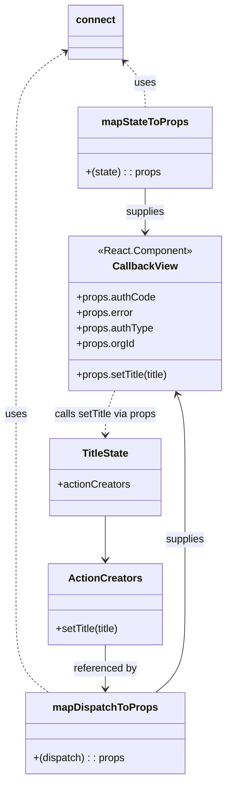

# Diagram: web/portal/src/pages/callback/Callback.page.container.js


> Auto-generated by Obscura crawlers

## Diagram 1

```mermaid
graph LR
  ReduxState[Redux State] -->|callback.authCode| AuthCodeProp["authCode\n(prop)"]
  ReduxState -->|callback.error| ErrorProp["error\n(prop)"]
  ReduxState -->|callback.authType| AuthTypeProp["authType\n(prop)"]
  ReduxState -->|location?.query?.orgId| OrgIdProp["orgId\n(prop)"]
  Dispatch[Dispatch] -->|setTitle(title) → TitleState.actionCreators.setTitle(title)| SetTitleProp["setTitle\n(prop)"]
  Connect((connect(mapStateToProps,mapDispatchToProps)))
  CallbackView["CallbackView (React Component)"]
  AuthCodeProp --> CallbackView
  ErrorProp --> CallbackView
  AuthTypeProp --> CallbackView
  OrgIdProp --> CallbackView
  SetTitleProp --> CallbackView
  Connect --> CallbackView
  ReduxState --> Connect
  Dispatch --> Connect
```

> SVG rendering failed for this diagram.

## Diagram 2



### SVG

<svg id="container" width="357.318359375" xmlns="http://www.w3.org/2000/svg" class="classDiagram" height="1208" viewBox="0 0 357.318359375 1208" role="graphics-document document" aria-roledescription="class"><style>#container{font-family:"trebuchet ms",verdana,arial,sans-serif;font-size:16px;fill:#333;}@keyframes edge-animation-frame{from{stroke-dashoffset:0;}}@keyframes dash{to{stroke-dashoffset:0;}}#container .edge-animation-slow{stroke-dasharray:9,5!important;stroke-dashoffset:900;animation:dash 50s linear infinite;stroke-linecap:round;}#container .edge-animation-fast{stroke-dasharray:9,5!important;stroke-dashoffset:900;animation:dash 20s linear infinite;stroke-linecap:round;}#container .error-icon{fill:#552222;}#container .error-text{fill:#552222;stroke:#552222;}#container .edge-thickness-normal{stroke-width:1px;}#container .edge-thickness-thick{stroke-width:3.5px;}#container .edge-pattern-solid{stroke-dasharray:0;}#container .edge-thickness-invisible{stroke-width:0;fill:none;}#container .edge-pattern-dashed{stroke-dasharray:3;}#container .edge-pattern-dotted{stroke-dasharray:2;}#container .marker{fill:#333333;stroke:#333333;}#container .marker.cross{stroke:#333333;}#container svg{font-family:"trebuchet ms",verdana,arial,sans-serif;font-size:16px;}#container p{margin:0;}#container g.classGroup text{fill:#9370DB;stroke:none;font-family:"trebuchet ms",verdana,arial,sans-serif;font-size:10px;}#container g.classGroup text .title{font-weight:bolder;}#container .nodeLabel,#container .edgeLabel{color:#131300;}#container .edgeLabel .label rect{fill:#ECECFF;}#container .label text{fill:#131300;}#container .labelBkg{background:#ECECFF;}#container .edgeLabel .label span{background:#ECECFF;}#container .classTitle{font-weight:bolder;}#container .node rect,#container .node circle,#container .node ellipse,#container .node polygon,#container .node path{fill:#ECECFF;stroke:#9370DB;stroke-width:1px;}#container .divider{stroke:#9370DB;stroke-width:1;}#container g.clickable{cursor:pointer;}#container g.classGroup rect{fill:#ECECFF;stroke:#9370DB;}#container g.classGroup line{stroke:#9370DB;stroke-width:1;}#container .classLabel .box{stroke:none;stroke-width:0;fill:#ECECFF;opacity:0.5;}#container .classLabel .label{fill:#9370DB;font-size:10px;}#container .relation{stroke:#333333;stroke-width:1;fill:none;}#container .dashed-line{stroke-dasharray:3;}#container .dotted-line{stroke-dasharray:1 2;}#container #compositionStart,#container .composition{fill:#333333!important;stroke:#333333!important;stroke-width:1;}#container #compositionEnd,#container .composition{fill:#333333!important;stroke:#333333!important;stroke-width:1;}#container #dependencyStart,#container .dependency{fill:#333333!important;stroke:#333333!important;stroke-width:1;}#container #dependencyStart,#container .dependency{fill:#333333!important;stroke:#333333!important;stroke-width:1;}#container #extensionStart,#container .extension{fill:transparent!important;stroke:#333333!important;stroke-width:1;}#container #extensionEnd,#container .extension{fill:transparent!important;stroke:#333333!important;stroke-width:1;}#container #aggregationStart,#container .aggregation{fill:transparent!important;stroke:#333333!important;stroke-width:1;}#container #aggregationEnd,#container .aggregation{fill:transparent!important;stroke:#333333!important;stroke-width:1;}#container #lollipopStart,#container .lollipop{fill:#ECECFF!important;stroke:#333333!important;stroke-width:1;}#container #lollipopEnd,#container .lollipop{fill:#ECECFF!important;stroke:#333333!important;stroke-width:1;}#container .edgeTerminals{font-size:11px;line-height:initial;}#container .classTitleText{text-anchor:middle;font-size:18px;fill:#333;}#container .label-icon{display:inline-block;height:1em;overflow:visible;vertical-align:-0.125em;}#container .node .label-icon path{fill:currentColor;stroke:revert;stroke-width:revert;}#container :root{--mermaid-font-family:"trebuchet ms",verdana,arial,sans-serif;}</style><g><defs><marker id="container_class-aggregationStart" class="marker aggregation class" refX="18" refY="7" markerWidth="190" markerHeight="240" orient="auto"><path d="M 18,7 L9,13 L1,7 L9,1 Z"></path></marker></defs><defs><marker id="container_class-aggregationEnd" class="marker aggregation class" refX="1" refY="7" markerWidth="20" markerHeight="28" orient="auto"><path d="M 18,7 L9,13 L1,7 L9,1 Z"></path></marker></defs><defs><marker id="container_class-extensionStart" class="marker extension class" refX="18" refY="7" markerWidth="190" markerHeight="240" orient="auto"><path d="M 1,7 L18,13 V 1 Z"></path></marker></defs><defs><marker id="container_class-extensionEnd" class="marker extension class" refX="1" refY="7" markerWidth="20" markerHeight="28" orient="auto"><path d="M 1,1 V 13 L18,7 Z"></path></marker></defs><defs><marker id="container_class-compositionStart" class="marker composition class" refX="18" refY="7" markerWidth="190" markerHeight="240" orient="auto"><path d="M 18,7 L9,13 L1,7 L9,1 Z"></path></marker></defs><defs><marker id="container_class-compositionEnd" class="marker composition class" refX="1" refY="7" markerWidth="20" markerHeight="28" orient="auto"><path d="M 18,7 L9,13 L1,7 L9,1 Z"></path></marker></defs><defs><marker id="container_class-dependencyStart" class="marker dependency class" refX="6" refY="7" markerWidth="190" markerHeight="240" orient="auto"><path d="M 5,7 L9,13 L1,7 L9,1 Z"></path></marker></defs><defs><marker id="container_class-dependencyEnd" class="marker dependency class" refX="13" refY="7" markerWidth="20" markerHeight="28" orient="auto"><path d="M 18,7 L9,13 L14,7 L9,1 Z"></path></marker></defs><defs><marker id="container_class-lollipopStart" class="marker lollipop class" refX="13" refY="7" markerWidth="190" markerHeight="240" orient="auto"><circle stroke="black" fill="transparent" cx="7" cy="7" r="6"></circle></marker></defs><defs><marker id="container_class-lollipopEnd" class="marker lollipop class" refX="1" refY="7" markerWidth="190" markerHeight="240" orient="auto"><circle stroke="black" fill="transparent" cx="7" cy="7" r="6"></circle></marker></defs><g class="root"><g class="clusters"></g><g class="edgePaths"><path d="M194.258,95.486L199.801,101.071C205.344,106.657,216.431,117.829,221.974,129.581C227.518,141.333,227.518,153.667,227.518,159.833L227.518,166" id="id_connect_mapStateToProps_1" class="edge-thickness-normal edge-pattern-dashed relation" style=";;;" data-edge="true" data-et="edge" data-id="id_connect_mapStateToProps_1" data-points="W3sieCI6MTkwLjAzMTI1LCJ5Ijo5MS4yMjY5NzQ5MTM0MzAxNX0seyJ4IjoyMjcuNTE3NTc4MTI1LCJ5IjoxMjl9LHsieCI6MjI3LjUxNzU3ODEyNSwieSI6MTY2fV0=" marker-start="url(#container_class-dependencyStart)"></path><path d="M103.136,79.148L90.028,87.457C76.921,95.765,50.707,112.383,37.599,137.358C24.492,162.333,24.492,195.667,24.492,229C24.492,262.333,24.492,295.667,24.492,338.5C24.492,381.333,24.492,433.667,24.492,486C24.492,538.333,24.492,590.667,24.492,633C24.492,675.333,24.492,707.667,24.492,740C24.492,772.333,24.492,804.667,24.492,837.5C24.492,870.333,24.492,903.667,24.492,937C24.492,970.333,24.492,1003.667,33.169,1026.5C41.847,1049.333,59.201,1061.667,67.879,1067.833L76.556,1074" id="id_connect_mapDispatchToProps_2" class="edge-thickness-normal edge-pattern-dashed relation" style=";;;" data-edge="true" data-et="edge" data-id="id_connect_mapDispatchToProps_2" data-points="W3sieCI6MTA4LjIwMzEyNSwieSI6NzUuOTM1NDkzOTgxOTQ1ODR9LHsieCI6MjQuNDkyMTg3NSwieSI6MTI5fSx7IngiOjI0LjQ5MjE4NzUsInkiOjIyOX0seyJ4IjoyNC40OTIxODc1LCJ5IjozMjl9LHsieCI6MjQuNDkyMTg3NSwieSI6NDg2fSx7IngiOjI0LjQ5MjE4NzUsInkiOjY0M30seyJ4IjoyNC40OTIxODc1LCJ5Ijo3NDB9LHsieCI6MjQuNDkyMTg3NSwieSI6ODM3fSx7IngiOjI0LjQ5MjE4NzUsInkiOjkzN30seyJ4IjoyNC40OTIxODc1LCJ5IjoxMDM3fSx7IngiOjc2LjU1NTk1NzAzMTI1LCJ5IjoxMDc0fV0=" marker-start="url(#container_class-dependencyStart)"></path><path d="M227.518,292L227.518,298.167C227.518,304.333,227.518,316.667,227.518,328C227.518,339.333,227.518,349.667,227.518,354.833L227.518,360" id="id_mapStateToProps_CallbackView_3" class="edge-thickness-normal edge-pattern-solid relation" style=";;;" data-edge="true" data-et="edge" data-id="id_mapStateToProps_CallbackView_3" data-points="W3sieCI6MjI3LjUxNzU3ODEyNSwieSI6MjkyfSx7IngiOjIyNy41MTc1NzgxMjUsInkiOjMyOX0seyJ4IjoyMjcuNTE3NTc4MTI1LCJ5IjozNjZ9XQ==" marker-end="url(#container_class-dependencyEnd)"></path><path d="M243.719,1074L251.404,1067.833C259.089,1061.667,274.46,1049.333,282.145,1026.5C289.83,1003.667,289.83,970.333,289.83,937C289.83,903.667,289.83,870.333,289.83,837.5C289.83,804.667,289.83,772.333,289.83,740C289.83,707.667,289.83,675.333,287.751,653.929C285.673,632.526,281.516,622.051,279.437,616.814L277.358,611.577" id="id_mapDispatchToProps_CallbackView_4" class="edge-thickness-normal edge-pattern-solid relation" style=";;;" data-edge="true" data-et="edge" data-id="id_mapDispatchToProps_CallbackView_4" data-points="W3sieCI6MjQzLjcxODgyODEyNTAwMDAyLCJ5IjoxMDc0fSx7IngiOjI4OS44MzAwNzgxMjUsInkiOjEwMzd9LHsieCI6Mjg5LjgzMDA3ODEyNSwieSI6OTM3fSx7IngiOjI4OS44MzAwNzgxMjUsInkiOjgzN30seyJ4IjoyODkuODMwMDc4MTI1LCJ5Ijo3NDB9LHsieCI6Mjg5LjgzMDA3ODEyNSwieSI6NjQzfSx7IngiOjI3NS4xNDQ5NjY2NjAwMzE4NiwieSI6NjA2fV0=" marker-end="url(#container_class-dependencyEnd)"></path><path d="M165.205,800L165.205,806.167C165.205,812.333,165.205,824.667,165.205,836C165.205,847.333,165.205,857.667,165.205,862.833L165.205,868" id="id_TitleState_ActionCreators_5" class="edge-thickness-normal edge-pattern-solid relation" style=";;;" data-edge="true" data-et="edge" data-id="id_TitleState_ActionCreators_5" data-points="W3sieCI6MTY1LjIwNTA3ODEyNSwieSI6ODAwfSx7IngiOjE2NS4yMDUwNzgxMjUsInkiOjgzN30seyJ4IjoxNjUuMjA1MDc4MTI1LCJ5Ijo4NzR9XQ==" marker-end="url(#container_class-dependencyEnd)"></path><path d="M165.205,1000L165.205,1006.167C165.205,1012.333,165.205,1024.667,165.205,1036C165.205,1047.333,165.205,1057.667,165.205,1062.833L165.205,1068" id="id_ActionCreators_mapDispatchToProps_6" class="edge-thickness-normal edge-pattern-solid relation" style=";;;" data-edge="true" data-et="edge" data-id="id_ActionCreators_mapDispatchToProps_6" data-points="W3sieCI6MTY1LjIwNTA3ODEyNSwieSI6MTAwMH0seyJ4IjoxNjUuMjA1MDc4MTI1LCJ5IjoxMDM3fSx7IngiOjE2NS4yMDUwNzgxMjUsInkiOjEwNzR9XQ==" marker-end="url(#container_class-dependencyEnd)"></path><path d="M179.89,606L177.443,612.167C174.995,618.333,170.1,630.667,167.653,642C165.205,653.333,165.205,663.667,165.205,668.833L165.205,674" id="id_CallbackView_TitleState_7" class="edge-thickness-normal edge-pattern-dashed relation" style=";;;" data-edge="true" data-et="edge" data-id="id_CallbackView_TitleState_7" data-points="W3sieCI6MTc5Ljg5MDE4OTU4OTk2ODE0LCJ5Ijo2MDZ9LHsieCI6MTY1LjIwNTA3ODEyNSwieSI6NjQzfSx7IngiOjE2NS4yMDUwNzgxMjUsInkiOjY4MH1d" marker-end="url(#container_class-dependencyEnd)"></path></g><g class="edgeLabels"><g class="edgeLabel" transform="translate(227.517578125, 129)"><g class="label" data-id="id_connect_mapStateToProps_1" transform="translate(-16.4921875, -12)"><foreignObject width="32.984375" height="24"><div xmlns="http://www.w3.org/1999/xhtml" class="labelBkg" style="display: table-cell; white-space: nowrap; line-height: 1.5; max-width: 200px; text-align: center;"><span class="edgeLabel"><p>uses</p></span></div></foreignObject></g></g><g class="edgeLabel" transform="translate(24.4921875, 643)"><g class="label" data-id="id_connect_mapDispatchToProps_2" transform="translate(-16.4921875, -12)"><foreignObject width="32.984375" height="24"><div xmlns="http://www.w3.org/1999/xhtml" class="labelBkg" style="display: table-cell; white-space: nowrap; line-height: 1.5; max-width: 200px; text-align: center;"><span class="edgeLabel"><p>uses</p></span></div></foreignObject></g></g><g class="edgeLabel" transform="translate(227.517578125, 329)"><g class="label" data-id="id_mapStateToProps_CallbackView_3" transform="translate(-30.59375, -12)"><foreignObject width="61.1875" height="24"><div xmlns="http://www.w3.org/1999/xhtml" class="labelBkg" style="display: table-cell; white-space: nowrap; line-height: 1.5; max-width: 200px; text-align: center;"><span class="edgeLabel"><p>supplies</p></span></div></foreignObject></g></g><g class="edgeLabel" transform="translate(289.830078125, 837)"><g class="label" data-id="id_mapDispatchToProps_CallbackView_4" transform="translate(-30.59375, -12)"><foreignObject width="61.1875" height="24"><div xmlns="http://www.w3.org/1999/xhtml" class="labelBkg" style="display: table-cell; white-space: nowrap; line-height: 1.5; max-width: 200px; text-align: center;"><span class="edgeLabel"><p>supplies</p></span></div></foreignObject></g></g><g class="edgeLabel"><g class="label" data-id="id_TitleState_ActionCreators_5" transform="translate(0, 0)"><foreignObject width="0" height="0"><div xmlns="http://www.w3.org/1999/xhtml" class="labelBkg" style="display: table-cell; white-space: nowrap; line-height: 1.5; max-width: 200px; text-align: center;"><span class="edgeLabel"></span></div></foreignObject></g></g><g class="edgeLabel" transform="translate(165.205078125, 1037)"><g class="label" data-id="id_ActionCreators_mapDispatchToProps_6" transform="translate(-49.6484375, -12)"><foreignObject width="99.296875" height="24"><div xmlns="http://www.w3.org/1999/xhtml" class="labelBkg" style="display: table-cell; white-space: nowrap; line-height: 1.5; max-width: 200px; text-align: center;"><span class="edgeLabel"><p>referenced by</p></span></div></foreignObject></g></g><g class="edgeLabel" transform="translate(165.205078125, 643)"><g class="label" data-id="id_CallbackView_TitleState_7" transform="translate(-80.953125, -12)"><foreignObject width="161.90625" height="24"><div xmlns="http://www.w3.org/1999/xhtml" class="labelBkg" style="display: table-cell; white-space: nowrap; line-height: 1.5; max-width: 200px; text-align: center;"><span class="edgeLabel"><p>calls setTitle via props</p></span></div></foreignObject></g></g></g><g class="nodes"><g class="node default" id="classId-CallbackView-0" transform="translate(227.517578125, 486)"><g class="basic label-container"><path d="M-121.80078125 -120 L121.80078125 -120 L121.80078125 120 L-121.80078125 120" stroke="none" stroke-width="0" fill="#ECECFF" style=""></path><path d="M-121.80078125 -120 C-55.18021579597536 -120, 11.440349658049286 -120, 121.80078125 -120 M-121.80078125 -120 C-26.077626817373485 -120, 69.64552761525303 -120, 121.80078125 -120 M121.80078125 -120 C121.80078125 -40.34027583105579, 121.80078125 39.31944833788842, 121.80078125 120 M121.80078125 -120 C121.80078125 -69.75273897667735, 121.80078125 -19.5054779533547, 121.80078125 120 M121.80078125 120 C71.10369977702942 120, 20.406618304058824 120, -121.80078125 120 M121.80078125 120 C46.55982634099705 120, -28.681128568005903 120, -121.80078125 120 M-121.80078125 120 C-121.80078125 61.4491746016353, -121.80078125 2.898349203270598, -121.80078125 -120 M-121.80078125 120 C-121.80078125 55.138703864585835, -121.80078125 -9.72259227082833, -121.80078125 -120" stroke="#9370DB" stroke-width="1.3" fill="none" stroke-dasharray="0 0" style=""></path></g><g class="annotation-group text" transform="translate(-72.8828125, -96)"><g class="label" style="" transform="translate(0,-12)"><foreignObject width="145.765625" height="24"><div xmlns="http://www.w3.org/1999/xhtml" style="display: table-cell; white-space: nowrap; line-height: 1.5; max-width: 196px; text-align: center;"><span class="nodeLabel markdown-node-label" style=""><p>«React.Component»</p></span></div></foreignObject></g></g><g class="label-group text" transform="translate(-48.1328125, -72)"><g class="label" style="font-weight: bolder" transform="translate(0,-12)"><foreignObject width="96.265625" height="24"><div xmlns="http://www.w3.org/1999/xhtml" style="display: table-cell; white-space: nowrap; line-height: 1.5; max-width: 145px; text-align: center;"><span class="nodeLabel markdown-node-label" style=""><p>CallbackView</p></span></div></foreignObject></g></g><g class="members-group text" transform="translate(-109.80078125, -24)"><g class="label" style="" transform="translate(0,-12)"><foreignObject width="122.796875" height="24"><div xmlns="http://www.w3.org/1999/xhtml" style="display: table-cell; white-space: nowrap; line-height: 1.5; max-width: 180px; text-align: center;"><span class="nodeLabel markdown-node-label" style=""><p>+props.authCode</p></span></div></foreignObject></g><g class="label" style="" transform="translate(0,12)"><foreignObject width="89.296875" height="24"><div xmlns="http://www.w3.org/1999/xhtml" style="display: table-cell; white-space: nowrap; line-height: 1.5; max-width: 147px; text-align: center;"><span class="nodeLabel markdown-node-label" style=""><p>+props.error</p></span></div></foreignObject></g><g class="label" style="" transform="translate(0,36)"><foreignObject width="120.25" height="24"><div xmlns="http://www.w3.org/1999/xhtml" style="display: table-cell; white-space: nowrap; line-height: 1.5; max-width: 178px; text-align: center;"><span class="nodeLabel markdown-node-label" style=""><p>+props.authType</p></span></div></foreignObject></g><g class="label" style="" transform="translate(0,60)"><foreignObject width="91.078125" height="24"><div xmlns="http://www.w3.org/1999/xhtml" style="display: table-cell; white-space: nowrap; line-height: 1.5; max-width: 148px; text-align: center;"><span class="nodeLabel markdown-node-label" style=""><p>+props.orgId</p></span></div></foreignObject></g></g><g class="methods-group text" transform="translate(-109.80078125, 96)"><g class="label" style="" transform="translate(0,-12)"><foreignObject width="146.71875" height="24"><div xmlns="http://www.w3.org/1999/xhtml" style="display: table-cell; white-space: nowrap; line-height: 1.5; max-width: 204px; text-align: center;"><span class="nodeLabel markdown-node-label" style=""><p>+props.setTitle(title)</p></span></div></foreignObject></g></g><g class="divider" style=""><path d="M-121.80078125 -48 C-31.816539189615426 -48, 58.16770287076915 -48, 121.80078125 -48 M-121.80078125 -48 C-72.57632209463154 -48, -23.351862939263057 -48, 121.80078125 -48" stroke="#9370DB" stroke-width="1.3" fill="none" stroke-dasharray="0 0" style=""></path></g><g class="divider" style=""><path d="M-121.80078125 72 C-66.97675959588113 72, -12.152737941762254 72, 121.80078125 72 M-121.80078125 72 C-57.38072028768882 72, 7.039340674622366 72, 121.80078125 72" stroke="#9370DB" stroke-width="1.3" fill="none" stroke-dasharray="0 0" style=""></path></g></g><g class="node default" id="classId-mapStateToProps-1" transform="translate(227.517578125, 229)"><g class="basic label-container"><path d="M-102.54296875 -63 L102.54296875 -63 L102.54296875 63 L-102.54296875 63" stroke="none" stroke-width="0" fill="#ECECFF" style=""></path><path d="M-102.54296875 -63 C-22.561171792534978 -63, 57.420625164930044 -63, 102.54296875 -63 M-102.54296875 -63 C-57.96353357178112 -63, -13.38409839356224 -63, 102.54296875 -63 M102.54296875 -63 C102.54296875 -32.75344130366266, 102.54296875 -2.5068826073253234, 102.54296875 63 M102.54296875 -63 C102.54296875 -25.166956709075578, 102.54296875 12.666086581848845, 102.54296875 63 M102.54296875 63 C47.29641066343695 63, -7.950147423126097 63, -102.54296875 63 M102.54296875 63 C21.83900021525217 63, -58.86496831949566 63, -102.54296875 63 M-102.54296875 63 C-102.54296875 22.214403850072607, -102.54296875 -18.571192299854786, -102.54296875 -63 M-102.54296875 63 C-102.54296875 30.141480650026864, -102.54296875 -2.717038699946272, -102.54296875 -63" stroke="#9370DB" stroke-width="1.3" fill="none" stroke-dasharray="0 0" style=""></path></g><g class="annotation-group text" transform="translate(0, -39)"></g><g class="label-group text" transform="translate(-64.7109375, -39)"><g class="label" style="font-weight: bolder" transform="translate(0,-12)"><foreignObject width="129.421875" height="24"><div xmlns="http://www.w3.org/1999/xhtml" style="display: table-cell; white-space: nowrap; line-height: 1.5; max-width: 177px; text-align: center;"><span class="nodeLabel markdown-node-label" style=""><p>mapStateToProps</p></span></div></foreignObject></g></g><g class="members-group text" transform="translate(-90.54296875, 9)"></g><g class="methods-group text" transform="translate(-90.54296875, 39)"><g class="label" style="" transform="translate(0,-12)"><foreignObject width="116.375" height="24"><div xmlns="http://www.w3.org/1999/xhtml" style="display: table-cell; white-space: nowrap; line-height: 1.5; max-width: 166px; text-align: center;"><span class="nodeLabel markdown-node-label" style=""><p>+(state) : : props</p></span></div></foreignObject></g></g><g class="divider" style=""><path d="M-102.54296875 -15 C-36.925157084699464 -15, 28.692654580601072 -15, 102.54296875 -15 M-102.54296875 -15 C-40.83414818753787 -15, 20.87467237492426 -15, 102.54296875 -15" stroke="#9370DB" stroke-width="1.3" fill="none" stroke-dasharray="0 0" style=""></path></g><g class="divider" style=""><path d="M-102.54296875 9 C-43.29214550882119 9, 15.958677732357614 9, 102.54296875 9 M-102.54296875 9 C-45.22165177458859 9, 12.099665200822827 9, 102.54296875 9" stroke="#9370DB" stroke-width="1.3" fill="none" stroke-dasharray="0 0" style=""></path></g></g><g class="node default" id="classId-mapDispatchToProps-2" transform="translate(165.205078125, 1137)"><g class="basic label-container"><path d="M-121.81640625 -63 L121.81640625 -63 L121.81640625 63 L-121.81640625 63" stroke="none" stroke-width="0" fill="#ECECFF" style=""></path><path d="M-121.81640625 -63 C-54.16890675911898 -63, 13.478592731762035 -63, 121.81640625 -63 M-121.81640625 -63 C-69.27405293050558 -63, -16.73169961101115 -63, 121.81640625 -63 M121.81640625 -63 C121.81640625 -22.207982728865012, 121.81640625 18.584034542269976, 121.81640625 63 M121.81640625 -63 C121.81640625 -26.655622850495774, 121.81640625 9.688754299008451, 121.81640625 63 M121.81640625 63 C66.8839617295105 63, 11.95151720902102 63, -121.81640625 63 M121.81640625 63 C50.99650913848548 63, -19.823387973029043 63, -121.81640625 63 M-121.81640625 63 C-121.81640625 22.72273107757831, -121.81640625 -17.55453784484338, -121.81640625 -63 M-121.81640625 63 C-121.81640625 28.084801845731164, -121.81640625 -6.830396308537672, -121.81640625 -63" stroke="#9370DB" stroke-width="1.3" fill="none" stroke-dasharray="0 0" style=""></path></g><g class="annotation-group text" transform="translate(0, -39)"></g><g class="label-group text" transform="translate(-77.1953125, -39)"><g class="label" style="font-weight: bolder" transform="translate(0,-12)"><foreignObject width="154.390625" height="24"><div xmlns="http://www.w3.org/1999/xhtml" style="display: table-cell; white-space: nowrap; line-height: 1.5; max-width: 203px; text-align: center;"><span class="nodeLabel markdown-node-label" style=""><p>mapDispatchToProps</p></span></div></foreignObject></g></g><g class="members-group text" transform="translate(-109.81640625, 9)"></g><g class="methods-group text" transform="translate(-109.81640625, 39)"><g class="label" style="" transform="translate(0,-12)"><foreignObject width="142.4375" height="24"><div xmlns="http://www.w3.org/1999/xhtml" style="display: table-cell; white-space: nowrap; line-height: 1.5; max-width: 192px; text-align: center;"><span class="nodeLabel markdown-node-label" style=""><p>+(dispatch) : : props</p></span></div></foreignObject></g></g><g class="divider" style=""><path d="M-121.81640625 -15 C-32.08538706420195 -15, 57.645632121596094 -15, 121.81640625 -15 M-121.81640625 -15 C-70.52675445110748 -15, -19.237102652214958 -15, 121.81640625 -15" stroke="#9370DB" stroke-width="1.3" fill="none" stroke-dasharray="0 0" style=""></path></g><g class="divider" style=""><path d="M-121.81640625 9 C-39.960120173175255 9, 41.89616590364949 9, 121.81640625 9 M-121.81640625 9 C-58.593578100947965 9, 4.629250048104069 9, 121.81640625 9" stroke="#9370DB" stroke-width="1.3" fill="none" stroke-dasharray="0 0" style=""></path></g></g><g class="node default" id="classId-TitleState-3" transform="translate(165.205078125, 740)"><g class="basic label-container"><path d="M-86.36328125 -60 L86.36328125 -60 L86.36328125 60 L-86.36328125 60" stroke="none" stroke-width="0" fill="#ECECFF" style=""></path><path d="M-86.36328125 -60 C-42.33415648284602 -60, 1.6949682843079614 -60, 86.36328125 -60 M-86.36328125 -60 C-22.86514938929998 -60, 40.63298247140004 -60, 86.36328125 -60 M86.36328125 -60 C86.36328125 -23.813657405927678, 86.36328125 12.372685188144644, 86.36328125 60 M86.36328125 -60 C86.36328125 -33.15955308042868, 86.36328125 -6.319106160857366, 86.36328125 60 M86.36328125 60 C28.36194283571723 60, -29.63939557856554 60, -86.36328125 60 M86.36328125 60 C30.076032261205796 60, -26.211216727588408 60, -86.36328125 60 M-86.36328125 60 C-86.36328125 25.35441160027272, -86.36328125 -9.291176799454561, -86.36328125 -60 M-86.36328125 60 C-86.36328125 27.216791138754857, -86.36328125 -5.566417722490286, -86.36328125 -60" stroke="#9370DB" stroke-width="1.3" fill="none" stroke-dasharray="0 0" style=""></path></g><g class="annotation-group text" transform="translate(0, -36)"></g><g class="label-group text" transform="translate(-35.6484375, -36)"><g class="label" style="font-weight: bolder" transform="translate(0,-12)"><foreignObject width="71.296875" height="24"><div xmlns="http://www.w3.org/1999/xhtml" style="display: table-cell; white-space: nowrap; line-height: 1.5; max-width: 119px; text-align: center;"><span class="nodeLabel markdown-node-label" style=""><p>TitleState</p></span></div></foreignObject></g></g><g class="members-group text" transform="translate(-74.36328125, 12)"><g class="label" style="" transform="translate(0,-12)"><foreignObject width="113.078125" height="24"><div xmlns="http://www.w3.org/1999/xhtml" style="display: table-cell; white-space: nowrap; line-height: 1.5; max-width: 170px; text-align: center;"><span class="nodeLabel markdown-node-label" style=""><p>+actionCreators</p></span></div></foreignObject></g></g><g class="methods-group text" transform="translate(-74.36328125, 60)"></g><g class="divider" style=""><path d="M-86.36328125 -12 C-34.85598107278766 -12, 16.651319104424687 -12, 86.36328125 -12 M-86.36328125 -12 C-30.388352015255542 -12, 25.586577219488916 -12, 86.36328125 -12" stroke="#9370DB" stroke-width="1.3" fill="none" stroke-dasharray="0 0" style=""></path></g><g class="divider" style=""><path d="M-86.36328125 36 C-38.02802542167535 36, 10.307230406649296 36, 86.36328125 36 M-86.36328125 36 C-28.633450594130686 36, 29.09638006173863 36, 86.36328125 36" stroke="#9370DB" stroke-width="1.3" fill="none" stroke-dasharray="0 0" style=""></path></g></g><g class="node default" id="classId-ActionCreators-4" transform="translate(165.205078125, 937)"><g class="basic label-container"><path d="M-89.625 -63 L89.625 -63 L89.625 63 L-89.625 63" stroke="none" stroke-width="0" fill="#ECECFF" style=""></path><path d="M-89.625 -63 C-53.1228587938381 -63, -16.620717587676197 -63, 89.625 -63 M-89.625 -63 C-19.308063164332182 -63, 51.008873671335635 -63, 89.625 -63 M89.625 -63 C89.625 -25.844256952503194, 89.625 11.311486094993612, 89.625 63 M89.625 -63 C89.625 -25.004298375407075, 89.625 12.99140324918585, 89.625 63 M89.625 63 C26.996219544429948 63, -35.632560911140104 63, -89.625 63 M89.625 63 C26.52725668483113 63, -36.57048663033774 63, -89.625 63 M-89.625 63 C-89.625 23.02114594429893, -89.625 -16.95770811140214, -89.625 -63 M-89.625 63 C-89.625 27.058084313067923, -89.625 -8.883831373864155, -89.625 -63" stroke="#9370DB" stroke-width="1.3" fill="none" stroke-dasharray="0 0" style=""></path></g><g class="annotation-group text" transform="translate(0, -39)"></g><g class="label-group text" transform="translate(-53.96875, -39)"><g class="label" style="font-weight: bolder" transform="translate(0,-12)"><foreignObject width="107.9375" height="24"><div xmlns="http://www.w3.org/1999/xhtml" style="display: table-cell; white-space: nowrap; line-height: 1.5; max-width: 156px; text-align: center;"><span class="nodeLabel markdown-node-label" style=""><p>ActionCreators</p></span></div></foreignObject></g></g><g class="members-group text" transform="translate(-77.625, 9)"></g><g class="methods-group text" transform="translate(-77.625, 39)"><g class="label" style="" transform="translate(0,-12)"><foreignObject width="101.28125" height="24"><div xmlns="http://www.w3.org/1999/xhtml" style="display: table-cell; white-space: nowrap; line-height: 1.5; max-width: 159px; text-align: center;"><span class="nodeLabel markdown-node-label" style=""><p>+setTitle(title)</p></span></div></foreignObject></g></g><g class="divider" style=""><path d="M-89.625 -15 C-52.66640749591085 -15, -15.707814991821706 -15, 89.625 -15 M-89.625 -15 C-23.383978983157675 -15, 42.85704203368465 -15, 89.625 -15" stroke="#9370DB" stroke-width="1.3" fill="none" stroke-dasharray="0 0" style=""></path></g><g class="divider" style=""><path d="M-89.625 9 C-42.04163371897336 9, 5.541732562053284 9, 89.625 9 M-89.625 9 C-31.300293356930155 9, 27.02441328613969 9, 89.625 9" stroke="#9370DB" stroke-width="1.3" fill="none" stroke-dasharray="0 0" style=""></path></g></g><g class="node default" id="classId-connect-5" transform="translate(149.1171875, 50)"><g class="basic label-container"><path d="M-40.9140625 -42 L40.9140625 -42 L40.9140625 42 L-40.9140625 42" stroke="none" stroke-width="0" fill="#ECECFF" style=""></path><path d="M-40.9140625 -42 C-23.309961960168796 -42, -5.705861420337591 -42, 40.9140625 -42 M-40.9140625 -42 C-19.112207960811887 -42, 2.6896465783762267 -42, 40.9140625 -42 M40.9140625 -42 C40.9140625 -8.821709667030866, 40.9140625 24.356580665938267, 40.9140625 42 M40.9140625 -42 C40.9140625 -22.3384798765356, 40.9140625 -2.676959753071202, 40.9140625 42 M40.9140625 42 C9.055223561349855 42, -22.80361537730029 42, -40.9140625 42 M40.9140625 42 C20.662314825786808 42, 0.41056715157361623 42, -40.9140625 42 M-40.9140625 42 C-40.9140625 13.345726960929603, -40.9140625 -15.308546078140793, -40.9140625 -42 M-40.9140625 42 C-40.9140625 19.158994535386274, -40.9140625 -3.6820109292274523, -40.9140625 -42" stroke="#9370DB" stroke-width="1.3" fill="none" stroke-dasharray="0 0" style=""></path></g><g class="annotation-group text" transform="translate(0, -18)"></g><g class="label-group text" transform="translate(-28.9140625, -18)"><g class="label" style="font-weight: bolder" transform="translate(0,-12)"><foreignObject width="57.828125" height="24"><div xmlns="http://www.w3.org/1999/xhtml" style="display: table-cell; white-space: nowrap; line-height: 1.5; max-width: 108px; text-align: center;"><span class="nodeLabel markdown-node-label" style=""><p>connect</p></span></div></foreignObject></g></g><g class="members-group text" transform="translate(-28.9140625, 30)"></g><g class="methods-group text" transform="translate(-28.9140625, 60)"></g><g class="divider" style=""><path d="M-40.9140625 6 C-14.905310563041951 6, 11.103441373916098 6, 40.9140625 6 M-40.9140625 6 C-22.989728561447738 6, -5.065394622895475 6, 40.9140625 6" stroke="#9370DB" stroke-width="1.3" fill="none" stroke-dasharray="0 0" style=""></path></g><g class="divider" style=""><path d="M-40.9140625 24 C-8.51517536427474 24, 23.88371177145052 24, 40.9140625 24 M-40.9140625 24 C-21.17369293638635 24, -1.4333233727726977 24, 40.9140625 24" stroke="#9370DB" stroke-width="1.3" fill="none" stroke-dasharray="0 0" style=""></path></g></g></g></g></g></svg>
