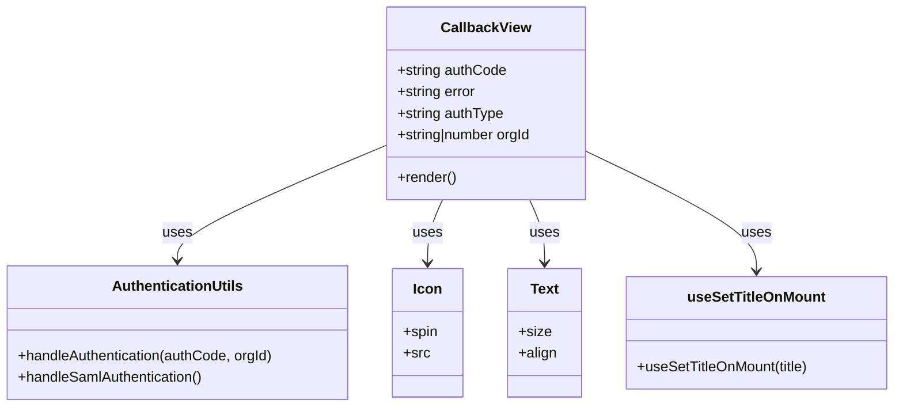

# Diagram: web/portal/src/pages/callback/Callback.page.js


> Auto-generated by Obscura crawlers

## Diagram 1

```mermaid
flowchart TD
  Props["Props: authCode, error, authType, orgId"] --> CheckError{error ?}
  CheckError -- Yes --> Redirect[/window.location.href = "/accessForbiddenError"/]
  CheckError -- No --> CheckAuthType{authType === "CALLBACK"?}
  CheckAuthType -- Yes and authCode --> HandleAuth["AuthenticationUtils.handleAuthentication(authCode, orgId)"]
  CheckAuthType -- Yes and no authCode --> RenderSpinner[Render loading UI (spinner + message)]
  CheckAuthType -- No --> CheckSaml{authType === "SAML_CALLBACK"?}
  CheckSaml -- Yes --> HandleSaml["AuthenticationUtils.handleSamlAuthentication()"]
  CheckSaml -- No --> RenderSpinner
  HandleAuth --> ReturnTrue[[return true]]
  HandleSaml --> ReturnTrue
  Redirect --> End
  RenderSpinner --> End
```

> SVG rendering failed for this diagram.

## Diagram 2



### SVG

<svg id="container" width="1006.25" xmlns="http://www.w3.org/2000/svg" class="classDiagram" height="456" viewBox="0 0 1006.25 456" role="graphics-document document" aria-roledescription="class"><style>#container{font-family:"trebuchet ms",verdana,arial,sans-serif;font-size:16px;fill:#333;}@keyframes edge-animation-frame{from{stroke-dashoffset:0;}}@keyframes dash{to{stroke-dashoffset:0;}}#container .edge-animation-slow{stroke-dasharray:9,5!important;stroke-dashoffset:900;animation:dash 50s linear infinite;stroke-linecap:round;}#container .edge-animation-fast{stroke-dasharray:9,5!important;stroke-dashoffset:900;animation:dash 20s linear infinite;stroke-linecap:round;}#container .error-icon{fill:#552222;}#container .error-text{fill:#552222;stroke:#552222;}#container .edge-thickness-normal{stroke-width:1px;}#container .edge-thickness-thick{stroke-width:3.5px;}#container .edge-pattern-solid{stroke-dasharray:0;}#container .edge-thickness-invisible{stroke-width:0;fill:none;}#container .edge-pattern-dashed{stroke-dasharray:3;}#container .edge-pattern-dotted{stroke-dasharray:2;}#container .marker{fill:#333333;stroke:#333333;}#container .marker.cross{stroke:#333333;}#container svg{font-family:"trebuchet ms",verdana,arial,sans-serif;font-size:16px;}#container p{margin:0;}#container g.classGroup text{fill:#9370DB;stroke:none;font-family:"trebuchet ms",verdana,arial,sans-serif;font-size:10px;}#container g.classGroup text .title{font-weight:bolder;}#container .nodeLabel,#container .edgeLabel{color:#131300;}#container .edgeLabel .label rect{fill:#ECECFF;}#container .label text{fill:#131300;}#container .labelBkg{background:#ECECFF;}#container .edgeLabel .label span{background:#ECECFF;}#container .classTitle{font-weight:bolder;}#container .node rect,#container .node circle,#container .node ellipse,#container .node polygon,#container .node path{fill:#ECECFF;stroke:#9370DB;stroke-width:1px;}#container .divider{stroke:#9370DB;stroke-width:1;}#container g.clickable{cursor:pointer;}#container g.classGroup rect{fill:#ECECFF;stroke:#9370DB;}#container g.classGroup line{stroke:#9370DB;stroke-width:1;}#container .classLabel .box{stroke:none;stroke-width:0;fill:#ECECFF;opacity:0.5;}#container .classLabel .label{fill:#9370DB;font-size:10px;}#container .relation{stroke:#333333;stroke-width:1;fill:none;}#container .dashed-line{stroke-dasharray:3;}#container .dotted-line{stroke-dasharray:1 2;}#container #compositionStart,#container .composition{fill:#333333!important;stroke:#333333!important;stroke-width:1;}#container #compositionEnd,#container .composition{fill:#333333!important;stroke:#333333!important;stroke-width:1;}#container #dependencyStart,#container .dependency{fill:#333333!important;stroke:#333333!important;stroke-width:1;}#container #dependencyStart,#container .dependency{fill:#333333!important;stroke:#333333!important;stroke-width:1;}#container #extensionStart,#container .extension{fill:transparent!important;stroke:#333333!important;stroke-width:1;}#container #extensionEnd,#container .extension{fill:transparent!important;stroke:#333333!important;stroke-width:1;}#container #aggregationStart,#container .aggregation{fill:transparent!important;stroke:#333333!important;stroke-width:1;}#container #aggregationEnd,#container .aggregation{fill:transparent!important;stroke:#333333!important;stroke-width:1;}#container #lollipopStart,#container .lollipop{fill:#ECECFF!important;stroke:#333333!important;stroke-width:1;}#container #lollipopEnd,#container .lollipop{fill:#ECECFF!important;stroke:#333333!important;stroke-width:1;}#container .edgeTerminals{font-size:11px;line-height:initial;}#container .classTitleText{text-anchor:middle;font-size:18px;fill:#333;}#container .label-icon{display:inline-block;height:1em;overflow:visible;vertical-align:-0.125em;}#container .node .label-icon path{fill:currentColor;stroke:revert;stroke-width:revert;}#container :root{--mermaid-font-family:"trebuchet ms",verdana,arial,sans-serif;}</style><g><defs><marker id="container_class-aggregationStart" class="marker aggregation class" refX="18" refY="7" markerWidth="190" markerHeight="240" orient="auto"><path d="M 18,7 L9,13 L1,7 L9,1 Z"></path></marker></defs><defs><marker id="container_class-aggregationEnd" class="marker aggregation class" refX="1" refY="7" markerWidth="20" markerHeight="28" orient="auto"><path d="M 18,7 L9,13 L1,7 L9,1 Z"></path></marker></defs><defs><marker id="container_class-extensionStart" class="marker extension class" refX="18" refY="7" markerWidth="190" markerHeight="240" orient="auto"><path d="M 1,7 L18,13 V 1 Z"></path></marker></defs><defs><marker id="container_class-extensionEnd" class="marker extension class" refX="1" refY="7" markerWidth="20" markerHeight="28" orient="auto"><path d="M 1,1 V 13 L18,7 Z"></path></marker></defs><defs><marker id="container_class-compositionStart" class="marker composition class" refX="18" refY="7" markerWidth="190" markerHeight="240" orient="auto"><path d="M 18,7 L9,13 L1,7 L9,1 Z"></path></marker></defs><defs><marker id="container_class-compositionEnd" class="marker composition class" refX="1" refY="7" markerWidth="20" markerHeight="28" orient="auto"><path d="M 18,7 L9,13 L1,7 L9,1 Z"></path></marker></defs><defs><marker id="container_class-dependencyStart" class="marker dependency class" refX="6" refY="7" markerWidth="190" markerHeight="240" orient="auto"><path d="M 5,7 L9,13 L1,7 L9,1 Z"></path></marker></defs><defs><marker id="container_class-dependencyEnd" class="marker dependency class" refX="13" refY="7" markerWidth="20" markerHeight="28" orient="auto"><path d="M 18,7 L9,13 L14,7 L9,1 Z"></path></marker></defs><defs><marker id="container_class-lollipopStart" class="marker lollipop class" refX="13" refY="7" markerWidth="190" markerHeight="240" orient="auto"><circle stroke="black" fill="transparent" cx="7" cy="7" r="6"></circle></marker></defs><defs><marker id="container_class-lollipopEnd" class="marker lollipop class" refX="1" refY="7" markerWidth="190" markerHeight="240" orient="auto"><circle stroke="black" fill="transparent" cx="7" cy="7" r="6"></circle></marker></defs><g class="root"><g class="clusters"></g><g class="edgePaths"><path d="M434.809,163.412L395.85,179.677C356.891,195.941,278.973,228.471,240.014,249.902C201.055,271.333,201.055,281.667,201.055,286.833L201.055,292" id="id_CallbackView_AuthenticationUtils_1" class="edge-thickness-normal edge-pattern-solid relation" style=";;;" data-edge="true" data-et="edge" data-id="id_CallbackView_AuthenticationUtils_1" data-points="W3sieCI6NDM0LjgwODU5Mzc1LCJ5IjoxNjMuNDExOTM3Mzc3NjkwOH0seyJ4IjoyMDEuMDU0Njg3NSwieSI6MjYxfSx7IngiOjIwMS4wNTQ2ODc1LCJ5IjoyOTh9XQ==" marker-end="url(#container_class-dependencyEnd)"></path><path d="M499.824,224L497.052,230.167C494.28,236.333,488.736,248.667,485.964,260.5C483.191,272.333,483.191,283.667,483.191,289.333L483.191,295" id="id_CallbackView_Icon_2" class="edge-thickness-normal edge-pattern-solid relation" style=";;;" data-edge="true" data-et="edge" data-id="id_CallbackView_Icon_2" data-points="W3sieCI6NDk5LjgyNDQ2MTIwNjg5NjU2LCJ5IjoyMjR9LHsieCI6NDgzLjE5MTQwNjI1LCJ5IjoyNjF9LHsieCI6NDgzLjE5MTQwNjI1LCJ5IjozMDF9XQ==" marker-end="url(#container_class-dependencyEnd)"></path><path d="M596.926,224L599.698,230.167C602.47,236.333,608.014,248.667,610.786,260.5C613.559,272.333,613.559,283.667,613.559,289.333L613.559,295" id="id_CallbackView_Text_3" class="edge-thickness-normal edge-pattern-solid relation" style=";;;" data-edge="true" data-et="edge" data-id="id_CallbackView_Text_3" data-points="W3sieCI6NTk2LjkyNTUzODc5MzEwMzQsInkiOjIyNH0seyJ4Ijo2MTMuNTU4NTkzNzUsInkiOjI2MX0seyJ4Ijo2MTMuNTU4NTkzNzUsInkiOjMwMX1d" marker-end="url(#container_class-dependencyEnd)"></path><path d="M661.941,170.316L693.542,185.43C725.143,200.544,788.345,230.772,819.946,253.053C851.547,275.333,851.547,289.667,851.547,296.833L851.547,304" id="id_CallbackView_useSetTitleOnMount_4" class="edge-thickness-normal edge-pattern-solid relation" style=";;;" data-edge="true" data-et="edge" data-id="id_CallbackView_useSetTitleOnMount_4" data-points="W3sieCI6NjYxLjk0MTQwNjI1LCJ5IjoxNzAuMzE2MTQ5NTY0NTAwMzR9LHsieCI6ODUxLjU0Njg3NSwieSI6MjYxfSx7IngiOjg1MS41NDY4NzUsInkiOjMxMH1d" marker-end="url(#container_class-dependencyEnd)"></path></g><g class="edgeLabels"><g class="edgeLabel" transform="translate(201.0546875, 261)"><g class="label" data-id="id_CallbackView_AuthenticationUtils_1" transform="translate(-16.4921875, -12)"><foreignObject width="32.984375" height="24"><div xmlns="http://www.w3.org/1999/xhtml" class="labelBkg" style="display: table-cell; white-space: nowrap; line-height: 1.5; max-width: 200px; text-align: center;"><span class="edgeLabel"><p>uses</p></span></div></foreignObject></g></g><g class="edgeLabel" transform="translate(483.19140625, 261)"><g class="label" data-id="id_CallbackView_Icon_2" transform="translate(-16.4921875, -12)"><foreignObject width="32.984375" height="24"><div xmlns="http://www.w3.org/1999/xhtml" class="labelBkg" style="display: table-cell; white-space: nowrap; line-height: 1.5; max-width: 200px; text-align: center;"><span class="edgeLabel"><p>uses</p></span></div></foreignObject></g></g><g class="edgeLabel" transform="translate(613.55859375, 261)"><g class="label" data-id="id_CallbackView_Text_3" transform="translate(-16.4921875, -12)"><foreignObject width="32.984375" height="24"><div xmlns="http://www.w3.org/1999/xhtml" class="labelBkg" style="display: table-cell; white-space: nowrap; line-height: 1.5; max-width: 200px; text-align: center;"><span class="edgeLabel"><p>uses</p></span></div></foreignObject></g></g><g class="edgeLabel" transform="translate(851.546875, 261)"><g class="label" data-id="id_CallbackView_useSetTitleOnMount_4" transform="translate(-16.4921875, -12)"><foreignObject width="32.984375" height="24"><div xmlns="http://www.w3.org/1999/xhtml" class="labelBkg" style="display: table-cell; white-space: nowrap; line-height: 1.5; max-width: 200px; text-align: center;"><span class="edgeLabel"><p>uses</p></span></div></foreignObject></g></g></g><g class="nodes"><g class="node default" id="classId-CallbackView-0" transform="translate(548.375, 116)"><g class="basic label-container"><path d="M-113.56640625 -108 L113.56640625 -108 L113.56640625 108 L-113.56640625 108" stroke="none" stroke-width="0" fill="#ECECFF" style=""></path><path d="M-113.56640625 -108 C-33.685602569958064 -108, 46.19520111008387 -108, 113.56640625 -108 M-113.56640625 -108 C-29.02705889785301 -108, 55.51228845429398 -108, 113.56640625 -108 M113.56640625 -108 C113.56640625 -24.5902949419644, 113.56640625 58.8194101160712, 113.56640625 108 M113.56640625 -108 C113.56640625 -56.11544869820502, 113.56640625 -4.230897396410043, 113.56640625 108 M113.56640625 108 C51.2538878844785 108, -11.058630481042997 108, -113.56640625 108 M113.56640625 108 C30.910620167871258 108, -51.745165914257484 108, -113.56640625 108 M-113.56640625 108 C-113.56640625 38.880669581028656, -113.56640625 -30.23866083794269, -113.56640625 -108 M-113.56640625 108 C-113.56640625 50.17666149288903, -113.56640625 -7.646677014221936, -113.56640625 -108" stroke="#9370DB" stroke-width="1.3" fill="none" stroke-dasharray="0 0" style=""></path></g><g class="annotation-group text" transform="translate(0, -84)"></g><g class="label-group text" transform="translate(-48.1328125, -84)"><g class="label" style="font-weight: bolder" transform="translate(0,-12)"><foreignObject width="96.265625" height="24"><div xmlns="http://www.w3.org/1999/xhtml" style="display: table-cell; white-space: nowrap; line-height: 1.5; max-width: 145px; text-align: center;"><span class="nodeLabel markdown-node-label" style=""><p>CallbackView</p></span></div></foreignObject></g></g><g class="members-group text" transform="translate(-101.56640625, -36)"><g class="label" style="" transform="translate(0,-12)"><foreignObject width="123.296875" height="24"><div xmlns="http://www.w3.org/1999/xhtml" style="display: table-cell; white-space: nowrap; line-height: 1.5; max-width: 181px; text-align: center;"><span class="nodeLabel markdown-node-label" style=""><p>+string authCode</p></span></div></foreignObject></g><g class="label" style="" transform="translate(0,12)"><foreignObject width="89.96875" height="24"><div xmlns="http://www.w3.org/1999/xhtml" style="display: table-cell; white-space: nowrap; line-height: 1.5; max-width: 148px; text-align: center;"><span class="nodeLabel markdown-node-label" style=""><p>+string error</p></span></div></foreignObject></g><g class="label" style="" transform="translate(0,36)"><foreignObject width="120.765625" height="24"><div xmlns="http://www.w3.org/1999/xhtml" style="display: table-cell; white-space: nowrap; line-height: 1.5; max-width: 178px; text-align: center;"><span class="nodeLabel markdown-node-label" style=""><p>+string authType</p></span></div></foreignObject></g><g class="label" style="" transform="translate(0,60)"><foreignObject width="155" height="24"><div xmlns="http://www.w3.org/1999/xhtml" style="display: table-cell; white-space: nowrap; line-height: 1.5; max-width: 212px; text-align: center;"><span class="nodeLabel markdown-node-label" style=""><p>+string|number orgId</p></span></div></foreignObject></g></g><g class="methods-group text" transform="translate(-101.56640625, 84)"><g class="label" style="" transform="translate(0,-12)"><foreignObject width="66.609375" height="24"><div xmlns="http://www.w3.org/1999/xhtml" style="display: table-cell; white-space: nowrap; line-height: 1.5; max-width: 124px; text-align: center;"><span class="nodeLabel markdown-node-label" style=""><p>+render()</p></span></div></foreignObject></g></g><g class="divider" style=""><path d="M-113.56640625 -60 C-58.3913518674952 -60, -3.216297484990406 -60, 113.56640625 -60 M-113.56640625 -60 C-51.61100649777887 -60, 10.344393254442267 -60, 113.56640625 -60" stroke="#9370DB" stroke-width="1.3" fill="none" stroke-dasharray="0 0" style=""></path></g><g class="divider" style=""><path d="M-113.56640625 60 C-41.233699418848715 60, 31.09900741230257 60, 113.56640625 60 M-113.56640625 60 C-47.927286804160886 60, 17.711832641678228 60, 113.56640625 60" stroke="#9370DB" stroke-width="1.3" fill="none" stroke-dasharray="0 0" style=""></path></g></g><g class="node default" id="classId-AuthenticationUtils-1" transform="translate(201.0546875, 373)"><g class="basic label-container"><path d="M-193.0546875 -75 L193.0546875 -75 L193.0546875 75 L-193.0546875 75" stroke="none" stroke-width="0" fill="#ECECFF" style=""></path><path d="M-193.0546875 -75 C-80.06421235493201 -75, 32.92626279013598 -75, 193.0546875 -75 M-193.0546875 -75 C-94.55532632415274 -75, 3.9440348516945107 -75, 193.0546875 -75 M193.0546875 -75 C193.0546875 -43.82022086161756, 193.0546875 -12.640441723235107, 193.0546875 75 M193.0546875 -75 C193.0546875 -25.423808296116306, 193.0546875 24.15238340776739, 193.0546875 75 M193.0546875 75 C40.17833045094355 75, -112.6980265981129 75, -193.0546875 75 M193.0546875 75 C83.06808216870935 75, -26.918523162581295 75, -193.0546875 75 M-193.0546875 75 C-193.0546875 23.047630365655415, -193.0546875 -28.90473926868917, -193.0546875 -75 M-193.0546875 75 C-193.0546875 44.93896344721905, -193.0546875 14.877926894438112, -193.0546875 -75" stroke="#9370DB" stroke-width="1.3" fill="none" stroke-dasharray="0 0" style=""></path></g><g class="annotation-group text" transform="translate(0, -51)"></g><g class="label-group text" transform="translate(-70.9375, -51)"><g class="label" style="font-weight: bolder" transform="translate(0,-12)"><foreignObject width="141.875" height="24"><div xmlns="http://www.w3.org/1999/xhtml" style="display: table-cell; white-space: nowrap; line-height: 1.5; max-width: 190px; text-align: center;"><span class="nodeLabel markdown-node-label" style=""><p>AuthenticationUtils</p></span></div></foreignObject></g></g><g class="members-group text" transform="translate(-181.0546875, -3)"></g><g class="methods-group text" transform="translate(-181.0546875, 27)"><g class="label" style="" transform="translate(0,-12)"><foreignObject width="291.171875" height="24"><div xmlns="http://www.w3.org/1999/xhtml" style="display: table-cell; white-space: nowrap; line-height: 1.5; max-width: 349px; text-align: center;"><span class="nodeLabel markdown-node-label" style=""><p>+handleAuthentication(authCode, orgId)</p></span></div></foreignObject></g><g class="label" style="" transform="translate(0,12)"><foreignObject width="211.75" height="24"><div xmlns="http://www.w3.org/1999/xhtml" style="display: table-cell; white-space: nowrap; line-height: 1.5; max-width: 269px; text-align: center;"><span class="nodeLabel markdown-node-label" style=""><p>+handleSamlAuthentication()</p></span></div></foreignObject></g></g><g class="divider" style=""><path d="M-193.0546875 -27 C-101.12181402135299 -27, -9.188940542705978 -27, 193.0546875 -27 M-193.0546875 -27 C-66.38174367554068 -27, 60.29120014891865 -27, 193.0546875 -27" stroke="#9370DB" stroke-width="1.3" fill="none" stroke-dasharray="0 0" style=""></path></g><g class="divider" style=""><path d="M-193.0546875 -3 C-103.69931290285807 -3, -14.343938305716136 -3, 193.0546875 -3 M-193.0546875 -3 C-70.38129319065082 -3, 52.292101118698355 -3, 193.0546875 -3" stroke="#9370DB" stroke-width="1.3" fill="none" stroke-dasharray="0 0" style=""></path></g></g><g class="node default" id="classId-Icon-2" transform="translate(483.19140625, 373)"><g class="basic label-container"><path d="M-39.08203125 -72 L39.08203125 -72 L39.08203125 72 L-39.08203125 72" stroke="none" stroke-width="0" fill="#ECECFF" style=""></path><path d="M-39.08203125 -72 C-10.83149698358374 -72, 17.41903728283252 -72, 39.08203125 -72 M-39.08203125 -72 C-12.553778914301173 -72, 13.974473421397654 -72, 39.08203125 -72 M39.08203125 -72 C39.08203125 -19.76478378956803, 39.08203125 32.47043242086394, 39.08203125 72 M39.08203125 -72 C39.08203125 -41.72303577961838, 39.08203125 -11.446071559236756, 39.08203125 72 M39.08203125 72 C17.2712800375139 72, -4.539471174972199 72, -39.08203125 72 M39.08203125 72 C16.5224897698301 72, -6.037051710339803 72, -39.08203125 72 M-39.08203125 72 C-39.08203125 31.87349998467343, -39.08203125 -8.25300003065314, -39.08203125 -72 M-39.08203125 72 C-39.08203125 17.178795936649735, -39.08203125 -37.64240812670053, -39.08203125 -72" stroke="#9370DB" stroke-width="1.3" fill="none" stroke-dasharray="0 0" style=""></path></g><g class="annotation-group text" transform="translate(0, -48)"></g><g class="label-group text" transform="translate(-15.3046875, -48)"><g class="label" style="font-weight: bolder" transform="translate(0,-12)"><foreignObject width="30.609375" height="24"><div xmlns="http://www.w3.org/1999/xhtml" style="display: table-cell; white-space: nowrap; line-height: 1.5; max-width: 81px; text-align: center;"><span class="nodeLabel markdown-node-label" style=""><p>Icon</p></span></div></foreignObject></g></g><g class="members-group text" transform="translate(-27.08203125, 0)"><g class="label" style="" transform="translate(0,-12)"><foreignObject width="38.859375" height="24"><div xmlns="http://www.w3.org/1999/xhtml" style="display: table-cell; white-space: nowrap; line-height: 1.5; max-width: 96px; text-align: center;"><span class="nodeLabel markdown-node-label" style=""><p>+spin</p></span></div></foreignObject></g><g class="label" style="" transform="translate(0,12)"><foreignObject width="28.8125" height="24"><div xmlns="http://www.w3.org/1999/xhtml" style="display: table-cell; white-space: nowrap; line-height: 1.5; max-width: 87px; text-align: center;"><span class="nodeLabel markdown-node-label" style=""><p>+src</p></span></div></foreignObject></g></g><g class="methods-group text" transform="translate(-27.08203125, 72)"></g><g class="divider" style=""><path d="M-39.08203125 -24 C-9.397599921046002 -24, 20.286831407907997 -24, 39.08203125 -24 M-39.08203125 -24 C-9.859480386171555 -24, 19.36307047765689 -24, 39.08203125 -24" stroke="#9370DB" stroke-width="1.3" fill="none" stroke-dasharray="0 0" style=""></path></g><g class="divider" style=""><path d="M-39.08203125 48 C-8.370168633215293 48, 22.341693983569414 48, 39.08203125 48 M-39.08203125 48 C-12.706973804291827 48, 13.668083641416345 48, 39.08203125 48" stroke="#9370DB" stroke-width="1.3" fill="none" stroke-dasharray="0 0" style=""></path></g></g><g class="node default" id="classId-Text-3" transform="translate(613.55859375, 373)"><g class="basic label-container"><path d="M-41.28515625 -72 L41.28515625 -72 L41.28515625 72 L-41.28515625 72" stroke="none" stroke-width="0" fill="#ECECFF" style=""></path><path d="M-41.28515625 -72 C-20.51090596937694 -72, 0.26334431124612223 -72, 41.28515625 -72 M-41.28515625 -72 C-11.588130092991172 -72, 18.108896064017657 -72, 41.28515625 -72 M41.28515625 -72 C41.28515625 -17.82531465574322, 41.28515625 36.34937068851356, 41.28515625 72 M41.28515625 -72 C41.28515625 -42.132288082564955, 41.28515625 -12.264576165129903, 41.28515625 72 M41.28515625 72 C17.647940355363637 72, -5.989275539272725 72, -41.28515625 72 M41.28515625 72 C18.869388493409076 72, -3.546379263181848 72, -41.28515625 72 M-41.28515625 72 C-41.28515625 31.157429943575167, -41.28515625 -9.685140112849666, -41.28515625 -72 M-41.28515625 72 C-41.28515625 25.657847130950714, -41.28515625 -20.684305738098573, -41.28515625 -72" stroke="#9370DB" stroke-width="1.3" fill="none" stroke-dasharray="0 0" style=""></path></g><g class="annotation-group text" transform="translate(0, -48)"></g><g class="label-group text" transform="translate(-15.3828125, -48)"><g class="label" style="font-weight: bolder" transform="translate(0,-12)"><foreignObject width="30.765625" height="24"><div xmlns="http://www.w3.org/1999/xhtml" style="display: table-cell; white-space: nowrap; line-height: 1.5; max-width: 80px; text-align: center;"><span class="nodeLabel markdown-node-label" style=""><p>Text</p></span></div></foreignObject></g></g><g class="members-group text" transform="translate(-29.28515625, 0)"><g class="label" style="" transform="translate(0,-12)"><foreignObject width="35.578125" height="24"><div xmlns="http://www.w3.org/1999/xhtml" style="display: table-cell; white-space: nowrap; line-height: 1.5; max-width: 93px; text-align: center;"><span class="nodeLabel markdown-node-label" style=""><p>+size</p></span></div></foreignObject></g><g class="label" style="" transform="translate(0,12)"><foreignObject width="43.1875" height="24"><div xmlns="http://www.w3.org/1999/xhtml" style="display: table-cell; white-space: nowrap; line-height: 1.5; max-width: 101px; text-align: center;"><span class="nodeLabel markdown-node-label" style=""><p>+align</p></span></div></foreignObject></g></g><g class="methods-group text" transform="translate(-29.28515625, 72)"></g><g class="divider" style=""><path d="M-41.28515625 -24 C-9.501533497479574 -24, 22.28208925504085 -24, 41.28515625 -24 M-41.28515625 -24 C-19.540545046015268 -24, 2.2040661579694643 -24, 41.28515625 -24" stroke="#9370DB" stroke-width="1.3" fill="none" stroke-dasharray="0 0" style=""></path></g><g class="divider" style=""><path d="M-41.28515625 48 C-24.648661464338943 48, -8.012166678677886 48, 41.28515625 48 M-41.28515625 48 C-17.9238678747648 48, 5.437420500470402 48, 41.28515625 48" stroke="#9370DB" stroke-width="1.3" fill="none" stroke-dasharray="0 0" style=""></path></g></g><g class="node default" id="classId-useSetTitleOnMount-4" transform="translate(851.546875, 373)"><g class="basic label-container"><path d="M-146.703125 -63 L146.703125 -63 L146.703125 63 L-146.703125 63" stroke="none" stroke-width="0" fill="#ECECFF" style=""></path><path d="M-146.703125 -63 C-41.8301855315523 -63, 63.042753936895394 -63, 146.703125 -63 M-146.703125 -63 C-46.78095910308254 -63, 53.141206793834925 -63, 146.703125 -63 M146.703125 -63 C146.703125 -24.123512430326393, 146.703125 14.752975139347214, 146.703125 63 M146.703125 -63 C146.703125 -32.67485168028941, 146.703125 -2.3497033605788076, 146.703125 63 M146.703125 63 C46.46279084505545 63, -53.7775433098891 63, -146.703125 63 M146.703125 63 C63.92140072557412 63, -18.860323548851767 63, -146.703125 63 M-146.703125 63 C-146.703125 12.739816753119179, -146.703125 -37.52036649376164, -146.703125 -63 M-146.703125 63 C-146.703125 31.93356672300303, -146.703125 0.8671334460060578, -146.703125 -63" stroke="#9370DB" stroke-width="1.3" fill="none" stroke-dasharray="0 0" style=""></path></g><g class="annotation-group text" transform="translate(0, -39)"></g><g class="label-group text" transform="translate(-74.65625, -39)"><g class="label" style="font-weight: bolder" transform="translate(0,-12)"><foreignObject width="149.3125" height="24"><div xmlns="http://www.w3.org/1999/xhtml" style="display: table-cell; white-space: nowrap; line-height: 1.5; max-width: 197px; text-align: center;"><span class="nodeLabel markdown-node-label" style=""><p>useSetTitleOnMount</p></span></div></foreignObject></g></g><g class="members-group text" transform="translate(-134.703125, 9)"></g><g class="methods-group text" transform="translate(-134.703125, 39)"><g class="label" style="" transform="translate(0,-12)"><foreignObject width="194.75" height="24"><div xmlns="http://www.w3.org/1999/xhtml" style="display: table-cell; white-space: nowrap; line-height: 1.5; max-width: 252px; text-align: center;"><span class="nodeLabel markdown-node-label" style=""><p>+useSetTitleOnMount(title)</p></span></div></foreignObject></g></g><g class="divider" style=""><path d="M-146.703125 -15 C-61.83855016656878 -15, 23.02602466686244 -15, 146.703125 -15 M-146.703125 -15 C-73.72437584828688 -15, -0.7456266965737655 -15, 146.703125 -15" stroke="#9370DB" stroke-width="1.3" fill="none" stroke-dasharray="0 0" style=""></path></g><g class="divider" style=""><path d="M-146.703125 9 C-70.10229827905657 9, 6.498528441886862 9, 146.703125 9 M-146.703125 9 C-83.1091897507693 9, -19.515254501538593 9, 146.703125 9" stroke="#9370DB" stroke-width="1.3" fill="none" stroke-dasharray="0 0" style=""></path></g></g></g></g></g></svg>
