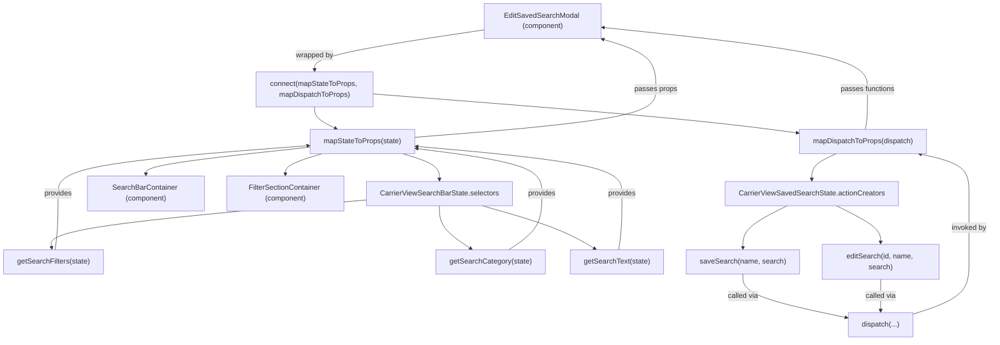

# Diagram: web/portal/src/pages/carrierview/components/search/CarrierView.EditSavedSearchModal.container.js

> Auto-generated by Obscura crawlers

## Mermaid

### SVG

<svg id="container" width="2196.09375" xmlns="http://www.w3.org/2000/svg" class="flowchart" height="758" viewBox="0 0 2196.09375 758" role="graphics-document document" aria-roledescription="flowchart-v2"><g><marker id="container_flowchart-v2-pointEnd" class="marker flowchart-v2" viewBox="0 0 10 10" refX="5" refY="5" markerUnits="userSpaceOnUse" markerWidth="8" markerHeight="8" orient="auto"><path d="M 0 0 L 10 5 L 0 10 z" class="arrowMarkerPath" style="stroke-width: 1; stroke-dasharray: 1, 0;"></path></marker><marker id="container_flowchart-v2-pointStart" class="marker flowchart-v2" viewBox="0 0 10 10" refX="4.5" refY="5" markerUnits="userSpaceOnUse" markerWidth="8" markerHeight="8" orient="auto"><path d="M 0 5 L 10 10 L 10 0 z" class="arrowMarkerPath" style="stroke-width: 1; stroke-dasharray: 1, 0;"></path></marker><marker id="container_flowchart-v2-circleEnd" class="marker flowchart-v2" viewBox="0 0 10 10" refX="11" refY="5" markerUnits="userSpaceOnUse" markerWidth="11" markerHeight="11" orient="auto"><circle cx="5" cy="5" r="5" class="arrowMarkerPath" style="stroke-width: 1; stroke-dasharray: 1, 0;"></circle></marker><marker id="container_flowchart-v2-circleStart" class="marker flowchart-v2" viewBox="0 0 10 10" refX="-1" refY="5" markerUnits="userSpaceOnUse" markerWidth="11" markerHeight="11" orient="auto"><circle cx="5" cy="5" r="5" class="arrowMarkerPath" style="stroke-width: 1; stroke-dasharray: 1, 0;"></circle></marker><marker id="container_flowchart-v2-crossEnd" class="marker cross flowchart-v2" viewBox="0 0 11 11" refX="12" refY="5.2" markerUnits="userSpaceOnUse" markerWidth="11" markerHeight="11" orient="auto"><path d="M 1,1 l 9,9 M 10,1 l -9,9" class="arrowMarkerPath" style="stroke-width: 2; stroke-dasharray: 1, 0;"></path></marker><marker id="container_flowchart-v2-crossStart" class="marker cross flowchart-v2" viewBox="0 0 11 11" refX="-1" refY="5.2" markerUnits="userSpaceOnUse" markerWidth="11" markerHeight="11" orient="auto"><path d="M 1,1 l 9,9 M 10,1 l -9,9" class="arrowMarkerPath" style="stroke-width: 2; stroke-dasharray: 1, 0;"></path></marker><g class="root"><g class="clusters"></g><g class="edgePaths"><path d="M1076.258,66.507L1013.512,75.923C950.767,85.338,825.276,104.169,762.531,119.085C699.785,134,699.785,145,699.785,150.5L699.785,156" id="L_EditSavedSearchModal_ConnectHOC_0" class="edge-thickness-normal edge-pattern-solid edge-thickness-normal edge-pattern-solid flowchart-link" style=";" data-edge="true" data-et="edge" data-id="L_EditSavedSearchModal_ConnectHOC_0" data-points="W3sieCI6MTA3Ni4yNTc4MTI1LCJ5Ijo2Ni41MDc0Njk3MDg1Mzg2OH0seyJ4Ijo2OTkuNzg1MTU2MjUsInkiOjEyM30seyJ4Ijo2OTkuNzg1MTU2MjUsInkiOjE2MH1d" marker-end="url(#container_flowchart-v2-pointEnd)"></path><path d="M699.785,238L699.785,242.167C699.785,246.333,699.785,254.667,707.693,262.707C715.6,270.747,731.415,278.494,739.322,282.367L747.23,286.24" id="L_ConnectHOC_MapState_0" class="edge-thickness-normal edge-pattern-solid edge-thickness-normal edge-pattern-solid flowchart-link" style=";" data-edge="true" data-et="edge" data-id="L_ConnectHOC_MapState_0" data-points="W3sieCI6Njk5Ljc4NTE1NjI1LCJ5IjoyMzh9LHsieCI6Njk5Ljc4NTE1NjI1LCJ5IjoyNjN9LHsieCI6NzUwLjgyMTgxNDkwMzg0NjIsInkiOjI4OH1d" marker-end="url(#container_flowchart-v2-pointEnd)"></path><path d="M829.785,209.13L945.008,218.108C1060.23,227.087,1290.676,245.043,1447.021,259.459C1603.367,273.876,1685.613,284.751,1726.736,290.189L1767.859,295.627" id="L_ConnectHOC_MapDispatch_0" class="edge-thickness-normal edge-pattern-solid edge-thickness-normal edge-pattern-solid flowchart-link" style=";" data-edge="true" data-et="edge" data-id="L_ConnectHOC_MapDispatch_0" data-points="W3sieCI6ODI5Ljc4NTE1NjI1LCJ5IjoyMDkuMTI5ODM4MDExNjIzNn0seyJ4IjoxNTIxLjEyMTA5Mzc1LCJ5IjoyNjN9LHsieCI6MTc3MS44MjQyMTg3NSwieSI6Mjk2LjE1MTQ4NTA1MDE2Mzl9XQ==" marker-end="url(#container_flowchart-v2-pointEnd)"></path><path d="M894.566,342L908.242,346.167C921.919,350.333,949.272,358.667,962.948,368.333C976.625,378,976.625,389,976.625,394.5L976.625,400" id="L_MapState_CarrierViewSearchBarState_0" class="edge-thickness-normal edge-pattern-solid edge-thickness-normal edge-pattern-solid flowchart-link" style=";" data-edge="true" data-et="edge" data-id="L_MapState_CarrierViewSearchBarState_0" data-points="W3sieCI6ODk0LjU2NTU3OTkyNzg4NDYsInkiOjM0Mn0seyJ4Ijo5NzYuNjI1LCJ5IjozNjd9LHsieCI6OTc2LjYyNSwieSI6NDA0fV0=" marker-end="url(#container_flowchart-v2-pointEnd)"></path><path d="M815.258,445.134L697.539,455.445C579.82,465.756,344.383,486.378,227.652,504.195C110.92,522.011,112.896,537.023,113.883,544.528L114.871,552.034" id="L_CarrierViewSearchBarState_getSearchFilters_0" class="edge-thickness-normal edge-pattern-solid edge-thickness-normal edge-pattern-solid flowchart-link" style=";" data-edge="true" data-et="edge" data-id="L_CarrierViewSearchBarState_getSearchFilters_0" data-points="W3sieCI6ODE1LjI1NzgxMjUsInkiOjQ0NS4xMzQxNDAwODI2NTU4fSx7IngiOjEwOC45NDUzMTI1LCJ5Ijo1MDd9LHsieCI6MTE1LjM5MjY4MDkyMTA1MjYzLCJ5Ijo1NTZ9XQ==" marker-end="url(#container_flowchart-v2-pointEnd)"></path><path d="M976.625,458L976.625,466.167C976.625,474.333,976.625,490.667,988.303,506.63C999.982,522.593,1023.338,538.186,1035.017,545.983L1046.695,553.779" id="L_CarrierViewSearchBarState_getSearchCategory_0" class="edge-thickness-normal edge-pattern-solid edge-thickness-normal edge-pattern-solid flowchart-link" style=";" data-edge="true" data-et="edge" data-id="L_CarrierViewSearchBarState_getSearchCategory_0" data-points="W3sieCI6OTc2LjYyNSwieSI6NDU4fSx7IngiOjk3Ni42MjUsInkiOjUwN30seyJ4IjoxMDUwLjAyMTc0MTM2NTEzMTcsInkiOjU1Nn1d" marker-end="url(#container_flowchart-v2-pointEnd)"></path><path d="M1072.128,458L1101.015,466.167C1129.902,474.333,1187.676,490.667,1229.642,506.658C1271.609,522.649,1297.769,538.298,1310.848,546.122L1323.928,553.947" id="L_CarrierViewSearchBarState_getSearchText_0" class="edge-thickness-normal edge-pattern-solid edge-thickness-normal edge-pattern-solid flowchart-link" style=";" data-edge="true" data-et="edge" data-id="L_CarrierViewSearchBarState_getSearchText_0" data-points="W3sieCI6MTA3Mi4xMjgzNDA4NzE3MTA0LCJ5Ijo0NTh9LHsieCI6MTI0NS40NDkyMTg3NSwieSI6NTA3fSx7IngiOjEzMjcuMzYxMDE5NzM2ODQyLCJ5Ijo1NTZ9XQ==" marker-end="url(#container_flowchart-v2-pointEnd)"></path><path d="M122.498,556L123.573,547.833C124.647,539.667,126.796,523.333,127.871,502.5C128.945,481.667,128.945,456.333,128.945,433C128.945,409.667,128.945,388.333,221.658,370.545C314.37,352.758,499.794,338.515,592.507,331.394L685.219,324.273" id="L_getSearchFilters_MapState_0" class="edge-thickness-normal edge-pattern-solid edge-thickness-normal edge-pattern-solid flowchart-link" style=";" data-edge="true" data-et="edge" data-id="L_getSearchFilters_MapState_0" data-points="W3sieCI6MTIyLjQ5Nzk0NDA3ODk0NzM3LCJ5Ijo1NTZ9LHsieCI6MTI4Ljk0NTMxMjUsInkiOjUwN30seyJ4IjoxMjguOTQ1MzEyNSwieSI6NDMxfSx7IngiOjEyOC45NDUzMTI1LCJ5IjozNjd9LHsieCI6Njg5LjIwNzAzMTI1LCJ5IjozMjMuOTY2MzU1MjgwMzkxOX1d" marker-end="url(#container_flowchart-v2-pointEnd)"></path><path d="M1130.908,556L1143.141,547.833C1155.374,539.667,1179.839,523.333,1192.072,502.5C1204.305,481.667,1204.305,456.333,1204.305,433C1204.305,409.667,1204.305,388.333,1158.028,371.626C1111.751,354.919,1019.196,342.837,972.919,336.796L926.642,330.756" id="L_getSearchCategory_MapState_0" class="edge-thickness-normal edge-pattern-solid edge-thickness-normal edge-pattern-solid flowchart-link" style=";" data-edge="true" data-et="edge" data-id="L_getSearchCategory_MapState_0" data-points="W3sieCI6MTEzMC45MDc5NDYxMzQ4NjgzLCJ5Ijo1NTZ9LHsieCI6MTIwNC4zMDQ2ODc1LCJ5Ijo1MDd9LHsieCI6MTIwNC4zMDQ2ODc1LCJ5Ijo0MzF9LHsieCI6MTIwNC4zMDQ2ODc1LCJ5IjozNjd9LHsieCI6OTIyLjY3NTc4MTI1LCJ5IjozMzAuMjM3ODE4ODA5Mzg2MDZ9XQ==" marker-end="url(#container_flowchart-v2-pointEnd)"></path><path d="M1376.108,556L1377.201,547.833C1378.294,539.667,1380.479,523.333,1381.571,502.5C1382.664,481.667,1382.664,456.333,1382.664,433C1382.664,409.667,1382.664,388.333,1306.663,370.814C1230.663,353.295,1078.661,339.59,1002.66,332.737L926.66,325.885" id="L_getSearchText_MapState_0" class="edge-thickness-normal edge-pattern-solid edge-thickness-normal edge-pattern-solid flowchart-link" style=";" data-edge="true" data-et="edge" data-id="L_getSearchText_MapState_0" data-points="W3sieCI6MTM3Ni4xMDgzOTg0Mzc1LCJ5Ijo1NTZ9LHsieCI6MTM4Mi42NjQwNjI1LCJ5Ijo1MDd9LHsieCI6MTM4Mi42NjQwNjI1LCJ5Ijo0MzF9LHsieCI6MTM4Mi42NjQwNjI1LCJ5IjozNjd9LHsieCI6OTIyLjY3NTc4MTI1LCJ5IjozMjUuNTI1MzE0NzgzODMzOH1d" marker-end="url(#container_flowchart-v2-pointEnd)"></path><path d="M922.676,305.679L1011.754,298.565C1100.832,291.452,1278.988,277.226,1368.066,259.446C1457.145,241.667,1457.145,220.333,1457.145,197C1457.145,173.667,1457.145,148.333,1437.426,129.693C1417.707,111.053,1378.269,99.106,1358.55,93.133L1338.831,87.16" id="L_MapState_EditSavedSearchModal_0" class="edge-thickness-normal edge-pattern-solid edge-thickness-normal edge-pattern-solid flowchart-link" style=";" data-edge="true" data-et="edge" data-id="L_MapState_EditSavedSearchModal_0" data-points="W3sieCI6OTIyLjY3NTc4MTI1LCJ5IjozMDUuNjc4NTAzNzMxMDc0Njd9LHsieCI6MTQ1Ny4xNDQ1MzEyNSwieSI6MjYzfSx7IngiOjE0NTcuMTQ0NTMxMjUsInkiOjE5OX0seyJ4IjoxNDU3LjE0NDUzMTI1LCJ5IjoxMjN9LHsieCI6MTMzNS4wMDIzMTI5MTExODQyLCJ5Ijo4Nn1d" marker-end="url(#container_flowchart-v2-pointEnd)"></path><path d="M689.207,327.628L628.549,334.19C567.891,340.752,446.574,353.876,385.916,363.938C325.258,374,325.258,381,325.258,384.5L325.258,388" id="L_MapState_SearchBarContainer_0" class="edge-thickness-normal edge-pattern-solid edge-thickness-normal edge-pattern-solid flowchart-link" style=";" data-edge="true" data-et="edge" data-id="L_MapState_SearchBarContainer_0" data-points="W3sieCI6Njg5LjIwNzAzMTI1LCJ5IjozMjcuNjI4MjM5NDA1MTQ0MDN9LHsieCI6MzI1LjI1NzgxMjUsInkiOjM2N30seyJ4IjozMjUuMjU3ODEyNSwieSI6MzkyfV0=" marker-end="url(#container_flowchart-v2-pointEnd)"></path><path d="M717.317,342L703.641,346.167C689.964,350.333,662.611,358.667,648.934,366.333C635.258,374,635.258,381,635.258,384.5L635.258,388" id="L_MapState_FilterSectionContainer_0" class="edge-thickness-normal edge-pattern-solid edge-thickness-normal edge-pattern-solid flowchart-link" style=";" data-edge="true" data-et="edge" data-id="L_MapState_FilterSectionContainer_0" data-points="W3sieCI6NzE3LjMxNzIzMjU3MjExNTQsInkiOjM0Mn0seyJ4Ijo2MzUuMjU3ODEyNSwieSI6MzY3fSx7IngiOjYzNS4yNTc4MTI1LCJ5IjozOTJ9XQ==" marker-end="url(#container_flowchart-v2-pointEnd)"></path><path d="M1855.794,342L1846.755,346.167C1837.717,350.333,1819.64,358.667,1810.601,368.333C1801.563,378,1801.563,389,1801.563,394.5L1801.563,400" id="L_MapDispatch_CarrierViewSavedSearchState_0" class="edge-thickness-normal edge-pattern-solid edge-thickness-normal edge-pattern-solid flowchart-link" style=";" data-edge="true" data-et="edge" data-id="L_MapDispatch_CarrierViewSavedSearchState_0" data-points="W3sieCI6MTg1NS43OTM2NDQ4MzE3MzA3LCJ5IjozNDJ9LHsieCI6MTgwMS41NjI1LCJ5IjozNjd9LHsieCI6MTgwMS41NjI1LCJ5Ijo0MDR9XQ==" marker-end="url(#container_flowchart-v2-pointEnd)"></path><path d="M1747.628,458L1731.314,466.167C1715.001,474.333,1682.373,490.667,1666.06,506.333C1649.746,522,1649.746,537,1649.746,544.5L1649.746,552" id="L_CarrierViewSavedSearchState_saveSearch_0" class="edge-thickness-normal edge-pattern-solid edge-thickness-normal edge-pattern-solid flowchart-link" style=";" data-edge="true" data-et="edge" data-id="L_CarrierViewSavedSearchState_saveSearch_0" data-points="W3sieCI6MTc0Ny42Mjc3MjQwOTUzOTQ4LCJ5Ijo0NTh9LHsieCI6MTY0OS43NDYwOTM3NSwieSI6NTA3fSx7IngiOjE2NDkuNzQ2MDkzNzUsInkiOjU1Nn1d" marker-end="url(#container_flowchart-v2-pointEnd)"></path><path d="M1855.497,458L1871.811,466.167C1888.124,474.333,1920.752,490.667,1937.065,504.333C1953.379,518,1953.379,529,1953.379,534.5L1953.379,540" id="L_CarrierViewSavedSearchState_editSearch_0" class="edge-thickness-normal edge-pattern-solid edge-thickness-normal edge-pattern-solid flowchart-link" style=";" data-edge="true" data-et="edge" data-id="L_CarrierViewSavedSearchState_editSearch_0" data-points="W3sieCI6MTg1NS40OTcyNzU5MDQ2MDUyLCJ5Ijo0NTh9LHsieCI6MTk1My4zNzg5MDYyNSwieSI6NTA3fSx7IngiOjE5NTMuMzc4OTA2MjUsInkiOjU0NH1d" marker-end="url(#container_flowchart-v2-pointEnd)"></path><path d="M1649.746,610L1649.746,618.167C1649.746,626.333,1649.746,642.667,1687.694,658.832C1725.642,674.997,1801.538,690.995,1839.486,698.993L1877.434,706.992" id="L_saveSearch_Dispatch_0" class="edge-thickness-normal edge-pattern-solid edge-thickness-normal edge-pattern-solid flowchart-link" style=";" data-edge="true" data-et="edge" data-id="L_saveSearch_Dispatch_0" data-points="W3sieCI6MTY0OS43NDYwOTM3NSwieSI6NjEwfSx7IngiOjE2NDkuNzQ2MDkzNzUsInkiOjY1OX0seyJ4IjoxODgxLjM0NzY1NjI1LCJ5Ijo3MDcuODE3MTg3NzAxMDE2M31d" marker-end="url(#container_flowchart-v2-pointEnd)"></path><path d="M1953.379,622L1953.379,628.167C1953.379,634.333,1953.379,646.667,1953.379,658.333C1953.379,670,1953.379,681,1953.379,686.5L1953.379,692" id="L_editSearch_Dispatch_0" class="edge-thickness-normal edge-pattern-solid edge-thickness-normal edge-pattern-solid flowchart-link" style=";" data-edge="true" data-et="edge" data-id="L_editSearch_Dispatch_0" data-points="W3sieCI6MTk1My4zNzg5MDYyNSwieSI6NjIyfSx7IngiOjE5NTMuMzc4OTA2MjUsInkiOjY1OX0seyJ4IjoxOTUzLjM3ODkwNjI1LCJ5Ijo2OTZ9XQ==" marker-end="url(#container_flowchart-v2-pointEnd)"></path><path d="M2025.41,699.395L2045.955,692.663C2066.5,685.93,2107.59,672.465,2128.135,653.066C2148.68,633.667,2148.68,608.333,2148.68,583C2148.68,557.667,2148.68,532.333,2148.68,507C2148.68,481.667,2148.68,456.333,2148.68,433C2148.68,409.667,2148.68,388.333,2130.555,373.644C2112.431,358.956,2076.182,350.911,2058.057,346.889L2039.933,342.867" id="L_Dispatch_MapDispatch_0" class="edge-thickness-normal edge-pattern-solid edge-thickness-normal edge-pattern-solid flowchart-link" style=";" data-edge="true" data-et="edge" data-id="L_Dispatch_MapDispatch_0" data-points="W3sieCI6MjAyNS40MTAxNTYyNSwieSI6Njk5LjM5NTM4MzcyMzAyMzR9LHsieCI6MjE0OC42Nzk2ODc1LCJ5Ijo2NTl9LHsieCI6MjE0OC42Nzk2ODc1LCJ5Ijo1ODN9LHsieCI6MjE0OC42Nzk2ODc1LCJ5Ijo1MDd9LHsieCI6MjE0OC42Nzk2ODc1LCJ5Ijo0MzF9LHsieCI6MjE0OC42Nzk2ODc1LCJ5IjozNjd9LHsieCI6MjAzNi4wMjc1NjkxMTA1NzcsInkiOjM0Mn1d" marker-end="url(#container_flowchart-v2-pointEnd)"></path><path d="M1919.556,288L1920.357,283.833C1921.158,279.667,1922.761,271.333,1923.562,256.5C1924.363,241.667,1924.363,220.333,1924.363,197C1924.363,173.667,1924.363,148.333,1827.009,125.363C1729.654,102.393,1534.945,81.786,1437.59,71.483L1340.236,61.179" id="L_MapDispatch_EditSavedSearchModal_0" class="edge-thickness-normal edge-pattern-solid edge-thickness-normal edge-pattern-solid flowchart-link" style=";" data-edge="true" data-et="edge" data-id="L_MapDispatch_EditSavedSearchModal_0" data-points="W3sieCI6MTkxOS41NTU1ODg5NDIzMDc2LCJ5IjoyODh9LHsieCI6MTkyNC4zNjMyODEyNSwieSI6MjYzfSx7IngiOjE5MjQuMzYzMjgxMjUsInkiOjE5OX0seyJ4IjoxOTI0LjM2MzI4MTI1LCJ5IjoxMjN9LHsieCI6MTMzNi4yNTc4MTI1LCJ5Ijo2MC43NTg0MjQ2NzQzMDAzMn1d" marker-end="url(#container_flowchart-v2-pointEnd)"></path></g><g class="edgeLabels"><g class="edgeLabel" transform="translate(699.78515625, 123)"><g class="label" data-id="L_EditSavedSearchModal_ConnectHOC_0" transform="translate(-42.3203125, -12)"><foreignObject width="84.640625" height="24">

wrapped by

</foreignObject></g></g><g class="edgeLabel"><g class="label" data-id="L_ConnectHOC_MapState_0" transform="translate(0, 0)"><foreignObject width="0" height="0">

</foreignObject></g></g><g class="edgeLabel"><g class="label" data-id="L_ConnectHOC_MapDispatch_0" transform="translate(0, 0)"><foreignObject width="0" height="0">

</foreignObject></g></g><g class="edgeLabel"><g class="label" data-id="L_MapState_CarrierViewSearchBarState_0" transform="translate(0, 0)"><foreignObject width="0" height="0">

</foreignObject></g></g><g class="edgeLabel"><g class="label" data-id="L_CarrierViewSearchBarState_getSearchFilters_0" transform="translate(0, 0)"><foreignObject width="0" height="0">

</foreignObject></g></g><g class="edgeLabel"><g class="label" data-id="L_CarrierViewSearchBarState_getSearchCategory_0" transform="translate(0, 0)"><foreignObject width="0" height="0">

</foreignObject></g></g><g class="edgeLabel"><g class="label" data-id="L_CarrierViewSearchBarState_getSearchText_0" transform="translate(0, 0)"><foreignObject width="0" height="0">

</foreignObject></g></g><g class="edgeLabel" transform="translate(128.9453125, 431)"><g class="label" data-id="L_getSearchFilters_MapState_0" transform="translate(-31.3125, -12)"><foreignObject width="62.625" height="24">

provides

</foreignObject></g></g><g class="edgeLabel" transform="translate(1204.3046875, 431)"><g class="label" data-id="L_getSearchCategory_MapState_0" transform="translate(-31.3125, -12)"><foreignObject width="62.625" height="24">

provides

</foreignObject></g></g><g class="edgeLabel" transform="translate(1382.6640625, 431)"><g class="label" data-id="L_getSearchText_MapState_0" transform="translate(-31.3125, -12)"><foreignObject width="62.625" height="24">

provides

</foreignObject></g></g><g class="edgeLabel" transform="translate(1457.14453125, 199)"><g class="label" data-id="L_MapState_EditSavedSearchModal_0" transform="translate(-47.3125, -12)"><foreignObject width="94.625" height="24">

passes props

</foreignObject></g></g><g class="edgeLabel"><g class="label" data-id="L_MapState_SearchBarContainer_0" transform="translate(0, 0)"><foreignObject width="0" height="0">

</foreignObject></g></g><g class="edgeLabel"><g class="label" data-id="L_MapState_FilterSectionContainer_0" transform="translate(0, 0)"><foreignObject width="0" height="0">

</foreignObject></g></g><g class="edgeLabel"><g class="label" data-id="L_MapDispatch_CarrierViewSavedSearchState_0" transform="translate(0, 0)"><foreignObject width="0" height="0">

</foreignObject></g></g><g class="edgeLabel"><g class="label" data-id="L_CarrierViewSavedSearchState_saveSearch_0" transform="translate(0, 0)"><foreignObject width="0" height="0">

</foreignObject></g></g><g class="edgeLabel"><g class="label" data-id="L_CarrierViewSavedSearchState_editSearch_0" transform="translate(0, 0)"><foreignObject width="0" height="0">

</foreignObject></g></g><g class="edgeLabel" transform="translate(1649.74609375, 659)"><g class="label" data-id="L_saveSearch_Dispatch_0" transform="translate(-34.4765625, -12)"><foreignObject width="68.953125" height="24">

called via

</foreignObject></g></g><g class="edgeLabel" transform="translate(1953.37890625, 659)"><g class="label" data-id="L_editSearch_Dispatch_0" transform="translate(-34.4765625, -12)"><foreignObject width="68.953125" height="24">

called via

</foreignObject></g></g><g class="edgeLabel" transform="translate(2148.6796875, 507)"><g class="label" data-id="L_Dispatch_MapDispatch_0" transform="translate(-39.4140625, -12)"><foreignObject width="78.828125" height="24">

invoked by

</foreignObject></g></g><g class="edgeLabel" transform="translate(1924.36328125, 199)"><g class="label" data-id="L_MapDispatch_EditSavedSearchModal_0" transform="translate(-60.640625, -12)"><foreignObject width="121.28125" height="24">

passes functions

</foreignObject></g></g></g><g class="nodes"><g class="node default" id="flowchart-EditSavedSearchModal-0" transform="translate(1206.2578125, 47)"><rect class="basic label-container" style="" x="-130" y="-39" width="260" height="78"></rect><g class="label" style="" transform="translate(-100, -24)"><rect></rect><foreignObject width="200" height="48">

EditSavedSearchModal (component)

</foreignObject></g></g><g class="node default" id="flowchart-ConnectHOC-1" transform="translate(699.78515625, 199)"><rect class="basic label-container" style="" x="-130" y="-39" width="260" height="78"></rect><g class="label" style="" transform="translate(-100, -24)"><rect></rect><foreignObject width="200" height="48">

connect(mapStateToProps, mapDispatchToProps)

</foreignObject></g></g><g class="node default" id="flowchart-MapState-2" transform="translate(805.94140625, 315)"><rect class="basic label-container" style="" x="-116.734375" y="-27" width="233.46875" height="54"></rect><g class="label" style="" transform="translate(-86.734375, -12)"><rect></rect><foreignObject width="173.46875" height="24">

mapStateToProps(state)

</foreignObject></g></g><g class="node default" id="flowchart-MapDispatch-3" transform="translate(1914.36328125, 315)"><rect class="basic label-container" style="" x="-142.5390625" y="-27" width="285.078125" height="54"></rect><g class="label" style="" transform="translate(-112.5390625, -12)"><rect></rect><foreignObject width="225.078125" height="24">

mapDispatchToProps(dispatch)

</foreignObject></g></g><g class="node default" id="flowchart-CarrierViewSearchBarState-4" transform="translate(976.625, 431)"><rect class="basic label-container" style="" x="-161.3671875" y="-27" width="322.734375" height="54"></rect><g class="label" style="" transform="translate(-131.3671875, -12)"><rect></rect><foreignObject width="262.734375" height="24">

CarrierViewSearchBarState.selectors

</foreignObject></g></g><g class="node default" id="flowchart-getSearchFilters-5" transform="translate(118.9453125, 583)"><rect class="basic label-container" style="" x="-110.9453125" y="-27" width="221.890625" height="54"></rect><g class="label" style="" transform="translate(-80.9453125, -12)"><rect></rect><foreignObject width="161.890625" height="24">

getSearchFilters(state)

</foreignObject></g></g><g class="node default" id="flowchart-getSearchCategory-6" transform="translate(1090.46484375, 583)"><rect class="basic label-container" style="" x="-120.4765625" y="-27" width="240.953125" height="54"></rect><g class="label" style="" transform="translate(-90.4765625, -12)"><rect></rect><foreignObject width="180.953125" height="24">

getSearchCategory(state)

</foreignObject></g></g><g class="node default" id="flowchart-getSearchText-7" transform="translate(1372.49609375, 583)"><rect class="basic label-container" style="" x="-103.6171875" y="-27" width="207.234375" height="54"></rect><g class="label" style="" transform="translate(-73.6171875, -12)"><rect></rect><foreignObject width="147.234375" height="24">

getSearchText(state)

</foreignObject></g></g><g class="node default" id="flowchart-SearchBarContainer-8" transform="translate(325.2578125, 431)"><rect class="basic label-container" style="" x="-130" y="-39" width="260" height="78"></rect><g class="label" style="" transform="translate(-100, -24)"><rect></rect><foreignObject width="200" height="48">

SearchBarContainer (component)

</foreignObject></g></g><g class="node default" id="flowchart-FilterSectionContainer-9" transform="translate(635.2578125, 431)"><rect class="basic label-container" style="" x="-130" y="-39" width="260" height="78"></rect><g class="label" style="" transform="translate(-100, -24)"><rect></rect><foreignObject width="200" height="48">

FilterSectionContainer (component)

</foreignObject></g></g><g class="node default" id="flowchart-CarrierViewSavedSearchState-10" transform="translate(1801.5625, 431)"><rect class="basic label-container" style="" x="-190.6015625" y="-27" width="381.203125" height="54"></rect><g class="label" style="" transform="translate(-160.6015625, -12)"><rect></rect><foreignObject width="321.203125" height="24">

CarrierViewSavedSearchState.actionCreators

</foreignObject></g></g><g class="node default" id="flowchart-saveSearch-11" transform="translate(1649.74609375, 583)"><rect class="basic label-container" style="" x="-123.6328125" y="-27" width="247.265625" height="54"></rect><g class="label" style="" transform="translate(-93.6328125, -12)"><rect></rect><foreignObject width="187.265625" height="24">

saveSearch(name, search)

</foreignObject></g></g><g class="node default" id="flowchart-editSearch-12" transform="translate(1953.37890625, 583)"><rect class="basic label-container" style="" x="-130" y="-39" width="260" height="78"></rect><g class="label" style="" transform="translate(-100, -24)"><rect></rect><foreignObject width="200" height="48">

editSearch(id, name, search)

</foreignObject></g></g><g class="node default" id="flowchart-Dispatch-13" transform="translate(1953.37890625, 723)"><rect class="basic label-container" style="" x="-72.03125" y="-27" width="144.0625" height="54"></rect><g class="label" style="" transform="translate(-42.03125, -12)"><rect></rect><foreignObject width="84.0625" height="24">

dispatch(...)

</foreignObject></g></g></g></g></g></svg>
