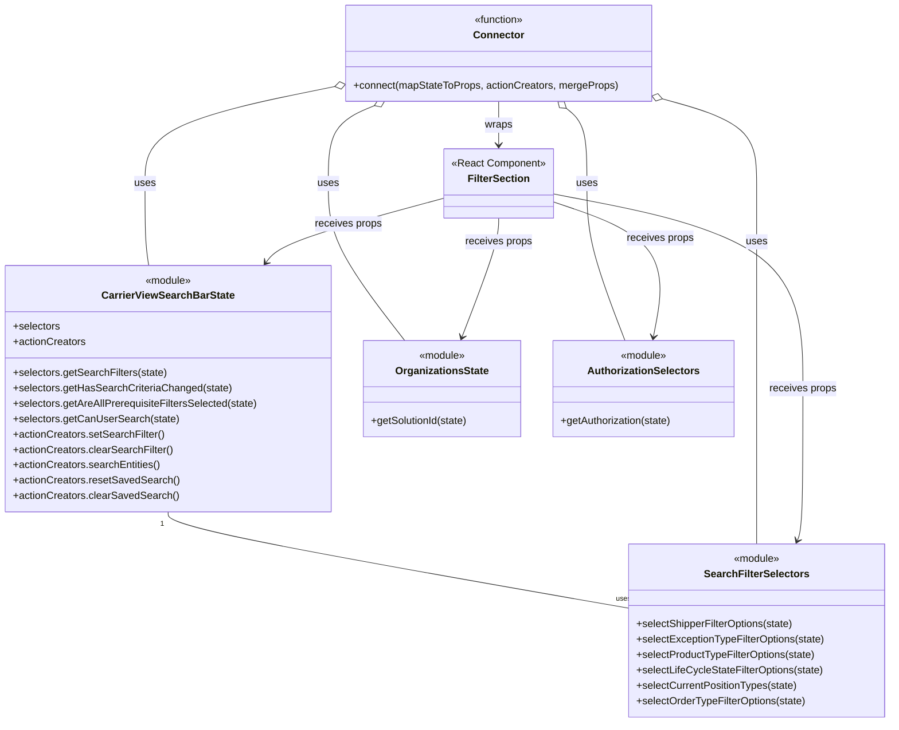

# Diagram: web/portal/src/pages/carrierview/components/search/CarrierView.SearchFilters.container.js


> Auto-generated by Obscura crawlers

## Diagram 1

```mermaid
flowchart LR
  subgraph Modules
    A[CarrierView.searchOptions\n(FILTERS)]
    B[CarrierView.SearchFilterSelectors\n(selectShipperFilterOptions,\nselectExceptionTypeFilterOptions,\nselectProductTypeFilterOptions,\nselectLifeCycleStateFilterOptions,\nselectCurrentPositionTypes,\nselectOrderTypeFilterOptions)]
    C[modules/organizations\n(getSolutionId)]
    D[modules/auth\n(getAuthorization)]
    E[CarrierViewSearchBarState\n(selectors, actionCreators)]
    F[components/search-bar\nFilterSection]
  end

  State[(Redux State)]
  State -->|passed into| M(mapStateToProps)
  M -->|reads from| D
  M -->|reads from| C
  M -->|reads from| B
  M -->|reads from| E
  M -->|produces props| P[stateProps]
  E -->|exposes| AC[actionCreators:\nsetSearchFilter,\nclearSearchFilter,\nsearchEntities,\nresetSavedSearch,\nclearSavedSearch]
  AC -->|provided as| Q[dispatchProps]
  P -->|combined with| Q --> R[mergeProps]
  A -->|attached as| R
  R -->|resulting props| Connected[Connected Component]
  Connected -->|wraps| F
  connect[connect(mapStateToProps,\nactionCreators,mergeProps)]
  M --> connect
  AC --> connect
  R --> connect
  connect --> Connected
```

> SVG rendering failed for this diagram.

## Diagram 2



### SVG

<svg id="container" width="1384.15625" xmlns="http://www.w3.org/2000/svg" class="classDiagram" height="1126" viewBox="0 0 1384.15625 1126" role="graphics-document document" aria-roledescription="class"><style>#container{font-family:"trebuchet ms",verdana,arial,sans-serif;font-size:16px;fill:#333;}@keyframes edge-animation-frame{from{stroke-dashoffset:0;}}@keyframes dash{to{stroke-dashoffset:0;}}#container .edge-animation-slow{stroke-dasharray:9,5!important;stroke-dashoffset:900;animation:dash 50s linear infinite;stroke-linecap:round;}#container .edge-animation-fast{stroke-dasharray:9,5!important;stroke-dashoffset:900;animation:dash 20s linear infinite;stroke-linecap:round;}#container .error-icon{fill:#552222;}#container .error-text{fill:#552222;stroke:#552222;}#container .edge-thickness-normal{stroke-width:1px;}#container .edge-thickness-thick{stroke-width:3.5px;}#container .edge-pattern-solid{stroke-dasharray:0;}#container .edge-thickness-invisible{stroke-width:0;fill:none;}#container .edge-pattern-dashed{stroke-dasharray:3;}#container .edge-pattern-dotted{stroke-dasharray:2;}#container .marker{fill:#333333;stroke:#333333;}#container .marker.cross{stroke:#333333;}#container svg{font-family:"trebuchet ms",verdana,arial,sans-serif;font-size:16px;}#container p{margin:0;}#container g.classGroup text{fill:#9370DB;stroke:none;font-family:"trebuchet ms",verdana,arial,sans-serif;font-size:10px;}#container g.classGroup text .title{font-weight:bolder;}#container .nodeLabel,#container .edgeLabel{color:#131300;}#container .edgeLabel .label rect{fill:#ECECFF;}#container .label text{fill:#131300;}#container .labelBkg{background:#ECECFF;}#container .edgeLabel .label span{background:#ECECFF;}#container .classTitle{font-weight:bolder;}#container .node rect,#container .node circle,#container .node ellipse,#container .node polygon,#container .node path{fill:#ECECFF;stroke:#9370DB;stroke-width:1px;}#container .divider{stroke:#9370DB;stroke-width:1;}#container g.clickable{cursor:pointer;}#container g.classGroup rect{fill:#ECECFF;stroke:#9370DB;}#container g.classGroup line{stroke:#9370DB;stroke-width:1;}#container .classLabel .box{stroke:none;stroke-width:0;fill:#ECECFF;opacity:0.5;}#container .classLabel .label{fill:#9370DB;font-size:10px;}#container .relation{stroke:#333333;stroke-width:1;fill:none;}#container .dashed-line{stroke-dasharray:3;}#container .dotted-line{stroke-dasharray:1 2;}#container #compositionStart,#container .composition{fill:#333333!important;stroke:#333333!important;stroke-width:1;}#container #compositionEnd,#container .composition{fill:#333333!important;stroke:#333333!important;stroke-width:1;}#container #dependencyStart,#container .dependency{fill:#333333!important;stroke:#333333!important;stroke-width:1;}#container #dependencyStart,#container .dependency{fill:#333333!important;stroke:#333333!important;stroke-width:1;}#container #extensionStart,#container .extension{fill:transparent!important;stroke:#333333!important;stroke-width:1;}#container #extensionEnd,#container .extension{fill:transparent!important;stroke:#333333!important;stroke-width:1;}#container #aggregationStart,#container .aggregation{fill:transparent!important;stroke:#333333!important;stroke-width:1;}#container #aggregationEnd,#container .aggregation{fill:transparent!important;stroke:#333333!important;stroke-width:1;}#container #lollipopStart,#container .lollipop{fill:#ECECFF!important;stroke:#333333!important;stroke-width:1;}#container #lollipopEnd,#container .lollipop{fill:#ECECFF!important;stroke:#333333!important;stroke-width:1;}#container .edgeTerminals{font-size:11px;line-height:initial;}#container .classTitleText{text-anchor:middle;font-size:18px;fill:#333;}#container .label-icon{display:inline-block;height:1em;overflow:visible;vertical-align:-0.125em;}#container .node .label-icon path{fill:currentColor;stroke:revert;stroke-width:revert;}#container :root{--mermaid-font-family:"trebuchet ms",verdana,arial,sans-serif;}</style><g><defs><marker id="container_class-aggregationStart" class="marker aggregation class" refX="18" refY="7" markerWidth="190" markerHeight="240" orient="auto"><path d="M 18,7 L9,13 L1,7 L9,1 Z"></path></marker></defs><defs><marker id="container_class-aggregationEnd" class="marker aggregation class" refX="1" refY="7" markerWidth="20" markerHeight="28" orient="auto"><path d="M 18,7 L9,13 L1,7 L9,1 Z"></path></marker></defs><defs><marker id="container_class-extensionStart" class="marker extension class" refX="18" refY="7" markerWidth="190" markerHeight="240" orient="auto"><path d="M 1,7 L18,13 V 1 Z"></path></marker></defs><defs><marker id="container_class-extensionEnd" class="marker extension class" refX="1" refY="7" markerWidth="20" markerHeight="28" orient="auto"><path d="M 1,1 V 13 L18,7 Z"></path></marker></defs><defs><marker id="container_class-compositionStart" class="marker composition class" refX="18" refY="7" markerWidth="190" markerHeight="240" orient="auto"><path d="M 18,7 L9,13 L1,7 L9,1 Z"></path></marker></defs><defs><marker id="container_class-compositionEnd" class="marker composition class" refX="1" refY="7" markerWidth="20" markerHeight="28" orient="auto"><path d="M 18,7 L9,13 L1,7 L9,1 Z"></path></marker></defs><defs><marker id="container_class-dependencyStart" class="marker dependency class" refX="6" refY="7" markerWidth="190" markerHeight="240" orient="auto"><path d="M 5,7 L9,13 L1,7 L9,1 Z"></path></marker></defs><defs><marker id="container_class-dependencyEnd" class="marker dependency class" refX="13" refY="7" markerWidth="20" markerHeight="28" orient="auto"><path d="M 18,7 L9,13 L14,7 L9,1 Z"></path></marker></defs><defs><marker id="container_class-lollipopStart" class="marker lollipop class" refX="13" refY="7" markerWidth="190" markerHeight="240" orient="auto"><circle stroke="black" fill="transparent" cx="7" cy="7" r="6"></circle></marker></defs><defs><marker id="container_class-lollipopEnd" class="marker lollipop class" refX="1" refY="7" markerWidth="190" markerHeight="240" orient="auto"><circle stroke="black" fill="transparent" cx="7" cy="7" r="6"></circle></marker></defs><g class="root"><g class="clusters"></g><g class="edgePaths"><path d="M260.551,798L260.551,802.167C260.551,806.333,260.551,814.667,380.219,839.718C499.888,864.769,739.225,906.538,858.894,927.422L978.563,948.306" id="id_CarrierViewSearchBarState_SearchFilterSelectors_1" class="edge-thickness-normal edge-pattern-solid relation" style=";;;" data-edge="true" data-et="edge" data-id="id_CarrierViewSearchBarState_SearchFilterSelectors_1" data-points="W3sieCI6MjYwLjU1MDc4MTI1LCJ5Ijo3OTh9LHsieCI6MjYwLjU1MDc4MTI1LCJ5Ijo4MjN9LHsieCI6OTc4LjU2MjUsInkiOjk0OC4zMDYyODA3MDM2OTc5fV0="></path><path d="M521.266,134.63L471.782,144.692C422.298,154.753,323.331,174.877,273.847,200.105C224.363,225.333,224.363,255.667,224.363,286C224.363,316.333,224.363,346.667,225.338,368C226.312,389.333,228.261,401.667,229.236,407.833L230.21,414" id="id_Connector_CarrierViewSearchBarState_2" class="edge-thickness-normal edge-pattern-solid relation" style=";;;" data-edge="true" data-et="edge" data-id="id_Connector_CarrierViewSearchBarState_2" data-points="W3sieCI6NTM4LjE2OTkyMTg3NSwieSI6MTMxLjE5Mjk1MDE3MDM3NzR9LHsieCI6MjI0LjM2MzI4MTI1LCJ5IjoxOTV9LHsieCI6MjI0LjM2MzI4MTI1LCJ5IjoyODZ9LHsieCI6MjI0LjM2MzI4MTI1LCJ5IjozNzd9LHsieCI6MjMwLjIxMDE2OTg5NjI4ODIyLCJ5Ijo0MTR9XQ==" marker-start="url(#container_class-aggregationStart)"></path><path d="M1028.819,153.633L1053.576,160.528C1078.332,167.422,1127.846,181.211,1152.603,203.272C1177.359,225.333,1177.359,255.667,1177.359,286C1177.359,316.333,1177.359,346.667,1177.359,400C1177.359,453.333,1177.359,529.667,1177.359,604C1177.359,678.333,1177.359,750.667,1177.359,791C1177.359,831.333,1177.359,839.667,1177.359,843.833L1177.359,848" id="id_Connector_SearchFilterSelectors_3" class="edge-thickness-normal edge-pattern-solid relation" style=";;;" data-edge="true" data-et="edge" data-id="id_Connector_SearchFilterSelectors_3" data-points="W3sieCI6MTAxMi4yMDExNzE4NzUsInkiOjE0OS4wMDU2NjI1ODU2NTUxfSx7IngiOjExNzcuMzU5Mzc1LCJ5IjoxOTV9LHsieCI6MTE3Ny4zNTkzNzUsInkiOjI4Nn0seyJ4IjoxMTc3LjM1OTM3NSwieSI6Mzc3fSx7IngiOjExNzcuMzU5Mzc1LCJ5Ijo2MDZ9LHsieCI6MTE3Ny4zNTkzNzUsInkiOjgyM30seyJ4IjoxMTc3LjM1OTM3NSwieSI6ODQ4fV0=" marker-start="url(#container_class-aggregationStart)"></path><path d="M581.426,164.702L569.451,169.752C557.475,174.802,533.525,184.901,521.55,205.117C509.574,225.333,509.574,255.667,509.574,286C509.574,316.333,509.574,346.667,529.373,387.5C549.172,428.333,588.77,479.667,608.569,505.333L628.368,531" id="id_Connector_OrganizationsState_4" class="edge-thickness-normal edge-pattern-solid relation" style=";;;" data-edge="true" data-et="edge" data-id="id_Connector_OrganizationsState_4" data-points="W3sieCI6NTk3LjMyMDgxODIxOTg2NiwieSI6MTU4fSx7IngiOjUwOS41NzQyMTg3NSwieSI6MTk1fSx7IngiOjUwOS41NzQyMTg3NSwieSI6Mjg2fSx7IngiOjUwOS41NzQyMTg3NSwieSI6Mzc3fSx7IngiOjYyOC4zNjgzNjQ0OTIzNTgxLCJ5Ijo1MzF9XQ==" marker-start="url(#container_class-aggregationStart)"></path><path d="M880.071,168.932L885.374,173.277C890.677,177.621,901.283,186.311,906.586,205.822C911.889,225.333,911.889,255.667,911.889,286C911.889,316.333,911.889,346.667,921.86,387.5C931.831,428.333,951.773,479.667,961.744,505.333L971.715,531" id="id_Connector_AuthorizationSelectors_5" class="edge-thickness-normal edge-pattern-solid relation" style=";;;" data-edge="true" data-et="edge" data-id="id_Connector_AuthorizationSelectors_5" data-points="W3sieCI6ODY2LjcyNzgxODA4MDM1NzEsInkiOjE1OH0seyJ4Ijo5MTEuODg4NjcxODc1LCJ5IjoxOTV9LHsieCI6OTExLjg4ODY3MTg3NSwieSI6Mjg2fSx7IngiOjkxMS44ODg2NzE4NzUsInkiOjM3N30seyJ4Ijo5NzEuNzE1MjQ0NjA5NzE2MSwieSI6NTMxfV0=" marker-start="url(#container_class-aggregationStart)"></path><path d="M775.186,158L775.186,164.167C775.186,170.333,775.186,182.667,775.186,194C775.186,205.333,775.186,215.667,775.186,220.833L775.186,226" id="id_Connector_FilterSection_6" class="edge-thickness-normal edge-pattern-solid relation" style=";;;" data-edge="true" data-et="edge" data-id="id_Connector_FilterSection_6" data-points="W3sieCI6Nzc1LjE4NTU0Njg3NSwieSI6MTU4fSx7IngiOjc3NS4xODU1NDY4NzUsInkiOjE5NX0seyJ4Ijo3NzUuMTg1NTQ2ODc1LCJ5IjoyMzJ9XQ==" marker-end="url(#container_class-dependencyEnd)"></path><path d="M689.975,308.942L647.845,320.285C605.716,331.628,521.458,354.314,475.182,371.032C428.907,387.75,420.615,398.499,416.469,403.874L412.322,409.249" id="id_FilterSection_CarrierViewSearchBarState_7" class="edge-thickness-normal edge-pattern-solid relation" style=";;;" data-edge="true" data-et="edge" data-id="id_FilterSection_CarrierViewSearchBarState_7" data-points="W3sieCI6Njg5Ljk3NDYwOTM3NSwieSI6MzA4Ljk0MjMzNDI1MjE0ODJ9LHsieCI6NDM3LjE5OTIxODc1LCJ5IjozNzd9LHsieCI6NDA4LjY1Nzc2ODE0OTU2MzMsInkiOjQxNH1d" marker-end="url(#container_class-dependencyEnd)"></path><path d="M860.396,302.34L925.286,314.783C990.176,327.227,1119.955,352.113,1184.845,402.723C1249.734,453.333,1249.734,529.667,1249.734,604C1249.734,678.333,1249.734,750.667,1248.262,790.089C1246.789,829.511,1243.844,836.022,1242.371,839.278L1240.899,842.533" id="id_FilterSection_SearchFilterSelectors_8" class="edge-thickness-normal edge-pattern-solid relation" style=";;;" data-edge="true" data-et="edge" data-id="id_FilterSection_SearchFilterSelectors_8" data-points="W3sieCI6ODYwLjM5NjQ4NDM3NSwieSI6MzAyLjM0MDE0MjE1ODA1MzF9LHsieCI6MTI0OS43MzQzNzUsInkiOjM3N30seyJ4IjoxMjQ5LjczNDM3NSwieSI6NjA2fSx7IngiOjEyNDkuNzM0Mzc1LCJ5Ijo4MjN9LHsieCI6MTIzOC40MjU3ODEyNSwieSI6ODQ4fV0=" marker-end="url(#container_class-dependencyEnd)"></path><path d="M775.186,340L775.186,346.167C775.186,352.333,775.186,364.667,765.577,395.568C755.968,426.469,736.75,475.938,727.141,500.673L717.532,525.407" id="id_FilterSection_OrganizationsState_9" class="edge-thickness-normal edge-pattern-solid relation" style=";;;" data-edge="true" data-et="edge" data-id="id_FilterSection_OrganizationsState_9" data-points="W3sieCI6Nzc1LjE4NTU0Njg3NSwieSI6MzQwfSx7IngiOjc3NS4xODU1NDY4NzUsInkiOjM3N30seyJ4Ijo3MTUuMzU4OTc0MTQwMjgzOSwieSI6NTMxfV0=" marker-end="url(#container_class-dependencyEnd)"></path><path d="M860.396,314.774L891.109,325.145C921.822,335.516,983.247,356.258,1009.236,391.313C1035.225,426.369,1025.778,475.738,1021.054,500.422L1016.331,525.107" id="id_FilterSection_AuthorizationSelectors_10" class="edge-thickness-normal edge-pattern-solid relation" style=";;;" data-edge="true" data-et="edge" data-id="id_FilterSection_AuthorizationSelectors_10" data-points="W3sieCI6ODYwLjM5NjQ4NDM3NSwieSI6MzE0Ljc3Mzk4NDA2OTgwODc2fSx7IngiOjEwNDQuNjcxODc1LCJ5IjozNzd9LHsieCI6MTAxNS4yMDMxOTMyMzE0NDEsInkiOjUzMX1d" marker-end="url(#container_class-dependencyEnd)"></path></g><g class="edgeLabels"><g class="edgeLabel"><g class="label" data-id="id_CarrierViewSearchBarState_SearchFilterSelectors_1" transform="translate(0, 0)"><foreignObject width="0" height="0"><div xmlns="http://www.w3.org/1999/xhtml" class="labelBkg" style="display: table-cell; white-space: nowrap; line-height: 1.5; max-width: 200px; text-align: center;"><span class="edgeLabel"></span></div></foreignObject></g></g><g class="edgeLabel" transform="translate(224.36328125, 286)"><g class="label" data-id="id_Connector_CarrierViewSearchBarState_2" transform="translate(-16.4921875, -12)"><foreignObject width="32.984375" height="24"><div xmlns="http://www.w3.org/1999/xhtml" class="labelBkg" style="display: table-cell; white-space: nowrap; line-height: 1.5; max-width: 200px; text-align: center;"><span class="edgeLabel"><p>uses</p></span></div></foreignObject></g></g><g class="edgeLabel" transform="translate(1177.359375, 377)"><g class="label" data-id="id_Connector_SearchFilterSelectors_3" transform="translate(-16.4921875, -12)"><foreignObject width="32.984375" height="24"><div xmlns="http://www.w3.org/1999/xhtml" class="labelBkg" style="display: table-cell; white-space: nowrap; line-height: 1.5; max-width: 200px; text-align: center;"><span class="edgeLabel"><p>uses</p></span></div></foreignObject></g></g><g class="edgeLabel" transform="translate(509.57421875, 286)"><g class="label" data-id="id_Connector_OrganizationsState_4" transform="translate(-16.4921875, -12)"><foreignObject width="32.984375" height="24"><div xmlns="http://www.w3.org/1999/xhtml" class="labelBkg" style="display: table-cell; white-space: nowrap; line-height: 1.5; max-width: 200px; text-align: center;"><span class="edgeLabel"><p>uses</p></span></div></foreignObject></g></g><g class="edgeLabel" transform="translate(911.888671875, 286)"><g class="label" data-id="id_Connector_AuthorizationSelectors_5" transform="translate(-16.4921875, -12)"><foreignObject width="32.984375" height="24"><div xmlns="http://www.w3.org/1999/xhtml" class="labelBkg" style="display: table-cell; white-space: nowrap; line-height: 1.5; max-width: 200px; text-align: center;"><span class="edgeLabel"><p>uses</p></span></div></foreignObject></g></g><g class="edgeLabel" transform="translate(775.185546875, 195)"><g class="label" data-id="id_Connector_FilterSection_6" transform="translate(-21.390625, -12)"><foreignObject width="42.78125" height="24"><div xmlns="http://www.w3.org/1999/xhtml" class="labelBkg" style="display: table-cell; white-space: nowrap; line-height: 1.5; max-width: 200px; text-align: center;"><span class="edgeLabel"><p>wraps</p></span></div></foreignObject></g></g><g class="edgeLabel" transform="translate(541.02577, 349.04557)"><g class="label" data-id="id_FilterSection_CarrierViewSearchBarState_7" transform="translate(-52.375, -12)"><foreignObject width="104.75" height="24"><div xmlns="http://www.w3.org/1999/xhtml" class="labelBkg" style="display: table-cell; white-space: nowrap; line-height: 1.5; max-width: 200px; text-align: center;"><span class="edgeLabel"><p>receives props</p></span></div></foreignObject></g></g><g class="edgeLabel" transform="translate(1249.734375, 606)"><g class="label" data-id="id_FilterSection_SearchFilterSelectors_8" transform="translate(-52.375, -12)"><foreignObject width="104.75" height="24"><div xmlns="http://www.w3.org/1999/xhtml" class="labelBkg" style="display: table-cell; white-space: nowrap; line-height: 1.5; max-width: 200px; text-align: center;"><span class="edgeLabel"><p>receives props</p></span></div></foreignObject></g></g><g class="edgeLabel" transform="translate(775.185546875, 377)"><g class="label" data-id="id_FilterSection_OrganizationsState_9" transform="translate(-52.375, -12)"><foreignObject width="104.75" height="24"><div xmlns="http://www.w3.org/1999/xhtml" class="labelBkg" style="display: table-cell; white-space: nowrap; line-height: 1.5; max-width: 200px; text-align: center;"><span class="edgeLabel"><p>receives props</p></span></div></foreignObject></g></g><g class="edgeLabel" transform="translate(1026.81076, 370.96867)"><g class="label" data-id="id_FilterSection_AuthorizationSelectors_10" transform="translate(-52.375, -12)"><foreignObject width="104.75" height="24"><div xmlns="http://www.w3.org/1999/xhtml" class="labelBkg" style="display: table-cell; white-space: nowrap; line-height: 1.5; max-width: 200px; text-align: center;"><span class="edgeLabel"><p>receives props</p></span></div></foreignObject></g></g><g class="edgeTerminals" transform="translate(251.40241831087175, 816.5485162100656)"><g class="inner" transform="translate(0, 0)"><foreignObject style="width: 9px; height: 12px;"><div xmlns="http://www.w3.org/1999/xhtml" style="display: inline-block; padding-right: 1px; white-space: nowrap;"><span class="edgeLabel">1</span></div></foreignObject></g></g><g class="edgeTerminals" transform="translate(958.901860438037, 925.5210167128274)"><g class="inner" transform="translate(0, 0)"></g><foreignObject style="width: 36px; height: 12px;"><div xmlns="http://www.w3.org/1999/xhtml" style="display: inline-block; padding-right: 1px; white-space: nowrap;"><span class="edgeLabel">uses</span></div></foreignObject></g></g><g class="nodes"><g class="node default" id="classId-CarrierViewSearchBarState-0" transform="translate(260.55078125, 606)"><g class="basic label-container"><path d="M-252.55078125 -192 L252.55078125 -192 L252.55078125 192 L-252.55078125 192" stroke="none" stroke-width="0" fill="#ECECFF" style=""></path><path d="M-252.55078125 -192 C-65.4288387145042 -192, 121.69310382099161 -192, 252.55078125 -192 M-252.55078125 -192 C-66.55834367799307 -192, 119.43409389401387 -192, 252.55078125 -192 M252.55078125 -192 C252.55078125 -65.02750416325478, 252.55078125 61.94499167349045, 252.55078125 192 M252.55078125 -192 C252.55078125 -71.34899887742884, 252.55078125 49.30200224514232, 252.55078125 192 M252.55078125 192 C53.96994690907354 192, -144.61088743185292 192, -252.55078125 192 M252.55078125 192 C54.43505664087792 192, -143.68066796824417 192, -252.55078125 192 M-252.55078125 192 C-252.55078125 102.1853322282335, -252.55078125 12.370664456467011, -252.55078125 -192 M-252.55078125 192 C-252.55078125 92.35529153588539, -252.55078125 -7.28941692822923, -252.55078125 -192" stroke="#9370DB" stroke-width="1.3" fill="none" stroke-dasharray="0 0" style=""></path></g><g class="annotation-group text" transform="translate(-36.6015625, -168)"><g class="label" style="" transform="translate(0,-12)"><foreignObject width="73.203125" height="24"><div xmlns="http://www.w3.org/1999/xhtml" style="display: table-cell; white-space: nowrap; line-height: 1.5; max-width: 123px; text-align: center;"><span class="nodeLabel markdown-node-label" style=""><p>«module»</p></span></div></foreignObject></g></g><g class="label-group text" transform="translate(-98.9765625, -144)"><g class="label" style="font-weight: bolder" transform="translate(0,-12)"><foreignObject width="197.953125" height="24"><div xmlns="http://www.w3.org/1999/xhtml" style="display: table-cell; white-space: nowrap; line-height: 1.5; max-width: 244px; text-align: center;"><span class="nodeLabel markdown-node-label" style=""><p>CarrierViewSearchBarState</p></span></div></foreignObject></g></g><g class="members-group text" transform="translate(-240.55078125, -96)"><g class="label" style="" transform="translate(0,-12)"><foreignObject width="73.453125" height="24"><div xmlns="http://www.w3.org/1999/xhtml" style="display: table-cell; white-space: nowrap; line-height: 1.5; max-width: 131px; text-align: center;"><span class="nodeLabel markdown-node-label" style=""><p>+selectors</p></span></div></foreignObject></g><g class="label" style="" transform="translate(0,12)"><foreignObject width="113.078125" height="24"><div xmlns="http://www.w3.org/1999/xhtml" style="display: table-cell; white-space: nowrap; line-height: 1.5; max-width: 170px; text-align: center;"><span class="nodeLabel markdown-node-label" style=""><p>+actionCreators</p></span></div></foreignObject></g></g><g class="methods-group text" transform="translate(-240.55078125, -24)"><g class="label" style="" transform="translate(0,-12)"><foreignObject width="239.015625" height="24"><div xmlns="http://www.w3.org/1999/xhtml" style="display: table-cell; white-space: nowrap; line-height: 1.5; max-width: 296px; text-align: center;"><span class="nodeLabel markdown-node-label" style=""><p>+selectors.getSearchFilters(state)</p></span></div></foreignObject></g><g class="label" style="" transform="translate(0,12)"><foreignObject width="337.421875" height="24"><div xmlns="http://www.w3.org/1999/xhtml" style="display: table-cell; white-space: nowrap; line-height: 1.5; max-width: 395px; text-align: center;"><span class="nodeLabel markdown-node-label" style=""><p>+selectors.getHasSearchCriteriaChanged(state)</p></span></div></foreignObject></g><g class="label" style="" transform="translate(0,36)"><foreignObject width="382.125" height="24"><div xmlns="http://www.w3.org/1999/xhtml" style="display: table-cell; white-space: nowrap; line-height: 1.5; max-width: 439px; text-align: center;"><span class="nodeLabel markdown-node-label" style=""><p>+selectors.getAreAllPrerequisiteFiltersSelected(state)</p></span></div></foreignObject></g><g class="label" style="" transform="translate(0,60)"><foreignObject width="254.609375" height="24"><div xmlns="http://www.w3.org/1999/xhtml" style="display: table-cell; white-space: nowrap; line-height: 1.5; max-width: 312px; text-align: center;"><span class="nodeLabel markdown-node-label" style=""><p>+selectors.getCanUserSearch(state)</p></span></div></foreignObject></g><g class="label" style="" transform="translate(0,84)"><foreignObject width="234.953125" height="24"><div xmlns="http://www.w3.org/1999/xhtml" style="display: table-cell; white-space: nowrap; line-height: 1.5; max-width: 292px; text-align: center;"><span class="nodeLabel markdown-node-label" style=""><p>+actionCreators.setSearchFilter()</p></span></div></foreignObject></g><g class="label" style="" transform="translate(0,108)"><foreignObject width="248.453125" height="24"><div xmlns="http://www.w3.org/1999/xhtml" style="display: table-cell; white-space: nowrap; line-height: 1.5; max-width: 306px; text-align: center;"><span class="nodeLabel markdown-node-label" style=""><p>+actionCreators.clearSearchFilter()</p></span></div></foreignObject></g><g class="label" style="" transform="translate(0,132)"><foreignObject width="229.359375" height="24"><div xmlns="http://www.w3.org/1999/xhtml" style="display: table-cell; white-space: nowrap; line-height: 1.5; max-width: 287px; text-align: center;"><span class="nodeLabel markdown-node-label" style=""><p>+actionCreators.searchEntities()</p></span></div></foreignObject></g><g class="label" style="" transform="translate(0,156)"><foreignObject width="255.65625" height="24"><div xmlns="http://www.w3.org/1999/xhtml" style="display: table-cell; white-space: nowrap; line-height: 1.5; max-width: 313px; text-align: center;"><span class="nodeLabel markdown-node-label" style=""><p>+actionCreators.resetSavedSearch()</p></span></div></foreignObject></g><g class="label" style="" transform="translate(0,180)"><foreignObject width="254.8125" height="24"><div xmlns="http://www.w3.org/1999/xhtml" style="display: table-cell; white-space: nowrap; line-height: 1.5; max-width: 312px; text-align: center;"><span class="nodeLabel markdown-node-label" style=""><p>+actionCreators.clearSavedSearch()</p></span></div></foreignObject></g></g><g class="divider" style=""><path d="M-252.55078125 -120 C-130.96888082909126 -120, -9.386980408182524 -120, 252.55078125 -120 M-252.55078125 -120 C-147.89984824510543 -120, -43.248915240210835 -120, 252.55078125 -120" stroke="#9370DB" stroke-width="1.3" fill="none" stroke-dasharray="0 0" style=""></path></g><g class="divider" style=""><path d="M-252.55078125 -48 C-66.33397743686734 -48, 119.88282637626531 -48, 252.55078125 -48 M-252.55078125 -48 C-143.34857942787258 -48, -34.14637760574516 -48, 252.55078125 -48" stroke="#9370DB" stroke-width="1.3" fill="none" stroke-dasharray="0 0" style=""></path></g></g><g class="node default" id="classId-SearchFilterSelectors-1" transform="translate(1177.359375, 983)"><g class="basic label-container"><path d="M-198.796875 -135 L198.796875 -135 L198.796875 135 L-198.796875 135" stroke="none" stroke-width="0" fill="#ECECFF" style=""></path><path d="M-198.796875 -135 C-78.91229953056937 -135, 40.97227593886126 -135, 198.796875 -135 M-198.796875 -135 C-113.42993790159403 -135, -28.06300080318806 -135, 198.796875 -135 M198.796875 -135 C198.796875 -77.08984524125798, 198.796875 -19.17969048251595, 198.796875 135 M198.796875 -135 C198.796875 -65.72890797795829, 198.796875 3.5421840440834274, 198.796875 135 M198.796875 135 C107.07653622588364 135, 15.356197451767287 135, -198.796875 135 M198.796875 135 C56.139938478064664 135, -86.51699804387067 135, -198.796875 135 M-198.796875 135 C-198.796875 69.55545955885464, -198.796875 4.1109191177092725, -198.796875 -135 M-198.796875 135 C-198.796875 54.54023959951827, -198.796875 -25.919520800963454, -198.796875 -135" stroke="#9370DB" stroke-width="1.3" fill="none" stroke-dasharray="0 0" style=""></path></g><g class="annotation-group text" transform="translate(-36.6015625, -111)"><g class="label" style="" transform="translate(0,-12)"><foreignObject width="73.203125" height="24"><div xmlns="http://www.w3.org/1999/xhtml" style="display: table-cell; white-space: nowrap; line-height: 1.5; max-width: 123px; text-align: center;"><span class="nodeLabel markdown-node-label" style=""><p>«module»</p></span></div></foreignObject></g></g><g class="label-group text" transform="translate(-77.75, -87)"><g class="label" style="font-weight: bolder" transform="translate(0,-12)"><foreignObject width="155.5" height="24"><div xmlns="http://www.w3.org/1999/xhtml" style="display: table-cell; white-space: nowrap; line-height: 1.5; max-width: 202px; text-align: center;"><span class="nodeLabel markdown-node-label" style=""><p>SearchFilterSelectors</p></span></div></foreignObject></g></g><g class="members-group text" transform="translate(-186.796875, -39)"></g><g class="methods-group text" transform="translate(-186.796875, -9)"><g class="label" style="" transform="translate(0,-12)"><foreignObject width="247.890625" height="24"><div xmlns="http://www.w3.org/1999/xhtml" style="display: table-cell; white-space: nowrap; line-height: 1.5; max-width: 305px; text-align: center;"><span class="nodeLabel markdown-node-label" style=""><p>+selectShipperFilterOptions(state)</p></span></div></foreignObject></g><g class="label" style="" transform="translate(0,12)"><foreignObject width="295.84375" height="24"><div xmlns="http://www.w3.org/1999/xhtml" style="display: table-cell; white-space: nowrap; line-height: 1.5; max-width: 353px; text-align: center;"><span class="nodeLabel markdown-node-label" style=""><p>+selectExceptionTypeFilterOptions(state)</p></span></div></foreignObject></g><g class="label" style="" transform="translate(0,36)"><foreignObject width="281.4375" height="24"><div xmlns="http://www.w3.org/1999/xhtml" style="display: table-cell; white-space: nowrap; line-height: 1.5; max-width: 339px; text-align: center;"><span class="nodeLabel markdown-node-label" style=""><p>+selectProductTypeFilterOptions(state)</p></span></div></foreignObject></g><g class="label" style="" transform="translate(0,60)"><foreignObject width="292.078125" height="24"><div xmlns="http://www.w3.org/1999/xhtml" style="display: table-cell; white-space: nowrap; line-height: 1.5; max-width: 349px; text-align: center;"><span class="nodeLabel markdown-node-label" style=""><p>+selectLifeCycleStateFilterOptions(state)</p></span></div></foreignObject></g><g class="label" style="" transform="translate(0,84)"><foreignObject width="251.5" height="24"><div xmlns="http://www.w3.org/1999/xhtml" style="display: table-cell; white-space: nowrap; line-height: 1.5; max-width: 309px; text-align: center;"><span class="nodeLabel markdown-node-label" style=""><p>+selectCurrentPositionTypes(state)</p></span></div></foreignObject></g><g class="label" style="" transform="translate(0,108)"><foreignObject width="266.34375" height="24"><div xmlns="http://www.w3.org/1999/xhtml" style="display: table-cell; white-space: nowrap; line-height: 1.5; max-width: 324px; text-align: center;"><span class="nodeLabel markdown-node-label" style=""><p>+selectOrderTypeFilterOptions(state)</p></span></div></foreignObject></g></g><g class="divider" style=""><path d="M-198.796875 -63 C-60.68659679581191 -63, 77.42368140837618 -63, 198.796875 -63 M-198.796875 -63 C-79.18777578095533 -63, 40.42132343808933 -63, 198.796875 -63" stroke="#9370DB" stroke-width="1.3" fill="none" stroke-dasharray="0 0" style=""></path></g><g class="divider" style=""><path d="M-198.796875 -39 C-67.01176188724739 -39, 64.77335122550522 -39, 198.796875 -39 M-198.796875 -39 C-95.6422059507589 -39, 7.512463098482186 -39, 198.796875 -39" stroke="#9370DB" stroke-width="1.3" fill="none" stroke-dasharray="0 0" style=""></path></g></g><g class="node default" id="classId-OrganizationsState-2" transform="translate(686.22265625, 606)"><g class="basic label-container"><path d="M-123.12109375 -75 L123.12109375 -75 L123.12109375 75 L-123.12109375 75" stroke="none" stroke-width="0" fill="#ECECFF" style=""></path><path d="M-123.12109375 -75 C-42.331080819877855 -75, 38.45893211024429 -75, 123.12109375 -75 M-123.12109375 -75 C-66.34571052171077 -75, -9.570327293421556 -75, 123.12109375 -75 M123.12109375 -75 C123.12109375 -32.81448814902913, 123.12109375 9.371023701941738, 123.12109375 75 M123.12109375 -75 C123.12109375 -23.589903562596355, 123.12109375 27.82019287480729, 123.12109375 75 M123.12109375 75 C30.3630484725455 75, -62.394996804909 75, -123.12109375 75 M123.12109375 75 C61.37803015093777 75, -0.36503344812446414 75, -123.12109375 75 M-123.12109375 75 C-123.12109375 25.93018534879169, -123.12109375 -23.139629302416623, -123.12109375 -75 M-123.12109375 75 C-123.12109375 28.639882392033677, -123.12109375 -17.720235215932647, -123.12109375 -75" stroke="#9370DB" stroke-width="1.3" fill="none" stroke-dasharray="0 0" style=""></path></g><g class="annotation-group text" transform="translate(-36.6015625, -51)"><g class="label" style="" transform="translate(0,-12)"><foreignObject width="73.203125" height="24"><div xmlns="http://www.w3.org/1999/xhtml" style="display: table-cell; white-space: nowrap; line-height: 1.5; max-width: 123px; text-align: center;"><span class="nodeLabel markdown-node-label" style=""><p>«module»</p></span></div></foreignObject></g></g><g class="label-group text" transform="translate(-69.8671875, -27)"><g class="label" style="font-weight: bolder" transform="translate(0,-12)"><foreignObject width="139.734375" height="24"><div xmlns="http://www.w3.org/1999/xhtml" style="display: table-cell; white-space: nowrap; line-height: 1.5; max-width: 187px; text-align: center;"><span class="nodeLabel markdown-node-label" style=""><p>OrganizationsState</p></span></div></foreignObject></g></g><g class="members-group text" transform="translate(-111.12109375, 21)"></g><g class="methods-group text" transform="translate(-111.12109375, 51)"><g class="label" style="" transform="translate(0,-12)"><foreignObject width="152.375" height="24"><div xmlns="http://www.w3.org/1999/xhtml" style="display: table-cell; white-space: nowrap; line-height: 1.5; max-width: 210px; text-align: center;"><span class="nodeLabel markdown-node-label" style=""><p>+getSolutionId(state)</p></span></div></foreignObject></g></g><g class="divider" style=""><path d="M-123.12109375 -3 C-61.254028487278454 -3, 0.6130367754430921 -3, 123.12109375 -3 M-123.12109375 -3 C-41.72915528040494 -3, 39.66278318919012 -3, 123.12109375 -3" stroke="#9370DB" stroke-width="1.3" fill="none" stroke-dasharray="0 0" style=""></path></g><g class="divider" style=""><path d="M-123.12109375 21 C-54.77686156016961 21, 13.567370629660786 21, 123.12109375 21 M-123.12109375 21 C-59.6104231586844 21, 3.900247432631204 21, 123.12109375 21" stroke="#9370DB" stroke-width="1.3" fill="none" stroke-dasharray="0 0" style=""></path></g></g><g class="node default" id="classId-AuthorizationSelectors-3" transform="translate(1000.8515625, 606)"><g class="basic label-container"><path d="M-141.5078125 -75 L141.5078125 -75 L141.5078125 75 L-141.5078125 75" stroke="none" stroke-width="0" fill="#ECECFF" style=""></path><path d="M-141.5078125 -75 C-40.55635116995096 -75, 60.395110160098085 -75, 141.5078125 -75 M-141.5078125 -75 C-55.47382310521445 -75, 30.5601662895711 -75, 141.5078125 -75 M141.5078125 -75 C141.5078125 -42.528629823876535, 141.5078125 -10.057259647753071, 141.5078125 75 M141.5078125 -75 C141.5078125 -21.623192250485417, 141.5078125 31.753615499029166, 141.5078125 75 M141.5078125 75 C80.37091894012448 75, 19.234025380248966 75, -141.5078125 75 M141.5078125 75 C38.477100177331295 75, -64.55361214533741 75, -141.5078125 75 M-141.5078125 75 C-141.5078125 18.231415800703616, -141.5078125 -38.53716839859277, -141.5078125 -75 M-141.5078125 75 C-141.5078125 19.9401651852033, -141.5078125 -35.1196696295934, -141.5078125 -75" stroke="#9370DB" stroke-width="1.3" fill="none" stroke-dasharray="0 0" style=""></path></g><g class="annotation-group text" transform="translate(-36.6015625, -51)"><g class="label" style="" transform="translate(0,-12)"><foreignObject width="73.203125" height="24"><div xmlns="http://www.w3.org/1999/xhtml" style="display: table-cell; white-space: nowrap; line-height: 1.5; max-width: 123px; text-align: center;"><span class="nodeLabel markdown-node-label" style=""><p>«module»</p></span></div></foreignObject></g></g><g class="label-group text" transform="translate(-83.875, -27)"><g class="label" style="font-weight: bolder" transform="translate(0,-12)"><foreignObject width="167.75" height="24"><div xmlns="http://www.w3.org/1999/xhtml" style="display: table-cell; white-space: nowrap; line-height: 1.5; max-width: 215px; text-align: center;"><span class="nodeLabel markdown-node-label" style=""><p>AuthorizationSelectors</p></span></div></foreignObject></g></g><g class="members-group text" transform="translate(-129.5078125, 21)"></g><g class="methods-group text" transform="translate(-129.5078125, 51)"><g class="label" style="" transform="translate(0,-12)"><foreignObject width="175.140625" height="24"><div xmlns="http://www.w3.org/1999/xhtml" style="display: table-cell; white-space: nowrap; line-height: 1.5; max-width: 233px; text-align: center;"><span class="nodeLabel markdown-node-label" style=""><p>+getAuthorization(state)</p></span></div></foreignObject></g></g><g class="divider" style=""><path d="M-141.5078125 -3 C-76.22117517572663 -3, -10.934537851453257 -3, 141.5078125 -3 M-141.5078125 -3 C-77.30038060183655 -3, -13.092948703673102 -3, 141.5078125 -3" stroke="#9370DB" stroke-width="1.3" fill="none" stroke-dasharray="0 0" style=""></path></g><g class="divider" style=""><path d="M-141.5078125 21 C-60.74574727342721 21, 20.016317953145574 21, 141.5078125 21 M-141.5078125 21 C-78.36797974698464 21, -15.228146993969276 21, 141.5078125 21" stroke="#9370DB" stroke-width="1.3" fill="none" stroke-dasharray="0 0" style=""></path></g></g><g class="node default" id="classId-FilterSection-4" transform="translate(775.185546875, 286)"><g class="basic label-container"><path d="M-85.2109375 -54 L85.2109375 -54 L85.2109375 54 L-85.2109375 54" stroke="none" stroke-width="0" fill="#ECECFF" style=""></path><path d="M-85.2109375 -54 C-39.03344533273731 -54, 7.144046834525383 -54, 85.2109375 -54 M-85.2109375 -54 C-30.011413786191035 -54, 25.18810992761793 -54, 85.2109375 -54 M85.2109375 -54 C85.2109375 -10.939420847536802, 85.2109375 32.1211583049264, 85.2109375 54 M85.2109375 -54 C85.2109375 -12.003296264852764, 85.2109375 29.99340747029447, 85.2109375 54 M85.2109375 54 C30.054325282965245 54, -25.10228693406951 54, -85.2109375 54 M85.2109375 54 C17.367254132193153 54, -50.47642923561369 54, -85.2109375 54 M-85.2109375 54 C-85.2109375 19.313282002314935, -85.2109375 -15.37343599537013, -85.2109375 -54 M-85.2109375 54 C-85.2109375 21.99597508461231, -85.2109375 -10.008049830775377, -85.2109375 -54" stroke="#9370DB" stroke-width="1.3" fill="none" stroke-dasharray="0 0" style=""></path></g><g class="annotation-group text" transform="translate(-73.2109375, -30)"><g class="label" style="" transform="translate(0,-12)"><foreignObject width="146.421875" height="24"><div xmlns="http://www.w3.org/1999/xhtml" style="display: table-cell; white-space: nowrap; line-height: 1.5; max-width: 196px; text-align: center;"><span class="nodeLabel markdown-node-label" style=""><p>«React Component»</p></span></div></foreignObject></g></g><g class="label-group text" transform="translate(-46.3203125, -6)"><g class="label" style="font-weight: bolder" transform="translate(0,-12)"><foreignObject width="92.640625" height="24"><div xmlns="http://www.w3.org/1999/xhtml" style="display: table-cell; white-space: nowrap; line-height: 1.5; max-width: 141px; text-align: center;"><span class="nodeLabel markdown-node-label" style=""><p>FilterSection</p></span></div></foreignObject></g></g><g class="members-group text" transform="translate(-73.2109375, 42)"></g><g class="methods-group text" transform="translate(-73.2109375, 72)"></g><g class="divider" style=""><path d="M-85.2109375 18 C-46.60103322754205 18, -7.991128955084093 18, 85.2109375 18 M-85.2109375 18 C-28.66654367947782 18, 27.877850141044362 18, 85.2109375 18" stroke="#9370DB" stroke-width="1.3" fill="none" stroke-dasharray="0 0" style=""></path></g><g class="divider" style=""><path d="M-85.2109375 36 C-44.693519059824084 36, -4.176100619648167 36, 85.2109375 36 M-85.2109375 36 C-23.541002064612222 36, 38.128933370775556 36, 85.2109375 36" stroke="#9370DB" stroke-width="1.3" fill="none" stroke-dasharray="0 0" style=""></path></g></g><g class="node default" id="classId-Connector-5" transform="translate(775.185546875, 83)"><g class="basic label-container"><path d="M-237.015625 -75 L237.015625 -75 L237.015625 75 L-237.015625 75" stroke="none" stroke-width="0" fill="#ECECFF" style=""></path><path d="M-237.015625 -75 C-51.87921759220458 -75, 133.25718981559083 -75, 237.015625 -75 M-237.015625 -75 C-82.1078349566929 -75, 72.7999550866142 -75, 237.015625 -75 M237.015625 -75 C237.015625 -39.08276785080181, 237.015625 -3.1655357016036163, 237.015625 75 M237.015625 -75 C237.015625 -15.646656660072694, 237.015625 43.70668667985461, 237.015625 75 M237.015625 75 C70.61001134809305 75, -95.7956023038139 75, -237.015625 75 M237.015625 75 C88.5569029648558 75, -59.90181907028841 75, -237.015625 75 M-237.015625 75 C-237.015625 23.353832311076708, -237.015625 -28.292335377846584, -237.015625 -75 M-237.015625 75 C-237.015625 35.67065189530406, -237.015625 -3.658696209391877, -237.015625 -75" stroke="#9370DB" stroke-width="1.3" fill="none" stroke-dasharray="0 0" style=""></path></g><g class="annotation-group text" transform="translate(-39.484375, -51)"><g class="label" style="" transform="translate(0,-12)"><foreignObject width="78.96875" height="24"><div xmlns="http://www.w3.org/1999/xhtml" style="display: table-cell; white-space: nowrap; line-height: 1.5; max-width: 129px; text-align: center;"><span class="nodeLabel markdown-node-label" style=""><p>«function»</p></span></div></foreignObject></g></g><g class="label-group text" transform="translate(-37.421875, -27)"><g class="label" style="font-weight: bolder" transform="translate(0,-12)"><foreignObject width="74.84375" height="24"><div xmlns="http://www.w3.org/1999/xhtml" style="display: table-cell; white-space: nowrap; line-height: 1.5; max-width: 125px; text-align: center;"><span class="nodeLabel markdown-node-label" style=""><p>Connector</p></span></div></foreignObject></g></g><g class="members-group text" transform="translate(-225.015625, 21)"></g><g class="methods-group text" transform="translate(-225.015625, 51)"><g class="label" style="" transform="translate(0,-12)"><foreignObject width="410.546875" height="24"><div xmlns="http://www.w3.org/1999/xhtml" style="display: table-cell; white-space: nowrap; line-height: 1.5; max-width: 468px; text-align: center;"><span class="nodeLabel markdown-node-label" style=""><p>+connect(mapStateToProps, actionCreators, mergeProps)</p></span></div></foreignObject></g></g><g class="divider" style=""><path d="M-237.015625 -3 C-63.74275017348796 -3, 109.53012465302407 -3, 237.015625 -3 M-237.015625 -3 C-87.96540702843092 -3, 61.084810943138166 -3, 237.015625 -3" stroke="#9370DB" stroke-width="1.3" fill="none" stroke-dasharray="0 0" style=""></path></g><g class="divider" style=""><path d="M-237.015625 21 C-80.58345172471712 21, 75.84872155056576 21, 237.015625 21 M-237.015625 21 C-90.61251419057089 21, 55.79059661885822 21, 237.015625 21" stroke="#9370DB" stroke-width="1.3" fill="none" stroke-dasharray="0 0" style=""></path></g></g></g></g></g></svg>
