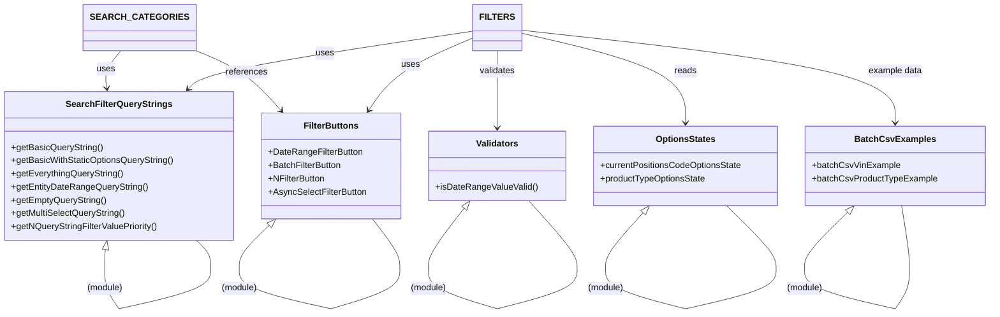

# Diagram: web/portal/src/pages/carrierview/components/search/CarrierView.searchOptions.js

> Auto-generated by Obscura crawlers

## Mermaid

### SVG

<svg id="container" width="1771.296875" xmlns="http://www.w3.org/2000/svg" class="classDiagram" height="568.25" viewBox="0 0 1771.296875 568.25" role="graphics-document document" aria-roledescription="class"><g><defs><marker id="container_class-aggregationStart" class="marker aggregation class" refX="18" refY="7" markerWidth="190" markerHeight="240" orient="auto"><path d="M 18,7 L9,13 L1,7 L9,1 Z"></path></marker></defs><defs><marker id="container_class-aggregationEnd" class="marker aggregation class" refX="1" refY="7" markerWidth="20" markerHeight="28" orient="auto"><path d="M 18,7 L9,13 L1,7 L9,1 Z"></path></marker></defs><defs><marker id="container_class-extensionStart" class="marker extension class" refX="18" refY="7" markerWidth="190" markerHeight="240" orient="auto"><path d="M 1,7 L18,13 V 1 Z"></path></marker></defs><defs><marker id="container_class-extensionEnd" class="marker extension class" refX="1" refY="7" markerWidth="20" markerHeight="28" orient="auto"><path d="M 1,1 V 13 L18,7 Z"></path></marker></defs><defs><marker id="container_class-compositionStart" class="marker composition class" refX="18" refY="7" markerWidth="190" markerHeight="240" orient="auto"><path d="M 18,7 L9,13 L1,7 L9,1 Z"></path></marker></defs><defs><marker id="container_class-compositionEnd" class="marker composition class" refX="1" refY="7" markerWidth="20" markerHeight="28" orient="auto"><path d="M 18,7 L9,13 L1,7 L9,1 Z"></path></marker></defs><defs><marker id="container_class-dependencyStart" class="marker dependency class" refX="6" refY="7" markerWidth="190" markerHeight="240" orient="auto"><path d="M 5,7 L9,13 L1,7 L9,1 Z"></path></marker></defs><defs><marker id="container_class-dependencyEnd" class="marker dependency class" refX="13" refY="7" markerWidth="20" markerHeight="28" orient="auto"><path d="M 18,7 L9,13 L14,7 L9,1 Z"></path></marker></defs><defs><marker id="container_class-lollipopStart" class="marker lollipop class" refX="13" refY="7" markerWidth="190" markerHeight="240" orient="auto"><circle stroke="black" fill="transparent" cx="7" cy="7" r="6"></circle></marker></defs><defs><marker id="container_class-lollipopEnd" class="marker lollipop class" refX="1" refY="7" markerWidth="190" markerHeight="240" orient="auto"><circle stroke="black" fill="transparent" cx="7" cy="7" r="6"></circle></marker></defs><g class="root"><g class="clusters"></g><g class="edgePaths"><path d="M216.913,92L211.945,98.167C206.976,104.333,197.039,116.667,192.868,128.012C188.697,139.357,190.292,149.713,191.09,154.892L191.887,160.07" id="id_SEARCH_CATEGORIES_SearchFilterQueryStrings_1" class="edge-thickness-normal edge-pattern-solid relation" style=";;;" data-edge="true" data-et="edge" data-id="id_SEARCH_CATEGORIES_SearchFilterQueryStrings_1" data-points="W3sieCI6MjE2LjkxMzQxOTY5OTM2NzEsInkiOjkyfSx7IngiOjE4Ny4xMDE1NjI1LCJ5IjoxMjl9LHsieCI6MTkyLjgwMDQ2MzI5OTQxODYsInkiOjE2Nn1d" marker-end="url(#container_class-dependencyEnd)"></path><path d="M338.871,86.541L355.936,93.617C373.001,100.694,407.132,114.847,434.824,133.844C462.517,152.84,483.772,176.681,494.4,188.601L505.027,200.521" id="id_SEARCH_CATEGORIES_FilterButtons_2" class="edge-thickness-normal edge-pattern-solid relation" style=";;;" data-edge="true" data-et="edge" data-id="id_SEARCH_CATEGORIES_FilterButtons_2" data-points="W3sieCI6MzM4Ljg3MTA5Mzc1LCJ5Ijo4Ni41NDA1MzcyMTU1MDEzM30seyJ4Ijo0NDEuMjYxNzE4NzUsInkiOjEyOX0seyJ4Ijo1MDkuMDE5OTg1NDY1MTE2MywieSI6MjA1fV0=" marker-end="url(#container_class-dependencyEnd)"></path><path d="M852.406,55.953L771.495,68.127C690.585,80.302,528.763,104.651,443.02,122.246C357.276,139.84,347.612,150.681,342.779,156.101L337.947,161.521" id="id_FILTERS_SearchFilterQueryStrings_3" class="edge-thickness-normal edge-pattern-solid relation" style=";;;" data-edge="true" data-et="edge" data-id="id_FILTERS_SearchFilterQueryStrings_3" data-points="W3sieCI6ODUyLjQwNjI1LCJ5Ijo1NS45NTI5MDQyMzg2MTg1Mn0seyJ4IjozNjYuOTQxNDA2MjUsInkiOjEyOX0seyJ4IjozMzMuOTUzODI5MDMzNDMwMiwieSI6MTY2fV0=" marker-end="url(#container_class-dependencyEnd)"></path><path d="M852.406,67.054L828.455,77.378C804.504,87.703,756.602,108.351,724.801,130.509C693.001,152.667,677.302,176.333,669.453,188.167L661.604,200" id="id_FILTERS_FilterButtons_4" class="edge-thickness-normal edge-pattern-solid relation" style=";;;" data-edge="true" data-et="edge" data-id="id_FILTERS_FilterButtons_4" data-points="W3sieCI6ODUyLjQwNjI1LCJ5Ijo2Ny4wNTM3NzU4MTY4NjgwOH0seyJ4Ijo3MDguNjk5MjE4NzUsInkiOjEyOX0seyJ4Ijo2NTguMjg3NDI3MzI1NTgxMywieSI6MjA1fV0=" marker-end="url(#container_class-dependencyEnd)"></path><path d="M891.969,92L891.969,98.167C891.969,104.333,891.969,116.667,891.969,140C891.969,163.333,891.969,197.667,891.969,214.833L891.969,232" id="id_FILTERS_Validators_5" class="edge-thickness-normal edge-pattern-solid relation" style=";;;" data-edge="true" data-et="edge" data-id="id_FILTERS_Validators_5" data-points="W3sieCI6ODkxLjk2ODc1LCJ5Ijo5Mn0seyJ4Ijo4OTEuOTY4NzUsInkiOjEyOX0seyJ4Ijo4OTEuOTY4NzUsInkiOjIzOH1d" marker-end="url(#container_class-dependencyEnd)"></path><path d="M931.531,59.224L981.411,70.853C1031.29,82.483,1131.049,105.741,1180.929,133.037C1230.809,160.333,1230.809,191.667,1230.809,207.333L1230.809,223" id="id_FILTERS_OptionsStates_6" class="edge-thickness-normal edge-pattern-solid relation" style=";;;" data-edge="true" data-et="edge" data-id="id_FILTERS_OptionsStates_6" data-points="W3sieCI6OTMxLjUzMTI1LCJ5Ijo1OS4yMjM5MzczNzgyMzIyNX0seyJ4IjoxMjMwLjgwODU5Mzc1LCJ5IjoxMjl9LHsieCI6MTIzMC44MDg1OTM3NSwieSI6MjI5fV0=" marker-end="url(#container_class-dependencyEnd)"></path><path d="M931.531,54.38L1043.86,66.817C1156.189,79.253,1380.846,104.127,1493.175,132.23C1605.504,160.333,1605.504,191.667,1605.504,207.333L1605.504,223" id="id_FILTERS_BatchCsvExamples_7" class="edge-thickness-normal edge-pattern-solid relation" style=";;;" data-edge="true" data-et="edge" data-id="id_FILTERS_BatchCsvExamples_7" data-points="W3sieCI6OTMxLjUzMTI1LCJ5Ijo1NC4zODAyMTUxNDc5NDg0MzR9LHsieCI6MTYwNS41MDM5MDYyNSwieSI6MTI5fSx7IngiOjE2MDUuNTAzOTA2MjUsInkiOjIyOX1d" marker-end="url(#container_class-dependencyEnd)"></path><path d="M188.501,453.02L188.281,454.35C188.062,455.68,187.623,458.34,187.403,463.837C187.184,469.333,187.184,477.667,187.184,481.833L187.184,486" id="SearchFilterQueryStrings-cyclic-special-1" class="edge-thickness-normal edge-pattern-solid relation" style=";;;" data-edge="true" data-et="edge" data-id="SearchFilterQueryStrings-cyclic-special-1" data-points="W3sieCI6MTkxLjMxMDE4MDY2NDA2MjUsInkiOjQzNn0seyJ4IjoxODcuMTgzNTkzNzUsInkiOjQ2MX0seyJ4IjoxODcuMTgzNTkzNzUsInkiOjQ4Nn1d" marker-start="url(#container_class-extensionStart)"></path><path d="M187.184,486.1L187.184,492.267C187.184,498.433,187.184,510.767,191.579,523.1C195.975,535.433,204.767,547.767,209.162,553.933L213.558,560.1" id="SearchFilterQueryStrings-cyclic-special-mid" class="edge-thickness-normal edge-pattern-solid relation" style=";;;" data-edge="true" data-et="edge" data-id="SearchFilterQueryStrings-cyclic-special-mid" data-points="W3sieCI6MTg3LjE4MzU5Mzc1LCJ5Ijo0ODYuMTAwMDAwMDAxNDkwMX0seyJ4IjoxODcuMTgzNTkzNzUsInkiOjUyMy4xMDAwMDAwMDE0OTAxfSx7IngiOjIxMy41NTgxMDg3NjI5NjQ5LCJ5Ijo1NjAuMTAwMDAwMDAxNDkwMX1d"></path><path d="M213.644,560.139L240.985,553.966C268.326,547.792,323.009,535.446,350.35,523.098C377.691,510.75,377.691,498.4,377.691,488.05C377.691,477.7,377.691,469.35,373.418,461.008C369.145,452.667,360.598,444.333,356.325,440.167L352.051,436" id="SearchFilterQueryStrings-cyclic-special-2" class="edge-thickness-normal edge-pattern-solid relation" style=";;;" data-edge="true" data-et="edge" data-id="SearchFilterQueryStrings-cyclic-special-2" data-points="W3sieCI6MjEzLjY0Mzc1MDAwMDc0NTA2LCJ5Ijo1NjAuMTM4NzEwOTkyNTY4OH0seyJ4IjozNzcuNjkxNDA2MjUsInkiOjUyMy4xMDAwMDAwMDE0OTAxfSx7IngiOjM3Ny42OTE0MDYyNSwieSI6NDg2LjA1MDAwMDAwMDc0NTA2fSx7IngiOjM3Ny42OTE0MDYyNSwieSI6NDYxfSx7IngiOjM1Mi4wNTExNDc0NjA5Mzc1LCJ5Ijo0MzZ9XQ=="></path><path d="M483.8,409.042L474.919,417.702C466.037,426.362,448.274,443.681,439.393,456.507C430.512,469.333,430.512,477.667,430.512,481.833L430.512,486" id="FilterButtons-cyclic-special-1" class="edge-thickness-normal edge-pattern-solid relation" style=";;;" data-edge="true" data-et="edge" data-id="FilterButtons-cyclic-special-1" data-points="W3sieCI6NDk2LjE1MDc4MTI1LCJ5IjozOTd9LHsieCI6NDMwLjUxMTcxODc1LCJ5Ijo0NjF9LHsieCI6NDMwLjUxMTcxODc1LCJ5Ijo0ODZ9XQ==" marker-start="url(#container_class-extensionStart)"></path><path d="M430.512,486.1L430.512,492.267C430.512,498.433,430.512,510.767,457.853,523.106C485.194,535.446,539.877,547.792,567.218,553.966L594.559,560.139" id="FilterButtons-cyclic-special-mid" class="edge-thickness-normal edge-pattern-solid relation" style=";;;" data-edge="true" data-et="edge" data-id="FilterButtons-cyclic-special-mid" data-points="W3sieCI6NDMwLjUxMTcxODc1LCJ5Ijo0ODYuMTAwMDAwMDAxNDkwMX0seyJ4Ijo0MzAuNTExNzE4NzUsInkiOjUyMy4xMDAwMDAwMDE0OTAxfSx7IngiOjU5NC41NTkzNzQ5OTkyNTQ5LCJ5Ijo1NjAuMTM4NzEwOTkyNTY4OH1d"></path><path d="M594.659,560.135L615.029,553.962C635.399,547.79,676.139,535.445,696.509,523.097C716.879,510.75,716.879,498.4,716.879,488.05C716.879,477.7,716.879,469.35,708.728,454.508C700.576,439.667,684.274,418.333,676.122,407.667L667.971,397" id="FilterButtons-cyclic-special-2" class="edge-thickness-normal edge-pattern-solid relation" style=";;;" data-edge="true" data-et="edge" data-id="FilterButtons-cyclic-special-2" data-points="W3sieCI6NTk0LjY1OTM3NTAwMDc0NTEsInkiOjU2MC4xMzQ4NDkwNDgzNjU1fSx7IngiOjcxNi44Nzg5MDYyNSwieSI6NTIzLjEwMDAwMDAwMTQ5MDF9LHsieCI6NzE2Ljg3ODkwNjI1LCJ5Ijo0ODYuMDUwMDAwMDAwNzQ1MDZ9LHsieCI6NzE2Ljg3ODkwNjI1LCJ5Ijo0NjF9LHsieCI6NjY3Ljk3MTA5Mzc1LCJ5IjozOTd9XQ=="></path><path d="M833.351,377.706L822.742,391.588C812.134,405.471,790.917,433.235,780.308,451.284C769.699,469.333,769.699,477.667,769.699,481.833L769.699,486" id="Validators-cyclic-special-1" class="edge-thickness-normal edge-pattern-solid relation" style=";;;" data-edge="true" data-et="edge" data-id="Validators-cyclic-special-1" data-points="W3sieCI6ODQzLjgyNTEyMjA3MDMxMjUsInkiOjM2NH0seyJ4Ijo3NjkuNjk5MjE4NzUsInkiOjQ2MX0seyJ4Ijo3NjkuNjk5MjE4NzUsInkiOjQ4Nn1d" marker-start="url(#container_class-extensionStart)"></path><path d="M769.699,486.1L769.699,492.267C769.699,498.433,769.699,510.767,790.069,523.106C810.439,535.445,851.179,547.79,871.549,553.962L891.919,560.135" id="Validators-cyclic-special-mid" class="edge-thickness-normal edge-pattern-solid relation" style=";;;" data-edge="true" data-et="edge" data-id="Validators-cyclic-special-mid" data-points="W3sieCI6NzY5LjY5OTIxODc1LCJ5Ijo0ODYuMTAwMDAwMDAxNDkwMX0seyJ4Ijo3NjkuNjk5MjE4NzUsInkiOjUyMy4xMDAwMDAwMDE0OTAxfSx7IngiOjg5MS45MTg3NDk5OTkyNTQ5LCJ5Ijo1NjAuMTM0ODQ5MDQ4MzY1NX1d"></path><path d="M892.019,560.137L915.845,553.964C939.672,547.791,987.325,535.446,1011.152,523.098C1034.979,510.75,1034.979,498.4,1034.979,488.05C1034.979,477.7,1034.979,469.35,1020.529,449.008C1006.079,428.667,977.179,396.333,962.729,380.167L948.279,364" id="Validators-cyclic-special-2" class="edge-thickness-normal edge-pattern-solid relation" style=";;;" data-edge="true" data-et="edge" data-id="Validators-cyclic-special-2" data-points="W3sieCI6ODkyLjAxODc1MDAwMDc0NTEsInkiOjU2MC4xMzcwNDYzNDEyMDY5fSx7IngiOjEwMzQuOTc4NTE1NjI1LCJ5Ijo1MjMuMTAwMDAwMDAxNDkwMX0seyJ4IjoxMDM0Ljk3ODUxNTYyNSwieSI6NDg2LjA1MDAwMDAwMDc0NTA2fSx7IngiOjEwMzQuOTc4NTE1NjI1LCJ5Ijo0NjF9LHsieCI6OTQ4LjI3ODg0NTIxNDg0MzcsInkiOjM2NH1d"></path><path d="M1154.959,385.861L1143.765,398.384C1132.572,410.908,1110.185,435.954,1098.992,452.644C1087.799,469.333,1087.799,477.667,1087.799,481.833L1087.799,486" id="OptionsStates-cyclic-special-1" class="edge-thickness-normal edge-pattern-solid relation" style=";;;" data-edge="true" data-et="edge" data-id="OptionsStates-cyclic-special-1" data-points="W3sieCI6MTE2Ni40NTQxOTkyMTg3NSwieSI6MzczfSx7IngiOjEwODcuNzk4ODI4MTI1LCJ5Ijo0NjF9LHsieCI6MTA4Ny43OTg4MjgxMjUsInkiOjQ4Nn1d" marker-start="url(#container_class-extensionStart)"></path><path d="M1087.799,486.1L1087.799,492.267C1087.799,498.433,1087.799,510.767,1111.625,523.106C1135.452,535.446,1183.105,547.791,1206.932,553.964L1230.759,560.137" id="OptionsStates-cyclic-special-mid" class="edge-thickness-normal edge-pattern-solid relation" style=";;;" data-edge="true" data-et="edge" data-id="OptionsStates-cyclic-special-mid" data-points="W3sieCI6MTA4Ny43OTg4MjgxMjUsInkiOjQ4Ni4xMDAwMDAwMDE0OTAxfSx7IngiOjEwODcuNzk4ODI4MTI1LCJ5Ijo1MjMuMTAwMDAwMDAxNDkwMX0seyJ4IjoxMjMwLjc1ODU5Mzc0OTI1NSwieSI6NTYwLjEzNzA0NjM0MTIwNjl9XQ=="></path><path d="M1230.859,560.138L1257.673,553.965C1284.488,547.792,1338.117,535.446,1364.932,523.098C1391.746,510.75,1391.746,498.4,1391.746,488.05C1391.746,477.7,1391.746,469.35,1376.993,450.508C1362.241,431.667,1332.736,402.333,1317.983,387.667L1303.23,373" id="OptionsStates-cyclic-special-2" class="edge-thickness-normal edge-pattern-solid relation" style=";;;" data-edge="true" data-et="edge" data-id="OptionsStates-cyclic-special-2" data-points="W3sieCI6MTIzMC44NTg1OTM3NTA3NDUsInkiOjU2MC4xMzg0ODkzMjI0NTE3fSx7IngiOjEzOTEuNzQ2MDkzNzUsInkiOjUyMy4xMDAwMDAwMDE0OTAxfSx7IngiOjEzOTEuNzQ2MDkzNzUsInkiOjQ4Ni4wNTAwMDAwMDA3NDUwNn0seyJ4IjoxMzkxLjc0NjA5Mzc1LCJ5Ijo0NjF9LHsieCI6MTMwMy4yMzA0Njg3NSwieSI6MzczfV0="></path><path d="M1520.849,385.162L1508.135,397.802C1495.421,410.441,1469.994,435.721,1457.28,452.527C1444.566,469.333,1444.566,477.667,1444.566,481.833L1444.566,486" id="BatchCsvExamples-cyclic-special-1" class="edge-thickness-normal edge-pattern-solid relation" style=";;;" data-edge="true" data-et="edge" data-id="BatchCsvExamples-cyclic-special-1" data-points="W3sieCI6MTUzMy4wODIwMzEyNSwieSI6MzczfSx7IngiOjE0NDQuNTY2NDA2MjUsInkiOjQ2MX0seyJ4IjoxNDQ0LjU2NjQwNjI1LCJ5Ijo0ODZ9XQ==" marker-start="url(#container_class-extensionStart)"></path><path d="M1444.566,486.1L1444.566,492.267C1444.566,498.433,1444.566,510.767,1471.381,523.106C1498.196,535.446,1551.825,547.792,1578.639,553.965L1605.454,560.138" id="BatchCsvExamples-cyclic-special-mid" class="edge-thickness-normal edge-pattern-solid relation" style=";;;" data-edge="true" data-et="edge" data-id="BatchCsvExamples-cyclic-special-mid" data-points="W3sieCI6MTQ0NC41NjY0MDYyNSwieSI6NDg2LjEwMDAwMDAwMTQ5MDF9LHsieCI6MTQ0NC41NjY0MDYyNSwieSI6NTIzLjEwMDAwMDAwMTQ5MDF9LHsieCI6MTYwNS40NTM5MDYyNDkyNTUsInkiOjU2MC4xMzg0ODkzMjI0NTE3fV0="></path><path d="M1605.54,560.1L1609.935,553.933C1614.331,547.767,1623.123,535.433,1627.518,523.092C1631.914,510.75,1631.914,498.4,1631.914,488.05C1631.914,477.7,1631.914,469.35,1629.493,450.508C1627.072,431.667,1622.23,402.333,1619.809,387.667L1617.388,373" id="BatchCsvExamples-cyclic-special-2" class="edge-thickness-normal edge-pattern-solid relation" style=";;;" data-edge="true" data-et="edge" data-id="BatchCsvExamples-cyclic-special-2" data-points="W3sieCI6MTYwNS41Mzk1NDc0ODcwMzUyLCJ5Ijo1NjAuMTAwMDAwMDAxNDkwMX0seyJ4IjoxNjMxLjkxNDA2MjUsInkiOjUyMy4xMDAwMDAwMDE0OTAxfSx7IngiOjE2MzEuOTE0MDYyNSwieSI6NDg2LjA1MDAwMDAwMDc0NTA2fSx7IngiOjE2MzEuOTE0MDYyNSwieSI6NDYxfSx7IngiOjE2MTcuMzg4NDc2NTYyNSwieSI6MzczfV0="></path></g><g class="edgeLabels"><g class="edgeLabel" transform="translate(190.26353, 125.07562)"><g class="label" data-id="id_SEARCH_CATEGORIES_SearchFilterQueryStrings_1" transform="translate(-16.4921875, -12)"><foreignObject width="32.984375" height="24">

uses

</foreignObject></g></g><g class="edgeLabel" transform="translate(437.09304, 127.27133)"><g class="label" data-id="id_SEARCH_CATEGORIES_FilterButtons_2" transform="translate(-37.828125, -12)"><foreignObject width="75.65625" height="24">

references

</foreignObject></g></g><g class="edgeLabel" transform="translate(585.16475, 96.16429)"><g class="label" data-id="id_FILTERS_SearchFilterQueryStrings_3" transform="translate(-16.4921875, -12)"><foreignObject width="32.984375" height="24">

uses

</foreignObject></g></g><g class="edgeLabel" transform="translate(738.67776, 116.07748)"><g class="label" data-id="id_FILTERS_FilterButtons_4" transform="translate(-16.4921875, -12)"><foreignObject width="32.984375" height="24">

uses

</foreignObject></g></g><g class="edgeLabel" transform="translate(891.96875, 129)"><g class="label" data-id="id_FILTERS_Validators_5" transform="translate(-32.6875, -12)"><foreignObject width="65.375" height="24">

validates

</foreignObject></g></g><g class="edgeLabel" transform="translate(1230.80859375, 129)"><g class="label" data-id="id_FILTERS_OptionsStates_6" transform="translate(-20.0078125, -12)"><foreignObject width="40.015625" height="24">

reads

</foreignObject></g></g><g class="edgeLabel" transform="translate(1605.50390625, 129)"><g class="label" data-id="id_FILTERS_BatchCsvExamples_7" transform="translate(-49.1171875, -12)"><foreignObject width="98.234375" height="24">

example data

</foreignObject></g></g><g class="edgeLabel"><g class="label" data-id="SearchFilterQueryStrings-cyclic-special-1" transform="translate(0, 0)"><foreignObject width="0" height="0">

</foreignObject></g></g><g class="edgeLabel" transform="translate(187.18359375, 523.1000000014901)"><g class="label" data-id="SearchFilterQueryStrings-cyclic-special-mid" transform="translate(-32.8203125, -12)"><foreignObject width="65.640625" height="24">

(module)

</foreignObject></g></g><g class="edgeLabel"><g class="label" data-id="SearchFilterQueryStrings-cyclic-special-2" transform="translate(0, 0)"><foreignObject width="0" height="0">

</foreignObject></g></g><g class="edgeLabel"><g class="label" data-id="FilterButtons-cyclic-special-1" transform="translate(0, 0)"><foreignObject width="0" height="0">

</foreignObject></g></g><g class="edgeLabel" transform="translate(430.51171875, 523.1000000014901)"><g class="label" data-id="FilterButtons-cyclic-special-mid" transform="translate(-32.8203125, -12)"><foreignObject width="65.640625" height="24">

(module)

</foreignObject></g></g><g class="edgeLabel"><g class="label" data-id="FilterButtons-cyclic-special-2" transform="translate(0, 0)"><foreignObject width="0" height="0">

</foreignObject></g></g><g class="edgeLabel"><g class="label" data-id="Validators-cyclic-special-1" transform="translate(0, 0)"><foreignObject width="0" height="0">

</foreignObject></g></g><g class="edgeLabel" transform="translate(769.69921875, 523.1000000014901)"><g class="label" data-id="Validators-cyclic-special-mid" transform="translate(-32.8203125, -12)"><foreignObject width="65.640625" height="24">

(module)

</foreignObject></g></g><g class="edgeLabel"><g class="label" data-id="Validators-cyclic-special-2" transform="translate(0, 0)"><foreignObject width="0" height="0">

</foreignObject></g></g><g class="edgeLabel"><g class="label" data-id="OptionsStates-cyclic-special-1" transform="translate(0, 0)"><foreignObject width="0" height="0">

</foreignObject></g></g><g class="edgeLabel" transform="translate(1087.798828125, 523.1000000014901)"><g class="label" data-id="OptionsStates-cyclic-special-mid" transform="translate(-32.8203125, -12)"><foreignObject width="65.640625" height="24">

(module)

</foreignObject></g></g><g class="edgeLabel"><g class="label" data-id="OptionsStates-cyclic-special-2" transform="translate(0, 0)"><foreignObject width="0" height="0">

</foreignObject></g></g><g class="edgeLabel"><g class="label" data-id="BatchCsvExamples-cyclic-special-1" transform="translate(0, 0)"><foreignObject width="0" height="0">

</foreignObject></g></g><g class="edgeLabel" transform="translate(1444.56640625, 523.1000000014901)"><g class="label" data-id="BatchCsvExamples-cyclic-special-mid" transform="translate(-32.8203125, -12)"><foreignObject width="65.640625" height="24">

(module)

</foreignObject></g></g><g class="edgeLabel"><g class="label" data-id="BatchCsvExamples-cyclic-special-2" transform="translate(0, 0)"><foreignObject width="0" height="0">

</foreignObject></g></g></g><g class="nodes"><g class="node default" id="classId-SEARCH_CATEGORIES-0" transform="translate(250.75390625, 50)"><g class="basic label-container"><path d="M-88.1171875 -42 L88.1171875 -42 L88.1171875 42 L-88.1171875 42" stroke="none" stroke-width="0" fill="#ECECFF" style=""></path><path d="M-88.1171875 -42 C-43.44314078470113 -42, 1.2309059305977428 -42, 88.1171875 -42 M-88.1171875 -42 C-25.96349112601255 -42, 36.1902052479749 -42, 88.1171875 -42 M88.1171875 -42 C88.1171875 -12.531915329424251, 88.1171875 16.936169341151498, 88.1171875 42 M88.1171875 -42 C88.1171875 -12.756710698889872, 88.1171875 16.486578602220256, 88.1171875 42 M88.1171875 42 C32.81589350039336 42, -22.485400499213284 42, -88.1171875 42 M88.1171875 42 C41.43106185189148 42, -5.255063796217044 42, -88.1171875 42 M-88.1171875 42 C-88.1171875 16.045469849613585, -88.1171875 -9.909060300772829, -88.1171875 -42 M-88.1171875 42 C-88.1171875 17.226811702966874, -88.1171875 -7.546376594066253, -88.1171875 -42" stroke="#9370DB" stroke-width="1.3" fill="none" stroke-dasharray="0 0" style=""></path></g><g class="annotation-group text" transform="translate(0, -18)"></g><g class="label-group text" transform="translate(-76.1171875, -18)"><g class="label" style="font-weight: bolder" transform="translate(0,-12)"><foreignObject width="152.234375" height="24">

SEARCH_CATEGORIES

</foreignObject></g></g><g class="members-group text" transform="translate(-76.1171875, 30)"></g><g class="methods-group text" transform="translate(-76.1171875, 60)"></g><g class="divider" style=""><path d="M-88.1171875 6 C-29.609352710935916 6, 28.89848207812817 6, 88.1171875 6 M-88.1171875 6 C-31.18829063085373 6, 25.740606238292543 6, 88.1171875 6" stroke="#9370DB" stroke-width="1.3" fill="none" stroke-dasharray="0 0" style=""></path></g><g class="divider" style=""><path d="M-88.1171875 24 C-39.10768902811463 24, 9.901809443770745 24, 88.1171875 24 M-88.1171875 24 C-50.08443304395617 24, -12.051678587912335 24, 88.1171875 24" stroke="#9370DB" stroke-width="1.3" fill="none" stroke-dasharray="0 0" style=""></path></g></g><g class="node default" id="classId-FILTERS-1" transform="translate(891.96875, 50)"><g class="basic label-container"><path d="M-39.5625 -42 L39.5625 -42 L39.5625 42 L-39.5625 42" stroke="none" stroke-width="0" fill="#ECECFF" style=""></path><path d="M-39.5625 -42 C-21.953275005625287 -42, -4.344050011250573 -42, 39.5625 -42 M-39.5625 -42 C-20.232390669192228 -42, -0.902281338384455 -42, 39.5625 -42 M39.5625 -42 C39.5625 -23.327411096644312, 39.5625 -4.654822193288624, 39.5625 42 M39.5625 -42 C39.5625 -22.61169695466445, 39.5625 -3.223393909328898, 39.5625 42 M39.5625 42 C19.280681864056625 42, -1.0011362718867503 42, -39.5625 42 M39.5625 42 C13.06579758535474 42, -13.430904829290519 42, -39.5625 42 M-39.5625 42 C-39.5625 23.2990547708937, -39.5625 4.598109541787402, -39.5625 -42 M-39.5625 42 C-39.5625 17.764592838501386, -39.5625 -6.470814322997228, -39.5625 -42" stroke="#9370DB" stroke-width="1.3" fill="none" stroke-dasharray="0 0" style=""></path></g><g class="annotation-group text" transform="translate(0, -18)"></g><g class="label-group text" transform="translate(-27.5625, -18)"><g class="label" style="font-weight: bolder" transform="translate(0,-12)"><foreignObject width="55.125" height="24">

FILTERS

</foreignObject></g></g><g class="members-group text" transform="translate(-27.5625, 30)"></g><g class="methods-group text" transform="translate(-27.5625, 60)"></g><g class="divider" style=""><path d="M-39.5625 6 C-9.087637578160873 6, 21.387224843678254 6, 39.5625 6 M-39.5625 6 C-21.297077434471987 6, -3.031654868943974 6, 39.5625 6" stroke="#9370DB" stroke-width="1.3" fill="none" stroke-dasharray="0 0" style=""></path></g><g class="divider" style=""><path d="M-39.5625 24 C-18.024714475328462 24, 3.5130710493430755 24, 39.5625 24 M-39.5625 24 C-17.726063250210288 24, 4.110373499579424 24, 39.5625 24" stroke="#9370DB" stroke-width="1.3" fill="none" stroke-dasharray="0 0" style=""></path></g></g><g class="node default" id="classId-SearchFilterQueryStrings-2" transform="translate(213.59375, 301)"><g class="basic label-container"><path d="M-205.59375 -135 L205.59375 -135 L205.59375 135 L-205.59375 135" stroke="none" stroke-width="0" fill="#ECECFF" style=""></path><path d="M-205.59375 -135 C-121.77697672323382 -135, -37.96020344646763 -135, 205.59375 -135 M-205.59375 -135 C-98.84866524534539 -135, 7.896419509309226 -135, 205.59375 -135 M205.59375 -135 C205.59375 -59.061689863521295, 205.59375 16.87662027295741, 205.59375 135 M205.59375 -135 C205.59375 -73.40955294930384, 205.59375 -11.819105898607674, 205.59375 135 M205.59375 135 C44.00131133002145 135, -117.5911273399571 135, -205.59375 135 M205.59375 135 C43.575789099104725 135, -118.44217180179055 135, -205.59375 135 M-205.59375 135 C-205.59375 55.57394940114355, -205.59375 -23.852101197712898, -205.59375 -135 M-205.59375 135 C-205.59375 58.54962169439143, -205.59375 -17.900756611217133, -205.59375 -135" stroke="#9370DB" stroke-width="1.3" fill="none" stroke-dasharray="0 0" style=""></path></g><g class="annotation-group text" transform="translate(0, -111)"></g><g class="label-group text" transform="translate(-91.390625, -111)"><g class="label" style="font-weight: bolder" transform="translate(0,-12)"><foreignObject width="182.78125" height="24">

SearchFilterQueryStrings

</foreignObject></g></g><g class="members-group text" transform="translate(-193.59375, -63)"></g><g class="methods-group text" transform="translate(-193.59375, -33)"><g class="label" style="" transform="translate(0,-12)"><foreignObject width="164.84375" height="24">

+getBasicQueryString()

</foreignObject></g><g class="label" style="" transform="translate(0,12)"><foreignObject width="295.796875" height="24">

+getBasicWithStaticOptionsQueryString()

</foreignObject></g><g class="label" style="" transform="translate(0,36)"><foreignObject width="203.109375" height="24">

+getEverythingQueryString()

</foreignObject></g><g class="label" style="" transform="translate(0,60)"><foreignObject width="246.0625" height="24">

+getEntityDateRangeQueryString()

</foreignObject></g><g class="label" style="" transform="translate(0,84)"><foreignObject width="172.125" height="24">

+getEmptyQueryString()

</foreignObject></g><g class="label" style="" transform="translate(0,108)"><foreignObject width="207.859375" height="24">

+getMultiSelectQueryString()

</foreignObject></g><g class="label" style="" transform="translate(0,132)"><foreignObject width="267.578125" height="24">

+getNQueryStringFilterValuePriority()

</foreignObject></g></g><g class="divider" style=""><path d="M-205.59375 -87 C-69.85009498280334 -87, 65.89356003439332 -87, 205.59375 -87 M-205.59375 -87 C-104.91642614827059 -87, -4.239102296541176 -87, 205.59375 -87" stroke="#9370DB" stroke-width="1.3" fill="none" stroke-dasharray="0 0" style=""></path></g><g class="divider" style=""><path d="M-205.59375 -63 C-116.77791573638167 -63, -27.962081472763344 -63, 205.59375 -63 M-205.59375 -63 C-107.91945659477673 -63, -10.245163189553466 -63, 205.59375 -63" stroke="#9370DB" stroke-width="1.3" fill="none" stroke-dasharray="0 0" style=""></path></g></g><g class="node default" id="classId-FilterButtons-3" transform="translate(594.609375, 301)"><g class="basic label-container"><path d="M-125.421875 -96 L125.421875 -96 L125.421875 96 L-125.421875 96" stroke="none" stroke-width="0" fill="#ECECFF" style=""></path><path d="M-125.421875 -96 C-44.643414446930564 -96, 36.13504610613887 -96, 125.421875 -96 M-125.421875 -96 C-37.25470239443415 -96, 50.912470211131705 -96, 125.421875 -96 M125.421875 -96 C125.421875 -51.37309313452959, 125.421875 -6.74618626905918, 125.421875 96 M125.421875 -96 C125.421875 -32.01775204982146, 125.421875 31.96449590035708, 125.421875 96 M125.421875 96 C43.46635985209711 96, -38.48915529580577 96, -125.421875 96 M125.421875 96 C54.095195624000056 96, -17.23148375199989 96, -125.421875 96 M-125.421875 96 C-125.421875 28.802042759070645, -125.421875 -38.39591448185871, -125.421875 -96 M-125.421875 96 C-125.421875 46.85379931037718, -125.421875 -2.2924013792456464, -125.421875 -96" stroke="#9370DB" stroke-width="1.3" fill="none" stroke-dasharray="0 0" style=""></path></g><g class="annotation-group text" transform="translate(0, -72)"></g><g class="label-group text" transform="translate(-47.5625, -72)"><g class="label" style="font-weight: bolder" transform="translate(0,-12)"><foreignObject width="95.125" height="24">

FilterButtons

</foreignObject></g></g><g class="members-group text" transform="translate(-113.421875, -24)"><g class="label" style="" transform="translate(0,-12)"><foreignObject width="171.484375" height="24">

+DateRangeFilterButton

</foreignObject></g><g class="label" style="" transform="translate(0,12)"><foreignObject width="134.984375" height="24">

+BatchFilterButton

</foreignObject></g><g class="label" style="" transform="translate(0,36)"><foreignObject width="104.921875" height="24">

+NFilterButton

</foreignObject></g><g class="label" style="" transform="translate(0,60)"><foreignObject width="179.28125" height="24">

+AsyncSelectFilterButton

</foreignObject></g></g><g class="methods-group text" transform="translate(-113.421875, 96)"></g><g class="divider" style=""><path d="M-125.421875 -48 C-69.1282733374737 -48, -12.834671674947415 -48, 125.421875 -48 M-125.421875 -48 C-34.85041522589681 -48, 55.72104454820638 -48, 125.421875 -48" stroke="#9370DB" stroke-width="1.3" fill="none" stroke-dasharray="0 0" style=""></path></g><g class="divider" style=""><path d="M-125.421875 72 C-70.66166351909177 72, -15.901452038183564 72, 125.421875 72 M-125.421875 72 C-27.448258824609482 72, 70.52535735078104 72, 125.421875 72" stroke="#9370DB" stroke-width="1.3" fill="none" stroke-dasharray="0 0" style=""></path></g></g><g class="node default" id="classId-Validators-4" transform="translate(891.96875, 301)"><g class="basic label-container"><path d="M-121.9375 -63 L121.9375 -63 L121.9375 63 L-121.9375 63" stroke="none" stroke-width="0" fill="#ECECFF" style=""></path><path d="M-121.9375 -63 C-52.97981631814788 -63, 15.977867363704235 -63, 121.9375 -63 M-121.9375 -63 C-39.17805521978842 -63, 43.58138956042316 -63, 121.9375 -63 M121.9375 -63 C121.9375 -23.874743082471554, 121.9375 15.250513835056893, 121.9375 63 M121.9375 -63 C121.9375 -26.26252081816169, 121.9375 10.47495836367662, 121.9375 63 M121.9375 63 C49.16795541152483 63, -23.60158917695034 63, -121.9375 63 M121.9375 63 C34.07424363607835 63, -53.7890127278433 63, -121.9375 63 M-121.9375 63 C-121.9375 24.967630411732905, -121.9375 -13.06473917653419, -121.9375 -63 M-121.9375 63 C-121.9375 17.59229579556977, -121.9375 -27.815408408860463, -121.9375 -63" stroke="#9370DB" stroke-width="1.3" fill="none" stroke-dasharray="0 0" style=""></path></g><g class="annotation-group text" transform="translate(0, -39)"></g><g class="label-group text" transform="translate(-36.953125, -39)"><g class="label" style="font-weight: bolder" transform="translate(0,-12)"><foreignObject width="73.90625" height="24">

Validators

</foreignObject></g></g><g class="members-group text" transform="translate(-109.9375, 9)"></g><g class="methods-group text" transform="translate(-109.9375, 39)"><g class="label" style="" transform="translate(0,-12)"><foreignObject width="182.921875" height="24">

+isDateRangeValueValid()

</foreignObject></g></g><g class="divider" style=""><path d="M-121.9375 -15 C-27.257280356232584 -15, 67.42293928753483 -15, 121.9375 -15 M-121.9375 -15 C-65.455642542065 -15, -8.973785084129972 -15, 121.9375 -15" stroke="#9370DB" stroke-width="1.3" fill="none" stroke-dasharray="0 0" style=""></path></g><g class="divider" style=""><path d="M-121.9375 9 C-26.741268977900077 9, 68.45496204419985 9, 121.9375 9 M-121.9375 9 C-43.683777353430116 9, 34.56994529313977 9, 121.9375 9" stroke="#9370DB" stroke-width="1.3" fill="none" stroke-dasharray="0 0" style=""></path></g></g><g class="node default" id="classId-OptionsStates-5" transform="translate(1230.80859375, 301)"><g class="basic label-container"><path d="M-166.90234375 -72 L166.90234375 -72 L166.90234375 72 L-166.90234375 72" stroke="none" stroke-width="0" fill="#ECECFF" style=""></path><path d="M-166.90234375 -72 C-97.09910322614 -72, -27.295862702280004 -72, 166.90234375 -72 M-166.90234375 -72 C-49.64706276706342 -72, 67.60821821587317 -72, 166.90234375 -72 M166.90234375 -72 C166.90234375 -16.01550223284046, 166.90234375 39.96899553431908, 166.90234375 72 M166.90234375 -72 C166.90234375 -38.99012720589961, 166.90234375 -5.980254411799223, 166.90234375 72 M166.90234375 72 C54.15938458188751 72, -58.583574586224984 72, -166.90234375 72 M166.90234375 72 C46.62822221472953 72, -73.64589932054093 72, -166.90234375 72 M-166.90234375 72 C-166.90234375 35.57003238129081, -166.90234375 -0.8599352374183837, -166.90234375 -72 M-166.90234375 72 C-166.90234375 31.90002987838688, -166.90234375 -8.199940243226237, -166.90234375 -72" stroke="#9370DB" stroke-width="1.3" fill="none" stroke-dasharray="0 0" style=""></path></g><g class="annotation-group text" transform="translate(0, -48)"></g><g class="label-group text" transform="translate(-51.9765625, -48)"><g class="label" style="font-weight: bolder" transform="translate(0,-12)"><foreignObject width="103.953125" height="24">

OptionsStates

</foreignObject></g></g><g class="members-group text" transform="translate(-154.90234375, 0)"><g class="label" style="" transform="translate(0,-12)"><foreignObject width="257.828125" height="24">

+currentPositionsCodeOptionsState

</foreignObject></g><g class="label" style="" transform="translate(0,12)"><foreignObject width="192.96875" height="24">

+productTypeOptionsState

</foreignObject></g></g><g class="methods-group text" transform="translate(-154.90234375, 72)"></g><g class="divider" style=""><path d="M-166.90234375 -24 C-71.66997501031263 -24, 23.562393729374747 -24, 166.90234375 -24 M-166.90234375 -24 C-37.019286972924675 -24, 92.86376980415065 -24, 166.90234375 -24" stroke="#9370DB" stroke-width="1.3" fill="none" stroke-dasharray="0 0" style=""></path></g><g class="divider" style=""><path d="M-166.90234375 48 C-92.3762963413875 48, -17.850248932775003 48, 166.90234375 48 M-166.90234375 48 C-79.37113144309676 48, 8.160080863806485 48, 166.90234375 48" stroke="#9370DB" stroke-width="1.3" fill="none" stroke-dasharray="0 0" style=""></path></g></g><g class="node default" id="classId-BatchCsvExamples-6" transform="translate(1605.50390625, 301)"><g class="basic label-container"><path d="M-157.79296875 -72 L157.79296875 -72 L157.79296875 72 L-157.79296875 72" stroke="none" stroke-width="0" fill="#ECECFF" style=""></path><path d="M-157.79296875 -72 C-78.58907200801275 -72, 0.6148247339745012 -72, 157.79296875 -72 M-157.79296875 -72 C-71.91172544009801 -72, 13.96951786980398 -72, 157.79296875 -72 M157.79296875 -72 C157.79296875 -30.536751794178272, 157.79296875 10.926496411643456, 157.79296875 72 M157.79296875 -72 C157.79296875 -20.64638531461935, 157.79296875 30.707229370761297, 157.79296875 72 M157.79296875 72 C51.400876392773625 72, -54.99121596445275 72, -157.79296875 72 M157.79296875 72 C43.148939956934385 72, -71.49508883613123 72, -157.79296875 72 M-157.79296875 72 C-157.79296875 37.800703471997124, -157.79296875 3.601406943994249, -157.79296875 -72 M-157.79296875 72 C-157.79296875 22.734398177911714, -157.79296875 -26.53120364417657, -157.79296875 -72" stroke="#9370DB" stroke-width="1.3" fill="none" stroke-dasharray="0 0" style=""></path></g><g class="annotation-group text" transform="translate(0, -48)"></g><g class="label-group text" transform="translate(-67.7890625, -48)"><g class="label" style="font-weight: bolder" transform="translate(0,-12)"><foreignObject width="135.578125" height="24">

BatchCsvExamples

</foreignObject></g></g><g class="members-group text" transform="translate(-145.79296875, 0)"><g class="label" style="" transform="translate(0,-12)"><foreignObject width="156.53125" height="24">

+batchCsvVinExample

</foreignObject></g><g class="label" style="" transform="translate(0,12)"><foreignObject width="223.796875" height="24">

+batchCsvProductTypeExample

</foreignObject></g></g><g class="methods-group text" transform="translate(-145.79296875, 72)"></g><g class="divider" style=""><path d="M-157.79296875 -24 C-32.90323225339766 -24, 91.98650424320468 -24, 157.79296875 -24 M-157.79296875 -24 C-79.17405706949894 -24, -0.5551453889978859 -24, 157.79296875 -24" stroke="#9370DB" stroke-width="1.3" fill="none" stroke-dasharray="0 0" style=""></path></g><g class="divider" style=""><path d="M-157.79296875 48 C-94.44020672006005 48, -31.08744469012008 48, 157.79296875 48 M-157.79296875 48 C-75.26704731692075 48, 7.258874116158495 48, 157.79296875 48" stroke="#9370DB" stroke-width="1.3" fill="none" stroke-dasharray="0 0" style=""></path></g></g><g class="label edgeLabel" id="SearchFilterQueryStrings---SearchFilterQueryStrings---1" transform="translate(187.18359375, 486.05000000074506)"><rect width="0.1" height="0.1"></rect><g class="label" style="" transform="translate(0, 0)"><rect></rect><foreignObject width="0" height="0">

</foreignObject></g></g><g class="label edgeLabel" id="SearchFilterQueryStrings---SearchFilterQueryStrings---2" transform="translate(213.59375, 560.1500000022352)"><rect width="0.1" height="0.1"></rect><g class="label" style="" transform="translate(0, 0)"><rect></rect><foreignObject width="0" height="0">

</foreignObject></g></g><g class="label edgeLabel" id="FilterButtons---FilterButtons---1" transform="translate(430.51171875, 486.05000000074506)"><rect width="0.1" height="0.1"></rect><g class="label" style="" transform="translate(0, 0)"><rect></rect><foreignObject width="0" height="0">

</foreignObject></g></g><g class="label edgeLabel" id="FilterButtons---FilterButtons---2" transform="translate(594.609375, 560.1500000022352)"><rect width="0.1" height="0.1"></rect><g class="label" style="" transform="translate(0, 0)"><rect></rect><foreignObject width="0" height="0">

</foreignObject></g></g><g class="label edgeLabel" id="Validators---Validators---1" transform="translate(769.69921875, 486.05000000074506)"><rect width="0.1" height="0.1"></rect><g class="label" style="" transform="translate(0, 0)"><rect></rect><foreignObject width="0" height="0">

</foreignObject></g></g><g class="label edgeLabel" id="Validators---Validators---2" transform="translate(891.96875, 560.1500000022352)"><rect width="0.1" height="0.1"></rect><g class="label" style="" transform="translate(0, 0)"><rect></rect><foreignObject width="0" height="0">

</foreignObject></g></g><g class="label edgeLabel" id="OptionsStates---OptionsStates---1" transform="translate(1087.798828125, 486.05000000074506)"><rect width="0.1" height="0.1"></rect><g class="label" style="" transform="translate(0, 0)"><rect></rect><foreignObject width="0" height="0">

</foreignObject></g></g><g class="label edgeLabel" id="OptionsStates---OptionsStates---2" transform="translate(1230.80859375, 560.1500000022352)"><rect width="0.1" height="0.1"></rect><g class="label" style="" transform="translate(0, 0)"><rect></rect><foreignObject width="0" height="0">

</foreignObject></g></g><g class="label edgeLabel" id="BatchCsvExamples---BatchCsvExamples---1" transform="translate(1444.56640625, 486.05000000074506)"><rect width="0.1" height="0.1"></rect><g class="label" style="" transform="translate(0, 0)"><rect></rect><foreignObject width="0" height="0">

</foreignObject></g></g><g class="label edgeLabel" id="BatchCsvExamples---BatchCsvExamples---2" transform="translate(1605.50390625, 560.1500000022352)"><rect width="0.1" height="0.1"></rect><g class="label" style="" transform="translate(0, 0)"><rect></rect><foreignObject width="0" height="0">

</foreignObject></g></g></g></g></g></svg>
