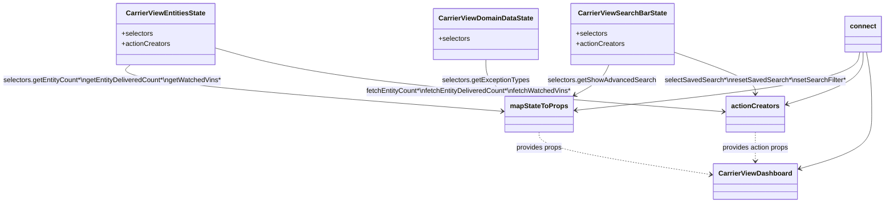

# Diagram: web/portal/src/pages/carrierview/dashboard/CarrierView.Dashboard.page.container.js

> Auto-generated by Obscura crawlers

## Mermaid

### SVG

<svg id="container" width="1809.580078125" xmlns="http://www.w3.org/2000/svg" class="classDiagram" height="476" viewBox="286.13671875 0 1809.580078125 476" role="graphics-document document" aria-roledescription="class"><g><defs><marker id="container_class-aggregationStart" class="marker aggregation class" refX="18" refY="7" markerWidth="190" markerHeight="240" orient="auto"><path d="M 18,7 L9,13 L1,7 L9,1 Z"></path></marker></defs><defs><marker id="container_class-aggregationEnd" class="marker aggregation class" refX="1" refY="7" markerWidth="20" markerHeight="28" orient="auto"><path d="M 18,7 L9,13 L1,7 L9,1 Z"></path></marker></defs><defs><marker id="container_class-extensionStart" class="marker extension class" refX="18" refY="7" markerWidth="190" markerHeight="240" orient="auto"><path d="M 1,7 L18,13 V 1 Z"></path></marker></defs><defs><marker id="container_class-extensionEnd" class="marker extension class" refX="1" refY="7" markerWidth="20" markerHeight="28" orient="auto"><path d="M 1,1 V 13 L18,7 Z"></path></marker></defs><defs><marker id="container_class-compositionStart" class="marker composition class" refX="18" refY="7" markerWidth="190" markerHeight="240" orient="auto"><path d="M 18,7 L9,13 L1,7 L9,1 Z"></path></marker></defs><defs><marker id="container_class-compositionEnd" class="marker composition class" refX="1" refY="7" markerWidth="20" markerHeight="28" orient="auto"><path d="M 18,7 L9,13 L1,7 L9,1 Z"></path></marker></defs><defs><marker id="container_class-dependencyStart" class="marker dependency class" refX="6" refY="7" markerWidth="190" markerHeight="240" orient="auto"><path d="M 5,7 L9,13 L1,7 L9,1 Z"></path></marker></defs><defs><marker id="container_class-dependencyEnd" class="marker dependency class" refX="13" refY="7" markerWidth="20" markerHeight="28" orient="auto"><path d="M 18,7 L9,13 L14,7 L9,1 Z"></path></marker></defs><defs><marker id="container_class-lollipopStart" class="marker lollipop class" refX="13" refY="7" markerWidth="190" markerHeight="240" orient="auto"><circle stroke="black" fill="transparent" cx="7" cy="7" r="6"></circle></marker></defs><defs><marker id="container_class-lollipopEnd" class="marker lollipop class" refX="1" refY="7" markerWidth="190" markerHeight="240" orient="auto"><circle stroke="black" fill="transparent" cx="7" cy="7" r="6"></circle></marker></defs><g class="root"><g class="clusters"></g><g class="edgePaths"><path d="M316.223,152L308.414,158.167C300.605,164.333,284.986,176.667,433.694,194.934C582.403,213.202,895.439,237.404,1051.957,249.506L1208.475,261.607" id="id_CarrierViewEntitiesState_mapStateToProps_1" class="edge-thickness-normal edge-pattern-solid relation" style=";;;" data-edge="true" data-et="edge" data-id="id_CarrierViewEntitiesState_mapStateToProps_1" data-points="W3sieCI6MzE2LjIyMzE1Nzk3MDE4MzUsInkiOjE1Mn0seyJ4IjoyNjkuMzY3MTg3NSwieSI6MTg5fSx7IngiOjEyMTQuNDU3MDMxMjUsInkiOjI2Mi4wNjkxMzM0NjE1MjgxN31d" marker-end="url(#container_class-dependencyEnd)"></path><path d="M520.668,111.574L566.959,124.479C613.25,137.383,705.832,163.191,905.946,188.314C1106.06,213.437,1413.707,237.874,1567.53,250.093L1721.353,262.312" id="id_CarrierViewEntitiesState_actionCreators_2" class="edge-thickness-normal edge-pattern-solid relation" style=";;;" data-edge="true" data-et="edge" data-id="id_CarrierViewEntitiesState_actionCreators_2" data-points="W3sieCI6NTIwLjY2Nzk2ODc1LCJ5IjoxMTEuNTc0MzgxMzYyNDUxMTh9LHsieCI6Nzk4LjQxNDA2MjUsInkiOjE4OX0seyJ4IjoxNzI3LjMzMzk4NDM3NSwieSI6MjYyLjc4NjYwOTA4NzM5MjA0fV0=" marker-end="url(#container_class-dependencyEnd)"></path><path d="M1452.357,152L1449.372,158.167C1446.386,164.333,1440.415,176.667,1427.121,188.517C1413.827,200.368,1393.21,211.735,1382.902,217.419L1372.594,223.103" id="id_CarrierViewSearchBarState_mapStateToProps_3" class="edge-thickness-normal edge-pattern-solid relation" style=";;;" data-edge="true" data-et="edge" data-id="id_CarrierViewSearchBarState_mapStateToProps_3" data-points="W3sieCI6MTQ1Mi4zNTcyNzg1MjYzNzYxLCJ5IjoxNTJ9LHsieCI6MTQzNC40NDMzNTkzNzUsInkiOjE4OX0seyJ4IjoxMzY3LjMzOTY5NTQxMTM5MjMsInkiOjIyNn1d" marker-end="url(#container_class-dependencyEnd)"></path><path d="M1605.244,122.077L1636.531,133.231C1667.818,144.385,1730.393,166.692,1761.68,183.013C1792.967,199.333,1792.967,209.667,1792.967,214.833L1792.967,220" id="id_CarrierViewSearchBarState_actionCreators_4" class="edge-thickness-normal edge-pattern-solid relation" style=";;;" data-edge="true" data-et="edge" data-id="id_CarrierViewSearchBarState_actionCreators_4" data-points="W3sieCI6MTYwNS4yNDQxNDA2MjUsInkiOjEyMi4wNzY3OTYzMDAwODE3N30seyJ4IjoxNzkyLjk2Njc5Njg3NSwieSI6MTg5fSx7IngiOjE3OTIuOTY2Nzk2ODc1LCJ5IjoyMjZ9XQ==" marker-end="url(#container_class-dependencyEnd)"></path><path d="M1167.914,140L1167.914,148.167C1167.914,156.333,1167.914,172.667,1176.693,186.46C1185.472,200.254,1203.031,211.508,1211.81,217.135L1220.589,222.762" id="id_CarrierViewDomainDataState_mapStateToProps_5" class="edge-thickness-normal edge-pattern-solid relation" style=";;;" data-edge="true" data-et="edge" data-id="id_CarrierViewDomainDataState_mapStateToProps_5" data-points="W3sieCI6MTE2Ny45MTQwNjI1LCJ5IjoxNDB9LHsieCI6MTE2Ny45MTQwNjI1LCJ5IjoxODl9LHsieCI6MTIyNS42NDA1NzU1NTM3OTc0LCJ5IjoyMjZ9XQ==" marker-end="url(#container_class-dependencyEnd)"></path><path d="M1291.168,310L1291.168,316.167C1291.168,322.333,1291.168,334.667,1358.17,351.382C1425.172,368.097,1559.176,389.194,1626.178,399.742L1693.18,410.29" id="id_mapStateToProps_CarrierViewDashboard_6" class="edge-thickness-normal edge-pattern-dashed relation" style=";;;" data-edge="true" data-et="edge" data-id="id_mapStateToProps_CarrierViewDashboard_6" data-points="W3sieCI6MTI5MS4xNjc5Njg3NSwieSI6MzEwfSx7IngiOjEyOTEuMTY3OTY4NzUsInkiOjM0N30seyJ4IjoxNjk5LjEwNzQyMTg3NSwieSI6NDExLjIyMzM3OTk0OTQ3ODZ9XQ==" marker-end="url(#container_class-dependencyEnd)"></path><path d="M1792.967,310L1792.967,316.167C1792.967,322.333,1792.967,334.667,1792.967,346C1792.967,357.333,1792.967,367.667,1792.967,372.833L1792.967,378" id="id_actionCreators_CarrierViewDashboard_7" class="edge-thickness-normal edge-pattern-dashed relation" style=";;;" data-edge="true" data-et="edge" data-id="id_actionCreators_CarrierViewDashboard_7" data-points="W3sieCI6MTc5Mi45NjY3OTY4NzUsInkiOjMxMH0seyJ4IjoxNzkyLjk2Njc5Njg3NSwieSI6MzQ3fSx7IngiOjE3OTIuOTY2Nzk2ODc1LCJ5IjozODR9XQ==" marker-end="url(#container_class-dependencyEnd)"></path><path d="M2039.096,122L2037.047,133.167C2034.998,144.333,2030.901,166.667,1920.025,189.52C1809.15,212.374,1591.497,235.748,1482.671,247.434L1373.845,259.121" id="id_connect_mapStateToProps_8" class="edge-thickness-normal edge-pattern-solid relation" style=";;;" data-edge="true" data-et="edge" data-id="id_connect_mapStateToProps_8" data-points="W3sieCI6MjAzOS4wOTYzMTIzNTY2NTE0LCJ5IjoxMjJ9LHsieCI6MjAyNi44MDI3MzQzNzUsInkiOjE4OX0seyJ4IjoxMzY3Ljg3ODkwNjI1LCJ5IjoyNTkuNzYxOTkzMzg5MDAwM31d" marker-end="url(#container_class-dependencyEnd)"></path><path d="M2046.803,122L2046.803,133.167C2046.803,144.333,2046.803,166.667,2016.39,187.298C1985.978,207.93,1925.153,226.86,1894.741,236.325L1864.329,245.79" id="id_connect_actionCreators_9" class="edge-thickness-normal edge-pattern-solid relation" style=";;;" data-edge="true" data-et="edge" data-id="id_connect_actionCreators_9" data-points="W3sieCI6MjA0Ni44MDI3MzQzNzUsInkiOjEyMn0seyJ4IjoyMDQ2LjgwMjczNDM3NSwieSI6MTg5fSx7IngiOjE4NTguNTk5NjA5Mzc1LCJ5IjoyNDcuNTczNDUxMTA5NTM4MDR9XQ==" marker-end="url(#container_class-dependencyEnd)"></path><path d="M2054.509,122L2056.558,133.167C2058.607,144.333,2062.705,166.667,2064.754,191C2066.803,215.333,2066.803,241.667,2066.803,268C2066.803,294.333,2066.803,320.667,2037.767,342.21C2008.732,363.753,1950.662,380.506,1921.626,388.883L1892.591,397.259" id="id_connect_CarrierViewDashboard_10" class="edge-thickness-normal edge-pattern-solid relation" style=";;;" data-edge="true" data-et="edge" data-id="id_connect_CarrierViewDashboard_10" data-points="W3sieCI6MjA1NC41MDkxNTYzOTMzNDksInkiOjEyMn0seyJ4IjoyMDY2LjgwMjczNDM3NSwieSI6MTg5fSx7IngiOjIwNjYuODAyNzM0Mzc1LCJ5IjoyNjh9LHsieCI6MjA2Ni44MDI3MzQzNzUsInkiOjM0N30seyJ4IjoxODg2LjgyNjE3MTg3NSwieSI6Mzk4LjkyMjE0MjAyMTYyNTYzfV0=" marker-end="url(#container_class-dependencyEnd)"></path></g><g class="edgeLabels"><g class="edgeLabel" transform="translate(712.14929, 223.23347)"><g class="label" data-id="id_CarrierViewEntitiesState_mapStateToProps_1" transform="translate(-261.3671875, -12)"><foreignObject width="522.734375" height="24">

selectors.getEntityCount*\ngetEntityDeliveredCount*\ngetWatchedVins*

</foreignObject></g></g><g class="edgeLabel" transform="translate(1119.15873, 214.47761)"><g class="label" data-id="id_CarrierViewEntitiesState_actionCreators_2" transform="translate(-247.6796875, -12)"><foreignObject width="495.359375" height="24">

fetchEntityCount*\nfetchEntityDeliveredCount*\nfetchWatchedVins*

</foreignObject></g></g><g class="edgeLabel" transform="translate(1434.443359375, 189)"><g class="label" data-id="id_CarrierViewSearchBarState_mapStateToProps_3" transform="translate(-124.6875, -12)"><foreignObject width="249.375" height="24">

selectors.getShowAdvancedSearch

</foreignObject></g></g><g class="edgeLabel" transform="translate(1792.966796875, 189)"><g class="label" data-id="id_CarrierViewSearchBarState_actionCreators_4" transform="translate(-213.8359375, -12)"><foreignObject width="427.671875" height="24">

selectSavedSearch*\nresetSavedSearch*\nsetSearchFilter*

</foreignObject></g></g><g class="edgeLabel" transform="translate(1167.9140625, 189)"><g class="label" data-id="id_CarrierViewDomainDataState_mapStateToProps_5" transform="translate(-101.8203125, -12)"><foreignObject width="203.640625" height="24">

selectors.getExceptionTypes

</foreignObject></g></g><g class="edgeLabel" transform="translate(1291.16796875, 347)"><g class="label" data-id="id_mapStateToProps_CarrierViewDashboard_6" transform="translate(-54.1953125, -12)"><foreignObject width="108.390625" height="24">

provides props

</foreignObject></g></g><g class="edgeLabel" transform="translate(1792.966796875, 347)"><g class="label" data-id="id_actionCreators_CarrierViewDashboard_7" transform="translate(-78.9921875, -12)"><foreignObject width="157.984375" height="24">

provides action props

</foreignObject></g></g><g class="edgeLabel"><g class="label" data-id="id_connect_mapStateToProps_8" transform="translate(0, 0)"><foreignObject width="0" height="0">

</foreignObject></g></g><g class="edgeLabel"><g class="label" data-id="id_connect_actionCreators_9" transform="translate(0, 0)"><foreignObject width="0" height="0">

</foreignObject></g></g><g class="edgeLabel"><g class="label" data-id="id_connect_CarrierViewDashboard_10" transform="translate(0, 0)"><foreignObject width="0" height="0">

</foreignObject></g></g></g><g class="nodes"><g class="node default" id="classId-CarrierViewDashboard-0" transform="translate(1792.966796875, 426)"><g class="basic label-container"><path d="M-93.859375 -42 L93.859375 -42 L93.859375 42 L-93.859375 42" stroke="none" stroke-width="0" fill="#ECECFF" style=""></path><path d="M-93.859375 -42 C-23.84726144105248 -42, 46.16485211789504 -42, 93.859375 -42 M-93.859375 -42 C-43.78474357548644 -42, 6.289887849027124 -42, 93.859375 -42 M93.859375 -42 C93.859375 -21.506386622291767, 93.859375 -1.012773244583535, 93.859375 42 M93.859375 -42 C93.859375 -20.662652262846972, 93.859375 0.6746954743060556, 93.859375 42 M93.859375 42 C54.47839356512426 42, 15.097412130248514 42, -93.859375 42 M93.859375 42 C49.74402104787911 42, 5.628667095758217 42, -93.859375 42 M-93.859375 42 C-93.859375 14.231714497748008, -93.859375 -13.536571004503983, -93.859375 -42 M-93.859375 42 C-93.859375 16.1042543084913, -93.859375 -9.791491383017402, -93.859375 -42" stroke="#9370DB" stroke-width="1.3" fill="none" stroke-dasharray="0 0" style=""></path></g><g class="annotation-group text" transform="translate(0, -18)"></g><g class="label-group text" transform="translate(-81.859375, -18)"><g class="label" style="font-weight: bolder" transform="translate(0,-12)"><foreignObject width="163.71875" height="24">

CarrierViewDashboard

</foreignObject></g></g><g class="members-group text" transform="translate(-81.859375, 30)"></g><g class="methods-group text" transform="translate(-81.859375, 60)"></g><g class="divider" style=""><path d="M-93.859375 6 C-25.943767421611923 6, 41.97184015677615 6, 93.859375 6 M-93.859375 6 C-40.960887012551176 6, 11.937600974897649 6, 93.859375 6" stroke="#9370DB" stroke-width="1.3" fill="none" stroke-dasharray="0 0" style=""></path></g><g class="divider" style=""><path d="M-93.859375 24 C-24.07697252630338 24, 45.70542994739324 24, 93.859375 24 M-93.859375 24 C-50.29323949591721 24, -6.727103991834426 24, 93.859375 24" stroke="#9370DB" stroke-width="1.3" fill="none" stroke-dasharray="0 0" style=""></path></g></g><g class="node default" id="classId-CarrierViewEntitiesState-1" transform="translate(407.40234375, 80)"><g class="basic label-container"><path d="M-113.265625 -72 L113.265625 -72 L113.265625 72 L-113.265625 72" stroke="none" stroke-width="0" fill="#ECECFF" style=""></path><path d="M-113.265625 -72 C-31.427499837417116 -72, 50.41062532516577 -72, 113.265625 -72 M-113.265625 -72 C-29.744407148145314 -72, 53.77681070370937 -72, 113.265625 -72 M113.265625 -72 C113.265625 -20.64730936334807, 113.265625 30.705381273303857, 113.265625 72 M113.265625 -72 C113.265625 -16.838308897138738, 113.265625 38.323382205722524, 113.265625 72 M113.265625 72 C25.343167157591566 72, -62.57929068481687 72, -113.265625 72 M113.265625 72 C47.70192621775688 72, -17.861772564486245 72, -113.265625 72 M-113.265625 72 C-113.265625 40.70549371858861, -113.265625 9.410987437177226, -113.265625 -72 M-113.265625 72 C-113.265625 35.091653293518874, -113.265625 -1.8166934129622518, -113.265625 -72" stroke="#9370DB" stroke-width="1.3" fill="none" stroke-dasharray="0 0" style=""></path></g><g class="annotation-group text" transform="translate(0, -48)"></g><g class="label-group text" transform="translate(-89.453125, -48)"><g class="label" style="font-weight: bolder" transform="translate(0,-12)"><foreignObject width="178.90625" height="24">

CarrierViewEntitiesState

</foreignObject></g></g><g class="members-group text" transform="translate(-101.265625, 0)"><g class="label" style="" transform="translate(0,-12)"><foreignObject width="73.453125" height="24">

+selectors

</foreignObject></g><g class="label" style="" transform="translate(0,12)"><foreignObject width="113.078125" height="24">

+actionCreators

</foreignObject></g></g><g class="methods-group text" transform="translate(-101.265625, 72)"></g><g class="divider" style=""><path d="M-113.265625 -24 C-24.259933870206694 -24, 64.74575725958661 -24, 113.265625 -24 M-113.265625 -24 C-58.201265663748984 -24, -3.136906327497968 -24, 113.265625 -24" stroke="#9370DB" stroke-width="1.3" fill="none" stroke-dasharray="0 0" style=""></path></g><g class="divider" style=""><path d="M-113.265625 48 C-51.075869648046876 48, 11.113885703906249 48, 113.265625 48 M-113.265625 48 C-55.974870256775574 48, 1.3158844864488515 48, 113.265625 48" stroke="#9370DB" stroke-width="1.3" fill="none" stroke-dasharray="0 0" style=""></path></g></g><g class="node default" id="classId-CarrierViewSearchBarState-2" transform="translate(1487.216796875, 80)"><g class="basic label-container"><path d="M-118.02734375 -72 L118.02734375 -72 L118.02734375 72 L-118.02734375 72" stroke="none" stroke-width="0" fill="#ECECFF" style=""></path><path d="M-118.02734375 -72 C-63.32514368865564 -72, -8.622943627311287 -72, 118.02734375 -72 M-118.02734375 -72 C-51.61399586392767 -72, 14.79935202214466 -72, 118.02734375 -72 M118.02734375 -72 C118.02734375 -42.55612072081264, 118.02734375 -13.112241441625287, 118.02734375 72 M118.02734375 -72 C118.02734375 -20.827764200733412, 118.02734375 30.344471598533175, 118.02734375 72 M118.02734375 72 C61.38525588758496 72, 4.743168025169922 72, -118.02734375 72 M118.02734375 72 C61.9179599037889 72, 5.808576057577795 72, -118.02734375 72 M-118.02734375 72 C-118.02734375 17.432422711690037, -118.02734375 -37.135154576619925, -118.02734375 -72 M-118.02734375 72 C-118.02734375 38.08803843640078, -118.02734375 4.176076872801559, -118.02734375 -72" stroke="#9370DB" stroke-width="1.3" fill="none" stroke-dasharray="0 0" style=""></path></g><g class="annotation-group text" transform="translate(0, -48)"></g><g class="label-group text" transform="translate(-98.9765625, -48)"><g class="label" style="font-weight: bolder" transform="translate(0,-12)"><foreignObject width="197.953125" height="24">

CarrierViewSearchBarState

</foreignObject></g></g><g class="members-group text" transform="translate(-106.02734375, 0)"><g class="label" style="" transform="translate(0,-12)"><foreignObject width="73.453125" height="24">

+selectors

</foreignObject></g><g class="label" style="" transform="translate(0,12)"><foreignObject width="113.078125" height="24">

+actionCreators

</foreignObject></g></g><g class="methods-group text" transform="translate(-106.02734375, 72)"></g><g class="divider" style=""><path d="M-118.02734375 -24 C-66.86545772214085 -24, -15.703571694281692 -24, 118.02734375 -24 M-118.02734375 -24 C-70.4481663438489 -24, -22.868988937697793 -24, 118.02734375 -24" stroke="#9370DB" stroke-width="1.3" fill="none" stroke-dasharray="0 0" style=""></path></g><g class="divider" style=""><path d="M-118.02734375 48 C-41.87877812093292 48, 34.26978750813416 48, 118.02734375 48 M-118.02734375 48 C-28.478424680428645 48, 61.07049438914271 48, 118.02734375 48" stroke="#9370DB" stroke-width="1.3" fill="none" stroke-dasharray="0 0" style=""></path></g></g><g class="node default" id="classId-CarrierViewDomainDataState-3" transform="translate(1167.9140625, 80)"><g class="basic label-container"><path d="M-118.5234375 -60 L118.5234375 -60 L118.5234375 60 L-118.5234375 60" stroke="none" stroke-width="0" fill="#ECECFF" style=""></path><path d="M-118.5234375 -60 C-64.80698355296317 -60, -11.090529605926363 -60, 118.5234375 -60 M-118.5234375 -60 C-32.145158298126574 -60, 54.23312090374685 -60, 118.5234375 -60 M118.5234375 -60 C118.5234375 -19.011342568625764, 118.5234375 21.97731486274847, 118.5234375 60 M118.5234375 -60 C118.5234375 -19.71127067891649, 118.5234375 20.577458642167016, 118.5234375 60 M118.5234375 60 C64.24944239299364 60, 9.975447285987272 60, -118.5234375 60 M118.5234375 60 C39.11341254696089 60, -40.296612406078225 60, -118.5234375 60 M-118.5234375 60 C-118.5234375 16.99651101612387, -118.5234375 -26.006977967752263, -118.5234375 -60 M-118.5234375 60 C-118.5234375 15.985753892563693, -118.5234375 -28.028492214872614, -118.5234375 -60" stroke="#9370DB" stroke-width="1.3" fill="none" stroke-dasharray="0 0" style=""></path></g><g class="annotation-group text" transform="translate(0, -36)"></g><g class="label-group text" transform="translate(-106.5234375, -36)"><g class="label" style="font-weight: bolder" transform="translate(0,-12)"><foreignObject width="213.046875" height="24">

CarrierViewDomainDataState

</foreignObject></g></g><g class="members-group text" transform="translate(-106.5234375, 12)"><g class="label" style="" transform="translate(0,-12)"><foreignObject width="73.453125" height="24">

+selectors

</foreignObject></g></g><g class="methods-group text" transform="translate(-106.5234375, 60)"></g><g class="divider" style=""><path d="M-118.5234375 -12 C-28.322853053535084 -12, 61.87773139292983 -12, 118.5234375 -12 M-118.5234375 -12 C-39.099103505138515 -12, 40.32523048972297 -12, 118.5234375 -12" stroke="#9370DB" stroke-width="1.3" fill="none" stroke-dasharray="0 0" style=""></path></g><g class="divider" style=""><path d="M-118.5234375 36 C-31.950562527905987 36, 54.622312444188026 36, 118.5234375 36 M-118.5234375 36 C-29.43937180130321 36, 59.64469389739358 36, 118.5234375 36" stroke="#9370DB" stroke-width="1.3" fill="none" stroke-dasharray="0 0" style=""></path></g></g><g class="node default" id="classId-mapStateToProps-4" transform="translate(1291.16796875, 268)"><g class="basic label-container"><path d="M-76.7109375 -42 L76.7109375 -42 L76.7109375 42 L-76.7109375 42" stroke="none" stroke-width="0" fill="#ECECFF" style=""></path><path d="M-76.7109375 -42 C-41.97484074577499 -42, -7.238743991549981 -42, 76.7109375 -42 M-76.7109375 -42 C-42.89045668617057 -42, -9.069975872341146 -42, 76.7109375 -42 M76.7109375 -42 C76.7109375 -24.060635984616553, 76.7109375 -6.121271969233106, 76.7109375 42 M76.7109375 -42 C76.7109375 -11.665963481670534, 76.7109375 18.66807303665893, 76.7109375 42 M76.7109375 42 C16.95129048896453 42, -42.80835652207094 42, -76.7109375 42 M76.7109375 42 C33.2713217796207 42, -10.168293940758602 42, -76.7109375 42 M-76.7109375 42 C-76.7109375 15.847081414381293, -76.7109375 -10.305837171237414, -76.7109375 -42 M-76.7109375 42 C-76.7109375 13.321305793303424, -76.7109375 -15.357388413393153, -76.7109375 -42" stroke="#9370DB" stroke-width="1.3" fill="none" stroke-dasharray="0 0" style=""></path></g><g class="annotation-group text" transform="translate(0, -18)"></g><g class="label-group text" transform="translate(-64.7109375, -18)"><g class="label" style="font-weight: bolder" transform="translate(0,-12)"><foreignObject width="129.421875" height="24">

mapStateToProps

</foreignObject></g></g><g class="members-group text" transform="translate(-64.7109375, 30)"></g><g class="methods-group text" transform="translate(-64.7109375, 60)"></g><g class="divider" style=""><path d="M-76.7109375 6 C-16.698550679386443 6, 43.313836141227114 6, 76.7109375 6 M-76.7109375 6 C-41.87838711553761 6, -7.045836731075227 6, 76.7109375 6" stroke="#9370DB" stroke-width="1.3" fill="none" stroke-dasharray="0 0" style=""></path></g><g class="divider" style=""><path d="M-76.7109375 24 C-41.781756897189055 24, -6.85257629437811 24, 76.7109375 24 M-76.7109375 24 C-19.21852277923658 24, 38.27389194152684 24, 76.7109375 24" stroke="#9370DB" stroke-width="1.3" fill="none" stroke-dasharray="0 0" style=""></path></g></g><g class="node default" id="classId-actionCreators-5" transform="translate(1792.966796875, 268)"><g class="basic label-container"><path d="M-65.6328125 -42 L65.6328125 -42 L65.6328125 42 L-65.6328125 42" stroke="none" stroke-width="0" fill="#ECECFF" style=""></path><path d="M-65.6328125 -42 C-38.523302468350806 -42, -11.41379243670162 -42, 65.6328125 -42 M-65.6328125 -42 C-35.73236679009915 -42, -5.831921080198292 -42, 65.6328125 -42 M65.6328125 -42 C65.6328125 -16.714471103272874, 65.6328125 8.571057793454251, 65.6328125 42 M65.6328125 -42 C65.6328125 -9.647574701626333, 65.6328125 22.704850596747335, 65.6328125 42 M65.6328125 42 C37.15958245724537 42, 8.686352414490742 42, -65.6328125 42 M65.6328125 42 C36.21268582467578 42, 6.792559149351561 42, -65.6328125 42 M-65.6328125 42 C-65.6328125 14.870581480728205, -65.6328125 -12.25883703854359, -65.6328125 -42 M-65.6328125 42 C-65.6328125 24.991355637062963, -65.6328125 7.982711274125926, -65.6328125 -42" stroke="#9370DB" stroke-width="1.3" fill="none" stroke-dasharray="0 0" style=""></path></g><g class="annotation-group text" transform="translate(0, -18)"></g><g class="label-group text" transform="translate(-53.6328125, -18)"><g class="label" style="font-weight: bolder" transform="translate(0,-12)"><foreignObject width="107.265625" height="24">

actionCreators

</foreignObject></g></g><g class="members-group text" transform="translate(-53.6328125, 30)"></g><g class="methods-group text" transform="translate(-53.6328125, 60)"></g><g class="divider" style=""><path d="M-65.6328125 6 C-15.63318481869959 6, 34.36644286260082 6, 65.6328125 6 M-65.6328125 6 C-31.696624367163736 6, 2.2395637656725285 6, 65.6328125 6" stroke="#9370DB" stroke-width="1.3" fill="none" stroke-dasharray="0 0" style=""></path></g><g class="divider" style=""><path d="M-65.6328125 24 C-32.87551090241294 24, -0.1182093048258821 24, 65.6328125 24 M-65.6328125 24 C-36.117007902339466 24, -6.60120330467894 24, 65.6328125 24" stroke="#9370DB" stroke-width="1.3" fill="none" stroke-dasharray="0 0" style=""></path></g></g><g class="node default" id="classId-connect-6" transform="translate(2046.802734375, 80)"><g class="basic label-container"><path d="M-40.9140625 -42 L40.9140625 -42 L40.9140625 42 L-40.9140625 42" stroke="none" stroke-width="0" fill="#ECECFF" style=""></path><path d="M-40.9140625 -42 C-24.0595118126721 -42, -7.204961125344198 -42, 40.9140625 -42 M-40.9140625 -42 C-17.931829326776636 -42, 5.050403846446727 -42, 40.9140625 -42 M40.9140625 -42 C40.9140625 -15.321950278502296, 40.9140625 11.356099442995408, 40.9140625 42 M40.9140625 -42 C40.9140625 -15.072899388541078, 40.9140625 11.854201222917844, 40.9140625 42 M40.9140625 42 C20.304308942234933 42, -0.3054446155301349 42, -40.9140625 42 M40.9140625 42 C10.16142022477236 42, -20.59122205045528 42, -40.9140625 42 M-40.9140625 42 C-40.9140625 24.25828259525356, -40.9140625 6.516565190507123, -40.9140625 -42 M-40.9140625 42 C-40.9140625 16.0566219902714, -40.9140625 -9.886756019457202, -40.9140625 -42" stroke="#9370DB" stroke-width="1.3" fill="none" stroke-dasharray="0 0" style=""></path></g><g class="annotation-group text" transform="translate(0, -18)"></g><g class="label-group text" transform="translate(-28.9140625, -18)"><g class="label" style="font-weight: bolder" transform="translate(0,-12)"><foreignObject width="57.828125" height="24">

connect

</foreignObject></g></g><g class="members-group text" transform="translate(-28.9140625, 30)"></g><g class="methods-group text" transform="translate(-28.9140625, 60)"></g><g class="divider" style=""><path d="M-40.9140625 6 C-12.782623243729486 6, 15.348816012541029 6, 40.9140625 6 M-40.9140625 6 C-18.639924334910617 6, 3.6342138301787656 6, 40.9140625 6" stroke="#9370DB" stroke-width="1.3" fill="none" stroke-dasharray="0 0" style=""></path></g><g class="divider" style=""><path d="M-40.9140625 24 C-18.547128462170804 24, 3.8198055756583926 24, 40.9140625 24 M-40.9140625 24 C-15.53923642605859 24, 9.83558964788282 24, 40.9140625 24" stroke="#9370DB" stroke-width="1.3" fill="none" stroke-dasharray="0 0" style=""></path></g></g></g></g></g></svg>
