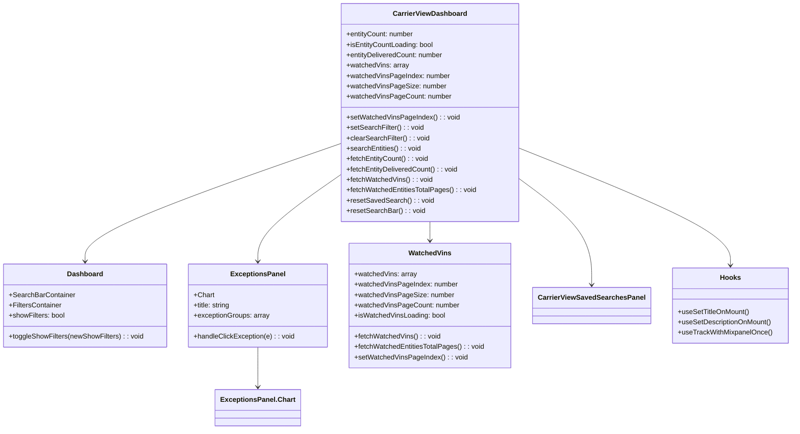

# Diagram: web/portal/src/pages/carrierview/dashboard/CarrierView.Dashboard.page.js


> Auto-generated by Obscura crawlers

## Diagram 1



### SVG

<svg id="container" width="1801.453125" xmlns="http://www.w3.org/2000/svg" class="classDiagram" height="992" viewBox="0 0 1801.453125 992" role="graphics-document document" aria-roledescription="class"><style>#container{font-family:"trebuchet ms",verdana,arial,sans-serif;font-size:16px;fill:#333;}@keyframes edge-animation-frame{from{stroke-dashoffset:0;}}@keyframes dash{to{stroke-dashoffset:0;}}#container .edge-animation-slow{stroke-dasharray:9,5!important;stroke-dashoffset:900;animation:dash 50s linear infinite;stroke-linecap:round;}#container .edge-animation-fast{stroke-dasharray:9,5!important;stroke-dashoffset:900;animation:dash 20s linear infinite;stroke-linecap:round;}#container .error-icon{fill:#552222;}#container .error-text{fill:#552222;stroke:#552222;}#container .edge-thickness-normal{stroke-width:1px;}#container .edge-thickness-thick{stroke-width:3.5px;}#container .edge-pattern-solid{stroke-dasharray:0;}#container .edge-thickness-invisible{stroke-width:0;fill:none;}#container .edge-pattern-dashed{stroke-dasharray:3;}#container .edge-pattern-dotted{stroke-dasharray:2;}#container .marker{fill:#333333;stroke:#333333;}#container .marker.cross{stroke:#333333;}#container svg{font-family:"trebuchet ms",verdana,arial,sans-serif;font-size:16px;}#container p{margin:0;}#container g.classGroup text{fill:#9370DB;stroke:none;font-family:"trebuchet ms",verdana,arial,sans-serif;font-size:10px;}#container g.classGroup text .title{font-weight:bolder;}#container .nodeLabel,#container .edgeLabel{color:#131300;}#container .edgeLabel .label rect{fill:#ECECFF;}#container .label text{fill:#131300;}#container .labelBkg{background:#ECECFF;}#container .edgeLabel .label span{background:#ECECFF;}#container .classTitle{font-weight:bolder;}#container .node rect,#container .node circle,#container .node ellipse,#container .node polygon,#container .node path{fill:#ECECFF;stroke:#9370DB;stroke-width:1px;}#container .divider{stroke:#9370DB;stroke-width:1;}#container g.clickable{cursor:pointer;}#container g.classGroup rect{fill:#ECECFF;stroke:#9370DB;}#container g.classGroup line{stroke:#9370DB;stroke-width:1;}#container .classLabel .box{stroke:none;stroke-width:0;fill:#ECECFF;opacity:0.5;}#container .classLabel .label{fill:#9370DB;font-size:10px;}#container .relation{stroke:#333333;stroke-width:1;fill:none;}#container .dashed-line{stroke-dasharray:3;}#container .dotted-line{stroke-dasharray:1 2;}#container #compositionStart,#container .composition{fill:#333333!important;stroke:#333333!important;stroke-width:1;}#container #compositionEnd,#container .composition{fill:#333333!important;stroke:#333333!important;stroke-width:1;}#container #dependencyStart,#container .dependency{fill:#333333!important;stroke:#333333!important;stroke-width:1;}#container #dependencyStart,#container .dependency{fill:#333333!important;stroke:#333333!important;stroke-width:1;}#container #extensionStart,#container .extension{fill:transparent!important;stroke:#333333!important;stroke-width:1;}#container #extensionEnd,#container .extension{fill:transparent!important;stroke:#333333!important;stroke-width:1;}#container #aggregationStart,#container .aggregation{fill:transparent!important;stroke:#333333!important;stroke-width:1;}#container #aggregationEnd,#container .aggregation{fill:transparent!important;stroke:#333333!important;stroke-width:1;}#container #lollipopStart,#container .lollipop{fill:#ECECFF!important;stroke:#333333!important;stroke-width:1;}#container #lollipopEnd,#container .lollipop{fill:#ECECFF!important;stroke:#333333!important;stroke-width:1;}#container .edgeTerminals{font-size:11px;line-height:initial;}#container .classTitleText{text-anchor:middle;font-size:18px;fill:#333;}#container .label-icon{display:inline-block;height:1em;overflow:visible;vertical-align:-0.125em;}#container .node .label-icon path{fill:currentColor;stroke:revert;stroke-width:revert;}#container :root{--mermaid-font-family:"trebuchet ms",verdana,arial,sans-serif;}</style><g><defs><marker id="container_class-aggregationStart" class="marker aggregation class" refX="18" refY="7" markerWidth="190" markerHeight="240" orient="auto"><path d="M 18,7 L9,13 L1,7 L9,1 Z"></path></marker></defs><defs><marker id="container_class-aggregationEnd" class="marker aggregation class" refX="1" refY="7" markerWidth="20" markerHeight="28" orient="auto"><path d="M 18,7 L9,13 L1,7 L9,1 Z"></path></marker></defs><defs><marker id="container_class-extensionStart" class="marker extension class" refX="18" refY="7" markerWidth="190" markerHeight="240" orient="auto"><path d="M 1,7 L18,13 V 1 Z"></path></marker></defs><defs><marker id="container_class-extensionEnd" class="marker extension class" refX="1" refY="7" markerWidth="20" markerHeight="28" orient="auto"><path d="M 1,1 V 13 L18,7 Z"></path></marker></defs><defs><marker id="container_class-compositionStart" class="marker composition class" refX="18" refY="7" markerWidth="190" markerHeight="240" orient="auto"><path d="M 18,7 L9,13 L1,7 L9,1 Z"></path></marker></defs><defs><marker id="container_class-compositionEnd" class="marker composition class" refX="1" refY="7" markerWidth="20" markerHeight="28" orient="auto"><path d="M 18,7 L9,13 L1,7 L9,1 Z"></path></marker></defs><defs><marker id="container_class-dependencyStart" class="marker dependency class" refX="6" refY="7" markerWidth="190" markerHeight="240" orient="auto"><path d="M 5,7 L9,13 L1,7 L9,1 Z"></path></marker></defs><defs><marker id="container_class-dependencyEnd" class="marker dependency class" refX="13" refY="7" markerWidth="20" markerHeight="28" orient="auto"><path d="M 18,7 L9,13 L14,7 L9,1 Z"></path></marker></defs><defs><marker id="container_class-lollipopStart" class="marker lollipop class" refX="13" refY="7" markerWidth="190" markerHeight="240" orient="auto"><circle stroke="black" fill="transparent" cx="7" cy="7" r="6"></circle></marker></defs><defs><marker id="container_class-lollipopEnd" class="marker lollipop class" refX="1" refY="7" markerWidth="190" markerHeight="240" orient="auto"><circle stroke="black" fill="transparent" cx="7" cy="7" r="6"></circle></marker></defs><g class="root"><g class="clusters"></g><g class="edgePaths"><path d="M781.773,331.164L683.97,365.47C586.167,399.776,390.56,468.388,292.757,513.861C194.953,559.333,194.953,581.667,194.953,592.833L194.953,604" id="id_CarrierViewDashboard_Dashboard_1" class="edge-thickness-normal edge-pattern-solid relation" style=";;;" data-edge="true" data-et="edge" data-id="id_CarrierViewDashboard_Dashboard_1" data-points="W3sieCI6NzgxLjc3MzQzNzUsInkiOjMzMS4xNjQxMzQwNjkzNjk0fSx7IngiOjE5NC45NTMxMjUsInkiOjUzN30seyJ4IjoxOTQuOTUzMTI1LCJ5Ijo2MTB9XQ==" marker-end="url(#container_class-dependencyEnd)"></path><path d="M781.773,402.615L749.911,425.012C718.048,447.41,654.323,492.205,622.46,525.769C590.598,559.333,590.598,581.667,590.598,592.833L590.598,604" id="id_CarrierViewDashboard_ExceptionsPanel_2" class="edge-thickness-normal edge-pattern-solid relation" style=";;;" data-edge="true" data-et="edge" data-id="id_CarrierViewDashboard_ExceptionsPanel_2" data-points="W3sieCI6NzgxLjc3MzQzNzUsInkiOjQwMi42MTQ2NzY5ODkyNjQzNX0seyJ4Ijo1OTAuNTk3NjU2MjUsInkiOjUzN30seyJ4Ijo1OTAuNTk3NjU2MjUsInkiOjYxMH1d" marker-end="url(#container_class-dependencyEnd)"></path><path d="M984.656,512L984.656,516.167C984.656,520.333,984.656,528.667,984.656,536C984.656,543.333,984.656,549.667,984.656,552.833L984.656,556" id="id_CarrierViewDashboard_WatchedVins_3" class="edge-thickness-normal edge-pattern-solid relation" style=";;;" data-edge="true" data-et="edge" data-id="id_CarrierViewDashboard_WatchedVins_3" data-points="W3sieCI6OTg0LjY1NjI1LCJ5Ijo1MTJ9LHsieCI6OTg0LjY1NjI1LCJ5Ijo1Mzd9LHsieCI6OTg0LjY1NjI1LCJ5Ijo1NjJ9XQ==" marker-end="url(#container_class-dependencyEnd)"></path><path d="M1187.539,413.942L1214.569,434.452C1241.599,454.961,1295.659,495.981,1322.689,536.657C1349.719,577.333,1349.719,617.667,1349.719,637.833L1349.719,658" id="id_CarrierViewDashboard_CarrierViewSavedSearchesPanel_4" class="edge-thickness-normal edge-pattern-solid relation" style=";;;" data-edge="true" data-et="edge" data-id="id_CarrierViewDashboard_CarrierViewSavedSearchesPanel_4" data-points="W3sieCI6MTE4Ny41MzkwNjI1LCJ5Ijo0MTMuOTQyMjQwMTk4NTk2MX0seyJ4IjoxMzQ5LjcxODc1LCJ5Ijo1Mzd9LHsieCI6MTM0OS43MTg3NSwieSI6NjY0fV0=" marker-end="url(#container_class-dependencyEnd)"></path><path d="M1187.539,343.038L1266.521,375.365C1345.504,407.692,1503.469,472.346,1582.451,517.34C1661.434,562.333,1661.434,587.667,1661.434,600.333L1661.434,613" id="id_CarrierViewDashboard_Hooks_5" class="edge-thickness-normal edge-pattern-solid relation" style=";;;" data-edge="true" data-et="edge" data-id="id_CarrierViewDashboard_Hooks_5" data-points="W3sieCI6MTE4Ny41MzkwNjI1LCJ5IjozNDMuMDM4NDQ2MjIwODg4M30seyJ4IjoxNjYxLjQzMzU5Mzc1LCJ5Ijo1Mzd9LHsieCI6MTY2MS40MzM1OTM3NSwieSI6NjE5fV0=" marker-end="url(#container_class-dependencyEnd)"></path><path d="M590.598,802L590.598,814.167C590.598,826.333,590.598,850.667,590.598,866C590.598,881.333,590.598,887.667,590.598,890.833L590.598,894" id="id_ExceptionsPanel_ExceptionsPanel.Chart_6" class="edge-thickness-normal edge-pattern-solid relation" style=";;;" data-edge="true" data-et="edge" data-id="id_ExceptionsPanel_ExceptionsPanel.Chart_6" data-points="W3sieCI6NTkwLjU5NzY1NjI1LCJ5Ijo4MDJ9LHsieCI6NTkwLjU5NzY1NjI1LCJ5Ijo4NzV9LHsieCI6NTkwLjU5NzY1NjI1LCJ5Ijo5MDB9XQ==" marker-end="url(#container_class-dependencyEnd)"></path></g><g class="edgeLabels"><g class="edgeLabel"><g class="label" data-id="id_CarrierViewDashboard_Dashboard_1" transform="translate(0, 0)"><foreignObject width="0" height="0"><div xmlns="http://www.w3.org/1999/xhtml" class="labelBkg" style="display: table-cell; white-space: nowrap; line-height: 1.5; max-width: 200px; text-align: center;"><span class="edgeLabel"></span></div></foreignObject></g></g><g class="edgeLabel"><g class="label" data-id="id_CarrierViewDashboard_ExceptionsPanel_2" transform="translate(0, 0)"><foreignObject width="0" height="0"><div xmlns="http://www.w3.org/1999/xhtml" class="labelBkg" style="display: table-cell; white-space: nowrap; line-height: 1.5; max-width: 200px; text-align: center;"><span class="edgeLabel"></span></div></foreignObject></g></g><g class="edgeLabel"><g class="label" data-id="id_CarrierViewDashboard_WatchedVins_3" transform="translate(0, 0)"><foreignObject width="0" height="0"><div xmlns="http://www.w3.org/1999/xhtml" class="labelBkg" style="display: table-cell; white-space: nowrap; line-height: 1.5; max-width: 200px; text-align: center;"><span class="edgeLabel"></span></div></foreignObject></g></g><g class="edgeLabel"><g class="label" data-id="id_CarrierViewDashboard_CarrierViewSavedSearchesPanel_4" transform="translate(0, 0)"><foreignObject width="0" height="0"><div xmlns="http://www.w3.org/1999/xhtml" class="labelBkg" style="display: table-cell; white-space: nowrap; line-height: 1.5; max-width: 200px; text-align: center;"><span class="edgeLabel"></span></div></foreignObject></g></g><g class="edgeLabel"><g class="label" data-id="id_CarrierViewDashboard_Hooks_5" transform="translate(0, 0)"><foreignObject width="0" height="0"><div xmlns="http://www.w3.org/1999/xhtml" class="labelBkg" style="display: table-cell; white-space: nowrap; line-height: 1.5; max-width: 200px; text-align: center;"><span class="edgeLabel"></span></div></foreignObject></g></g><g class="edgeLabel"><g class="label" data-id="id_ExceptionsPanel_ExceptionsPanel.Chart_6" transform="translate(0, 0)"><foreignObject width="0" height="0"><div xmlns="http://www.w3.org/1999/xhtml" class="labelBkg" style="display: table-cell; white-space: nowrap; line-height: 1.5; max-width: 200px; text-align: center;"><span class="edgeLabel"></span></div></foreignObject></g></g></g><g class="nodes"><g class="node default" id="classId-CarrierViewDashboard-0" transform="translate(984.65625, 260)"><g class="basic label-container"><path d="M-202.8828125 -252 L202.8828125 -252 L202.8828125 252 L-202.8828125 252" stroke="none" stroke-width="0" fill="#ECECFF" style=""></path><path d="M-202.8828125 -252 C-104.74468656353645 -252, -6.606560627072895 -252, 202.8828125 -252 M-202.8828125 -252 C-89.00526141396477 -252, 24.87228967207045 -252, 202.8828125 -252 M202.8828125 -252 C202.8828125 -61.542479786953606, 202.8828125 128.9150404260928, 202.8828125 252 M202.8828125 -252 C202.8828125 -60.74603294933752, 202.8828125 130.50793410132496, 202.8828125 252 M202.8828125 252 C75.57500530088676 252, -51.732801898226484 252, -202.8828125 252 M202.8828125 252 C51.85327827240522 252, -99.17625595518956 252, -202.8828125 252 M-202.8828125 252 C-202.8828125 102.73690684802554, -202.8828125 -46.52618630394892, -202.8828125 -252 M-202.8828125 252 C-202.8828125 54.307949933023224, -202.8828125 -143.38410013395355, -202.8828125 -252" stroke="#9370DB" stroke-width="1.3" fill="none" stroke-dasharray="0 0" style=""></path></g><g class="annotation-group text" transform="translate(0, -228)"></g><g class="label-group text" transform="translate(-81.859375, -228)"><g class="label" style="font-weight: bolder" transform="translate(0,-12)"><foreignObject width="163.71875" height="24"><div xmlns="http://www.w3.org/1999/xhtml" style="display: table-cell; white-space: nowrap; line-height: 1.5; max-width: 211px; text-align: center;"><span class="nodeLabel markdown-node-label" style=""><p>CarrierViewDashboard</p></span></div></foreignObject></g></g><g class="members-group text" transform="translate(-190.8828125, -180)"><g class="label" style="" transform="translate(0,-12)"><foreignObject width="157.34375" height="24"><div xmlns="http://www.w3.org/1999/xhtml" style="display: table-cell; white-space: nowrap; line-height: 1.5; max-width: 216px; text-align: center;"><span class="nodeLabel markdown-node-label" style=""><p>+entityCount: number</p></span></div></foreignObject></g><g class="label" style="" transform="translate(0,12)"><foreignObject width="202.25" height="24"><div xmlns="http://www.w3.org/1999/xhtml" style="display: table-cell; white-space: nowrap; line-height: 1.5; max-width: 260px; text-align: center;"><span class="nodeLabel markdown-node-label" style=""><p>+isEntityCountLoading: bool</p></span></div></foreignObject></g><g class="label" style="" transform="translate(0,36)"><foreignObject width="226.078125" height="24"><div xmlns="http://www.w3.org/1999/xhtml" style="display: table-cell; white-space: nowrap; line-height: 1.5; max-width: 284px; text-align: center;"><span class="nodeLabel markdown-node-label" style=""><p>+entityDeliveredCount: number</p></span></div></foreignObject></g><g class="label" style="" transform="translate(0,60)"><foreignObject width="143.984375" height="24"><div xmlns="http://www.w3.org/1999/xhtml" style="display: table-cell; white-space: nowrap; line-height: 1.5; max-width: 201px; text-align: center;"><span class="nodeLabel markdown-node-label" style=""><p>+watchedVins: array</p></span></div></foreignObject></g><g class="label" style="" transform="translate(0,84)"><foreignObject width="237.765625" height="24"><div xmlns="http://www.w3.org/1999/xhtml" style="display: table-cell; white-space: nowrap; line-height: 1.5; max-width: 296px; text-align: center;"><span class="nodeLabel markdown-node-label" style=""><p>+watchedVinsPageIndex: number</p></span></div></foreignObject></g><g class="label" style="" transform="translate(0,108)"><foreignObject width="226.53125" height="24"><div xmlns="http://www.w3.org/1999/xhtml" style="display: table-cell; white-space: nowrap; line-height: 1.5; max-width: 285px; text-align: center;"><span class="nodeLabel markdown-node-label" style=""><p>+watchedVinsPageSize: number</p></span></div></foreignObject></g><g class="label" style="" transform="translate(0,132)"><foreignObject width="240.21875" height="24"><div xmlns="http://www.w3.org/1999/xhtml" style="display: table-cell; white-space: nowrap; line-height: 1.5; max-width: 298px; text-align: center;"><span class="nodeLabel markdown-node-label" style=""><p>+watchedVinsPageCount: number</p></span></div></foreignObject></g></g><g class="methods-group text" transform="translate(-190.8828125, 12)"><g class="label" style="" transform="translate(0,-12)"><foreignObject width="258.25" height="24"><div xmlns="http://www.w3.org/1999/xhtml" style="display: table-cell; white-space: nowrap; line-height: 1.5; max-width: 316px; text-align: center;"><span class="nodeLabel markdown-node-label" style=""><p>+setWatchedVinsPageIndex() : : void</p></span></div></foreignObject></g><g class="label" style="" transform="translate(0,12)"><foreignObject width="177.59375" height="24"><div xmlns="http://www.w3.org/1999/xhtml" style="display: table-cell; white-space: nowrap; line-height: 1.5; max-width: 235px; text-align: center;"><span class="nodeLabel markdown-node-label" style=""><p>+setSearchFilter() : : void</p></span></div></foreignObject></g><g class="label" style="" transform="translate(0,36)"><foreignObject width="191.3125" height="24"><div xmlns="http://www.w3.org/1999/xhtml" style="display: table-cell; white-space: nowrap; line-height: 1.5; max-width: 249px; text-align: center;"><span class="nodeLabel markdown-node-label" style=""><p>+clearSearchFilter() : : void</p></span></div></foreignObject></g><g class="label" style="" transform="translate(0,60)"><foreignObject width="171.984375" height="24"><div xmlns="http://www.w3.org/1999/xhtml" style="display: table-cell; white-space: nowrap; line-height: 1.5; max-width: 229px; text-align: center;"><span class="nodeLabel markdown-node-label" style=""><p>+searchEntities() : : void</p></span></div></foreignObject></g><g class="label" style="" transform="translate(0,84)"><foreignObject width="190.3125" height="24"><div xmlns="http://www.w3.org/1999/xhtml" style="display: table-cell; white-space: nowrap; line-height: 1.5; max-width: 248px; text-align: center;"><span class="nodeLabel markdown-node-label" style=""><p>+fetchEntityCount() : : void</p></span></div></foreignObject></g><g class="label" style="" transform="translate(0,108)"><foreignObject width="259.046875" height="24"><div xmlns="http://www.w3.org/1999/xhtml" style="display: table-cell; white-space: nowrap; line-height: 1.5; max-width: 316px; text-align: center;"><span class="nodeLabel markdown-node-label" style=""><p>+fetchEntityDeliveredCount() : : void</p></span></div></foreignObject></g><g class="label" style="" transform="translate(0,132)"><foreignObject width="198.78125" height="24"><div xmlns="http://www.w3.org/1999/xhtml" style="display: table-cell; white-space: nowrap; line-height: 1.5; max-width: 256px; text-align: center;"><span class="nodeLabel markdown-node-label" style=""><p>+fetchWatchedVins() : : void</p></span></div></foreignObject></g><g class="label" style="" transform="translate(0,156)"><foreignObject width="299.90625" height="24"><div xmlns="http://www.w3.org/1999/xhtml" style="display: table-cell; white-space: nowrap; line-height: 1.5; max-width: 357px; text-align: center;"><span class="nodeLabel markdown-node-label" style=""><p>+fetchWatchedEntitiesTotalPages() : : void</p></span></div></foreignObject></g><g class="label" style="" transform="translate(0,180)"><foreignObject width="198.359375" height="24"><div xmlns="http://www.w3.org/1999/xhtml" style="display: table-cell; white-space: nowrap; line-height: 1.5; max-width: 256px; text-align: center;"><span class="nodeLabel markdown-node-label" style=""><p>+resetSavedSearch() : : void</p></span></div></foreignObject></g><g class="label" style="" transform="translate(0,204)"><foreignObject width="179.6875" height="24"><div xmlns="http://www.w3.org/1999/xhtml" style="display: table-cell; white-space: nowrap; line-height: 1.5; max-width: 237px; text-align: center;"><span class="nodeLabel markdown-node-label" style=""><p>+resetSearchBar() : : void</p></span></div></foreignObject></g></g><g class="divider" style=""><path d="M-202.8828125 -204 C-58.94323264888672 -204, 84.99634720222656 -204, 202.8828125 -204 M-202.8828125 -204 C-90.43474279803156 -204, 22.01332690393687 -204, 202.8828125 -204" stroke="#9370DB" stroke-width="1.3" fill="none" stroke-dasharray="0 0" style=""></path></g><g class="divider" style=""><path d="M-202.8828125 -12 C-115.02085892401112 -12, -27.158905348022245 -12, 202.8828125 -12 M-202.8828125 -12 C-94.16117458452719 -12, 14.560463330945623 -12, 202.8828125 -12" stroke="#9370DB" stroke-width="1.3" fill="none" stroke-dasharray="0 0" style=""></path></g></g><g class="node default" id="classId-Dashboard-1" transform="translate(194.953125, 706)"><g class="basic label-container"><path d="M-186.953125 -96 L186.953125 -96 L186.953125 96 L-186.953125 96" stroke="none" stroke-width="0" fill="#ECECFF" style=""></path><path d="M-186.953125 -96 C-55.78126657176057 -96, 75.39059185647886 -96, 186.953125 -96 M-186.953125 -96 C-74.55395867698407 -96, 37.84520764603187 -96, 186.953125 -96 M186.953125 -96 C186.953125 -53.198961444781894, 186.953125 -10.397922889563787, 186.953125 96 M186.953125 -96 C186.953125 -33.69990744878203, 186.953125 28.600185102435944, 186.953125 96 M186.953125 96 C44.69463663034492 96, -97.56385173931017 96, -186.953125 96 M186.953125 96 C87.5323824077978 96, -11.888360184404405 96, -186.953125 96 M-186.953125 96 C-186.953125 56.5228247423337, -186.953125 17.045649484667393, -186.953125 -96 M-186.953125 96 C-186.953125 45.786876592540466, -186.953125 -4.426246814919068, -186.953125 -96" stroke="#9370DB" stroke-width="1.3" fill="none" stroke-dasharray="0 0" style=""></path></g><g class="annotation-group text" transform="translate(0, -72)"></g><g class="label-group text" transform="translate(-39.4375, -72)"><g class="label" style="font-weight: bolder" transform="translate(0,-12)"><foreignObject width="78.875" height="24"><div xmlns="http://www.w3.org/1999/xhtml" style="display: table-cell; white-space: nowrap; line-height: 1.5; max-width: 128px; text-align: center;"><span class="nodeLabel markdown-node-label" style=""><p>Dashboard</p></span></div></foreignObject></g></g><g class="members-group text" transform="translate(-174.953125, -24)"><g class="label" style="" transform="translate(0,-12)"><foreignObject width="151.171875" height="24"><div xmlns="http://www.w3.org/1999/xhtml" style="display: table-cell; white-space: nowrap; line-height: 1.5; max-width: 209px; text-align: center;"><span class="nodeLabel markdown-node-label" style=""><p>+SearchBarContainer</p></span></div></foreignObject></g><g class="label" style="" transform="translate(0,12)"><foreignObject width="122.65625" height="24"><div xmlns="http://www.w3.org/1999/xhtml" style="display: table-cell; white-space: nowrap; line-height: 1.5; max-width: 181px; text-align: center;"><span class="nodeLabel markdown-node-label" style=""><p>+FiltersContainer</p></span></div></foreignObject></g><g class="label" style="" transform="translate(0,36)"><foreignObject width="130.78125" height="24"><div xmlns="http://www.w3.org/1999/xhtml" style="display: table-cell; white-space: nowrap; line-height: 1.5; max-width: 188px; text-align: center;"><span class="nodeLabel markdown-node-label" style=""><p>+showFilters: bool</p></span></div></foreignObject></g></g><g class="methods-group text" transform="translate(-174.953125, 72)"><g class="label" style="" transform="translate(0,-12)"><foreignObject width="310.46875" height="24"><div xmlns="http://www.w3.org/1999/xhtml" style="display: table-cell; white-space: nowrap; line-height: 1.5; max-width: 368px; text-align: center;"><span class="nodeLabel markdown-node-label" style=""><p>+toggleShowFilters(newShowFilters) : : void</p></span></div></foreignObject></g></g><g class="divider" style=""><path d="M-186.953125 -48 C-94.53203874881756 -48, -2.110952497635111 -48, 186.953125 -48 M-186.953125 -48 C-46.23035702595939 -48, 94.49241094808121 -48, 186.953125 -48" stroke="#9370DB" stroke-width="1.3" fill="none" stroke-dasharray="0 0" style=""></path></g><g class="divider" style=""><path d="M-186.953125 48 C-93.80428954416821 48, -0.6554540883364268 48, 186.953125 48 M-186.953125 48 C-76.86187435840876 48, 33.22937628318249 48, 186.953125 48" stroke="#9370DB" stroke-width="1.3" fill="none" stroke-dasharray="0 0" style=""></path></g></g><g class="node default" id="classId-ExceptionsPanel-2" transform="translate(590.59765625, 706)"><g class="basic label-container"><path d="M-158.69140625 -96 L158.69140625 -96 L158.69140625 96 L-158.69140625 96" stroke="none" stroke-width="0" fill="#ECECFF" style=""></path><path d="M-158.69140625 -96 C-48.689199116385495 -96, 61.31300801722901 -96, 158.69140625 -96 M-158.69140625 -96 C-85.21216125692142 -96, -11.732916263842839 -96, 158.69140625 -96 M158.69140625 -96 C158.69140625 -42.85278495635787, 158.69140625 10.294430087284255, 158.69140625 96 M158.69140625 -96 C158.69140625 -53.63025624853907, 158.69140625 -11.260512497078139, 158.69140625 96 M158.69140625 96 C87.44519144508557 96, 16.19897664017114 96, -158.69140625 96 M158.69140625 96 C37.75682893628921 96, -83.17774837742158 96, -158.69140625 96 M-158.69140625 96 C-158.69140625 44.883666262041416, -158.69140625 -6.232667475917168, -158.69140625 -96 M-158.69140625 96 C-158.69140625 24.608042572399356, -158.69140625 -46.78391485520129, -158.69140625 -96" stroke="#9370DB" stroke-width="1.3" fill="none" stroke-dasharray="0 0" style=""></path></g><g class="annotation-group text" transform="translate(0, -72)"></g><g class="label-group text" transform="translate(-59.7421875, -72)"><g class="label" style="font-weight: bolder" transform="translate(0,-12)"><foreignObject width="119.484375" height="24"><div xmlns="http://www.w3.org/1999/xhtml" style="display: table-cell; white-space: nowrap; line-height: 1.5; max-width: 168px; text-align: center;"><span class="nodeLabel markdown-node-label" style=""><p>ExceptionsPanel</p></span></div></foreignObject></g></g><g class="members-group text" transform="translate(-146.69140625, -24)"><g class="label" style="" transform="translate(0,-12)"><foreignObject width="46.828125" height="24"><div xmlns="http://www.w3.org/1999/xhtml" style="display: table-cell; white-space: nowrap; line-height: 1.5; max-width: 104px; text-align: center;"><span class="nodeLabel markdown-node-label" style=""><p>+Chart</p></span></div></foreignObject></g><g class="label" style="" transform="translate(0,12)"><foreignObject width="86.859375" height="24"><div xmlns="http://www.w3.org/1999/xhtml" style="display: table-cell; white-space: nowrap; line-height: 1.5; max-width: 145px; text-align: center;"><span class="nodeLabel markdown-node-label" style=""><p>+title: string</p></span></div></foreignObject></g><g class="label" style="" transform="translate(0,36)"><foreignObject width="175.078125" height="24"><div xmlns="http://www.w3.org/1999/xhtml" style="display: table-cell; white-space: nowrap; line-height: 1.5; max-width: 233px; text-align: center;"><span class="nodeLabel markdown-node-label" style=""><p>+exceptionGroups: array</p></span></div></foreignObject></g></g><g class="methods-group text" transform="translate(-146.69140625, 72)"><g class="label" style="" transform="translate(0,-12)"><foreignObject width="233.640625" height="24"><div xmlns="http://www.w3.org/1999/xhtml" style="display: table-cell; white-space: nowrap; line-height: 1.5; max-width: 291px; text-align: center;"><span class="nodeLabel markdown-node-label" style=""><p>+handleClickException(e) : : void</p></span></div></foreignObject></g></g><g class="divider" style=""><path d="M-158.69140625 -48 C-34.87138708149722 -48, 88.94863208700556 -48, 158.69140625 -48 M-158.69140625 -48 C-59.74949223101777 -48, 39.19242178796446 -48, 158.69140625 -48" stroke="#9370DB" stroke-width="1.3" fill="none" stroke-dasharray="0 0" style=""></path></g><g class="divider" style=""><path d="M-158.69140625 48 C-55.405156114134414 48, 47.88109402173117 48, 158.69140625 48 M-158.69140625 48 C-82.41480450037598 48, -6.138202750751958 48, 158.69140625 48" stroke="#9370DB" stroke-width="1.3" fill="none" stroke-dasharray="0 0" style=""></path></g></g><g class="node default" id="classId-WatchedVins-3" transform="translate(984.65625, 706)"><g class="basic label-container"><path d="M-185.3671875 -144 L185.3671875 -144 L185.3671875 144 L-185.3671875 144" stroke="none" stroke-width="0" fill="#ECECFF" style=""></path><path d="M-185.3671875 -144 C-67.25676087630828 -144, 50.853665747383445 -144, 185.3671875 -144 M-185.3671875 -144 C-89.66986588920776 -144, 6.027455721584488 -144, 185.3671875 -144 M185.3671875 -144 C185.3671875 -54.460213739873424, 185.3671875 35.07957252025315, 185.3671875 144 M185.3671875 -144 C185.3671875 -36.90275305219009, 185.3671875 70.19449389561981, 185.3671875 144 M185.3671875 144 C102.3578005250128 144, 19.34841355002561 144, -185.3671875 144 M185.3671875 144 C53.39008277290105 144, -78.5870219541979 144, -185.3671875 144 M-185.3671875 144 C-185.3671875 36.281904678587566, -185.3671875 -71.43619064282487, -185.3671875 -144 M-185.3671875 144 C-185.3671875 37.81100296696097, -185.3671875 -68.37799406607806, -185.3671875 -144" stroke="#9370DB" stroke-width="1.3" fill="none" stroke-dasharray="0 0" style=""></path></g><g class="annotation-group text" transform="translate(0, -120)"></g><g class="label-group text" transform="translate(-46.828125, -120)"><g class="label" style="font-weight: bolder" transform="translate(0,-12)"><foreignObject width="93.65625" height="24"><div xmlns="http://www.w3.org/1999/xhtml" style="display: table-cell; white-space: nowrap; line-height: 1.5; max-width: 143px; text-align: center;"><span class="nodeLabel markdown-node-label" style=""><p>WatchedVins</p></span></div></foreignObject></g></g><g class="members-group text" transform="translate(-173.3671875, -72)"><g class="label" style="" transform="translate(0,-12)"><foreignObject width="143.984375" height="24"><div xmlns="http://www.w3.org/1999/xhtml" style="display: table-cell; white-space: nowrap; line-height: 1.5; max-width: 201px; text-align: center;"><span class="nodeLabel markdown-node-label" style=""><p>+watchedVins: array</p></span></div></foreignObject></g><g class="label" style="" transform="translate(0,12)"><foreignObject width="237.765625" height="24"><div xmlns="http://www.w3.org/1999/xhtml" style="display: table-cell; white-space: nowrap; line-height: 1.5; max-width: 296px; text-align: center;"><span class="nodeLabel markdown-node-label" style=""><p>+watchedVinsPageIndex: number</p></span></div></foreignObject></g><g class="label" style="" transform="translate(0,36)"><foreignObject width="226.53125" height="24"><div xmlns="http://www.w3.org/1999/xhtml" style="display: table-cell; white-space: nowrap; line-height: 1.5; max-width: 285px; text-align: center;"><span class="nodeLabel markdown-node-label" style=""><p>+watchedVinsPageSize: number</p></span></div></foreignObject></g><g class="label" style="" transform="translate(0,60)"><foreignObject width="240.21875" height="24"><div xmlns="http://www.w3.org/1999/xhtml" style="display: table-cell; white-space: nowrap; line-height: 1.5; max-width: 298px; text-align: center;"><span class="nodeLabel markdown-node-label" style=""><p>+watchedVinsPageCount: number</p></span></div></foreignObject></g><g class="label" style="" transform="translate(0,84)"><foreignObject width="210.71875" height="24"><div xmlns="http://www.w3.org/1999/xhtml" style="display: table-cell; white-space: nowrap; line-height: 1.5; max-width: 268px; text-align: center;"><span class="nodeLabel markdown-node-label" style=""><p>+isWatchedVinsLoading: bool</p></span></div></foreignObject></g></g><g class="methods-group text" transform="translate(-173.3671875, 72)"><g class="label" style="" transform="translate(0,-12)"><foreignObject width="198.78125" height="24"><div xmlns="http://www.w3.org/1999/xhtml" style="display: table-cell; white-space: nowrap; line-height: 1.5; max-width: 256px; text-align: center;"><span class="nodeLabel markdown-node-label" style=""><p>+fetchWatchedVins() : : void</p></span></div></foreignObject></g><g class="label" style="" transform="translate(0,12)"><foreignObject width="299.90625" height="24"><div xmlns="http://www.w3.org/1999/xhtml" style="display: table-cell; white-space: nowrap; line-height: 1.5; max-width: 357px; text-align: center;"><span class="nodeLabel markdown-node-label" style=""><p>+fetchWatchedEntitiesTotalPages() : : void</p></span></div></foreignObject></g><g class="label" style="" transform="translate(0,36)"><foreignObject width="258.25" height="24"><div xmlns="http://www.w3.org/1999/xhtml" style="display: table-cell; white-space: nowrap; line-height: 1.5; max-width: 316px; text-align: center;"><span class="nodeLabel markdown-node-label" style=""><p>+setWatchedVinsPageIndex() : : void</p></span></div></foreignObject></g></g><g class="divider" style=""><path d="M-185.3671875 -96 C-40.43612829668544 -96, 104.49493090662912 -96, 185.3671875 -96 M-185.3671875 -96 C-110.03351604197682 -96, -34.69984458395365 -96, 185.3671875 -96" stroke="#9370DB" stroke-width="1.3" fill="none" stroke-dasharray="0 0" style=""></path></g><g class="divider" style=""><path d="M-185.3671875 48 C-60.87993678827657 48, 63.60731392344687 48, 185.3671875 48 M-185.3671875 48 C-95.65662337739953 48, -5.946059254799053 48, 185.3671875 48" stroke="#9370DB" stroke-width="1.3" fill="none" stroke-dasharray="0 0" style=""></path></g></g><g class="node default" id="classId-CarrierViewSavedSearchesPanel-4" transform="translate(1349.71875, 706)"><g class="basic label-container"><path d="M-129.6953125 -42 L129.6953125 -42 L129.6953125 42 L-129.6953125 42" stroke="none" stroke-width="0" fill="#ECECFF" style=""></path><path d="M-129.6953125 -42 C-38.34547750114061 -42, 53.004357497718786 -42, 129.6953125 -42 M-129.6953125 -42 C-62.40913075610081 -42, 4.877050987798384 -42, 129.6953125 -42 M129.6953125 -42 C129.6953125 -17.205916492383842, 129.6953125 7.588167015232315, 129.6953125 42 M129.6953125 -42 C129.6953125 -17.180146687505346, 129.6953125 7.639706624989309, 129.6953125 42 M129.6953125 42 C49.58849906871289 42, -30.518314362574216 42, -129.6953125 42 M129.6953125 42 C29.065364006768746 42, -71.56458448646251 42, -129.6953125 42 M-129.6953125 42 C-129.6953125 20.24053794326726, -129.6953125 -1.5189241134654807, -129.6953125 -42 M-129.6953125 42 C-129.6953125 24.565833061075864, -129.6953125 7.131666122151728, -129.6953125 -42" stroke="#9370DB" stroke-width="1.3" fill="none" stroke-dasharray="0 0" style=""></path></g><g class="annotation-group text" transform="translate(0, -18)"></g><g class="label-group text" transform="translate(-117.6953125, -18)"><g class="label" style="font-weight: bolder" transform="translate(0,-12)"><foreignObject width="235.390625" height="24"><div xmlns="http://www.w3.org/1999/xhtml" style="display: table-cell; white-space: nowrap; line-height: 1.5; max-width: 281px; text-align: center;"><span class="nodeLabel markdown-node-label" style=""><p>CarrierViewSavedSearchesPanel</p></span></div></foreignObject></g></g><g class="members-group text" transform="translate(-117.6953125, 30)"></g><g class="methods-group text" transform="translate(-117.6953125, 60)"></g><g class="divider" style=""><path d="M-129.6953125 6 C-36.32938669278937 6, 57.03653911442126 6, 129.6953125 6 M-129.6953125 6 C-60.42394517391001 6, 8.847422152179973 6, 129.6953125 6" stroke="#9370DB" stroke-width="1.3" fill="none" stroke-dasharray="0 0" style=""></path></g><g class="divider" style=""><path d="M-129.6953125 24 C-69.29310409475652 24, -8.89089568951303 24, 129.6953125 24 M-129.6953125 24 C-66.8576946019649 24, -4.020076703929789 24, 129.6953125 24" stroke="#9370DB" stroke-width="1.3" fill="none" stroke-dasharray="0 0" style=""></path></g></g><g class="node default" id="classId-Hooks-5" transform="translate(1661.43359375, 706)"><g class="basic label-container"><path d="M-132.01953125 -87 L132.01953125 -87 L132.01953125 87 L-132.01953125 87" stroke="none" stroke-width="0" fill="#ECECFF" style=""></path><path d="M-132.01953125 -87 C-39.66663397678607 -87, 52.68626329642785 -87, 132.01953125 -87 M-132.01953125 -87 C-32.46806967108603 -87, 67.08339190782795 -87, 132.01953125 -87 M132.01953125 -87 C132.01953125 -47.87457962183543, 132.01953125 -8.74915924367086, 132.01953125 87 M132.01953125 -87 C132.01953125 -25.472716732016146, 132.01953125 36.05456653596771, 132.01953125 87 M132.01953125 87 C38.96608472801326 87, -54.087361793973486 87, -132.01953125 87 M132.01953125 87 C70.55452035720313 87, 9.089509464406262 87, -132.01953125 87 M-132.01953125 87 C-132.01953125 25.653254689957613, -132.01953125 -35.69349062008477, -132.01953125 -87 M-132.01953125 87 C-132.01953125 39.26513790616807, -132.01953125 -8.469724187663857, -132.01953125 -87" stroke="#9370DB" stroke-width="1.3" fill="none" stroke-dasharray="0 0" style=""></path></g><g class="annotation-group text" transform="translate(0, -63)"></g><g class="label-group text" transform="translate(-22.9140625, -63)"><g class="label" style="font-weight: bolder" transform="translate(0,-12)"><foreignObject width="45.828125" height="24"><div xmlns="http://www.w3.org/1999/xhtml" style="display: table-cell; white-space: nowrap; line-height: 1.5; max-width: 95px; text-align: center;"><span class="nodeLabel markdown-node-label" style=""><p>Hooks</p></span></div></foreignObject></g></g><g class="members-group text" transform="translate(-120.01953125, -15)"></g><g class="methods-group text" transform="translate(-120.01953125, 15)"><g class="label" style="" transform="translate(0,-12)"><foreignObject width="165.515625" height="24"><div xmlns="http://www.w3.org/1999/xhtml" style="display: table-cell; white-space: nowrap; line-height: 1.5; max-width: 223px; text-align: center;"><span class="nodeLabel markdown-node-label" style=""><p>+useSetTitleOnMount()</p></span></div></foreignObject></g><g class="label" style="" transform="translate(0,12)"><foreignObject width="217.125" height="24"><div xmlns="http://www.w3.org/1999/xhtml" style="display: table-cell; white-space: nowrap; line-height: 1.5; max-width: 274px; text-align: center;"><span class="nodeLabel markdown-node-label" style=""><p>+useSetDescriptionOnMount()</p></span></div></foreignObject></g><g class="label" style="" transform="translate(0,36)"><foreignObject width="216.75" height="24"><div xmlns="http://www.w3.org/1999/xhtml" style="display: table-cell; white-space: nowrap; line-height: 1.5; max-width: 274px; text-align: center;"><span class="nodeLabel markdown-node-label" style=""><p>+useTrackWithMixpanelOnce()</p></span></div></foreignObject></g></g><g class="divider" style=""><path d="M-132.01953125 -39 C-35.980105865757 -39, 60.05931951848601 -39, 132.01953125 -39 M-132.01953125 -39 C-51.56941299022371 -39, 28.88070526955258 -39, 132.01953125 -39" stroke="#9370DB" stroke-width="1.3" fill="none" stroke-dasharray="0 0" style=""></path></g><g class="divider" style=""><path d="M-132.01953125 -15 C-47.57430495830265 -15, 36.870921333394705 -15, 132.01953125 -15 M-132.01953125 -15 C-66.35807035311304 -15, -0.6966094562260707 -15, 132.01953125 -15" stroke="#9370DB" stroke-width="1.3" fill="none" stroke-dasharray="0 0" style=""></path></g></g><g class="node default" id="classId-ExceptionsPanel.Chart-6" transform="translate(590.59765625, 942)"><g class="basic label-container"><path d="M-93.3828125 -42 L93.3828125 -42 L93.3828125 42 L-93.3828125 42" stroke="none" stroke-width="0" fill="#ECECFF" style=""></path><path d="M-93.3828125 -42 C-30.24146950490111 -42, 32.89987349019778 -42, 93.3828125 -42 M-93.3828125 -42 C-48.09425213181779 -42, -2.805691763635579 -42, 93.3828125 -42 M93.3828125 -42 C93.3828125 -11.006473174370022, 93.3828125 19.987053651259956, 93.3828125 42 M93.3828125 -42 C93.3828125 -23.93571780670697, 93.3828125 -5.8714356134139365, 93.3828125 42 M93.3828125 42 C21.477844238810135 42, -50.42712402237973 42, -93.3828125 42 M93.3828125 42 C31.84496336493472 42, -29.69288577013056 42, -93.3828125 42 M-93.3828125 42 C-93.3828125 16.18540461866063, -93.3828125 -9.62919076267874, -93.3828125 -42 M-93.3828125 42 C-93.3828125 16.504451950591005, -93.3828125 -8.99109609881799, -93.3828125 -42" stroke="#9370DB" stroke-width="1.3" fill="none" stroke-dasharray="0 0" style=""></path></g><g class="annotation-group text" transform="translate(0, -18)"></g><g class="label-group text" transform="translate(-81.3828125, -18)"><g class="label" style="font-weight: bolder" transform="translate(0,-12)"><foreignObject width="162.765625" height="24"><div xmlns="http://www.w3.org/1999/xhtml" style="display: table-cell; white-space: nowrap; line-height: 1.5; max-width: 211px; text-align: center;"><span class="nodeLabel markdown-node-label" style=""><p>ExceptionsPanel.Chart</p></span></div></foreignObject></g></g><g class="members-group text" transform="translate(-81.3828125, 30)"></g><g class="methods-group text" transform="translate(-81.3828125, 60)"></g><g class="divider" style=""><path d="M-93.3828125 6 C-24.71224287816817 6, 43.95832674366366 6, 93.3828125 6 M-93.3828125 6 C-53.88934104620231 6, -14.395869592404622 6, 93.3828125 6" stroke="#9370DB" stroke-width="1.3" fill="none" stroke-dasharray="0 0" style=""></path></g><g class="divider" style=""><path d="M-93.3828125 24 C-39.02171433777917 24, 15.339383824441654 24, 93.3828125 24 M-93.3828125 24 C-44.22302093986488 24, 4.936770620270238 24, 93.3828125 24" stroke="#9370DB" stroke-width="1.3" fill="none" stroke-dasharray="0 0" style=""></path></g></g></g></g></g></svg>

## Diagram 2

```mermaid
flowchart TD
  Props[External Props] --> CV[CarrierViewDashboard]
  CV -->|renders| DashboardComp[Dashboard template]
  DashboardComp --> Exceptions[ExceptionsPanel]
  DashboardComp --> Watched[WatchedVins]
  DashboardComp --> Saved[CarrierViewSavedSearchesPanel]
  Exceptions --> Chart[ExceptionsPanel.Chart]
  CV -->|calls on mount| FetchCounts[fetchEntityCount(), fetchEntityDeliveredCount(), fetchWatchedEntitiesTotalPages()]
  CV -->|on watched page change| FetchWatched[fetchWatchedVins()]
  ClickException[handleClickException(e)] --> CV
  ClickException --> SearchFlow[setSearchFilter() -> searchEntities()]
  ActiveChartClick[handleActiveChartClick()] --> SearchFlow
  SearchFlow --> Results[Search Results View]
```

> SVG rendering failed for this diagram.
