# Diagram: web/portal/src/pages/carrierview/dashboard/components/organisms/CarrierView.SavedSearch.organism.js

> Auto-generated by Obscura crawlers

## Mermaid

```mermaid
classDiagram
    class CarrierViewSavedSearch {
        +object savedSearch
        +func onEditClick
        +bool isDeleting
        +useEffect()
        +loadFullSavedSearch()
        +loadActiveSavedSearch()
        +loadDeliveredSavedSearch()
    }
    class SavedSearchPanel {
        +props: savedSearch, onSearchClick, onEditClick, isLoading, isDeleting
    }
    class DonutChart {
        +props: data, handler, totalLabel, total, showNumberSeparator
    }
    class ExceptionCountGroup {
        +props: title, exceptions, clickHandler, showNumberSeparator
    }
    class CarrierViewSearchBarState {
        <<redux>>
        actionCreators
        selectors
    }
    class CarrierViewSavedSearchState {
        <<redux>>
        actionCreators
    }
    class CarrierViewSavedSearchCardsState {
        <<redux>>
        actionCreators
        selectors
        +fetchSavedSearchCardData()
    }
    class exceptions_utils {
        +getIconData(type)
    }
    class exceptions_component_utils {
        +getExceptionChartData(...)
    }
    class react_hooks {
        +useEffect()
        +useSelector()
        +useDispatch()
    }
    class i18n {
        +useTranslation(ns)
    }
    class MediaQueries {
        <<const>>
    }

    CarrierViewSavedSearch --> SavedSearchPanel : renders
    CarrierViewSavedSearch --> DonutChart : renders
    CarrierViewSavedSearch --> ExceptionCountGroup : renders
    CarrierViewSavedSearch ..> react_hooks : uses
    CarrierViewSavedSearch ..> i18n : uses
    CarrierViewSavedSearch ..> MediaQueries : uses (styles)
    CarrierViewSavedSearch --> CarrierViewSavedSearchCardsState : fetchSavedSearchCardData()
    CarrierViewSavedSearch --> CarrierViewSavedSearchState : loadSavedSearch()
    CarrierViewSavedSearch --> CarrierViewSearchBarState : searchEntities(), setSearchFilter()
    CarrierViewSavedSearch --> exceptions_utils : getIconData()
    CarrierViewSavedSearch --> exceptions_component_utils : getExceptionChartData()
    CarrierViewSavedSearchCardsState --> CarrierViewSavedSearchState : interacts (data lifecycle)
    CarrierViewSearchBarState <-- CarrierViewSavedSearch : dispatch actions
    SavedSearchPanel <|-- CarrierViewSavedSearch : child
    DonutChart <|-- CarrierViewSavedSearch : child
    ExceptionCountGroup <|-- CarrierViewSavedSearch : child
```

### SVG

<svg id="container" width="3923.650390625" xmlns="http://www.w3.org/2000/svg" class="classDiagram" height="788" viewBox="0 0 3923.650390625 788" role="graphics-document document" aria-roledescription="class"><g><defs><marker id="container_class-aggregationStart" class="marker aggregation class" refX="18" refY="7" markerWidth="190" markerHeight="240" orient="auto"><path d="M 18,7 L9,13 L1,7 L9,1 Z"></path></marker></defs><defs><marker id="container_class-aggregationEnd" class="marker aggregation class" refX="1" refY="7" markerWidth="20" markerHeight="28" orient="auto"><path d="M 18,7 L9,13 L1,7 L9,1 Z"></path></marker></defs><defs><marker id="container_class-extensionStart" class="marker extension class" refX="18" refY="7" markerWidth="190" markerHeight="240" orient="auto"><path d="M 1,7 L18,13 V 1 Z"></path></marker></defs><defs><marker id="container_class-extensionEnd" class="marker extension class" refX="1" refY="7" markerWidth="20" markerHeight="28" orient="auto"><path d="M 1,1 V 13 L18,7 Z"></path></marker></defs><defs><marker id="container_class-compositionStart" class="marker composition class" refX="18" refY="7" markerWidth="190" markerHeight="240" orient="auto"><path d="M 18,7 L9,13 L1,7 L9,1 Z"></path></marker></defs><defs><marker id="container_class-compositionEnd" class="marker composition class" refX="1" refY="7" markerWidth="20" markerHeight="28" orient="auto"><path d="M 18,7 L9,13 L1,7 L9,1 Z"></path></marker></defs><defs><marker id="container_class-dependencyStart" class="marker dependency class" refX="6" refY="7" markerWidth="190" markerHeight="240" orient="auto"><path d="M 5,7 L9,13 L1,7 L9,1 Z"></path></marker></defs><defs><marker id="container_class-dependencyEnd" class="marker dependency class" refX="13" refY="7" markerWidth="20" markerHeight="28" orient="auto"><path d="M 18,7 L9,13 L14,7 L9,1 Z"></path></marker></defs><defs><marker id="container_class-lollipopStart" class="marker lollipop class" refX="13" refY="7" markerWidth="190" markerHeight="240" orient="auto"><circle stroke="black" fill="transparent" cx="7" cy="7" r="6"></circle></marker></defs><defs><marker id="container_class-lollipopEnd" class="marker lollipop class" refX="1" refY="7" markerWidth="190" markerHeight="240" orient="auto"><circle stroke="black" fill="transparent" cx="7" cy="7" r="6"></circle></marker></defs><g class="root"><g class="clusters"></g><g class="edgePaths"><path d="M1861.297,156.768L1596.535,184.14C1331.773,211.512,802.25,266.256,540.473,306.819C278.695,347.383,284.664,373.765,287.649,386.957L290.633,400.148" id="id_CarrierViewSavedSearch_SavedSearchPanel_1" class="edge-thickness-normal edge-pattern-solid relation" style=";;;" data-edge="true" data-et="edge" data-id="id_CarrierViewSavedSearch_SavedSearchPanel_1" data-points="W3sieCI6MTg2MS4yOTY4NzUsInkiOjE1Ni43Njc1NjA0NzYwNDM4NX0seyJ4IjoyNzIuNzI2NTYyNSwieSI6MzIxfSx7IngiOjI5MS45NTY4OTY1NTE3MjQxLCJ5Ijo0MDZ9XQ==" marker-end="url(#container_class-dependencyEnd)"></path><path d="M1861.297,161.243L1658.004,187.869C1454.712,214.495,1048.126,267.748,870.371,308.068C692.615,348.388,743.69,375.776,769.227,389.47L794.764,403.165" id="id_CarrierViewSavedSearch_DonutChart_2" class="edge-thickness-normal edge-pattern-solid relation" style=";;;" data-edge="true" data-et="edge" data-id="id_CarrierViewSavedSearch_DonutChart_2" data-points="W3sieCI6MTg2MS4yOTY4NzUsInkiOjE2MS4yNDI1MDQxMTYyODc4fSx7IngiOjY0MS41NDEwMTU2MjUsInkiOjMyMX0seyJ4Ijo4MDAuMDUxNTg5NDM5NjU1MSwieSI6NDA2fV0=" marker-end="url(#container_class-dependencyEnd)"></path><path d="M1861.297,177.295L1757.141,201.246C1652.984,225.197,1444.672,273.098,1364.929,310.727C1285.186,348.356,1334.013,375.712,1358.427,389.389L1382.84,403.067" id="id_CarrierViewSavedSearch_ExceptionCountGroup_3" class="edge-thickness-normal edge-pattern-solid relation" style=";;;" data-edge="true" data-et="edge" data-id="id_CarrierViewSavedSearch_ExceptionCountGroup_3" data-points="W3sieCI6MTg2MS4yOTY4NzUsInkiOjE3Ny4yOTUxNDA1NDMxMTU3Nn0seyJ4IjoxMjM2LjM1OTM3NSwieSI6MzIxfSx7IngiOjEzODguMDc0NzU3NTQzMTAzNSwieSI6NDA2fV0=" marker-end="url(#container_class-dependencyEnd)"></path><path d="M2185.672,169.875L2322.41,195.063C2459.149,220.25,2732.626,270.625,2869.365,304.479C3006.104,338.333,3006.104,355.667,3006.104,364.333L3006.104,373" id="id_CarrierViewSavedSearch_react_hooks_4" class="edge-thickness-normal edge-pattern-dashed relation" style=";;;" data-edge="true" data-et="edge" data-id="id_CarrierViewSavedSearch_react_hooks_4" data-points="W3sieCI6MjE4NS42NzE4NzUsInkiOjE2OS44NzUxOTQwNDY1MjM0Nn0seyJ4IjozMDA2LjEwMzUxNTYyNSwieSI6MzIxfSx7IngiOjMwMDYuMTAzNTE1NjI1LCJ5IjozNzl9XQ==" marker-end="url(#container_class-dependencyEnd)"></path><path d="M2185.672,164.239L2360.49,190.366C2535.308,216.493,2884.944,268.746,3059.762,307.54C3234.58,346.333,3234.58,371.667,3234.58,384.333L3234.58,397" id="id_CarrierViewSavedSearch_i18n_5" class="edge-thickness-normal edge-pattern-dashed relation" style=";;;" data-edge="true" data-et="edge" data-id="id_CarrierViewSavedSearch_i18n_5" data-points="W3sieCI6MjE4NS42NzE4NzUsInkiOjE2NC4yMzkxNTU4NTIyMTkzfSx7IngiOjMyMzQuNTgwMDc4MTI1LCJ5IjozMjF9LHsieCI6MzIzNC41ODAwNzgxMjUsInkiOjQwM31d" marker-end="url(#container_class-dependencyEnd)"></path><path d="M2185.672,160.759L2394.326,187.466C2602.98,214.173,3020.288,267.586,3228.942,308.46C3437.596,349.333,3437.596,377.667,3437.596,391.833L3437.596,406" id="id_CarrierViewSavedSearch_MediaQueries_6" class="edge-thickness-normal edge-pattern-dashed relation" style=";;;" data-edge="true" data-et="edge" data-id="id_CarrierViewSavedSearch_MediaQueries_6" data-points="W3sieCI6MjE4NS42NzE4NzUsInkiOjE2MC43NTkyODMxNzM5MjM1Nn0seyJ4IjozNDM3LjU5NTcwMzEyNSwieSI6MzIxfSx7IngiOjM0MzcuNTk1NzAzMTI1LCJ5Ijo0MTJ9XQ==" marker-end="url(#container_class-dependencyEnd)"></path><path d="M2185.672,157.174L2443.531,184.478C2701.39,211.783,3217.108,266.391,3474.967,300.862C3732.826,335.333,3732.826,349.667,3732.826,356.833L3732.826,364" id="id_CarrierViewSavedSearch_CarrierViewSavedSearchCardsState_7" class="edge-thickness-normal edge-pattern-solid relation" style=";;;" data-edge="true" data-et="edge" data-id="id_CarrierViewSavedSearch_CarrierViewSavedSearchCardsState_7" data-points="W3sieCI6MjE4NS42NzE4NzUsInkiOjE1Ny4xNzM4MjUzNTk5NTMzfSx7IngiOjM3MzIuODI2MTcxODc1LCJ5IjozMjF9LHsieCI6MzczMi44MjYxNzE4NzUsInkiOjM3MH1d" marker-end="url(#container_class-dependencyEnd)"></path><path d="M2131.414,272L2138.091,280.167C2144.769,288.333,2158.124,304.667,2164.801,337C2171.479,369.333,2171.479,417.667,2171.479,464C2171.479,510.333,2171.479,554.667,2280.509,592.057C2389.54,629.446,2607.602,659.893,2716.632,675.116L2825.663,690.339" id="id_CarrierViewSavedSearch_CarrierViewSavedSearchState_8" class="edge-thickness-normal edge-pattern-solid relation" style=";;;" data-edge="true" data-et="edge" data-id="id_CarrierViewSavedSearch_CarrierViewSavedSearchState_8" data-points="W3sieCI6MjEzMS40MTM4MDM1MjIwOTk0LCJ5IjoyNzJ9LHsieCI6MjE3MS40Nzg1MTU2MjUsInkiOjMyMX0seyJ4IjoyMTcxLjQ3ODUxNTYyNSwieSI6NDY2fSx7IngiOjIxNzEuNDc4NTE1NjI1LCJ5Ijo1OTl9LHsieCI6MjgzMS42MDU0Njg3NSwieSI6NjkxLjE2ODg4NzA1NDIwMjV9XQ==" marker-end="url(#container_class-dependencyEnd)"></path><path d="M1861.297,262.249L1848.306,272.041C1835.315,281.833,1809.333,301.416,1806.163,320.681C1802.992,339.945,1822.633,358.89,1832.453,368.362L1842.273,377.835" id="id_CarrierViewSavedSearch_CarrierViewSearchBarState_9" class="edge-thickness-normal edge-pattern-solid relation" style=";;;" data-edge="true" data-et="edge" data-id="id_CarrierViewSavedSearch_CarrierViewSearchBarState_9" data-points="W3sieCI6MTg2MS4yOTY4NzUsInkiOjI2Mi4yNDg3NTU1NzE0NjExfSx7IngiOjE3ODMuMzUxNTYyNSwieSI6MzIxfSx7IngiOjE4NDYuNTkxNDA2MjUsInkiOjM4Mn1d" marker-end="url(#container_class-dependencyEnd)"></path><path d="M2185.672,221.455L2218.706,238.046C2251.74,254.637,2317.809,287.818,2350.843,317.076C2383.877,346.333,2383.877,371.667,2383.877,384.333L2383.877,397" id="id_CarrierViewSavedSearch_exceptions_utils_10" class="edge-thickness-normal edge-pattern-solid relation" style=";;;" data-edge="true" data-et="edge" data-id="id_CarrierViewSavedSearch_exceptions_utils_10" data-points="W3sieCI6MjE4NS42NzE4NzUsInkiOjIyMS40NTU0NDQwOTU3OTM5OH0seyJ4IjoyMzgzLjg3Njk1MzEyNSwieSI6MzIxfSx7IngiOjIzODMuODc2OTUzMTI1LCJ5Ijo0MDN9XQ==" marker-end="url(#container_class-dependencyEnd)"></path><path d="M2185.672,183.002L2272.418,206.002C2359.165,229.001,2532.658,275.001,2619.404,310.667C2706.15,346.333,2706.15,371.667,2706.15,384.333L2706.15,397" id="id_CarrierViewSavedSearch_exceptions_component_utils_11" class="edge-thickness-normal edge-pattern-solid relation" style=";;;" data-edge="true" data-et="edge" data-id="id_CarrierViewSavedSearch_exceptions_component_utils_11" data-points="W3sieCI6MjE4NS42NzE4NzUsInkiOjE4My4wMDE5MDI1ODIwNzU2N30seyJ4IjoyNzA2LjE1MDM5MDYyNSwieSI6MzIxfSx7IngiOjI3MDYuMTUwMzkwNjI1LCJ5Ijo0MDN9XQ==" marker-end="url(#container_class-dependencyEnd)"></path><path d="M3732.826,562L3732.826,568.167C3732.826,574.333,3732.826,586.667,3623.795,608.057C3514.765,629.446,3296.703,659.893,3187.672,675.116L3078.642,690.339" id="id_CarrierViewSavedSearchCardsState_CarrierViewSavedSearchState_12" class="edge-thickness-normal edge-pattern-solid relation" style=";;;" data-edge="true" data-et="edge" data-id="id_CarrierViewSavedSearchCardsState_CarrierViewSavedSearchState_12" data-points="W3sieCI6MzczMi44MjYxNzE4NzUsInkiOjU2Mn0seyJ4IjozNzMyLjgyNjE3MTg3NSwieSI6NTk5fSx7IngiOjMwNzIuNjk5MjE4NzUsInkiOjY5MS4xNjg4ODcwNTQyMDI1fV0=" marker-end="url(#container_class-dependencyEnd)"></path><path d="M1988.862,376.899L1994.633,367.583C2000.403,358.266,2011.944,339.633,2017.714,322.15C2023.484,304.667,2023.484,288.333,2023.484,280.167L2023.484,272" id="id_CarrierViewSearchBarState_CarrierViewSavedSearch_13" class="edge-thickness-normal edge-pattern-solid relation" style=";;;" data-edge="true" data-et="edge" data-id="id_CarrierViewSearchBarState_CarrierViewSavedSearch_13" data-points="W3sieCI6MTk4NS43MDI4Mjg2NjM3OTMsInkiOjM4Mn0seyJ4IjoyMDIzLjQ4NDM3NSwieSI6MzIxfSx7IngiOjIwMjMuNDg0Mzc1LCJ5IjoyNzJ9XQ==" marker-start="url(#container_class-dependencyStart)"></path><path d="M432.623,397.848L456.508,385.04C480.393,372.232,528.162,346.616,766.274,307.021C1004.387,267.427,1432.842,213.853,1647.069,187.066L1861.297,160.28" id="id_SavedSearchPanel_CarrierViewSavedSearch_14" class="edge-thickness-normal edge-pattern-solid relation" style=";;;" data-edge="true" data-et="edge" data-id="id_SavedSearchPanel_CarrierViewSavedSearch_14" data-points="W3sieCI6NDE3LjQyMTA2NjgxMDM0NDgsInkiOjQwNn0seyJ4Ijo1NzUuOTMxNjQwNjI1LCJ5IjozMjF9LHsieCI6MTg2MS4yOTY4NzUsInkiOjE2MC4yNzk3MDE1OTc2NTg3N31d" marker-start="url(#container_class-extensionStart)"></path><path d="M1034.084,397.569L1056.861,384.807C1079.639,372.046,1125.195,346.523,1263.063,309.332C1400.932,272.142,1631.115,223.284,1746.206,198.855L1861.297,174.426" id="id_DonutChart_CarrierViewSavedSearch_15" class="edge-thickness-normal edge-pattern-solid relation" style=";;;" data-edge="true" data-et="edge" data-id="id_DonutChart_CarrierViewSavedSearch_15" data-points="W3sieCI6MTAxOS4wMzQ2MTc0NTY4OTY1LCJ5Ijo0MDZ9LHsieCI6MTE3MC43NSwieSI6MzIxfSx7IngiOjE4NjEuMjk2ODc1LCJ5IjoxNzQuNDI1NjUyNzcxNDE1NDl9XQ==" marker-start="url(#container_class-extensionStart)"></path><path d="M1569.787,394.024L1582.404,381.854C1595.022,369.683,1620.257,345.341,1668.842,315.948C1717.427,286.554,1789.362,252.109,1825.329,234.886L1861.297,217.663" id="id_ExceptionCountGroup_CarrierViewSavedSearch_16" class="edge-thickness-normal edge-pattern-solid relation" style=";;;" data-edge="true" data-et="edge" data-id="id_ExceptionCountGroup_CarrierViewSavedSearch_16" data-points="W3sieCI6MTU1Ny4zNzEwOTM3NSwieSI6NDA2fSx7IngiOjE2NDUuNDkyMTg3NSwieSI6MzIxfSx7IngiOjE4NjEuMjk2ODc1LCJ5IjoyMTcuNjYyODE1NDUxNzA4MjR9XQ==" marker-start="url(#container_class-extensionStart)"></path></g><g class="edgeLabels"><g class="edgeLabel" transform="translate(1023.66864, 243.36475)"><g class="label" data-id="id_CarrierViewSavedSearch_SavedSearchPanel_1" transform="translate(-27.75, -12)"><foreignObject width="55.5" height="24">

renders

</foreignObject></g></g><g class="edgeLabel" transform="translate(1162.24916, 252.80026)"><g class="label" data-id="id_CarrierViewSavedSearch_DonutChart_2" transform="translate(-27.75, -12)"><foreignObject width="55.5" height="24">

renders

</foreignObject></g></g><g class="edgeLabel" transform="translate(1464.08775, 268.63368)"><g class="label" data-id="id_CarrierViewSavedSearch_ExceptionCountGroup_3" transform="translate(-27.75, -12)"><foreignObject width="55.5" height="24">

renders

</foreignObject></g></g><g class="edgeLabel" transform="translate(3006.103515625, 321)"><g class="label" data-id="id_CarrierViewSavedSearch_react_hooks_4" transform="translate(-16.4921875, -12)"><foreignObject width="32.984375" height="24">

uses

</foreignObject></g></g><g class="edgeLabel" transform="translate(3234.580078125, 321)"><g class="label" data-id="id_CarrierViewSavedSearch_i18n_5" transform="translate(-16.4921875, -12)"><foreignObject width="32.984375" height="24">

uses

</foreignObject></g></g><g class="edgeLabel" transform="translate(3437.595703125, 321)"><g class="label" data-id="id_CarrierViewSavedSearch_MediaQueries_6" transform="translate(-44.71875, -12)"><foreignObject width="89.4375" height="24">

uses (styles)

</foreignObject></g></g><g class="edgeLabel" transform="translate(3732.826171875, 321)"><g class="label" data-id="id_CarrierViewSavedSearch_CarrierViewSavedSearchCardsState_7" transform="translate(-102.4140625, -12)"><foreignObject width="204.828125" height="24">

fetchSavedSearchCardData()

</foreignObject></g></g><g class="edgeLabel" transform="translate(2171.478515625, 466)"><g class="label" data-id="id_CarrierViewSavedSearch_CarrierViewSavedSearchState_8" transform="translate(-67.2109375, -12)"><foreignObject width="134.421875" height="24">

loadSavedSearch()

</foreignObject></g></g><g class="edgeLabel" transform="translate(1783.3515625, 321)"><g class="label" data-id="id_CarrierViewSavedSearch_CarrierViewSearchBarState_9" transform="translate(-100, -24)"><foreignObject width="200" height="48">

searchEntities(), setSearchFilter()

</foreignObject></g></g><g class="edgeLabel" transform="translate(2383.876953125, 321)"><g class="label" data-id="id_CarrierViewSavedSearch_exceptions_utils_10" transform="translate(-48.4609375, -12)"><foreignObject width="96.921875" height="24">

getIconData()

</foreignObject></g></g><g class="edgeLabel" transform="translate(2706.150390625, 321)"><g class="label" data-id="id_CarrierViewSavedSearch_exceptions_component_utils_11" transform="translate(-87.859375, -12)"><foreignObject width="175.71875" height="24">

getExceptionChartData()

</foreignObject></g></g><g class="edgeLabel" transform="translate(3732.826171875, 599)"><g class="label" data-id="id_CarrierViewSavedSearchCardsState_CarrierViewSavedSearchState_12" transform="translate(-87.203125, -12)"><foreignObject width="174.40625" height="24">

interacts (data lifecycle)

</foreignObject></g></g><g class="edgeLabel" transform="translate(2023.484375, 321)"><g class="label" data-id="id_CarrierViewSearchBarState_CarrierViewSavedSearch_13" transform="translate(-59.6171875, -12)"><foreignObject width="119.234375" height="24">

dispatch actions

</foreignObject></g></g><g class="edgeLabel" transform="translate(1129.37778, 251.79786)"><g class="label" data-id="id_SavedSearchPanel_CarrierViewSavedSearch_14" transform="translate(-17.859375, -12)"><foreignObject width="35.71875" height="24">

child

</foreignObject></g></g><g class="edgeLabel" transform="translate(1430.96645, 265.76688)"><g class="label" data-id="id_DonutChart_CarrierViewSavedSearch_15" transform="translate(-17.859375, -12)"><foreignObject width="35.71875" height="24">

child

</foreignObject></g></g><g class="edgeLabel" transform="translate(1698.18071, 295.77032)"><g class="label" data-id="id_ExceptionCountGroup_CarrierViewSavedSearch_16" transform="translate(-17.859375, -12)"><foreignObject width="35.71875" height="24">

child

</foreignObject></g></g></g><g class="nodes"><g class="node default" id="classId-CarrierViewSavedSearch-0" transform="translate(2023.484375, 140)"><g class="basic label-container"><path d="M-162.1875 -132 L162.1875 -132 L162.1875 132 L-162.1875 132" stroke="none" stroke-width="0" fill="#ECECFF" style=""></path><path d="M-162.1875 -132 C-58.48765092008978 -132, 45.212198159820446 -132, 162.1875 -132 M-162.1875 -132 C-87.1379118941683 -132, -12.088323788336595 -132, 162.1875 -132 M162.1875 -132 C162.1875 -43.1096646164231, 162.1875 45.780670767153794, 162.1875 132 M162.1875 -132 C162.1875 -67.21923336911053, 162.1875 -2.4384667382210523, 162.1875 132 M162.1875 132 C61.61108613120217 132, -38.96532773759566 132, -162.1875 132 M162.1875 132 C80.66100702613967 132, -0.8654859477206571 132, -162.1875 132 M-162.1875 132 C-162.1875 69.36114077361997, -162.1875 6.72228154723993, -162.1875 -132 M-162.1875 132 C-162.1875 54.53730736739996, -162.1875 -22.925385265200077, -162.1875 -132" stroke="#9370DB" stroke-width="1.3" fill="none" stroke-dasharray="0 0" style=""></path></g><g class="annotation-group text" transform="translate(0, -108)"></g><g class="label-group text" transform="translate(-89.234375, -108)"><g class="label" style="font-weight: bolder" transform="translate(0,-12)"><foreignObject width="178.46875" height="24">

CarrierViewSavedSearch

</foreignObject></g></g><g class="members-group text" transform="translate(-150.1875, -60)"><g class="label" style="" transform="translate(0,-12)"><foreignObject width="148.28125" height="24">

+object savedSearch

</foreignObject></g><g class="label" style="" transform="translate(0,12)"><foreignObject width="124.34375" height="24">

+func onEditClick

</foreignObject></g><g class="label" style="" transform="translate(0,36)"><foreignObject width="117.4375" height="24">

+bool isDeleting

</foreignObject></g></g><g class="methods-group text" transform="translate(-150.1875, 36)"><g class="label" style="" transform="translate(0,-12)"><foreignObject width="84.8125" height="24">

+useEffect()

</foreignObject></g><g class="label" style="" transform="translate(0,12)"><foreignObject width="168.359375" height="24">

+loadFullSavedSearch()

</foreignObject></g><g class="label" style="" transform="translate(0,36)"><foreignObject width="186.046875" height="24">

+loadActiveSavedSearch()

</foreignObject></g><g class="label" style="" transform="translate(0,60)"><foreignObject width="211.140625" height="24">

+loadDeliveredSavedSearch()

</foreignObject></g></g><g class="divider" style=""><path d="M-162.1875 -84 C-80.64971654102894 -84, 0.8880669179421261 -84, 162.1875 -84 M-162.1875 -84 C-83.93071422241556 -84, -5.67392844483112 -84, 162.1875 -84" stroke="#9370DB" stroke-width="1.3" fill="none" stroke-dasharray="0 0" style=""></path></g><g class="divider" style=""><path d="M-162.1875 12 C-54.05246057464001 12, 54.08257885071998 12, 162.1875 12 M-162.1875 12 C-74.34518093614896 12, 13.497138127702073 12, 162.1875 12" stroke="#9370DB" stroke-width="1.3" fill="none" stroke-dasharray="0 0" style=""></path></g></g><g class="node default" id="classId-SavedSearchPanel-1" transform="translate(305.53125, 466)"><g class="basic label-container"><path d="M-297.53125 -60 L297.53125 -60 L297.53125 60 L-297.53125 60" stroke="none" stroke-width="0" fill="#ECECFF" style=""></path><path d="M-297.53125 -60 C-121.98693660121182 -60, 53.55737679757635 -60, 297.53125 -60 M-297.53125 -60 C-142.52582573915012 -60, 12.479598521699756 -60, 297.53125 -60 M297.53125 -60 C297.53125 -28.43248389486034, 297.53125 3.13503221027932, 297.53125 60 M297.53125 -60 C297.53125 -20.624542406690615, 297.53125 18.75091518661877, 297.53125 60 M297.53125 60 C137.95629458081353 60, -21.618660838372932 60, -297.53125 60 M297.53125 60 C175.986409069072 60, 54.44156813814402 60, -297.53125 60 M-297.53125 60 C-297.53125 35.167916260676805, -297.53125 10.335832521353609, -297.53125 -60 M-297.53125 60 C-297.53125 32.32492346327194, -297.53125 4.649846926543894, -297.53125 -60" stroke="#9370DB" stroke-width="1.3" fill="none" stroke-dasharray="0 0" style=""></path></g><g class="annotation-group text" transform="translate(0, -36)"></g><g class="label-group text" transform="translate(-66.984375, -36)"><g class="label" style="font-weight: bolder" transform="translate(0,-12)"><foreignObject width="133.96875" height="24">

SavedSearchPanel

</foreignObject></g></g><g class="members-group text" transform="translate(-285.53125, 12)"><g class="label" style="" transform="translate(0,-12)"><foreignObject width="504.078125" height="24">

+props: savedSearch, onSearchClick, onEditClick, isLoading, isDeleting

</foreignObject></g></g><g class="methods-group text" transform="translate(-285.53125, 60)"></g><g class="divider" style=""><path d="M-297.53125 -12 C-97.94464579430957 -12, 101.64195841138087 -12, 297.53125 -12 M-297.53125 -12 C-139.4720120462908 -12, 18.58722590741837 -12, 297.53125 -12" stroke="#9370DB" stroke-width="1.3" fill="none" stroke-dasharray="0 0" style=""></path></g><g class="divider" style=""><path d="M-297.53125 36 C-65.98521644524928 36, 165.56081710950144 36, 297.53125 36 M-297.53125 36 C-122.49611466890377 36, 52.539020662192456 36, 297.53125 36" stroke="#9370DB" stroke-width="1.3" fill="none" stroke-dasharray="0 0" style=""></path></g></g><g class="node default" id="classId-DonutChart-2" transform="translate(911.94140625, 466)"><g class="basic label-container"><path d="M-258.87890625 -60 L258.87890625 -60 L258.87890625 60 L-258.87890625 60" stroke="none" stroke-width="0" fill="#ECECFF" style=""></path><path d="M-258.87890625 -60 C-145.5982895203084 -60, -32.3176727906168 -60, 258.87890625 -60 M-258.87890625 -60 C-147.79579033426256 -60, -36.712674418525125 -60, 258.87890625 -60 M258.87890625 -60 C258.87890625 -21.793076376358925, 258.87890625 16.41384724728215, 258.87890625 60 M258.87890625 -60 C258.87890625 -12.415890752691915, 258.87890625 35.16821849461617, 258.87890625 60 M258.87890625 60 C67.15977003857782 60, -124.55936617284436 60, -258.87890625 60 M258.87890625 60 C151.07041283408066 60, 43.26191941816131 60, -258.87890625 60 M-258.87890625 60 C-258.87890625 15.84003701174948, -258.87890625 -28.31992597650104, -258.87890625 -60 M-258.87890625 60 C-258.87890625 27.05490834486821, -258.87890625 -5.8901833102635806, -258.87890625 -60" stroke="#9370DB" stroke-width="1.3" fill="none" stroke-dasharray="0 0" style=""></path></g><g class="annotation-group text" transform="translate(0, -36)"></g><g class="label-group text" transform="translate(-41.9765625, -36)"><g class="label" style="font-weight: bolder" transform="translate(0,-12)"><foreignObject width="83.953125" height="24">

DonutChart

</foreignObject></g></g><g class="members-group text" transform="translate(-246.87890625, 12)"><g class="label" style="" transform="translate(0,-12)"><foreignObject width="451.78125" height="24">

+props: data, handler, totalLabel, total, showNumberSeparator

</foreignObject></g></g><g class="methods-group text" transform="translate(-246.87890625, 60)"></g><g class="divider" style=""><path d="M-258.87890625 -12 C-130.86228935655683 -12, -2.845672463113658 -12, 258.87890625 -12 M-258.87890625 -12 C-95.78443701768987 -12, 67.31003221462026 -12, 258.87890625 -12" stroke="#9370DB" stroke-width="1.3" fill="none" stroke-dasharray="0 0" style=""></path></g><g class="divider" style=""><path d="M-258.87890625 36 C-59.65515202603757 36, 139.56860219792486 36, 258.87890625 36 M-258.87890625 36 C-110.5798329692187 36, 37.7192403115626 36, 258.87890625 36" stroke="#9370DB" stroke-width="1.3" fill="none" stroke-dasharray="0 0" style=""></path></g></g><g class="node default" id="classId-ExceptionCountGroup-3" transform="translate(1495.16796875, 466)"><g class="basic label-container"><path d="M-274.34765625 -60 L274.34765625 -60 L274.34765625 60 L-274.34765625 60" stroke="none" stroke-width="0" fill="#ECECFF" style=""></path><path d="M-274.34765625 -60 C-148.5875438443671 -60, -22.82743143873421 -60, 274.34765625 -60 M-274.34765625 -60 C-134.7622053642726 -60, 4.823245521454794 -60, 274.34765625 -60 M274.34765625 -60 C274.34765625 -30.89960946671168, 274.34765625 -1.7992189334233615, 274.34765625 60 M274.34765625 -60 C274.34765625 -31.78408905975571, 274.34765625 -3.5681781195114226, 274.34765625 60 M274.34765625 60 C133.59654341354198 60, -7.15456942291604 60, -274.34765625 60 M274.34765625 60 C150.47145937658422 60, 26.59526250316847 60, -274.34765625 60 M-274.34765625 60 C-274.34765625 33.40462623865385, -274.34765625 6.809252477307702, -274.34765625 -60 M-274.34765625 60 C-274.34765625 16.33989246097093, -274.34765625 -27.32021507805814, -274.34765625 -60" stroke="#9370DB" stroke-width="1.3" fill="none" stroke-dasharray="0 0" style=""></path></g><g class="annotation-group text" transform="translate(0, -36)"></g><g class="label-group text" transform="translate(-79.2421875, -36)"><g class="label" style="font-weight: bolder" transform="translate(0,-12)"><foreignObject width="158.484375" height="24">

ExceptionCountGroup

</foreignObject></g></g><g class="members-group text" transform="translate(-262.34765625, 12)"><g class="label" style="" transform="translate(0,-12)"><foreignObject width="445.453125" height="24">

+props: title, exceptions, clickHandler, showNumberSeparator

</foreignObject></g></g><g class="methods-group text" transform="translate(-262.34765625, 60)"></g><g class="divider" style=""><path d="M-274.34765625 -12 C-104.98605209433092 -12, 64.37555206133817 -12, 274.34765625 -12 M-274.34765625 -12 C-134.43095488020475 -12, 5.485746489590497 -12, 274.34765625 -12" stroke="#9370DB" stroke-width="1.3" fill="none" stroke-dasharray="0 0" style=""></path></g><g class="divider" style=""><path d="M-274.34765625 36 C-122.21693500805455 36, 29.913786233890903 36, 274.34765625 36 M-274.34765625 36 C-102.58380755208802 36, 69.18004114582396 36, 274.34765625 36" stroke="#9370DB" stroke-width="1.3" fill="none" stroke-dasharray="0 0" style=""></path></g></g><g class="node default" id="classId-CarrierViewSearchBarState-4" transform="translate(1933.67578125, 466)"><g class="basic label-container"><path d="M-114.16015625 -84 L114.16015625 -84 L114.16015625 84 L-114.16015625 84" stroke="none" stroke-width="0" fill="#ECECFF" style=""></path><path d="M-114.16015625 -84 C-63.92667471337814 -84, -13.693193176756282 -84, 114.16015625 -84 M-114.16015625 -84 C-58.26441147047948 -84, -2.3686666909589604 -84, 114.16015625 -84 M114.16015625 -84 C114.16015625 -40.94100003136212, 114.16015625 2.117999937275755, 114.16015625 84 M114.16015625 -84 C114.16015625 -42.79288983739225, 114.16015625 -1.5857796747845043, 114.16015625 84 M114.16015625 84 C31.95250626257905 84, -50.2551437248419 84, -114.16015625 84 M114.16015625 84 C31.954676162083487 84, -50.250803925833026 84, -114.16015625 84 M-114.16015625 84 C-114.16015625 34.239539013411985, -114.16015625 -15.52092197317603, -114.16015625 -84 M-114.16015625 84 C-114.16015625 21.83108192448605, -114.16015625 -40.3378361510279, -114.16015625 -84" stroke="#9370DB" stroke-width="1.3" fill="none" stroke-dasharray="0 0" style=""></path></g><g class="annotation-group text" transform="translate(-29.65625, -60)"><g class="label" style="" transform="translate(0,-12)"><foreignObject width="59.3125" height="24">

«redux»

</foreignObject></g></g><g class="label-group text" transform="translate(-98.9765625, -36)"><g class="label" style="font-weight: bolder" transform="translate(0,-12)"><foreignObject width="197.953125" height="24">

CarrierViewSearchBarState

</foreignObject></g></g><g class="members-group text" transform="translate(-102.16015625, 12)"><g class="label" style="" transform="translate(0,-12)"><foreignObject width="105.34375" height="24">

actionCreators

</foreignObject></g><g class="label" style="" transform="translate(0,12)"><foreignObject width="65.46875" height="24">

selectors

</foreignObject></g></g><g class="methods-group text" transform="translate(-102.16015625, 84)"></g><g class="divider" style=""><path d="M-114.16015625 -12 C-40.91686021383808 -12, 32.326435822323845 -12, 114.16015625 -12 M-114.16015625 -12 C-38.01778619824911 -12, 38.124583853501775 -12, 114.16015625 -12" stroke="#9370DB" stroke-width="1.3" fill="none" stroke-dasharray="0 0" style=""></path></g><g class="divider" style=""><path d="M-114.16015625 60 C-47.910117383367165 60, 18.33992148326567 60, 114.16015625 60 M-114.16015625 60 C-26.814770243321504 60, 60.53061576335699 60, 114.16015625 60" stroke="#9370DB" stroke-width="1.3" fill="none" stroke-dasharray="0 0" style=""></path></g></g><g class="node default" id="classId-CarrierViewSavedSearchState-5" transform="translate(2952.15234375, 708)"><g class="basic label-container"><path d="M-120.546875 -72 L120.546875 -72 L120.546875 72 L-120.546875 72" stroke="none" stroke-width="0" fill="#ECECFF" style=""></path><path d="M-120.546875 -72 C-38.01091197367414 -72, 44.52505105265172 -72, 120.546875 -72 M-120.546875 -72 C-52.822705843384725 -72, 14.90146331323055 -72, 120.546875 -72 M120.546875 -72 C120.546875 -32.53084044202618, 120.546875 6.938319115947635, 120.546875 72 M120.546875 -72 C120.546875 -19.94786109969901, 120.546875 32.10427780060198, 120.546875 72 M120.546875 72 C39.76895874130393 72, -41.00895751739213 72, -120.546875 72 M120.546875 72 C28.04921322261268 72, -64.44844855477464 72, -120.546875 72 M-120.546875 72 C-120.546875 35.56237884209676, -120.546875 -0.8752423158064744, -120.546875 -72 M-120.546875 72 C-120.546875 32.269577628437204, -120.546875 -7.460844743125591, -120.546875 -72" stroke="#9370DB" stroke-width="1.3" fill="none" stroke-dasharray="0 0" style=""></path></g><g class="annotation-group text" transform="translate(-29.65625, -48)"><g class="label" style="" transform="translate(0,-12)"><foreignObject width="59.3125" height="24">

«redux»

</foreignObject></g></g><g class="label-group text" transform="translate(-108.546875, -24)"><g class="label" style="font-weight: bolder" transform="translate(0,-12)"><foreignObject width="217.09375" height="24">

CarrierViewSavedSearchState

</foreignObject></g></g><g class="members-group text" transform="translate(-108.546875, 24)"><g class="label" style="" transform="translate(0,-12)"><foreignObject width="105.34375" height="24">

actionCreators

</foreignObject></g></g><g class="methods-group text" transform="translate(-108.546875, 72)"></g><g class="divider" style=""><path d="M-120.546875 0 C-39.56008840439651 0, 41.42669819120698 0, 120.546875 0 M-120.546875 0 C-28.81931165704485 0, 62.9082516859103 0, 120.546875 0" stroke="#9370DB" stroke-width="1.3" fill="none" stroke-dasharray="0 0" style=""></path></g><g class="divider" style=""><path d="M-120.546875 48 C-34.75952283198539 48, 51.027829336029214 48, 120.546875 48 M-120.546875 48 C-37.276774206521964 48, 45.99332658695607 48, 120.546875 48" stroke="#9370DB" stroke-width="1.3" fill="none" stroke-dasharray="0 0" style=""></path></g></g><g class="node default" id="classId-CarrierViewSavedSearchCardsState-6" transform="translate(3732.826171875, 466)"><g class="basic label-container"><path d="M-182.82421875 -96 L182.82421875 -96 L182.82421875 96 L-182.82421875 96" stroke="none" stroke-width="0" fill="#ECECFF" style=""></path><path d="M-182.82421875 -96 C-98.94899623809758 -96, -15.073773726195157 -96, 182.82421875 -96 M-182.82421875 -96 C-39.53023427436847 -96, 103.76375020126306 -96, 182.82421875 -96 M182.82421875 -96 C182.82421875 -49.82166585052716, 182.82421875 -3.643331701054322, 182.82421875 96 M182.82421875 -96 C182.82421875 -52.17396926063138, 182.82421875 -8.347938521262762, 182.82421875 96 M182.82421875 96 C52.936998012860215 96, -76.95022272427957 96, -182.82421875 96 M182.82421875 96 C105.01851837956785 96, 27.212818009135702 96, -182.82421875 96 M-182.82421875 96 C-182.82421875 32.60290963788903, -182.82421875 -30.794180724221945, -182.82421875 -96 M-182.82421875 96 C-182.82421875 22.199433426267348, -182.82421875 -51.601133147465305, -182.82421875 -96" stroke="#9370DB" stroke-width="1.3" fill="none" stroke-dasharray="0 0" style=""></path></g><g class="annotation-group text" transform="translate(-29.65625, -72)"><g class="label" style="" transform="translate(0,-12)"><foreignObject width="59.3125" height="24">

«redux»

</foreignObject></g></g><g class="label-group text" transform="translate(-129.0859375, -48)"><g class="label" style="font-weight: bolder" transform="translate(0,-12)"><foreignObject width="258.171875" height="24">

CarrierViewSavedSearchCardsState

</foreignObject></g></g><g class="members-group text" transform="translate(-170.82421875, 0)"><g class="label" style="" transform="translate(0,-12)"><foreignObject width="105.34375" height="24">

actionCreators

</foreignObject></g><g class="label" style="" transform="translate(0,12)"><foreignObject width="65.46875" height="24">

selectors

</foreignObject></g></g><g class="methods-group text" transform="translate(-170.82421875, 72)"><g class="label" style="" transform="translate(0,-12)"><foreignObject width="212.5625" height="24">

+fetchSavedSearchCardData()

</foreignObject></g></g><g class="divider" style=""><path d="M-182.82421875 -24 C-105.69627065747225 -24, -28.56832256494451 -24, 182.82421875 -24 M-182.82421875 -24 C-60.470436589282045 -24, 61.88334557143591 -24, 182.82421875 -24" stroke="#9370DB" stroke-width="1.3" fill="none" stroke-dasharray="0 0" style=""></path></g><g class="divider" style=""><path d="M-182.82421875 48 C-83.76333436685086 48, 15.297550016298288 48, 182.82421875 48 M-182.82421875 48 C-83.71010213408913 48, 15.404014481821747 48, 182.82421875 48" stroke="#9370DB" stroke-width="1.3" fill="none" stroke-dasharray="0 0" style=""></path></g></g><g class="node default" id="classId-exceptions_utils-7" transform="translate(2383.876953125, 466)"><g class="basic label-container"><path d="M-110.1875 -63 L110.1875 -63 L110.1875 63 L-110.1875 63" stroke="none" stroke-width="0" fill="#ECECFF" style=""></path><path d="M-110.1875 -63 C-26.09576326371831 -63, 57.99597347256338 -63, 110.1875 -63 M-110.1875 -63 C-39.13109457554984 -63, 31.925310848900324 -63, 110.1875 -63 M110.1875 -63 C110.1875 -14.133487031171953, 110.1875 34.733025937656095, 110.1875 63 M110.1875 -63 C110.1875 -31.82527843996351, 110.1875 -0.6505568799270165, 110.1875 63 M110.1875 63 C53.86389003441619 63, -2.4597199311676263 63, -110.1875 63 M110.1875 63 C51.18135753050338 63, -7.824784938993247 63, -110.1875 63 M-110.1875 63 C-110.1875 16.82228602610853, -110.1875 -29.355427947782943, -110.1875 -63 M-110.1875 63 C-110.1875 27.617260780709934, -110.1875 -7.765478438580132, -110.1875 -63" stroke="#9370DB" stroke-width="1.3" fill="none" stroke-dasharray="0 0" style=""></path></g><g class="annotation-group text" transform="translate(0, -39)"></g><g class="label-group text" transform="translate(-59.671875, -39)"><g class="label" style="font-weight: bolder" transform="translate(0,-12)"><foreignObject width="119.34375" height="24">

exceptions_utils

</foreignObject></g></g><g class="members-group text" transform="translate(-98.1875, 9)"></g><g class="methods-group text" transform="translate(-98.1875, 39)"><g class="label" style="" transform="translate(0,-12)"><foreignObject width="136.703125" height="24">

+getIconData(type)

</foreignObject></g></g><g class="divider" style=""><path d="M-110.1875 -15 C-25.052545955613297 -15, 60.082408088773406 -15, 110.1875 -15 M-110.1875 -15 C-37.04708960775827 -15, 36.09332078448347 -15, 110.1875 -15" stroke="#9370DB" stroke-width="1.3" fill="none" stroke-dasharray="0 0" style=""></path></g><g class="divider" style=""><path d="M-110.1875 9 C-25.695054906031416 9, 58.79739018793717 9, 110.1875 9 M-110.1875 9 C-54.355787572165056 9, 1.4759248556698878 9, 110.1875 9" stroke="#9370DB" stroke-width="1.3" fill="none" stroke-dasharray="0 0" style=""></path></g></g><g class="node default" id="classId-exceptions_component_utils-8" transform="translate(2706.150390625, 466)"><g class="basic label-container"><path d="M-162.0859375 -63 L162.0859375 -63 L162.0859375 63 L-162.0859375 63" stroke="none" stroke-width="0" fill="#ECECFF" style=""></path><path d="M-162.0859375 -63 C-74.32008392546513 -63, 13.445769649069746 -63, 162.0859375 -63 M-162.0859375 -63 C-74.0962193065311 -63, 13.893498886937806 -63, 162.0859375 -63 M162.0859375 -63 C162.0859375 -29.574997203133776, 162.0859375 3.8500055937324476, 162.0859375 63 M162.0859375 -63 C162.0859375 -35.71426634373924, 162.0859375 -8.428532687478473, 162.0859375 63 M162.0859375 63 C78.31364136339444 63, -5.458654773211123 63, -162.0859375 63 M162.0859375 63 C80.71812677719403 63, -0.6496839456119403 63, -162.0859375 63 M-162.0859375 63 C-162.0859375 13.898849809916427, -162.0859375 -35.202300380167145, -162.0859375 -63 M-162.0859375 63 C-162.0859375 21.34769283168123, -162.0859375 -20.304614336637542, -162.0859375 -63" stroke="#9370DB" stroke-width="1.3" fill="none" stroke-dasharray="0 0" style=""></path></g><g class="annotation-group text" transform="translate(0, -39)"></g><g class="label-group text" transform="translate(-104.953125, -39)"><g class="label" style="font-weight: bolder" transform="translate(0,-12)"><foreignObject width="209.90625" height="24">

exceptions_component_utils

</foreignObject></g></g><g class="members-group text" transform="translate(-150.0859375, 9)"></g><g class="methods-group text" transform="translate(-150.0859375, 39)"><g class="label" style="" transform="translate(0,-12)"><foreignObject width="195.21875" height="24">

+getExceptionChartData(...)

</foreignObject></g></g><g class="divider" style=""><path d="M-162.0859375 -15 C-54.90262554468667 -15, 52.28068641062666 -15, 162.0859375 -15 M-162.0859375 -15 C-35.63632899958699 -15, 90.81327950082601 -15, 162.0859375 -15" stroke="#9370DB" stroke-width="1.3" fill="none" stroke-dasharray="0 0" style=""></path></g><g class="divider" style=""><path d="M-162.0859375 9 C-91.86528563411701 9, -21.64463376823403 9, 162.0859375 9 M-162.0859375 9 C-55.86189447724223 9, 50.36214854551554 9, 162.0859375 9" stroke="#9370DB" stroke-width="1.3" fill="none" stroke-dasharray="0 0" style=""></path></g></g><g class="node default" id="classId-react_hooks-9" transform="translate(3006.103515625, 466)"><g class="basic label-container"><path d="M-87.8671875 -87 L87.8671875 -87 L87.8671875 87 L-87.8671875 87" stroke="none" stroke-width="0" fill="#ECECFF" style=""></path><path d="M-87.8671875 -87 C-29.964440588854075 -87, 27.93830632229185 -87, 87.8671875 -87 M-87.8671875 -87 C-45.94241630908862 -87, -4.017645118177242 -87, 87.8671875 -87 M87.8671875 -87 C87.8671875 -24.378598095431258, 87.8671875 38.242803809137484, 87.8671875 87 M87.8671875 -87 C87.8671875 -38.70604464575025, 87.8671875 9.587910708499507, 87.8671875 87 M87.8671875 87 C49.949885884562676 87, 12.032584269125351 87, -87.8671875 87 M87.8671875 87 C26.833482689336194 87, -34.20022212132761 87, -87.8671875 87 M-87.8671875 87 C-87.8671875 35.788689631392046, -87.8671875 -15.422620737215908, -87.8671875 -87 M-87.8671875 87 C-87.8671875 48.12817371711517, -87.8671875 9.256347434230335, -87.8671875 -87" stroke="#9370DB" stroke-width="1.3" fill="none" stroke-dasharray="0 0" style=""></path></g><g class="annotation-group text" transform="translate(0, -63)"></g><g class="label-group text" transform="translate(-44.96875, -63)"><g class="label" style="font-weight: bolder" transform="translate(0,-12)"><foreignObject width="89.9375" height="24">

react_hooks

</foreignObject></g></g><g class="members-group text" transform="translate(-75.8671875, -15)"></g><g class="methods-group text" transform="translate(-75.8671875, 15)"><g class="label" style="" transform="translate(0,-12)"><foreignObject width="84.8125" height="24">

+useEffect()

</foreignObject></g><g class="label" style="" transform="translate(0,12)"><foreignObject width="103.34375" height="24">

+useSelector()

</foreignObject></g><g class="label" style="" transform="translate(0,36)"><foreignObject width="106.765625" height="24">

+useDispatch()

</foreignObject></g></g><g class="divider" style=""><path d="M-87.8671875 -39 C-52.36549747811482 -39, -16.863807456229637 -39, 87.8671875 -39 M-87.8671875 -39 C-34.27001433392909 -39, 19.32715883214182 -39, 87.8671875 -39" stroke="#9370DB" stroke-width="1.3" fill="none" stroke-dasharray="0 0" style=""></path></g><g class="divider" style=""><path d="M-87.8671875 -15 C-31.90053568731401 -15, 24.066116125371977 -15, 87.8671875 -15 M-87.8671875 -15 C-20.024946427702773 -15, 47.817294644594455 -15, 87.8671875 -15" stroke="#9370DB" stroke-width="1.3" fill="none" stroke-dasharray="0 0" style=""></path></g></g><g class="node default" id="classId-i18n-10" transform="translate(3234.580078125, 466)"><g class="basic label-container"><path d="M-90.609375 -63 L90.609375 -63 L90.609375 63 L-90.609375 63" stroke="none" stroke-width="0" fill="#ECECFF" style=""></path><path d="M-90.609375 -63 C-50.1839112965109 -63, -9.758447593021799 -63, 90.609375 -63 M-90.609375 -63 C-43.66230974014886 -63, 3.284755519702287 -63, 90.609375 -63 M90.609375 -63 C90.609375 -18.815606437264215, 90.609375 25.36878712547157, 90.609375 63 M90.609375 -63 C90.609375 -13.142430474149286, 90.609375 36.71513905170143, 90.609375 63 M90.609375 63 C48.719922255992124 63, 6.830469511984248 63, -90.609375 63 M90.609375 63 C52.75040682264506 63, 14.891438645290123 63, -90.609375 63 M-90.609375 63 C-90.609375 24.94651413212258, -90.609375 -13.10697173575484, -90.609375 -63 M-90.609375 63 C-90.609375 35.92997932957576, -90.609375 8.859958659151516, -90.609375 -63" stroke="#9370DB" stroke-width="1.3" fill="none" stroke-dasharray="0 0" style=""></path></g><g class="annotation-group text" transform="translate(0, -39)"></g><g class="label-group text" transform="translate(-15.234375, -39)"><g class="label" style="font-weight: bolder" transform="translate(0,-12)"><foreignObject width="30.46875" height="24">

i18n

</foreignObject></g></g><g class="members-group text" transform="translate(-78.609375, 9)"></g><g class="methods-group text" transform="translate(-78.609375, 39)"><g class="label" style="" transform="translate(0,-12)"><foreignObject width="141.984375" height="24">

+useTranslation(ns)

</foreignObject></g></g><g class="divider" style=""><path d="M-90.609375 -15 C-21.42357764901918 -15, 47.76221970196164 -15, 90.609375 -15 M-90.609375 -15 C-39.492557209863605 -15, 11.62426058027279 -15, 90.609375 -15" stroke="#9370DB" stroke-width="1.3" fill="none" stroke-dasharray="0 0" style=""></path></g><g class="divider" style=""><path d="M-90.609375 9 C-24.437450559923178 9, 41.734473880153644 9, 90.609375 9 M-90.609375 9 C-32.51515529735495 9, 25.579064405290097 9, 90.609375 9" stroke="#9370DB" stroke-width="1.3" fill="none" stroke-dasharray="0 0" style=""></path></g></g><g class="node default" id="classId-MediaQueries-11" transform="translate(3437.595703125, 466)"><g class="basic label-container"><path d="M-62.40625 -54 L62.40625 -54 L62.40625 54 L-62.40625 54" stroke="none" stroke-width="0" fill="#ECECFF" style=""></path><path d="M-62.40625 -54 C-19.167880938099252 -54, 24.070488123801496 -54, 62.40625 -54 M-62.40625 -54 C-18.70276645106685 -54, 25.0007170978663 -54, 62.40625 -54 M62.40625 -54 C62.40625 -18.173943707587135, 62.40625 17.65211258482573, 62.40625 54 M62.40625 -54 C62.40625 -20.939586134686422, 62.40625 12.120827730627155, 62.40625 54 M62.40625 54 C20.871266645319757 54, -20.663716709360486 54, -62.40625 54 M62.40625 54 C17.702693825658613 54, -27.000862348682773 54, -62.40625 54 M-62.40625 54 C-62.40625 15.808394742599347, -62.40625 -22.383210514801306, -62.40625 -54 M-62.40625 54 C-62.40625 19.896057377120968, -62.40625 -14.207885245758064, -62.40625 -54" stroke="#9370DB" stroke-width="1.3" fill="none" stroke-dasharray="0 0" style=""></path></g><g class="annotation-group text" transform="translate(-28.6171875, -30)"><g class="label" style="" transform="translate(0,-12)"><foreignObject width="57.234375" height="24">

«const»

</foreignObject></g></g><g class="label-group text" transform="translate(-50.40625, -6)"><g class="label" style="font-weight: bolder" transform="translate(0,-12)"><foreignObject width="100.8125" height="24">

MediaQueries

</foreignObject></g></g><g class="members-group text" transform="translate(-50.40625, 42)"></g><g class="methods-group text" transform="translate(-50.40625, 72)"></g><g class="divider" style=""><path d="M-62.40625 18 C-24.02929858293649 18, 14.347652834127018 18, 62.40625 18 M-62.40625 18 C-26.568411690151564 18, 9.269426619696873 18, 62.40625 18" stroke="#9370DB" stroke-width="1.3" fill="none" stroke-dasharray="0 0" style=""></path></g><g class="divider" style=""><path d="M-62.40625 36 C-32.42086650732654 36, -2.435483014653066 36, 62.40625 36 M-62.40625 36 C-14.412916133007755 36, 33.58041773398449 36, 62.40625 36" stroke="#9370DB" stroke-width="1.3" fill="none" stroke-dasharray="0 0" style=""></path></g></g></g></g></g></svg>
