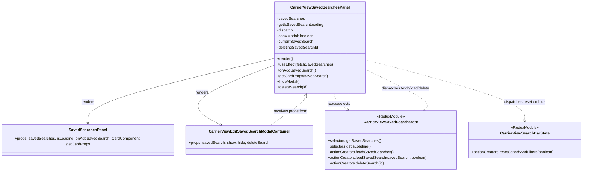

# Diagram: web/portal/src/pages/carrierview/dashboard/components/organisms/CarrierView.SavedSearchesPanel.organism.js


> Auto-generated by Obscura crawlers

## Diagram 1

```mermaid
flowchart LR
  CVSSP[CarrierViewSavedSearchesPanel]
  SSP[SavedSearchesPanel]
  CVEMC[CarrierViewEditSavedSearchModalContainer]
  CVSSState[CarrierViewSavedSearchState]
  CVSBState[CarrierViewSearchBarState]
  ReduxDispatch["dispatch()"]
  useSelector["useSelector(selectors)"]
  useStateHooks["useState(showModal, currentSavedSearch, deletingSavedSearchId)"]
  useEffectHook["useEffect -> fetchSavedSearches on mount"]

  CVSSP -->|renders| SSP
  CVSSP -->|renders| CVEMC
  CVSSP -->|uses| useSelector
  CVSSP -->|uses| useStateHooks
  CVSSP -->|uses| useEffectHook
  useEffectHook -->|calls| ReduxDispatch
  ReduxDispatch -->|dispatches| CVSSState_action_fetch[CarrierViewSavedSearchState.actionCreators.fetchSavedSearches()]
  CVSSP -->|reads selectors| CVSSState
  useSelector --> CVSSState
  SSP -->|receives props| CVSSP
  CVEMC -->|props: savedSearch, show, hide, deleteSearch| CVSSP
  CVSSP -->|onEditClick->dispatch loadSavedSearch| CVSSState_action_load[CarrierViewSavedSearchState.actionCreators.loadSavedSearch(savedSearch, true)]
  CVSSP -->|deleteSearch->dispatch deleteSearch| CVSSState_action_delete[CarrierViewSavedSearchState.actionCreators.deleteSearch(id)]
  CVEMC -->|hide->dispatch resetSearchAndFilters| CVSBState_action_reset[CarrierViewSearchBarState.actionCreators.resetSearchAndFilters(true)]
  CVSSState_action_fetch --> CVSSState
  CVSSState_action_load --> CVSSState
  CVSSState_action_delete --> CVSSState
  CVSBState_action_reset --> CVSBState
```

> SVG rendering failed for this diagram.

## Diagram 2



### SVG

<svg id="container" width="2413.9765625" xmlns="http://www.w3.org/2000/svg" class="classDiagram" height="744" viewBox="0 0 2413.9765625 744" role="graphics-document document" aria-roledescription="class"><style>#container{font-family:"trebuchet ms",verdana,arial,sans-serif;font-size:16px;fill:#333;}@keyframes edge-animation-frame{from{stroke-dashoffset:0;}}@keyframes dash{to{stroke-dashoffset:0;}}#container .edge-animation-slow{stroke-dasharray:9,5!important;stroke-dashoffset:900;animation:dash 50s linear infinite;stroke-linecap:round;}#container .edge-animation-fast{stroke-dasharray:9,5!important;stroke-dashoffset:900;animation:dash 20s linear infinite;stroke-linecap:round;}#container .error-icon{fill:#552222;}#container .error-text{fill:#552222;stroke:#552222;}#container .edge-thickness-normal{stroke-width:1px;}#container .edge-thickness-thick{stroke-width:3.5px;}#container .edge-pattern-solid{stroke-dasharray:0;}#container .edge-thickness-invisible{stroke-width:0;fill:none;}#container .edge-pattern-dashed{stroke-dasharray:3;}#container .edge-pattern-dotted{stroke-dasharray:2;}#container .marker{fill:#333333;stroke:#333333;}#container .marker.cross{stroke:#333333;}#container svg{font-family:"trebuchet ms",verdana,arial,sans-serif;font-size:16px;}#container p{margin:0;}#container g.classGroup text{fill:#9370DB;stroke:none;font-family:"trebuchet ms",verdana,arial,sans-serif;font-size:10px;}#container g.classGroup text .title{font-weight:bolder;}#container .nodeLabel,#container .edgeLabel{color:#131300;}#container .edgeLabel .label rect{fill:#ECECFF;}#container .label text{fill:#131300;}#container .labelBkg{background:#ECECFF;}#container .edgeLabel .label span{background:#ECECFF;}#container .classTitle{font-weight:bolder;}#container .node rect,#container .node circle,#container .node ellipse,#container .node polygon,#container .node path{fill:#ECECFF;stroke:#9370DB;stroke-width:1px;}#container .divider{stroke:#9370DB;stroke-width:1;}#container g.clickable{cursor:pointer;}#container g.classGroup rect{fill:#ECECFF;stroke:#9370DB;}#container g.classGroup line{stroke:#9370DB;stroke-width:1;}#container .classLabel .box{stroke:none;stroke-width:0;fill:#ECECFF;opacity:0.5;}#container .classLabel .label{fill:#9370DB;font-size:10px;}#container .relation{stroke:#333333;stroke-width:1;fill:none;}#container .dashed-line{stroke-dasharray:3;}#container .dotted-line{stroke-dasharray:1 2;}#container #compositionStart,#container .composition{fill:#333333!important;stroke:#333333!important;stroke-width:1;}#container #compositionEnd,#container .composition{fill:#333333!important;stroke:#333333!important;stroke-width:1;}#container #dependencyStart,#container .dependency{fill:#333333!important;stroke:#333333!important;stroke-width:1;}#container #dependencyStart,#container .dependency{fill:#333333!important;stroke:#333333!important;stroke-width:1;}#container #extensionStart,#container .extension{fill:transparent!important;stroke:#333333!important;stroke-width:1;}#container #extensionEnd,#container .extension{fill:transparent!important;stroke:#333333!important;stroke-width:1;}#container #aggregationStart,#container .aggregation{fill:transparent!important;stroke:#333333!important;stroke-width:1;}#container #aggregationEnd,#container .aggregation{fill:transparent!important;stroke:#333333!important;stroke-width:1;}#container #lollipopStart,#container .lollipop{fill:#ECECFF!important;stroke:#333333!important;stroke-width:1;}#container #lollipopEnd,#container .lollipop{fill:#ECECFF!important;stroke:#333333!important;stroke-width:1;}#container .edgeTerminals{font-size:11px;line-height:initial;}#container .classTitleText{text-anchor:middle;font-size:18px;fill:#333;}#container .label-icon{display:inline-block;height:1em;overflow:visible;vertical-align:-0.125em;}#container .node .label-icon path{fill:currentColor;stroke:revert;stroke-width:revert;}#container :root{--mermaid-font-family:"trebuchet ms",verdana,arial,sans-serif;}</style><g><defs><marker id="container_class-aggregationStart" class="marker aggregation class" refX="18" refY="7" markerWidth="190" markerHeight="240" orient="auto"><path d="M 18,7 L9,13 L1,7 L9,1 Z"></path></marker></defs><defs><marker id="container_class-aggregationEnd" class="marker aggregation class" refX="1" refY="7" markerWidth="20" markerHeight="28" orient="auto"><path d="M 18,7 L9,13 L1,7 L9,1 Z"></path></marker></defs><defs><marker id="container_class-extensionStart" class="marker extension class" refX="18" refY="7" markerWidth="190" markerHeight="240" orient="auto"><path d="M 1,7 L18,13 V 1 Z"></path></marker></defs><defs><marker id="container_class-extensionEnd" class="marker extension class" refX="1" refY="7" markerWidth="20" markerHeight="28" orient="auto"><path d="M 1,1 V 13 L18,7 Z"></path></marker></defs><defs><marker id="container_class-compositionStart" class="marker composition class" refX="18" refY="7" markerWidth="190" markerHeight="240" orient="auto"><path d="M 18,7 L9,13 L1,7 L9,1 Z"></path></marker></defs><defs><marker id="container_class-compositionEnd" class="marker composition class" refX="1" refY="7" markerWidth="20" markerHeight="28" orient="auto"><path d="M 18,7 L9,13 L1,7 L9,1 Z"></path></marker></defs><defs><marker id="container_class-dependencyStart" class="marker dependency class" refX="6" refY="7" markerWidth="190" markerHeight="240" orient="auto"><path d="M 5,7 L9,13 L1,7 L9,1 Z"></path></marker></defs><defs><marker id="container_class-dependencyEnd" class="marker dependency class" refX="13" refY="7" markerWidth="20" markerHeight="28" orient="auto"><path d="M 18,7 L9,13 L14,7 L9,1 Z"></path></marker></defs><defs><marker id="container_class-lollipopStart" class="marker lollipop class" refX="13" refY="7" markerWidth="190" markerHeight="240" orient="auto"><circle stroke="black" fill="transparent" cx="7" cy="7" r="6"></circle></marker></defs><defs><marker id="container_class-lollipopEnd" class="marker lollipop class" refX="1" refY="7" markerWidth="190" markerHeight="240" orient="auto"><circle stroke="black" fill="transparent" cx="7" cy="7" r="6"></circle></marker></defs><g class="root"><g class="clusters"></g><g class="edgePaths"><path d="M1141.383,246.569L1012.245,278.974C883.107,311.379,624.831,376.19,495.693,426.261C366.555,476.333,366.555,511.667,366.555,529.333L366.555,547" id="id_CarrierViewSavedSearchesPanel_SavedSearchesPanel_1" class="edge-thickness-normal edge-pattern-solid relation" style=";;;" data-edge="true" data-et="edge" data-id="id_CarrierViewSavedSearchesPanel_SavedSearchesPanel_1" data-points="W3sieCI6MTE0MS4zODI4MTI1LCJ5IjoyNDYuNTY4OTI2MDM2NjQ2MTN9LHsieCI6MzY2LjU1NDY4NzUsInkiOjQ0MX0seyJ4IjozNjYuNTU0Njg3NSwieSI6NTUzfV0=" marker-end="url(#container_class-dependencyEnd)"></path><path d="M1141.383,276.072L1074.325,303.56C1007.267,331.048,873.151,386.024,837.458,431.678C801.765,477.331,864.496,513.662,895.861,531.827L927.226,549.993" id="id_CarrierViewSavedSearchesPanel_CarrierViewEditSavedSearchModalContainer_2" class="edge-thickness-normal edge-pattern-solid relation" style=";;;" data-edge="true" data-et="edge" data-id="id_CarrierViewSavedSearchesPanel_CarrierViewEditSavedSearchModalContainer_2" data-points="W3sieCI6MTE0MS4zODI4MTI1LCJ5IjoyNzYuMDcyNDgwMjMzODcxNX0seyJ4Ijo3MzkuMDM1MTU2MjUsInkiOjQ0MX0seyJ4Ijo5MzIuNDE3Nzg3MDYzOTUzNSwieSI6NTUzfV0=" marker-end="url(#container_class-dependencyEnd)"></path><path d="M1383.003,392L1385.387,400.167C1387.77,408.333,1392.538,424.667,1404.607,440.385C1416.677,456.104,1436.049,471.207,1445.735,478.759L1455.421,486.311" id="id_CarrierViewSavedSearchesPanel_CarrierViewSavedSearchState_3" class="edge-thickness-normal edge-pattern-dashed relation" style=";;;" data-edge="true" data-et="edge" data-id="id_CarrierViewSavedSearchesPanel_CarrierViewSavedSearchState_3" data-points="W3sieCI6MTM4My4wMDMyMjU0OTI3Mzg3LCJ5IjozOTJ9LHsieCI6MTM5Ny4zMDQ2ODc1LCJ5Ijo0NDF9LHsieCI6MTQ2MC4xNTI3MDcxMjIwOTMsInkiOjQ5MH1d" marker-end="url(#container_class-dependencyEnd)"></path><path d="M1512.547,252.899L1622.529,284.25C1732.512,315.6,1952.477,378.3,2062.459,424.817C2172.441,471.333,2172.441,501.667,2172.441,516.833L2172.441,532" id="id_CarrierViewSavedSearchesPanel_CarrierViewSearchBarState_4" class="edge-thickness-normal edge-pattern-dashed relation" style=";;;" data-edge="true" data-et="edge" data-id="id_CarrierViewSavedSearchesPanel_CarrierViewSearchBarState_4" data-points="W3sieCI6MTUxMi41NDY4NzUsInkiOjI1Mi44OTk0Nzg4NDQyMTY5M30seyJ4IjoyMTcyLjQ0MTQwNjI1LCJ5Ijo0NDF9LHsieCI6MjE3Mi40NDE0MDYyNSwieSI6NTM4fV0=" marker-end="url(#container_class-dependencyEnd)"></path><path d="M1512.547,296.469L1558.887,320.558C1605.227,344.646,1697.908,392.823,1736.758,424.372C1775.608,455.922,1760.627,470.844,1753.137,478.305L1745.647,485.766" id="id_CarrierViewSavedSearchesPanel_CarrierViewSavedSearchState_5" class="edge-thickness-normal edge-pattern-dashed relation" style=";;;" data-edge="true" data-et="edge" data-id="id_CarrierViewSavedSearchesPanel_CarrierViewSavedSearchState_5" data-points="W3sieCI6MTUxMi41NDY4NzUsInkiOjI5Ni40NjkwMzg0NDEyODQ4NX0seyJ4IjoxNzkwLjU4Nzg5MDYyNSwieSI6NDQxfSx7IngiOjE3NDEuMzk1OTI3OTYxNDgyNiwieSI6NDkwfV0=" marker-end="url(#container_class-dependencyEnd)"></path><path d="M1112.972,553L1136.914,534.333C1160.857,515.667,1208.741,478.333,1234.261,454.26C1259.781,430.186,1262.937,419.373,1264.515,413.966L1266.093,408.559" id="id_CarrierViewEditSavedSearchModalContainer_CarrierViewSavedSearchesPanel_6" class="edge-thickness-normal edge-pattern-dashed relation" style=";;;" data-edge="true" data-et="edge" data-id="id_CarrierViewEditSavedSearchModalContainer_CarrierViewSavedSearchesPanel_6" data-points="W3sieCI6MTExMi45NzIzODM3MjA5MzAzLCJ5Ijo1NTN9LHsieCI6MTI1Ni42MjUsInkiOjQ0MX0seyJ4IjoxMjcwLjkyNjQ2MjAwNzI2MTMsInkiOjM5Mn1d" marker-end="url(#container_class-extensionEnd)"></path></g><g class="edgeLabels"><g class="edgeLabel" transform="translate(366.5546875, 441)"><g class="label" data-id="id_CarrierViewSavedSearchesPanel_SavedSearchesPanel_1" transform="translate(-27.75, -12)"><foreignObject width="55.5" height="24"><div xmlns="http://www.w3.org/1999/xhtml" class="labelBkg" style="display: table-cell; white-space: nowrap; line-height: 1.5; max-width: 200px; text-align: center;"><span class="edgeLabel"><p>renders</p></span></div></foreignObject></g></g><g class="edgeLabel" transform="translate(836.82073, 400.91642)"><g class="label" data-id="id_CarrierViewSavedSearchesPanel_CarrierViewEditSavedSearchModalContainer_2" transform="translate(-27.75, -12)"><foreignObject width="55.5" height="24"><div xmlns="http://www.w3.org/1999/xhtml" class="labelBkg" style="display: table-cell; white-space: nowrap; line-height: 1.5; max-width: 200px; text-align: center;"><span class="edgeLabel"><p>renders</p></span></div></foreignObject></g></g><g class="edgeLabel" transform="translate(1408.60105, 449.8073)"><g class="label" data-id="id_CarrierViewSavedSearchesPanel_CarrierViewSavedSearchState_3" transform="translate(-49.1328125, -12)"><foreignObject width="98.265625" height="24"><div xmlns="http://www.w3.org/1999/xhtml" class="labelBkg" style="display: table-cell; white-space: nowrap; line-height: 1.5; max-width: 200px; text-align: center;"><span class="edgeLabel"><p>reads/selects</p></span></div></foreignObject></g></g><g class="edgeLabel" transform="translate(2172.44140625, 441)"><g class="label" data-id="id_CarrierViewSavedSearchesPanel_CarrierViewSearchBarState_4" transform="translate(-89.1796875, -12)"><foreignObject width="178.359375" height="24"><div xmlns="http://www.w3.org/1999/xhtml" class="labelBkg" style="display: table-cell; white-space: nowrap; line-height: 1.5; max-width: 200px; text-align: center;"><span class="edgeLabel"><p>dispatches reset on hide</p></span></div></foreignObject></g></g><g class="edgeLabel" transform="translate(1682.37043, 384.74653)"><g class="label" data-id="id_CarrierViewSavedSearchesPanel_CarrierViewSavedSearchState_5" transform="translate(-100, -24)"><foreignObject width="200" height="48"><div xmlns="http://www.w3.org/1999/xhtml" class="labelBkg" style="display: table; white-space: break-spaces; line-height: 1.5; max-width: 200px; text-align: center; width: 200px;"><span class="edgeLabel"><p>dispatches fetch/load/delete</p></span></div></foreignObject></g></g><g class="edgeLabel" transform="translate(1204.92634, 481.3073)"><g class="label" data-id="id_CarrierViewEditSavedSearchModalContainer_CarrierViewSavedSearchesPanel_6" transform="translate(-71.546875, -12)"><foreignObject width="143.09375" height="24"><div xmlns="http://www.w3.org/1999/xhtml" class="labelBkg" style="display: table-cell; white-space: nowrap; line-height: 1.5; max-width: 200px; text-align: center;"><span class="edgeLabel"><p>receives props from</p></span></div></foreignObject></g></g></g><g class="nodes"><g class="node default" id="classId-CarrierViewSavedSearchesPanel-0" transform="translate(1326.96484375, 200)"><g class="basic label-container"><path d="M-185.58203125 -192 L185.58203125 -192 L185.58203125 192 L-185.58203125 192" stroke="none" stroke-width="0" fill="#ECECFF" style=""></path><path d="M-185.58203125 -192 C-71.55941840714199 -192, 42.46319443571602 -192, 185.58203125 -192 M-185.58203125 -192 C-56.574568383220594 -192, 72.43289448355881 -192, 185.58203125 -192 M185.58203125 -192 C185.58203125 -85.55823693025715, 185.58203125 20.883526139485696, 185.58203125 192 M185.58203125 -192 C185.58203125 -113.32239063636678, 185.58203125 -34.64478127273355, 185.58203125 192 M185.58203125 192 C62.76363634873678 192, -60.05475855252644 192, -185.58203125 192 M185.58203125 192 C105.993431908434 192, 26.40483256686801 192, -185.58203125 192 M-185.58203125 192 C-185.58203125 53.285044386594905, -185.58203125 -85.42991122681019, -185.58203125 -192 M-185.58203125 192 C-185.58203125 64.44101995826833, -185.58203125 -63.117960083463345, -185.58203125 -192" stroke="#9370DB" stroke-width="1.3" fill="none" stroke-dasharray="0 0" style=""></path></g><g class="annotation-group text" transform="translate(0, -168)"></g><g class="label-group text" transform="translate(-117.6953125, -168)"><g class="label" style="font-weight: bolder" transform="translate(0,-12)"><foreignObject width="235.390625" height="24"><div xmlns="http://www.w3.org/1999/xhtml" style="display: table-cell; white-space: nowrap; line-height: 1.5; max-width: 281px; text-align: center;"><span class="nodeLabel markdown-node-label" style=""><p>CarrierViewSavedSearchesPanel</p></span></div></foreignObject></g></g><g class="members-group text" transform="translate(-173.58203125, -120)"><g class="label" style="" transform="translate(0,-12)"><foreignObject width="113.21875" height="24"><div xmlns="http://www.w3.org/1999/xhtml" style="display: table-cell; white-space: nowrap; line-height: 1.5; max-width: 171px; text-align: center;"><span class="nodeLabel markdown-node-label" style=""><p>-savedSearches</p></span></div></foreignObject></g><g class="label" style="" transform="translate(0,12)"><foreignObject width="190.421875" height="24"><div xmlns="http://www.w3.org/1999/xhtml" style="display: table-cell; white-space: nowrap; line-height: 1.5; max-width: 248px; text-align: center;"><span class="nodeLabel markdown-node-label" style=""><p>-getIsSavedSearchLoading</p></span></div></foreignObject></g><g class="label" style="" transform="translate(0,36)"><foreignObject width="68.609375" height="24"><div xmlns="http://www.w3.org/1999/xhtml" style="display: table-cell; white-space: nowrap; line-height: 1.5; max-width: 126px; text-align: center;"><span class="nodeLabel markdown-node-label" style=""><p>-dispatch</p></span></div></foreignObject></g><g class="label" style="" transform="translate(0,60)"><foreignObject width="156.390625" height="24"><div xmlns="http://www.w3.org/1999/xhtml" style="display: table-cell; white-space: nowrap; line-height: 1.5; max-width: 214px; text-align: center;"><span class="nodeLabel markdown-node-label" style=""><p>-showModal: boolean</p></span></div></foreignObject></g><g class="label" style="" transform="translate(0,84)"><foreignObject width="150.984375" height="24"><div xmlns="http://www.w3.org/1999/xhtml" style="display: table-cell; white-space: nowrap; line-height: 1.5; max-width: 208px; text-align: center;"><span class="nodeLabel markdown-node-label" style=""><p>-currentSavedSearch</p></span></div></foreignObject></g><g class="label" style="" transform="translate(0,108)"><foreignObject width="172.328125" height="24"><div xmlns="http://www.w3.org/1999/xhtml" style="display: table-cell; white-space: nowrap; line-height: 1.5; max-width: 230px; text-align: center;"><span class="nodeLabel markdown-node-label" style=""><p>-deletingSavedSearchId</p></span></div></foreignObject></g></g><g class="methods-group text" transform="translate(-173.58203125, 48)"><g class="label" style="" transform="translate(0,-12)"><foreignObject width="66.609375" height="24"><div xmlns="http://www.w3.org/1999/xhtml" style="display: table-cell; white-space: nowrap; line-height: 1.5; max-width: 124px; text-align: center;"><span class="nodeLabel markdown-node-label" style=""><p>+render()</p></span></div></foreignObject></g><g class="label" style="" transform="translate(0,12)"><foreignObject width="229.46875" height="24"><div xmlns="http://www.w3.org/1999/xhtml" style="display: table-cell; white-space: nowrap; line-height: 1.5; max-width: 287px; text-align: center;"><span class="nodeLabel markdown-node-label" style=""><p>+useEffect(fetchSavedSearches)</p></span></div></foreignObject></g><g class="label" style="" transform="translate(0,36)"><foreignObject width="157.375" height="24"><div xmlns="http://www.w3.org/1999/xhtml" style="display: table-cell; white-space: nowrap; line-height: 1.5; max-width: 215px; text-align: center;"><span class="nodeLabel markdown-node-label" style=""><p>+onAddSavedSearch()</p></span></div></foreignObject></g><g class="label" style="" transform="translate(0,60)"><foreignObject width="205.25" height="24"><div xmlns="http://www.w3.org/1999/xhtml" style="display: table-cell; white-space: nowrap; line-height: 1.5; max-width: 263px; text-align: center;"><span class="nodeLabel markdown-node-label" style=""><p>+getCardProps(savedSearch)</p></span></div></foreignObject></g><g class="label" style="" transform="translate(0,84)"><foreignObject width="95.125" height="24"><div xmlns="http://www.w3.org/1999/xhtml" style="display: table-cell; white-space: nowrap; line-height: 1.5; max-width: 152px; text-align: center;"><span class="nodeLabel markdown-node-label" style=""><p>+hideModal()</p></span></div></foreignObject></g><g class="label" style="" transform="translate(0,108)"><foreignObject width="127.015625" height="24"><div xmlns="http://www.w3.org/1999/xhtml" style="display: table-cell; white-space: nowrap; line-height: 1.5; max-width: 184px; text-align: center;"><span class="nodeLabel markdown-node-label" style=""><p>+deleteSearch(id)</p></span></div></foreignObject></g></g><g class="divider" style=""><path d="M-185.58203125 -144 C-72.28524447071442 -144, 41.011542308571165 -144, 185.58203125 -144 M-185.58203125 -144 C-63.603478890134085 -144, 58.37507346973183 -144, 185.58203125 -144" stroke="#9370DB" stroke-width="1.3" fill="none" stroke-dasharray="0 0" style=""></path></g><g class="divider" style=""><path d="M-185.58203125 24 C-100.23580475019537 24, -14.889578250390741 24, 185.58203125 24 M-185.58203125 24 C-79.24021597774515 24, 27.101599294509697 24, 185.58203125 24" stroke="#9370DB" stroke-width="1.3" fill="none" stroke-dasharray="0 0" style=""></path></g></g><g class="node default" id="classId-SavedSearchesPanel-1" transform="translate(366.5546875, 613)"><g class="basic label-container"><path d="M-358.5546875 -60 L358.5546875 -60 L358.5546875 60 L-358.5546875 60" stroke="none" stroke-width="0" fill="#ECECFF" style=""></path><path d="M-358.5546875 -60 C-108.6918413200593 -60, 141.1710048598814 -60, 358.5546875 -60 M-358.5546875 -60 C-88.35490921097386 -60, 181.84486907805228 -60, 358.5546875 -60 M358.5546875 -60 C358.5546875 -21.83881408233416, 358.5546875 16.32237183533168, 358.5546875 60 M358.5546875 -60 C358.5546875 -33.87787766539383, 358.5546875 -7.7557553307876645, 358.5546875 60 M358.5546875 60 C179.02579656920128 60, -0.5030943615974479 60, -358.5546875 60 M358.5546875 60 C83.8677767798493 60, -190.8191339403014 60, -358.5546875 60 M-358.5546875 60 C-358.5546875 15.74396071274154, -358.5546875 -28.51207857451692, -358.5546875 -60 M-358.5546875 60 C-358.5546875 34.762923879726024, -358.5546875 9.525847759452049, -358.5546875 -60" stroke="#9370DB" stroke-width="1.3" fill="none" stroke-dasharray="0 0" style=""></path></g><g class="annotation-group text" transform="translate(0, -36)"></g><g class="label-group text" transform="translate(-75.265625, -36)"><g class="label" style="font-weight: bolder" transform="translate(0,-12)"><foreignObject width="150.53125" height="24"><div xmlns="http://www.w3.org/1999/xhtml" style="display: table-cell; white-space: nowrap; line-height: 1.5; max-width: 198px; text-align: center;"><span class="nodeLabel markdown-node-label" style=""><p>SavedSearchesPanel</p></span></div></foreignObject></g></g><g class="members-group text" transform="translate(-346.5546875, 12)"><g class="label" style="" transform="translate(0,-12)"><foreignObject width="617.84375" height="24"><div xmlns="http://www.w3.org/1999/xhtml" style="display: table-cell; white-space: nowrap; line-height: 1.5; max-width: 675px; text-align: center;"><span class="nodeLabel markdown-node-label" style=""><p>+props: savedSearches, isLoading, onAddSavedSearch, CardComponent, getCardProps</p></span></div></foreignObject></g></g><g class="methods-group text" transform="translate(-346.5546875, 60)"></g><g class="divider" style=""><path d="M-358.5546875 -12 C-210.62344010541264 -12, -62.69219271082528 -12, 358.5546875 -12 M-358.5546875 -12 C-199.69209839197626 -12, -40.82950928395252 -12, 358.5546875 -12" stroke="#9370DB" stroke-width="1.3" fill="none" stroke-dasharray="0 0" style=""></path></g><g class="divider" style=""><path d="M-358.5546875 36 C-203.94009287832 36, -49.32549825664 36, 358.5546875 36 M-358.5546875 36 C-156.50344462002184 36, 45.54779825995632 36, 358.5546875 36" stroke="#9370DB" stroke-width="1.3" fill="none" stroke-dasharray="0 0" style=""></path></g></g><g class="node default" id="classId-CarrierViewEditSavedSearchModalContainer-2" transform="translate(1036.015625, 613)"><g class="basic label-container"><path d="M-260.90625 -60 L260.90625 -60 L260.90625 60 L-260.90625 60" stroke="none" stroke-width="0" fill="#ECECFF" style=""></path><path d="M-260.90625 -60 C-131.83167386145607 -60, -2.7570977229121354 -60, 260.90625 -60 M-260.90625 -60 C-131.13416275772457 -60, -1.3620755154491349 -60, 260.90625 -60 M260.90625 -60 C260.90625 -13.444468345239258, 260.90625 33.111063309521484, 260.90625 60 M260.90625 -60 C260.90625 -35.32314892677593, 260.90625 -10.646297853551857, 260.90625 60 M260.90625 60 C100.12175328949712 60, -60.66274342100576 60, -260.90625 60 M260.90625 60 C84.70313344042484 60, -91.49998311915033 60, -260.90625 60 M-260.90625 60 C-260.90625 17.023108010033084, -260.90625 -25.95378397993383, -260.90625 -60 M-260.90625 60 C-260.90625 29.785183202712457, -260.90625 -0.4296335945750869, -260.90625 -60" stroke="#9370DB" stroke-width="1.3" fill="none" stroke-dasharray="0 0" style=""></path></g><g class="annotation-group text" transform="translate(0, -36)"></g><g class="label-group text" transform="translate(-161.46875, -36)"><g class="label" style="font-weight: bolder" transform="translate(0,-12)"><foreignObject width="322.9375" height="24"><div xmlns="http://www.w3.org/1999/xhtml" style="display: table-cell; white-space: nowrap; line-height: 1.5; max-width: 369px; text-align: center;"><span class="nodeLabel markdown-node-label" style=""><p>CarrierViewEditSavedSearchModalContainer</p></span></div></foreignObject></g></g><g class="members-group text" transform="translate(-248.90625, 12)"><g class="label" style="" transform="translate(0,-12)"><foreignObject width="336.34375" height="24"><div xmlns="http://www.w3.org/1999/xhtml" style="display: table-cell; white-space: nowrap; line-height: 1.5; max-width: 394px; text-align: center;"><span class="nodeLabel markdown-node-label" style=""><p>+props: savedSearch, show, hide, deleteSearch</p></span></div></foreignObject></g></g><g class="methods-group text" transform="translate(-248.90625, 60)"></g><g class="divider" style=""><path d="M-260.90625 -12 C-134.279363081834 -12, -7.652476163667984 -12, 260.90625 -12 M-260.90625 -12 C-71.14942873788164 -12, 118.60739252423673 -12, 260.90625 -12" stroke="#9370DB" stroke-width="1.3" fill="none" stroke-dasharray="0 0" style=""></path></g><g class="divider" style=""><path d="M-260.90625 36 C-114.45969708093949 36, 31.986855838121016 36, 260.90625 36 M-260.90625 36 C-125.16549418027921 36, 10.575261639441578 36, 260.90625 36" stroke="#9370DB" stroke-width="1.3" fill="none" stroke-dasharray="0 0" style=""></path></g></g><g class="node default" id="classId-CarrierViewSavedSearchState-3" transform="translate(1617.9140625, 613)"><g class="basic label-container"><path d="M-270.9921875 -123 L270.9921875 -123 L270.9921875 123 L-270.9921875 123" stroke="none" stroke-width="0" fill="#ECECFF" style=""></path><path d="M-270.9921875 -123 C-68.23564078115683 -123, 134.52090593768634 -123, 270.9921875 -123 M-270.9921875 -123 C-162.42046453031998 -123, -53.84874156063992 -123, 270.9921875 -123 M270.9921875 -123 C270.9921875 -33.77783577620963, 270.9921875 55.444328447580745, 270.9921875 123 M270.9921875 -123 C270.9921875 -53.90920880878471, 270.9921875 15.181582382430577, 270.9921875 123 M270.9921875 123 C82.99542180096506 123, -105.00134389806988 123, -270.9921875 123 M270.9921875 123 C138.42163996868618 123, 5.851092437372358 123, -270.9921875 123 M-270.9921875 123 C-270.9921875 53.05686404324776, -270.9921875 -16.886271913504487, -270.9921875 -123 M-270.9921875 123 C-270.9921875 66.49269760058631, -270.9921875 9.985395201172622, -270.9921875 -123" stroke="#9370DB" stroke-width="1.3" fill="none" stroke-dasharray="0 0" style=""></path></g><g class="annotation-group text" transform="translate(-58.375, -99)"><g class="label" style="" transform="translate(0,-12)"><foreignObject width="116.75" height="24"><div xmlns="http://www.w3.org/1999/xhtml" style="display: table-cell; white-space: nowrap; line-height: 1.5; max-width: 167px; text-align: center;"><span class="nodeLabel markdown-node-label" style=""><p>«ReduxModule»</p></span></div></foreignObject></g></g><g class="label-group text" transform="translate(-108.546875, -75)"><g class="label" style="font-weight: bolder" transform="translate(0,-12)"><foreignObject width="217.09375" height="24"><div xmlns="http://www.w3.org/1999/xhtml" style="display: table-cell; white-space: nowrap; line-height: 1.5; max-width: 262px; text-align: center;"><span class="nodeLabel markdown-node-label" style=""><p>CarrierViewSavedSearchState</p></span></div></foreignObject></g></g><g class="members-group text" transform="translate(-258.9921875, -27)"></g><g class="methods-group text" transform="translate(-258.9921875, 3)"><g class="label" style="" transform="translate(0,-12)"><foreignObject width="218.234375" height="24"><div xmlns="http://www.w3.org/1999/xhtml" style="display: table-cell; white-space: nowrap; line-height: 1.5; max-width: 276px; text-align: center;"><span class="nodeLabel markdown-node-label" style=""><p>+selectors.getSavedSearches()</p></span></div></foreignObject></g><g class="label" style="" transform="translate(0,12)"><foreignObject width="179.484375" height="24"><div xmlns="http://www.w3.org/1999/xhtml" style="display: table-cell; white-space: nowrap; line-height: 1.5; max-width: 237px; text-align: center;"><span class="nodeLabel markdown-node-label" style=""><p>+selectors.getIsLoading()</p></span></div></foreignObject></g><g class="label" style="" transform="translate(0,36)"><foreignObject width="271.71875" height="24"><div xmlns="http://www.w3.org/1999/xhtml" style="display: table-cell; white-space: nowrap; line-height: 1.5; max-width: 329px; text-align: center;"><span class="nodeLabel markdown-node-label" style=""><p>+actionCreators.fetchSavedSearches()</p></span></div></foreignObject></g><g class="label" style="" transform="translate(0,60)"><foreignObject width="409.4375" height="24"><div xmlns="http://www.w3.org/1999/xhtml" style="display: table-cell; white-space: nowrap; line-height: 1.5; max-width: 467px; text-align: center;"><span class="nodeLabel markdown-node-label" style=""><p>+actionCreators.loadSavedSearch(savedSearch, boolean)</p></span></div></foreignObject></g><g class="label" style="" transform="translate(0,84)"><foreignObject width="235.78125" height="24"><div xmlns="http://www.w3.org/1999/xhtml" style="display: table-cell; white-space: nowrap; line-height: 1.5; max-width: 293px; text-align: center;"><span class="nodeLabel markdown-node-label" style=""><p>+actionCreators.deleteSearch(id)</p></span></div></foreignObject></g></g><g class="divider" style=""><path d="M-270.9921875 -51 C-143.43503132550262 -51, -15.877875151005213 -51, 270.9921875 -51 M-270.9921875 -51 C-115.47245218295603 -51, 40.047283134087934 -51, 270.9921875 -51" stroke="#9370DB" stroke-width="1.3" fill="none" stroke-dasharray="0 0" style=""></path></g><g class="divider" style=""><path d="M-270.9921875 -27 C-62.059103880798546 -27, 146.8739797384029 -27, 270.9921875 -27 M-270.9921875 -27 C-95.94416727412693 -27, 79.10385295174615 -27, 270.9921875 -27" stroke="#9370DB" stroke-width="1.3" fill="none" stroke-dasharray="0 0" style=""></path></g></g><g class="node default" id="classId-CarrierViewSearchBarState-4" transform="translate(2172.44140625, 613)"><g class="basic label-container"><path d="M-233.53515625 -75 L233.53515625 -75 L233.53515625 75 L-233.53515625 75" stroke="none" stroke-width="0" fill="#ECECFF" style=""></path><path d="M-233.53515625 -75 C-71.4707957532614 -75, 90.5935647434772 -75, 233.53515625 -75 M-233.53515625 -75 C-90.05275682940635 -75, 53.4296425911873 -75, 233.53515625 -75 M233.53515625 -75 C233.53515625 -22.553322268291204, 233.53515625 29.893355463417592, 233.53515625 75 M233.53515625 -75 C233.53515625 -36.07567900782542, 233.53515625 2.8486419843491575, 233.53515625 75 M233.53515625 75 C83.59657244336103 75, -66.34201136327795 75, -233.53515625 75 M233.53515625 75 C70.98724061914581 75, -91.56067501170838 75, -233.53515625 75 M-233.53515625 75 C-233.53515625 17.400354401196125, -233.53515625 -40.19929119760775, -233.53515625 -75 M-233.53515625 75 C-233.53515625 38.375672820463116, -233.53515625 1.7513456409262318, -233.53515625 -75" stroke="#9370DB" stroke-width="1.3" fill="none" stroke-dasharray="0 0" style=""></path></g><g class="annotation-group text" transform="translate(-58.375, -51)"><g class="label" style="" transform="translate(0,-12)"><foreignObject width="116.75" height="24"><div xmlns="http://www.w3.org/1999/xhtml" style="display: table-cell; white-space: nowrap; line-height: 1.5; max-width: 167px; text-align: center;"><span class="nodeLabel markdown-node-label" style=""><p>«ReduxModule»</p></span></div></foreignObject></g></g><g class="label-group text" transform="translate(-98.9765625, -27)"><g class="label" style="font-weight: bolder" transform="translate(0,-12)"><foreignObject width="197.953125" height="24"><div xmlns="http://www.w3.org/1999/xhtml" style="display: table-cell; white-space: nowrap; line-height: 1.5; max-width: 244px; text-align: center;"><span class="nodeLabel markdown-node-label" style=""><p>CarrierViewSearchBarState</p></span></div></foreignObject></g></g><g class="members-group text" transform="translate(-221.53515625, 21)"></g><g class="methods-group text" transform="translate(-221.53515625, 51)"><g class="label" style="" transform="translate(0,-12)"><foreignObject width="344.09375" height="24"><div xmlns="http://www.w3.org/1999/xhtml" style="display: table-cell; white-space: nowrap; line-height: 1.5; max-width: 401px; text-align: center;"><span class="nodeLabel markdown-node-label" style=""><p>+actionCreators.resetSearchAndFilters(boolean)</p></span></div></foreignObject></g></g><g class="divider" style=""><path d="M-233.53515625 -3 C-133.2042521865687 -3, -32.87334812313742 -3, 233.53515625 -3 M-233.53515625 -3 C-88.1507772752305 -3, 57.23360169953901 -3, 233.53515625 -3" stroke="#9370DB" stroke-width="1.3" fill="none" stroke-dasharray="0 0" style=""></path></g><g class="divider" style=""><path d="M-233.53515625 21 C-94.29556775446787 21, 44.944020741064264 21, 233.53515625 21 M-233.53515625 21 C-60.63562828017194 21, 112.26389968965611 21, 233.53515625 21" stroke="#9370DB" stroke-width="1.3" fill="none" stroke-dasharray="0 0" style=""></path></g></g></g></g></g></svg>
