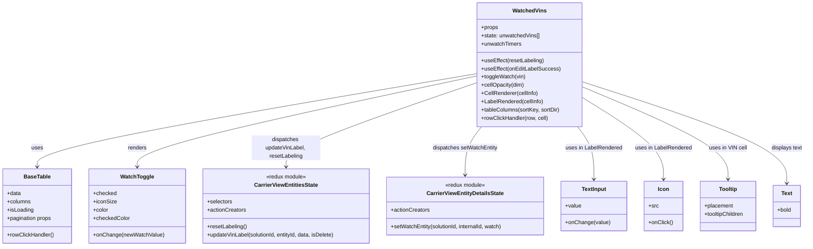
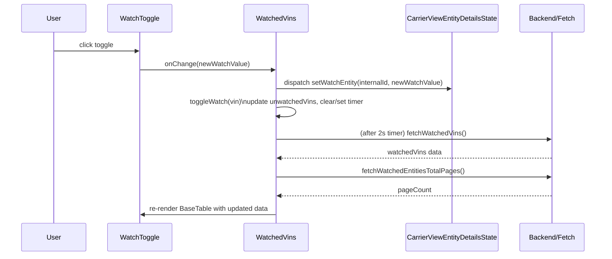

# Diagram: web/portal/src/pages/carrierview/dashboard/components/organisms/CarrierView.WatchedVins.organism.js


> Auto-generated by Obscura crawlers

## Diagram 1



### SVG

<svg id="container" width="2342.27734375" xmlns="http://www.w3.org/2000/svg" class="classDiagram" height="714" viewBox="0 0 2342.27734375 714" role="graphics-document document" aria-roledescription="class"><style>#container{font-family:"trebuchet ms",verdana,arial,sans-serif;font-size:16px;fill:#333;}@keyframes edge-animation-frame{from{stroke-dashoffset:0;}}@keyframes dash{to{stroke-dashoffset:0;}}#container .edge-animation-slow{stroke-dasharray:9,5!important;stroke-dashoffset:900;animation:dash 50s linear infinite;stroke-linecap:round;}#container .edge-animation-fast{stroke-dasharray:9,5!important;stroke-dashoffset:900;animation:dash 20s linear infinite;stroke-linecap:round;}#container .error-icon{fill:#552222;}#container .error-text{fill:#552222;stroke:#552222;}#container .edge-thickness-normal{stroke-width:1px;}#container .edge-thickness-thick{stroke-width:3.5px;}#container .edge-pattern-solid{stroke-dasharray:0;}#container .edge-thickness-invisible{stroke-width:0;fill:none;}#container .edge-pattern-dashed{stroke-dasharray:3;}#container .edge-pattern-dotted{stroke-dasharray:2;}#container .marker{fill:#333333;stroke:#333333;}#container .marker.cross{stroke:#333333;}#container svg{font-family:"trebuchet ms",verdana,arial,sans-serif;font-size:16px;}#container p{margin:0;}#container g.classGroup text{fill:#9370DB;stroke:none;font-family:"trebuchet ms",verdana,arial,sans-serif;font-size:10px;}#container g.classGroup text .title{font-weight:bolder;}#container .nodeLabel,#container .edgeLabel{color:#131300;}#container .edgeLabel .label rect{fill:#ECECFF;}#container .label text{fill:#131300;}#container .labelBkg{background:#ECECFF;}#container .edgeLabel .label span{background:#ECECFF;}#container .classTitle{font-weight:bolder;}#container .node rect,#container .node circle,#container .node ellipse,#container .node polygon,#container .node path{fill:#ECECFF;stroke:#9370DB;stroke-width:1px;}#container .divider{stroke:#9370DB;stroke-width:1;}#container g.clickable{cursor:pointer;}#container g.classGroup rect{fill:#ECECFF;stroke:#9370DB;}#container g.classGroup line{stroke:#9370DB;stroke-width:1;}#container .classLabel .box{stroke:none;stroke-width:0;fill:#ECECFF;opacity:0.5;}#container .classLabel .label{fill:#9370DB;font-size:10px;}#container .relation{stroke:#333333;stroke-width:1;fill:none;}#container .dashed-line{stroke-dasharray:3;}#container .dotted-line{stroke-dasharray:1 2;}#container #compositionStart,#container .composition{fill:#333333!important;stroke:#333333!important;stroke-width:1;}#container #compositionEnd,#container .composition{fill:#333333!important;stroke:#333333!important;stroke-width:1;}#container #dependencyStart,#container .dependency{fill:#333333!important;stroke:#333333!important;stroke-width:1;}#container #dependencyStart,#container .dependency{fill:#333333!important;stroke:#333333!important;stroke-width:1;}#container #extensionStart,#container .extension{fill:transparent!important;stroke:#333333!important;stroke-width:1;}#container #extensionEnd,#container .extension{fill:transparent!important;stroke:#333333!important;stroke-width:1;}#container #aggregationStart,#container .aggregation{fill:transparent!important;stroke:#333333!important;stroke-width:1;}#container #aggregationEnd,#container .aggregation{fill:transparent!important;stroke:#333333!important;stroke-width:1;}#container #lollipopStart,#container .lollipop{fill:#ECECFF!important;stroke:#333333!important;stroke-width:1;}#container #lollipopEnd,#container .lollipop{fill:#ECECFF!important;stroke:#333333!important;stroke-width:1;}#container .edgeTerminals{font-size:11px;line-height:initial;}#container .classTitleText{text-anchor:middle;font-size:18px;fill:#333;}#container .label-icon{display:inline-block;height:1em;overflow:visible;vertical-align:-0.125em;}#container .node .label-icon path{fill:currentColor;stroke:revert;stroke-width:revert;}#container :root{--mermaid-font-family:"trebuchet ms",verdana,arial,sans-serif;}</style><g><defs><marker id="container_class-aggregationStart" class="marker aggregation class" refX="18" refY="7" markerWidth="190" markerHeight="240" orient="auto"><path d="M 18,7 L9,13 L1,7 L9,1 Z"></path></marker></defs><defs><marker id="container_class-aggregationEnd" class="marker aggregation class" refX="1" refY="7" markerWidth="20" markerHeight="28" orient="auto"><path d="M 18,7 L9,13 L1,7 L9,1 Z"></path></marker></defs><defs><marker id="container_class-extensionStart" class="marker extension class" refX="18" refY="7" markerWidth="190" markerHeight="240" orient="auto"><path d="M 1,7 L18,13 V 1 Z"></path></marker></defs><defs><marker id="container_class-extensionEnd" class="marker extension class" refX="1" refY="7" markerWidth="20" markerHeight="28" orient="auto"><path d="M 1,1 V 13 L18,7 Z"></path></marker></defs><defs><marker id="container_class-compositionStart" class="marker composition class" refX="18" refY="7" markerWidth="190" markerHeight="240" orient="auto"><path d="M 18,7 L9,13 L1,7 L9,1 Z"></path></marker></defs><defs><marker id="container_class-compositionEnd" class="marker composition class" refX="1" refY="7" markerWidth="20" markerHeight="28" orient="auto"><path d="M 18,7 L9,13 L1,7 L9,1 Z"></path></marker></defs><defs><marker id="container_class-dependencyStart" class="marker dependency class" refX="6" refY="7" markerWidth="190" markerHeight="240" orient="auto"><path d="M 5,7 L9,13 L1,7 L9,1 Z"></path></marker></defs><defs><marker id="container_class-dependencyEnd" class="marker dependency class" refX="13" refY="7" markerWidth="20" markerHeight="28" orient="auto"><path d="M 18,7 L9,13 L14,7 L9,1 Z"></path></marker></defs><defs><marker id="container_class-lollipopStart" class="marker lollipop class" refX="13" refY="7" markerWidth="190" markerHeight="240" orient="auto"><circle stroke="black" fill="transparent" cx="7" cy="7" r="6"></circle></marker></defs><defs><marker id="container_class-lollipopEnd" class="marker lollipop class" refX="1" refY="7" markerWidth="190" markerHeight="240" orient="auto"><circle stroke="black" fill="transparent" cx="7" cy="7" r="6"></circle></marker></defs><g class="root"><g class="clusters"></g><g class="edgePaths"><path d="M1389.496,213.278L1175.756,249.232C962.016,285.185,534.535,357.093,320.795,402.213C107.055,447.333,107.055,465.667,107.055,474.833L107.055,484" id="id_WatchedVins_BaseTable_1" class="edge-thickness-normal edge-pattern-solid relation" style=";;;" data-edge="true" data-et="edge" data-id="id_WatchedVins_BaseTable_1" data-points="W3sieCI6MTM4OS40OTYwOTM3NSwieSI6MjEzLjI3NzgxMzM3MzMyMTUyfSx7IngiOjEwNy4wNTQ2ODc1LCJ5Ijo0Mjl9LHsieCI6MTA3LjA1NDY4NzUsInkiOjQ5MH1d" marker-end="url(#container_class-dependencyEnd)"></path><path d="M1389.496,219.579L1223.402,254.482C1057.307,289.386,725.118,359.193,559.024,403.263C392.93,447.333,392.93,465.667,392.93,474.833L392.93,484" id="id_WatchedVins_WatchToggle_2" class="edge-thickness-normal edge-pattern-solid relation" style=";;;" data-edge="true" data-et="edge" data-id="id_WatchedVins_WatchToggle_2" data-points="W3sieCI6MTM4OS40OTYwOTM3NSwieSI6MjE5LjU3ODg2MzExMjI4ODg3fSx7IngiOjM5Mi45Mjk2ODc1LCJ5Ijo0Mjl9LHsieCI6MzkyLjkyOTY4NzUsInkiOjQ5MH1d" marker-end="url(#container_class-dependencyEnd)"></path><path d="M1389.496,238.692L1295.471,270.41C1201.445,302.128,1013.395,365.564,919.369,406.449C825.344,447.333,825.344,465.667,825.344,474.833L825.344,484" id="id_WatchedVins_CarrierViewEntitiesState_3" class="edge-thickness-normal edge-pattern-solid relation" style=";;;" data-edge="true" data-et="edge" data-id="id_WatchedVins_CarrierViewEntitiesState_3" data-points="W3sieCI6MTM4OS40OTYwOTM3NSwieSI6MjM4LjY5MjMxNzM2NTg5MTU0fSx7IngiOjgyNS4zNDM3NSwieSI6NDI5fSx7IngiOjgyNS4zNDM3NSwieSI6NDkwfV0=" marker-end="url(#container_class-dependencyEnd)"></path><path d="M1399.673,368L1391.76,378.167C1383.847,388.333,1368.021,408.667,1360.108,432C1352.195,455.333,1352.195,481.667,1352.195,494.833L1352.195,508" id="id_WatchedVins_CarrierViewEntityDetailsState_4" class="edge-thickness-normal edge-pattern-solid relation" style=";;;" data-edge="true" data-et="edge" data-id="id_WatchedVins_CarrierViewEntityDetailsState_4" data-points="W3sieCI6MTM5OS42NzI2MDQzODI3OCwieSI6MzY4fSx7IngiOjEzNTIuMTk1MzEyNSwieSI6NDI5fSx7IngiOjEzNTIuMTk1MzEyNSwieSI6NTE0fV0=" marker-end="url(#container_class-dependencyEnd)"></path><path d="M1679.866,368L1687.779,378.167C1695.692,388.333,1711.518,408.667,1719.431,434C1727.344,459.333,1727.344,489.667,1727.344,504.833L1727.344,520" id="id_WatchedVins_TextInput_5" class="edge-thickness-normal edge-pattern-solid relation" style=";;;" data-edge="true" data-et="edge" data-id="id_WatchedVins_TextInput_5" data-points="W3sieCI6MTY3OS44NjY0NTgxMTcyMiwieSI6MzY4fSx7IngiOjE3MjcuMzQzNzUsInkiOjQyOX0seyJ4IjoxNzI3LjM0Mzc1LCJ5Ijo1MjZ9XQ==" marker-end="url(#container_class-dependencyEnd)"></path><path d="M1690.043,281.683L1729.427,306.236C1768.811,330.789,1847.579,379.894,1886.964,419.614C1926.348,459.333,1926.348,489.667,1926.348,504.833L1926.348,520" id="id_WatchedVins_Icon_6" class="edge-thickness-normal edge-pattern-solid relation" style=";;;" data-edge="true" data-et="edge" data-id="id_WatchedVins_Icon_6" data-points="W3sieCI6MTY5MC4wNDI5Njg3NSwieSI6MjgxLjY4MzI1ODU1ODY2NzgzfSx7IngiOjE5MjYuMzQ3NjU2MjUsInkiOjQyOX0seyJ4IjoxOTI2LjM0NzY1NjI1LCJ5Ijo1MjZ9XQ==" marker-end="url(#container_class-dependencyEnd)"></path><path d="M1690.043,250.964L1760.862,280.636C1831.681,310.309,1973.319,369.655,2044.138,414.494C2114.957,459.333,2114.957,489.667,2114.957,504.833L2114.957,520" id="id_WatchedVins_Tooltip_7" class="edge-thickness-normal edge-pattern-solid relation" style=";;;" data-edge="true" data-et="edge" data-id="id_WatchedVins_Tooltip_7" data-points="W3sieCI6MTY5MC4wNDI5Njg3NSwieSI6MjUwLjk2MzYzOTU3NDA1MTk0fSx7IngiOjIxMTQuOTU3MDMxMjUsInkiOjQyOX0seyJ4IjoyMTE0Ljk1NzAzMTI1LCJ5Ijo1MjZ9XQ==" marker-end="url(#container_class-dependencyEnd)"></path><path d="M1690.043,236.36L1789.811,268.467C1889.579,300.573,2089.116,364.787,2188.884,414.06C2288.652,463.333,2288.652,497.667,2288.652,514.833L2288.652,532" id="id_WatchedVins_Text_8" class="edge-thickness-normal edge-pattern-solid relation" style=";;;" data-edge="true" data-et="edge" data-id="id_WatchedVins_Text_8" data-points="W3sieCI6MTY5MC4wNDI5Njg3NSwieSI6MjM2LjM1OTkwMDY4NTM5NTk2fSx7IngiOjIyODguNjUyMzQzNzUsInkiOjQyOX0seyJ4IjoyMjg4LjY1MjM0Mzc1LCJ5Ijo1Mzh9XQ==" marker-end="url(#container_class-dependencyEnd)"></path></g><g class="edgeLabels"><g class="edgeLabel" transform="translate(107.0546875, 429)"><g class="label" data-id="id_WatchedVins_BaseTable_1" transform="translate(-16.4921875, -12)"><foreignObject width="32.984375" height="24"><div xmlns="http://www.w3.org/1999/xhtml" class="labelBkg" style="display: table-cell; white-space: nowrap; line-height: 1.5; max-width: 200px; text-align: center;"><span class="edgeLabel"><p>uses</p></span></div></foreignObject></g></g><g class="edgeLabel" transform="translate(392.9296875, 429)"><g class="label" data-id="id_WatchedVins_WatchToggle_2" transform="translate(-27.75, -12)"><foreignObject width="55.5" height="24"><div xmlns="http://www.w3.org/1999/xhtml" class="labelBkg" style="display: table-cell; white-space: nowrap; line-height: 1.5; max-width: 200px; text-align: center;"><span class="edgeLabel"><p>renders</p></span></div></foreignObject></g></g><g class="edgeLabel" transform="translate(825.34375, 429)"><g class="label" data-id="id_WatchedVins_CarrierViewEntitiesState_3" transform="translate(-100, -36)"><foreignObject width="200" height="72"><div xmlns="http://www.w3.org/1999/xhtml" class="labelBkg" style="display: table; white-space: break-spaces; line-height: 1.5; max-width: 200px; text-align: center; width: 200px;"><span class="edgeLabel"><p>dispatches updateVinLabel, resetLabeling</p></span></div></foreignObject></g></g><g class="edgeLabel" transform="translate(1352.1953125, 429)"><g class="label" data-id="id_WatchedVins_CarrierViewEntityDetailsState_4" transform="translate(-95.1015625, -12)"><foreignObject width="190.203125" height="24"><div xmlns="http://www.w3.org/1999/xhtml" class="labelBkg" style="display: table-cell; white-space: nowrap; line-height: 1.5; max-width: 200px; text-align: center;"><span class="edgeLabel"><p>dispatches setWatchEntity</p></span></div></foreignObject></g></g><g class="edgeLabel" transform="translate(1727.34375, 429)"><g class="label" data-id="id_WatchedVins_TextInput_5" transform="translate(-82.2890625, -12)"><foreignObject width="164.578125" height="24"><div xmlns="http://www.w3.org/1999/xhtml" class="labelBkg" style="display: table-cell; white-space: nowrap; line-height: 1.5; max-width: 200px; text-align: center;"><span class="edgeLabel"><p>uses in LabelRendered</p></span></div></foreignObject></g></g><g class="edgeLabel" transform="translate(1926.34765625, 429)"><g class="label" data-id="id_WatchedVins_Icon_6" transform="translate(-82.2890625, -12)"><foreignObject width="164.578125" height="24"><div xmlns="http://www.w3.org/1999/xhtml" class="labelBkg" style="display: table-cell; white-space: nowrap; line-height: 1.5; max-width: 200px; text-align: center;"><span class="edgeLabel"><p>uses in LabelRendered</p></span></div></foreignObject></g></g><g class="edgeLabel" transform="translate(2114.95703125, 429)"><g class="label" data-id="id_WatchedVins_Tooltip_7" transform="translate(-54.78125, -12)"><foreignObject width="109.5625" height="24"><div xmlns="http://www.w3.org/1999/xhtml" class="labelBkg" style="display: table-cell; white-space: nowrap; line-height: 1.5; max-width: 200px; text-align: center;"><span class="edgeLabel"><p>uses in VIN cell</p></span></div></foreignObject></g></g><g class="edgeLabel" transform="translate(2288.65234375, 429)"><g class="label" data-id="id_WatchedVins_Text_8" transform="translate(-45.625, -12)"><foreignObject width="91.25" height="24"><div xmlns="http://www.w3.org/1999/xhtml" class="labelBkg" style="display: table-cell; white-space: nowrap; line-height: 1.5; max-width: 200px; text-align: center;"><span class="edgeLabel"><p>displays text</p></span></div></foreignObject></g></g></g><g class="nodes"><g class="node default" id="classId-WatchedVins-0" transform="translate(1539.76953125, 188)"><g class="basic label-container"><path d="M-150.2734375 -180 L150.2734375 -180 L150.2734375 180 L-150.2734375 180" stroke="none" stroke-width="0" fill="#ECECFF" style=""></path><path d="M-150.2734375 -180 C-47.049042373947984 -180, 56.17535275210403 -180, 150.2734375 -180 M-150.2734375 -180 C-45.825063144862 -180, 58.623311210276 -180, 150.2734375 -180 M150.2734375 -180 C150.2734375 -80.9741541353747, 150.2734375 18.051691729250592, 150.2734375 180 M150.2734375 -180 C150.2734375 -88.41725019812044, 150.2734375 3.165499603759116, 150.2734375 180 M150.2734375 180 C75.04359735422324 180, -0.18624279155352497 180, -150.2734375 180 M150.2734375 180 C71.20984250716901 180, -7.853752485661971 180, -150.2734375 180 M-150.2734375 180 C-150.2734375 44.46076795101607, -150.2734375 -91.07846409796787, -150.2734375 -180 M-150.2734375 180 C-150.2734375 81.75168897983907, -150.2734375 -16.496622040321853, -150.2734375 -180" stroke="#9370DB" stroke-width="1.3" fill="none" stroke-dasharray="0 0" style=""></path></g><g class="annotation-group text" transform="translate(0, -156)"></g><g class="label-group text" transform="translate(-46.828125, -156)"><g class="label" style="font-weight: bolder" transform="translate(0,-12)"><foreignObject width="93.65625" height="24"><div xmlns="http://www.w3.org/1999/xhtml" style="display: table-cell; white-space: nowrap; line-height: 1.5; max-width: 143px; text-align: center;"><span class="nodeLabel markdown-node-label" style=""><p>WatchedVins</p></span></div></foreignObject></g></g><g class="members-group text" transform="translate(-138.2734375, -108)"><g class="label" style="" transform="translate(0,-12)"><foreignObject width="49.515625" height="24"><div xmlns="http://www.w3.org/1999/xhtml" style="display: table-cell; white-space: nowrap; line-height: 1.5; max-width: 107px; text-align: center;"><span class="nodeLabel markdown-node-label" style=""><p>+props</p></span></div></foreignObject></g><g class="label" style="" transform="translate(0,12)"><foreignObject width="172.25" height="24"><div xmlns="http://www.w3.org/1999/xhtml" style="display: table-cell; white-space: nowrap; line-height: 1.5; max-width: 230px; text-align: center;"><span class="nodeLabel markdown-node-label" style=""><p>+state: unwatchedVins[]</p></span></div></foreignObject></g><g class="label" style="" transform="translate(0,36)"><foreignObject width="117.84375" height="24"><div xmlns="http://www.w3.org/1999/xhtml" style="display: table-cell; white-space: nowrap; line-height: 1.5; max-width: 175px; text-align: center;"><span class="nodeLabel markdown-node-label" style=""><p>+unwatchTimers</p></span></div></foreignObject></g></g><g class="methods-group text" transform="translate(-138.2734375, -12)"><g class="label" style="" transform="translate(0,-12)"><foreignObject width="182.828125" height="24"><div xmlns="http://www.w3.org/1999/xhtml" style="display: table-cell; white-space: nowrap; line-height: 1.5; max-width: 240px; text-align: center;"><span class="nodeLabel markdown-node-label" style=""><p>+useEffect(resetLabeling)</p></span></div></foreignObject></g><g class="label" style="" transform="translate(0,12)"><foreignObject width="227.234375" height="24"><div xmlns="http://www.w3.org/1999/xhtml" style="display: table-cell; white-space: nowrap; line-height: 1.5; max-width: 285px; text-align: center;"><span class="nodeLabel markdown-node-label" style=""><p>+useEffect(onEditLabelSuccess)</p></span></div></foreignObject></g><g class="label" style="" transform="translate(0,36)"><foreignObject width="128.890625" height="24"><div xmlns="http://www.w3.org/1999/xhtml" style="display: table-cell; white-space: nowrap; line-height: 1.5; max-width: 186px; text-align: center;"><span class="nodeLabel markdown-node-label" style=""><p>+toggleWatch(vin)</p></span></div></foreignObject></g><g class="label" style="" transform="translate(0,60)"><foreignObject width="126.421875" height="24"><div xmlns="http://www.w3.org/1999/xhtml" style="display: table-cell; white-space: nowrap; line-height: 1.5; max-width: 184px; text-align: center;"><span class="nodeLabel markdown-node-label" style=""><p>+cellOpacity(dim)</p></span></div></foreignObject></g><g class="label" style="" transform="translate(0,84)"><foreignObject width="165.578125" height="24"><div xmlns="http://www.w3.org/1999/xhtml" style="display: table-cell; white-space: nowrap; line-height: 1.5; max-width: 223px; text-align: center;"><span class="nodeLabel markdown-node-label" style=""><p>+CellRenderer(cellInfo)</p></span></div></foreignObject></g><g class="label" style="" transform="translate(0,108)"><foreignObject width="181.65625" height="24"><div xmlns="http://www.w3.org/1999/xhtml" style="display: table-cell; white-space: nowrap; line-height: 1.5; max-width: 239px; text-align: center;"><span class="nodeLabel markdown-node-label" style=""><p>+LabelRendered(cellInfo)</p></span></div></foreignObject></g><g class="label" style="" transform="translate(0,132)"><foreignObject width="229.71875" height="24"><div xmlns="http://www.w3.org/1999/xhtml" style="display: table-cell; white-space: nowrap; line-height: 1.5; max-width: 287px; text-align: center;"><span class="nodeLabel markdown-node-label" style=""><p>+tableColumns(sortKey, sortDir)</p></span></div></foreignObject></g><g class="label" style="" transform="translate(0,156)"><foreignObject width="196.4375" height="24"><div xmlns="http://www.w3.org/1999/xhtml" style="display: table-cell; white-space: nowrap; line-height: 1.5; max-width: 254px; text-align: center;"><span class="nodeLabel markdown-node-label" style=""><p>+rowClickHandler(row, cell)</p></span></div></foreignObject></g></g><g class="divider" style=""><path d="M-150.2734375 -132 C-82.00872299527073 -132, -13.74400849054146 -132, 150.2734375 -132 M-150.2734375 -132 C-51.6137735076458 -132, 47.045890484708394 -132, 150.2734375 -132" stroke="#9370DB" stroke-width="1.3" fill="none" stroke-dasharray="0 0" style=""></path></g><g class="divider" style=""><path d="M-150.2734375 -36 C-56.2617737502203 -36, 37.7498899995594 -36, 150.2734375 -36 M-150.2734375 -36 C-79.72721047954052 -36, -9.180983459081034 -36, 150.2734375 -36" stroke="#9370DB" stroke-width="1.3" fill="none" stroke-dasharray="0 0" style=""></path></g></g><g class="node default" id="classId-BaseTable-1" transform="translate(107.0546875, 598)"><g class="basic label-container"><path d="M-99.0546875 -108 L99.0546875 -108 L99.0546875 108 L-99.0546875 108" stroke="none" stroke-width="0" fill="#ECECFF" style=""></path><path d="M-99.0546875 -108 C-46.65512084900942 -108, 5.744445801981158 -108, 99.0546875 -108 M-99.0546875 -108 C-35.8913022536921 -108, 27.272082992615793 -108, 99.0546875 -108 M99.0546875 -108 C99.0546875 -35.770573749280686, 99.0546875 36.45885250143863, 99.0546875 108 M99.0546875 -108 C99.0546875 -61.820835698496445, 99.0546875 -15.64167139699289, 99.0546875 108 M99.0546875 108 C46.27354001981741 108, -6.507607460365179 108, -99.0546875 108 M99.0546875 108 C24.139103469904825 108, -50.77648056019035 108, -99.0546875 108 M-99.0546875 108 C-99.0546875 40.46647386013012, -99.0546875 -27.067052279739755, -99.0546875 -108 M-99.0546875 108 C-99.0546875 62.275645223996065, -99.0546875 16.55129044799213, -99.0546875 -108" stroke="#9370DB" stroke-width="1.3" fill="none" stroke-dasharray="0 0" style=""></path></g><g class="annotation-group text" transform="translate(0, -84)"></g><g class="label-group text" transform="translate(-37.359375, -84)"><g class="label" style="font-weight: bolder" transform="translate(0,-12)"><foreignObject width="74.71875" height="24"><div xmlns="http://www.w3.org/1999/xhtml" style="display: table-cell; white-space: nowrap; line-height: 1.5; max-width: 123px; text-align: center;"><span class="nodeLabel markdown-node-label" style=""><p>BaseTable</p></span></div></foreignObject></g></g><g class="members-group text" transform="translate(-87.0546875, -36)"><g class="label" style="" transform="translate(0,-12)"><foreignObject width="40.625" height="24"><div xmlns="http://www.w3.org/1999/xhtml" style="display: table-cell; white-space: nowrap; line-height: 1.5; max-width: 98px; text-align: center;"><span class="nodeLabel markdown-node-label" style=""><p>+data</p></span></div></foreignObject></g><g class="label" style="" transform="translate(0,12)"><foreignObject width="69.21875" height="24"><div xmlns="http://www.w3.org/1999/xhtml" style="display: table-cell; white-space: nowrap; line-height: 1.5; max-width: 127px; text-align: center;"><span class="nodeLabel markdown-node-label" style=""><p>+columns</p></span></div></foreignObject></g><g class="label" style="" transform="translate(0,36)"><foreignObject width="77.203125" height="24"><div xmlns="http://www.w3.org/1999/xhtml" style="display: table-cell; white-space: nowrap; line-height: 1.5; max-width: 135px; text-align: center;"><span class="nodeLabel markdown-node-label" style=""><p>+isLoading</p></span></div></foreignObject></g><g class="label" style="" transform="translate(0,60)"><foreignObject width="131.5625" height="24"><div xmlns="http://www.w3.org/1999/xhtml" style="display: table-cell; white-space: nowrap; line-height: 1.5; max-width: 189px; text-align: center;"><span class="nodeLabel markdown-node-label" style=""><p>+pagination props</p></span></div></foreignObject></g></g><g class="methods-group text" transform="translate(-87.0546875, 84)"><g class="label" style="" transform="translate(0,-12)"><foreignObject width="136.75" height="24"><div xmlns="http://www.w3.org/1999/xhtml" style="display: table-cell; white-space: nowrap; line-height: 1.5; max-width: 194px; text-align: center;"><span class="nodeLabel markdown-node-label" style=""><p>+rowClickHandler()</p></span></div></foreignObject></g></g><g class="divider" style=""><path d="M-99.0546875 -60 C-22.269037855975327 -60, 54.516611788049346 -60, 99.0546875 -60 M-99.0546875 -60 C-53.04957993806726 -60, -7.044472376134522 -60, 99.0546875 -60" stroke="#9370DB" stroke-width="1.3" fill="none" stroke-dasharray="0 0" style=""></path></g><g class="divider" style=""><path d="M-99.0546875 60 C-58.74843041899928 60, -18.442173337998554 60, 99.0546875 60 M-99.0546875 60 C-25.676315411614112 60, 47.702056676771775 60, 99.0546875 60" stroke="#9370DB" stroke-width="1.3" fill="none" stroke-dasharray="0 0" style=""></path></g></g><g class="node default" id="classId-WatchToggle-2" transform="translate(392.9296875, 598)"><g class="basic label-container"><path d="M-136.8203125 -108 L136.8203125 -108 L136.8203125 108 L-136.8203125 108" stroke="none" stroke-width="0" fill="#ECECFF" style=""></path><path d="M-136.8203125 -108 C-41.25558607414219 -108, 54.30914035171563 -108, 136.8203125 -108 M-136.8203125 -108 C-52.89124446752413 -108, 31.037823564951736 -108, 136.8203125 -108 M136.8203125 -108 C136.8203125 -42.73279694524692, 136.8203125 22.534406109506165, 136.8203125 108 M136.8203125 -108 C136.8203125 -50.52161252245875, 136.8203125 6.956774955082494, 136.8203125 108 M136.8203125 108 C28.392851795145972 108, -80.03460890970806 108, -136.8203125 108 M136.8203125 108 C38.45050433180511 108, -59.91930383638979 108, -136.8203125 108 M-136.8203125 108 C-136.8203125 26.68856589721527, -136.8203125 -54.62286820556946, -136.8203125 -108 M-136.8203125 108 C-136.8203125 26.086198630029386, -136.8203125 -55.82760273994123, -136.8203125 -108" stroke="#9370DB" stroke-width="1.3" fill="none" stroke-dasharray="0 0" style=""></path></g><g class="annotation-group text" transform="translate(0, -84)"></g><g class="label-group text" transform="translate(-46.4375, -84)"><g class="label" style="font-weight: bolder" transform="translate(0,-12)"><foreignObject width="92.875" height="24"><div xmlns="http://www.w3.org/1999/xhtml" style="display: table-cell; white-space: nowrap; line-height: 1.5; max-width: 141px; text-align: center;"><span class="nodeLabel markdown-node-label" style=""><p>WatchToggle</p></span></div></foreignObject></g></g><g class="members-group text" transform="translate(-124.8203125, -36)"><g class="label" style="" transform="translate(0,-12)"><foreignObject width="67.71875" height="24"><div xmlns="http://www.w3.org/1999/xhtml" style="display: table-cell; white-space: nowrap; line-height: 1.5; max-width: 125px; text-align: center;"><span class="nodeLabel markdown-node-label" style=""><p>+checked</p></span></div></foreignObject></g><g class="label" style="" transform="translate(0,12)"><foreignObject width="67.390625" height="24"><div xmlns="http://www.w3.org/1999/xhtml" style="display: table-cell; white-space: nowrap; line-height: 1.5; max-width: 125px; text-align: center;"><span class="nodeLabel markdown-node-label" style=""><p>+iconSize</p></span></div></foreignObject></g><g class="label" style="" transform="translate(0,36)"><foreignObject width="44.796875" height="24"><div xmlns="http://www.w3.org/1999/xhtml" style="display: table-cell; white-space: nowrap; line-height: 1.5; max-width: 103px; text-align: center;"><span class="nodeLabel markdown-node-label" style=""><p>+color</p></span></div></foreignObject></g><g class="label" style="" transform="translate(0,60)"><foreignObject width="105.828125" height="24"><div xmlns="http://www.w3.org/1999/xhtml" style="display: table-cell; white-space: nowrap; line-height: 1.5; max-width: 164px; text-align: center;"><span class="nodeLabel markdown-node-label" style=""><p>+checkedColor</p></span></div></foreignObject></g></g><g class="methods-group text" transform="translate(-124.8203125, 84)"><g class="label" style="" transform="translate(0,-12)"><foreignObject width="203.203125" height="24"><div xmlns="http://www.w3.org/1999/xhtml" style="display: table-cell; white-space: nowrap; line-height: 1.5; max-width: 261px; text-align: center;"><span class="nodeLabel markdown-node-label" style=""><p>+onChange(newWatchValue)</p></span></div></foreignObject></g></g><g class="divider" style=""><path d="M-136.8203125 -60 C-80.84637424952612 -60, -24.87243599905223 -60, 136.8203125 -60 M-136.8203125 -60 C-69.3922500022338 -60, -1.9641875044675885 -60, 136.8203125 -60" stroke="#9370DB" stroke-width="1.3" fill="none" stroke-dasharray="0 0" style=""></path></g><g class="divider" style=""><path d="M-136.8203125 60 C-58.88147906595441 60, 19.057354368091183 60, 136.8203125 60 M-136.8203125 60 C-61.99104751919248 60, 12.838217461615045 60, 136.8203125 60" stroke="#9370DB" stroke-width="1.3" fill="none" stroke-dasharray="0 0" style=""></path></g></g><g class="node default" id="classId-CarrierViewEntitiesState-3" transform="translate(825.34375, 598)"><g class="basic label-container"><path d="M-245.59375 -108 L245.59375 -108 L245.59375 108 L-245.59375 108" stroke="none" stroke-width="0" fill="#ECECFF" style=""></path><path d="M-245.59375 -108 C-71.36208856995424 -108, 102.86957286009152 -108, 245.59375 -108 M-245.59375 -108 C-68.54981877842317 -108, 108.49411244315365 -108, 245.59375 -108 M245.59375 -108 C245.59375 -64.19239422182964, 245.59375 -20.38478844365929, 245.59375 108 M245.59375 -108 C245.59375 -64.17489258896322, 245.59375 -20.349785177926435, 245.59375 108 M245.59375 108 C121.67612254222875 108, -2.2415049155424924 108, -245.59375 108 M245.59375 108 C142.18659783784534 108, 38.77944567569065 108, -245.59375 108 M-245.59375 108 C-245.59375 38.42249637071413, -245.59375 -31.155007258571743, -245.59375 -108 M-245.59375 108 C-245.59375 31.448581120971554, -245.59375 -45.10283775805689, -245.59375 -108" stroke="#9370DB" stroke-width="1.3" fill="none" stroke-dasharray="0 0" style=""></path></g><g class="annotation-group text" transform="translate(-59.25, -84)"><g class="label" style="" transform="translate(0,-12)"><foreignObject width="118.5" height="24"><div xmlns="http://www.w3.org/1999/xhtml" style="display: table-cell; white-space: nowrap; line-height: 1.5; max-width: 169px; text-align: center;"><span class="nodeLabel markdown-node-label" style=""><p>«redux module»</p></span></div></foreignObject></g></g><g class="label-group text" transform="translate(-89.453125, -60)"><g class="label" style="font-weight: bolder" transform="translate(0,-12)"><foreignObject width="178.90625" height="24"><div xmlns="http://www.w3.org/1999/xhtml" style="display: table-cell; white-space: nowrap; line-height: 1.5; max-width: 225px; text-align: center;"><span class="nodeLabel markdown-node-label" style=""><p>CarrierViewEntitiesState</p></span></div></foreignObject></g></g><g class="members-group text" transform="translate(-233.59375, -12)"><g class="label" style="" transform="translate(0,-12)"><foreignObject width="73.453125" height="24"><div xmlns="http://www.w3.org/1999/xhtml" style="display: table-cell; white-space: nowrap; line-height: 1.5; max-width: 131px; text-align: center;"><span class="nodeLabel markdown-node-label" style=""><p>+selectors</p></span></div></foreignObject></g><g class="label" style="" transform="translate(0,12)"><foreignObject width="113.078125" height="24"><div xmlns="http://www.w3.org/1999/xhtml" style="display: table-cell; white-space: nowrap; line-height: 1.5; max-width: 170px; text-align: center;"><span class="nodeLabel markdown-node-label" style=""><p>+actionCreators</p></span></div></foreignObject></g></g><g class="methods-group text" transform="translate(-233.59375, 60)"><g class="label" style="" transform="translate(0,-12)"><foreignObject width="116.375" height="24"><div xmlns="http://www.w3.org/1999/xhtml" style="display: table-cell; white-space: nowrap; line-height: 1.5; max-width: 174px; text-align: center;"><span class="nodeLabel markdown-node-label" style=""><p>+resetLabeling()</p></span></div></foreignObject></g><g class="label" style="" transform="translate(0,12)"><foreignObject width="377.734375" height="24"><div xmlns="http://www.w3.org/1999/xhtml" style="display: table-cell; white-space: nowrap; line-height: 1.5; max-width: 435px; text-align: center;"><span class="nodeLabel markdown-node-label" style=""><p>+updateVinLabel(solutionId, entityId, data, isDelete)</p></span></div></foreignObject></g></g><g class="divider" style=""><path d="M-245.59375 -36 C-75.02208204938924 -36, 95.54958590122152 -36, 245.59375 -36 M-245.59375 -36 C-92.9219103796747 -36, 59.7499292406506 -36, 245.59375 -36" stroke="#9370DB" stroke-width="1.3" fill="none" stroke-dasharray="0 0" style=""></path></g><g class="divider" style=""><path d="M-245.59375 36 C-126.50845212178105 36, -7.423154243562095 36, 245.59375 36 M-245.59375 36 C-71.49484272216276 36, 102.60406455567448 36, 245.59375 36" stroke="#9370DB" stroke-width="1.3" fill="none" stroke-dasharray="0 0" style=""></path></g></g><g class="node default" id="classId-CarrierViewEntityDetailsState-4" transform="translate(1352.1953125, 598)"><g class="basic label-container"><path d="M-231.2578125 -84 L231.2578125 -84 L231.2578125 84 L-231.2578125 84" stroke="none" stroke-width="0" fill="#ECECFF" style=""></path><path d="M-231.2578125 -84 C-98.07317316879067 -84, 35.11146616241865 -84, 231.2578125 -84 M-231.2578125 -84 C-94.35849762330423 -84, 42.54081725339154 -84, 231.2578125 -84 M231.2578125 -84 C231.2578125 -29.551417184833078, 231.2578125 24.897165630333845, 231.2578125 84 M231.2578125 -84 C231.2578125 -47.75630972256591, 231.2578125 -11.512619445131818, 231.2578125 84 M231.2578125 84 C93.57210230502727 84, -44.113607889945456 84, -231.2578125 84 M231.2578125 84 C128.30104498382605 84, 25.34427746765209 84, -231.2578125 84 M-231.2578125 84 C-231.2578125 33.02412110644474, -231.2578125 -17.951757787110523, -231.2578125 -84 M-231.2578125 84 C-231.2578125 45.72158208815418, -231.2578125 7.443164176308358, -231.2578125 -84" stroke="#9370DB" stroke-width="1.3" fill="none" stroke-dasharray="0 0" style=""></path></g><g class="annotation-group text" transform="translate(-59.25, -60)"><g class="label" style="" transform="translate(0,-12)"><foreignObject width="118.5" height="24"><div xmlns="http://www.w3.org/1999/xhtml" style="display: table-cell; white-space: nowrap; line-height: 1.5; max-width: 169px; text-align: center;"><span class="nodeLabel markdown-node-label" style=""><p>«redux module»</p></span></div></foreignObject></g></g><g class="label-group text" transform="translate(-108.515625, -36)"><g class="label" style="font-weight: bolder" transform="translate(0,-12)"><foreignObject width="217.03125" height="24"><div xmlns="http://www.w3.org/1999/xhtml" style="display: table-cell; white-space: nowrap; line-height: 1.5; max-width: 262px; text-align: center;"><span class="nodeLabel markdown-node-label" style=""><p>CarrierViewEntityDetailsState</p></span></div></foreignObject></g></g><g class="members-group text" transform="translate(-219.2578125, 12)"><g class="label" style="" transform="translate(0,-12)"><foreignObject width="113.078125" height="24"><div xmlns="http://www.w3.org/1999/xhtml" style="display: table-cell; white-space: nowrap; line-height: 1.5; max-width: 170px; text-align: center;"><span class="nodeLabel markdown-node-label" style=""><p>+actionCreators</p></span></div></foreignObject></g></g><g class="methods-group text" transform="translate(-219.2578125, 60)"><g class="label" style="" transform="translate(0,-12)"><foreignObject width="330" height="24"><div xmlns="http://www.w3.org/1999/xhtml" style="display: table-cell; white-space: nowrap; line-height: 1.5; max-width: 387px; text-align: center;"><span class="nodeLabel markdown-node-label" style=""><p>+setWatchEntity(solutionId, internalId, watch)</p></span></div></foreignObject></g></g><g class="divider" style=""><path d="M-231.2578125 -12 C-114.07936341001458 -12, 3.099085679970841 -12, 231.2578125 -12 M-231.2578125 -12 C-55.00591427675113 -12, 121.24598394649774 -12, 231.2578125 -12" stroke="#9370DB" stroke-width="1.3" fill="none" stroke-dasharray="0 0" style=""></path></g><g class="divider" style=""><path d="M-231.2578125 36 C-73.73141045273582 36, 83.79499159452837 36, 231.2578125 36 M-231.2578125 36 C-72.23081339258812 36, 86.79618571482376 36, 231.2578125 36" stroke="#9370DB" stroke-width="1.3" fill="none" stroke-dasharray="0 0" style=""></path></g></g><g class="node default" id="classId-TextInput-5" transform="translate(1727.34375, 598)"><g class="basic label-container"><path d="M-93.890625 -72 L93.890625 -72 L93.890625 72 L-93.890625 72" stroke="none" stroke-width="0" fill="#ECECFF" style=""></path><path d="M-93.890625 -72 C-40.698048206489744 -72, 12.494528587020511 -72, 93.890625 -72 M-93.890625 -72 C-42.60094459926291 -72, 8.68873580147418 -72, 93.890625 -72 M93.890625 -72 C93.890625 -15.709324654058314, 93.890625 40.58135069188337, 93.890625 72 M93.890625 -72 C93.890625 -20.650057137231855, 93.890625 30.69988572553629, 93.890625 72 M93.890625 72 C27.57001708441142 72, -38.75059083117716 72, -93.890625 72 M93.890625 72 C49.26916363847609 72, 4.647702276952174 72, -93.890625 72 M-93.890625 72 C-93.890625 22.770988897902917, -93.890625 -26.458022204194165, -93.890625 -72 M-93.890625 72 C-93.890625 19.723199012662, -93.890625 -32.553601974676, -93.890625 -72" stroke="#9370DB" stroke-width="1.3" fill="none" stroke-dasharray="0 0" style=""></path></g><g class="annotation-group text" transform="translate(0, -48)"></g><g class="label-group text" transform="translate(-34.78125, -48)"><g class="label" style="font-weight: bolder" transform="translate(0,-12)"><foreignObject width="69.5625" height="24"><div xmlns="http://www.w3.org/1999/xhtml" style="display: table-cell; white-space: nowrap; line-height: 1.5; max-width: 118px; text-align: center;"><span class="nodeLabel markdown-node-label" style=""><p>TextInput</p></span></div></foreignObject></g></g><g class="members-group text" transform="translate(-81.890625, 0)"><g class="label" style="" transform="translate(0,-12)"><foreignObject width="46.71875" height="24"><div xmlns="http://www.w3.org/1999/xhtml" style="display: table-cell; white-space: nowrap; line-height: 1.5; max-width: 104px; text-align: center;"><span class="nodeLabel markdown-node-label" style=""><p>+value</p></span></div></foreignObject></g></g><g class="methods-group text" transform="translate(-81.890625, 48)"><g class="label" style="" transform="translate(0,-12)"><foreignObject width="129" height="24"><div xmlns="http://www.w3.org/1999/xhtml" style="display: table-cell; white-space: nowrap; line-height: 1.5; max-width: 186px; text-align: center;"><span class="nodeLabel markdown-node-label" style=""><p>+onChange(value)</p></span></div></foreignObject></g></g><g class="divider" style=""><path d="M-93.890625 -24 C-56.30111005787561 -24, -18.711595115751223 -24, 93.890625 -24 M-93.890625 -24 C-25.550840398788466 -24, 42.78894420242307 -24, 93.890625 -24" stroke="#9370DB" stroke-width="1.3" fill="none" stroke-dasharray="0 0" style=""></path></g><g class="divider" style=""><path d="M-93.890625 24 C-51.650178746595884 24, -9.409732493191768 24, 93.890625 24 M-93.890625 24 C-52.82094230919274 24, -11.751259618385475 24, 93.890625 24" stroke="#9370DB" stroke-width="1.3" fill="none" stroke-dasharray="0 0" style=""></path></g></g><g class="node default" id="classId-Icon-6" transform="translate(1926.34765625, 598)"><g class="basic label-container"><path d="M-55.11328125 -72 L55.11328125 -72 L55.11328125 72 L-55.11328125 72" stroke="none" stroke-width="0" fill="#ECECFF" style=""></path><path d="M-55.11328125 -72 C-26.011335324340187 -72, 3.090610601319625 -72, 55.11328125 -72 M-55.11328125 -72 C-26.270621468517717 -72, 2.5720383129645654 -72, 55.11328125 -72 M55.11328125 -72 C55.11328125 -32.63856939885421, 55.11328125 6.722861202291583, 55.11328125 72 M55.11328125 -72 C55.11328125 -14.610166937924632, 55.11328125 42.77966612415074, 55.11328125 72 M55.11328125 72 C26.318692663168868 72, -2.4758959236622644 72, -55.11328125 72 M55.11328125 72 C14.876275850149568 72, -25.360729549700864 72, -55.11328125 72 M-55.11328125 72 C-55.11328125 18.034091873129917, -55.11328125 -35.931816253740166, -55.11328125 -72 M-55.11328125 72 C-55.11328125 41.2361006260897, -55.11328125 10.472201252179403, -55.11328125 -72" stroke="#9370DB" stroke-width="1.3" fill="none" stroke-dasharray="0 0" style=""></path></g><g class="annotation-group text" transform="translate(0, -48)"></g><g class="label-group text" transform="translate(-15.3046875, -48)"><g class="label" style="font-weight: bolder" transform="translate(0,-12)"><foreignObject width="30.609375" height="24"><div xmlns="http://www.w3.org/1999/xhtml" style="display: table-cell; white-space: nowrap; line-height: 1.5; max-width: 81px; text-align: center;"><span class="nodeLabel markdown-node-label" style=""><p>Icon</p></span></div></foreignObject></g></g><g class="members-group text" transform="translate(-43.11328125, 0)"><g class="label" style="" transform="translate(0,-12)"><foreignObject width="28.8125" height="24"><div xmlns="http://www.w3.org/1999/xhtml" style="display: table-cell; white-space: nowrap; line-height: 1.5; max-width: 87px; text-align: center;"><span class="nodeLabel markdown-node-label" style=""><p>+src</p></span></div></foreignObject></g></g><g class="methods-group text" transform="translate(-43.11328125, 48)"><g class="label" style="" transform="translate(0,-12)"><foreignObject width="70.921875" height="24"><div xmlns="http://www.w3.org/1999/xhtml" style="display: table-cell; white-space: nowrap; line-height: 1.5; max-width: 128px; text-align: center;"><span class="nodeLabel markdown-node-label" style=""><p>+onClick()</p></span></div></foreignObject></g></g><g class="divider" style=""><path d="M-55.11328125 -24 C-15.488880371692694 -24, 24.13552050661461 -24, 55.11328125 -24 M-55.11328125 -24 C-26.448101214470384 -24, 2.217078821059232 -24, 55.11328125 -24" stroke="#9370DB" stroke-width="1.3" fill="none" stroke-dasharray="0 0" style=""></path></g><g class="divider" style=""><path d="M-55.11328125 24 C-22.43209433315461 24, 10.249092583690782 24, 55.11328125 24 M-55.11328125 24 C-19.240950086904597 24, 16.631381076190806 24, 55.11328125 24" stroke="#9370DB" stroke-width="1.3" fill="none" stroke-dasharray="0 0" style=""></path></g></g><g class="node default" id="classId-Tooltip-7" transform="translate(2114.95703125, 598)"><g class="basic label-container"><path d="M-83.49609375 -72 L83.49609375 -72 L83.49609375 72 L-83.49609375 72" stroke="none" stroke-width="0" fill="#ECECFF" style=""></path><path d="M-83.49609375 -72 C-40.382006078936875 -72, 2.7320815921262493 -72, 83.49609375 -72 M-83.49609375 -72 C-36.55685305355535 -72, 10.382387642889299 -72, 83.49609375 -72 M83.49609375 -72 C83.49609375 -31.85338074047671, 83.49609375 8.293238519046582, 83.49609375 72 M83.49609375 -72 C83.49609375 -16.44041174597372, 83.49609375 39.11917650805256, 83.49609375 72 M83.49609375 72 C31.690465498268928 72, -20.115162753462144 72, -83.49609375 72 M83.49609375 72 C40.98454499288946 72, -1.527003764221078 72, -83.49609375 72 M-83.49609375 72 C-83.49609375 27.665730616387144, -83.49609375 -16.668538767225712, -83.49609375 -72 M-83.49609375 72 C-83.49609375 41.33281889704016, -83.49609375 10.665637794080325, -83.49609375 -72" stroke="#9370DB" stroke-width="1.3" fill="none" stroke-dasharray="0 0" style=""></path></g><g class="annotation-group text" transform="translate(0, -48)"></g><g class="label-group text" transform="translate(-25.7265625, -48)"><g class="label" style="font-weight: bolder" transform="translate(0,-12)"><foreignObject width="51.453125" height="24"><div xmlns="http://www.w3.org/1999/xhtml" style="display: table-cell; white-space: nowrap; line-height: 1.5; max-width: 101px; text-align: center;"><span class="nodeLabel markdown-node-label" style=""><p>Tooltip</p></span></div></foreignObject></g></g><g class="members-group text" transform="translate(-71.49609375, 0)"><g class="label" style="" transform="translate(0,-12)"><foreignObject width="84.4375" height="24"><div xmlns="http://www.w3.org/1999/xhtml" style="display: table-cell; white-space: nowrap; line-height: 1.5; max-width: 142px; text-align: center;"><span class="nodeLabel markdown-node-label" style=""><p>+placement</p></span></div></foreignObject></g><g class="label" style="" transform="translate(0,12)"><foreignObject width="117.265625" height="24"><div xmlns="http://www.w3.org/1999/xhtml" style="display: table-cell; white-space: nowrap; line-height: 1.5; max-width: 175px; text-align: center;"><span class="nodeLabel markdown-node-label" style=""><p>+tooltipChildren</p></span></div></foreignObject></g></g><g class="methods-group text" transform="translate(-71.49609375, 72)"></g><g class="divider" style=""><path d="M-83.49609375 -24 C-37.21436303882831 -24, 9.06736767234338 -24, 83.49609375 -24 M-83.49609375 -24 C-37.003406728722865 -24, 9.48928029255427 -24, 83.49609375 -24" stroke="#9370DB" stroke-width="1.3" fill="none" stroke-dasharray="0 0" style=""></path></g><g class="divider" style=""><path d="M-83.49609375 48 C-20.099214950619384 48, 43.29766384876123 48, 83.49609375 48 M-83.49609375 48 C-21.86834784047474 48, 39.75939806905052 48, 83.49609375 48" stroke="#9370DB" stroke-width="1.3" fill="none" stroke-dasharray="0 0" style=""></path></g></g><g class="node default" id="classId-Text-8" transform="translate(2288.65234375, 598)"><g class="basic label-container"><path d="M-40.19921875 -60 L40.19921875 -60 L40.19921875 60 L-40.19921875 60" stroke="none" stroke-width="0" fill="#ECECFF" style=""></path><path d="M-40.19921875 -60 C-15.466689675074967 -60, 9.265839399850066 -60, 40.19921875 -60 M-40.19921875 -60 C-13.812878906029503 -60, 12.573460937940993 -60, 40.19921875 -60 M40.19921875 -60 C40.19921875 -31.318575479397364, 40.19921875 -2.6371509587947273, 40.19921875 60 M40.19921875 -60 C40.19921875 -20.475550720325217, 40.19921875 19.048898559349567, 40.19921875 60 M40.19921875 60 C23.83172910799666 60, 7.464239465993323 60, -40.19921875 60 M40.19921875 60 C18.498742367852483 60, -3.2017340142950346 60, -40.19921875 60 M-40.19921875 60 C-40.19921875 25.056376800360262, -40.19921875 -9.887246399279476, -40.19921875 -60 M-40.19921875 60 C-40.19921875 18.028955598549224, -40.19921875 -23.94208880290155, -40.19921875 -60" stroke="#9370DB" stroke-width="1.3" fill="none" stroke-dasharray="0 0" style=""></path></g><g class="annotation-group text" transform="translate(0, -36)"></g><g class="label-group text" transform="translate(-15.3828125, -36)"><g class="label" style="font-weight: bolder" transform="translate(0,-12)"><foreignObject width="30.765625" height="24"><div xmlns="http://www.w3.org/1999/xhtml" style="display: table-cell; white-space: nowrap; line-height: 1.5; max-width: 80px; text-align: center;"><span class="nodeLabel markdown-node-label" style=""><p>Text</p></span></div></foreignObject></g></g><g class="members-group text" transform="translate(-28.19921875, 12)"><g class="label" style="" transform="translate(0,-12)"><foreignObject width="41.015625" height="24"><div xmlns="http://www.w3.org/1999/xhtml" style="display: table-cell; white-space: nowrap; line-height: 1.5; max-width: 98px; text-align: center;"><span class="nodeLabel markdown-node-label" style=""><p>+bold</p></span></div></foreignObject></g></g><g class="methods-group text" transform="translate(-28.19921875, 60)"></g><g class="divider" style=""><path d="M-40.19921875 -12 C-18.43358290776346 -12, 3.332052934473083 -12, 40.19921875 -12 M-40.19921875 -12 C-13.740649937794167 -12, 12.717918874411666 -12, 40.19921875 -12" stroke="#9370DB" stroke-width="1.3" fill="none" stroke-dasharray="0 0" style=""></path></g><g class="divider" style=""><path d="M-40.19921875 36 C-8.807671448612101 36, 22.583875852775797 36, 40.19921875 36 M-40.19921875 36 C-21.725566309665307 36, -3.2519138693306147 36, 40.19921875 36" stroke="#9370DB" stroke-width="1.3" fill="none" stroke-dasharray="0 0" style=""></path></g></g></g></g></g></svg>

## Diagram 2



### SVG

<svg id="container" width="1492" xmlns="http://www.w3.org/2000/svg" height="633" viewBox="-50 -10 1492 633" role="graphics-document document" aria-roledescription="sequence"><g><rect x="1242" y="547" fill="#eaeaea" stroke="#666" width="150" height="65" name="API" rx="3" ry="3" class="actor actor-bottom"></rect><text x="1317" y="579.5" dominant-baseline="central" alignment-baseline="central" class="actor actor-box" style="text-anchor: middle; font-size: 16px; font-weight: 400;"><tspan x="1317" dy="0">Backend/Fetch</tspan></text></g><g><rect x="960" y="547" fill="#eaeaea" stroke="#666" width="232" height="65" name="Redux" rx="3" ry="3" class="actor actor-bottom"></rect><text x="1076" y="579.5" dominant-baseline="central" alignment-baseline="central" class="actor actor-box" style="text-anchor: middle; font-size: 16px; font-weight: 400;"><tspan x="1076" dy="0">CarrierViewEntityDetailsState</tspan></text></g><g><rect x="554" y="547" fill="#eaeaea" stroke="#666" width="150" height="65" name="Component" rx="3" ry="3" class="actor actor-bottom"></rect><text x="629" y="579.5" dominant-baseline="central" alignment-baseline="central" class="actor actor-box" style="text-anchor: middle; font-size: 16px; font-weight: 400;"><tspan x="629" dy="0">WatchedVins</tspan></text></g><g><rect x="200" y="547" fill="#eaeaea" stroke="#666" width="150" height="65" name="UI" rx="3" ry="3" class="actor actor-bottom"></rect><text x="275" y="579.5" dominant-baseline="central" alignment-baseline="central" class="actor actor-box" style="text-anchor: middle; font-size: 16px; font-weight: 400;"><tspan x="275" dy="0">WatchToggle</tspan></text></g><g><rect x="0" y="547" fill="#eaeaea" stroke="#666" width="150" height="65" name="User" rx="3" ry="3" class="actor actor-bottom"></rect><text x="75" y="579.5" dominant-baseline="central" alignment-baseline="central" class="actor actor-box" style="text-anchor: middle; font-size: 16px; font-weight: 400;"><tspan x="75" dy="0">User</tspan></text></g><g><line id="actor4" x1="1317" y1="65" x2="1317" y2="547" class="actor-line 200" stroke-width="0.5px" stroke="#999" name="API"></line><g id="root-4"><rect x="1242" y="0" fill="#eaeaea" stroke="#666" width="150" height="65" name="API" rx="3" ry="3" class="actor actor-top"></rect><text x="1317" y="32.5" dominant-baseline="central" alignment-baseline="central" class="actor actor-box" style="text-anchor: middle; font-size: 16px; font-weight: 400;"><tspan x="1317" dy="0">Backend/Fetch</tspan></text></g></g><g><line id="actor3" x1="1076" y1="65" x2="1076" y2="547" class="actor-line 200" stroke-width="0.5px" stroke="#999" name="Redux"></line><g id="root-3"><rect x="960" y="0" fill="#eaeaea" stroke="#666" width="232" height="65" name="Redux" rx="3" ry="3" class="actor actor-top"></rect><text x="1076" y="32.5" dominant-baseline="central" alignment-baseline="central" class="actor actor-box" style="text-anchor: middle; font-size: 16px; font-weight: 400;"><tspan x="1076" dy="0">CarrierViewEntityDetailsState</tspan></text></g></g><g><line id="actor2" x1="629" y1="65" x2="629" y2="547" class="actor-line 200" stroke-width="0.5px" stroke="#999" name="Component"></line><g id="root-2"><rect x="554" y="0" fill="#eaeaea" stroke="#666" width="150" height="65" name="Component" rx="3" ry="3" class="actor actor-top"></rect><text x="629" y="32.5" dominant-baseline="central" alignment-baseline="central" class="actor actor-box" style="text-anchor: middle; font-size: 16px; font-weight: 400;"><tspan x="629" dy="0">WatchedVins</tspan></text></g></g><g><line id="actor1" x1="275" y1="65" x2="275" y2="547" class="actor-line 200" stroke-width="0.5px" stroke="#999" name="UI"></line><g id="root-1"><rect x="200" y="0" fill="#eaeaea" stroke="#666" width="150" height="65" name="UI" rx="3" ry="3" class="actor actor-top"></rect><text x="275" y="32.5" dominant-baseline="central" alignment-baseline="central" class="actor actor-box" style="text-anchor: middle; font-size: 16px; font-weight: 400;"><tspan x="275" dy="0">WatchToggle</tspan></text></g></g><g><line id="actor0" x1="75" y1="65" x2="75" y2="547" class="actor-line 200" stroke-width="0.5px" stroke="#999" name="User"></line><g id="root-0"><rect x="0" y="0" fill="#eaeaea" stroke="#666" width="150" height="65" name="User" rx="3" ry="3" class="actor actor-top"></rect><text x="75" y="32.5" dominant-baseline="central" alignment-baseline="central" class="actor actor-box" style="text-anchor: middle; font-size: 16px; font-weight: 400;"><tspan x="75" dy="0">User</tspan></text></g></g><style>#container{font-family:"trebuchet ms",verdana,arial,sans-serif;font-size:16px;fill:#333;}@keyframes edge-animation-frame{from{stroke-dashoffset:0;}}@keyframes dash{to{stroke-dashoffset:0;}}#container .edge-animation-slow{stroke-dasharray:9,5!important;stroke-dashoffset:900;animation:dash 50s linear infinite;stroke-linecap:round;}#container .edge-animation-fast{stroke-dasharray:9,5!important;stroke-dashoffset:900;animation:dash 20s linear infinite;stroke-linecap:round;}#container .error-icon{fill:#552222;}#container .error-text{fill:#552222;stroke:#552222;}#container .edge-thickness-normal{stroke-width:1px;}#container .edge-thickness-thick{stroke-width:3.5px;}#container .edge-pattern-solid{stroke-dasharray:0;}#container .edge-thickness-invisible{stroke-width:0;fill:none;}#container .edge-pattern-dashed{stroke-dasharray:3;}#container .edge-pattern-dotted{stroke-dasharray:2;}#container .marker{fill:#333333;stroke:#333333;}#container .marker.cross{stroke:#333333;}#container svg{font-family:"trebuchet ms",verdana,arial,sans-serif;font-size:16px;}#container p{margin:0;}#container .actor{stroke:hsl(259.6261682243, 59.7765363128%, 87.9019607843%);fill:#ECECFF;}#container text.actor&gt;tspan{fill:black;stroke:none;}#container .actor-line{stroke:hsl(259.6261682243, 59.7765363128%, 87.9019607843%);}#container .innerArc{stroke-width:1.5;stroke-dasharray:none;}#container .messageLine0{stroke-width:1.5;stroke-dasharray:none;stroke:#333;}#container .messageLine1{stroke-width:1.5;stroke-dasharray:2,2;stroke:#333;}#container #arrowhead path{fill:#333;stroke:#333;}#container .sequenceNumber{fill:white;}#container #sequencenumber{fill:#333;}#container #crosshead path{fill:#333;stroke:#333;}#container .messageText{fill:#333;stroke:none;}#container .labelBox{stroke:hsl(259.6261682243, 59.7765363128%, 87.9019607843%);fill:#ECECFF;}#container .labelText,#container .labelText&gt;tspan{fill:black;stroke:none;}#container .loopText,#container .loopText&gt;tspan{fill:black;stroke:none;}#container .loopLine{stroke-width:2px;stroke-dasharray:2,2;stroke:hsl(259.6261682243, 59.7765363128%, 87.9019607843%);fill:hsl(259.6261682243, 59.7765363128%, 87.9019607843%);}#container .note{stroke:#aaaa33;fill:#fff5ad;}#container .noteText,#container .noteText&gt;tspan{fill:black;stroke:none;}#container .activation0{fill:#f4f4f4;stroke:#666;}#container .activation1{fill:#f4f4f4;stroke:#666;}#container .activation2{fill:#f4f4f4;stroke:#666;}#container .actorPopupMenu{position:absolute;}#container .actorPopupMenuPanel{position:absolute;fill:#ECECFF;box-shadow:0px 8px 16px 0px rgba(0,0,0,0.2);filter:drop-shadow(3px 5px 2px rgb(0 0 0 / 0.4));}#container .actor-man line{stroke:hsl(259.6261682243, 59.7765363128%, 87.9019607843%);fill:#ECECFF;}#container .actor-man circle,#container line{stroke:hsl(259.6261682243, 59.7765363128%, 87.9019607843%);fill:#ECECFF;stroke-width:2px;}#container :root{--mermaid-font-family:"trebuchet ms",verdana,arial,sans-serif;}</style><g></g><defs><symbol id="computer" width="24" height="24"><path transform="scale(.5)" d="M2 2v13h20v-13h-20zm18 11h-16v-9h16v9zm-10.228 6l.466-1h3.524l.467 1h-4.457zm14.228 3h-24l2-6h2.104l-1.33 4h18.45l-1.297-4h2.073l2 6zm-5-10h-14v-7h14v7z"></path></symbol></defs><defs><symbol id="database" fill-rule="evenodd" clip-rule="evenodd"><path transform="scale(.5)" d="M12.258.001l.256.004.255.005.253.008.251.01.249.012.247.015.246.016.242.019.241.02.239.023.236.024.233.027.231.028.229.031.225.032.223.034.22.036.217.038.214.04.211.041.208.043.205.045.201.046.198.048.194.05.191.051.187.053.183.054.18.056.175.057.172.059.168.06.163.061.16.063.155.064.15.066.074.033.073.033.071.034.07.034.069.035.068.035.067.035.066.035.064.036.064.036.062.036.06.036.06.037.058.037.058.037.055.038.055.038.053.038.052.038.051.039.05.039.048.039.047.039.045.04.044.04.043.04.041.04.04.041.039.041.037.041.036.041.034.041.033.042.032.042.03.042.029.042.027.042.026.043.024.043.023.043.021.043.02.043.018.044.017.043.015.044.013.044.012.044.011.045.009.044.007.045.006.045.004.045.002.045.001.045v17l-.001.045-.002.045-.004.045-.006.045-.007.045-.009.044-.011.045-.012.044-.013.044-.015.044-.017.043-.018.044-.02.043-.021.043-.023.043-.024.043-.026.043-.027.042-.029.042-.03.042-.032.042-.033.042-.034.041-.036.041-.037.041-.039.041-.04.041-.041.04-.043.04-.044.04-.045.04-.047.039-.048.039-.05.039-.051.039-.052.038-.053.038-.055.038-.055.038-.058.037-.058.037-.06.037-.06.036-.062.036-.064.036-.064.036-.066.035-.067.035-.068.035-.069.035-.07.034-.071.034-.073.033-.074.033-.15.066-.155.064-.16.063-.163.061-.168.06-.172.059-.175.057-.18.056-.183.054-.187.053-.191.051-.194.05-.198.048-.201.046-.205.045-.208.043-.211.041-.214.04-.217.038-.22.036-.223.034-.225.032-.229.031-.231.028-.233.027-.236.024-.239.023-.241.02-.242.019-.246.016-.247.015-.249.012-.251.01-.253.008-.255.005-.256.004-.258.001-.258-.001-.256-.004-.255-.005-.253-.008-.251-.01-.249-.012-.247-.015-.245-.016-.243-.019-.241-.02-.238-.023-.236-.024-.234-.027-.231-.028-.228-.031-.226-.032-.223-.034-.22-.036-.217-.038-.214-.04-.211-.041-.208-.043-.204-.045-.201-.046-.198-.048-.195-.05-.19-.051-.187-.053-.184-.054-.179-.056-.176-.057-.172-.059-.167-.06-.164-.061-.159-.063-.155-.064-.151-.066-.074-.033-.072-.033-.072-.034-.07-.034-.069-.035-.068-.035-.067-.035-.066-.035-.064-.036-.063-.036-.062-.036-.061-.036-.06-.037-.058-.037-.057-.037-.056-.038-.055-.038-.053-.038-.052-.038-.051-.039-.049-.039-.049-.039-.046-.039-.046-.04-.044-.04-.043-.04-.041-.04-.04-.041-.039-.041-.037-.041-.036-.041-.034-.041-.033-.042-.032-.042-.03-.042-.029-.042-.027-.042-.026-.043-.024-.043-.023-.043-.021-.043-.02-.043-.018-.044-.017-.043-.015-.044-.013-.044-.012-.044-.011-.045-.009-.044-.007-.045-.006-.045-.004-.045-.002-.045-.001-.045v-17l.001-.045.002-.045.004-.045.006-.045.007-.045.009-.044.011-.045.012-.044.013-.044.015-.044.017-.043.018-.044.02-.043.021-.043.023-.043.024-.043.026-.043.027-.042.029-.042.03-.042.032-.042.033-.042.034-.041.036-.041.037-.041.039-.041.04-.041.041-.04.043-.04.044-.04.046-.04.046-.039.049-.039.049-.039.051-.039.052-.038.053-.038.055-.038.056-.038.057-.037.058-.037.06-.037.061-.036.062-.036.063-.036.064-.036.066-.035.067-.035.068-.035.069-.035.07-.034.072-.034.072-.033.074-.033.151-.066.155-.064.159-.063.164-.061.167-.06.172-.059.176-.057.179-.056.184-.054.187-.053.19-.051.195-.05.198-.048.201-.046.204-.045.208-.043.211-.041.214-.04.217-.038.22-.036.223-.034.226-.032.228-.031.231-.028.234-.027.236-.024.238-.023.241-.02.243-.019.245-.016.247-.015.249-.012.251-.01.253-.008.255-.005.256-.004.258-.001.258.001zm-9.258 20.499v.01l.001.021.003.021.004.022.005.021.006.022.007.022.009.023.01.022.011.023.012.023.013.023.015.023.016.024.017.023.018.024.019.024.021.024.022.025.023.024.024.025.052.049.056.05.061.051.066.051.07.051.075.051.079.052.084.052.088.052.092.052.097.052.102.051.105.052.11.052.114.051.119.051.123.051.127.05.131.05.135.05.139.048.144.049.147.047.152.047.155.047.16.045.163.045.167.043.171.043.176.041.178.041.183.039.187.039.19.037.194.035.197.035.202.033.204.031.209.03.212.029.216.027.219.025.222.024.226.021.23.02.233.018.236.016.24.015.243.012.246.01.249.008.253.005.256.004.259.001.26-.001.257-.004.254-.005.25-.008.247-.011.244-.012.241-.014.237-.016.233-.018.231-.021.226-.021.224-.024.22-.026.216-.027.212-.028.21-.031.205-.031.202-.034.198-.034.194-.036.191-.037.187-.039.183-.04.179-.04.175-.042.172-.043.168-.044.163-.045.16-.046.155-.046.152-.047.148-.048.143-.049.139-.049.136-.05.131-.05.126-.05.123-.051.118-.052.114-.051.11-.052.106-.052.101-.052.096-.052.092-.052.088-.053.083-.051.079-.052.074-.052.07-.051.065-.051.06-.051.056-.05.051-.05.023-.024.023-.025.021-.024.02-.024.019-.024.018-.024.017-.024.015-.023.014-.024.013-.023.012-.023.01-.023.01-.022.008-.022.006-.022.006-.022.004-.022.004-.021.001-.021.001-.021v-4.127l-.077.055-.08.053-.083.054-.085.053-.087.052-.09.052-.093.051-.095.05-.097.05-.1.049-.102.049-.105.048-.106.047-.109.047-.111.046-.114.045-.115.045-.118.044-.12.043-.122.042-.124.042-.126.041-.128.04-.13.04-.132.038-.134.038-.135.037-.138.037-.139.035-.142.035-.143.034-.144.033-.147.032-.148.031-.15.03-.151.03-.153.029-.154.027-.156.027-.158.026-.159.025-.161.024-.162.023-.163.022-.165.021-.166.02-.167.019-.169.018-.169.017-.171.016-.173.015-.173.014-.175.013-.175.012-.177.011-.178.01-.179.008-.179.008-.181.006-.182.005-.182.004-.184.003-.184.002h-.37l-.184-.002-.184-.003-.182-.004-.182-.005-.181-.006-.179-.008-.179-.008-.178-.01-.176-.011-.176-.012-.175-.013-.173-.014-.172-.015-.171-.016-.17-.017-.169-.018-.167-.019-.166-.02-.165-.021-.163-.022-.162-.023-.161-.024-.159-.025-.157-.026-.156-.027-.155-.027-.153-.029-.151-.03-.15-.03-.148-.031-.146-.032-.145-.033-.143-.034-.141-.035-.14-.035-.137-.037-.136-.037-.134-.038-.132-.038-.13-.04-.128-.04-.126-.041-.124-.042-.122-.042-.12-.044-.117-.043-.116-.045-.113-.045-.112-.046-.109-.047-.106-.047-.105-.048-.102-.049-.1-.049-.097-.05-.095-.05-.093-.052-.09-.051-.087-.052-.085-.053-.083-.054-.08-.054-.077-.054v4.127zm0-5.654v.011l.001.021.003.021.004.021.005.022.006.022.007.022.009.022.01.022.011.023.012.023.013.023.015.024.016.023.017.024.018.024.019.024.021.024.022.024.023.025.024.024.052.05.056.05.061.05.066.051.07.051.075.052.079.051.084.052.088.052.092.052.097.052.102.052.105.052.11.051.114.051.119.052.123.05.127.051.131.05.135.049.139.049.144.048.147.048.152.047.155.046.16.045.163.045.167.044.171.042.176.042.178.04.183.04.187.038.19.037.194.036.197.034.202.033.204.032.209.03.212.028.216.027.219.025.222.024.226.022.23.02.233.018.236.016.24.014.243.012.246.01.249.008.253.006.256.003.259.001.26-.001.257-.003.254-.006.25-.008.247-.01.244-.012.241-.015.237-.016.233-.018.231-.02.226-.022.224-.024.22-.025.216-.027.212-.029.21-.03.205-.032.202-.033.198-.035.194-.036.191-.037.187-.039.183-.039.179-.041.175-.042.172-.043.168-.044.163-.045.16-.045.155-.047.152-.047.148-.048.143-.048.139-.05.136-.049.131-.05.126-.051.123-.051.118-.051.114-.052.11-.052.106-.052.101-.052.096-.052.092-.052.088-.052.083-.052.079-.052.074-.051.07-.052.065-.051.06-.05.056-.051.051-.049.023-.025.023-.024.021-.025.02-.024.019-.024.018-.024.017-.024.015-.023.014-.023.013-.024.012-.022.01-.023.01-.023.008-.022.006-.022.006-.022.004-.021.004-.022.001-.021.001-.021v-4.139l-.077.054-.08.054-.083.054-.085.052-.087.053-.09.051-.093.051-.095.051-.097.05-.1.049-.102.049-.105.048-.106.047-.109.047-.111.046-.114.045-.115.044-.118.044-.12.044-.122.042-.124.042-.126.041-.128.04-.13.039-.132.039-.134.038-.135.037-.138.036-.139.036-.142.035-.143.033-.144.033-.147.033-.148.031-.15.03-.151.03-.153.028-.154.028-.156.027-.158.026-.159.025-.161.024-.162.023-.163.022-.165.021-.166.02-.167.019-.169.018-.169.017-.171.016-.173.015-.173.014-.175.013-.175.012-.177.011-.178.009-.179.009-.179.007-.181.007-.182.005-.182.004-.184.003-.184.002h-.37l-.184-.002-.184-.003-.182-.004-.182-.005-.181-.007-.179-.007-.179-.009-.178-.009-.176-.011-.176-.012-.175-.013-.173-.014-.172-.015-.171-.016-.17-.017-.169-.018-.167-.019-.166-.02-.165-.021-.163-.022-.162-.023-.161-.024-.159-.025-.157-.026-.156-.027-.155-.028-.153-.028-.151-.03-.15-.03-.148-.031-.146-.033-.145-.033-.143-.033-.141-.035-.14-.036-.137-.036-.136-.037-.134-.038-.132-.039-.13-.039-.128-.04-.126-.041-.124-.042-.122-.043-.12-.043-.117-.044-.116-.044-.113-.046-.112-.046-.109-.046-.106-.047-.105-.048-.102-.049-.1-.049-.097-.05-.095-.051-.093-.051-.09-.051-.087-.053-.085-.052-.083-.054-.08-.054-.077-.054v4.139zm0-5.666v.011l.001.02.003.022.004.021.005.022.006.021.007.022.009.023.01.022.011.023.012.023.013.023.015.023.016.024.017.024.018.023.019.024.021.025.022.024.023.024.024.025.052.05.056.05.061.05.066.051.07.051.075.052.079.051.084.052.088.052.092.052.097.052.102.052.105.051.11.052.114.051.119.051.123.051.127.05.131.05.135.05.139.049.144.048.147.048.152.047.155.046.16.045.163.045.167.043.171.043.176.042.178.04.183.04.187.038.19.037.194.036.197.034.202.033.204.032.209.03.212.028.216.027.219.025.222.024.226.021.23.02.233.018.236.017.24.014.243.012.246.01.249.008.253.006.256.003.259.001.26-.001.257-.003.254-.006.25-.008.247-.01.244-.013.241-.014.237-.016.233-.018.231-.02.226-.022.224-.024.22-.025.216-.027.212-.029.21-.03.205-.032.202-.033.198-.035.194-.036.191-.037.187-.039.183-.039.179-.041.175-.042.172-.043.168-.044.163-.045.16-.045.155-.047.152-.047.148-.048.143-.049.139-.049.136-.049.131-.051.126-.05.123-.051.118-.052.114-.051.11-.052.106-.052.101-.052.096-.052.092-.052.088-.052.083-.052.079-.052.074-.052.07-.051.065-.051.06-.051.056-.05.051-.049.023-.025.023-.025.021-.024.02-.024.019-.024.018-.024.017-.024.015-.023.014-.024.013-.023.012-.023.01-.022.01-.023.008-.022.006-.022.006-.022.004-.022.004-.021.001-.021.001-.021v-4.153l-.077.054-.08.054-.083.053-.085.053-.087.053-.09.051-.093.051-.095.051-.097.05-.1.049-.102.048-.105.048-.106.048-.109.046-.111.046-.114.046-.115.044-.118.044-.12.043-.122.043-.124.042-.126.041-.128.04-.13.039-.132.039-.134.038-.135.037-.138.036-.139.036-.142.034-.143.034-.144.033-.147.032-.148.032-.15.03-.151.03-.153.028-.154.028-.156.027-.158.026-.159.024-.161.024-.162.023-.163.023-.165.021-.166.02-.167.019-.169.018-.169.017-.171.016-.173.015-.173.014-.175.013-.175.012-.177.01-.178.01-.179.009-.179.007-.181.006-.182.006-.182.004-.184.003-.184.001-.185.001-.185-.001-.184-.001-.184-.003-.182-.004-.182-.006-.181-.006-.179-.007-.179-.009-.178-.01-.176-.01-.176-.012-.175-.013-.173-.014-.172-.015-.171-.016-.17-.017-.169-.018-.167-.019-.166-.02-.165-.021-.163-.023-.162-.023-.161-.024-.159-.024-.157-.026-.156-.027-.155-.028-.153-.028-.151-.03-.15-.03-.148-.032-.146-.032-.145-.033-.143-.034-.141-.034-.14-.036-.137-.036-.136-.037-.134-.038-.132-.039-.13-.039-.128-.041-.126-.041-.124-.041-.122-.043-.12-.043-.117-.044-.116-.044-.113-.046-.112-.046-.109-.046-.106-.048-.105-.048-.102-.048-.1-.05-.097-.049-.095-.051-.093-.051-.09-.052-.087-.052-.085-.053-.083-.053-.08-.054-.077-.054v4.153zm8.74-8.179l-.257.004-.254.005-.25.008-.247.011-.244.012-.241.014-.237.016-.233.018-.231.021-.226.022-.224.023-.22.026-.216.027-.212.028-.21.031-.205.032-.202.033-.198.034-.194.036-.191.038-.187.038-.183.04-.179.041-.175.042-.172.043-.168.043-.163.045-.16.046-.155.046-.152.048-.148.048-.143.048-.139.049-.136.05-.131.05-.126.051-.123.051-.118.051-.114.052-.11.052-.106.052-.101.052-.096.052-.092.052-.088.052-.083.052-.079.052-.074.051-.07.052-.065.051-.06.05-.056.05-.051.05-.023.025-.023.024-.021.024-.02.025-.019.024-.018.024-.017.023-.015.024-.014.023-.013.023-.012.023-.01.023-.01.022-.008.022-.006.023-.006.021-.004.022-.004.021-.001.021-.001.021.001.021.001.021.004.021.004.022.006.021.006.023.008.022.01.022.01.023.012.023.013.023.014.023.015.024.017.023.018.024.019.024.02.025.021.024.023.024.023.025.051.05.056.05.06.05.065.051.07.052.074.051.079.052.083.052.088.052.092.052.096.052.101.052.106.052.11.052.114.052.118.051.123.051.126.051.131.05.136.05.139.049.143.048.148.048.152.048.155.046.16.046.163.045.168.043.172.043.175.042.179.041.183.04.187.038.191.038.194.036.198.034.202.033.205.032.21.031.212.028.216.027.22.026.224.023.226.022.231.021.233.018.237.016.241.014.244.012.247.011.25.008.254.005.257.004.26.001.26-.001.257-.004.254-.005.25-.008.247-.011.244-.012.241-.014.237-.016.233-.018.231-.021.226-.022.224-.023.22-.026.216-.027.212-.028.21-.031.205-.032.202-.033.198-.034.194-.036.191-.038.187-.038.183-.04.179-.041.175-.042.172-.043.168-.043.163-.045.16-.046.155-.046.152-.048.148-.048.143-.048.139-.049.136-.05.131-.05.126-.051.123-.051.118-.051.114-.052.11-.052.106-.052.101-.052.096-.052.092-.052.088-.052.083-.052.079-.052.074-.051.07-.052.065-.051.06-.05.056-.05.051-.05.023-.025.023-.024.021-.024.02-.025.019-.024.018-.024.017-.023.015-.024.014-.023.013-.023.012-.023.01-.023.01-.022.008-.022.006-.023.006-.021.004-.022.004-.021.001-.021.001-.021-.001-.021-.001-.021-.004-.021-.004-.022-.006-.021-.006-.023-.008-.022-.01-.022-.01-.023-.012-.023-.013-.023-.014-.023-.015-.024-.017-.023-.018-.024-.019-.024-.02-.025-.021-.024-.023-.024-.023-.025-.051-.05-.056-.05-.06-.05-.065-.051-.07-.052-.074-.051-.079-.052-.083-.052-.088-.052-.092-.052-.096-.052-.101-.052-.106-.052-.11-.052-.114-.052-.118-.051-.123-.051-.126-.051-.131-.05-.136-.05-.139-.049-.143-.048-.148-.048-.152-.048-.155-.046-.16-.046-.163-.045-.168-.043-.172-.043-.175-.042-.179-.041-.183-.04-.187-.038-.191-.038-.194-.036-.198-.034-.202-.033-.205-.032-.21-.031-.212-.028-.216-.027-.22-.026-.224-.023-.226-.022-.231-.021-.233-.018-.237-.016-.241-.014-.244-.012-.247-.011-.25-.008-.254-.005-.257-.004-.26-.001-.26.001z"></path></symbol></defs><defs><symbol id="clock" width="24" height="24"><path transform="scale(.5)" d="M12 2c5.514 0 10 4.486 10 10s-4.486 10-10 10-10-4.486-10-10 4.486-10 10-10zm0-2c-6.627 0-12 5.373-12 12s5.373 12 12 12 12-5.373 12-12-5.373-12-12-12zm5.848 12.459c.202.038.202.333.001.372-1.907.361-6.045 1.111-6.547 1.111-.719 0-1.301-.582-1.301-1.301 0-.512.77-5.447 1.125-7.445.034-.192.312-.181.343.014l.985 6.238 5.394 1.011z"></path></symbol></defs><defs><marker id="arrowhead" refX="7.9" refY="5" markerUnits="userSpaceOnUse" markerWidth="12" markerHeight="12" orient="auto-start-reverse"><path d="M -1 0 L 10 5 L 0 10 z"></path></marker></defs><defs><marker id="crosshead" markerWidth="15" markerHeight="8" orient="auto" refX="4" refY="4.5"><path fill="none" stroke="#000000" stroke-width="1pt" d="M 1,2 L 6,7 M 6,2 L 1,7" style="stroke-dasharray: 0, 0;"></path></marker></defs><defs><marker id="filled-head" refX="15.5" refY="7" markerWidth="20" markerHeight="28" orient="auto"><path d="M 18,7 L9,13 L14,7 L9,1 Z"></path></marker></defs><defs><marker id="sequencenumber" refX="15" refY="15" markerWidth="60" markerHeight="40" orient="auto"><circle cx="15" cy="15" r="6"></circle></marker></defs><text x="174" y="80" text-anchor="middle" dominant-baseline="middle" alignment-baseline="middle" class="messageText" dy="1em" style="font-size: 16px; font-weight: 400;">click toggle</text><line x1="76" y1="113" x2="271" y2="113" class="messageLine0" stroke-width="2" stroke="none" marker-end="url(#arrowhead)" style="fill: none;"></line><text x="451" y="128" text-anchor="middle" dominant-baseline="middle" alignment-baseline="middle" class="messageText" dy="1em" style="font-size: 16px; font-weight: 400;">onChange(newWatchValue)</text><line x1="276" y1="161" x2="625" y2="161" class="messageLine0" stroke-width="2" stroke="none" marker-end="url(#arrowhead)" style="fill: none;"></line><text x="851" y="176" text-anchor="middle" dominant-baseline="middle" alignment-baseline="middle" class="messageText" dy="1em" style="font-size: 16px; font-weight: 400;">dispatch setWatchEntity(internalId, newWatchValue)</text><line x1="630" y1="209" x2="1072" y2="209" class="messageLine0" stroke-width="2" stroke="none" marker-end="url(#arrowhead)" style="fill: none;"></line><text x="630" y="224" text-anchor="middle" dominant-baseline="middle" alignment-baseline="middle" class="messageText" dy="1em" style="font-size: 16px; font-weight: 400;">toggleWatch(vin)\nupdate unwatchedVins, clear/set timer</text><path d="M 630,257 C 690,247 690,287 630,277" class="messageLine0" stroke-width="2" stroke="none" marker-end="url(#arrowhead)" style="fill: none;"></path><text x="972" y="302" text-anchor="middle" dominant-baseline="middle" alignment-baseline="middle" class="messageText" dy="1em" style="font-size: 16px; font-weight: 400;">(after 2s timer) fetchWatchedVins()</text><line x1="630" y1="335" x2="1313" y2="335" class="messageLine0" stroke-width="2" stroke="none" marker-end="url(#arrowhead)" style="fill: none;"></line><text x="975" y="350" text-anchor="middle" dominant-baseline="middle" alignment-baseline="middle" class="messageText" dy="1em" style="font-size: 16px; font-weight: 400;">watchedVins data</text><line x1="1316" y1="383" x2="633" y2="383" class="messageLine1" stroke-width="2" stroke="none" marker-end="url(#arrowhead)" style="stroke-dasharray: 3, 3; fill: none;"></line><text x="972" y="398" text-anchor="middle" dominant-baseline="middle" alignment-baseline="middle" class="messageText" dy="1em" style="font-size: 16px; font-weight: 400;">fetchWatchedEntitiesTotalPages()</text><line x1="630" y1="431" x2="1313" y2="431" class="messageLine0" stroke-width="2" stroke="none" marker-end="url(#arrowhead)" style="fill: none;"></line><text x="975" y="446" text-anchor="middle" dominant-baseline="middle" alignment-baseline="middle" class="messageText" dy="1em" style="font-size: 16px; font-weight: 400;">pageCount</text><line x1="1316" y1="479" x2="633" y2="479" class="messageLine1" stroke-width="2" stroke="none" marker-end="url(#arrowhead)" style="stroke-dasharray: 3, 3; fill: none;"></line><text x="454" y="494" text-anchor="middle" dominant-baseline="middle" alignment-baseline="middle" class="messageText" dy="1em" style="font-size: 16px; font-weight: 400;">re-render BaseTable with updated data</text><line x1="628" y1="527" x2="279" y2="527" class="messageLine0" stroke-width="2" stroke="none" marker-end="url(#arrowhead)" style="fill: none;"></line></svg>

## Diagram 3

```mermaid
sequenceDiagram
participant User
participant UI as Label Icon
participant Component as WatchedVins
participant Redux as CarrierViewEntitiesState
participant API as Backend/Fetch
User->>UI: click edit icon
UI->>Component: toggle edit mode / submit
alt entering edit mode
  Component->>Component: setIsEdit(true)
else submitting edit
  Component->>Redux: updateVinLabel(solutionId, id, {note}, isDelete)
  Redux->>API: send update request
  API-->>Redux: success/failure
  Redux-->>Component: isEditLabelSuccess change
  Component->>API: fetchWatchedVins() and fetchWatchedEntitiesTotalPages()
  API-->>Component: updated data
```

> SVG rendering failed for this diagram.
