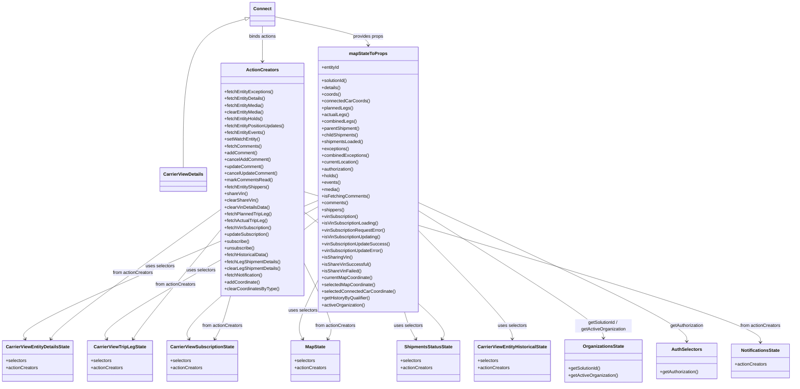

# Diagram: web/portal/src/pages/carrierview/details/CarrierView.Details.page.container.js

> Auto-generated by Obscura crawlers

## Mermaid

### SVG

<svg id="container" width="2769.12109375" xmlns="http://www.w3.org/2000/svg" class="classDiagram" height="1358" viewBox="0.140625 0 2769.12109375 1358" role="graphics-document document" aria-roledescription="class"><g><defs><marker id="container_class-aggregationStart" class="marker aggregation class" refX="18" refY="7" markerWidth="190" markerHeight="240" orient="auto"><path d="M 18,7 L9,13 L1,7 L9,1 Z"></path></marker></defs><defs><marker id="container_class-aggregationEnd" class="marker aggregation class" refX="1" refY="7" markerWidth="20" markerHeight="28" orient="auto"><path d="M 18,7 L9,13 L1,7 L9,1 Z"></path></marker></defs><defs><marker id="container_class-extensionStart" class="marker extension class" refX="18" refY="7" markerWidth="190" markerHeight="240" orient="auto"><path d="M 1,7 L18,13 V 1 Z"></path></marker></defs><defs><marker id="container_class-extensionEnd" class="marker extension class" refX="1" refY="7" markerWidth="20" markerHeight="28" orient="auto"><path d="M 1,1 V 13 L18,7 Z"></path></marker></defs><defs><marker id="container_class-compositionStart" class="marker composition class" refX="18" refY="7" markerWidth="190" markerHeight="240" orient="auto"><path d="M 18,7 L9,13 L1,7 L9,1 Z"></path></marker></defs><defs><marker id="container_class-compositionEnd" class="marker composition class" refX="1" refY="7" markerWidth="20" markerHeight="28" orient="auto"><path d="M 18,7 L9,13 L1,7 L9,1 Z"></path></marker></defs><defs><marker id="container_class-dependencyStart" class="marker dependency class" refX="6" refY="7" markerWidth="190" markerHeight="240" orient="auto"><path d="M 5,7 L9,13 L1,7 L9,1 Z"></path></marker></defs><defs><marker id="container_class-dependencyEnd" class="marker dependency class" refX="13" refY="7" markerWidth="20" markerHeight="28" orient="auto"><path d="M 18,7 L9,13 L14,7 L9,1 Z"></path></marker></defs><defs><marker id="container_class-lollipopStart" class="marker lollipop class" refX="13" refY="7" markerWidth="190" markerHeight="240" orient="auto"><circle stroke="black" fill="transparent" cx="7" cy="7" r="6"></circle></marker></defs><defs><marker id="container_class-lollipopEnd" class="marker lollipop class" refX="1" refY="7" markerWidth="190" markerHeight="240" orient="auto"><circle stroke="black" fill="transparent" cx="7" cy="7" r="6"></circle></marker></defs><g class="root"><g class="clusters"></g><g class="edgePaths"><path d="M860.194,66.641L823.799,77.034C787.403,87.427,714.612,108.214,678.216,195.773C641.82,283.333,641.82,437.667,641.82,514.833L641.82,592" id="id_Connect_CarrierViewDetails_1" class="edge-thickness-normal edge-pattern-solid relation" style=";;;" data-edge="true" data-et="edge" data-id="id_Connect_CarrierViewDetails_1" data-points="W3sieCI6ODc2Ljc4MTI1LCJ5Ijo2MS45MDQzMjM1MTUyOTE4Nn0seyJ4Ijo2NDEuODIwMzEyNSwieSI6MTI5fSx7IngiOjY0MS44MjAzMTI1LCJ5Ijo1OTJ9XQ==" marker-start="url(#container_class-extensionStart)"></path><path d="M960.156,58.882L1015.006,70.568C1069.855,82.255,1179.555,105.627,1234.404,122.48C1289.254,139.333,1289.254,149.667,1289.254,154.833L1289.254,160" id="id_Connect_mapStateToProps_2" class="edge-thickness-normal edge-pattern-solid relation" style=";;;" data-edge="true" data-et="edge" data-id="id_Connect_mapStateToProps_2" data-points="W3sieCI6OTYwLjE1NjI1LCJ5Ijo1OC44ODE5OTY2MDc3MDUzNTR9LHsieCI6MTI4OS4yNTM5MDYyNSwieSI6MTI5fSx7IngiOjEyODkuMjUzOTA2MjUsInkiOjE2Nn1d" marker-end="url(#container_class-dependencyEnd)"></path><path d="M918.469,92L918.469,98.167C918.469,104.333,918.469,116.667,918.469,137.5C918.469,158.333,918.469,187.667,918.469,202.333L918.469,217" id="id_Connect_ActionCreators_3" class="edge-thickness-normal edge-pattern-solid relation" style=";;;" data-edge="true" data-et="edge" data-id="id_Connect_ActionCreators_3" data-points="W3sieCI6OTE4LjQ2ODc1LCJ5Ijo5Mn0seyJ4Ijo5MTguNDY4NzUsInkiOjEyOX0seyJ4Ijo5MTguNDY4NzUsInkiOjIyM31d" marker-end="url(#container_class-dependencyEnd)"></path><path d="M1115.195,707.167L939.22,781.139C763.245,855.111,411.294,1003.056,239.823,1084.828C68.351,1166.601,77.359,1182.203,81.863,1190.003L86.367,1197.804" id="id_mapStateToProps_CarrierViewEntityDetailsState_4" class="edge-thickness-normal edge-pattern-solid relation" style=";;;" data-edge="true" data-et="edge" data-id="id_mapStateToProps_CarrierViewEntityDetailsState_4" data-points="W3sieCI6MTExNS4xOTUzMTI1LCJ5Ijo3MDcuMTY2NTU4MTUxNzk1OX0seyJ4Ijo1OS4zNDM3NSwieSI6MTE1MX0seyJ4Ijo4OS4zNjY5MzU0ODM4NzA5OCwieSI6MTIwM31d" marker-end="url(#container_class-dependencyEnd)"></path><path d="M1115.195,729.374L986.949,799.645C858.703,869.916,602.211,1010.458,478.469,1088.53C354.726,1166.601,363.734,1182.203,368.238,1190.003L372.742,1197.804" id="id_mapStateToProps_CarrierViewTripLegState_5" class="edge-thickness-normal edge-pattern-solid relation" style=";;;" data-edge="true" data-et="edge" data-id="id_mapStateToProps_CarrierViewTripLegState_5" data-points="W3sieCI6MTExNS4xOTUzMTI1LCJ5Ijo3MjkuMzczNTQ1MzAyMTE3Nn0seyJ4IjozNDUuNzE4NzUsInkiOjExNTF9LHsieCI6Mzc1Ljc0MTkzNTQ4Mzg3MSwieSI6MTIwM31d" marker-end="url(#container_class-dependencyEnd)"></path><path d="M1115.195,770.935L1034.678,834.279C954.161,897.623,793.128,1024.312,717.115,1095.456C641.101,1166.601,650.109,1182.203,654.613,1190.003L659.117,1197.804" id="id_mapStateToProps_CarrierViewSubscriptionState_6" class="edge-thickness-normal edge-pattern-solid relation" style=";;;" data-edge="true" data-et="edge" data-id="id_mapStateToProps_CarrierViewSubscriptionState_6" data-points="W3sieCI6MTExNS4xOTUzMTI1LCJ5Ijo3NzAuOTM1MTAxOTEyMjI4OX0seyJ4Ijo2MzIuMDkzNzUsInkiOjExNTF9LHsieCI6NjYyLjExNjkzNTQ4Mzg3MSwieSI6MTIwM31d" marker-end="url(#container_class-dependencyEnd)"></path><path d="M1115.195,984.168L1101.374,1011.973C1087.553,1039.778,1059.91,1095.389,1050.593,1130.995C1041.275,1166.601,1050.283,1182.203,1054.787,1190.003L1059.291,1197.804" id="id_mapStateToProps_MapState_7" class="edge-thickness-normal edge-pattern-solid relation" style=";;;" data-edge="true" data-et="edge" data-id="id_mapStateToProps_MapState_7" data-points="W3sieCI6MTExNS4xOTUzMTI1LCJ5Ijo5ODQuMTY3NjI4MDgwODk1Nn0seyJ4IjoxMDMyLjI2NzU3ODEyNSwieSI6MTE1MX0seyJ4IjoxMDYyLjI5MDc2MzYwODg3MSwieSI6MTIwM31d" marker-end="url(#container_class-dependencyEnd)"></path><path d="M1418.87,1102L1421.132,1110.167C1423.394,1118.333,1427.918,1134.667,1434.683,1150.634C1441.449,1166.601,1450.457,1182.203,1454.961,1190.003L1459.465,1197.804" id="id_mapStateToProps_ShipmentsStatusState_8" class="edge-thickness-normal edge-pattern-solid relation" style=";;;" data-edge="true" data-et="edge" data-id="id_mapStateToProps_ShipmentsStatusState_8" data-points="W3sieCI6MTQxOC44NzA0NDM5Njc2MDE3LCJ5IjoxMTAyfSx7IngiOjE0MzIuNDQxNDA2MjUsInkiOjExNTF9LHsieCI6MTQ2Mi40NjQ1OTE3MzM4NzEsInkiOjEyMDN9XQ==" marker-end="url(#container_class-dependencyEnd)"></path><path d="M1463.313,812.485L1518.333,868.904C1573.353,925.323,1683.393,1038.162,1738.413,1102.247C1793.434,1166.333,1793.434,1181.667,1793.434,1189.333L1793.434,1197" id="id_mapStateToProps_CarrierViewEntityHistoricalState_9" class="edge-thickness-normal edge-pattern-solid relation" style=";;;" data-edge="true" data-et="edge" data-id="id_mapStateToProps_CarrierViewEntityHistoricalState_9" data-points="W3sieCI6MTQ2My4zMTI1LCJ5Ijo4MTIuNDg0NTY2NTE0Mjk0Nn0seyJ4IjoxNzkzLjQzMzU5Mzc1LCJ5IjoxMTUxfSx7IngiOjE3OTMuNDMzNTkzNzUsInkiOjEyMDN9XQ==" marker-end="url(#container_class-dependencyEnd)"></path><path d="M1463.313,743.822L1570.87,811.685C1678.427,879.548,1893.542,1015.274,2001.099,1090.304C2108.656,1165.333,2108.656,1179.667,2108.656,1186.833L2108.656,1194" id="id_mapStateToProps_OrganizationsState_10" class="edge-thickness-normal edge-pattern-solid relation" style=";;;" data-edge="true" data-et="edge" data-id="id_mapStateToProps_OrganizationsState_10" data-points="W3sieCI6MTQ2My4zMTI1LCJ5Ijo3NDMuODIxODY0MjU4OTE1OX0seyJ4IjoyMTA4LjY1NjI1LCJ5IjoxMTUxfSx7IngiOjIxMDguNjU2MjUsInkiOjEyMDB9XQ==" marker-end="url(#container_class-dependencyEnd)"></path><path d="M1463.313,714.942L1619.596,787.619C1775.879,860.295,2088.445,1005.647,2244.729,1087.49C2401.012,1169.333,2401.012,1187.667,2401.012,1196.833L2401.012,1206" id="id_mapStateToProps_AuthSelectors_11" class="edge-thickness-normal edge-pattern-solid relation" style=";;;" data-edge="true" data-et="edge" data-id="id_mapStateToProps_AuthSelectors_11" data-points="W3sieCI6MTQ2My4zMTI1LCJ5Ijo3MTQuOTQyMzUyNjkzMTU5fSx7IngiOjI0MDEuMDExNzE4NzUsInkiOjExNTF9LHsieCI6MjQwMS4wMTE3MTg3NSwieSI6MTIxMn1d" marker-end="url(#container_class-dependencyEnd)"></path><path d="M771.742,739.956L676.874,808.463C582.005,876.97,392.268,1013.985,292.896,1090.293C193.524,1166.601,184.516,1182.203,180.012,1190.003L175.508,1197.804" id="id_ActionCreators_CarrierViewEntityDetailsState_12" class="edge-thickness-normal edge-pattern-solid relation" style=";;;" data-edge="true" data-et="edge" data-id="id_ActionCreators_CarrierViewEntityDetailsState_12" data-points="W3sieCI6NzcxLjc0MjE4NzUsInkiOjczOS45NTU2NjM0NjU3MzU1fSx7IngiOjIwMi41MzEyNSwieSI6MTE1MX0seyJ4IjoxNzIuNTA4MDY0NTE2MTI5MDIsInkiOjEyMDN9XQ==" marker-end="url(#container_class-dependencyEnd)"></path><path d="M771.742,810.593L724.603,867.327C677.464,924.062,583.185,1037.531,531.542,1102.066C479.899,1166.601,470.891,1182.203,466.387,1190.003L461.883,1197.804" id="id_ActionCreators_CarrierViewTripLegState_13" class="edge-thickness-normal edge-pattern-solid relation" style=";;;" data-edge="true" data-et="edge" data-id="id_ActionCreators_CarrierViewTripLegState_13" data-points="W3sieCI6NzcxLjc0MjE4NzUsInkiOjgxMC41OTI3NzI0NDI4OTI1fSx7IngiOjQ4OC45MDYyNSwieSI6MTE1MX0seyJ4Ijo0NTguODgzMDY0NTE2MTI5LCJ5IjoxMjAzfV0=" marker-end="url(#container_class-dependencyEnd)"></path><path d="M804.639,1045L799.746,1062.667C794.853,1080.333,785.067,1115.667,775.67,1141.134C766.274,1166.601,757.266,1182.203,752.762,1190.003L748.258,1197.804" id="id_ActionCreators_CarrierViewSubscriptionState_14" class="edge-thickness-normal edge-pattern-solid relation" style=";;;" data-edge="true" data-et="edge" data-id="id_ActionCreators_CarrierViewSubscriptionState_14" data-points="W3sieCI6ODA0LjYzODg0MTg3NjIwODksInkiOjEwNDV9LHsieCI6Nzc1LjI4MTI1LCJ5IjoxMTUxfSx7IngiOjc0NS4yNTgwNjQ1MTYxMjksInkiOjEyMDN9XQ==" marker-end="url(#container_class-dependencyEnd)"></path><path d="M1065.195,749.168L1150.52,816.14C1235.844,883.112,1406.492,1017.056,1487.215,1091.833C1567.937,1166.61,1558.734,1182.221,1554.132,1190.026L1549.531,1197.831" id="id_ActionCreators_ShipmentsStatusState_15" class="edge-thickness-normal edge-pattern-solid relation" style=";;;" data-edge="true" data-et="edge" data-id="id_ActionCreators_ShipmentsStatusState_15" data-points="W3sieCI6MTA2NS4xOTUzMTI1LCJ5Ijo3NDkuMTY3NTYwMTk0NTIwMn0seyJ4IjoxNTc3LjE0MDYyNSwieSI6MTE1MX0seyJ4IjoxNTQ2LjQ4MzQ5Mjk0MzU0ODMsInkiOjEyMDN9XQ==" marker-end="url(#container_class-dependencyEnd)"></path><path d="M1065.195,677.566L1330.945,756.471C1596.694,835.377,2128.193,993.189,2393.942,1081.761C2659.691,1170.333,2659.691,1189.667,2659.691,1199.333L2659.691,1209" id="id_ActionCreators_NotificationsState_16" class="edge-thickness-normal edge-pattern-solid relation" style=";;;" data-edge="true" data-et="edge" data-id="id_ActionCreators_NotificationsState_16" data-points="W3sieCI6MTA2NS4xOTUzMTI1LCJ5Ijo2NzcuNTY1NzI4MTA1MDI2OH0seyJ4IjoyNjU5LjY5MTQwNjI1LCJ5IjoxMTUxfSx7IngiOjI2NTkuNjkxNDA2MjUsInkiOjEyMTV9XQ==" marker-end="url(#container_class-dependencyEnd)"></path><path d="M1065.195,929.182L1083.572,966.151C1101.949,1003.121,1138.702,1077.061,1152.575,1121.831C1166.447,1166.601,1157.44,1182.203,1152.936,1190.003L1148.432,1197.804" id="id_ActionCreators_MapState_17" class="edge-thickness-normal edge-pattern-solid relation" style=";;;" data-edge="true" data-et="edge" data-id="id_ActionCreators_MapState_17" data-points="W3sieCI6MTA2NS4xOTUzMTI1LCJ5Ijo5MjkuMTgxNTg5NDg3NTI0NH0seyJ4IjoxMTc1LjQ1NTA3ODEyNSwieSI6MTE1MX0seyJ4IjoxMTQ1LjQzMTg5MjY0MTEyOSwieSI6MTIwM31d" marker-end="url(#container_class-dependencyEnd)"></path></g><g class="edgeLabels"><g class="edgeLabel"><g class="label" data-id="id_Connect_CarrierViewDetails_1" transform="translate(0, 0)"><foreignObject width="0" height="0">

</foreignObject></g></g><g class="edgeLabel" transform="translate(1289.25390625, 129)"><g class="label" data-id="id_Connect_mapStateToProps_2" transform="translate(-54.1953125, -12)"><foreignObject width="108.390625" height="24">

provides props

</foreignObject></g></g><g class="edgeLabel" transform="translate(918.46875, 129)"><g class="label" data-id="id_Connect_ActionCreators_3" transform="translate(-48.7578125, -12)"><foreignObject width="97.515625" height="24">

binds actions

</foreignObject></g></g><g class="edgeLabel" transform="translate(559.59288, 940.71732)"><g class="label" data-id="id_mapStateToProps_CarrierViewEntityDetailsState_4" transform="translate(-51.34375, -12)"><foreignObject width="102.6875" height="24">

uses selectors

</foreignObject></g></g><g class="edgeLabel" transform="translate(704.128, 954.61348)"><g class="label" data-id="id_mapStateToProps_CarrierViewTripLegState_5" transform="translate(-51.34375, -12)"><foreignObject width="102.6875" height="24">

uses selectors

</foreignObject></g></g><g class="edgeLabel" transform="translate(850.04884, 979.53072)"><g class="label" data-id="id_mapStateToProps_CarrierViewSubscriptionState_6" transform="translate(-51.34375, -12)"><foreignObject width="102.6875" height="24">

uses selectors

</foreignObject></g></g><g class="edgeLabel" transform="translate(1060.368, 1094.46813)"><g class="label" data-id="id_mapStateToProps_MapState_7" transform="translate(-51.34375, -12)"><foreignObject width="102.6875" height="24">

uses selectors

</foreignObject></g></g><g class="edgeLabel" transform="translate(1432.44140625, 1151)"><g class="label" data-id="id_mapStateToProps_ShipmentsStatusState_8" transform="translate(-51.34375, -12)"><foreignObject width="102.6875" height="24">

uses selectors

</foreignObject></g></g><g class="edgeLabel" transform="translate(1793.43359375, 1151)"><g class="label" data-id="id_mapStateToProps_CarrierViewEntityHistoricalState_9" transform="translate(-51.34375, -12)"><foreignObject width="102.6875" height="24">

uses selectors

</foreignObject></g></g><g class="edgeLabel" transform="translate(2108.65625, 1151)"><g class="label" data-id="id_mapStateToProps_OrganizationsState_10" transform="translate(-100, -24)"><foreignObject width="200" height="48">

getSolutionId / getActiveOrganization

</foreignObject></g></g><g class="edgeLabel" transform="translate(2401.01171875, 1151)"><g class="label" data-id="id_mapStateToProps_AuthSelectors_11" transform="translate(-60.3515625, -12)"><foreignObject width="120.703125" height="24">

getAuthorization

</foreignObject></g></g><g class="edgeLabel" transform="translate(462.79707, 963.05422)"><g class="label" data-id="id_ActionCreators_CarrierViewEntityDetailsState_12" transform="translate(-71.84375, -12)"><foreignObject width="143.6875" height="24">

from actionCreators

</foreignObject></g></g><g class="edgeLabel" transform="translate(611.13783, 1003.88817)"><g class="label" data-id="id_ActionCreators_CarrierViewTripLegState_13" transform="translate(-71.84375, -12)"><foreignObject width="143.6875" height="24">

from actionCreators

</foreignObject></g></g><g class="edgeLabel" transform="translate(781.94673, 1126.93328)"><g class="label" data-id="id_ActionCreators_CarrierViewSubscriptionState_14" transform="translate(-71.84375, -12)"><foreignObject width="143.6875" height="24">

from actionCreators

</foreignObject></g></g><g class="edgeLabel" transform="translate(1577.140625, 1151)"><g class="label" data-id="id_ActionCreators_ShipmentsStatusState_15" transform="translate(-71.84375, -12)"><foreignObject width="143.6875" height="24">

from actionCreators

</foreignObject></g></g><g class="edgeLabel" transform="translate(2659.69140625, 1151)"><g class="label" data-id="id_ActionCreators_NotificationsState_16" transform="translate(-71.84375, -12)"><foreignObject width="143.6875" height="24">

from actionCreators

</foreignObject></g></g><g class="edgeLabel" transform="translate(1133.68864, 1066.97511)"><g class="label" data-id="id_ActionCreators_MapState_17" transform="translate(-71.84375, -12)"><foreignObject width="143.6875" height="24">

from actionCreators

</foreignObject></g></g></g><g class="nodes"><g class="node default" id="classId-CarrierViewDetails-0" transform="translate(641.8203125, 634)"><g class="basic label-container"><path d="M-79.921875 -42 L79.921875 -42 L79.921875 42 L-79.921875 42" stroke="none" stroke-width="0" fill="#ECECFF" style=""></path><path d="M-79.921875 -42 C-32.637705315358936 -42, 14.646464369282128 -42, 79.921875 -42 M-79.921875 -42 C-17.751816106995676 -42, 44.41824278600865 -42, 79.921875 -42 M79.921875 -42 C79.921875 -9.249328334552615, 79.921875 23.50134333089477, 79.921875 42 M79.921875 -42 C79.921875 -18.147311904506672, 79.921875 5.705376190986655, 79.921875 42 M79.921875 42 C25.397356024905868 42, -29.127162950188264 42, -79.921875 42 M79.921875 42 C29.986498318152712 42, -19.948878363694575 42, -79.921875 42 M-79.921875 42 C-79.921875 10.786305137573791, -79.921875 -20.427389724852418, -79.921875 -42 M-79.921875 42 C-79.921875 18.83240994438825, -79.921875 -4.335180111223501, -79.921875 -42" stroke="#9370DB" stroke-width="1.3" fill="none" stroke-dasharray="0 0" style=""></path></g><g class="annotation-group text" transform="translate(0, -18)"></g><g class="label-group text" transform="translate(-67.921875, -18)"><g class="label" style="font-weight: bolder" transform="translate(0,-12)"><foreignObject width="135.84375" height="24">

CarrierViewDetails

</foreignObject></g></g><g class="members-group text" transform="translate(-67.921875, 30)"></g><g class="methods-group text" transform="translate(-67.921875, 60)"></g><g class="divider" style=""><path d="M-79.921875 6 C-16.49932604173562 6, 46.92322291652876 6, 79.921875 6 M-79.921875 6 C-41.743558669149095 6, -3.565242338298191 6, 79.921875 6" stroke="#9370DB" stroke-width="1.3" fill="none" stroke-dasharray="0 0" style=""></path></g><g class="divider" style=""><path d="M-79.921875 24 C-25.76740691569203 24, 28.387061168615944 24, 79.921875 24 M-79.921875 24 C-17.023200859377134 24, 45.87547328124573 24, 79.921875 24" stroke="#9370DB" stroke-width="1.3" fill="none" stroke-dasharray="0 0" style=""></path></g></g><g class="node default" id="classId-Connect-1" transform="translate(918.46875, 50)"><g class="basic label-container"><path d="M-41.6875 -42 L41.6875 -42 L41.6875 42 L-41.6875 42" stroke="none" stroke-width="0" fill="#ECECFF" style=""></path><path d="M-41.6875 -42 C-23.3778255732837 -42, -5.068151146567402 -42, 41.6875 -42 M-41.6875 -42 C-23.66023808797666 -42, -5.632976175953317 -42, 41.6875 -42 M41.6875 -42 C41.6875 -21.759828286322882, 41.6875 -1.519656572645765, 41.6875 42 M41.6875 -42 C41.6875 -15.693207507105534, 41.6875 10.613584985788933, 41.6875 42 M41.6875 42 C21.90813526141244 42, 2.1287705228248797 42, -41.6875 42 M41.6875 42 C20.68835570839003 42, -0.31078858321993863 42, -41.6875 42 M-41.6875 42 C-41.6875 25.05408924835046, -41.6875 8.108178496700923, -41.6875 -42 M-41.6875 42 C-41.6875 14.717722848806414, -41.6875 -12.564554302387172, -41.6875 -42" stroke="#9370DB" stroke-width="1.3" fill="none" stroke-dasharray="0 0" style=""></path></g><g class="annotation-group text" transform="translate(0, -18)"></g><g class="label-group text" transform="translate(-29.6875, -18)"><g class="label" style="font-weight: bolder" transform="translate(0,-12)"><foreignObject width="59.375" height="24">

Connect

</foreignObject></g></g><g class="members-group text" transform="translate(-29.6875, 30)"></g><g class="methods-group text" transform="translate(-29.6875, 60)"></g><g class="divider" style=""><path d="M-41.6875 6 C-21.647988298703098 6, -1.6084765974061952 6, 41.6875 6 M-41.6875 6 C-22.636486579190358 6, -3.585473158380715 6, 41.6875 6" stroke="#9370DB" stroke-width="1.3" fill="none" stroke-dasharray="0 0" style=""></path></g><g class="divider" style=""><path d="M-41.6875 24 C-8.822441696204727 24, 24.042616607590546 24, 41.6875 24 M-41.6875 24 C-22.876918444049917 24, -4.066336888099833 24, 41.6875 24" stroke="#9370DB" stroke-width="1.3" fill="none" stroke-dasharray="0 0" style=""></path></g></g><g class="node default" id="classId-mapStateToProps-2" transform="translate(1289.25390625, 634)"><g class="basic label-container"><path d="M-174.05859375 -468 L174.05859375 -468 L174.05859375 468 L-174.05859375 468" stroke="none" stroke-width="0" fill="#ECECFF" style=""></path><path d="M-174.05859375 -468 C-88.31053186438487 -468, -2.562469978769741 -468, 174.05859375 -468 M-174.05859375 -468 C-72.92786925627516 -468, 28.202855237449683 -468, 174.05859375 -468 M174.05859375 -468 C174.05859375 -123.60500463503553, 174.05859375 220.78999072992895, 174.05859375 468 M174.05859375 -468 C174.05859375 -265.44192867802553, 174.05859375 -62.88385735605101, 174.05859375 468 M174.05859375 468 C67.83951384771609 468, -38.37956605456782 468, -174.05859375 468 M174.05859375 468 C94.71176151783554 468, 15.364929285671082 468, -174.05859375 468 M-174.05859375 468 C-174.05859375 134.71480766269144, -174.05859375 -198.57038467461712, -174.05859375 -468 M-174.05859375 468 C-174.05859375 126.126314873647, -174.05859375 -215.747370252706, -174.05859375 -468" stroke="#9370DB" stroke-width="1.3" fill="none" stroke-dasharray="0 0" style=""></path></g><g class="annotation-group text" transform="translate(0, -444)"></g><g class="label-group text" transform="translate(-64.7109375, -444)"><g class="label" style="font-weight: bolder" transform="translate(0,-12)"><foreignObject width="129.421875" height="24">

mapStateToProps

</foreignObject></g></g><g class="members-group text" transform="translate(-162.05859375, -396)"><g class="label" style="" transform="translate(0,-12)"><foreignObject width="64.234375" height="24">

+entityId

</foreignObject></g></g><g class="methods-group text" transform="translate(-162.05859375, -348)"><g class="label" style="" transform="translate(0,-12)"><foreignObject width="92.46875" height="24">

+solutionId()

</foreignObject></g><g class="label" style="" transform="translate(0,12)"><foreignObject width="67.6875" height="24">

+details()

</foreignObject></g><g class="label" style="" transform="translate(0,36)"><foreignObject width="67.109375" height="24">

+coords()

</foreignObject></g><g class="label" style="" transform="translate(0,60)"><foreignObject width="167.71875" height="24">

+connectedCarCoords()

</foreignObject></g><g class="label" style="" transform="translate(0,84)"><foreignObject width="110.1875" height="24">

+plannedLegs()

</foreignObject></g><g class="label" style="" transform="translate(0,108)"><foreignObject width="94.765625" height="24">

+actualLegs()

</foreignObject></g><g class="label" style="" transform="translate(0,132)"><foreignObject width="122.390625" height="24">

+combinedLegs()

</foreignObject></g><g class="label" style="" transform="translate(0,156)"><foreignObject width="135.671875" height="24">

+parentShipment()

</foreignObject></g><g class="label" style="" transform="translate(0,180)"><foreignObject width="131.234375" height="24">

+childShipments()

</foreignObject></g><g class="label" style="" transform="translate(0,204)"><foreignObject width="147.59375" height="24">

+shipmentsLoaded()

</foreignObject></g><g class="label" style="" transform="translate(0,228)"><foreignObject width="96.578125" height="24">

+exceptions()

</foreignObject></g><g class="label" style="" transform="translate(0,252)"><foreignObject width="168.625" height="24">

+combinedExceptions()

</foreignObject></g><g class="label" style="" transform="translate(0,276)"><foreignObject width="133.015625" height="24">

+currentLocation()

</foreignObject></g><g class="label" style="" transform="translate(0,300)"><foreignObject width="115.78125" height="24">

+authorization()

</foreignObject></g><g class="label" style="" transform="translate(0,324)"><foreignObject width="58.734375" height="24">

+holds()

</foreignObject></g><g class="label" style="" transform="translate(0,348)"><foreignObject width="66.171875" height="24">

+events()

</foreignObject></g><g class="label" style="" transform="translate(0,372)"><foreignObject width="63.578125" height="24">

+media()

</foreignObject></g><g class="label" style="" transform="translate(0,396)"><foreignObject width="167.875" height="24">

+isFetchingComments()

</foreignObject></g><g class="label" style="" transform="translate(0,420)"><foreignObject width="93.796875" height="24">

+comments()

</foreignObject></g><g class="label" style="" transform="translate(0,444)"><foreignObject width="80.859375" height="24">

+shippers()

</foreignObject></g><g class="label" style="" transform="translate(0,468)"><foreignObject width="131.8125" height="24">

+vinSubscription()

</foreignObject></g><g class="label" style="" transform="translate(0,492)"><foreignObject width="202.21875" height="24">

+isVinSubscriptionLoading()

</foreignObject></g><g class="label" style="" transform="translate(0,516)"><foreignObject width="226.609375" height="24">

+vinSubscriptionRequestError()

</foreignObject></g><g class="label" style="" transform="translate(0,540)"><foreignObject width="211.34375" height="24">

+isVinSubscriptionUpdating()

</foreignObject></g><g class="label" style="" transform="translate(0,564)"><foreignObject width="240.625" height="24">

+vinSubscriptionUpdateSuccess()

</foreignObject></g><g class="label" style="" transform="translate(0,588)"><foreignObject width="220.234375" height="24">

+vinSubscriptionUpdateError()

</foreignObject></g><g class="label" style="" transform="translate(0,612)"><foreignObject width="108.3125" height="24">

+isSharingVin()

</foreignObject></g><g class="label" style="" transform="translate(0,636)"><foreignObject width="169.890625" height="24">

+isShareVinSuccessful()

</foreignObject></g><g class="label" style="" transform="translate(0,660)"><foreignObject width="137.359375" height="24">

+isShareVinFailed()

</foreignObject></g><g class="label" style="" transform="translate(0,684)"><foreignObject width="181" height="24">

+currentMapCoordinate()

</foreignObject></g><g class="label" style="" transform="translate(0,708)"><foreignObject width="189.453125" height="24">

+selectedMapCoordinate()

</foreignObject></g><g class="label" style="" transform="translate(0,732)"><foreignObject width="259.40625" height="24">

+selectedConnectedCarCoordinate()

</foreignObject></g><g class="label" style="" transform="translate(0,756)"><foreignObject width="172.515625" height="24">

+getHistoryByQualifier()

</foreignObject></g><g class="label" style="" transform="translate(0,780)"><foreignObject width="153.375" height="24">

+activeOrganization()

</foreignObject></g></g><g class="divider" style=""><path d="M-174.05859375 -420 C-100.54240388334145 -420, -27.0262140166829 -420, 174.05859375 -420 M-174.05859375 -420 C-54.98025157821303 -420, 64.09809059357394 -420, 174.05859375 -420" stroke="#9370DB" stroke-width="1.3" fill="none" stroke-dasharray="0 0" style=""></path></g><g class="divider" style=""><path d="M-174.05859375 -372 C-71.5778125712526 -372, 30.902968607494813 -372, 174.05859375 -372 M-174.05859375 -372 C-37.84548639063257 -372, 98.36762096873485 -372, 174.05859375 -372" stroke="#9370DB" stroke-width="1.3" fill="none" stroke-dasharray="0 0" style=""></path></g></g><g class="node default" id="classId-ActionCreators-3" transform="translate(918.46875, 634)"><g class="basic label-container"><path d="M-146.7265625 -411 L146.7265625 -411 L146.7265625 411 L-146.7265625 411" stroke="none" stroke-width="0" fill="#ECECFF" style=""></path><path d="M-146.7265625 -411 C-64.7293017935069 -411, 17.267958912986188 -411, 146.7265625 -411 M-146.7265625 -411 C-41.79077607689068 -411, 63.14501034621864 -411, 146.7265625 -411 M146.7265625 -411 C146.7265625 -196.32037269345878, 146.7265625 18.35925461308244, 146.7265625 411 M146.7265625 -411 C146.7265625 -134.80136547185958, 146.7265625 141.39726905628083, 146.7265625 411 M146.7265625 411 C57.27777549933265 411, -32.171011501334704 411, -146.7265625 411 M146.7265625 411 C35.065211089263286 411, -76.59614032147343 411, -146.7265625 411 M-146.7265625 411 C-146.7265625 212.7195463823368, -146.7265625 14.439092764673603, -146.7265625 -411 M-146.7265625 411 C-146.7265625 100.06568654353197, -146.7265625 -210.86862691293607, -146.7265625 -411" stroke="#9370DB" stroke-width="1.3" fill="none" stroke-dasharray="0 0" style=""></path></g><g class="annotation-group text" transform="translate(0, -387)"></g><g class="label-group text" transform="translate(-53.96875, -387)"><g class="label" style="font-weight: bolder" transform="translate(0,-12)"><foreignObject width="107.9375" height="24">

ActionCreators

</foreignObject></g></g><g class="members-group text" transform="translate(-134.7265625, -339)"></g><g class="methods-group text" transform="translate(-134.7265625, -309)"><g class="label" style="" transform="translate(0,-12)"><foreignObject width="174.4375" height="24">

+fetchEntityExceptions()

</foreignObject></g><g class="label" style="" transform="translate(0,12)"><foreignObject width="146.296875" height="24">

+fetchEntityDetails()

</foreignObject></g><g class="label" style="" transform="translate(0,36)"><foreignObject width="140.1875" height="24">

+fetchEntityMedia()

</foreignObject></g><g class="label" style="" transform="translate(0,60)"><foreignObject width="139.640625" height="24">

+clearEntityMedia()

</foreignObject></g><g class="label" style="" transform="translate(0,84)"><foreignObject width="138.109375" height="24">

+fetchEntityHolds()

</foreignObject></g><g class="label" style="" transform="translate(0,108)"><foreignObject width="215.484375" height="24">

+fetchEntityPositionUpdates()

</foreignObject></g><g class="label" style="" transform="translate(0,132)"><foreignObject width="143.625" height="24">

+fetchEntityEvents()

</foreignObject></g><g class="label" style="" transform="translate(0,156)"><foreignObject width="125.953125" height="24">

+setWatchEntity()

</foreignObject></g><g class="label" style="" transform="translate(0,180)"><foreignObject width="131.359375" height="24">

+fetchComments()

</foreignObject></g><g class="label" style="" transform="translate(0,204)"><foreignObject width="115.234375" height="24">

+addComment()

</foreignObject></g><g class="label" style="" transform="translate(0,228)"><foreignObject width="162.25" height="24">

+cancelAddComment()

</foreignObject></g><g class="label" style="" transform="translate(0,252)"><foreignObject width="138.984375" height="24">

+updateComment()

</foreignObject></g><g class="label" style="" transform="translate(0,276)"><foreignObject width="186.5625" height="24">

+cancelUpdateComment()

</foreignObject></g><g class="label" style="" transform="translate(0,300)"><foreignObject width="168.171875" height="24">

+markCommentsRead()

</foreignObject></g><g class="label" style="" transform="translate(0,324)"><foreignObject width="159.96875" height="24">

+fetchEntityShippers()

</foreignObject></g><g class="label" style="" transform="translate(0,348)"><foreignObject width="81.109375" height="24">

+shareVin()

</foreignObject></g><g class="label" style="" transform="translate(0,372)"><foreignObject width="118.0625" height="24">

+clearShareVin()

</foreignObject></g><g class="label" style="" transform="translate(0,396)"><foreignObject width="160.125" height="24">

+clearVinDetailsData()

</foreignObject></g><g class="label" style="" transform="translate(0,420)"><foreignObject width="166.6875" height="24">

+fetchPlannedTripLeg()

</foreignObject></g><g class="label" style="" transform="translate(0,444)"><foreignObject width="152.328125" height="24">

+fetchActualTripLeg()

</foreignObject></g><g class="label" style="" transform="translate(0,468)"><foreignObject width="169.234375" height="24">

+fetchVinSubscription()

</foreignObject></g><g class="label" style="" transform="translate(0,492)"><foreignObject width="161.5625" height="24">

+updateSubscription()

</foreignObject></g><g class="label" style="" transform="translate(0,516)"><foreignObject width="88.6875" height="24">

+subscribe()

</foreignObject></g><g class="label" style="" transform="translate(0,540)"><foreignObject width="107.375" height="24">

+unsubscribe()

</foreignObject></g><g class="label" style="" transform="translate(0,564)"><foreignObject width="156.96875" height="24">

+fetchHistoricalData()

</foreignObject></g><g class="label" style="" transform="translate(0,588)"><foreignObject width="198.96875" height="24">

+fetchLegShipmentDetails()

</foreignObject></g><g class="label" style="" transform="translate(0,612)"><foreignObject width="198.421875" height="24">

+clearLegShipmentDetails()

</foreignObject></g><g class="label" style="" transform="translate(0,636)"><foreignObject width="139.5625" height="24">

+fetchNotification()

</foreignObject></g><g class="label" style="" transform="translate(0,660)"><foreignObject width="125.40625" height="24">

+addCoordinate()

</foreignObject></g><g class="label" style="" transform="translate(0,684)"><foreignObject width="192.296875" height="24">

+clearCoordinatesByType()

</foreignObject></g></g><g class="divider" style=""><path d="M-146.7265625 -363 C-78.50405703922068 -363, -10.281551578441366 -363, 146.7265625 -363 M-146.7265625 -363 C-83.3735443345793 -363, -20.020526169158586 -363, 146.7265625 -363" stroke="#9370DB" stroke-width="1.3" fill="none" stroke-dasharray="0 0" style=""></path></g><g class="divider" style=""><path d="M-146.7265625 -339 C-59.41586195160687 -339, 27.894838596786258 -339, 146.7265625 -339 M-146.7265625 -339 C-55.17660394002549 -339, 36.373354619949026 -339, 146.7265625 -339" stroke="#9370DB" stroke-width="1.3" fill="none" stroke-dasharray="0 0" style=""></path></g></g><g class="node default" id="classId-CarrierViewEntityDetailsState-4" transform="translate(130.9375, 1275)"><g class="basic label-container"><path d="M-122.796875 -72 L122.796875 -72 L122.796875 72 L-122.796875 72" stroke="none" stroke-width="0" fill="#ECECFF" style=""></path><path d="M-122.796875 -72 C-43.877466936686446 -72, 35.04194112662711 -72, 122.796875 -72 M-122.796875 -72 C-60.17822745639396 -72, 2.4404200872120754 -72, 122.796875 -72 M122.796875 -72 C122.796875 -35.93147470220574, 122.796875 0.1370505955885193, 122.796875 72 M122.796875 -72 C122.796875 -41.31707665860195, 122.796875 -10.634153317203896, 122.796875 72 M122.796875 72 C73.46348690999513 72, 24.130098819990252 72, -122.796875 72 M122.796875 72 C72.13749342092763 72, 21.478111841855267 72, -122.796875 72 M-122.796875 72 C-122.796875 17.179392464018292, -122.796875 -37.641215071963416, -122.796875 -72 M-122.796875 72 C-122.796875 24.433228337315626, -122.796875 -23.13354332536875, -122.796875 -72" stroke="#9370DB" stroke-width="1.3" fill="none" stroke-dasharray="0 0" style=""></path></g><g class="annotation-group text" transform="translate(0, -48)"></g><g class="label-group text" transform="translate(-108.515625, -48)"><g class="label" style="font-weight: bolder" transform="translate(0,-12)"><foreignObject width="217.03125" height="24">

CarrierViewEntityDetailsState

</foreignObject></g></g><g class="members-group text" transform="translate(-110.796875, 0)"><g class="label" style="" transform="translate(0,-12)"><foreignObject width="73.453125" height="24">

+selectors

</foreignObject></g><g class="label" style="" transform="translate(0,12)"><foreignObject width="113.078125" height="24">

+actionCreators

</foreignObject></g></g><g class="methods-group text" transform="translate(-110.796875, 72)"></g><g class="divider" style=""><path d="M-122.796875 -24 C-70.00485159870468 -24, -17.21282819740935 -24, 122.796875 -24 M-122.796875 -24 C-54.956873306769666 -24, 12.883128386460669 -24, 122.796875 -24" stroke="#9370DB" stroke-width="1.3" fill="none" stroke-dasharray="0 0" style=""></path></g><g class="divider" style=""><path d="M-122.796875 48 C-64.64459776789523 48, -6.492320535790469 48, 122.796875 48 M-122.796875 48 C-51.81331192622547 48, 19.170251147549067 48, 122.796875 48" stroke="#9370DB" stroke-width="1.3" fill="none" stroke-dasharray="0 0" style=""></path></g></g><g class="node default" id="classId-CarrierViewTripLegState-5" transform="translate(417.3125, 1275)"><g class="basic label-container"><path d="M-112.93359375 -72 L112.93359375 -72 L112.93359375 72 L-112.93359375 72" stroke="none" stroke-width="0" fill="#ECECFF" style=""></path><path d="M-112.93359375 -72 C-41.5932167306171 -72, 29.747160288765798 -72, 112.93359375 -72 M-112.93359375 -72 C-50.16484418456372 -72, 12.603905380872561 -72, 112.93359375 -72 M112.93359375 -72 C112.93359375 -29.66807543654317, 112.93359375 12.66384912691366, 112.93359375 72 M112.93359375 -72 C112.93359375 -41.11783329440754, 112.93359375 -10.235666588815079, 112.93359375 72 M112.93359375 72 C50.84486122015408 72, -11.24387130969184 72, -112.93359375 72 M112.93359375 72 C46.76331715202463 72, -19.406959445950747 72, -112.93359375 72 M-112.93359375 72 C-112.93359375 20.913636021839686, -112.93359375 -30.172727956320628, -112.93359375 -72 M-112.93359375 72 C-112.93359375 29.43234678448257, -112.93359375 -13.135306431034863, -112.93359375 -72" stroke="#9370DB" stroke-width="1.3" fill="none" stroke-dasharray="0 0" style=""></path></g><g class="annotation-group text" transform="translate(0, -48)"></g><g class="label-group text" transform="translate(-88.7890625, -48)"><g class="label" style="font-weight: bolder" transform="translate(0,-12)"><foreignObject width="177.578125" height="24">

CarrierViewTripLegState

</foreignObject></g></g><g class="members-group text" transform="translate(-100.93359375, 0)"><g class="label" style="" transform="translate(0,-12)"><foreignObject width="73.453125" height="24">

+selectors

</foreignObject></g><g class="label" style="" transform="translate(0,12)"><foreignObject width="113.078125" height="24">

+actionCreators

</foreignObject></g></g><g class="methods-group text" transform="translate(-100.93359375, 72)"></g><g class="divider" style=""><path d="M-112.93359375 -24 C-65.23213530367269 -24, -17.53067685734537 -24, 112.93359375 -24 M-112.93359375 -24 C-34.66463460184845 -24, 43.604324546303104 -24, 112.93359375 -24" stroke="#9370DB" stroke-width="1.3" fill="none" stroke-dasharray="0 0" style=""></path></g><g class="divider" style=""><path d="M-112.93359375 48 C-50.13164788057218 48, 12.670297988855637 48, 112.93359375 48 M-112.93359375 48 C-56.78138981616646 48, -0.6291858823329193 48, 112.93359375 48" stroke="#9370DB" stroke-width="1.3" fill="none" stroke-dasharray="0 0" style=""></path></g></g><g class="node default" id="classId-CarrierViewSubscriptionState-6" transform="translate(703.6875, 1275)"><g class="basic label-container"><path d="M-122.65625 -72 L122.65625 -72 L122.65625 72 L-122.65625 72" stroke="none" stroke-width="0" fill="#ECECFF" style=""></path><path d="M-122.65625 -72 C-39.179699306371404 -72, 44.29685138725719 -72, 122.65625 -72 M-122.65625 -72 C-44.028113804108074 -72, 34.60002239178385 -72, 122.65625 -72 M122.65625 -72 C122.65625 -22.37776317260024, 122.65625 27.24447365479952, 122.65625 72 M122.65625 -72 C122.65625 -24.477455741331283, 122.65625 23.045088517337433, 122.65625 72 M122.65625 72 C55.11213910253326 72, -12.431971794933474 72, -122.65625 72 M122.65625 72 C55.57649646183498 72, -11.503257076330044 72, -122.65625 72 M-122.65625 72 C-122.65625 22.172960548223386, -122.65625 -27.654078903553227, -122.65625 -72 M-122.65625 72 C-122.65625 23.37977964137498, -122.65625 -25.24044071725004, -122.65625 -72" stroke="#9370DB" stroke-width="1.3" fill="none" stroke-dasharray="0 0" style=""></path></g><g class="annotation-group text" transform="translate(0, -48)"></g><g class="label-group text" transform="translate(-108.234375, -48)"><g class="label" style="font-weight: bolder" transform="translate(0,-12)"><foreignObject width="216.46875" height="24">

CarrierViewSubscriptionState

</foreignObject></g></g><g class="members-group text" transform="translate(-110.65625, 0)"><g class="label" style="" transform="translate(0,-12)"><foreignObject width="73.453125" height="24">

+selectors

</foreignObject></g><g class="label" style="" transform="translate(0,12)"><foreignObject width="113.078125" height="24">

+actionCreators

</foreignObject></g></g><g class="methods-group text" transform="translate(-110.65625, 72)"></g><g class="divider" style=""><path d="M-122.65625 -24 C-27.294073674338208 -24, 68.06810265132358 -24, 122.65625 -24 M-122.65625 -24 C-27.168661891124756 -24, 68.31892621775049 -24, 122.65625 -24" stroke="#9370DB" stroke-width="1.3" fill="none" stroke-dasharray="0 0" style=""></path></g><g class="divider" style=""><path d="M-122.65625 48 C-54.67661431122936 48, 13.303021377541285 48, 122.65625 48 M-122.65625 48 C-37.16183132399233 48, 48.33258735201534 48, 122.65625 48" stroke="#9370DB" stroke-width="1.3" fill="none" stroke-dasharray="0 0" style=""></path></g></g><g class="node default" id="classId-MapState-7" transform="translate(1103.861328125, 1275)"><g class="basic label-container"><path d="M-85.921875 -72 L85.921875 -72 L85.921875 72 L-85.921875 72" stroke="none" stroke-width="0" fill="#ECECFF" style=""></path><path d="M-85.921875 -72 C-51.2079293956846 -72, -16.493983791369203 -72, 85.921875 -72 M-85.921875 -72 C-19.908508298968684 -72, 46.10485840206263 -72, 85.921875 -72 M85.921875 -72 C85.921875 -23.177836110535743, 85.921875 25.644327778928513, 85.921875 72 M85.921875 -72 C85.921875 -16.89664547439216, 85.921875 38.20670905121568, 85.921875 72 M85.921875 72 C29.25046200697082 72, -27.420950986058358 72, -85.921875 72 M85.921875 72 C35.609746240289745 72, -14.70238251942051 72, -85.921875 72 M-85.921875 72 C-85.921875 15.531470071238282, -85.921875 -40.93705985752344, -85.921875 -72 M-85.921875 72 C-85.921875 18.822220113060737, -85.921875 -34.355559773878525, -85.921875 -72" stroke="#9370DB" stroke-width="1.3" fill="none" stroke-dasharray="0 0" style=""></path></g><g class="annotation-group text" transform="translate(0, -48)"></g><g class="label-group text" transform="translate(-34.765625, -48)"><g class="label" style="font-weight: bolder" transform="translate(0,-12)"><foreignObject width="69.53125" height="24">

MapState

</foreignObject></g></g><g class="members-group text" transform="translate(-73.921875, 0)"><g class="label" style="" transform="translate(0,-12)"><foreignObject width="73.453125" height="24">

+selectors

</foreignObject></g><g class="label" style="" transform="translate(0,12)"><foreignObject width="113.078125" height="24">

+actionCreators

</foreignObject></g></g><g class="methods-group text" transform="translate(-73.921875, 72)"></g><g class="divider" style=""><path d="M-85.921875 -24 C-44.737404199555094 -24, -3.552933399110188 -24, 85.921875 -24 M-85.921875 -24 C-51.17855660111531 -24, -16.43523820223062 -24, 85.921875 -24" stroke="#9370DB" stroke-width="1.3" fill="none" stroke-dasharray="0 0" style=""></path></g><g class="divider" style=""><path d="M-85.921875 48 C-49.117748623523205 48, -12.31362224704641 48, 85.921875 48 M-85.921875 48 C-51.18674014032846 48, -16.45160528065692 48, 85.921875 48" stroke="#9370DB" stroke-width="1.3" fill="none" stroke-dasharray="0 0" style=""></path></g></g><g class="node default" id="classId-ShipmentsStatusState-8" transform="translate(1504.03515625, 1275)"><g class="basic label-container"><path d="M-109.421875 -72 L109.421875 -72 L109.421875 72 L-109.421875 72" stroke="none" stroke-width="0" fill="#ECECFF" style=""></path><path d="M-109.421875 -72 C-39.58244191773504 -72, 30.25699116452992 -72, 109.421875 -72 M-109.421875 -72 C-46.71499743290014 -72, 15.991880134199718 -72, 109.421875 -72 M109.421875 -72 C109.421875 -28.13535789146082, 109.421875 15.729284217078359, 109.421875 72 M109.421875 -72 C109.421875 -15.752460435117854, 109.421875 40.49507912976429, 109.421875 72 M109.421875 72 C43.30602462134341 72, -22.809825757313178 72, -109.421875 72 M109.421875 72 C63.64416152285034 72, 17.86644804570068 72, -109.421875 72 M-109.421875 72 C-109.421875 22.785774170869715, -109.421875 -26.42845165826057, -109.421875 -72 M-109.421875 72 C-109.421875 39.30710302175631, -109.421875 6.614206043512624, -109.421875 -72" stroke="#9370DB" stroke-width="1.3" fill="none" stroke-dasharray="0 0" style=""></path></g><g class="annotation-group text" transform="translate(0, -48)"></g><g class="label-group text" transform="translate(-81.765625, -48)"><g class="label" style="font-weight: bolder" transform="translate(0,-12)"><foreignObject width="163.53125" height="24">

ShipmentsStatusState

</foreignObject></g></g><g class="members-group text" transform="translate(-97.421875, 0)"><g class="label" style="" transform="translate(0,-12)"><foreignObject width="73.453125" height="24">

+selectors

</foreignObject></g><g class="label" style="" transform="translate(0,12)"><foreignObject width="113.078125" height="24">

+actionCreators

</foreignObject></g></g><g class="methods-group text" transform="translate(-97.421875, 72)"></g><g class="divider" style=""><path d="M-109.421875 -24 C-47.55067154052551 -24, 14.320531918948987 -24, 109.421875 -24 M-109.421875 -24 C-44.70854593645387 -24, 20.004783127092253 -24, 109.421875 -24" stroke="#9370DB" stroke-width="1.3" fill="none" stroke-dasharray="0 0" style=""></path></g><g class="divider" style=""><path d="M-109.421875 48 C-27.170987576168457 48, 55.079899847663086 48, 109.421875 48 M-109.421875 48 C-61.0471895539765 48, -12.672504107953003 48, 109.421875 48" stroke="#9370DB" stroke-width="1.3" fill="none" stroke-dasharray="0 0" style=""></path></g></g><g class="node default" id="classId-CarrierViewEntityHistoricalState-9" transform="translate(1793.43359375, 1275)"><g class="basic label-container"><path d="M-129.9765625 -72 L129.9765625 -72 L129.9765625 72 L-129.9765625 72" stroke="none" stroke-width="0" fill="#ECECFF" style=""></path><path d="M-129.9765625 -72 C-48.61488895947848 -72, 32.746784581043045 -72, 129.9765625 -72 M-129.9765625 -72 C-55.147528481228164 -72, 19.68150553754367 -72, 129.9765625 -72 M129.9765625 -72 C129.9765625 -35.10248152964195, 129.9765625 1.795036940716102, 129.9765625 72 M129.9765625 -72 C129.9765625 -21.151295324748894, 129.9765625 29.697409350502213, 129.9765625 72 M129.9765625 72 C29.334164998732234 72, -71.30823250253553 72, -129.9765625 72 M129.9765625 72 C33.18903574454282 72, -63.59849101091436 72, -129.9765625 72 M-129.9765625 72 C-129.9765625 30.423264296676336, -129.9765625 -11.153471406647327, -129.9765625 -72 M-129.9765625 72 C-129.9765625 22.526169063033713, -129.9765625 -26.947661873932574, -129.9765625 -72" stroke="#9370DB" stroke-width="1.3" fill="none" stroke-dasharray="0 0" style=""></path></g><g class="annotation-group text" transform="translate(0, -48)"></g><g class="label-group text" transform="translate(-117.9765625, -48)"><g class="label" style="font-weight: bolder" transform="translate(0,-12)"><foreignObject width="235.953125" height="24">

CarrierViewEntityHistoricalState

</foreignObject></g></g><g class="members-group text" transform="translate(-117.9765625, 0)"><g class="label" style="" transform="translate(0,-12)"><foreignObject width="73.453125" height="24">

+selectors

</foreignObject></g><g class="label" style="" transform="translate(0,12)"><foreignObject width="113.078125" height="24">

+actionCreators

</foreignObject></g></g><g class="methods-group text" transform="translate(-117.9765625, 72)"></g><g class="divider" style=""><path d="M-129.9765625 -24 C-60.86801738680386 -24, 8.240527726392287 -24, 129.9765625 -24 M-129.9765625 -24 C-65.24539097269779 -24, -0.5142194453955824 -24, 129.9765625 -24" stroke="#9370DB" stroke-width="1.3" fill="none" stroke-dasharray="0 0" style=""></path></g><g class="divider" style=""><path d="M-129.9765625 48 C-42.20547131036713 48, 45.56561987926574 48, 129.9765625 48 M-129.9765625 48 C-64.177425453106 48, 1.6217115937880067 48, 129.9765625 48" stroke="#9370DB" stroke-width="1.3" fill="none" stroke-dasharray="0 0" style=""></path></g></g><g class="node default" id="classId-NotificationsState-10" transform="translate(2659.69140625, 1275)"><g class="basic label-container"><path d="M-101.5703125 -60 L101.5703125 -60 L101.5703125 60 L-101.5703125 60" stroke="none" stroke-width="0" fill="#ECECFF" style=""></path><path d="M-101.5703125 -60 C-32.83882604514588 -60, 35.89266040970824 -60, 101.5703125 -60 M-101.5703125 -60 C-55.14669650144127 -60, -8.723080502882539 -60, 101.5703125 -60 M101.5703125 -60 C101.5703125 -28.285054746820528, 101.5703125 3.4298905063589444, 101.5703125 60 M101.5703125 -60 C101.5703125 -19.86624751769962, 101.5703125 20.26750496460076, 101.5703125 60 M101.5703125 60 C37.68902853406209 60, -26.19225543187582 60, -101.5703125 60 M101.5703125 60 C39.747514254143766 60, -22.075283991712467 60, -101.5703125 60 M-101.5703125 60 C-101.5703125 33.5946765712071, -101.5703125 7.1893531424142125, -101.5703125 -60 M-101.5703125 60 C-101.5703125 35.61830694485579, -101.5703125 11.236613889711585, -101.5703125 -60" stroke="#9370DB" stroke-width="1.3" fill="none" stroke-dasharray="0 0" style=""></path></g><g class="annotation-group text" transform="translate(0, -36)"></g><g class="label-group text" transform="translate(-66.0625, -36)"><g class="label" style="font-weight: bolder" transform="translate(0,-12)"><foreignObject width="132.125" height="24">

NotificationsState

</foreignObject></g></g><g class="members-group text" transform="translate(-89.5703125, 12)"><g class="label" style="" transform="translate(0,-12)"><foreignObject width="113.078125" height="24">

+actionCreators

</foreignObject></g></g><g class="methods-group text" transform="translate(-89.5703125, 60)"></g><g class="divider" style=""><path d="M-101.5703125 -12 C-32.38270316280948 -12, 36.804906174381046 -12, 101.5703125 -12 M-101.5703125 -12 C-37.21238670289837 -12, 27.145539094203258 -12, 101.5703125 -12" stroke="#9370DB" stroke-width="1.3" fill="none" stroke-dasharray="0 0" style=""></path></g><g class="divider" style=""><path d="M-101.5703125 36 C-23.42796520574194 36, 54.71438208851612 36, 101.5703125 36 M-101.5703125 36 C-29.055877324872156 36, 43.45855785025569 36, 101.5703125 36" stroke="#9370DB" stroke-width="1.3" fill="none" stroke-dasharray="0 0" style=""></path></g></g><g class="node default" id="classId-OrganizationsState-11" transform="translate(2108.65625, 1275)"><g class="basic label-container"><path d="M-135.24609375 -75 L135.24609375 -75 L135.24609375 75 L-135.24609375 75" stroke="none" stroke-width="0" fill="#ECECFF" style=""></path><path d="M-135.24609375 -75 C-77.38385199885391 -75, -19.52161024770784 -75, 135.24609375 -75 M-135.24609375 -75 C-54.1973171222466 -75, 26.851459505506796 -75, 135.24609375 -75 M135.24609375 -75 C135.24609375 -29.130515475192738, 135.24609375 16.738969049614525, 135.24609375 75 M135.24609375 -75 C135.24609375 -28.13915284271736, 135.24609375 18.721694314565283, 135.24609375 75 M135.24609375 75 C64.55056286842994 75, -6.144968013140129 75, -135.24609375 75 M135.24609375 75 C56.81690176194505 75, -21.612290226109906 75, -135.24609375 75 M-135.24609375 75 C-135.24609375 41.71402347387025, -135.24609375 8.428046947740498, -135.24609375 -75 M-135.24609375 75 C-135.24609375 28.429022312923557, -135.24609375 -18.141955374152886, -135.24609375 -75" stroke="#9370DB" stroke-width="1.3" fill="none" stroke-dasharray="0 0" style=""></path></g><g class="annotation-group text" transform="translate(0, -51)"></g><g class="label-group text" transform="translate(-69.8671875, -51)"><g class="label" style="font-weight: bolder" transform="translate(0,-12)"><foreignObject width="139.734375" height="24">

OrganizationsState

</foreignObject></g></g><g class="members-group text" transform="translate(-123.24609375, -3)"></g><g class="methods-group text" transform="translate(-123.24609375, 27)"><g class="label" style="" transform="translate(0,-12)"><foreignObject width="116.28125" height="24">

+getSolutionId()

</foreignObject></g><g class="label" style="" transform="translate(0,12)"><foreignObject width="176.625" height="24">

+getActiveOrganization()

</foreignObject></g></g><g class="divider" style=""><path d="M-135.24609375 -27 C-70.03077805281711 -27, -4.815462355634224 -27, 135.24609375 -27 M-135.24609375 -27 C-29.14342117894708 -27, 76.95925139210584 -27, 135.24609375 -27" stroke="#9370DB" stroke-width="1.3" fill="none" stroke-dasharray="0 0" style=""></path></g><g class="divider" style=""><path d="M-135.24609375 -3 C-58.333225441960266 -3, 18.579642866079467 -3, 135.24609375 -3 M-135.24609375 -3 C-71.8173385545825 -3, -8.388583359165025 -3, 135.24609375 -3" stroke="#9370DB" stroke-width="1.3" fill="none" stroke-dasharray="0 0" style=""></path></g></g><g class="node default" id="classId-AuthSelectors-12" transform="translate(2401.01171875, 1275)"><g class="basic label-container"><path d="M-107.109375 -63 L107.109375 -63 L107.109375 63 L-107.109375 63" stroke="none" stroke-width="0" fill="#ECECFF" style=""></path><path d="M-107.109375 -63 C-34.87552019881204 -63, 37.35833460237592 -63, 107.109375 -63 M-107.109375 -63 C-28.87444979731893 -63, 49.36047540536214 -63, 107.109375 -63 M107.109375 -63 C107.109375 -23.92401534381277, 107.109375 15.151969312374462, 107.109375 63 M107.109375 -63 C107.109375 -29.903691495761542, 107.109375 3.1926170084769154, 107.109375 63 M107.109375 63 C60.9658148978621 63, 14.822254795724206 63, -107.109375 63 M107.109375 63 C57.8385691885516 63, 8.567763377103205 63, -107.109375 63 M-107.109375 63 C-107.109375 19.806475242085916, -107.109375 -23.387049515828167, -107.109375 -63 M-107.109375 63 C-107.109375 19.98023211405731, -107.109375 -23.039535771885383, -107.109375 -63" stroke="#9370DB" stroke-width="1.3" fill="none" stroke-dasharray="0 0" style=""></path></g><g class="annotation-group text" transform="translate(0, -39)"></g><g class="label-group text" transform="translate(-51.171875, -39)"><g class="label" style="font-weight: bolder" transform="translate(0,-12)"><foreignObject width="102.34375" height="24">

AuthSelectors

</foreignObject></g></g><g class="members-group text" transform="translate(-95.109375, 9)"></g><g class="methods-group text" transform="translate(-95.109375, 39)"><g class="label" style="" transform="translate(0,-12)"><foreignObject width="139.046875" height="24">

+getAuthorization()

</foreignObject></g></g><g class="divider" style=""><path d="M-107.109375 -15 C-44.74173312577579 -15, 17.625908748448424 -15, 107.109375 -15 M-107.109375 -15 C-29.683409940308465 -15, 47.74255511938307 -15, 107.109375 -15" stroke="#9370DB" stroke-width="1.3" fill="none" stroke-dasharray="0 0" style=""></path></g><g class="divider" style=""><path d="M-107.109375 9 C-40.75523638391894 9, 25.598902232162118 9, 107.109375 9 M-107.109375 9 C-35.852993579420044 9, 35.40338784115991 9, 107.109375 9" stroke="#9370DB" stroke-width="1.3" fill="none" stroke-dasharray="0 0" style=""></path></g></g></g></g></g></svg>
