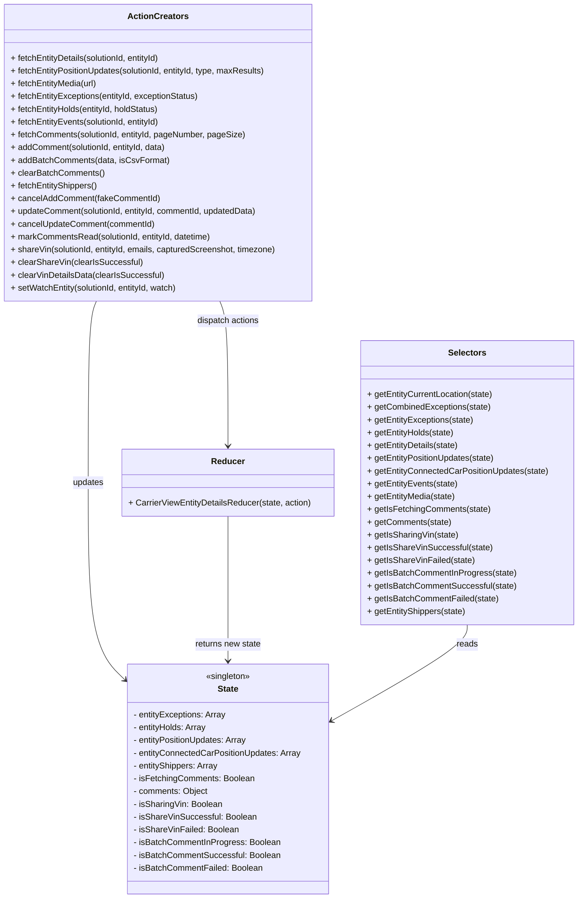

# Diagram: web/portal/src/pages/carrierview/redux/CarrierViewEntityDetailsState.js


> Auto-generated by Obscura crawlers

## Diagram 1

```mermaid
flowchart LR
  subgraph Actions
    FE[fetchEntityDetails(solutionId, entityId)]
    FP[fetchEntityPositionUpdates(solutionId, entityId, type, maxResults)]
    FM[fetchEntityMedia(url)]
    FEv[fetchEntityEvents(solutionId, entityId)]
    FC[fetchComments(solutionId, entityId, pageNumber, pageSize)]
    AC[addComment(solutionId, entityId, data)]
    AB[addBatchComments(data, isCsvFormat)]
    FS[fetchEntityShippers()]
    SU[setWatchEntity(solutionId, entityId, watch)]
    SH[shareVin(solutionId, entityId, emails, capturedScreenshot, timezone)]
  end

  subgraph API
    AX[axios.get/post/patch]
    URL[entityUrl(entityId) /api endpoints]
  end

  subgraph Dispatch
    D1[dispatch({type: RECEIVE_ENTITY_DETAILS, payload})]
    D2[dispatch({type: RECEIVE_ENTITY_POSITION_UPDATES / RECEIVE_ENTITY_CONNECTED_CAR_POSITION_UPDATES, payload})]
    D3[dispatch({type: RECEIVE_ENTITY_MEDIA, payload})]
    D4[dispatch({type: RECEIVE_ENTITY_EVENTS, payload})]
    D5[dispatch({type: RECEIVE_COMMENTS / FETCH_COMMENTS_FAILED / FETCH_COMMENTS, payload})]
    D6[dispatch({type: SUBMIT_NEW_COMMENT / RECEIVE_NEW_COMMENT / SUBMIT_NEW_COMMENT_FAILED})]
    D7[dispatch({type: SUBMIT_BATCH_COMMENTS / SUCCESS / FAILED})]
    D8[dispatch({type: FETCH_SHIPPERS / FETCH_SHIPPERS_SUCCESS / FETCH_SHIPPERS_FAILED})]
    D9[dispatch({type: ENTITY_UPDATE_SUCCESS})]
    D10[dispatch({type: SHARE_VIN_BEGIN / SHARE_VIN_SUCCESS / SHARE_VIN_FAILED})]
  end

  subgraph Reducer
    R[CarrierViewEntityDetailsReducer]
  end

  FE --> |calls| URL
  FP --> |calls| URL
  FM --> |returns or clears| D3
  FEv --> |calls with Accept header| AX
  FC --> |calls| AX
  AC --> |posts comment (optimistic) then post| AX
  AB --> |posts batch| AX
  FS --> |calls entity-search/list| AX
  SU --> |patch| AX
  SH --> |post share| AX

  AX --> |response| D1
  AX --> |response| D2
  AX --> |response| D4
  AX --> |response| D5
  AX --> |response| D6
  AX --> |response| D7
  AX --> |response| D8
  AX --> |response| D9
  AX --> |response| D10

  D1 --> R
  D2 --> R
  D3 --> R
  D4 --> R
  D5 --> R
  D6 --> R
  D7 --> R
  D8 --> R
  D9 --> R
  D10 --> R
```

> SVG rendering failed for this diagram.

## Diagram 2



### SVG

<svg id="container" width="1092.109375" xmlns="http://www.w3.org/2000/svg" class="classDiagram" height="1688" viewBox="0 0 1092.109375 1688" role="graphics-document document" aria-roledescription="class"><style>#container{font-family:"trebuchet ms",verdana,arial,sans-serif;font-size:16px;fill:#333;}@keyframes edge-animation-frame{from{stroke-dashoffset:0;}}@keyframes dash{to{stroke-dashoffset:0;}}#container .edge-animation-slow{stroke-dasharray:9,5!important;stroke-dashoffset:900;animation:dash 50s linear infinite;stroke-linecap:round;}#container .edge-animation-fast{stroke-dasharray:9,5!important;stroke-dashoffset:900;animation:dash 20s linear infinite;stroke-linecap:round;}#container .error-icon{fill:#552222;}#container .error-text{fill:#552222;stroke:#552222;}#container .edge-thickness-normal{stroke-width:1px;}#container .edge-thickness-thick{stroke-width:3.5px;}#container .edge-pattern-solid{stroke-dasharray:0;}#container .edge-thickness-invisible{stroke-width:0;fill:none;}#container .edge-pattern-dashed{stroke-dasharray:3;}#container .edge-pattern-dotted{stroke-dasharray:2;}#container .marker{fill:#333333;stroke:#333333;}#container .marker.cross{stroke:#333333;}#container svg{font-family:"trebuchet ms",verdana,arial,sans-serif;font-size:16px;}#container p{margin:0;}#container g.classGroup text{fill:#9370DB;stroke:none;font-family:"trebuchet ms",verdana,arial,sans-serif;font-size:10px;}#container g.classGroup text .title{font-weight:bolder;}#container .nodeLabel,#container .edgeLabel{color:#131300;}#container .edgeLabel .label rect{fill:#ECECFF;}#container .label text{fill:#131300;}#container .labelBkg{background:#ECECFF;}#container .edgeLabel .label span{background:#ECECFF;}#container .classTitle{font-weight:bolder;}#container .node rect,#container .node circle,#container .node ellipse,#container .node polygon,#container .node path{fill:#ECECFF;stroke:#9370DB;stroke-width:1px;}#container .divider{stroke:#9370DB;stroke-width:1;}#container g.clickable{cursor:pointer;}#container g.classGroup rect{fill:#ECECFF;stroke:#9370DB;}#container g.classGroup line{stroke:#9370DB;stroke-width:1;}#container .classLabel .box{stroke:none;stroke-width:0;fill:#ECECFF;opacity:0.5;}#container .classLabel .label{fill:#9370DB;font-size:10px;}#container .relation{stroke:#333333;stroke-width:1;fill:none;}#container .dashed-line{stroke-dasharray:3;}#container .dotted-line{stroke-dasharray:1 2;}#container #compositionStart,#container .composition{fill:#333333!important;stroke:#333333!important;stroke-width:1;}#container #compositionEnd,#container .composition{fill:#333333!important;stroke:#333333!important;stroke-width:1;}#container #dependencyStart,#container .dependency{fill:#333333!important;stroke:#333333!important;stroke-width:1;}#container #dependencyStart,#container .dependency{fill:#333333!important;stroke:#333333!important;stroke-width:1;}#container #extensionStart,#container .extension{fill:transparent!important;stroke:#333333!important;stroke-width:1;}#container #extensionEnd,#container .extension{fill:transparent!important;stroke:#333333!important;stroke-width:1;}#container #aggregationStart,#container .aggregation{fill:transparent!important;stroke:#333333!important;stroke-width:1;}#container #aggregationEnd,#container .aggregation{fill:transparent!important;stroke:#333333!important;stroke-width:1;}#container #lollipopStart,#container .lollipop{fill:#ECECFF!important;stroke:#333333!important;stroke-width:1;}#container #lollipopEnd,#container .lollipop{fill:#ECECFF!important;stroke:#333333!important;stroke-width:1;}#container .edgeTerminals{font-size:11px;line-height:initial;}#container .classTitleText{text-anchor:middle;font-size:18px;fill:#333;}#container .label-icon{display:inline-block;height:1em;overflow:visible;vertical-align:-0.125em;}#container .node .label-icon path{fill:currentColor;stroke:revert;stroke-width:revert;}#container :root{--mermaid-font-family:"trebuchet ms",verdana,arial,sans-serif;}</style><g><defs><marker id="container_class-aggregationStart" class="marker aggregation class" refX="18" refY="7" markerWidth="190" markerHeight="240" orient="auto"><path d="M 18,7 L9,13 L1,7 L9,1 Z"></path></marker></defs><defs><marker id="container_class-aggregationEnd" class="marker aggregation class" refX="1" refY="7" markerWidth="20" markerHeight="28" orient="auto"><path d="M 18,7 L9,13 L1,7 L9,1 Z"></path></marker></defs><defs><marker id="container_class-extensionStart" class="marker extension class" refX="18" refY="7" markerWidth="190" markerHeight="240" orient="auto"><path d="M 1,7 L18,13 V 1 Z"></path></marker></defs><defs><marker id="container_class-extensionEnd" class="marker extension class" refX="1" refY="7" markerWidth="20" markerHeight="28" orient="auto"><path d="M 1,1 V 13 L18,7 Z"></path></marker></defs><defs><marker id="container_class-compositionStart" class="marker composition class" refX="18" refY="7" markerWidth="190" markerHeight="240" orient="auto"><path d="M 18,7 L9,13 L1,7 L9,1 Z"></path></marker></defs><defs><marker id="container_class-compositionEnd" class="marker composition class" refX="1" refY="7" markerWidth="20" markerHeight="28" orient="auto"><path d="M 18,7 L9,13 L1,7 L9,1 Z"></path></marker></defs><defs><marker id="container_class-dependencyStart" class="marker dependency class" refX="6" refY="7" markerWidth="190" markerHeight="240" orient="auto"><path d="M 5,7 L9,13 L1,7 L9,1 Z"></path></marker></defs><defs><marker id="container_class-dependencyEnd" class="marker dependency class" refX="13" refY="7" markerWidth="20" markerHeight="28" orient="auto"><path d="M 18,7 L9,13 L14,7 L9,1 Z"></path></marker></defs><defs><marker id="container_class-lollipopStart" class="marker lollipop class" refX="13" refY="7" markerWidth="190" markerHeight="240" orient="auto"><circle stroke="black" fill="transparent" cx="7" cy="7" r="6"></circle></marker></defs><defs><marker id="container_class-lollipopEnd" class="marker lollipop class" refX="1" refY="7" markerWidth="190" markerHeight="240" orient="auto"><circle stroke="black" fill="transparent" cx="7" cy="7" r="6"></circle></marker></defs><g class="root"><g class="clusters"></g><g class="edgePaths"><path d="M184.542,566L181.963,572.167C179.384,578.333,174.227,590.667,171.649,647.5C169.07,704.333,169.07,805.667,169.07,907C169.07,1008.333,169.07,1109.667,180.339,1171.122C191.607,1232.576,214.145,1254.153,225.413,1264.941L236.682,1275.729" id="id_ActionCreators_State_1" class="edge-thickness-normal edge-pattern-solid relation" style=";;;" data-edge="true" data-et="edge" data-id="id_ActionCreators_State_1" data-points="W3sieCI6MTg0LjU0MTU1OTUzMzIyNzg1LCJ5Ijo1NjZ9LHsieCI6MTY5LjA3MDMxMjUsInkiOjYwM30seyJ4IjoxNjkuMDcwMzEyNSwieSI6OTA3fSx7IngiOjE2OS4wNzAzMTI1LCJ5IjoxMjExfSx7IngiOjI0MS4wMTU2MjUsInkiOjEyNzkuODc4Mjg4ODkwMjAyOH1d" marker-end="url(#container_class-dependencyEnd)"></path><path d="M433.336,970L433.336,1010.167C433.336,1050.333,433.336,1130.667,433.336,1176C433.336,1221.333,433.336,1231.667,433.336,1236.833L433.336,1242" id="id_Reducer_State_2" class="edge-thickness-normal edge-pattern-solid relation" style=";;;" data-edge="true" data-et="edge" data-id="id_Reducer_State_2" data-points="W3sieCI6NDMzLjMzNTkzNzUsInkiOjk3MH0seyJ4Ijo0MzMuMzM1OTM3NSwieSI6MTIxMX0seyJ4Ijo0MzMuMzM1OTM3NSwieSI6MTI0OH1d" marker-end="url(#container_class-dependencyEnd)"></path><path d="M883.648,1174L883.648,1180.167C883.648,1186.333,883.648,1198.667,841.522,1228.502C799.395,1258.336,715.141,1305.673,673.014,1329.341L630.887,1353.009" id="id_Selectors_State_3" class="edge-thickness-normal edge-pattern-solid relation" style=";;;" data-edge="true" data-et="edge" data-id="id_Selectors_State_3" data-points="W3sieCI6ODgzLjY0ODQzNzUsInkiOjExNzR9LHsieCI6ODgzLjY0ODQzNzUsInkiOjEyMTF9LHsieCI6NjI1LjY1NjI1LCJ5IjoxMzU1Ljk0ODI4MjQ0Mjc0OH1d" marker-end="url(#container_class-dependencyEnd)"></path><path d="M417.865,566L420.443,572.167C423.022,578.333,428.179,590.667,430.757,636C433.336,681.333,433.336,759.667,433.336,798.833L433.336,838" id="id_ActionCreators_Reducer_4" class="edge-thickness-normal edge-pattern-solid relation" style=";;;" data-edge="true" data-et="edge" data-id="id_ActionCreators_Reducer_4" data-points="W3sieCI6NDE3Ljg2NDY5MDQ2Njc3MjEsInkiOjU2Nn0seyJ4Ijo0MzMuMzM1OTM3NSwieSI6NjAzfSx7IngiOjQzMy4zMzU5Mzc1LCJ5Ijo4NDR9XQ==" marker-end="url(#container_class-dependencyEnd)"></path></g><g class="edgeLabels"><g class="edgeLabel" transform="translate(169.0703125, 907)"><g class="label" data-id="id_ActionCreators_State_1" transform="translate(-29.4140625, -12)"><foreignObject width="58.828125" height="24"><div xmlns="http://www.w3.org/1999/xhtml" class="labelBkg" style="display: table-cell; white-space: nowrap; line-height: 1.5; max-width: 200px; text-align: center;"><span class="edgeLabel"><p>updates</p></span></div></foreignObject></g></g><g class="edgeLabel" transform="translate(433.3359375, 1211)"><g class="label" data-id="id_Reducer_State_2" transform="translate(-63.34375, -12)"><foreignObject width="126.6875" height="24"><div xmlns="http://www.w3.org/1999/xhtml" class="labelBkg" style="display: table-cell; white-space: nowrap; line-height: 1.5; max-width: 200px; text-align: center;"><span class="edgeLabel"><p>returns new state</p></span></div></foreignObject></g></g><g class="edgeLabel" transform="translate(883.6484375, 1211)"><g class="label" data-id="id_Selectors_State_3" transform="translate(-20.0078125, -12)"><foreignObject width="40.015625" height="24"><div xmlns="http://www.w3.org/1999/xhtml" class="labelBkg" style="display: table-cell; white-space: nowrap; line-height: 1.5; max-width: 200px; text-align: center;"><span class="edgeLabel"><p>reads</p></span></div></foreignObject></g></g><g class="edgeLabel" transform="translate(433.3359375, 603)"><g class="label" data-id="id_ActionCreators_Reducer_4" transform="translate(-59.6171875, -12)"><foreignObject width="119.234375" height="24"><div xmlns="http://www.w3.org/1999/xhtml" class="labelBkg" style="display: table-cell; white-space: nowrap; line-height: 1.5; max-width: 200px; text-align: center;"><span class="edgeLabel"><p>dispatch actions</p></span></div></foreignObject></g></g></g><g class="nodes"><g class="node default" id="classId-State-0" transform="translate(433.3359375, 1464)"><g class="basic label-container"><path d="M-192.3203125 -216 L192.3203125 -216 L192.3203125 216 L-192.3203125 216" stroke="none" stroke-width="0" fill="#ECECFF" style=""></path><path d="M-192.3203125 -216 C-66.45223043645008 -216, 59.41585162709984 -216, 192.3203125 -216 M-192.3203125 -216 C-50.60587434924787 -216, 91.10856380150426 -216, 192.3203125 -216 M192.3203125 -216 C192.3203125 -106.5783594094129, 192.3203125 2.8432811811742056, 192.3203125 216 M192.3203125 -216 C192.3203125 -110.0630674490161, 192.3203125 -4.1261348980322055, 192.3203125 216 M192.3203125 216 C71.52263993173491 216, -49.27503263653017 216, -192.3203125 216 M192.3203125 216 C79.17403698067788 216, -33.972238538644234 216, -192.3203125 216 M-192.3203125 216 C-192.3203125 43.629842967318154, -192.3203125 -128.7403140653637, -192.3203125 -216 M-192.3203125 216 C-192.3203125 107.09620883604401, -192.3203125 -1.8075823279119732, -192.3203125 -216" stroke="#9370DB" stroke-width="1.3" fill="none" stroke-dasharray="0 0" style=""></path></g><g class="annotation-group text" transform="translate(-42.765625, -192)"><g class="label" style="" transform="translate(0,-12)"><foreignObject width="85.53125" height="24"><div xmlns="http://www.w3.org/1999/xhtml" style="display: table-cell; white-space: nowrap; line-height: 1.5; max-width: 136px; text-align: center;"><span class="nodeLabel markdown-node-label" style=""><p>«singleton»</p></span></div></foreignObject></g></g><g class="label-group text" transform="translate(-19.3125, -168)"><g class="label" style="font-weight: bolder" transform="translate(0,-12)"><foreignObject width="38.625" height="24"><div xmlns="http://www.w3.org/1999/xhtml" style="display: table-cell; white-space: nowrap; line-height: 1.5; max-width: 87px; text-align: center;"><span class="nodeLabel markdown-node-label" style=""><p>State</p></span></div></foreignObject></g></g><g class="members-group text" transform="translate(-180.3203125, -120)"><g class="label" style="" transform="translate(0,-12)"><foreignObject width="176.234375" height="24"><div xmlns="http://www.w3.org/1999/xhtml" style="display: table-cell; white-space: nowrap; line-height: 1.5; max-width: 234px; text-align: center;"><span class="nodeLabel markdown-node-label" style=""><p>- entityExceptions: Array</p></span></div></foreignObject></g><g class="label" style="" transform="translate(0,12)"><foreignObject width="139.890625" height="24"><div xmlns="http://www.w3.org/1999/xhtml" style="display: table-cell; white-space: nowrap; line-height: 1.5; max-width: 197px; text-align: center;"><span class="nodeLabel markdown-node-label" style=""><p>- entityHolds: Array</p></span></div></foreignObject></g><g class="label" style="" transform="translate(0,36)"><foreignObject width="217.265625" height="24"><div xmlns="http://www.w3.org/1999/xhtml" style="display: table-cell; white-space: nowrap; line-height: 1.5; max-width: 275px; text-align: center;"><span class="nodeLabel markdown-node-label" style=""><p>- entityPositionUpdates: Array</p></span></div></foreignObject></g><g class="label" style="" transform="translate(0,60)"><foreignObject width="317.875" height="24"><div xmlns="http://www.w3.org/1999/xhtml" style="display: table-cell; white-space: nowrap; line-height: 1.5; max-width: 375px; text-align: center;"><span class="nodeLabel markdown-node-label" style=""><p>- entityConnectedCarPositionUpdates: Array</p></span></div></foreignObject></g><g class="label" style="" transform="translate(0,84)"><foreignObject width="161.765625" height="24"><div xmlns="http://www.w3.org/1999/xhtml" style="display: table-cell; white-space: nowrap; line-height: 1.5; max-width: 219px; text-align: center;"><span class="nodeLabel markdown-node-label" style=""><p>- entityShippers: Array</p></span></div></foreignObject></g><g class="label" style="" transform="translate(0,108)"><foreignObject width="227.953125" height="24"><div xmlns="http://www.w3.org/1999/xhtml" style="display: table-cell; white-space: nowrap; line-height: 1.5; max-width: 285px; text-align: center;"><span class="nodeLabel markdown-node-label" style=""><p>- isFetchingComments: Boolean</p></span></div></foreignObject></g><g class="label" style="" transform="translate(0,132)"><foreignObject width="141.421875" height="24"><div xmlns="http://www.w3.org/1999/xhtml" style="display: table-cell; white-space: nowrap; line-height: 1.5; max-width: 199px; text-align: center;"><span class="nodeLabel markdown-node-label" style=""><p>- comments: Object</p></span></div></foreignObject></g><g class="label" style="" transform="translate(0,156)"><foreignObject width="168.390625" height="24"><div xmlns="http://www.w3.org/1999/xhtml" style="display: table-cell; white-space: nowrap; line-height: 1.5; max-width: 226px; text-align: center;"><span class="nodeLabel markdown-node-label" style=""><p>- isSharingVin: Boolean</p></span></div></foreignObject></g><g class="label" style="" transform="translate(0,180)"><foreignObject width="230.140625" height="24"><div xmlns="http://www.w3.org/1999/xhtml" style="display: table-cell; white-space: nowrap; line-height: 1.5; max-width: 288px; text-align: center;"><span class="nodeLabel markdown-node-label" style=""><p>- isShareVinSuccessful: Boolean</p></span></div></foreignObject></g><g class="label" style="" transform="translate(0,204)"><foreignObject width="197.4375" height="24"><div xmlns="http://www.w3.org/1999/xhtml" style="display: table-cell; white-space: nowrap; line-height: 1.5; max-width: 255px; text-align: center;"><span class="nodeLabel markdown-node-label" style=""><p>- isShareVinFailed: Boolean</p></span></div></foreignObject></g><g class="label" style="" transform="translate(0,228)"><foreignObject width="276.328125" height="24"><div xmlns="http://www.w3.org/1999/xhtml" style="display: table-cell; white-space: nowrap; line-height: 1.5; max-width: 334px; text-align: center;"><span class="nodeLabel markdown-node-label" style=""><p>- isBatchCommentInProgress: Boolean</p></span></div></foreignObject></g><g class="label" style="" transform="translate(0,252)"><foreignObject width="276.40625" height="24"><div xmlns="http://www.w3.org/1999/xhtml" style="display: table-cell; white-space: nowrap; line-height: 1.5; max-width: 334px; text-align: center;"><span class="nodeLabel markdown-node-label" style=""><p>- isBatchCommentSuccessful: Boolean</p></span></div></foreignObject></g><g class="label" style="" transform="translate(0,276)"><foreignObject width="243.703125" height="24"><div xmlns="http://www.w3.org/1999/xhtml" style="display: table-cell; white-space: nowrap; line-height: 1.5; max-width: 301px; text-align: center;"><span class="nodeLabel markdown-node-label" style=""><p>- isBatchCommentFailed: Boolean</p></span></div></foreignObject></g></g><g class="methods-group text" transform="translate(-180.3203125, 216)"></g><g class="divider" style=""><path d="M-192.3203125 -144 C-54.46489495647043 -144, 83.39052258705914 -144, 192.3203125 -144 M-192.3203125 -144 C-58.644952636599584 -144, 75.03040722680083 -144, 192.3203125 -144" stroke="#9370DB" stroke-width="1.3" fill="none" stroke-dasharray="0 0" style=""></path></g><g class="divider" style=""><path d="M-192.3203125 192 C-69.90584911057077 192, 52.50861427885846 192, 192.3203125 192 M-192.3203125 192 C-98.9694398323152 192, -5.618567164630406 192, 192.3203125 192" stroke="#9370DB" stroke-width="1.3" fill="none" stroke-dasharray="0 0" style=""></path></g></g><g class="node default" id="classId-ActionCreators-1" transform="translate(301.203125, 287)"><g class="basic label-container"><path d="M-293.203125 -279 L293.203125 -279 L293.203125 279 L-293.203125 279" stroke="none" stroke-width="0" fill="#ECECFF" style=""></path><path d="M-293.203125 -279 C-146.43521151919902 -279, 0.33270196160196974 -279, 293.203125 -279 M-293.203125 -279 C-148.16564546202062 -279, -3.128165924041241 -279, 293.203125 -279 M293.203125 -279 C293.203125 -158.83721742649035, 293.203125 -38.67443485298071, 293.203125 279 M293.203125 -279 C293.203125 -164.8770482719658, 293.203125 -50.75409654393158, 293.203125 279 M293.203125 279 C73.95391133604605 279, -145.2953023279079 279, -293.203125 279 M293.203125 279 C139.9648025946284 279, -13.27351981074321 279, -293.203125 279 M-293.203125 279 C-293.203125 65.1200463989785, -293.203125 -148.759907202043, -293.203125 -279 M-293.203125 279 C-293.203125 129.82977116518163, -293.203125 -19.34045766963675, -293.203125 -279" stroke="#9370DB" stroke-width="1.3" fill="none" stroke-dasharray="0 0" style=""></path></g><g class="annotation-group text" transform="translate(0, -255)"></g><g class="label-group text" transform="translate(-53.96875, -255)"><g class="label" style="font-weight: bolder" transform="translate(0,-12)"><foreignObject width="107.9375" height="24"><div xmlns="http://www.w3.org/1999/xhtml" style="display: table-cell; white-space: nowrap; line-height: 1.5; max-width: 156px; text-align: center;"><span class="nodeLabel markdown-node-label" style=""><p>ActionCreators</p></span></div></foreignObject></g></g><g class="members-group text" transform="translate(-281.203125, -207)"></g><g class="methods-group text" transform="translate(-281.203125, -177)"><g class="label" style="" transform="translate(0,-12)"><foreignObject width="289.203125" height="24"><div xmlns="http://www.w3.org/1999/xhtml" style="display: table-cell; white-space: nowrap; line-height: 1.5; max-width: 347px; text-align: center;"><span class="nodeLabel markdown-node-label" style=""><p>+ fetchEntityDetails(solutionId, entityId)</p></span></div></foreignObject></g><g class="label" style="" transform="translate(0,12)"><foreignObject width="489.234375" height="24"><div xmlns="http://www.w3.org/1999/xhtml" style="display: table-cell; white-space: nowrap; line-height: 1.5; max-width: 547px; text-align: center;"><span class="nodeLabel markdown-node-label" style=""><p>+ fetchEntityPositionUpdates(solutionId, entityId, type, maxResults)</p></span></div></foreignObject></g><g class="label" style="" transform="translate(0,36)"><foreignObject width="164.84375" height="24"><div xmlns="http://www.w3.org/1999/xhtml" style="display: table-cell; white-space: nowrap; line-height: 1.5; max-width: 222px; text-align: center;"><span class="nodeLabel markdown-node-label" style=""><p>+ fetchEntityMedia(url)</p></span></div></foreignObject></g><g class="label" style="" transform="translate(0,60)"><foreignObject width="359.640625" height="24"><div xmlns="http://www.w3.org/1999/xhtml" style="display: table-cell; white-space: nowrap; line-height: 1.5; max-width: 417px; text-align: center;"><span class="nodeLabel markdown-node-label" style=""><p>+ fetchEntityExceptions(entityId, exceptionStatus)</p></span></div></foreignObject></g><g class="label" style="" transform="translate(0,84)"><foreignObject width="285.453125" height="24"><div xmlns="http://www.w3.org/1999/xhtml" style="display: table-cell; white-space: nowrap; line-height: 1.5; max-width: 343px; text-align: center;"><span class="nodeLabel markdown-node-label" style=""><p>+ fetchEntityHolds(entityId, holdStatus)</p></span></div></foreignObject></g><g class="label" style="" transform="translate(0,108)"><foreignObject width="286.53125" height="24"><div xmlns="http://www.w3.org/1999/xhtml" style="display: table-cell; white-space: nowrap; line-height: 1.5; max-width: 344px; text-align: center;"><span class="nodeLabel markdown-node-label" style=""><p>+ fetchEntityEvents(solutionId, entityId)</p></span></div></foreignObject></g><g class="label" style="" transform="translate(0,132)"><foreignObject width="445.671875" height="24"><div xmlns="http://www.w3.org/1999/xhtml" style="display: table-cell; white-space: nowrap; line-height: 1.5; max-width: 503px; text-align: center;"><span class="nodeLabel markdown-node-label" style=""><p>+ fetchComments(solutionId, entityId, pageNumber, pageSize)</p></span></div></foreignObject></g><g class="label" style="" transform="translate(0,156)"><foreignObject width="298.875" height="24"><div xmlns="http://www.w3.org/1999/xhtml" style="display: table-cell; white-space: nowrap; line-height: 1.5; max-width: 356px; text-align: center;"><span class="nodeLabel markdown-node-label" style=""><p>+ addComment(solutionId, entityId, data)</p></span></div></foreignObject></g><g class="label" style="" transform="translate(0,180)"><foreignObject width="295.71875" height="24"><div xmlns="http://www.w3.org/1999/xhtml" style="display: table-cell; white-space: nowrap; line-height: 1.5; max-width: 353px; text-align: center;"><span class="nodeLabel markdown-node-label" style=""><p>+ addBatchComments(data, isCsvFormat)</p></span></div></foreignObject></g><g class="label" style="" transform="translate(0,204)"><foreignObject width="176.046875" height="24"><div xmlns="http://www.w3.org/1999/xhtml" style="display: table-cell; white-space: nowrap; line-height: 1.5; max-width: 233px; text-align: center;"><span class="nodeLabel markdown-node-label" style=""><p>+ clearBatchComments()</p></span></div></foreignObject></g><g class="label" style="" transform="translate(0,228)"><foreignObject width="164.453125" height="24"><div xmlns="http://www.w3.org/1999/xhtml" style="display: table-cell; white-space: nowrap; line-height: 1.5; max-width: 222px; text-align: center;"><span class="nodeLabel markdown-node-label" style=""><p>+ fetchEntityShippers()</p></span></div></foreignObject></g><g class="label" style="" transform="translate(0,252)"><foreignObject width="280.53125" height="24"><div xmlns="http://www.w3.org/1999/xhtml" style="display: table-cell; white-space: nowrap; line-height: 1.5; max-width: 338px; text-align: center;"><span class="nodeLabel markdown-node-label" style=""><p>+ cancelAddComment(fakeCommentId)</p></span></div></foreignObject></g><g class="label" style="" transform="translate(0,276)"><foreignObject width="474.203125" height="24"><div xmlns="http://www.w3.org/1999/xhtml" style="display: table-cell; white-space: nowrap; line-height: 1.5; max-width: 532px; text-align: center;"><span class="nodeLabel markdown-node-label" style=""><p>+ updateComment(solutionId, entityId, commentId, updatedData)</p></span></div></foreignObject></g><g class="label" style="" transform="translate(0,300)"><foreignObject width="273.0625" height="24"><div xmlns="http://www.w3.org/1999/xhtml" style="display: table-cell; white-space: nowrap; line-height: 1.5; max-width: 330px; text-align: center;"><span class="nodeLabel markdown-node-label" style=""><p>+ cancelUpdateComment(commentId)</p></span></div></foreignObject></g><g class="label" style="" transform="translate(0,324)"><foreignObject width="384.171875" height="24"><div xmlns="http://www.w3.org/1999/xhtml" style="display: table-cell; white-space: nowrap; line-height: 1.5; max-width: 442px; text-align: center;"><span class="nodeLabel markdown-node-label" style=""><p>+ markCommentsRead(solutionId, entityId, datetime)</p></span></div></foreignObject></g><g class="label" style="" transform="translate(0,348)"><foreignObject width="508.4375" height="24"><div xmlns="http://www.w3.org/1999/xhtml" style="display: table-cell; white-space: nowrap; line-height: 1.5; max-width: 566px; text-align: center;"><span class="nodeLabel markdown-node-label" style=""><p>+ shareVin(solutionId, entityId, emails, capturedScreenshot, timezone)</p></span></div></foreignObject></g><g class="label" style="" transform="translate(0,372)"><foreignObject width="245.734375" height="24"><div xmlns="http://www.w3.org/1999/xhtml" style="display: table-cell; white-space: nowrap; line-height: 1.5; max-width: 303px; text-align: center;"><span class="nodeLabel markdown-node-label" style=""><p>+ clearShareVin(clearIsSuccessful)</p></span></div></foreignObject></g><g class="label" style="" transform="translate(0,396)"><foreignObject width="287.796875" height="24"><div xmlns="http://www.w3.org/1999/xhtml" style="display: table-cell; white-space: nowrap; line-height: 1.5; max-width: 345px; text-align: center;"><span class="nodeLabel markdown-node-label" style=""><p>+ clearVinDetailsData(clearIsSuccessful)</p></span></div></foreignObject></g><g class="label" style="" transform="translate(0,420)"><foreignObject width="319.25" height="24"><div xmlns="http://www.w3.org/1999/xhtml" style="display: table-cell; white-space: nowrap; line-height: 1.5; max-width: 377px; text-align: center;"><span class="nodeLabel markdown-node-label" style=""><p>+ setWatchEntity(solutionId, entityId, watch)</p></span></div></foreignObject></g></g><g class="divider" style=""><path d="M-293.203125 -231 C-126.72534785862365 -231, 39.7524292827527 -231, 293.203125 -231 M-293.203125 -231 C-138.15777079575642 -231, 16.88758340848716 -231, 293.203125 -231" stroke="#9370DB" stroke-width="1.3" fill="none" stroke-dasharray="0 0" style=""></path></g><g class="divider" style=""><path d="M-293.203125 -207 C-158.47172374383055 -207, -23.740322487661103 -207, 293.203125 -207 M-293.203125 -207 C-116.09604288058287 -207, 61.01103923883426 -207, 293.203125 -207" stroke="#9370DB" stroke-width="1.3" fill="none" stroke-dasharray="0 0" style=""></path></g></g><g class="node default" id="classId-Selectors-2" transform="translate(883.6484375, 907)"><g class="basic label-container"><path d="M-200.4609375 -267 L200.4609375 -267 L200.4609375 267 L-200.4609375 267" stroke="none" stroke-width="0" fill="#ECECFF" style=""></path><path d="M-200.4609375 -267 C-110.66312728344919 -267, -20.86531706689837 -267, 200.4609375 -267 M-200.4609375 -267 C-64.65965557091718 -267, 71.14162635816564 -267, 200.4609375 -267 M200.4609375 -267 C200.4609375 -122.46283760378554, 200.4609375 22.07432479242891, 200.4609375 267 M200.4609375 -267 C200.4609375 -84.26941798509694, 200.4609375 98.46116402980613, 200.4609375 267 M200.4609375 267 C115.26220853406842 267, 30.06347956813684 267, -200.4609375 267 M200.4609375 267 C42.205142730157405 267, -116.05065203968519 267, -200.4609375 267 M-200.4609375 267 C-200.4609375 139.1605023908089, -200.4609375 11.321004781617773, -200.4609375 -267 M-200.4609375 267 C-200.4609375 127.49624329775435, -200.4609375 -12.007513404491306, -200.4609375 -267" stroke="#9370DB" stroke-width="1.3" fill="none" stroke-dasharray="0 0" style=""></path></g><g class="annotation-group text" transform="translate(0, -243)"></g><g class="label-group text" transform="translate(-34.171875, -243)"><g class="label" style="font-weight: bolder" transform="translate(0,-12)"><foreignObject width="68.34375" height="24"><div xmlns="http://www.w3.org/1999/xhtml" style="display: table-cell; white-space: nowrap; line-height: 1.5; max-width: 117px; text-align: center;"><span class="nodeLabel markdown-node-label" style=""><p>Selectors</p></span></div></foreignObject></g></g><g class="members-group text" transform="translate(-188.4609375, -195)"></g><g class="methods-group text" transform="translate(-188.4609375, -165)"><g class="label" style="" transform="translate(0,-12)"><foreignObject width="238.75" height="24"><div xmlns="http://www.w3.org/1999/xhtml" style="display: table-cell; white-space: nowrap; line-height: 1.5; max-width: 296px; text-align: center;"><span class="nodeLabel markdown-node-label" style=""><p>+ getEntityCurrentLocation(state)</p></span></div></foreignObject></g><g class="label" style="" transform="translate(0,12)"><foreignObject width="232.84375" height="24"><div xmlns="http://www.w3.org/1999/xhtml" style="display: table-cell; white-space: nowrap; line-height: 1.5; max-width: 290px; text-align: center;"><span class="nodeLabel markdown-node-label" style=""><p>+ getCombinedExceptions(state)</p></span></div></foreignObject></g><g class="label" style="" transform="translate(0,36)"><foreignObject width="201.09375" height="24"><div xmlns="http://www.w3.org/1999/xhtml" style="display: table-cell; white-space: nowrap; line-height: 1.5; max-width: 258px; text-align: center;"><span class="nodeLabel markdown-node-label" style=""><p>+ getEntityExceptions(state)</p></span></div></foreignObject></g><g class="label" style="" transform="translate(0,60)"><foreignObject width="164.765625" height="24"><div xmlns="http://www.w3.org/1999/xhtml" style="display: table-cell; white-space: nowrap; line-height: 1.5; max-width: 222px; text-align: center;"><span class="nodeLabel markdown-node-label" style=""><p>+ getEntityHolds(state)</p></span></div></foreignObject></g><g class="label" style="" transform="translate(0,84)"><foreignObject width="172.953125" height="24"><div xmlns="http://www.w3.org/1999/xhtml" style="display: table-cell; white-space: nowrap; line-height: 1.5; max-width: 230px; text-align: center;"><span class="nodeLabel markdown-node-label" style=""><p>+ getEntityDetails(state)</p></span></div></foreignObject></g><g class="label" style="" transform="translate(0,108)"><foreignObject width="242.140625" height="24"><div xmlns="http://www.w3.org/1999/xhtml" style="display: table-cell; white-space: nowrap; line-height: 1.5; max-width: 300px; text-align: center;"><span class="nodeLabel markdown-node-label" style=""><p>+ getEntityPositionUpdates(state)</p></span></div></foreignObject></g><g class="label" style="" transform="translate(0,132)"><foreignObject width="342.75" height="24"><div xmlns="http://www.w3.org/1999/xhtml" style="display: table-cell; white-space: nowrap; line-height: 1.5; max-width: 400px; text-align: center;"><span class="nodeLabel markdown-node-label" style=""><p>+ getEntityConnectedCarPositionUpdates(state)</p></span></div></foreignObject></g><g class="label" style="" transform="translate(0,156)"><foreignObject width="170.28125" height="24"><div xmlns="http://www.w3.org/1999/xhtml" style="display: table-cell; white-space: nowrap; line-height: 1.5; max-width: 228px; text-align: center;"><span class="nodeLabel markdown-node-label" style=""><p>+ getEntityEvents(state)</p></span></div></foreignObject></g><g class="label" style="" transform="translate(0,180)"><foreignObject width="166.84375" height="24"><div xmlns="http://www.w3.org/1999/xhtml" style="display: table-cell; white-space: nowrap; line-height: 1.5; max-width: 224px; text-align: center;"><span class="nodeLabel markdown-node-label" style=""><p>+ getEntityMedia(state)</p></span></div></foreignObject></g><g class="label" style="" transform="translate(0,204)"><foreignObject width="230.984375" height="24"><div xmlns="http://www.w3.org/1999/xhtml" style="display: table-cell; white-space: nowrap; line-height: 1.5; max-width: 288px; text-align: center;"><span class="nodeLabel markdown-node-label" style=""><p>+ getIsFetchingComments(state)</p></span></div></foreignObject></g><g class="label" style="" transform="translate(0,228)"><foreignObject width="158.015625" height="24"><div xmlns="http://www.w3.org/1999/xhtml" style="display: table-cell; white-space: nowrap; line-height: 1.5; max-width: 215px; text-align: center;"><span class="nodeLabel markdown-node-label" style=""><p>+ getComments(state)</p></span></div></foreignObject></g><g class="label" style="" transform="translate(0,252)"><foreignObject width="171.421875" height="24"><div xmlns="http://www.w3.org/1999/xhtml" style="display: table-cell; white-space: nowrap; line-height: 1.5; max-width: 229px; text-align: center;"><span class="nodeLabel markdown-node-label" style=""><p>+ getIsSharingVin(state)</p></span></div></foreignObject></g><g class="label" style="" transform="translate(0,276)"><foreignObject width="233" height="24"><div xmlns="http://www.w3.org/1999/xhtml" style="display: table-cell; white-space: nowrap; line-height: 1.5; max-width: 290px; text-align: center;"><span class="nodeLabel markdown-node-label" style=""><p>+ getIsShareVinSuccessful(state)</p></span></div></foreignObject></g><g class="label" style="" transform="translate(0,300)"><foreignObject width="200.453125" height="24"><div xmlns="http://www.w3.org/1999/xhtml" style="display: table-cell; white-space: nowrap; line-height: 1.5; max-width: 258px; text-align: center;"><span class="nodeLabel markdown-node-label" style=""><p>+ getIsShareVinFailed(state)</p></span></div></foreignObject></g><g class="label" style="" transform="translate(0,324)"><foreignObject width="279.359375" height="24"><div xmlns="http://www.w3.org/1999/xhtml" style="display: table-cell; white-space: nowrap; line-height: 1.5; max-width: 337px; text-align: center;"><span class="nodeLabel markdown-node-label" style=""><p>+ getIsBatchCommentInProgress(state)</p></span></div></foreignObject></g><g class="label" style="" transform="translate(0,348)"><foreignObject width="279.265625" height="24"><div xmlns="http://www.w3.org/1999/xhtml" style="display: table-cell; white-space: nowrap; line-height: 1.5; max-width: 337px; text-align: center;"><span class="nodeLabel markdown-node-label" style=""><p>+ getIsBatchCommentSuccessful(state)</p></span></div></foreignObject></g><g class="label" style="" transform="translate(0,372)"><foreignObject width="246.734375" height="24"><div xmlns="http://www.w3.org/1999/xhtml" style="display: table-cell; white-space: nowrap; line-height: 1.5; max-width: 304px; text-align: center;"><span class="nodeLabel markdown-node-label" style=""><p>+ getIsBatchCommentFailed(state)</p></span></div></foreignObject></g><g class="label" style="" transform="translate(0,396)"><foreignObject width="186.625" height="24"><div xmlns="http://www.w3.org/1999/xhtml" style="display: table-cell; white-space: nowrap; line-height: 1.5; max-width: 244px; text-align: center;"><span class="nodeLabel markdown-node-label" style=""><p>+ getEntityShippers(state)</p></span></div></foreignObject></g></g><g class="divider" style=""><path d="M-200.4609375 -219 C-62.435065566821066 -219, 75.59080636635787 -219, 200.4609375 -219 M-200.4609375 -219 C-100.24640551244894 -219, -0.03187352489788964 -219, 200.4609375 -219" stroke="#9370DB" stroke-width="1.3" fill="none" stroke-dasharray="0 0" style=""></path></g><g class="divider" style=""><path d="M-200.4609375 -195 C-58.90417281661942 -195, 82.65259186676116 -195, 200.4609375 -195 M-200.4609375 -195 C-75.3440874116296 -195, 49.7727626767408 -195, 200.4609375 -195" stroke="#9370DB" stroke-width="1.3" fill="none" stroke-dasharray="0 0" style=""></path></g></g><g class="node default" id="classId-Reducer-3" transform="translate(433.3359375, 907)"><g class="basic label-container"><path d="M-199.8515625 -63 L199.8515625 -63 L199.8515625 63 L-199.8515625 63" stroke="none" stroke-width="0" fill="#ECECFF" style=""></path><path d="M-199.8515625 -63 C-74.73615714120746 -63, 50.379248217585086 -63, 199.8515625 -63 M-199.8515625 -63 C-56.78139590677273 -63, 86.28877068645454 -63, 199.8515625 -63 M199.8515625 -63 C199.8515625 -25.801825833379894, 199.8515625 11.396348333240212, 199.8515625 63 M199.8515625 -63 C199.8515625 -25.615581045291535, 199.8515625 11.76883790941693, 199.8515625 63 M199.8515625 63 C115.78708760533492 63, 31.722612710669836 63, -199.8515625 63 M199.8515625 63 C80.15942977736952 63, -39.53270294526095 63, -199.8515625 63 M-199.8515625 63 C-199.8515625 36.45881286764384, -199.8515625 9.917625735287686, -199.8515625 -63 M-199.8515625 63 C-199.8515625 28.365092900280438, -199.8515625 -6.269814199439125, -199.8515625 -63" stroke="#9370DB" stroke-width="1.3" fill="none" stroke-dasharray="0 0" style=""></path></g><g class="annotation-group text" transform="translate(0, -39)"></g><g class="label-group text" transform="translate(-29.90625, -39)"><g class="label" style="font-weight: bolder" transform="translate(0,-12)"><foreignObject width="59.8125" height="24"><div xmlns="http://www.w3.org/1999/xhtml" style="display: table-cell; white-space: nowrap; line-height: 1.5; max-width: 110px; text-align: center;"><span class="nodeLabel markdown-node-label" style=""><p>Reducer</p></span></div></foreignObject></g></g><g class="members-group text" transform="translate(-187.8515625, 9)"></g><g class="methods-group text" transform="translate(-187.8515625, 39)"><g class="label" style="" transform="translate(0,-12)"><foreignObject width="345.796875" height="24"><div xmlns="http://www.w3.org/1999/xhtml" style="display: table-cell; white-space: nowrap; line-height: 1.5; max-width: 403px; text-align: center;"><span class="nodeLabel markdown-node-label" style=""><p>+ CarrierViewEntityDetailsReducer(state, action)</p></span></div></foreignObject></g></g><g class="divider" style=""><path d="M-199.8515625 -15 C-80.4557600239653 -15, 38.940042452069406 -15, 199.8515625 -15 M-199.8515625 -15 C-115.95530040025507 -15, -32.05903830051014 -15, 199.8515625 -15" stroke="#9370DB" stroke-width="1.3" fill="none" stroke-dasharray="0 0" style=""></path></g><g class="divider" style=""><path d="M-199.8515625 9 C-72.77476176918339 9, 54.30203896163323 9, 199.8515625 9 M-199.8515625 9 C-109.51045739292427 9, -19.169352285848532 9, 199.8515625 9" stroke="#9370DB" stroke-width="1.3" fill="none" stroke-dasharray="0 0" style=""></path></g></g></g></g></g></svg>
