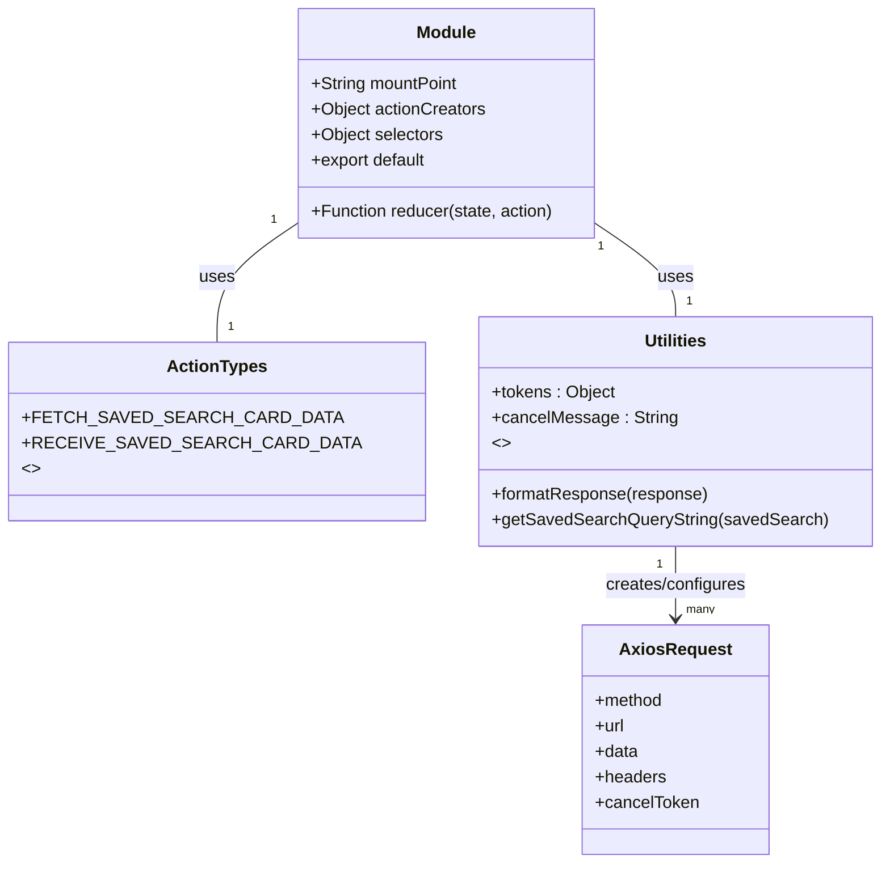

# Diagram: web/portal/src/pages/carrierview/redux/CarrierViewSavedSearchCardsState.js


> Auto-generated by Obscura crawlers

## Diagram 1

```mermaid
flowchart LR
  A[fetchSavedSearchCardData(savedSearch)] --> B{tokens[savedSearch.id] exists?}
  B -- yes --> C[tokens[savedSearch.id].cancelRequest("CANCELED")]
  B --> D[clone savedSearch]
  D --> E{clonedSavedSearch.search.batch present?}
  E -- true --> F[isBatch = true]
  E -- false --> G[isBatch = false]
  D --> H[getSavedSearchQueryString(clonedSavedSearch)]
  H --> I[params = new URLSearchParams(qs)]
  F --> J[params.append("batchType", batch_type)]
  F --> K[request config: method=POST, url=/entity/internal/batch-search?{params}, data=batch_list]
  G --> L[request config: method=GET, url=/entity/internal?{params}]
  K --> M[create axios.CancelToken -> tokens[id].cancelRequest]
  L --> M
  M --> N[request = axios(config)]
  N --> O{request.then / catch}
  O -->|then(response)| P[dispatch RECEIVE_SAVED_SEARCH_CARD_DATA(id, formatResponse(response))]
  O -->|catch(error)| Q{error.message !== "CANCELED"?}
  Q -- true --> R[console.log(error)]
  Q -- false --> S[ignore]
```

> SVG rendering failed for this diagram.

## Diagram 2



### SVG

<svg id="container" width="767.59375" xmlns="http://www.w3.org/2000/svg" class="classDiagram" height="812" viewBox="0 0 767.59375 812" role="graphics-document document" aria-roledescription="class"><style>#container{font-family:"trebuchet ms",verdana,arial,sans-serif;font-size:16px;fill:#333;}@keyframes edge-animation-frame{from{stroke-dashoffset:0;}}@keyframes dash{to{stroke-dashoffset:0;}}#container .edge-animation-slow{stroke-dasharray:9,5!important;stroke-dashoffset:900;animation:dash 50s linear infinite;stroke-linecap:round;}#container .edge-animation-fast{stroke-dasharray:9,5!important;stroke-dashoffset:900;animation:dash 20s linear infinite;stroke-linecap:round;}#container .error-icon{fill:#552222;}#container .error-text{fill:#552222;stroke:#552222;}#container .edge-thickness-normal{stroke-width:1px;}#container .edge-thickness-thick{stroke-width:3.5px;}#container .edge-pattern-solid{stroke-dasharray:0;}#container .edge-thickness-invisible{stroke-width:0;fill:none;}#container .edge-pattern-dashed{stroke-dasharray:3;}#container .edge-pattern-dotted{stroke-dasharray:2;}#container .marker{fill:#333333;stroke:#333333;}#container .marker.cross{stroke:#333333;}#container svg{font-family:"trebuchet ms",verdana,arial,sans-serif;font-size:16px;}#container p{margin:0;}#container g.classGroup text{fill:#9370DB;stroke:none;font-family:"trebuchet ms",verdana,arial,sans-serif;font-size:10px;}#container g.classGroup text .title{font-weight:bolder;}#container .nodeLabel,#container .edgeLabel{color:#131300;}#container .edgeLabel .label rect{fill:#ECECFF;}#container .label text{fill:#131300;}#container .labelBkg{background:#ECECFF;}#container .edgeLabel .label span{background:#ECECFF;}#container .classTitle{font-weight:bolder;}#container .node rect,#container .node circle,#container .node ellipse,#container .node polygon,#container .node path{fill:#ECECFF;stroke:#9370DB;stroke-width:1px;}#container .divider{stroke:#9370DB;stroke-width:1;}#container g.clickable{cursor:pointer;}#container g.classGroup rect{fill:#ECECFF;stroke:#9370DB;}#container g.classGroup line{stroke:#9370DB;stroke-width:1;}#container .classLabel .box{stroke:none;stroke-width:0;fill:#ECECFF;opacity:0.5;}#container .classLabel .label{fill:#9370DB;font-size:10px;}#container .relation{stroke:#333333;stroke-width:1;fill:none;}#container .dashed-line{stroke-dasharray:3;}#container .dotted-line{stroke-dasharray:1 2;}#container #compositionStart,#container .composition{fill:#333333!important;stroke:#333333!important;stroke-width:1;}#container #compositionEnd,#container .composition{fill:#333333!important;stroke:#333333!important;stroke-width:1;}#container #dependencyStart,#container .dependency{fill:#333333!important;stroke:#333333!important;stroke-width:1;}#container #dependencyStart,#container .dependency{fill:#333333!important;stroke:#333333!important;stroke-width:1;}#container #extensionStart,#container .extension{fill:transparent!important;stroke:#333333!important;stroke-width:1;}#container #extensionEnd,#container .extension{fill:transparent!important;stroke:#333333!important;stroke-width:1;}#container #aggregationStart,#container .aggregation{fill:transparent!important;stroke:#333333!important;stroke-width:1;}#container #aggregationEnd,#container .aggregation{fill:transparent!important;stroke:#333333!important;stroke-width:1;}#container #lollipopStart,#container .lollipop{fill:#ECECFF!important;stroke:#333333!important;stroke-width:1;}#container #lollipopEnd,#container .lollipop{fill:#ECECFF!important;stroke:#333333!important;stroke-width:1;}#container .edgeTerminals{font-size:11px;line-height:initial;}#container .classTitleText{text-anchor:middle;font-size:18px;fill:#333;}#container .label-icon{display:inline-block;height:1em;overflow:visible;vertical-align:-0.125em;}#container .node .label-icon path{fill:currentColor;stroke:revert;stroke-width:revert;}#container :root{--mermaid-font-family:"trebuchet ms",verdana,arial,sans-serif;}</style><g><defs><marker id="container_class-aggregationStart" class="marker aggregation class" refX="18" refY="7" markerWidth="190" markerHeight="240" orient="auto"><path d="M 18,7 L9,13 L1,7 L9,1 Z"></path></marker></defs><defs><marker id="container_class-aggregationEnd" class="marker aggregation class" refX="1" refY="7" markerWidth="20" markerHeight="28" orient="auto"><path d="M 18,7 L9,13 L1,7 L9,1 Z"></path></marker></defs><defs><marker id="container_class-extensionStart" class="marker extension class" refX="18" refY="7" markerWidth="190" markerHeight="240" orient="auto"><path d="M 1,7 L18,13 V 1 Z"></path></marker></defs><defs><marker id="container_class-extensionEnd" class="marker extension class" refX="1" refY="7" markerWidth="20" markerHeight="28" orient="auto"><path d="M 1,1 V 13 L18,7 Z"></path></marker></defs><defs><marker id="container_class-compositionStart" class="marker composition class" refX="18" refY="7" markerWidth="190" markerHeight="240" orient="auto"><path d="M 18,7 L9,13 L1,7 L9,1 Z"></path></marker></defs><defs><marker id="container_class-compositionEnd" class="marker composition class" refX="1" refY="7" markerWidth="20" markerHeight="28" orient="auto"><path d="M 18,7 L9,13 L1,7 L9,1 Z"></path></marker></defs><defs><marker id="container_class-dependencyStart" class="marker dependency class" refX="6" refY="7" markerWidth="190" markerHeight="240" orient="auto"><path d="M 5,7 L9,13 L1,7 L9,1 Z"></path></marker></defs><defs><marker id="container_class-dependencyEnd" class="marker dependency class" refX="13" refY="7" markerWidth="20" markerHeight="28" orient="auto"><path d="M 18,7 L9,13 L14,7 L9,1 Z"></path></marker></defs><defs><marker id="container_class-lollipopStart" class="marker lollipop class" refX="13" refY="7" markerWidth="190" markerHeight="240" orient="auto"><circle stroke="black" fill="transparent" cx="7" cy="7" r="6"></circle></marker></defs><defs><marker id="container_class-lollipopEnd" class="marker lollipop class" refX="1" refY="7" markerWidth="190" markerHeight="240" orient="auto"><circle stroke="black" fill="transparent" cx="7" cy="7" r="6"></circle></marker></defs><g class="root"><g class="clusters"></g><g class="edgePaths"><path d="M237.438,217.733L227.471,224.945C217.505,232.156,197.573,246.578,187.607,263.956C177.641,281.333,177.641,301.667,177.641,311.833L177.641,322" id="id_Module_ActionTypes_1" class="edge-thickness-normal edge-pattern-solid relation" style=";;;" data-edge="true" data-et="edge" data-id="id_Module_ActionTypes_1" data-points="W3sieCI6MjM3LjQzNzUsInkiOjIxNy43MzM0NjA2ODM3OTQwMn0seyJ4IjoxNzcuNjQwNjI1LCJ5IjoyNjF9LHsieCI6MTc3LjY0MDYyNSwieSI6MzIyfV0="></path><path d="M518.641,217.733L528.607,224.945C538.573,232.156,558.505,246.578,568.471,259.956C578.438,273.333,578.438,285.667,578.438,291.833L578.438,298" id="id_Module_Utilities_2" class="edge-thickness-normal edge-pattern-solid relation" style=";;;" data-edge="true" data-et="edge" data-id="id_Module_Utilities_2" data-points="W3sieCI6NTE4LjY0MDYyNSwieSI6MjE3LjczMzQ2MDY4Mzc5NDAyfSx7IngiOjU3OC40Mzc1LCJ5IjoyNjF9LHsieCI6NTc4LjQzNzUsInkiOjI5OH1d"></path><path d="M578.438,514L578.438,520.167C578.438,526.333,578.438,538.667,578.438,550C578.438,561.333,578.438,571.667,578.438,576.833L578.438,582" id="id_Utilities_AxiosRequest_3" class="edge-thickness-normal edge-pattern-solid relation" style=";;;" data-edge="true" data-et="edge" data-id="id_Utilities_AxiosRequest_3" data-points="W3sieCI6NTc4LjQzNzUsInkiOjUxNH0seyJ4Ijo1NzguNDM3NSwieSI6NTUxfSx7IngiOjU3OC40Mzc1LCJ5Ijo1ODh9XQ==" marker-end="url(#container_class-dependencyEnd)"></path></g><g class="edgeLabels"><g class="edgeLabel" transform="translate(177.640625, 261)"><g class="label" data-id="id_Module_ActionTypes_1" transform="translate(-16.4921875, -12)"><foreignObject width="32.984375" height="24"><div xmlns="http://www.w3.org/1999/xhtml" class="labelBkg" style="display: table-cell; white-space: nowrap; line-height: 1.5; max-width: 200px; text-align: center;"><span class="edgeLabel"><p>uses</p></span></div></foreignObject></g></g><g class="edgeLabel" transform="translate(578.4375, 261)"><g class="label" data-id="id_Module_Utilities_2" transform="translate(-16.4921875, -12)"><foreignObject width="32.984375" height="24"><div xmlns="http://www.w3.org/1999/xhtml" class="labelBkg" style="display: table-cell; white-space: nowrap; line-height: 1.5; max-width: 200px; text-align: center;"><span class="edgeLabel"><p>uses</p></span></div></foreignObject></g></g><g class="edgeLabel" transform="translate(578.4375, 551)"><g class="label" data-id="id_Utilities_AxiosRequest_3" transform="translate(-67.234375, -12)"><foreignObject width="134.46875" height="24"><div xmlns="http://www.w3.org/1999/xhtml" class="labelBkg" style="display: table-cell; white-space: nowrap; line-height: 1.5; max-width: 200px; text-align: center;"><span class="edgeLabel"><p>creates/configures</p></span></div></foreignObject></g></g><g class="edgeTerminals" transform="translate(214.46658451557795, 215.83951311170628)"><g class="inner" transform="translate(0, 0)"><foreignObject style="width: 9px; height: 12px;"><div xmlns="http://www.w3.org/1999/xhtml" style="display: inline-block; padding-right: 1px; white-space: nowrap;"><span class="edgeLabel">1</span></div></foreignObject></g></g><g class="edgeTerminals" transform="translate(524.0254859978917, 240.1444668357324)"><g class="inner" transform="translate(0, 0)"><foreignObject style="width: 9px; height: 12px;"><div xmlns="http://www.w3.org/1999/xhtml" style="display: inline-block; padding-right: 1px; white-space: nowrap;"><span class="edgeLabel">1</span></div></foreignObject></g></g><g class="edgeTerminals" transform="translate(563.4375, 531.5)"><g class="inner" transform="translate(0, 0)"><foreignObject style="width: 9px; height: 12px;"><div xmlns="http://www.w3.org/1999/xhtml" style="display: inline-block; padding-right: 1px; white-space: nowrap;"><span class="edgeLabel">1</span></div></foreignObject></g></g><g class="edgeTerminals" transform="translate(187.64062749999985, 299.5000021428571)"><g class="inner" transform="translate(0, 0)"></g><foreignObject style="width: 9px; height: 12px;"><div xmlns="http://www.w3.org/1999/xhtml" style="display: inline-block; padding-right: 1px; white-space: nowrap;"><span class="edgeLabel">1</span></div></foreignObject></g><g class="edgeTerminals" transform="translate(588.4375, 275.5)"><g class="inner" transform="translate(0, 0)"></g><foreignObject style="width: 9px; height: 12px;"><div xmlns="http://www.w3.org/1999/xhtml" style="display: inline-block; padding-right: 1px; white-space: nowrap;"><span class="edgeLabel">1</span></div></foreignObject></g><g class="edgeTerminals" transform="translate(588.4375, 565.5)"><g class="inner" transform="translate(0, 0)"></g><foreignObject style="width: 36px; height: 12px;"><div xmlns="http://www.w3.org/1999/xhtml" style="display: inline-block; padding-right: 1px; white-space: nowrap;"><span class="edgeLabel">many</span></div></foreignObject></g></g><g class="nodes"><g class="node default" id="classId-Module-0" transform="translate(378.0390625, 116)"><g class="basic label-container"><path d="M-140.6015625 -108 L140.6015625 -108 L140.6015625 108 L-140.6015625 108" stroke="none" stroke-width="0" fill="#ECECFF" style=""></path><path d="M-140.6015625 -108 C-45.7601011233085 -108, 49.081360253383 -108, 140.6015625 -108 M-140.6015625 -108 C-36.626010809951254 -108, 67.34954088009749 -108, 140.6015625 -108 M140.6015625 -108 C140.6015625 -52.443456363646504, 140.6015625 3.1130872727069914, 140.6015625 108 M140.6015625 -108 C140.6015625 -52.092570187830745, 140.6015625 3.81485962433851, 140.6015625 108 M140.6015625 108 C38.30183939512733 108, -63.99788370974534 108, -140.6015625 108 M140.6015625 108 C46.20645539613395 108, -48.188651707732106 108, -140.6015625 108 M-140.6015625 108 C-140.6015625 22.965331612186276, -140.6015625 -62.06933677562745, -140.6015625 -108 M-140.6015625 108 C-140.6015625 33.86255813508518, -140.6015625 -40.27488372982964, -140.6015625 -108" stroke="#9370DB" stroke-width="1.3" fill="none" stroke-dasharray="0 0" style=""></path></g><g class="annotation-group text" transform="translate(0, -84)"></g><g class="label-group text" transform="translate(-27.09375, -84)"><g class="label" style="font-weight: bolder" transform="translate(0,-12)"><foreignObject width="54.1875" height="24"><div xmlns="http://www.w3.org/1999/xhtml" style="display: table-cell; white-space: nowrap; line-height: 1.5; max-width: 104px; text-align: center;"><span class="nodeLabel markdown-node-label" style=""><p>Module</p></span></div></foreignObject></g></g><g class="members-group text" transform="translate(-128.6015625, -36)"><g class="label" style="" transform="translate(0,-12)"><foreignObject width="139.8125" height="24"><div xmlns="http://www.w3.org/1999/xhtml" style="display: table-cell; white-space: nowrap; line-height: 1.5; max-width: 197px; text-align: center;"><span class="nodeLabel markdown-node-label" style=""><p>+String mountPoint</p></span></div></foreignObject></g><g class="label" style="" transform="translate(0,12)"><foreignObject width="164.765625" height="24"><div xmlns="http://www.w3.org/1999/xhtml" style="display: table-cell; white-space: nowrap; line-height: 1.5; max-width: 222px; text-align: center;"><span class="nodeLabel markdown-node-label" style=""><p>+Object actionCreators</p></span></div></foreignObject></g><g class="label" style="" transform="translate(0,36)"><foreignObject width="124.890625" height="24"><div xmlns="http://www.w3.org/1999/xhtml" style="display: table-cell; white-space: nowrap; line-height: 1.5; max-width: 182px; text-align: center;"><span class="nodeLabel markdown-node-label" style=""><p>+Object selectors</p></span></div></foreignObject></g><g class="label" style="" transform="translate(0,60)"><foreignObject width="111.140625" height="24"><div xmlns="http://www.w3.org/1999/xhtml" style="display: table-cell; white-space: nowrap; line-height: 1.5; max-width: 169px; text-align: center;"><span class="nodeLabel markdown-node-label" style=""><p>+export default</p></span></div></foreignObject></g></g><g class="methods-group text" transform="translate(-128.6015625, 84)"><g class="label" style="" transform="translate(0,-12)"><foreignObject width="230.109375" height="24"><div xmlns="http://www.w3.org/1999/xhtml" style="display: table-cell; white-space: nowrap; line-height: 1.5; max-width: 287px; text-align: center;"><span class="nodeLabel markdown-node-label" style=""><p>+Function reducer(state, action)</p></span></div></foreignObject></g></g><g class="divider" style=""><path d="M-140.6015625 -60 C-70.61553187011761 -60, -0.6295012402352143 -60, 140.6015625 -60 M-140.6015625 -60 C-46.22473307822135 -60, 48.152096343557304 -60, 140.6015625 -60" stroke="#9370DB" stroke-width="1.3" fill="none" stroke-dasharray="0 0" style=""></path></g><g class="divider" style=""><path d="M-140.6015625 60 C-69.43030425516166 60, 1.740953989676683 60, 140.6015625 60 M-140.6015625 60 C-73.7426632886852 60, -6.883764077370387 60, 140.6015625 60" stroke="#9370DB" stroke-width="1.3" fill="none" stroke-dasharray="0 0" style=""></path></g></g><g class="node default" id="classId-ActionTypes-1" transform="translate(177.640625, 406)"><g class="basic label-container"><path d="M-169.640625 -84 L169.640625 -84 L169.640625 84 L-169.640625 84" stroke="none" stroke-width="0" fill="#ECECFF" style=""></path><path d="M-169.640625 -84 C-38.51022669304132 -84, 92.62017161391736 -84, 169.640625 -84 M-169.640625 -84 C-77.56562362599828 -84, 14.50937774800343 -84, 169.640625 -84 M169.640625 -84 C169.640625 -29.783642322865532, 169.640625 24.432715354268936, 169.640625 84 M169.640625 -84 C169.640625 -30.6596710454701, 169.640625 22.680657909059804, 169.640625 84 M169.640625 84 C40.64816359254124 84, -88.34429781491752 84, -169.640625 84 M169.640625 84 C41.41819645998385 84, -86.8042320800323 84, -169.640625 84 M-169.640625 84 C-169.640625 30.47739508104666, -169.640625 -23.045209837906683, -169.640625 -84 M-169.640625 84 C-169.640625 44.94208843250039, -169.640625 5.884176865000782, -169.640625 -84" stroke="#9370DB" stroke-width="1.3" fill="none" stroke-dasharray="0 0" style=""></path></g><g class="annotation-group text" transform="translate(0, -60)"></g><g class="label-group text" transform="translate(-44.390625, -60)"><g class="label" style="font-weight: bolder" transform="translate(0,-12)"><foreignObject width="88.78125" height="24"><div xmlns="http://www.w3.org/1999/xhtml" style="display: table-cell; white-space: nowrap; line-height: 1.5; max-width: 137px; text-align: center;"><span class="nodeLabel markdown-node-label" style=""><p>ActionTypes</p></span></div></foreignObject></g></g><g class="members-group text" transform="translate(-157.640625, -12)"><g class="label" style="" transform="translate(0,-12)"><foreignObject width="257.109375" height="24"><div xmlns="http://www.w3.org/1999/xhtml" style="display: table-cell; white-space: nowrap; line-height: 1.5; max-width: 315px; text-align: center;"><span class="nodeLabel markdown-node-label" style=""><p>+FETCH_SAVED_SEARCH_CARD_DATA</p></span></div></foreignObject></g><g class="label" style="" transform="translate(0,12)"><foreignObject width="270.890625" height="24"><div xmlns="http://www.w3.org/1999/xhtml" style="display: table-cell; white-space: nowrap; line-height: 1.5; max-width: 329px; text-align: center;"><span class="nodeLabel markdown-node-label" style=""><p>+RECEIVE_SAVED_SEARCH_CARD_DATA</p></span></div></foreignObject></g><g class="label" style="" transform="translate(0,36)"><foreignObject width="16.015625" height="24"><div xmlns="http://www.w3.org/1999/xhtml" style="display: table-cell; white-space: nowrap; line-height: 1.5; max-width: 106px; text-align: center;"><span class="nodeLabel markdown-node-label" style=""><p>&lt;&gt;</p></span></div></foreignObject></g></g><g class="methods-group text" transform="translate(-157.640625, 84)"></g><g class="divider" style=""><path d="M-169.640625 -36 C-56.25849028909674 -36, 57.12364442180652 -36, 169.640625 -36 M-169.640625 -36 C-78.04866014087064 -36, 13.543304718258725 -36, 169.640625 -36" stroke="#9370DB" stroke-width="1.3" fill="none" stroke-dasharray="0 0" style=""></path></g><g class="divider" style=""><path d="M-169.640625 60 C-65.27408984001681 60, 39.09244531996637 60, 169.640625 60 M-169.640625 60 C-74.15659456007454 60, 21.327435879850924 60, 169.640625 60" stroke="#9370DB" stroke-width="1.3" fill="none" stroke-dasharray="0 0" style=""></path></g></g><g class="node default" id="classId-Utilities-2" transform="translate(578.4375, 406)"><g class="basic label-container"><path d="M-181.15625 -108 L181.15625 -108 L181.15625 108 L-181.15625 108" stroke="none" stroke-width="0" fill="#ECECFF" style=""></path><path d="M-181.15625 -108 C-107.28375981073367 -108, -33.41126962146734 -108, 181.15625 -108 M-181.15625 -108 C-46.31800795951426 -108, 88.52023408097148 -108, 181.15625 -108 M181.15625 -108 C181.15625 -47.455619635423666, 181.15625 13.088760729152668, 181.15625 108 M181.15625 -108 C181.15625 -63.30482302936796, 181.15625 -18.60964605873592, 181.15625 108 M181.15625 108 C37.38661099225271 108, -106.38302801549457 108, -181.15625 108 M181.15625 108 C70.31754632082034 108, -40.52115735835932 108, -181.15625 108 M-181.15625 108 C-181.15625 31.167761784992166, -181.15625 -45.66447643001567, -181.15625 -108 M-181.15625 108 C-181.15625 22.286530631322336, -181.15625 -63.42693873735533, -181.15625 -108" stroke="#9370DB" stroke-width="1.3" fill="none" stroke-dasharray="0 0" style=""></path></g><g class="annotation-group text" transform="translate(0, -84)"></g><g class="label-group text" transform="translate(-28.8125, -84)"><g class="label" style="font-weight: bolder" transform="translate(0,-12)"><foreignObject width="57.625" height="24"><div xmlns="http://www.w3.org/1999/xhtml" style="display: table-cell; white-space: nowrap; line-height: 1.5; max-width: 107px; text-align: center;"><span class="nodeLabel markdown-node-label" style=""><p>Utilities</p></span></div></foreignObject></g></g><g class="members-group text" transform="translate(-169.15625, -36)"><g class="label" style="" transform="translate(0,-12)"><foreignObject width="115.921875" height="24"><div xmlns="http://www.w3.org/1999/xhtml" style="display: table-cell; white-space: nowrap; line-height: 1.5; max-width: 174px; text-align: center;"><span class="nodeLabel markdown-node-label" style=""><p>+tokens : Object</p></span></div></foreignObject></g><g class="label" style="" transform="translate(0,12)"><foreignObject width="170.609375" height="24"><div xmlns="http://www.w3.org/1999/xhtml" style="display: table-cell; white-space: nowrap; line-height: 1.5; max-width: 229px; text-align: center;"><span class="nodeLabel markdown-node-label" style=""><p>+cancelMessage : String</p></span></div></foreignObject></g><g class="label" style="" transform="translate(0,36)"><foreignObject width="16.015625" height="24"><div xmlns="http://www.w3.org/1999/xhtml" style="display: table-cell; white-space: nowrap; line-height: 1.5; max-width: 106px; text-align: center;"><span class="nodeLabel markdown-node-label" style=""><p>&lt;&gt;</p></span></div></foreignObject></g></g><g class="methods-group text" transform="translate(-169.15625, 60)"><g class="label" style="" transform="translate(0,-12)"><foreignObject width="203.390625" height="24"><div xmlns="http://www.w3.org/1999/xhtml" style="display: table-cell; white-space: nowrap; line-height: 1.5; max-width: 261px; text-align: center;"><span class="nodeLabel markdown-node-label" style=""><p>+formatResponse(response)</p></span></div></foreignObject></g><g class="label" style="" transform="translate(0,12)"><foreignObject width="309.5" height="24"><div xmlns="http://www.w3.org/1999/xhtml" style="display: table-cell; white-space: nowrap; line-height: 1.5; max-width: 367px; text-align: center;"><span class="nodeLabel markdown-node-label" style=""><p>+getSavedSearchQueryString(savedSearch)</p></span></div></foreignObject></g></g><g class="divider" style=""><path d="M-181.15625 -60 C-88.80827349634748 -60, 3.539703007305036 -60, 181.15625 -60 M-181.15625 -60 C-62.717214438718685 -60, 55.72182112256263 -60, 181.15625 -60" stroke="#9370DB" stroke-width="1.3" fill="none" stroke-dasharray="0 0" style=""></path></g><g class="divider" style=""><path d="M-181.15625 36 C-88.37848625165223 36, 4.399277496695532 36, 181.15625 36 M-181.15625 36 C-80.25562564981624 36, 20.644998700367523 36, 181.15625 36" stroke="#9370DB" stroke-width="1.3" fill="none" stroke-dasharray="0 0" style=""></path></g></g><g class="node default" id="classId-AxiosRequest-3" transform="translate(578.4375, 696)"><g class="basic label-container"><path d="M-85.37890625 -108 L85.37890625 -108 L85.37890625 108 L-85.37890625 108" stroke="none" stroke-width="0" fill="#ECECFF" style=""></path><path d="M-85.37890625 -108 C-22.39864829613539 -108, 40.58160965772922 -108, 85.37890625 -108 M-85.37890625 -108 C-25.061681872084442 -108, 35.255542505831116 -108, 85.37890625 -108 M85.37890625 -108 C85.37890625 -22.216117692612443, 85.37890625 63.567764614775115, 85.37890625 108 M85.37890625 -108 C85.37890625 -54.55400745830187, 85.37890625 -1.1080149166037359, 85.37890625 108 M85.37890625 108 C51.16863993289941 108, 16.95837361579882 108, -85.37890625 108 M85.37890625 108 C49.54873629579574 108, 13.718566341591483 108, -85.37890625 108 M-85.37890625 108 C-85.37890625 43.855883561410906, -85.37890625 -20.28823287717819, -85.37890625 -108 M-85.37890625 108 C-85.37890625 33.830894827324855, -85.37890625 -40.33821034535029, -85.37890625 -108" stroke="#9370DB" stroke-width="1.3" fill="none" stroke-dasharray="0 0" style=""></path></g><g class="annotation-group text" transform="translate(0, -84)"></g><g class="label-group text" transform="translate(-49.5859375, -84)"><g class="label" style="font-weight: bolder" transform="translate(0,-12)"><foreignObject width="99.171875" height="24"><div xmlns="http://www.w3.org/1999/xhtml" style="display: table-cell; white-space: nowrap; line-height: 1.5; max-width: 147px; text-align: center;"><span class="nodeLabel markdown-node-label" style=""><p>AxiosRequest</p></span></div></foreignObject></g></g><g class="members-group text" transform="translate(-73.37890625, -36)"><g class="label" style="" transform="translate(0,-12)"><foreignObject width="64.484375" height="24"><div xmlns="http://www.w3.org/1999/xhtml" style="display: table-cell; white-space: nowrap; line-height: 1.5; max-width: 122px; text-align: center;"><span class="nodeLabel markdown-node-label" style=""><p>+method</p></span></div></foreignObject></g><g class="label" style="" transform="translate(0,12)"><foreignObject width="28.171875" height="24"><div xmlns="http://www.w3.org/1999/xhtml" style="display: table-cell; white-space: nowrap; line-height: 1.5; max-width: 86px; text-align: center;"><span class="nodeLabel markdown-node-label" style=""><p>+url</p></span></div></foreignObject></g><g class="label" style="" transform="translate(0,36)"><foreignObject width="40.625" height="24"><div xmlns="http://www.w3.org/1999/xhtml" style="display: table-cell; white-space: nowrap; line-height: 1.5; max-width: 98px; text-align: center;"><span class="nodeLabel markdown-node-label" style=""><p>+data</p></span></div></foreignObject></g><g class="label" style="" transform="translate(0,60)"><foreignObject width="66.328125" height="24"><div xmlns="http://www.w3.org/1999/xhtml" style="display: table-cell; white-space: nowrap; line-height: 1.5; max-width: 124px; text-align: center;"><span class="nodeLabel markdown-node-label" style=""><p>+headers</p></span></div></foreignObject></g><g class="label" style="" transform="translate(0,84)"><foreignObject width="97.171875" height="24"><div xmlns="http://www.w3.org/1999/xhtml" style="display: table-cell; white-space: nowrap; line-height: 1.5; max-width: 155px; text-align: center;"><span class="nodeLabel markdown-node-label" style=""><p>+cancelToken</p></span></div></foreignObject></g></g><g class="methods-group text" transform="translate(-73.37890625, 108)"></g><g class="divider" style=""><path d="M-85.37890625 -60 C-28.01476994956508 -60, 29.349366350869843 -60, 85.37890625 -60 M-85.37890625 -60 C-17.138860405884486 -60, 51.10118543823103 -60, 85.37890625 -60" stroke="#9370DB" stroke-width="1.3" fill="none" stroke-dasharray="0 0" style=""></path></g><g class="divider" style=""><path d="M-85.37890625 84 C-38.078241172022246 84, 9.222423905955509 84, 85.37890625 84 M-85.37890625 84 C-21.009987178536164 84, 43.35893189292767 84, 85.37890625 84" stroke="#9370DB" stroke-width="1.3" fill="none" stroke-dasharray="0 0" style=""></path></g></g></g></g></g></svg>
