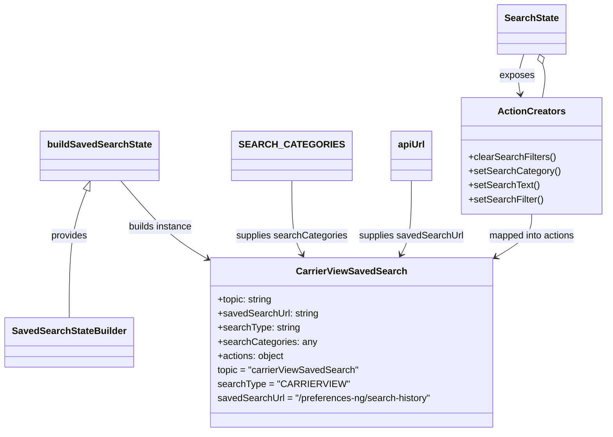

# Diagram: web/portal/src/pages/carrierview/redux/CarrierViewSavedSearchState.js

> Auto-generated by Obscura crawlers

## Mermaid

### SVG

<svg id="container" width="1006.83203125" xmlns="http://www.w3.org/2000/svg" class="classDiagram" height="734" viewBox="0 0 1006.83203125 734" role="graphics-document document" aria-roledescription="class"><g><defs><marker id="container_class-aggregationStart" class="marker aggregation class" refX="18" refY="7" markerWidth="190" markerHeight="240" orient="auto"><path d="M 18,7 L9,13 L1,7 L9,1 Z"></path></marker></defs><defs><marker id="container_class-aggregationEnd" class="marker aggregation class" refX="1" refY="7" markerWidth="20" markerHeight="28" orient="auto"><path d="M 18,7 L9,13 L1,7 L9,1 Z"></path></marker></defs><defs><marker id="container_class-extensionStart" class="marker extension class" refX="18" refY="7" markerWidth="190" markerHeight="240" orient="auto"><path d="M 1,7 L18,13 V 1 Z"></path></marker></defs><defs><marker id="container_class-extensionEnd" class="marker extension class" refX="1" refY="7" markerWidth="20" markerHeight="28" orient="auto"><path d="M 1,1 V 13 L18,7 Z"></path></marker></defs><defs><marker id="container_class-compositionStart" class="marker composition class" refX="18" refY="7" markerWidth="190" markerHeight="240" orient="auto"><path d="M 18,7 L9,13 L1,7 L9,1 Z"></path></marker></defs><defs><marker id="container_class-compositionEnd" class="marker composition class" refX="1" refY="7" markerWidth="20" markerHeight="28" orient="auto"><path d="M 18,7 L9,13 L1,7 L9,1 Z"></path></marker></defs><defs><marker id="container_class-dependencyStart" class="marker dependency class" refX="6" refY="7" markerWidth="190" markerHeight="240" orient="auto"><path d="M 5,7 L9,13 L1,7 L9,1 Z"></path></marker></defs><defs><marker id="container_class-dependencyEnd" class="marker dependency class" refX="13" refY="7" markerWidth="20" markerHeight="28" orient="auto"><path d="M 18,7 L9,13 L14,7 L9,1 Z"></path></marker></defs><defs><marker id="container_class-lollipopStart" class="marker lollipop class" refX="13" refY="7" markerWidth="190" markerHeight="240" orient="auto"><circle stroke="black" fill="transparent" cx="7" cy="7" r="6"></circle></marker></defs><defs><marker id="container_class-lollipopEnd" class="marker lollipop class" refX="1" refY="7" markerWidth="190" markerHeight="240" orient="auto"><circle stroke="black" fill="transparent" cx="7" cy="7" r="6"></circle></marker></defs><g class="root"><g class="clusters"></g><g class="edgePaths"><path d="M143.164,323.063L138.078,336.052C132.992,349.042,122.82,375.021,117.734,411.177C112.648,447.333,112.648,493.667,112.648,516.833L112.648,540" id="id_buildSavedSearchState_SavedSearchStateBuilder_1" class="edge-thickness-normal edge-pattern-solid relation" style=";;;" data-edge="true" data-et="edge" data-id="id_buildSavedSearchState_SavedSearchStateBuilder_1" data-points="W3sieCI6MTQ5LjQ1MzU4NDU1ODgyMzU0LCJ5IjozMDd9LHsieCI6MTEyLjY0ODQzNzUsInkiOjQwMX0seyJ4IjoxMTIuNjQ4NDM3NSwieSI6NTQwfV0=" marker-start="url(#container_class-extensionStart)"></path><path d="M200.789,307L213.804,322.667C226.819,338.333,252.849,369.667,275.497,391.07C298.145,412.474,317.411,423.948,327.044,429.685L336.677,435.422" id="id_buildSavedSearchState_CarrierViewSavedSearch_2" class="edge-thickness-normal edge-pattern-solid relation" style=";;;" data-edge="true" data-et="edge" data-id="id_buildSavedSearchState_CarrierViewSavedSearch_2" data-points="W3sieCI6MjAwLjc4OTQ2NDYxMzk3MDU4LCJ5IjozMDd9LHsieCI6Mjc4Ljg3ODkwNjI1LCJ5Ijo0MDF9LHsieCI6MzQxLjgzMjAzMTI1LCJ5Ijo0MzguNDkxNTk0MjYyNTA1Nzd9XQ==" marker-end="url(#container_class-dependencyEnd)"></path><path d="M481.199,307L481.199,322.667C481.199,338.333,481.199,369.667,484.171,390.628C487.143,411.589,493.088,422.179,496.06,427.473L499.032,432.768" id="id_SEARCH_CATEGORIES_CarrierViewSavedSearch_3" class="edge-thickness-normal edge-pattern-solid relation" style=";;;" data-edge="true" data-et="edge" data-id="id_SEARCH_CATEGORIES_CarrierViewSavedSearch_3" data-points="W3sieCI6NDgxLjE5OTIxODc1LCJ5IjozMDd9LHsieCI6NDgxLjE5OTIxODc1LCJ5Ijo0MDF9LHsieCI6NTAxLjk2ODU5ODkyOTU1OCwieSI6NDM4fV0=" marker-end="url(#container_class-dependencyEnd)"></path><path d="M684.402,307L684.402,322.667C684.402,338.333,684.402,369.667,681.43,390.628C678.458,411.589,672.514,422.179,669.542,427.473L666.57,432.768" id="id_apiUrl_CarrierViewSavedSearch_4" class="edge-thickness-normal edge-pattern-solid relation" style=";;;" data-edge="true" data-et="edge" data-id="id_apiUrl_CarrierViewSavedSearch_4" data-points="W3sieCI6Njg0LjQwMjM0Mzc1LCJ5IjozMDd9LHsieCI6Njg0LjQwMjM0Mzc1LCJ5Ijo0MDF9LHsieCI6NjYzLjYzMjk2MzU3MDQ0MiwieSI6NDM4fV0=" marker-end="url(#container_class-dependencyEnd)"></path><path d="M870.583,92L868.654,98.167C866.725,104.333,862.866,116.667,861.879,128.016C860.892,139.366,862.775,149.731,863.717,154.914L864.659,160.097" id="id_SearchState_ActionCreators_5" class="edge-thickness-normal edge-pattern-solid relation" style=";;;" data-edge="true" data-et="edge" data-id="id_SearchState_ActionCreators_5" data-points="W3sieCI6ODcwLjU4MzExOTA2NjQ1NTcsInkiOjkyfSx7IngiOjg1OS4wMDc4MTI1LCJ5IjoxMjl9LHsieCI6ODY1LjczMTcwMzgxNDMzODMsInkiOjE2Nn1d" marker-end="url(#container_class-dependencyEnd)"></path><path d="M883.723,364L883.723,370.167C883.723,376.333,883.723,388.667,874.327,400.485C864.932,412.302,846.141,423.605,836.745,429.256L827.35,434.907" id="id_ActionCreators_CarrierViewSavedSearch_6" class="edge-thickness-normal edge-pattern-solid relation" style=";;;" data-edge="true" data-et="edge" data-id="id_ActionCreators_CarrierViewSavedSearch_6" data-points="W3sieCI6ODgzLjcyMjY1NjI1LCJ5IjozNjR9LHsieCI6ODgzLjcyMjY1NjI1LCJ5Ijo0MDF9LHsieCI6ODIyLjIwODIzOTgxMzUzNTksInkiOjQzOH1d" marker-end="url(#container_class-dependencyEnd)"></path><path d="M902.013,108.463L903.083,111.886C904.154,115.309,906.296,122.154,906.246,131.744C906.196,141.333,903.955,153.667,902.834,159.833L901.714,166" id="id_SearchState_ActionCreators_7" class="edge-thickness-normal edge-pattern-solid relation" style=";;;" data-edge="true" data-et="edge" data-id="id_SearchState_ActionCreators_7" data-points="W3sieCI6ODk2Ljg2MjE5MzQzMzU0NDMsInkiOjkyfSx7IngiOjkwOC40Mzc1LCJ5IjoxMjl9LHsieCI6OTAxLjcxMzYwODY4NTY2MTcsInkiOjE2Nn1d" marker-start="url(#container_class-aggregationStart)"></path></g><g class="edgeLabels"><g class="edgeLabel" transform="translate(112.6484375, 401)"><g class="label" data-id="id_buildSavedSearchState_SavedSearchStateBuilder_1" transform="translate(-31.3125, -12)"><foreignObject width="62.625" height="24">

provides

</foreignObject></g></g><g class="edgeLabel" transform="translate(263.24465, 382.1803)"><g class="label" data-id="id_buildSavedSearchState_CarrierViewSavedSearch_2" transform="translate(-55.1875, -12)"><foreignObject width="110.375" height="24">

builds instance

</foreignObject></g></g><g class="edgeLabel" transform="translate(481.19921875, 401)"><g class="label" data-id="id_SEARCH_CATEGORIES_CarrierViewSavedSearch_3" transform="translate(-94.46875, -12)"><foreignObject width="188.9375" height="24">

supplies searchCategories

</foreignObject></g></g><g class="edgeLabel" transform="translate(684.40234375, 401)"><g class="label" data-id="id_apiUrl_CarrierViewSavedSearch_4" transform="translate(-88.734375, -12)"><foreignObject width="177.46875" height="24">

supplies savedSearchUrl

</foreignObject></g></g><g class="edgeLabel" transform="translate(859.18134, 128.44531)"><g class="label" data-id="id_SearchState_ActionCreators_5" transform="translate(-29.4296875, -12)"><foreignObject width="58.859375" height="24">

exposes

</foreignObject></g></g><g class="edgeLabel" transform="translate(883.72265625, 401)"><g class="label" data-id="id_ActionCreators_CarrierViewSavedSearch_6" transform="translate(-74.8984375, -12)"><foreignObject width="149.796875" height="24">

mapped into actions

</foreignObject></g></g><g class="edgeLabel"><g class="label" data-id="id_SearchState_ActionCreators_7" transform="translate(0, 0)"><foreignObject width="0" height="0">

</foreignObject></g></g></g><g class="nodes"><g class="node default" id="classId-buildSavedSearchState-0" transform="translate(165.8984375, 265)"><g class="basic label-container"><path d="M-96.8671875 -42 L96.8671875 -42 L96.8671875 42 L-96.8671875 42" stroke="none" stroke-width="0" fill="#ECECFF" style=""></path><path d="M-96.8671875 -42 C-41.23298746580006 -42, 14.401212568399885 -42, 96.8671875 -42 M-96.8671875 -42 C-46.90874651501328 -42, 3.0496944699734456 -42, 96.8671875 -42 M96.8671875 -42 C96.8671875 -12.604369544139562, 96.8671875 16.791260911720876, 96.8671875 42 M96.8671875 -42 C96.8671875 -8.448283887383546, 96.8671875 25.103432225232908, 96.8671875 42 M96.8671875 42 C30.17130458508916 42, -36.52457832982168 42, -96.8671875 42 M96.8671875 42 C35.40533316770502 42, -26.056521164589967 42, -96.8671875 42 M-96.8671875 42 C-96.8671875 19.0521205679938, -96.8671875 -3.8957588640124, -96.8671875 -42 M-96.8671875 42 C-96.8671875 14.664057059161902, -96.8671875 -12.671885881676197, -96.8671875 -42" stroke="#9370DB" stroke-width="1.3" fill="none" stroke-dasharray="0 0" style=""></path></g><g class="annotation-group text" transform="translate(0, -18)"></g><g class="label-group text" transform="translate(-84.8671875, -18)"><g class="label" style="font-weight: bolder" transform="translate(0,-12)"><foreignObject width="169.734375" height="24">

buildSavedSearchState

</foreignObject></g></g><g class="members-group text" transform="translate(-84.8671875, 30)"></g><g class="methods-group text" transform="translate(-84.8671875, 60)"></g><g class="divider" style=""><path d="M-96.8671875 6 C-46.58507789718644 6, 3.6970317056271256 6, 96.8671875 6 M-96.8671875 6 C-50.48679572400212 6, -4.1064039480042425 6, 96.8671875 6" stroke="#9370DB" stroke-width="1.3" fill="none" stroke-dasharray="0 0" style=""></path></g><g class="divider" style=""><path d="M-96.8671875 24 C-56.72029664277809 24, -16.573405785556176 24, 96.8671875 24 M-96.8671875 24 C-40.54980873796331 24, 15.767570024073379 24, 96.8671875 24" stroke="#9370DB" stroke-width="1.3" fill="none" stroke-dasharray="0 0" style=""></path></g></g><g class="node default" id="classId-SavedSearchStateBuilder-1" transform="translate(112.6484375, 582)"><g class="basic label-container"><path d="M-104.6484375 -42 L104.6484375 -42 L104.6484375 42 L-104.6484375 42" stroke="none" stroke-width="0" fill="#ECECFF" style=""></path><path d="M-104.6484375 -42 C-61.65048474636942 -42, -18.652531992738844 -42, 104.6484375 -42 M-104.6484375 -42 C-54.09993651552043 -42, -3.551435531040866 -42, 104.6484375 -42 M104.6484375 -42 C104.6484375 -18.535318168932744, 104.6484375 4.929363662134513, 104.6484375 42 M104.6484375 -42 C104.6484375 -15.582933681394156, 104.6484375 10.834132637211688, 104.6484375 42 M104.6484375 42 C52.901527467335534 42, 1.1546174346710671 42, -104.6484375 42 M104.6484375 42 C26.429066315246132 42, -51.790304869507736 42, -104.6484375 42 M-104.6484375 42 C-104.6484375 22.62933774167883, -104.6484375 3.2586754833576634, -104.6484375 -42 M-104.6484375 42 C-104.6484375 11.046779383747424, -104.6484375 -19.906441232505152, -104.6484375 -42" stroke="#9370DB" stroke-width="1.3" fill="none" stroke-dasharray="0 0" style=""></path></g><g class="annotation-group text" transform="translate(0, -18)"></g><g class="label-group text" transform="translate(-92.6484375, -18)"><g class="label" style="font-weight: bolder" transform="translate(0,-12)"><foreignObject width="185.296875" height="24">

SavedSearchStateBuilder

</foreignObject></g></g><g class="members-group text" transform="translate(-92.6484375, 30)"></g><g class="methods-group text" transform="translate(-92.6484375, 60)"></g><g class="divider" style=""><path d="M-104.6484375 6 C-44.854875583623546 6, 14.938686332752908 6, 104.6484375 6 M-104.6484375 6 C-53.151473836009544 6, -1.6545101720190871 6, 104.6484375 6" stroke="#9370DB" stroke-width="1.3" fill="none" stroke-dasharray="0 0" style=""></path></g><g class="divider" style=""><path d="M-104.6484375 24 C-49.68966299000117 24, 5.269111519997665 24, 104.6484375 24 M-104.6484375 24 C-37.28193141293936 24, 30.084574674121285 24, 104.6484375 24" stroke="#9370DB" stroke-width="1.3" fill="none" stroke-dasharray="0 0" style=""></path></g></g><g class="node default" id="classId-SEARCH_CATEGORIES-2" transform="translate(481.19921875, 265)"><g class="basic label-container"><path d="M-88.1171875 -42 L88.1171875 -42 L88.1171875 42 L-88.1171875 42" stroke="none" stroke-width="0" fill="#ECECFF" style=""></path><path d="M-88.1171875 -42 C-23.547760563601287 -42, 41.02166637279743 -42, 88.1171875 -42 M-88.1171875 -42 C-20.667403294189967 -42, 46.782380911620066 -42, 88.1171875 -42 M88.1171875 -42 C88.1171875 -23.963999880740836, 88.1171875 -5.927999761481672, 88.1171875 42 M88.1171875 -42 C88.1171875 -10.605372718271859, 88.1171875 20.789254563456282, 88.1171875 42 M88.1171875 42 C44.177675927646405 42, 0.23816435529280966 42, -88.1171875 42 M88.1171875 42 C25.86304554675643 42, -36.39109640648714 42, -88.1171875 42 M-88.1171875 42 C-88.1171875 20.13129668927139, -88.1171875 -1.7374066214572181, -88.1171875 -42 M-88.1171875 42 C-88.1171875 20.972181992127837, -88.1171875 -0.05563601574432653, -88.1171875 -42" stroke="#9370DB" stroke-width="1.3" fill="none" stroke-dasharray="0 0" style=""></path></g><g class="annotation-group text" transform="translate(0, -18)"></g><g class="label-group text" transform="translate(-76.1171875, -18)"><g class="label" style="font-weight: bolder" transform="translate(0,-12)"><foreignObject width="152.234375" height="24">

SEARCH_CATEGORIES

</foreignObject></g></g><g class="members-group text" transform="translate(-76.1171875, 30)"></g><g class="methods-group text" transform="translate(-76.1171875, 60)"></g><g class="divider" style=""><path d="M-88.1171875 6 C-39.532579007908204 6, 9.052029484183592 6, 88.1171875 6 M-88.1171875 6 C-33.012666609134165 6, 22.09185428173167 6, 88.1171875 6" stroke="#9370DB" stroke-width="1.3" fill="none" stroke-dasharray="0 0" style=""></path></g><g class="divider" style=""><path d="M-88.1171875 24 C-27.477902156231615 24, 33.16138318753677 24, 88.1171875 24 M-88.1171875 24 C-50.34033773425097 24, -12.563487968501946 24, 88.1171875 24" stroke="#9370DB" stroke-width="1.3" fill="none" stroke-dasharray="0 0" style=""></path></g></g><g class="node default" id="classId-apiUrl-3" transform="translate(684.40234375, 265)"><g class="basic label-container"><path d="M-34.2109375 -42 L34.2109375 -42 L34.2109375 42 L-34.2109375 42" stroke="none" stroke-width="0" fill="#ECECFF" style=""></path><path d="M-34.2109375 -42 C-7.164823914227632 -42, 19.881289671544735 -42, 34.2109375 -42 M-34.2109375 -42 C-13.566602155063148 -42, 7.077733189873705 -42, 34.2109375 -42 M34.2109375 -42 C34.2109375 -14.169316974055068, 34.2109375 13.661366051889864, 34.2109375 42 M34.2109375 -42 C34.2109375 -15.44611768560203, 34.2109375 11.107764628795941, 34.2109375 42 M34.2109375 42 C11.699556627139575 42, -10.81182424572085 42, -34.2109375 42 M34.2109375 42 C9.22094792419525 42, -15.769041651609498 42, -34.2109375 42 M-34.2109375 42 C-34.2109375 17.483791295577618, -34.2109375 -7.032417408844765, -34.2109375 -42 M-34.2109375 42 C-34.2109375 23.611135541874795, -34.2109375 5.22227108374959, -34.2109375 -42" stroke="#9370DB" stroke-width="1.3" fill="none" stroke-dasharray="0 0" style=""></path></g><g class="annotation-group text" transform="translate(0, -18)"></g><g class="label-group text" transform="translate(-22.2109375, -18)"><g class="label" style="font-weight: bolder" transform="translate(0,-12)"><foreignObject width="44.421875" height="24">

apiUrl

</foreignObject></g></g><g class="members-group text" transform="translate(-22.2109375, 30)"></g><g class="methods-group text" transform="translate(-22.2109375, 60)"></g><g class="divider" style=""><path d="M-34.2109375 6 C-13.952685679904441 6, 6.305566140191118 6, 34.2109375 6 M-34.2109375 6 C-7.437196900431847 6, 19.336543699136307 6, 34.2109375 6" stroke="#9370DB" stroke-width="1.3" fill="none" stroke-dasharray="0 0" style=""></path></g><g class="divider" style=""><path d="M-34.2109375 24 C-15.602785874145695 24, 3.0053657517086094 24, 34.2109375 24 M-34.2109375 24 C-9.256063493410231 24, 15.698810513179538 24, 34.2109375 24" stroke="#9370DB" stroke-width="1.3" fill="none" stroke-dasharray="0 0" style=""></path></g></g><g class="node default" id="classId-SearchState-4" transform="translate(883.72265625, 50)"><g class="basic label-container"><path d="M-56.03125 -42 L56.03125 -42 L56.03125 42 L-56.03125 42" stroke="none" stroke-width="0" fill="#ECECFF" style=""></path><path d="M-56.03125 -42 C-17.00227091841529 -42, 22.026708163169417 -42, 56.03125 -42 M-56.03125 -42 C-27.631180853401073 -42, 0.768888293197854 -42, 56.03125 -42 M56.03125 -42 C56.03125 -25.0404070860929, 56.03125 -8.080814172185796, 56.03125 42 M56.03125 -42 C56.03125 -19.0777850283755, 56.03125 3.844429943248997, 56.03125 42 M56.03125 42 C28.320256547232788 42, 0.6092630944655753 42, -56.03125 42 M56.03125 42 C20.01579473952917 42, -15.99966052094166 42, -56.03125 42 M-56.03125 42 C-56.03125 10.48977504842009, -56.03125 -21.02044990315982, -56.03125 -42 M-56.03125 42 C-56.03125 13.723414336197411, -56.03125 -14.553171327605178, -56.03125 -42" stroke="#9370DB" stroke-width="1.3" fill="none" stroke-dasharray="0 0" style=""></path></g><g class="annotation-group text" transform="translate(0, -18)"></g><g class="label-group text" transform="translate(-44.03125, -18)"><g class="label" style="font-weight: bolder" transform="translate(0,-12)"><foreignObject width="88.0625" height="24">

SearchState

</foreignObject></g></g><g class="members-group text" transform="translate(-44.03125, 30)"></g><g class="methods-group text" transform="translate(-44.03125, 60)"></g><g class="divider" style=""><path d="M-56.03125 6 C-31.2530933240566 6, -6.4749366481132 6, 56.03125 6 M-56.03125 6 C-29.07665423713035 6, -2.1220584742606974 6, 56.03125 6" stroke="#9370DB" stroke-width="1.3" fill="none" stroke-dasharray="0 0" style=""></path></g><g class="divider" style=""><path d="M-56.03125 24 C-12.116889701432498 24, 31.797470597135003 24, 56.03125 24 M-56.03125 24 C-20.906989475847766 24, 14.217271048304468 24, 56.03125 24" stroke="#9370DB" stroke-width="1.3" fill="none" stroke-dasharray="0 0" style=""></path></g></g><g class="node default" id="classId-ActionCreators-5" transform="translate(883.72265625, 265)"><g class="basic label-container"><path d="M-115.109375 -99 L115.109375 -99 L115.109375 99 L-115.109375 99" stroke="none" stroke-width="0" fill="#ECECFF" style=""></path><path d="M-115.109375 -99 C-44.148920804940346 -99, 26.81153339011931 -99, 115.109375 -99 M-115.109375 -99 C-47.30907257882602 -99, 20.491229842347963 -99, 115.109375 -99 M115.109375 -99 C115.109375 -26.32966978564562, 115.109375 46.34066042870876, 115.109375 99 M115.109375 -99 C115.109375 -42.16209902519989, 115.109375 14.675801949600213, 115.109375 99 M115.109375 99 C45.668920112369136 99, -23.771534775261728 99, -115.109375 99 M115.109375 99 C38.21687316769899 99, -38.675628664602016 99, -115.109375 99 M-115.109375 99 C-115.109375 52.81168539438972, -115.109375 6.6233707887794395, -115.109375 -99 M-115.109375 99 C-115.109375 27.34413866067382, -115.109375 -44.31172267865236, -115.109375 -99" stroke="#9370DB" stroke-width="1.3" fill="none" stroke-dasharray="0 0" style=""></path></g><g class="annotation-group text" transform="translate(0, -75)"></g><g class="label-group text" transform="translate(-53.96875, -75)"><g class="label" style="font-weight: bolder" transform="translate(0,-12)"><foreignObject width="107.9375" height="24">

ActionCreators

</foreignObject></g></g><g class="members-group text" transform="translate(-103.109375, -27)"></g><g class="methods-group text" transform="translate(-103.109375, 3)"><g class="label" style="" transform="translate(0,-12)"><foreignObject width="146.921875" height="24">

+clearSearchFilters()

</foreignObject></g><g class="label" style="" transform="translate(0,12)"><foreignObject width="152.25" height="24">

+setSearchCategory()

</foreignObject></g><g class="label" style="" transform="translate(0,36)"><foreignObject width="118.53125" height="24">

+setSearchText()

</foreignObject></g><g class="label" style="" transform="translate(0,60)"><foreignObject width="125.953125" height="24">

+setSearchFilter()

</foreignObject></g></g><g class="divider" style=""><path d="M-115.109375 -51 C-50.05007559942142 -51, 15.009223801157162 -51, 115.109375 -51 M-115.109375 -51 C-58.376549320287374 -51, -1.6437236405747484 -51, 115.109375 -51" stroke="#9370DB" stroke-width="1.3" fill="none" stroke-dasharray="0 0" style=""></path></g><g class="divider" style=""><path d="M-115.109375 -27 C-42.32250329395778 -27, 30.46436841208444 -27, 115.109375 -27 M-115.109375 -27 C-60.724403350194116 -27, -6.339431700388232 -27, 115.109375 -27" stroke="#9370DB" stroke-width="1.3" fill="none" stroke-dasharray="0 0" style=""></path></g></g><g class="node default" id="classId-CarrierViewSavedSearch-6" transform="translate(582.80078125, 582)"><g class="basic label-container"><path d="M-240.96875 -144 L240.96875 -144 L240.96875 144 L-240.96875 144" stroke="none" stroke-width="0" fill="#ECECFF" style=""></path><path d="M-240.96875 -144 C-110.40477929208836 -144, 20.159191415823273 -144, 240.96875 -144 M-240.96875 -144 C-138.3349905016657 -144, -35.70123100333137 -144, 240.96875 -144 M240.96875 -144 C240.96875 -56.995511285202824, 240.96875 30.008977429594353, 240.96875 144 M240.96875 -144 C240.96875 -54.896622249006654, 240.96875 34.20675550198669, 240.96875 144 M240.96875 144 C50.62480817048228 144, -139.71913365903544 144, -240.96875 144 M240.96875 144 C102.89471291389543 144, -35.179324172209135 144, -240.96875 144 M-240.96875 144 C-240.96875 52.07084579404746, -240.96875 -39.858308411905085, -240.96875 -144 M-240.96875 144 C-240.96875 57.859655344794376, -240.96875 -28.280689310411248, -240.96875 -144" stroke="#9370DB" stroke-width="1.3" fill="none" stroke-dasharray="0 0" style=""></path></g><g class="annotation-group text" transform="translate(0, -120)"></g><g class="label-group text" transform="translate(-89.234375, -120)"><g class="label" style="font-weight: bolder" transform="translate(0,-12)"><foreignObject width="178.46875" height="24">

CarrierViewSavedSearch

</foreignObject></g></g><g class="members-group text" transform="translate(-228.96875, -72)"><g class="label" style="" transform="translate(0,-12)"><foreignObject width="94.234375" height="24">

+topic: string

</foreignObject></g><g class="label" style="" transform="translate(0,12)"><foreignObject width="169.890625" height="24">

+savedSearchUrl: string

</foreignObject></g><g class="label" style="" transform="translate(0,36)"><foreignObject width="138.890625" height="24">

+searchType: string

</foreignObject></g><g class="label" style="" transform="translate(0,60)"><foreignObject width="165.421875" height="24">

+searchCategories: any

</foreignObject></g><g class="label" style="" transform="translate(0,84)"><foreignObject width="114.140625" height="24">

+actions: object

</foreignObject></g><g class="label" style="" transform="translate(0,108)"><foreignObject width="239.015625" height="24">

topic = "carrierViewSavedSearch"

</foreignObject></g><g class="label" style="" transform="translate(0,132)"><foreignObject width="206.171875" height="24">

searchType = "CARRIERVIEW"

</foreignObject></g><g class="label" style="" transform="translate(0,156)"><foreignObject width="368.703125" height="24">

savedSearchUrl = "/preferences-ng/search-history"

</foreignObject></g></g><g class="methods-group text" transform="translate(-228.96875, 144)"></g><g class="divider" style=""><path d="M-240.96875 -96 C-109.04142006455075 -96, 22.8859098708985 -96, 240.96875 -96 M-240.96875 -96 C-105.08657918043346 -96, 30.79559163913308 -96, 240.96875 -96" stroke="#9370DB" stroke-width="1.3" fill="none" stroke-dasharray="0 0" style=""></path></g><g class="divider" style=""><path d="M-240.96875 120 C-48.21735425760454 120, 144.53404148479092 120, 240.96875 120 M-240.96875 120 C-68.26362209647814 120, 104.44150580704371 120, 240.96875 120" stroke="#9370DB" stroke-width="1.3" fill="none" stroke-dasharray="0 0" style=""></path></g></g></g></g></g></svg>
