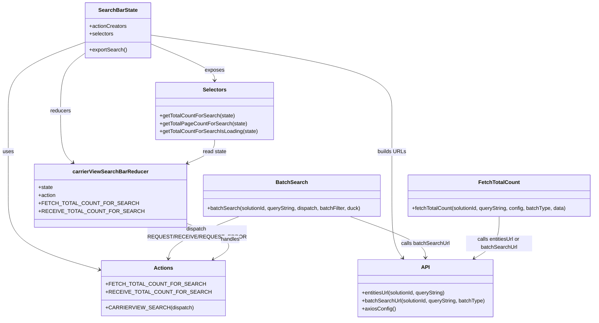

# Diagram: web/portal/src/pages/carrierview/redux/CarrierViewSearchBarState.js


> Auto-generated by Obscura crawlers

## Diagram 1



### SVG

<svg id="container" width="1748.51953125" xmlns="http://www.w3.org/2000/svg" class="classDiagram" height="970" viewBox="0 0 1748.51953125 970" role="graphics-document document" aria-roledescription="class"><style>#container{font-family:"trebuchet ms",verdana,arial,sans-serif;font-size:16px;fill:#333;}@keyframes edge-animation-frame{from{stroke-dashoffset:0;}}@keyframes dash{to{stroke-dashoffset:0;}}#container .edge-animation-slow{stroke-dasharray:9,5!important;stroke-dashoffset:900;animation:dash 50s linear infinite;stroke-linecap:round;}#container .edge-animation-fast{stroke-dasharray:9,5!important;stroke-dashoffset:900;animation:dash 20s linear infinite;stroke-linecap:round;}#container .error-icon{fill:#552222;}#container .error-text{fill:#552222;stroke:#552222;}#container .edge-thickness-normal{stroke-width:1px;}#container .edge-thickness-thick{stroke-width:3.5px;}#container .edge-pattern-solid{stroke-dasharray:0;}#container .edge-thickness-invisible{stroke-width:0;fill:none;}#container .edge-pattern-dashed{stroke-dasharray:3;}#container .edge-pattern-dotted{stroke-dasharray:2;}#container .marker{fill:#333333;stroke:#333333;}#container .marker.cross{stroke:#333333;}#container svg{font-family:"trebuchet ms",verdana,arial,sans-serif;font-size:16px;}#container p{margin:0;}#container g.classGroup text{fill:#9370DB;stroke:none;font-family:"trebuchet ms",verdana,arial,sans-serif;font-size:10px;}#container g.classGroup text .title{font-weight:bolder;}#container .nodeLabel,#container .edgeLabel{color:#131300;}#container .edgeLabel .label rect{fill:#ECECFF;}#container .label text{fill:#131300;}#container .labelBkg{background:#ECECFF;}#container .edgeLabel .label span{background:#ECECFF;}#container .classTitle{font-weight:bolder;}#container .node rect,#container .node circle,#container .node ellipse,#container .node polygon,#container .node path{fill:#ECECFF;stroke:#9370DB;stroke-width:1px;}#container .divider{stroke:#9370DB;stroke-width:1;}#container g.clickable{cursor:pointer;}#container g.classGroup rect{fill:#ECECFF;stroke:#9370DB;}#container g.classGroup line{stroke:#9370DB;stroke-width:1;}#container .classLabel .box{stroke:none;stroke-width:0;fill:#ECECFF;opacity:0.5;}#container .classLabel .label{fill:#9370DB;font-size:10px;}#container .relation{stroke:#333333;stroke-width:1;fill:none;}#container .dashed-line{stroke-dasharray:3;}#container .dotted-line{stroke-dasharray:1 2;}#container #compositionStart,#container .composition{fill:#333333!important;stroke:#333333!important;stroke-width:1;}#container #compositionEnd,#container .composition{fill:#333333!important;stroke:#333333!important;stroke-width:1;}#container #dependencyStart,#container .dependency{fill:#333333!important;stroke:#333333!important;stroke-width:1;}#container #dependencyStart,#container .dependency{fill:#333333!important;stroke:#333333!important;stroke-width:1;}#container #extensionStart,#container .extension{fill:transparent!important;stroke:#333333!important;stroke-width:1;}#container #extensionEnd,#container .extension{fill:transparent!important;stroke:#333333!important;stroke-width:1;}#container #aggregationStart,#container .aggregation{fill:transparent!important;stroke:#333333!important;stroke-width:1;}#container #aggregationEnd,#container .aggregation{fill:transparent!important;stroke:#333333!important;stroke-width:1;}#container #lollipopStart,#container .lollipop{fill:#ECECFF!important;stroke:#333333!important;stroke-width:1;}#container #lollipopEnd,#container .lollipop{fill:#ECECFF!important;stroke:#333333!important;stroke-width:1;}#container .edgeTerminals{font-size:11px;line-height:initial;}#container .classTitleText{text-anchor:middle;font-size:18px;fill:#333;}#container .label-icon{display:inline-block;height:1em;overflow:visible;vertical-align:-0.125em;}#container .node .label-icon path{fill:currentColor;stroke:revert;stroke-width:revert;}#container :root{--mermaid-font-family:"trebuchet ms",verdana,arial,sans-serif;}</style><g><defs><marker id="container_class-aggregationStart" class="marker aggregation class" refX="18" refY="7" markerWidth="190" markerHeight="240" orient="auto"><path d="M 18,7 L9,13 L1,7 L9,1 Z"></path></marker></defs><defs><marker id="container_class-aggregationEnd" class="marker aggregation class" refX="1" refY="7" markerWidth="20" markerHeight="28" orient="auto"><path d="M 18,7 L9,13 L1,7 L9,1 Z"></path></marker></defs><defs><marker id="container_class-extensionStart" class="marker extension class" refX="18" refY="7" markerWidth="190" markerHeight="240" orient="auto"><path d="M 1,7 L18,13 V 1 Z"></path></marker></defs><defs><marker id="container_class-extensionEnd" class="marker extension class" refX="1" refY="7" markerWidth="20" markerHeight="28" orient="auto"><path d="M 1,1 V 13 L18,7 Z"></path></marker></defs><defs><marker id="container_class-compositionStart" class="marker composition class" refX="18" refY="7" markerWidth="190" markerHeight="240" orient="auto"><path d="M 18,7 L9,13 L1,7 L9,1 Z"></path></marker></defs><defs><marker id="container_class-compositionEnd" class="marker composition class" refX="1" refY="7" markerWidth="20" markerHeight="28" orient="auto"><path d="M 18,7 L9,13 L1,7 L9,1 Z"></path></marker></defs><defs><marker id="container_class-dependencyStart" class="marker dependency class" refX="6" refY="7" markerWidth="190" markerHeight="240" orient="auto"><path d="M 5,7 L9,13 L1,7 L9,1 Z"></path></marker></defs><defs><marker id="container_class-dependencyEnd" class="marker dependency class" refX="13" refY="7" markerWidth="20" markerHeight="28" orient="auto"><path d="M 18,7 L9,13 L14,7 L9,1 Z"></path></marker></defs><defs><marker id="container_class-lollipopStart" class="marker lollipop class" refX="13" refY="7" markerWidth="190" markerHeight="240" orient="auto"><circle stroke="black" fill="transparent" cx="7" cy="7" r="6"></circle></marker></defs><defs><marker id="container_class-lollipopEnd" class="marker lollipop class" refX="1" refY="7" markerWidth="190" markerHeight="240" orient="auto"><circle stroke="black" fill="transparent" cx="7" cy="7" r="6"></circle></marker></defs><g class="root"><g class="clusters"></g><g class="edgePaths"><path d="M238.563,129.832L202.884,143.694C167.206,157.555,95.849,185.277,60.171,219.805C24.492,254.333,24.492,295.667,24.492,337C24.492,378.333,24.492,419.667,24.492,462.5C24.492,505.333,24.492,549.667,24.492,596C24.492,642.333,24.492,690.667,69.683,728.837C114.874,767.007,205.256,795.015,250.447,809.019L295.638,823.022" id="id_SearchBarState_Actions_1" class="edge-thickness-normal edge-pattern-solid relation" style=";;;" data-edge="true" data-et="edge" data-id="id_SearchBarState_Actions_1" data-points="W3sieCI6MjM4LjU2MjUsInkiOjEyOS44MzIzMjM2ODg0MDIyNX0seyJ4IjoyNC40OTIxODc1LCJ5IjoyMTN9LHsieCI6MjQuNDkyMTg3NSwieSI6MzM3fSx7IngiOjI0LjQ5MjE4NzUsInkiOjQ2MX0seyJ4IjoyNC40OTIxODc1LCJ5Ijo1OTR9LHsieCI6MjQuNDkyMTg3NSwieSI6NzM5fSx7IngiOjMwMS4zNjkxNDA2MjUsInkiOjgyNC43OTgzNzc0NDI2MjUzfV0=" marker-end="url(#container_class-dependencyEnd)"></path><path d="M433.32,136.732L460.992,149.443C488.664,162.155,544.008,187.577,571.68,205.455C599.352,223.333,599.352,233.667,599.352,238.833L599.352,244" id="id_SearchBarState_Selectors_2" class="edge-thickness-normal edge-pattern-solid relation" style=";;;" data-edge="true" data-et="edge" data-id="id_SearchBarState_Selectors_2" data-points="W3sieCI6NDMzLjMyMDMxMjUsInkiOjEzNi43MzE5NDEzMzQzNjE1Mn0seyJ4Ijo1OTkuMzUxNTYyNSwieSI6MjEzfSx7IngiOjU5OS4zNTE1NjI1LCJ5IjoyNTB9XQ==" marker-end="url(#container_class-dependencyEnd)"></path><path d="M238.563,162.633L226.989,171.027C215.416,179.422,192.27,196.211,180.696,225.272C169.123,254.333,169.123,295.667,169.123,337C169.123,378.333,169.123,419.667,175.34,445.837C181.558,472.008,193.993,483.015,200.21,488.519L206.428,494.023" id="id_SearchBarState_carrierViewSearchBarReducer_3" class="edge-thickness-normal edge-pattern-solid relation" style=";;;" data-edge="true" data-et="edge" data-id="id_SearchBarState_carrierViewSearchBarReducer_3" data-points="W3sieCI6MjM4LjU2MjUsInkiOjE2Mi42MzI3OTkwNTM5ODYwMn0seyJ4IjoxNjkuMTIzMDQ2ODc1LCJ5IjoyMTN9LHsieCI6MTY5LjEyMzA0Njg3NSwieSI6MzM3fSx7IngiOjE2OS4xMjMwNDY4NzUsInkiOjQ2MX0seyJ4IjoyMTAuOTIwMjg5MDAzNzU5NCwieSI6NDk4fV0=" marker-end="url(#container_class-dependencyEnd)"></path><path d="M433.32,106.502L552.507,124.252C671.694,142.001,910.068,177.501,1029.255,215.917C1148.441,254.333,1148.441,295.667,1148.441,337C1148.441,378.333,1148.441,419.667,1148.441,462.5C1148.441,505.333,1148.441,549.667,1148.441,596C1148.441,642.333,1148.441,690.667,1152.643,722.133C1156.844,753.6,1165.247,768.2,1169.448,775.5L1173.649,782.8" id="id_SearchBarState_API_4" class="edge-thickness-normal edge-pattern-solid relation" style=";;;" data-edge="true" data-et="edge" data-id="id_SearchBarState_API_4" data-points="W3sieCI6NDMzLjMyMDMxMjUsInkiOjEwNi41MDE5NjYzNDYxNTM4NX0seyJ4IjoxMTQ4LjQ0MTQwNjI1LCJ5IjoyMTN9LHsieCI6MTE0OC40NDE0MDYyNSwieSI6MzM3fSx7IngiOjExNDguNDQxNDA2MjUsInkiOjQ2MX0seyJ4IjoxMTQ4LjQ0MTQwNjI1LCJ5Ijo1OTR9LHsieCI6MTE0OC40NDE0MDYyNSwieSI6NzM5fSx7IngiOjExNzYuNjQyMTYxNjQ5ODE2MiwieSI6Nzg4fV0=" marker-end="url(#container_class-dependencyEnd)"></path><path d="M1016.438,657L1054.096,670.667C1091.754,684.333,1167.071,711.667,1203.902,732.507C1240.733,753.346,1239.08,767.693,1238.253,774.866L1237.426,782.039" id="id_BatchSearch_API_5" class="edge-thickness-normal edge-pattern-solid relation" style=";;;" data-edge="true" data-et="edge" data-id="id_BatchSearch_API_5" data-points="W3sieCI6MTAxNi40MzgyODEyNSwieSI6NjU3fSx7IngiOjEyNDIuMzg2NzE4NzUsInkiOjczOX0seyJ4IjoxMjM2LjczOTUzMDY3NTU1MTYsInkiOjc4OH1d" marker-end="url(#container_class-dependencyEnd)"></path><path d="M685.171,657L650.967,670.667C616.763,684.333,548.355,711.667,513.216,733.007C478.077,754.348,476.206,769.696,475.271,777.37L474.336,785.044" id="id_BatchSearch_Actions_6" class="edge-thickness-normal edge-pattern-solid relation" style=";;;" data-edge="true" data-et="edge" data-id="id_BatchSearch_Actions_6" data-points="W3sieCI6Njg1LjE3MTQ4NDM3NSwieSI6NjU3fSx7IngiOjQ3OS45NDcyNjU2MjUsInkiOjczOX0seyJ4Ijo0NzMuNjEwMDY0MzM4MjM1MywieSI6NzkxfV0=" marker-end="url(#container_class-dependencyEnd)"></path><path d="M1461.98,657L1461.98,670.667C1461.98,684.333,1461.98,711.667,1448.719,733C1435.457,754.332,1408.933,769.665,1395.671,777.331L1382.409,784.997" id="id_FetchTotalCount_API_7" class="edge-thickness-normal edge-pattern-solid relation" style=";;;" data-edge="true" data-et="edge" data-id="id_FetchTotalCount_API_7" data-points="W3sieCI6MTQ2MS45ODA0Njg3NSwieSI6NjU3fSx7IngiOjE0NjEuOTgwNDY4NzUsInkiOjczOX0seyJ4IjoxMzc3LjIxNDk0NDI3ODQ5MjYsInkiOjc4OH1d" marker-end="url(#container_class-dependencyEnd)"></path><path d="M522.246,674.037L549.691,684.864C577.135,695.692,632.025,717.346,646.078,736.32C660.132,755.294,633.35,771.588,619.959,779.735L606.568,787.881" id="id_carrierViewSearchBarReducer_Actions_8" class="edge-thickness-normal edge-pattern-solid relation" style=";;;" data-edge="true" data-et="edge" data-id="id_carrierViewSearchBarReducer_Actions_8" data-points="W3sieCI6NTIyLjI0NjA5Mzc1LCJ5Ijo2NzQuMDM3MjUwNzc1ODM2NH0seyJ4Ijo2ODYuOTE0MDYyNSwieSI6NzM5fSx7IngiOjYwMS40NDI0OTc3MDIyMDU5LCJ5Ijo3OTF9XQ==" marker-end="url(#container_class-dependencyEnd)"></path><path d="M599.352,424L599.352,430.167C599.352,436.333,599.352,448.667,587.273,460.571C575.195,472.475,551.038,483.95,538.959,489.688L526.881,495.426" id="id_Selectors_carrierViewSearchBarReducer_9" class="edge-thickness-normal edge-pattern-solid relation" style=";;;" data-edge="true" data-et="edge" data-id="id_Selectors_carrierViewSearchBarReducer_9" data-points="W3sieCI6NTk5LjM1MTU2MjUsInkiOjQyNH0seyJ4Ijo1OTkuMzUxNTYyNSwieSI6NDYxfSx7IngiOjUyMS40NjExNzI0NjI0MDYsInkiOjQ5OH1d" marker-end="url(#container_class-dependencyEnd)"></path></g><g class="edgeLabels"><g class="edgeLabel" transform="translate(24.4921875, 461)"><g class="label" data-id="id_SearchBarState_Actions_1" transform="translate(-16.4921875, -12)"><foreignObject width="32.984375" height="24"><div xmlns="http://www.w3.org/1999/xhtml" class="labelBkg" style="display: table-cell; white-space: nowrap; line-height: 1.5; max-width: 200px; text-align: center;"><span class="edgeLabel"><p>uses</p></span></div></foreignObject></g></g><g class="edgeLabel" transform="translate(599.3515625, 213)"><g class="label" data-id="id_SearchBarState_Selectors_2" transform="translate(-29.4296875, -12)"><foreignObject width="58.859375" height="24"><div xmlns="http://www.w3.org/1999/xhtml" class="labelBkg" style="display: table-cell; white-space: nowrap; line-height: 1.5; max-width: 200px; text-align: center;"><span class="edgeLabel"><p>exposes</p></span></div></foreignObject></g></g><g class="edgeLabel" transform="translate(169.123046875, 337)"><g class="label" data-id="id_SearchBarState_carrierViewSearchBarReducer_3" transform="translate(-31.3828125, -12)"><foreignObject width="62.765625" height="24"><div xmlns="http://www.w3.org/1999/xhtml" class="labelBkg" style="display: table-cell; white-space: nowrap; line-height: 1.5; max-width: 200px; text-align: center;"><span class="edgeLabel"><p>reducers</p></span></div></foreignObject></g></g><g class="edgeLabel" transform="translate(1148.44140625, 461)"><g class="label" data-id="id_SearchBarState_API_4" transform="translate(-42.3515625, -12)"><foreignObject width="84.703125" height="24"><div xmlns="http://www.w3.org/1999/xhtml" class="labelBkg" style="display: table-cell; white-space: nowrap; line-height: 1.5; max-width: 200px; text-align: center;"><span class="edgeLabel"><p>builds URLs</p></span></div></foreignObject></g></g><g class="edgeLabel" transform="translate(1152.59521, 706.41335)"><g class="label" data-id="id_BatchSearch_API_5" transform="translate(-73.9453125, -12)"><foreignObject width="147.890625" height="24"><div xmlns="http://www.w3.org/1999/xhtml" class="labelBkg" style="display: table-cell; white-space: nowrap; line-height: 1.5; max-width: 200px; text-align: center;"><span class="edgeLabel"><p>calls batchSearchUrl</p></span></div></foreignObject></g></g><g class="edgeLabel" transform="translate(558.23671, 707.71844)"><g class="label" data-id="id_BatchSearch_Actions_6" transform="translate(-129.5546875, -24)"><foreignObject width="259.109375" height="48"><div xmlns="http://www.w3.org/1999/xhtml" class="labelBkg" style="display: table; white-space: break-spaces; line-height: 1.5; max-width: 200px; text-align: center; width: 200px;"><span class="edgeLabel"><p>dispatch REQUEST/RECEIVE/REQUEST_ERROR</p></span></div></foreignObject></g></g><g class="edgeLabel" transform="translate(1461.98046875, 739)"><g class="label" data-id="id_FetchTotalCount_API_7" transform="translate(-100, -24)"><foreignObject width="200" height="48"><div xmlns="http://www.w3.org/1999/xhtml" class="labelBkg" style="display: table; white-space: break-spaces; line-height: 1.5; max-width: 200px; text-align: center; width: 200px;"><span class="edgeLabel"><p>calls entitiesUrl or batchSearchUrl</p></span></div></foreignObject></g></g><g class="edgeLabel" transform="translate(651.11331, 724.87633)"><g class="label" data-id="id_carrierViewSearchBarReducer_Actions_8" transform="translate(-28.9140625, -12)"><foreignObject width="57.828125" height="24"><div xmlns="http://www.w3.org/1999/xhtml" class="labelBkg" style="display: table-cell; white-space: nowrap; line-height: 1.5; max-width: 200px; text-align: center;"><span class="edgeLabel"><p>handles</p></span></div></foreignObject></g></g><g class="edgeLabel" transform="translate(599.3515625, 461)"><g class="label" data-id="id_Selectors_carrierViewSearchBarReducer_9" transform="translate(-36.4375, -12)"><foreignObject width="72.875" height="24"><div xmlns="http://www.w3.org/1999/xhtml" class="labelBkg" style="display: table-cell; white-space: nowrap; line-height: 1.5; max-width: 200px; text-align: center;"><span class="edgeLabel"><p>read state</p></span></div></foreignObject></g></g></g><g class="nodes"><g class="node default" id="classId-SearchBarState-0" transform="translate(335.94140625, 92)"><g class="basic label-container"><path d="M-97.37890625 -84 L97.37890625 -84 L97.37890625 84 L-97.37890625 84" stroke="none" stroke-width="0" fill="#ECECFF" style=""></path><path d="M-97.37890625 -84 C-40.57981662767923 -84, 16.219272994641543 -84, 97.37890625 -84 M-97.37890625 -84 C-50.340501053502344 -84, -3.302095857004687 -84, 97.37890625 -84 M97.37890625 -84 C97.37890625 -48.50449068416187, 97.37890625 -13.008981368323745, 97.37890625 84 M97.37890625 -84 C97.37890625 -37.630578923230594, 97.37890625 8.738842153538812, 97.37890625 84 M97.37890625 84 C28.867919134067805 84, -39.64306798186439 84, -97.37890625 84 M97.37890625 84 C44.36395378669139 84, -8.65099867661722 84, -97.37890625 84 M-97.37890625 84 C-97.37890625 37.358957965113554, -97.37890625 -9.282084069772893, -97.37890625 -84 M-97.37890625 84 C-97.37890625 30.186279156188988, -97.37890625 -23.627441687622024, -97.37890625 -84" stroke="#9370DB" stroke-width="1.3" fill="none" stroke-dasharray="0 0" style=""></path></g><g class="annotation-group text" transform="translate(0, -60)"></g><g class="label-group text" transform="translate(-56.5546875, -60)"><g class="label" style="font-weight: bolder" transform="translate(0,-12)"><foreignObject width="113.109375" height="24"><div xmlns="http://www.w3.org/1999/xhtml" style="display: table-cell; white-space: nowrap; line-height: 1.5; max-width: 161px; text-align: center;"><span class="nodeLabel markdown-node-label" style=""><p>SearchBarState</p></span></div></foreignObject></g></g><g class="members-group text" transform="translate(-85.37890625, -12)"><g class="label" style="" transform="translate(0,-12)"><foreignObject width="113.078125" height="24"><div xmlns="http://www.w3.org/1999/xhtml" style="display: table-cell; white-space: nowrap; line-height: 1.5; max-width: 170px; text-align: center;"><span class="nodeLabel markdown-node-label" style=""><p>+actionCreators</p></span></div></foreignObject></g><g class="label" style="" transform="translate(0,12)"><foreignObject width="73.453125" height="24"><div xmlns="http://www.w3.org/1999/xhtml" style="display: table-cell; white-space: nowrap; line-height: 1.5; max-width: 131px; text-align: center;"><span class="nodeLabel markdown-node-label" style=""><p>+selectors</p></span></div></foreignObject></g></g><g class="methods-group text" transform="translate(-85.37890625, 60)"><g class="label" style="" transform="translate(0,-12)"><foreignObject width="114.203125" height="24"><div xmlns="http://www.w3.org/1999/xhtml" style="display: table-cell; white-space: nowrap; line-height: 1.5; max-width: 172px; text-align: center;"><span class="nodeLabel markdown-node-label" style=""><p>+exportSearch()</p></span></div></foreignObject></g></g><g class="divider" style=""><path d="M-97.37890625 -36 C-52.43305894929224 -36, -7.487211648584477 -36, 97.37890625 -36 M-97.37890625 -36 C-58.40183529067905 -36, -19.424764331358105 -36, 97.37890625 -36" stroke="#9370DB" stroke-width="1.3" fill="none" stroke-dasharray="0 0" style=""></path></g><g class="divider" style=""><path d="M-97.37890625 36 C-34.926366433104164 36, 27.526173383791672 36, 97.37890625 36 M-97.37890625 36 C-40.5847633133757 36, 16.209379623248594 36, 97.37890625 36" stroke="#9370DB" stroke-width="1.3" fill="none" stroke-dasharray="0 0" style=""></path></g></g><g class="node default" id="classId-carrierViewSearchBarReducer-1" transform="translate(319.3671875, 594)"><g class="basic label-container"><path d="M-202.87890625 -96 L202.87890625 -96 L202.87890625 96 L-202.87890625 96" stroke="none" stroke-width="0" fill="#ECECFF" style=""></path><path d="M-202.87890625 -96 C-108.8016020055407 -96, -14.724297761081402 -96, 202.87890625 -96 M-202.87890625 -96 C-120.63800506700807 -96, -38.39710388401613 -96, 202.87890625 -96 M202.87890625 -96 C202.87890625 -27.302459128445264, 202.87890625 41.39508174310947, 202.87890625 96 M202.87890625 -96 C202.87890625 -31.40251972008349, 202.87890625 33.19496055983302, 202.87890625 96 M202.87890625 96 C51.377943781163594 96, -100.12301868767281 96, -202.87890625 96 M202.87890625 96 C62.24760614139652 96, -78.38369396720697 96, -202.87890625 96 M-202.87890625 96 C-202.87890625 51.99667360658262, -202.87890625 7.9933472131652366, -202.87890625 -96 M-202.87890625 96 C-202.87890625 32.89444453572064, -202.87890625 -30.211110928558725, -202.87890625 -96" stroke="#9370DB" stroke-width="1.3" fill="none" stroke-dasharray="0 0" style=""></path></g><g class="annotation-group text" transform="translate(0, -72)"></g><g class="label-group text" transform="translate(-108.8046875, -72)"><g class="label" style="font-weight: bolder" transform="translate(0,-12)"><foreignObject width="217.609375" height="24"><div xmlns="http://www.w3.org/1999/xhtml" style="display: table-cell; white-space: nowrap; line-height: 1.5; max-width: 265px; text-align: center;"><span class="nodeLabel markdown-node-label" style=""><p>carrierViewSearchBarReducer</p></span></div></foreignObject></g></g><g class="members-group text" transform="translate(-190.87890625, -24)"><g class="label" style="" transform="translate(0,-12)"><foreignObject width="44.09375" height="24"><div xmlns="http://www.w3.org/1999/xhtml" style="display: table-cell; white-space: nowrap; line-height: 1.5; max-width: 101px; text-align: center;"><span class="nodeLabel markdown-node-label" style=""><p>+state</p></span></div></foreignObject></g><g class="label" style="" transform="translate(0,12)"><foreignObject width="53.109375" height="24"><div xmlns="http://www.w3.org/1999/xhtml" style="display: table-cell; white-space: nowrap; line-height: 1.5; max-width: 110px; text-align: center;"><span class="nodeLabel markdown-node-label" style=""><p>+action</p></span></div></foreignObject></g><g class="label" style="" transform="translate(0,36)"><foreignObject width="259.171875" height="24"><div xmlns="http://www.w3.org/1999/xhtml" style="display: table-cell; white-space: nowrap; line-height: 1.5; max-width: 317px; text-align: center;"><span class="nodeLabel markdown-node-label" style=""><p>+FETCH_TOTAL_COUNT_FOR_SEARCH</p></span></div></foreignObject></g><g class="label" style="" transform="translate(0,60)"><foreignObject width="272.953125" height="24"><div xmlns="http://www.w3.org/1999/xhtml" style="display: table-cell; white-space: nowrap; line-height: 1.5; max-width: 330px; text-align: center;"><span class="nodeLabel markdown-node-label" style=""><p>+RECEIVE_TOTAL_COUNT_FOR_SEARCH</p></span></div></foreignObject></g></g><g class="methods-group text" transform="translate(-190.87890625, 96)"></g><g class="divider" style=""><path d="M-202.87890625 -48 C-68.35323731126405 -48, 66.1724316274719 -48, 202.87890625 -48 M-202.87890625 -48 C-92.2619529310032 -48, 18.355000387993613 -48, 202.87890625 -48" stroke="#9370DB" stroke-width="1.3" fill="none" stroke-dasharray="0 0" style=""></path></g><g class="divider" style=""><path d="M-202.87890625 72 C-110.76423691961253 72, -18.649567589225057 72, 202.87890625 72 M-202.87890625 72 C-84.1594996169513 72, 34.55990701609741 72, 202.87890625 72" stroke="#9370DB" stroke-width="1.3" fill="none" stroke-dasharray="0 0" style=""></path></g></g><g class="node default" id="classId-Actions-2" transform="translate(463.373046875, 875)"><g class="basic label-container"><path d="M-162.00390625 -84 L162.00390625 -84 L162.00390625 84 L-162.00390625 84" stroke="none" stroke-width="0" fill="#ECECFF" style=""></path><path d="M-162.00390625 -84 C-94.46807701571306 -84, -26.932247781426128 -84, 162.00390625 -84 M-162.00390625 -84 C-41.007606313402945 -84, 79.98869362319411 -84, 162.00390625 -84 M162.00390625 -84 C162.00390625 -34.937467391859656, 162.00390625 14.125065216280689, 162.00390625 84 M162.00390625 -84 C162.00390625 -49.39360156355844, 162.00390625 -14.787203127116882, 162.00390625 84 M162.00390625 84 C67.87323175659571 84, -26.25744273680857 84, -162.00390625 84 M162.00390625 84 C82.39962881624736 84, 2.795351382494715 84, -162.00390625 84 M-162.00390625 84 C-162.00390625 19.084477536028018, -162.00390625 -45.831044927943964, -162.00390625 -84 M-162.00390625 84 C-162.00390625 20.78296538034109, -162.00390625 -42.43406923931782, -162.00390625 -84" stroke="#9370DB" stroke-width="1.3" fill="none" stroke-dasharray="0 0" style=""></path></g><g class="annotation-group text" transform="translate(0, -60)"></g><g class="label-group text" transform="translate(-27.0546875, -60)"><g class="label" style="font-weight: bolder" transform="translate(0,-12)"><foreignObject width="54.109375" height="24"><div xmlns="http://www.w3.org/1999/xhtml" style="display: table-cell; white-space: nowrap; line-height: 1.5; max-width: 103px; text-align: center;"><span class="nodeLabel markdown-node-label" style=""><p>Actions</p></span></div></foreignObject></g></g><g class="members-group text" transform="translate(-150.00390625, -12)"><g class="label" style="" transform="translate(0,-12)"><foreignObject width="259.171875" height="24"><div xmlns="http://www.w3.org/1999/xhtml" style="display: table-cell; white-space: nowrap; line-height: 1.5; max-width: 317px; text-align: center;"><span class="nodeLabel markdown-node-label" style=""><p>+FETCH_TOTAL_COUNT_FOR_SEARCH</p></span></div></foreignObject></g><g class="label" style="" transform="translate(0,12)"><foreignObject width="272.953125" height="24"><div xmlns="http://www.w3.org/1999/xhtml" style="display: table-cell; white-space: nowrap; line-height: 1.5; max-width: 330px; text-align: center;"><span class="nodeLabel markdown-node-label" style=""><p>+RECEIVE_TOTAL_COUNT_FOR_SEARCH</p></span></div></foreignObject></g></g><g class="methods-group text" transform="translate(-150.00390625, 60)"><g class="label" style="" transform="translate(0,-12)"><foreignObject width="239.109375" height="24"><div xmlns="http://www.w3.org/1999/xhtml" style="display: table-cell; white-space: nowrap; line-height: 1.5; max-width: 296px; text-align: center;"><span class="nodeLabel markdown-node-label" style=""><p>+CARRIERVIEW_SEARCH(dispatch)</p></span></div></foreignObject></g></g><g class="divider" style=""><path d="M-162.00390625 -36 C-57.05520041936917 -36, 47.89350541126166 -36, 162.00390625 -36 M-162.00390625 -36 C-69.32852002274873 -36, 23.346866204502533 -36, 162.00390625 -36" stroke="#9370DB" stroke-width="1.3" fill="none" stroke-dasharray="0 0" style=""></path></g><g class="divider" style=""><path d="M-162.00390625 36 C-45.06367701615763 36, 71.87655221768475 36, 162.00390625 36 M-162.00390625 36 C-49.8544881734893 36, 62.2949299030214 36, 162.00390625 36" stroke="#9370DB" stroke-width="1.3" fill="none" stroke-dasharray="0 0" style=""></path></g></g><g class="node default" id="classId-API-3" transform="translate(1226.712890625, 875)"><g class="basic label-container"><path d="M-207.06640625 -87 L207.06640625 -87 L207.06640625 87 L-207.06640625 87" stroke="none" stroke-width="0" fill="#ECECFF" style=""></path><path d="M-207.06640625 -87 C-42.63398353970922 -87, 121.79843917058156 -87, 207.06640625 -87 M-207.06640625 -87 C-122.40373347874635 -87, -37.74106070749269 -87, 207.06640625 -87 M207.06640625 -87 C207.06640625 -26.63517792706577, 207.06640625 33.72964414586846, 207.06640625 87 M207.06640625 -87 C207.06640625 -23.996736515336394, 207.06640625 39.00652696932721, 207.06640625 87 M207.06640625 87 C89.077254869743 87, -28.911896510513998 87, -207.06640625 87 M207.06640625 87 C88.94727069676878 87, -29.171864856462435 87, -207.06640625 87 M-207.06640625 87 C-207.06640625 19.613357174795397, -207.06640625 -47.77328565040921, -207.06640625 -87 M-207.06640625 87 C-207.06640625 21.74928689210452, -207.06640625 -43.50142621579096, -207.06640625 -87" stroke="#9370DB" stroke-width="1.3" fill="none" stroke-dasharray="0 0" style=""></path></g><g class="annotation-group text" transform="translate(0, -63)"></g><g class="label-group text" transform="translate(-11.8671875, -63)"><g class="label" style="font-weight: bolder" transform="translate(0,-12)"><foreignObject width="23.734375" height="24"><div xmlns="http://www.w3.org/1999/xhtml" style="display: table-cell; white-space: nowrap; line-height: 1.5; max-width: 73px; text-align: center;"><span class="nodeLabel markdown-node-label" style=""><p>API</p></span></div></foreignObject></g></g><g class="members-group text" transform="translate(-195.06640625, -15)"></g><g class="methods-group text" transform="translate(-195.06640625, 15)"><g class="label" style="" transform="translate(0,-12)"><foreignObject width="261.40625" height="24"><div xmlns="http://www.w3.org/1999/xhtml" style="display: table-cell; white-space: nowrap; line-height: 1.5; max-width: 319px; text-align: center;"><span class="nodeLabel markdown-node-label" style=""><p>+entitiesUrl(solutionId, queryString)</p></span></div></foreignObject></g><g class="label" style="" transform="translate(0,12)"><foreignObject width="378.265625" height="24"><div xmlns="http://www.w3.org/1999/xhtml" style="display: table-cell; white-space: nowrap; line-height: 1.5; max-width: 436px; text-align: center;"><span class="nodeLabel markdown-node-label" style=""><p>+batchSearchUrl(solutionId, queryString, batchType)</p></span></div></foreignObject></g><g class="label" style="" transform="translate(0,36)"><foreignObject width="100.796875" height="24"><div xmlns="http://www.w3.org/1999/xhtml" style="display: table-cell; white-space: nowrap; line-height: 1.5; max-width: 158px; text-align: center;"><span class="nodeLabel markdown-node-label" style=""><p>+axiosConfig()</p></span></div></foreignObject></g></g><g class="divider" style=""><path d="M-207.06640625 -39 C-92.73997854469064 -39, 21.586449160618713 -39, 207.06640625 -39 M-207.06640625 -39 C-89.86435053942789 -39, 27.337705171144222 -39, 207.06640625 -39" stroke="#9370DB" stroke-width="1.3" fill="none" stroke-dasharray="0 0" style=""></path></g><g class="divider" style=""><path d="M-207.06640625 -15 C-47.57485738274224 -15, 111.91669148451552 -15, 207.06640625 -15 M-207.06640625 -15 C-64.58247120106594 -15, 77.90146384786811 -15, 207.06640625 -15" stroke="#9370DB" stroke-width="1.3" fill="none" stroke-dasharray="0 0" style=""></path></g></g><g class="node default" id="classId-BatchSearch-4" transform="translate(842.84375, 594)"><g class="basic label-container"><path d="M-270.59765625 -63 L270.59765625 -63 L270.59765625 63 L-270.59765625 63" stroke="none" stroke-width="0" fill="#ECECFF" style=""></path><path d="M-270.59765625 -63 C-127.55813822036157 -63, 15.48137980927686 -63, 270.59765625 -63 M-270.59765625 -63 C-59.19082012074563 -63, 152.21601600850875 -63, 270.59765625 -63 M270.59765625 -63 C270.59765625 -23.367806954317736, 270.59765625 16.26438609136453, 270.59765625 63 M270.59765625 -63 C270.59765625 -29.18375207742578, 270.59765625 4.632495845148441, 270.59765625 63 M270.59765625 63 C77.67842756311853 63, -115.24080112376294 63, -270.59765625 63 M270.59765625 63 C99.67632811994613 63, -71.24500001010773 63, -270.59765625 63 M-270.59765625 63 C-270.59765625 33.76896879527198, -270.59765625 4.537937590543962, -270.59765625 -63 M-270.59765625 63 C-270.59765625 30.214941416036517, -270.59765625 -2.5701171679269663, -270.59765625 -63" stroke="#9370DB" stroke-width="1.3" fill="none" stroke-dasharray="0 0" style=""></path></g><g class="annotation-group text" transform="translate(0, -39)"></g><g class="label-group text" transform="translate(-45.4296875, -39)"><g class="label" style="font-weight: bolder" transform="translate(0,-12)"><foreignObject width="90.859375" height="24"><div xmlns="http://www.w3.org/1999/xhtml" style="display: table-cell; white-space: nowrap; line-height: 1.5; max-width: 140px; text-align: center;"><span class="nodeLabel markdown-node-label" style=""><p>BatchSearch</p></span></div></foreignObject></g></g><g class="members-group text" transform="translate(-258.59765625, 9)"></g><g class="methods-group text" transform="translate(-258.59765625, 39)"><g class="label" style="" transform="translate(0,-12)"><foreignObject width="471.765625" height="24"><div xmlns="http://www.w3.org/1999/xhtml" style="display: table-cell; white-space: nowrap; line-height: 1.5; max-width: 529px; text-align: center;"><span class="nodeLabel markdown-node-label" style=""><p>+batchSearch(solutionId, queryString, dispatch, batchFilter, duck)</p></span></div></foreignObject></g></g><g class="divider" style=""><path d="M-270.59765625 -15 C-136.755232083084 -15, -2.912807916167992 -15, 270.59765625 -15 M-270.59765625 -15 C-137.21800733052956 -15, -3.8383584110591187 -15, 270.59765625 -15" stroke="#9370DB" stroke-width="1.3" fill="none" stroke-dasharray="0 0" style=""></path></g><g class="divider" style=""><path d="M-270.59765625 9 C-61.90982863880504 9, 146.77799897238992 9, 270.59765625 9 M-270.59765625 9 C-115.59961390727085 9, 39.3984284354583 9, 270.59765625 9" stroke="#9370DB" stroke-width="1.3" fill="none" stroke-dasharray="0 0" style=""></path></g></g><g class="node default" id="classId-FetchTotalCount-5" transform="translate(1461.98046875, 594)"><g class="basic label-container"><path d="M-278.5390625 -63 L278.5390625 -63 L278.5390625 63 L-278.5390625 63" stroke="none" stroke-width="0" fill="#ECECFF" style=""></path><path d="M-278.5390625 -63 C-122.5751802158565 -63, 33.38870206828699 -63, 278.5390625 -63 M-278.5390625 -63 C-139.1223136511608 -63, 0.29443519767841053 -63, 278.5390625 -63 M278.5390625 -63 C278.5390625 -31.131702936911648, 278.5390625 0.7365941261767048, 278.5390625 63 M278.5390625 -63 C278.5390625 -21.12616435156353, 278.5390625 20.747671296872937, 278.5390625 63 M278.5390625 63 C93.96680458407815 63, -90.6054533318437 63, -278.5390625 63 M278.5390625 63 C87.67936863853322 63, -103.18032522293356 63, -278.5390625 63 M-278.5390625 63 C-278.5390625 25.487681236636227, -278.5390625 -12.024637526727545, -278.5390625 -63 M-278.5390625 63 C-278.5390625 24.44965432401022, -278.5390625 -14.100691351979563, -278.5390625 -63" stroke="#9370DB" stroke-width="1.3" fill="none" stroke-dasharray="0 0" style=""></path></g><g class="annotation-group text" transform="translate(0, -39)"></g><g class="label-group text" transform="translate(-59.046875, -39)"><g class="label" style="font-weight: bolder" transform="translate(0,-12)"><foreignObject width="118.09375" height="24"><div xmlns="http://www.w3.org/1999/xhtml" style="display: table-cell; white-space: nowrap; line-height: 1.5; max-width: 167px; text-align: center;"><span class="nodeLabel markdown-node-label" style=""><p>FetchTotalCount</p></span></div></foreignObject></g></g><g class="members-group text" transform="translate(-266.5390625, 9)"></g><g class="methods-group text" transform="translate(-266.5390625, 39)"><g class="label" style="" transform="translate(0,-12)"><foreignObject width="474.03125" height="24"><div xmlns="http://www.w3.org/1999/xhtml" style="display: table-cell; white-space: nowrap; line-height: 1.5; max-width: 531px; text-align: center;"><span class="nodeLabel markdown-node-label" style=""><p>+fetchTotalCount(solutionId, queryString, config, batchType, data)</p></span></div></foreignObject></g></g><g class="divider" style=""><path d="M-278.5390625 -15 C-137.90105324940913 -15, 2.7369560011817384 -15, 278.5390625 -15 M-278.5390625 -15 C-122.4026200432518 -15, 33.7338224134964 -15, 278.5390625 -15" stroke="#9370DB" stroke-width="1.3" fill="none" stroke-dasharray="0 0" style=""></path></g><g class="divider" style=""><path d="M-278.5390625 9 C-89.38139197883643 9, 99.77627854232713 9, 278.5390625 9 M-278.5390625 9 C-83.47992545855229 9, 111.57921158289543 9, 278.5390625 9" stroke="#9370DB" stroke-width="1.3" fill="none" stroke-dasharray="0 0" style=""></path></g></g><g class="node default" id="classId-Selectors-6" transform="translate(599.3515625, 337)"><g class="basic label-container"><path d="M-177.109375 -87 L177.109375 -87 L177.109375 87 L-177.109375 87" stroke="none" stroke-width="0" fill="#ECECFF" style=""></path><path d="M-177.109375 -87 C-79.11345750273358 -87, 18.882459994532837 -87, 177.109375 -87 M-177.109375 -87 C-53.266553600263975 -87, 70.57626779947205 -87, 177.109375 -87 M177.109375 -87 C177.109375 -18.156113947639668, 177.109375 50.687772104720665, 177.109375 87 M177.109375 -87 C177.109375 -31.439492029409365, 177.109375 24.12101594118127, 177.109375 87 M177.109375 87 C97.11707225811321 87, 17.124769516226422 87, -177.109375 87 M177.109375 87 C85.59682448030827 87, -5.915726039383458 87, -177.109375 87 M-177.109375 87 C-177.109375 33.87346890792857, -177.109375 -19.253062184142863, -177.109375 -87 M-177.109375 87 C-177.109375 21.725620564136875, -177.109375 -43.54875887172625, -177.109375 -87" stroke="#9370DB" stroke-width="1.3" fill="none" stroke-dasharray="0 0" style=""></path></g><g class="annotation-group text" transform="translate(0, -63)"></g><g class="label-group text" transform="translate(-34.171875, -63)"><g class="label" style="font-weight: bolder" transform="translate(0,-12)"><foreignObject width="68.34375" height="24"><div xmlns="http://www.w3.org/1999/xhtml" style="display: table-cell; white-space: nowrap; line-height: 1.5; max-width: 117px; text-align: center;"><span class="nodeLabel markdown-node-label" style=""><p>Selectors</p></span></div></foreignObject></g></g><g class="members-group text" transform="translate(-165.109375, -15)"></g><g class="methods-group text" transform="translate(-165.109375, 15)"><g class="label" style="" transform="translate(0,-12)"><foreignObject width="226.609375" height="24"><div xmlns="http://www.w3.org/1999/xhtml" style="display: table-cell; white-space: nowrap; line-height: 1.5; max-width: 284px; text-align: center;"><span class="nodeLabel markdown-node-label" style=""><p>+getTotalCountForSearch(state)</p></span></div></foreignObject></g><g class="label" style="" transform="translate(0,12)"><foreignObject width="260.359375" height="24"><div xmlns="http://www.w3.org/1999/xhtml" style="display: table-cell; white-space: nowrap; line-height: 1.5; max-width: 318px; text-align: center;"><span class="nodeLabel markdown-node-label" style=""><p>+getTotalPageCountForSearch(state)</p></span></div></foreignObject></g><g class="label" style="" transform="translate(0,36)"><foreignObject width="296.046875" height="24"><div xmlns="http://www.w3.org/1999/xhtml" style="display: table-cell; white-space: nowrap; line-height: 1.5; max-width: 353px; text-align: center;"><span class="nodeLabel markdown-node-label" style=""><p>+getTotalCountForSearchIsLoading(state)</p></span></div></foreignObject></g></g><g class="divider" style=""><path d="M-177.109375 -39 C-59.4845322499454 -39, 58.140310500109194 -39, 177.109375 -39 M-177.109375 -39 C-83.7010721133659 -39, 9.707230773268208 -39, 177.109375 -39" stroke="#9370DB" stroke-width="1.3" fill="none" stroke-dasharray="0 0" style=""></path></g><g class="divider" style=""><path d="M-177.109375 -15 C-104.26711404760142 -15, -31.42485309520285 -15, 177.109375 -15 M-177.109375 -15 C-87.49036139177903 -15, 2.1286522164419353 -15, 177.109375 -15" stroke="#9370DB" stroke-width="1.3" fill="none" stroke-dasharray="0 0" style=""></path></g></g></g></g></g></svg>

## Diagram 2

```mermaid
flowchart TD
    A[fetchSearch(queryString, solutionId, duck, dispatch, state)] --> B{batchFilter present?}
    B -- Yes --> C[batchSearch(solutionId, queryString, dispatch, batchFilter, duck)]
    C --> C1[dispatch duck.actions.REQUEST]
    C1 --> C2[axios.post(batchSearchUrl, data, axiosConfig())]
    C2 -->|success| C3[dispatch duck.actions.RECEIVE(payload)]
    C2 -->|error| C4[dispatch duck.actions.REQUEST_ERROR]
    C3 --> C5[dispatch CARRIERVIEW_SEARCH]
    C4 --> C5
    C --> D[dispatch fetchTotalCount(solutionId, queryString, config, batchType, data)]
    B -- No --> E[entitiesUrl(solutionId, includeConfigurations=true&queryString)]
    E --> F[config = axiosConfig()]
    F --> G[dispatch duck.fetch(url, config)]
    G --> H[dispatch fetchTotalCount(solutionId, queryString, config)]
    H --> I[dispatch { type: "CARRIERVIEW_SEARCH" }]
    subgraph FetchTotalCountFlow
        J[fetchTotalCount -> parse queryString, remove pagination] --> K[choose url: batch ? batchSearchUrl : entitiesUrl]
        K --> L[dispatch FETCH_TOTAL_COUNT_FOR_SEARCH]
        L --> M[axios({method: batch?POST:GET, url, data?, headers Accept:application/json;version=count})]
        M -->|success| N[dispatch RECEIVE_TOTAL_COUNT_FOR_SEARCH with count and totalPages]
        M -->|error| O[console.error(error)]
    end
    D --> J
    H --> J
```

> SVG rendering failed for this diagram.
