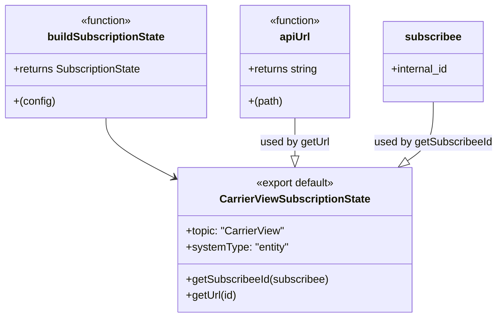

# Diagram: web/portal/src/pages/carrierview/redux/CarrierViewSubscriptionState.js

> Auto-generated by Obscura crawlers

## Mermaid

### SVG

<svg id="container" width="753.0390625" xmlns="http://www.w3.org/2000/svg" class="classDiagram" height="474" viewBox="0 0 753.0390625 474" role="graphics-document document" aria-roledescription="class"><g><defs><marker id="container_class-aggregationStart" class="marker aggregation class" refX="18" refY="7" markerWidth="190" markerHeight="240" orient="auto"><path d="M 18,7 L9,13 L1,7 L9,1 Z"></path></marker></defs><defs><marker id="container_class-aggregationEnd" class="marker aggregation class" refX="1" refY="7" markerWidth="20" markerHeight="28" orient="auto"><path d="M 18,7 L9,13 L1,7 L9,1 Z"></path></marker></defs><defs><marker id="container_class-extensionStart" class="marker extension class" refX="18" refY="7" markerWidth="190" markerHeight="240" orient="auto"><path d="M 1,7 L18,13 V 1 Z"></path></marker></defs><defs><marker id="container_class-extensionEnd" class="marker extension class" refX="1" refY="7" markerWidth="20" markerHeight="28" orient="auto"><path d="M 1,1 V 13 L18,7 Z"></path></marker></defs><defs><marker id="container_class-compositionStart" class="marker composition class" refX="18" refY="7" markerWidth="190" markerHeight="240" orient="auto"><path d="M 18,7 L9,13 L1,7 L9,1 Z"></path></marker></defs><defs><marker id="container_class-compositionEnd" class="marker composition class" refX="1" refY="7" markerWidth="20" markerHeight="28" orient="auto"><path d="M 18,7 L9,13 L1,7 L9,1 Z"></path></marker></defs><defs><marker id="container_class-dependencyStart" class="marker dependency class" refX="6" refY="7" markerWidth="190" markerHeight="240" orient="auto"><path d="M 5,7 L9,13 L1,7 L9,1 Z"></path></marker></defs><defs><marker id="container_class-dependencyEnd" class="marker dependency class" refX="13" refY="7" markerWidth="20" markerHeight="28" orient="auto"><path d="M 18,7 L9,13 L14,7 L9,1 Z"></path></marker></defs><defs><marker id="container_class-lollipopStart" class="marker lollipop class" refX="13" refY="7" markerWidth="190" markerHeight="240" orient="auto"><circle stroke="black" fill="transparent" cx="7" cy="7" r="6"></circle></marker></defs><defs><marker id="container_class-lollipopEnd" class="marker lollipop class" refX="1" refY="7" markerWidth="190" markerHeight="240" orient="auto"><circle stroke="black" fill="transparent" cx="7" cy="7" r="6"></circle></marker></defs><g class="root"><g class="clusters"></g><g class="edgePaths"><path d="M159.254,176L159.254,182.167C159.254,188.333,159.254,200.667,177.163,215.907C195.073,231.148,230.891,249.295,248.801,258.369L266.71,267.443" id="id_buildSubscriptionState_CarrierViewSubscriptionState_1" class="edge-thickness-normal edge-pattern-solid relation" style=";;;" data-edge="true" data-et="edge" data-id="id_buildSubscriptionState_CarrierViewSubscriptionState_1" data-points="W3sieCI6MTU5LjI1MzkwNjI1LCJ5IjoxNzZ9LHsieCI6MTU5LjI1MzkwNjI1LCJ5IjoyMTN9LHsieCI6MjcyLjA2MjUsInkiOjI3MC4xNTQ5MTcwODE4MjYyfV0=" marker-end="url(#container_class-dependencyEnd)"></path><path d="M445.445,176L445.445,182.167C445.445,188.333,445.445,200.667,445.445,210.125C445.445,219.583,445.445,226.167,445.445,229.458L445.445,232.75" id="id_apiUrl_CarrierViewSubscriptionState_2" class="edge-thickness-normal edge-pattern-solid relation" style=";;;" data-edge="true" data-et="edge" data-id="id_apiUrl_CarrierViewSubscriptionState_2" data-points="W3sieCI6NDQ1LjQ0NTMxMjUsInkiOjE3Nn0seyJ4Ijo0NDUuNDQ1MzEyNSwieSI6MjEzfSx7IngiOjQ0NS40NDUzMTI1LCJ5IjoyNTB9XQ==" marker-end="url(#container_class-extensionEnd)"></path><path d="M656.031,152L656.031,162.167C656.031,172.333,656.031,192.667,649.443,207.37C642.855,222.072,629.679,231.145,623.091,235.681L616.503,240.217" id="id_subscribee_CarrierViewSubscriptionState_3" class="edge-thickness-normal edge-pattern-solid relation" style=";;;" data-edge="true" data-et="edge" data-id="id_subscribee_CarrierViewSubscriptionState_3" data-points="W3sieCI6NjU2LjAzMTI1LCJ5IjoxNTJ9LHsieCI6NjU2LjAzMTI1LCJ5IjoyMTN9LHsieCI6NjAyLjI5NTUyODAxNzI0MTQsInkiOjI1MH1d" marker-end="url(#container_class-extensionEnd)"></path></g><g class="edgeLabels"><g class="edgeLabel"><g class="label" data-id="id_buildSubscriptionState_CarrierViewSubscriptionState_1" transform="translate(0, 0)"><foreignObject width="0" height="0">

</foreignObject></g></g><g class="edgeLabel" transform="translate(445.4453125, 213)"><g class="label" data-id="id_apiUrl_CarrierViewSubscriptionState_2" transform="translate(-52.4453125, -12)"><foreignObject width="104.890625" height="24">

used by getUrl

</foreignObject></g></g><g class="edgeLabel" transform="translate(656.03125, 213)"><g class="label" data-id="id_subscribee_CarrierViewSubscriptionState_3" transform="translate(-89.0078125, -12)"><foreignObject width="178.015625" height="24">

used by getSubscribeeId

</foreignObject></g></g></g><g class="nodes"><g class="node default" id="classId-buildSubscriptionState-0" transform="translate(159.25390625, 92)"><g class="basic label-container"><path d="M-151.25390625 -84 L151.25390625 -84 L151.25390625 84 L-151.25390625 84" stroke="none" stroke-width="0" fill="#ECECFF" style=""></path><path d="M-151.25390625 -84 C-88.28610870101397 -84, -25.31831115202796 -84, 151.25390625 -84 M-151.25390625 -84 C-49.27359177043134 -84, 52.706722709137324 -84, 151.25390625 -84 M151.25390625 -84 C151.25390625 -26.096525499572415, 151.25390625 31.80694900085517, 151.25390625 84 M151.25390625 -84 C151.25390625 -43.083218111984806, 151.25390625 -2.1664362239696118, 151.25390625 84 M151.25390625 84 C36.332113120456825 84, -78.58968000908635 84, -151.25390625 84 M151.25390625 84 C50.08759920387048 84, -51.078707842259035 84, -151.25390625 84 M-151.25390625 84 C-151.25390625 17.517728157782003, -151.25390625 -48.964543684435995, -151.25390625 -84 M-151.25390625 84 C-151.25390625 45.68463762645664, -151.25390625 7.369275252913283, -151.25390625 -84" stroke="#9370DB" stroke-width="1.3" fill="none" stroke-dasharray="0 0" style=""></path></g><g class="annotation-group text" transform="translate(-39.484375, -60)"><g class="label" style="" transform="translate(0,-12)"><foreignObject width="78.96875" height="24">

«function»

</foreignObject></g></g><g class="label-group text" transform="translate(-84.5546875, -36)"><g class="label" style="font-weight: bolder" transform="translate(0,-12)"><foreignObject width="169.109375" height="24">

buildSubscriptionState

</foreignObject></g></g><g class="members-group text" transform="translate(-139.25390625, 12)"><g class="label" style="" transform="translate(0,-12)"><foreignObject width="193.953125" height="24">

+returns SubscriptionState

</foreignObject></g></g><g class="methods-group text" transform="translate(-139.25390625, 60)"><g class="label" style="" transform="translate(0,-12)"><foreignObject width="61.921875" height="24">

+(config)

</foreignObject></g></g><g class="divider" style=""><path d="M-151.25390625 -12 C-39.759074377589485 -12, 71.73575749482103 -12, 151.25390625 -12 M-151.25390625 -12 C-46.47211314229604 -12, 58.30967996540792 -12, 151.25390625 -12" stroke="#9370DB" stroke-width="1.3" fill="none" stroke-dasharray="0 0" style=""></path></g><g class="divider" style=""><path d="M-151.25390625 36 C-84.26754859795 36, -17.281190945899993 36, 151.25390625 36 M-151.25390625 36 C-41.03207016259468 36, 69.18976592481064 36, 151.25390625 36" stroke="#9370DB" stroke-width="1.3" fill="none" stroke-dasharray="0 0" style=""></path></g></g><g class="node default" id="classId-CarrierViewSubscriptionState-1" transform="translate(445.4453125, 358)"><g class="basic label-container"><path d="M-173.3828125 -108 L173.3828125 -108 L173.3828125 108 L-173.3828125 108" stroke="none" stroke-width="0" fill="#ECECFF" style=""></path><path d="M-173.3828125 -108 C-61.38634936972748 -108, 50.61011376054503 -108, 173.3828125 -108 M-173.3828125 -108 C-72.77956655287825 -108, 27.8236793942435 -108, 173.3828125 -108 M173.3828125 -108 C173.3828125 -58.84624764249751, 173.3828125 -9.692495284995019, 173.3828125 108 M173.3828125 -108 C173.3828125 -40.527441882329185, 173.3828125 26.94511623534163, 173.3828125 108 M173.3828125 108 C80.7975697063258 108, -11.787673087348395 108, -173.3828125 108 M173.3828125 108 C91.5955002892411 108, 9.808188078482203 108, -173.3828125 108 M-173.3828125 108 C-173.3828125 28.726817145927882, -173.3828125 -50.546365708144236, -173.3828125 -108 M-173.3828125 108 C-173.3828125 59.327321211411906, -173.3828125 10.654642422823812, -173.3828125 -108" stroke="#9370DB" stroke-width="1.3" fill="none" stroke-dasharray="0 0" style=""></path></g><g class="annotation-group text" transform="translate(-60.546875, -84)"><g class="label" style="" transform="translate(0,-12)"><foreignObject width="121.09375" height="24">

«export default»

</foreignObject></g></g><g class="label-group text" transform="translate(-108.234375, -60)"><g class="label" style="font-weight: bolder" transform="translate(0,-12)"><foreignObject width="216.46875" height="24">

CarrierViewSubscriptionState

</foreignObject></g></g><g class="members-group text" transform="translate(-161.3828125, -12)"><g class="label" style="" transform="translate(0,-12)"><foreignObject width="148.234375" height="24">

+topic: "CarrierView"

</foreignObject></g><g class="label" style="" transform="translate(0,12)"><foreignObject width="154.765625" height="24">

+systemType: "entity"

</foreignObject></g></g><g class="methods-group text" transform="translate(-161.3828125, 60)"><g class="label" style="" transform="translate(0,-12)"><foreignObject width="214.53125" height="24">

+getSubscribeeId(subscribee)

</foreignObject></g><g class="label" style="" transform="translate(0,12)"><foreignObject width="76.453125" height="24">

+getUrl(id)

</foreignObject></g></g><g class="divider" style=""><path d="M-173.3828125 -36 C-41.25527777501159 -36, 90.87225694997682 -36, 173.3828125 -36 M-173.3828125 -36 C-99.30391242175787 -36, -25.225012343515743 -36, 173.3828125 -36" stroke="#9370DB" stroke-width="1.3" fill="none" stroke-dasharray="0 0" style=""></path></g><g class="divider" style=""><path d="M-173.3828125 36 C-99.78732438622664 36, -26.191836272453287 36, 173.3828125 36 M-173.3828125 36 C-70.36649881155894 36, 32.64981487688212 36, 173.3828125 36" stroke="#9370DB" stroke-width="1.3" fill="none" stroke-dasharray="0 0" style=""></path></g></g><g class="node default" id="classId-apiUrl-2" transform="translate(445.4453125, 92)"><g class="basic label-container"><path d="M-84.9375 -84 L84.9375 -84 L84.9375 84 L-84.9375 84" stroke="none" stroke-width="0" fill="#ECECFF" style=""></path><path d="M-84.9375 -84 C-41.83023857886097 -84, 1.2770228422780576 -84, 84.9375 -84 M-84.9375 -84 C-18.828616133267502 -84, 47.280267733464996 -84, 84.9375 -84 M84.9375 -84 C84.9375 -44.099691494970834, 84.9375 -4.199382989941668, 84.9375 84 M84.9375 -84 C84.9375 -17.17706727942648, 84.9375 49.64586544114704, 84.9375 84 M84.9375 84 C38.965833674180736 84, -7.005832651638528 84, -84.9375 84 M84.9375 84 C34.3294044768185 84, -16.278691046362994 84, -84.9375 84 M-84.9375 84 C-84.9375 37.08486923194788, -84.9375 -9.830261536104246, -84.9375 -84 M-84.9375 84 C-84.9375 26.428076605749922, -84.9375 -31.143846788500156, -84.9375 -84" stroke="#9370DB" stroke-width="1.3" fill="none" stroke-dasharray="0 0" style=""></path></g><g class="annotation-group text" transform="translate(-39.484375, -60)"><g class="label" style="" transform="translate(0,-12)"><foreignObject width="78.96875" height="24">

«function»

</foreignObject></g></g><g class="label-group text" transform="translate(-22.2109375, -36)"><g class="label" style="font-weight: bolder" transform="translate(0,-12)"><foreignObject width="44.421875" height="24">

apiUrl

</foreignObject></g></g><g class="members-group text" transform="translate(-72.9375, 12)"><g class="label" style="" transform="translate(0,-12)"><foreignObject width="106.390625" height="24">

+returns string

</foreignObject></g></g><g class="methods-group text" transform="translate(-72.9375, 60)"><g class="label" style="" transform="translate(0,-12)"><foreignObject width="51.5625" height="24">

+(path)

</foreignObject></g></g><g class="divider" style=""><path d="M-84.9375 -12 C-43.684033405575356 -12, -2.4305668111507117 -12, 84.9375 -12 M-84.9375 -12 C-24.795122134356063 -12, 35.34725573128787 -12, 84.9375 -12" stroke="#9370DB" stroke-width="1.3" fill="none" stroke-dasharray="0 0" style=""></path></g><g class="divider" style=""><path d="M-84.9375 36 C-46.926990722902914 36, -8.916481445805829 36, 84.9375 36 M-84.9375 36 C-17.932726661503892 36, 49.072046676992215 36, 84.9375 36" stroke="#9370DB" stroke-width="1.3" fill="none" stroke-dasharray="0 0" style=""></path></g></g><g class="node default" id="classId-subscribee-3" transform="translate(656.03125, 92)"><g class="basic label-container"><path d="M-75.6484375 -60 L75.6484375 -60 L75.6484375 60 L-75.6484375 60" stroke="none" stroke-width="0" fill="#ECECFF" style=""></path><path d="M-75.6484375 -60 C-23.854669734130404 -60, 27.939098031739192 -60, 75.6484375 -60 M-75.6484375 -60 C-34.444907121849184 -60, 6.758623256301632 -60, 75.6484375 -60 M75.6484375 -60 C75.6484375 -34.666015351446156, 75.6484375 -9.332030702892311, 75.6484375 60 M75.6484375 -60 C75.6484375 -29.819620482610404, 75.6484375 0.3607590347791927, 75.6484375 60 M75.6484375 60 C30.28458074291298 60, -15.079276014174042 60, -75.6484375 60 M75.6484375 60 C44.12153901342077 60, 12.594640526841552 60, -75.6484375 60 M-75.6484375 60 C-75.6484375 14.71966852132239, -75.6484375 -30.56066295735522, -75.6484375 -60 M-75.6484375 60 C-75.6484375 31.693580691314025, -75.6484375 3.387161382628051, -75.6484375 -60" stroke="#9370DB" stroke-width="1.3" fill="none" stroke-dasharray="0 0" style=""></path></g><g class="annotation-group text" transform="translate(0, -36)"></g><g class="label-group text" transform="translate(-39.984375, -36)"><g class="label" style="font-weight: bolder" transform="translate(0,-12)"><foreignObject width="79.96875" height="24">

subscribee

</foreignObject></g></g><g class="members-group text" transform="translate(-63.6484375, 12)"><g class="label" style="" transform="translate(0,-12)"><foreignObject width="87.3125" height="24">

+internal_id

</foreignObject></g></g><g class="methods-group text" transform="translate(-63.6484375, 60)"></g><g class="divider" style=""><path d="M-75.6484375 -12 C-37.193666813877186 -12, 1.2611038722456271 -12, 75.6484375 -12 M-75.6484375 -12 C-20.239536029390322 -12, 35.169365441219355 -12, 75.6484375 -12" stroke="#9370DB" stroke-width="1.3" fill="none" stroke-dasharray="0 0" style=""></path></g><g class="divider" style=""><path d="M-75.6484375 36 C-26.854232742882722 36, 21.939972014234556 36, 75.6484375 36 M-75.6484375 36 C-34.643540494759 36, 6.361356510481997 36, 75.6484375 36" stroke="#9370DB" stroke-width="1.3" fill="none" stroke-dasharray="0 0" style=""></path></g></g></g></g></g></svg>
