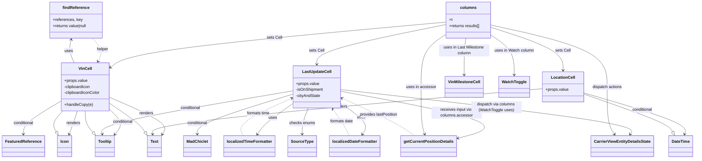

# Diagram: web/portal/src/pages/carrierview/search/CarrierView.Search.columns.js

> Auto-generated by Obscura crawlers

## Mermaid

### SVG

<svg id="container" width="2734.2265625" xmlns="http://www.w3.org/2000/svg" class="classDiagram" height="632" viewBox="0 0 2734.2265625 632" role="graphics-document document" aria-roledescription="class"><g><defs><marker id="container_class-aggregationStart" class="marker aggregation class" refX="18" refY="7" markerWidth="190" markerHeight="240" orient="auto"><path d="M 18,7 L9,13 L1,7 L9,1 Z"></path></marker></defs><defs><marker id="container_class-aggregationEnd" class="marker aggregation class" refX="1" refY="7" markerWidth="20" markerHeight="28" orient="auto"><path d="M 18,7 L9,13 L1,7 L9,1 Z"></path></marker></defs><defs><marker id="container_class-extensionStart" class="marker extension class" refX="18" refY="7" markerWidth="190" markerHeight="240" orient="auto"><path d="M 1,7 L18,13 V 1 Z"></path></marker></defs><defs><marker id="container_class-extensionEnd" class="marker extension class" refX="1" refY="7" markerWidth="20" markerHeight="28" orient="auto"><path d="M 1,1 V 13 L18,7 Z"></path></marker></defs><defs><marker id="container_class-compositionStart" class="marker composition class" refX="18" refY="7" markerWidth="190" markerHeight="240" orient="auto"><path d="M 18,7 L9,13 L1,7 L9,1 Z"></path></marker></defs><defs><marker id="container_class-compositionEnd" class="marker composition class" refX="1" refY="7" markerWidth="20" markerHeight="28" orient="auto"><path d="M 18,7 L9,13 L1,7 L9,1 Z"></path></marker></defs><defs><marker id="container_class-dependencyStart" class="marker dependency class" refX="6" refY="7" markerWidth="190" markerHeight="240" orient="auto"><path d="M 5,7 L9,13 L1,7 L9,1 Z"></path></marker></defs><defs><marker id="container_class-dependencyEnd" class="marker dependency class" refX="13" refY="7" markerWidth="20" markerHeight="28" orient="auto"><path d="M 18,7 L9,13 L14,7 L9,1 Z"></path></marker></defs><defs><marker id="container_class-lollipopStart" class="marker lollipop class" refX="13" refY="7" markerWidth="190" markerHeight="240" orient="auto"><circle stroke="black" fill="transparent" cx="7" cy="7" r="6"></circle></marker></defs><defs><marker id="container_class-lollipopEnd" class="marker lollipop class" refX="1" refY="7" markerWidth="190" markerHeight="240" orient="auto"><circle stroke="black" fill="transparent" cx="7" cy="7" r="6"></circle></marker></defs><g class="root"><g class="clusters"></g><g class="edgePaths"><path d="M424.781,386.29L466.665,403.741C508.549,421.193,592.318,456.097,629.056,481.148C665.793,506.199,655.501,521.398,650.354,528.997L645.208,536.597" id="id_VinCell_Text_1" class="edge-thickness-normal edge-pattern-solid relation" style=";;;" data-edge="true" data-et="edge" data-id="id_VinCell_Text_1" data-points="W3sieCI6NDI0Ljc4MTI1LCJ5IjozODYuMjg5NzEzNTQxNjY2N30seyJ4Ijo2NzYuMDg1OTM3NSwieSI6NDkxfSx7IngiOjY0MS44NDM3NSwieSI6NTQxLjU2NDUyODM5NzU2NTl9XQ==" marker-end="url(#container_class-dependencyEnd)"></path><path d="M296.472,442L293.783,450.167C291.093,458.333,285.715,474.667,280.353,490.062C274.991,505.457,269.647,519.915,266.974,527.144L264.302,534.372" id="id_VinCell_Icon_2" class="edge-thickness-normal edge-pattern-solid relation" style=";;;" data-edge="true" data-et="edge" data-id="id_VinCell_Icon_2" data-points="W3sieCI6Mjk2LjQ3MjE0NDM5NjU1MTcsInkiOjQ0Mn0seyJ4IjoyODAuMzM1OTM3NSwieSI6NDkxfSx7IngiOjI2Mi4yMjE3NTQ4MDc2OTIzLCJ5Ijo1NDB9XQ==" marker-end="url(#container_class-dependencyEnd)"></path><path d="M424.781,431.721L435.926,441.601C447.07,451.481,469.359,471.24,473.83,488.547C478.3,505.853,464.952,520.705,458.278,528.132L451.604,535.558" id="id_VinCell_Tooltip_3" class="edge-thickness-normal edge-pattern-solid relation" style=";;;" data-edge="true" data-et="edge" data-id="id_VinCell_Tooltip_3" data-points="W3sieCI6NDI0Ljc4MTI1LCJ5Ijo0MzEuNzIxNDg0NTI0MjY0NDR9LHsieCI6NDkxLjY0ODQzNzUsInkiOjQ5MX0seyJ4Ijo0NDcuNTkzNzUsInkiOjU0MC4wMjA3Mjk4NDMzMzIxfV0=" marker-end="url(#container_class-dependencyEnd)"></path><path d="M231.391,404.569L207.608,418.974C183.826,433.379,136.26,462.19,112.478,483.761C88.695,505.333,88.695,519.667,88.695,526.833L88.695,534" id="id_VinCell_FeaturedReference_4" class="edge-thickness-normal edge-pattern-solid relation" style=";;;" data-edge="true" data-et="edge" data-id="id_VinCell_FeaturedReference_4" data-points="W3sieCI6MjMxLjM5MDYyNSwieSI6NDA0LjU2ODc5NDQ2NTExMzJ9LHsieCI6ODguNjk1MzEyNSwieSI6NDkxfSx7IngiOjg4LjY5NTMxMjUsInkiOjU0MH1d" marker-end="url(#container_class-dependencyEnd)"></path><path d="M283.764,250L279.993,241.833C276.223,233.667,268.682,217.333,266.698,201.971C264.714,186.608,268.288,172.215,270.074,165.019L271.861,157.823" id="id_VinCell_findReference_5" class="edge-thickness-normal edge-pattern-solid relation" style=";;;" data-edge="true" data-et="edge" data-id="id_VinCell_findReference_5" data-points="W3sieCI6MjgzLjc2MzUyMzcwNjg5NjU0LCJ5IjoyNTB9LHsieCI6MjYxLjE0MDYyNSwieSI6MjAxfSx7IngiOjI3My4zMDY3ODU4OTg3NjAzLCJ5IjoxNTJ9XQ==" marker-end="url(#container_class-dependencyEnd)"></path><path d="M1154.141,361.87L1026.663,383.391C899.185,404.913,644.229,447.957,518.379,476.67C392.528,505.383,395.783,519.765,397.411,526.957L399.038,534.148" id="id_LastUpdateCell_Tooltip_6" class="edge-thickness-normal edge-pattern-solid relation" style=";;;" data-edge="true" data-et="edge" data-id="id_LastUpdateCell_Tooltip_6" data-points="W3sieCI6MTE1NC4xNDA2MjUsInkiOjM2MS44Njk3NDEyMTA3MTU0fSx7IngiOjM4OS4yNzM0Mzc1LCJ5Ijo0OTF9LHsieCI6NDAwLjM2MjM3OTgwNzY5MjMsInkiOjU0MH1d" marker-end="url(#container_class-dependencyEnd)"></path><path d="M1154.141,375.462L1092.703,394.719C1031.266,413.975,908.391,452.487,846.953,478.91C785.516,505.333,785.516,519.667,785.516,526.833L785.516,534" id="id_LastUpdateCell_MadChiclet_7" class="edge-thickness-normal edge-pattern-solid relation" style=";;;" data-edge="true" data-et="edge" data-id="id_LastUpdateCell_MadChiclet_7" data-points="W3sieCI6MTE1NC4xNDA2MjUsInkiOjM3NS40NjIzMDc0ODQ0NjM3fSx7IngiOjc4NS41MTU2MjUsInkiOjQ5MX0seyJ4Ijo3ODUuNTE1NjI1LCJ5Ijo1NDB9XQ==" marker-end="url(#container_class-dependencyEnd)"></path><path d="M1154.141,412.869L1135.835,425.891C1117.53,438.913,1080.919,464.956,1057.972,485.3C1035.025,505.644,1025.741,520.288,1021.099,527.61L1016.457,534.933" id="id_LastUpdateCell_localizedTimeFormatter_8" class="edge-thickness-normal edge-pattern-solid relation" style=";;;" data-edge="true" data-et="edge" data-id="id_LastUpdateCell_localizedTimeFormatter_8" data-points="W3sieCI6MTE1NC4xNDA2MjUsInkiOjQxMi44Njg3ODM2NTY4ODY2fSx7IngiOjEwNDQuMzA4NTkzNzUsInkiOjQ5MX0seyJ4IjoxMDEzLjI0Mzk5MDM4NDYxNTQsInkiOjU0MH1d" marker-end="url(#container_class-dependencyEnd)"></path><path d="M1342.141,412.495L1360.637,425.58C1379.133,438.664,1416.125,464.832,1429.636,485.255C1443.146,505.679,1433.176,520.358,1428.19,527.697L1423.205,535.037" id="id_LastUpdateCell_localizedDateFormatter_9" class="edge-thickness-normal edge-pattern-solid relation" style=";;;" data-edge="true" data-et="edge" data-id="id_LastUpdateCell_localizedDateFormatter_9" data-points="W3sieCI6MTM0Mi4xNDA2MjUsInkiOjQxMi40OTU0MDcyNDkzMDQ0NH0seyJ4IjoxNDUzLjExNzE4NzUsInkiOjQ5MX0seyJ4IjoxNDE5LjgzMzUzMzY1Mzg0NjIsInkiOjU0MH1d" marker-end="url(#container_class-dependencyEnd)"></path><path d="M1342.141,363.51L1456.206,384.759C1570.271,406.007,1798.401,448.503,1873.919,479.959C1949.437,511.415,1872.343,531.83,1833.796,542.038L1795.249,552.245" id="id_LastUpdateCell_getCurrentPositionDetails_10" class="edge-thickness-normal edge-pattern-solid relation" style=";;;" data-edge="true" data-et="edge" data-id="id_LastUpdateCell_getCurrentPositionDetails_10" data-points="W3sieCI6MTM0Mi4xNDA2MjUsInkiOjM2My41MTA0ODgzODc0OTgyNH0seyJ4IjoyMDI2LjUzMTI1LCJ5Ijo0OTF9LHsieCI6MTc4OS40NDkyMTg3NSwieSI6NTUzLjc4MTM0MjAwMjY1OTl9XQ==" marker-end="url(#container_class-dependencyEnd)"></path><path d="M1214.111,430L1209.992,440.167C1205.873,450.333,1197.636,470.667,1193.517,488C1189.398,505.333,1189.398,519.667,1189.398,526.833L1189.398,534" id="id_LastUpdateCell_SourceType_11" class="edge-thickness-normal edge-pattern-solid relation" style=";;;" data-edge="true" data-et="edge" data-id="id_LastUpdateCell_SourceType_11" data-points="W3sieCI6MTIxNC4xMTA2NjgxMDM0NDgyLCJ5Ijo0MzB9LHsieCI6MTE4OS4zOTg0Mzc1LCJ5Ijo0OTF9LHsieCI6MTE4OS4zOTg0Mzc1LCJ5Ijo1NDB9XQ==" marker-end="url(#container_class-dependencyEnd)"></path><path d="M1342.141,356.793L1536.956,379.161C1731.771,401.528,2121.401,446.264,2311.382,475.964C2501.363,505.664,2491.695,520.327,2486.86,527.659L2482.026,534.991" id="id_LastUpdateCell_CarrierViewEntityDetailsState_12" class="edge-thickness-normal edge-pattern-solid relation" style=";;;" data-edge="true" data-et="edge" data-id="id_LastUpdateCell_CarrierViewEntityDetailsState_12" data-points="W3sieCI6MTM0Mi4xNDA2MjUsInkiOjM1Ni43OTI3MDAyNzgzNzkyNH0seyJ4IjoyNTExLjAzMTI1LCJ5Ijo0OTF9LHsieCI6MjQ3OC43MjM1NTc2OTIzMDc2LCJ5Ijo1NDB9XQ==" marker-end="url(#container_class-dependencyEnd)"></path><path d="M2296.414,369.559L2365.378,389.8C2434.341,410.04,2572.268,450.52,2638.805,477.979C2705.341,505.438,2700.488,519.875,2698.061,527.094L2695.634,534.313" id="id_LocationCell_DateTime_13" class="edge-thickness-normal edge-pattern-solid relation" style=";;;" data-edge="true" data-et="edge" data-id="id_LocationCell_DateTime_13" data-points="W3sieCI6MjI5Ni40MTQwNjI1LCJ5IjozNjkuNTU5NDMzMjYxMTIwNX0seyJ4IjoyNzEwLjE5NTMxMjUsInkiOjQ5MX0seyJ4IjoyNjkzLjcyMTc1NDgwNzY5MjQsInkiOjU0MH1d" marker-end="url(#container_class-dependencyEnd)"></path><path d="M2135.867,353.205L1879.987,376.171C1624.107,399.136,1112.346,445.068,857.561,475.212C602.775,505.356,604.964,519.712,606.058,526.89L607.153,534.069" id="id_LocationCell_Text_14" class="edge-thickness-normal edge-pattern-solid relation" style=";;;" data-edge="true" data-et="edge" data-id="id_LocationCell_Text_14" data-points="W3sieCI6MjEzNS44NjcxODc1LCJ5IjozNTMuMjA0NzM4MTE3MjI5NDV9LHsieCI6NjAwLjU4NTkzNzUsInkiOjQ5MX0seyJ4Ijo2MDguMDU3MDkxMzQ2MTUzOCwieSI6NTQwfV0=" marker-end="url(#container_class-dependencyEnd)"></path><path d="M1748.34,88.234L1544.335,107.028C1340.331,125.822,932.322,163.411,712.533,193.869C492.744,224.327,461.175,247.655,445.391,259.318L429.607,270.982" id="id_columns_VinCell_15" class="edge-thickness-normal edge-pattern-solid relation" style=";;;" data-edge="true" data-et="edge" data-id="id_columns_VinCell_15" data-points="W3sieCI6MTc0OC4zMzk4NDM3NSwieSI6ODguMjMzNTI3NjQ0NzY2OTh9LHsieCI6NTI0LjMxMjUsInkiOjIwMX0seyJ4Ijo0MjQuNzgxMjUsInkiOjI3NC41NDc3OTYzMTMyNTM5N31d" marker-end="url(#container_class-dependencyEnd)"></path><path d="M1748.34,98.342L1664.973,115.452C1581.607,132.561,1414.874,166.781,1331.507,193.057C1248.141,219.333,1248.141,237.667,1248.141,246.833L1248.141,256" id="id_columns_LastUpdateCell_16" class="edge-thickness-normal edge-pattern-solid relation" style=";;;" data-edge="true" data-et="edge" data-id="id_columns_LastUpdateCell_16" data-points="W3sieCI6MTc0OC4zMzk4NDM3NSwieSI6OTguMzQyMDA2MjI4MDUyNzR9LHsieCI6MTI0OC4xNDA2MjUsInkiOjIwMX0seyJ4IjoxMjQ4LjE0MDYyNSwieSI6MjYyfV0=" marker-end="url(#container_class-dependencyEnd)"></path><path d="M1927.082,108.576L1975.258,123.98C2023.435,139.384,2119.788,170.192,2167.964,198.763C2216.141,227.333,2216.141,253.667,2216.141,266.833L2216.141,280" id="id_columns_LocationCell_17" class="edge-thickness-normal edge-pattern-solid relation" style=";;;" data-edge="true" data-et="edge" data-id="id_columns_LocationCell_17" data-points="W3sieCI6MTkyNy4wODIwMzEyNSwieSI6MTA4LjU3NTcyNDEwNjYwODN9LHsieCI6MjIxNi4xNDA2MjUsInkiOjIwMX0seyJ4IjoyMjE2LjE0MDYyNSwieSI6Mjg2fV0=" marker-end="url(#container_class-dependencyEnd)"></path><path d="M1927.082,137L1943.807,147.666C1960.531,158.333,1993.98,179.667,2010.705,206.5C2027.43,233.333,2027.43,265.667,2027.43,281.833L2027.43,298" id="id_columns_WatchToggle_18" class="edge-thickness-normal edge-pattern-solid relation" style=";;;" data-edge="true" data-et="edge" data-id="id_columns_WatchToggle_18" data-points="W3sieCI6MTkyNy4wODIwMzEyNSwieSI6MTM2Ljk5OTY0OTk3NTI5MjM2fSx7IngiOjIwMjcuNDI5Njg3NSwieSI6MjAxfSx7IngiOjIwMjcuNDI5Njg3NSwieSI6MzA0fV0=" marker-end="url(#container_class-dependencyEnd)"></path><path d="M1832.379,152L1831.774,160.167C1831.169,168.333,1829.96,184.667,1829.355,209C1828.75,233.333,1828.75,265.667,1828.75,281.833L1828.75,298" id="id_columns_VinMilestoneCell_19" class="edge-thickness-normal edge-pattern-solid relation" style=";;;" data-edge="true" data-et="edge" data-id="id_columns_VinMilestoneCell_19" data-points="W3sieCI6MTgzMi4zNzg4MDk0MDA4MjY0LCJ5IjoxNTJ9LHsieCI6MTgyOC43NSwieSI6MjAxfSx7IngiOjE4MjguNzUsInkiOjMwNH1d" marker-end="url(#container_class-dependencyEnd)"></path><path d="M1748.34,141.555L1733.955,151.462C1719.57,161.37,1690.801,181.185,1676.416,215.259C1662.031,249.333,1662.031,297.667,1662.031,346C1662.031,394.333,1662.031,442.667,1663.68,474.025C1665.328,505.384,1668.624,519.768,1670.273,526.96L1671.921,534.152" id="id_columns_getCurrentPositionDetails_20" class="edge-thickness-normal edge-pattern-solid relation" style=";;;" data-edge="true" data-et="edge" data-id="id_columns_getCurrentPositionDetails_20" data-points="W3sieCI6MTc0OC4zMzk4NDM3NSwieSI6MTQxLjU1NDY1Mzc5OTk3MzMyfSx7IngiOjE2NjIuMDMxMjUsInkiOjIwMX0seyJ4IjoxNjYyLjAzMTI1LCJ5IjozNDZ9LHsieCI6MTY2Mi4wMzEyNSwieSI6NDkxfSx7IngiOjE2NzMuMjYxMTE3Nzg4NDYxNCwieSI6NTQwfV0=" marker-end="url(#container_class-dependencyEnd)"></path><path d="M1927.082,99.544L2004.407,116.453C2081.732,133.362,2236.382,167.181,2313.706,208.257C2391.031,249.333,2391.031,297.667,2391.031,346C2391.031,394.333,2391.031,442.667,2395.865,474.165C2400.7,505.664,2410.368,520.327,2415.202,527.659L2420.036,534.991" id="id_columns_CarrierViewEntityDetailsState_21" class="edge-thickness-normal edge-pattern-solid relation" style=";;;" data-edge="true" data-et="edge" data-id="id_columns_CarrierViewEntityDetailsState_21" data-points="W3sieCI6MTkyNy4wODIwMzEyNSwieSI6OTkuNTQzNjU2OTAwODExODd9LHsieCI6MjM5MS4wMzEyNSwieSI6MjAxfSx7IngiOjIzOTEuMDMxMjUsInkiOjM0Nn0seyJ4IjoyMzkxLjAzMTI1LCJ5Ijo0OTF9LHsieCI6MjQyMy4zMzg5NDIzMDc2OTI0LCJ5Ijo1NDB9XQ==" marker-end="url(#container_class-dependencyEnd)"></path><path d="M359.627,152L367.391,160.167C375.154,168.333,390.68,184.667,394.518,200.12C398.356,215.573,390.505,230.145,386.579,237.432L382.653,244.718" id="id_findReference_VinCell_22" class="edge-thickness-normal edge-pattern-dashed relation" style=";;;" data-edge="true" data-et="edge" data-id="id_findReference_VinCell_22" data-points="W3sieCI6MzU5LjYyNzI5MjA5NzEwNzQ0LCJ5IjoxNTJ9LHsieCI6NDA2LjIwNzAzMTI1LCJ5IjoyMDF9LHsieCI6Mzc5LjgwNzQ4OTIyNDEzNzk1LCJ5IjoyNTB9XQ==" marker-end="url(#container_class-dependencyEnd)"></path><path d="M1628.856,540L1618.35,531.833C1607.844,523.667,1586.832,507.333,1539.956,482.566C1493.08,457.799,1420.339,424.597,1383.969,407.997L1347.599,391.396" id="id_getCurrentPositionDetails_LastUpdateCell_23" class="edge-thickness-normal edge-pattern-dashed relation" style=";;;" data-edge="true" data-et="edge" data-id="id_getCurrentPositionDetails_LastUpdateCell_23" data-points="W3sieCI6MTYyOC44NTYwNjk3MTE1Mzg2LCJ5Ijo1NDB9LHsieCI6MTU2NS44MjAzMTI1LCJ5Ijo0OTF9LHsieCI6MTM0Mi4xNDA2MjUsInkiOjM4OC45MDQ4NTIwNzY4MjY2fV0=" marker-end="url(#container_class-dependencyEnd)"></path><path d="M965.102,540L960.918,531.833C956.734,523.667,948.367,507.333,978.969,482.798C1009.571,458.263,1079.141,425.525,1113.926,409.156L1148.712,392.788" id="id_localizedTimeFormatter_LastUpdateCell_24" class="edge-thickness-normal edge-pattern-dashed relation" style=";;;" data-edge="true" data-et="edge" data-id="id_localizedTimeFormatter_LastUpdateCell_24" data-points="W3sieCI6OTY1LjEwMTU2MjUsInkiOjU0MH0seyJ4Ijo5NDAsInkiOjQ5MX0seyJ4IjoxMTU0LjE0MDYyNSwieSI6MzkwLjIzMzA1MTA2MjMxOTM2fV0=" marker-end="url(#container_class-dependencyEnd)"></path><path d="M1371.823,540L1368.035,531.833C1364.246,523.667,1356.67,507.333,1346.375,489.821C1336.08,472.308,1323.066,453.616,1316.559,444.27L1310.052,434.924" id="id_localizedDateFormatter_LastUpdateCell_25" class="edge-thickness-normal edge-pattern-dashed relation" style=";;;" data-edge="true" data-et="edge" data-id="id_localizedDateFormatter_LastUpdateCell_25" data-points="W3sieCI6MTM3MS44MjI3MTYzNDYxNTM4LCJ5Ijo1NDB9LHsieCI6MTM0OS4wOTM3NSwieSI6NDkxfSx7IngiOjEzMDYuNjIzODE0NjU1MTcyNSwieSI6NDMwfV0=" marker-end="url(#container_class-dependencyEnd)"></path><path d="M577.406,527.281L573.311,521.235C569.216,515.188,561.026,503.094,535.588,483.278C510.151,463.461,467.466,435.923,446.124,422.153L424.781,408.384" id="id_Text_VinCell_26" class="edge-thickness-normal edge-pattern-solid relation" style=";;;" data-edge="true" data-et="edge" data-id="id_Text_VinCell_26" data-points="W3sieCI6NTg3LjA3ODEyNSwieSI6NTQxLjU2NDUyODM5NzU2NTl9LHsieCI6NTUyLjgzNTkzNzUsInkiOjQ5MX0seyJ4Ijo0MjQuNzgxMjUsInkiOjQwOC4zODQwNzI1ODA2NDUyfV0=" marker-start="url(#container_class-extensionStart)"></path><path d="M216.253,524.771L213.259,519.142C210.265,513.514,204.277,502.257,208.593,488.462C212.91,474.667,227.531,458.333,234.841,450.167L242.151,442" id="id_Icon_VinCell_27" class="edge-thickness-normal edge-pattern-solid relation" style=";;;" data-edge="true" data-et="edge" data-id="id_Icon_VinCell_27" data-points="W3sieCI6MjI0LjM1Mzk2NjM0NjE1Mzg0LCJ5Ijo1NDB9LHsieCI6MTk4LjI4OTA2MjUsInkiOjQ5MX0seyJ4IjoyNDIuMTUxNDU0NzQxMzc5MzMsInkiOjQ0Mn1d" marker-start="url(#container_class-extensionStart)"></path><path d="M360.61,527.191L355.19,521.159C349.769,515.127,338.927,503.064,333.507,488.865C328.086,474.667,328.086,458.333,328.086,450.167L328.086,442" id="id_Tooltip_VinCell_28" class="edge-thickness-normal edge-pattern-solid relation" style=";;;" data-edge="true" data-et="edge" data-id="id_Tooltip_VinCell_28" data-points="W3sieCI6MzcyLjE0MDYyNSwieSI6NTQwLjAyMDcyOTg0MzMzMjF9LHsieCI6MzI4LjA4NTkzNzUsInkiOjQ5MX0seyJ4IjozMjguMDg1OTM3NSwieSI6NDQyfV0=" marker-start="url(#container_class-extensionStart)"></path><path d="M2649.062,524.782L2646.057,519.152C2643.052,513.521,2637.042,502.261,2578.267,477.139C2519.492,452.018,2407.953,413.036,2352.184,393.546L2296.414,374.055" id="id_DateTime_LocationCell_29" class="edge-thickness-normal edge-pattern-solid relation" style=";;;" data-edge="true" data-et="edge" data-id="id_DateTime_LocationCell_29" data-points="W3sieCI6MjY1Ny4xODQ0OTUxOTIzMDc2LCJ5Ijo1NDB9LHsieCI6MjYzMS4wMzEyNSwieSI6NDkxfSx7IngiOjIyOTYuNDE0MDYyNSwieSI6Mzc0LjA1NDczOTU3NzQ0ODg2fV0=" marker-start="url(#container_class-extensionStart)"></path></g><g class="edgeLabels"><g class="edgeLabel" transform="translate(578.61882, 450.3887)"><g class="label" data-id="id_VinCell_Text_1" transform="translate(-27.75, -12)"><foreignObject width="55.5" height="24">

renders

</foreignObject></g></g><g class="edgeLabel" transform="translate(280.3359375, 491)"><g class="label" data-id="id_VinCell_Icon_2" transform="translate(-27.75, -12)"><foreignObject width="55.5" height="24">

renders

</foreignObject></g></g><g class="edgeLabel" transform="translate(482.87401, 483.22137)"><g class="label" data-id="id_VinCell_Tooltip_3" transform="translate(-41.1875, -12)"><foreignObject width="82.375" height="24">

conditional

</foreignObject></g></g><g class="edgeLabel" transform="translate(88.6953125, 491)"><g class="label" data-id="id_VinCell_FeaturedReference_4" transform="translate(-41.1875, -12)"><foreignObject width="82.375" height="24">

conditional

</foreignObject></g></g><g class="edgeLabel" transform="translate(261.87052, 202.58091)"><g class="label" data-id="id_VinCell_findReference_5" transform="translate(-16.4921875, -12)"><foreignObject width="32.984375" height="24">

uses

</foreignObject></g></g><g class="edgeLabel" transform="translate(746.938, 430.61655)"><g class="label" data-id="id_LastUpdateCell_Tooltip_6" transform="translate(-41.1875, -12)"><foreignObject width="82.375" height="24">

conditional

</foreignObject></g></g><g class="edgeLabel" transform="translate(785.515625, 491)"><g class="label" data-id="id_LastUpdateCell_MadChiclet_7" transform="translate(-41.1875, -12)"><foreignObject width="82.375" height="24">

conditional

</foreignObject></g></g><g class="edgeLabel" transform="translate(1075.58674, 468.74967)"><g class="label" data-id="id_LastUpdateCell_localizedTimeFormatter_8" transform="translate(-16.4921875, -12)"><foreignObject width="32.984375" height="24">

uses

</foreignObject></g></g><g class="edgeLabel" transform="translate(1421.80823, 468.85211)"><g class="label" data-id="id_LastUpdateCell_localizedDateFormatter_9" transform="translate(-16.4921875, -12)"><foreignObject width="32.984375" height="24">

uses

</foreignObject></g></g><g class="edgeLabel" transform="translate(1804.88898, 449.71208)"><g class="label" data-id="id_LastUpdateCell_getCurrentPositionDetails_10" transform="translate(-100, -24)"><foreignObject width="200" height="48">

receives input via columns.accessor

</foreignObject></g></g><g class="edgeLabel" transform="translate(1189.3984375, 491)"><g class="label" data-id="id_LastUpdateCell_SourceType_11" transform="translate(-50.90625, -12)"><foreignObject width="101.8125" height="24">

checks enums

</foreignObject></g></g><g class="edgeLabel" transform="translate(1955.74055, 427.24377)"><g class="label" data-id="id_LastUpdateCell_CarrierViewEntityDetailsState_12" transform="translate(-100, -24)"><foreignObject width="200" height="48">

dispatch via columns (WatchToggle uses)

</foreignObject></g></g><g class="edgeLabel" transform="translate(2528.10612, 437.55868)"><g class="label" data-id="id_LocationCell_DateTime_13" transform="translate(-41.1875, -12)"><foreignObject width="82.375" height="24">

conditional

</foreignObject></g></g><g class="edgeLabel" transform="translate(1343.54263, 424.31781)"><g class="label" data-id="id_LocationCell_Text_14" transform="translate(-27.75, -12)"><foreignObject width="55.5" height="24">

renders

</foreignObject></g></g><g class="edgeLabel" transform="translate(1074.7087, 150.29342)"><g class="label" data-id="id_columns_VinCell_15" transform="translate(-30.2109375, -12)"><foreignObject width="60.421875" height="24">

sets Cell

</foreignObject></g></g><g class="edgeLabel" transform="translate(1248.140625, 201)"><g class="label" data-id="id_columns_LastUpdateCell_16" transform="translate(-30.2109375, -12)"><foreignObject width="60.421875" height="24">

sets Cell

</foreignObject></g></g><g class="edgeLabel" transform="translate(2216.140625, 201)"><g class="label" data-id="id_columns_LocationCell_17" transform="translate(-30.2109375, -12)"><foreignObject width="60.421875" height="24">

sets Cell

</foreignObject></g></g><g class="edgeLabel" transform="translate(2027.4296875, 201)"><g class="label" data-id="id_columns_WatchToggle_18" transform="translate(-78.6796875, -12)"><foreignObject width="157.359375" height="24">

uses in Watch column

</foreignObject></g></g><g class="edgeLabel" transform="translate(1828.75, 201)"><g class="label" data-id="id_columns_VinMilestoneCell_19" transform="translate(-100, -24)"><foreignObject width="200" height="48">

uses in Last Milestone column

</foreignObject></g></g><g class="edgeLabel" transform="translate(1662.03125, 346)"><g class="label" data-id="id_columns_getCurrentPositionDetails_20" transform="translate(-58.8671875, -12)"><foreignObject width="117.734375" height="24">

uses in accessor

</foreignObject></g></g><g class="edgeLabel" transform="translate(2391.03125, 346)"><g class="label" data-id="id_columns_CarrierViewEntityDetailsState_21" transform="translate(-59.6171875, -12)"><foreignObject width="119.234375" height="24">

dispatch actions

</foreignObject></g></g><g class="edgeLabel" transform="translate(402.09118, 196.6703)"><g class="label" data-id="id_findReference_VinCell_22" transform="translate(-23.59375, -12)"><foreignObject width="47.1875" height="24">

helper

</foreignObject></g></g><g class="edgeLabel" transform="translate(1490.29664, 456.52838)"><g class="label" data-id="id_getCurrentPositionDetails_LastUpdateCell_23" transform="translate(-76.2109375, -12)"><foreignObject width="152.421875" height="24">

provides lastPosition

</foreignObject></g></g><g class="edgeLabel" transform="translate(1022.16254, 452.33724)"><g class="label" data-id="id_localizedTimeFormatter_LastUpdateCell_24" transform="translate(-46.6796875, -12)"><foreignObject width="93.359375" height="24">

formats time

</foreignObject></g></g><g class="edgeLabel" transform="translate(1343.29037, 482.66455)"><g class="label" data-id="id_localizedDateFormatter_LastUpdateCell_25" transform="translate(-46.578125, -12)"><foreignObject width="93.15625" height="24">

formats date

</foreignObject></g></g><g class="edgeLabel"><g class="label" data-id="id_Text_VinCell_26" transform="translate(0, 0)"><foreignObject width="0" height="0">

</foreignObject></g></g><g class="edgeLabel"><g class="label" data-id="id_Icon_VinCell_27" transform="translate(0, 0)"><foreignObject width="0" height="0">

</foreignObject></g></g><g class="edgeLabel"><g class="label" data-id="id_Tooltip_VinCell_28" transform="translate(0, 0)"><foreignObject width="0" height="0">

</foreignObject></g></g><g class="edgeLabel"><g class="label" data-id="id_DateTime_LocationCell_29" transform="translate(0, 0)"><foreignObject width="0" height="0">

</foreignObject></g></g></g><g class="nodes"><g class="node default" id="classId-findReference-0" transform="translate(291.18359375, 80)"><g class="basic label-container"><path d="M-106.4375 -72 L106.4375 -72 L106.4375 72 L-106.4375 72" stroke="none" stroke-width="0" fill="#ECECFF" style=""></path><path d="M-106.4375 -72 C-49.46567908372069 -72, 7.506141832558626 -72, 106.4375 -72 M-106.4375 -72 C-35.252365915583596 -72, 35.93276816883281 -72, 106.4375 -72 M106.4375 -72 C106.4375 -34.07143622269218, 106.4375 3.8571275546156443, 106.4375 72 M106.4375 -72 C106.4375 -34.335419493121435, 106.4375 3.3291610137571297, 106.4375 72 M106.4375 72 C60.93282434978782 72, 15.428148699575644 72, -106.4375 72 M106.4375 72 C24.442595283387462 72, -57.552309433225076 72, -106.4375 72 M-106.4375 72 C-106.4375 38.94064598664032, -106.4375 5.881291973280639, -106.4375 -72 M-106.4375 72 C-106.4375 40.45436803566285, -106.4375 8.908736071325698, -106.4375 -72" stroke="#9370DB" stroke-width="1.3" fill="none" stroke-dasharray="0 0" style=""></path></g><g class="annotation-group text" transform="translate(0, -48)"></g><g class="label-group text" transform="translate(-50.71875, -48)"><g class="label" style="font-weight: bolder" transform="translate(0,-12)"><foreignObject width="101.4375" height="24">

findReference

</foreignObject></g></g><g class="members-group text" transform="translate(-94.4375, 0)"><g class="label" style="" transform="translate(0,-12)"><foreignObject width="116.296875" height="24">

+references, key

</foreignObject></g><g class="label" style="" transform="translate(0,12)"><foreignObject width="138.15625" height="24">

+returns value|null

</foreignObject></g></g><g class="methods-group text" transform="translate(-94.4375, 72)"></g><g class="divider" style=""><path d="M-106.4375 -24 C-46.272429617949285 -24, 13.89264076410143 -24, 106.4375 -24 M-106.4375 -24 C-48.59646647246793 -24, 9.244567055064138 -24, 106.4375 -24" stroke="#9370DB" stroke-width="1.3" fill="none" stroke-dasharray="0 0" style=""></path></g><g class="divider" style=""><path d="M-106.4375 48 C-61.78818487392504 48, -17.13886974785008 48, 106.4375 48 M-106.4375 48 C-33.726987834764955 48, 38.98352433047009 48, 106.4375 48" stroke="#9370DB" stroke-width="1.3" fill="none" stroke-dasharray="0 0" style=""></path></g></g><g class="node default" id="classId-VinCell-1" transform="translate(328.0859375, 346)"><g class="basic label-container"><path d="M-96.6953125 -96 L96.6953125 -96 L96.6953125 96 L-96.6953125 96" stroke="none" stroke-width="0" fill="#ECECFF" style=""></path><path d="M-96.6953125 -96 C-34.87831106084025 -96, 26.938690378319507 -96, 96.6953125 -96 M-96.6953125 -96 C-20.58948815281525 -96, 55.5163361943695 -96, 96.6953125 -96 M96.6953125 -96 C96.6953125 -36.78169774682097, 96.6953125 22.436604506358066, 96.6953125 96 M96.6953125 -96 C96.6953125 -35.08368236080157, 96.6953125 25.832635278396864, 96.6953125 96 M96.6953125 96 C37.10586808930136 96, -22.48357632139728 96, -96.6953125 96 M96.6953125 96 C38.53423506431207 96, -19.626842371375858 96, -96.6953125 96 M-96.6953125 96 C-96.6953125 31.549997924013525, -96.6953125 -32.90000415197295, -96.6953125 -96 M-96.6953125 96 C-96.6953125 44.88892447467933, -96.6953125 -6.222151050641344, -96.6953125 -96" stroke="#9370DB" stroke-width="1.3" fill="none" stroke-dasharray="0 0" style=""></path></g><g class="annotation-group text" transform="translate(0, -72)"></g><g class="label-group text" transform="translate(-25.046875, -72)"><g class="label" style="font-weight: bolder" transform="translate(0,-12)"><foreignObject width="50.09375" height="24">

VinCell

</foreignObject></g></g><g class="members-group text" transform="translate(-84.6953125, -24)"><g class="label" style="" transform="translate(0,-12)"><foreignObject width="91.59375" height="24">

+props.value

</foreignObject></g><g class="label" style="" transform="translate(0,12)"><foreignObject width="106.234375" height="24">

-clipboardIcon

</foreignObject></g><g class="label" style="" transform="translate(0,36)"><foreignObject width="144.34375" height="24">

-clipboardIconColor

</foreignObject></g></g><g class="methods-group text" transform="translate(-84.6953125, 72)"><g class="label" style="" transform="translate(0,-12)"><foreignObject width="112.734375" height="24">

+handleCopy(e)

</foreignObject></g></g><g class="divider" style=""><path d="M-96.6953125 -48 C-29.70143506613816 -48, 37.29244236772368 -48, 96.6953125 -48 M-96.6953125 -48 C-54.28847213643569 -48, -11.881631772871387 -48, 96.6953125 -48" stroke="#9370DB" stroke-width="1.3" fill="none" stroke-dasharray="0 0" style=""></path></g><g class="divider" style=""><path d="M-96.6953125 48 C-32.817634650892714 48, 31.060043198214572 48, 96.6953125 48 M-96.6953125 48 C-24.50456010237349 48, 47.68619229525302 48, 96.6953125 48" stroke="#9370DB" stroke-width="1.3" fill="none" stroke-dasharray="0 0" style=""></path></g></g><g class="node default" id="classId-LastUpdateCell-2" transform="translate(1248.140625, 346)"><g class="basic label-container"><path d="M-94 -84 L94 -84 L94 84 L-94 84" stroke="none" stroke-width="0" fill="#ECECFF" style=""></path><path d="M-94 -84 C-40.18878264949713 -84, 13.622434701005744 -84, 94 -84 M-94 -84 C-38.776228016170364 -84, 16.44754396765927 -84, 94 -84 M94 -84 C94 -33.51657132242551, 94 16.966857355148974, 94 84 M94 -84 C94 -25.162696968860686, 94 33.67460606227863, 94 84 M94 84 C30.48657209382059 84, -33.02685581235882 84, -94 84 M94 84 C45.36796003625261 84, -3.2640799274947767 84, -94 84 M-94 84 C-94 40.272611889408466, -94 -3.4547762211830673, -94 -84 M-94 84 C-94 27.00194487558013, -94 -29.99611024883974, -94 -84" stroke="#9370DB" stroke-width="1.3" fill="none" stroke-dasharray="0 0" style=""></path></g><g class="annotation-group text" transform="translate(0, -60)"></g><g class="label-group text" transform="translate(-55.421875, -60)"><g class="label" style="font-weight: bolder" transform="translate(0,-12)"><foreignObject width="110.84375" height="24">

LastUpdateCell

</foreignObject></g></g><g class="members-group text" transform="translate(-82, -12)"><g class="label" style="" transform="translate(0,-12)"><foreignObject width="91.59375" height="24">

+props.value

</foreignObject></g><g class="label" style="" transform="translate(0,12)"><foreignObject width="108.578125" height="24">

-isOnShipment

</foreignObject></g><g class="label" style="" transform="translate(0,36)"><foreignObject width="97.640625" height="24">

-cityAndState

</foreignObject></g></g><g class="methods-group text" transform="translate(-82, 84)"></g><g class="divider" style=""><path d="M-94 -36 C-33.17432390529275 -36, 27.651352189414496 -36, 94 -36 M-94 -36 C-44.892891828025995 -36, 4.21421634394801 -36, 94 -36" stroke="#9370DB" stroke-width="1.3" fill="none" stroke-dasharray="0 0" style=""></path></g><g class="divider" style=""><path d="M-94 60 C-20.357061179051854 60, 53.28587764189629 60, 94 60 M-94 60 C-34.6870832727793 60, 24.625833454441405 60, 94 60" stroke="#9370DB" stroke-width="1.3" fill="none" stroke-dasharray="0 0" style=""></path></g></g><g class="node default" id="classId-LocationCell-3" transform="translate(2216.140625, 346)"><g class="basic label-container"><path d="M-80.2734375 -60 L80.2734375 -60 L80.2734375 60 L-80.2734375 60" stroke="none" stroke-width="0" fill="#ECECFF" style=""></path><path d="M-80.2734375 -60 C-32.866871680755985 -60, 14.53969413848803 -60, 80.2734375 -60 M-80.2734375 -60 C-35.219181386669725 -60, 9.835074726660551 -60, 80.2734375 -60 M80.2734375 -60 C80.2734375 -16.916858538060474, 80.2734375 26.166282923879052, 80.2734375 60 M80.2734375 -60 C80.2734375 -30.94444922958629, 80.2734375 -1.8888984591725801, 80.2734375 60 M80.2734375 60 C26.871845721940105 60, -26.52974605611979 60, -80.2734375 60 M80.2734375 60 C32.637602508418915 60, -14.99823248316217 60, -80.2734375 60 M-80.2734375 60 C-80.2734375 21.848847321343882, -80.2734375 -16.302305357312235, -80.2734375 -60 M-80.2734375 60 C-80.2734375 27.180387348732637, -80.2734375 -5.639225302534726, -80.2734375 -60" stroke="#9370DB" stroke-width="1.3" fill="none" stroke-dasharray="0 0" style=""></path></g><g class="annotation-group text" transform="translate(0, -36)"></g><g class="label-group text" transform="translate(-44.953125, -36)"><g class="label" style="font-weight: bolder" transform="translate(0,-12)"><foreignObject width="89.90625" height="24">

LocationCell

</foreignObject></g></g><g class="members-group text" transform="translate(-68.2734375, 12)"><g class="label" style="" transform="translate(0,-12)"><foreignObject width="91.59375" height="24">

+props.value

</foreignObject></g></g><g class="methods-group text" transform="translate(-68.2734375, 60)"></g><g class="divider" style=""><path d="M-80.2734375 -12 C-35.02043032813654 -12, 10.232576843726918 -12, 80.2734375 -12 M-80.2734375 -12 C-35.677197449921486 -12, 8.919042600157027 -12, 80.2734375 -12" stroke="#9370DB" stroke-width="1.3" fill="none" stroke-dasharray="0 0" style=""></path></g><g class="divider" style=""><path d="M-80.2734375 36 C-37.13542141781514 36, 6.002594664369724 36, 80.2734375 36 M-80.2734375 36 C-44.259461484164 36, -8.245485468327999 36, 80.2734375 36" stroke="#9370DB" stroke-width="1.3" fill="none" stroke-dasharray="0 0" style=""></path></g></g><g class="node default" id="classId-columns-4" transform="translate(1837.7109375, 80)"><g class="basic label-container"><path d="M-89.37109375 -72 L89.37109375 -72 L89.37109375 72 L-89.37109375 72" stroke="none" stroke-width="0" fill="#ECECFF" style=""></path><path d="M-89.37109375 -72 C-23.59908887746124 -72, 42.17291599507752 -72, 89.37109375 -72 M-89.37109375 -72 C-33.207548629732656 -72, 22.955996490534687 -72, 89.37109375 -72 M89.37109375 -72 C89.37109375 -32.71474967723297, 89.37109375 6.570500645534054, 89.37109375 72 M89.37109375 -72 C89.37109375 -36.644950903966176, 89.37109375 -1.2899018079323525, 89.37109375 72 M89.37109375 72 C30.18323871561408 72, -29.004616318771838 72, -89.37109375 72 M89.37109375 72 C34.072233551983444 72, -21.22662664603311 72, -89.37109375 72 M-89.37109375 72 C-89.37109375 35.64082912659039, -89.37109375 -0.7183417468192204, -89.37109375 -72 M-89.37109375 72 C-89.37109375 33.99189354249035, -89.37109375 -4.016212915019295, -89.37109375 -72" stroke="#9370DB" stroke-width="1.3" fill="none" stroke-dasharray="0 0" style=""></path></g><g class="annotation-group text" transform="translate(0, -48)"></g><g class="label-group text" transform="translate(-30.5390625, -48)"><g class="label" style="font-weight: bolder" transform="translate(0,-12)"><foreignObject width="61.078125" height="24">

columns

</foreignObject></g></g><g class="members-group text" transform="translate(-77.37109375, 0)"><g class="label" style="" transform="translate(0,-12)"><foreignObject width="13.6875" height="24">

+t

</foreignObject></g><g class="label" style="" transform="translate(0,12)"><foreignObject width="124.203125" height="24">

+returns results[]

</foreignObject></g></g><g class="methods-group text" transform="translate(-77.37109375, 72)"></g><g class="divider" style=""><path d="M-89.37109375 -24 C-49.04303840383425 -24, -8.714983057668505 -24, 89.37109375 -24 M-89.37109375 -24 C-30.527733436177456 -24, 28.315626877645087 -24, 89.37109375 -24" stroke="#9370DB" stroke-width="1.3" fill="none" stroke-dasharray="0 0" style=""></path></g><g class="divider" style=""><path d="M-89.37109375 48 C-35.93918194238557 48, 17.492729865228867 48, 89.37109375 48 M-89.37109375 48 C-53.201105832552294 48, -17.031117915104588 48, 89.37109375 48" stroke="#9370DB" stroke-width="1.3" fill="none" stroke-dasharray="0 0" style=""></path></g></g><g class="node default" id="classId-VinMilestoneCell-5" transform="translate(1828.75, 346)"><g class="basic label-container"><path d="M-72.8515625 -42 L72.8515625 -42 L72.8515625 42 L-72.8515625 42" stroke="none" stroke-width="0" fill="#ECECFF" style=""></path><path d="M-72.8515625 -42 C-18.87253654824456 -42, 35.10648940351088 -42, 72.8515625 -42 M-72.8515625 -42 C-29.369137584478928 -42, 14.113287331042145 -42, 72.8515625 -42 M72.8515625 -42 C72.8515625 -19.99862619975173, 72.8515625 2.0027476004965408, 72.8515625 42 M72.8515625 -42 C72.8515625 -21.581972273667553, 72.8515625 -1.163944547335106, 72.8515625 42 M72.8515625 42 C29.745122164605483 42, -13.361318170789033 42, -72.8515625 42 M72.8515625 42 C29.545254416567253 42, -13.761053666865493 42, -72.8515625 42 M-72.8515625 42 C-72.8515625 8.760723629380223, -72.8515625 -24.478552741239554, -72.8515625 -42 M-72.8515625 42 C-72.8515625 12.859773574488564, -72.8515625 -16.280452851022872, -72.8515625 -42" stroke="#9370DB" stroke-width="1.3" fill="none" stroke-dasharray="0 0" style=""></path></g><g class="annotation-group text" transform="translate(0, -18)"></g><g class="label-group text" transform="translate(-60.8515625, -18)"><g class="label" style="font-weight: bolder" transform="translate(0,-12)"><foreignObject width="121.703125" height="24">

VinMilestoneCell

</foreignObject></g></g><g class="members-group text" transform="translate(-60.8515625, 30)"></g><g class="methods-group text" transform="translate(-60.8515625, 60)"></g><g class="divider" style=""><path d="M-72.8515625 6 C-42.98230316875641 6, -13.11304383751282 6, 72.8515625 6 M-72.8515625 6 C-22.29512891039888 6, 28.26130467920224 6, 72.8515625 6" stroke="#9370DB" stroke-width="1.3" fill="none" stroke-dasharray="0 0" style=""></path></g><g class="divider" style=""><path d="M-72.8515625 24 C-25.734318288152267 24, 21.382925923695467 24, 72.8515625 24 M-72.8515625 24 C-20.186786801824717 24, 32.47798889635057 24, 72.8515625 24" stroke="#9370DB" stroke-width="1.3" fill="none" stroke-dasharray="0 0" style=""></path></g></g><g class="node default" id="classId-FeaturedReference-6" transform="translate(88.6953125, 582)"><g class="basic label-container"><path d="M-80.6953125 -42 L80.6953125 -42 L80.6953125 42 L-80.6953125 42" stroke="none" stroke-width="0" fill="#ECECFF" style=""></path><path d="M-80.6953125 -42 C-40.12229651198501 -42, 0.450719476029974 -42, 80.6953125 -42 M-80.6953125 -42 C-42.83548640645142 -42, -4.975660312902846 -42, 80.6953125 -42 M80.6953125 -42 C80.6953125 -13.533424575978312, 80.6953125 14.933150848043375, 80.6953125 42 M80.6953125 -42 C80.6953125 -13.193179780159191, 80.6953125 15.613640439681618, 80.6953125 42 M80.6953125 42 C36.86300743514259 42, -6.969297629714816 42, -80.6953125 42 M80.6953125 42 C39.13821872804891 42, -2.418875043902176 42, -80.6953125 42 M-80.6953125 42 C-80.6953125 10.878070939716856, -80.6953125 -20.243858120566287, -80.6953125 -42 M-80.6953125 42 C-80.6953125 13.634819023871074, -80.6953125 -14.730361952257851, -80.6953125 -42" stroke="#9370DB" stroke-width="1.3" fill="none" stroke-dasharray="0 0" style=""></path></g><g class="annotation-group text" transform="translate(0, -18)"></g><g class="label-group text" transform="translate(-68.6953125, -18)"><g class="label" style="font-weight: bolder" transform="translate(0,-12)"><foreignObject width="137.390625" height="24">

FeaturedReference

</foreignObject></g></g><g class="members-group text" transform="translate(-68.6953125, 30)"></g><g class="methods-group text" transform="translate(-68.6953125, 60)"></g><g class="divider" style=""><path d="M-80.6953125 6 C-25.267846610783423 6, 30.159619278433155 6, 80.6953125 6 M-80.6953125 6 C-25.592216067592766 6, 29.51088036481447 6, 80.6953125 6" stroke="#9370DB" stroke-width="1.3" fill="none" stroke-dasharray="0 0" style=""></path></g><g class="divider" style=""><path d="M-80.6953125 24 C-37.70460339425448 24, 5.286105711491047 24, 80.6953125 24 M-80.6953125 24 C-27.014938847759908 24, 26.665434804480185 24, 80.6953125 24" stroke="#9370DB" stroke-width="1.3" fill="none" stroke-dasharray="0 0" style=""></path></g></g><g class="node default" id="classId-WatchToggle-7" transform="translate(2027.4296875, 346)"><g class="basic label-container"><path d="M-58.4375 -42 L58.4375 -42 L58.4375 42 L-58.4375 42" stroke="none" stroke-width="0" fill="#ECECFF" style=""></path><path d="M-58.4375 -42 C-24.03751372749089 -42, 10.362472545018221 -42, 58.4375 -42 M-58.4375 -42 C-25.966633062369908 -42, 6.504233875260184 -42, 58.4375 -42 M58.4375 -42 C58.4375 -15.089492571634864, 58.4375 11.821014856730272, 58.4375 42 M58.4375 -42 C58.4375 -10.352214764797523, 58.4375 21.295570470404954, 58.4375 42 M58.4375 42 C15.634762982995873 42, -27.167974034008253 42, -58.4375 42 M58.4375 42 C22.02566118337456 42, -14.386177633250881 42, -58.4375 42 M-58.4375 42 C-58.4375 14.716560193686043, -58.4375 -12.566879612627915, -58.4375 -42 M-58.4375 42 C-58.4375 12.816878700831179, -58.4375 -16.366242598337642, -58.4375 -42" stroke="#9370DB" stroke-width="1.3" fill="none" stroke-dasharray="0 0" style=""></path></g><g class="annotation-group text" transform="translate(0, -18)"></g><g class="label-group text" transform="translate(-46.4375, -18)"><g class="label" style="font-weight: bolder" transform="translate(0,-12)"><foreignObject width="92.875" height="24">

WatchToggle

</foreignObject></g></g><g class="members-group text" transform="translate(-46.4375, 30)"></g><g class="methods-group text" transform="translate(-46.4375, 60)"></g><g class="divider" style=""><path d="M-58.4375 6 C-13.326684237461343 6, 31.784131525077314 6, 58.4375 6 M-58.4375 6 C-12.528603969273234 6, 33.38029206145353 6, 58.4375 6" stroke="#9370DB" stroke-width="1.3" fill="none" stroke-dasharray="0 0" style=""></path></g><g class="divider" style=""><path d="M-58.4375 24 C-33.46381703824994 24, -8.490134076499885 24, 58.4375 24 M-58.4375 24 C-21.436449965755692 24, 15.564600068488616 24, 58.4375 24" stroke="#9370DB" stroke-width="1.3" fill="none" stroke-dasharray="0 0" style=""></path></g></g><g class="node default" id="classId-getCurrentPositionDetails-8" transform="translate(1682.88671875, 582)"><g class="basic label-container"><path d="M-106.5625 -42 L106.5625 -42 L106.5625 42 L-106.5625 42" stroke="none" stroke-width="0" fill="#ECECFF" style=""></path><path d="M-106.5625 -42 C-34.15516451425185 -42, 38.2521709714963 -42, 106.5625 -42 M-106.5625 -42 C-52.708270411677795 -42, 1.1459591766444106 -42, 106.5625 -42 M106.5625 -42 C106.5625 -22.38473775371688, 106.5625 -2.7694755074337607, 106.5625 42 M106.5625 -42 C106.5625 -17.57409927879508, 106.5625 6.851801442409837, 106.5625 42 M106.5625 42 C37.97298683150785 42, -30.616526336984293 42, -106.5625 42 M106.5625 42 C42.6155116186377 42, -21.331476762724606 42, -106.5625 42 M-106.5625 42 C-106.5625 23.939808392777596, -106.5625 5.879616785555193, -106.5625 -42 M-106.5625 42 C-106.5625 17.63894057114688, -106.5625 -6.722118857706242, -106.5625 -42" stroke="#9370DB" stroke-width="1.3" fill="none" stroke-dasharray="0 0" style=""></path></g><g class="annotation-group text" transform="translate(0, -18)"></g><g class="label-group text" transform="translate(-94.5625, -18)"><g class="label" style="font-weight: bolder" transform="translate(0,-12)"><foreignObject width="189.125" height="24">

getCurrentPositionDetails

</foreignObject></g></g><g class="members-group text" transform="translate(-94.5625, 30)"></g><g class="methods-group text" transform="translate(-94.5625, 60)"></g><g class="divider" style=""><path d="M-106.5625 6 C-39.48722422940898 6, 27.58805154118204 6, 106.5625 6 M-106.5625 6 C-29.335091161214976 6, 47.89231767757005 6, 106.5625 6" stroke="#9370DB" stroke-width="1.3" fill="none" stroke-dasharray="0 0" style=""></path></g><g class="divider" style=""><path d="M-106.5625 24 C-62.015975848431786 24, -17.469451696863572 24, 106.5625 24 M-106.5625 24 C-51.45163485006863 24, 3.6592302998627417 24, 106.5625 24" stroke="#9370DB" stroke-width="1.3" fill="none" stroke-dasharray="0 0" style=""></path></g></g><g class="node default" id="classId-localizedTimeFormatter-9" transform="translate(986.6171875, 582)"><g class="basic label-container"><path d="M-98.5625 -42 L98.5625 -42 L98.5625 42 L-98.5625 42" stroke="none" stroke-width="0" fill="#ECECFF" style=""></path><path d="M-98.5625 -42 C-51.906079459272874 -42, -5.249658918545748 -42, 98.5625 -42 M-98.5625 -42 C-29.08321427863052 -42, 40.39607144273896 -42, 98.5625 -42 M98.5625 -42 C98.5625 -18.96320267364425, 98.5625 4.073594652711499, 98.5625 42 M98.5625 -42 C98.5625 -14.224023025556075, 98.5625 13.55195394888785, 98.5625 42 M98.5625 42 C43.81357017563636 42, -10.935359648727285 42, -98.5625 42 M98.5625 42 C26.84223063586313 42, -44.87803872827374 42, -98.5625 42 M-98.5625 42 C-98.5625 19.213746188626544, -98.5625 -3.5725076227469117, -98.5625 -42 M-98.5625 42 C-98.5625 14.489300895416513, -98.5625 -13.021398209166975, -98.5625 -42" stroke="#9370DB" stroke-width="1.3" fill="none" stroke-dasharray="0 0" style=""></path></g><g class="annotation-group text" transform="translate(0, -18)"></g><g class="label-group text" transform="translate(-86.5625, -18)"><g class="label" style="font-weight: bolder" transform="translate(0,-12)"><foreignObject width="173.125" height="24">

localizedTimeFormatter

</foreignObject></g></g><g class="members-group text" transform="translate(-86.5625, 30)"></g><g class="methods-group text" transform="translate(-86.5625, 60)"></g><g class="divider" style=""><path d="M-98.5625 6 C-34.811354057530394 6, 28.93979188493921 6, 98.5625 6 M-98.5625 6 C-28.809613717666522 6, 40.943272564666955 6, 98.5625 6" stroke="#9370DB" stroke-width="1.3" fill="none" stroke-dasharray="0 0" style=""></path></g><g class="divider" style=""><path d="M-98.5625 24 C-39.96303823328124 24, 18.636423533437522 24, 98.5625 24 M-98.5625 24 C-26.15706535745109 24, 46.24836928509782 24, 98.5625 24" stroke="#9370DB" stroke-width="1.3" fill="none" stroke-dasharray="0 0" style=""></path></g></g><g class="node default" id="classId-localizedDateFormatter-10" transform="translate(1391.3046875, 582)"><g class="basic label-container"><path d="M-97.6875 -42 L97.6875 -42 L97.6875 42 L-97.6875 42" stroke="none" stroke-width="0" fill="#ECECFF" style=""></path><path d="M-97.6875 -42 C-53.55274752104955 -42, -9.417995042099093 -42, 97.6875 -42 M-97.6875 -42 C-48.85873682946727 -42, -0.029973658934537184 -42, 97.6875 -42 M97.6875 -42 C97.6875 -13.53605842015385, 97.6875 14.9278831596923, 97.6875 42 M97.6875 -42 C97.6875 -19.85261671718242, 97.6875 2.2947665656351575, 97.6875 42 M97.6875 42 C40.24713285190226 42, -17.193234296195484 42, -97.6875 42 M97.6875 42 C25.85033517164372 42, -45.98682965671256 42, -97.6875 42 M-97.6875 42 C-97.6875 11.748946096615231, -97.6875 -18.502107806769537, -97.6875 -42 M-97.6875 42 C-97.6875 18.92045553734426, -97.6875 -4.15908892531148, -97.6875 -42" stroke="#9370DB" stroke-width="1.3" fill="none" stroke-dasharray="0 0" style=""></path></g><g class="annotation-group text" transform="translate(0, -18)"></g><g class="label-group text" transform="translate(-85.6875, -18)"><g class="label" style="font-weight: bolder" transform="translate(0,-12)"><foreignObject width="171.375" height="24">

localizedDateFormatter

</foreignObject></g></g><g class="members-group text" transform="translate(-85.6875, 30)"></g><g class="methods-group text" transform="translate(-85.6875, 60)"></g><g class="divider" style=""><path d="M-97.6875 6 C-43.81965785151743 6, 10.048184296965147 6, 97.6875 6 M-97.6875 6 C-41.61859559763074 6, 14.450308804738526 6, 97.6875 6" stroke="#9370DB" stroke-width="1.3" fill="none" stroke-dasharray="0 0" style=""></path></g><g class="divider" style=""><path d="M-97.6875 24 C-40.9774762765253 24, 15.732547446949397 24, 97.6875 24 M-97.6875 24 C-53.53265048559421 24, -9.377800971188421 24, 97.6875 24" stroke="#9370DB" stroke-width="1.3" fill="none" stroke-dasharray="0 0" style=""></path></g></g><g class="node default" id="classId-CarrierViewEntityDetailsState-11" transform="translate(2451.03125, 582)"><g class="basic label-container"><path d="M-120.515625 -42 L120.515625 -42 L120.515625 42 L-120.515625 42" stroke="none" stroke-width="0" fill="#ECECFF" style=""></path><path d="M-120.515625 -42 C-26.277190247039016 -42, 67.96124450592197 -42, 120.515625 -42 M-120.515625 -42 C-69.34391447049413 -42, -18.17220394098824 -42, 120.515625 -42 M120.515625 -42 C120.515625 -10.142257513594124, 120.515625 21.71548497281175, 120.515625 42 M120.515625 -42 C120.515625 -19.97832927047003, 120.515625 2.0433414590599384, 120.515625 42 M120.515625 42 C61.996467387204355 42, 3.4773097744087096 42, -120.515625 42 M120.515625 42 C69.56956102236101 42, 18.62349704472203 42, -120.515625 42 M-120.515625 42 C-120.515625 24.343999390705882, -120.515625 6.687998781411764, -120.515625 -42 M-120.515625 42 C-120.515625 19.643447645899997, -120.515625 -2.7131047082000066, -120.515625 -42" stroke="#9370DB" stroke-width="1.3" fill="none" stroke-dasharray="0 0" style=""></path></g><g class="annotation-group text" transform="translate(0, -18)"></g><g class="label-group text" transform="translate(-108.515625, -18)"><g class="label" style="font-weight: bolder" transform="translate(0,-12)"><foreignObject width="217.03125" height="24">

CarrierViewEntityDetailsState

</foreignObject></g></g><g class="members-group text" transform="translate(-108.515625, 30)"></g><g class="methods-group text" transform="translate(-108.515625, 60)"></g><g class="divider" style=""><path d="M-120.515625 6 C-63.66468351362046 6, -6.81374202724092 6, 120.515625 6 M-120.515625 6 C-26.646642333085026 6, 67.22234033382995 6, 120.515625 6" stroke="#9370DB" stroke-width="1.3" fill="none" stroke-dasharray="0 0" style=""></path></g><g class="divider" style=""><path d="M-120.515625 24 C-67.18640505027943 24, -13.857185100558851 24, 120.515625 24 M-120.515625 24 C-60.23531034679818 24, 0.045004306403640726 24, 120.515625 24" stroke="#9370DB" stroke-width="1.3" fill="none" stroke-dasharray="0 0" style=""></path></g></g><g class="node default" id="classId-Text-12" transform="translate(614.4609375, 582)"><g class="basic label-container"><path d="M-27.3828125 -42 L27.3828125 -42 L27.3828125 42 L-27.3828125 42" stroke="none" stroke-width="0" fill="#ECECFF" style=""></path><path d="M-27.3828125 -42 C-6.417315621460496 -42, 14.548181257079008 -42, 27.3828125 -42 M-27.3828125 -42 C-10.208661344278351 -42, 6.965489811443298 -42, 27.3828125 -42 M27.3828125 -42 C27.3828125 -20.226294105932496, 27.3828125 1.5474117881350082, 27.3828125 42 M27.3828125 -42 C27.3828125 -9.97925372620493, 27.3828125 22.04149254759014, 27.3828125 42 M27.3828125 42 C6.334772707954617 42, -14.713267084090766 42, -27.3828125 42 M27.3828125 42 C7.8626011885770986 42, -11.657610122845803 42, -27.3828125 42 M-27.3828125 42 C-27.3828125 24.943557010316265, -27.3828125 7.887114020632531, -27.3828125 -42 M-27.3828125 42 C-27.3828125 16.23022114543134, -27.3828125 -9.53955770913732, -27.3828125 -42" stroke="#9370DB" stroke-width="1.3" fill="none" stroke-dasharray="0 0" style=""></path></g><g class="annotation-group text" transform="translate(0, -18)"></g><g class="label-group text" transform="translate(-15.3828125, -18)"><g class="label" style="font-weight: bolder" transform="translate(0,-12)"><foreignObject width="30.765625" height="24">

Text

</foreignObject></g></g><g class="members-group text" transform="translate(-15.3828125, 30)"></g><g class="methods-group text" transform="translate(-15.3828125, 60)"></g><g class="divider" style=""><path d="M-27.3828125 6 C-16.326755284649927 6, -5.270698069299854 6, 27.3828125 6 M-27.3828125 6 C-6.5582227257938115 6, 14.266367048412377 6, 27.3828125 6" stroke="#9370DB" stroke-width="1.3" fill="none" stroke-dasharray="0 0" style=""></path></g><g class="divider" style=""><path d="M-27.3828125 24 C-13.89566698401181 24, -0.40852146802361844 24, 27.3828125 24 M-27.3828125 24 C-15.958314228804435 24, -4.533815957608869 24, 27.3828125 24" stroke="#9370DB" stroke-width="1.3" fill="none" stroke-dasharray="0 0" style=""></path></g></g><g class="node default" id="classId-Icon-13" transform="translate(246.6953125, 582)"><g class="basic label-container"><path d="M-27.3046875 -42 L27.3046875 -42 L27.3046875 42 L-27.3046875 42" stroke="none" stroke-width="0" fill="#ECECFF" style=""></path><path d="M-27.3046875 -42 C-9.618850206533512 -42, 8.066987086932976 -42, 27.3046875 -42 M-27.3046875 -42 C-7.442846182852794 -42, 12.418995134294413 -42, 27.3046875 -42 M27.3046875 -42 C27.3046875 -12.997038846415556, 27.3046875 16.005922307168888, 27.3046875 42 M27.3046875 -42 C27.3046875 -16.95645690951509, 27.3046875 8.08708618096982, 27.3046875 42 M27.3046875 42 C5.519541288887815 42, -16.26560492222437 42, -27.3046875 42 M27.3046875 42 C11.818189315700442 42, -3.668308868599116 42, -27.3046875 42 M-27.3046875 42 C-27.3046875 15.32221191466017, -27.3046875 -11.355576170679662, -27.3046875 -42 M-27.3046875 42 C-27.3046875 22.22278980770884, -27.3046875 2.445579615417678, -27.3046875 -42" stroke="#9370DB" stroke-width="1.3" fill="none" stroke-dasharray="0 0" style=""></path></g><g class="annotation-group text" transform="translate(0, -18)"></g><g class="label-group text" transform="translate(-15.3046875, -18)"><g class="label" style="font-weight: bolder" transform="translate(0,-12)"><foreignObject width="30.609375" height="24">

Icon

</foreignObject></g></g><g class="members-group text" transform="translate(-15.3046875, 30)"></g><g class="methods-group text" transform="translate(-15.3046875, 60)"></g><g class="divider" style=""><path d="M-27.3046875 6 C-15.328126580528195 6, -3.351565661056391 6, 27.3046875 6 M-27.3046875 6 C-14.962214829320756 6, -2.619742158641511 6, 27.3046875 6" stroke="#9370DB" stroke-width="1.3" fill="none" stroke-dasharray="0 0" style=""></path></g><g class="divider" style=""><path d="M-27.3046875 24 C-6.92259644688928 24, 13.45949460622144 24, 27.3046875 24 M-27.3046875 24 C-6.32372947252032 24, 14.65722855495936 24, 27.3046875 24" stroke="#9370DB" stroke-width="1.3" fill="none" stroke-dasharray="0 0" style=""></path></g></g><g class="node default" id="classId-Tooltip-14" transform="translate(409.8671875, 582)"><g class="basic label-container"><path d="M-37.7265625 -42 L37.7265625 -42 L37.7265625 42 L-37.7265625 42" stroke="none" stroke-width="0" fill="#ECECFF" style=""></path><path d="M-37.7265625 -42 C-10.884216910348009 -42, 15.958128679303982 -42, 37.7265625 -42 M-37.7265625 -42 C-13.186402933341881 -42, 11.353756633316237 -42, 37.7265625 -42 M37.7265625 -42 C37.7265625 -19.260960660005146, 37.7265625 3.478078679989707, 37.7265625 42 M37.7265625 -42 C37.7265625 -18.016942184863012, 37.7265625 5.9661156302739755, 37.7265625 42 M37.7265625 42 C7.556815328202866 42, -22.612931843594268 42, -37.7265625 42 M37.7265625 42 C9.980678181025482 42, -17.765206137949036 42, -37.7265625 42 M-37.7265625 42 C-37.7265625 13.471820998326788, -37.7265625 -15.056358003346425, -37.7265625 -42 M-37.7265625 42 C-37.7265625 15.00646094865646, -37.7265625 -11.987078102687079, -37.7265625 -42" stroke="#9370DB" stroke-width="1.3" fill="none" stroke-dasharray="0 0" style=""></path></g><g class="annotation-group text" transform="translate(0, -18)"></g><g class="label-group text" transform="translate(-25.7265625, -18)"><g class="label" style="font-weight: bolder" transform="translate(0,-12)"><foreignObject width="51.453125" height="24">

Tooltip

</foreignObject></g></g><g class="members-group text" transform="translate(-25.7265625, 30)"></g><g class="methods-group text" transform="translate(-25.7265625, 60)"></g><g class="divider" style=""><path d="M-37.7265625 6 C-15.643547287514238 6, 6.439467924971524 6, 37.7265625 6 M-37.7265625 6 C-13.08817928405821 6, 11.55020393188358 6, 37.7265625 6" stroke="#9370DB" stroke-width="1.3" fill="none" stroke-dasharray="0 0" style=""></path></g><g class="divider" style=""><path d="M-37.7265625 24 C-17.62103959507191 24, 2.4844833098561807 24, 37.7265625 24 M-37.7265625 24 C-12.871012985293735 24, 11.98453652941253 24, 37.7265625 24" stroke="#9370DB" stroke-width="1.3" fill="none" stroke-dasharray="0 0" style=""></path></g></g><g class="node default" id="classId-MadChiclet-15" transform="translate(785.515625, 582)"><g class="basic label-container"><path d="M-52.5390625 -42 L52.5390625 -42 L52.5390625 42 L-52.5390625 42" stroke="none" stroke-width="0" fill="#ECECFF" style=""></path><path d="M-52.5390625 -42 C-24.432918468067214 -42, 3.6732255638655715 -42, 52.5390625 -42 M-52.5390625 -42 C-22.84184809257477 -42, 6.855366314850457 -42, 52.5390625 -42 M52.5390625 -42 C52.5390625 -13.613497661494193, 52.5390625 14.773004677011613, 52.5390625 42 M52.5390625 -42 C52.5390625 -17.051906693263206, 52.5390625 7.8961866134735885, 52.5390625 42 M52.5390625 42 C12.201363283199143 42, -28.136335933601714 42, -52.5390625 42 M52.5390625 42 C30.860140280774953 42, 9.181218061549906 42, -52.5390625 42 M-52.5390625 42 C-52.5390625 23.969867718966487, -52.5390625 5.939735437932974, -52.5390625 -42 M-52.5390625 42 C-52.5390625 17.140944890338393, -52.5390625 -7.718110219323215, -52.5390625 -42" stroke="#9370DB" stroke-width="1.3" fill="none" stroke-dasharray="0 0" style=""></path></g><g class="annotation-group text" transform="translate(0, -18)"></g><g class="label-group text" transform="translate(-40.5390625, -18)"><g class="label" style="font-weight: bolder" transform="translate(0,-12)"><foreignObject width="81.078125" height="24">

MadChiclet

</foreignObject></g></g><g class="members-group text" transform="translate(-40.5390625, 30)"></g><g class="methods-group text" transform="translate(-40.5390625, 60)"></g><g class="divider" style=""><path d="M-52.5390625 6 C-28.174595398350323 6, -3.810128296700647 6, 52.5390625 6 M-52.5390625 6 C-28.78054184986765 6, -5.022021199735299 6, 52.5390625 6" stroke="#9370DB" stroke-width="1.3" fill="none" stroke-dasharray="0 0" style=""></path></g><g class="divider" style=""><path d="M-52.5390625 24 C-24.294018376250346 24, 3.9510257474993082 24, 52.5390625 24 M-52.5390625 24 C-24.03654705680352 24, 4.465968386392959 24, 52.5390625 24" stroke="#9370DB" stroke-width="1.3" fill="none" stroke-dasharray="0 0" style=""></path></g></g><g class="node default" id="classId-SourceType-16" transform="translate(1189.3984375, 582)"><g class="basic label-container"><path d="M-54.21875 -42 L54.21875 -42 L54.21875 42 L-54.21875 42" stroke="none" stroke-width="0" fill="#ECECFF" style=""></path><path d="M-54.21875 -42 C-17.932254748972788 -42, 18.354240502054424 -42, 54.21875 -42 M-54.21875 -42 C-28.1370006391047 -42, -2.055251278209397 -42, 54.21875 -42 M54.21875 -42 C54.21875 -21.59501895412523, 54.21875 -1.19003790825046, 54.21875 42 M54.21875 -42 C54.21875 -12.272366220103333, 54.21875 17.455267559793334, 54.21875 42 M54.21875 42 C13.551206155071888 42, -27.116337689856223 42, -54.21875 42 M54.21875 42 C11.946851052065277 42, -30.325047895869446 42, -54.21875 42 M-54.21875 42 C-54.21875 24.476210267935567, -54.21875 6.952420535871134, -54.21875 -42 M-54.21875 42 C-54.21875 18.860028368492387, -54.21875 -4.279943263015227, -54.21875 -42" stroke="#9370DB" stroke-width="1.3" fill="none" stroke-dasharray="0 0" style=""></path></g><g class="annotation-group text" transform="translate(0, -18)"></g><g class="label-group text" transform="translate(-42.21875, -18)"><g class="label" style="font-weight: bolder" transform="translate(0,-12)"><foreignObject width="84.4375" height="24">

SourceType

</foreignObject></g></g><g class="members-group text" transform="translate(-42.21875, 30)"></g><g class="methods-group text" transform="translate(-42.21875, 60)"></g><g class="divider" style=""><path d="M-54.21875 6 C-20.546749366868127 6, 13.125251266263746 6, 54.21875 6 M-54.21875 6 C-14.814711296913174 6, 24.589327406173652 6, 54.21875 6" stroke="#9370DB" stroke-width="1.3" fill="none" stroke-dasharray="0 0" style=""></path></g><g class="divider" style=""><path d="M-54.21875 24 C-12.617379785098137 24, 28.983990429803725 24, 54.21875 24 M-54.21875 24 C-31.43057148225412 24, -8.64239296450824 24, 54.21875 24" stroke="#9370DB" stroke-width="1.3" fill="none" stroke-dasharray="0 0" style=""></path></g></g><g class="node default" id="classId-DateTime-17" transform="translate(2679.6015625, 582)"><g class="basic label-container"><path d="M-46.625 -42 L46.625 -42 L46.625 42 L-46.625 42" stroke="none" stroke-width="0" fill="#ECECFF" style=""></path><path d="M-46.625 -42 C-22.120359603553197 -42, 2.3842807928936054 -42, 46.625 -42 M-46.625 -42 C-13.219735261217423 -42, 20.185529477565154 -42, 46.625 -42 M46.625 -42 C46.625 -11.601372248808755, 46.625 18.79725550238249, 46.625 42 M46.625 -42 C46.625 -18.889250891022705, 46.625 4.22149821795459, 46.625 42 M46.625 42 C14.109264123810156 42, -18.406471752379687 42, -46.625 42 M46.625 42 C12.98057956791228 42, -20.66384086417544 42, -46.625 42 M-46.625 42 C-46.625 14.618497408127059, -46.625 -12.763005183745882, -46.625 -42 M-46.625 42 C-46.625 15.27170424538934, -46.625 -11.456591509221319, -46.625 -42" stroke="#9370DB" stroke-width="1.3" fill="none" stroke-dasharray="0 0" style=""></path></g><g class="annotation-group text" transform="translate(0, -18)"></g><g class="label-group text" transform="translate(-34.625, -18)"><g class="label" style="font-weight: bolder" transform="translate(0,-12)"><foreignObject width="69.25" height="24">

DateTime

</foreignObject></g></g><g class="members-group text" transform="translate(-34.625, 30)"></g><g class="methods-group text" transform="translate(-34.625, 60)"></g><g class="divider" style=""><path d="M-46.625 6 C-15.518632741720925 6, 15.58773451655815 6, 46.625 6 M-46.625 6 C-18.336664831275442 6, 9.951670337449116 6, 46.625 6" stroke="#9370DB" stroke-width="1.3" fill="none" stroke-dasharray="0 0" style=""></path></g><g class="divider" style=""><path d="M-46.625 24 C-14.92308478218272 24, 16.77883043563456 24, 46.625 24 M-46.625 24 C-12.994107517868883 24, 20.636784964262233 24, 46.625 24" stroke="#9370DB" stroke-width="1.3" fill="none" stroke-dasharray="0 0" style=""></path></g></g></g></g></g></svg>
