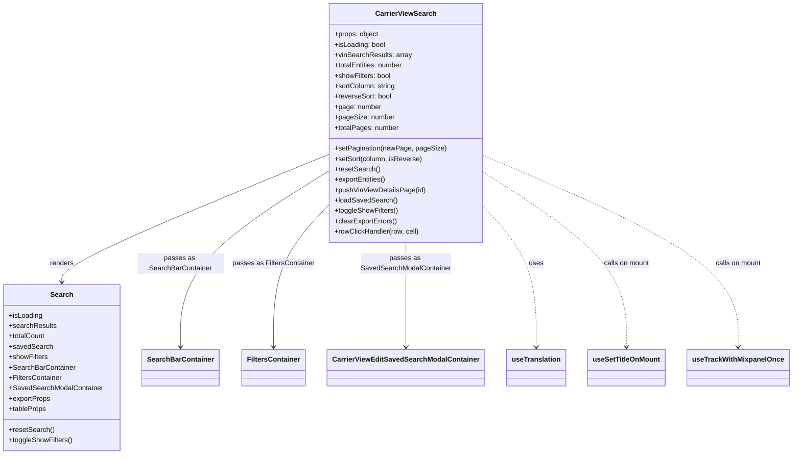

# Diagram: web/portal/src/pages/carrierview/search/CarrierView.Search.page.js


> Auto-generated by Obscura crawlers

## Diagram 1



### SVG

<svg id="container" width="1775.8671875" xmlns="http://www.w3.org/2000/svg" class="classDiagram" height="1050" viewBox="0 0 1775.8671875 1050" role="graphics-document document" aria-roledescription="class"><style>#container{font-family:"trebuchet ms",verdana,arial,sans-serif;font-size:16px;fill:#333;}@keyframes edge-animation-frame{from{stroke-dashoffset:0;}}@keyframes dash{to{stroke-dashoffset:0;}}#container .edge-animation-slow{stroke-dasharray:9,5!important;stroke-dashoffset:900;animation:dash 50s linear infinite;stroke-linecap:round;}#container .edge-animation-fast{stroke-dasharray:9,5!important;stroke-dashoffset:900;animation:dash 20s linear infinite;stroke-linecap:round;}#container .error-icon{fill:#552222;}#container .error-text{fill:#552222;stroke:#552222;}#container .edge-thickness-normal{stroke-width:1px;}#container .edge-thickness-thick{stroke-width:3.5px;}#container .edge-pattern-solid{stroke-dasharray:0;}#container .edge-thickness-invisible{stroke-width:0;fill:none;}#container .edge-pattern-dashed{stroke-dasharray:3;}#container .edge-pattern-dotted{stroke-dasharray:2;}#container .marker{fill:#333333;stroke:#333333;}#container .marker.cross{stroke:#333333;}#container svg{font-family:"trebuchet ms",verdana,arial,sans-serif;font-size:16px;}#container p{margin:0;}#container g.classGroup text{fill:#9370DB;stroke:none;font-family:"trebuchet ms",verdana,arial,sans-serif;font-size:10px;}#container g.classGroup text .title{font-weight:bolder;}#container .nodeLabel,#container .edgeLabel{color:#131300;}#container .edgeLabel .label rect{fill:#ECECFF;}#container .label text{fill:#131300;}#container .labelBkg{background:#ECECFF;}#container .edgeLabel .label span{background:#ECECFF;}#container .classTitle{font-weight:bolder;}#container .node rect,#container .node circle,#container .node ellipse,#container .node polygon,#container .node path{fill:#ECECFF;stroke:#9370DB;stroke-width:1px;}#container .divider{stroke:#9370DB;stroke-width:1;}#container g.clickable{cursor:pointer;}#container g.classGroup rect{fill:#ECECFF;stroke:#9370DB;}#container g.classGroup line{stroke:#9370DB;stroke-width:1;}#container .classLabel .box{stroke:none;stroke-width:0;fill:#ECECFF;opacity:0.5;}#container .classLabel .label{fill:#9370DB;font-size:10px;}#container .relation{stroke:#333333;stroke-width:1;fill:none;}#container .dashed-line{stroke-dasharray:3;}#container .dotted-line{stroke-dasharray:1 2;}#container #compositionStart,#container .composition{fill:#333333!important;stroke:#333333!important;stroke-width:1;}#container #compositionEnd,#container .composition{fill:#333333!important;stroke:#333333!important;stroke-width:1;}#container #dependencyStart,#container .dependency{fill:#333333!important;stroke:#333333!important;stroke-width:1;}#container #dependencyStart,#container .dependency{fill:#333333!important;stroke:#333333!important;stroke-width:1;}#container #extensionStart,#container .extension{fill:transparent!important;stroke:#333333!important;stroke-width:1;}#container #extensionEnd,#container .extension{fill:transparent!important;stroke:#333333!important;stroke-width:1;}#container #aggregationStart,#container .aggregation{fill:transparent!important;stroke:#333333!important;stroke-width:1;}#container #aggregationEnd,#container .aggregation{fill:transparent!important;stroke:#333333!important;stroke-width:1;}#container #lollipopStart,#container .lollipop{fill:#ECECFF!important;stroke:#333333!important;stroke-width:1;}#container #lollipopEnd,#container .lollipop{fill:#ECECFF!important;stroke:#333333!important;stroke-width:1;}#container .edgeTerminals{font-size:11px;line-height:initial;}#container .classTitleText{text-anchor:middle;font-size:18px;fill:#333;}#container .label-icon{display:inline-block;height:1em;overflow:visible;vertical-align:-0.125em;}#container .node .label-icon path{fill:currentColor;stroke:revert;stroke-width:revert;}#container :root{--mermaid-font-family:"trebuchet ms",verdana,arial,sans-serif;}</style><g><defs><marker id="container_class-aggregationStart" class="marker aggregation class" refX="18" refY="7" markerWidth="190" markerHeight="240" orient="auto"><path d="M 18,7 L9,13 L1,7 L9,1 Z"></path></marker></defs><defs><marker id="container_class-aggregationEnd" class="marker aggregation class" refX="1" refY="7" markerWidth="20" markerHeight="28" orient="auto"><path d="M 18,7 L9,13 L1,7 L9,1 Z"></path></marker></defs><defs><marker id="container_class-extensionStart" class="marker extension class" refX="18" refY="7" markerWidth="190" markerHeight="240" orient="auto"><path d="M 1,7 L18,13 V 1 Z"></path></marker></defs><defs><marker id="container_class-extensionEnd" class="marker extension class" refX="1" refY="7" markerWidth="20" markerHeight="28" orient="auto"><path d="M 1,1 V 13 L18,7 Z"></path></marker></defs><defs><marker id="container_class-compositionStart" class="marker composition class" refX="18" refY="7" markerWidth="190" markerHeight="240" orient="auto"><path d="M 18,7 L9,13 L1,7 L9,1 Z"></path></marker></defs><defs><marker id="container_class-compositionEnd" class="marker composition class" refX="1" refY="7" markerWidth="20" markerHeight="28" orient="auto"><path d="M 18,7 L9,13 L1,7 L9,1 Z"></path></marker></defs><defs><marker id="container_class-dependencyStart" class="marker dependency class" refX="6" refY="7" markerWidth="190" markerHeight="240" orient="auto"><path d="M 5,7 L9,13 L1,7 L9,1 Z"></path></marker></defs><defs><marker id="container_class-dependencyEnd" class="marker dependency class" refX="13" refY="7" markerWidth="20" markerHeight="28" orient="auto"><path d="M 18,7 L9,13 L14,7 L9,1 Z"></path></marker></defs><defs><marker id="container_class-lollipopStart" class="marker lollipop class" refX="13" refY="7" markerWidth="190" markerHeight="240" orient="auto"><circle stroke="black" fill="transparent" cx="7" cy="7" r="6"></circle></marker></defs><defs><marker id="container_class-lollipopEnd" class="marker lollipop class" refX="1" refY="7" markerWidth="190" markerHeight="240" orient="auto"><circle stroke="black" fill="transparent" cx="7" cy="7" r="6"></circle></marker></defs><g class="root"><g class="clusters"></g><g class="edgePaths"><path d="M742.188,356.015L641.753,398.179C541.318,440.343,340.448,524.672,240.013,574.002C139.578,623.333,139.578,637.667,139.578,644.833L139.578,652" id="id_CarrierViewSearch_Search_1" class="edge-thickness-normal edge-pattern-solid relation" style=";;;" data-edge="true" data-et="edge" data-id="id_CarrierViewSearch_Search_1" data-points="W3sieCI6NzQyLjE4NzUsInkiOjM1Ni4wMTQ4NjUxMjM5NzY5Nn0seyJ4IjoxMzkuNTc4MTI1LCJ5Ijo2MDl9LHsieCI6MTM5LjU3ODEyNSwieSI6NjU4fV0=" marker-end="url(#container_class-dependencyEnd)"></path><path d="M742.188,393.804L686.156,429.67C630.125,465.536,518.063,537.268,462.031,605.301C406,673.333,406,737.667,406,769.833L406,802" id="id_CarrierViewSearch_SearchBarContainer_2" class="edge-thickness-normal edge-pattern-solid relation" style=";;;" data-edge="true" data-et="edge" data-id="id_CarrierViewSearch_SearchBarContainer_2" data-points="W3sieCI6NzQyLjE4NzUsInkiOjM5My44MDM1ODIxNDQ2NzA2Nn0seyJ4Ijo0MDYsInkiOjYwOX0seyJ4Ijo0MDYsInkiOjgwOH1d" marker-end="url(#container_class-dependencyEnd)"></path><path d="M742.188,473.818L721.827,496.348C701.466,518.879,660.745,563.939,640.384,618.636C620.023,673.333,620.023,737.667,620.023,769.833L620.023,802" id="id_CarrierViewSearch_FiltersContainer_3" class="edge-thickness-normal edge-pattern-solid relation" style=";;;" data-edge="true" data-et="edge" data-id="id_CarrierViewSearch_FiltersContainer_3" data-points="W3sieCI6NzQyLjE4NzUsInkiOjQ3My44MTgxODkwNzI3MjQ0fSx7IngiOjYyMC4wMjM0Mzc1LCJ5Ijo2MDl9LHsieCI6NjIwLjAyMzQzNzUsInkiOjgwOH1d" marker-end="url(#container_class-dependencyEnd)"></path><path d="M913.727,560L913.727,568.167C913.727,576.333,913.727,592.667,913.727,633C913.727,673.333,913.727,737.667,913.727,769.833L913.727,802" id="id_CarrierViewSearch_CarrierViewEditSavedSearchModalContainer_4" class="edge-thickness-normal edge-pattern-solid relation" style=";;;" data-edge="true" data-et="edge" data-id="id_CarrierViewSearch_CarrierViewEditSavedSearchModalContainer_4" data-points="W3sieCI6OTEzLjcyNjU2MjUsInkiOjU2MH0seyJ4Ijo5MTMuNzI2NTYyNSwieSI6NjA5fSx7IngiOjkxMy43MjY1NjI1LCJ5Ijo4MDh9XQ==" marker-end="url(#container_class-dependencyEnd)"></path><path d="M1085.266,476.538L1104.935,498.615C1124.604,520.692,1163.943,564.846,1183.612,619.09C1203.281,673.333,1203.281,737.667,1203.281,769.833L1203.281,802" id="id_CarrierViewSearch_useTranslation_5" class="edge-thickness-normal edge-pattern-dashed relation" style=";;;" data-edge="true" data-et="edge" data-id="id_CarrierViewSearch_useTranslation_5" data-points="W3sieCI6MTA4NS4yNjU2MjUsInkiOjQ3Ni41Mzc3MDYwNjgwNDYzfSx7IngiOjEyMDMuMjgxMjUsInkiOjYwOX0seyJ4IjoxMjAzLjI4MTI1LCJ5Ijo4MDh9XQ==" marker-end="url(#container_class-dependencyEnd)"></path><path d="M1085.266,397.245L1138.725,432.538C1192.185,467.83,1299.104,538.415,1352.564,605.874C1406.023,673.333,1406.023,737.667,1406.023,769.833L1406.023,802" id="id_CarrierViewSearch_useSetTitleOnMount_6" class="edge-thickness-normal edge-pattern-dashed relation" style=";;;" data-edge="true" data-et="edge" data-id="id_CarrierViewSearch_useSetTitleOnMount_6" data-points="W3sieCI6MTA4NS4yNjU2MjUsInkiOjM5Ny4yNDUwNzI1MjM1NjYyfSx7IngiOjE0MDYuMDIzNDM3NSwieSI6NjA5fSx7IngiOjE0MDYuMDIzNDM3NSwieSI6ODA4fV0=" marker-end="url(#container_class-dependencyEnd)"></path><path d="M1085.266,359.181L1180.267,400.817C1275.268,442.454,1465.271,525.727,1560.272,599.53C1655.273,673.333,1655.273,737.667,1655.273,769.833L1655.273,802" id="id_CarrierViewSearch_useTrackWithMixpanelOnce_7" class="edge-thickness-normal edge-pattern-dashed relation" style=";;;" data-edge="true" data-et="edge" data-id="id_CarrierViewSearch_useTrackWithMixpanelOnce_7" data-points="W3sieCI6MTA4NS4yNjU2MjUsInkiOjM1OS4xODA5NDU2NTgzNTc3Nn0seyJ4IjoxNjU1LjI3MzQzNzUsInkiOjYwOX0seyJ4IjoxNjU1LjI3MzQzNzUsInkiOjgwOH1d" marker-end="url(#container_class-dependencyEnd)"></path></g><g class="edgeLabels"><g class="edgeLabel" transform="translate(139.578125, 609)"><g class="label" data-id="id_CarrierViewSearch_Search_1" transform="translate(-27.75, -12)"><foreignObject width="55.5" height="24"><div xmlns="http://www.w3.org/1999/xhtml" class="labelBkg" style="display: table-cell; white-space: nowrap; line-height: 1.5; max-width: 200px; text-align: center;"><span class="edgeLabel"><p>renders</p></span></div></foreignObject></g></g><g class="edgeLabel" transform="translate(406, 609)"><g class="label" data-id="id_CarrierViewSearch_SearchBarContainer_2" transform="translate(-100, -24)"><foreignObject width="200" height="48"><div xmlns="http://www.w3.org/1999/xhtml" class="labelBkg" style="display: table; white-space: break-spaces; line-height: 1.5; max-width: 200px; text-align: center; width: 200px;"><span class="edgeLabel"><p>passes as SearchBarContainer</p></span></div></foreignObject></g></g><g class="edgeLabel" transform="translate(620.0234375, 609)"><g class="label" data-id="id_CarrierViewSearch_FiltersContainer_3" transform="translate(-94.0234375, -12)"><foreignObject width="188.046875" height="24"><div xmlns="http://www.w3.org/1999/xhtml" class="labelBkg" style="display: table-cell; white-space: nowrap; line-height: 1.5; max-width: 200px; text-align: center;"><span class="edgeLabel"><p>passes as FiltersContainer</p></span></div></foreignObject></g></g><g class="edgeLabel" transform="translate(913.7265625, 609)"><g class="label" data-id="id_CarrierViewSearch_CarrierViewEditSavedSearchModalContainer_4" transform="translate(-103.5390625, -24)"><foreignObject width="207.078125" height="48"><div xmlns="http://www.w3.org/1999/xhtml" class="labelBkg" style="display: table; white-space: break-spaces; line-height: 1.5; max-width: 200px; text-align: center; width: 200px;"><span class="edgeLabel"><p>passes as SavedSearchModalContainer</p></span></div></foreignObject></g></g><g class="edgeLabel" transform="translate(1203.28125, 609)"><g class="label" data-id="id_CarrierViewSearch_useTranslation_5" transform="translate(-16.4921875, -12)"><foreignObject width="32.984375" height="24"><div xmlns="http://www.w3.org/1999/xhtml" class="labelBkg" style="display: table-cell; white-space: nowrap; line-height: 1.5; max-width: 200px; text-align: center;"><span class="edgeLabel"><p>uses</p></span></div></foreignObject></g></g><g class="edgeLabel" transform="translate(1406.0234375, 609)"><g class="label" data-id="id_CarrierViewSearch_useSetTitleOnMount_6" transform="translate(-53.8046875, -12)"><foreignObject width="107.609375" height="24"><div xmlns="http://www.w3.org/1999/xhtml" class="labelBkg" style="display: table-cell; white-space: nowrap; line-height: 1.5; max-width: 200px; text-align: center;"><span class="edgeLabel"><p>calls on mount</p></span></div></foreignObject></g></g><g class="edgeLabel" transform="translate(1655.2734375, 609)"><g class="label" data-id="id_CarrierViewSearch_useTrackWithMixpanelOnce_7" transform="translate(-53.8046875, -12)"><foreignObject width="107.609375" height="24"><div xmlns="http://www.w3.org/1999/xhtml" class="labelBkg" style="display: table-cell; white-space: nowrap; line-height: 1.5; max-width: 200px; text-align: center;"><span class="edgeLabel"><p>calls on mount</p></span></div></foreignObject></g></g></g><g class="nodes"><g class="node default" id="classId-CarrierViewSearch-0" transform="translate(913.7265625, 284)"><g class="basic label-container"><path d="M-171.5390625 -276 L171.5390625 -276 L171.5390625 276 L-171.5390625 276" stroke="none" stroke-width="0" fill="#ECECFF" style=""></path><path d="M-171.5390625 -276 C-50.83250769156699 -276, 69.87404711686602 -276, 171.5390625 -276 M-171.5390625 -276 C-86.43982878479635 -276, -1.3405950695926947 -276, 171.5390625 -276 M171.5390625 -276 C171.5390625 -160.24204704204925, 171.5390625 -44.4840940840985, 171.5390625 276 M171.5390625 -276 C171.5390625 -142.66804041858163, 171.5390625 -9.336080837163252, 171.5390625 276 M171.5390625 276 C36.19496435157771 276, -99.14913379684458 276, -171.5390625 276 M171.5390625 276 C76.52591447191713 276, -18.487233556165734 276, -171.5390625 276 M-171.5390625 276 C-171.5390625 58.549634760541124, -171.5390625 -158.90073047891775, -171.5390625 -276 M-171.5390625 276 C-171.5390625 149.56541921317142, -171.5390625 23.130838426342876, -171.5390625 -276" stroke="#9370DB" stroke-width="1.3" fill="none" stroke-dasharray="0 0" style=""></path></g><g class="annotation-group text" transform="translate(0, -252)"></g><g class="label-group text" transform="translate(-67.140625, -252)"><g class="label" style="font-weight: bolder" transform="translate(0,-12)"><foreignObject width="134.28125" height="24"><div xmlns="http://www.w3.org/1999/xhtml" style="display: table-cell; white-space: nowrap; line-height: 1.5; max-width: 182px; text-align: center;"><span class="nodeLabel markdown-node-label" style=""><p>CarrierViewSearch</p></span></div></foreignObject></g></g><g class="members-group text" transform="translate(-159.5390625, -204)"><g class="label" style="" transform="translate(0,-12)"><foreignObject width="103.0625" height="24"><div xmlns="http://www.w3.org/1999/xhtml" style="display: table-cell; white-space: nowrap; line-height: 1.5; max-width: 161px; text-align: center;"><span class="nodeLabel markdown-node-label" style=""><p>+props: object</p></span></div></foreignObject></g><g class="label" style="" transform="translate(0,12)"><foreignObject width="118.171875" height="24"><div xmlns="http://www.w3.org/1999/xhtml" style="display: table-cell; white-space: nowrap; line-height: 1.5; max-width: 176px; text-align: center;"><span class="nodeLabel markdown-node-label" style=""><p>+isLoading: bool</p></span></div></foreignObject></g><g class="label" style="" transform="translate(0,36)"><foreignObject width="176.09375" height="24"><div xmlns="http://www.w3.org/1999/xhtml" style="display: table-cell; white-space: nowrap; line-height: 1.5; max-width: 234px; text-align: center;"><span class="nodeLabel markdown-node-label" style=""><p>+vinSearchResults: array</p></span></div></foreignObject></g><g class="label" style="" transform="translate(0,60)"><foreignObject width="161.109375" height="24"><div xmlns="http://www.w3.org/1999/xhtml" style="display: table-cell; white-space: nowrap; line-height: 1.5; max-width: 219px; text-align: center;"><span class="nodeLabel markdown-node-label" style=""><p>+totalEntities: number</p></span></div></foreignObject></g><g class="label" style="" transform="translate(0,84)"><foreignObject width="130.78125" height="24"><div xmlns="http://www.w3.org/1999/xhtml" style="display: table-cell; white-space: nowrap; line-height: 1.5; max-width: 188px; text-align: center;"><span class="nodeLabel markdown-node-label" style=""><p>+showFilters: bool</p></span></div></foreignObject></g><g class="label" style="" transform="translate(0,108)"><foreignObject width="141.546875" height="24"><div xmlns="http://www.w3.org/1999/xhtml" style="display: table-cell; white-space: nowrap; line-height: 1.5; max-width: 200px; text-align: center;"><span class="nodeLabel markdown-node-label" style=""><p>+sortColumn: string</p></span></div></foreignObject></g><g class="label" style="" transform="translate(0,132)"><foreignObject width="132.046875" height="24"><div xmlns="http://www.w3.org/1999/xhtml" style="display: table-cell; white-space: nowrap; line-height: 1.5; max-width: 190px; text-align: center;"><span class="nodeLabel markdown-node-label" style=""><p>+reverseSort: bool</p></span></div></foreignObject></g><g class="label" style="" transform="translate(0,156)"><foreignObject width="107.546875" height="24"><div xmlns="http://www.w3.org/1999/xhtml" style="display: table-cell; white-space: nowrap; line-height: 1.5; max-width: 166px; text-align: center;"><span class="nodeLabel markdown-node-label" style=""><p>+page: number</p></span></div></foreignObject></g><g class="label" style="" transform="translate(0,180)"><foreignObject width="136.375" height="24"><div xmlns="http://www.w3.org/1999/xhtml" style="display: table-cell; white-space: nowrap; line-height: 1.5; max-width: 195px; text-align: center;"><span class="nodeLabel markdown-node-label" style=""><p>+pageSize: number</p></span></div></foreignObject></g><g class="label" style="" transform="translate(0,204)"><foreignObject width="147.78125" height="24"><div xmlns="http://www.w3.org/1999/xhtml" style="display: table-cell; white-space: nowrap; line-height: 1.5; max-width: 206px; text-align: center;"><span class="nodeLabel markdown-node-label" style=""><p>+totalPages: number</p></span></div></foreignObject></g></g><g class="methods-group text" transform="translate(-159.5390625, 60)"><g class="label" style="" transform="translate(0,-12)"><foreignObject width="251.9375" height="24"><div xmlns="http://www.w3.org/1999/xhtml" style="display: table-cell; white-space: nowrap; line-height: 1.5; max-width: 309px; text-align: center;"><span class="nodeLabel markdown-node-label" style=""><p>+setPagination(newPage, pageSize)</p></span></div></foreignObject></g><g class="label" style="" transform="translate(0,12)"><foreignObject width="200.921875" height="24"><div xmlns="http://www.w3.org/1999/xhtml" style="display: table-cell; white-space: nowrap; line-height: 1.5; max-width: 258px; text-align: center;"><span class="nodeLabel markdown-node-label" style=""><p>+setSort(column, isReverse)</p></span></div></foreignObject></g><g class="label" style="" transform="translate(0,36)"><foreignObject width="103.453125" height="24"><div xmlns="http://www.w3.org/1999/xhtml" style="display: table-cell; white-space: nowrap; line-height: 1.5; max-width: 161px; text-align: center;"><span class="nodeLabel markdown-node-label" style=""><p>+resetSearch()</p></span></div></foreignObject></g><g class="label" style="" transform="translate(0,60)"><foreignObject width="120.046875" height="24"><div xmlns="http://www.w3.org/1999/xhtml" style="display: table-cell; white-space: nowrap; line-height: 1.5; max-width: 177px; text-align: center;"><span class="nodeLabel markdown-node-label" style=""><p>+exportEntities()</p></span></div></foreignObject></g><g class="label" style="" transform="translate(0,84)"><foreignObject width="208.296875" height="24"><div xmlns="http://www.w3.org/1999/xhtml" style="display: table-cell; white-space: nowrap; line-height: 1.5; max-width: 266px; text-align: center;"><span class="nodeLabel markdown-node-label" style=""><p>+pushVinViewDetailsPage(id)</p></span></div></foreignObject></g><g class="label" style="" transform="translate(0,108)"><foreignObject width="142.40625" height="24"><div xmlns="http://www.w3.org/1999/xhtml" style="display: table-cell; white-space: nowrap; line-height: 1.5; max-width: 200px; text-align: center;"><span class="nodeLabel markdown-node-label" style=""><p>+loadSavedSearch()</p></span></div></foreignObject></g><g class="label" style="" transform="translate(0,132)"><foreignObject width="146.203125" height="24"><div xmlns="http://www.w3.org/1999/xhtml" style="display: table-cell; white-space: nowrap; line-height: 1.5; max-width: 204px; text-align: center;"><span class="nodeLabel markdown-node-label" style=""><p>+toggleShowFilters()</p></span></div></foreignObject></g><g class="label" style="" transform="translate(0,156)"><foreignObject width="144.203125" height="24"><div xmlns="http://www.w3.org/1999/xhtml" style="display: table-cell; white-space: nowrap; line-height: 1.5; max-width: 202px; text-align: center;"><span class="nodeLabel markdown-node-label" style=""><p>+clearExportErrors()</p></span></div></foreignObject></g><g class="label" style="" transform="translate(0,180)"><foreignObject width="196.4375" height="24"><div xmlns="http://www.w3.org/1999/xhtml" style="display: table-cell; white-space: nowrap; line-height: 1.5; max-width: 254px; text-align: center;"><span class="nodeLabel markdown-node-label" style=""><p>+rowClickHandler(row, cell)</p></span></div></foreignObject></g></g><g class="divider" style=""><path d="M-171.5390625 -228 C-63.87933813839804 -228, 43.78038622320392 -228, 171.5390625 -228 M-171.5390625 -228 C-64.94600638919003 -228, 41.647049721619936 -228, 171.5390625 -228" stroke="#9370DB" stroke-width="1.3" fill="none" stroke-dasharray="0 0" style=""></path></g><g class="divider" style=""><path d="M-171.5390625 36 C-66.02473216555816 36, 39.489598168883674 36, 171.5390625 36 M-171.5390625 36 C-93.22902003841949 36, -14.918977576838984 36, 171.5390625 36" stroke="#9370DB" stroke-width="1.3" fill="none" stroke-dasharray="0 0" style=""></path></g></g><g class="node default" id="classId-Search-1" transform="translate(139.578125, 850)"><g class="basic label-container"><path d="M-131.578125 -192 L131.578125 -192 L131.578125 192 L-131.578125 192" stroke="none" stroke-width="0" fill="#ECECFF" style=""></path><path d="M-131.578125 -192 C-30.72895390466458 -192, 70.12021719067084 -192, 131.578125 -192 M-131.578125 -192 C-78.2101985071195 -192, -24.842272014239 -192, 131.578125 -192 M131.578125 -192 C131.578125 -58.279942555161824, 131.578125 75.44011488967635, 131.578125 192 M131.578125 -192 C131.578125 -41.85194798953577, 131.578125 108.29610402092845, 131.578125 192 M131.578125 192 C62.4669498573155 192, -6.644225285369004 192, -131.578125 192 M131.578125 192 C54.00466138086291 192, -23.568802238274174 192, -131.578125 192 M-131.578125 192 C-131.578125 109.10158066960507, -131.578125 26.20316133921014, -131.578125 -192 M-131.578125 192 C-131.578125 56.28394691954665, -131.578125 -79.4321061609067, -131.578125 -192" stroke="#9370DB" stroke-width="1.3" fill="none" stroke-dasharray="0 0" style=""></path></g><g class="annotation-group text" transform="translate(0, -168)"></g><g class="label-group text" transform="translate(-24.71875, -168)"><g class="label" style="font-weight: bolder" transform="translate(0,-12)"><foreignObject width="49.4375" height="24"><div xmlns="http://www.w3.org/1999/xhtml" style="display: table-cell; white-space: nowrap; line-height: 1.5; max-width: 99px; text-align: center;"><span class="nodeLabel markdown-node-label" style=""><p>Search</p></span></div></foreignObject></g></g><g class="members-group text" transform="translate(-119.578125, -120)"><g class="label" style="" transform="translate(0,-12)"><foreignObject width="77.203125" height="24"><div xmlns="http://www.w3.org/1999/xhtml" style="display: table-cell; white-space: nowrap; line-height: 1.5; max-width: 135px; text-align: center;"><span class="nodeLabel markdown-node-label" style=""><p>+isLoading</p></span></div></foreignObject></g><g class="label" style="" transform="translate(0,12)"><foreignObject width="108.328125" height="24"><div xmlns="http://www.w3.org/1999/xhtml" style="display: table-cell; white-space: nowrap; line-height: 1.5; max-width: 166px; text-align: center;"><span class="nodeLabel markdown-node-label" style=""><p>+searchResults</p></span></div></foreignObject></g><g class="label" style="" transform="translate(0,36)"><foreignObject width="84.140625" height="24"><div xmlns="http://www.w3.org/1999/xhtml" style="display: table-cell; white-space: nowrap; line-height: 1.5; max-width: 142px; text-align: center;"><span class="nodeLabel markdown-node-label" style=""><p>+totalCount</p></span></div></foreignObject></g><g class="label" style="" transform="translate(0,60)"><foreignObject width="98.5625" height="24"><div xmlns="http://www.w3.org/1999/xhtml" style="display: table-cell; white-space: nowrap; line-height: 1.5; max-width: 156px; text-align: center;"><span class="nodeLabel markdown-node-label" style=""><p>+savedSearch</p></span></div></foreignObject></g><g class="label" style="" transform="translate(0,84)"><foreignObject width="89.8125" height="24"><div xmlns="http://www.w3.org/1999/xhtml" style="display: table-cell; white-space: nowrap; line-height: 1.5; max-width: 147px; text-align: center;"><span class="nodeLabel markdown-node-label" style=""><p>+showFilters</p></span></div></foreignObject></g><g class="label" style="" transform="translate(0,108)"><foreignObject width="151.171875" height="24"><div xmlns="http://www.w3.org/1999/xhtml" style="display: table-cell; white-space: nowrap; line-height: 1.5; max-width: 209px; text-align: center;"><span class="nodeLabel markdown-node-label" style=""><p>+SearchBarContainer</p></span></div></foreignObject></g><g class="label" style="" transform="translate(0,132)"><foreignObject width="122.65625" height="24"><div xmlns="http://www.w3.org/1999/xhtml" style="display: table-cell; white-space: nowrap; line-height: 1.5; max-width: 181px; text-align: center;"><span class="nodeLabel markdown-node-label" style=""><p>+FiltersContainer</p></span></div></foreignObject></g><g class="label" style="" transform="translate(0,156)"><foreignObject width="214.4375" height="24"><div xmlns="http://www.w3.org/1999/xhtml" style="display: table-cell; white-space: nowrap; line-height: 1.5; max-width: 273px; text-align: center;"><span class="nodeLabel markdown-node-label" style=""><p>+SavedSearchModalContainer</p></span></div></foreignObject></g><g class="label" style="" transform="translate(0,180)"><foreignObject width="96.125" height="24"><div xmlns="http://www.w3.org/1999/xhtml" style="display: table-cell; white-space: nowrap; line-height: 1.5; max-width: 153px; text-align: center;"><span class="nodeLabel markdown-node-label" style=""><p>+exportProps</p></span></div></foreignObject></g><g class="label" style="" transform="translate(0,204)"><foreignObject width="86.109375" height="24"><div xmlns="http://www.w3.org/1999/xhtml" style="display: table-cell; white-space: nowrap; line-height: 1.5; max-width: 143px; text-align: center;"><span class="nodeLabel markdown-node-label" style=""><p>+tableProps</p></span></div></foreignObject></g></g><g class="methods-group text" transform="translate(-119.578125, 144)"><g class="label" style="" transform="translate(0,-12)"><foreignObject width="103.453125" height="24"><div xmlns="http://www.w3.org/1999/xhtml" style="display: table-cell; white-space: nowrap; line-height: 1.5; max-width: 161px; text-align: center;"><span class="nodeLabel markdown-node-label" style=""><p>+resetSearch()</p></span></div></foreignObject></g><g class="label" style="" transform="translate(0,12)"><foreignObject width="146.203125" height="24"><div xmlns="http://www.w3.org/1999/xhtml" style="display: table-cell; white-space: nowrap; line-height: 1.5; max-width: 204px; text-align: center;"><span class="nodeLabel markdown-node-label" style=""><p>+toggleShowFilters()</p></span></div></foreignObject></g></g><g class="divider" style=""><path d="M-131.578125 -144 C-38.73635287066975 -144, 54.105419258660504 -144, 131.578125 -144 M-131.578125 -144 C-51.71200027524746 -144, 28.154124449505076 -144, 131.578125 -144" stroke="#9370DB" stroke-width="1.3" fill="none" stroke-dasharray="0 0" style=""></path></g><g class="divider" style=""><path d="M-131.578125 120 C-63.68918516126122 120, 4.199754677477557 120, 131.578125 120 M-131.578125 120 C-77.5601265243523 120, -23.542128048704598 120, 131.578125 120" stroke="#9370DB" stroke-width="1.3" fill="none" stroke-dasharray="0 0" style=""></path></g></g><g class="node default" id="classId-SearchBarContainer-2" transform="translate(406, 850)"><g class="basic label-container"><path d="M-84.84375 -42 L84.84375 -42 L84.84375 42 L-84.84375 42" stroke="none" stroke-width="0" fill="#ECECFF" style=""></path><path d="M-84.84375 -42 C-47.63514447778832 -42, -10.426538955576646 -42, 84.84375 -42 M-84.84375 -42 C-35.96879659177288 -42, 12.906156816454242 -42, 84.84375 -42 M84.84375 -42 C84.84375 -12.22782323943396, 84.84375 17.54435352113208, 84.84375 42 M84.84375 -42 C84.84375 -9.648406091844578, 84.84375 22.703187816310844, 84.84375 42 M84.84375 42 C46.57566209265879 42, 8.307574185317577 42, -84.84375 42 M84.84375 42 C36.982769936813284 42, -10.878210126373432 42, -84.84375 42 M-84.84375 42 C-84.84375 18.685719889266323, -84.84375 -4.628560221467353, -84.84375 -42 M-84.84375 42 C-84.84375 12.058036882947448, -84.84375 -17.883926234105104, -84.84375 -42" stroke="#9370DB" stroke-width="1.3" fill="none" stroke-dasharray="0 0" style=""></path></g><g class="annotation-group text" transform="translate(0, -18)"></g><g class="label-group text" transform="translate(-72.84375, -18)"><g class="label" style="font-weight: bolder" transform="translate(0,-12)"><foreignObject width="145.6875" height="24"><div xmlns="http://www.w3.org/1999/xhtml" style="display: table-cell; white-space: nowrap; line-height: 1.5; max-width: 195px; text-align: center;"><span class="nodeLabel markdown-node-label" style=""><p>SearchBarContainer</p></span></div></foreignObject></g></g><g class="members-group text" transform="translate(-72.84375, 30)"></g><g class="methods-group text" transform="translate(-72.84375, 60)"></g><g class="divider" style=""><path d="M-84.84375 6 C-40.41029068365542 6, 4.023168632689163 6, 84.84375 6 M-84.84375 6 C-29.348322865167262 6, 26.147104269665476 6, 84.84375 6" stroke="#9370DB" stroke-width="1.3" fill="none" stroke-dasharray="0 0" style=""></path></g><g class="divider" style=""><path d="M-84.84375 24 C-35.246059905411414 24, 14.351630189177172 24, 84.84375 24 M-84.84375 24 C-40.46347090233147 24, 3.9168081953370546 24, 84.84375 24" stroke="#9370DB" stroke-width="1.3" fill="none" stroke-dasharray="0 0" style=""></path></g></g><g class="node default" id="classId-FiltersContainer-3" transform="translate(620.0234375, 850)"><g class="basic label-container"><path d="M-70.234375 -42 L70.234375 -42 L70.234375 42 L-70.234375 42" stroke="none" stroke-width="0" fill="#ECECFF" style=""></path><path d="M-70.234375 -42 C-23.6707523486629 -42, 22.892870302674197 -42, 70.234375 -42 M-70.234375 -42 C-29.333023992812237 -42, 11.568327014375527 -42, 70.234375 -42 M70.234375 -42 C70.234375 -23.85978413492698, 70.234375 -5.7195682698539585, 70.234375 42 M70.234375 -42 C70.234375 -19.264034278594266, 70.234375 3.471931442811467, 70.234375 42 M70.234375 42 C33.37501027059919 42, -3.4843544588016186 42, -70.234375 42 M70.234375 42 C29.789580586451272 42, -10.655213827097455 42, -70.234375 42 M-70.234375 42 C-70.234375 8.940065436225979, -70.234375 -24.119869127548043, -70.234375 -42 M-70.234375 42 C-70.234375 20.350364651035125, -70.234375 -1.2992706979297495, -70.234375 -42" stroke="#9370DB" stroke-width="1.3" fill="none" stroke-dasharray="0 0" style=""></path></g><g class="annotation-group text" transform="translate(0, -18)"></g><g class="label-group text" transform="translate(-58.234375, -18)"><g class="label" style="font-weight: bolder" transform="translate(0,-12)"><foreignObject width="116.46875" height="24"><div xmlns="http://www.w3.org/1999/xhtml" style="display: table-cell; white-space: nowrap; line-height: 1.5; max-width: 165px; text-align: center;"><span class="nodeLabel markdown-node-label" style=""><p>FiltersContainer</p></span></div></foreignObject></g></g><g class="members-group text" transform="translate(-58.234375, 30)"></g><g class="methods-group text" transform="translate(-58.234375, 60)"></g><g class="divider" style=""><path d="M-70.234375 6 C-35.11933990475121 6, -0.0043048095024147415 6, 70.234375 6 M-70.234375 6 C-21.292806787454317 6, 27.648761425091365 6, 70.234375 6" stroke="#9370DB" stroke-width="1.3" fill="none" stroke-dasharray="0 0" style=""></path></g><g class="divider" style=""><path d="M-70.234375 24 C-16.640797517612818 24, 36.952779964774365 24, 70.234375 24 M-70.234375 24 C-33.07639891081129 24, 4.081577178377415 24, 70.234375 24" stroke="#9370DB" stroke-width="1.3" fill="none" stroke-dasharray="0 0" style=""></path></g></g><g class="node default" id="classId-CarrierViewEditSavedSearchModalContainer-4" transform="translate(913.7265625, 850)"><g class="basic label-container"><path d="M-173.46875 -42 L173.46875 -42 L173.46875 42 L-173.46875 42" stroke="none" stroke-width="0" fill="#ECECFF" style=""></path><path d="M-173.46875 -42 C-63.664685142280035 -42, 46.13937971543993 -42, 173.46875 -42 M-173.46875 -42 C-98.84236489361852 -42, -24.215979787237046 -42, 173.46875 -42 M173.46875 -42 C173.46875 -25.026398199857006, 173.46875 -8.052796399714012, 173.46875 42 M173.46875 -42 C173.46875 -21.033127081707928, 173.46875 -0.06625416341585577, 173.46875 42 M173.46875 42 C47.5540151632642 42, -78.3607196734716 42, -173.46875 42 M173.46875 42 C70.59373427970145 42, -32.2812814405971 42, -173.46875 42 M-173.46875 42 C-173.46875 12.881309040783485, -173.46875 -16.23738191843303, -173.46875 -42 M-173.46875 42 C-173.46875 18.5940170378964, -173.46875 -4.8119659242072, -173.46875 -42" stroke="#9370DB" stroke-width="1.3" fill="none" stroke-dasharray="0 0" style=""></path></g><g class="annotation-group text" transform="translate(0, -18)"></g><g class="label-group text" transform="translate(-161.46875, -18)"><g class="label" style="font-weight: bolder" transform="translate(0,-12)"><foreignObject width="322.9375" height="24"><div xmlns="http://www.w3.org/1999/xhtml" style="display: table-cell; white-space: nowrap; line-height: 1.5; max-width: 369px; text-align: center;"><span class="nodeLabel markdown-node-label" style=""><p>CarrierViewEditSavedSearchModalContainer</p></span></div></foreignObject></g></g><g class="members-group text" transform="translate(-161.46875, 30)"></g><g class="methods-group text" transform="translate(-161.46875, 60)"></g><g class="divider" style=""><path d="M-173.46875 6 C-79.87455801867513 6, 13.719633962649738 6, 173.46875 6 M-173.46875 6 C-49.55935605886302 6, 74.35003788227397 6, 173.46875 6" stroke="#9370DB" stroke-width="1.3" fill="none" stroke-dasharray="0 0" style=""></path></g><g class="divider" style=""><path d="M-173.46875 24 C-42.647251953851764 24, 88.17424609229647 24, 173.46875 24 M-173.46875 24 C-51.69011853553525 24, 70.0885129289295 24, 173.46875 24" stroke="#9370DB" stroke-width="1.3" fill="none" stroke-dasharray="0 0" style=""></path></g></g><g class="node default" id="classId-useTranslation-5" transform="translate(1203.28125, 850)"><g class="basic label-container"><path d="M-66.0859375 -42 L66.0859375 -42 L66.0859375 42 L-66.0859375 42" stroke="none" stroke-width="0" fill="#ECECFF" style=""></path><path d="M-66.0859375 -42 C-33.84744441715554 -42, -1.6089513343110866 -42, 66.0859375 -42 M-66.0859375 -42 C-33.01963356060108 -42, 0.04667037879784175 -42, 66.0859375 -42 M66.0859375 -42 C66.0859375 -23.157177736563664, 66.0859375 -4.314355473127328, 66.0859375 42 M66.0859375 -42 C66.0859375 -10.31230436361804, 66.0859375 21.37539127276392, 66.0859375 42 M66.0859375 42 C21.822571111556883 42, -22.440795276886234 42, -66.0859375 42 M66.0859375 42 C22.112304579925222 42, -21.861328340149555 42, -66.0859375 42 M-66.0859375 42 C-66.0859375 24.955647197342756, -66.0859375 7.9112943946855125, -66.0859375 -42 M-66.0859375 42 C-66.0859375 23.86046361210187, -66.0859375 5.7209272242037414, -66.0859375 -42" stroke="#9370DB" stroke-width="1.3" fill="none" stroke-dasharray="0 0" style=""></path></g><g class="annotation-group text" transform="translate(0, -18)"></g><g class="label-group text" transform="translate(-54.0859375, -18)"><g class="label" style="font-weight: bolder" transform="translate(0,-12)"><foreignObject width="108.171875" height="24"><div xmlns="http://www.w3.org/1999/xhtml" style="display: table-cell; white-space: nowrap; line-height: 1.5; max-width: 157px; text-align: center;"><span class="nodeLabel markdown-node-label" style=""><p>useTranslation</p></span></div></foreignObject></g></g><g class="members-group text" transform="translate(-54.0859375, 30)"></g><g class="methods-group text" transform="translate(-54.0859375, 60)"></g><g class="divider" style=""><path d="M-66.0859375 6 C-37.34407493494374 6, -8.602212369887482 6, 66.0859375 6 M-66.0859375 6 C-34.404336199365034 6, -2.7227348987300672 6, 66.0859375 6" stroke="#9370DB" stroke-width="1.3" fill="none" stroke-dasharray="0 0" style=""></path></g><g class="divider" style=""><path d="M-66.0859375 24 C-21.717725540995254 24, 22.650486418009493 24, 66.0859375 24 M-66.0859375 24 C-13.852408276561171 24, 38.38112094687766 24, 66.0859375 24" stroke="#9370DB" stroke-width="1.3" fill="none" stroke-dasharray="0 0" style=""></path></g></g><g class="node default" id="classId-useSetTitleOnMount-6" transform="translate(1406.0234375, 850)"><g class="basic label-container"><path d="M-86.65625 -42 L86.65625 -42 L86.65625 42 L-86.65625 42" stroke="none" stroke-width="0" fill="#ECECFF" style=""></path><path d="M-86.65625 -42 C-26.955287917967752 -42, 32.745674164064496 -42, 86.65625 -42 M-86.65625 -42 C-30.589228811364876 -42, 25.477792377270248 -42, 86.65625 -42 M86.65625 -42 C86.65625 -22.91629832206253, 86.65625 -3.8325966441250614, 86.65625 42 M86.65625 -42 C86.65625 -20.690659223568815, 86.65625 0.6186815528623697, 86.65625 42 M86.65625 42 C34.49166470629577 42, -17.672920587408456 42, -86.65625 42 M86.65625 42 C49.57508935334894 42, 12.493928706697886 42, -86.65625 42 M-86.65625 42 C-86.65625 19.355513440978857, -86.65625 -3.2889731180422856, -86.65625 -42 M-86.65625 42 C-86.65625 17.073599774040918, -86.65625 -7.852800451918164, -86.65625 -42" stroke="#9370DB" stroke-width="1.3" fill="none" stroke-dasharray="0 0" style=""></path></g><g class="annotation-group text" transform="translate(0, -18)"></g><g class="label-group text" transform="translate(-74.65625, -18)"><g class="label" style="font-weight: bolder" transform="translate(0,-12)"><foreignObject width="149.3125" height="24"><div xmlns="http://www.w3.org/1999/xhtml" style="display: table-cell; white-space: nowrap; line-height: 1.5; max-width: 197px; text-align: center;"><span class="nodeLabel markdown-node-label" style=""><p>useSetTitleOnMount</p></span></div></foreignObject></g></g><g class="members-group text" transform="translate(-74.65625, 30)"></g><g class="methods-group text" transform="translate(-74.65625, 60)"></g><g class="divider" style=""><path d="M-86.65625 6 C-38.78577148161347 6, 9.084707036773054 6, 86.65625 6 M-86.65625 6 C-30.758417326637527 6, 25.139415346724945 6, 86.65625 6" stroke="#9370DB" stroke-width="1.3" fill="none" stroke-dasharray="0 0" style=""></path></g><g class="divider" style=""><path d="M-86.65625 24 C-37.85938820614857 24, 10.937473587702854 24, 86.65625 24 M-86.65625 24 C-50.91966972679663 24, -15.183089453593254 24, 86.65625 24" stroke="#9370DB" stroke-width="1.3" fill="none" stroke-dasharray="0 0" style=""></path></g></g><g class="node default" id="classId-useTrackWithMixpanelOnce-7" transform="translate(1655.2734375, 850)"><g class="basic label-container"><path d="M-112.59375 -42 L112.59375 -42 L112.59375 42 L-112.59375 42" stroke="none" stroke-width="0" fill="#ECECFF" style=""></path><path d="M-112.59375 -42 C-51.99845535884732 -42, 8.596839282305353 -42, 112.59375 -42 M-112.59375 -42 C-46.041748620426034 -42, 20.51025275914793 -42, 112.59375 -42 M112.59375 -42 C112.59375 -13.013530431585693, 112.59375 15.972939136828614, 112.59375 42 M112.59375 -42 C112.59375 -18.945110476630067, 112.59375 4.109779046739867, 112.59375 42 M112.59375 42 C53.29350757646787 42, -6.006734847064266 42, -112.59375 42 M112.59375 42 C56.41810253929015 42, 0.24245507858030635 42, -112.59375 42 M-112.59375 42 C-112.59375 11.420540604429373, -112.59375 -19.158918791141254, -112.59375 -42 M-112.59375 42 C-112.59375 22.359432806520786, -112.59375 2.7188656130415723, -112.59375 -42" stroke="#9370DB" stroke-width="1.3" fill="none" stroke-dasharray="0 0" style=""></path></g><g class="annotation-group text" transform="translate(0, -18)"></g><g class="label-group text" transform="translate(-100.59375, -18)"><g class="label" style="font-weight: bolder" transform="translate(0,-12)"><foreignObject width="201.1875" height="24"><div xmlns="http://www.w3.org/1999/xhtml" style="display: table-cell; white-space: nowrap; line-height: 1.5; max-width: 248px; text-align: center;"><span class="nodeLabel markdown-node-label" style=""><p>useTrackWithMixpanelOnce</p></span></div></foreignObject></g></g><g class="members-group text" transform="translate(-100.59375, 30)"></g><g class="methods-group text" transform="translate(-100.59375, 60)"></g><g class="divider" style=""><path d="M-112.59375 6 C-34.876517520652996 6, 42.84071495869401 6, 112.59375 6 M-112.59375 6 C-58.51374952043822 6, -4.433749040876435 6, 112.59375 6" stroke="#9370DB" stroke-width="1.3" fill="none" stroke-dasharray="0 0" style=""></path></g><g class="divider" style=""><path d="M-112.59375 24 C-66.09122898524873 24, -19.58870797049748 24, 112.59375 24 M-112.59375 24 C-37.91563086549898 24, 36.762488269002034 24, 112.59375 24" stroke="#9370DB" stroke-width="1.3" fill="none" stroke-dasharray="0 0" style=""></path></g></g></g></g></g></svg>

## Diagram 2

```mermaid
flowchart LR
  A[Component Mount] --> B[useTranslation("carrierview-search")]
  B --> C[useSetTitleOnMount(t("Search Results"))]
  C --> D[useTrackWithMixpanelOnce("Viewed Page: CarrierView / Search")]
  D --> E[Render Search component with props]
  E --> F{User clicks a row}
  F --> G{cell.column.id === "watch" or "shipmentExeptions"?}
  G -- Yes --> H[Do nothing]
  G -- No --> I[pushVinViewDetailsPage(row.original.internal_id)]
  E --> J[Table pagination controls call setPagination/setSort]
  E --> K[Export actions call exportEntities / clearExportErrors]
```

> SVG rendering failed for this diagram.
