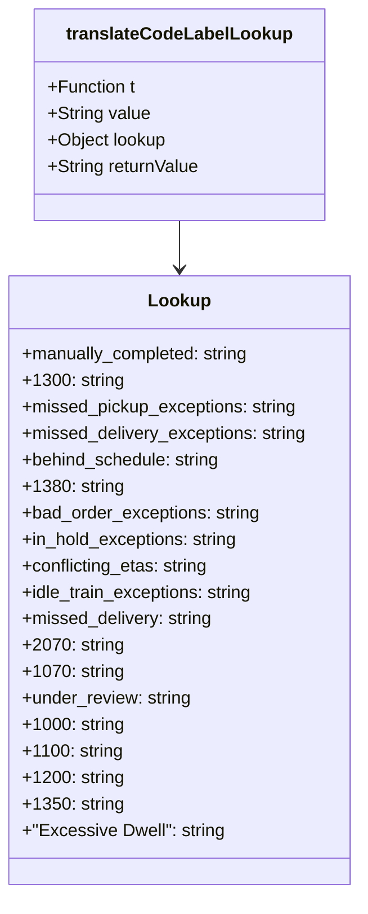

# Diagram: web/portal/src/pages/carrierview/utils/filter.utils.js


> Auto-generated by Obscura crawlers

## Diagram 1

```mermaid
flowchart LR
    Start([Start]) --> A[translateCodeLabelLookup(t, value)]
    A --> B{lookup has key "value"?}
    A --> C[construct lookup object with mappings]
    C --> B
    B -- Yes --> D[return lookup[value] (translated string)]
    B -- No --> E[return value (fallback)]
    D --> End([End])
    E --> End
```

> SVG rendering failed for this diagram.

## Diagram 2



### SVG

<svg id="container" width="327.7578125" xmlns="http://www.w3.org/2000/svg" class="classDiagram" height="810" viewBox="0 0 327.7578125 810" role="graphics-document document" aria-roledescription="class"><style>#container{font-family:"trebuchet ms",verdana,arial,sans-serif;font-size:16px;fill:#333;}@keyframes edge-animation-frame{from{stroke-dashoffset:0;}}@keyframes dash{to{stroke-dashoffset:0;}}#container .edge-animation-slow{stroke-dasharray:9,5!important;stroke-dashoffset:900;animation:dash 50s linear infinite;stroke-linecap:round;}#container .edge-animation-fast{stroke-dasharray:9,5!important;stroke-dashoffset:900;animation:dash 20s linear infinite;stroke-linecap:round;}#container .error-icon{fill:#552222;}#container .error-text{fill:#552222;stroke:#552222;}#container .edge-thickness-normal{stroke-width:1px;}#container .edge-thickness-thick{stroke-width:3.5px;}#container .edge-pattern-solid{stroke-dasharray:0;}#container .edge-thickness-invisible{stroke-width:0;fill:none;}#container .edge-pattern-dashed{stroke-dasharray:3;}#container .edge-pattern-dotted{stroke-dasharray:2;}#container .marker{fill:#333333;stroke:#333333;}#container .marker.cross{stroke:#333333;}#container svg{font-family:"trebuchet ms",verdana,arial,sans-serif;font-size:16px;}#container p{margin:0;}#container g.classGroup text{fill:#9370DB;stroke:none;font-family:"trebuchet ms",verdana,arial,sans-serif;font-size:10px;}#container g.classGroup text .title{font-weight:bolder;}#container .nodeLabel,#container .edgeLabel{color:#131300;}#container .edgeLabel .label rect{fill:#ECECFF;}#container .label text{fill:#131300;}#container .labelBkg{background:#ECECFF;}#container .edgeLabel .label span{background:#ECECFF;}#container .classTitle{font-weight:bolder;}#container .node rect,#container .node circle,#container .node ellipse,#container .node polygon,#container .node path{fill:#ECECFF;stroke:#9370DB;stroke-width:1px;}#container .divider{stroke:#9370DB;stroke-width:1;}#container g.clickable{cursor:pointer;}#container g.classGroup rect{fill:#ECECFF;stroke:#9370DB;}#container g.classGroup line{stroke:#9370DB;stroke-width:1;}#container .classLabel .box{stroke:none;stroke-width:0;fill:#ECECFF;opacity:0.5;}#container .classLabel .label{fill:#9370DB;font-size:10px;}#container .relation{stroke:#333333;stroke-width:1;fill:none;}#container .dashed-line{stroke-dasharray:3;}#container .dotted-line{stroke-dasharray:1 2;}#container #compositionStart,#container .composition{fill:#333333!important;stroke:#333333!important;stroke-width:1;}#container #compositionEnd,#container .composition{fill:#333333!important;stroke:#333333!important;stroke-width:1;}#container #dependencyStart,#container .dependency{fill:#333333!important;stroke:#333333!important;stroke-width:1;}#container #dependencyStart,#container .dependency{fill:#333333!important;stroke:#333333!important;stroke-width:1;}#container #extensionStart,#container .extension{fill:transparent!important;stroke:#333333!important;stroke-width:1;}#container #extensionEnd,#container .extension{fill:transparent!important;stroke:#333333!important;stroke-width:1;}#container #aggregationStart,#container .aggregation{fill:transparent!important;stroke:#333333!important;stroke-width:1;}#container #aggregationEnd,#container .aggregation{fill:transparent!important;stroke:#333333!important;stroke-width:1;}#container #lollipopStart,#container .lollipop{fill:#ECECFF!important;stroke:#333333!important;stroke-width:1;}#container #lollipopEnd,#container .lollipop{fill:#ECECFF!important;stroke:#333333!important;stroke-width:1;}#container .edgeTerminals{font-size:11px;line-height:initial;}#container .classTitleText{text-anchor:middle;font-size:18px;fill:#333;}#container .label-icon{display:inline-block;height:1em;overflow:visible;vertical-align:-0.125em;}#container .node .label-icon path{fill:currentColor;stroke:revert;stroke-width:revert;}#container :root{--mermaid-font-family:"trebuchet ms",verdana,arial,sans-serif;}</style><g><defs><marker id="container_class-aggregationStart" class="marker aggregation class" refX="18" refY="7" markerWidth="190" markerHeight="240" orient="auto"><path d="M 18,7 L9,13 L1,7 L9,1 Z"></path></marker></defs><defs><marker id="container_class-aggregationEnd" class="marker aggregation class" refX="1" refY="7" markerWidth="20" markerHeight="28" orient="auto"><path d="M 18,7 L9,13 L1,7 L9,1 Z"></path></marker></defs><defs><marker id="container_class-extensionStart" class="marker extension class" refX="18" refY="7" markerWidth="190" markerHeight="240" orient="auto"><path d="M 1,7 L18,13 V 1 Z"></path></marker></defs><defs><marker id="container_class-extensionEnd" class="marker extension class" refX="1" refY="7" markerWidth="20" markerHeight="28" orient="auto"><path d="M 1,1 V 13 L18,7 Z"></path></marker></defs><defs><marker id="container_class-compositionStart" class="marker composition class" refX="18" refY="7" markerWidth="190" markerHeight="240" orient="auto"><path d="M 18,7 L9,13 L1,7 L9,1 Z"></path></marker></defs><defs><marker id="container_class-compositionEnd" class="marker composition class" refX="1" refY="7" markerWidth="20" markerHeight="28" orient="auto"><path d="M 18,7 L9,13 L1,7 L9,1 Z"></path></marker></defs><defs><marker id="container_class-dependencyStart" class="marker dependency class" refX="6" refY="7" markerWidth="190" markerHeight="240" orient="auto"><path d="M 5,7 L9,13 L1,7 L9,1 Z"></path></marker></defs><defs><marker id="container_class-dependencyEnd" class="marker dependency class" refX="13" refY="7" markerWidth="20" markerHeight="28" orient="auto"><path d="M 18,7 L9,13 L14,7 L9,1 Z"></path></marker></defs><defs><marker id="container_class-lollipopStart" class="marker lollipop class" refX="13" refY="7" markerWidth="190" markerHeight="240" orient="auto"><circle stroke="black" fill="transparent" cx="7" cy="7" r="6"></circle></marker></defs><defs><marker id="container_class-lollipopEnd" class="marker lollipop class" refX="1" refY="7" markerWidth="190" markerHeight="240" orient="auto"><circle stroke="black" fill="transparent" cx="7" cy="7" r="6"></circle></marker></defs><g class="root"><g class="clusters"></g><g class="edgePaths"><path d="M163.879,200L163.879,204.167C163.879,208.333,163.879,216.667,163.879,224C163.879,231.333,163.879,237.667,163.879,240.833L163.879,244" id="id_translateCodeLabelLookup_Lookup_1" class="edge-thickness-normal edge-pattern-solid relation" style=";;;" data-edge="true" data-et="edge" data-id="id_translateCodeLabelLookup_Lookup_1" data-points="W3sieCI6MTYzLjg3ODkwNjI1LCJ5IjoyMDB9LHsieCI6MTYzLjg3ODkwNjI1LCJ5IjoyMjV9LHsieCI6MTYzLjg3ODkwNjI1LCJ5IjoyNTB9XQ==" marker-end="url(#container_class-dependencyEnd)"></path></g><g class="edgeLabels"><g class="edgeLabel"><g class="label" data-id="id_translateCodeLabelLookup_Lookup_1" transform="translate(0, 0)"><foreignObject width="0" height="0"><div xmlns="http://www.w3.org/1999/xhtml" class="labelBkg" style="display: table-cell; white-space: nowrap; line-height: 1.5; max-width: 200px; text-align: center;"><span class="edgeLabel"></span></div></foreignObject></g></g></g><g class="nodes"><g class="node default" id="classId-translateCodeLabelLookup-0" transform="translate(163.87890625, 104)"><g class="basic label-container"><path d="M-130.62890625 -96 L130.62890625 -96 L130.62890625 96 L-130.62890625 96" stroke="none" stroke-width="0" fill="#ECECFF" style=""></path><path d="M-130.62890625 -96 C-30.593573010393584 -96, 69.44176022921283 -96, 130.62890625 -96 M-130.62890625 -96 C-61.20910525543039 -96, 8.210695739139226 -96, 130.62890625 -96 M130.62890625 -96 C130.62890625 -51.936926674927186, 130.62890625 -7.873853349854372, 130.62890625 96 M130.62890625 -96 C130.62890625 -45.10530167839202, 130.62890625 5.789396643215966, 130.62890625 96 M130.62890625 96 C56.48557925633877 96, -17.657747737322467 96, -130.62890625 96 M130.62890625 96 C38.72412805973312 96, -53.18065013053376 96, -130.62890625 96 M-130.62890625 96 C-130.62890625 48.97511055670444, -130.62890625 1.9502211134088867, -130.62890625 -96 M-130.62890625 96 C-130.62890625 37.84440536458435, -130.62890625 -20.311189270831306, -130.62890625 -96" stroke="#9370DB" stroke-width="1.3" fill="none" stroke-dasharray="0 0" style=""></path></g><g class="annotation-group text" transform="translate(0, -72)"></g><g class="label-group text" transform="translate(-98.2109375, -72)"><g class="label" style="font-weight: bolder" transform="translate(0,-12)"><foreignObject width="196.421875" height="24"><div xmlns="http://www.w3.org/1999/xhtml" style="display: table-cell; white-space: nowrap; line-height: 1.5; max-width: 243px; text-align: center;"><span class="nodeLabel markdown-node-label" style=""><p>translateCodeLabelLookup</p></span></div></foreignObject></g></g><g class="members-group text" transform="translate(-118.62890625, -24)"><g class="label" style="" transform="translate(0,-12)"><foreignObject width="80.609375" height="24"><div xmlns="http://www.w3.org/1999/xhtml" style="display: table-cell; white-space: nowrap; line-height: 1.5; max-width: 138px; text-align: center;"><span class="nodeLabel markdown-node-label" style=""><p>+Function t</p></span></div></foreignObject></g><g class="label" style="" transform="translate(0,12)"><foreignObject width="93.359375" height="24"><div xmlns="http://www.w3.org/1999/xhtml" style="display: table-cell; white-space: nowrap; line-height: 1.5; max-width: 151px; text-align: center;"><span class="nodeLabel markdown-node-label" style=""><p>+String value</p></span></div></foreignObject></g><g class="label" style="" transform="translate(0,36)"><foreignObject width="109.625" height="24"><div xmlns="http://www.w3.org/1999/xhtml" style="display: table-cell; white-space: nowrap; line-height: 1.5; max-width: 167px; text-align: center;"><span class="nodeLabel markdown-node-label" style=""><p>+Object lookup</p></span></div></foreignObject></g><g class="label" style="" transform="translate(0,60)"><foreignObject width="139.046875" height="24"><div xmlns="http://www.w3.org/1999/xhtml" style="display: table-cell; white-space: nowrap; line-height: 1.5; max-width: 196px; text-align: center;"><span class="nodeLabel markdown-node-label" style=""><p>+String returnValue</p></span></div></foreignObject></g></g><g class="methods-group text" transform="translate(-118.62890625, 96)"></g><g class="divider" style=""><path d="M-130.62890625 -48 C-27.523343320028232 -48, 75.58221960994354 -48, 130.62890625 -48 M-130.62890625 -48 C-48.112602213891435 -48, 34.40370182221713 -48, 130.62890625 -48" stroke="#9370DB" stroke-width="1.3" fill="none" stroke-dasharray="0 0" style=""></path></g><g class="divider" style=""><path d="M-130.62890625 72 C-55.1398995385553 72, 20.349107172889404 72, 130.62890625 72 M-130.62890625 72 C-59.90377870368927 72, 10.821348842621461 72, 130.62890625 72" stroke="#9370DB" stroke-width="1.3" fill="none" stroke-dasharray="0 0" style=""></path></g></g><g class="node default" id="classId-Lookup-1" transform="translate(163.87890625, 526)"><g class="basic label-container"><path d="M-155.87890625 -276 L155.87890625 -276 L155.87890625 276 L-155.87890625 276" stroke="none" stroke-width="0" fill="#ECECFF" style=""></path><path d="M-155.87890625 -276 C-38.599564174832224 -276, 78.67977790033555 -276, 155.87890625 -276 M-155.87890625 -276 C-89.04546800740903 -276, -22.212029764818055 -276, 155.87890625 -276 M155.87890625 -276 C155.87890625 -143.018455515819, 155.87890625 -10.036911031637999, 155.87890625 276 M155.87890625 -276 C155.87890625 -65.25990434755698, 155.87890625 145.48019130488603, 155.87890625 276 M155.87890625 276 C83.53065271871513 276, 11.182399187430264 276, -155.87890625 276 M155.87890625 276 C64.65849732692472 276, -26.561911596150566 276, -155.87890625 276 M-155.87890625 276 C-155.87890625 85.39714082464707, -155.87890625 -105.20571835070587, -155.87890625 -276 M-155.87890625 276 C-155.87890625 138.31009760852248, -155.87890625 0.6201952170449658, -155.87890625 -276" stroke="#9370DB" stroke-width="1.3" fill="none" stroke-dasharray="0 0" style=""></path></g><g class="annotation-group text" transform="translate(0, -252)"></g><g class="label-group text" transform="translate(-26.9453125, -252)"><g class="label" style="font-weight: bolder" transform="translate(0,-12)"><foreignObject width="53.890625" height="24"><div xmlns="http://www.w3.org/1999/xhtml" style="display: table-cell; white-space: nowrap; line-height: 1.5; max-width: 103px; text-align: center;"><span class="nodeLabel markdown-node-label" style=""><p>Lookup</p></span></div></foreignObject></g></g><g class="members-group text" transform="translate(-143.87890625, -204)"><g class="label" style="" transform="translate(0,-12)"><foreignObject width="209" height="24"><div xmlns="http://www.w3.org/1999/xhtml" style="display: table-cell; white-space: nowrap; line-height: 1.5; max-width: 267px; text-align: center;"><span class="nodeLabel markdown-node-label" style=""><p>+manually_completed: string</p></span></div></foreignObject></g><g class="label" style="" transform="translate(0,12)"><foreignObject width="89.359375" height="24"><div xmlns="http://www.w3.org/1999/xhtml" style="display: table-cell; white-space: nowrap; line-height: 1.5; max-width: 147px; text-align: center;"><span class="nodeLabel markdown-node-label" style=""><p>+1300: string</p></span></div></foreignObject></g><g class="label" style="" transform="translate(0,36)"><foreignObject width="251.78125" height="24"><div xmlns="http://www.w3.org/1999/xhtml" style="display: table-cell; white-space: nowrap; line-height: 1.5; max-width: 310px; text-align: center;"><span class="nodeLabel markdown-node-label" style=""><p>+missed_pickup_exceptions: string</p></span></div></foreignObject></g><g class="label" style="" transform="translate(0,60)"><foreignObject width="260.8125" height="24"><div xmlns="http://www.w3.org/1999/xhtml" style="display: table-cell; white-space: nowrap; line-height: 1.5; max-width: 319px; text-align: center;"><span class="nodeLabel markdown-node-label" style=""><p>+missed_delivery_exceptions: string</p></span></div></foreignObject></g><g class="label" style="" transform="translate(0,84)"><foreignObject width="182.5" height="24"><div xmlns="http://www.w3.org/1999/xhtml" style="display: table-cell; white-space: nowrap; line-height: 1.5; max-width: 241px; text-align: center;"><span class="nodeLabel markdown-node-label" style=""><p>+behind_schedule: string</p></span></div></foreignObject></g><g class="label" style="" transform="translate(0,108)"><foreignObject width="89.234375" height="24"><div xmlns="http://www.w3.org/1999/xhtml" style="display: table-cell; white-space: nowrap; line-height: 1.5; max-width: 147px; text-align: center;"><span class="nodeLabel markdown-node-label" style=""><p>+1380: string</p></span></div></foreignObject></g><g class="label" style="" transform="translate(0,132)"><foreignObject width="217.765625" height="24"><div xmlns="http://www.w3.org/1999/xhtml" style="display: table-cell; white-space: nowrap; line-height: 1.5; max-width: 276px; text-align: center;"><span class="nodeLabel markdown-node-label" style=""><p>+bad_order_exceptions: string</p></span></div></foreignObject></g><g class="label" style="" transform="translate(0,156)"><foreignObject width="199.03125" height="24"><div xmlns="http://www.w3.org/1999/xhtml" style="display: table-cell; white-space: nowrap; line-height: 1.5; max-width: 257px; text-align: center;"><span class="nodeLabel markdown-node-label" style=""><p>+in_hold_exceptions: string</p></span></div></foreignObject></g><g class="label" style="" transform="translate(0,180)"><foreignObject width="171.828125" height="24"><div xmlns="http://www.w3.org/1999/xhtml" style="display: table-cell; white-space: nowrap; line-height: 1.5; max-width: 230px; text-align: center;"><span class="nodeLabel markdown-node-label" style=""><p>+conflicting_etas: string</p></span></div></foreignObject></g><g class="label" style="" transform="translate(0,204)"><foreignObject width="213" height="24"><div xmlns="http://www.w3.org/1999/xhtml" style="display: table-cell; white-space: nowrap; line-height: 1.5; max-width: 271px; text-align: center;"><span class="nodeLabel markdown-node-label" style=""><p>+idle_train_exceptions: string</p></span></div></foreignObject></g><g class="label" style="" transform="translate(0,228)"><foreignObject width="175.125" height="24"><div xmlns="http://www.w3.org/1999/xhtml" style="display: table-cell; white-space: nowrap; line-height: 1.5; max-width: 233px; text-align: center;"><span class="nodeLabel markdown-node-label" style=""><p>+missed_delivery: string</p></span></div></foreignObject></g><g class="label" style="" transform="translate(0,252)"><foreignObject width="89.09375" height="24"><div xmlns="http://www.w3.org/1999/xhtml" style="display: table-cell; white-space: nowrap; line-height: 1.5; max-width: 147px; text-align: center;"><span class="nodeLabel markdown-node-label" style=""><p>+2070: string</p></span></div></foreignObject></g><g class="label" style="" transform="translate(0,276)"><foreignObject width="87.953125" height="24"><div xmlns="http://www.w3.org/1999/xhtml" style="display: table-cell; white-space: nowrap; line-height: 1.5; max-width: 146px; text-align: center;"><span class="nodeLabel markdown-node-label" style=""><p>+1070: string</p></span></div></foreignObject></g><g class="label" style="" transform="translate(0,300)"><foreignObject width="154.890625" height="24"><div xmlns="http://www.w3.org/1999/xhtml" style="display: table-cell; white-space: nowrap; line-height: 1.5; max-width: 213px; text-align: center;"><span class="nodeLabel markdown-node-label" style=""><p>+under_review: string</p></span></div></foreignObject></g><g class="label" style="" transform="translate(0,324)"><foreignObject width="90.296875" height="24"><div xmlns="http://www.w3.org/1999/xhtml" style="display: table-cell; white-space: nowrap; line-height: 1.5; max-width: 148px; text-align: center;"><span class="nodeLabel markdown-node-label" style=""><p>+1000: string</p></span></div></foreignObject></g><g class="label" style="" transform="translate(0,348)"><foreignObject width="88.078125" height="24"><div xmlns="http://www.w3.org/1999/xhtml" style="display: table-cell; white-space: nowrap; line-height: 1.5; max-width: 146px; text-align: center;"><span class="nodeLabel markdown-node-label" style=""><p>+1100: string</p></span></div></foreignObject></g><g class="label" style="" transform="translate(0,372)"><foreignObject width="89.28125" height="24"><div xmlns="http://www.w3.org/1999/xhtml" style="display: table-cell; white-space: nowrap; line-height: 1.5; max-width: 147px; text-align: center;"><span class="nodeLabel markdown-node-label" style=""><p>+1200: string</p></span></div></foreignObject></g><g class="label" style="" transform="translate(0,396)"><foreignObject width="88.4375" height="24"><div xmlns="http://www.w3.org/1999/xhtml" style="display: table-cell; white-space: nowrap; line-height: 1.5; max-width: 146px; text-align: center;"><span class="nodeLabel markdown-node-label" style=""><p>+1350: string</p></span></div></foreignObject></g><g class="label" style="" transform="translate(0,420)"><foreignObject width="182.390625" height="24"><div xmlns="http://www.w3.org/1999/xhtml" style="display: table-cell; white-space: nowrap; line-height: 1.5; max-width: 240px; text-align: center;"><span class="nodeLabel markdown-node-label" style=""><p>+"Excessive Dwell": string</p></span></div></foreignObject></g></g><g class="methods-group text" transform="translate(-143.87890625, 276)"></g><g class="divider" style=""><path d="M-155.87890625 -228 C-33.663480921103925 -228, 88.55194440779215 -228, 155.87890625 -228 M-155.87890625 -228 C-45.27832371835915 -228, 65.3222588132817 -228, 155.87890625 -228" stroke="#9370DB" stroke-width="1.3" fill="none" stroke-dasharray="0 0" style=""></path></g><g class="divider" style=""><path d="M-155.87890625 252 C-67.03777185360325 252, 21.803362542793508 252, 155.87890625 252 M-155.87890625 252 C-70.09677163752515 252, 15.685362974949697 252, 155.87890625 252" stroke="#9370DB" stroke-width="1.3" fill="none" stroke-dasharray="0 0" style=""></path></g></g></g></g></g></svg>
