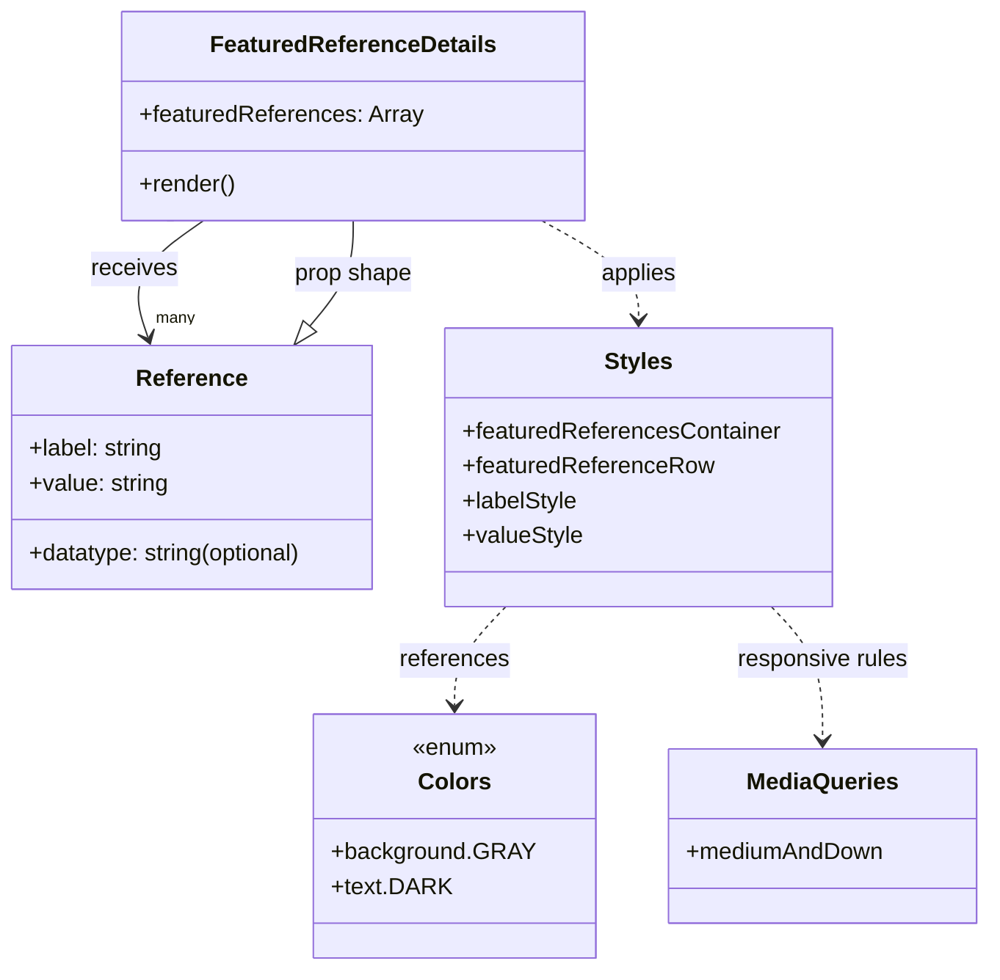

# Diagram: web/portal/src/pages/components/molecules/FeaturedReferenceDetails.molecule.js

> Auto-generated by Obscura crawlers

## Mermaid

### SVG

<svg id="container" width="682.6484375" xmlns="http://www.w3.org/2000/svg" class="classDiagram" height="668" viewBox="0 0 682.6484375 668" role="graphics-document document" aria-roledescription="class"><g><defs><marker id="container_class-aggregationStart" class="marker aggregation class" refX="18" refY="7" markerWidth="190" markerHeight="240" orient="auto"><path d="M 18,7 L9,13 L1,7 L9,1 Z"></path></marker></defs><defs><marker id="container_class-aggregationEnd" class="marker aggregation class" refX="1" refY="7" markerWidth="20" markerHeight="28" orient="auto"><path d="M 18,7 L9,13 L1,7 L9,1 Z"></path></marker></defs><defs><marker id="container_class-extensionStart" class="marker extension class" refX="18" refY="7" markerWidth="190" markerHeight="240" orient="auto"><path d="M 1,7 L18,13 V 1 Z"></path></marker></defs><defs><marker id="container_class-extensionEnd" class="marker extension class" refX="1" refY="7" markerWidth="20" markerHeight="28" orient="auto"><path d="M 1,1 V 13 L18,7 Z"></path></marker></defs><defs><marker id="container_class-compositionStart" class="marker composition class" refX="18" refY="7" markerWidth="190" markerHeight="240" orient="auto"><path d="M 18,7 L9,13 L1,7 L9,1 Z"></path></marker></defs><defs><marker id="container_class-compositionEnd" class="marker composition class" refX="1" refY="7" markerWidth="20" markerHeight="28" orient="auto"><path d="M 18,7 L9,13 L1,7 L9,1 Z"></path></marker></defs><defs><marker id="container_class-dependencyStart" class="marker dependency class" refX="6" refY="7" markerWidth="190" markerHeight="240" orient="auto"><path d="M 5,7 L9,13 L1,7 L9,1 Z"></path></marker></defs><defs><marker id="container_class-dependencyEnd" class="marker dependency class" refX="13" refY="7" markerWidth="20" markerHeight="28" orient="auto"><path d="M 18,7 L9,13 L14,7 L9,1 Z"></path></marker></defs><defs><marker id="container_class-lollipopStart" class="marker lollipop class" refX="13" refY="7" markerWidth="190" markerHeight="240" orient="auto"><circle stroke="black" fill="transparent" cx="7" cy="7" r="6"></circle></marker></defs><defs><marker id="container_class-lollipopEnd" class="marker lollipop class" refX="1" refY="7" markerWidth="190" markerHeight="240" orient="auto"><circle stroke="black" fill="transparent" cx="7" cy="7" r="6"></circle></marker></defs><g class="root"><g class="clusters"></g><g class="edgePaths"><path d="M142.871,152L134.024,158.167C125.176,164.333,107.481,176.667,101.09,190.053C94.7,203.44,99.614,217.88,102.072,225.1L104.529,232.32" id="id_FeaturedReferenceDetails_Reference_1" class="edge-thickness-normal edge-pattern-solid relation" style=";;;" data-edge="true" data-et="edge" data-id="id_FeaturedReferenceDetails_Reference_1" data-points="W3sieCI6MTQyLjg3MTIxOTE4MDA0NTg3LCJ5IjoxNTJ9LHsieCI6ODkuNzg1MTU2MjUsInkiOjE4OX0seyJ4IjoxMDYuNDYxOTY1NDYwNTI2MzIsInkiOjIzOH1d" marker-end="url(#container_class-dependencyEnd)"></path><path d="M377.436,152L388.679,158.167C399.921,164.333,422.406,176.667,433.648,188C444.891,199.333,444.891,209.667,444.891,214.833L444.891,220" id="id_FeaturedReferenceDetails_Styles_2" class="edge-thickness-normal edge-pattern-dashed relation" style=";;;" data-edge="true" data-et="edge" data-id="id_FeaturedReferenceDetails_Styles_2" data-points="W3sieCI6Mzc3LjQzNjI5OTQ1NTI3NTIsInkiOjE1Mn0seyJ4Ijo0NDQuODkwNjI1LCJ5IjoxODl9LHsieCI6NDQ0Ljg5MDYyNSwieSI6MjI2fV0=" marker-end="url(#container_class-dependencyEnd)"></path><path d="M355.037,418L349.265,424.167C343.494,430.333,331.95,442.667,326.178,454C320.406,465.333,320.406,475.667,320.406,480.833L320.406,486" id="id_Styles_Colors_3" class="edge-thickness-normal edge-pattern-dashed relation" style=";;;" data-edge="true" data-et="edge" data-id="id_Styles_Colors_3" data-points="W3sieCI6MzU1LjAzNzI0MTU0MTM1MzQsInkiOjQxOH0seyJ4IjozMjAuNDA2MjUsInkiOjQ1NX0seyJ4IjozMjAuNDA2MjUsInkiOjQ5Mn1d" marker-end="url(#container_class-dependencyEnd)"></path><path d="M534.744,418L540.516,424.167C546.288,430.333,557.831,442.667,563.603,458C569.375,473.333,569.375,491.667,569.375,500.833L569.375,510" id="id_Styles_MediaQueries_4" class="edge-thickness-normal edge-pattern-dashed relation" style=";;;" data-edge="true" data-et="edge" data-id="id_Styles_MediaQueries_4" data-points="W3sieCI6NTM0Ljc0NDAwODQ1ODY0NjYsInkiOjQxOH0seyJ4Ijo1NjkuMzc1LCJ5Ijo0NTV9LHsieCI6NTY5LjM3NSwieSI6NTE2fV0=" marker-end="url(#container_class-dependencyEnd)"></path><path d="M216.294,224.762L221.274,218.802C226.254,212.842,236.214,200.921,241.194,188.794C246.174,176.667,246.174,164.333,246.174,158.167L246.174,152" id="id_Reference_FeaturedReferenceDetails_5" class="edge-thickness-normal edge-pattern-solid relation" style=";;;" data-edge="true" data-et="edge" data-id="id_Reference_FeaturedReferenceDetails_5" data-points="W3sieCI6MjA1LjIzMzc1ODIyMzY4NDIyLCJ5IjoyMzh9LHsieCI6MjQ2LjE3MzgyODEyNSwieSI6MTg5fSx7IngiOjI0Ni4xNzM4MjgxMjUsInkiOjE1Mn1d" marker-start="url(#container_class-extensionStart)"></path></g><g class="edgeLabels"><g class="edgeLabel" transform="translate(89.78515625, 189)"><g class="label" data-id="id_FeaturedReferenceDetails_Reference_1" transform="translate(-29.4921875, -12)"><foreignObject width="58.984375" height="24">

receives

</foreignObject></g></g><g class="edgeLabel" transform="translate(444.890625, 189)"><g class="label" data-id="id_FeaturedReferenceDetails_Styles_2" transform="translate(-26.5546875, -12)"><foreignObject width="53.109375" height="24">

applies

</foreignObject></g></g><g class="edgeLabel" transform="translate(320.40625, 455)"><g class="label" data-id="id_Styles_Colors_3" transform="translate(-37.828125, -12)"><foreignObject width="75.65625" height="24">

references

</foreignObject></g></g><g class="edgeLabel" transform="translate(569.375, 455)"><g class="label" data-id="id_Styles_MediaQueries_4" transform="translate(-59.578125, -12)"><foreignObject width="119.15625" height="24">

responsive rules

</foreignObject></g></g><g class="edgeLabel" transform="translate(246.173828125, 189)"><g class="label" data-id="id_Reference_FeaturedReferenceDetails_5" transform="translate(-41.0390625, -12)"><foreignObject width="82.078125" height="24">

prop shape

</foreignObject></g></g><g class="edgeTerminals" transform="translate(119.93734273780778, 149.7005800541243)"><g class="inner" transform="translate(0, 0)"><foreignObject style="width: 9px; height: 12px;">
1
</foreignObject></g></g><g class="edgeTerminals" transform="translate(110.02367836375817, 211.60030197298528)"><g class="inner" transform="translate(0, 0)"></g><foreignObject style="width: 36px; height: 12px;">
many
</foreignObject></g></g><g class="nodes"><g class="node default" id="classId-FeaturedReferenceDetails-0" transform="translate(246.173828125, 80)"><g class="basic label-container"><path d="M-156.125 -72 L156.125 -72 L156.125 72 L-156.125 72" stroke="none" stroke-width="0" fill="#ECECFF" style=""></path><path d="M-156.125 -72 C-34.60926010025409 -72, 86.90647979949182 -72, 156.125 -72 M-156.125 -72 C-90.666862799955 -72, -25.208725599909997 -72, 156.125 -72 M156.125 -72 C156.125 -34.76752662741229, 156.125 2.464946745175425, 156.125 72 M156.125 -72 C156.125 -20.95710013224891, 156.125 30.085799735502178, 156.125 72 M156.125 72 C74.0366376798788 72, -8.051724640242412 72, -156.125 72 M156.125 72 C33.46901045876464 72, -89.18697908247071 72, -156.125 72 M-156.125 72 C-156.125 26.77309022367107, -156.125 -18.453819552657862, -156.125 -72 M-156.125 72 C-156.125 41.0772805321758, -156.125 10.154561064351597, -156.125 -72" stroke="#9370DB" stroke-width="1.3" fill="none" stroke-dasharray="0 0" style=""></path></g><g class="annotation-group text" transform="translate(0, -48)"></g><g class="label-group text" transform="translate(-94.1875, -48)"><g class="label" style="font-weight: bolder" transform="translate(0,-12)"><foreignObject width="188.375" height="24">

FeaturedReferenceDetails

</foreignObject></g></g><g class="members-group text" transform="translate(-144.125, 0)"><g class="label" style="" transform="translate(0,-12)"><foreignObject width="194.0625" height="24">

+featuredReferences: Array

</foreignObject></g></g><g class="methods-group text" transform="translate(-144.125, 48)"><g class="label" style="" transform="translate(0,-12)"><foreignObject width="66.609375" height="24">

+render()

</foreignObject></g></g><g class="divider" style=""><path d="M-156.125 -24 C-56.91872533462737 -24, 42.287549330745264 -24, 156.125 -24 M-156.125 -24 C-69.91017300952065 -24, 16.304653980958705 -24, 156.125 -24" stroke="#9370DB" stroke-width="1.3" fill="none" stroke-dasharray="0 0" style=""></path></g><g class="divider" style=""><path d="M-156.125 24 C-47.245262196602425 24, 61.63447560679515 24, 156.125 24 M-156.125 24 C-39.909382704950445 24, 76.30623459009911 24, 156.125 24" stroke="#9370DB" stroke-width="1.3" fill="none" stroke-dasharray="0 0" style=""></path></g></g><g class="node default" id="classId-Reference-1" transform="translate(135.05078125, 322)"><g class="basic label-container"><path d="M-127.05078125 -84 L127.05078125 -84 L127.05078125 84 L-127.05078125 84" stroke="none" stroke-width="0" fill="#ECECFF" style=""></path><path d="M-127.05078125 -84 C-70.04890750190134 -84, -13.04703375380268 -84, 127.05078125 -84 M-127.05078125 -84 C-25.5191196882339 -84, 76.0125418735322 -84, 127.05078125 -84 M127.05078125 -84 C127.05078125 -25.88269140554023, 127.05078125 32.23461718891954, 127.05078125 84 M127.05078125 -84 C127.05078125 -19.549220996791618, 127.05078125 44.901558006416764, 127.05078125 84 M127.05078125 84 C25.83174097569116 84, -75.38729929861768 84, -127.05078125 84 M127.05078125 84 C34.76219523286757 84, -57.52639078426486 84, -127.05078125 84 M-127.05078125 84 C-127.05078125 42.468673039782466, -127.05078125 0.9373460795649322, -127.05078125 -84 M-127.05078125 84 C-127.05078125 45.96183994354299, -127.05078125 7.9236798870859815, -127.05078125 -84" stroke="#9370DB" stroke-width="1.3" fill="none" stroke-dasharray="0 0" style=""></path></g><g class="annotation-group text" transform="translate(0, -60)"></g><g class="label-group text" transform="translate(-36.5078125, -60)"><g class="label" style="font-weight: bolder" transform="translate(0,-12)"><foreignObject width="73.015625" height="24">

Reference

</foreignObject></g></g><g class="members-group text" transform="translate(-115.05078125, -12)"><g class="label" style="" transform="translate(0,-12)"><foreignObject width="94.09375" height="24">

+label: string

</foreignObject></g><g class="label" style="" transform="translate(0,12)"><foreignObject width="96.421875" height="24">

+value: string

</foreignObject></g></g><g class="methods-group text" transform="translate(-115.05078125, 60)"><g class="label" style="" transform="translate(0,-12)"><foreignObject width="193.59375" height="24">

+datatype: string(optional)

</foreignObject></g></g><g class="divider" style=""><path d="M-127.05078125 -36 C-47.173521821050684 -36, 32.70373760789863 -36, 127.05078125 -36 M-127.05078125 -36 C-48.358848599153276 -36, 30.333084051693447 -36, 127.05078125 -36" stroke="#9370DB" stroke-width="1.3" fill="none" stroke-dasharray="0 0" style=""></path></g><g class="divider" style=""><path d="M-127.05078125 36 C-59.16882438349397 36, 8.71313248301206 36, 127.05078125 36 M-127.05078125 36 C-58.28769870766142 36, 10.47538383467716 36, 127.05078125 36" stroke="#9370DB" stroke-width="1.3" fill="none" stroke-dasharray="0 0" style=""></path></g></g><g class="node default" id="classId-Styles-2" transform="translate(444.890625, 322)"><g class="basic label-container"><path d="M-132.7890625 -96 L132.7890625 -96 L132.7890625 96 L-132.7890625 96" stroke="none" stroke-width="0" fill="#ECECFF" style=""></path><path d="M-132.7890625 -96 C-52.96458397578107 -96, 26.859894548437865 -96, 132.7890625 -96 M-132.7890625 -96 C-42.29267577068319 -96, 48.20371095863362 -96, 132.7890625 -96 M132.7890625 -96 C132.7890625 -24.044811777684558, 132.7890625 47.910376444630884, 132.7890625 96 M132.7890625 -96 C132.7890625 -29.746417294303782, 132.7890625 36.507165411392435, 132.7890625 96 M132.7890625 96 C32.23458440607469 96, -68.31989368785062 96, -132.7890625 96 M132.7890625 96 C38.282515656567924 96, -56.22403118686415 96, -132.7890625 96 M-132.7890625 96 C-132.7890625 24.03090155210836, -132.7890625 -47.93819689578328, -132.7890625 -96 M-132.7890625 96 C-132.7890625 28.44083267958115, -132.7890625 -39.1183346408377, -132.7890625 -96" stroke="#9370DB" stroke-width="1.3" fill="none" stroke-dasharray="0 0" style=""></path></g><g class="annotation-group text" transform="translate(0, -72)"></g><g class="label-group text" transform="translate(-22.390625, -72)"><g class="label" style="font-weight: bolder" transform="translate(0,-12)"><foreignObject width="44.78125" height="24">

Styles

</foreignObject></g></g><g class="members-group text" transform="translate(-120.7890625, -24)"><g class="label" style="" transform="translate(0,-12)"><foreignObject width="219.1875" height="24">

+featuredReferencesContainer

</foreignObject></g><g class="label" style="" transform="translate(0,12)"><foreignObject width="171.46875" height="24">

+featuredReferenceRow

</foreignObject></g><g class="label" style="" transform="translate(0,36)"><foreignObject width="79.828125" height="24">

+labelStyle

</foreignObject></g><g class="label" style="" transform="translate(0,60)"><foreignObject width="82.328125" height="24">

+valueStyle

</foreignObject></g></g><g class="methods-group text" transform="translate(-120.7890625, 96)"></g><g class="divider" style=""><path d="M-132.7890625 -48 C-40.90758649464469 -48, 50.97388951071062 -48, 132.7890625 -48 M-132.7890625 -48 C-76.9885072265821 -48, -21.1879519531642 -48, 132.7890625 -48" stroke="#9370DB" stroke-width="1.3" fill="none" stroke-dasharray="0 0" style=""></path></g><g class="divider" style=""><path d="M-132.7890625 72 C-66.8142637014622 72, -0.8394649029243908 72, 132.7890625 72 M-132.7890625 72 C-66.09458174789377 72, 0.5998990042124603 72, 132.7890625 72" stroke="#9370DB" stroke-width="1.3" fill="none" stroke-dasharray="0 0" style=""></path></g></g><g class="node default" id="classId-Colors-3" transform="translate(320.40625, 576)"><g class="basic label-container"><path d="M-93.6953125 -84 L93.6953125 -84 L93.6953125 84 L-93.6953125 84" stroke="none" stroke-width="0" fill="#ECECFF" style=""></path><path d="M-93.6953125 -84 C-30.577397492436027 -84, 32.540517515127945 -84, 93.6953125 -84 M-93.6953125 -84 C-51.26925001467904 -84, -8.843187529358076 -84, 93.6953125 -84 M93.6953125 -84 C93.6953125 -45.9079421422446, 93.6953125 -7.815884284489201, 93.6953125 84 M93.6953125 -84 C93.6953125 -18.1925052465847, 93.6953125 47.6149895068306, 93.6953125 84 M93.6953125 84 C46.38471980978764 84, -0.9258728804247198 84, -93.6953125 84 M93.6953125 84 C56.17302749520478 84, 18.650742490409556 84, -93.6953125 84 M-93.6953125 84 C-93.6953125 39.441507468245284, -93.6953125 -5.116985063509432, -93.6953125 -84 M-93.6953125 84 C-93.6953125 36.02219242031385, -93.6953125 -11.9556151593723, -93.6953125 -84" stroke="#9370DB" stroke-width="1.3" fill="none" stroke-dasharray="0 0" style=""></path></g><g class="annotation-group text" transform="translate(-29.53125, -60)"><g class="label" style="" transform="translate(0,-12)"><foreignObject width="59.0625" height="24">

«enum»

</foreignObject></g></g><g class="label-group text" transform="translate(-23.1015625, -36)"><g class="label" style="font-weight: bolder" transform="translate(0,-12)"><foreignObject width="46.203125" height="24">

Colors

</foreignObject></g></g><g class="members-group text" transform="translate(-81.6953125, 12)"><g class="label" style="" transform="translate(0,-12)"><foreignObject width="133.859375" height="24">

+background.GRAY

</foreignObject></g><g class="label" style="" transform="translate(0,12)"><foreignObject width="77.875" height="24">

+text.DARK

</foreignObject></g></g><g class="methods-group text" transform="translate(-81.6953125, 84)"></g><g class="divider" style=""><path d="M-93.6953125 -12 C-32.8647157743142 -12, 27.965880951371602 -12, 93.6953125 -12 M-93.6953125 -12 C-39.672092184768545 -12, 14.35112813046291 -12, 93.6953125 -12" stroke="#9370DB" stroke-width="1.3" fill="none" stroke-dasharray="0 0" style=""></path></g><g class="divider" style=""><path d="M-93.6953125 60 C-40.58173094509208 60, 12.531850609815834 60, 93.6953125 60 M-93.6953125 60 C-43.47289328955609 60, 6.7495259208878196 60, 93.6953125 60" stroke="#9370DB" stroke-width="1.3" fill="none" stroke-dasharray="0 0" style=""></path></g></g><g class="node default" id="classId-MediaQueries-4" transform="translate(569.375, 576)"><g class="basic label-container"><path d="M-105.2734375 -60 L105.2734375 -60 L105.2734375 60 L-105.2734375 60" stroke="none" stroke-width="0" fill="#ECECFF" style=""></path><path d="M-105.2734375 -60 C-43.9048801831781 -60, 17.4636771336438 -60, 105.2734375 -60 M-105.2734375 -60 C-61.02277590108932 -60, -16.772114302178636 -60, 105.2734375 -60 M105.2734375 -60 C105.2734375 -32.53509062308356, 105.2734375 -5.070181246167124, 105.2734375 60 M105.2734375 -60 C105.2734375 -22.330434511795445, 105.2734375 15.339130976409109, 105.2734375 60 M105.2734375 60 C45.47929608951125 60, -14.314845320977497 60, -105.2734375 60 M105.2734375 60 C41.485013549439074 60, -22.30341040112185 60, -105.2734375 60 M-105.2734375 60 C-105.2734375 34.60518377174429, -105.2734375 9.210367543488573, -105.2734375 -60 M-105.2734375 60 C-105.2734375 22.08961545966426, -105.2734375 -15.820769080671482, -105.2734375 -60" stroke="#9370DB" stroke-width="1.3" fill="none" stroke-dasharray="0 0" style=""></path></g><g class="annotation-group text" transform="translate(0, -36)"></g><g class="label-group text" transform="translate(-50.40625, -36)"><g class="label" style="font-weight: bolder" transform="translate(0,-12)"><foreignObject width="100.8125" height="24">

MediaQueries

</foreignObject></g></g><g class="members-group text" transform="translate(-93.2734375, 12)"><g class="label" style="" transform="translate(0,-12)"><foreignObject width="136.140625" height="24">

+mediumAndDown

</foreignObject></g></g><g class="methods-group text" transform="translate(-93.2734375, 60)"></g><g class="divider" style=""><path d="M-105.2734375 -12 C-58.608066091366226 -12, -11.942694682732451 -12, 105.2734375 -12 M-105.2734375 -12 C-44.585787535149976 -12, 16.10186242970005 -12, 105.2734375 -12" stroke="#9370DB" stroke-width="1.3" fill="none" stroke-dasharray="0 0" style=""></path></g><g class="divider" style=""><path d="M-105.2734375 36 C-54.02746724970564 36, -2.7814969994112744 36, 105.2734375 36 M-105.2734375 36 C-49.531868988940765 36, 6.20969952211847 36, 105.2734375 36" stroke="#9370DB" stroke-width="1.3" fill="none" stroke-dasharray="0 0" style=""></path></g></g></g></g></g></svg>
