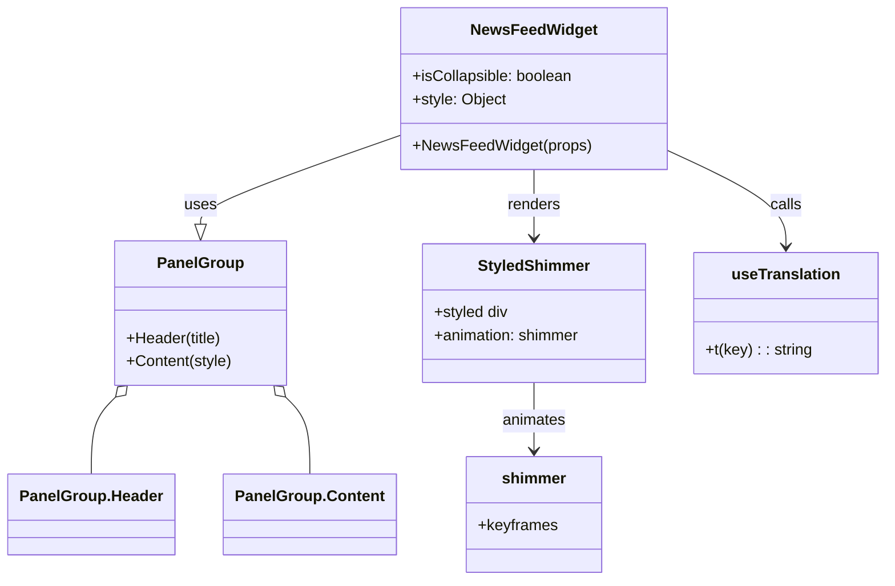

# Diagram: web/portal/src/pages/components/organisms/news-feed/VinNewsFeedWidget.tsx


> Auto-generated by Obscura crawlers

## Diagram 1



### SVG

<svg id="container" width="900.78125" xmlns="http://www.w3.org/2000/svg" class="classDiagram" height="602" viewBox="0 0 900.78125 602" role="graphics-document document" aria-roledescription="class"><style>#container{font-family:"trebuchet ms",verdana,arial,sans-serif;font-size:16px;fill:#333;}@keyframes edge-animation-frame{from{stroke-dashoffset:0;}}@keyframes dash{to{stroke-dashoffset:0;}}#container .edge-animation-slow{stroke-dasharray:9,5!important;stroke-dashoffset:900;animation:dash 50s linear infinite;stroke-linecap:round;}#container .edge-animation-fast{stroke-dasharray:9,5!important;stroke-dashoffset:900;animation:dash 20s linear infinite;stroke-linecap:round;}#container .error-icon{fill:#552222;}#container .error-text{fill:#552222;stroke:#552222;}#container .edge-thickness-normal{stroke-width:1px;}#container .edge-thickness-thick{stroke-width:3.5px;}#container .edge-pattern-solid{stroke-dasharray:0;}#container .edge-thickness-invisible{stroke-width:0;fill:none;}#container .edge-pattern-dashed{stroke-dasharray:3;}#container .edge-pattern-dotted{stroke-dasharray:2;}#container .marker{fill:#333333;stroke:#333333;}#container .marker.cross{stroke:#333333;}#container svg{font-family:"trebuchet ms",verdana,arial,sans-serif;font-size:16px;}#container p{margin:0;}#container g.classGroup text{fill:#9370DB;stroke:none;font-family:"trebuchet ms",verdana,arial,sans-serif;font-size:10px;}#container g.classGroup text .title{font-weight:bolder;}#container .nodeLabel,#container .edgeLabel{color:#131300;}#container .edgeLabel .label rect{fill:#ECECFF;}#container .label text{fill:#131300;}#container .labelBkg{background:#ECECFF;}#container .edgeLabel .label span{background:#ECECFF;}#container .classTitle{font-weight:bolder;}#container .node rect,#container .node circle,#container .node ellipse,#container .node polygon,#container .node path{fill:#ECECFF;stroke:#9370DB;stroke-width:1px;}#container .divider{stroke:#9370DB;stroke-width:1;}#container g.clickable{cursor:pointer;}#container g.classGroup rect{fill:#ECECFF;stroke:#9370DB;}#container g.classGroup line{stroke:#9370DB;stroke-width:1;}#container .classLabel .box{stroke:none;stroke-width:0;fill:#ECECFF;opacity:0.5;}#container .classLabel .label{fill:#9370DB;font-size:10px;}#container .relation{stroke:#333333;stroke-width:1;fill:none;}#container .dashed-line{stroke-dasharray:3;}#container .dotted-line{stroke-dasharray:1 2;}#container #compositionStart,#container .composition{fill:#333333!important;stroke:#333333!important;stroke-width:1;}#container #compositionEnd,#container .composition{fill:#333333!important;stroke:#333333!important;stroke-width:1;}#container #dependencyStart,#container .dependency{fill:#333333!important;stroke:#333333!important;stroke-width:1;}#container #dependencyStart,#container .dependency{fill:#333333!important;stroke:#333333!important;stroke-width:1;}#container #extensionStart,#container .extension{fill:transparent!important;stroke:#333333!important;stroke-width:1;}#container #extensionEnd,#container .extension{fill:transparent!important;stroke:#333333!important;stroke-width:1;}#container #aggregationStart,#container .aggregation{fill:transparent!important;stroke:#333333!important;stroke-width:1;}#container #aggregationEnd,#container .aggregation{fill:transparent!important;stroke:#333333!important;stroke-width:1;}#container #lollipopStart,#container .lollipop{fill:#ECECFF!important;stroke:#333333!important;stroke-width:1;}#container #lollipopEnd,#container .lollipop{fill:#ECECFF!important;stroke:#333333!important;stroke-width:1;}#container .edgeTerminals{font-size:11px;line-height:initial;}#container .classTitleText{text-anchor:middle;font-size:18px;fill:#333;}#container .label-icon{display:inline-block;height:1em;overflow:visible;vertical-align:-0.125em;}#container .node .label-icon path{fill:currentColor;stroke:revert;stroke-width:revert;}#container :root{--mermaid-font-family:"trebuchet ms",verdana,arial,sans-serif;}</style><g><defs><marker id="container_class-aggregationStart" class="marker aggregation class" refX="18" refY="7" markerWidth="190" markerHeight="240" orient="auto"><path d="M 18,7 L9,13 L1,7 L9,1 Z"></path></marker></defs><defs><marker id="container_class-aggregationEnd" class="marker aggregation class" refX="1" refY="7" markerWidth="20" markerHeight="28" orient="auto"><path d="M 18,7 L9,13 L1,7 L9,1 Z"></path></marker></defs><defs><marker id="container_class-extensionStart" class="marker extension class" refX="18" refY="7" markerWidth="190" markerHeight="240" orient="auto"><path d="M 1,7 L18,13 V 1 Z"></path></marker></defs><defs><marker id="container_class-extensionEnd" class="marker extension class" refX="1" refY="7" markerWidth="20" markerHeight="28" orient="auto"><path d="M 1,1 V 13 L18,7 Z"></path></marker></defs><defs><marker id="container_class-compositionStart" class="marker composition class" refX="18" refY="7" markerWidth="190" markerHeight="240" orient="auto"><path d="M 18,7 L9,13 L1,7 L9,1 Z"></path></marker></defs><defs><marker id="container_class-compositionEnd" class="marker composition class" refX="1" refY="7" markerWidth="20" markerHeight="28" orient="auto"><path d="M 18,7 L9,13 L1,7 L9,1 Z"></path></marker></defs><defs><marker id="container_class-dependencyStart" class="marker dependency class" refX="6" refY="7" markerWidth="190" markerHeight="240" orient="auto"><path d="M 5,7 L9,13 L1,7 L9,1 Z"></path></marker></defs><defs><marker id="container_class-dependencyEnd" class="marker dependency class" refX="13" refY="7" markerWidth="20" markerHeight="28" orient="auto"><path d="M 18,7 L9,13 L14,7 L9,1 Z"></path></marker></defs><defs><marker id="container_class-lollipopStart" class="marker lollipop class" refX="13" refY="7" markerWidth="190" markerHeight="240" orient="auto"><circle stroke="black" fill="transparent" cx="7" cy="7" r="6"></circle></marker></defs><defs><marker id="container_class-lollipopEnd" class="marker lollipop class" refX="1" refY="7" markerWidth="190" markerHeight="240" orient="auto"><circle stroke="black" fill="transparent" cx="7" cy="7" r="6"></circle></marker></defs><g class="root"><g class="clusters"></g><g class="edgePaths"><path d="M402.805,140.16L368.898,152.3C334.991,164.44,267.177,188.72,233.27,204.152C199.363,219.583,199.363,226.167,199.363,229.458L199.363,232.75" id="id_NewsFeedWidget_PanelGroup_1" class="edge-thickness-normal edge-pattern-solid relation" style=";;;" data-edge="true" data-et="edge" data-id="id_NewsFeedWidget_PanelGroup_1" data-points="W3sieCI6NDAyLjgwNDY4NzUsInkiOjE0MC4xNjAyODI0OTEwOTk5fSx7IngiOjE5OS4zNjMyODEyNSwieSI6MjEzfSx7IngiOjE5OS4zNjMyODEyNSwieSI6MjUwfV0=" marker-end="url(#container_class-extensionEnd)"></path><path d="M537.316,176L537.316,182.167C537.316,188.333,537.316,200.667,537.316,212.5C537.316,224.333,537.316,235.667,537.316,241.333L537.316,247" id="id_NewsFeedWidget_StyledShimmer_2" class="edge-thickness-normal edge-pattern-solid relation" style=";;;" data-edge="true" data-et="edge" data-id="id_NewsFeedWidget_StyledShimmer_2" data-points="W3sieCI6NTM3LjMxNjQwNjI1LCJ5IjoxNzZ9LHsieCI6NTM3LjMxNjQwNjI1LCJ5IjoyMTN9LHsieCI6NTM3LjMxNjQwNjI1LCJ5IjoyNTN9XQ==" marker-end="url(#container_class-dependencyEnd)"></path><path d="M537.316,397L537.316,403.667C537.316,410.333,537.316,423.667,537.316,435.5C537.316,447.333,537.316,457.667,537.316,462.833L537.316,468" id="id_StyledShimmer_shimmer_3" class="edge-thickness-normal edge-pattern-solid relation" style=";;;" data-edge="true" data-et="edge" data-id="id_StyledShimmer_shimmer_3" data-points="W3sieCI6NTM3LjMxNjQwNjI1LCJ5IjozOTd9LHsieCI6NTM3LjMxNjQwNjI1LCJ5Ijo0Mzd9LHsieCI6NTM3LjMxNjQwNjI1LCJ5Ijo0NzR9XQ==" marker-end="url(#container_class-dependencyEnd)"></path><path d="M671.828,154.337L692.925,164.115C714.022,173.892,756.216,193.446,777.313,210.39C798.41,227.333,798.41,241.667,798.41,248.833L798.41,256" id="id_NewsFeedWidget_useTranslation_4" class="edge-thickness-normal edge-pattern-solid relation" style=";;;" data-edge="true" data-et="edge" data-id="id_NewsFeedWidget_useTranslation_4" data-points="W3sieCI6NjcxLjgyODEyNSwieSI6MTU0LjMzNzQ0NzYzNjE0Nn0seyJ4Ijo3OTguNDEwMTU2MjUsInkiOjIxM30seyJ4Ijo3OTguNDEwMTU2MjUsInkiOjI2Mn1d" marker-end="url(#container_class-dependencyEnd)"></path><path d="M114.543,412.377L110.559,416.481C106.575,420.585,98.608,428.792,94.624,442.063C90.641,455.333,90.641,473.667,90.641,482.833L90.641,492" id="id_PanelGroup_PanelGroup.Header_5" class="edge-thickness-normal edge-pattern-solid relation" style=";;;" data-edge="true" data-et="edge" data-id="id_PanelGroup_PanelGroup.Header_5" data-points="W3sieCI6MTI2LjU1NzkzMTA4MjU4OTI5LCJ5Ijo0MDB9LHsieCI6OTAuNjQwNjI1LCJ5Ijo0Mzd9LHsieCI6OTAuNjQwNjI1LCJ5Ijo0OTJ9XQ==" marker-start="url(#container_class-aggregationStart)"></path><path d="M284.184,412.377L288.167,416.481C292.151,420.585,300.119,428.792,304.102,442.063C308.086,455.333,308.086,473.667,308.086,482.833L308.086,492" id="id_PanelGroup_PanelGroup.Content_6" class="edge-thickness-normal edge-pattern-solid relation" style=";;;" data-edge="true" data-et="edge" data-id="id_PanelGroup_PanelGroup.Content_6" data-points="W3sieCI6MjcyLjE2ODYzMTQxNzQxMDcsInkiOjQwMH0seyJ4IjozMDguMDg1OTM3NSwieSI6NDM3fSx7IngiOjMwOC4wODU5Mzc1LCJ5Ijo0OTJ9XQ==" marker-start="url(#container_class-aggregationStart)"></path></g><g class="edgeLabels"><g class="edgeLabel" transform="translate(199.36328125, 213)"><g class="label" data-id="id_NewsFeedWidget_PanelGroup_1" transform="translate(-16.4921875, -12)"><foreignObject width="32.984375" height="24"><div xmlns="http://www.w3.org/1999/xhtml" class="labelBkg" style="display: table-cell; white-space: nowrap; line-height: 1.5; max-width: 200px; text-align: center;"><span class="edgeLabel"><p>uses</p></span></div></foreignObject></g></g><g class="edgeLabel" transform="translate(537.31640625, 213)"><g class="label" data-id="id_NewsFeedWidget_StyledShimmer_2" transform="translate(-27.75, -12)"><foreignObject width="55.5" height="24"><div xmlns="http://www.w3.org/1999/xhtml" class="labelBkg" style="display: table-cell; white-space: nowrap; line-height: 1.5; max-width: 200px; text-align: center;"><span class="edgeLabel"><p>renders</p></span></div></foreignObject></g></g><g class="edgeLabel" transform="translate(537.31640625, 437)"><g class="label" data-id="id_StyledShimmer_shimmer_3" transform="translate(-33.375, -12)"><foreignObject width="66.75" height="24"><div xmlns="http://www.w3.org/1999/xhtml" class="labelBkg" style="display: table-cell; white-space: nowrap; line-height: 1.5; max-width: 200px; text-align: center;"><span class="edgeLabel"><p>animates</p></span></div></foreignObject></g></g><g class="edgeLabel" transform="translate(798.41015625, 213)"><g class="label" data-id="id_NewsFeedWidget_useTranslation_4" transform="translate(-16.4453125, -12)"><foreignObject width="32.890625" height="24"><div xmlns="http://www.w3.org/1999/xhtml" class="labelBkg" style="display: table-cell; white-space: nowrap; line-height: 1.5; max-width: 200px; text-align: center;"><span class="edgeLabel"><p>calls</p></span></div></foreignObject></g></g><g class="edgeLabel"><g class="label" data-id="id_PanelGroup_PanelGroup.Header_5" transform="translate(0, 0)"><foreignObject width="0" height="0"><div xmlns="http://www.w3.org/1999/xhtml" class="labelBkg" style="display: table-cell; white-space: nowrap; line-height: 1.5; max-width: 200px; text-align: center;"><span class="edgeLabel"></span></div></foreignObject></g></g><g class="edgeLabel"><g class="label" data-id="id_PanelGroup_PanelGroup.Content_6" transform="translate(0, 0)"><foreignObject width="0" height="0"><div xmlns="http://www.w3.org/1999/xhtml" class="labelBkg" style="display: table-cell; white-space: nowrap; line-height: 1.5; max-width: 200px; text-align: center;"><span class="edgeLabel"></span></div></foreignObject></g></g></g><g class="nodes"><g class="node default" id="classId-NewsFeedWidget-0" transform="translate(537.31640625, 92)"><g class="basic label-container"><path d="M-134.51171875 -84 L134.51171875 -84 L134.51171875 84 L-134.51171875 84" stroke="none" stroke-width="0" fill="#ECECFF" style=""></path><path d="M-134.51171875 -84 C-60.50945159177816 -84, 13.492815566443682 -84, 134.51171875 -84 M-134.51171875 -84 C-52.890804272352625 -84, 28.73011020529475 -84, 134.51171875 -84 M134.51171875 -84 C134.51171875 -45.60465271629764, 134.51171875 -7.209305432595286, 134.51171875 84 M134.51171875 -84 C134.51171875 -20.6329359283164, 134.51171875 42.7341281433672, 134.51171875 84 M134.51171875 84 C41.19190337926348 84, -52.12791199147304 84, -134.51171875 84 M134.51171875 84 C50.17376223404331 84, -34.16419428191338 84, -134.51171875 84 M-134.51171875 84 C-134.51171875 34.88350856997972, -134.51171875 -14.232982860040565, -134.51171875 -84 M-134.51171875 84 C-134.51171875 22.961672598155175, -134.51171875 -38.07665480368965, -134.51171875 -84" stroke="#9370DB" stroke-width="1.3" fill="none" stroke-dasharray="0 0" style=""></path></g><g class="annotation-group text" transform="translate(0, -60)"></g><g class="label-group text" transform="translate(-62.3984375, -60)"><g class="label" style="font-weight: bolder" transform="translate(0,-12)"><foreignObject width="124.796875" height="24"><div xmlns="http://www.w3.org/1999/xhtml" style="display: table-cell; white-space: nowrap; line-height: 1.5; max-width: 173px; text-align: center;"><span class="nodeLabel markdown-node-label" style=""><p>NewsFeedWidget</p></span></div></foreignObject></g></g><g class="members-group text" transform="translate(-122.51171875, -12)"><g class="label" style="" transform="translate(0,-12)"><foreignObject width="167.796875" height="24"><div xmlns="http://www.w3.org/1999/xhtml" style="display: table-cell; white-space: nowrap; line-height: 1.5; max-width: 225px; text-align: center;"><span class="nodeLabel markdown-node-label" style=""><p>+isCollapsible: boolean</p></span></div></foreignObject></g><g class="label" style="" transform="translate(0,12)"><foreignObject width="97.640625" height="24"><div xmlns="http://www.w3.org/1999/xhtml" style="display: table-cell; white-space: nowrap; line-height: 1.5; max-width: 155px; text-align: center;"><span class="nodeLabel markdown-node-label" style=""><p>+style: Object</p></span></div></foreignObject></g></g><g class="methods-group text" transform="translate(-122.51171875, 60)"><g class="label" style="" transform="translate(0,-12)"><foreignObject width="182.625" height="24"><div xmlns="http://www.w3.org/1999/xhtml" style="display: table-cell; white-space: nowrap; line-height: 1.5; max-width: 240px; text-align: center;"><span class="nodeLabel markdown-node-label" style=""><p>+NewsFeedWidget(props)</p></span></div></foreignObject></g></g><g class="divider" style=""><path d="M-134.51171875 -36 C-78.87835410333058 -36, -23.24498945666116 -36, 134.51171875 -36 M-134.51171875 -36 C-39.551849374982794 -36, 55.40802000003441 -36, 134.51171875 -36" stroke="#9370DB" stroke-width="1.3" fill="none" stroke-dasharray="0 0" style=""></path></g><g class="divider" style=""><path d="M-134.51171875 36 C-79.20565813551568 36, -23.89959752103134 36, 134.51171875 36 M-134.51171875 36 C-32.37924832458539 36, 69.75322210082922 36, 134.51171875 36" stroke="#9370DB" stroke-width="1.3" fill="none" stroke-dasharray="0 0" style=""></path></g></g><g class="node default" id="classId-PanelGroup-1" transform="translate(199.36328125, 325)"><g class="basic label-container"><path d="M-87.9140625 -75 L87.9140625 -75 L87.9140625 75 L-87.9140625 75" stroke="none" stroke-width="0" fill="#ECECFF" style=""></path><path d="M-87.9140625 -75 C-35.73407222299375 -75, 16.445918054012495 -75, 87.9140625 -75 M-87.9140625 -75 C-20.612418973642036 -75, 46.68922455271593 -75, 87.9140625 -75 M87.9140625 -75 C87.9140625 -25.40225755878845, 87.9140625 24.195484882423102, 87.9140625 75 M87.9140625 -75 C87.9140625 -28.45949753493283, 87.9140625 18.08100493013434, 87.9140625 75 M87.9140625 75 C31.495029973244115 75, -24.92400255351177 75, -87.9140625 75 M87.9140625 75 C41.506479119053054 75, -4.901104261893892 75, -87.9140625 75 M-87.9140625 75 C-87.9140625 31.062261770515676, -87.9140625 -12.875476458968649, -87.9140625 -75 M-87.9140625 75 C-87.9140625 33.096514316341775, -87.9140625 -8.80697136731645, -87.9140625 -75" stroke="#9370DB" stroke-width="1.3" fill="none" stroke-dasharray="0 0" style=""></path></g><g class="annotation-group text" transform="translate(0, -51)"></g><g class="label-group text" transform="translate(-42.328125, -51)"><g class="label" style="font-weight: bolder" transform="translate(0,-12)"><foreignObject width="84.65625" height="24"><div xmlns="http://www.w3.org/1999/xhtml" style="display: table-cell; white-space: nowrap; line-height: 1.5; max-width: 134px; text-align: center;"><span class="nodeLabel markdown-node-label" style=""><p>PanelGroup</p></span></div></foreignObject></g></g><g class="members-group text" transform="translate(-75.9140625, -3)"></g><g class="methods-group text" transform="translate(-75.9140625, 27)"><g class="label" style="" transform="translate(0,-12)"><foreignObject width="100.203125" height="24"><div xmlns="http://www.w3.org/1999/xhtml" style="display: table-cell; white-space: nowrap; line-height: 1.5; max-width: 158px; text-align: center;"><span class="nodeLabel markdown-node-label" style=""><p>+Header(title)</p></span></div></foreignObject></g><g class="label" style="" transform="translate(0,12)"><foreignObject width="109.5" height="24"><div xmlns="http://www.w3.org/1999/xhtml" style="display: table-cell; white-space: nowrap; line-height: 1.5; max-width: 167px; text-align: center;"><span class="nodeLabel markdown-node-label" style=""><p>+Content(style)</p></span></div></foreignObject></g></g><g class="divider" style=""><path d="M-87.9140625 -27 C-30.900142162795213 -27, 26.113778174409575 -27, 87.9140625 -27 M-87.9140625 -27 C-24.15862566790581 -27, 39.59681116418838 -27, 87.9140625 -27" stroke="#9370DB" stroke-width="1.3" fill="none" stroke-dasharray="0 0" style=""></path></g><g class="divider" style=""><path d="M-87.9140625 -3 C-25.985409381728886 -3, 35.94324373654223 -3, 87.9140625 -3 M-87.9140625 -3 C-21.126428845311708 -3, 45.661204809376585 -3, 87.9140625 -3" stroke="#9370DB" stroke-width="1.3" fill="none" stroke-dasharray="0 0" style=""></path></g></g><g class="node default" id="classId-StyledShimmer-2" transform="translate(537.31640625, 325)"><g class="basic label-container"><path d="M-116.72265625 -72 L116.72265625 -72 L116.72265625 72 L-116.72265625 72" stroke="none" stroke-width="0" fill="#ECECFF" style=""></path><path d="M-116.72265625 -72 C-41.36561796780356 -72, 33.99142031439288 -72, 116.72265625 -72 M-116.72265625 -72 C-32.587363932424964 -72, 51.54792838515007 -72, 116.72265625 -72 M116.72265625 -72 C116.72265625 -21.84911704894646, 116.72265625 28.30176590210708, 116.72265625 72 M116.72265625 -72 C116.72265625 -40.37667650096188, 116.72265625 -8.753353001923763, 116.72265625 72 M116.72265625 72 C47.81952943035438 72, -21.083597389291242 72, -116.72265625 72 M116.72265625 72 C29.059391010056885 72, -58.60387422988623 72, -116.72265625 72 M-116.72265625 72 C-116.72265625 18.343889258276384, -116.72265625 -35.31222148344723, -116.72265625 -72 M-116.72265625 72 C-116.72265625 23.933807755110585, -116.72265625 -24.13238448977883, -116.72265625 -72" stroke="#9370DB" stroke-width="1.3" fill="none" stroke-dasharray="0 0" style=""></path></g><g class="annotation-group text" transform="translate(0, -48)"></g><g class="label-group text" transform="translate(-55.9140625, -48)"><g class="label" style="font-weight: bolder" transform="translate(0,-12)"><foreignObject width="111.828125" height="24"><div xmlns="http://www.w3.org/1999/xhtml" style="display: table-cell; white-space: nowrap; line-height: 1.5; max-width: 161px; text-align: center;"><span class="nodeLabel markdown-node-label" style=""><p>StyledShimmer</p></span></div></foreignObject></g></g><g class="members-group text" transform="translate(-104.72265625, 0)"><g class="label" style="" transform="translate(0,-12)"><foreignObject width="78.125" height="24"><div xmlns="http://www.w3.org/1999/xhtml" style="display: table-cell; white-space: nowrap; line-height: 1.5; max-width: 136px; text-align: center;"><span class="nodeLabel markdown-node-label" style=""><p>+styled div</p></span></div></foreignObject></g><g class="label" style="" transform="translate(0,12)"><foreignObject width="153.53125" height="24"><div xmlns="http://www.w3.org/1999/xhtml" style="display: table-cell; white-space: nowrap; line-height: 1.5; max-width: 212px; text-align: center;"><span class="nodeLabel markdown-node-label" style=""><p>+animation: shimmer</p></span></div></foreignObject></g></g><g class="methods-group text" transform="translate(-104.72265625, 72)"></g><g class="divider" style=""><path d="M-116.72265625 -24 C-41.20892540317897 -24, 34.30480544364207 -24, 116.72265625 -24 M-116.72265625 -24 C-33.524796854589994 -24, 49.67306254082001 -24, 116.72265625 -24" stroke="#9370DB" stroke-width="1.3" fill="none" stroke-dasharray="0 0" style=""></path></g><g class="divider" style=""><path d="M-116.72265625 48 C-63.96190622514915 48, -11.2011562002983 48, 116.72265625 48 M-116.72265625 48 C-38.903396338827875 48, 38.91586357234425 48, 116.72265625 48" stroke="#9370DB" stroke-width="1.3" fill="none" stroke-dasharray="0 0" style=""></path></g></g><g class="node default" id="classId-shimmer-3" transform="translate(537.31640625, 534)"><g class="basic label-container"><path d="M-69.01953125 -60 L69.01953125 -60 L69.01953125 60 L-69.01953125 60" stroke="none" stroke-width="0" fill="#ECECFF" style=""></path><path d="M-69.01953125 -60 C-35.76603654192964 -60, -2.5125418338592738 -60, 69.01953125 -60 M-69.01953125 -60 C-23.166082159637163 -60, 22.687366930725673 -60, 69.01953125 -60 M69.01953125 -60 C69.01953125 -16.134581659476098, 69.01953125 27.730836681047805, 69.01953125 60 M69.01953125 -60 C69.01953125 -31.56553426348223, 69.01953125 -3.1310685269644623, 69.01953125 60 M69.01953125 60 C36.121474566259685 60, 3.223417882519371 60, -69.01953125 60 M69.01953125 60 C30.715804175526394 60, -7.5879228989472125 60, -69.01953125 60 M-69.01953125 60 C-69.01953125 35.10628177063769, -69.01953125 10.212563541275387, -69.01953125 -60 M-69.01953125 60 C-69.01953125 25.671680317459035, -69.01953125 -8.65663936508193, -69.01953125 -60" stroke="#9370DB" stroke-width="1.3" fill="none" stroke-dasharray="0 0" style=""></path></g><g class="annotation-group text" transform="translate(0, -36)"></g><g class="label-group text" transform="translate(-31.8828125, -36)"><g class="label" style="font-weight: bolder" transform="translate(0,-12)"><foreignObject width="63.765625" height="24"><div xmlns="http://www.w3.org/1999/xhtml" style="display: table-cell; white-space: nowrap; line-height: 1.5; max-width: 115px; text-align: center;"><span class="nodeLabel markdown-node-label" style=""><p>shimmer</p></span></div></foreignObject></g></g><g class="members-group text" transform="translate(-57.01953125, 12)"><g class="label" style="" transform="translate(0,-12)"><foreignObject width="82.15625" height="24"><div xmlns="http://www.w3.org/1999/xhtml" style="display: table-cell; white-space: nowrap; line-height: 1.5; max-width: 140px; text-align: center;"><span class="nodeLabel markdown-node-label" style=""><p>+keyframes</p></span></div></foreignObject></g></g><g class="methods-group text" transform="translate(-57.01953125, 60)"></g><g class="divider" style=""><path d="M-69.01953125 -12 C-23.24622807105166 -12, 22.527075107896678 -12, 69.01953125 -12 M-69.01953125 -12 C-37.47952688126048 -12, -5.939522512520966 -12, 69.01953125 -12" stroke="#9370DB" stroke-width="1.3" fill="none" stroke-dasharray="0 0" style=""></path></g><g class="divider" style=""><path d="M-69.01953125 36 C-27.578823163175855 36, 13.86188492364829 36, 69.01953125 36 M-69.01953125 36 C-32.32646462203101 36, 4.3666020059379775 36, 69.01953125 36" stroke="#9370DB" stroke-width="1.3" fill="none" stroke-dasharray="0 0" style=""></path></g></g><g class="node default" id="classId-useTranslation-4" transform="translate(798.41015625, 325)"><g class="basic label-container"><path d="M-94.37109375 -63 L94.37109375 -63 L94.37109375 63 L-94.37109375 63" stroke="none" stroke-width="0" fill="#ECECFF" style=""></path><path d="M-94.37109375 -63 C-47.75778463514642 -63, -1.1444755202928434 -63, 94.37109375 -63 M-94.37109375 -63 C-40.38845661379834 -63, 13.59418052240332 -63, 94.37109375 -63 M94.37109375 -63 C94.37109375 -26.2348931367816, 94.37109375 10.530213726436799, 94.37109375 63 M94.37109375 -63 C94.37109375 -29.633784292769626, 94.37109375 3.7324314144607484, 94.37109375 63 M94.37109375 63 C27.387800173190087 63, -39.59549340361983 63, -94.37109375 63 M94.37109375 63 C45.11086063648412 63, -4.149372477031761 63, -94.37109375 63 M-94.37109375 63 C-94.37109375 17.616666646115867, -94.37109375 -27.766666707768266, -94.37109375 -63 M-94.37109375 63 C-94.37109375 25.436526099984732, -94.37109375 -12.126947800030536, -94.37109375 -63" stroke="#9370DB" stroke-width="1.3" fill="none" stroke-dasharray="0 0" style=""></path></g><g class="annotation-group text" transform="translate(0, -39)"></g><g class="label-group text" transform="translate(-54.0859375, -39)"><g class="label" style="font-weight: bolder" transform="translate(0,-12)"><foreignObject width="108.171875" height="24"><div xmlns="http://www.w3.org/1999/xhtml" style="display: table-cell; white-space: nowrap; line-height: 1.5; max-width: 157px; text-align: center;"><span class="nodeLabel markdown-node-label" style=""><p>useTranslation</p></span></div></foreignObject></g></g><g class="members-group text" transform="translate(-82.37109375, 9)"></g><g class="methods-group text" transform="translate(-82.37109375, 39)"><g class="label" style="" transform="translate(0,-12)"><foreignObject width="110.65625" height="24"><div xmlns="http://www.w3.org/1999/xhtml" style="display: table-cell; white-space: nowrap; line-height: 1.5; max-width: 169px; text-align: center;"><span class="nodeLabel markdown-node-label" style=""><p>+t(key) : : string</p></span></div></foreignObject></g></g><g class="divider" style=""><path d="M-94.37109375 -15 C-51.2270098716386 -15, -8.0829259932772 -15, 94.37109375 -15 M-94.37109375 -15 C-52.21431266397784 -15, -10.057531577955686 -15, 94.37109375 -15" stroke="#9370DB" stroke-width="1.3" fill="none" stroke-dasharray="0 0" style=""></path></g><g class="divider" style=""><path d="M-94.37109375 9 C-24.17328021631677 9, 46.02453331736646 9, 94.37109375 9 M-94.37109375 9 C-48.270248791101146 9, -2.169403832202292 9, 94.37109375 9" stroke="#9370DB" stroke-width="1.3" fill="none" stroke-dasharray="0 0" style=""></path></g></g><g class="node default" id="classId-PanelGroup.Header-5" transform="translate(90.640625, 534)"><g class="basic label-container"><path d="M-82.640625 -42 L82.640625 -42 L82.640625 42 L-82.640625 42" stroke="none" stroke-width="0" fill="#ECECFF" style=""></path><path d="M-82.640625 -42 C-42.362660803326975 -42, -2.0846966066539494 -42, 82.640625 -42 M-82.640625 -42 C-22.80321487936773 -42, 37.03419524126454 -42, 82.640625 -42 M82.640625 -42 C82.640625 -15.168076366339136, 82.640625 11.663847267321728, 82.640625 42 M82.640625 -42 C82.640625 -12.813009013189944, 82.640625 16.37398197362011, 82.640625 42 M82.640625 42 C41.4460069531153 42, 0.25138890623060206 42, -82.640625 42 M82.640625 42 C19.07434161828747 42, -44.49194176342506 42, -82.640625 42 M-82.640625 42 C-82.640625 10.802290752572219, -82.640625 -20.395418494855562, -82.640625 -42 M-82.640625 42 C-82.640625 18.926098590148197, -82.640625 -4.147802819703607, -82.640625 -42" stroke="#9370DB" stroke-width="1.3" fill="none" stroke-dasharray="0 0" style=""></path></g><g class="annotation-group text" transform="translate(0, -18)"></g><g class="label-group text" transform="translate(-70.640625, -18)"><g class="label" style="font-weight: bolder" transform="translate(0,-12)"><foreignObject width="141.28125" height="24"><div xmlns="http://www.w3.org/1999/xhtml" style="display: table-cell; white-space: nowrap; line-height: 1.5; max-width: 191px; text-align: center;"><span class="nodeLabel markdown-node-label" style=""><p>PanelGroup.Header</p></span></div></foreignObject></g></g><g class="members-group text" transform="translate(-70.640625, 30)"></g><g class="methods-group text" transform="translate(-70.640625, 60)"></g><g class="divider" style=""><path d="M-82.640625 6 C-31.841428227311887 6, 18.957768545376226 6, 82.640625 6 M-82.640625 6 C-29.047343428217992 6, 24.545938143564015 6, 82.640625 6" stroke="#9370DB" stroke-width="1.3" fill="none" stroke-dasharray="0 0" style=""></path></g><g class="divider" style=""><path d="M-82.640625 24 C-39.56385318948394 24, 3.5129186210321137 24, 82.640625 24 M-82.640625 24 C-18.911597595094975 24, 44.81742980981005 24, 82.640625 24" stroke="#9370DB" stroke-width="1.3" fill="none" stroke-dasharray="0 0" style=""></path></g></g><g class="node default" id="classId-PanelGroup.Content-6" transform="translate(308.0859375, 534)"><g class="basic label-container"><path d="M-84.8046875 -42 L84.8046875 -42 L84.8046875 42 L-84.8046875 42" stroke="none" stroke-width="0" fill="#ECECFF" style=""></path><path d="M-84.8046875 -42 C-27.366188713312987 -42, 30.072310073374027 -42, 84.8046875 -42 M-84.8046875 -42 C-47.35428643083116 -42, -9.903885361662319 -42, 84.8046875 -42 M84.8046875 -42 C84.8046875 -16.87182654552295, 84.8046875 8.2563469089541, 84.8046875 42 M84.8046875 -42 C84.8046875 -17.799649061974822, 84.8046875 6.400701876050356, 84.8046875 42 M84.8046875 42 C35.81336499447696 42, -13.177957511046074 42, -84.8046875 42 M84.8046875 42 C42.90400163970351 42, 1.0033157794070178 42, -84.8046875 42 M-84.8046875 42 C-84.8046875 14.332117660217534, -84.8046875 -13.335764679564932, -84.8046875 -42 M-84.8046875 42 C-84.8046875 21.338509137111124, -84.8046875 0.6770182742222488, -84.8046875 -42" stroke="#9370DB" stroke-width="1.3" fill="none" stroke-dasharray="0 0" style=""></path></g><g class="annotation-group text" transform="translate(0, -18)"></g><g class="label-group text" transform="translate(-72.8046875, -18)"><g class="label" style="font-weight: bolder" transform="translate(0,-12)"><foreignObject width="145.609375" height="24"><div xmlns="http://www.w3.org/1999/xhtml" style="display: table-cell; white-space: nowrap; line-height: 1.5; max-width: 194px; text-align: center;"><span class="nodeLabel markdown-node-label" style=""><p>PanelGroup.Content</p></span></div></foreignObject></g></g><g class="members-group text" transform="translate(-72.8046875, 30)"></g><g class="methods-group text" transform="translate(-72.8046875, 60)"></g><g class="divider" style=""><path d="M-84.8046875 6 C-19.99449096629172 6, 44.81570556741656 6, 84.8046875 6 M-84.8046875 6 C-37.13570317838528 6, 10.533281143229445 6, 84.8046875 6" stroke="#9370DB" stroke-width="1.3" fill="none" stroke-dasharray="0 0" style=""></path></g><g class="divider" style=""><path d="M-84.8046875 24 C-30.767970217405654 24, 23.26874706518869 24, 84.8046875 24 M-84.8046875 24 C-23.657299079658934 24, 37.49008934068213 24, 84.8046875 24" stroke="#9370DB" stroke-width="1.3" fill="none" stroke-dasharray="0 0" style=""></path></g></g></g></g></g></svg>

## Diagram 2

```mermaid
flowchart TD
    A[NewsFeedWidget(props)] --> B{useTranslation("fv-news-feed")}
    B --> C[PanelGroup collapsible={isCollapsible} style={style}]
    C --> D[PanelGroup.Header title={t("fv-news-feed:Newsfeed")}]
    C --> E[PanelGroup.Content style={{padding:0}}]
    E --> F[Container div (flex column)]
    F --> G[Content area div (minHeight / maxHeight / center)]
    G --> H[Centered wrapper div]
    H --> I[StyledShimmer "Coming Soon"]
    I --> J[keyframes shimmer animation 2.5s infinite]
```

> SVG rendering failed for this diagram.
