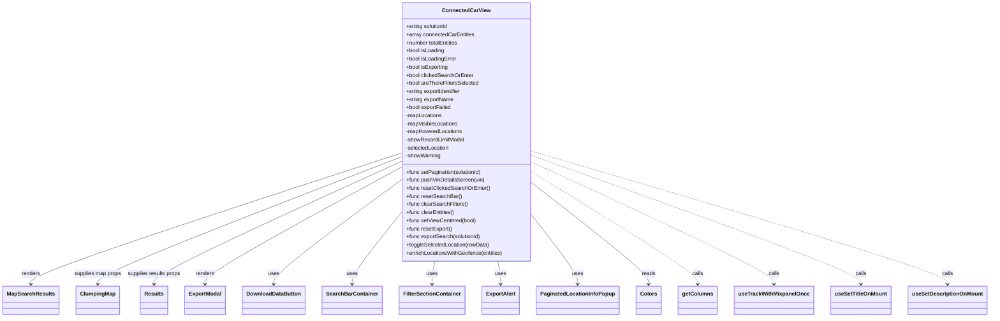
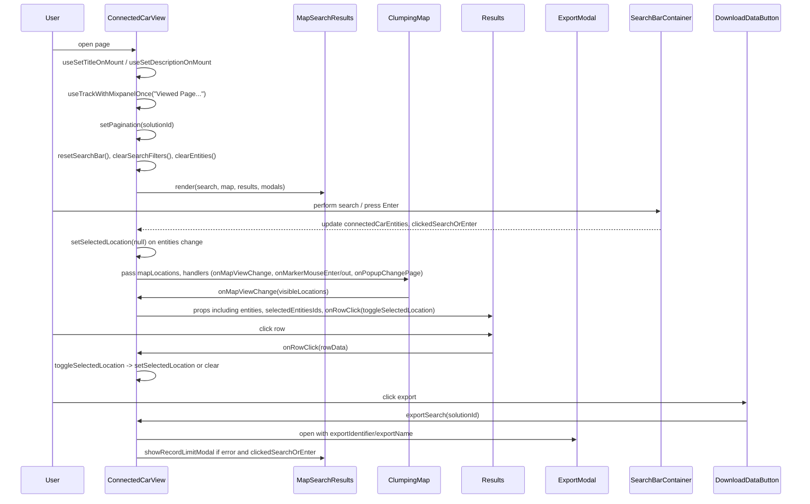

# Diagram: web/portal/src/pages/connectedcar/ConnectedCar.Dashboard.page.js

> Auto-generated by Obscura crawlers

## Diagram 1

### SVG

<svg id="container" width="2848.65625" xmlns="http://www.w3.org/2000/svg" class="classDiagram" height="942" viewBox="0 0 2848.65625 942" role="graphics-document document" aria-roledescription="class"><g><defs><marker id="container_class-aggregationStart" class="marker aggregation class" refX="18" refY="7" markerWidth="190" markerHeight="240" orient="auto"><path d="M 18,7 L9,13 L1,7 L9,1 Z"></path></marker></defs><defs><marker id="container_class-aggregationEnd" class="marker aggregation class" refX="1" refY="7" markerWidth="20" markerHeight="28" orient="auto"><path d="M 18,7 L9,13 L1,7 L9,1 Z"></path></marker></defs><defs><marker id="container_class-extensionStart" class="marker extension class" refX="18" refY="7" markerWidth="190" markerHeight="240" orient="auto"><path d="M 1,7 L18,13 V 1 Z"></path></marker></defs><defs><marker id="container_class-extensionEnd" class="marker extension class" refX="1" refY="7" markerWidth="20" markerHeight="28" orient="auto"><path d="M 1,1 V 13 L18,7 Z"></path></marker></defs><defs><marker id="container_class-compositionStart" class="marker composition class" refX="18" refY="7" markerWidth="190" markerHeight="240" orient="auto"><path d="M 18,7 L9,13 L1,7 L9,1 Z"></path></marker></defs><defs><marker id="container_class-compositionEnd" class="marker composition class" refX="1" refY="7" markerWidth="20" markerHeight="28" orient="auto"><path d="M 18,7 L9,13 L1,7 L9,1 Z"></path></marker></defs><defs><marker id="container_class-dependencyStart" class="marker dependency class" refX="6" refY="7" markerWidth="190" markerHeight="240" orient="auto"><path d="M 5,7 L9,13 L1,7 L9,1 Z"></path></marker></defs><defs><marker id="container_class-dependencyEnd" class="marker dependency class" refX="13" refY="7" markerWidth="20" markerHeight="28" orient="auto"><path d="M 18,7 L9,13 L14,7 L9,1 Z"></path></marker></defs><defs><marker id="container_class-lollipopStart" class="marker lollipop class" refX="13" refY="7" markerWidth="190" markerHeight="240" orient="auto"><circle stroke="black" fill="transparent" cx="7" cy="7" r="6"></circle></marker></defs><defs><marker id="container_class-lollipopEnd" class="marker lollipop class" refX="1" refY="7" markerWidth="190" markerHeight="240" orient="auto"><circle stroke="black" fill="transparent" cx="7" cy="7" r="6"></circle></marker></defs><g class="root"><g class="clusters"></g><g class="edgePaths"><path d="M1158.355,455.579L979.824,515.149C801.292,574.719,444.228,693.86,265.696,758.597C87.164,823.333,87.164,833.667,87.164,838.833L87.164,844" id="id_ConnectedCarView_MapSearchResults_1" class="edge-thickness-normal edge-pattern-solid relation" style=";;;" data-edge="true" data-et="edge" data-id="id_ConnectedCarView_MapSearchResults_1" data-points="W3sieCI6MTE1OC4zNTU0Njg3NSwieSI6NDU1LjU3OTEzOTY0MTgwMTJ9LHsieCI6ODcuMTY0MDYyNSwieSI6ODEzfSx7IngiOjg3LjE2NDA2MjUsInkiOjg1MH1d" marker-end="url(#container_class-dependencyEnd)"></path><path d="M1158.355,466.914L1011.641,524.595C864.927,582.276,571.499,697.638,424.785,760.486C278.07,823.333,278.07,833.667,278.07,838.833L278.07,844" id="id_ConnectedCarView_ClumpingMap_2" class="edge-thickness-normal edge-pattern-solid relation" style=";;;" data-edge="true" data-et="edge" data-id="id_ConnectedCarView_ClumpingMap_2" data-points="W3sieCI6MTE1OC4zNTU0Njg3NSwieSI6NDY2LjkxMzkyODY0MDQ3NzR9LHsieCI6Mjc4LjA3MDMxMjUsInkiOjgxM30seyJ4IjoyNzguMDcwMzEyNSwieSI6ODUwfV0=" marker-end="url(#container_class-dependencyEnd)"></path><path d="M1158.355,481.221L1040.261,536.518C922.167,591.814,685.978,702.407,567.883,762.87C449.789,823.333,449.789,833.667,449.789,838.833L449.789,844" id="id_ConnectedCarView_Results_3" class="edge-thickness-normal edge-pattern-solid relation" style=";;;" data-edge="true" data-et="edge" data-id="id_ConnectedCarView_Results_3" data-points="W3sieCI6MTE1OC4zNTU0Njg3NSwieSI6NDgxLjIyMTQ5ODYxMTkxMzY2fSx7IngiOjQ0OS43ODkwNjI1LCJ5Ijo4MTN9LHsieCI6NDQ5Ljc4OTA2MjUsInkiOjg1MH1d" marker-end="url(#container_class-dependencyEnd)"></path><path d="M1158.355,498.731L1064.844,551.109C971.333,603.487,784.311,708.244,690.8,765.788C597.289,823.333,597.289,833.667,597.289,838.833L597.289,844" id="id_ConnectedCarView_ExportModal_4" class="edge-thickness-normal edge-pattern-solid relation" style=";;;" data-edge="true" data-et="edge" data-id="id_ConnectedCarView_ExportModal_4" data-points="W3sieCI6MTE1OC4zNTU0Njg3NSwieSI6NDk4LjczMDczMDI1MjExNH0seyJ4Ijo1OTcuMjg5MDYyNSwieSI6ODEzfSx7IngiOjU5Ny4yODkwNjI1LCJ5Ijo4NTB9XQ==" marker-end="url(#container_class-dependencyEnd)"></path><path d="M1158.355,537.116L1097.98,583.097C1037.604,629.077,916.853,721.039,856.477,772.186C796.102,823.333,796.102,833.667,796.102,838.833L796.102,844" id="id_ConnectedCarView_DownloadDataButton_5" class="edge-thickness-normal edge-pattern-solid relation" style=";;;" data-edge="true" data-et="edge" data-id="id_ConnectedCarView_DownloadDataButton_5" data-points="W3sieCI6MTE1OC4zNTU0Njg3NSwieSI6NTM3LjExNTk5MzEzMTU2NzJ9LHsieCI6Nzk2LjEwMTU2MjUsInkiOjgxM30seyJ4Ijo3OTYuMTAxNTYyNSwieSI6ODUwfV0=" marker-end="url(#container_class-dependencyEnd)"></path><path d="M1158.355,636.845L1135.507,666.204C1112.659,695.563,1066.962,754.282,1044.114,788.808C1021.266,823.333,1021.266,833.667,1021.266,838.833L1021.266,844" id="id_ConnectedCarView_SearchBarContainer_6" class="edge-thickness-normal edge-pattern-solid relation" style=";;;" data-edge="true" data-et="edge" data-id="id_ConnectedCarView_SearchBarContainer_6" data-points="W3sieCI6MTE1OC4zNTU0Njg3NSwieSI6NjM2Ljg0NTA2NzA2NDA4MzR9LHsieCI6MTAyMS4yNjU2MjUsInkiOjgxM30seyJ4IjoxMDIxLjI2NTYyNSwieSI6ODUwfV0=" marker-end="url(#container_class-dependencyEnd)"></path><path d="M1258.721,776L1257.272,782.167C1255.824,788.333,1252.928,800.667,1251.479,812C1250.031,823.333,1250.031,833.667,1250.031,838.833L1250.031,844" id="id_ConnectedCarView_FilterSectionContainer_7" class="edge-thickness-normal edge-pattern-solid relation" style=";;;" data-edge="true" data-et="edge" data-id="id_ConnectedCarView_FilterSectionContainer_7" data-points="W3sieCI6MTI1OC43MjA2MzM1MzYyMjMyLCJ5Ijo3NzZ9LHsieCI6MTI1MC4wMzEyNSwieSI6ODEzfSx7IngiOjEyNTAuMDMxMjUsInkiOjg1MH1d" marker-end="url(#container_class-dependencyEnd)"></path><path d="M1439.084,776L1440.532,782.167C1441.981,788.333,1444.877,800.667,1446.325,812C1447.773,823.333,1447.773,833.667,1447.773,838.833L1447.773,844" id="id_ConnectedCarView_ExportAlert_8" class="edge-thickness-normal edge-pattern-solid relation" style=";;;" data-edge="true" data-et="edge" data-id="id_ConnectedCarView_ExportAlert_8" data-points="W3sieCI6MTQzOS4wODQwNTM5NjM3NzY4LCJ5Ijo3NzZ9LHsieCI6MTQ0Ny43NzM0Mzc1LCJ5Ijo4MTN9LHsieCI6MTQ0Ny43NzM0Mzc1LCJ5Ijo4NTB9XQ==" marker-end="url(#container_class-dependencyEnd)"></path><path d="M1539.449,642.447L1561.076,670.872C1582.703,699.298,1625.957,756.149,1647.584,789.741C1669.211,823.333,1669.211,833.667,1669.211,838.833L1669.211,844" id="id_ConnectedCarView_PaginatedLocationInfoPopup_9" class="edge-thickness-normal edge-pattern-solid relation" style=";;;" data-edge="true" data-et="edge" data-id="id_ConnectedCarView_PaginatedLocationInfoPopup_9" data-points="W3sieCI6MTUzOS40NDkyMTg3NSwieSI6NjQyLjQ0NjcxMjc2NDc4OTh9LHsieCI6MTY2OS4yMTA5Mzc1LCJ5Ijo4MTN9LHsieCI6MTY2OS4yMTA5Mzc1LCJ5Ijo4NTB9XQ==" marker-end="url(#container_class-dependencyEnd)"></path><path d="M1539.449,545.377L1594.863,589.981C1650.276,634.585,1761.103,723.792,1816.516,773.563C1871.93,823.333,1871.93,833.667,1871.93,838.833L1871.93,844" id="id_ConnectedCarView_Colors_10" class="edge-thickness-normal edge-pattern-solid relation" style=";;;" data-edge="true" data-et="edge" data-id="id_ConnectedCarView_Colors_10" data-points="W3sieCI6MTUzOS40NDkyMTg3NSwieSI6NTQ1LjM3Njc1MDQzODc3NjZ9LHsieCI6MTg3MS45Mjk2ODc1LCJ5Ijo4MTN9LHsieCI6MTg3MS45Mjk2ODc1LCJ5Ijo4NTB9XQ==" marker-end="url(#container_class-dependencyEnd)"></path><path d="M1539.449,512.964L1618.221,562.97C1696.992,612.976,1854.535,712.988,1933.307,768.161C2012.078,823.333,2012.078,833.667,2012.078,838.833L2012.078,844" id="id_ConnectedCarView_getColumns_11" class="edge-thickness-normal edge-pattern-dashed relation" style=";;;" data-edge="true" data-et="edge" data-id="id_ConnectedCarView_getColumns_11" data-points="W3sieCI6MTUzOS40NDkyMTg3NSwieSI6NTEyLjk2Mzc1NzQ4NzkzOTh9LHsieCI6MjAxMi4wNzgxMjUsInkiOjgxM30seyJ4IjoyMDEyLjA3ODEyNSwieSI6ODUwfV0=" marker-end="url(#container_class-dependencyEnd)"></path><path d="M1539.449,483.075L1654.494,538.062C1769.539,593.05,1999.629,703.025,2114.674,763.179C2229.719,823.333,2229.719,833.667,2229.719,838.833L2229.719,844" id="id_ConnectedCarView_useTrackWithMixpanelOnce_12" class="edge-thickness-normal edge-pattern-dashed relation" style=";;;" data-edge="true" data-et="edge" data-id="id_ConnectedCarView_useTrackWithMixpanelOnce_12" data-points="W3sieCI6MTUzOS40NDkyMTg3NSwieSI6NDgzLjA3NDg2Mzk2MjMyMTl9LHsieCI6MjIyOS43MTg3NSwieSI6ODEzfSx7IngiOjIyMjkuNzE4NzUsInkiOjg1MH1d" marker-end="url(#container_class-dependencyEnd)"></path><path d="M1539.449,462.987L1696.036,521.323C1852.622,579.658,2165.796,696.329,2322.382,759.831C2478.969,823.333,2478.969,833.667,2478.969,838.833L2478.969,844" id="id_ConnectedCarView_useSetTitleOnMount_13" class="edge-thickness-normal edge-pattern-dashed relation" style=";;;" data-edge="true" data-et="edge" data-id="id_ConnectedCarView_useSetTitleOnMount_13" data-points="W3sieCI6MTUzOS40NDkyMTg3NSwieSI6NDYyLjk4NzE4NjE3ODkwOTU1fSx7IngiOjI0NzguOTY4NzUsInkiOjgxM30seyJ4IjoyNDc4Ljk2ODc1LCJ5Ijo4NTB9XQ==" marker-end="url(#container_class-dependencyEnd)"></path><path d="M1539.449,450.163L1737.564,510.636C1935.68,571.108,2331.91,692.054,2530.025,757.694C2728.141,823.333,2728.141,833.667,2728.141,838.833L2728.141,844" id="id_ConnectedCarView_useSetDescriptionOnMount_14" class="edge-thickness-normal edge-pattern-dashed relation" style=";;;" data-edge="true" data-et="edge" data-id="id_ConnectedCarView_useSetDescriptionOnMount_14" data-points="W3sieCI6MTUzOS40NDkyMTg3NSwieSI6NDUwLjE2MjcwODY5NjIwNjN9LHsieCI6MjcyOC4xNDA2MjUsInkiOjgxM30seyJ4IjoyNzI4LjE0MDYyNSwieSI6ODUwfV0=" marker-end="url(#container_class-dependencyEnd)"></path></g><g class="edgeLabels"><g class="edgeLabel" transform="translate(87.1640625, 813)"><g class="label" data-id="id_ConnectedCarView_MapSearchResults_1" transform="translate(-27.75, -12)"><foreignObject width="55.5" height="24">

renders

</foreignObject></g></g><g class="edgeLabel" transform="translate(278.0703125, 813)"><g class="label" data-id="id_ConnectedCarView_ClumpingMap_2" transform="translate(-71.5546875, -12)"><foreignObject width="143.109375" height="24">

supplies map props

</foreignObject></g></g><g class="edgeLabel" transform="translate(449.7890625, 813)"><g class="label" data-id="id_ConnectedCarView_Results_3" transform="translate(-80.1640625, -12)"><foreignObject width="160.328125" height="24">

supplies results props

</foreignObject></g></g><g class="edgeLabel" transform="translate(597.2890625, 813)"><g class="label" data-id="id_ConnectedCarView_ExportModal_4" transform="translate(-27.75, -12)"><foreignObject width="55.5" height="24">

renders

</foreignObject></g></g><g class="edgeLabel" transform="translate(796.1015625, 813)"><g class="label" data-id="id_ConnectedCarView_DownloadDataButton_5" transform="translate(-16.4921875, -12)"><foreignObject width="32.984375" height="24">

uses

</foreignObject></g></g><g class="edgeLabel" transform="translate(1021.265625, 813)"><g class="label" data-id="id_ConnectedCarView_SearchBarContainer_6" transform="translate(-16.4921875, -12)"><foreignObject width="32.984375" height="24">

uses

</foreignObject></g></g><g class="edgeLabel" transform="translate(1250.03125, 813)"><g class="label" data-id="id_ConnectedCarView_FilterSectionContainer_7" transform="translate(-16.4921875, -12)"><foreignObject width="32.984375" height="24">

uses

</foreignObject></g></g><g class="edgeLabel" transform="translate(1447.7734375, 813)"><g class="label" data-id="id_ConnectedCarView_ExportAlert_8" transform="translate(-16.4921875, -12)"><foreignObject width="32.984375" height="24">

uses

</foreignObject></g></g><g class="edgeLabel" transform="translate(1669.2109375, 813)"><g class="label" data-id="id_ConnectedCarView_PaginatedLocationInfoPopup_9" transform="translate(-16.4921875, -12)"><foreignObject width="32.984375" height="24">

uses

</foreignObject></g></g><g class="edgeLabel" transform="translate(1871.9296875, 813)"><g class="label" data-id="id_ConnectedCarView_Colors_10" transform="translate(-20.0078125, -12)"><foreignObject width="40.015625" height="24">

reads

</foreignObject></g></g><g class="edgeLabel" transform="translate(2012.078125, 813)"><g class="label" data-id="id_ConnectedCarView_getColumns_11" transform="translate(-16.4453125, -12)"><foreignObject width="32.890625" height="24">

calls

</foreignObject></g></g><g class="edgeLabel" transform="translate(2229.71875, 813)"><g class="label" data-id="id_ConnectedCarView_useTrackWithMixpanelOnce_12" transform="translate(-16.4453125, -12)"><foreignObject width="32.890625" height="24">

calls

</foreignObject></g></g><g class="edgeLabel" transform="translate(2478.96875, 813)"><g class="label" data-id="id_ConnectedCarView_useSetTitleOnMount_13" transform="translate(-16.4453125, -12)"><foreignObject width="32.890625" height="24">

calls

</foreignObject></g></g><g class="edgeLabel" transform="translate(2728.140625, 813)"><g class="label" data-id="id_ConnectedCarView_useSetDescriptionOnMount_14" transform="translate(-16.4453125, -12)"><foreignObject width="32.890625" height="24">

calls

</foreignObject></g></g></g><g class="nodes"><g class="node default" id="classId-ConnectedCarView-0" transform="translate(1348.90234375, 392)"><g class="basic label-container"><path d="M-190.546875 -384 L190.546875 -384 L190.546875 384 L-190.546875 384" stroke="none" stroke-width="0" fill="#ECECFF" style=""></path><path d="M-190.546875 -384 C-89.60098523951497 -384, 11.344904520970061 -384, 190.546875 -384 M-190.546875 -384 C-51.39861832344374 -384, 87.74963835311252 -384, 190.546875 -384 M190.546875 -384 C190.546875 -125.83590847896039, 190.546875 132.32818304207922, 190.546875 384 M190.546875 -384 C190.546875 -226.43245050719878, 190.546875 -68.86490101439756, 190.546875 384 M190.546875 384 C80.58244388626481 384, -29.381987227470376 384, -190.546875 384 M190.546875 384 C100.64628142546708 384, 10.74568785093416 384, -190.546875 384 M-190.546875 384 C-190.546875 105.47470371325824, -190.546875 -173.05059257348353, -190.546875 -384 M-190.546875 384 C-190.546875 225.66778436741305, -190.546875 67.3355687348261, -190.546875 -384" stroke="#9370DB" stroke-width="1.3" fill="none" stroke-dasharray="0 0" style=""></path></g><g class="annotation-group text" transform="translate(0, -360)"></g><g class="label-group text" transform="translate(-68.09375, -360)"><g class="label" style="font-weight: bolder" transform="translate(0,-12)"><foreignObject width="136.1875" height="24">

ConnectedCarView

</foreignObject></g></g><g class="members-group text" transform="translate(-178.546875, -312)"><g class="label" style="" transform="translate(0,-12)"><foreignObject width="127.96875" height="24">

+string solutionId

</foreignObject></g><g class="label" style="" transform="translate(0,12)"><foreignObject width="202.671875" height="24">

+array connectedCarEntities

</foreignObject></g><g class="label" style="" transform="translate(0,36)"><foreignObject width="157.359375" height="24">

+number totalEntities

</foreignObject></g><g class="label" style="" transform="translate(0,60)"><foreignObject width="114.328125" height="24">

+bool isLoading

</foreignObject></g><g class="label" style="" transform="translate(0,84)"><foreignObject width="150.125" height="24">

+bool isLoadingError

</foreignObject></g><g class="label" style="" transform="translate(0,108)"><foreignObject width="126.421875" height="24">

+bool isExporting

</foreignObject></g><g class="label" style="" transform="translate(0,132)"><foreignObject width="200.109375" height="24">

+bool clickedSearchOrEnter

</foreignObject></g><g class="label" style="" transform="translate(0,156)"><foreignObject width="215.421875" height="24">

+bool areThereFiltersSelected

</foreignObject></g><g class="label" style="" transform="translate(0,180)"><foreignObject width="167.765625" height="24">

+string exportIdentifier

</foreignObject></g><g class="label" style="" transform="translate(0,204)"><foreignObject width="143.0625" height="24">

+string exportName

</foreignObject></g><g class="label" style="" transform="translate(0,228)"><foreignObject width="135.25" height="24">

+bool exportFailed

</foreignObject></g><g class="label" style="" transform="translate(0,252)"><foreignObject width="107.953125" height="24">

-mapLocations

</foreignObject></g><g class="label" style="" transform="translate(0,276)"><foreignObject width="156.1875" height="24">

-mapVisibleLocations

</foreignObject></g><g class="label" style="" transform="translate(0,300)"><foreignObject width="168.625" height="24">

-mapHoveredLocations

</foreignObject></g><g class="label" style="" transform="translate(0,324)"><foreignObject width="175.28125" height="24">

-showRecordLimitModal

</foreignObject></g><g class="label" style="" transform="translate(0,348)"><foreignObject width="129.5625" height="24">

-selectedLocation

</foreignObject></g><g class="label" style="" transform="translate(0,372)"><foreignObject width="103.3125" height="24">

-showWarning

</foreignObject></g></g><g class="methods-group text" transform="translate(-178.546875, 120)"><g class="label" style="" transform="translate(0,-12)"><foreignObject width="227.015625" height="24">

+func setPagination(solutionId)

</foreignObject></g><g class="label" style="" transform="translate(0,12)"><foreignObject width="233.203125" height="24">

+func pushVinDetailsScreen(vin)

</foreignObject></g><g class="label" style="" transform="translate(0,36)"><foreignObject width="246.578125" height="24">

+func resetClickedSearchOrEnter()

</foreignObject></g><g class="label" style="" transform="translate(0,60)"><foreignObject width="163.75" height="24">

+func resetSearchBar()

</foreignObject></g><g class="label" style="" transform="translate(0,84)"><foreignObject width="182.609375" height="24">

+func clearSearchFilters()

</foreignObject></g><g class="label" style="" transform="translate(0,108)"><foreignObject width="144.296875" height="24">

+func clearEntities()

</foreignObject></g><g class="label" style="" transform="translate(0,132)"><foreignObject width="207.484375" height="24">

+func setViewCentered(bool)

</foreignObject></g><g class="label" style="" transform="translate(0,156)"><foreignObject width="137.5625" height="24">

+func resetExport()

</foreignObject></g><g class="label" style="" transform="translate(0,180)"><foreignObject width="224.015625" height="24">

+func exportSearch(solutionId)

</foreignObject></g><g class="label" style="" transform="translate(0,204)"><foreignObject width="247.203125" height="24">

+toggleSelectedLocation(rowData)

</foreignObject></g><g class="label" style="" transform="translate(0,228)"><foreignObject width="289" height="24">

+enrichLocationsWithGeofence(entities)

</foreignObject></g></g><g class="divider" style=""><path d="M-190.546875 -336 C-83.37091421548499 -336, 23.805046569030026 -336, 190.546875 -336 M-190.546875 -336 C-80.16899631229744 -336, 30.208882375405125 -336, 190.546875 -336" stroke="#9370DB" stroke-width="1.3" fill="none" stroke-dasharray="0 0" style=""></path></g><g class="divider" style=""><path d="M-190.546875 96 C-50.55432992788235 96, 89.4382151442353 96, 190.546875 96 M-190.546875 96 C-80.772293035294 96, 29.002288929412003 96, 190.546875 96" stroke="#9370DB" stroke-width="1.3" fill="none" stroke-dasharray="0 0" style=""></path></g></g><g class="node default" id="classId-MapSearchResults-1" transform="translate(87.1640625, 892)"><g class="basic label-container"><path d="M-79.1640625 -42 L79.1640625 -42 L79.1640625 42 L-79.1640625 42" stroke="none" stroke-width="0" fill="#ECECFF" style=""></path><path d="M-79.1640625 -42 C-19.567311174829143 -42, 40.02944015034171 -42, 79.1640625 -42 M-79.1640625 -42 C-26.200331997472134 -42, 26.763398505055733 -42, 79.1640625 -42 M79.1640625 -42 C79.1640625 -16.732085382307833, 79.1640625 8.535829235384334, 79.1640625 42 M79.1640625 -42 C79.1640625 -23.22985939344113, 79.1640625 -4.459718786882263, 79.1640625 42 M79.1640625 42 C21.5891456121064 42, -35.9857712757872 42, -79.1640625 42 M79.1640625 42 C22.03512448450524 42, -35.09381353098952 42, -79.1640625 42 M-79.1640625 42 C-79.1640625 17.526809713174934, -79.1640625 -6.946380573650131, -79.1640625 -42 M-79.1640625 42 C-79.1640625 23.420243653890324, -79.1640625 4.8404873077806485, -79.1640625 -42" stroke="#9370DB" stroke-width="1.3" fill="none" stroke-dasharray="0 0" style=""></path></g><g class="annotation-group text" transform="translate(0, -18)"></g><g class="label-group text" transform="translate(-67.1640625, -18)"><g class="label" style="font-weight: bolder" transform="translate(0,-12)"><foreignObject width="134.328125" height="24">

MapSearchResults

</foreignObject></g></g><g class="members-group text" transform="translate(-67.1640625, 30)"></g><g class="methods-group text" transform="translate(-67.1640625, 60)"></g><g class="divider" style=""><path d="M-79.1640625 6 C-32.439212984947474 6, 14.285636530105052 6, 79.1640625 6 M-79.1640625 6 C-28.221364107477932 6, 22.721334285044136 6, 79.1640625 6" stroke="#9370DB" stroke-width="1.3" fill="none" stroke-dasharray="0 0" style=""></path></g><g class="divider" style=""><path d="M-79.1640625 24 C-21.600702479095432 24, 35.962657541809136 24, 79.1640625 24 M-79.1640625 24 C-40.22830612382204 24, -1.292549747644074 24, 79.1640625 24" stroke="#9370DB" stroke-width="1.3" fill="none" stroke-dasharray="0 0" style=""></path></g></g><g class="node default" id="classId-ClumpingMap-2" transform="translate(278.0703125, 892)"><g class="basic label-container"><path d="M-61.7421875 -42 L61.7421875 -42 L61.7421875 42 L-61.7421875 42" stroke="none" stroke-width="0" fill="#ECECFF" style=""></path><path d="M-61.7421875 -42 C-22.33319298394109 -42, 17.075801532117822 -42, 61.7421875 -42 M-61.7421875 -42 C-36.750009314026656 -42, -11.757831128053311 -42, 61.7421875 -42 M61.7421875 -42 C61.7421875 -19.360712683012462, 61.7421875 3.278574633975076, 61.7421875 42 M61.7421875 -42 C61.7421875 -24.81868643188086, 61.7421875 -7.637372863761719, 61.7421875 42 M61.7421875 42 C32.498479808749636 42, 3.2547721174992645 42, -61.7421875 42 M61.7421875 42 C24.94588092156947 42, -11.850425656861063 42, -61.7421875 42 M-61.7421875 42 C-61.7421875 18.155492300562763, -61.7421875 -5.689015398874474, -61.7421875 -42 M-61.7421875 42 C-61.7421875 12.637798264409852, -61.7421875 -16.724403471180295, -61.7421875 -42" stroke="#9370DB" stroke-width="1.3" fill="none" stroke-dasharray="0 0" style=""></path></g><g class="annotation-group text" transform="translate(0, -18)"></g><g class="label-group text" transform="translate(-49.7421875, -18)"><g class="label" style="font-weight: bolder" transform="translate(0,-12)"><foreignObject width="99.484375" height="24">

ClumpingMap

</foreignObject></g></g><g class="members-group text" transform="translate(-49.7421875, 30)"></g><g class="methods-group text" transform="translate(-49.7421875, 60)"></g><g class="divider" style=""><path d="M-61.7421875 6 C-33.74322029078999 6, -5.744253081579984 6, 61.7421875 6 M-61.7421875 6 C-21.728458602851823 6, 18.285270294296353 6, 61.7421875 6" stroke="#9370DB" stroke-width="1.3" fill="none" stroke-dasharray="0 0" style=""></path></g><g class="divider" style=""><path d="M-61.7421875 24 C-26.390959604895144 24, 8.960268290209711 24, 61.7421875 24 M-61.7421875 24 C-12.728618084903573 24, 36.284951330192854 24, 61.7421875 24" stroke="#9370DB" stroke-width="1.3" fill="none" stroke-dasharray="0 0" style=""></path></g></g><g class="node default" id="classId-Results-3" transform="translate(449.7890625, 892)"><g class="basic label-container"><path d="M-39.0078125 -42 L39.0078125 -42 L39.0078125 42 L-39.0078125 42" stroke="none" stroke-width="0" fill="#ECECFF" style=""></path><path d="M-39.0078125 -42 C-23.12161299044225 -42, -7.235413480884503 -42, 39.0078125 -42 M-39.0078125 -42 C-7.826010915142231 -42, 23.35579066971554 -42, 39.0078125 -42 M39.0078125 -42 C39.0078125 -20.06536406532545, 39.0078125 1.8692718693490988, 39.0078125 42 M39.0078125 -42 C39.0078125 -9.133850373559952, 39.0078125 23.732299252880097, 39.0078125 42 M39.0078125 42 C16.19053323090316 42, -6.62674603819368 42, -39.0078125 42 M39.0078125 42 C10.099701124761555 42, -18.80841025047689 42, -39.0078125 42 M-39.0078125 42 C-39.0078125 16.25847705373144, -39.0078125 -9.48304589253712, -39.0078125 -42 M-39.0078125 42 C-39.0078125 14.929076035114267, -39.0078125 -12.141847929771465, -39.0078125 -42" stroke="#9370DB" stroke-width="1.3" fill="none" stroke-dasharray="0 0" style=""></path></g><g class="annotation-group text" transform="translate(0, -18)"></g><g class="label-group text" transform="translate(-27.0078125, -18)"><g class="label" style="font-weight: bolder" transform="translate(0,-12)"><foreignObject width="54.015625" height="24">

Results

</foreignObject></g></g><g class="members-group text" transform="translate(-27.0078125, 30)"></g><g class="methods-group text" transform="translate(-27.0078125, 60)"></g><g class="divider" style=""><path d="M-39.0078125 6 C-18.57774285209121 6, 1.8523267958175822 6, 39.0078125 6 M-39.0078125 6 C-20.425772595147645 6, -1.8437326902952904 6, 39.0078125 6" stroke="#9370DB" stroke-width="1.3" fill="none" stroke-dasharray="0 0" style=""></path></g><g class="divider" style=""><path d="M-39.0078125 24 C-22.674938625356994 24, -6.342064750713988 24, 39.0078125 24 M-39.0078125 24 C-22.906076219555064 24, -6.804339939110129 24, 39.0078125 24" stroke="#9370DB" stroke-width="1.3" fill="none" stroke-dasharray="0 0" style=""></path></g></g><g class="node default" id="classId-ExportModal-4" transform="translate(597.2890625, 892)"><g class="basic label-container"><path d="M-58.4921875 -42 L58.4921875 -42 L58.4921875 42 L-58.4921875 42" stroke="none" stroke-width="0" fill="#ECECFF" style=""></path><path d="M-58.4921875 -42 C-27.977359360212457 -42, 2.537468779575086 -42, 58.4921875 -42 M-58.4921875 -42 C-32.70859420701905 -42, -6.925000914038087 -42, 58.4921875 -42 M58.4921875 -42 C58.4921875 -19.46877600673576, 58.4921875 3.0624479865284826, 58.4921875 42 M58.4921875 -42 C58.4921875 -13.72641084305723, 58.4921875 14.547178313885539, 58.4921875 42 M58.4921875 42 C11.928884623559831 42, -34.63441825288034 42, -58.4921875 42 M58.4921875 42 C34.36789468451241 42, 10.243601869024808 42, -58.4921875 42 M-58.4921875 42 C-58.4921875 12.409896804731847, -58.4921875 -17.180206390536306, -58.4921875 -42 M-58.4921875 42 C-58.4921875 13.822236548458278, -58.4921875 -14.355526903083444, -58.4921875 -42" stroke="#9370DB" stroke-width="1.3" fill="none" stroke-dasharray="0 0" style=""></path></g><g class="annotation-group text" transform="translate(0, -18)"></g><g class="label-group text" transform="translate(-46.4921875, -18)"><g class="label" style="font-weight: bolder" transform="translate(0,-12)"><foreignObject width="92.984375" height="24">

ExportModal

</foreignObject></g></g><g class="members-group text" transform="translate(-46.4921875, 30)"></g><g class="methods-group text" transform="translate(-46.4921875, 60)"></g><g class="divider" style=""><path d="M-58.4921875 6 C-18.168662550126925 6, 22.15486239974615 6, 58.4921875 6 M-58.4921875 6 C-27.081633857285627 6, 4.328919785428745 6, 58.4921875 6" stroke="#9370DB" stroke-width="1.3" fill="none" stroke-dasharray="0 0" style=""></path></g><g class="divider" style=""><path d="M-58.4921875 24 C-29.14866619605378 24, 0.19485510789243676 24, 58.4921875 24 M-58.4921875 24 C-27.681691699030797 24, 3.1288041019384067 24, 58.4921875 24" stroke="#9370DB" stroke-width="1.3" fill="none" stroke-dasharray="0 0" style=""></path></g></g><g class="node default" id="classId-DownloadDataButton-5" transform="translate(796.1015625, 892)"><g class="basic label-container"><path d="M-90.3203125 -42 L90.3203125 -42 L90.3203125 42 L-90.3203125 42" stroke="none" stroke-width="0" fill="#ECECFF" style=""></path><path d="M-90.3203125 -42 C-38.236240812082244 -42, 13.847830875835513 -42, 90.3203125 -42 M-90.3203125 -42 C-53.47616749745404 -42, -16.632022494908085 -42, 90.3203125 -42 M90.3203125 -42 C90.3203125 -20.53307200105833, 90.3203125 0.9338559978833416, 90.3203125 42 M90.3203125 -42 C90.3203125 -19.316602746610965, 90.3203125 3.3667945067780707, 90.3203125 42 M90.3203125 42 C20.62750661310669 42, -49.06529927378662 42, -90.3203125 42 M90.3203125 42 C23.020257103398677 42, -44.279798293202646 42, -90.3203125 42 M-90.3203125 42 C-90.3203125 22.27230713606886, -90.3203125 2.5446142721377214, -90.3203125 -42 M-90.3203125 42 C-90.3203125 24.655230129909466, -90.3203125 7.310460259818932, -90.3203125 -42" stroke="#9370DB" stroke-width="1.3" fill="none" stroke-dasharray="0 0" style=""></path></g><g class="annotation-group text" transform="translate(0, -18)"></g><g class="label-group text" transform="translate(-78.3203125, -18)"><g class="label" style="font-weight: bolder" transform="translate(0,-12)"><foreignObject width="156.640625" height="24">

DownloadDataButton

</foreignObject></g></g><g class="members-group text" transform="translate(-78.3203125, 30)"></g><g class="methods-group text" transform="translate(-78.3203125, 60)"></g><g class="divider" style=""><path d="M-90.3203125 6 C-35.953044578756305 6, 18.41422334248739 6, 90.3203125 6 M-90.3203125 6 C-33.85429510088965 6, 22.6117222982207 6, 90.3203125 6" stroke="#9370DB" stroke-width="1.3" fill="none" stroke-dasharray="0 0" style=""></path></g><g class="divider" style=""><path d="M-90.3203125 24 C-33.51242236884973 24, 23.295467762300547 24, 90.3203125 24 M-90.3203125 24 C-53.4246405537774 24, -16.528968607554802 24, 90.3203125 24" stroke="#9370DB" stroke-width="1.3" fill="none" stroke-dasharray="0 0" style=""></path></g></g><g class="node default" id="classId-SearchBarContainer-6" transform="translate(1021.265625, 892)"><g class="basic label-container"><path d="M-84.84375 -42 L84.84375 -42 L84.84375 42 L-84.84375 42" stroke="none" stroke-width="0" fill="#ECECFF" style=""></path><path d="M-84.84375 -42 C-27.346023987887776 -42, 30.15170202422445 -42, 84.84375 -42 M-84.84375 -42 C-39.418729209838624 -42, 6.006291580322753 -42, 84.84375 -42 M84.84375 -42 C84.84375 -12.29344370525817, 84.84375 17.41311258948366, 84.84375 42 M84.84375 -42 C84.84375 -13.663259221402232, 84.84375 14.673481557195537, 84.84375 42 M84.84375 42 C26.453435474434222 42, -31.936879051131555 42, -84.84375 42 M84.84375 42 C20.26489968055178 42, -44.31395063889644 42, -84.84375 42 M-84.84375 42 C-84.84375 21.94298743609492, -84.84375 1.8859748721898413, -84.84375 -42 M-84.84375 42 C-84.84375 13.560898464736344, -84.84375 -14.878203070527313, -84.84375 -42" stroke="#9370DB" stroke-width="1.3" fill="none" stroke-dasharray="0 0" style=""></path></g><g class="annotation-group text" transform="translate(0, -18)"></g><g class="label-group text" transform="translate(-72.84375, -18)"><g class="label" style="font-weight: bolder" transform="translate(0,-12)"><foreignObject width="145.6875" height="24">

SearchBarContainer

</foreignObject></g></g><g class="members-group text" transform="translate(-72.84375, 30)"></g><g class="methods-group text" transform="translate(-72.84375, 60)"></g><g class="divider" style=""><path d="M-84.84375 6 C-35.149314932500346 6, 14.545120134999308 6, 84.84375 6 M-84.84375 6 C-33.09255852014177 6, 18.658632959716456 6, 84.84375 6" stroke="#9370DB" stroke-width="1.3" fill="none" stroke-dasharray="0 0" style=""></path></g><g class="divider" style=""><path d="M-84.84375 24 C-42.1249547678528 24, 0.5938404642944022 24, 84.84375 24 M-84.84375 24 C-48.506136632914725 24, -12.16852326582945 24, 84.84375 24" stroke="#9370DB" stroke-width="1.3" fill="none" stroke-dasharray="0 0" style=""></path></g></g><g class="node default" id="classId-FilterSectionContainer-7" transform="translate(1250.03125, 892)"><g class="basic label-container"><path d="M-93.921875 -42 L93.921875 -42 L93.921875 42 L-93.921875 42" stroke="none" stroke-width="0" fill="#ECECFF" style=""></path><path d="M-93.921875 -42 C-21.205053283419318 -42, 51.511768433161365 -42, 93.921875 -42 M-93.921875 -42 C-28.81687187122337 -42, 36.28813125755326 -42, 93.921875 -42 M93.921875 -42 C93.921875 -18.92659036753479, 93.921875 4.146819264930421, 93.921875 42 M93.921875 -42 C93.921875 -16.45684417956854, 93.921875 9.086311640862917, 93.921875 42 M93.921875 42 C54.27378618097244 42, 14.625697361944873 42, -93.921875 42 M93.921875 42 C30.371165484038478 42, -33.179544031923044 42, -93.921875 42 M-93.921875 42 C-93.921875 13.873382496404297, -93.921875 -14.253235007191407, -93.921875 -42 M-93.921875 42 C-93.921875 18.020252769536825, -93.921875 -5.959494460926351, -93.921875 -42" stroke="#9370DB" stroke-width="1.3" fill="none" stroke-dasharray="0 0" style=""></path></g><g class="annotation-group text" transform="translate(0, -18)"></g><g class="label-group text" transform="translate(-81.921875, -18)"><g class="label" style="font-weight: bolder" transform="translate(0,-12)"><foreignObject width="163.84375" height="24">

FilterSectionContainer

</foreignObject></g></g><g class="members-group text" transform="translate(-81.921875, 30)"></g><g class="methods-group text" transform="translate(-81.921875, 60)"></g><g class="divider" style=""><path d="M-93.921875 6 C-35.20518061496928 6, 23.51151377006144 6, 93.921875 6 M-93.921875 6 C-31.622673105515048 6, 30.676528788969904 6, 93.921875 6" stroke="#9370DB" stroke-width="1.3" fill="none" stroke-dasharray="0 0" style=""></path></g><g class="divider" style=""><path d="M-93.921875 24 C-39.16148742360359 24, 15.598900152792822 24, 93.921875 24 M-93.921875 24 C-19.21494215514258 24, 55.49199068971484 24, 93.921875 24" stroke="#9370DB" stroke-width="1.3" fill="none" stroke-dasharray="0 0" style=""></path></g></g><g class="node default" id="classId-ExportAlert-8" transform="translate(1447.7734375, 892)"><g class="basic label-container"><path d="M-53.8203125 -42 L53.8203125 -42 L53.8203125 42 L-53.8203125 42" stroke="none" stroke-width="0" fill="#ECECFF" style=""></path><path d="M-53.8203125 -42 C-26.690267992667437 -42, 0.4397765146651267 -42, 53.8203125 -42 M-53.8203125 -42 C-14.297207798617976 -42, 25.22589690276405 -42, 53.8203125 -42 M53.8203125 -42 C53.8203125 -20.025665867301164, 53.8203125 1.9486682653976715, 53.8203125 42 M53.8203125 -42 C53.8203125 -12.231354027184395, 53.8203125 17.53729194563121, 53.8203125 42 M53.8203125 42 C21.647628886416257 42, -10.525054727167486 42, -53.8203125 42 M53.8203125 42 C15.920521472522346 42, -21.97926955495531 42, -53.8203125 42 M-53.8203125 42 C-53.8203125 20.484353198532382, -53.8203125 -1.0312936029352358, -53.8203125 -42 M-53.8203125 42 C-53.8203125 10.696108749528246, -53.8203125 -20.607782500943507, -53.8203125 -42" stroke="#9370DB" stroke-width="1.3" fill="none" stroke-dasharray="0 0" style=""></path></g><g class="annotation-group text" transform="translate(0, -18)"></g><g class="label-group text" transform="translate(-41.8203125, -18)"><g class="label" style="font-weight: bolder" transform="translate(0,-12)"><foreignObject width="83.640625" height="24">

ExportAlert

</foreignObject></g></g><g class="members-group text" transform="translate(-41.8203125, 30)"></g><g class="methods-group text" transform="translate(-41.8203125, 60)"></g><g class="divider" style=""><path d="M-53.8203125 6 C-15.971956529940528 6, 21.876399440118945 6, 53.8203125 6 M-53.8203125 6 C-32.273478973373315 6, -10.726645446746637 6, 53.8203125 6" stroke="#9370DB" stroke-width="1.3" fill="none" stroke-dasharray="0 0" style=""></path></g><g class="divider" style=""><path d="M-53.8203125 24 C-17.032332993431858 24, 19.755646513136284 24, 53.8203125 24 M-53.8203125 24 C-11.024082043216445 24, 31.77214841356711 24, 53.8203125 24" stroke="#9370DB" stroke-width="1.3" fill="none" stroke-dasharray="0 0" style=""></path></g></g><g class="node default" id="classId-PaginatedLocationInfoPopup-9" transform="translate(1669.2109375, 892)"><g class="basic label-container"><path d="M-117.6171875 -42 L117.6171875 -42 L117.6171875 42 L-117.6171875 42" stroke="none" stroke-width="0" fill="#ECECFF" style=""></path><path d="M-117.6171875 -42 C-56.66964112927732 -42, 4.277905241445353 -42, 117.6171875 -42 M-117.6171875 -42 C-40.876492590273955 -42, 35.86420231945209 -42, 117.6171875 -42 M117.6171875 -42 C117.6171875 -9.78324060884011, 117.6171875 22.43351878231978, 117.6171875 42 M117.6171875 -42 C117.6171875 -9.298572369425237, 117.6171875 23.402855261149526, 117.6171875 42 M117.6171875 42 C60.11445912252419 42, 2.6117307450483764 42, -117.6171875 42 M117.6171875 42 C34.55342245361257 42, -48.51034259277486 42, -117.6171875 42 M-117.6171875 42 C-117.6171875 15.754119519686455, -117.6171875 -10.49176096062709, -117.6171875 -42 M-117.6171875 42 C-117.6171875 14.016724922432811, -117.6171875 -13.966550155134378, -117.6171875 -42" stroke="#9370DB" stroke-width="1.3" fill="none" stroke-dasharray="0 0" style=""></path></g><g class="annotation-group text" transform="translate(0, -18)"></g><g class="label-group text" transform="translate(-105.6171875, -18)"><g class="label" style="font-weight: bolder" transform="translate(0,-12)"><foreignObject width="211.234375" height="24">

PaginatedLocationInfoPopup

</foreignObject></g></g><g class="members-group text" transform="translate(-105.6171875, 30)"></g><g class="methods-group text" transform="translate(-105.6171875, 60)"></g><g class="divider" style=""><path d="M-117.6171875 6 C-32.16198743749338 6, 53.29321262501324 6, 117.6171875 6 M-117.6171875 6 C-26.38786528345956 6, 64.84145693308088 6, 117.6171875 6" stroke="#9370DB" stroke-width="1.3" fill="none" stroke-dasharray="0 0" style=""></path></g><g class="divider" style=""><path d="M-117.6171875 24 C-37.045479506253386 24, 43.52622848749323 24, 117.6171875 24 M-117.6171875 24 C-43.73442309477774 24, 30.148341310444522 24, 117.6171875 24" stroke="#9370DB" stroke-width="1.3" fill="none" stroke-dasharray="0 0" style=""></path></g></g><g class="node default" id="classId-Colors-10" transform="translate(1871.9296875, 892)"><g class="basic label-container"><path d="M-35.1015625 -42 L35.1015625 -42 L35.1015625 42 L-35.1015625 42" stroke="none" stroke-width="0" fill="#ECECFF" style=""></path><path d="M-35.1015625 -42 C-11.75899567680315 -42, 11.583571146393702 -42, 35.1015625 -42 M-35.1015625 -42 C-10.66780442576254 -42, 13.76595364847492 -42, 35.1015625 -42 M35.1015625 -42 C35.1015625 -24.5535779843134, 35.1015625 -7.107155968626799, 35.1015625 42 M35.1015625 -42 C35.1015625 -8.571706653917708, 35.1015625 24.856586692164583, 35.1015625 42 M35.1015625 42 C14.077218983566684 42, -6.947124532866631 42, -35.1015625 42 M35.1015625 42 C10.585452394473553 42, -13.930657711052895 42, -35.1015625 42 M-35.1015625 42 C-35.1015625 14.562597041519478, -35.1015625 -12.874805916961044, -35.1015625 -42 M-35.1015625 42 C-35.1015625 16.401488665351476, -35.1015625 -9.197022669297048, -35.1015625 -42" stroke="#9370DB" stroke-width="1.3" fill="none" stroke-dasharray="0 0" style=""></path></g><g class="annotation-group text" transform="translate(0, -18)"></g><g class="label-group text" transform="translate(-23.1015625, -18)"><g class="label" style="font-weight: bolder" transform="translate(0,-12)"><foreignObject width="46.203125" height="24">

Colors

</foreignObject></g></g><g class="members-group text" transform="translate(-23.1015625, 30)"></g><g class="methods-group text" transform="translate(-23.1015625, 60)"></g><g class="divider" style=""><path d="M-35.1015625 6 C-20.710021366871402 6, -6.318480233742807 6, 35.1015625 6 M-35.1015625 6 C-20.73652105872406 6, -6.3714796174481165 6, 35.1015625 6" stroke="#9370DB" stroke-width="1.3" fill="none" stroke-dasharray="0 0" style=""></path></g><g class="divider" style=""><path d="M-35.1015625 24 C-21.055454706951473 24, -7.009346913902942 24, 35.1015625 24 M-35.1015625 24 C-14.528272143081693 24, 6.045018213836613 24, 35.1015625 24" stroke="#9370DB" stroke-width="1.3" fill="none" stroke-dasharray="0 0" style=""></path></g></g><g class="node default" id="classId-getColumns-11" transform="translate(2012.078125, 892)"><g class="basic label-container"><path d="M-55.046875 -42 L55.046875 -42 L55.046875 42 L-55.046875 42" stroke="none" stroke-width="0" fill="#ECECFF" style=""></path><path d="M-55.046875 -42 C-23.783567734983407 -42, 7.479739530033186 -42, 55.046875 -42 M-55.046875 -42 C-23.136810276893247 -42, 8.773254446213507 -42, 55.046875 -42 M55.046875 -42 C55.046875 -21.34728262713412, 55.046875 -0.694565254268241, 55.046875 42 M55.046875 -42 C55.046875 -22.102221480840626, 55.046875 -2.204442961681252, 55.046875 42 M55.046875 42 C11.687461001848561 42, -31.671952996302878 42, -55.046875 42 M55.046875 42 C28.512963280564822 42, 1.9790515611296442 42, -55.046875 42 M-55.046875 42 C-55.046875 11.287258289563294, -55.046875 -19.425483420873412, -55.046875 -42 M-55.046875 42 C-55.046875 20.220411274294143, -55.046875 -1.5591774514117134, -55.046875 -42" stroke="#9370DB" stroke-width="1.3" fill="none" stroke-dasharray="0 0" style=""></path></g><g class="annotation-group text" transform="translate(0, -18)"></g><g class="label-group text" transform="translate(-43.046875, -18)"><g class="label" style="font-weight: bolder" transform="translate(0,-12)"><foreignObject width="86.09375" height="24">

getColumns

</foreignObject></g></g><g class="members-group text" transform="translate(-43.046875, 30)"></g><g class="methods-group text" transform="translate(-43.046875, 60)"></g><g class="divider" style=""><path d="M-55.046875 6 C-29.77595724670368 6, -4.505039493407359 6, 55.046875 6 M-55.046875 6 C-31.48162405775083 6, -7.9163731155016634 6, 55.046875 6" stroke="#9370DB" stroke-width="1.3" fill="none" stroke-dasharray="0 0" style=""></path></g><g class="divider" style=""><path d="M-55.046875 24 C-31.96510967533951 24, -8.883344350679018 24, 55.046875 24 M-55.046875 24 C-20.42129957357151 24, 14.20427585285698 24, 55.046875 24" stroke="#9370DB" stroke-width="1.3" fill="none" stroke-dasharray="0 0" style=""></path></g></g><g class="node default" id="classId-useTrackWithMixpanelOnce-12" transform="translate(2229.71875, 892)"><g class="basic label-container"><path d="M-112.59375 -42 L112.59375 -42 L112.59375 42 L-112.59375 42" stroke="none" stroke-width="0" fill="#ECECFF" style=""></path><path d="M-112.59375 -42 C-67.52200543883393 -42, -22.450260877667844 -42, 112.59375 -42 M-112.59375 -42 C-42.56268665599157 -42, 27.46837668801686 -42, 112.59375 -42 M112.59375 -42 C112.59375 -12.204324398703925, 112.59375 17.59135120259215, 112.59375 42 M112.59375 -42 C112.59375 -14.014451637969845, 112.59375 13.97109672406031, 112.59375 42 M112.59375 42 C41.15285058155966 42, -30.288048836880677 42, -112.59375 42 M112.59375 42 C58.62160292342368 42, 4.64945584684736 42, -112.59375 42 M-112.59375 42 C-112.59375 19.03256884601123, -112.59375 -3.9348623079775393, -112.59375 -42 M-112.59375 42 C-112.59375 18.91065398782177, -112.59375 -4.178692024356458, -112.59375 -42" stroke="#9370DB" stroke-width="1.3" fill="none" stroke-dasharray="0 0" style=""></path></g><g class="annotation-group text" transform="translate(0, -18)"></g><g class="label-group text" transform="translate(-100.59375, -18)"><g class="label" style="font-weight: bolder" transform="translate(0,-12)"><foreignObject width="201.1875" height="24">

useTrackWithMixpanelOnce

</foreignObject></g></g><g class="members-group text" transform="translate(-100.59375, 30)"></g><g class="methods-group text" transform="translate(-100.59375, 60)"></g><g class="divider" style=""><path d="M-112.59375 6 C-66.0689848040543 6, -19.54421960810859 6, 112.59375 6 M-112.59375 6 C-55.65488179889369 6, 1.2839864022126193 6, 112.59375 6" stroke="#9370DB" stroke-width="1.3" fill="none" stroke-dasharray="0 0" style=""></path></g><g class="divider" style=""><path d="M-112.59375 24 C-44.96163967843758 24, 22.670470643124844 24, 112.59375 24 M-112.59375 24 C-41.21232804630243 24, 30.169093907395137 24, 112.59375 24" stroke="#9370DB" stroke-width="1.3" fill="none" stroke-dasharray="0 0" style=""></path></g></g><g class="node default" id="classId-useSetTitleOnMount-13" transform="translate(2478.96875, 892)"><g class="basic label-container"><path d="M-86.65625 -42 L86.65625 -42 L86.65625 42 L-86.65625 42" stroke="none" stroke-width="0" fill="#ECECFF" style=""></path><path d="M-86.65625 -42 C-41.73487269006459 -42, 3.186504619870817 -42, 86.65625 -42 M-86.65625 -42 C-36.41374608682353 -42, 13.828757826352941 -42, 86.65625 -42 M86.65625 -42 C86.65625 -22.49988771864644, 86.65625 -2.9997754372928824, 86.65625 42 M86.65625 -42 C86.65625 -17.66150008194573, 86.65625 6.676999836108543, 86.65625 42 M86.65625 42 C37.76981491727007 42, -11.116620165459864 42, -86.65625 42 M86.65625 42 C41.11032392816902 42, -4.435602143661967 42, -86.65625 42 M-86.65625 42 C-86.65625 9.889962376041424, -86.65625 -22.22007524791715, -86.65625 -42 M-86.65625 42 C-86.65625 20.98033398097868, -86.65625 -0.03933203804263741, -86.65625 -42" stroke="#9370DB" stroke-width="1.3" fill="none" stroke-dasharray="0 0" style=""></path></g><g class="annotation-group text" transform="translate(0, -18)"></g><g class="label-group text" transform="translate(-74.65625, -18)"><g class="label" style="font-weight: bolder" transform="translate(0,-12)"><foreignObject width="149.3125" height="24">

useSetTitleOnMount

</foreignObject></g></g><g class="members-group text" transform="translate(-74.65625, 30)"></g><g class="methods-group text" transform="translate(-74.65625, 60)"></g><g class="divider" style=""><path d="M-86.65625 6 C-49.60198671547368 6, -12.547723430947357 6, 86.65625 6 M-86.65625 6 C-45.77168685505223 6, -4.887123710104461 6, 86.65625 6" stroke="#9370DB" stroke-width="1.3" fill="none" stroke-dasharray="0 0" style=""></path></g><g class="divider" style=""><path d="M-86.65625 24 C-30.05869576120734 24, 26.538858477585322 24, 86.65625 24 M-86.65625 24 C-26.89907853171386 24, 32.85809293657228 24, 86.65625 24" stroke="#9370DB" stroke-width="1.3" fill="none" stroke-dasharray="0 0" style=""></path></g></g><g class="node default" id="classId-useSetDescriptionOnMount-14" transform="translate(2728.140625, 892)"><g class="basic label-container"><path d="M-112.515625 -42 L112.515625 -42 L112.515625 42 L-112.515625 42" stroke="none" stroke-width="0" fill="#ECECFF" style=""></path><path d="M-112.515625 -42 C-43.97519954617806 -42, 24.565225907643878 -42, 112.515625 -42 M-112.515625 -42 C-36.71869954507919 -42, 39.07822590984162 -42, 112.515625 -42 M112.515625 -42 C112.515625 -14.230447034663651, 112.515625 13.539105930672697, 112.515625 42 M112.515625 -42 C112.515625 -23.374843871410437, 112.515625 -4.749687742820875, 112.515625 42 M112.515625 42 C35.973631130292674 42, -40.56836273941465 42, -112.515625 42 M112.515625 42 C53.01336275609969 42, -6.488899487800623 42, -112.515625 42 M-112.515625 42 C-112.515625 24.252327742474304, -112.515625 6.504655484948607, -112.515625 -42 M-112.515625 42 C-112.515625 13.96640145579926, -112.515625 -14.067197088401478, -112.515625 -42" stroke="#9370DB" stroke-width="1.3" fill="none" stroke-dasharray="0 0" style=""></path></g><g class="annotation-group text" transform="translate(0, -18)"></g><g class="label-group text" transform="translate(-100.515625, -18)"><g class="label" style="font-weight: bolder" transform="translate(0,-12)"><foreignObject width="201.03125" height="24">

useSetDescriptionOnMount

</foreignObject></g></g><g class="members-group text" transform="translate(-100.515625, 30)"></g><g class="methods-group text" transform="translate(-100.515625, 60)"></g><g class="divider" style=""><path d="M-112.515625 6 C-31.60931971833017 6, 49.29698556333966 6, 112.515625 6 M-112.515625 6 C-36.54432780919838 6, 39.42696938160324 6, 112.515625 6" stroke="#9370DB" stroke-width="1.3" fill="none" stroke-dasharray="0 0" style=""></path></g><g class="divider" style=""><path d="M-112.515625 24 C-55.59405516405998 24, 1.3275146718800386 24, 112.515625 24 M-112.515625 24 C-35.700540104680314 24, 41.11454479063937 24, 112.515625 24" stroke="#9370DB" stroke-width="1.3" fill="none" stroke-dasharray="0 0" style=""></path></g></g></g></g></g></svg>

## Diagram 2

### SVG

<svg id="container" width="1978.5" xmlns="http://www.w3.org/2000/svg" height="1263" viewBox="-50 -10 1978.5 1263" role="graphics-document document" aria-roledescription="sequence"><g><rect x="1703.5" y="1177" fill="#eaeaea" stroke="#666" width="175" height="65" name="DownloadDataButton" rx="3" ry="3" class="actor actor-bottom"></rect><text x="1791" y="1209.5" dominant-baseline="central" alignment-baseline="central" class="actor actor-box" style="text-anchor: middle; font-size: 16px; font-weight: 400;"><tspan x="1791" dy="0">DownloadDataButton</tspan></text></g><g><rect x="1488.5" y="1177" fill="#eaeaea" stroke="#666" width="165" height="65" name="SearchBarContainer" rx="3" ry="3" class="actor actor-bottom"></rect><text x="1571" y="1209.5" dominant-baseline="central" alignment-baseline="central" class="actor actor-box" style="text-anchor: middle; font-size: 16px; font-weight: 400;"><tspan x="1571" dy="0">SearchBarContainer</tspan></text></g><g><rect x="1288.5" y="1177" fill="#eaeaea" stroke="#666" width="150" height="65" name="ExportModal" rx="3" ry="3" class="actor actor-bottom"></rect><text x="1363.5" y="1209.5" dominant-baseline="central" alignment-baseline="central" class="actor actor-box" style="text-anchor: middle; font-size: 16px; font-weight: 400;"><tspan x="1363.5" dy="0">ExportModal</tspan></text></g><g><rect x="1088.5" y="1177" fill="#eaeaea" stroke="#666" width="150" height="65" name="Results" rx="3" ry="3" class="actor actor-bottom"></rect><text x="1163.5" y="1209.5" dominant-baseline="central" alignment-baseline="central" class="actor actor-box" style="text-anchor: middle; font-size: 16px; font-weight: 400;"><tspan x="1163.5" dy="0">Results</tspan></text></g><g><rect x="888.5" y="1177" fill="#eaeaea" stroke="#666" width="150" height="65" name="ClumpingMap" rx="3" ry="3" class="actor actor-bottom"></rect><text x="963.5" y="1209.5" dominant-baseline="central" alignment-baseline="central" class="actor actor-box" style="text-anchor: middle; font-size: 16px; font-weight: 400;"><tspan x="963.5" dy="0">ClumpingMap</tspan></text></g><g><rect x="686.5" y="1177" fill="#eaeaea" stroke="#666" width="152" height="65" name="MapSearchResults" rx="3" ry="3" class="actor actor-bottom"></rect><text x="762.5" y="1209.5" dominant-baseline="central" alignment-baseline="central" class="actor actor-box" style="text-anchor: middle; font-size: 16px; font-weight: 400;"><tspan x="762.5" dy="0">MapSearchResults</tspan></text></g><g><rect x="200" y="1177" fill="#eaeaea" stroke="#666" width="155" height="65" name="ConnectedCarView" rx="3" ry="3" class="actor actor-bottom"></rect><text x="277.5" y="1209.5" dominant-baseline="central" alignment-baseline="central" class="actor actor-box" style="text-anchor: middle; font-size: 16px; font-weight: 400;"><tspan x="277.5" dy="0">ConnectedCarView</tspan></text></g><g><rect x="0" y="1177" fill="#eaeaea" stroke="#666" width="150" height="65" name="User" rx="3" ry="3" class="actor actor-bottom"></rect><text x="75" y="1209.5" dominant-baseline="central" alignment-baseline="central" class="actor actor-box" style="text-anchor: middle; font-size: 16px; font-weight: 400;"><tspan x="75" dy="0">User</tspan></text></g><g><line id="actor7" x1="1791" y1="65" x2="1791" y2="1177" class="actor-line 200" stroke-width="0.5px" stroke="#999" name="DownloadDataButton"></line><g id="root-7"><rect x="1703.5" y="0" fill="#eaeaea" stroke="#666" width="175" height="65" name="DownloadDataButton" rx="3" ry="3" class="actor actor-top"></rect><text x="1791" y="32.5" dominant-baseline="central" alignment-baseline="central" class="actor actor-box" style="text-anchor: middle; font-size: 16px; font-weight: 400;"><tspan x="1791" dy="0">DownloadDataButton</tspan></text></g></g><g><line id="actor6" x1="1571" y1="65" x2="1571" y2="1177" class="actor-line 200" stroke-width="0.5px" stroke="#999" name="SearchBarContainer"></line><g id="root-6"><rect x="1488.5" y="0" fill="#eaeaea" stroke="#666" width="165" height="65" name="SearchBarContainer" rx="3" ry="3" class="actor actor-top"></rect><text x="1571" y="32.5" dominant-baseline="central" alignment-baseline="central" class="actor actor-box" style="text-anchor: middle; font-size: 16px; font-weight: 400;"><tspan x="1571" dy="0">SearchBarContainer</tspan></text></g></g><g><line id="actor5" x1="1363.5" y1="65" x2="1363.5" y2="1177" class="actor-line 200" stroke-width="0.5px" stroke="#999" name="ExportModal"></line><g id="root-5"><rect x="1288.5" y="0" fill="#eaeaea" stroke="#666" width="150" height="65" name="ExportModal" rx="3" ry="3" class="actor actor-top"></rect><text x="1363.5" y="32.5" dominant-baseline="central" alignment-baseline="central" class="actor actor-box" style="text-anchor: middle; font-size: 16px; font-weight: 400;"><tspan x="1363.5" dy="0">ExportModal</tspan></text></g></g><g><line id="actor4" x1="1163.5" y1="65" x2="1163.5" y2="1177" class="actor-line 200" stroke-width="0.5px" stroke="#999" name="Results"></line><g id="root-4"><rect x="1088.5" y="0" fill="#eaeaea" stroke="#666" width="150" height="65" name="Results" rx="3" ry="3" class="actor actor-top"></rect><text x="1163.5" y="32.5" dominant-baseline="central" alignment-baseline="central" class="actor actor-box" style="text-anchor: middle; font-size: 16px; font-weight: 400;"><tspan x="1163.5" dy="0">Results</tspan></text></g></g><g><line id="actor3" x1="963.5" y1="65" x2="963.5" y2="1177" class="actor-line 200" stroke-width="0.5px" stroke="#999" name="ClumpingMap"></line><g id="root-3"><rect x="888.5" y="0" fill="#eaeaea" stroke="#666" width="150" height="65" name="ClumpingMap" rx="3" ry="3" class="actor actor-top"></rect><text x="963.5" y="32.5" dominant-baseline="central" alignment-baseline="central" class="actor actor-box" style="text-anchor: middle; font-size: 16px; font-weight: 400;"><tspan x="963.5" dy="0">ClumpingMap</tspan></text></g></g><g><line id="actor2" x1="762.5" y1="65" x2="762.5" y2="1177" class="actor-line 200" stroke-width="0.5px" stroke="#999" name="MapSearchResults"></line><g id="root-2"><rect x="686.5" y="0" fill="#eaeaea" stroke="#666" width="152" height="65" name="MapSearchResults" rx="3" ry="3" class="actor actor-top"></rect><text x="762.5" y="32.5" dominant-baseline="central" alignment-baseline="central" class="actor actor-box" style="text-anchor: middle; font-size: 16px; font-weight: 400;"><tspan x="762.5" dy="0">MapSearchResults</tspan></text></g></g><g><line id="actor1" x1="277.5" y1="65" x2="277.5" y2="1177" class="actor-line 200" stroke-width="0.5px" stroke="#999" name="ConnectedCarView"></line><g id="root-1"><rect x="200" y="0" fill="#eaeaea" stroke="#666" width="155" height="65" name="ConnectedCarView" rx="3" ry="3" class="actor actor-top"></rect><text x="277.5" y="32.5" dominant-baseline="central" alignment-baseline="central" class="actor actor-box" style="text-anchor: middle; font-size: 16px; font-weight: 400;"><tspan x="277.5" dy="0">ConnectedCarView</tspan></text></g></g><g><line id="actor0" x1="75" y1="65" x2="75" y2="1177" class="actor-line 200" stroke-width="0.5px" stroke="#999" name="User"></line><g id="root-0"><rect x="0" y="0" fill="#eaeaea" stroke="#666" width="150" height="65" name="User" rx="3" ry="3" class="actor actor-top"></rect><text x="75" y="32.5" dominant-baseline="central" alignment-baseline="central" class="actor actor-box" style="text-anchor: middle; font-size: 16px; font-weight: 400;"><tspan x="75" dy="0">User</tspan></text></g></g><g></g><defs><symbol id="computer" width="24" height="24"><path transform="scale(.5)" d="M2 2v13h20v-13h-20zm18 11h-16v-9h16v9zm-10.228 6l.466-1h3.524l.467 1h-4.457zm14.228 3h-24l2-6h2.104l-1.33 4h18.45l-1.297-4h2.073l2 6zm-5-10h-14v-7h14v7z"></path></symbol></defs><defs><symbol id="database" fill-rule="evenodd" clip-rule="evenodd"><path transform="scale(.5)" d="M12.258.001l.256.004.255.005.253.008.251.01.249.012.247.015.246.016.242.019.241.02.239.023.236.024.233.027.231.028.229.031.225.032.223.034.22.036.217.038.214.04.211.041.208.043.205.045.201.046.198.048.194.05.191.051.187.053.183.054.18.056.175.057.172.059.168.06.163.061.16.063.155.064.15.066.074.033.073.033.071.034.07.034.069.035.068.035.067.035.066.035.064.036.064.036.062.036.06.036.06.037.058.037.058.037.055.038.055.038.053.038.052.038.051.039.05.039.048.039.047.039.045.04.044.04.043.04.041.04.04.041.039.041.037.041.036.041.034.041.033.042.032.042.03.042.029.042.027.042.026.043.024.043.023.043.021.043.02.043.018.044.017.043.015.044.013.044.012.044.011.045.009.044.007.045.006.045.004.045.002.045.001.045v17l-.001.045-.002.045-.004.045-.006.045-.007.045-.009.044-.011.045-.012.044-.013.044-.015.044-.017.043-.018.044-.02.043-.021.043-.023.043-.024.043-.026.043-.027.042-.029.042-.03.042-.032.042-.033.042-.034.041-.036.041-.037.041-.039.041-.04.041-.041.04-.043.04-.044.04-.045.04-.047.039-.048.039-.05.039-.051.039-.052.038-.053.038-.055.038-.055.038-.058.037-.058.037-.06.037-.06.036-.062.036-.064.036-.064.036-.066.035-.067.035-.068.035-.069.035-.07.034-.071.034-.073.033-.074.033-.15.066-.155.064-.16.063-.163.061-.168.06-.172.059-.175.057-.18.056-.183.054-.187.053-.191.051-.194.05-.198.048-.201.046-.205.045-.208.043-.211.041-.214.04-.217.038-.22.036-.223.034-.225.032-.229.031-.231.028-.233.027-.236.024-.239.023-.241.02-.242.019-.246.016-.247.015-.249.012-.251.01-.253.008-.255.005-.256.004-.258.001-.258-.001-.256-.004-.255-.005-.253-.008-.251-.01-.249-.012-.247-.015-.245-.016-.243-.019-.241-.02-.238-.023-.236-.024-.234-.027-.231-.028-.228-.031-.226-.032-.223-.034-.22-.036-.217-.038-.214-.04-.211-.041-.208-.043-.204-.045-.201-.046-.198-.048-.195-.05-.19-.051-.187-.053-.184-.054-.179-.056-.176-.057-.172-.059-.167-.06-.164-.061-.159-.063-.155-.064-.151-.066-.074-.033-.072-.033-.072-.034-.07-.034-.069-.035-.068-.035-.067-.035-.066-.035-.064-.036-.063-.036-.062-.036-.061-.036-.06-.037-.058-.037-.057-.037-.056-.038-.055-.038-.053-.038-.052-.038-.051-.039-.049-.039-.049-.039-.046-.039-.046-.04-.044-.04-.043-.04-.041-.04-.04-.041-.039-.041-.037-.041-.036-.041-.034-.041-.033-.042-.032-.042-.03-.042-.029-.042-.027-.042-.026-.043-.024-.043-.023-.043-.021-.043-.02-.043-.018-.044-.017-.043-.015-.044-.013-.044-.012-.044-.011-.045-.009-.044-.007-.045-.006-.045-.004-.045-.002-.045-.001-.045v-17l.001-.045.002-.045.004-.045.006-.045.007-.045.009-.044.011-.045.012-.044.013-.044.015-.044.017-.043.018-.044.02-.043.021-.043.023-.043.024-.043.026-.043.027-.042.029-.042.03-.042.032-.042.033-.042.034-.041.036-.041.037-.041.039-.041.04-.041.041-.04.043-.04.044-.04.046-.04.046-.039.049-.039.049-.039.051-.039.052-.038.053-.038.055-.038.056-.038.057-.037.058-.037.06-.037.061-.036.062-.036.063-.036.064-.036.066-.035.067-.035.068-.035.069-.035.07-.034.072-.034.072-.033.074-.033.151-.066.155-.064.159-.063.164-.061.167-.06.172-.059.176-.057.179-.056.184-.054.187-.053.19-.051.195-.05.198-.048.201-.046.204-.045.208-.043.211-.041.214-.04.217-.038.22-.036.223-.034.226-.032.228-.031.231-.028.234-.027.236-.024.238-.023.241-.02.243-.019.245-.016.247-.015.249-.012.251-.01.253-.008.255-.005.256-.004.258-.001.258.001zm-9.258 20.499v.01l.001.021.003.021.004.022.005.021.006.022.007.022.009.023.01.022.011.023.012.023.013.023.015.023.016.024.017.023.018.024.019.024.021.024.022.025.023.024.024.025.052.049.056.05.061.051.066.051.07.051.075.051.079.052.084.052.088.052.092.052.097.052.102.051.105.052.11.052.114.051.119.051.123.051.127.05.131.05.135.05.139.048.144.049.147.047.152.047.155.047.16.045.163.045.167.043.171.043.176.041.178.041.183.039.187.039.19.037.194.035.197.035.202.033.204.031.209.03.212.029.216.027.219.025.222.024.226.021.23.02.233.018.236.016.24.015.243.012.246.01.249.008.253.005.256.004.259.001.26-.001.257-.004.254-.005.25-.008.247-.011.244-.012.241-.014.237-.016.233-.018.231-.021.226-.021.224-.024.22-.026.216-.027.212-.028.21-.031.205-.031.202-.034.198-.034.194-.036.191-.037.187-.039.183-.04.179-.04.175-.042.172-.043.168-.044.163-.045.16-.046.155-.046.152-.047.148-.048.143-.049.139-.049.136-.05.131-.05.126-.05.123-.051.118-.052.114-.051.11-.052.106-.052.101-.052.096-.052.092-.052.088-.053.083-.051.079-.052.074-.052.07-.051.065-.051.06-.051.056-.05.051-.05.023-.024.023-.025.021-.024.02-.024.019-.024.018-.024.017-.024.015-.023.014-.024.013-.023.012-.023.01-.023.01-.022.008-.022.006-.022.006-.022.004-.022.004-.021.001-.021.001-.021v-4.127l-.077.055-.08.053-.083.054-.085.053-.087.052-.09.052-.093.051-.095.05-.097.05-.1.049-.102.049-.105.048-.106.047-.109.047-.111.046-.114.045-.115.045-.118.044-.12.043-.122.042-.124.042-.126.041-.128.04-.13.04-.132.038-.134.038-.135.037-.138.037-.139.035-.142.035-.143.034-.144.033-.147.032-.148.031-.15.03-.151.03-.153.029-.154.027-.156.027-.158.026-.159.025-.161.024-.162.023-.163.022-.165.021-.166.02-.167.019-.169.018-.169.017-.171.016-.173.015-.173.014-.175.013-.175.012-.177.011-.178.01-.179.008-.179.008-.181.006-.182.005-.182.004-.184.003-.184.002h-.37l-.184-.002-.184-.003-.182-.004-.182-.005-.181-.006-.179-.008-.179-.008-.178-.01-.176-.011-.176-.012-.175-.013-.173-.014-.172-.015-.171-.016-.17-.017-.169-.018-.167-.019-.166-.02-.165-.021-.163-.022-.162-.023-.161-.024-.159-.025-.157-.026-.156-.027-.155-.027-.153-.029-.151-.03-.15-.03-.148-.031-.146-.032-.145-.033-.143-.034-.141-.035-.14-.035-.137-.037-.136-.037-.134-.038-.132-.038-.13-.04-.128-.04-.126-.041-.124-.042-.122-.042-.12-.044-.117-.043-.116-.045-.113-.045-.112-.046-.109-.047-.106-.047-.105-.048-.102-.049-.1-.049-.097-.05-.095-.05-.093-.052-.09-.051-.087-.052-.085-.053-.083-.054-.08-.054-.077-.054v4.127zm0-5.654v.011l.001.021.003.021.004.021.005.022.006.022.007.022.009.022.01.022.011.023.012.023.013.023.015.024.016.023.017.024.018.024.019.024.021.024.022.024.023.025.024.024.052.05.056.05.061.05.066.051.07.051.075.052.079.051.084.052.088.052.092.052.097.052.102.052.105.052.11.051.114.051.119.052.123.05.127.051.131.05.135.049.139.049.144.048.147.048.152.047.155.046.16.045.163.045.167.044.171.042.176.042.178.04.183.04.187.038.19.037.194.036.197.034.202.033.204.032.209.03.212.028.216.027.219.025.222.024.226.022.23.02.233.018.236.016.24.014.243.012.246.01.249.008.253.006.256.003.259.001.26-.001.257-.003.254-.006.25-.008.247-.01.244-.012.241-.015.237-.016.233-.018.231-.02.226-.022.224-.024.22-.025.216-.027.212-.029.21-.03.205-.032.202-.033.198-.035.194-.036.191-.037.187-.039.183-.039.179-.041.175-.042.172-.043.168-.044.163-.045.16-.045.155-.047.152-.047.148-.048.143-.048.139-.05.136-.049.131-.05.126-.051.123-.051.118-.051.114-.052.11-.052.106-.052.101-.052.096-.052.092-.052.088-.052.083-.052.079-.052.074-.051.07-.052.065-.051.06-.05.056-.051.051-.049.023-.025.023-.024.021-.025.02-.024.019-.024.018-.024.017-.024.015-.023.014-.023.013-.024.012-.022.01-.023.01-.023.008-.022.006-.022.006-.022.004-.021.004-.022.001-.021.001-.021v-4.139l-.077.054-.08.054-.083.054-.085.052-.087.053-.09.051-.093.051-.095.051-.097.05-.1.049-.102.049-.105.048-.106.047-.109.047-.111.046-.114.045-.115.044-.118.044-.12.044-.122.042-.124.042-.126.041-.128.04-.13.039-.132.039-.134.038-.135.037-.138.036-.139.036-.142.035-.143.033-.144.033-.147.033-.148.031-.15.03-.151.03-.153.028-.154.028-.156.027-.158.026-.159.025-.161.024-.162.023-.163.022-.165.021-.166.02-.167.019-.169.018-.169.017-.171.016-.173.015-.173.014-.175.013-.175.012-.177.011-.178.009-.179.009-.179.007-.181.007-.182.005-.182.004-.184.003-.184.002h-.37l-.184-.002-.184-.003-.182-.004-.182-.005-.181-.007-.179-.007-.179-.009-.178-.009-.176-.011-.176-.012-.175-.013-.173-.014-.172-.015-.171-.016-.17-.017-.169-.018-.167-.019-.166-.02-.165-.021-.163-.022-.162-.023-.161-.024-.159-.025-.157-.026-.156-.027-.155-.028-.153-.028-.151-.03-.15-.03-.148-.031-.146-.033-.145-.033-.143-.033-.141-.035-.14-.036-.137-.036-.136-.037-.134-.038-.132-.039-.13-.039-.128-.04-.126-.041-.124-.042-.122-.043-.12-.043-.117-.044-.116-.044-.113-.046-.112-.046-.109-.046-.106-.047-.105-.048-.102-.049-.1-.049-.097-.05-.095-.051-.093-.051-.09-.051-.087-.053-.085-.052-.083-.054-.08-.054-.077-.054v4.139zm0-5.666v.011l.001.02.003.022.004.021.005.022.006.021.007.022.009.023.01.022.011.023.012.023.013.023.015.023.016.024.017.024.018.023.019.024.021.025.022.024.023.024.024.025.052.05.056.05.061.05.066.051.07.051.075.052.079.051.084.052.088.052.092.052.097.052.102.052.105.051.11.052.114.051.119.051.123.051.127.05.131.05.135.05.139.049.144.048.147.048.152.047.155.046.16.045.163.045.167.043.171.043.176.042.178.04.183.04.187.038.19.037.194.036.197.034.202.033.204.032.209.03.212.028.216.027.219.025.222.024.226.021.23.02.233.018.236.017.24.014.243.012.246.01.249.008.253.006.256.003.259.001.26-.001.257-.003.254-.006.25-.008.247-.01.244-.013.241-.014.237-.016.233-.018.231-.02.226-.022.224-.024.22-.025.216-.027.212-.029.21-.03.205-.032.202-.033.198-.035.194-.036.191-.037.187-.039.183-.039.179-.041.175-.042.172-.043.168-.044.163-.045.16-.045.155-.047.152-.047.148-.048.143-.049.139-.049.136-.049.131-.051.126-.05.123-.051.118-.052.114-.051.11-.052.106-.052.101-.052.096-.052.092-.052.088-.052.083-.052.079-.052.074-.052.07-.051.065-.051.06-.051.056-.05.051-.049.023-.025.023-.025.021-.024.02-.024.019-.024.018-.024.017-.024.015-.023.014-.024.013-.023.012-.023.01-.022.01-.023.008-.022.006-.022.006-.022.004-.022.004-.021.001-.021.001-.021v-4.153l-.077.054-.08.054-.083.053-.085.053-.087.053-.09.051-.093.051-.095.051-.097.05-.1.049-.102.048-.105.048-.106.048-.109.046-.111.046-.114.046-.115.044-.118.044-.12.043-.122.043-.124.042-.126.041-.128.04-.13.039-.132.039-.134.038-.135.037-.138.036-.139.036-.142.034-.143.034-.144.033-.147.032-.148.032-.15.03-.151.03-.153.028-.154.028-.156.027-.158.026-.159.024-.161.024-.162.023-.163.023-.165.021-.166.02-.167.019-.169.018-.169.017-.171.016-.173.015-.173.014-.175.013-.175.012-.177.01-.178.01-.179.009-.179.007-.181.006-.182.006-.182.004-.184.003-.184.001-.185.001-.185-.001-.184-.001-.184-.003-.182-.004-.182-.006-.181-.006-.179-.007-.179-.009-.178-.01-.176-.01-.176-.012-.175-.013-.173-.014-.172-.015-.171-.016-.17-.017-.169-.018-.167-.019-.166-.02-.165-.021-.163-.023-.162-.023-.161-.024-.159-.024-.157-.026-.156-.027-.155-.028-.153-.028-.151-.03-.15-.03-.148-.032-.146-.032-.145-.033-.143-.034-.141-.034-.14-.036-.137-.036-.136-.037-.134-.038-.132-.039-.13-.039-.128-.041-.126-.041-.124-.041-.122-.043-.12-.043-.117-.044-.116-.044-.113-.046-.112-.046-.109-.046-.106-.048-.105-.048-.102-.048-.1-.05-.097-.049-.095-.051-.093-.051-.09-.052-.087-.052-.085-.053-.083-.053-.08-.054-.077-.054v4.153zm8.74-8.179l-.257.004-.254.005-.25.008-.247.011-.244.012-.241.014-.237.016-.233.018-.231.021-.226.022-.224.023-.22.026-.216.027-.212.028-.21.031-.205.032-.202.033-.198.034-.194.036-.191.038-.187.038-.183.04-.179.041-.175.042-.172.043-.168.043-.163.045-.16.046-.155.046-.152.048-.148.048-.143.048-.139.049-.136.05-.131.05-.126.051-.123.051-.118.051-.114.052-.11.052-.106.052-.101.052-.096.052-.092.052-.088.052-.083.052-.079.052-.074.051-.07.052-.065.051-.06.05-.056.05-.051.05-.023.025-.023.024-.021.024-.02.025-.019.024-.018.024-.017.023-.015.024-.014.023-.013.023-.012.023-.01.023-.01.022-.008.022-.006.023-.006.021-.004.022-.004.021-.001.021-.001.021.001.021.001.021.004.021.004.022.006.021.006.023.008.022.01.022.01.023.012.023.013.023.014.023.015.024.017.023.018.024.019.024.02.025.021.024.023.024.023.025.051.05.056.05.06.05.065.051.07.052.074.051.079.052.083.052.088.052.092.052.096.052.101.052.106.052.11.052.114.052.118.051.123.051.126.051.131.05.136.05.139.049.143.048.148.048.152.048.155.046.16.046.163.045.168.043.172.043.175.042.179.041.183.04.187.038.191.038.194.036.198.034.202.033.205.032.21.031.212.028.216.027.22.026.224.023.226.022.231.021.233.018.237.016.241.014.244.012.247.011.25.008.254.005.257.004.26.001.26-.001.257-.004.254-.005.25-.008.247-.011.244-.012.241-.014.237-.016.233-.018.231-.021.226-.022.224-.023.22-.026.216-.027.212-.028.21-.031.205-.032.202-.033.198-.034.194-.036.191-.038.187-.038.183-.04.179-.041.175-.042.172-.043.168-.043.163-.045.16-.046.155-.046.152-.048.148-.048.143-.048.139-.049.136-.05.131-.05.126-.051.123-.051.118-.051.114-.052.11-.052.106-.052.101-.052.096-.052.092-.052.088-.052.083-.052.079-.052.074-.051.07-.052.065-.051.06-.05.056-.05.051-.05.023-.025.023-.024.021-.024.02-.025.019-.024.018-.024.017-.023.015-.024.014-.023.013-.023.012-.023.01-.023.01-.022.008-.022.006-.023.006-.021.004-.022.004-.021.001-.021.001-.021-.001-.021-.001-.021-.004-.021-.004-.022-.006-.021-.006-.023-.008-.022-.01-.022-.01-.023-.012-.023-.013-.023-.014-.023-.015-.024-.017-.023-.018-.024-.019-.024-.02-.025-.021-.024-.023-.024-.023-.025-.051-.05-.056-.05-.06-.05-.065-.051-.07-.052-.074-.051-.079-.052-.083-.052-.088-.052-.092-.052-.096-.052-.101-.052-.106-.052-.11-.052-.114-.052-.118-.051-.123-.051-.126-.051-.131-.05-.136-.05-.139-.049-.143-.048-.148-.048-.152-.048-.155-.046-.16-.046-.163-.045-.168-.043-.172-.043-.175-.042-.179-.041-.183-.04-.187-.038-.191-.038-.194-.036-.198-.034-.202-.033-.205-.032-.21-.031-.212-.028-.216-.027-.22-.026-.224-.023-.226-.022-.231-.021-.233-.018-.237-.016-.241-.014-.244-.012-.247-.011-.25-.008-.254-.005-.257-.004-.26-.001-.26.001z"></path></symbol></defs><defs><symbol id="clock" width="24" height="24"><path transform="scale(.5)" d="M12 2c5.514 0 10 4.486 10 10s-4.486 10-10 10-10-4.486-10-10 4.486-10 10-10zm0-2c-6.627 0-12 5.373-12 12s5.373 12 12 12 12-5.373 12-12-5.373-12-12-12zm5.848 12.459c.202.038.202.333.001.372-1.907.361-6.045 1.111-6.547 1.111-.719 0-1.301-.582-1.301-1.301 0-.512.77-5.447 1.125-7.445.034-.192.312-.181.343.014l.985 6.238 5.394 1.011z"></path></symbol></defs><defs><marker id="arrowhead" refX="7.9" refY="5" markerUnits="userSpaceOnUse" markerWidth="12" markerHeight="12" orient="auto-start-reverse"><path d="M -1 0 L 10 5 L 0 10 z"></path></marker></defs><defs><marker id="crosshead" markerWidth="15" markerHeight="8" orient="auto" refX="4" refY="4.5"><path fill="none" stroke="#000000" stroke-width="1pt" d="M 1,2 L 6,7 M 6,2 L 1,7" style="stroke-dasharray: 0, 0;"></path></marker></defs><defs><marker id="filled-head" refX="15.5" refY="7" markerWidth="20" markerHeight="28" orient="auto"><path d="M 18,7 L9,13 L14,7 L9,1 Z"></path></marker></defs><defs><marker id="sequencenumber" refX="15" refY="15" markerWidth="60" markerHeight="40" orient="auto"><circle cx="15" cy="15" r="6"></circle></marker></defs><text x="175" y="80" text-anchor="middle" dominant-baseline="middle" alignment-baseline="middle" class="messageText" dy="1em" style="font-size: 16px; font-weight: 400;">open page</text><line x1="76" y1="113" x2="273.5" y2="113" class="messageLine0" stroke-width="2" stroke="none" marker-end="url(#arrowhead)" style="fill: none;"></line><text x="279" y="128" text-anchor="middle" dominant-baseline="middle" alignment-baseline="middle" class="messageText" dy="1em" style="font-size: 16px; font-weight: 400;">useSetTitleOnMount / useSetDescriptionOnMount</text><path d="M 278.5,161 C 338.5,151 338.5,191 278.5,181" class="messageLine0" stroke-width="2" stroke="none" marker-end="url(#arrowhead)" style="fill: none;"></path><text x="279" y="206" text-anchor="middle" dominant-baseline="middle" alignment-baseline="middle" class="messageText" dy="1em" style="font-size: 16px; font-weight: 400;">useTrackWithMixpanelOnce("Viewed Page...")</text><path d="M 278.5,239 C 338.5,229 338.5,269 278.5,259" class="messageLine0" stroke-width="2" stroke="none" marker-end="url(#arrowhead)" style="fill: none;"></path><text x="279" y="284" text-anchor="middle" dominant-baseline="middle" alignment-baseline="middle" class="messageText" dy="1em" style="font-size: 16px; font-weight: 400;">setPagination(solutionId)</text><path d="M 278.5,317 C 338.5,307 338.5,347 278.5,337" class="messageLine0" stroke-width="2" stroke="none" marker-end="url(#arrowhead)" style="fill: none;"></path><text x="279" y="362" text-anchor="middle" dominant-baseline="middle" alignment-baseline="middle" class="messageText" dy="1em" style="font-size: 16px; font-weight: 400;">resetSearchBar(), clearSearchFilters(), clearEntities()</text><path d="M 278.5,395 C 338.5,385 338.5,425 278.5,415" class="messageLine0" stroke-width="2" stroke="none" marker-end="url(#arrowhead)" style="fill: none;"></path><text x="519" y="440" text-anchor="middle" dominant-baseline="middle" alignment-baseline="middle" class="messageText" dy="1em" style="font-size: 16px; font-weight: 400;">render(search, map, results, modals)</text><line x1="278.5" y1="473" x2="758.5" y2="473" class="messageLine0" stroke-width="2" stroke="none" marker-end="url(#arrowhead)" style="fill: none;"></line><text x="822" y="488" text-anchor="middle" dominant-baseline="middle" alignment-baseline="middle" class="messageText" dy="1em" style="font-size: 16px; font-weight: 400;">perform search / press Enter</text><line x1="76" y1="521" x2="1567" y2="521" class="messageLine0" stroke-width="2" stroke="none" marker-end="url(#arrowhead)" style="fill: none;"></line><text x="926" y="536" text-anchor="middle" dominant-baseline="middle" alignment-baseline="middle" class="messageText" dy="1em" style="font-size: 16px; font-weight: 400;">update connectedCarEntities, clickedSearchOrEnter</text><line x1="1570" y1="569" x2="281.5" y2="569" class="messageLine1" stroke-width="2" stroke="none" marker-end="url(#arrowhead)" style="stroke-dasharray: 3, 3; fill: none;"></line><text x="279" y="584" text-anchor="middle" dominant-baseline="middle" alignment-baseline="middle" class="messageText" dy="1em" style="font-size: 16px; font-weight: 400;">setSelectedLocation(null) on entities change</text><path d="M 278.5,617 C 338.5,607 338.5,647 278.5,637" class="messageLine0" stroke-width="2" stroke="none" marker-end="url(#arrowhead)" style="fill: none;"></path><text x="619" y="662" text-anchor="middle" dominant-baseline="middle" alignment-baseline="middle" class="messageText" dy="1em" style="font-size: 16px; font-weight: 400;">pass mapLocations, handlers (onMapViewChange, onMarkerMouseEnter/out, onPopupChangePage)</text><line x1="278.5" y1="695" x2="959.5" y2="695" class="messageLine0" stroke-width="2" stroke="none" marker-end="url(#arrowhead)" style="fill: none;"></line><text x="622" y="710" text-anchor="middle" dominant-baseline="middle" alignment-baseline="middle" class="messageText" dy="1em" style="font-size: 16px; font-weight: 400;">onMapViewChange(visibleLocations)</text><line x1="962.5" y1="743" x2="281.5" y2="743" class="messageLine0" stroke-width="2" stroke="none" marker-end="url(#arrowhead)" style="fill: none;"></line><text x="719" y="758" text-anchor="middle" dominant-baseline="middle" alignment-baseline="middle" class="messageText" dy="1em" style="font-size: 16px; font-weight: 400;">props including entities, selectedEntitiesIds, onRowClick(toggleSelectedLocation)</text><line x1="278.5" y1="791" x2="1159.5" y2="791" class="messageLine0" stroke-width="2" stroke="none" marker-end="url(#arrowhead)" style="fill: none;"></line><text x="618" y="806" text-anchor="middle" dominant-baseline="middle" alignment-baseline="middle" class="messageText" dy="1em" style="font-size: 16px; font-weight: 400;">click row</text><line x1="76" y1="839" x2="1159.5" y2="839" class="messageLine0" stroke-width="2" stroke="none" marker-end="url(#arrowhead)" style="fill: none;"></line><text x="722" y="854" text-anchor="middle" dominant-baseline="middle" alignment-baseline="middle" class="messageText" dy="1em" style="font-size: 16px; font-weight: 400;">onRowClick(rowData)</text><line x1="1162.5" y1="887" x2="281.5" y2="887" class="messageLine0" stroke-width="2" stroke="none" marker-end="url(#arrowhead)" style="fill: none;"></line><text x="279" y="902" text-anchor="middle" dominant-baseline="middle" alignment-baseline="middle" class="messageText" dy="1em" style="font-size: 16px; font-weight: 400;">toggleSelectedLocation -&gt; setSelectedLocation or clear</text><path d="M 278.5,935 C 338.5,925 338.5,965 278.5,955" class="messageLine0" stroke-width="2" stroke="none" marker-end="url(#arrowhead)" style="fill: none;"></path><text x="932" y="980" text-anchor="middle" dominant-baseline="middle" alignment-baseline="middle" class="messageText" dy="1em" style="font-size: 16px; font-weight: 400;">click export</text><line x1="76" y1="1013" x2="1787" y2="1013" class="messageLine0" stroke-width="2" stroke="none" marker-end="url(#arrowhead)" style="fill: none;"></line><text x="1036" y="1028" text-anchor="middle" dominant-baseline="middle" alignment-baseline="middle" class="messageText" dy="1em" style="font-size: 16px; font-weight: 400;">exportSearch(solutionId)</text><line x1="1790" y1="1061" x2="281.5" y2="1061" class="messageLine0" stroke-width="2" stroke="none" marker-end="url(#arrowhead)" style="fill: none;"></line><text x="819" y="1076" text-anchor="middle" dominant-baseline="middle" alignment-baseline="middle" class="messageText" dy="1em" style="font-size: 16px; font-weight: 400;">open with exportIdentifier/exportName</text><line x1="278.5" y1="1109" x2="1359.5" y2="1109" class="messageLine0" stroke-width="2" stroke="none" marker-end="url(#arrowhead)" style="fill: none;"></line><text x="519" y="1124" text-anchor="middle" dominant-baseline="middle" alignment-baseline="middle" class="messageText" dy="1em" style="font-size: 16px; font-weight: 400;">showRecordLimitModal if error and clickedSearchOrEnter</text><line x1="278.5" y1="1157" x2="758.5" y2="1157" class="messageLine0" stroke-width="2" stroke="none" marker-end="url(#arrowhead)" style="fill: none;"></line></svg>
