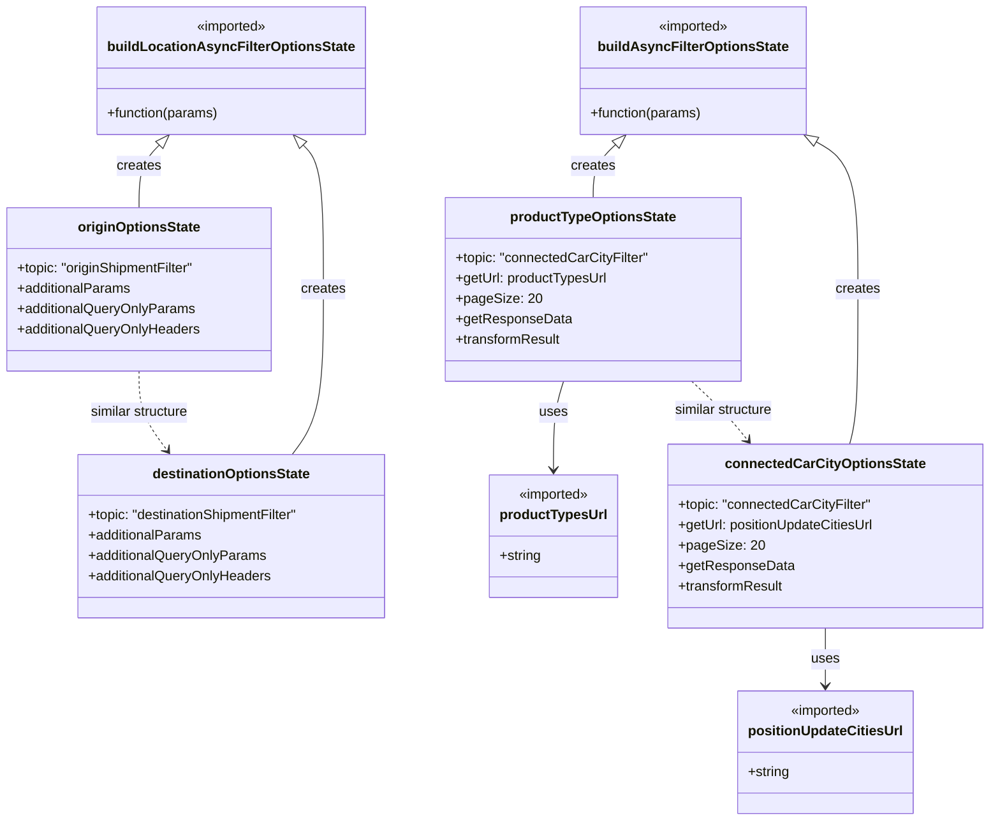

# Diagram: web/portal/src/pages/connectedcar/redux/ConnectedCarFilterLoaders.js

> Auto-generated by Obscura crawlers

## Mermaid

### SVG

<svg id="container" width="1164.396484375" xmlns="http://www.w3.org/2000/svg" class="classDiagram" height="964" viewBox="0 0 1164.396484375 964" role="graphics-document document" aria-roledescription="class"><g><defs><marker id="container_class-aggregationStart" class="marker aggregation class" refX="18" refY="7" markerWidth="190" markerHeight="240" orient="auto"><path d="M 18,7 L9,13 L1,7 L9,1 Z"></path></marker></defs><defs><marker id="container_class-aggregationEnd" class="marker aggregation class" refX="1" refY="7" markerWidth="20" markerHeight="28" orient="auto"><path d="M 18,7 L9,13 L1,7 L9,1 Z"></path></marker></defs><defs><marker id="container_class-extensionStart" class="marker extension class" refX="18" refY="7" markerWidth="190" markerHeight="240" orient="auto"><path d="M 1,7 L18,13 V 1 Z"></path></marker></defs><defs><marker id="container_class-extensionEnd" class="marker extension class" refX="1" refY="7" markerWidth="20" markerHeight="28" orient="auto"><path d="M 1,1 V 13 L18,7 Z"></path></marker></defs><defs><marker id="container_class-compositionStart" class="marker composition class" refX="18" refY="7" markerWidth="190" markerHeight="240" orient="auto"><path d="M 18,7 L9,13 L1,7 L9,1 Z"></path></marker></defs><defs><marker id="container_class-compositionEnd" class="marker composition class" refX="1" refY="7" markerWidth="20" markerHeight="28" orient="auto"><path d="M 18,7 L9,13 L1,7 L9,1 Z"></path></marker></defs><defs><marker id="container_class-dependencyStart" class="marker dependency class" refX="6" refY="7" markerWidth="190" markerHeight="240" orient="auto"><path d="M 5,7 L9,13 L1,7 L9,1 Z"></path></marker></defs><defs><marker id="container_class-dependencyEnd" class="marker dependency class" refX="13" refY="7" markerWidth="20" markerHeight="28" orient="auto"><path d="M 18,7 L9,13 L14,7 L9,1 Z"></path></marker></defs><defs><marker id="container_class-lollipopStart" class="marker lollipop class" refX="13" refY="7" markerWidth="190" markerHeight="240" orient="auto"><circle stroke="black" fill="transparent" cx="7" cy="7" r="6"></circle></marker></defs><defs><marker id="container_class-lollipopEnd" class="marker lollipop class" refX="1" refY="7" markerWidth="190" markerHeight="240" orient="auto"><circle stroke="black" fill="transparent" cx="7" cy="7" r="6"></circle></marker></defs><g class="root"><g class="clusters"></g><g class="edgePaths"><path d="M187.696,170.389L183.722,174.491C179.748,178.593,171.8,186.796,167.826,199.065C163.852,211.333,163.852,227.667,163.852,235.833L163.852,244" id="id_buildLocationAsyncFilterOptionsState_originOptionsState_1" class="edge-thickness-normal edge-pattern-solid relation" style=";;;" data-edge="true" data-et="edge" data-id="id_buildLocationAsyncFilterOptionsState_originOptionsState_1" data-points="W3sieCI6MTk5LjY5OTE4Mzg3Mjc2Nzg2LCJ5IjoxNTh9LHsieCI6MTYzLjg1MTU2MjUsInkiOjE5NX0seyJ4IjoxNjMuODUxNTYyNSwieSI6MjQ0fV0=" marker-start="url(#container_class-extensionStart)"></path><path d="M357.031,170.389L361.005,174.491C364.979,178.593,372.927,186.796,376.901,215.065C380.875,243.333,380.875,291.667,380.875,340C380.875,388.333,380.875,436.667,374.763,469C368.652,501.333,356.429,517.667,350.317,525.833L344.206,534" id="id_buildLocationAsyncFilterOptionsState_destinationOptionsState_2" class="edge-thickness-normal edge-pattern-solid relation" style=";;;" data-edge="true" data-et="edge" data-id="id_buildLocationAsyncFilterOptionsState_destinationOptionsState_2" data-points="W3sieCI6MzQ1LjAyNzM3ODYyNzIzMjEsInkiOjE1OH0seyJ4IjozODAuODc1LCJ5IjoxOTV9LHsieCI6MzgwLjg3NSwieSI6MzQwfSx7IngiOjM4MC44NzUsInkiOjQ4NX0seyJ4IjozNDQuMjA1NTIyNjI5MzEwMzQsInkiOjUzNH1d" marker-start="url(#container_class-extensionStart)"></path><path d="M726.258,169.915L721.88,174.096C717.503,178.276,708.749,186.638,704.371,196.986C699.994,207.333,699.994,219.667,699.994,225.833L699.994,232" id="id_buildAsyncFilterOptionsState_productTypeOptionsState_3" class="edge-thickness-normal edge-pattern-solid relation" style=";;;" data-edge="true" data-et="edge" data-id="id_buildAsyncFilterOptionsState_productTypeOptionsState_3" data-points="W3sieCI6NzM4LjczMTc0MTc2ODk3MzIsInkiOjE1OH0seyJ4Ijo2OTkuOTk0MTQwNjI1LCJ5IjoxOTV9LHsieCI6Njk5Ljk5NDE0MDYyNSwieSI6MjMyfV0=" marker-start="url(#container_class-extensionStart)"></path><path d="M962.041,166.628L970.227,171.356C978.414,176.085,994.788,185.543,1002.975,214.438C1011.162,243.333,1011.162,291.667,1011.162,340C1011.162,388.333,1011.162,436.667,1009.463,467C1007.763,497.333,1004.365,509.667,1002.665,515.833L1000.966,522" id="id_buildAsyncFilterOptionsState_connectedCarCityOptionsState_4" class="edge-thickness-normal edge-pattern-solid relation" style=";;;" data-edge="true" data-et="edge" data-id="id_buildAsyncFilterOptionsState_connectedCarCityOptionsState_4" data-points="W3sieCI6OTQ3LjEwMzE0OTQxNDA2MjUsInkiOjE1OH0seyJ4IjoxMDExLjE2MjEwOTM3NSwieSI6MTk1fSx7IngiOjEwMTEuMTYyMTA5Mzc1LCJ5IjozNDB9LHsieCI6MTAxMS4xNjIxMDkzNzUsInkiOjQ4NX0seyJ4IjoxMDAwLjk2NjE3NzI2MjkzMTEsInkiOjUyMn1d" marker-start="url(#container_class-extensionStart)"></path><path d="M664.091,448L662.041,454.167C659.991,460.333,655.891,472.667,653.841,490C651.791,507.333,651.791,529.667,651.791,540.833L651.791,552" id="id_productTypeOptionsState_productTypesUrl_5" class="edge-thickness-normal edge-pattern-solid relation" style=";;;" data-edge="true" data-et="edge" data-id="id_productTypeOptionsState_productTypesUrl_5" data-points="W3sieCI6NjY0LjA5MTEyMzM4MzYyMDcsInkiOjQ0OH0seyJ4Ijo2NTEuNzkxMDE1NjI1LCJ5Ijo0ODV9LHsieCI6NjUxLjc5MTAxNTYyNSwieSI6NTU4fV0=" marker-end="url(#container_class-dependencyEnd)"></path><path d="M971.205,738L971.205,744.167C971.205,750.333,971.205,762.667,971.205,774C971.205,785.333,971.205,795.667,971.205,800.833L971.205,806" id="id_connectedCarCityOptionsState_positionUpdateCitiesUrl_6" class="edge-thickness-normal edge-pattern-solid relation" style=";;;" data-edge="true" data-et="edge" data-id="id_connectedCarCityOptionsState_positionUpdateCitiesUrl_6" data-points="W3sieCI6OTcxLjIwNTA3ODEyNSwieSI6NzM4fSx7IngiOjk3MS4yMDUwNzgxMjUsInkiOjc3NX0seyJ4Ijo5NzEuMjA1MDc4MTI1LCJ5Ijo4MTJ9XQ==" marker-end="url(#container_class-dependencyEnd)"></path><path d="M163.852,436L163.852,444.167C163.852,452.333,163.852,468.667,169.364,484.199C174.876,499.732,185.901,514.464,191.414,521.83L196.926,529.196" id="id_originOptionsState_destinationOptionsState_7" class="edge-thickness-normal edge-pattern-dashed relation" style=";;;" data-edge="true" data-et="edge" data-id="id_originOptionsState_destinationOptionsState_7" data-points="W3sieCI6MTYzLjg1MTU2MjUsInkiOjQzNn0seyJ4IjoxNjMuODUxNTYyNSwieSI6NDg1fSx7IngiOjIwMC41MjEwMzk4NzA2ODk2NiwieSI6NTM0fV0=" marker-end="url(#container_class-dependencyEnd)"></path><path d="M814.661,448L821.209,454.167C827.756,460.333,840.851,472.667,851.756,484.222C862.662,495.778,871.378,506.556,875.736,511.946L880.094,517.335" id="id_productTypeOptionsState_connectedCarCityOptionsState_8" class="edge-thickness-normal edge-pattern-dashed relation" style=";;;" data-edge="true" data-et="edge" data-id="id_productTypeOptionsState_connectedCarCityOptionsState_8" data-points="W3sieCI6ODE0LjY2MTIyMDM2NjM3OTMsInkiOjQ0OH0seyJ4Ijo4NTMuOTQ1MzEyNSwieSI6NDg1fSx7IngiOjg4My44NjY3Njk5MzUzNDQ4LCJ5Ijo1MjJ9XQ==" marker-end="url(#container_class-dependencyEnd)"></path></g><g class="edgeLabels"><g class="edgeLabel" transform="translate(163.8515625, 195)"><g class="label" data-id="id_buildLocationAsyncFilterOptionsState_originOptionsState_1" transform="translate(-26.171875, -12)"><foreignObject width="52.34375" height="24">

creates

</foreignObject></g></g><g class="edgeLabel" transform="translate(380.875, 340)"><g class="label" data-id="id_buildLocationAsyncFilterOptionsState_destinationOptionsState_2" transform="translate(-26.171875, -12)"><foreignObject width="52.34375" height="24">

creates

</foreignObject></g></g><g class="edgeLabel" transform="translate(699.994140625, 195)"><g class="label" data-id="id_buildAsyncFilterOptionsState_productTypeOptionsState_3" transform="translate(-26.171875, -12)"><foreignObject width="52.34375" height="24">

creates

</foreignObject></g></g><g class="edgeLabel" transform="translate(1011.162109375, 340)"><g class="label" data-id="id_buildAsyncFilterOptionsState_connectedCarCityOptionsState_4" transform="translate(-26.171875, -12)"><foreignObject width="52.34375" height="24">

creates

</foreignObject></g></g><g class="edgeLabel" transform="translate(651.791015625, 485)"><g class="label" data-id="id_productTypeOptionsState_productTypesUrl_5" transform="translate(-16.4921875, -12)"><foreignObject width="32.984375" height="24">

uses

</foreignObject></g></g><g class="edgeLabel" transform="translate(971.205078125, 775)"><g class="label" data-id="id_connectedCarCityOptionsState_positionUpdateCitiesUrl_6" transform="translate(-16.4921875, -12)"><foreignObject width="32.984375" height="24">

uses

</foreignObject></g></g><g class="edgeLabel" transform="translate(163.8515625, 485)"><g class="label" data-id="id_originOptionsState_destinationOptionsState_7" transform="translate(-59.9140625, -12)"><foreignObject width="119.828125" height="24">

similar structure

</foreignObject></g></g><g class="edgeLabel" transform="translate(851.62293, 482.81265)"><g class="label" data-id="id_productTypeOptionsState_connectedCarCityOptionsState_8" transform="translate(-59.9140625, -12)"><foreignObject width="119.828125" height="24">

similar structure

</foreignObject></g></g></g><g class="nodes"><g class="node default" id="classId-buildLocationAsyncFilterOptionsState-0" transform="translate(272.36328125, 83)"><g class="basic label-container"><path d="M-150.09375 -75 L150.09375 -75 L150.09375 75 L-150.09375 75" stroke="none" stroke-width="0" fill="#ECECFF" style=""></path><path d="M-150.09375 -75 C-55.18933570562139 -75, 39.71507858875722 -75, 150.09375 -75 M-150.09375 -75 C-56.915248204933604 -75, 36.26325359013279 -75, 150.09375 -75 M150.09375 -75 C150.09375 -35.50024244802121, 150.09375 3.9995151039575774, 150.09375 75 M150.09375 -75 C150.09375 -19.190287233944282, 150.09375 36.619425532111435, 150.09375 75 M150.09375 75 C70.62819923147384 75, -8.837351537052314 75, -150.09375 75 M150.09375 75 C71.14458527267348 75, -7.804579454653037 75, -150.09375 75 M-150.09375 75 C-150.09375 22.402073032747715, -150.09375 -30.19585393450457, -150.09375 -75 M-150.09375 75 C-150.09375 38.75424727021603, -150.09375 2.5084945404320536, -150.09375 -75" stroke="#9370DB" stroke-width="1.3" fill="none" stroke-dasharray="0 0" style=""></path></g><g class="annotation-group text" transform="translate(-42.671875, -51)"><g class="label" style="" transform="translate(0,-12)"><foreignObject width="85.34375" height="24">

«imported»

</foreignObject></g></g><g class="label-group text" transform="translate(-138.09375, -27)"><g class="label" style="font-weight: bolder" transform="translate(0,-12)"><foreignObject width="276.1875" height="24">

buildLocationAsyncFilterOptionsState

</foreignObject></g></g><g class="members-group text" transform="translate(-138.09375, 21)"></g><g class="methods-group text" transform="translate(-138.09375, 51)"><g class="label" style="" transform="translate(0,-12)"><foreignObject width="132.375" height="24">

+function(params)

</foreignObject></g></g><g class="divider" style=""><path d="M-150.09375 -3 C-33.693052870790126 -3, 82.70764425841975 -3, 150.09375 -3 M-150.09375 -3 C-88.39122437152514 -3, -26.68869874305028 -3, 150.09375 -3" stroke="#9370DB" stroke-width="1.3" fill="none" stroke-dasharray="0 0" style=""></path></g><g class="divider" style=""><path d="M-150.09375 21 C-76.54678510395878 21, -2.9998202079175655 21, 150.09375 21 M-150.09375 21 C-61.329937217227624 21, 27.433875565544753 21, 150.09375 21" stroke="#9370DB" stroke-width="1.3" fill="none" stroke-dasharray="0 0" style=""></path></g></g><g class="node default" id="classId-buildAsyncFilterOptionsState-1" transform="translate(817.25390625, 83)"><g class="basic label-container"><path d="M-131.5625 -75 L131.5625 -75 L131.5625 75 L-131.5625 75" stroke="none" stroke-width="0" fill="#ECECFF" style=""></path><path d="M-131.5625 -75 C-77.72752470191162 -75, -23.892549403823224 -75, 131.5625 -75 M-131.5625 -75 C-47.54554187818306 -75, 36.47141624363388 -75, 131.5625 -75 M131.5625 -75 C131.5625 -42.30066335354998, 131.5625 -9.601326707099958, 131.5625 75 M131.5625 -75 C131.5625 -25.52640462548996, 131.5625 23.94719074902008, 131.5625 75 M131.5625 75 C40.69958738776951 75, -50.163325224460976 75, -131.5625 75 M131.5625 75 C27.422136733365036 75, -76.71822653326993 75, -131.5625 75 M-131.5625 75 C-131.5625 20.891844948681644, -131.5625 -33.21631010263671, -131.5625 -75 M-131.5625 75 C-131.5625 43.50594188049064, -131.5625 12.011883760981277, -131.5625 -75" stroke="#9370DB" stroke-width="1.3" fill="none" stroke-dasharray="0 0" style=""></path></g><g class="annotation-group text" transform="translate(-42.671875, -51)"><g class="label" style="" transform="translate(0,-12)"><foreignObject width="85.34375" height="24">

«imported»

</foreignObject></g></g><g class="label-group text" transform="translate(-106.75, -27)"><g class="label" style="font-weight: bolder" transform="translate(0,-12)"><foreignObject width="213.5" height="24">

buildAsyncFilterOptionsState

</foreignObject></g></g><g class="members-group text" transform="translate(-119.5625, 21)"></g><g class="methods-group text" transform="translate(-119.5625, 51)"><g class="label" style="" transform="translate(0,-12)"><foreignObject width="132.375" height="24">

+function(params)

</foreignObject></g></g><g class="divider" style=""><path d="M-131.5625 -3 C-33.78106832148717 -3, 64.00036335702566 -3, 131.5625 -3 M-131.5625 -3 C-58.30919278506394 -3, 14.944114429872116 -3, 131.5625 -3" stroke="#9370DB" stroke-width="1.3" fill="none" stroke-dasharray="0 0" style=""></path></g><g class="divider" style=""><path d="M-131.5625 21 C-65.00565854258052 21, 1.5511829148389609 21, 131.5625 21 M-131.5625 21 C-28.848956134884816 21, 73.86458773023037 21, 131.5625 21" stroke="#9370DB" stroke-width="1.3" fill="none" stroke-dasharray="0 0" style=""></path></g></g><g class="node default" id="classId-productTypesUrl-2" transform="translate(651.791015625, 630)"><g class="basic label-container"><path d="M-72.7109375 -72 L72.7109375 -72 L72.7109375 72 L-72.7109375 72" stroke="none" stroke-width="0" fill="#ECECFF" style=""></path><path d="M-72.7109375 -72 C-33.19245089171657 -72, 6.326035716566864 -72, 72.7109375 -72 M-72.7109375 -72 C-41.301073337061254 -72, -9.891209174122508 -72, 72.7109375 -72 M72.7109375 -72 C72.7109375 -23.64447523189719, 72.7109375 24.71104953620562, 72.7109375 72 M72.7109375 -72 C72.7109375 -31.712697513316925, 72.7109375 8.57460497336615, 72.7109375 72 M72.7109375 72 C37.70818412717427 72, 2.7054307543485407 72, -72.7109375 72 M72.7109375 72 C35.27500279555539 72, -2.160931908889225 72, -72.7109375 72 M-72.7109375 72 C-72.7109375 40.032135391213764, -72.7109375 8.064270782427528, -72.7109375 -72 M-72.7109375 72 C-72.7109375 40.84916426580084, -72.7109375 9.698328531601675, -72.7109375 -72" stroke="#9370DB" stroke-width="1.3" fill="none" stroke-dasharray="0 0" style=""></path></g><g class="annotation-group text" transform="translate(-42.671875, -48)"><g class="label" style="" transform="translate(0,-12)"><foreignObject width="85.34375" height="24">

«imported»

</foreignObject></g></g><g class="label-group text" transform="translate(-60.7109375, -24)"><g class="label" style="font-weight: bolder" transform="translate(0,-12)"><foreignObject width="121.421875" height="24">

productTypesUrl

</foreignObject></g></g><g class="members-group text" transform="translate(-60.7109375, 24)"><g class="label" style="" transform="translate(0,-12)"><foreignObject width="49.625" height="24">

+string

</foreignObject></g></g><g class="methods-group text" transform="translate(-60.7109375, 72)"></g><g class="divider" style=""><path d="M-72.7109375 0 C-34.5301189795618 0, 3.6506995408764027 0, 72.7109375 0 M-72.7109375 0 C-22.700028459502477 0, 27.310880580995047 0, 72.7109375 0" stroke="#9370DB" stroke-width="1.3" fill="none" stroke-dasharray="0 0" style=""></path></g><g class="divider" style=""><path d="M-72.7109375 48 C-27.23626248017174 48, 18.238412539656522 48, 72.7109375 48 M-72.7109375 48 C-40.692488590679844 48, -8.674039681359687 48, 72.7109375 48" stroke="#9370DB" stroke-width="1.3" fill="none" stroke-dasharray="0 0" style=""></path></g></g><g class="node default" id="classId-positionUpdateCitiesUrl-3" transform="translate(971.205078125, 884)"><g class="basic label-container"><path d="M-100.0078125 -72 L100.0078125 -72 L100.0078125 72 L-100.0078125 72" stroke="none" stroke-width="0" fill="#ECECFF" style=""></path><path d="M-100.0078125 -72 C-32.13418260510278 -72, 35.73944728979444 -72, 100.0078125 -72 M-100.0078125 -72 C-29.969665283965114 -72, 40.06848193206977 -72, 100.0078125 -72 M100.0078125 -72 C100.0078125 -22.313243541932387, 100.0078125 27.373512916135226, 100.0078125 72 M100.0078125 -72 C100.0078125 -17.603170157047266, 100.0078125 36.79365968590547, 100.0078125 72 M100.0078125 72 C50.75604496403712 72, 1.5042774280742464 72, -100.0078125 72 M100.0078125 72 C24.97434656744413 72, -50.05911936511174 72, -100.0078125 72 M-100.0078125 72 C-100.0078125 38.87954629903015, -100.0078125 5.759092598060306, -100.0078125 -72 M-100.0078125 72 C-100.0078125 22.482038693490153, -100.0078125 -27.035922613019693, -100.0078125 -72" stroke="#9370DB" stroke-width="1.3" fill="none" stroke-dasharray="0 0" style=""></path></g><g class="annotation-group text" transform="translate(-42.671875, -48)"><g class="label" style="" transform="translate(0,-12)"><foreignObject width="85.34375" height="24">

«imported»

</foreignObject></g></g><g class="label-group text" transform="translate(-88.0078125, -24)"><g class="label" style="font-weight: bolder" transform="translate(0,-12)"><foreignObject width="176.015625" height="24">

positionUpdateCitiesUrl

</foreignObject></g></g><g class="members-group text" transform="translate(-88.0078125, 24)"><g class="label" style="" transform="translate(0,-12)"><foreignObject width="49.625" height="24">

+string

</foreignObject></g></g><g class="methods-group text" transform="translate(-88.0078125, 72)"></g><g class="divider" style=""><path d="M-100.0078125 0 C-20.387456532623872 0, 59.232899434752255 0, 100.0078125 0 M-100.0078125 0 C-59.50587202394169 0, -19.003931547883383 0, 100.0078125 0" stroke="#9370DB" stroke-width="1.3" fill="none" stroke-dasharray="0 0" style=""></path></g><g class="divider" style=""><path d="M-100.0078125 48 C-49.00596550670349 48, 1.9958814865930208 48, 100.0078125 48 M-100.0078125 48 C-51.40728346504558 48, -2.8067544300911607 48, 100.0078125 48" stroke="#9370DB" stroke-width="1.3" fill="none" stroke-dasharray="0 0" style=""></path></g></g><g class="node default" id="classId-originOptionsState-4" transform="translate(163.8515625, 340)"><g class="basic label-container"><path d="M-155.8515625 -96 L155.8515625 -96 L155.8515625 96 L-155.8515625 96" stroke="none" stroke-width="0" fill="#ECECFF" style=""></path><path d="M-155.8515625 -96 C-64.02310731679457 -96, 27.80534786641087 -96, 155.8515625 -96 M-155.8515625 -96 C-93.30273686317067 -96, -30.75391122634133 -96, 155.8515625 -96 M155.8515625 -96 C155.8515625 -25.881589135387173, 155.8515625 44.23682172922565, 155.8515625 96 M155.8515625 -96 C155.8515625 -33.29252449013499, 155.8515625 29.414951019730026, 155.8515625 96 M155.8515625 96 C74.92290599099103 96, -6.005750518017948 96, -155.8515625 96 M155.8515625 96 C31.52048661484538 96, -92.81058927030924 96, -155.8515625 96 M-155.8515625 96 C-155.8515625 22.10344976345361, -155.8515625 -51.79310047309278, -155.8515625 -96 M-155.8515625 96 C-155.8515625 36.98387655070044, -155.8515625 -22.032246898599126, -155.8515625 -96" stroke="#9370DB" stroke-width="1.3" fill="none" stroke-dasharray="0 0" style=""></path></g><g class="annotation-group text" transform="translate(0, -72)"></g><g class="label-group text" transform="translate(-69.53125, -72)"><g class="label" style="font-weight: bolder" transform="translate(0,-12)"><foreignObject width="139.0625" height="24">

originOptionsState

</foreignObject></g></g><g class="members-group text" transform="translate(-143.8515625, -24)"><g class="label" style="" transform="translate(0,-12)"><foreignObject width="214.140625" height="24">

+topic: "originShipmentFilter"

</foreignObject></g><g class="label" style="" transform="translate(0,12)"><foreignObject width="134.96875" height="24">

+additionalParams

</foreignObject></g><g class="label" style="" transform="translate(0,36)"><foreignObject width="210.953125" height="24">

+additionalQueryOnlyParams

</foreignObject></g><g class="label" style="" transform="translate(0,60)"><foreignObject width="218.171875" height="24">

+additionalQueryOnlyHeaders

</foreignObject></g></g><g class="methods-group text" transform="translate(-143.8515625, 96)"></g><g class="divider" style=""><path d="M-155.8515625 -48 C-42.713419194650214 -48, 70.42472411069957 -48, 155.8515625 -48 M-155.8515625 -48 C-44.91322625543572 -48, 66.02510998912857 -48, 155.8515625 -48" stroke="#9370DB" stroke-width="1.3" fill="none" stroke-dasharray="0 0" style=""></path></g><g class="divider" style=""><path d="M-155.8515625 72 C-81.6116862866329 72, -7.371810073265806 72, 155.8515625 72 M-155.8515625 72 C-38.256732674960745 72, 79.33809715007851 72, 155.8515625 72" stroke="#9370DB" stroke-width="1.3" fill="none" stroke-dasharray="0 0" style=""></path></g></g><g class="node default" id="classId-destinationOptionsState-5" transform="translate(272.36328125, 630)"><g class="basic label-container"><path d="M-184.6015625 -96 L184.6015625 -96 L184.6015625 96 L-184.6015625 96" stroke="none" stroke-width="0" fill="#ECECFF" style=""></path><path d="M-184.6015625 -96 C-50.374419938379106 -96, 83.85272262324179 -96, 184.6015625 -96 M-184.6015625 -96 C-56.22200978931076 -96, 72.15754292137848 -96, 184.6015625 -96 M184.6015625 -96 C184.6015625 -48.204851721319784, 184.6015625 -0.40970344263956804, 184.6015625 96 M184.6015625 -96 C184.6015625 -46.62349273583495, 184.6015625 2.753014528330098, 184.6015625 96 M184.6015625 96 C88.55983577357128 96, -7.481890952857441 96, -184.6015625 96 M184.6015625 96 C103.58709734673697 96, 22.572632193473936 96, -184.6015625 96 M-184.6015625 96 C-184.6015625 38.753308545445755, -184.6015625 -18.49338290910849, -184.6015625 -96 M-184.6015625 96 C-184.6015625 42.61017820613942, -184.6015625 -10.779643587721154, -184.6015625 -96" stroke="#9370DB" stroke-width="1.3" fill="none" stroke-dasharray="0 0" style=""></path></g><g class="annotation-group text" transform="translate(0, -72)"></g><g class="label-group text" transform="translate(-90.171875, -72)"><g class="label" style="font-weight: bolder" transform="translate(0,-12)"><foreignObject width="180.34375" height="24">

destinationOptionsState

</foreignObject></g></g><g class="members-group text" transform="translate(-172.6015625, -24)"><g class="label" style="" transform="translate(0,-12)"><foreignObject width="255.03125" height="24">

+topic: "destinationShipmentFilter"

</foreignObject></g><g class="label" style="" transform="translate(0,12)"><foreignObject width="134.96875" height="24">

+additionalParams

</foreignObject></g><g class="label" style="" transform="translate(0,36)"><foreignObject width="210.953125" height="24">

+additionalQueryOnlyParams

</foreignObject></g><g class="label" style="" transform="translate(0,60)"><foreignObject width="218.171875" height="24">

+additionalQueryOnlyHeaders

</foreignObject></g></g><g class="methods-group text" transform="translate(-172.6015625, 96)"></g><g class="divider" style=""><path d="M-184.6015625 -48 C-52.06224707461061 -48, 80.47706835077878 -48, 184.6015625 -48 M-184.6015625 -48 C-51.64426657476986 -48, 81.31302935046028 -48, 184.6015625 -48" stroke="#9370DB" stroke-width="1.3" fill="none" stroke-dasharray="0 0" style=""></path></g><g class="divider" style=""><path d="M-184.6015625 72 C-68.01226856664664 72, 48.57702536670672 72, 184.6015625 72 M-184.6015625 72 C-104.69400844239392 72, -24.786454384787845 72, 184.6015625 72" stroke="#9370DB" stroke-width="1.3" fill="none" stroke-dasharray="0 0" style=""></path></g></g><g class="node default" id="classId-productTypeOptionsState-6" transform="translate(699.994140625, 340)"><g class="basic label-container"><path d="M-173.34765625 -108 L173.34765625 -108 L173.34765625 108 L-173.34765625 108" stroke="none" stroke-width="0" fill="#ECECFF" style=""></path><path d="M-173.34765625 -108 C-64.81351682144569 -108, 43.72062260710862 -108, 173.34765625 -108 M-173.34765625 -108 C-85.7680493929706 -108, 1.811557464058808 -108, 173.34765625 -108 M173.34765625 -108 C173.34765625 -22.446906558753994, 173.34765625 63.10618688249201, 173.34765625 108 M173.34765625 -108 C173.34765625 -27.92339756880915, 173.34765625 52.1532048623817, 173.34765625 108 M173.34765625 108 C78.35674908974408 108, -16.63415807051183 108, -173.34765625 108 M173.34765625 108 C77.17898938577191 108, -18.989677478456173 108, -173.34765625 108 M-173.34765625 108 C-173.34765625 31.83763574035973, -173.34765625 -44.32472851928054, -173.34765625 -108 M-173.34765625 108 C-173.34765625 53.28385957236245, -173.34765625 -1.4322808552750956, -173.34765625 -108" stroke="#9370DB" stroke-width="1.3" fill="none" stroke-dasharray="0 0" style=""></path></g><g class="annotation-group text" transform="translate(0, -84)"></g><g class="label-group text" transform="translate(-94.1640625, -84)"><g class="label" style="font-weight: bolder" transform="translate(0,-12)"><foreignObject width="188.328125" height="24">

productTypeOptionsState

</foreignObject></g></g><g class="members-group text" transform="translate(-161.34765625, -36)"><g class="label" style="" transform="translate(0,-12)"><foreignObject width="228.53125" height="24">

+topic: "connectedCarCityFilter"

</foreignObject></g><g class="label" style="" transform="translate(0,12)"><foreignObject width="179.75" height="24">

+getUrl: productTypesUrl

</foreignObject></g><g class="label" style="" transform="translate(0,36)"><foreignObject width="96.421875" height="24">

+pageSize: 20

</foreignObject></g><g class="label" style="" transform="translate(0,60)"><foreignObject width="133.8125" height="24">

+getResponseData

</foreignObject></g><g class="label" style="" transform="translate(0,84)"><foreignObject width="124.703125" height="24">

+transformResult

</foreignObject></g></g><g class="methods-group text" transform="translate(-161.34765625, 108)"></g><g class="divider" style=""><path d="M-173.34765625 -60 C-86.88624362585792 -60, -0.4248310017158303 -60, 173.34765625 -60 M-173.34765625 -60 C-92.7642815432058 -60, -12.180906836411594 -60, 173.34765625 -60" stroke="#9370DB" stroke-width="1.3" fill="none" stroke-dasharray="0 0" style=""></path></g><g class="divider" style=""><path d="M-173.34765625 84 C-86.19754370894776 84, 0.9525688321044754 84, 173.34765625 84 M-173.34765625 84 C-83.80926609279786 84, 5.729124064404289 84, 173.34765625 84" stroke="#9370DB" stroke-width="1.3" fill="none" stroke-dasharray="0 0" style=""></path></g></g><g class="node default" id="classId-connectedCarCityOptionsState-7" transform="translate(971.205078125, 630)"><g class="basic label-container"><path d="M-185.19140625 -108 L185.19140625 -108 L185.19140625 108 L-185.19140625 108" stroke="none" stroke-width="0" fill="#ECECFF" style=""></path><path d="M-185.19140625 -108 C-45.08173785351798 -108, 95.02793054296404 -108, 185.19140625 -108 M-185.19140625 -108 C-66.38950446391613 -108, 52.41239732216775 -108, 185.19140625 -108 M185.19140625 -108 C185.19140625 -42.83122250912284, 185.19140625 22.337554981754323, 185.19140625 108 M185.19140625 -108 C185.19140625 -55.27036715052154, 185.19140625 -2.5407343010430736, 185.19140625 108 M185.19140625 108 C90.77240843627565 108, -3.6465893774486915 108, -185.19140625 108 M185.19140625 108 C94.12968582639462 108, 3.067965402789241 108, -185.19140625 108 M-185.19140625 108 C-185.19140625 45.62929013779835, -185.19140625 -16.7414197244033, -185.19140625 -108 M-185.19140625 108 C-185.19140625 43.23107102672088, -185.19140625 -21.537857946558233, -185.19140625 -108" stroke="#9370DB" stroke-width="1.3" fill="none" stroke-dasharray="0 0" style=""></path></g><g class="annotation-group text" transform="translate(0, -84)"></g><g class="label-group text" transform="translate(-112.2578125, -84)"><g class="label" style="font-weight: bolder" transform="translate(0,-12)"><foreignObject width="224.515625" height="24">

connectedCarCityOptionsState

</foreignObject></g></g><g class="members-group text" transform="translate(-173.19140625, -36)"><g class="label" style="" transform="translate(0,-12)"><foreignObject width="228.53125" height="24">

+topic: "connectedCarCityFilter"

</foreignObject></g><g class="label" style="" transform="translate(0,12)"><foreignObject width="234.125" height="24">

+getUrl: positionUpdateCitiesUrl

</foreignObject></g><g class="label" style="" transform="translate(0,36)"><foreignObject width="96.421875" height="24">

+pageSize: 20

</foreignObject></g><g class="label" style="" transform="translate(0,60)"><foreignObject width="133.8125" height="24">

+getResponseData

</foreignObject></g><g class="label" style="" transform="translate(0,84)"><foreignObject width="124.703125" height="24">

+transformResult

</foreignObject></g></g><g class="methods-group text" transform="translate(-173.19140625, 108)"></g><g class="divider" style=""><path d="M-185.19140625 -60 C-94.14188934462521 -60, -3.0923724392504255 -60, 185.19140625 -60 M-185.19140625 -60 C-57.28933971125733 -60, 70.61272682748535 -60, 185.19140625 -60" stroke="#9370DB" stroke-width="1.3" fill="none" stroke-dasharray="0 0" style=""></path></g><g class="divider" style=""><path d="M-185.19140625 84 C-75.57786882702418 84, 34.03566859595165 84, 185.19140625 84 M-185.19140625 84 C-60.210638793710885 84, 64.77012866257823 84, 185.19140625 84" stroke="#9370DB" stroke-width="1.3" fill="none" stroke-dasharray="0 0" style=""></path></g></g></g></g></g></svg>
