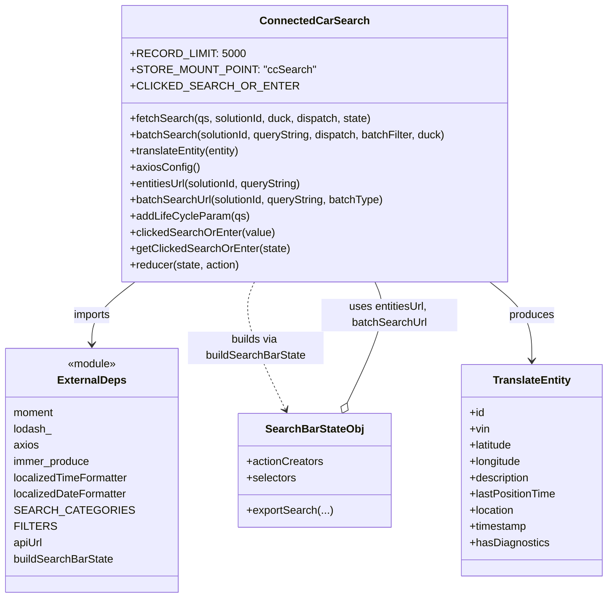

# Diagram: web/portal/src/pages/connectedcar/redux/ConnectedCarSearchBarState.js


> Auto-generated by Obscura crawlers

## Diagram 1



### SVG

<svg id="container" width="884.8671875" xmlns="http://www.w3.org/2000/svg" class="classDiagram" height="882" viewBox="0 0 884.8671875 882" role="graphics-document document" aria-roledescription="class"><style>#container{font-family:"trebuchet ms",verdana,arial,sans-serif;font-size:16px;fill:#333;}@keyframes edge-animation-frame{from{stroke-dashoffset:0;}}@keyframes dash{to{stroke-dashoffset:0;}}#container .edge-animation-slow{stroke-dasharray:9,5!important;stroke-dashoffset:900;animation:dash 50s linear infinite;stroke-linecap:round;}#container .edge-animation-fast{stroke-dasharray:9,5!important;stroke-dashoffset:900;animation:dash 20s linear infinite;stroke-linecap:round;}#container .error-icon{fill:#552222;}#container .error-text{fill:#552222;stroke:#552222;}#container .edge-thickness-normal{stroke-width:1px;}#container .edge-thickness-thick{stroke-width:3.5px;}#container .edge-pattern-solid{stroke-dasharray:0;}#container .edge-thickness-invisible{stroke-width:0;fill:none;}#container .edge-pattern-dashed{stroke-dasharray:3;}#container .edge-pattern-dotted{stroke-dasharray:2;}#container .marker{fill:#333333;stroke:#333333;}#container .marker.cross{stroke:#333333;}#container svg{font-family:"trebuchet ms",verdana,arial,sans-serif;font-size:16px;}#container p{margin:0;}#container g.classGroup text{fill:#9370DB;stroke:none;font-family:"trebuchet ms",verdana,arial,sans-serif;font-size:10px;}#container g.classGroup text .title{font-weight:bolder;}#container .nodeLabel,#container .edgeLabel{color:#131300;}#container .edgeLabel .label rect{fill:#ECECFF;}#container .label text{fill:#131300;}#container .labelBkg{background:#ECECFF;}#container .edgeLabel .label span{background:#ECECFF;}#container .classTitle{font-weight:bolder;}#container .node rect,#container .node circle,#container .node ellipse,#container .node polygon,#container .node path{fill:#ECECFF;stroke:#9370DB;stroke-width:1px;}#container .divider{stroke:#9370DB;stroke-width:1;}#container g.clickable{cursor:pointer;}#container g.classGroup rect{fill:#ECECFF;stroke:#9370DB;}#container g.classGroup line{stroke:#9370DB;stroke-width:1;}#container .classLabel .box{stroke:none;stroke-width:0;fill:#ECECFF;opacity:0.5;}#container .classLabel .label{fill:#9370DB;font-size:10px;}#container .relation{stroke:#333333;stroke-width:1;fill:none;}#container .dashed-line{stroke-dasharray:3;}#container .dotted-line{stroke-dasharray:1 2;}#container #compositionStart,#container .composition{fill:#333333!important;stroke:#333333!important;stroke-width:1;}#container #compositionEnd,#container .composition{fill:#333333!important;stroke:#333333!important;stroke-width:1;}#container #dependencyStart,#container .dependency{fill:#333333!important;stroke:#333333!important;stroke-width:1;}#container #dependencyStart,#container .dependency{fill:#333333!important;stroke:#333333!important;stroke-width:1;}#container #extensionStart,#container .extension{fill:transparent!important;stroke:#333333!important;stroke-width:1;}#container #extensionEnd,#container .extension{fill:transparent!important;stroke:#333333!important;stroke-width:1;}#container #aggregationStart,#container .aggregation{fill:transparent!important;stroke:#333333!important;stroke-width:1;}#container #aggregationEnd,#container .aggregation{fill:transparent!important;stroke:#333333!important;stroke-width:1;}#container #lollipopStart,#container .lollipop{fill:#ECECFF!important;stroke:#333333!important;stroke-width:1;}#container #lollipopEnd,#container .lollipop{fill:#ECECFF!important;stroke:#333333!important;stroke-width:1;}#container .edgeTerminals{font-size:11px;line-height:initial;}#container .classTitleText{text-anchor:middle;font-size:18px;fill:#333;}#container .label-icon{display:inline-block;height:1em;overflow:visible;vertical-align:-0.125em;}#container .node .label-icon path{fill:currentColor;stroke:revert;stroke-width:revert;}#container :root{--mermaid-font-family:"trebuchet ms",verdana,arial,sans-serif;}</style><g><defs><marker id="container_class-aggregationStart" class="marker aggregation class" refX="18" refY="7" markerWidth="190" markerHeight="240" orient="auto"><path d="M 18,7 L9,13 L1,7 L9,1 Z"></path></marker></defs><defs><marker id="container_class-aggregationEnd" class="marker aggregation class" refX="1" refY="7" markerWidth="20" markerHeight="28" orient="auto"><path d="M 18,7 L9,13 L1,7 L9,1 Z"></path></marker></defs><defs><marker id="container_class-extensionStart" class="marker extension class" refX="18" refY="7" markerWidth="190" markerHeight="240" orient="auto"><path d="M 1,7 L18,13 V 1 Z"></path></marker></defs><defs><marker id="container_class-extensionEnd" class="marker extension class" refX="1" refY="7" markerWidth="20" markerHeight="28" orient="auto"><path d="M 1,1 V 13 L18,7 Z"></path></marker></defs><defs><marker id="container_class-compositionStart" class="marker composition class" refX="18" refY="7" markerWidth="190" markerHeight="240" orient="auto"><path d="M 18,7 L9,13 L1,7 L9,1 Z"></path></marker></defs><defs><marker id="container_class-compositionEnd" class="marker composition class" refX="1" refY="7" markerWidth="20" markerHeight="28" orient="auto"><path d="M 18,7 L9,13 L1,7 L9,1 Z"></path></marker></defs><defs><marker id="container_class-dependencyStart" class="marker dependency class" refX="6" refY="7" markerWidth="190" markerHeight="240" orient="auto"><path d="M 5,7 L9,13 L1,7 L9,1 Z"></path></marker></defs><defs><marker id="container_class-dependencyEnd" class="marker dependency class" refX="13" refY="7" markerWidth="20" markerHeight="28" orient="auto"><path d="M 18,7 L9,13 L14,7 L9,1 Z"></path></marker></defs><defs><marker id="container_class-lollipopStart" class="marker lollipop class" refX="13" refY="7" markerWidth="190" markerHeight="240" orient="auto"><circle stroke="black" fill="transparent" cx="7" cy="7" r="6"></circle></marker></defs><defs><marker id="container_class-lollipopEnd" class="marker lollipop class" refX="1" refY="7" markerWidth="190" markerHeight="240" orient="auto"><circle stroke="black" fill="transparent" cx="7" cy="7" r="6"></circle></marker></defs><g class="root"><g class="clusters"></g><g class="edgePaths"><path d="M192.612,416L182.131,424.167C171.65,432.333,150.688,448.667,140.208,464C129.727,479.333,129.727,493.667,129.727,500.833L129.727,508" id="id_ConnectedCarSearch_ExternalDeps_1" class="edge-thickness-normal edge-pattern-solid relation" style=";;;" data-edge="true" data-et="edge" data-id="id_ConnectedCarSearch_ExternalDeps_1" data-points="W3sieCI6MTkyLjYxMjIxNTkwOTA5MDkzLCJ5Ijo0MTZ9LHsieCI6MTI5LjcyNjU2MjUsInkiOjQ2NX0seyJ4IjoxMjkuNzI2NTYyNSwieSI6NTE0fV0=" marker-end="url(#container_class-dependencyEnd)"></path><path d="M365.726,416L362.175,424.167C358.625,432.333,351.523,448.667,359.148,480.099C366.773,511.531,389.124,558.061,400.299,581.326L411.475,604.592" id="id_ConnectedCarSearch_SearchBarStateObj_2" class="edge-thickness-normal edge-pattern-dashed relation" style=";;;" data-edge="true" data-et="edge" data-id="id_ConnectedCarSearch_SearchBarStateObj_2" data-points="W3sieCI6MzY1LjcyNjIyMjgyNjA4Njk0LCJ5Ijo0MTZ9LHsieCI6MzQ0LjQyMTg3NSwieSI6NDY1fSx7IngiOjQxNC4wNzI1MzAwMjE4MzQwNCwieSI6NjEwfV0=" marker-end="url(#container_class-dependencyEnd)"></path><path d="M502.24,594.451L512.604,572.876C522.967,551.301,543.695,508.15,550.508,478.408C557.32,448.667,550.219,432.333,546.668,424.167L543.118,416" id="id_SearchBarStateObj_ConnectedCarSearch_3" class="edge-thickness-normal edge-pattern-solid relation" style=";;;" data-edge="true" data-et="edge" data-id="id_SearchBarStateObj_ConnectedCarSearch_3" data-points="W3sieCI6NDk0Ljc3MTIxOTk3ODE2NTk2LCJ5Ijo2MTB9LHsieCI6NTY0LjQyMTg3NSwieSI6NDY1fSx7IngiOjU0My4xMTc1MjcxNzM5MTMsInkiOjQxNn1d" marker-start="url(#container_class-aggregationStart)"></path><path d="M711.192,416L721.471,424.167C731.75,432.333,752.309,448.667,762.588,468C772.867,487.333,772.867,509.667,772.867,520.833L772.867,532" id="id_ConnectedCarSearch_TranslateEntity_4" class="edge-thickness-normal edge-pattern-solid relation" style=";;;" data-edge="true" data-et="edge" data-id="id_ConnectedCarSearch_TranslateEntity_4" data-points="W3sieCI6NzExLjE5MjAwODM5OTIwOTUsInkiOjQxNn0seyJ4Ijo3NzIuODY3MTg3NSwieSI6NDY1fSx7IngiOjc3Mi44NjcxODc1LCJ5Ijo1Mzh9XQ==" marker-end="url(#container_class-dependencyEnd)"></path></g><g class="edgeLabels"><g class="edgeLabel" transform="translate(129.7265625, 465)"><g class="label" data-id="id_ConnectedCarSearch_ExternalDeps_1" transform="translate(-28.25, -12)"><foreignObject width="56.5" height="24"><div xmlns="http://www.w3.org/1999/xhtml" class="labelBkg" style="display: table-cell; white-space: nowrap; line-height: 1.5; max-width: 200px; text-align: center;"><span class="edgeLabel"><p>imports</p></span></div></foreignObject></g></g><g class="edgeLabel" transform="translate(367.67973, 513.41863)"><g class="label" data-id="id_ConnectedCarSearch_SearchBarStateObj_2" transform="translate(-100, -24)"><foreignObject width="200" height="48"><div xmlns="http://www.w3.org/1999/xhtml" class="labelBkg" style="display: table; white-space: break-spaces; line-height: 1.5; max-width: 200px; text-align: center; width: 200px;"><span class="edgeLabel"><p>builds via buildSearchBarState</p></span></div></foreignObject></g></g><g class="edgeLabel" transform="translate(541.16402, 513.41863)"><g class="label" data-id="id_SearchBarStateObj_ConnectedCarSearch_3" transform="translate(-100, -24)"><foreignObject width="200" height="48"><div xmlns="http://www.w3.org/1999/xhtml" class="labelBkg" style="display: table; white-space: break-spaces; line-height: 1.5; max-width: 200px; text-align: center; width: 200px;"><span class="edgeLabel"><p>uses entitiesUrl, batchSearchUrl</p></span></div></foreignObject></g></g><g class="edgeLabel" transform="translate(772.8671875, 465)"><g class="label" data-id="id_ConnectedCarSearch_TranslateEntity_4" transform="translate(-33.4765625, -12)"><foreignObject width="66.953125" height="24"><div xmlns="http://www.w3.org/1999/xhtml" class="labelBkg" style="display: table-cell; white-space: nowrap; line-height: 1.5; max-width: 200px; text-align: center;"><span class="edgeLabel"><p>produces</p></span></div></foreignObject></g></g></g><g class="nodes"><g class="node default" id="classId-ConnectedCarSearch-0" transform="translate(454.421875, 212)"><g class="basic label-container"><path d="M-285.671875 -204 L285.671875 -204 L285.671875 204 L-285.671875 204" stroke="none" stroke-width="0" fill="#ECECFF" style=""></path><path d="M-285.671875 -204 C-117.86654140182503 -204, 49.93879219634994 -204, 285.671875 -204 M-285.671875 -204 C-154.40997638705068 -204, -23.148077774101353 -204, 285.671875 -204 M285.671875 -204 C285.671875 -111.74271748140838, 285.671875 -19.485434962816754, 285.671875 204 M285.671875 -204 C285.671875 -93.9333172100977, 285.671875 16.133365579804604, 285.671875 204 M285.671875 204 C156.8784860695968 204, 28.08509713919358 204, -285.671875 204 M285.671875 204 C166.7786610267191 204, 47.88544705343821 204, -285.671875 204 M-285.671875 204 C-285.671875 43.26525355180587, -285.671875 -117.46949289638826, -285.671875 -204 M-285.671875 204 C-285.671875 42.48352289457006, -285.671875 -119.03295421085988, -285.671875 -204" stroke="#9370DB" stroke-width="1.3" fill="none" stroke-dasharray="0 0" style=""></path></g><g class="annotation-group text" transform="translate(0, -180)"></g><g class="label-group text" transform="translate(-75.578125, -180)"><g class="label" style="font-weight: bolder" transform="translate(0,-12)"><foreignObject width="151.15625" height="24"><div xmlns="http://www.w3.org/1999/xhtml" style="display: table-cell; white-space: nowrap; line-height: 1.5; max-width: 199px; text-align: center;"><span class="nodeLabel markdown-node-label" style=""><p>ConnectedCarSearch</p></span></div></foreignObject></g></g><g class="members-group text" transform="translate(-273.671875, -132)"><g class="label" style="" transform="translate(0,-12)"><foreignObject width="153.78125" height="24"><div xmlns="http://www.w3.org/1999/xhtml" style="display: table-cell; white-space: nowrap; line-height: 1.5; max-width: 211px; text-align: center;"><span class="nodeLabel markdown-node-label" style=""><p>+RECORD_LIMIT: 5000</p></span></div></foreignObject></g><g class="label" style="" transform="translate(0,12)"><foreignObject width="249.59375" height="24"><div xmlns="http://www.w3.org/1999/xhtml" style="display: table-cell; white-space: nowrap; line-height: 1.5; max-width: 307px; text-align: center;"><span class="nodeLabel markdown-node-label" style=""><p>+STORE_MOUNT_POINT: "ccSearch"</p></span></div></foreignObject></g><g class="label" style="" transform="translate(0,36)"><foreignObject width="212.828125" height="24"><div xmlns="http://www.w3.org/1999/xhtml" style="display: table-cell; white-space: nowrap; line-height: 1.5; max-width: 270px; text-align: center;"><span class="nodeLabel markdown-node-label" style=""><p>+CLICKED_SEARCH_OR_ENTER</p></span></div></foreignObject></g></g><g class="methods-group text" transform="translate(-273.671875, -36)"><g class="label" style="" transform="translate(0,-12)"><foreignObject width="359.8125" height="24"><div xmlns="http://www.w3.org/1999/xhtml" style="display: table-cell; white-space: nowrap; line-height: 1.5; max-width: 417px; text-align: center;"><span class="nodeLabel markdown-node-label" style=""><p>+fetchSearch(qs, solutionId, duck, dispatch, state)</p></span></div></foreignObject></g><g class="label" style="" transform="translate(0,12)"><foreignObject width="471.765625" height="24"><div xmlns="http://www.w3.org/1999/xhtml" style="display: table-cell; white-space: nowrap; line-height: 1.5; max-width: 529px; text-align: center;"><span class="nodeLabel markdown-node-label" style=""><p>+batchSearch(solutionId, queryString, dispatch, batchFilter, duck)</p></span></div></foreignObject></g><g class="label" style="" transform="translate(0,36)"><foreignObject width="166.375" height="24"><div xmlns="http://www.w3.org/1999/xhtml" style="display: table-cell; white-space: nowrap; line-height: 1.5; max-width: 224px; text-align: center;"><span class="nodeLabel markdown-node-label" style=""><p>+translateEntity(entity)</p></span></div></foreignObject></g><g class="label" style="" transform="translate(0,60)"><foreignObject width="100.796875" height="24"><div xmlns="http://www.w3.org/1999/xhtml" style="display: table-cell; white-space: nowrap; line-height: 1.5; max-width: 158px; text-align: center;"><span class="nodeLabel markdown-node-label" style=""><p>+axiosConfig()</p></span></div></foreignObject></g><g class="label" style="" transform="translate(0,84)"><foreignObject width="261.40625" height="24"><div xmlns="http://www.w3.org/1999/xhtml" style="display: table-cell; white-space: nowrap; line-height: 1.5; max-width: 319px; text-align: center;"><span class="nodeLabel markdown-node-label" style=""><p>+entitiesUrl(solutionId, queryString)</p></span></div></foreignObject></g><g class="label" style="" transform="translate(0,108)"><foreignObject width="378.265625" height="24"><div xmlns="http://www.w3.org/1999/xhtml" style="display: table-cell; white-space: nowrap; line-height: 1.5; max-width: 436px; text-align: center;"><span class="nodeLabel markdown-node-label" style=""><p>+batchSearchUrl(solutionId, queryString, batchType)</p></span></div></foreignObject></g><g class="label" style="" transform="translate(0,132)"><foreignObject width="171.5" height="24"><div xmlns="http://www.w3.org/1999/xhtml" style="display: table-cell; white-space: nowrap; line-height: 1.5; max-width: 229px; text-align: center;"><span class="nodeLabel markdown-node-label" style=""><p>+addLifeCycleParam(qs)</p></span></div></foreignObject></g><g class="label" style="" transform="translate(0,156)"><foreignObject width="212.234375" height="24"><div xmlns="http://www.w3.org/1999/xhtml" style="display: table-cell; white-space: nowrap; line-height: 1.5; max-width: 270px; text-align: center;"><span class="nodeLabel markdown-node-label" style=""><p>+clickedSearchOrEnter(value)</p></span></div></foreignObject></g><g class="label" style="" transform="translate(0,180)"><foreignObject width="233.15625" height="24"><div xmlns="http://www.w3.org/1999/xhtml" style="display: table-cell; white-space: nowrap; line-height: 1.5; max-width: 291px; text-align: center;"><span class="nodeLabel markdown-node-label" style=""><p>+getClickedSearchOrEnter(state)</p></span></div></foreignObject></g><g class="label" style="" transform="translate(0,204)"><foreignObject width="163.25" height="24"><div xmlns="http://www.w3.org/1999/xhtml" style="display: table-cell; white-space: nowrap; line-height: 1.5; max-width: 221px; text-align: center;"><span class="nodeLabel markdown-node-label" style=""><p>+reducer(state, action)</p></span></div></foreignObject></g></g><g class="divider" style=""><path d="M-285.671875 -156 C-87.99273621458863 -156, 109.68640257082274 -156, 285.671875 -156 M-285.671875 -156 C-126.87940811617966 -156, 31.913058767640678 -156, 285.671875 -156" stroke="#9370DB" stroke-width="1.3" fill="none" stroke-dasharray="0 0" style=""></path></g><g class="divider" style=""><path d="M-285.671875 -60 C-107.05125226915294 -60, 71.56937046169412 -60, 285.671875 -60 M-285.671875 -60 C-88.34311953235556 -60, 108.98563593528888 -60, 285.671875 -60" stroke="#9370DB" stroke-width="1.3" fill="none" stroke-dasharray="0 0" style=""></path></g></g><g class="node default" id="classId-ExternalDeps-1" transform="translate(129.7265625, 694)"><g class="basic label-container"><path d="M-121.7265625 -180 L121.7265625 -180 L121.7265625 180 L-121.7265625 180" stroke="none" stroke-width="0" fill="#ECECFF" style=""></path><path d="M-121.7265625 -180 C-31.10287770864649 -180, 59.52080708270702 -180, 121.7265625 -180 M-121.7265625 -180 C-52.718157857579754 -180, 16.29024678484049 -180, 121.7265625 -180 M121.7265625 -180 C121.7265625 -103.68594168843187, 121.7265625 -27.371883376863735, 121.7265625 180 M121.7265625 -180 C121.7265625 -75.14747348733401, 121.7265625 29.705053025331978, 121.7265625 180 M121.7265625 180 C30.98008931197998 180, -59.76638387604004 180, -121.7265625 180 M121.7265625 180 C49.75304402179772 180, -22.22047445640456 180, -121.7265625 180 M-121.7265625 180 C-121.7265625 76.70779319563015, -121.7265625 -26.58441360873971, -121.7265625 -180 M-121.7265625 180 C-121.7265625 67.3452872608514, -121.7265625 -45.309425478297186, -121.7265625 -180" stroke="#9370DB" stroke-width="1.3" fill="none" stroke-dasharray="0 0" style=""></path></g><g class="annotation-group text" transform="translate(-36.6015625, -156)"><g class="label" style="" transform="translate(0,-12)"><foreignObject width="73.203125" height="24"><div xmlns="http://www.w3.org/1999/xhtml" style="display: table-cell; white-space: nowrap; line-height: 1.5; max-width: 123px; text-align: center;"><span class="nodeLabel markdown-node-label" style=""><p>«module»</p></span></div></foreignObject></g></g><g class="label-group text" transform="translate(-48.4375, -132)"><g class="label" style="font-weight: bolder" transform="translate(0,-12)"><foreignObject width="96.875" height="24"><div xmlns="http://www.w3.org/1999/xhtml" style="display: table-cell; white-space: nowrap; line-height: 1.5; max-width: 145px; text-align: center;"><span class="nodeLabel markdown-node-label" style=""><p>ExternalDeps</p></span></div></foreignObject></g></g><g class="members-group text" transform="translate(-109.7265625, -84)"><g class="label" style="" transform="translate(0,-12)"><foreignObject width="60.640625" height="24"><div xmlns="http://www.w3.org/1999/xhtml" style="display: table-cell; white-space: nowrap; line-height: 1.5; max-width: 111px; text-align: center;"><span class="nodeLabel markdown-node-label" style=""><p>moment</p></span></div></foreignObject></g><g class="label" style="" transform="translate(0,12)"><foreignObject width="57.234375" height="24"><div xmlns="http://www.w3.org/1999/xhtml" style="display: table-cell; white-space: nowrap; line-height: 1.5; max-width: 108px; text-align: center;"><span class="nodeLabel markdown-node-label" style=""><p>lodash_</p></span></div></foreignObject></g><g class="label" style="" transform="translate(0,36)"><foreignObject width="37.796875" height="24"><div xmlns="http://www.w3.org/1999/xhtml" style="display: table-cell; white-space: nowrap; line-height: 1.5; max-width: 88px; text-align: center;"><span class="nodeLabel markdown-node-label" style=""><p>axios</p></span></div></foreignObject></g><g class="label" style="" transform="translate(0,60)"><foreignObject width="113.359375" height="24"><div xmlns="http://www.w3.org/1999/xhtml" style="display: table-cell; white-space: nowrap; line-height: 1.5; max-width: 163px; text-align: center;"><span class="nodeLabel markdown-node-label" style=""><p>immer_produce</p></span></div></foreignObject></g><g class="label" style="" transform="translate(0,84)"><foreignObject width="171.015625" height="24"><div xmlns="http://www.w3.org/1999/xhtml" style="display: table-cell; white-space: nowrap; line-height: 1.5; max-width: 222px; text-align: center;"><span class="nodeLabel markdown-node-label" style=""><p>localizedTimeFormatter</p></span></div></foreignObject></g><g class="label" style="" transform="translate(0,108)"><foreignObject width="168.90625" height="24"><div xmlns="http://www.w3.org/1999/xhtml" style="display: table-cell; white-space: nowrap; line-height: 1.5; max-width: 220px; text-align: center;"><span class="nodeLabel markdown-node-label" style=""><p>localizedDateFormatter</p></span></div></foreignObject></g><g class="label" style="" transform="translate(0,132)"><foreignObject width="150.171875" height="24"><div xmlns="http://www.w3.org/1999/xhtml" style="display: table-cell; white-space: nowrap; line-height: 1.5; max-width: 200px; text-align: center;"><span class="nodeLabel markdown-node-label" style=""><p>SEARCH_CATEGORIES</p></span></div></foreignObject></g><g class="label" style="" transform="translate(0,156)"><foreignObject width="54.34375" height="24"><div xmlns="http://www.w3.org/1999/xhtml" style="display: table-cell; white-space: nowrap; line-height: 1.5; max-width: 105px; text-align: center;"><span class="nodeLabel markdown-node-label" style=""><p>FILTERS</p></span></div></foreignObject></g><g class="label" style="" transform="translate(0,180)"><foreignObject width="44.1875" height="24"><div xmlns="http://www.w3.org/1999/xhtml" style="display: table-cell; white-space: nowrap; line-height: 1.5; max-width: 94px; text-align: center;"><span class="nodeLabel markdown-node-label" style=""><p>apiUrl</p></span></div></foreignObject></g><g class="label" style="" transform="translate(0,204)"><foreignObject width="148.171875" height="24"><div xmlns="http://www.w3.org/1999/xhtml" style="display: table-cell; white-space: nowrap; line-height: 1.5; max-width: 198px; text-align: center;"><span class="nodeLabel markdown-node-label" style=""><p>buildSearchBarState</p></span></div></foreignObject></g></g><g class="methods-group text" transform="translate(-109.7265625, 180)"></g><g class="divider" style=""><path d="M-121.7265625 -108 C-36.45538504997259 -108, 48.81579240005482 -108, 121.7265625 -108 M-121.7265625 -108 C-70.40457849901517 -108, -19.082594498030346 -108, 121.7265625 -108" stroke="#9370DB" stroke-width="1.3" fill="none" stroke-dasharray="0 0" style=""></path></g><g class="divider" style=""><path d="M-121.7265625 156 C-37.107887458723 156, 47.510787582554 156, 121.7265625 156 M-121.7265625 156 C-41.45303019613243 156, 38.82050210773514 156, 121.7265625 156" stroke="#9370DB" stroke-width="1.3" fill="none" stroke-dasharray="0 0" style=""></path></g></g><g class="node default" id="classId-SearchBarStateObj-2" transform="translate(454.421875, 694)"><g class="basic label-container"><path d="M-109.4140625 -84 L109.4140625 -84 L109.4140625 84 L-109.4140625 84" stroke="none" stroke-width="0" fill="#ECECFF" style=""></path><path d="M-109.4140625 -84 C-63.21970054800293 -84, -17.025338596005867 -84, 109.4140625 -84 M-109.4140625 -84 C-45.7359951895108 -84, 17.942072120978395 -84, 109.4140625 -84 M109.4140625 -84 C109.4140625 -22.10733541808856, 109.4140625 39.78532916382288, 109.4140625 84 M109.4140625 -84 C109.4140625 -18.073770307638824, 109.4140625 47.85245938472235, 109.4140625 84 M109.4140625 84 C45.22120837879315 84, -18.9716457424137 84, -109.4140625 84 M109.4140625 84 C35.302879996216916 84, -38.80830250756617 84, -109.4140625 84 M-109.4140625 84 C-109.4140625 23.29553268264256, -109.4140625 -37.40893463471488, -109.4140625 -84 M-109.4140625 84 C-109.4140625 19.17164751233824, -109.4140625 -45.65670497532352, -109.4140625 -84" stroke="#9370DB" stroke-width="1.3" fill="none" stroke-dasharray="0 0" style=""></path></g><g class="annotation-group text" transform="translate(0, -60)"></g><g class="label-group text" transform="translate(-69.109375, -60)"><g class="label" style="font-weight: bolder" transform="translate(0,-12)"><foreignObject width="138.21875" height="24"><div xmlns="http://www.w3.org/1999/xhtml" style="display: table-cell; white-space: nowrap; line-height: 1.5; max-width: 186px; text-align: center;"><span class="nodeLabel markdown-node-label" style=""><p>SearchBarStateObj</p></span></div></foreignObject></g></g><g class="members-group text" transform="translate(-97.4140625, -12)"><g class="label" style="" transform="translate(0,-12)"><foreignObject width="113.078125" height="24"><div xmlns="http://www.w3.org/1999/xhtml" style="display: table-cell; white-space: nowrap; line-height: 1.5; max-width: 170px; text-align: center;"><span class="nodeLabel markdown-node-label" style=""><p>+actionCreators</p></span></div></foreignObject></g><g class="label" style="" transform="translate(0,12)"><foreignObject width="73.453125" height="24"><div xmlns="http://www.w3.org/1999/xhtml" style="display: table-cell; white-space: nowrap; line-height: 1.5; max-width: 131px; text-align: center;"><span class="nodeLabel markdown-node-label" style=""><p>+selectors</p></span></div></foreignObject></g></g><g class="methods-group text" transform="translate(-97.4140625, 60)"><g class="label" style="" transform="translate(0,-12)"><foreignObject width="125.71875" height="24"><div xmlns="http://www.w3.org/1999/xhtml" style="display: table-cell; white-space: nowrap; line-height: 1.5; max-width: 183px; text-align: center;"><span class="nodeLabel markdown-node-label" style=""><p>+exportSearch(...)</p></span></div></foreignObject></g></g><g class="divider" style=""><path d="M-109.4140625 -36 C-51.81622350557162 -36, 5.781615488856758 -36, 109.4140625 -36 M-109.4140625 -36 C-33.25108601362089 -36, 42.911890472758216 -36, 109.4140625 -36" stroke="#9370DB" stroke-width="1.3" fill="none" stroke-dasharray="0 0" style=""></path></g><g class="divider" style=""><path d="M-109.4140625 36 C-62.94633180015586 36, -16.47860110031172 36, 109.4140625 36 M-109.4140625 36 C-50.80819185607854 36, 7.797678787842926 36, 109.4140625 36" stroke="#9370DB" stroke-width="1.3" fill="none" stroke-dasharray="0 0" style=""></path></g></g><g class="node default" id="classId-TranslateEntity-3" transform="translate(772.8671875, 694)"><g class="basic label-container"><path d="M-104 -156 L104 -156 L104 156 L-104 156" stroke="none" stroke-width="0" fill="#ECECFF" style=""></path><path d="M-104 -156 C-29.370774191308612 -156, 45.258451617382775 -156, 104 -156 M-104 -156 C-34.3910144204055 -156, 35.217971159189005 -156, 104 -156 M104 -156 C104 -62.83224612974716, 104 30.335507740505676, 104 156 M104 -156 C104 -56.32495244645041, 104 43.35009510709918, 104 156 M104 156 C52.5830728543047 156, 1.166145708609406 156, -104 156 M104 156 C35.94988302028668 156, -32.100233959426646 156, -104 156 M-104 156 C-104 90.99664001874606, -104 25.993280037492127, -104 -156 M-104 156 C-104 88.50440442964978, -104 21.008808859299563, -104 -156" stroke="#9370DB" stroke-width="1.3" fill="none" stroke-dasharray="0 0" style=""></path></g><g class="annotation-group text" transform="translate(0, -132)"></g><g class="label-group text" transform="translate(-55.234375, -132)"><g class="label" style="font-weight: bolder" transform="translate(0,-12)"><foreignObject width="110.46875" height="24"><div xmlns="http://www.w3.org/1999/xhtml" style="display: table-cell; white-space: nowrap; line-height: 1.5; max-width: 158px; text-align: center;"><span class="nodeLabel markdown-node-label" style=""><p>TranslateEntity</p></span></div></foreignObject></g></g><g class="members-group text" transform="translate(-92, -84)"><g class="label" style="" transform="translate(0,-12)"><foreignObject width="22.078125" height="24"><div xmlns="http://www.w3.org/1999/xhtml" style="display: table-cell; white-space: nowrap; line-height: 1.5; max-width: 79px; text-align: center;"><span class="nodeLabel markdown-node-label" style=""><p>+id</p></span></div></foreignObject></g><g class="label" style="" transform="translate(0,12)"><foreignObject width="29.59375" height="24"><div xmlns="http://www.w3.org/1999/xhtml" style="display: table-cell; white-space: nowrap; line-height: 1.5; max-width: 87px; text-align: center;"><span class="nodeLabel markdown-node-label" style=""><p>+vin</p></span></div></foreignObject></g><g class="label" style="" transform="translate(0,36)"><foreignObject width="64.96875" height="24"><div xmlns="http://www.w3.org/1999/xhtml" style="display: table-cell; white-space: nowrap; line-height: 1.5; max-width: 122px; text-align: center;"><span class="nodeLabel markdown-node-label" style=""><p>+latitude</p></span></div></foreignObject></g><g class="label" style="" transform="translate(0,60)"><foreignObject width="77.53125" height="24"><div xmlns="http://www.w3.org/1999/xhtml" style="display: table-cell; white-space: nowrap; line-height: 1.5; max-width: 135px; text-align: center;"><span class="nodeLabel markdown-node-label" style=""><p>+longitude</p></span></div></foreignObject></g><g class="label" style="" transform="translate(0,84)"><foreignObject width="90.59375" height="24"><div xmlns="http://www.w3.org/1999/xhtml" style="display: table-cell; white-space: nowrap; line-height: 1.5; max-width: 148px; text-align: center;"><span class="nodeLabel markdown-node-label" style=""><p>+description</p></span></div></foreignObject></g><g class="label" style="" transform="translate(0,108)"><foreignObject width="128.765625" height="24"><div xmlns="http://www.w3.org/1999/xhtml" style="display: table-cell; white-space: nowrap; line-height: 1.5; max-width: 186px; text-align: center;"><span class="nodeLabel markdown-node-label" style=""><p>+lastPositionTime</p></span></div></foreignObject></g><g class="label" style="" transform="translate(0,132)"><foreignObject width="67.140625" height="24"><div xmlns="http://www.w3.org/1999/xhtml" style="display: table-cell; white-space: nowrap; line-height: 1.5; max-width: 125px; text-align: center;"><span class="nodeLabel markdown-node-label" style=""><p>+location</p></span></div></foreignObject></g><g class="label" style="" transform="translate(0,156)"><foreignObject width="85.6875" height="24"><div xmlns="http://www.w3.org/1999/xhtml" style="display: table-cell; white-space: nowrap; line-height: 1.5; max-width: 143px; text-align: center;"><span class="nodeLabel markdown-node-label" style=""><p>+timestamp</p></span></div></foreignObject></g><g class="label" style="" transform="translate(0,180)"><foreignObject width="116.65625" height="24"><div xmlns="http://www.w3.org/1999/xhtml" style="display: table-cell; white-space: nowrap; line-height: 1.5; max-width: 174px; text-align: center;"><span class="nodeLabel markdown-node-label" style=""><p>+hasDiagnostics</p></span></div></foreignObject></g></g><g class="methods-group text" transform="translate(-92, 156)"></g><g class="divider" style=""><path d="M-104 -108 C-61.68707829314068 -108, -19.37415658628136 -108, 104 -108 M-104 -108 C-37.556166231071145 -108, 28.88766753785771 -108, 104 -108" stroke="#9370DB" stroke-width="1.3" fill="none" stroke-dasharray="0 0" style=""></path></g><g class="divider" style=""><path d="M-104 132 C-51.073709205653664 132, 1.8525815886926722 132, 104 132 M-104 132 C-35.121212177950284 132, 33.75757564409943 132, 104 132" stroke="#9370DB" stroke-width="1.3" fill="none" stroke-dasharray="0 0" style=""></path></g></g></g></g></g></svg>

## Diagram 2

```mermaid
flowchart TD
  A[Start: fetchSearch(qs, solutionId, duck, dispatch, state)] --> B{hasSearchCriteria(state)?}
  B -->|No| C[dispatch REQUEST_ERROR: "Search text or filter(s) must be specified"]
  B -->|Yes| D{batchFilter present?}
  D -->|Yes| E[call batchSearch(solutionId, qs, dispatch, batchFilter, duck)]
  D -->|No| F[Build GET url = entitiesUrl(solutionId, qs)]
  F --> G[config = axiosConfig()]
  G --> H[dispatch duck.fetch(url, config, transformResponse)]
  E --> I[dispatch REQUEST then axios.post(url,data,config)]
  I --> J{post success?}
  J -->|Success| K[dispatch RECEIVE with translated entities]
  J -->|Fail| L[dispatch REQUEST_ERROR with err]
  style A fill:#f9f,stroke:#333,stroke-width:1px
  style C fill:#fee,stroke:#900
  style K fill:#efe,stroke:#070
  style L fill:#fee,stroke:#900
```

> SVG rendering failed for this diagram.
