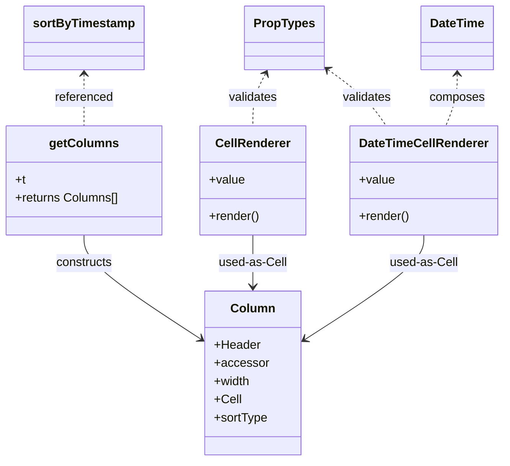

# Diagram: web/portal/src/pages/connectedcar/search/ConnectedCar.columns.js

> Auto-generated by Obscura crawlers

## Mermaid

### SVG

<svg id="container" width="656.02734375" xmlns="http://www.w3.org/2000/svg" class="classDiagram" height="608" viewBox="0 0 656.02734375 608" role="graphics-document document" aria-roledescription="class"><g><defs><marker id="container_class-aggregationStart" class="marker aggregation class" refX="18" refY="7" markerWidth="190" markerHeight="240" orient="auto"><path d="M 18,7 L9,13 L1,7 L9,1 Z"></path></marker></defs><defs><marker id="container_class-aggregationEnd" class="marker aggregation class" refX="1" refY="7" markerWidth="20" markerHeight="28" orient="auto"><path d="M 18,7 L9,13 L1,7 L9,1 Z"></path></marker></defs><defs><marker id="container_class-extensionStart" class="marker extension class" refX="18" refY="7" markerWidth="190" markerHeight="240" orient="auto"><path d="M 1,7 L18,13 V 1 Z"></path></marker></defs><defs><marker id="container_class-extensionEnd" class="marker extension class" refX="1" refY="7" markerWidth="20" markerHeight="28" orient="auto"><path d="M 1,1 V 13 L18,7 Z"></path></marker></defs><defs><marker id="container_class-compositionStart" class="marker composition class" refX="18" refY="7" markerWidth="190" markerHeight="240" orient="auto"><path d="M 18,7 L9,13 L1,7 L9,1 Z"></path></marker></defs><defs><marker id="container_class-compositionEnd" class="marker composition class" refX="1" refY="7" markerWidth="20" markerHeight="28" orient="auto"><path d="M 18,7 L9,13 L1,7 L9,1 Z"></path></marker></defs><defs><marker id="container_class-dependencyStart" class="marker dependency class" refX="6" refY="7" markerWidth="190" markerHeight="240" orient="auto"><path d="M 5,7 L9,13 L1,7 L9,1 Z"></path></marker></defs><defs><marker id="container_class-dependencyEnd" class="marker dependency class" refX="13" refY="7" markerWidth="20" markerHeight="28" orient="auto"><path d="M 18,7 L9,13 L14,7 L9,1 Z"></path></marker></defs><defs><marker id="container_class-lollipopStart" class="marker lollipop class" refX="13" refY="7" markerWidth="190" markerHeight="240" orient="auto"><circle stroke="black" fill="transparent" cx="7" cy="7" r="6"></circle></marker></defs><defs><marker id="container_class-lollipopEnd" class="marker lollipop class" refX="1" refY="7" markerWidth="190" markerHeight="240" orient="auto"><circle stroke="black" fill="transparent" cx="7" cy="7" r="6"></circle></marker></defs><g class="root"><g class="clusters"></g><g class="edgePaths"><path d="M348.734,97.279L345.878,102.566C343.021,107.852,337.307,118.426,334.451,129.88C331.594,141.333,331.594,153.667,331.594,159.833L331.594,166" id="id_PropTypes_CellRenderer_1" class="edge-thickness-normal edge-pattern-dashed relation" style=";;;" data-edge="true" data-et="edge" data-id="id_PropTypes_CellRenderer_1" data-points="W3sieCI6MzUxLjU4NjYyOTc0NjgzNTQ2LCJ5Ijo5Mn0seyJ4IjozMzEuNTkzNzUsInkiOjEyOX0seyJ4IjozMzEuNTkzNzUsInkiOjE2Nn1d" marker-start="url(#container_class-dependencyStart)"></path><path d="M429.357,90.887L437.913,97.239C446.47,103.591,463.582,116.296,476.294,128.815C489.005,141.333,497.315,153.667,501.47,159.833L505.625,166" id="id_PropTypes_DateTimeCellRenderer_2" class="edge-thickness-normal edge-pattern-dashed relation" style=";;;" data-edge="true" data-et="edge" data-id="id_PropTypes_DateTimeCellRenderer_2" data-points="W3sieCI6NDI0LjUzOTA2MjUsInkiOjg3LjMxMDU0OTg4NjIwNTEyfSx7IngiOjQ4MC42OTUzMTI1LCJ5IjoxMjl9LHsieCI6NTA1LjYyNDk2NDE2Mjg0NDA0LCJ5IjoxNjZ9XQ==" marker-start="url(#container_class-dependencyStart)"></path><path d="M598.707,98L598.707,103.167C598.707,108.333,598.707,118.667,596.185,130C593.664,141.333,588.621,153.667,586.099,159.833L583.578,166" id="id_DateTime_DateTimeCellRenderer_3" class="edge-thickness-normal edge-pattern-dashed relation" style=";;;" data-edge="true" data-et="edge" data-id="id_DateTime_DateTimeCellRenderer_3" data-points="W3sieCI6NTk4LjcwNzAzMTI1LCJ5Ijo5Mn0seyJ4Ijo1OTguNzA3MDMxMjUsInkiOjEyOX0seyJ4Ijo1ODMuNTc3NjU5MTE2OTcyNCwieSI6MTY2fV0=" marker-start="url(#container_class-dependencyStart)"></path><path d="M110.328,98L110.328,103.167C110.328,108.333,110.328,118.667,110.328,130C110.328,141.333,110.328,153.667,110.328,159.833L110.328,166" id="id_sortByTimestamp_getColumns_4" class="edge-thickness-normal edge-pattern-dashed relation" style=";;;" data-edge="true" data-et="edge" data-id="id_sortByTimestamp_getColumns_4" data-points="W3sieCI6MTEwLjMyODEyNSwieSI6OTJ9LHsieCI6MTEwLjMyODEyNSwieSI6MTI5fSx7IngiOjExMC4zMjgxMjUsInkiOjE2Nn1d" marker-start="url(#container_class-dependencyStart)"></path><path d="M110.328,310L110.328,316.167C110.328,322.333,110.328,334.667,136.209,357.793C162.089,380.92,213.85,414.84,239.73,431.8L265.61,448.76" id="id_getColumns_Column_5" class="edge-thickness-normal edge-pattern-solid relation" style=";;;" data-edge="true" data-et="edge" data-id="id_getColumns_Column_5" data-points="W3sieCI6MTEwLjMyODEyNSwieSI6MzEwfSx7IngiOjExMC4zMjgxMjUsInkiOjM0N30seyJ4IjoyNzAuNjI4OTA2MjUsInkiOjQ1Mi4wNDg0NjA1NjA2OTQ5fV0=" marker-end="url(#container_class-dependencyEnd)"></path><path d="M331.594,310L331.594,316.167C331.594,322.333,331.594,334.667,331.594,346C331.594,357.333,331.594,367.667,331.594,372.833L331.594,378" id="id_CellRenderer_Column_6" class="edge-thickness-normal edge-pattern-solid relation" style=";;;" data-edge="true" data-et="edge" data-id="id_CellRenderer_Column_6" data-points="W3sieCI6MzMxLjU5Mzc1LCJ5IjozMTB9LHsieCI6MzMxLjU5Mzc1LCJ5IjozNDd9LHsieCI6MzMxLjU5Mzc1LCJ5IjozODR9XQ==" marker-end="url(#container_class-dependencyEnd)"></path><path d="M554.137,310L554.137,316.167C554.137,322.333,554.137,334.667,528.045,357.834C501.953,381.001,449.769,415.002,423.678,432.002L397.586,449.002" id="id_DateTimeCellRenderer_Column_7" class="edge-thickness-normal edge-pattern-solid relation" style=";;;" data-edge="true" data-et="edge" data-id="id_DateTimeCellRenderer_Column_7" data-points="W3sieCI6NTU0LjEzNjcxODc1LCJ5IjozMTB9LHsieCI6NTU0LjEzNjcxODc1LCJ5IjozNDd9LHsieCI6MzkyLjU1ODU5Mzc1LCJ5Ijo0NTIuMjc3NzcyOTAyMDAyNzd9XQ==" marker-end="url(#container_class-dependencyEnd)"></path></g><g class="edgeLabels"><g class="edgeLabel" transform="translate(331.59375, 129)"><g class="label" data-id="id_PropTypes_CellRenderer_1" transform="translate(-32.6875, -12)"><foreignObject width="65.375" height="24">

validates

</foreignObject></g></g><g class="edgeLabel" transform="translate(480.6953125, 129)"><g class="label" data-id="id_PropTypes_DateTimeCellRenderer_2" transform="translate(-32.6875, -12)"><foreignObject width="65.375" height="24">

validates

</foreignObject></g></g><g class="edgeLabel" transform="translate(598.70703125, 129)"><g class="label" data-id="id_DateTime_DateTimeCellRenderer_3" transform="translate(-36.453125, -12)"><foreignObject width="72.90625" height="24">

composes

</foreignObject></g></g><g class="edgeLabel" transform="translate(110.328125, 129)"><g class="label" data-id="id_sortByTimestamp_getColumns_4" transform="translate(-38.875, -12)"><foreignObject width="77.75" height="24">

referenced

</foreignObject></g></g><g class="edgeLabel" transform="translate(110.328125, 347)"><g class="label" data-id="id_getColumns_Column_5" transform="translate(-37.84375, -12)"><foreignObject width="75.6875" height="24">

constructs

</foreignObject></g></g><g class="edgeLabel" transform="translate(331.59375, 347)"><g class="label" data-id="id_CellRenderer_Column_6" transform="translate(-45.1640625, -12)"><foreignObject width="90.328125" height="24">

used-as-Cell

</foreignObject></g></g><g class="edgeLabel" transform="translate(554.13671875, 347)"><g class="label" data-id="id_DateTimeCellRenderer_Column_7" transform="translate(-45.1640625, -12)"><foreignObject width="90.328125" height="24">

used-as-Cell

</foreignObject></g></g></g><g class="nodes"><g class="node default" id="classId-CellRenderer-0" transform="translate(331.59375, 238)"><g class="basic label-container"><path d="M-68.9375 -72 L68.9375 -72 L68.9375 72 L-68.9375 72" stroke="none" stroke-width="0" fill="#ECECFF" style=""></path><path d="M-68.9375 -72 C-40.32953041332275 -72, -11.7215608266455 -72, 68.9375 -72 M-68.9375 -72 C-25.873249067647265 -72, 17.19100186470547 -72, 68.9375 -72 M68.9375 -72 C68.9375 -18.55470639999234, 68.9375 34.89058720001532, 68.9375 72 M68.9375 -72 C68.9375 -26.846616529367438, 68.9375 18.306766941265124, 68.9375 72 M68.9375 72 C22.150453166426892 72, -24.636593667146215 72, -68.9375 72 M68.9375 72 C16.225033447133143 72, -36.487433105733714 72, -68.9375 72 M-68.9375 72 C-68.9375 39.65999592567212, -68.9375 7.319991851344241, -68.9375 -72 M-68.9375 72 C-68.9375 20.26298198779549, -68.9375 -31.474036024409017, -68.9375 -72" stroke="#9370DB" stroke-width="1.3" fill="none" stroke-dasharray="0 0" style=""></path></g><g class="annotation-group text" transform="translate(0, -48)"></g><g class="label-group text" transform="translate(-47.265625, -48)"><g class="label" style="font-weight: bolder" transform="translate(0,-12)"><foreignObject width="94.53125" height="24">

CellRenderer

</foreignObject></g></g><g class="members-group text" transform="translate(-56.9375, 0)"><g class="label" style="" transform="translate(0,-12)"><foreignObject width="46.71875" height="24">

+value

</foreignObject></g></g><g class="methods-group text" transform="translate(-56.9375, 48)"><g class="label" style="" transform="translate(0,-12)"><foreignObject width="66.609375" height="24">

+render()

</foreignObject></g></g><g class="divider" style=""><path d="M-68.9375 -24 C-14.107728852608481 -24, 40.72204229478304 -24, 68.9375 -24 M-68.9375 -24 C-29.37874124157034 -24, 10.180017516859323 -24, 68.9375 -24" stroke="#9370DB" stroke-width="1.3" fill="none" stroke-dasharray="0 0" style=""></path></g><g class="divider" style=""><path d="M-68.9375 24 C-29.019065817896013 24, 10.899368364207973 24, 68.9375 24 M-68.9375 24 C-17.32489016316714 24, 34.28771967366572 24, 68.9375 24" stroke="#9370DB" stroke-width="1.3" fill="none" stroke-dasharray="0 0" style=""></path></g></g><g class="node default" id="classId-DateTimeCellRenderer-1" transform="translate(554.13671875, 238)"><g class="basic label-container"><path d="M-93.890625 -72 L93.890625 -72 L93.890625 72 L-93.890625 72" stroke="none" stroke-width="0" fill="#ECECFF" style=""></path><path d="M-93.890625 -72 C-20.48223170191467 -72, 52.92616159617066 -72, 93.890625 -72 M-93.890625 -72 C-45.590614535981 -72, 2.709395928038006 -72, 93.890625 -72 M93.890625 -72 C93.890625 -40.819829150438096, 93.890625 -9.639658300876192, 93.890625 72 M93.890625 -72 C93.890625 -30.26414122738167, 93.890625 11.471717545236658, 93.890625 72 M93.890625 72 C46.872096767690365 72, -0.14643146461926904 72, -93.890625 72 M93.890625 72 C34.73833628817801 72, -24.413952423643977 72, -93.890625 72 M-93.890625 72 C-93.890625 39.34600083431332, -93.890625 6.692001668626645, -93.890625 -72 M-93.890625 72 C-93.890625 41.45925097223982, -93.890625 10.918501944479644, -93.890625 -72" stroke="#9370DB" stroke-width="1.3" fill="none" stroke-dasharray="0 0" style=""></path></g><g class="annotation-group text" transform="translate(0, -48)"></g><g class="label-group text" transform="translate(-81.890625, -48)"><g class="label" style="font-weight: bolder" transform="translate(0,-12)"><foreignObject width="163.78125" height="24">

DateTimeCellRenderer

</foreignObject></g></g><g class="members-group text" transform="translate(-81.890625, 0)"><g class="label" style="" transform="translate(0,-12)"><foreignObject width="46.71875" height="24">

+value

</foreignObject></g></g><g class="methods-group text" transform="translate(-81.890625, 48)"><g class="label" style="" transform="translate(0,-12)"><foreignObject width="66.609375" height="24">

+render()

</foreignObject></g></g><g class="divider" style=""><path d="M-93.890625 -24 C-32.708699864549935 -24, 28.47322527090013 -24, 93.890625 -24 M-93.890625 -24 C-31.645163371751778 -24, 30.600298256496444 -24, 93.890625 -24" stroke="#9370DB" stroke-width="1.3" fill="none" stroke-dasharray="0 0" style=""></path></g><g class="divider" style=""><path d="M-93.890625 24 C-28.693168610262717 24, 36.504287779474566 24, 93.890625 24 M-93.890625 24 C-50.47404482921751 24, -7.057464658435023 24, 93.890625 24" stroke="#9370DB" stroke-width="1.3" fill="none" stroke-dasharray="0 0" style=""></path></g></g><g class="node default" id="classId-getColumns-2" transform="translate(110.328125, 238)"><g class="basic label-container"><path d="M-102.328125 -72 L102.328125 -72 L102.328125 72 L-102.328125 72" stroke="none" stroke-width="0" fill="#ECECFF" style=""></path><path d="M-102.328125 -72 C-39.71053778665126 -72, 22.907049426697483 -72, 102.328125 -72 M-102.328125 -72 C-52.27286908822936 -72, -2.217613176458727 -72, 102.328125 -72 M102.328125 -72 C102.328125 -25.815726063735035, 102.328125 20.36854787252993, 102.328125 72 M102.328125 -72 C102.328125 -41.629834684651705, 102.328125 -11.25966936930341, 102.328125 72 M102.328125 72 C53.317566712696085 72, 4.307008425392169 72, -102.328125 72 M102.328125 72 C32.97411719473692 72, -36.37989061052616 72, -102.328125 72 M-102.328125 72 C-102.328125 24.08227606090169, -102.328125 -23.835447878196618, -102.328125 -72 M-102.328125 72 C-102.328125 24.938111288941357, -102.328125 -22.123777422117286, -102.328125 -72" stroke="#9370DB" stroke-width="1.3" fill="none" stroke-dasharray="0 0" style=""></path></g><g class="annotation-group text" transform="translate(0, -48)"></g><g class="label-group text" transform="translate(-43.046875, -48)"><g class="label" style="font-weight: bolder" transform="translate(0,-12)"><foreignObject width="86.09375" height="24">

getColumns

</foreignObject></g></g><g class="members-group text" transform="translate(-90.328125, 0)"><g class="label" style="" transform="translate(0,-12)"><foreignObject width="13.6875" height="24">

+t

</foreignObject></g><g class="label" style="" transform="translate(0,12)"><foreignObject width="137.609375" height="24">

+returns Columns[]

</foreignObject></g></g><g class="methods-group text" transform="translate(-90.328125, 72)"></g><g class="divider" style=""><path d="M-102.328125 -24 C-53.29093926782254 -24, -4.253753535645075 -24, 102.328125 -24 M-102.328125 -24 C-46.34011255376688 -24, 9.647899892466242 -24, 102.328125 -24" stroke="#9370DB" stroke-width="1.3" fill="none" stroke-dasharray="0 0" style=""></path></g><g class="divider" style=""><path d="M-102.328125 48 C-35.845608172008184 48, 30.636908655983632 48, 102.328125 48 M-102.328125 48 C-51.57711260753852 48, -0.8261002150770338 48, 102.328125 48" stroke="#9370DB" stroke-width="1.3" fill="none" stroke-dasharray="0 0" style=""></path></g></g><g class="node default" id="classId-Column-3" transform="translate(331.59375, 492)"><g class="basic label-container"><path d="M-60.96484375 -108 L60.96484375 -108 L60.96484375 108 L-60.96484375 108" stroke="none" stroke-width="0" fill="#ECECFF" style=""></path><path d="M-60.96484375 -108 C-32.28122068758152 -108, -3.59759762516304 -108, 60.96484375 -108 M-60.96484375 -108 C-27.308423402717985 -108, 6.347996944564031 -108, 60.96484375 -108 M60.96484375 -108 C60.96484375 -59.713579790316004, 60.96484375 -11.427159580632008, 60.96484375 108 M60.96484375 -108 C60.96484375 -42.41063653329279, 60.96484375 23.178726933414424, 60.96484375 108 M60.96484375 108 C30.85203964395069 108, 0.7392355379013793 108, -60.96484375 108 M60.96484375 108 C32.66177121357843 108, 4.358698677156866 108, -60.96484375 108 M-60.96484375 108 C-60.96484375 51.265996235910436, -60.96484375 -5.468007528179129, -60.96484375 -108 M-60.96484375 108 C-60.96484375 43.01638211279351, -60.96484375 -21.967235774412984, -60.96484375 -108" stroke="#9370DB" stroke-width="1.3" fill="none" stroke-dasharray="0 0" style=""></path></g><g class="annotation-group text" transform="translate(0, -84)"></g><g class="label-group text" transform="translate(-27.4453125, -84)"><g class="label" style="font-weight: bolder" transform="translate(0,-12)"><foreignObject width="54.890625" height="24">

Column

</foreignObject></g></g><g class="members-group text" transform="translate(-48.96484375, -36)"><g class="label" style="" transform="translate(0,-12)"><foreignObject width="60.59375" height="24">

+Header

</foreignObject></g><g class="label" style="" transform="translate(0,12)"><foreignObject width="70.140625" height="24">

+accessor

</foreignObject></g><g class="label" style="" transform="translate(0,36)"><foreignObject width="48.703125" height="24">

+width

</foreignObject></g><g class="label" style="" transform="translate(0,60)"><foreignObject width="34.734375" height="24">

+Cell

</foreignObject></g><g class="label" style="" transform="translate(0,84)"><foreignObject width="70.484375" height="24">

+sortType

</foreignObject></g></g><g class="methods-group text" transform="translate(-48.96484375, 108)"></g><g class="divider" style=""><path d="M-60.96484375 -60 C-31.753889322199093 -60, -2.5429348943981864 -60, 60.96484375 -60 M-60.96484375 -60 C-29.602982736324986 -60, 1.7588782773500284 -60, 60.96484375 -60" stroke="#9370DB" stroke-width="1.3" fill="none" stroke-dasharray="0 0" style=""></path></g><g class="divider" style=""><path d="M-60.96484375 84 C-24.933928035695146 84, 11.096987678609707 84, 60.96484375 84 M-60.96484375 84 C-32.899428673409936 84, -4.834013596819872 84, 60.96484375 84" stroke="#9370DB" stroke-width="1.3" fill="none" stroke-dasharray="0 0" style=""></path></g></g><g class="node default" id="classId-PropTypes-4" transform="translate(374.28125, 50)"><g class="basic label-container"><path d="M-50.2578125 -42 L50.2578125 -42 L50.2578125 42 L-50.2578125 42" stroke="none" stroke-width="0" fill="#ECECFF" style=""></path><path d="M-50.2578125 -42 C-21.553645905063913 -42, 7.150520689872174 -42, 50.2578125 -42 M-50.2578125 -42 C-19.701847396765782 -42, 10.854117706468436 -42, 50.2578125 -42 M50.2578125 -42 C50.2578125 -11.182766256509375, 50.2578125 19.63446748698125, 50.2578125 42 M50.2578125 -42 C50.2578125 -9.767001262071147, 50.2578125 22.465997475857705, 50.2578125 42 M50.2578125 42 C19.64644283485741 42, -10.96492683028518 42, -50.2578125 42 M50.2578125 42 C29.745875891451835 42, 9.23393928290367 42, -50.2578125 42 M-50.2578125 42 C-50.2578125 12.458064690008793, -50.2578125 -17.083870619982413, -50.2578125 -42 M-50.2578125 42 C-50.2578125 20.39623923675563, -50.2578125 -1.2075215264887404, -50.2578125 -42" stroke="#9370DB" stroke-width="1.3" fill="none" stroke-dasharray="0 0" style=""></path></g><g class="annotation-group text" transform="translate(0, -18)"></g><g class="label-group text" transform="translate(-38.2578125, -18)"><g class="label" style="font-weight: bolder" transform="translate(0,-12)"><foreignObject width="76.515625" height="24">

PropTypes

</foreignObject></g></g><g class="members-group text" transform="translate(-38.2578125, 30)"></g><g class="methods-group text" transform="translate(-38.2578125, 60)"></g><g class="divider" style=""><path d="M-50.2578125 6 C-27.206482375952447 6, -4.1551522519048945 6, 50.2578125 6 M-50.2578125 6 C-16.307385073036997 6, 17.643042353926006 6, 50.2578125 6" stroke="#9370DB" stroke-width="1.3" fill="none" stroke-dasharray="0 0" style=""></path></g><g class="divider" style=""><path d="M-50.2578125 24 C-16.26079110278056 24, 17.736230294438883 24, 50.2578125 24 M-50.2578125 24 C-21.743358587413205 24, 6.77109532517359 24, 50.2578125 24" stroke="#9370DB" stroke-width="1.3" fill="none" stroke-dasharray="0 0" style=""></path></g></g><g class="node default" id="classId-sortByTimestamp-5" transform="translate(110.328125, 50)"><g class="basic label-container"><path d="M-76.4453125 -42 L76.4453125 -42 L76.4453125 42 L-76.4453125 42" stroke="none" stroke-width="0" fill="#ECECFF" style=""></path><path d="M-76.4453125 -42 C-18.120326616122867 -42, 40.204659267754266 -42, 76.4453125 -42 M-76.4453125 -42 C-19.179888274910844 -42, 38.08553595017831 -42, 76.4453125 -42 M76.4453125 -42 C76.4453125 -15.807853286332325, 76.4453125 10.38429342733535, 76.4453125 42 M76.4453125 -42 C76.4453125 -25.009968109410643, 76.4453125 -8.019936218821286, 76.4453125 42 M76.4453125 42 C32.8881768299552 42, -10.668958840089601 42, -76.4453125 42 M76.4453125 42 C41.08285618858062 42, 5.720399877161242 42, -76.4453125 42 M-76.4453125 42 C-76.4453125 24.06427666685156, -76.4453125 6.128553333703117, -76.4453125 -42 M-76.4453125 42 C-76.4453125 15.006290139233805, -76.4453125 -11.98741972153239, -76.4453125 -42" stroke="#9370DB" stroke-width="1.3" fill="none" stroke-dasharray="0 0" style=""></path></g><g class="annotation-group text" transform="translate(0, -18)"></g><g class="label-group text" transform="translate(-64.4453125, -18)"><g class="label" style="font-weight: bolder" transform="translate(0,-12)"><foreignObject width="128.890625" height="24">

sortByTimestamp

</foreignObject></g></g><g class="members-group text" transform="translate(-64.4453125, 30)"></g><g class="methods-group text" transform="translate(-64.4453125, 60)"></g><g class="divider" style=""><path d="M-76.4453125 6 C-45.25768501258641 6, -14.070057525172807 6, 76.4453125 6 M-76.4453125 6 C-28.95250140596857 6, 18.540309688062862 6, 76.4453125 6" stroke="#9370DB" stroke-width="1.3" fill="none" stroke-dasharray="0 0" style=""></path></g><g class="divider" style=""><path d="M-76.4453125 24 C-34.10632928201016 24, 8.232653935979684 24, 76.4453125 24 M-76.4453125 24 C-31.932500741080283 24, 12.580311017839435 24, 76.4453125 24" stroke="#9370DB" stroke-width="1.3" fill="none" stroke-dasharray="0 0" style=""></path></g></g><g class="node default" id="classId-DateTime-6" transform="translate(598.70703125, 50)"><g class="basic label-container"><path d="M-46.625 -42 L46.625 -42 L46.625 42 L-46.625 42" stroke="none" stroke-width="0" fill="#ECECFF" style=""></path><path d="M-46.625 -42 C-19.679132438198593 -42, 7.266735123602814 -42, 46.625 -42 M-46.625 -42 C-25.187631357877816 -42, -3.750262715755632 -42, 46.625 -42 M46.625 -42 C46.625 -20.399207316619435, 46.625 1.2015853667611296, 46.625 42 M46.625 -42 C46.625 -9.854582728468671, 46.625 22.290834543062658, 46.625 42 M46.625 42 C10.197245865964646 42, -26.230508268070707 42, -46.625 42 M46.625 42 C17.951372854314233 42, -10.722254291371534 42, -46.625 42 M-46.625 42 C-46.625 18.066495786783896, -46.625 -5.867008426432207, -46.625 -42 M-46.625 42 C-46.625 9.744120032002726, -46.625 -22.511759935994547, -46.625 -42" stroke="#9370DB" stroke-width="1.3" fill="none" stroke-dasharray="0 0" style=""></path></g><g class="annotation-group text" transform="translate(0, -18)"></g><g class="label-group text" transform="translate(-34.625, -18)"><g class="label" style="font-weight: bolder" transform="translate(0,-12)"><foreignObject width="69.25" height="24">

DateTime

</foreignObject></g></g><g class="members-group text" transform="translate(-34.625, 30)"></g><g class="methods-group text" transform="translate(-34.625, 60)"></g><g class="divider" style=""><path d="M-46.625 6 C-19.807182113306762 6, 7.0106357733864755 6, 46.625 6 M-46.625 6 C-25.15898518399375 6, -3.692970367987499 6, 46.625 6" stroke="#9370DB" stroke-width="1.3" fill="none" stroke-dasharray="0 0" style=""></path></g><g class="divider" style=""><path d="M-46.625 24 C-15.565605482601569 24, 15.493789034796862 24, 46.625 24 M-46.625 24 C-14.87890563810619 24, 16.86718872378762 24, 46.625 24" stroke="#9370DB" stroke-width="1.3" fill="none" stroke-dasharray="0 0" style=""></path></g></g></g></g></g></svg>
