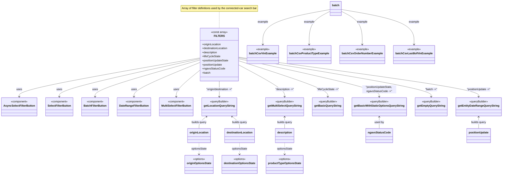

# Diagram: web/portal/src/pages/connectedcar/search/ConnectedCarFilterSectionCategoryDefs.js

> Auto-generated by Obscura crawlers

## Mermaid

```mermaid
classDiagram
    class FILTERS {
        <<const array>>
        +originLocation
        +destinationLocation
        +description
        +lifeCycleState
        +positionUpdateState
        +positionUpdate
        +ngavsStatusCode
        +batch
    }
    class AsyncSelectFilterButton <<component>> 
    class SelectFilterButton <<component>>
    class BatchFilterButton <<component>>
    class DateRangeFilterButton <<component>>
    class MultiSelectFilterButton <<component>>

    class getLocationQueryString <<queryBuilder>>
    class getMultiSelectQueryString <<queryBuilder>>
    class getBasicQueryString <<queryBuilder>>
    class getBasicWithStaticOptionsQueryString <<queryBuilder>>
    class getEmptyQueryString <<queryBuilder>>
    class getEntityDateRangeQueryString <<queryBuilder>>

    class originOptionsState <<options>>
    class destinationOptionsState <<options>>
    class productTypeOptionsState <<options>>

    class batchCsvVinExample <<example>>
    class batchCsvProductTypeExample <<example>>
    class batchCsvOrderNumberExample <<example>>
    class batchCsvLast8ofVinExample <<example>>

    FILTERS --> AsyncSelectFilterButton : uses
    FILTERS --> SelectFilterButton : uses
    FILTERS --> BatchFilterButton : uses
    FILTERS --> DateRangeFilterButton : uses
    FILTERS --> MultiSelectFilterButton : uses

    FILTERS --> getLocationQueryString : "origin/destination ->"
    FILTERS --> getMultiSelectQueryString : "description ->"
    FILTERS --> getBasicQueryString : "lifeCycleState ->"
    FILTERS --> getBasicWithStaticOptionsQueryString : "positionUpdateState, ngavsStatusCode ->"
    FILTERS --> getEntityDateRangeQueryString : "positionUpdate ->"
    FILTERS --> getEmptyQueryString : "batch ->"

    originLocation ..> originOptionsState : optionsState
    destinationLocation ..> destinationOptionsState : optionsState
    description ..> productTypeOptionsState : optionsState

    batch --> batchCsvVinExample : example
    batch --> batchCsvProductTypeExample : example
    batch --> batchCsvLast8ofVinExample : example
    batch --> batchCsvOrderNumberExample : example

    getBasicWithStaticOptionsQueryString <-- ngavsStatusCode : used by
    getLocationQueryString <-- originLocation : builds query
    getLocationQueryString <-- destinationLocation : builds query
    getMultiSelectQueryString <-- description : builds query
    getEntityDateRangeQueryString <-- positionUpdate : builds query

    note for FILTERS "Array of filter definitions used by the connected-car search bar"
```

> SVG rendering failed for this diagram.
