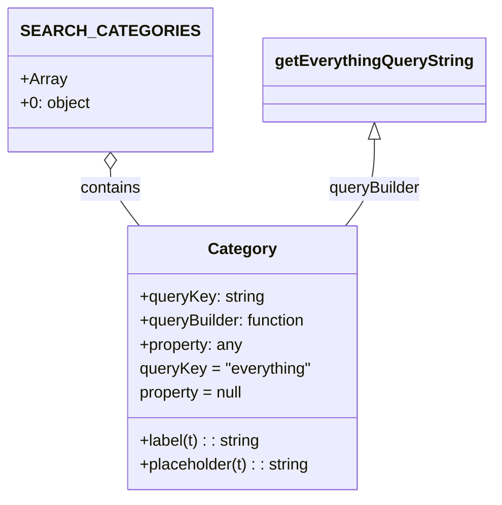

# Diagram: web/portal/src/pages/connectedcar/search/ConnectedCarSearchBarCategoryDefs.js


> Auto-generated by Obscura crawlers

## Diagram 1



### SVG

<svg id="container" width="455.421875" xmlns="http://www.w3.org/2000/svg" class="classDiagram" height="498" viewBox="0 0 455.421875 498" role="graphics-document document" aria-roledescription="class"><style>#container{font-family:"trebuchet ms",verdana,arial,sans-serif;font-size:16px;fill:#333;}@keyframes edge-animation-frame{from{stroke-dashoffset:0;}}@keyframes dash{to{stroke-dashoffset:0;}}#container .edge-animation-slow{stroke-dasharray:9,5!important;stroke-dashoffset:900;animation:dash 50s linear infinite;stroke-linecap:round;}#container .edge-animation-fast{stroke-dasharray:9,5!important;stroke-dashoffset:900;animation:dash 20s linear infinite;stroke-linecap:round;}#container .error-icon{fill:#552222;}#container .error-text{fill:#552222;stroke:#552222;}#container .edge-thickness-normal{stroke-width:1px;}#container .edge-thickness-thick{stroke-width:3.5px;}#container .edge-pattern-solid{stroke-dasharray:0;}#container .edge-thickness-invisible{stroke-width:0;fill:none;}#container .edge-pattern-dashed{stroke-dasharray:3;}#container .edge-pattern-dotted{stroke-dasharray:2;}#container .marker{fill:#333333;stroke:#333333;}#container .marker.cross{stroke:#333333;}#container svg{font-family:"trebuchet ms",verdana,arial,sans-serif;font-size:16px;}#container p{margin:0;}#container g.classGroup text{fill:#9370DB;stroke:none;font-family:"trebuchet ms",verdana,arial,sans-serif;font-size:10px;}#container g.classGroup text .title{font-weight:bolder;}#container .nodeLabel,#container .edgeLabel{color:#131300;}#container .edgeLabel .label rect{fill:#ECECFF;}#container .label text{fill:#131300;}#container .labelBkg{background:#ECECFF;}#container .edgeLabel .label span{background:#ECECFF;}#container .classTitle{font-weight:bolder;}#container .node rect,#container .node circle,#container .node ellipse,#container .node polygon,#container .node path{fill:#ECECFF;stroke:#9370DB;stroke-width:1px;}#container .divider{stroke:#9370DB;stroke-width:1;}#container g.clickable{cursor:pointer;}#container g.classGroup rect{fill:#ECECFF;stroke:#9370DB;}#container g.classGroup line{stroke:#9370DB;stroke-width:1;}#container .classLabel .box{stroke:none;stroke-width:0;fill:#ECECFF;opacity:0.5;}#container .classLabel .label{fill:#9370DB;font-size:10px;}#container .relation{stroke:#333333;stroke-width:1;fill:none;}#container .dashed-line{stroke-dasharray:3;}#container .dotted-line{stroke-dasharray:1 2;}#container #compositionStart,#container .composition{fill:#333333!important;stroke:#333333!important;stroke-width:1;}#container #compositionEnd,#container .composition{fill:#333333!important;stroke:#333333!important;stroke-width:1;}#container #dependencyStart,#container .dependency{fill:#333333!important;stroke:#333333!important;stroke-width:1;}#container #dependencyStart,#container .dependency{fill:#333333!important;stroke:#333333!important;stroke-width:1;}#container #extensionStart,#container .extension{fill:transparent!important;stroke:#333333!important;stroke-width:1;}#container #extensionEnd,#container .extension{fill:transparent!important;stroke:#333333!important;stroke-width:1;}#container #aggregationStart,#container .aggregation{fill:transparent!important;stroke:#333333!important;stroke-width:1;}#container #aggregationEnd,#container .aggregation{fill:transparent!important;stroke:#333333!important;stroke-width:1;}#container #lollipopStart,#container .lollipop{fill:#ECECFF!important;stroke:#333333!important;stroke-width:1;}#container #lollipopEnd,#container .lollipop{fill:#ECECFF!important;stroke:#333333!important;stroke-width:1;}#container .edgeTerminals{font-size:11px;line-height:initial;}#container .classTitleText{text-anchor:middle;font-size:18px;fill:#333;}#container .label-icon{display:inline-block;height:1em;overflow:visible;vertical-align:-0.125em;}#container .node .label-icon path{fill:currentColor;stroke:revert;stroke-width:revert;}#container :root{--mermaid-font-family:"trebuchet ms",verdana,arial,sans-serif;}</style><g><defs><marker id="container_class-aggregationStart" class="marker aggregation class" refX="18" refY="7" markerWidth="190" markerHeight="240" orient="auto"><path d="M 18,7 L9,13 L1,7 L9,1 Z"></path></marker></defs><defs><marker id="container_class-aggregationEnd" class="marker aggregation class" refX="1" refY="7" markerWidth="20" markerHeight="28" orient="auto"><path d="M 18,7 L9,13 L1,7 L9,1 Z"></path></marker></defs><defs><marker id="container_class-extensionStart" class="marker extension class" refX="18" refY="7" markerWidth="190" markerHeight="240" orient="auto"><path d="M 1,7 L18,13 V 1 Z"></path></marker></defs><defs><marker id="container_class-extensionEnd" class="marker extension class" refX="1" refY="7" markerWidth="20" markerHeight="28" orient="auto"><path d="M 1,1 V 13 L18,7 Z"></path></marker></defs><defs><marker id="container_class-compositionStart" class="marker composition class" refX="18" refY="7" markerWidth="190" markerHeight="240" orient="auto"><path d="M 18,7 L9,13 L1,7 L9,1 Z"></path></marker></defs><defs><marker id="container_class-compositionEnd" class="marker composition class" refX="1" refY="7" markerWidth="20" markerHeight="28" orient="auto"><path d="M 18,7 L9,13 L1,7 L9,1 Z"></path></marker></defs><defs><marker id="container_class-dependencyStart" class="marker dependency class" refX="6" refY="7" markerWidth="190" markerHeight="240" orient="auto"><path d="M 5,7 L9,13 L1,7 L9,1 Z"></path></marker></defs><defs><marker id="container_class-dependencyEnd" class="marker dependency class" refX="13" refY="7" markerWidth="20" markerHeight="28" orient="auto"><path d="M 18,7 L9,13 L14,7 L9,1 Z"></path></marker></defs><defs><marker id="container_class-lollipopStart" class="marker lollipop class" refX="13" refY="7" markerWidth="190" markerHeight="240" orient="auto"><circle stroke="black" fill="transparent" cx="7" cy="7" r="6"></circle></marker></defs><defs><marker id="container_class-lollipopEnd" class="marker lollipop class" refX="1" refY="7" markerWidth="190" markerHeight="240" orient="auto"><circle stroke="black" fill="transparent" cx="7" cy="7" r="6"></circle></marker></defs><g class="root"><g class="clusters"></g><g class="edgePaths"><path d="M96.117,169.25L96.117,172.542C96.117,175.833,96.117,182.417,100.582,191.875C105.046,201.333,113.976,213.667,118.44,219.833L122.905,226" id="id_SEARCH_CATEGORIES_Category_1" class="edge-thickness-normal edge-pattern-solid relation" style=";;;" data-edge="true" data-et="edge" data-id="id_SEARCH_CATEGORIES_Category_1" data-points="W3sieCI6OTYuMTE3MTg3NSwieSI6MTUyfSx7IngiOjk2LjExNzE4NzUsInkiOjE4OX0seyJ4IjoxMjIuOTA1MDcxMTkwODI4NDEsInkiOjIyNn1d" marker-start="url(#container_class-aggregationStart)"></path><path d="M340.828,139.25L340.828,147.542C340.828,155.833,340.828,172.417,336.363,186.875C331.899,201.333,322.97,213.667,318.505,219.833L314.04,226" id="id_getEverythingQueryString_Category_2" class="edge-thickness-normal edge-pattern-solid relation" style=";;;" data-edge="true" data-et="edge" data-id="id_getEverythingQueryString_Category_2" data-points="W3sieCI6MzQwLjgyODEyNSwieSI6MTIyfSx7IngiOjM0MC44MjgxMjUsInkiOjE4OX0seyJ4IjozMTQuMDQwMjQxMzA5MTcxNiwieSI6MjI2fV0=" marker-start="url(#container_class-extensionStart)"></path></g><g class="edgeLabels"><g class="edgeLabel" transform="translate(96.1171875, 189)"><g class="label" data-id="id_SEARCH_CATEGORIES_Category_1" transform="translate(-30.890625, -12)"><foreignObject width="61.78125" height="24"><div xmlns="http://www.w3.org/1999/xhtml" class="labelBkg" style="display: table-cell; white-space: nowrap; line-height: 1.5; max-width: 200px; text-align: center;"><span class="edgeLabel"><p>contains</p></span></div></foreignObject></g></g><g class="edgeLabel" transform="translate(340.828125, 189)"><g class="label" data-id="id_getEverythingQueryString_Category_2" transform="translate(-47.140625, -12)"><foreignObject width="94.28125" height="24"><div xmlns="http://www.w3.org/1999/xhtml" class="labelBkg" style="display: table-cell; white-space: nowrap; line-height: 1.5; max-width: 200px; text-align: center;"><span class="edgeLabel"><p>queryBuilder</p></span></div></foreignObject></g></g></g><g class="nodes"><g class="node default" id="classId-SEARCH_CATEGORIES-0" transform="translate(96.1171875, 80)"><g class="basic label-container"><path d="M-88.1171875 -72 L88.1171875 -72 L88.1171875 72 L-88.1171875 72" stroke="none" stroke-width="0" fill="#ECECFF" style=""></path><path d="M-88.1171875 -72 C-26.01536548380752 -72, 36.08645653238496 -72, 88.1171875 -72 M-88.1171875 -72 C-20.927009912653176 -72, 46.26316767469365 -72, 88.1171875 -72 M88.1171875 -72 C88.1171875 -32.98636496987386, 88.1171875 6.0272700602522775, 88.1171875 72 M88.1171875 -72 C88.1171875 -41.45930200423318, 88.1171875 -10.918604008466367, 88.1171875 72 M88.1171875 72 C22.55504473170666 72, -43.00709803658668 72, -88.1171875 72 M88.1171875 72 C18.92758281453746 72, -50.26202187092508 72, -88.1171875 72 M-88.1171875 72 C-88.1171875 34.35498375952121, -88.1171875 -3.290032480957578, -88.1171875 -72 M-88.1171875 72 C-88.1171875 38.854575746663855, -88.1171875 5.70915149332771, -88.1171875 -72" stroke="#9370DB" stroke-width="1.3" fill="none" stroke-dasharray="0 0" style=""></path></g><g class="annotation-group text" transform="translate(0, -48)"></g><g class="label-group text" transform="translate(-76.1171875, -48)"><g class="label" style="font-weight: bolder" transform="translate(0,-12)"><foreignObject width="152.234375" height="24"><div xmlns="http://www.w3.org/1999/xhtml" style="display: table-cell; white-space: nowrap; line-height: 1.5; max-width: 200px; text-align: center;"><span class="nodeLabel markdown-node-label" style=""><p>SEARCH_CATEGORIES</p></span></div></foreignObject></g></g><g class="members-group text" transform="translate(-76.1171875, 0)"><g class="label" style="" transform="translate(0,-12)"><foreignObject width="45.125" height="24"><div xmlns="http://www.w3.org/1999/xhtml" style="display: table-cell; white-space: nowrap; line-height: 1.5; max-width: 103px; text-align: center;"><span class="nodeLabel markdown-node-label" style=""><p>+Array</p></span></div></foreignObject></g><g class="label" style="" transform="translate(0,12)"><foreignObject width="70.46875" height="24"><div xmlns="http://www.w3.org/1999/xhtml" style="display: table-cell; white-space: nowrap; line-height: 1.5; max-width: 128px; text-align: center;"><span class="nodeLabel markdown-node-label" style=""><p>+0: object</p></span></div></foreignObject></g></g><g class="methods-group text" transform="translate(-76.1171875, 72)"></g><g class="divider" style=""><path d="M-88.1171875 -24 C-18.668470308073964 -24, 50.78024688385207 -24, 88.1171875 -24 M-88.1171875 -24 C-28.550760655998253 -24, 31.015666188003493 -24, 88.1171875 -24" stroke="#9370DB" stroke-width="1.3" fill="none" stroke-dasharray="0 0" style=""></path></g><g class="divider" style=""><path d="M-88.1171875 48 C-31.8867209098798 48, 24.343745680240403 48, 88.1171875 48 M-88.1171875 48 C-51.66811871975255 48, -15.219049939505098 48, 88.1171875 48" stroke="#9370DB" stroke-width="1.3" fill="none" stroke-dasharray="0 0" style=""></path></g></g><g class="node default" id="classId-Category-1" transform="translate(218.47265625, 358)"><g class="basic label-container"><path d="M-114.79296875 -132 L114.79296875 -132 L114.79296875 132 L-114.79296875 132" stroke="none" stroke-width="0" fill="#ECECFF" style=""></path><path d="M-114.79296875 -132 C-65.48969025257415 -132, -16.1864117551483 -132, 114.79296875 -132 M-114.79296875 -132 C-60.789123335902936 -132, -6.785277921805871 -132, 114.79296875 -132 M114.79296875 -132 C114.79296875 -47.830889783098854, 114.79296875 36.33822043380229, 114.79296875 132 M114.79296875 -132 C114.79296875 -37.16231105818012, 114.79296875 57.675377883639754, 114.79296875 132 M114.79296875 132 C47.527351560746396 132, -19.738265628507207 132, -114.79296875 132 M114.79296875 132 C25.867983881298557 132, -63.05700098740289 132, -114.79296875 132 M-114.79296875 132 C-114.79296875 55.46385852771698, -114.79296875 -21.07228294456604, -114.79296875 -132 M-114.79296875 132 C-114.79296875 33.56769710492712, -114.79296875 -64.86460579014576, -114.79296875 -132" stroke="#9370DB" stroke-width="1.3" fill="none" stroke-dasharray="0 0" style=""></path></g><g class="annotation-group text" transform="translate(0, -108)"></g><g class="label-group text" transform="translate(-32.5234375, -108)"><g class="label" style="font-weight: bolder" transform="translate(0,-12)"><foreignObject width="65.046875" height="24"><div xmlns="http://www.w3.org/1999/xhtml" style="display: table-cell; white-space: nowrap; line-height: 1.5; max-width: 113px; text-align: center;"><span class="nodeLabel markdown-node-label" style=""><p>Category</p></span></div></foreignObject></g></g><g class="members-group text" transform="translate(-102.79296875, -60)"><g class="label" style="" transform="translate(0,-12)"><foreignObject width="125.140625" height="24"><div xmlns="http://www.w3.org/1999/xhtml" style="display: table-cell; white-space: nowrap; line-height: 1.5; max-width: 183px; text-align: center;"><span class="nodeLabel markdown-node-label" style=""><p>+queryKey: string</p></span></div></foreignObject></g><g class="label" style="" transform="translate(0,12)"><foreignObject width="171.203125" height="24"><div xmlns="http://www.w3.org/1999/xhtml" style="display: table-cell; white-space: nowrap; line-height: 1.5; max-width: 229px; text-align: center;"><span class="nodeLabel markdown-node-label" style=""><p>+queryBuilder: function</p></span></div></foreignObject></g><g class="label" style="" transform="translate(0,36)"><foreignObject width="104.484375" height="24"><div xmlns="http://www.w3.org/1999/xhtml" style="display: table-cell; white-space: nowrap; line-height: 1.5; max-width: 162px; text-align: center;"><span class="nodeLabel markdown-node-label" style=""><p>+property: any</p></span></div></foreignObject></g><g class="label" style="" transform="translate(0,60)"><foreignObject width="173.0625" height="24"><div xmlns="http://www.w3.org/1999/xhtml" style="display: table-cell; white-space: nowrap; line-height: 1.5; max-width: 223px; text-align: center;"><span class="nodeLabel markdown-node-label" style=""><p>queryKey = "everything"</p></span></div></foreignObject></g><g class="label" style="" transform="translate(0,84)"><foreignObject width="107.0625" height="24"><div xmlns="http://www.w3.org/1999/xhtml" style="display: table-cell; white-space: nowrap; line-height: 1.5; max-width: 157px; text-align: center;"><span class="nodeLabel markdown-node-label" style=""><p>property = null</p></span></div></foreignObject></g></g><g class="methods-group text" transform="translate(-102.79296875, 84)"><g class="label" style="" transform="translate(0,-12)"><foreignObject width="122.390625" height="24"><div xmlns="http://www.w3.org/1999/xhtml" style="display: table-cell; white-space: nowrap; line-height: 1.5; max-width: 180px; text-align: center;"><span class="nodeLabel markdown-node-label" style=""><p>+label(t) : : string</p></span></div></foreignObject></g><g class="label" style="" transform="translate(0,12)"><foreignObject width="172.828125" height="24"><div xmlns="http://www.w3.org/1999/xhtml" style="display: table-cell; white-space: nowrap; line-height: 1.5; max-width: 231px; text-align: center;"><span class="nodeLabel markdown-node-label" style=""><p>+placeholder(t) : : string</p></span></div></foreignObject></g></g><g class="divider" style=""><path d="M-114.79296875 -84 C-48.16907497381288 -84, 18.454818802374234 -84, 114.79296875 -84 M-114.79296875 -84 C-51.921910865553485 -84, 10.94914701889303 -84, 114.79296875 -84" stroke="#9370DB" stroke-width="1.3" fill="none" stroke-dasharray="0 0" style=""></path></g><g class="divider" style=""><path d="M-114.79296875 60 C-30.673170161757156 60, 53.44662842648569 60, 114.79296875 60 M-114.79296875 60 C-39.239291227359956 60, 36.31438629528009 60, 114.79296875 60" stroke="#9370DB" stroke-width="1.3" fill="none" stroke-dasharray="0 0" style=""></path></g></g><g class="node default" id="classId-getEverythingQueryString-2" transform="translate(340.828125, 80)"><g class="basic label-container"><path d="M-106.59375 -42 L106.59375 -42 L106.59375 42 L-106.59375 42" stroke="none" stroke-width="0" fill="#ECECFF" style=""></path><path d="M-106.59375 -42 C-47.778987870805096 -42, 11.035774258389807 -42, 106.59375 -42 M-106.59375 -42 C-52.93551618976919 -42, 0.7227176204616228 -42, 106.59375 -42 M106.59375 -42 C106.59375 -17.312596332912115, 106.59375 7.37480733417577, 106.59375 42 M106.59375 -42 C106.59375 -11.595552089252433, 106.59375 18.808895821495135, 106.59375 42 M106.59375 42 C57.55285919229414 42, 8.511968384588286 42, -106.59375 42 M106.59375 42 C39.30379592858495 42, -27.986158142830106 42, -106.59375 42 M-106.59375 42 C-106.59375 20.54465436146837, -106.59375 -0.9106912770632576, -106.59375 -42 M-106.59375 42 C-106.59375 24.78444324199772, -106.59375 7.568886483995442, -106.59375 -42" stroke="#9370DB" stroke-width="1.3" fill="none" stroke-dasharray="0 0" style=""></path></g><g class="annotation-group text" transform="translate(0, -18)"></g><g class="label-group text" transform="translate(-94.59375, -18)"><g class="label" style="font-weight: bolder" transform="translate(0,-12)"><foreignObject width="189.1875" height="24"><div xmlns="http://www.w3.org/1999/xhtml" style="display: table-cell; white-space: nowrap; line-height: 1.5; max-width: 235px; text-align: center;"><span class="nodeLabel markdown-node-label" style=""><p>getEverythingQueryString</p></span></div></foreignObject></g></g><g class="members-group text" transform="translate(-94.59375, 30)"></g><g class="methods-group text" transform="translate(-94.59375, 60)"></g><g class="divider" style=""><path d="M-106.59375 6 C-58.42090532678503 6, -10.248060653570064 6, 106.59375 6 M-106.59375 6 C-45.83859229602794 6, 14.91656540794412 6, 106.59375 6" stroke="#9370DB" stroke-width="1.3" fill="none" stroke-dasharray="0 0" style=""></path></g><g class="divider" style=""><path d="M-106.59375 24 C-53.87124914056925 24, -1.148748281138495 24, 106.59375 24 M-106.59375 24 C-46.010846970479044 24, 14.572056059041913 24, 106.59375 24" stroke="#9370DB" stroke-width="1.3" fill="none" stroke-dasharray="0 0" style=""></path></g></g></g></g></g></svg>

## Diagram 2

```mermaid
flowchart TD
    A[User enters search text] --> B[SEARCH_CATEGORIES[0] selected]
    B --> C{Use queryBuilder?}
    C -->|yes| D[getEverythingQueryString]
    D --> E[Build query string]
    E --> F[Execute search]
    C -->|no| G[Use property-based query]
    G --> F
```

> SVG rendering failed for this diagram.
