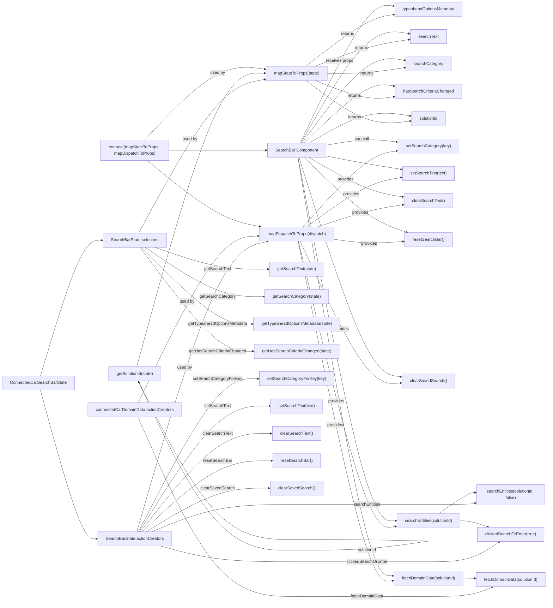

# Diagram: web/portal/src/pages/connectedcar/search/ConnectedCarSearchBarContainer.js

> Auto-generated by Obscura crawlers

## Mermaid

### SVG

<svg id="container" width="2099.21875" xmlns="http://www.w3.org/2000/svg" class="flowchart" height="2286.574951171875" viewBox="0 7 2099.21875 2286.574951171875" role="graphics-document document" aria-roledescription="flowchart-v2"><g><marker id="container_flowchart-v2-pointEnd" class="marker flowchart-v2" viewBox="0 0 10 10" refX="5" refY="5" markerUnits="userSpaceOnUse" markerWidth="8" markerHeight="8" orient="auto"><path d="M 0 0 L 10 5 L 0 10 z" class="arrowMarkerPath" style="stroke-width: 1; stroke-dasharray: 1, 0;"></path></marker><marker id="container_flowchart-v2-pointStart" class="marker flowchart-v2" viewBox="0 0 10 10" refX="4.5" refY="5" markerUnits="userSpaceOnUse" markerWidth="8" markerHeight="8" orient="auto"><path d="M 0 5 L 10 10 L 10 0 z" class="arrowMarkerPath" style="stroke-width: 1; stroke-dasharray: 1, 0;"></path></marker><marker id="container_flowchart-v2-circleEnd" class="marker flowchart-v2" viewBox="0 0 10 10" refX="11" refY="5" markerUnits="userSpaceOnUse" markerWidth="11" markerHeight="11" orient="auto"><circle cx="5" cy="5" r="5" class="arrowMarkerPath" style="stroke-width: 1; stroke-dasharray: 1, 0;"></circle></marker><marker id="container_flowchart-v2-circleStart" class="marker flowchart-v2" viewBox="0 0 10 10" refX="-1" refY="5" markerUnits="userSpaceOnUse" markerWidth="11" markerHeight="11" orient="auto"><circle cx="5" cy="5" r="5" class="arrowMarkerPath" style="stroke-width: 1; stroke-dasharray: 1, 0;"></circle></marker><marker id="container_flowchart-v2-crossEnd" class="marker cross flowchart-v2" viewBox="0 0 11 11" refX="12" refY="5.2" markerUnits="userSpaceOnUse" markerWidth="11" markerHeight="11" orient="auto"><path d="M 1,1 l 9,9 M 10,1 l -9,9" class="arrowMarkerPath" style="stroke-width: 2; stroke-dasharray: 1, 0;"></path></marker><marker id="container_flowchart-v2-crossStart" class="marker cross flowchart-v2" viewBox="0 0 11 11" refX="-1" refY="5.2" markerUnits="userSpaceOnUse" markerWidth="11" markerHeight="11" orient="auto"><path d="M 1,1 l 9,9 M 10,1 l -9,9" class="arrowMarkerPath" style="stroke-width: 2; stroke-dasharray: 1, 0;"></path></marker><g class="root"><g class="clusters"></g><g class="edgePaths"><path d="M585.885,947L625.746,960.833C665.606,974.667,745.326,1002.333,818.003,1016.167C890.68,1030,956.313,1030,989.129,1030L1021.945,1030" id="L_Selectors_getSearchText_0" class="edge-thickness-normal edge-pattern-solid edge-thickness-normal edge-pattern-solid flowchart-link" style=";" data-edge="true" data-et="edge" data-id="L_Selectors_getSearchText_0" data-points="W3sieCI6NTg1Ljg4NTQ0MDM0MDkwOTEsInkiOjk0N30seyJ4Ijo4MjUuMDQ2ODc1LCJ5IjoxMDMwfSx7IngiOjEwMjUuOTQ1MzEyNSwieSI6MTAzMH1d" marker-end="url(#container_flowchart-v2-pointEnd)"></path><path d="M548.076,947L594.238,978.167C640.4,1009.333,732.723,1071.667,808.892,1102.833C885.06,1134,945.073,1134,975.079,1134L1005.086,1134" id="L_Selectors_getSearchCategory_0" class="edge-thickness-normal edge-pattern-solid edge-thickness-normal edge-pattern-solid flowchart-link" style=";" data-edge="true" data-et="edge" data-id="L_Selectors_getSearchCategory_0" data-points="W3sieCI6NTQ4LjA3NjMzNjE1NjU0MjEsInkiOjk0N30seyJ4Ijo4MjUuMDQ2ODc1LCJ5IjoxMTM0fSx7IngiOjEwMDkuMDg1OTM3NSwieSI6MTEzNH1d" marker-end="url(#container_flowchart-v2-pointEnd)"></path><path d="M534.998,947L583.339,995.5C631.681,1044,728.364,1141,799.062,1189.5C869.76,1238,914.474,1238,936.831,1238L959.188,1238" id="L_Selectors_getTypeaheadOptionsMetadata_0" class="edge-thickness-normal edge-pattern-solid edge-thickness-normal edge-pattern-solid flowchart-link" style=";" data-edge="true" data-et="edge" data-id="L_Selectors_getTypeaheadOptionsMetadata_0" data-points="W3sieCI6NTM0Ljk5NzcxNTIxMjI2NDEsInkiOjk0N30seyJ4Ijo4MjUuMDQ2ODc1LCJ5IjoxMjM4fSx7IngiOjk2My4xODc1LCJ5IjoxMjM4fV0=" marker-end="url(#container_flowchart-v2-pointEnd)"></path><path d="M528.365,947L577.812,1012.833C627.259,1078.667,726.153,1210.333,798.994,1276.167C871.836,1342,918.625,1342,942.02,1342L965.414,1342" id="L_Selectors_getHasSearchCriteriaChanged_0" class="edge-thickness-normal edge-pattern-solid edge-thickness-normal edge-pattern-solid flowchart-link" style=";" data-edge="true" data-et="edge" data-id="L_Selectors_getHasSearchCriteriaChanged_0" data-points="W3sieCI6NTI4LjM2NTQyODc2MTg0ODMsInkiOjk0N30seyJ4Ijo4MjUuMDQ2ODc1LCJ5IjoxMzQyfSx7IngiOjk2OS40MTQwNjI1LCJ5IjoxMzQyfV0=" marker-end="url(#container_flowchart-v2-pointEnd)"></path><path d="M151.635,1435L177.073,1349.167C202.512,1263.333,253.389,1091.667,292.142,1005.833C330.896,920,357.526,920,370.841,920L384.156,920" id="L_SearchBarState_Selectors_0" class="edge-thickness-normal edge-pattern-solid edge-thickness-normal edge-pattern-solid flowchart-link" style=";" data-edge="true" data-et="edge" data-id="L_SearchBarState_Selectors_0" data-points="W3sieCI6MTUxLjYzNDgxNjA3NDcyMzIzLCJ5IjoxNDM1fSx7IngiOjMwNC4yNjU2MjUsInkiOjkyMH0seyJ4IjozODguMTU2MjUsInkiOjkyMH1d" marker-end="url(#container_flowchart-v2-pointEnd)"></path><path d="M150.952,1489L176.505,1583.254C202.057,1677.508,253.161,1866.017,288.711,1960.271C324.26,2054.525,344.255,2054.525,354.253,2054.525L364.25,2054.525" id="L_SearchBarState_ActionCreators_0" class="edge-thickness-normal edge-pattern-solid edge-thickness-normal edge-pattern-solid flowchart-link" style=";" data-edge="true" data-et="edge" data-id="L_SearchBarState_ActionCreators_0" data-points="W3sieCI6MTUwLjk1MjQ3OTkxOTA5MTY0LCJ5IjoxNDg5fSx7IngiOjMwNC4yNjU2MjUsInkiOjIwNTQuNTI1MDAwMDAwMzcyNX0seyJ4IjozNjguMjUsInkiOjIwNTQuNTI1MDAwMDAwMzcyNX1d" marker-end="url(#container_flowchart-v2-pointEnd)"></path><path d="M520.858,1454.525L571.556,1561.7C622.254,1668.875,723.651,1883.225,825.093,1990.4C926.535,2097.575,1028.024,2097.575,1078.768,2097.575L1129.512,2097.575" id="getSolutionId-cyclic-special-1" class="edge-thickness-normal edge-pattern-solid edge-thickness-normal edge-pattern-solid flowchart-link" style=";" data-edge="true" data-et="edge" data-id="getSolutionId-cyclic-special-1" data-points="W3sieCI6NTIwLjg1ODAzNzA2MzQ1MTIsInkiOjE0NTQuNTI1MDAwMDAwMzcyNX0seyJ4Ijo4MjUuMDQ2ODc1LCJ5IjoyMDk3LjU3NTAwMDAwMTExNzZ9LHsieCI6MTEyOS41MTI0OTk5OTkyNTUsInkiOjIwOTcuNTc1MDAwMDAxMTE3Nn1d"></path><path d="M1129.613,2097.575L1174.417,2097.575C1219.221,2097.575,1308.829,2097.575,1393.22,2091.822C1477.611,2086.069,1556.784,2074.563,1596.371,2068.81L1635.958,2063.057" id="getSolutionId-cyclic-special-mid" class="edge-thickness-normal edge-pattern-solid edge-thickness-normal edge-pattern-solid flowchart-link" style=";" data-edge="true" data-et="edge" data-id="getSolutionId-cyclic-special-mid" data-points="W3sieCI6MTEyOS42MTI1MDAwMDA3NDUsInkiOjIwOTcuNTc1MDAwMDAxMTE3Nn0seyJ4IjoxMzk4LjQzNzUsInkiOjIwOTcuNTc1MDAwMDAxMTE3Nn0seyJ4IjoxNjM1Ljk1NzgxMjQ5OTI1NSwieSI6MjA2My4wNTcyNjYyNzA3MDc3fV0="></path><path d="M1635.958,2063.049L1596.371,2062.128C1556.784,2061.208,1477.611,2059.366,1393.212,2058.446C1308.813,2057.525,1219.188,2057.525,1123.622,2057.525C1028.057,2057.525,926.552,2057.525,825.536,1957.621C724.52,1857.716,623.994,1657.907,573.731,1558.003L523.468,1458.098" id="getSolutionId-cyclic-special-2" class="edge-thickness-normal edge-pattern-solid edge-thickness-normal edge-pattern-solid flowchart-link" style=";" data-edge="true" data-et="edge" data-id="getSolutionId-cyclic-special-2" data-points="W3sieCI6MTYzNS45NTc4MTI0OTkyNTUsInkiOjIwNjMuMDQ4ODM3MTg3MDg3fSx7IngiOjEzOTguNDM3NSwieSI6MjA1Ny41MjUwMDAwMDAzNzI1fSx7IngiOjExMjkuNTYyNSwieSI6MjA1Ny41MjUwMDAwMDAzNzI1fSx7IngiOjgyNS4wNDY4NzUsInkiOjIwNTcuNTI1MDAwMDAwMzcyNX0seyJ4Ijo1MjEuNjY5OTc3Njc4NTcxNCwieSI6MTQ1NC41MjUwMDAwMDAzNzI1fV0=" marker-end="url(#container_flowchart-v2-pointEnd)"></path><path d="M1164.465,259L1203.46,228.833C1242.456,198.667,1320.447,138.333,1376.563,105.572C1432.679,72.811,1466.921,67.622,1484.042,65.028L1501.162,62.434" id="L_mapStateToProps_prop_typeahead_0" class="edge-thickness-normal edge-pattern-solid edge-thickness-normal edge-pattern-solid flowchart-link" style=";" data-edge="true" data-et="edge" data-id="L_mapStateToProps_prop_typeahead_0" data-points="W3sieCI6MTE2NC40NjQ1NDMyNjkyMzA3LCJ5IjoyNTl9LHsieCI6MTM5OC40Mzc1LCJ5Ijo3OH0seyJ4IjoxNTA1LjExNzE4NzUsInkiOjYxLjgzNDM5MTEzNDIwMzY4NX1d" marker-end="url(#container_flowchart-v2-pointEnd)"></path><path d="M1199.367,259L1232.545,246.167C1265.724,233.333,1332.081,207.667,1392.781,190.663C1453.481,173.659,1508.525,165.318,1536.047,161.148L1563.569,156.977" id="L_mapStateToProps_prop_searchText_0" class="edge-thickness-normal edge-pattern-solid edge-thickness-normal edge-pattern-solid flowchart-link" style=";" data-edge="true" data-et="edge" data-id="L_mapStateToProps_prop_searchText_0" data-points="W3sieCI6MTE5OS4zNjY1ODY1Mzg0NjE0LCJ5IjoyNTl9LHsieCI6MTM5OC40Mzc1LCJ5IjoxODJ9LHsieCI6MTU2Ny41MjM0Mzc1LCJ5IjoxNTYuMzc3NzE3MTIzMjIwMX1d" marker-end="url(#container_flowchart-v2-pointEnd)"></path><path d="M1246.297,286L1271.654,286C1297.01,286,1347.724,286,1397.793,282.255C1447.861,278.511,1497.285,271.021,1521.997,267.276L1546.709,263.532" id="L_mapStateToProps_prop_searchCategory_0" class="edge-thickness-normal edge-pattern-solid edge-thickness-normal edge-pattern-solid flowchart-link" style=";" data-edge="true" data-et="edge" data-id="L_mapStateToProps_prop_searchCategory_0" data-points="W3sieCI6MTI0Ni4yOTY4NzUsInkiOjI4Nn0seyJ4IjoxMzk4LjQzNzUsInkiOjI4Nn0seyJ4IjoxNTUwLjY2NDA2MjUsInkiOjI2Mi45MzI0ODcwOTI2MzcxfV0=" marker-end="url(#container_flowchart-v2-pointEnd)"></path><path d="M1199.367,313L1232.545,325.833C1265.724,338.667,1332.081,364.333,1383.381,374.421C1434.682,384.508,1470.926,379.016,1489.048,376.269L1507.17,373.523" id="L_mapStateToProps_prop_hasChanged_0" class="edge-thickness-normal edge-pattern-solid edge-thickness-normal edge-pattern-solid flowchart-link" style=";" data-edge="true" data-et="edge" data-id="L_mapStateToProps_prop_hasChanged_0" data-points="W3sieCI6MTE5OS4zNjY1ODY1Mzg0NjE0LCJ5IjozMTN9LHsieCI6MTM5OC40Mzc1LCJ5IjozOTB9LHsieCI6MTUxMS4xMjUsInkiOjM3Mi45MjQwMDI3NjIzNDAxfV0=" marker-end="url(#container_flowchart-v2-pointEnd)"></path><path d="M1165.501,313L1204.324,342.167C1243.147,371.333,1320.792,429.667,1387.371,455.328C1453.951,480.99,1509.464,473.98,1537.22,470.475L1564.977,466.97" id="L_mapStateToProps_prop_solutionId_0" class="edge-thickness-normal edge-pattern-solid edge-thickness-normal edge-pattern-solid flowchart-link" style=";" data-edge="true" data-et="edge" data-id="L_mapStateToProps_prop_solutionId_0" data-points="W3sieCI6MTE2NS41MDEyMzc2MjM3NjIzLCJ5IjozMTN9LHsieCI6MTM5OC40Mzc1LCJ5Ijo0ODh9LHsieCI6MTU2OC45NDUzMTI1LCJ5Ijo0NjYuNDY4NTQ1NDk2Mzk5MX1d" marker-end="url(#container_flowchart-v2-pointEnd)"></path><path d="M522.149,2027.525L572.632,1930.604C623.115,1833.683,724.081,1639.842,801.534,1542.921C878.987,1446,932.927,1446,959.897,1446L986.867,1446" id="L_ActionCreators_act_setCategory_0" class="edge-thickness-normal edge-pattern-solid edge-thickness-normal edge-pattern-solid flowchart-link" style=";" data-edge="true" data-et="edge" data-id="L_ActionCreators_act_setCategory_0" data-points="W3sieCI6NTIyLjE0OTM2MTg2NjI4NywieSI6MjAyNy41MjUwMDAwMDAzNzI1fSx7IngiOjgyNS4wNDY4NzUsInkiOjE0NDZ9LHsieCI6OTkwLjg2NzE4NzUsInkiOjE0NDZ9XQ==" marker-end="url(#container_flowchart-v2-pointEnd)"></path><path d="M525.048,2027.525L575.048,1947.938C625.048,1868.35,725.047,1709.175,808.616,1629.588C892.185,1550,959.323,1550,992.892,1550L1026.461,1550" id="L_ActionCreators_act_setText_0" class="edge-thickness-normal edge-pattern-solid edge-thickness-normal edge-pattern-solid flowchart-link" style=";" data-edge="true" data-et="edge" data-id="L_ActionCreators_act_setText_0" data-points="W3sieCI6NTI1LjA0ODMxODU3NjI0NzMsInkiOjIwMjcuNTI1MDAwMDAwMzcyNX0seyJ4Ijo4MjUuMDQ2ODc1LCJ5IjoxNTUwfSx7IngiOjEwMzAuNDYwOTM3NSwieSI6MTU1MH1d" marker-end="url(#container_flowchart-v2-pointEnd)"></path><path d="M529.453,2027.525L578.718,1965.271C627.984,1903.017,726.516,1778.508,810.51,1716.254C894.505,1654,963.964,1654,998.693,1654L1033.422,1654" id="L_ActionCreators_act_clearText_0" class="edge-thickness-normal edge-pattern-solid edge-thickness-normal edge-pattern-solid flowchart-link" style=";" data-edge="true" data-et="edge" data-id="L_ActionCreators_act_clearText_0" data-points="W3sieCI6NTI5LjQ1Mjc1NjgzMDg1ODMsInkiOjIwMjcuNTI1MDAwMDAwMzcyNX0seyJ4Ijo4MjUuMDQ2ODc1LCJ5IjoxNjU0fSx7IngiOjEwMzcuNDIxODc1LCJ5IjoxNjU0fV0=" marker-end="url(#container_flowchart-v2-pointEnd)"></path><path d="M536.947,2027.525L584.963,1982.604C632.98,1937.683,729.013,1847.842,812.11,1802.921C895.206,1758,965.365,1758,1000.444,1758L1035.523,1758" id="L_ActionCreators_act_reset_0" class="edge-thickness-normal edge-pattern-solid edge-thickness-normal edge-pattern-solid flowchart-link" style=";" data-edge="true" data-et="edge" data-id="L_ActionCreators_act_reset_0" data-points="W3sieCI6NTM2Ljk0NjcyNjAwODUyMTIsInkiOjIwMjcuNTI1MDAwMDAwMzcyNX0seyJ4Ijo4MjUuMDQ2ODc1LCJ5IjoxNzU4fSx7IngiOjEwMzkuNTIzNDM3NSwieSI6MTc1OH1d" marker-end="url(#container_flowchart-v2-pointEnd)"></path><path d="M552.537,2027.525L597.955,1999.938C643.374,1972.35,734.21,1917.175,813.209,1889.588C892.208,1862,959.37,1862,992.951,1862L1026.531,1862" id="L_ActionCreators_act_clearSaved_0" class="edge-thickness-normal edge-pattern-solid edge-thickness-normal edge-pattern-solid flowchart-link" style=";" data-edge="true" data-et="edge" data-id="L_ActionCreators_act_clearSaved_0" data-points="W3sieCI6NTUyLjUzNzAyMzM5Nzg0OTMsInkiOjIwMjcuNTI1MDAwMDAwMzcyNX0seyJ4Ijo4MjUuMDQ2ODc1LCJ5IjoxODYyfSx7IngiOjEwMzAuNTMxMjUsInkiOjE4NjJ9XQ==" marker-end="url(#container_flowchart-v2-pointEnd)"></path><path d="M573.652,2027.525L615.551,2010.271C657.45,1993.017,741.248,1958.508,833.9,1941.254C926.552,1924,1028.057,1924,1123.622,1924C1219.188,1924,1308.813,1924,1393.22,1924C1477.628,1924,1556.818,1924,1623.091,1924C1689.365,1924,1742.721,1924,1773.762,1922.992C1804.802,1921.983,1813.527,1919.967,1817.889,1918.958L1822.251,1917.95" id="L_ActionCreators_act_searchEntities_0" class="edge-thickness-normal edge-pattern-solid edge-thickness-normal edge-pattern-solid flowchart-link" style=";" data-edge="true" data-et="edge" data-id="L_ActionCreators_act_searchEntities_0" data-points="W3sieCI6NTczLjY1MTUwMjA0NjgzNDUsInkiOjIwMjcuNTI1MDAwMDAwMzcyNX0seyJ4Ijo4MjUuMDQ2ODc1LCJ5IjoxOTI0fSx7IngiOjExMjkuNTYyNSwieSI6MTkyNH0seyJ4IjoxMzk4LjQzNzUsInkiOjE5MjR9LHsieCI6MTYzNi4wMDc4MTI1LCJ5IjoxOTI0fSx7IngiOjE3OTYuMDc4MTI1LCJ5IjoxOTI0fSx7IngiOjE4MjYuMTQ4NDM3NSwieSI6MTkxNy4wNDkyOTQ3NDM1MjF9XQ==" marker-end="url(#container_flowchart-v2-pointEnd)"></path><path d="M606.397,2081.525L642.838,2091.533C679.28,2101.542,752.163,2121.558,839.358,2131.567C926.552,2141.575,1028.057,2141.575,1123.622,2141.575C1219.188,2141.575,1308.813,2141.575,1393.22,2141.575C1477.628,2141.575,1556.818,2141.575,1623.091,2141.575C1689.365,2141.575,1742.721,2141.575,1788.596,2129.097C1834.471,2116.618,1872.865,2091.662,1892.061,2079.183L1911.258,2066.705" id="L_ActionCreators_act_clicked_0" class="edge-thickness-normal edge-pattern-solid edge-thickness-normal edge-pattern-solid flowchart-link" style=";" data-edge="true" data-et="edge" data-id="L_ActionCreators_act_clicked_0" data-points="W3sieCI6NjA2LjM5NjYyNDYwNDI3MDUsInkiOjIwODEuNTI1MDAwMDAwMzcyNX0seyJ4Ijo4MjUuMDQ2ODc1LCJ5IjoyMTQxLjU3NTAwMDAwMTExNzZ9LHsieCI6MTEyOS41NjI1LCJ5IjoyMTQxLjU3NTAwMDAwMTExNzZ9LHsieCI6MTM5OC40Mzc1LCJ5IjoyMTQxLjU3NTAwMDAwMTExNzZ9LHsieCI6MTYzNi4wMDc4MTI1LCJ5IjoyMTQxLjU3NTAwMDAwMTExNzZ9LHsieCI6MTc5Ni4wNzgxMjUsInkiOjIxNDEuNTc1MDAwMDAxMTE3Nn0seyJ4IjoxOTE0LjYxMTY5MTM0NDYwMywieSI6MjA2NC41MjUwMDAwMDAzNzI1fV0=" marker-end="url(#container_flowchart-v2-pointEnd)"></path><path d="M520.156,1591.525L570.971,1705.2C621.786,1818.875,723.416,2046.225,824.984,2159.9C926.552,2273.575,1028.057,2273.575,1123.622,2273.575C1219.188,2273.575,1308.813,2273.575,1393.22,2273.575C1477.628,2273.575,1556.818,2273.575,1623.091,2273.575C1689.365,2273.575,1742.721,2273.575,1784.204,2267.656C1825.687,2261.737,1855.296,2249.898,1870.1,2243.979L1884.905,2238.06" id="L_connectedCarDomainData_act_fetchDomain_0" class="edge-thickness-normal edge-pattern-solid edge-thickness-normal edge-pattern-solid flowchart-link" style=";" data-edge="true" data-et="edge" data-id="L_connectedCarDomainData_act_fetchDomain_0" data-points="W3sieCI6NTIwLjE1NTUzMTA1ODI2OTUsInkiOjE1OTEuNTI1MDAwMDAwMzcyNX0seyJ4Ijo4MjUuMDQ2ODc1LCJ5IjoyMjczLjU3NTAwMDAwMTExNzZ9LHsieCI6MTEyOS41NjI1LCJ5IjoyMjczLjU3NTAwMDAwMTExNzZ9LHsieCI6MTM5OC40Mzc1LCJ5IjoyMjczLjU3NTAwMDAwMTExNzZ9LHsieCI6MTYzNi4wMDc4MTI1LCJ5IjoyMjczLjU3NTAwMDAwMTExNzZ9LHsieCI6MTc5Ni4wNzgxMjUsInkiOjIyNzMuNTc1MDAwMDAxMTE3Nn0seyJ4IjoxODg4LjYxODc3NDQxNDA2MjUsInkiOjIyMzYuNTc1MDAwMDAxMTE3Nn1d" marker-end="url(#container_flowchart-v2-pointEnd)"></path><path d="M1153.924,869L1194.676,823.833C1235.428,778.667,1316.933,688.333,1377.551,640.156C1438.169,591.979,1477.9,585.959,1497.765,582.948L1517.631,579.938" id="L_mapDispatchToProps_fn_setSearchCategory_0" class="edge-thickness-normal edge-pattern-solid edge-thickness-normal edge-pattern-solid flowchart-link" style=";" data-edge="true" data-et="edge" data-id="L_mapDispatchToProps_fn_setSearchCategory_0" data-points="W3sieCI6MTE1My45MjM2NTc3MTgxMjA3LCJ5Ijo4Njl9LHsieCI6MTM5OC40Mzc1LCJ5Ijo1OTh9LHsieCI6MTUyMS41ODU5Mzc1LCJ5Ijo1NzkuMzM4ODE0MTY2ODU4NX1d" marker-end="url(#container_flowchart-v2-pointEnd)"></path><path d="M1166.983,869L1205.559,841.167C1244.135,813.333,1321.286,757.667,1382.281,726.436C1443.275,695.206,1488.113,688.411,1510.532,685.014L1532.951,681.617" id="L_mapDispatchToProps_fn_setSearchText_0" class="edge-thickness-normal edge-pattern-solid edge-thickness-normal edge-pattern-solid flowchart-link" style=";" data-edge="true" data-et="edge" data-id="L_mapDispatchToProps_fn_setSearchText_0" data-points="W3sieCI6MTE2Ni45ODMyNDc0MjI2ODA1LCJ5Ijo4Njl9LHsieCI6MTM5OC40Mzc1LCJ5Ijo3MDJ9LHsieCI6MTUzNi45MDYyNSwieSI6NjgxLjAxNzI2NDYyNTYwNDN9XQ==" marker-end="url(#container_flowchart-v2-pointEnd)"></path><path d="M1210.225,869L1241.594,858.5C1272.962,848,1335.7,827,1390.648,812.927C1445.596,798.854,1492.754,791.708,1516.333,788.135L1539.912,784.562" id="L_mapDispatchToProps_fn_clearSearchText_0" class="edge-thickness-normal edge-pattern-solid edge-thickness-normal edge-pattern-solid flowchart-link" style=";" data-edge="true" data-et="edge" data-id="L_mapDispatchToProps_fn_clearSearchText_0" data-points="W3sieCI6MTIxMC4yMjUsInkiOjg2OX0seyJ4IjoxMzk4LjQzNzUsInkiOjgwNn0seyJ4IjoxNTQzLjg2NzE4NzUsInkiOjc4My45NjI0NDUzMjg2ODU2fV0=" marker-end="url(#container_flowchart-v2-pointEnd)"></path><path d="M1272.102,916.145L1293.158,919.121C1314.214,922.097,1356.326,928.048,1401.305,929.413C1446.284,930.778,1494.131,927.555,1518.054,925.944L1541.978,924.333" id="L_mapDispatchToProps_fn_resetSearchBar_0" class="edge-thickness-normal edge-pattern-solid edge-thickness-normal edge-pattern-solid flowchart-link" style=";" data-edge="true" data-et="edge" data-id="L_mapDispatchToProps_fn_resetSearchBar_0" data-points="W3sieCI6MTI3Mi4xMDE1NjI1LCJ5Ijo5MTYuMTQ0OTkwNzAxOTk5MX0seyJ4IjoxMzk4LjQzNzUsInkiOjkzNH0seyJ4IjoxNTQ1Ljk2ODc1LCJ5Ijo5MjQuMDYzOTk0MjEyMjM5OH1d" marker-end="url(#container_flowchart-v2-pointEnd)"></path><path d="M1142.188,923L1184.896,1014.333C1227.604,1105.667,1313.021,1288.333,1378.154,1378.156C1443.287,1467.979,1488.136,1464.959,1510.561,1463.449L1532.986,1461.938" id="L_mapDispatchToProps_fn_clearSavedSearch_0" class="edge-thickness-normal edge-pattern-solid edge-thickness-normal edge-pattern-solid flowchart-link" style=";" data-edge="true" data-et="edge" data-id="L_mapDispatchToProps_fn_clearSavedSearch_0" data-points="W3sieCI6MTE0Mi4xODc5MzQ3ODI2MDg2LCJ5Ijo5MjN9LHsieCI6MTM5OC40Mzc1LCJ5IjoxNDcxfSx7IngiOjE1MzYuOTc2NTYyNSwieSI6MTQ2MS42Njk2MDQzOTM0MzYyfV0=" marker-end="url(#container_flowchart-v2-pointEnd)"></path><path d="M1135.99,923L1179.731,1106.754C1223.472,1290.508,1310.955,1658.017,1373.093,1838.71C1435.232,2019.403,1472.026,2013.282,1490.423,2010.221L1508.82,2007.16" id="L_mapDispatchToProps_fn_searchEntities_0" class="edge-thickness-normal edge-pattern-solid edge-thickness-normal edge-pattern-solid flowchart-link" style=";" data-edge="true" data-et="edge" data-id="L_mapDispatchToProps_fn_searchEntities_0" data-points="W3sieCI6MTEzNS45ODk2NDg1ODAxNTMyLCJ5Ijo5MjN9LHsieCI6MTM5OC40Mzc1LCJ5IjoyMDI1LjUyNTAwMDAwMDM3MjV9LHsieCI6MTUxMi43NjU2MjUsInkiOjIwMDYuNTA0MDI0MzAyMjA5fV0=" marker-end="url(#container_flowchart-v2-pointEnd)"></path><path d="M1135.043,923L1178.942,1139.263C1222.841,1355.525,1310.639,1788.05,1370.957,2003.174C1431.274,2218.298,1464.111,2216.021,1480.529,2214.882L1496.947,2213.744" id="L_mapDispatchToProps_fn_fetchDomainData_0" class="edge-thickness-normal edge-pattern-solid edge-thickness-normal edge-pattern-solid flowchart-link" style=";" data-edge="true" data-et="edge" data-id="L_mapDispatchToProps_fn_fetchDomainData_0" data-points="W3sieCI6MTEzNS4wNDMyMjAyMzEwMTI4LCJ5Ijo5MjN9LHsieCI6MTM5OC40Mzc1LCJ5IjoyMjIwLjU3NTAwMDAwMTExNzZ9LHsieCI6MTUwMC45Mzc1LCJ5IjoyMjEzLjQ2Njg0MTIzMjQ5Mjd9XQ==" marker-end="url(#container_flowchart-v2-pointEnd)"></path><path d="M1759.25,1986L1765.388,1986C1771.526,1986,1783.802,1986,1802.004,1989.883C1820.206,1993.766,1844.334,2001.533,1856.397,2005.416L1868.461,2009.299" id="L_fn_searchEntities_act_clicked_0" class="edge-thickness-normal edge-pattern-solid edge-thickness-normal edge-pattern-solid flowchart-link" style=";" data-edge="true" data-et="edge" data-id="L_fn_searchEntities_act_clicked_0" data-points="W3sieCI6MTc1OS4yNSwieSI6MTk4Nn0seyJ4IjoxNzk2LjA3ODEyNSwieSI6MTk4Nn0seyJ4IjoxODcyLjI2ODc5Nzc2MjYxNTEsInkiOjIwMTAuNTI1MDAwMDAwMzcyNX1d" marker-end="url(#container_flowchart-v2-pointEnd)"></path><path d="M1675.658,1959L1695.728,1945.333C1715.798,1931.667,1755.938,1904.333,1780.354,1890.938C1804.771,1877.543,1813.464,1878.086,1817.81,1878.358L1822.156,1878.629" id="L_fn_searchEntities_act_searchEntities_0" class="edge-thickness-normal edge-pattern-solid edge-thickness-normal edge-pattern-solid flowchart-link" style=";" data-edge="true" data-et="edge" data-id="L_fn_searchEntities_act_searchEntities_0" data-points="W3sieCI6MTY3NS42NTgyNTY4ODA3MzQsInkiOjE5NTl9LHsieCI6MTc5Ni4wNzgxMjUsInkiOjE4Nzd9LHsieCI6MTgyNi4xNDg0Mzc1LCJ5IjoxODc4Ljg3ODU2ODk4ODIzNzd9XQ==" marker-end="url(#container_flowchart-v2-pointEnd)"></path><path d="M1771.078,2204.1L1775.245,2204.1C1779.411,2204.1,1787.745,2204.1,1795.412,2204.22C1803.079,2204.339,1810.08,2204.579,1813.58,2204.699L1817.08,2204.818" id="L_fn_fetchDomainData_act_fetchDomain_0" class="edge-thickness-normal edge-pattern-solid edge-thickness-normal edge-pattern-solid flowchart-link" style=";" data-edge="true" data-et="edge" data-id="L_fn_fetchDomainData_act_fetchDomain_0" data-points="W3sieCI6MTc3MS4wNzgxMjUsInkiOjIyMDQuMTAwMDAwMDAxNDl9LHsieCI6MTc5Ni4wNzgxMjUsInkiOjIyMDQuMTAwMDAwMDAxNDl9LHsieCI6MTgyMS4wNzgxMjUsInkiOjIyMDQuOTU1MDkyOTc4MTUxMn1d" marker-end="url(#container_flowchart-v2-pointEnd)"></path><path d="M522.892,893L573.251,801.167C623.61,709.333,724.329,525.667,805.329,428.198C886.329,330.73,947.612,319.461,978.253,313.826L1008.894,308.191" id="L_Selectors_mapStateToProps_0" class="edge-thickness-normal edge-pattern-solid edge-thickness-normal edge-pattern-solid flowchart-link" style=";" data-edge="true" data-et="edge" data-id="L_Selectors_mapStateToProps_0" data-points="W3sieCI6NTIyLjg5MjA3MTI1ODY1MDUsInkiOjg5M30seyJ4Ijo4MjUuMDQ2ODc1LCJ5IjozNDJ9LHsieCI6MTAxMi44MjgxMjUsInkiOjMwNy40NjcyODkyNDAwODQxNH1d" marker-end="url(#container_flowchart-v2-pointEnd)"></path><path d="M515.57,1400.525L567.149,1214.438C618.729,1028.35,721.888,656.175,804.098,470.289C886.307,284.402,947.568,284.805,978.198,285.006L1008.828,285.207" id="L_getSolutionId_mapStateToProps_0" class="edge-thickness-normal edge-pattern-solid edge-thickness-normal edge-pattern-solid flowchart-link" style=";" data-edge="true" data-et="edge" data-id="L_getSolutionId_mapStateToProps_0" data-points="W3sieCI6NTE1LjU2OTc2NjI4NTk4ODMsInkiOjE0MDAuNTI1MDAwMDAwMzcyNX0seyJ4Ijo4MjUuMDQ2ODc1LCJ5IjoyODR9LHsieCI6MTAxMi44MjgxMjUsInkiOjI4NS4yMzMzMTEwOTg1Njg0NH1d" marker-end="url(#container_flowchart-v2-pointEnd)"></path><path d="M515.991,2027.525L567.501,1851.604C619.01,1675.683,722.028,1323.842,805.613,1139.916C889.197,955.99,953.348,939.979,985.423,931.974L1017.498,923.969" id="L_ActionCreators_mapDispatchToProps_0" class="edge-thickness-normal edge-pattern-solid edge-thickness-normal edge-pattern-solid flowchart-link" style=";" data-edge="true" data-et="edge" data-id="L_ActionCreators_mapDispatchToProps_0" data-points="W3sieCI6NTE1Ljk5MTQ3ODA3NjQyNzQsInkiOjIwMjcuNTI1MDAwMDAwMzcyNX0seyJ4Ijo4MjUuMDQ2ODc1LCJ5Ijo5NzJ9LHsieCI6MTAyMS4zNzkzMTc0MzQyMTA1LCJ5Ijo5MjN9XQ==" marker-end="url(#container_flowchart-v2-pointEnd)"></path><path d="M521.201,1537.525L571.842,1433.271C622.483,1329.017,723.765,1120.508,800.736,1014.871C877.708,909.233,930.368,906.466,956.699,905.083L983.029,903.699" id="L_connectedCarDomainData_mapDispatchToProps_0" class="edge-thickness-normal edge-pattern-solid edge-thickness-normal edge-pattern-solid flowchart-link" style=";" data-edge="true" data-et="edge" data-id="L_connectedCarDomainData_mapDispatchToProps_0" data-points="W3sieCI6NTIxLjIwMTA2MDAwNDg3NzQsInkiOjE1MzcuNTI1MDAwMDAwMzcyNX0seyJ4Ijo4MjUuMDQ2ODc1LCJ5Ijo5MTJ9LHsieCI6OTg3LjAyMzQzNzUsInkiOjkwMy40ODkzNTI5NjgzNDExfV0=" marker-end="url(#container_flowchart-v2-pointEnd)"></path><path d="M545.319,539L591.941,490.167C638.562,441.333,731.804,343.667,809.061,298.858C886.319,254.048,947.59,262.097,978.226,266.121L1008.862,270.145" id="L_Connect_mapStateToProps_0" class="edge-thickness-normal edge-pattern-solid edge-thickness-normal edge-pattern-solid flowchart-link" style=";" data-edge="true" data-et="edge" data-id="L_Connect_mapStateToProps_0" data-points="W3sieCI6NTQ1LjMxOTMwMDY0MDA2MDIsInkiOjUzOX0seyJ4Ijo4MjUuMDQ2ODc1LCJ5IjoyNDZ9LHsieCI6MTAxMi44MjgxMjUsInkiOjI3MC42NjYyMjE5NzEzNjg1fV0=" marker-end="url(#container_flowchart-v2-pointEnd)"></path><path d="M555.999,617L600.84,653.5C645.681,690,735.364,763,807.465,804.871C879.567,846.742,934.086,857.484,961.346,862.856L988.606,868.227" id="L_Connect_mapDispatchToProps_0" class="edge-thickness-normal edge-pattern-solid edge-thickness-normal edge-pattern-solid flowchart-link" style=";" data-edge="true" data-et="edge" data-id="L_Connect_mapDispatchToProps_0" data-points="W3sieCI6NTU1Ljk5ODYzNzM1NDY1MTEsInkiOjYxN30seyJ4Ijo4MjUuMDQ2ODc1LCJ5Ijo4MzZ9LHsieCI6OTkyLjUzMDQ2ODc1LCJ5Ijo4Njl9XQ==" marker-end="url(#container_flowchart-v2-pointEnd)"></path><path d="M638.086,578L669.246,578C700.406,578,762.727,578,825.526,578C888.326,578,951.604,578,983.243,578L1014.883,578" id="L_Connect_SearchBar_0" class="edge-thickness-normal edge-pattern-solid edge-thickness-normal edge-pattern-solid flowchart-link" style=";" data-edge="true" data-et="edge" data-id="L_Connect_SearchBar_0" data-points="W3sieCI6NjM4LjA4NTkzNzUsInkiOjU3OH0seyJ4Ijo4MjUuMDQ2ODc1LCJ5Ijo1Nzh9LHsieCI6MTAxOC44ODI4MTI1LCJ5Ijo1Nzh9XQ==" marker-end="url(#container_flowchart-v2-pointEnd)"></path><path d="M1142.573,551L1185.217,462.5C1227.861,374,1313.149,197,1372.909,110.085C1432.67,23.17,1466.902,26.34,1484.018,27.925L1501.134,29.51" id="L_SearchBar_prop_typeahead_0" class="edge-thickness-normal edge-pattern-solid edge-thickness-normal edge-pattern-solid flowchart-link" style=";" data-edge="true" data-et="edge" data-id="L_SearchBar_prop_typeahead_0" data-points="W3sieCI6MTE0Mi41NzI1ODA2NDUxNjEyLCJ5Ijo1NTF9LHsieCI6MTM5OC40Mzc1LCJ5IjoyMH0seyJ4IjoxNTA1LjExNzE4NzUsInkiOjI5Ljg3ODk4MzE5NTc2NDQxM31d" marker-end="url(#container_flowchart-v2-pointEnd)"></path><path d="M1145.075,551L1187.302,477.5C1229.529,404,1313.983,257,1383.732,187.67C1453.481,118.341,1508.525,126.682,1536.047,130.852L1563.569,135.023" id="L_SearchBar_prop_searchText_0" class="edge-thickness-normal edge-pattern-solid edge-thickness-normal edge-pattern-solid flowchart-link" style=";" data-edge="true" data-et="edge" data-id="L_SearchBar_prop_searchText_0" data-points="W3sieCI6MTE0NS4wNzQ1MTkyMzA3NjkzLCJ5Ijo1NTF9LHsieCI6MTM5OC40Mzc1LCJ5IjoxMTB9LHsieCI6MTU2Ny41MjM0Mzc1LCJ5IjoxMzUuNjIyMjgyODc2Nzc5OX1d" marker-end="url(#container_flowchart-v2-pointEnd)"></path><path d="M1149.507,551L1190.995,494.833C1232.484,438.667,1315.461,326.333,1381.661,273.911C1447.861,221.489,1497.285,228.979,1521.997,232.724L1546.709,236.468" id="L_SearchBar_prop_searchCategory_0" class="edge-thickness-normal edge-pattern-solid edge-thickness-normal edge-pattern-solid flowchart-link" style=";" data-edge="true" data-et="edge" data-id="L_SearchBar_prop_searchCategory_0" data-points="W3sieCI6MTE0OS41MDY1MjQ3MjUyNzQ2LCJ5Ijo1NTF9LHsieCI6MTM5OC40Mzc1LCJ5IjoyMTR9LHsieCI6MTU1MC42NjQwNjI1LCJ5IjoyMzcuMDY3NTEyOTA3MzYyOTV9XQ==" marker-end="url(#container_flowchart-v2-pointEnd)"></path><path d="M1157.484,551L1197.643,512.167C1237.802,473.333,1318.12,395.667,1376.401,359.579C1434.682,323.492,1470.926,328.984,1489.048,331.731L1507.17,334.477" id="L_SearchBar_prop_hasChanged_0" class="edge-thickness-normal edge-pattern-solid edge-thickness-normal edge-pattern-solid flowchart-link" style=";" data-edge="true" data-et="edge" data-id="L_SearchBar_prop_hasChanged_0" data-points="W3sieCI6MTE1Ny40ODQxMzQ2MTUzODQ2LCJ5Ijo1NTF9LHsieCI6MTM5OC40Mzc1LCJ5IjozMTh9LHsieCI6MTUxMS4xMjUsInkiOjMzNS4wNzU5OTcyMzc2NTk5fV0=" marker-end="url(#container_flowchart-v2-pointEnd)"></path><path d="M1176.099,551L1213.155,529.5C1250.212,508,1324.325,465,1389.14,447.706C1453.955,430.413,1509.473,438.826,1537.232,443.032L1564.99,447.238" id="L_SearchBar_prop_solutionId_0" class="edge-thickness-normal edge-pattern-solid edge-thickness-normal edge-pattern-solid flowchart-link" style=";" data-edge="true" data-et="edge" data-id="L_SearchBar_prop_solutionId_0" data-points="W3sieCI6MTE3Ni4wOTg1NTc2OTIzMDc2LCJ5Ijo1NTF9LHsieCI6MTM5OC40Mzc1LCJ5Ijo0MjJ9LHsieCI6MTU2OC45NDUzMTI1LCJ5Ijo0NDcuODM3NzQ1NDA0MzIxMX1d" marker-end="url(#container_flowchart-v2-pointEnd)"></path><path d="M1240.242,559.065L1266.608,554.554C1292.974,550.043,1345.706,541.022,1391.935,539.019C1438.164,537.017,1477.891,542.033,1497.754,544.542L1517.617,547.05" id="L_SearchBar_fn_setSearchCategory_0" class="edge-thickness-normal edge-pattern-solid edge-thickness-normal edge-pattern-solid flowchart-link" style=";" data-edge="true" data-et="edge" data-id="L_SearchBar_fn_setSearchCategory_0" data-points="W3sieCI6MTI0MC4yNDIxODc1LCJ5Ijo1NTkuMDY0NTYyOTkzOTU2M30seyJ4IjoxMzk4LjQzNzUsInkiOjUzMn0seyJ4IjoxNTIxLjU4NTkzNzUsInkiOjU0Ny41NTA5ODgxOTQyODQ2fV0=" marker-end="url(#container_flowchart-v2-pointEnd)"></path><path d="M1240.242,599.405L1266.608,604.504C1292.974,609.604,1345.706,619.802,1394.491,628.298C1443.275,636.794,1488.113,643.589,1510.532,646.986L1532.951,650.383" id="L_SearchBar_fn_setSearchText_0" class="edge-thickness-normal edge-pattern-solid edge-thickness-normal edge-pattern-solid flowchart-link" style=";" data-edge="true" data-et="edge" data-id="L_SearchBar_fn_setSearchText_0" data-points="W3sieCI6MTI0MC4yNDIxODc1LCJ5Ijo1OTkuNDA1Mjc2NjE1NTI3N30seyJ4IjoxMzk4LjQzNzUsInkiOjYzMH0seyJ4IjoxNTM2LjkwNjI1LCJ5Ijo2NTAuOTgyNzM1Mzc0Mzk1N31d" marker-end="url(#container_flowchart-v2-pointEnd)"></path><path d="M1176.099,605L1213.155,626.5C1250.212,648,1324.325,691,1384.96,716.073C1445.596,741.146,1492.754,748.292,1516.333,751.865L1539.912,755.438" id="L_SearchBar_fn_clearSearchText_0" class="edge-thickness-normal edge-pattern-solid edge-thickness-normal edge-pattern-solid flowchart-link" style=";" data-edge="true" data-et="edge" data-id="L_SearchBar_fn_clearSearchText_0" data-points="W3sieCI6MTE3Ni4wOTg1NTc2OTIzMDc2LCJ5Ijo2MDV9LHsieCI6MTM5OC40Mzc1LCJ5Ijo3MzR9LHsieCI6MTU0My44NjcxODc1LCJ5Ijo3NTYuMDM3NTU0NjcxMzE0NH1d" marker-end="url(#container_flowchart-v2-pointEnd)"></path><path d="M1157.484,605L1197.643,643.833C1237.802,682.667,1318.12,760.333,1383.879,807.787C1449.637,855.241,1500.837,872.482,1526.437,881.103L1552.037,889.723" id="L_SearchBar_fn_resetSearchBar_0" class="edge-thickness-normal edge-pattern-solid edge-thickness-normal edge-pattern-solid flowchart-link" style=";" data-edge="true" data-et="edge" data-id="L_SearchBar_fn_resetSearchBar_0" data-points="W3sieCI6MTE1Ny40ODQxMzQ2MTUzODQ2LCJ5Ijo2MDV9LHsieCI6MTM5OC40Mzc1LCJ5Ijo4Mzh9LHsieCI6MTU1NS44Mjc4MzIwMzEyNSwieSI6ODkxfV0=" marker-end="url(#container_flowchart-v2-pointEnd)"></path><path d="M1138.195,605L1181.568,740.667C1224.942,876.333,1311.69,1147.667,1377.494,1286.732C1443.299,1425.798,1488.16,1432.596,1510.591,1435.995L1533.022,1439.394" id="L_SearchBar_fn_clearSavedSearch_0" class="edge-thickness-normal edge-pattern-solid edge-thickness-normal edge-pattern-solid flowchart-link" style=";" data-edge="true" data-et="edge" data-id="L_SearchBar_fn_clearSavedSearch_0" data-points="W3sieCI6MTEzOC4xOTQ2MzQzNjM4NTI2LCJ5Ijo2MDV9LHsieCI6MTM5OC40Mzc1LCJ5IjoxNDE5fSx7IngiOjE1MzYuOTc2NTYyNSwieSI6MTQzOS45OTMzOTAxMTQ3Njg1fV0=" marker-end="url(#container_flowchart-v2-pointEnd)"></path><path d="M1134.718,605L1178.672,835.167C1222.625,1065.333,1310.531,1525.667,1372.872,1755.833C1435.214,1986,1471.99,1986,1490.378,1986L1508.766,1986" id="L_SearchBar_fn_searchEntities_0" class="edge-thickness-normal edge-pattern-solid edge-thickness-normal edge-pattern-solid flowchart-link" style=";" data-edge="true" data-et="edge" data-id="L_SearchBar_fn_searchEntities_0" data-points="W3sieCI6MTEzNC43MTg0ODM2NjQ3NzI3LCJ5Ijo2MDV9LHsieCI6MTM5OC40Mzc1LCJ5IjoxOTg2fSx7IngiOjE1MTIuNzY1NjI1LCJ5IjoxOTg2fV0=" marker-end="url(#container_flowchart-v2-pointEnd)"></path><path d="M1134.07,605L1178.131,868.929C1222.192,1132.858,1310.315,1660.717,1370.794,1925.719C1431.274,2190.721,1464.11,2192.867,1480.528,2193.94L1496.946,2195.012" id="L_SearchBar_fn_fetchDomainData_0" class="edge-thickness-normal edge-pattern-solid edge-thickness-normal edge-pattern-solid flowchart-link" style=";" data-edge="true" data-et="edge" data-id="L_SearchBar_fn_fetchDomainData_0" data-points="W3sieCI6MTEzNC4wNjk5NzQwMzg3NzE4LCJ5Ijo2MDV9LHsieCI6MTM5OC40Mzc1LCJ5IjoyMTg4LjU3NTAwMDAwMTExNzZ9LHsieCI6MTUwMC45Mzc1LCJ5IjoyMTk1LjI3MzI4MDExNTcxOH1d" marker-end="url(#container_flowchart-v2-pointEnd)"></path></g><g class="edgeLabels"><g class="edgeLabel" transform="translate(825.046875, 1030)"><g class="label" data-id="L_Selectors_getSearchText_0" transform="translate(-50.390625, -12)"><foreignObject width="100.78125" height="24">

getSearchText

</foreignObject></g></g><g class="edgeLabel" transform="translate(825.046875, 1134)"><g class="label" data-id="L_Selectors_getSearchCategory_0" transform="translate(-67.2421875, -12)"><foreignObject width="134.484375" height="24">

getSearchCategory

</foreignObject></g></g><g class="edgeLabel" transform="translate(825.046875, 1238)"><g class="label" data-id="L_Selectors_getTypeaheadOptionsMetadata_0" transform="translate(-113.140625, -12)"><foreignObject width="226.28125" height="24">

getTypeaheadOptionsMetadata

</foreignObject></g></g><g class="edgeLabel" transform="translate(825.046875, 1342)"><g class="label" data-id="L_Selectors_getHasSearchCriteriaChanged_0" transform="translate(-106.9140625, -12)"><foreignObject width="213.828125" height="24">

getHasSearchCriteriaChanged

</foreignObject></g></g><g class="edgeLabel"><g class="label" data-id="L_SearchBarState_Selectors_0" transform="translate(0, 0)"><foreignObject width="0" height="0">

</foreignObject></g></g><g class="edgeLabel"><g class="label" data-id="L_SearchBarState_ActionCreators_0" transform="translate(0, 0)"><foreignObject width="0" height="0">

</foreignObject></g></g><g class="edgeLabel"><g class="label" data-id="getSolutionId-cyclic-special-1" transform="translate(0, 0)"><foreignObject width="0" height="0">

</foreignObject></g></g><g class="edgeLabel" transform="translate(1398.4375, 2097.5750000011176)"><g class="label" data-id="getSolutionId-cyclic-special-mid" transform="translate(-37.0625, -12)"><foreignObject width="74.125" height="24">

solutionId

</foreignObject></g></g><g class="edgeLabel"><g class="label" data-id="getSolutionId-cyclic-special-2" transform="translate(0, 0)"><foreignObject width="0" height="0">

</foreignObject></g></g><g class="edgeLabel" transform="translate(1324.12199, 135.49001)"><g class="label" data-id="L_mapStateToProps_prop_typeahead_0" transform="translate(-26.265625, -12)"><foreignObject width="52.53125" height="24">

returns

</foreignObject></g></g><g class="edgeLabel" transform="translate(1378.65224, 189.65288)"><g class="label" data-id="L_mapStateToProps_prop_searchText_0" transform="translate(-26.265625, -12)"><foreignObject width="52.53125" height="24">

returns

</foreignObject></g></g><g class="edgeLabel" transform="translate(1398.4375, 286)"><g class="label" data-id="L_mapStateToProps_prop_searchCategory_0" transform="translate(-26.265625, -12)"><foreignObject width="52.53125" height="24">

returns

</foreignObject></g></g><g class="edgeLabel" transform="translate(1352.05165, 372.0581)"><g class="label" data-id="L_mapStateToProps_prop_hasChanged_0" transform="translate(-26.265625, -12)"><foreignObject width="52.53125" height="24">

returns

</foreignObject></g></g><g class="edgeLabel" transform="translate(1350.67195, 452.11477)"><g class="label" data-id="L_mapStateToProps_prop_solutionId_0" transform="translate(-26.265625, -12)"><foreignObject width="52.53125" height="24">

returns

</foreignObject></g></g><g class="edgeLabel" transform="translate(825.046875, 1446)"><g class="label" data-id="L_ActionCreators_act_setCategory_0" transform="translate(-91.21875, -12)"><foreignObject width="182.4375" height="24">

setSearchCategoryForKey

</foreignObject></g></g><g class="edgeLabel" transform="translate(825.046875, 1550)"><g class="label" data-id="L_ActionCreators_act_setText_0" transform="translate(-50.09375, -12)"><foreignObject width="100.1875" height="24">

setSearchText

</foreignObject></g></g><g class="edgeLabel" transform="translate(825.046875, 1654)"><g class="label" data-id="L_ActionCreators_act_clearText_0" transform="translate(-56.953125, -12)"><foreignObject width="113.90625" height="24">

clearSearchText

</foreignObject></g></g><g class="edgeLabel" transform="translate(825.046875, 1758)"><g class="label" data-id="L_ActionCreators_act_reset_0" transform="translate(-54.8515625, -12)"><foreignObject width="109.703125" height="24">

resetSearchBar

</foreignObject></g></g><g class="edgeLabel" transform="translate(825.046875, 1862)"><g class="label" data-id="L_ActionCreators_act_clearSaved_0" transform="translate(-63.84375, -12)"><foreignObject width="127.6875" height="24">

clearSavedSearch

</foreignObject></g></g><g class="edgeLabel" transform="translate(1398.4375, 1924)"><g class="label" data-id="L_ActionCreators_act_searchEntities_0" transform="translate(-51.0078125, -12)"><foreignObject width="102.015625" height="24">

searchEntities

</foreignObject></g></g><g class="edgeLabel" transform="translate(1398.4375, 2141.5750000011176)"><g class="label" data-id="L_ActionCreators_act_clicked_0" transform="translate(-77.5, -12)"><foreignObject width="155" height="24">

clickedSearchOrEnter

</foreignObject></g></g><g class="edgeLabel" transform="translate(1398.4375, 2273.5750000011176)"><g class="label" data-id="L_connectedCarDomainData_act_fetchDomain_0" transform="translate(-62.828125, -12)"><foreignObject width="125.65625" height="24">

fetchDomainData

</foreignObject></g></g><g class="edgeLabel" transform="translate(1317.89963, 687.26187)"><g class="label" data-id="L_mapDispatchToProps_fn_setSearchCategory_0" transform="translate(-31.3125, -12)"><foreignObject width="62.625" height="24">

provides

</foreignObject></g></g><g class="edgeLabel" transform="translate(1339.49678, 744.52719)"><g class="label" data-id="L_mapDispatchToProps_fn_setSearchText_0" transform="translate(-31.3125, -12)"><foreignObject width="62.625" height="24">

provides

</foreignObject></g></g><g class="edgeLabel" transform="translate(1374.07289, 814.15552)"><g class="label" data-id="L_mapDispatchToProps_fn_clearSearchText_0" transform="translate(-31.3125, -12)"><foreignObject width="62.625" height="24">

provides

</foreignObject></g></g><g class="edgeLabel" transform="translate(1408.55161, 933.31883)"><g class="label" data-id="L_mapDispatchToProps_fn_resetSearchBar_0" transform="translate(-31.3125, -12)"><foreignObject width="62.625" height="24">

provides

</foreignObject></g></g><g class="edgeLabel" transform="translate(1299.7208, 1259.89036)"><g class="label" data-id="L_mapDispatchToProps_fn_clearSavedSearch_0" transform="translate(-31.3125, -12)"><foreignObject width="62.625" height="24">

provides

</foreignObject></g></g><g class="edgeLabel" transform="translate(1280.63313, 1530.6371)"><g class="label" data-id="L_mapDispatchToProps_fn_searchEntities_0" transform="translate(-31.3125, -12)"><foreignObject width="62.625" height="24">

provides

</foreignObject></g></g><g class="edgeLabel" transform="translate(1276.96014, 1622.1338)"><g class="label" data-id="L_mapDispatchToProps_fn_fetchDomainData_0" transform="translate(-31.3125, -12)"><foreignObject width="62.625" height="24">

provides

</foreignObject></g></g><g class="edgeLabel"><g class="label" data-id="L_fn_searchEntities_act_clicked_0" transform="translate(0, 0)"><foreignObject width="0" height="0">

</foreignObject></g></g><g class="edgeLabel"><g class="label" data-id="L_fn_searchEntities_act_searchEntities_0" transform="translate(0, 0)"><foreignObject width="0" height="0">

</foreignObject></g></g><g class="edgeLabel"><g class="label" data-id="L_fn_fetchDomainData_act_fetchDomain_0" transform="translate(0, 0)"><foreignObject width="0" height="0">

</foreignObject></g></g><g class="edgeLabel" transform="translate(719.87143, 533.79464)"><g class="label" data-id="L_Selectors_mapStateToProps_0" transform="translate(-28.3125, -12)"><foreignObject width="56.625" height="24">

used by

</foreignObject></g></g><g class="edgeLabel" transform="translate(825.046875, 284)"><g class="label" data-id="L_getSolutionId_mapStateToProps_0" transform="translate(-28.3125, -12)"><foreignObject width="56.625" height="24">

used by

</foreignObject></g></g><g class="edgeLabel" transform="translate(698.95004, 1402.66182)"><g class="label" data-id="L_ActionCreators_mapDispatchToProps_0" transform="translate(-28.3125, -12)"><foreignObject width="56.625" height="24">

used by

</foreignObject></g></g><g class="edgeLabel" transform="translate(708.55871, 1151.81328)"><g class="label" data-id="L_connectedCarDomainData_mapDispatchToProps_0" transform="translate(-28.3125, -12)"><foreignObject width="56.625" height="24">

used by

</foreignObject></g></g><g class="edgeLabel"><g class="label" data-id="L_Connect_mapStateToProps_0" transform="translate(0, 0)"><foreignObject width="0" height="0">

</foreignObject></g></g><g class="edgeLabel"><g class="label" data-id="L_Connect_mapDispatchToProps_0" transform="translate(0, 0)"><foreignObject width="0" height="0">

</foreignObject></g></g><g class="edgeLabel"><g class="label" data-id="L_Connect_SearchBar_0" transform="translate(0, 0)"><foreignObject width="0" height="0">

</foreignObject></g></g><g class="edgeLabel" transform="translate(1293.75833, 237.24213)"><g class="label" data-id="L_SearchBar_prop_typeahead_0" transform="translate(-52.375, -12)"><foreignObject width="104.75" height="24">

receives props

</foreignObject></g></g><g class="edgeLabel"><g class="label" data-id="L_SearchBar_prop_searchText_0" transform="translate(0, 0)"><foreignObject width="0" height="0">

</foreignObject></g></g><g class="edgeLabel"><g class="label" data-id="L_SearchBar_prop_searchCategory_0" transform="translate(0, 0)"><foreignObject width="0" height="0">

</foreignObject></g></g><g class="edgeLabel"><g class="label" data-id="L_SearchBar_prop_hasChanged_0" transform="translate(0, 0)"><foreignObject width="0" height="0">

</foreignObject></g></g><g class="edgeLabel"><g class="label" data-id="L_SearchBar_prop_solutionId_0" transform="translate(0, 0)"><foreignObject width="0" height="0">

</foreignObject></g></g><g class="edgeLabel" transform="translate(1380.51425, 535.06637)"><g class="label" data-id="L_SearchBar_fn_setSearchCategory_0" transform="translate(-27.609375, -12)"><foreignObject width="55.21875" height="24">

can call

</foreignObject></g></g><g class="edgeLabel"><g class="label" data-id="L_SearchBar_fn_setSearchText_0" transform="translate(0, 0)"><foreignObject width="0" height="0">

</foreignObject></g></g><g class="edgeLabel"><g class="label" data-id="L_SearchBar_fn_clearSearchText_0" transform="translate(0, 0)"><foreignObject width="0" height="0">

</foreignObject></g></g><g class="edgeLabel"><g class="label" data-id="L_SearchBar_fn_resetSearchBar_0" transform="translate(0, 0)"><foreignObject width="0" height="0">

</foreignObject></g></g><g class="edgeLabel"><g class="label" data-id="L_SearchBar_fn_clearSavedSearch_0" transform="translate(0, 0)"><foreignObject width="0" height="0">

</foreignObject></g></g><g class="edgeLabel"><g class="label" data-id="L_SearchBar_fn_searchEntities_0" transform="translate(0, 0)"><foreignObject width="0" height="0">

</foreignObject></g></g><g class="edgeLabel"><g class="label" data-id="L_SearchBar_fn_fetchDomainData_0" transform="translate(0, 0)"><foreignObject width="0" height="0">

</foreignObject></g></g></g><g class="nodes"><g class="node default" id="flowchart-SearchBar-0" transform="translate(1129.5625, 578)"><rect class="basic label-container" style="" x="-110.6796875" y="-27" width="221.359375" height="54"></rect><g class="label" style="" transform="translate(-80.6796875, -12)"><rect></rect><foreignObject width="161.359375" height="24">

SearchBar Component

</foreignObject></g></g><g class="node default" id="flowchart-Connect-1" transform="translate(508.0859375, 578)"><rect class="basic label-container" style="" x="-130" y="-39" width="260" height="78"></rect><g class="label" style="" transform="translate(-100, -24)"><rect></rect><foreignObject width="200" height="48">

connect(mapStateToProps, mapDispatchToProps)

</foreignObject></g></g><g class="node default" id="flowchart-mapStateToProps-2" transform="translate(1129.5625, 286)"><rect class="basic label-container" style="" x="-116.734375" y="-27" width="233.46875" height="54"></rect><g class="label" style="" transform="translate(-86.734375, -12)"><rect></rect><foreignObject width="173.46875" height="24">

mapStateToProps(state)

</foreignObject></g></g><g class="node default" id="flowchart-mapDispatchToProps-3" transform="translate(1129.5625, 896)"><rect class="basic label-container" style="" x="-142.5390625" y="-27" width="285.078125" height="54"></rect><g class="label" style="" transform="translate(-112.5390625, -12)"><rect></rect><foreignObject width="225.078125" height="24">

mapDispatchToProps(dispatch)

</foreignObject></g></g><g class="node default" id="flowchart-SearchBarState-4" transform="translate(143.6328125, 1462)"><rect class="basic label-container" style="" x="-135.6328125" y="-27" width="271.265625" height="54"></rect><g class="label" style="" transform="translate(-105.6328125, -12)"><rect></rect><foreignObject width="211.265625" height="24">

ConnectedCarSearchBarState

</foreignObject></g></g><g class="node default" id="flowchart-Selectors-5" transform="translate(508.0859375, 920)"><rect class="basic label-container" style="" x="-119.9296875" y="-27" width="239.859375" height="54"></rect><g class="label" style="" transform="translate(-89.9296875, -12)"><rect></rect><foreignObject width="179.859375" height="24">

SearchBarState.selectors

</foreignObject></g></g><g class="node default" id="flowchart-ActionCreators-6" transform="translate(508.0859375, 2054.5250000003725)"><rect class="basic label-container" style="" x="-139.8359375" y="-27" width="279.671875" height="54"></rect><g class="label" style="" transform="translate(-109.8359375, -12)"><rect></rect><foreignObject width="219.671875" height="24">

SearchBarState.actionCreators

</foreignObject></g></g><g class="node default" id="flowchart-connectedCarDomainData-7" transform="translate(508.0859375, 1564.5250000003725)"><rect class="basic label-container" style="" x="-178.8203125" y="-27" width="357.640625" height="54"></rect><g class="label" style="" transform="translate(-148.8203125, -12)"><rect></rect><foreignObject width="297.640625" height="24">

connectedCarDomainData.actionCreators

</foreignObject></g></g><g class="node default" id="flowchart-getSolutionId-8" transform="translate(508.0859375, 1427.5250000003725)"><rect class="basic label-container" style="" x="-102.1953125" y="-27" width="204.390625" height="54"></rect><g class="label" style="" transform="translate(-72.1953125, -12)"><rect></rect><foreignObject width="144.390625" height="24">

getSolutionId(state)

</foreignObject></g></g><g class="node default" id="flowchart-getSearchText-10" transform="translate(1129.5625, 1030)"><rect class="basic label-container" style="" x="-103.6171875" y="-27" width="207.234375" height="54"></rect><g class="label" style="" transform="translate(-73.6171875, -12)"><rect></rect><foreignObject width="147.234375" height="24">

getSearchText(state)

</foreignObject></g></g><g class="node default" id="flowchart-getSearchCategory-12" transform="translate(1129.5625, 1134)"><rect class="basic label-container" style="" x="-120.4765625" y="-27" width="240.953125" height="54"></rect><g class="label" style="" transform="translate(-90.4765625, -12)"><rect></rect><foreignObject width="180.953125" height="24">

getSearchCategory(state)

</foreignObject></g></g><g class="node default" id="flowchart-getTypeaheadOptionsMetadata-14" transform="translate(1129.5625, 1238)"><rect class="basic label-container" style="" x="-166.375" y="-27" width="332.75" height="54"></rect><g class="label" style="" transform="translate(-136.375, -12)"><rect></rect><foreignObject width="272.75" height="24">

getTypeaheadOptionsMetadata(state)

</foreignObject></g></g><g class="node default" id="flowchart-getHasSearchCriteriaChanged-16" transform="translate(1129.5625, 1342)"><rect class="basic label-container" style="" x="-160.1484375" y="-27" width="320.296875" height="54"></rect><g class="label" style="" transform="translate(-130.1484375, -12)"><rect></rect><foreignObject width="260.296875" height="24">

getHasSearchCriteriaChanged(state)

</foreignObject></g></g><g class="node default" id="flowchart-prop_typeahead-24" transform="translate(1636.0078125, 42)"><rect class="basic label-container" style="" x="-130.890625" y="-27" width="261.78125" height="54"></rect><g class="label" style="" transform="translate(-100.890625, -12)"><rect></rect><foreignObject width="201.78125" height="24">

typeaheadOptionsMetadata

</foreignObject></g></g><g class="node default" id="flowchart-prop_searchText-26" transform="translate(1636.0078125, 146)"><rect class="basic label-container" style="" x="-68.484375" y="-27" width="136.96875" height="54"></rect><g class="label" style="" transform="translate(-38.484375, -12)"><rect></rect><foreignObject width="76.96875" height="24">

searchText

</foreignObject></g></g><g class="node default" id="flowchart-prop_searchCategory-28" transform="translate(1636.0078125, 250)"><rect class="basic label-container" style="" x="-85.34375" y="-27" width="170.6875" height="54"></rect><g class="label" style="" transform="translate(-55.34375, -12)"><rect></rect><foreignObject width="110.6875" height="24">

searchCategory

</foreignObject></g></g><g class="node default" id="flowchart-prop_hasChanged-30" transform="translate(1636.0078125, 354)"><rect class="basic label-container" style="" x="-124.8828125" y="-27" width="249.765625" height="54"></rect><g class="label" style="" transform="translate(-94.8828125, -12)"><rect></rect><foreignObject width="189.765625" height="24">

hasSearchCriteriaChanged

</foreignObject></g></g><g class="node default" id="flowchart-prop_solutionId-32" transform="translate(1636.0078125, 458)"><rect class="basic label-container" style="" x="-67.0625" y="-27" width="134.125" height="54"></rect><g class="label" style="" transform="translate(-37.0625, -12)"><rect></rect><foreignObject width="74.125" height="24">

solutionId

</foreignObject></g></g><g class="node default" id="flowchart-act_setCategory-34" transform="translate(1129.5625, 1446)"><rect class="basic label-container" style="" x="-138.6953125" y="-27" width="277.390625" height="54"></rect><g class="label" style="" transform="translate(-108.6953125, -12)"><rect></rect><foreignObject width="217.390625" height="24">

setSearchCategoryForKey(key)

</foreignObject></g></g><g class="node default" id="flowchart-act_setText-36" transform="translate(1129.5625, 1550)"><rect class="basic label-container" style="" x="-99.1015625" y="-27" width="198.203125" height="54"></rect><g class="label" style="" transform="translate(-69.1015625, -12)"><rect></rect><foreignObject width="138.203125" height="24">

setSearchText(text)

</foreignObject></g></g><g class="node default" id="flowchart-act_clearText-38" transform="translate(1129.5625, 1654)"><rect class="basic label-container" style="" x="-92.140625" y="-27" width="184.28125" height="54"></rect><g class="label" style="" transform="translate(-62.140625, -12)"><rect></rect><foreignObject width="124.28125" height="24">

clearSearchText()

</foreignObject></g></g><g class="node default" id="flowchart-act_reset-40" transform="translate(1129.5625, 1758)"><rect class="basic label-container" style="" x="-90.0390625" y="-27" width="180.078125" height="54"></rect><g class="label" style="" transform="translate(-60.0390625, -12)"><rect></rect><foreignObject width="120.078125" height="24">

resetSearchBar()

</foreignObject></g></g><g class="node default" id="flowchart-act_clearSaved-42" transform="translate(1129.5625, 1862)"><rect class="basic label-container" style="" x="-99.03125" y="-27" width="198.0625" height="54"></rect><g class="label" style="" transform="translate(-69.03125, -12)"><rect></rect><foreignObject width="138.0625" height="24">

clearSavedSearch()

</foreignObject></g></g><g class="node default" id="flowchart-act_searchEntities-44" transform="translate(1956.1484375, 1887)"><rect class="basic label-container" style="" x="-130" y="-39" width="260" height="78"></rect><g class="label" style="" transform="translate(-100, -24)"><rect></rect><foreignObject width="200" height="48">

searchEntities(solutionId, false)

</foreignObject></g></g><g class="node default" id="flowchart-act_clicked-46" transform="translate(1956.1484375, 2037.5250000003725)"><rect class="basic label-container" style="" x="-127.6796875" y="-27" width="255.359375" height="54"></rect><g class="label" style="" transform="translate(-97.6796875, -12)"><rect></rect><foreignObject width="195.359375" height="24">

clickedSearchOrEnter(true)

</foreignObject></g></g><g class="node default" id="flowchart-act_fetchDomain-48" transform="translate(1956.1484375, 2209.5750000011176)"><rect class="basic label-container" style="" x="-135.0703125" y="-27" width="270.140625" height="54"></rect><g class="label" style="" transform="translate(-105.0703125, -12)"><rect></rect><foreignObject width="210.140625" height="24">

fetchDomainData(solutionId)

</foreignObject></g></g><g class="node default" id="flowchart-fn_setSearchCategory-50" transform="translate(1636.0078125, 562)"><rect class="basic label-container" style="" x="-114.421875" y="-27" width="228.84375" height="54"></rect><g class="label" style="" transform="translate(-84.421875, -12)"><rect></rect><foreignObject width="168.84375" height="24">

setSearchCategory(key)

</foreignObject></g></g><g class="node default" id="flowchart-fn_setSearchText-52" transform="translate(1636.0078125, 666)"><rect class="basic label-container" style="" x="-99.1015625" y="-27" width="198.203125" height="54"></rect><g class="label" style="" transform="translate(-69.1015625, -12)"><rect></rect><foreignObject width="138.203125" height="24">

setSearchText(text)

</foreignObject></g></g><g class="node default" id="flowchart-fn_clearSearchText-54" transform="translate(1636.0078125, 770)"><rect class="basic label-container" style="" x="-92.140625" y="-27" width="184.28125" height="54"></rect><g class="label" style="" transform="translate(-62.140625, -12)"><rect></rect><foreignObject width="124.28125" height="24">

clearSearchText()

</foreignObject></g></g><g class="node default" id="flowchart-fn_resetSearchBar-56" transform="translate(1636.0078125, 918)"><rect class="basic label-container" style="" x="-90.0390625" y="-27" width="180.078125" height="54"></rect><g class="label" style="" transform="translate(-60.0390625, -12)"><rect></rect><foreignObject width="120.078125" height="24">

resetSearchBar()

</foreignObject></g></g><g class="node default" id="flowchart-fn_clearSavedSearch-58" transform="translate(1636.0078125, 1455)"><rect class="basic label-container" style="" x="-99.03125" y="-27" width="198.0625" height="54"></rect><g class="label" style="" transform="translate(-69.03125, -12)"><rect></rect><foreignObject width="138.0625" height="24">

clearSavedSearch()

</foreignObject></g></g><g class="node default" id="flowchart-fn_searchEntities-60" transform="translate(1636.0078125, 1986)"><rect class="basic label-container" style="" x="-123.2421875" y="-27" width="246.484375" height="54"></rect><g class="label" style="" transform="translate(-93.2421875, -12)"><rect></rect><foreignObject width="186.484375" height="24">

searchEntities(solutionId)

</foreignObject></g></g><g class="node default" id="flowchart-fn_fetchDomainData-62" transform="translate(1636.0078125, 2204.10000000149)"><rect class="basic label-container" style="" x="-135.0703125" y="-27" width="270.140625" height="54"></rect><g class="label" style="" transform="translate(-105.0703125, -12)"><rect></rect><foreignObject width="210.140625" height="24">

fetchDomainData(solutionId)

</foreignObject></g></g><g class="label edgeLabel" id="getSolutionId---getSolutionId---1" transform="translate(1129.5625, 2097.5750000011176)"><rect width="0.1" height="0.1"></rect><g class="label" style="" transform="translate(0, 0)"><rect></rect><foreignObject width="0" height="0">

</foreignObject></g></g><g class="label edgeLabel" id="getSolutionId---getSolutionId---2" transform="translate(1636.0078125, 2063.050000000745)"><rect width="0.1" height="0.1"></rect><g class="label" style="" transform="translate(0, 0)"><rect></rect><foreignObject width="0" height="0">

</foreignObject></g></g></g></g></g></svg>
