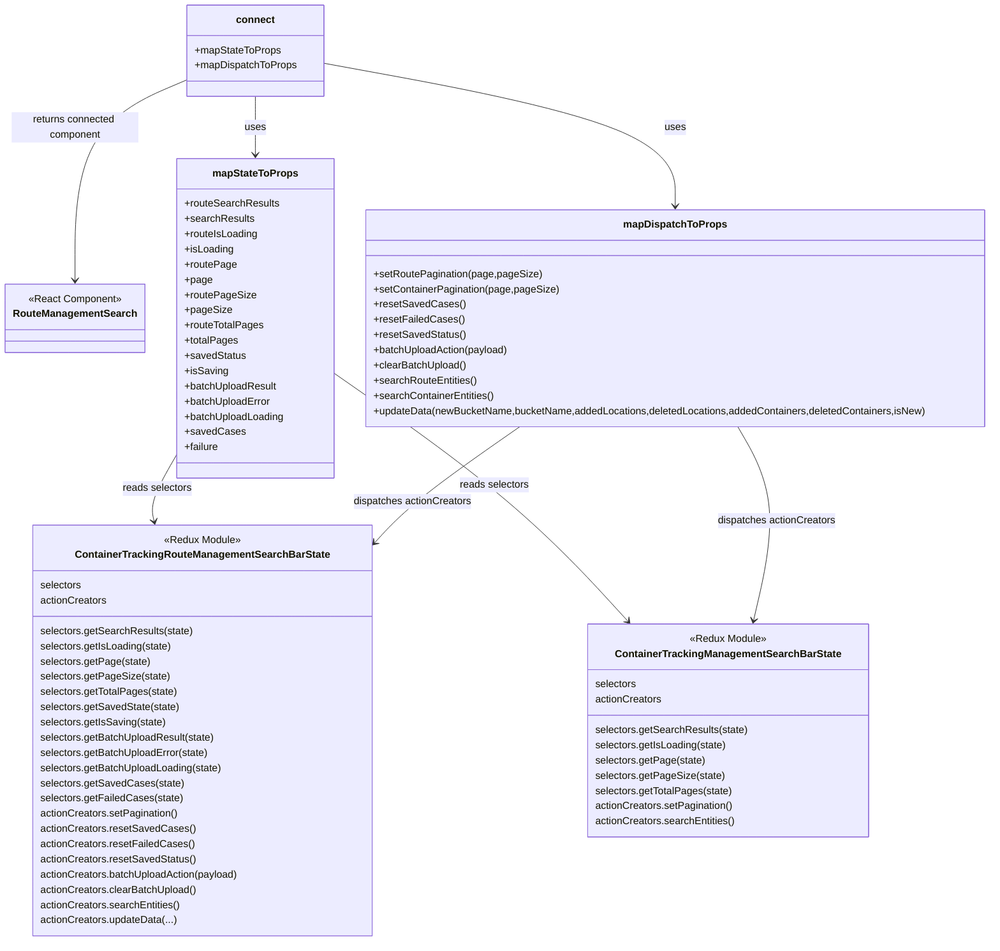

# Diagram: web/portal/src/pages/containertracking/container-management/ContainerManagement.page.container.js

> Auto-generated by Obscura crawlers

## Mermaid

### SVG

<svg id="container" width="1552.5625" xmlns="http://www.w3.org/2000/svg" class="classDiagram" height="1484" viewBox="0 0 1552.5625 1484" role="graphics-document document" aria-roledescription="class"><g><defs><marker id="container_class-aggregationStart" class="marker aggregation class" refX="18" refY="7" markerWidth="190" markerHeight="240" orient="auto"><path d="M 18,7 L9,13 L1,7 L9,1 Z"></path></marker></defs><defs><marker id="container_class-aggregationEnd" class="marker aggregation class" refX="1" refY="7" markerWidth="20" markerHeight="28" orient="auto"><path d="M 18,7 L9,13 L1,7 L9,1 Z"></path></marker></defs><defs><marker id="container_class-extensionStart" class="marker extension class" refX="18" refY="7" markerWidth="190" markerHeight="240" orient="auto"><path d="M 1,7 L18,13 V 1 Z"></path></marker></defs><defs><marker id="container_class-extensionEnd" class="marker extension class" refX="1" refY="7" markerWidth="20" markerHeight="28" orient="auto"><path d="M 1,1 V 13 L18,7 Z"></path></marker></defs><defs><marker id="container_class-compositionStart" class="marker composition class" refX="18" refY="7" markerWidth="190" markerHeight="240" orient="auto"><path d="M 18,7 L9,13 L1,7 L9,1 Z"></path></marker></defs><defs><marker id="container_class-compositionEnd" class="marker composition class" refX="1" refY="7" markerWidth="20" markerHeight="28" orient="auto"><path d="M 18,7 L9,13 L1,7 L9,1 Z"></path></marker></defs><defs><marker id="container_class-dependencyStart" class="marker dependency class" refX="6" refY="7" markerWidth="190" markerHeight="240" orient="auto"><path d="M 5,7 L9,13 L1,7 L9,1 Z"></path></marker></defs><defs><marker id="container_class-dependencyEnd" class="marker dependency class" refX="13" refY="7" markerWidth="20" markerHeight="28" orient="auto"><path d="M 18,7 L9,13 L14,7 L9,1 Z"></path></marker></defs><defs><marker id="container_class-lollipopStart" class="marker lollipop class" refX="13" refY="7" markerWidth="190" markerHeight="240" orient="auto"><circle stroke="black" fill="transparent" cx="7" cy="7" r="6"></circle></marker></defs><defs><marker id="container_class-lollipopEnd" class="marker lollipop class" refX="1" refY="7" markerWidth="190" markerHeight="240" orient="auto"><circle stroke="black" fill="transparent" cx="7" cy="7" r="6"></circle></marker></defs><g class="root"><g class="clusters"></g><g class="edgePaths"><path d="M285.141,126.35L256.493,138.792C227.846,151.234,170.552,176.117,141.905,228.725C113.258,281.333,113.258,361.667,113.258,401.833L113.258,442" id="id_connect_RouteManagementSearch_1" class="edge-thickness-normal edge-pattern-solid relation" style=";;;" data-edge="true" data-et="edge" data-id="id_connect_RouteManagementSearch_1" data-points="W3sieCI6Mjg1LjE0MDYyNSwieSI6MTI2LjM1MDI3OTcxMzQxNjQzfSx7IngiOjExMy4yNTc4MTI1LCJ5IjoyMDF9LHsieCI6MTEzLjI1NzgxMjUsInkiOjQ0OH1d" marker-end="url(#container_class-dependencyEnd)"></path><path d="M391.863,152L391.863,160.167C391.863,168.333,391.863,184.667,391.863,200C391.863,215.333,391.863,229.667,391.863,236.833L391.863,244" id="id_connect_mapStateToProps_2" class="edge-thickness-normal edge-pattern-solid relation" style=";;;" data-edge="true" data-et="edge" data-id="id_connect_mapStateToProps_2" data-points="W3sieCI6MzkxLjg2MzI4MTI1LCJ5IjoxNTJ9LHsieCI6MzkxLjg2MzI4MTI1LCJ5IjoyMDF9LHsieCI6MzkxLjg2MzI4MTI1LCJ5IjoyNTB9XQ==" marker-end="url(#container_class-dependencyEnd)"></path><path d="M498.586,99.477L591.303,116.397C684.02,133.318,869.453,167.159,962.17,204.746C1054.887,242.333,1054.887,283.667,1054.887,304.333L1054.887,325" id="id_connect_mapDispatchToProps_3" class="edge-thickness-normal edge-pattern-solid relation" style=";;;" data-edge="true" data-et="edge" data-id="id_connect_mapDispatchToProps_3" data-points="W3sieCI6NDk4LjU4NTkzNzUsInkiOjk5LjQ3NjU5ODY3NzkzMTM1fSx7IngiOjEwNTQuODg2NzE4NzUsInkiOjIwMX0seyJ4IjoxMDU0Ljg4NjcxODc1LCJ5IjozMzF9XQ==" marker-end="url(#container_class-dependencyEnd)"></path><path d="M268.516,713.166L260.938,726.138C253.361,739.111,238.206,765.055,231.842,783.221C225.479,801.386,227.907,811.772,229.122,816.965L230.336,822.158" id="id_mapStateToProps_ContainerTrackingRouteManagementSearchBarState_4" class="edge-thickness-normal edge-pattern-solid relation" style=";;;" data-edge="true" data-et="edge" data-id="id_mapStateToProps_ContainerTrackingRouteManagementSearchBarState_4" data-points="W3sieCI6MjY4LjUxNTYyNSwieSI6NzEzLjE2NjA3Mjc1MDgzM30seyJ4IjoyMjMuMDUwNzgxMjUsInkiOjc5MX0seyJ4IjoyMzEuNzAxODM3MzQ0MTgyODIsInkiOjgyOH1d" marker-end="url(#container_class-dependencyEnd)"></path><path d="M515.211,587.708L563.973,621.59C612.734,655.472,710.258,723.236,787.882,788.548C865.507,853.86,923.232,916.72,952.095,948.151L980.958,979.581" id="id_mapStateToProps_ContainerTrackingManagementSearchBarState_5" class="edge-thickness-normal edge-pattern-solid relation" style=";;;" data-edge="true" data-et="edge" data-id="id_mapStateToProps_ContainerTrackingManagementSearchBarState_5" data-points="W3sieCI6NTE1LjIxMDkzNzUsInkiOjU4Ny43MDc5NDA4MzExODExfSx7IngiOjgwNy43ODEyNSwieSI6NzkxfSx7IngiOjk4NS4wMTYwNDcwMDQ4NDc3LCJ5Ijo5ODR9XQ==" marker-end="url(#container_class-dependencyEnd)"></path><path d="M808.79,673L780.486,692.667C752.183,712.333,695.576,751.667,656.988,782.533C618.4,813.399,597.831,835.797,587.546,846.997L577.261,858.196" id="id_mapDispatchToProps_ContainerTrackingRouteManagementSearchBarState_6" class="edge-thickness-normal edge-pattern-solid relation" style=";;;" data-edge="true" data-et="edge" data-id="id_mapDispatchToProps_ContainerTrackingRouteManagementSearchBarState_6" data-points="W3sieCI6ODA4Ljc4OTkyNzU1MTkwMzEsInkiOjY3M30seyJ4Ijo2MzguOTY4NzUsInkiOjc5MX0seyJ4Ijo1NzMuMjAzMTI1LCJ5Ijo4NjIuNjE1NTM5NjA5MDM1M31d" marker-end="url(#container_class-dependencyEnd)"></path><path d="M1154.772,673L1166.26,692.667C1177.748,712.333,1200.724,751.667,1204.918,802.526C1209.113,853.386,1194.526,915.772,1187.233,946.965L1179.939,978.158" id="id_mapDispatchToProps_ContainerTrackingManagementSearchBarState_7" class="edge-thickness-normal edge-pattern-solid relation" style=";;;" data-edge="true" data-et="edge" data-id="id_mapDispatchToProps_ContainerTrackingManagementSearchBarState_7" data-points="W3sieCI6MTE1NC43NzIzMTU2MzU4MTMxLCJ5Ijo2NzN9LHsieCI6MTIyMy42OTkyMTg3NSwieSI6NzkxfSx7IngiOjExNzguNTczNDM5NjY0MTI3NCwieSI6OTg0fV0=" marker-end="url(#container_class-dependencyEnd)"></path></g><g class="edgeLabels"><g class="edgeLabel" transform="translate(113.2578125, 201)"><g class="label" data-id="id_connect_RouteManagementSearch_1" transform="translate(-100, -24)"><foreignObject width="200" height="48">

returns connected component

</foreignObject></g></g><g class="edgeLabel" transform="translate(391.86328125, 201)"><g class="label" data-id="id_connect_mapStateToProps_2" transform="translate(-16.4921875, -12)"><foreignObject width="32.984375" height="24">

uses

</foreignObject></g></g><g class="edgeLabel" transform="translate(1054.88671875, 201)"><g class="label" data-id="id_connect_mapDispatchToProps_3" transform="translate(-16.4921875, -12)"><foreignObject width="32.984375" height="24">

uses

</foreignObject></g></g><g class="edgeLabel" transform="translate(236.20048, 768.48827)"><g class="label" data-id="id_mapStateToProps_ContainerTrackingRouteManagementSearchBarState_4" transform="translate(-54.8515625, -12)"><foreignObject width="109.703125" height="24">

reads selectors

</foreignObject></g></g><g class="edgeLabel" transform="translate(769.08864, 764.1145)"><g class="label" data-id="id_mapStateToProps_ContainerTrackingManagementSearchBarState_5" transform="translate(-54.8515625, -12)"><foreignObject width="109.703125" height="24">

reads selectors

</foreignObject></g></g><g class="edgeLabel" transform="translate(683.95551, 759.74101)"><g class="label" data-id="id_mapDispatchToProps_ContainerTrackingRouteManagementSearchBarState_6" transform="translate(-93.9609375, -12)"><foreignObject width="187.921875" height="24">

dispatches actionCreators

</foreignObject></g></g><g class="edgeLabel" transform="translate(1216.69272, 820.96634)"><g class="label" data-id="id_mapDispatchToProps_ContainerTrackingManagementSearchBarState_7" transform="translate(-93.9609375, -12)"><foreignObject width="187.921875" height="24">

dispatches actionCreators

</foreignObject></g></g></g><g class="nodes"><g class="node default" id="classId-RouteManagementSearch-0" transform="translate(113.2578125, 502)"><g class="basic label-container"><path d="M-105.2578125 -54 L105.2578125 -54 L105.2578125 54 L-105.2578125 54" stroke="none" stroke-width="0" fill="#ECECFF" style=""></path><path d="M-105.2578125 -54 C-22.541849023027552 -54, 60.174114453944895 -54, 105.2578125 -54 M-105.2578125 -54 C-25.668308930903805 -54, 53.92119463819239 -54, 105.2578125 -54 M105.2578125 -54 C105.2578125 -24.185325924704756, 105.2578125 5.629348150590488, 105.2578125 54 M105.2578125 -54 C105.2578125 -25.151052040777092, 105.2578125 3.697895918445816, 105.2578125 54 M105.2578125 54 C33.60952099674782 54, -38.03877050650436 54, -105.2578125 54 M105.2578125 54 C60.81263449594137 54, 16.367456491882734 54, -105.2578125 54 M-105.2578125 54 C-105.2578125 21.05225344577405, -105.2578125 -11.895493108451902, -105.2578125 -54 M-105.2578125 54 C-105.2578125 12.361652900681385, -105.2578125 -29.27669419863723, -105.2578125 -54" stroke="#9370DB" stroke-width="1.3" fill="none" stroke-dasharray="0 0" style=""></path></g><g class="annotation-group text" transform="translate(-73.2109375, -30)"><g class="label" style="" transform="translate(0,-12)"><foreignObject width="146.421875" height="24">

«React Component»

</foreignObject></g></g><g class="label-group text" transform="translate(-93.2578125, -6)"><g class="label" style="font-weight: bolder" transform="translate(0,-12)"><foreignObject width="186.515625" height="24">

RouteManagementSearch

</foreignObject></g></g><g class="members-group text" transform="translate(-93.2578125, 42)"></g><g class="methods-group text" transform="translate(-93.2578125, 72)"></g><g class="divider" style=""><path d="M-105.2578125 18 C-61.42499801658129 18, -17.592183533162583 18, 105.2578125 18 M-105.2578125 18 C-24.826014114550702 18, 55.605784270898596 18, 105.2578125 18" stroke="#9370DB" stroke-width="1.3" fill="none" stroke-dasharray="0 0" style=""></path></g><g class="divider" style=""><path d="M-105.2578125 36 C-60.67924856590203 36, -16.100684631804057 36, 105.2578125 36 M-105.2578125 36 C-43.432155913941855 36, 18.39350067211629 36, 105.2578125 36" stroke="#9370DB" stroke-width="1.3" fill="none" stroke-dasharray="0 0" style=""></path></g></g><g class="node default" id="classId-connect-1" transform="translate(391.86328125, 80)"><g class="basic label-container"><path d="M-106.72265625 -72 L106.72265625 -72 L106.72265625 72 L-106.72265625 72" stroke="none" stroke-width="0" fill="#ECECFF" style=""></path><path d="M-106.72265625 -72 C-46.029626574330834 -72, 14.663403101338332 -72, 106.72265625 -72 M-106.72265625 -72 C-21.525170426487293 -72, 63.672315397025415 -72, 106.72265625 -72 M106.72265625 -72 C106.72265625 -17.839813819102474, 106.72265625 36.32037236179505, 106.72265625 72 M106.72265625 -72 C106.72265625 -15.837888790496393, 106.72265625 40.324222419007214, 106.72265625 72 M106.72265625 72 C62.271947426834096 72, 17.821238603668192 72, -106.72265625 72 M106.72265625 72 C28.412156026144686 72, -49.89834419771063 72, -106.72265625 72 M-106.72265625 72 C-106.72265625 39.650645738478936, -106.72265625 7.301291476957871, -106.72265625 -72 M-106.72265625 72 C-106.72265625 19.89357408078007, -106.72265625 -32.21285183843986, -106.72265625 -72" stroke="#9370DB" stroke-width="1.3" fill="none" stroke-dasharray="0 0" style=""></path></g><g class="annotation-group text" transform="translate(0, -48)"></g><g class="label-group text" transform="translate(-28.9140625, -48)"><g class="label" style="font-weight: bolder" transform="translate(0,-12)"><foreignObject width="57.828125" height="24">

connect

</foreignObject></g></g><g class="members-group text" transform="translate(-94.72265625, 0)"><g class="label" style="" transform="translate(0,-12)"><foreignObject width="134.984375" height="24">

+mapStateToProps

</foreignObject></g><g class="label" style="" transform="translate(0,12)"><foreignObject width="160.53125" height="24">

+mapDispatchToProps

</foreignObject></g></g><g class="methods-group text" transform="translate(-94.72265625, 72)"></g><g class="divider" style=""><path d="M-106.72265625 -24 C-63.14404942101542 -24, -19.565442592030834 -24, 106.72265625 -24 M-106.72265625 -24 C-44.88368674807028 -24, 16.955282753859436 -24, 106.72265625 -24" stroke="#9370DB" stroke-width="1.3" fill="none" stroke-dasharray="0 0" style=""></path></g><g class="divider" style=""><path d="M-106.72265625 48 C-58.90316954614185 48, -11.083682842283693 48, 106.72265625 48 M-106.72265625 48 C-40.061208795119015 48, 26.60023865976197 48, 106.72265625 48" stroke="#9370DB" stroke-width="1.3" fill="none" stroke-dasharray="0 0" style=""></path></g></g><g class="node default" id="classId-mapStateToProps-2" transform="translate(391.86328125, 502)"><g class="basic label-container"><path d="M-123.34765625 -252 L123.34765625 -252 L123.34765625 252 L-123.34765625 252" stroke="none" stroke-width="0" fill="#ECECFF" style=""></path><path d="M-123.34765625 -252 C-46.69077475010394 -252, 29.966106749792118 -252, 123.34765625 -252 M-123.34765625 -252 C-41.29489145925349 -252, 40.757873331493016 -252, 123.34765625 -252 M123.34765625 -252 C123.34765625 -102.08047765299534, 123.34765625 47.83904469400932, 123.34765625 252 M123.34765625 -252 C123.34765625 -77.16654317529026, 123.34765625 97.66691364941948, 123.34765625 252 M123.34765625 252 C73.50434310561721 252, 23.661029961234405 252, -123.34765625 252 M123.34765625 252 C36.260174356395154 252, -50.82730753720969 252, -123.34765625 252 M-123.34765625 252 C-123.34765625 85.43371919088213, -123.34765625 -81.13256161823574, -123.34765625 -252 M-123.34765625 252 C-123.34765625 103.87960435683664, -123.34765625 -44.240791286326726, -123.34765625 -252" stroke="#9370DB" stroke-width="1.3" fill="none" stroke-dasharray="0 0" style=""></path></g><g class="annotation-group text" transform="translate(0, -228)"></g><g class="label-group text" transform="translate(-64.7109375, -228)"><g class="label" style="font-weight: bolder" transform="translate(0,-12)"><foreignObject width="129.421875" height="24">

mapStateToProps

</foreignObject></g></g><g class="members-group text" transform="translate(-111.34765625, -180)"><g class="label" style="" transform="translate(0,-12)"><foreignObject width="148.1875" height="24">

+routeSearchResults

</foreignObject></g><g class="label" style="" transform="translate(0,12)"><foreignObject width="108.328125" height="24">

+searchResults

</foreignObject></g><g class="label" style="" transform="translate(0,36)"><foreignObject width="116.03125" height="24">

+routeIsLoading

</foreignObject></g><g class="label" style="" transform="translate(0,60)"><foreignObject width="77.203125" height="24">

+isLoading

</foreignObject></g><g class="label" style="" transform="translate(0,84)"><foreignObject width="80.34375" height="24">

+routePage

</foreignObject></g><g class="label" style="" transform="translate(0,108)"><foreignObject width="42.65625" height="24">

+page

</foreignObject></g><g class="label" style="" transform="translate(0,132)"><foreignObject width="109.171875" height="24">

+routePageSize

</foreignObject></g><g class="label" style="" transform="translate(0,156)"><foreignObject width="71.5" height="24">

+pageSize

</foreignObject></g><g class="label" style="" transform="translate(0,180)"><foreignObject width="123.453125" height="24">

+routeTotalPages

</foreignObject></g><g class="label" style="" transform="translate(0,204)"><foreignObject width="82.90625" height="24">

+totalPages

</foreignObject></g><g class="label" style="" transform="translate(0,228)"><foreignObject width="95.515625" height="24">

+savedStatus

</foreignObject></g><g class="label" style="" transform="translate(0,252)"><foreignObject width="67.234375" height="24">

+isSaving

</foreignObject></g><g class="label" style="" transform="translate(0,276)"><foreignObject width="146.171875" height="24">

+batchUploadResult

</foreignObject></g><g class="label" style="" transform="translate(0,300)"><foreignObject width="136.546875" height="24">

+batchUploadError

</foreignObject></g><g class="label" style="" transform="translate(0,324)"><foreignObject width="157.984375" height="24">

+batchUploadLoading

</foreignObject></g><g class="label" style="" transform="translate(0,348)"><foreignObject width="90.875" height="24">

+savedCases

</foreignObject></g><g class="label" style="" transform="translate(0,372)"><foreignObject width="54.390625" height="24">

+failure

</foreignObject></g></g><g class="methods-group text" transform="translate(-111.34765625, 252)"></g><g class="divider" style=""><path d="M-123.34765625 -204 C-70.73542776735437 -204, -18.123199284708733 -204, 123.34765625 -204 M-123.34765625 -204 C-49.18161785384777 -204, 24.984420542304463 -204, 123.34765625 -204" stroke="#9370DB" stroke-width="1.3" fill="none" stroke-dasharray="0 0" style=""></path></g><g class="divider" style=""><path d="M-123.34765625 228 C-72.79265450207953 228, -22.237652754159043 228, 123.34765625 228 M-123.34765625 228 C-29.000670115333023 228, 65.34631601933395 228, 123.34765625 228" stroke="#9370DB" stroke-width="1.3" fill="none" stroke-dasharray="0 0" style=""></path></g></g><g class="node default" id="classId-mapDispatchToProps-3" transform="translate(1054.88671875, 502)"><g class="basic label-container"><path d="M-489.67578125 -171 L489.67578125 -171 L489.67578125 171 L-489.67578125 171" stroke="none" stroke-width="0" fill="#ECECFF" style=""></path><path d="M-489.67578125 -171 C-260.17080363543033 -171, -30.665826020860663 -171, 489.67578125 -171 M-489.67578125 -171 C-198.86229808263636 -171, 91.95118508472729 -171, 489.67578125 -171 M489.67578125 -171 C489.67578125 -69.00387458309986, 489.67578125 32.992250833800284, 489.67578125 171 M489.67578125 -171 C489.67578125 -50.6235206945868, 489.67578125 69.7529586108264, 489.67578125 171 M489.67578125 171 C113.09054030046354 171, -263.4947006490729 171, -489.67578125 171 M489.67578125 171 C242.35406627672103 171, -4.967648696557944 171, -489.67578125 171 M-489.67578125 171 C-489.67578125 57.593089776051215, -489.67578125 -55.81382044789757, -489.67578125 -171 M-489.67578125 171 C-489.67578125 42.66318872475878, -489.67578125 -85.67362255048243, -489.67578125 -171" stroke="#9370DB" stroke-width="1.3" fill="none" stroke-dasharray="0 0" style=""></path></g><g class="annotation-group text" transform="translate(0, -147)"></g><g class="label-group text" transform="translate(-77.1953125, -147)"><g class="label" style="font-weight: bolder" transform="translate(0,-12)"><foreignObject width="154.390625" height="24">

mapDispatchToProps

</foreignObject></g></g><g class="members-group text" transform="translate(-477.67578125, -99)"></g><g class="methods-group text" transform="translate(-477.67578125, -69)"><g class="label" style="" transform="translate(0,-12)"><foreignObject width="261.421875" height="24">

+setRoutePagination(page,pageSize)

</foreignObject></g><g class="label" style="" transform="translate(0,12)"><foreignObject width="289.578125" height="24">

+setContainerPagination(page,pageSize)

</foreignObject></g><g class="label" style="" transform="translate(0,36)"><foreignObject width="139.03125" height="24">

+resetSavedCases()

</foreignObject></g><g class="label" style="" transform="translate(0,60)"><foreignObject width="138.765625" height="24">

+resetFailedCases()

</foreignObject></g><g class="label" style="" transform="translate(0,84)"><foreignObject width="143.671875" height="24">

+resetSavedStatus()

</foreignObject></g><g class="label" style="" transform="translate(0,108)"><foreignObject width="214.703125" height="24">

+batchUploadAction(payload)

</foreignObject></g><g class="label" style="" transform="translate(0,132)"><foreignObject width="147.203125" height="24">

+clearBatchUpload()

</foreignObject></g><g class="label" style="" transform="translate(0,156)"><foreignObject width="162.71875" height="24">

+searchRouteEntities()

</foreignObject></g><g class="label" style="" transform="translate(0,180)"><foreignObject width="190.875" height="24">

+searchContainerEntities()

</foreignObject></g><g class="label" style="" transform="translate(0,204)"><foreignObject width="878.15625" height="24">

+updateData(newBucketName,bucketName,addedLocations,deletedLocations,addedContainers,deletedContainers,isNew)

</foreignObject></g></g><g class="divider" style=""><path d="M-489.67578125 -123 C-99.15399162293858 -123, 291.36779800412285 -123, 489.67578125 -123 M-489.67578125 -123 C-233.6256075123875 -123, 22.42456622522502 -123, 489.67578125 -123" stroke="#9370DB" stroke-width="1.3" fill="none" stroke-dasharray="0 0" style=""></path></g><g class="divider" style=""><path d="M-489.67578125 -99 C-142.51389604561518 -99, 204.64798915876963 -99, 489.67578125 -99 M-489.67578125 -99 C-225.85343971044762 -99, 37.968901829104766 -99, 489.67578125 -99" stroke="#9370DB" stroke-width="1.3" fill="none" stroke-dasharray="0 0" style=""></path></g></g><g class="node default" id="classId-ContainerTrackingRouteManagementSearchBarState-4" transform="translate(307.45703125, 1152)"><g class="basic label-container"><path d="M-265.74609375 -324 L265.74609375 -324 L265.74609375 324 L-265.74609375 324" stroke="none" stroke-width="0" fill="#ECECFF" style=""></path><path d="M-265.74609375 -324 C-59.391962936458896 -324, 146.9621678770822 -324, 265.74609375 -324 M-265.74609375 -324 C-89.89935988509151 -324, 85.94737397981697 -324, 265.74609375 -324 M265.74609375 -324 C265.74609375 -179.9174322995807, 265.74609375 -35.83486459916139, 265.74609375 324 M265.74609375 -324 C265.74609375 -189.47667702175772, 265.74609375 -54.953354043515446, 265.74609375 324 M265.74609375 324 C76.81501674150442 324, -112.11606026699116 324, -265.74609375 324 M265.74609375 324 C102.43976587973916 324, -60.86656199052169 324, -265.74609375 324 M-265.74609375 324 C-265.74609375 183.88758964440592, -265.74609375 43.77517928881184, -265.74609375 -324 M-265.74609375 324 C-265.74609375 77.60127647115269, -265.74609375 -168.79744705769463, -265.74609375 -324" stroke="#9370DB" stroke-width="1.3" fill="none" stroke-dasharray="0 0" style=""></path></g><g class="annotation-group text" transform="translate(-60.4921875, -300)"><g class="label" style="" transform="translate(0,-12)"><foreignObject width="120.984375" height="24">

«Redux Module»

</foreignObject></g></g><g class="label-group text" transform="translate(-191.6171875, -276)"><g class="label" style="font-weight: bolder" transform="translate(0,-12)"><foreignObject width="383.234375" height="24">

ContainerTrackingRouteManagementSearchBarState

</foreignObject></g></g><g class="members-group text" transform="translate(-253.74609375, -228)"><g class="label" style="" transform="translate(0,-12)"><foreignObject width="65.46875" height="24">

selectors

</foreignObject></g><g class="label" style="" transform="translate(0,12)"><foreignObject width="105.34375" height="24">

actionCreators

</foreignObject></g></g><g class="methods-group text" transform="translate(-253.74609375, -156)"><g class="label" style="" transform="translate(0,-12)"><foreignObject width="239.75" height="24">

selectors.getSearchResults(state)

</foreignObject></g><g class="label" style="" transform="translate(0,12)"><foreignObject width="207.59375" height="24">

selectors.getIsLoading(state)

</foreignObject></g><g class="label" style="" transform="translate(0,36)"><foreignObject width="171.90625" height="24">

selectors.getPage(state)

</foreignObject></g><g class="label" style="" transform="translate(0,60)"><foreignObject width="200.75" height="24">

selectors.getPageSize(state)

</foreignObject></g><g class="label" style="" transform="translate(0,84)"><foreignObject width="215.015625" height="24">

selectors.getTotalPages(state)

</foreignObject></g><g class="label" style="" transform="translate(0,108)"><foreignObject width="218.796875" height="24">

selectors.getSavedState(state)

</foreignObject></g><g class="label" style="" transform="translate(0,132)"><foreignObject width="197.625" height="24">

selectors.getIsSaving(state)

</foreignObject></g><g class="label" style="" transform="translate(0,156)"><foreignObject width="276.734375" height="24">

selectors.getBatchUploadResult(state)

</foreignObject></g><g class="label" style="" transform="translate(0,180)"><foreignObject width="267.109375" height="24">

selectors.getBatchUploadError(state)

</foreignObject></g><g class="label" style="" transform="translate(0,204)"><foreignObject width="288.546875" height="24">

selectors.getBatchUploadLoading(state)

</foreignObject></g><g class="label" style="" transform="translate(0,228)"><foreignObject width="222.453125" height="24">

selectors.getSavedCases(state)

</foreignObject></g><g class="label" style="" transform="translate(0,252)"><foreignObject width="222.1875" height="24">

selectors.getFailedCases(state)

</foreignObject></g><g class="label" style="" transform="translate(0,276)"><foreignObject width="218.453125" height="24">

actionCreators.setPagination()

</foreignObject></g><g class="label" style="" transform="translate(0,300)"><foreignObject width="240.21875" height="24">

actionCreators.resetSavedCases()

</foreignObject></g><g class="label" style="" transform="translate(0,324)"><foreignObject width="239.9375" height="24">

actionCreators.resetFailedCases()

</foreignObject></g><g class="label" style="" transform="translate(0,348)"><foreignObject width="244.859375" height="24">

actionCreators.resetSavedStatus()

</foreignObject></g><g class="label" style="" transform="translate(0,372)"><foreignObject width="315.875" height="24">

actionCreators.batchUploadAction(payload)

</foreignObject></g><g class="label" style="" transform="translate(0,396)"><foreignObject width="248.234375" height="24">

actionCreators.clearBatchUpload()

</foreignObject></g><g class="label" style="" transform="translate(0,420)"><foreignObject width="221.609375" height="24">

actionCreators.searchEntities()

</foreignObject></g><g class="label" style="" transform="translate(0,444)"><foreignObject width="215.46875" height="24">

actionCreators.updateData(...)

</foreignObject></g></g><g class="divider" style=""><path d="M-265.74609375 -252 C-84.76800590849246 -252, 96.21008193301509 -252, 265.74609375 -252 M-265.74609375 -252 C-143.48120422093763 -252, -21.216314691875255 -252, 265.74609375 -252" stroke="#9370DB" stroke-width="1.3" fill="none" stroke-dasharray="0 0" style=""></path></g><g class="divider" style=""><path d="M-265.74609375 -180 C-114.126777428835 -180, 37.49253889233 -180, 265.74609375 -180 M-265.74609375 -180 C-128.33410674910658 -180, 9.077880251786837 -180, 265.74609375 -180" stroke="#9370DB" stroke-width="1.3" fill="none" stroke-dasharray="0 0" style=""></path></g></g><g class="node default" id="classId-ContainerTrackingManagementSearchBarState-5" transform="translate(1139.29296875, 1152)"><g class="basic label-container"><path d="M-216.97265625 -168 L216.97265625 -168 L216.97265625 168 L-216.97265625 168" stroke="none" stroke-width="0" fill="#ECECFF" style=""></path><path d="M-216.97265625 -168 C-54.36740012724579 -168, 108.23785599550843 -168, 216.97265625 -168 M-216.97265625 -168 C-99.62722918781071 -168, 17.718197874378575 -168, 216.97265625 -168 M216.97265625 -168 C216.97265625 -90.76400103869277, 216.97265625 -13.528002077385537, 216.97265625 168 M216.97265625 -168 C216.97265625 -76.93082967170969, 216.97265625 14.138340656580624, 216.97265625 168 M216.97265625 168 C100.50398595132133 168, -15.964684347357348 168, -216.97265625 168 M216.97265625 168 C122.6141946383455 168, 28.25573302669099 168, -216.97265625 168 M-216.97265625 168 C-216.97265625 96.61945479620145, -216.97265625 25.238909592402905, -216.97265625 -168 M-216.97265625 168 C-216.97265625 66.60730500149629, -216.97265625 -34.78538999700743, -216.97265625 -168" stroke="#9370DB" stroke-width="1.3" fill="none" stroke-dasharray="0 0" style=""></path></g><g class="annotation-group text" transform="translate(-60.4921875, -144)"><g class="label" style="" transform="translate(0,-12)"><foreignObject width="120.984375" height="24">

«Redux Module»

</foreignObject></g></g><g class="label-group text" transform="translate(-170.1953125, -120)"><g class="label" style="font-weight: bolder" transform="translate(0,-12)"><foreignObject width="340.390625" height="24">

ContainerTrackingManagementSearchBarState

</foreignObject></g></g><g class="members-group text" transform="translate(-204.97265625, -72)"><g class="label" style="" transform="translate(0,-12)"><foreignObject width="65.46875" height="24">

selectors

</foreignObject></g><g class="label" style="" transform="translate(0,12)"><foreignObject width="105.34375" height="24">

actionCreators

</foreignObject></g></g><g class="methods-group text" transform="translate(-204.97265625, 0)"><g class="label" style="" transform="translate(0,-12)"><foreignObject width="239.75" height="24">

selectors.getSearchResults(state)

</foreignObject></g><g class="label" style="" transform="translate(0,12)"><foreignObject width="207.59375" height="24">

selectors.getIsLoading(state)

</foreignObject></g><g class="label" style="" transform="translate(0,36)"><foreignObject width="171.90625" height="24">

selectors.getPage(state)

</foreignObject></g><g class="label" style="" transform="translate(0,60)"><foreignObject width="200.75" height="24">

selectors.getPageSize(state)

</foreignObject></g><g class="label" style="" transform="translate(0,84)"><foreignObject width="215.015625" height="24">

selectors.getTotalPages(state)

</foreignObject></g><g class="label" style="" transform="translate(0,108)"><foreignObject width="218.453125" height="24">

actionCreators.setPagination()

</foreignObject></g><g class="label" style="" transform="translate(0,132)"><foreignObject width="221.609375" height="24">

actionCreators.searchEntities()

</foreignObject></g></g><g class="divider" style=""><path d="M-216.97265625 -96 C-78.00301225290895 -96, 60.96663174418211 -96, 216.97265625 -96 M-216.97265625 -96 C-67.24415849831664 -96, 82.48433925336673 -96, 216.97265625 -96" stroke="#9370DB" stroke-width="1.3" fill="none" stroke-dasharray="0 0" style=""></path></g><g class="divider" style=""><path d="M-216.97265625 -24 C-105.19849356442124 -24, 6.575669121157517 -24, 216.97265625 -24 M-216.97265625 -24 C-121.50233137721594 -24, -26.032006504431877 -24, 216.97265625 -24" stroke="#9370DB" stroke-width="1.3" fill="none" stroke-dasharray="0 0" style=""></path></g></g></g></g></g></svg>
