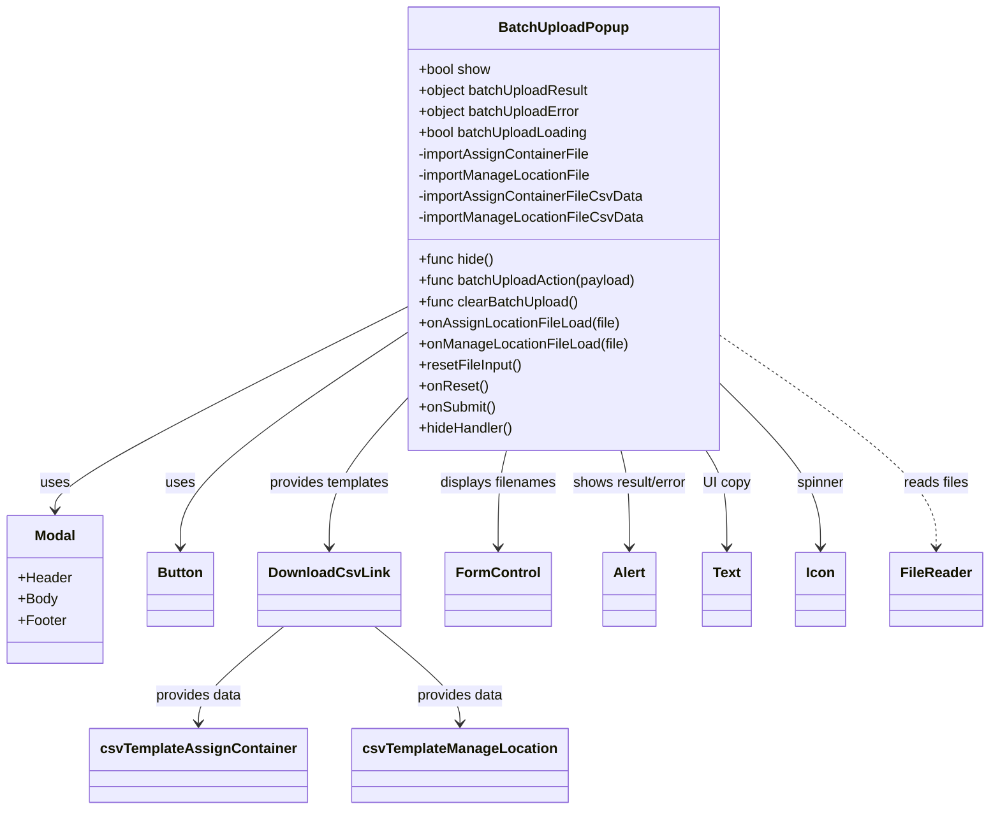

# Diagram: web/portal/src/pages/containertracking/container-management/components/route-management/BatchUpload.modal.js


> Auto-generated by Obscura crawlers

## Diagram 1



### SVG

<svg id="container" width="1108.2890625" xmlns="http://www.w3.org/2000/svg" class="classDiagram" height="920" viewBox="0 0 1108.2890625 920" role="graphics-document document" aria-roledescription="class"><style>#container{font-family:"trebuchet ms",verdana,arial,sans-serif;font-size:16px;fill:#333;}@keyframes edge-animation-frame{from{stroke-dashoffset:0;}}@keyframes dash{to{stroke-dashoffset:0;}}#container .edge-animation-slow{stroke-dasharray:9,5!important;stroke-dashoffset:900;animation:dash 50s linear infinite;stroke-linecap:round;}#container .edge-animation-fast{stroke-dasharray:9,5!important;stroke-dashoffset:900;animation:dash 20s linear infinite;stroke-linecap:round;}#container .error-icon{fill:#552222;}#container .error-text{fill:#552222;stroke:#552222;}#container .edge-thickness-normal{stroke-width:1px;}#container .edge-thickness-thick{stroke-width:3.5px;}#container .edge-pattern-solid{stroke-dasharray:0;}#container .edge-thickness-invisible{stroke-width:0;fill:none;}#container .edge-pattern-dashed{stroke-dasharray:3;}#container .edge-pattern-dotted{stroke-dasharray:2;}#container .marker{fill:#333333;stroke:#333333;}#container .marker.cross{stroke:#333333;}#container svg{font-family:"trebuchet ms",verdana,arial,sans-serif;font-size:16px;}#container p{margin:0;}#container g.classGroup text{fill:#9370DB;stroke:none;font-family:"trebuchet ms",verdana,arial,sans-serif;font-size:10px;}#container g.classGroup text .title{font-weight:bolder;}#container .nodeLabel,#container .edgeLabel{color:#131300;}#container .edgeLabel .label rect{fill:#ECECFF;}#container .label text{fill:#131300;}#container .labelBkg{background:#ECECFF;}#container .edgeLabel .label span{background:#ECECFF;}#container .classTitle{font-weight:bolder;}#container .node rect,#container .node circle,#container .node ellipse,#container .node polygon,#container .node path{fill:#ECECFF;stroke:#9370DB;stroke-width:1px;}#container .divider{stroke:#9370DB;stroke-width:1;}#container g.clickable{cursor:pointer;}#container g.classGroup rect{fill:#ECECFF;stroke:#9370DB;}#container g.classGroup line{stroke:#9370DB;stroke-width:1;}#container .classLabel .box{stroke:none;stroke-width:0;fill:#ECECFF;opacity:0.5;}#container .classLabel .label{fill:#9370DB;font-size:10px;}#container .relation{stroke:#333333;stroke-width:1;fill:none;}#container .dashed-line{stroke-dasharray:3;}#container .dotted-line{stroke-dasharray:1 2;}#container #compositionStart,#container .composition{fill:#333333!important;stroke:#333333!important;stroke-width:1;}#container #compositionEnd,#container .composition{fill:#333333!important;stroke:#333333!important;stroke-width:1;}#container #dependencyStart,#container .dependency{fill:#333333!important;stroke:#333333!important;stroke-width:1;}#container #dependencyStart,#container .dependency{fill:#333333!important;stroke:#333333!important;stroke-width:1;}#container #extensionStart,#container .extension{fill:transparent!important;stroke:#333333!important;stroke-width:1;}#container #extensionEnd,#container .extension{fill:transparent!important;stroke:#333333!important;stroke-width:1;}#container #aggregationStart,#container .aggregation{fill:transparent!important;stroke:#333333!important;stroke-width:1;}#container #aggregationEnd,#container .aggregation{fill:transparent!important;stroke:#333333!important;stroke-width:1;}#container #lollipopStart,#container .lollipop{fill:#ECECFF!important;stroke:#333333!important;stroke-width:1;}#container #lollipopEnd,#container .lollipop{fill:#ECECFF!important;stroke:#333333!important;stroke-width:1;}#container .edgeTerminals{font-size:11px;line-height:initial;}#container .classTitleText{text-anchor:middle;font-size:18px;fill:#333;}#container .label-icon{display:inline-block;height:1em;overflow:visible;vertical-align:-0.125em;}#container .node .label-icon path{fill:currentColor;stroke:revert;stroke-width:revert;}#container :root{--mermaid-font-family:"trebuchet ms",verdana,arial,sans-serif;}</style><g><defs><marker id="container_class-aggregationStart" class="marker aggregation class" refX="18" refY="7" markerWidth="190" markerHeight="240" orient="auto"><path d="M 18,7 L9,13 L1,7 L9,1 Z"></path></marker></defs><defs><marker id="container_class-aggregationEnd" class="marker aggregation class" refX="1" refY="7" markerWidth="20" markerHeight="28" orient="auto"><path d="M 18,7 L9,13 L1,7 L9,1 Z"></path></marker></defs><defs><marker id="container_class-extensionStart" class="marker extension class" refX="18" refY="7" markerWidth="190" markerHeight="240" orient="auto"><path d="M 1,7 L18,13 V 1 Z"></path></marker></defs><defs><marker id="container_class-extensionEnd" class="marker extension class" refX="1" refY="7" markerWidth="20" markerHeight="28" orient="auto"><path d="M 1,1 V 13 L18,7 Z"></path></marker></defs><defs><marker id="container_class-compositionStart" class="marker composition class" refX="18" refY="7" markerWidth="190" markerHeight="240" orient="auto"><path d="M 18,7 L9,13 L1,7 L9,1 Z"></path></marker></defs><defs><marker id="container_class-compositionEnd" class="marker composition class" refX="1" refY="7" markerWidth="20" markerHeight="28" orient="auto"><path d="M 18,7 L9,13 L1,7 L9,1 Z"></path></marker></defs><defs><marker id="container_class-dependencyStart" class="marker dependency class" refX="6" refY="7" markerWidth="190" markerHeight="240" orient="auto"><path d="M 5,7 L9,13 L1,7 L9,1 Z"></path></marker></defs><defs><marker id="container_class-dependencyEnd" class="marker dependency class" refX="13" refY="7" markerWidth="20" markerHeight="28" orient="auto"><path d="M 18,7 L9,13 L14,7 L9,1 Z"></path></marker></defs><defs><marker id="container_class-lollipopStart" class="marker lollipop class" refX="13" refY="7" markerWidth="190" markerHeight="240" orient="auto"><circle stroke="black" fill="transparent" cx="7" cy="7" r="6"></circle></marker></defs><defs><marker id="container_class-lollipopEnd" class="marker lollipop class" refX="1" refY="7" markerWidth="190" markerHeight="240" orient="auto"><circle stroke="black" fill="transparent" cx="7" cy="7" r="6"></circle></marker></defs><g class="root"><g class="clusters"></g><g class="edgePaths"><path d="M450.813,349.59L385.93,382.825C321.048,416.06,191.284,482.53,126.402,520.932C61.52,559.333,61.52,569.667,61.52,574.833L61.52,580" id="id_BatchUploadPopup_Modal_1" class="edge-thickness-normal edge-pattern-solid relation" style=";;;" data-edge="true" data-et="edge" data-id="id_BatchUploadPopup_Modal_1" data-points="W3sieCI6NDUwLjgxMjUsInkiOjM0OS41ODk1Mzk3ODY2MTM4NH0seyJ4Ijo2MS41MTk1MzEyNSwieSI6NTQ5fSx7IngiOjYxLjUxOTUzMTI1LCJ5Ijo1ODZ9XQ==" marker-end="url(#container_class-dependencyEnd)"></path><path d="M450.813,379.258L409.323,407.548C367.833,435.838,284.854,492.419,243.365,532.876C201.875,573.333,201.875,597.667,201.875,609.833L201.875,622" id="id_BatchUploadPopup_Button_2" class="edge-thickness-normal edge-pattern-solid relation" style=";;;" data-edge="true" data-et="edge" data-id="id_BatchUploadPopup_Button_2" data-points="W3sieCI6NDUwLjgxMjUsInkiOjM3OS4yNTc1ODA1MDU0Mjg0NX0seyJ4IjoyMDEuODc1LCJ5Ijo1NDl9LHsieCI6MjAxLjg3NSwieSI6NjI4fV0=" marker-end="url(#container_class-dependencyEnd)"></path><path d="M450.813,453.923L436.521,469.769C422.229,485.615,393.646,517.308,379.354,545.32C365.063,573.333,365.063,597.667,365.063,609.833L365.063,622" id="id_BatchUploadPopup_DownloadCsvLink_3" class="edge-thickness-normal edge-pattern-solid relation" style=";;;" data-edge="true" data-et="edge" data-id="id_BatchUploadPopup_DownloadCsvLink_3" data-points="W3sieCI6NDUwLjgxMjUsInkiOjQ1My45MjI2OTg3OTgwNjk3NX0seyJ4IjozNjUuMDYyNSwieSI6NTQ5fSx7IngiOjM2NS4wNjI1LCJ5Ijo2Mjh9XQ==" marker-end="url(#container_class-dependencyEnd)"></path><path d="M558.392,512L556.745,518.167C555.097,524.333,551.803,536.667,550.155,555C548.508,573.333,548.508,597.667,548.508,609.833L548.508,622" id="id_BatchUploadPopup_FormControl_4" class="edge-thickness-normal edge-pattern-solid relation" style=";;;" data-edge="true" data-et="edge" data-id="id_BatchUploadPopup_FormControl_4" data-points="W3sieCI6NTU4LjM5MTk0OTYxMDcyNjcsInkiOjUxMn0seyJ4Ijo1NDguNTA3ODEyNSwieSI6NTQ5fSx7IngiOjU0OC41MDc4MTI1LCJ5Ijo2Mjh9XQ==" marker-end="url(#container_class-dependencyEnd)"></path><path d="M693.03,512L694.677,518.167C696.325,524.333,699.619,536.667,701.267,555C702.914,573.333,702.914,597.667,702.914,609.833L702.914,622" id="id_BatchUploadPopup_Alert_5" class="edge-thickness-normal edge-pattern-solid relation" style=";;;" data-edge="true" data-et="edge" data-id="id_BatchUploadPopup_Alert_5" data-points="W3sieCI6NjkzLjAyOTkyNTM4OTI3MzMsInkiOjUxMn0seyJ4Ijo3MDIuOTE0MDYyNSwieSI6NTQ5fSx7IngiOjcwMi45MTQwNjI1LCJ5Ijo2Mjh9XQ==" marker-end="url(#container_class-dependencyEnd)"></path><path d="M792.537,512L796.619,518.167C800.702,524.333,808.866,536.667,812.949,555C817.031,573.333,817.031,597.667,817.031,609.833L817.031,622" id="id_BatchUploadPopup_Text_6" class="edge-thickness-normal edge-pattern-solid relation" style=";;;" data-edge="true" data-et="edge" data-id="id_BatchUploadPopup_Text_6" data-points="W3sieCI6NzkyLjUzNjk1MzkzNTk4NjIsInkiOjUxMn0seyJ4Ijo4MTcuMDMxMjUsInkiOjU0OX0seyJ4Ijo4MTcuMDMxMjUsInkiOjYyOH1d" marker-end="url(#container_class-dependencyEnd)"></path><path d="M800.609,430.758L820.794,450.465C840.979,470.172,881.349,509.586,901.534,541.46C921.719,573.333,921.719,597.667,921.719,609.833L921.719,622" id="id_BatchUploadPopup_Icon_7" class="edge-thickness-normal edge-pattern-solid relation" style=";;;" data-edge="true" data-et="edge" data-id="id_BatchUploadPopup_Icon_7" data-points="W3sieCI6ODAwLjYwOTM3NSwieSI6NDMwLjc1NzgxODg5MjAyNjd9LHsieCI6OTIxLjcxODc1LCJ5Ijo1NDl9LHsieCI6OTIxLjcxODc1LCJ5Ijo2Mjh9XQ==" marker-end="url(#container_class-dependencyEnd)"></path><path d="M800.609,379.227L842.117,407.522C883.625,435.818,966.641,492.409,1008.148,532.871C1049.656,573.333,1049.656,597.667,1049.656,609.833L1049.656,622" id="id_BatchUploadPopup_FileReader_8" class="edge-thickness-normal edge-pattern-dashed relation" style=";;;" data-edge="true" data-et="edge" data-id="id_BatchUploadPopup_FileReader_8" data-points="W3sieCI6ODAwLjYwOTM3NSwieSI6Mzc5LjIyNjgxMjg2MjgwMjk0fSx7IngiOjEwNDkuNjU2MjUsInkiOjU0OX0seyJ4IjoxMDQ5LjY1NjI1LCJ5Ijo2Mjh9XQ==" marker-end="url(#container_class-dependencyEnd)"></path><path d="M315.776,712L300.325,725.167C284.874,738.333,253.972,764.667,238.521,783C223.07,801.333,223.07,811.667,223.07,816.833L223.07,822" id="id_DownloadCsvLink_csvTemplateAssignContainer_9" class="edge-thickness-normal edge-pattern-solid relation" style=";;;" data-edge="true" data-et="edge" data-id="id_DownloadCsvLink_csvTemplateAssignContainer_9" data-points="W3sieCI6MzE1Ljc3NTk1NTU3ODUxMjM3LCJ5Ijo3MTJ9LHsieCI6MjIzLjA3MDMxMjUsInkiOjc5MX0seyJ4IjoyMjMuMDcwMzEyNSwieSI6ODI4fV0=" marker-end="url(#container_class-dependencyEnd)"></path><path d="M414.349,712L429.8,725.167C445.251,738.333,476.153,764.667,491.604,783C507.055,801.333,507.055,811.667,507.055,816.833L507.055,822" id="id_DownloadCsvLink_csvTemplateManageLocation_10" class="edge-thickness-normal edge-pattern-solid relation" style=";;;" data-edge="true" data-et="edge" data-id="id_DownloadCsvLink_csvTemplateManageLocation_10" data-points="W3sieCI6NDE0LjM0OTA0NDQyMTQ4NzYzLCJ5Ijo3MTJ9LHsieCI6NTA3LjA1NDY4NzUsInkiOjc5MX0seyJ4Ijo1MDcuMDU0Njg3NSwieSI6ODI4fV0=" marker-end="url(#container_class-dependencyEnd)"></path></g><g class="edgeLabels"><g class="edgeLabel" transform="translate(61.51953125, 549)"><g class="label" data-id="id_BatchUploadPopup_Modal_1" transform="translate(-16.4921875, -12)"><foreignObject width="32.984375" height="24"><div xmlns="http://www.w3.org/1999/xhtml" class="labelBkg" style="display: table-cell; white-space: nowrap; line-height: 1.5; max-width: 200px; text-align: center;"><span class="edgeLabel"><p>uses</p></span></div></foreignObject></g></g><g class="edgeLabel" transform="translate(201.875, 549)"><g class="label" data-id="id_BatchUploadPopup_Button_2" transform="translate(-16.4921875, -12)"><foreignObject width="32.984375" height="24"><div xmlns="http://www.w3.org/1999/xhtml" class="labelBkg" style="display: table-cell; white-space: nowrap; line-height: 1.5; max-width: 200px; text-align: center;"><span class="edgeLabel"><p>uses</p></span></div></foreignObject></g></g><g class="edgeLabel" transform="translate(365.0625, 549)"><g class="label" data-id="id_BatchUploadPopup_DownloadCsvLink_3" transform="translate(-69.6953125, -12)"><foreignObject width="139.390625" height="24"><div xmlns="http://www.w3.org/1999/xhtml" class="labelBkg" style="display: table-cell; white-space: nowrap; line-height: 1.5; max-width: 200px; text-align: center;"><span class="edgeLabel"><p>provides templates</p></span></div></foreignObject></g></g><g class="edgeLabel" transform="translate(548.5078125, 549)"><g class="label" data-id="id_BatchUploadPopup_FormControl_4" transform="translate(-67.0625, -12)"><foreignObject width="134.125" height="24"><div xmlns="http://www.w3.org/1999/xhtml" class="labelBkg" style="display: table-cell; white-space: nowrap; line-height: 1.5; max-width: 200px; text-align: center;"><span class="edgeLabel"><p>displays filenames</p></span></div></foreignObject></g></g><g class="edgeLabel" transform="translate(702.9140625, 549)"><g class="label" data-id="id_BatchUploadPopup_Alert_5" transform="translate(-67.34375, -12)"><foreignObject width="134.6875" height="24"><div xmlns="http://www.w3.org/1999/xhtml" class="labelBkg" style="display: table-cell; white-space: nowrap; line-height: 1.5; max-width: 200px; text-align: center;"><span class="edgeLabel"><p>shows result/error</p></span></div></foreignObject></g></g><g class="edgeLabel" transform="translate(817.03125, 549)"><g class="label" data-id="id_BatchUploadPopup_Text_6" transform="translate(-26.7734375, -12)"><foreignObject width="53.546875" height="24"><div xmlns="http://www.w3.org/1999/xhtml" class="labelBkg" style="display: table-cell; white-space: nowrap; line-height: 1.5; max-width: 200px; text-align: center;"><span class="edgeLabel"><p>UI copy</p></span></div></foreignObject></g></g><g class="edgeLabel" transform="translate(921.71875, 549)"><g class="label" data-id="id_BatchUploadPopup_Icon_7" transform="translate(-27.5703125, -12)"><foreignObject width="55.140625" height="24"><div xmlns="http://www.w3.org/1999/xhtml" class="labelBkg" style="display: table-cell; white-space: nowrap; line-height: 1.5; max-width: 200px; text-align: center;"><span class="edgeLabel"><p>spinner</p></span></div></foreignObject></g></g><g class="edgeLabel" transform="translate(1049.65625, 549)"><g class="label" data-id="id_BatchUploadPopup_FileReader_8" transform="translate(-37.125, -12)"><foreignObject width="74.25" height="24"><div xmlns="http://www.w3.org/1999/xhtml" class="labelBkg" style="display: table-cell; white-space: nowrap; line-height: 1.5; max-width: 200px; text-align: center;"><span class="edgeLabel"><p>reads files</p></span></div></foreignObject></g></g><g class="edgeLabel" transform="translate(223.0703125, 791)"><g class="label" data-id="id_DownloadCsvLink_csvTemplateAssignContainer_9" transform="translate(-49.7578125, -12)"><foreignObject width="99.515625" height="24"><div xmlns="http://www.w3.org/1999/xhtml" class="labelBkg" style="display: table-cell; white-space: nowrap; line-height: 1.5; max-width: 200px; text-align: center;"><span class="edgeLabel"><p>provides data</p></span></div></foreignObject></g></g><g class="edgeLabel" transform="translate(507.0546875, 791)"><g class="label" data-id="id_DownloadCsvLink_csvTemplateManageLocation_10" transform="translate(-49.7578125, -12)"><foreignObject width="99.515625" height="24"><div xmlns="http://www.w3.org/1999/xhtml" class="labelBkg" style="display: table-cell; white-space: nowrap; line-height: 1.5; max-width: 200px; text-align: center;"><span class="edgeLabel"><p>provides data</p></span></div></foreignObject></g></g></g><g class="nodes"><g class="node default" id="classId-BatchUploadPopup-0" transform="translate(625.7109375, 260)"><g class="basic label-container"><path d="M-174.8984375 -252 L174.8984375 -252 L174.8984375 252 L-174.8984375 252" stroke="none" stroke-width="0" fill="#ECECFF" style=""></path><path d="M-174.8984375 -252 C-47.426489928173766 -252, 80.04545764365247 -252, 174.8984375 -252 M-174.8984375 -252 C-50.467524958541915 -252, 73.96338758291617 -252, 174.8984375 -252 M174.8984375 -252 C174.8984375 -104.89588423257558, 174.8984375 42.208231534848835, 174.8984375 252 M174.8984375 -252 C174.8984375 -149.7651661574033, 174.8984375 -47.53033231480663, 174.8984375 252 M174.8984375 252 C41.5403039520601 252, -91.8178295958798 252, -174.8984375 252 M174.8984375 252 C44.00938698301215 252, -86.8796635339757 252, -174.8984375 252 M-174.8984375 252 C-174.8984375 99.51514054156709, -174.8984375 -52.969718916865816, -174.8984375 -252 M-174.8984375 252 C-174.8984375 120.21369501012285, -174.8984375 -11.572609979754304, -174.8984375 -252" stroke="#9370DB" stroke-width="1.3" fill="none" stroke-dasharray="0 0" style=""></path></g><g class="annotation-group text" transform="translate(0, -228)"></g><g class="label-group text" transform="translate(-70.171875, -228)"><g class="label" style="font-weight: bolder" transform="translate(0,-12)"><foreignObject width="140.34375" height="24"><div xmlns="http://www.w3.org/1999/xhtml" style="display: table-cell; white-space: nowrap; line-height: 1.5; max-width: 190px; text-align: center;"><span class="nodeLabel markdown-node-label" style=""><p>BatchUploadPopup</p></span></div></foreignObject></g></g><g class="members-group text" transform="translate(-162.8984375, -180)"><g class="label" style="" transform="translate(0,-12)"><foreignObject width="82.78125" height="24"><div xmlns="http://www.w3.org/1999/xhtml" style="display: table-cell; white-space: nowrap; line-height: 1.5; max-width: 141px; text-align: center;"><span class="nodeLabel markdown-node-label" style=""><p>+bool show</p></span></div></foreignObject></g><g class="label" style="" transform="translate(0,12)"><foreignObject width="195.875" height="24"><div xmlns="http://www.w3.org/1999/xhtml" style="display: table-cell; white-space: nowrap; line-height: 1.5; max-width: 253px; text-align: center;"><span class="nodeLabel markdown-node-label" style=""><p>+object batchUploadResult</p></span></div></foreignObject></g><g class="label" style="" transform="translate(0,36)"><foreignObject width="186.265625" height="24"><div xmlns="http://www.w3.org/1999/xhtml" style="display: table-cell; white-space: nowrap; line-height: 1.5; max-width: 244px; text-align: center;"><span class="nodeLabel markdown-node-label" style=""><p>+object batchUploadError</p></span></div></foreignObject></g><g class="label" style="" transform="translate(0,60)"><foreignObject width="195.109375" height="24"><div xmlns="http://www.w3.org/1999/xhtml" style="display: table-cell; white-space: nowrap; line-height: 1.5; max-width: 253px; text-align: center;"><span class="nodeLabel markdown-node-label" style=""><p>+bool batchUploadLoading</p></span></div></foreignObject></g><g class="label" style="" transform="translate(0,84)"><foreignObject width="197.28125" height="24"><div xmlns="http://www.w3.org/1999/xhtml" style="display: table-cell; white-space: nowrap; line-height: 1.5; max-width: 255px; text-align: center;"><span class="nodeLabel markdown-node-label" style=""><p>-importAssignContainerFile</p></span></div></foreignObject></g><g class="label" style="" transform="translate(0,108)"><foreignObject width="198.578125" height="24"><div xmlns="http://www.w3.org/1999/xhtml" style="display: table-cell; white-space: nowrap; line-height: 1.5; max-width: 256px; text-align: center;"><span class="nodeLabel markdown-node-label" style=""><p>-importManageLocationFile</p></span></div></foreignObject></g><g class="label" style="" transform="translate(0,132)"><foreignObject width="254.328125" height="24"><div xmlns="http://www.w3.org/1999/xhtml" style="display: table-cell; white-space: nowrap; line-height: 1.5; max-width: 312px; text-align: center;"><span class="nodeLabel markdown-node-label" style=""><p>-importAssignContainerFileCsvData</p></span></div></foreignObject></g><g class="label" style="" transform="translate(0,156)"><foreignObject width="255.625" height="24"><div xmlns="http://www.w3.org/1999/xhtml" style="display: table-cell; white-space: nowrap; line-height: 1.5; max-width: 313px; text-align: center;"><span class="nodeLabel markdown-node-label" style=""><p>-importManageLocationFileCsvData</p></span></div></foreignObject></g></g><g class="methods-group text" transform="translate(-162.8984375, 36)"><g class="label" style="" transform="translate(0,-12)"><foreignObject width="86.234375" height="24"><div xmlns="http://www.w3.org/1999/xhtml" style="display: table-cell; white-space: nowrap; line-height: 1.5; max-width: 144px; text-align: center;"><span class="nodeLabel markdown-node-label" style=""><p>+func hide()</p></span></div></foreignObject></g><g class="label" style="" transform="translate(0,12)"><foreignObject width="250.390625" height="24"><div xmlns="http://www.w3.org/1999/xhtml" style="display: table-cell; white-space: nowrap; line-height: 1.5; max-width: 308px; text-align: center;"><span class="nodeLabel markdown-node-label" style=""><p>+func batchUploadAction(payload)</p></span></div></foreignObject></g><g class="label" style="" transform="translate(0,36)"><foreignObject width="182.90625" height="24"><div xmlns="http://www.w3.org/1999/xhtml" style="display: table-cell; white-space: nowrap; line-height: 1.5; max-width: 240px; text-align: center;"><span class="nodeLabel markdown-node-label" style=""><p>+func clearBatchUpload()</p></span></div></foreignObject></g><g class="label" style="" transform="translate(0,60)"><foreignObject width="228.046875" height="24"><div xmlns="http://www.w3.org/1999/xhtml" style="display: table-cell; white-space: nowrap; line-height: 1.5; max-width: 285px; text-align: center;"><span class="nodeLabel markdown-node-label" style=""><p>+onAssignLocationFileLoad(file)</p></span></div></foreignObject></g><g class="label" style="" transform="translate(0,84)"><foreignObject width="237.734375" height="24"><div xmlns="http://www.w3.org/1999/xhtml" style="display: table-cell; white-space: nowrap; line-height: 1.5; max-width: 295px; text-align: center;"><span class="nodeLabel markdown-node-label" style=""><p>+onManageLocationFileLoad(file)</p></span></div></foreignObject></g><g class="label" style="" transform="translate(0,108)"><foreignObject width="118.5625" height="24"><div xmlns="http://www.w3.org/1999/xhtml" style="display: table-cell; white-space: nowrap; line-height: 1.5; max-width: 176px; text-align: center;"><span class="nodeLabel markdown-node-label" style=""><p>+resetFileInput()</p></span></div></foreignObject></g><g class="label" style="" transform="translate(0,132)"><foreignObject width="77.203125" height="24"><div xmlns="http://www.w3.org/1999/xhtml" style="display: table-cell; white-space: nowrap; line-height: 1.5; max-width: 135px; text-align: center;"><span class="nodeLabel markdown-node-label" style=""><p>+onReset()</p></span></div></foreignObject></g><g class="label" style="" transform="translate(0,156)"><foreignObject width="88.609375" height="24"><div xmlns="http://www.w3.org/1999/xhtml" style="display: table-cell; white-space: nowrap; line-height: 1.5; max-width: 146px; text-align: center;"><span class="nodeLabel markdown-node-label" style=""><p>+onSubmit()</p></span></div></foreignObject></g><g class="label" style="" transform="translate(0,180)"><foreignObject width="108.5625" height="24"><div xmlns="http://www.w3.org/1999/xhtml" style="display: table-cell; white-space: nowrap; line-height: 1.5; max-width: 166px; text-align: center;"><span class="nodeLabel markdown-node-label" style=""><p>+hideHandler()</p></span></div></foreignObject></g></g><g class="divider" style=""><path d="M-174.8984375 -204 C-48.96125526369764 -204, 76.97592697260473 -204, 174.8984375 -204 M-174.8984375 -204 C-97.79560679759915 -204, -20.692776095198298 -204, 174.8984375 -204" stroke="#9370DB" stroke-width="1.3" fill="none" stroke-dasharray="0 0" style=""></path></g><g class="divider" style=""><path d="M-174.8984375 12 C-99.78680302794483 12, -24.675168555889655 12, 174.8984375 12 M-174.8984375 12 C-76.4966152630189 12, 21.90520697396221 12, 174.8984375 12" stroke="#9370DB" stroke-width="1.3" fill="none" stroke-dasharray="0 0" style=""></path></g></g><g class="node default" id="classId-Modal-1" transform="translate(61.51953125, 670)"><g class="basic label-container"><path d="M-53.51953125 -84 L53.51953125 -84 L53.51953125 84 L-53.51953125 84" stroke="none" stroke-width="0" fill="#ECECFF" style=""></path><path d="M-53.51953125 -84 C-18.268488970592045 -84, 16.98255330881591 -84, 53.51953125 -84 M-53.51953125 -84 C-28.921551755171286 -84, -4.323572260342573 -84, 53.51953125 -84 M53.51953125 -84 C53.51953125 -44.84302543913888, 53.51953125 -5.686050878277754, 53.51953125 84 M53.51953125 -84 C53.51953125 -41.20563399618264, 53.51953125 1.588732007634718, 53.51953125 84 M53.51953125 84 C28.036630385288063 84, 2.553729520576127 84, -53.51953125 84 M53.51953125 84 C23.573428749720946 84, -6.372673750558107 84, -53.51953125 84 M-53.51953125 84 C-53.51953125 25.258521751455405, -53.51953125 -33.48295649708919, -53.51953125 -84 M-53.51953125 84 C-53.51953125 38.87194872547255, -53.51953125 -6.256102549054901, -53.51953125 -84" stroke="#9370DB" stroke-width="1.3" fill="none" stroke-dasharray="0 0" style=""></path></g><g class="annotation-group text" transform="translate(0, -60)"></g><g class="label-group text" transform="translate(-22.4453125, -60)"><g class="label" style="font-weight: bolder" transform="translate(0,-12)"><foreignObject width="44.890625" height="24"><div xmlns="http://www.w3.org/1999/xhtml" style="display: table-cell; white-space: nowrap; line-height: 1.5; max-width: 95px; text-align: center;"><span class="nodeLabel markdown-node-label" style=""><p>Modal</p></span></div></foreignObject></g></g><g class="members-group text" transform="translate(-41.51953125, -12)"><g class="label" style="" transform="translate(0,-12)"><foreignObject width="60.59375" height="24"><div xmlns="http://www.w3.org/1999/xhtml" style="display: table-cell; white-space: nowrap; line-height: 1.5; max-width: 119px; text-align: center;"><span class="nodeLabel markdown-node-label" style=""><p>+Header</p></span></div></foreignObject></g><g class="label" style="" transform="translate(0,12)"><foreignObject width="44.5" height="24"><div xmlns="http://www.w3.org/1999/xhtml" style="display: table-cell; white-space: nowrap; line-height: 1.5; max-width: 102px; text-align: center;"><span class="nodeLabel markdown-node-label" style=""><p>+Body</p></span></div></foreignObject></g><g class="label" style="" transform="translate(0,36)"><foreignObject width="54.40625" height="24"><div xmlns="http://www.w3.org/1999/xhtml" style="display: table-cell; white-space: nowrap; line-height: 1.5; max-width: 113px; text-align: center;"><span class="nodeLabel markdown-node-label" style=""><p>+Footer</p></span></div></foreignObject></g></g><g class="methods-group text" transform="translate(-41.51953125, 84)"></g><g class="divider" style=""><path d="M-53.51953125 -36 C-18.697044571547544 -36, 16.125442106904913 -36, 53.51953125 -36 M-53.51953125 -36 C-13.086324833235658 -36, 27.346881583528685 -36, 53.51953125 -36" stroke="#9370DB" stroke-width="1.3" fill="none" stroke-dasharray="0 0" style=""></path></g><g class="divider" style=""><path d="M-53.51953125 60 C-15.046155685387468 60, 23.427219879225063 60, 53.51953125 60 M-53.51953125 60 C-27.01208908321493 60, -0.5046469164298628 60, 53.51953125 60" stroke="#9370DB" stroke-width="1.3" fill="none" stroke-dasharray="0 0" style=""></path></g></g><g class="node default" id="classId-Button-2" transform="translate(201.875, 670)"><g class="basic label-container"><path d="M-36.8359375 -42 L36.8359375 -42 L36.8359375 42 L-36.8359375 42" stroke="none" stroke-width="0" fill="#ECECFF" style=""></path><path d="M-36.8359375 -42 C-20.22578217215295 -42, -3.6156268443059005 -42, 36.8359375 -42 M-36.8359375 -42 C-16.11525695565296 -42, 4.60542358869408 -42, 36.8359375 -42 M36.8359375 -42 C36.8359375 -10.658215269507576, 36.8359375 20.68356946098485, 36.8359375 42 M36.8359375 -42 C36.8359375 -14.2097838223318, 36.8359375 13.580432355336399, 36.8359375 42 M36.8359375 42 C11.717713008080125 42, -13.40051148383975 42, -36.8359375 42 M36.8359375 42 C12.170594450741469 42, -12.494748598517063 42, -36.8359375 42 M-36.8359375 42 C-36.8359375 20.118996591925995, -36.8359375 -1.7620068161480091, -36.8359375 -42 M-36.8359375 42 C-36.8359375 12.988255062806235, -36.8359375 -16.02348987438753, -36.8359375 -42" stroke="#9370DB" stroke-width="1.3" fill="none" stroke-dasharray="0 0" style=""></path></g><g class="annotation-group text" transform="translate(0, -18)"></g><g class="label-group text" transform="translate(-24.8359375, -18)"><g class="label" style="font-weight: bolder" transform="translate(0,-12)"><foreignObject width="49.671875" height="24"><div xmlns="http://www.w3.org/1999/xhtml" style="display: table-cell; white-space: nowrap; line-height: 1.5; max-width: 99px; text-align: center;"><span class="nodeLabel markdown-node-label" style=""><p>Button</p></span></div></foreignObject></g></g><g class="members-group text" transform="translate(-24.8359375, 30)"></g><g class="methods-group text" transform="translate(-24.8359375, 60)"></g><g class="divider" style=""><path d="M-36.8359375 6 C-7.699846754091926 6, 21.43624399181615 6, 36.8359375 6 M-36.8359375 6 C-18.820846185175395 6, -0.8057548703507891 6, 36.8359375 6" stroke="#9370DB" stroke-width="1.3" fill="none" stroke-dasharray="0 0" style=""></path></g><g class="divider" style=""><path d="M-36.8359375 24 C-21.57874389879772 24, -6.32155029759544 24, 36.8359375 24 M-36.8359375 24 C-13.067572548785218 24, 10.700792402429563 24, 36.8359375 24" stroke="#9370DB" stroke-width="1.3" fill="none" stroke-dasharray="0 0" style=""></path></g></g><g class="node default" id="classId-DownloadCsvLink-3" transform="translate(365.0625, 670)"><g class="basic label-container"><path d="M-76.3515625 -42 L76.3515625 -42 L76.3515625 42 L-76.3515625 42" stroke="none" stroke-width="0" fill="#ECECFF" style=""></path><path d="M-76.3515625 -42 C-44.53791078385269 -42, -12.724259067705376 -42, 76.3515625 -42 M-76.3515625 -42 C-30.28697997406104 -42, 15.77760255187792 -42, 76.3515625 -42 M76.3515625 -42 C76.3515625 -11.64300669145861, 76.3515625 18.71398661708278, 76.3515625 42 M76.3515625 -42 C76.3515625 -19.975104845345875, 76.3515625 2.04979030930825, 76.3515625 42 M76.3515625 42 C20.51732113099613 42, -35.31692023800774 42, -76.3515625 42 M76.3515625 42 C42.8249339991769 42, 9.298305498353798 42, -76.3515625 42 M-76.3515625 42 C-76.3515625 20.395818845769774, -76.3515625 -1.2083623084604511, -76.3515625 -42 M-76.3515625 42 C-76.3515625 9.550769760865649, -76.3515625 -22.898460478268703, -76.3515625 -42" stroke="#9370DB" stroke-width="1.3" fill="none" stroke-dasharray="0 0" style=""></path></g><g class="annotation-group text" transform="translate(0, -18)"></g><g class="label-group text" transform="translate(-64.3515625, -18)"><g class="label" style="font-weight: bolder" transform="translate(0,-12)"><foreignObject width="128.703125" height="24"><div xmlns="http://www.w3.org/1999/xhtml" style="display: table-cell; white-space: nowrap; line-height: 1.5; max-width: 177px; text-align: center;"><span class="nodeLabel markdown-node-label" style=""><p>DownloadCsvLink</p></span></div></foreignObject></g></g><g class="members-group text" transform="translate(-64.3515625, 30)"></g><g class="methods-group text" transform="translate(-64.3515625, 60)"></g><g class="divider" style=""><path d="M-76.3515625 6 C-33.17818932083705 6, 9.995183858325902 6, 76.3515625 6 M-76.3515625 6 C-21.995807101385033 6, 32.359948297229934 6, 76.3515625 6" stroke="#9370DB" stroke-width="1.3" fill="none" stroke-dasharray="0 0" style=""></path></g><g class="divider" style=""><path d="M-76.3515625 24 C-28.176788921885418 24, 19.997984656229164 24, 76.3515625 24 M-76.3515625 24 C-21.987372633462954 24, 32.37681723307409 24, 76.3515625 24" stroke="#9370DB" stroke-width="1.3" fill="none" stroke-dasharray="0 0" style=""></path></g></g><g class="node default" id="classId-FormControl-4" transform="translate(548.5078125, 670)"><g class="basic label-container"><path d="M-57.09375 -42 L57.09375 -42 L57.09375 42 L-57.09375 42" stroke="none" stroke-width="0" fill="#ECECFF" style=""></path><path d="M-57.09375 -42 C-12.752493188797274 -42, 31.58876362240545 -42, 57.09375 -42 M-57.09375 -42 C-17.04605068516117 -42, 23.00164862967766 -42, 57.09375 -42 M57.09375 -42 C57.09375 -13.167099013742053, 57.09375 15.665801972515894, 57.09375 42 M57.09375 -42 C57.09375 -8.935285348678129, 57.09375 24.129429302643743, 57.09375 42 M57.09375 42 C18.291709228632342 42, -20.510331542735315 42, -57.09375 42 M57.09375 42 C16.994491267498624 42, -23.10476746500275 42, -57.09375 42 M-57.09375 42 C-57.09375 9.187699821333396, -57.09375 -23.624600357333208, -57.09375 -42 M-57.09375 42 C-57.09375 15.398160132727135, -57.09375 -11.20367973454573, -57.09375 -42" stroke="#9370DB" stroke-width="1.3" fill="none" stroke-dasharray="0 0" style=""></path></g><g class="annotation-group text" transform="translate(0, -18)"></g><g class="label-group text" transform="translate(-45.09375, -18)"><g class="label" style="font-weight: bolder" transform="translate(0,-12)"><foreignObject width="90.1875" height="24"><div xmlns="http://www.w3.org/1999/xhtml" style="display: table-cell; white-space: nowrap; line-height: 1.5; max-width: 140px; text-align: center;"><span class="nodeLabel markdown-node-label" style=""><p>FormControl</p></span></div></foreignObject></g></g><g class="members-group text" transform="translate(-45.09375, 30)"></g><g class="methods-group text" transform="translate(-45.09375, 60)"></g><g class="divider" style=""><path d="M-57.09375 6 C-16.93892684594777 6, 23.215896308104462 6, 57.09375 6 M-57.09375 6 C-33.821469664135776 6, -10.549189328271545 6, 57.09375 6" stroke="#9370DB" stroke-width="1.3" fill="none" stroke-dasharray="0 0" style=""></path></g><g class="divider" style=""><path d="M-57.09375 24 C-12.418257221476587 24, 32.257235557046826 24, 57.09375 24 M-57.09375 24 C-13.818844509970738 24, 29.456060980058524 24, 57.09375 24" stroke="#9370DB" stroke-width="1.3" fill="none" stroke-dasharray="0 0" style=""></path></g></g><g class="node default" id="classId-Alert-5" transform="translate(702.9140625, 670)"><g class="basic label-container"><path d="M-29.7734375 -42 L29.7734375 -42 L29.7734375 42 L-29.7734375 42" stroke="none" stroke-width="0" fill="#ECECFF" style=""></path><path d="M-29.7734375 -42 C-15.161417563656569 -42, -0.5493976273131373 -42, 29.7734375 -42 M-29.7734375 -42 C-13.910715548098516 -42, 1.9520064038029687 -42, 29.7734375 -42 M29.7734375 -42 C29.7734375 -17.58557348244822, 29.7734375 6.828853035103563, 29.7734375 42 M29.7734375 -42 C29.7734375 -9.078142451224188, 29.7734375 23.843715097551623, 29.7734375 42 M29.7734375 42 C8.003520327205717 42, -13.766396845588567 42, -29.7734375 42 M29.7734375 42 C14.394965729842786 42, -0.9835060403144276 42, -29.7734375 42 M-29.7734375 42 C-29.7734375 21.188934048083222, -29.7734375 0.3778680961664449, -29.7734375 -42 M-29.7734375 42 C-29.7734375 15.76737735499017, -29.7734375 -10.46524529001966, -29.7734375 -42" stroke="#9370DB" stroke-width="1.3" fill="none" stroke-dasharray="0 0" style=""></path></g><g class="annotation-group text" transform="translate(0, -18)"></g><g class="label-group text" transform="translate(-17.7734375, -18)"><g class="label" style="font-weight: bolder" transform="translate(0,-12)"><foreignObject width="35.546875" height="24"><div xmlns="http://www.w3.org/1999/xhtml" style="display: table-cell; white-space: nowrap; line-height: 1.5; max-width: 85px; text-align: center;"><span class="nodeLabel markdown-node-label" style=""><p>Alert</p></span></div></foreignObject></g></g><g class="members-group text" transform="translate(-17.7734375, 30)"></g><g class="methods-group text" transform="translate(-17.7734375, 60)"></g><g class="divider" style=""><path d="M-29.7734375 6 C-15.638804264904888 6, -1.5041710298097755 6, 29.7734375 6 M-29.7734375 6 C-16.919386443579427 6, -4.06533538715885 6, 29.7734375 6" stroke="#9370DB" stroke-width="1.3" fill="none" stroke-dasharray="0 0" style=""></path></g><g class="divider" style=""><path d="M-29.7734375 24 C-6.472501248204782 24, 16.828435003590435 24, 29.7734375 24 M-29.7734375 24 C-10.306978762595037 24, 9.159479974809926 24, 29.7734375 24" stroke="#9370DB" stroke-width="1.3" fill="none" stroke-dasharray="0 0" style=""></path></g></g><g class="node default" id="classId-Text-6" transform="translate(817.03125, 670)"><g class="basic label-container"><path d="M-27.3828125 -42 L27.3828125 -42 L27.3828125 42 L-27.3828125 42" stroke="none" stroke-width="0" fill="#ECECFF" style=""></path><path d="M-27.3828125 -42 C-8.52838648795073 -42, 10.32603952409854 -42, 27.3828125 -42 M-27.3828125 -42 C-11.120001443841577 -42, 5.142809612316846 -42, 27.3828125 -42 M27.3828125 -42 C27.3828125 -17.56755248396948, 27.3828125 6.8648950320610425, 27.3828125 42 M27.3828125 -42 C27.3828125 -11.770835480644852, 27.3828125 18.458329038710296, 27.3828125 42 M27.3828125 42 C13.249072751103865 42, -0.8846669977922694 42, -27.3828125 42 M27.3828125 42 C14.41155990078258 42, 1.4403073015651593 42, -27.3828125 42 M-27.3828125 42 C-27.3828125 12.129639188031764, -27.3828125 -17.740721623936473, -27.3828125 -42 M-27.3828125 42 C-27.3828125 12.972513886125693, -27.3828125 -16.054972227748614, -27.3828125 -42" stroke="#9370DB" stroke-width="1.3" fill="none" stroke-dasharray="0 0" style=""></path></g><g class="annotation-group text" transform="translate(0, -18)"></g><g class="label-group text" transform="translate(-15.3828125, -18)"><g class="label" style="font-weight: bolder" transform="translate(0,-12)"><foreignObject width="30.765625" height="24"><div xmlns="http://www.w3.org/1999/xhtml" style="display: table-cell; white-space: nowrap; line-height: 1.5; max-width: 80px; text-align: center;"><span class="nodeLabel markdown-node-label" style=""><p>Text</p></span></div></foreignObject></g></g><g class="members-group text" transform="translate(-15.3828125, 30)"></g><g class="methods-group text" transform="translate(-15.3828125, 60)"></g><g class="divider" style=""><path d="M-27.3828125 6 C-9.609384195355656 6, 8.164044109288689 6, 27.3828125 6 M-27.3828125 6 C-13.777352544114882 6, -0.17189258822976328 6, 27.3828125 6" stroke="#9370DB" stroke-width="1.3" fill="none" stroke-dasharray="0 0" style=""></path></g><g class="divider" style=""><path d="M-27.3828125 24 C-16.42821594603119 24, -5.473619392062382 24, 27.3828125 24 M-27.3828125 24 C-12.942599781218066 24, 1.4976129375638685 24, 27.3828125 24" stroke="#9370DB" stroke-width="1.3" fill="none" stroke-dasharray="0 0" style=""></path></g></g><g class="node default" id="classId-Icon-7" transform="translate(921.71875, 670)"><g class="basic label-container"><path d="M-27.3046875 -42 L27.3046875 -42 L27.3046875 42 L-27.3046875 42" stroke="none" stroke-width="0" fill="#ECECFF" style=""></path><path d="M-27.3046875 -42 C-6.855912425106329 -42, 13.592862649787342 -42, 27.3046875 -42 M-27.3046875 -42 C-5.5949325815958275 -42, 16.114822336808345 -42, 27.3046875 -42 M27.3046875 -42 C27.3046875 -18.430015257964616, 27.3046875 5.139969484070768, 27.3046875 42 M27.3046875 -42 C27.3046875 -20.486928368869638, 27.3046875 1.0261432622607245, 27.3046875 42 M27.3046875 42 C10.378834819255225 42, -6.54701786148955 42, -27.3046875 42 M27.3046875 42 C15.490500365189467 42, 3.676313230378934 42, -27.3046875 42 M-27.3046875 42 C-27.3046875 16.201805772341572, -27.3046875 -9.596388455316855, -27.3046875 -42 M-27.3046875 42 C-27.3046875 10.146962279670785, -27.3046875 -21.70607544065843, -27.3046875 -42" stroke="#9370DB" stroke-width="1.3" fill="none" stroke-dasharray="0 0" style=""></path></g><g class="annotation-group text" transform="translate(0, -18)"></g><g class="label-group text" transform="translate(-15.3046875, -18)"><g class="label" style="font-weight: bolder" transform="translate(0,-12)"><foreignObject width="30.609375" height="24"><div xmlns="http://www.w3.org/1999/xhtml" style="display: table-cell; white-space: nowrap; line-height: 1.5; max-width: 81px; text-align: center;"><span class="nodeLabel markdown-node-label" style=""><p>Icon</p></span></div></foreignObject></g></g><g class="members-group text" transform="translate(-15.3046875, 30)"></g><g class="methods-group text" transform="translate(-15.3046875, 60)"></g><g class="divider" style=""><path d="M-27.3046875 6 C-7.889965643501181 6, 11.524756212997637 6, 27.3046875 6 M-27.3046875 6 C-11.978038916878662 6, 3.3486096662426768 6, 27.3046875 6" stroke="#9370DB" stroke-width="1.3" fill="none" stroke-dasharray="0 0" style=""></path></g><g class="divider" style=""><path d="M-27.3046875 24 C-14.858514245374804 24, -2.412340990749609 24, 27.3046875 24 M-27.3046875 24 C-5.4704325788554975 24, 16.363822342289005 24, 27.3046875 24" stroke="#9370DB" stroke-width="1.3" fill="none" stroke-dasharray="0 0" style=""></path></g></g><g class="node default" id="classId-FileReader-8" transform="translate(1049.65625, 670)"><g class="basic label-container"><path d="M-50.6328125 -42 L50.6328125 -42 L50.6328125 42 L-50.6328125 42" stroke="none" stroke-width="0" fill="#ECECFF" style=""></path><path d="M-50.6328125 -42 C-17.754843379164107 -42, 15.123125741671785 -42, 50.6328125 -42 M-50.6328125 -42 C-22.79652329913169 -42, 5.039765901736622 -42, 50.6328125 -42 M50.6328125 -42 C50.6328125 -10.480481602818397, 50.6328125 21.039036794363206, 50.6328125 42 M50.6328125 -42 C50.6328125 -20.23277165940014, 50.6328125 1.5344566811997211, 50.6328125 42 M50.6328125 42 C25.824773798754038 42, 1.0167350975080751 42, -50.6328125 42 M50.6328125 42 C25.37321623839111 42, 0.11361997678221769 42, -50.6328125 42 M-50.6328125 42 C-50.6328125 12.314236350013793, -50.6328125 -17.371527299972414, -50.6328125 -42 M-50.6328125 42 C-50.6328125 23.69436008013272, -50.6328125 5.388720160265443, -50.6328125 -42" stroke="#9370DB" stroke-width="1.3" fill="none" stroke-dasharray="0 0" style=""></path></g><g class="annotation-group text" transform="translate(0, -18)"></g><g class="label-group text" transform="translate(-38.6328125, -18)"><g class="label" style="font-weight: bolder" transform="translate(0,-12)"><foreignObject width="77.265625" height="24"><div xmlns="http://www.w3.org/1999/xhtml" style="display: table-cell; white-space: nowrap; line-height: 1.5; max-width: 127px; text-align: center;"><span class="nodeLabel markdown-node-label" style=""><p>FileReader</p></span></div></foreignObject></g></g><g class="members-group text" transform="translate(-38.6328125, 30)"></g><g class="methods-group text" transform="translate(-38.6328125, 60)"></g><g class="divider" style=""><path d="M-50.6328125 6 C-24.757122085573645 6, 1.1185683288527102 6, 50.6328125 6 M-50.6328125 6 C-14.372139697233756 6, 21.88853310553249 6, 50.6328125 6" stroke="#9370DB" stroke-width="1.3" fill="none" stroke-dasharray="0 0" style=""></path></g><g class="divider" style=""><path d="M-50.6328125 24 C-18.524199045100616 24, 13.584414409798768 24, 50.6328125 24 M-50.6328125 24 C-18.018174739654306 24, 14.596463020691388 24, 50.6328125 24" stroke="#9370DB" stroke-width="1.3" fill="none" stroke-dasharray="0 0" style=""></path></g></g><g class="node default" id="classId-csvTemplateAssignContainer-9" transform="translate(223.0703125, 870)"><g class="basic label-container"><path d="M-116.8359375 -42 L116.8359375 -42 L116.8359375 42 L-116.8359375 42" stroke="none" stroke-width="0" fill="#ECECFF" style=""></path><path d="M-116.8359375 -42 C-58.52332654797159 -42, -0.210715595943185 -42, 116.8359375 -42 M-116.8359375 -42 C-43.87213348524648 -42, 29.09167052950704 -42, 116.8359375 -42 M116.8359375 -42 C116.8359375 -21.17870956966998, 116.8359375 -0.35741913933996017, 116.8359375 42 M116.8359375 -42 C116.8359375 -18.54399119166776, 116.8359375 4.912017616664478, 116.8359375 42 M116.8359375 42 C69.25299888777506 42, 21.670060275550128 42, -116.8359375 42 M116.8359375 42 C47.172683025788444 42, -22.49057144842311 42, -116.8359375 42 M-116.8359375 42 C-116.8359375 12.753812534927341, -116.8359375 -16.492374930145317, -116.8359375 -42 M-116.8359375 42 C-116.8359375 12.105063535751714, -116.8359375 -17.78987292849657, -116.8359375 -42" stroke="#9370DB" stroke-width="1.3" fill="none" stroke-dasharray="0 0" style=""></path></g><g class="annotation-group text" transform="translate(0, -18)"></g><g class="label-group text" transform="translate(-104.8359375, -18)"><g class="label" style="font-weight: bolder" transform="translate(0,-12)"><foreignObject width="209.671875" height="24"><div xmlns="http://www.w3.org/1999/xhtml" style="display: table-cell; white-space: nowrap; line-height: 1.5; max-width: 257px; text-align: center;"><span class="nodeLabel markdown-node-label" style=""><p>csvTemplateAssignContainer</p></span></div></foreignObject></g></g><g class="members-group text" transform="translate(-104.8359375, 30)"></g><g class="methods-group text" transform="translate(-104.8359375, 60)"></g><g class="divider" style=""><path d="M-116.8359375 6 C-60.30444296868506 6, -3.7729484373701183 6, 116.8359375 6 M-116.8359375 6 C-31.2436999608923 6, 54.3485375782154 6, 116.8359375 6" stroke="#9370DB" stroke-width="1.3" fill="none" stroke-dasharray="0 0" style=""></path></g><g class="divider" style=""><path d="M-116.8359375 24 C-57.10691765436423 24, 2.622102191271537 24, 116.8359375 24 M-116.8359375 24 C-41.271102676819666 24, 34.29373214636067 24, 116.8359375 24" stroke="#9370DB" stroke-width="1.3" fill="none" stroke-dasharray="0 0" style=""></path></g></g><g class="node default" id="classId-csvTemplateManageLocation-10" transform="translate(507.0546875, 870)"><g class="basic label-container"><path d="M-117.1484375 -42 L117.1484375 -42 L117.1484375 42 L-117.1484375 42" stroke="none" stroke-width="0" fill="#ECECFF" style=""></path><path d="M-117.1484375 -42 C-50.230048168599964 -42, 16.68834116280007 -42, 117.1484375 -42 M-117.1484375 -42 C-33.11421663936207 -42, 50.92000422127586 -42, 117.1484375 -42 M117.1484375 -42 C117.1484375 -15.69125420397556, 117.1484375 10.617491592048879, 117.1484375 42 M117.1484375 -42 C117.1484375 -12.454802880627103, 117.1484375 17.090394238745795, 117.1484375 42 M117.1484375 42 C39.65057816989952 42, -37.847281160200964 42, -117.1484375 42 M117.1484375 42 C39.04223920042665 42, -39.0639590991467 42, -117.1484375 42 M-117.1484375 42 C-117.1484375 24.70566499668022, -117.1484375 7.4113299933604395, -117.1484375 -42 M-117.1484375 42 C-117.1484375 19.289290095612063, -117.1484375 -3.421419808775873, -117.1484375 -42" stroke="#9370DB" stroke-width="1.3" fill="none" stroke-dasharray="0 0" style=""></path></g><g class="annotation-group text" transform="translate(0, -18)"></g><g class="label-group text" transform="translate(-105.1484375, -18)"><g class="label" style="font-weight: bolder" transform="translate(0,-12)"><foreignObject width="210.296875" height="24"><div xmlns="http://www.w3.org/1999/xhtml" style="display: table-cell; white-space: nowrap; line-height: 1.5; max-width: 258px; text-align: center;"><span class="nodeLabel markdown-node-label" style=""><p>csvTemplateManageLocation</p></span></div></foreignObject></g></g><g class="members-group text" transform="translate(-105.1484375, 30)"></g><g class="methods-group text" transform="translate(-105.1484375, 60)"></g><g class="divider" style=""><path d="M-117.1484375 6 C-58.692269395467896 6, -0.23610129093579246 6, 117.1484375 6 M-117.1484375 6 C-38.001865044504896 6, 41.14470741099021 6, 117.1484375 6" stroke="#9370DB" stroke-width="1.3" fill="none" stroke-dasharray="0 0" style=""></path></g><g class="divider" style=""><path d="M-117.1484375 24 C-24.27702982304966 24, 68.59437785390068 24, 117.1484375 24 M-117.1484375 24 C-35.38756389522136 24, 46.373309709557276 24, 117.1484375 24" stroke="#9370DB" stroke-width="1.3" fill="none" stroke-dasharray="0 0" style=""></path></g></g></g></g></g></svg>

## Diagram 2

```mermaid
flowchart TD
  A[User clicks Browse (Assign Containers)] --> B(Select CSV file)
  C[User clicks Browse (Edit Route)] --> D(Select CSV file)
  B --> E[FileReader.readAsText]
  D --> E
  E --> F{onLoad handler}
  F -->|assign file| G[setImportAssignContainerFileCsvData(csv)]
  F -->|manage file| H[setImportManageLocationFileCsvData(csv)]
  G & H --> I[User clicks Submit -> onSubmit()]
  I --> J[clearBatchUpload()]
  I --> K[batchUploadAction({containerToRoute, locationToRoute})]
  K --> L{Result}
  L -->|success| M[batchUploadResult -> Alert success visible]
  L -->|error| N[batchUploadError -> Alert danger visible]
  I --> O[Reset via onReset() clears files and inputs]
```

> SVG rendering failed for this diagram.
