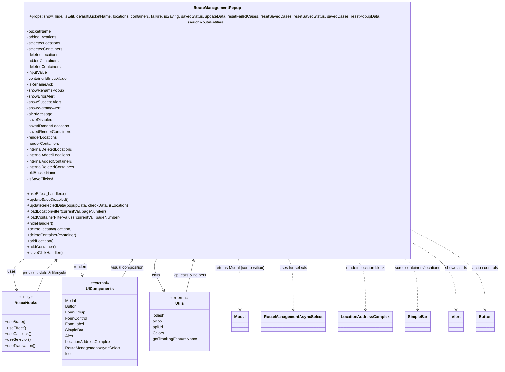

# Diagram: web/portal/src/pages/containertracking/container-management/components/route-management/RouteManagement.modal.js

> Auto-generated by Obscura crawlers

## Mermaid

### SVG

<svg id="container" width="2003.71484375" xmlns="http://www.w3.org/2000/svg" class="classDiagram" height="1482" viewBox="0 0 2003.71484375 1482" role="graphics-document document" aria-roledescription="class"><g><defs><marker id="container_class-aggregationStart" class="marker aggregation class" refX="18" refY="7" markerWidth="190" markerHeight="240" orient="auto"><path d="M 18,7 L9,13 L1,7 L9,1 Z"></path></marker></defs><defs><marker id="container_class-aggregationEnd" class="marker aggregation class" refX="1" refY="7" markerWidth="20" markerHeight="28" orient="auto"><path d="M 18,7 L9,13 L1,7 L9,1 Z"></path></marker></defs><defs><marker id="container_class-extensionStart" class="marker extension class" refX="18" refY="7" markerWidth="190" markerHeight="240" orient="auto"><path d="M 1,7 L18,13 V 1 Z"></path></marker></defs><defs><marker id="container_class-extensionEnd" class="marker extension class" refX="1" refY="7" markerWidth="20" markerHeight="28" orient="auto"><path d="M 1,1 V 13 L18,7 Z"></path></marker></defs><defs><marker id="container_class-compositionStart" class="marker composition class" refX="18" refY="7" markerWidth="190" markerHeight="240" orient="auto"><path d="M 18,7 L9,13 L1,7 L9,1 Z"></path></marker></defs><defs><marker id="container_class-compositionEnd" class="marker composition class" refX="1" refY="7" markerWidth="20" markerHeight="28" orient="auto"><path d="M 18,7 L9,13 L1,7 L9,1 Z"></path></marker></defs><defs><marker id="container_class-dependencyStart" class="marker dependency class" refX="6" refY="7" markerWidth="190" markerHeight="240" orient="auto"><path d="M 5,7 L9,13 L1,7 L9,1 Z"></path></marker></defs><defs><marker id="container_class-dependencyEnd" class="marker dependency class" refX="13" refY="7" markerWidth="20" markerHeight="28" orient="auto"><path d="M 18,7 L9,13 L14,7 L9,1 Z"></path></marker></defs><defs><marker id="container_class-lollipopStart" class="marker lollipop class" refX="13" refY="7" markerWidth="190" markerHeight="240" orient="auto"><circle stroke="black" fill="transparent" cx="7" cy="7" r="6"></circle></marker></defs><defs><marker id="container_class-lollipopEnd" class="marker lollipop class" refX="1" refY="7" markerWidth="190" markerHeight="240" orient="auto"><circle stroke="black" fill="transparent" cx="7" cy="7" r="6"></circle></marker></defs><g class="root"><g class="clusters"></g><g class="edgePaths"><path d="M114.25,1016L101.932,1024.167C89.614,1032.333,64.979,1048.667,57.323,1073.537C49.668,1098.407,58.992,1131.814,63.654,1148.517L68.315,1165.221" id="id_RouteManagementPopup_ReactHooks_1" class="edge-thickness-normal edge-pattern-solid relation" style=";;;" data-edge="true" data-et="edge" data-id="id_RouteManagementPopup_ReactHooks_1" data-points="W3sieCI6MTE0LjI0OTc1Mjc2ODk4NzM4LCJ5IjoxMDE2fSx7IngiOjQwLjM0Mzc1LCJ5IjoxMDY1fSx7IngiOjY5LjkyODQyNTIxODM0MDYsInkiOjExNzF9XQ==" marker-end="url(#container_class-dependencyEnd)"></path><path d="M370.595,1016L362.431,1024.167C354.267,1032.333,337.939,1048.667,332.243,1064.054C326.547,1079.441,331.482,1093.882,333.95,1101.102L336.418,1108.322" id="id_RouteManagementPopup_UIComponents_2" class="edge-thickness-normal edge-pattern-solid relation" style=";;;" data-edge="true" data-et="edge" data-id="id_RouteManagementPopup_UIComponents_2" data-points="W3sieCI6MzcwLjU5NDg4NzI2MjY1ODIzLCJ5IjoxMDE2fSx7IngiOjMyMS42MTEzMjgxMjUsInkiOjEwNjV9LHsieCI6MzM4LjM1ODUzOTE2NDg0NzIsInkiOjExMTR9XQ==" marker-end="url(#container_class-dependencyEnd)"></path><path d="M635.6,1016L631.73,1024.167C627.86,1032.333,620.121,1048.667,624.363,1074.095C628.605,1099.523,644.829,1134.047,652.942,1151.308L661.054,1168.57" id="id_RouteManagementPopup_Utils_3" class="edge-thickness-normal edge-pattern-solid relation" style=";;;" data-edge="true" data-et="edge" data-id="id_RouteManagementPopup_Utils_3" data-points="W3sieCI6NjM1LjYwMDAyOTY2NzcyMTUsInkiOjEwMTZ9LHsieCI6NjEyLjM4MDg1OTM3NSwieSI6MTA2NX0seyJ4Ijo2NjMuNjA1NjkwNTAyMTgzNCwieSI6MTE3NH1d" marker-end="url(#container_class-dependencyEnd)"></path><path d="M959.734,1016L961.116,1024.167C962.498,1032.333,965.263,1048.667,966.645,1087C968.027,1125.333,968.027,1185.667,968.027,1215.833L968.027,1246" id="id_RouteManagementPopup_Modal_4" class="edge-thickness-normal edge-pattern-dashed relation" style=";;;" data-edge="true" data-et="edge" data-id="id_RouteManagementPopup_Modal_4" data-points="W3sieCI6OTU5LjczMzUzNDQxNDU1NywieSI6MTAxNn0seyJ4Ijo5NjguMDI3MzQzNzUsInkiOjEwNjV9LHsieCI6OTY4LjAyNzM0Mzc1LCJ5IjoxMjUyfV0=" marker-end="url(#container_class-dependencyEnd)"></path><path d="M1149.923,1016L1154.387,1024.167C1158.851,1032.333,1167.779,1048.667,1172.243,1087C1176.707,1125.333,1176.707,1185.667,1176.707,1215.833L1176.707,1246" id="id_RouteManagementPopup_RouteManagementAsyncSelect_5" class="edge-thickness-normal edge-pattern-dashed relation" style=";;;" data-edge="true" data-et="edge" data-id="id_RouteManagementPopup_RouteManagementAsyncSelect_5" data-points="W3sieCI6MTE0OS45MjI2MTY2OTMwMzgsInkiOjEwMTZ9LHsieCI6MTE3Ni43MDcwMzEyNSwieSI6MTA2NX0seyJ4IjoxMTc2LjcwNzAzMTI1LCJ5IjoxMjUyfV0=" marker-end="url(#container_class-dependencyEnd)"></path><path d="M1403.61,1016L1412.185,1024.167C1420.76,1032.333,1437.909,1048.667,1446.484,1087C1455.059,1125.333,1455.059,1185.667,1455.059,1215.833L1455.059,1246" id="id_RouteManagementPopup_LocationAddressComplex_6" class="edge-thickness-normal edge-pattern-dashed relation" style=";;;" data-edge="true" data-et="edge" data-id="id_RouteManagementPopup_LocationAddressComplex_6" data-points="W3sieCI6MTQwMy42MTAxMTY2OTMwMzgsInkiOjEwMTZ9LHsieCI6MTQ1NS4wNTg1OTM3NSwieSI6MTA2NX0seyJ4IjoxNDU1LjA1ODU5Mzc1LCJ5IjoxMjUyfV0=" marker-end="url(#container_class-dependencyEnd)"></path><path d="M1589.321,1016L1600.905,1024.167C1612.488,1032.333,1635.656,1048.667,1647.24,1087C1658.824,1125.333,1658.824,1185.667,1658.824,1215.833L1658.824,1246" id="id_RouteManagementPopup_SimpleBar_7" class="edge-thickness-normal edge-pattern-dashed relation" style=";;;" data-edge="true" data-et="edge" data-id="id_RouteManagementPopup_SimpleBar_7" data-points="W3sieCI6MTU4OS4zMjA1NTk3MzEwMTI1LCJ5IjoxMDE2fSx7IngiOjE2NTguODI0MjE4NzUsInkiOjEwNjV9LHsieCI6MTY1OC44MjQyMTg3NSwieSI6MTI1Mn1d" marker-end="url(#container_class-dependencyEnd)"></path><path d="M1713.262,1001.672L1731.342,1012.227C1749.423,1022.781,1785.585,1043.891,1803.665,1084.612C1821.746,1125.333,1821.746,1185.667,1821.746,1215.833L1821.746,1246" id="id_RouteManagementPopup_Alert_8" class="edge-thickness-normal edge-pattern-dashed relation" style=";;;" data-edge="true" data-et="edge" data-id="id_RouteManagementPopup_Alert_8" data-points="W3sieCI6MTcxMy4yNjE3MTg3NSwieSI6MTAwMS42NzIwNDM2NzU4Mjl9LHsieCI6MTgyMS43NDYwOTM3NSwieSI6MTA2NX0seyJ4IjoxODIxLjc0NjA5Mzc1LCJ5IjoxMjUyfV0=" marker-end="url(#container_class-dependencyEnd)"></path><path d="M1713.262,946.758L1751.285,966.465C1789.309,986.172,1865.355,1025.586,1903.379,1075.46C1941.402,1125.333,1941.402,1185.667,1941.402,1215.833L1941.402,1246" id="id_RouteManagementPopup_Button_9" class="edge-thickness-normal edge-pattern-dashed relation" style=";;;" data-edge="true" data-et="edge" data-id="id_RouteManagementPopup_Button_9" data-points="W3sieCI6MTcxMy4yNjE3MTg3NSwieSI6OTQ2Ljc1NzY5NzM0ODY3MDd9LHsieCI6MTk0MS40MDIzNDM3NSwieSI6MTA2NX0seyJ4IjoxOTQxLjQwMjM0Mzc1LCJ5IjoxMjUyfV0=" marker-end="url(#container_class-dependencyEnd)"></path><path d="M146.297,1171L152.335,1153.333C158.373,1135.667,170.449,1100.333,185.924,1075.124C201.399,1049.915,220.273,1034.831,229.709,1027.288L239.146,1019.746" id="id_ReactHooks_RouteManagementPopup_10" class="edge-thickness-normal edge-pattern-solid relation" style=";;;" data-edge="true" data-et="edge" data-id="id_ReactHooks_RouteManagementPopup_10" data-points="W3sieCI6MTQ2LjI5NjczMDAwODE4Nzc4LCJ5IjoxMTcxfSx7IngiOjE4Mi41MjUzOTA2MjUsInkiOjEwNjV9LHsieCI6MjQzLjgzMzAyMDE3NDA1MDYsInkiOjEwMTZ9XQ==" marker-end="url(#container_class-dependencyEnd)"></path><path d="M747.157,1174L751.268,1155.833C755.379,1137.667,763.602,1101.333,769.046,1075.983C774.49,1050.633,777.155,1036.266,778.488,1029.083L779.821,1021.899" id="id_Utils_RouteManagementPopup_11" class="edge-thickness-normal edge-pattern-solid relation" style=";;;" data-edge="true" data-et="edge" data-id="id_Utils_RouteManagementPopup_11" data-points="W3sieCI6NzQ3LjE1Njc5NTg1MTUyODQsInkiOjExNzR9LHsieCI6NzcxLjgyNDIxODc1LCJ5IjoxMDY1fSx7IngiOjc4MC45MTU0OTY0Mzk4NzM0LCJ5IjoxMDE2fV0=" marker-end="url(#container_class-dependencyEnd)"></path><path d="M484.47,1114L488.308,1105.833C492.146,1097.667,499.822,1081.333,508.526,1065.833C517.23,1050.333,526.962,1035.666,531.827,1028.333L536.693,1021" id="id_UIComponents_RouteManagementPopup_12" class="edge-thickness-normal edge-pattern-solid relation" style=";;;" data-edge="true" data-et="edge" data-id="id_UIComponents_RouteManagementPopup_12" data-points="W3sieCI6NDg0LjQ3MDM3MDQ5NjcyNDksInkiOjExMTR9LHsieCI6NTA3LjQ5ODA0Njg3NSwieSI6MTA2NX0seyJ4Ijo1NDAuMDEwNjMwOTMzNTQ0MiwieSI6MTAxNn1d" marker-end="url(#container_class-dependencyEnd)"></path></g><g class="edgeLabels"><g class="edgeLabel" transform="translate(43.21711, 1075.29506)"><g class="label" data-id="id_RouteManagementPopup_ReactHooks_1" transform="translate(-16.4921875, -12)"><foreignObject width="32.984375" height="24">

uses

</foreignObject></g></g><g class="edgeLabel" transform="translate(327.79816, 1058.81109)"><g class="label" data-id="id_RouteManagementPopup_UIComponents_2" transform="translate(-27.75, -12)"><foreignObject width="55.5" height="24">

renders

</foreignObject></g></g><g class="edgeLabel" transform="translate(626.46206, 1094.96302)"><g class="label" data-id="id_RouteManagementPopup_Utils_3" transform="translate(-16.4453125, -12)"><foreignObject width="32.890625" height="24">

calls

</foreignObject></g></g><g class="edgeLabel" transform="translate(968.02734375, 1065)"><g class="label" data-id="id_RouteManagementPopup_Modal_4" transform="translate(-100, -24)"><foreignObject width="200" height="48">

returns Modal (composition)

</foreignObject></g></g><g class="edgeLabel" transform="translate(1176.70703125, 1065)"><g class="label" data-id="id_RouteManagementPopup_RouteManagementAsyncSelect_5" transform="translate(-56.296875, -12)"><foreignObject width="112.59375" height="24">

uses for selects

</foreignObject></g></g><g class="edgeLabel" transform="translate(1455.05859375, 1065)"><g class="label" data-id="id_RouteManagementPopup_LocationAddressComplex_6" transform="translate(-81.2109375, -12)"><foreignObject width="162.421875" height="24">

renders location block

</foreignObject></g></g><g class="edgeLabel" transform="translate(1658.82421875, 1065)"><g class="label" data-id="id_RouteManagementPopup_SimpleBar_7" transform="translate(-97.578125, -12)"><foreignObject width="195.15625" height="24">

scroll containers/locations

</foreignObject></g></g><g class="edgeLabel" transform="translate(1821.74609375, 1065)"><g class="label" data-id="id_RouteManagementPopup_Alert_8" transform="translate(-45.34375, -12)"><foreignObject width="90.6875" height="24">

shows alerts

</foreignObject></g></g><g class="edgeLabel" transform="translate(1941.40234375, 1065)"><g class="label" data-id="id_RouteManagementPopup_Button_9" transform="translate(-54.3125, -12)"><foreignObject width="108.625" height="24">

action controls

</foreignObject></g></g><g class="edgeLabel" transform="translate(177.10228, 1080.86727)"><g class="label" data-id="id_ReactHooks_RouteManagementPopup_10" transform="translate(-91.3359375, -12)"><foreignObject width="182.671875" height="24">

provides state &amp; lifecycle

</foreignObject></g></g><g class="edgeLabel" transform="translate(764.99056, 1095.19646)"><g class="label" data-id="id_Utils_RouteManagementPopup_11" transform="translate(-67.203125, -12)"><foreignObject width="134.40625" height="24">

api calls &amp; helpers

</foreignObject></g></g><g class="edgeLabel" transform="translate(508.7874, 1063.0568)"><g class="label" data-id="id_UIComponents_RouteManagementPopup_12" transform="translate(-68.4375, -12)"><foreignObject width="136.875" height="24">

visual composition

</foreignObject></g></g></g><g class="nodes"><g class="node default" id="classId-RouteManagementPopup-0" transform="translate(874.42578125, 512)"><g class="basic label-container"><path d="M-838.8359375 -504 L838.8359375 -504 L838.8359375 504 L-838.8359375 504" stroke="none" stroke-width="0" fill="#ECECFF" style=""></path><path d="M-838.8359375 -504 C-189.54022280941047 -504, 459.75549188117907 -504, 838.8359375 -504 M-838.8359375 -504 C-448.39101044111584 -504, -57.94608338223168 -504, 838.8359375 -504 M838.8359375 -504 C838.8359375 -266.81623956584974, 838.8359375 -29.632479131699483, 838.8359375 504 M838.8359375 -504 C838.8359375 -115.85937168154254, 838.8359375 272.2812566369149, 838.8359375 504 M838.8359375 504 C486.58333283846486 504, 134.3307281769297 504, -838.8359375 504 M838.8359375 504 C428.5738776184907 504, 18.311817736981425 504, -838.8359375 504 M-838.8359375 504 C-838.8359375 275.8292956936746, -838.8359375 47.65859138734925, -838.8359375 -504 M-838.8359375 504 C-838.8359375 124.8683658266483, -838.8359375 -254.2632683467034, -838.8359375 -504" stroke="#9370DB" stroke-width="1.3" fill="none" stroke-dasharray="0 0" style=""></path></g><g class="annotation-group text" transform="translate(0, -480)"></g><g class="label-group text" transform="translate(-91.90625, -480)"><g class="label" style="font-weight: bolder" transform="translate(0,-12)"><foreignObject width="183.8125" height="24">

RouteManagementPopup

</foreignObject></g></g><g class="members-group text" transform="translate(-826.8359375, -432)"><g class="label" style="" transform="translate(0,-12)"><foreignObject width="1561.765625" height="24">

+props: show, hide, isEdit, defaultBucketName, locations, containers, failure, isSaving, savedStatus, updateData, resetFailedCases, resetSavedCases, resetSavedStatus, savedCases, resetPopupData, searchRouteEntities

</foreignObject></g><g class="label" style="" transform="translate(0,12)"><foreignObject width="97.53125" height="24">

-bucketName

</foreignObject></g><g class="label" style="" transform="translate(0,36)"><foreignObject width="121.921875" height="24">

-addedLocations

</foreignObject></g><g class="label" style="" transform="translate(0,60)"><foreignObject width="137.03125" height="24">

-selectedLocations

</foreignObject></g><g class="label" style="" transform="translate(0,84)"><foreignObject width="145.1875" height="24">

-selectedContainers

</foreignObject></g><g class="label" style="" transform="translate(0,108)"><foreignObject width="131.484375" height="24">

-deletedLocations

</foreignObject></g><g class="label" style="" transform="translate(0,132)"><foreignObject width="130.09375" height="24">

-addedContainers

</foreignObject></g><g class="label" style="" transform="translate(0,156)"><foreignObject width="139.640625" height="24">

-deletedContainers

</foreignObject></g><g class="label" style="" transform="translate(0,180)"><foreignObject width="84.453125" height="24">

-inputValue

</foreignObject></g><g class="label" style="" transform="translate(0,204)"><foreignObject width="168.15625" height="24">

-containerIdInputValue

</foreignObject></g><g class="label" style="" transform="translate(0,228)"><foreignObject width="102.125" height="24">

-isRenameAck

</foreignObject></g><g class="label" style="" transform="translate(0,252)"><foreignObject width="149.265625" height="24">

-showRenamePopup

</foreignObject></g><g class="label" style="" transform="translate(0,276)"><foreignObject width="114.359375" height="24">

-showErrorAlert

</foreignObject></g><g class="label" style="" transform="translate(0,300)"><foreignObject width="134.765625" height="24">

-showSuccessAlert

</foreignObject></g><g class="label" style="" transform="translate(0,324)"><foreignObject width="137.765625" height="24">

-showWarningAlert

</foreignObject></g><g class="label" style="" transform="translate(0,348)"><foreignObject width="101.15625" height="24">

-alertMessage

</foreignObject></g><g class="label" style="" transform="translate(0,372)"><foreignObject width="101.984375" height="24">

-saveDisabled

</foreignObject></g><g class="label" style="" transform="translate(0,396)"><foreignObject width="169.90625" height="24">

-savedRenderLocations

</foreignObject></g><g class="label" style="" transform="translate(0,420)"><foreignObject width="178.078125" height="24">

-savedRenderContainers

</foreignObject></g><g class="label" style="" transform="translate(0,444)"><foreignObject width="124.296875" height="24">

-renderLocations

</foreignObject></g><g class="label" style="" transform="translate(0,468)"><foreignObject width="132.453125" height="24">

-renderContainers

</foreignObject></g><g class="label" style="" transform="translate(0,492)"><foreignObject width="189.140625" height="24">

-internalDeletedLocations

</foreignObject></g><g class="label" style="" transform="translate(0,516)"><foreignObject width="179.5625" height="24">

-internalAddedLocations

</foreignObject></g><g class="label" style="" transform="translate(0,540)"><foreignObject width="187.71875" height="24">

-internalAddedContainers

</foreignObject></g><g class="label" style="" transform="translate(0,564)"><foreignObject width="197.296875" height="24">

-internalDeletedContainers

</foreignObject></g><g class="label" style="" transform="translate(0,588)"><foreignObject width="121.265625" height="24">

-oldBucketName

</foreignObject></g><g class="label" style="" transform="translate(0,612)"><foreignObject width="104.140625" height="24">

-isSaveClicked

</foreignObject></g></g><g class="methods-group text" transform="translate(-826.8359375, 240)"><g class="label" style="" transform="translate(0,-12)"><foreignObject width="156.890625" height="24">

+useEffect_handlers()

</foreignObject></g><g class="label" style="" transform="translate(0,12)"><foreignObject width="166.640625" height="24">

+updateSaveDisabled()

</foreignObject></g><g class="label" style="" transform="translate(0,36)"><foreignObject width="410.59375" height="24">

+updateSelectedData(popupData, checkData, isLocation)

</foreignObject></g><g class="label" style="" transform="translate(0,60)"><foreignObject width="324.671875" height="24">

+loadLocationFilter(currentVal, pageNumber)

</foreignObject></g><g class="label" style="" transform="translate(0,84)"><foreignObject width="380.0625" height="24">

+loadContainerFilterValues(currentVal, pageNumber)

</foreignObject></g><g class="label" style="" transform="translate(0,108)"><foreignObject width="108.5625" height="24">

+hideHandler()

</foreignObject></g><g class="label" style="" transform="translate(0,132)"><foreignObject width="185.5" height="24">

+deleteLocation(location)

</foreignObject></g><g class="label" style="" transform="translate(0,156)"><foreignObject width="203.9375" height="24">

+deleteContainer(container)

</foreignObject></g><g class="label" style="" transform="translate(0,180)"><foreignObject width="108.078125" height="24">

+addLocation()

</foreignObject></g><g class="label" style="" transform="translate(0,204)"><foreignObject width="116.46875" height="24">

+addContainer()

</foreignObject></g><g class="label" style="" transform="translate(0,228)"><foreignObject width="142.53125" height="24">

+saveClickHandler()

</foreignObject></g></g><g class="divider" style=""><path d="M-838.8359375 -456 C-481.56184062907477 -456, -124.28774375814953 -456, 838.8359375 -456 M-838.8359375 -456 C-361.6857312970172 -456, 115.46447490596563 -456, 838.8359375 -456" stroke="#9370DB" stroke-width="1.3" fill="none" stroke-dasharray="0 0" style=""></path></g><g class="divider" style=""><path d="M-838.8359375 216 C-351.52176752695607 216, 135.79240244608786 216, 838.8359375 216 M-838.8359375 216 C-368.81376524563717 216, 101.20840700872566 216, 838.8359375 216" stroke="#9370DB" stroke-width="1.3" fill="none" stroke-dasharray="0 0" style=""></path></g></g><g class="node default" id="classId-ReactHooks-1" transform="translate(104.2578125, 1294)"><g class="basic label-container"><path d="M-96.2578125 -123 L96.2578125 -123 L96.2578125 123 L-96.2578125 123" stroke="none" stroke-width="0" fill="#ECECFF" style=""></path><path d="M-96.2578125 -123 C-31.981688368498553 -123, 32.294435763002895 -123, 96.2578125 -123 M-96.2578125 -123 C-32.21133321599804 -123, 31.835146068003922 -123, 96.2578125 -123 M96.2578125 -123 C96.2578125 -32.752550317319916, 96.2578125 57.49489936536017, 96.2578125 123 M96.2578125 -123 C96.2578125 -72.34666719390529, 96.2578125 -21.693334387810566, 96.2578125 123 M96.2578125 123 C27.900216740223314 123, -40.45737901955337 123, -96.2578125 123 M96.2578125 123 C28.475986133110226 123, -39.30584023377955 123, -96.2578125 123 M-96.2578125 123 C-96.2578125 60.22146770339509, -96.2578125 -2.557064593209816, -96.2578125 -123 M-96.2578125 123 C-96.2578125 48.29151520177139, -96.2578125 -26.41696959645722, -96.2578125 -123" stroke="#9370DB" stroke-width="1.3" fill="none" stroke-dasharray="0 0" style=""></path></g><g class="annotation-group text" transform="translate(-30.3125, -99)"><g class="label" style="" transform="translate(0,-12)"><foreignObject width="60.625" height="24">

«utility»

</foreignObject></g></g><g class="label-group text" transform="translate(-43.375, -75)"><g class="label" style="font-weight: bolder" transform="translate(0,-12)"><foreignObject width="86.75" height="24">

ReactHooks

</foreignObject></g></g><g class="members-group text" transform="translate(-84.2578125, -27)"></g><g class="methods-group text" transform="translate(-84.2578125, 3)"><g class="label" style="" transform="translate(0,-12)"><foreignObject width="81.203125" height="24">

+useState()

</foreignObject></g><g class="label" style="" transform="translate(0,12)"><foreignObject width="84.8125" height="24">

+useEffect()

</foreignObject></g><g class="label" style="" transform="translate(0,36)"><foreignObject width="104.46875" height="24">

+useCallback()

</foreignObject></g><g class="label" style="" transform="translate(0,60)"><foreignObject width="103.34375" height="24">

+useSelector()

</foreignObject></g><g class="label" style="" transform="translate(0,84)"><foreignObject width="125.140625" height="24">

+useTranslation()

</foreignObject></g></g><g class="divider" style=""><path d="M-96.2578125 -51 C-26.066718849062397 -51, 44.124374801875206 -51, 96.2578125 -51 M-96.2578125 -51 C-40.02299042644694 -51, 16.211831647106123 -51, 96.2578125 -51" stroke="#9370DB" stroke-width="1.3" fill="none" stroke-dasharray="0 0" style=""></path></g><g class="divider" style=""><path d="M-96.2578125 -27 C-53.595874353436336 -27, -10.933936206872673 -27, 96.2578125 -27 M-96.2578125 -27 C-46.696957063665884 -27, 2.863898372668231 -27, 96.2578125 -27" stroke="#9370DB" stroke-width="1.3" fill="none" stroke-dasharray="0 0" style=""></path></g></g><g class="node default" id="classId-UIComponents-2" transform="translate(399.87890625, 1294)"><g class="basic label-container"><path d="M-149.36328125 -180 L149.36328125 -180 L149.36328125 180 L-149.36328125 180" stroke="none" stroke-width="0" fill="#ECECFF" style=""></path><path d="M-149.36328125 -180 C-37.24892283371585 -180, 74.8654355825683 -180, 149.36328125 -180 M-149.36328125 -180 C-83.25948343452369 -180, -17.155685619047375 -180, 149.36328125 -180 M149.36328125 -180 C149.36328125 -86.48505301175575, 149.36328125 7.029893976488495, 149.36328125 180 M149.36328125 -180 C149.36328125 -69.59888205098443, 149.36328125 40.80223589803114, 149.36328125 180 M149.36328125 180 C63.96473545217293 180, -21.433810345654138 180, -149.36328125 180 M149.36328125 180 C88.19628052027906 180, 27.029279790558135 180, -149.36328125 180 M-149.36328125 180 C-149.36328125 52.26232883095622, -149.36328125 -75.47534233808756, -149.36328125 -180 M-149.36328125 180 C-149.36328125 44.61309623975163, -149.36328125 -90.77380752049675, -149.36328125 -180" stroke="#9370DB" stroke-width="1.3" fill="none" stroke-dasharray="0 0" style=""></path></g><g class="annotation-group text" transform="translate(-38.65625, -156)"><g class="label" style="" transform="translate(0,-12)"><foreignObject width="77.3125" height="24">

«external»

</foreignObject></g></g><g class="label-group text" transform="translate(-53.4765625, -132)"><g class="label" style="font-weight: bolder" transform="translate(0,-12)"><foreignObject width="106.953125" height="24">

UIComponents

</foreignObject></g></g><g class="members-group text" transform="translate(-137.36328125, -84)"><g class="label" style="" transform="translate(0,-12)"><foreignObject width="44.59375" height="24">

Modal

</foreignObject></g><g class="label" style="" transform="translate(0,12)"><foreignObject width="49.078125" height="24">

Button

</foreignObject></g><g class="label" style="" transform="translate(0,36)"><foreignObject width="80.484375" height="24">

FormGroup

</foreignObject></g><g class="label" style="" transform="translate(0,60)"><foreignObject width="89.40625" height="24">

FormControl

</foreignObject></g><g class="label" style="" transform="translate(0,84)"><foreignObject width="75.953125" height="24">

FormLabel

</foreignObject></g><g class="label" style="" transform="translate(0,108)"><foreignObject width="74.390625" height="24">

SimpleBar

</foreignObject></g><g class="label" style="" transform="translate(0,132)"><foreignObject width="34.453125" height="24">

Alert

</foreignObject></g><g class="label" style="" transform="translate(0,156)"><foreignObject width="181.765625" height="24">

LocationAddressComplex

</foreignObject></g><g class="label" style="" transform="translate(0,180)"><foreignObject width="221.25" height="24">

RouteManagementAsyncSelect

</foreignObject></g><g class="label" style="" transform="translate(0,204)"><foreignObject width="30.78125" height="24">

Icon

</foreignObject></g></g><g class="methods-group text" transform="translate(-137.36328125, 180)"></g><g class="divider" style=""><path d="M-149.36328125 -108 C-37.35800034769436 -108, 74.64728055461129 -108, 149.36328125 -108 M-149.36328125 -108 C-80.61207877872577 -108, -11.860876307451548 -108, 149.36328125 -108" stroke="#9370DB" stroke-width="1.3" fill="none" stroke-dasharray="0 0" style=""></path></g><g class="divider" style=""><path d="M-149.36328125 156 C-61.576410472446724 156, 26.21046030510655 156, 149.36328125 156 M-149.36328125 156 C-80.55342261308986 156, -11.743563976179729 156, 149.36328125 156" stroke="#9370DB" stroke-width="1.3" fill="none" stroke-dasharray="0 0" style=""></path></g></g><g class="node default" id="classId-Utils-3" transform="translate(720, 1294)"><g class="basic label-container"><path d="M-120.7578125 -120 L120.7578125 -120 L120.7578125 120 L-120.7578125 120" stroke="none" stroke-width="0" fill="#ECECFF" style=""></path><path d="M-120.7578125 -120 C-39.636753912779724 -120, 41.48430467444055 -120, 120.7578125 -120 M-120.7578125 -120 C-44.341732038862745 -120, 32.07434842227451 -120, 120.7578125 -120 M120.7578125 -120 C120.7578125 -40.436139036725095, 120.7578125 39.12772192654981, 120.7578125 120 M120.7578125 -120 C120.7578125 -44.79316739010824, 120.7578125 30.413665219783525, 120.7578125 120 M120.7578125 120 C25.208439287241717 120, -70.34093392551657 120, -120.7578125 120 M120.7578125 120 C71.65862678490012 120, 22.55944106980023 120, -120.7578125 120 M-120.7578125 120 C-120.7578125 42.01680912511664, -120.7578125 -35.966381749766725, -120.7578125 -120 M-120.7578125 120 C-120.7578125 37.90576031291036, -120.7578125 -44.18847937417928, -120.7578125 -120" stroke="#9370DB" stroke-width="1.3" fill="none" stroke-dasharray="0 0" style=""></path></g><g class="annotation-group text" transform="translate(-38.65625, -96)"><g class="label" style="" transform="translate(0,-12)"><foreignObject width="77.3125" height="24">

«external»

</foreignObject></g></g><g class="label-group text" transform="translate(-16.796875, -72)"><g class="label" style="font-weight: bolder" transform="translate(0,-12)"><foreignObject width="33.59375" height="24">

Utils

</foreignObject></g></g><g class="members-group text" transform="translate(-108.7578125, -24)"><g class="label" style="" transform="translate(0,-12)"><foreignObject width="48.921875" height="24">

lodash

</foreignObject></g><g class="label" style="" transform="translate(0,12)"><foreignObject width="37.796875" height="24">

axios

</foreignObject></g><g class="label" style="" transform="translate(0,36)"><foreignObject width="44.1875" height="24">

apiUrl

</foreignObject></g><g class="label" style="" transform="translate(0,60)"><foreignObject width="45.359375" height="24">

Colors

</foreignObject></g><g class="label" style="" transform="translate(0,84)"><foreignObject width="178.859375" height="24">

getTrackingFeatureName

</foreignObject></g></g><g class="methods-group text" transform="translate(-108.7578125, 120)"></g><g class="divider" style=""><path d="M-120.7578125 -48 C-51.20804784188604 -48, 18.341716816227915 -48, 120.7578125 -48 M-120.7578125 -48 C-36.65469069362352 -48, 47.44843111275296 -48, 120.7578125 -48" stroke="#9370DB" stroke-width="1.3" fill="none" stroke-dasharray="0 0" style=""></path></g><g class="divider" style=""><path d="M-120.7578125 96 C-70.6168183497486 96, -20.475824199497197 96, 120.7578125 96 M-120.7578125 96 C-54.97594738887936 96, 10.805917722241276 96, 120.7578125 96" stroke="#9370DB" stroke-width="1.3" fill="none" stroke-dasharray="0 0" style=""></path></g></g><g class="node default" id="classId-Modal-4" transform="translate(968.02734375, 1294)"><g class="basic label-container"><path d="M-34.4453125 -42 L34.4453125 -42 L34.4453125 42 L-34.4453125 42" stroke="none" stroke-width="0" fill="#ECECFF" style=""></path><path d="M-34.4453125 -42 C-14.598361974401524 -42, 5.248588551196953 -42, 34.4453125 -42 M-34.4453125 -42 C-18.027553218392434 -42, -1.6097939367848682 -42, 34.4453125 -42 M34.4453125 -42 C34.4453125 -20.7321432100065, 34.4453125 0.5357135799869965, 34.4453125 42 M34.4453125 -42 C34.4453125 -17.91921492040201, 34.4453125 6.161570159195982, 34.4453125 42 M34.4453125 42 C10.310202774033037 42, -13.824906951933926 42, -34.4453125 42 M34.4453125 42 C12.035793176873803 42, -10.373726146252395 42, -34.4453125 42 M-34.4453125 42 C-34.4453125 15.142250553286058, -34.4453125 -11.715498893427885, -34.4453125 -42 M-34.4453125 42 C-34.4453125 15.651612938525666, -34.4453125 -10.696774122948668, -34.4453125 -42" stroke="#9370DB" stroke-width="1.3" fill="none" stroke-dasharray="0 0" style=""></path></g><g class="annotation-group text" transform="translate(0, -18)"></g><g class="label-group text" transform="translate(-22.4453125, -18)"><g class="label" style="font-weight: bolder" transform="translate(0,-12)"><foreignObject width="44.890625" height="24">

Modal

</foreignObject></g></g><g class="members-group text" transform="translate(-22.4453125, 30)"></g><g class="methods-group text" transform="translate(-22.4453125, 60)"></g><g class="divider" style=""><path d="M-34.4453125 6 C-14.98858307372269 6, 4.468146352554619 6, 34.4453125 6 M-34.4453125 6 C-8.527042988763842 6, 17.391226522472316 6, 34.4453125 6" stroke="#9370DB" stroke-width="1.3" fill="none" stroke-dasharray="0 0" style=""></path></g><g class="divider" style=""><path d="M-34.4453125 24 C-18.170049230605805 24, -1.8947859612116105 24, 34.4453125 24 M-34.4453125 24 C-14.683481927673544 24, 5.0783486446529125 24, 34.4453125 24" stroke="#9370DB" stroke-width="1.3" fill="none" stroke-dasharray="0 0" style=""></path></g></g><g class="node default" id="classId-RouteManagementAsyncSelect-5" transform="translate(1176.70703125, 1294)"><g class="basic label-container"><path d="M-124.234375 -42 L124.234375 -42 L124.234375 42 L-124.234375 42" stroke="none" stroke-width="0" fill="#ECECFF" style=""></path><path d="M-124.234375 -42 C-73.02054515646145 -42, -21.806715312922904 -42, 124.234375 -42 M-124.234375 -42 C-64.08897635619752 -42, -3.9435777123950544 -42, 124.234375 -42 M124.234375 -42 C124.234375 -15.961012774312081, 124.234375 10.077974451375837, 124.234375 42 M124.234375 -42 C124.234375 -18.430012096410746, 124.234375 5.139975807178509, 124.234375 42 M124.234375 42 C57.09567061154394 42, -10.043033776912125 42, -124.234375 42 M124.234375 42 C49.398269382241224 42, -25.43783623551755 42, -124.234375 42 M-124.234375 42 C-124.234375 9.569952048179694, -124.234375 -22.860095903640612, -124.234375 -42 M-124.234375 42 C-124.234375 23.33217064346078, -124.234375 4.664341286921562, -124.234375 -42" stroke="#9370DB" stroke-width="1.3" fill="none" stroke-dasharray="0 0" style=""></path></g><g class="annotation-group text" transform="translate(0, -18)"></g><g class="label-group text" transform="translate(-112.234375, -18)"><g class="label" style="font-weight: bolder" transform="translate(0,-12)"><foreignObject width="224.46875" height="24">

RouteManagementAsyncSelect

</foreignObject></g></g><g class="members-group text" transform="translate(-112.234375, 30)"></g><g class="methods-group text" transform="translate(-112.234375, 60)"></g><g class="divider" style=""><path d="M-124.234375 6 C-28.538439787485046 6, 67.15749542502991 6, 124.234375 6 M-124.234375 6 C-52.861733794617265 6, 18.51090741076547 6, 124.234375 6" stroke="#9370DB" stroke-width="1.3" fill="none" stroke-dasharray="0 0" style=""></path></g><g class="divider" style=""><path d="M-124.234375 24 C-29.560388587821038 24, 65.11359782435792 24, 124.234375 24 M-124.234375 24 C-52.240537430471335 24, 19.75330013905733 24, 124.234375 24" stroke="#9370DB" stroke-width="1.3" fill="none" stroke-dasharray="0 0" style=""></path></g></g><g class="node default" id="classId-LocationAddressComplex-6" transform="translate(1455.05859375, 1294)"><g class="basic label-container"><path d="M-104.1171875 -42 L104.1171875 -42 L104.1171875 42 L-104.1171875 42" stroke="none" stroke-width="0" fill="#ECECFF" style=""></path><path d="M-104.1171875 -42 C-32.15702064427907 -42, 39.803146211441856 -42, 104.1171875 -42 M-104.1171875 -42 C-51.2399568657943 -42, 1.6372737684114043 -42, 104.1171875 -42 M104.1171875 -42 C104.1171875 -12.806614040778065, 104.1171875 16.38677191844387, 104.1171875 42 M104.1171875 -42 C104.1171875 -18.332535089332964, 104.1171875 5.334929821334072, 104.1171875 42 M104.1171875 42 C22.32777593145336 42, -59.46163563709328 42, -104.1171875 42 M104.1171875 42 C41.375144248497165 42, -21.36689900300567 42, -104.1171875 42 M-104.1171875 42 C-104.1171875 10.718143723884527, -104.1171875 -20.563712552230946, -104.1171875 -42 M-104.1171875 42 C-104.1171875 16.33154467818662, -104.1171875 -9.336910643626759, -104.1171875 -42" stroke="#9370DB" stroke-width="1.3" fill="none" stroke-dasharray="0 0" style=""></path></g><g class="annotation-group text" transform="translate(0, -18)"></g><g class="label-group text" transform="translate(-92.1171875, -18)"><g class="label" style="font-weight: bolder" transform="translate(0,-12)"><foreignObject width="184.234375" height="24">

LocationAddressComplex

</foreignObject></g></g><g class="members-group text" transform="translate(-92.1171875, 30)"></g><g class="methods-group text" transform="translate(-92.1171875, 60)"></g><g class="divider" style=""><path d="M-104.1171875 6 C-23.871236033763225 6, 56.37471543247355 6, 104.1171875 6 M-104.1171875 6 C-43.94420978765475 6, 16.2287679246905 6, 104.1171875 6" stroke="#9370DB" stroke-width="1.3" fill="none" stroke-dasharray="0 0" style=""></path></g><g class="divider" style=""><path d="M-104.1171875 24 C-33.67692861066247 24, 36.763330278675056 24, 104.1171875 24 M-104.1171875 24 C-48.15042962422182 24, 7.816328251556357 24, 104.1171875 24" stroke="#9370DB" stroke-width="1.3" fill="none" stroke-dasharray="0 0" style=""></path></g></g><g class="node default" id="classId-SimpleBar-7" transform="translate(1658.82421875, 1294)"><g class="basic label-container"><path d="M-49.6484375 -42 L49.6484375 -42 L49.6484375 42 L-49.6484375 42" stroke="none" stroke-width="0" fill="#ECECFF" style=""></path><path d="M-49.6484375 -42 C-28.093814970781814 -42, -6.539192441563628 -42, 49.6484375 -42 M-49.6484375 -42 C-26.96867241584807 -42, -4.288907331696137 -42, 49.6484375 -42 M49.6484375 -42 C49.6484375 -22.23324730032813, 49.6484375 -2.4664946006562616, 49.6484375 42 M49.6484375 -42 C49.6484375 -9.214898925076646, 49.6484375 23.570202149846708, 49.6484375 42 M49.6484375 42 C17.636287041283026 42, -14.375863417433948 42, -49.6484375 42 M49.6484375 42 C16.440523188899178 42, -16.767391122201644 42, -49.6484375 42 M-49.6484375 42 C-49.6484375 20.468979901347133, -49.6484375 -1.062040197305734, -49.6484375 -42 M-49.6484375 42 C-49.6484375 16.91797735725807, -49.6484375 -8.164045285483859, -49.6484375 -42" stroke="#9370DB" stroke-width="1.3" fill="none" stroke-dasharray="0 0" style=""></path></g><g class="annotation-group text" transform="translate(0, -18)"></g><g class="label-group text" transform="translate(-37.6484375, -18)"><g class="label" style="font-weight: bolder" transform="translate(0,-12)"><foreignObject width="75.296875" height="24">

SimpleBar

</foreignObject></g></g><g class="members-group text" transform="translate(-37.6484375, 30)"></g><g class="methods-group text" transform="translate(-37.6484375, 60)"></g><g class="divider" style=""><path d="M-49.6484375 6 C-24.271685157467854 6, 1.1050671850642928 6, 49.6484375 6 M-49.6484375 6 C-15.188516778718245 6, 19.27140394256351 6, 49.6484375 6" stroke="#9370DB" stroke-width="1.3" fill="none" stroke-dasharray="0 0" style=""></path></g><g class="divider" style=""><path d="M-49.6484375 24 C-19.333490090978092 24, 10.981457318043816 24, 49.6484375 24 M-49.6484375 24 C-17.98969697158455 24, 13.6690435568309 24, 49.6484375 24" stroke="#9370DB" stroke-width="1.3" fill="none" stroke-dasharray="0 0" style=""></path></g></g><g class="node default" id="classId-Alert-8" transform="translate(1821.74609375, 1294)"><g class="basic label-container"><path d="M-29.7734375 -42 L29.7734375 -42 L29.7734375 42 L-29.7734375 42" stroke="none" stroke-width="0" fill="#ECECFF" style=""></path><path d="M-29.7734375 -42 C-10.13667779535011 -42, 9.50008190929978 -42, 29.7734375 -42 M-29.7734375 -42 C-9.972384335844456 -42, 9.828668828311088 -42, 29.7734375 -42 M29.7734375 -42 C29.7734375 -22.64460880895028, 29.7734375 -3.2892176179005617, 29.7734375 42 M29.7734375 -42 C29.7734375 -19.327163614773948, 29.7734375 3.3456727704521043, 29.7734375 42 M29.7734375 42 C14.17482876074293 42, -1.4237799785141405 42, -29.7734375 42 M29.7734375 42 C12.982285068359893 42, -3.808867363280214 42, -29.7734375 42 M-29.7734375 42 C-29.7734375 24.497522326447626, -29.7734375 6.995044652895253, -29.7734375 -42 M-29.7734375 42 C-29.7734375 16.772722534256552, -29.7734375 -8.454554931486896, -29.7734375 -42" stroke="#9370DB" stroke-width="1.3" fill="none" stroke-dasharray="0 0" style=""></path></g><g class="annotation-group text" transform="translate(0, -18)"></g><g class="label-group text" transform="translate(-17.7734375, -18)"><g class="label" style="font-weight: bolder" transform="translate(0,-12)"><foreignObject width="35.546875" height="24">

Alert

</foreignObject></g></g><g class="members-group text" transform="translate(-17.7734375, 30)"></g><g class="methods-group text" transform="translate(-17.7734375, 60)"></g><g class="divider" style=""><path d="M-29.7734375 6 C-6.190311249824443 6, 17.392815000351113 6, 29.7734375 6 M-29.7734375 6 C-15.450949928324436 6, -1.1284623566488712 6, 29.7734375 6" stroke="#9370DB" stroke-width="1.3" fill="none" stroke-dasharray="0 0" style=""></path></g><g class="divider" style=""><path d="M-29.7734375 24 C-9.456761045085116 24, 10.859915409829767 24, 29.7734375 24 M-29.7734375 24 C-9.138343541869336 24, 11.496750416261328 24, 29.7734375 24" stroke="#9370DB" stroke-width="1.3" fill="none" stroke-dasharray="0 0" style=""></path></g></g><g class="node default" id="classId-Button-9" transform="translate(1941.40234375, 1294)"><g class="basic label-container"><path d="M-36.8359375 -42 L36.8359375 -42 L36.8359375 42 L-36.8359375 42" stroke="none" stroke-width="0" fill="#ECECFF" style=""></path><path d="M-36.8359375 -42 C-15.52631433230281 -42, 5.783308835394379 -42, 36.8359375 -42 M-36.8359375 -42 C-15.478537910807866 -42, 5.878861678384268 -42, 36.8359375 -42 M36.8359375 -42 C36.8359375 -10.787394846726453, 36.8359375 20.425210306547093, 36.8359375 42 M36.8359375 -42 C36.8359375 -10.019363495597297, 36.8359375 21.961273008805406, 36.8359375 42 M36.8359375 42 C7.897513349918881 42, -21.040910800162237 42, -36.8359375 42 M36.8359375 42 C9.207452415550499 42, -18.421032668899002 42, -36.8359375 42 M-36.8359375 42 C-36.8359375 23.469982869274162, -36.8359375 4.939965738548324, -36.8359375 -42 M-36.8359375 42 C-36.8359375 15.794757166452982, -36.8359375 -10.410485667094036, -36.8359375 -42" stroke="#9370DB" stroke-width="1.3" fill="none" stroke-dasharray="0 0" style=""></path></g><g class="annotation-group text" transform="translate(0, -18)"></g><g class="label-group text" transform="translate(-24.8359375, -18)"><g class="label" style="font-weight: bolder" transform="translate(0,-12)"><foreignObject width="49.671875" height="24">

Button

</foreignObject></g></g><g class="members-group text" transform="translate(-24.8359375, 30)"></g><g class="methods-group text" transform="translate(-24.8359375, 60)"></g><g class="divider" style=""><path d="M-36.8359375 6 C-15.082815574161778 6, 6.6703063516764445 6, 36.8359375 6 M-36.8359375 6 C-7.460029592546707 6, 21.915878314906585 6, 36.8359375 6" stroke="#9370DB" stroke-width="1.3" fill="none" stroke-dasharray="0 0" style=""></path></g><g class="divider" style=""><path d="M-36.8359375 24 C-14.218183895730991 24, 8.399569708538017 24, 36.8359375 24 M-36.8359375 24 C-10.625399186911668 24, 15.585139126176664 24, 36.8359375 24" stroke="#9370DB" stroke-width="1.3" fill="none" stroke-dasharray="0 0" style=""></path></g></g></g></g></g></svg>
