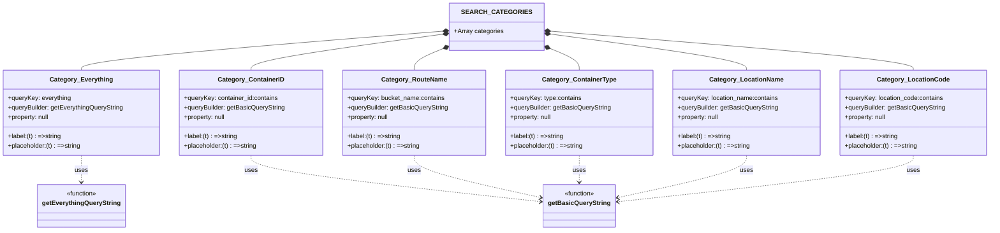

# Diagram: web/portal/src/pages/containertracking/container-management/components/route-management/RouteManagement.searchOptions.js

> Auto-generated by Obscura crawlers

## Mermaid

> SVG rendering failed for this diagram.
