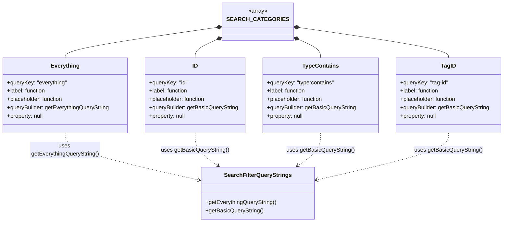

# Diagram: web/portal/src/pages/containertracking/container-management/components/tag-management/ContainerManagement.searchOptions.js

> Auto-generated by Obscura crawlers

## Mermaid

### SVG

<svg id="container" width="1443.96875" xmlns="http://www.w3.org/2000/svg" class="classDiagram" height="638" viewBox="0 0 1443.96875 638" role="graphics-document document" aria-roledescription="class"><g><defs><marker id="container_class-aggregationStart" class="marker aggregation class" refX="18" refY="7" markerWidth="190" markerHeight="240" orient="auto"><path d="M 18,7 L9,13 L1,7 L9,1 Z"></path></marker></defs><defs><marker id="container_class-aggregationEnd" class="marker aggregation class" refX="1" refY="7" markerWidth="20" markerHeight="28" orient="auto"><path d="M 18,7 L9,13 L1,7 L9,1 Z"></path></marker></defs><defs><marker id="container_class-extensionStart" class="marker extension class" refX="18" refY="7" markerWidth="190" markerHeight="240" orient="auto"><path d="M 1,7 L18,13 V 1 Z"></path></marker></defs><defs><marker id="container_class-extensionEnd" class="marker extension class" refX="1" refY="7" markerWidth="20" markerHeight="28" orient="auto"><path d="M 1,1 V 13 L18,7 Z"></path></marker></defs><defs><marker id="container_class-compositionStart" class="marker composition class" refX="18" refY="7" markerWidth="190" markerHeight="240" orient="auto"><path d="M 18,7 L9,13 L1,7 L9,1 Z"></path></marker></defs><defs><marker id="container_class-compositionEnd" class="marker composition class" refX="1" refY="7" markerWidth="20" markerHeight="28" orient="auto"><path d="M 18,7 L9,13 L1,7 L9,1 Z"></path></marker></defs><defs><marker id="container_class-dependencyStart" class="marker dependency class" refX="6" refY="7" markerWidth="190" markerHeight="240" orient="auto"><path d="M 5,7 L9,13 L1,7 L9,1 Z"></path></marker></defs><defs><marker id="container_class-dependencyEnd" class="marker dependency class" refX="13" refY="7" markerWidth="20" markerHeight="28" orient="auto"><path d="M 18,7 L9,13 L14,7 L9,1 Z"></path></marker></defs><defs><marker id="container_class-lollipopStart" class="marker lollipop class" refX="13" refY="7" markerWidth="190" markerHeight="240" orient="auto"><circle stroke="black" fill="transparent" cx="7" cy="7" r="6"></circle></marker></defs><defs><marker id="container_class-lollipopEnd" class="marker lollipop class" refX="1" refY="7" markerWidth="190" markerHeight="240" orient="auto"><circle stroke="black" fill="transparent" cx="7" cy="7" r="6"></circle></marker></defs><g class="root"><g class="clusters"></g><g class="edgePaths"><path d="M634.845,77.028L560.212,87.69C485.579,98.352,336.313,119.676,261.68,134.505C187.047,149.333,187.047,157.667,187.047,161.833L187.047,166" id="id_SEARCH_CATEGORIES_Everything_1" class="edge-thickness-normal edge-pattern-solid relation" style=";;;" data-edge="true" data-et="edge" data-id="id_SEARCH_CATEGORIES_Everything_1" data-points="W3sieCI6NjUxLjkyMTg3NSwieSI6NzQuNTg4MzQ3NDg0NTY1NX0seyJ4IjoxODcuMDQ2ODc1LCJ5IjoxNDF9LHsieCI6MTg3LjA0Njg3NSwieSI6MTY2fV0=" marker-start="url(#container_class-compositionStart)"></path><path d="M636.131,107.686L623.503,113.239C610.875,118.791,585.619,129.895,572.991,139.614C560.363,149.333,560.363,157.667,560.363,161.833L560.363,166" id="id_SEARCH_CATEGORIES_ID_2" class="edge-thickness-normal edge-pattern-solid relation" style=";;;" data-edge="true" data-et="edge" data-id="id_SEARCH_CATEGORIES_ID_2" data-points="W3sieCI6NjUxLjkyMTg3NSwieSI6MTAwLjc0MzQzOTc4OTU1MTV9LHsieCI6NTYwLjM2MzI4MTI1LCJ5IjoxNDF9LHsieCI6NTYwLjM2MzI4MTI1LCJ5IjoxNjZ9XQ==" marker-start="url(#container_class-compositionStart)"></path><path d="M843.947,107.686L856.575,113.239C869.203,118.791,894.459,129.895,907.087,139.614C919.715,149.333,919.715,157.667,919.715,161.833L919.715,166" id="id_SEARCH_CATEGORIES_TypeContains_3" class="edge-thickness-normal edge-pattern-solid relation" style=";;;" data-edge="true" data-et="edge" data-id="id_SEARCH_CATEGORIES_TypeContains_3" data-points="W3sieCI6ODI4LjE1NjI1LCJ5IjoxMDAuNzQzNDM5Nzg5NTUxNX0seyJ4Ijo5MTkuNzE0ODQzNzUsInkiOjE0MX0seyJ4Ijo5MTkuNzE0ODQzNzUsInkiOjE2Nn1d" marker-start="url(#container_class-compositionStart)"></path><path d="M845.228,77.238L918.587,87.865C991.946,98.492,1138.665,119.746,1212.024,134.54C1285.383,149.333,1285.383,157.667,1285.383,161.833L1285.383,166" id="id_SEARCH_CATEGORIES_TagID_4" class="edge-thickness-normal edge-pattern-solid relation" style=";;;" data-edge="true" data-et="edge" data-id="id_SEARCH_CATEGORIES_TagID_4" data-points="W3sieCI6ODI4LjE1NjI1LCJ5Ijo3NC43NjQ4OTg4NTk2NjQyfSx7IngiOjEyODUuMzgyODEyNSwieSI6MTQxfSx7IngiOjEyODUuMzgyODEyNSwieSI6MTY2fV0=" marker-start="url(#container_class-compositionStart)"></path><path d="M187.047,382L187.047,390.167C187.047,398.333,187.047,414.667,251.695,437.33C316.343,459.993,445.639,488.985,510.287,503.482L574.934,517.978" id="id_Everything_SearchFilterQueryStrings_5" class="edge-thickness-normal edge-pattern-dashed relation" style=";;;" data-edge="true" data-et="edge" data-id="id_Everything_SearchFilterQueryStrings_5" data-points="W3sieCI6MTg3LjA0Njg3NSwieSI6MzgyfSx7IngiOjE4Ny4wNDY4NzUsInkiOjQzMX0seyJ4Ijo1ODAuNzg5MDYyNSwieSI6NTE5LjI5MDYzNDc1NjkzMzJ9XQ==" marker-end="url(#container_class-dependencyEnd)"></path><path d="M560.363,382L560.363,390.167C560.363,398.333,560.363,414.667,571.374,430.432C582.384,446.197,604.405,461.395,615.416,468.993L626.426,476.592" id="id_ID_SearchFilterQueryStrings_6" class="edge-thickness-normal edge-pattern-dashed relation" style=";;;" data-edge="true" data-et="edge" data-id="id_ID_SearchFilterQueryStrings_6" data-points="W3sieCI6NTYwLjM2MzI4MTI1LCJ5IjozODJ9LHsieCI6NTYwLjM2MzI4MTI1LCJ5Ijo0MzF9LHsieCI6NjMxLjM2NDE5NDgwODQ2NzgsInkiOjQ4MH1d" marker-end="url(#container_class-dependencyEnd)"></path><path d="M919.715,382L919.715,390.167C919.715,398.333,919.715,414.667,908.704,430.432C897.694,446.197,875.673,461.395,864.663,468.993L853.652,476.592" id="id_TypeContains_SearchFilterQueryStrings_7" class="edge-thickness-normal edge-pattern-dashed relation" style=";;;" data-edge="true" data-et="edge" data-id="id_TypeContains_SearchFilterQueryStrings_7" data-points="W3sieCI6OTE5LjcxNDg0Mzc1LCJ5IjozODJ9LHsieCI6OTE5LjcxNDg0Mzc1LCJ5Ijo0MzF9LHsieCI6ODQ4LjcxMzkzMDE5MTUzMjIsInkiOjQ4MH1d" marker-end="url(#container_class-dependencyEnd)"></path><path d="M1285.383,382L1285.383,390.167C1285.383,398.333,1285.383,414.667,1222.009,437.243C1158.635,459.82,1031.887,488.64,968.514,503.05L905.14,517.459" id="id_TagID_SearchFilterQueryStrings_8" class="edge-thickness-normal edge-pattern-dashed relation" style=";;;" data-edge="true" data-et="edge" data-id="id_TagID_SearchFilterQueryStrings_8" data-points="W3sieCI6MTI4NS4zODI4MTI1LCJ5IjozODJ9LHsieCI6MTI4NS4zODI4MTI1LCJ5Ijo0MzF9LHsieCI6ODk5LjI4OTA2MjUsInkiOjUxOC43ODk4MTE0NzIxMjJ9XQ==" marker-end="url(#container_class-dependencyEnd)"></path></g><g class="edgeLabels"><g class="edgeLabel"><g class="label" data-id="id_SEARCH_CATEGORIES_Everything_1" transform="translate(0, 0)"><foreignObject width="0" height="0">

</foreignObject></g></g><g class="edgeLabel"><g class="label" data-id="id_SEARCH_CATEGORIES_ID_2" transform="translate(0, 0)"><foreignObject width="0" height="0">

</foreignObject></g></g><g class="edgeLabel"><g class="label" data-id="id_SEARCH_CATEGORIES_TypeContains_3" transform="translate(0, 0)"><foreignObject width="0" height="0">

</foreignObject></g></g><g class="edgeLabel"><g class="label" data-id="id_SEARCH_CATEGORIES_TagID_4" transform="translate(0, 0)"><foreignObject width="0" height="0">

</foreignObject></g></g><g class="edgeLabel" transform="translate(187.046875, 431)"><g class="label" data-id="id_Everything_SearchFilterQueryStrings_5" transform="translate(-100, -24)"><foreignObject width="200" height="48">

uses getEverythingQueryString()

</foreignObject></g></g><g class="edgeLabel" transform="translate(560.36328125, 431)"><g class="label" data-id="id_ID_SearchFilterQueryStrings_6" transform="translate(-97.0390625, -12)"><foreignObject width="194.078125" height="24">

uses getBasicQueryString()

</foreignObject></g></g><g class="edgeLabel" transform="translate(919.71484375, 431)"><g class="label" data-id="id_TypeContains_SearchFilterQueryStrings_7" transform="translate(-97.0390625, -12)"><foreignObject width="194.078125" height="24">

uses getBasicQueryString()

</foreignObject></g></g><g class="edgeLabel" transform="translate(1285.3828125, 431)"><g class="label" data-id="id_TagID_SearchFilterQueryStrings_8" transform="translate(-97.0390625, -12)"><foreignObject width="194.078125" height="24">

uses getBasicQueryString()

</foreignObject></g></g></g><g class="nodes"><g class="node default" id="classId-SearchFilterQueryStrings-0" transform="translate(740.0390625, 555)"><g class="basic label-container"><path d="M-159.25 -75 L159.25 -75 L159.25 75 L-159.25 75" stroke="none" stroke-width="0" fill="#ECECFF" style=""></path><path d="M-159.25 -75 C-78.12030075530483 -75, 3.0093984893903496 -75, 159.25 -75 M-159.25 -75 C-74.52899519695465 -75, 10.192009606090693 -75, 159.25 -75 M159.25 -75 C159.25 -18.677634092098835, 159.25 37.64473181580233, 159.25 75 M159.25 -75 C159.25 -22.99382101247935, 159.25 29.012357975041297, 159.25 75 M159.25 75 C69.34496813013496 75, -20.560063739730083 75, -159.25 75 M159.25 75 C77.05913136085925 75, -5.131737278281491 75, -159.25 75 M-159.25 75 C-159.25 25.80762213352866, -159.25 -23.38475573294268, -159.25 -75 M-159.25 75 C-159.25 43.59741505348774, -159.25 12.194830106975473, -159.25 -75" stroke="#9370DB" stroke-width="1.3" fill="none" stroke-dasharray="0 0" style=""></path></g><g class="annotation-group text" transform="translate(0, -51)"></g><g class="label-group text" transform="translate(-91.390625, -51)"><g class="label" style="font-weight: bolder" transform="translate(0,-12)"><foreignObject width="182.78125" height="24">

SearchFilterQueryStrings

</foreignObject></g></g><g class="members-group text" transform="translate(-147.25, -3)"></g><g class="methods-group text" transform="translate(-147.25, 27)"><g class="label" style="" transform="translate(0,-12)"><foreignObject width="203.109375" height="24">

+getEverythingQueryString()

</foreignObject></g><g class="label" style="" transform="translate(0,12)"><foreignObject width="164.84375" height="24">

+getBasicQueryString()

</foreignObject></g></g><g class="divider" style=""><path d="M-159.25 -27 C-72.74947043007171 -27, 13.75105913985658 -27, 159.25 -27 M-159.25 -27 C-53.62339821981048 -27, 52.003203560379035 -27, 159.25 -27" stroke="#9370DB" stroke-width="1.3" fill="none" stroke-dasharray="0 0" style=""></path></g><g class="divider" style=""><path d="M-159.25 -3 C-49.37926301867324 -3, 60.491473962653515 -3, 159.25 -3 M-159.25 -3 C-32.791823105929836 -3, 93.66635378814033 -3, 159.25 -3" stroke="#9370DB" stroke-width="1.3" fill="none" stroke-dasharray="0 0" style=""></path></g></g><g class="node default" id="classId-SEARCH_CATEGORIES-1" transform="translate(740.0390625, 62)"><g class="basic label-container"><path d="M-88.1171875 -54 L88.1171875 -54 L88.1171875 54 L-88.1171875 54" stroke="none" stroke-width="0" fill="#ECECFF" style=""></path><path d="M-88.1171875 -54 C-27.764321981454337 -54, 32.588543537091326 -54, 88.1171875 -54 M-88.1171875 -54 C-33.81439402389309 -54, 20.488399452213827 -54, 88.1171875 -54 M88.1171875 -54 C88.1171875 -26.734678817579507, 88.1171875 0.5306423648409861, 88.1171875 54 M88.1171875 -54 C88.1171875 -12.347582179124338, 88.1171875 29.304835641751325, 88.1171875 54 M88.1171875 54 C41.427007625423364 54, -5.263172249153271 54, -88.1171875 54 M88.1171875 54 C37.69729960531351 54, -12.722588289372979 54, -88.1171875 54 M-88.1171875 54 C-88.1171875 27.48505140029307, -88.1171875 0.9701028005861403, -88.1171875 -54 M-88.1171875 54 C-88.1171875 16.022090499522847, -88.1171875 -21.955819000954307, -88.1171875 -54" stroke="#9370DB" stroke-width="1.3" fill="none" stroke-dasharray="0 0" style=""></path></g><g class="annotation-group text" transform="translate(-27.4296875, -30)"><g class="label" style="" transform="translate(0,-12)"><foreignObject width="54.859375" height="24">

«array»

</foreignObject></g></g><g class="label-group text" transform="translate(-76.1171875, -6)"><g class="label" style="font-weight: bolder" transform="translate(0,-12)"><foreignObject width="152.234375" height="24">

SEARCH_CATEGORIES

</foreignObject></g></g><g class="members-group text" transform="translate(-76.1171875, 42)"></g><g class="methods-group text" transform="translate(-76.1171875, 72)"></g><g class="divider" style=""><path d="M-88.1171875 18 C-33.35386892706255 18, 21.4094496458749 18, 88.1171875 18 M-88.1171875 18 C-39.230905263577775 18, 9.65537697284445 18, 88.1171875 18" stroke="#9370DB" stroke-width="1.3" fill="none" stroke-dasharray="0 0" style=""></path></g><g class="divider" style=""><path d="M-88.1171875 36 C-41.90431299943895 36, 4.3085615011220995 36, 88.1171875 36 M-88.1171875 36 C-47.59463550907733 36, -7.072083518154656 36, 88.1171875 36" stroke="#9370DB" stroke-width="1.3" fill="none" stroke-dasharray="0 0" style=""></path></g></g><g class="node default" id="classId-Everything-2" transform="translate(187.046875, 274)"><g class="basic label-container"><path d="M-179.046875 -108 L179.046875 -108 L179.046875 108 L-179.046875 108" stroke="none" stroke-width="0" fill="#ECECFF" style=""></path><path d="M-179.046875 -108 C-68.80170029990417 -108, 41.44347440019166 -108, 179.046875 -108 M-179.046875 -108 C-47.65066039408242 -108, 83.74555421183516 -108, 179.046875 -108 M179.046875 -108 C179.046875 -37.03319395958175, 179.046875 33.9336120808365, 179.046875 108 M179.046875 -108 C179.046875 -54.56519985243559, 179.046875 -1.1303997048711807, 179.046875 108 M179.046875 108 C81.08638786459215 108, -16.87409927081569 108, -179.046875 108 M179.046875 108 C45.247813209441404 108, -88.55124858111719 108, -179.046875 108 M-179.046875 108 C-179.046875 62.858575335481746, -179.046875 17.71715067096349, -179.046875 -108 M-179.046875 108 C-179.046875 48.616809469719726, -179.046875 -10.766381060560548, -179.046875 -108" stroke="#9370DB" stroke-width="1.3" fill="none" stroke-dasharray="0 0" style=""></path></g><g class="annotation-group text" transform="translate(0, -84)"></g><g class="label-group text" transform="translate(-38.84375, -84)"><g class="label" style="font-weight: bolder" transform="translate(0,-12)"><foreignObject width="77.6875" height="24">

Everything

</foreignObject></g></g><g class="members-group text" transform="translate(-167.046875, -36)"><g class="label" style="" transform="translate(0,-12)"><foreignObject width="172.71875" height="24">

+queryKey: "everything"

</foreignObject></g><g class="label" style="" transform="translate(0,12)"><foreignObject width="113.15625" height="24">

+label: function

</foreignObject></g><g class="label" style="" transform="translate(0,36)"><foreignObject width="163.59375" height="24">

+placeholder: function

</foreignObject></g><g class="label" style="" transform="translate(0,60)"><foreignObject width="295.25" height="24">

+queryBuilder: getEverythingQueryString

</foreignObject></g><g class="label" style="" transform="translate(0,84)"><foreignObject width="106.71875" height="24">

+property: null

</foreignObject></g></g><g class="methods-group text" transform="translate(-167.046875, 108)"></g><g class="divider" style=""><path d="M-179.046875 -60 C-98.28903693947645 -60, -17.531198878952893 -60, 179.046875 -60 M-179.046875 -60 C-55.9560114085412 -60, 67.1348521829176 -60, 179.046875 -60" stroke="#9370DB" stroke-width="1.3" fill="none" stroke-dasharray="0 0" style=""></path></g><g class="divider" style=""><path d="M-179.046875 84 C-99.76733783320475 84, -20.4878006664095 84, 179.046875 84 M-179.046875 84 C-38.51692627767747 84, 102.01302244464506 84, 179.046875 84" stroke="#9370DB" stroke-width="1.3" fill="none" stroke-dasharray="0 0" style=""></path></g></g><g class="node default" id="classId-ID-3" transform="translate(560.36328125, 274)"><g class="basic label-container"><path d="M-144.26953125 -108 L144.26953125 -108 L144.26953125 108 L-144.26953125 108" stroke="none" stroke-width="0" fill="#ECECFF" style=""></path><path d="M-144.26953125 -108 C-47.49448981282603 -108, 49.280551624347936 -108, 144.26953125 -108 M-144.26953125 -108 C-46.34626457499914 -108, 51.57700210000172 -108, 144.26953125 -108 M144.26953125 -108 C144.26953125 -48.56702925096306, 144.26953125 10.86594149807388, 144.26953125 108 M144.26953125 -108 C144.26953125 -61.324689288091605, 144.26953125 -14.64937857618321, 144.26953125 108 M144.26953125 108 C51.92877243220798 108, -40.41198638558404 108, -144.26953125 108 M144.26953125 108 C83.13817953064266 108, 22.00682781128532 108, -144.26953125 108 M-144.26953125 108 C-144.26953125 55.03418869487721, -144.26953125 2.068377389754417, -144.26953125 -108 M-144.26953125 108 C-144.26953125 22.93377330240682, -144.26953125 -62.13245339518636, -144.26953125 -108" stroke="#9370DB" stroke-width="1.3" fill="none" stroke-dasharray="0 0" style=""></path></g><g class="annotation-group text" transform="translate(0, -84)"></g><g class="label-group text" transform="translate(-7.5546875, -84)"><g class="label" style="font-weight: bolder" transform="translate(0,-12)"><foreignObject width="15.109375" height="24">

ID

</foreignObject></g></g><g class="members-group text" transform="translate(-132.26953125, -36)"><g class="label" style="" transform="translate(0,-12)"><foreignObject width="110.359375" height="24">

+queryKey: "id"

</foreignObject></g><g class="label" style="" transform="translate(0,12)"><foreignObject width="113.15625" height="24">

+label: function

</foreignObject></g><g class="label" style="" transform="translate(0,36)"><foreignObject width="163.59375" height="24">

+placeholder: function

</foreignObject></g><g class="label" style="" transform="translate(0,60)"><foreignObject width="256.984375" height="24">

+queryBuilder: getBasicQueryString

</foreignObject></g><g class="label" style="" transform="translate(0,84)"><foreignObject width="106.71875" height="24">

+property: null

</foreignObject></g></g><g class="methods-group text" transform="translate(-132.26953125, 108)"></g><g class="divider" style=""><path d="M-144.26953125 -60 C-37.525916792252914 -60, 69.21769766549417 -60, 144.26953125 -60 M-144.26953125 -60 C-79.99195879603103 -60, -15.714386342062056 -60, 144.26953125 -60" stroke="#9370DB" stroke-width="1.3" fill="none" stroke-dasharray="0 0" style=""></path></g><g class="divider" style=""><path d="M-144.26953125 84 C-73.39209835668713 84, -2.514665463374257 84, 144.26953125 84 M-144.26953125 84 C-53.067572973294105 84, 38.13438530341179 84, 144.26953125 84" stroke="#9370DB" stroke-width="1.3" fill="none" stroke-dasharray="0 0" style=""></path></g></g><g class="node default" id="classId-TypeContains-4" transform="translate(919.71484375, 274)"><g class="basic label-container"><path d="M-165.08203125 -108 L165.08203125 -108 L165.08203125 108 L-165.08203125 108" stroke="none" stroke-width="0" fill="#ECECFF" style=""></path><path d="M-165.08203125 -108 C-87.16768307008596 -108, -9.253334890171914 -108, 165.08203125 -108 M-165.08203125 -108 C-38.854760972613406 -108, 87.37250930477319 -108, 165.08203125 -108 M165.08203125 -108 C165.08203125 -28.1860349446369, 165.08203125 51.6279301107262, 165.08203125 108 M165.08203125 -108 C165.08203125 -44.1432427525148, 165.08203125 19.713514494970397, 165.08203125 108 M165.08203125 108 C84.15821480717563 108, 3.23439836435125 108, -165.08203125 108 M165.08203125 108 C72.99509933623726 108, -19.09183257752548 108, -165.08203125 108 M-165.08203125 108 C-165.08203125 57.519234894848196, -165.08203125 7.038469789696393, -165.08203125 -108 M-165.08203125 108 C-165.08203125 52.96917030094326, -165.08203125 -2.061659398113477, -165.08203125 -108" stroke="#9370DB" stroke-width="1.3" fill="none" stroke-dasharray="0 0" style=""></path></g><g class="annotation-group text" transform="translate(0, -84)"></g><g class="label-group text" transform="translate(-49.1796875, -84)"><g class="label" style="font-weight: bolder" transform="translate(0,-12)"><foreignObject width="98.359375" height="24">

TypeContains

</foreignObject></g></g><g class="members-group text" transform="translate(-153.08203125, -36)"><g class="label" style="" transform="translate(0,-12)"><foreignObject width="193.609375" height="24">

+queryKey: "type:contains"

</foreignObject></g><g class="label" style="" transform="translate(0,12)"><foreignObject width="113.15625" height="24">

+label: function

</foreignObject></g><g class="label" style="" transform="translate(0,36)"><foreignObject width="163.59375" height="24">

+placeholder: function

</foreignObject></g><g class="label" style="" transform="translate(0,60)"><foreignObject width="256.984375" height="24">

+queryBuilder: getBasicQueryString

</foreignObject></g><g class="label" style="" transform="translate(0,84)"><foreignObject width="106.71875" height="24">

+property: null

</foreignObject></g></g><g class="methods-group text" transform="translate(-153.08203125, 108)"></g><g class="divider" style=""><path d="M-165.08203125 -60 C-77.65414599883076 -60, 9.773739252338487 -60, 165.08203125 -60 M-165.08203125 -60 C-46.29483112455188 -60, 72.49236900089625 -60, 165.08203125 -60" stroke="#9370DB" stroke-width="1.3" fill="none" stroke-dasharray="0 0" style=""></path></g><g class="divider" style=""><path d="M-165.08203125 84 C-83.88110995240115 84, -2.6801886548022935 84, 165.08203125 84 M-165.08203125 84 C-58.84626416718726 84, 47.389502915625485 84, 165.08203125 84" stroke="#9370DB" stroke-width="1.3" fill="none" stroke-dasharray="0 0" style=""></path></g></g><g class="node default" id="classId-TagID-5" transform="translate(1285.3828125, 274)"><g class="basic label-container"><path d="M-150.5859375 -108 L150.5859375 -108 L150.5859375 108 L-150.5859375 108" stroke="none" stroke-width="0" fill="#ECECFF" style=""></path><path d="M-150.5859375 -108 C-45.967338601172116 -108, 58.65126029765577 -108, 150.5859375 -108 M-150.5859375 -108 C-88.88765065553557 -108, -27.189363811071146 -108, 150.5859375 -108 M150.5859375 -108 C150.5859375 -51.723074907739736, 150.5859375 4.5538501845205275, 150.5859375 108 M150.5859375 -108 C150.5859375 -63.654737941918526, 150.5859375 -19.309475883837052, 150.5859375 108 M150.5859375 108 C42.16714367027214 108, -66.25165015945572 108, -150.5859375 108 M150.5859375 108 C86.30853028479133 108, 22.031123069582662 108, -150.5859375 108 M-150.5859375 108 C-150.5859375 56.04154034204583, -150.5859375 4.083080684091655, -150.5859375 -108 M-150.5859375 108 C-150.5859375 39.23690713428749, -150.5859375 -29.526185731425016, -150.5859375 -108" stroke="#9370DB" stroke-width="1.3" fill="none" stroke-dasharray="0 0" style=""></path></g><g class="annotation-group text" transform="translate(0, -84)"></g><g class="label-group text" transform="translate(-20.1875, -84)"><g class="label" style="font-weight: bolder" transform="translate(0,-12)"><foreignObject width="40.375" height="24">

TagID

</foreignObject></g></g><g class="members-group text" transform="translate(-138.5859375, -36)"><g class="label" style="" transform="translate(0,-12)"><foreignObject width="139.34375" height="24">

+queryKey: "tag-id"

</foreignObject></g><g class="label" style="" transform="translate(0,12)"><foreignObject width="113.15625" height="24">

+label: function

</foreignObject></g><g class="label" style="" transform="translate(0,36)"><foreignObject width="163.59375" height="24">

+placeholder: function

</foreignObject></g><g class="label" style="" transform="translate(0,60)"><foreignObject width="256.984375" height="24">

+queryBuilder: getBasicQueryString

</foreignObject></g><g class="label" style="" transform="translate(0,84)"><foreignObject width="106.71875" height="24">

+property: null

</foreignObject></g></g><g class="methods-group text" transform="translate(-138.5859375, 108)"></g><g class="divider" style=""><path d="M-150.5859375 -60 C-63.77246036488019 -60, 23.041016770239622 -60, 150.5859375 -60 M-150.5859375 -60 C-85.93231680071901 -60, -21.278696101438015 -60, 150.5859375 -60" stroke="#9370DB" stroke-width="1.3" fill="none" stroke-dasharray="0 0" style=""></path></g><g class="divider" style=""><path d="M-150.5859375 84 C-73.42735281939805 84, 3.731231861203895 84, 150.5859375 84 M-150.5859375 84 C-58.71645132752245 84, 33.1530348449551 84, 150.5859375 84" stroke="#9370DB" stroke-width="1.3" fill="none" stroke-dasharray="0 0" style=""></path></g></g></g></g></g></svg>
