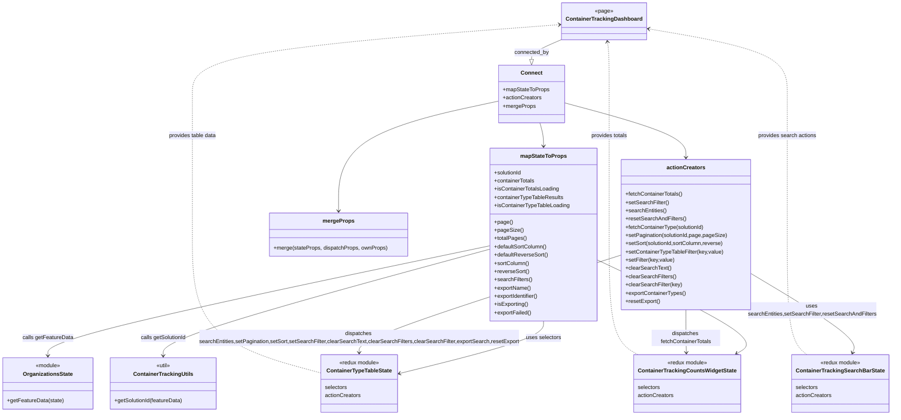

# Diagram: web/portal/src/pages/containertracking/dashboard/ContainerTracking.Dashboard.page.container.js

> Auto-generated by Obscura crawlers

## Mermaid

### SVG

<svg id="container" width="2585.234375" xmlns="http://www.w3.org/2000/svg" class="classDiagram" height="1210" viewBox="0 0 2585.234375 1210" role="graphics-document document" aria-roledescription="class"><g><defs><marker id="container_class-aggregationStart" class="marker aggregation class" refX="18" refY="7" markerWidth="190" markerHeight="240" orient="auto"><path d="M 18,7 L9,13 L1,7 L9,1 Z"></path></marker></defs><defs><marker id="container_class-aggregationEnd" class="marker aggregation class" refX="1" refY="7" markerWidth="20" markerHeight="28" orient="auto"><path d="M 18,7 L9,13 L1,7 L9,1 Z"></path></marker></defs><defs><marker id="container_class-extensionStart" class="marker extension class" refX="18" refY="7" markerWidth="190" markerHeight="240" orient="auto"><path d="M 1,7 L18,13 V 1 Z"></path></marker></defs><defs><marker id="container_class-extensionEnd" class="marker extension class" refX="1" refY="7" markerWidth="20" markerHeight="28" orient="auto"><path d="M 1,1 V 13 L18,7 Z"></path></marker></defs><defs><marker id="container_class-compositionStart" class="marker composition class" refX="18" refY="7" markerWidth="190" markerHeight="240" orient="auto"><path d="M 18,7 L9,13 L1,7 L9,1 Z"></path></marker></defs><defs><marker id="container_class-compositionEnd" class="marker composition class" refX="1" refY="7" markerWidth="20" markerHeight="28" orient="auto"><path d="M 18,7 L9,13 L1,7 L9,1 Z"></path></marker></defs><defs><marker id="container_class-dependencyStart" class="marker dependency class" refX="6" refY="7" markerWidth="190" markerHeight="240" orient="auto"><path d="M 5,7 L9,13 L1,7 L9,1 Z"></path></marker></defs><defs><marker id="container_class-dependencyEnd" class="marker dependency class" refX="13" refY="7" markerWidth="20" markerHeight="28" orient="auto"><path d="M 18,7 L9,13 L14,7 L9,1 Z"></path></marker></defs><defs><marker id="container_class-lollipopStart" class="marker lollipop class" refX="13" refY="7" markerWidth="190" markerHeight="240" orient="auto"><circle stroke="black" fill="transparent" cx="7" cy="7" r="6"></circle></marker></defs><defs><marker id="container_class-lollipopEnd" class="marker lollipop class" refX="1" refY="7" markerWidth="190" markerHeight="240" orient="auto"><circle stroke="black" fill="transparent" cx="7" cy="7" r="6"></circle></marker></defs><g class="root"><g class="clusters"></g><g class="edgePaths"><path d="M1643.633,113.46L1628.528,120.05C1613.423,126.64,1583.214,139.82,1568.109,149.702C1553.004,159.583,1553.004,166.167,1553.004,169.458L1553.004,172.75" id="id_ContainerTrackingDashboard_Connect_1" class="edge-thickness-normal edge-pattern-solid relation" style=";;;" data-edge="true" data-et="edge" data-id="id_ContainerTrackingDashboard_Connect_1" data-points="W3sieCI6MTY0My42MzI4MTI1LCJ5IjoxMTMuNDYwNDk0MDM1MjQ1NDN9LHsieCI6MTU1My4wMDM5MDYyNSwieSI6MTUzfSx7IngiOjE1NTMuMDAzOTA2MjUsInkiOjE5MH1d" marker-end="url(#container_class-extensionEnd)"></path><path d="M1572.331,358L1573.75,364.167C1575.168,370.333,1578.006,382.667,1579.425,394C1580.844,405.333,1580.844,415.667,1580.844,420.833L1580.844,426" id="id_Connect_mapStateToProps_2" class="edge-thickness-normal edge-pattern-solid relation" style=";;;" data-edge="true" data-et="edge" data-id="id_Connect_mapStateToProps_2" data-points="W3sieCI6MTU3Mi4zMzA3Mzk5Mjc2ODYsInkiOjM1OH0seyJ4IjoxNTgwLjg0Mzc1LCJ5IjozOTV9LHsieCI6MTU4MC44NDM3NSwieSI6NDMyfV0=" marker-end="url(#container_class-dependencyEnd)"></path><path d="M1458.668,294.084L1379.668,310.904C1300.669,327.723,1142.669,361.361,1063.67,414.847C984.67,468.333,984.67,541.667,984.67,578.333L984.67,615" id="id_Connect_mergeProps_3" class="edge-thickness-normal edge-pattern-solid relation" style=";;;" data-edge="true" data-et="edge" data-id="id_Connect_mergeProps_3" data-points="W3sieCI6MTQ1OC42Njc5Njg3NSwieSI6Mjk0LjA4NDQwMjM5NTk4MzN9LHsieCI6OTg0LjY2OTkyMTg3NSwieSI6Mzk1fSx7IngiOjk4NC42Njk5MjE4NzUsInkiOjYyMX1d" marker-end="url(#container_class-dependencyEnd)"></path><path d="M1647.34,299.957L1704.908,315.798C1762.477,331.638,1877.613,363.319,1935.182,389.826C1992.75,416.333,1992.75,437.667,1992.75,448.333L1992.75,459" id="id_Connect_actionCreators_4" class="edge-thickness-normal edge-pattern-solid relation" style=";;;" data-edge="true" data-et="edge" data-id="id_Connect_actionCreators_4" data-points="W3sieCI6MTY0Ny4zMzk4NDM3NSwieSI6Mjk5Ljk1NzM2MTc1ODgyNzQ2fSx7IngiOjE5OTIuNzUsInkiOjM5NX0seyJ4IjoxOTkyLjc1LCJ5Ijo0NjV9XQ==" marker-end="url(#container_class-dependencyEnd)"></path><path d="M1580.844,936L1580.844,944.167C1580.844,952.333,1580.844,968.667,1510.758,994.19C1440.672,1019.713,1300.5,1054.426,1230.414,1071.783L1160.328,1089.139" id="id_mapStateToProps_ContainerTypeTableState_5" class="edge-thickness-normal edge-pattern-solid relation" style=";;;" data-edge="true" data-et="edge" data-id="id_mapStateToProps_ContainerTypeTableState_5" data-points="W3sieCI6MTU4MC44NDM3NSwieSI6OTM2fSx7IngiOjE1ODAuODQzNzUsInkiOjk4NX0seyJ4IjoxMTU0LjUwMzkwNjI1LCJ5IjoxMDkwLjU4MTc5NzQxOTM3MzV9XQ==" marker-end="url(#container_class-dependencyEnd)"></path><path d="M1735.426,757.999L1814.458,795.833C1893.491,833.666,2051.556,909.333,2118.283,954.806C2185.01,1000.278,2160.399,1015.557,2148.093,1023.196L2135.787,1030.835" id="id_mapStateToProps_ContainerTrackingCountsWidgetState_6" class="edge-thickness-normal edge-pattern-solid relation" style=";;;" data-edge="true" data-et="edge" data-id="id_mapStateToProps_ContainerTrackingCountsWidgetState_6" data-points="W3sieCI6MTczNS40MjU3ODEyNSwieSI6NzU3Ljk5OTQ3MTk0MTQ1Mzl9LHsieCI6MjIwOS42MjEwOTM3NSwieSI6OTg1fSx7IngiOjIxMzAuNjg5NzYxNTEzMTU4LCJ5IjoxMDM0fV0=" marker-end="url(#container_class-dependencyEnd)"></path><path d="M1426.262,716.228L1211.398,761.023C996.535,805.818,566.809,895.409,351.945,948.871C137.082,1002.333,137.082,1019.667,137.082,1028.333L137.082,1037" id="id_mapStateToProps_OrganizationsState_7" class="edge-thickness-normal edge-pattern-solid relation" style=";;;" data-edge="true" data-et="edge" data-id="id_mapStateToProps_OrganizationsState_7" data-points="W3sieCI6MTQyNi4yNjE3MTg3NSwieSI6NzE2LjIyNzc0OTc3NDc1ODN9LHsieCI6MTM3LjA4MjAzMTI1LCJ5Ijo5ODV9LHsieCI6MTM3LjA4MjAzMTI1LCJ5IjoxMDQzfV0=" marker-end="url(#container_class-dependencyEnd)"></path><path d="M1426.262,725.907L1266.977,769.089C1107.693,812.272,789.124,898.636,629.839,950.485C470.555,1002.333,470.555,1019.667,470.555,1028.333L470.555,1037" id="id_mapStateToProps_ContainerTrackingUtils_8" class="edge-thickness-normal edge-pattern-solid relation" style=";;;" data-edge="true" data-et="edge" data-id="id_mapStateToProps_ContainerTrackingUtils_8" data-points="W3sieCI6MTQyNi4yNjE3MTg3NSwieSI6NzI1LjkwNzI3NzEwMjY2ODl9LHsieCI6NDcwLjU1NDY4NzUsInkiOjk4NX0seyJ4Ijo0NzAuNTU0Njg3NSwieSI6MTA0M31d" marker-end="url(#container_class-dependencyEnd)"></path><path d="M1992.75,903L1992.75,916.667C1992.75,930.333,1992.75,957.667,1992.892,978.5C1993.033,999.334,1993.317,1013.667,1993.458,1020.834L1993.6,1028.001" id="id_actionCreators_ContainerTrackingCountsWidgetState_9" class="edge-thickness-normal edge-pattern-solid relation" style=";;;" data-edge="true" data-et="edge" data-id="id_actionCreators_ContainerTrackingCountsWidgetState_9" data-points="W3sieCI6MTk5Mi43NSwieSI6OTAzfSx7IngiOjE5OTIuNzUsInkiOjk4NX0seyJ4IjoxOTkzLjcxODU0NDQwNzg5NDgsInkiOjEwMzR9XQ==" marker-end="url(#container_class-dependencyEnd)"></path><path d="M2180.074,797.924L2231.342,829.103C2282.611,860.282,2385.147,922.641,2433.944,961.041C2482.74,999.441,2477.797,1013.882,2475.325,1021.103L2472.854,1028.323" id="id_actionCreators_ContainerTrackingSearchBarState_10" class="edge-thickness-normal edge-pattern-solid relation" style=";;;" data-edge="true" data-et="edge" data-id="id_actionCreators_ContainerTrackingSearchBarState_10" data-points="W3sieCI6MjE4MC4wNzQyMTg3NSwieSI6Nzk3LjkyMzU0NTYxNDU0NzR9LHsieCI6MjQ4Ny42ODM1OTM3NSwieSI6OTg1fSx7IngiOjI0NzAuOTEwMzYxODQyMTA1NCwieSI6MTAzNH1d" marker-end="url(#container_class-dependencyEnd)"></path><path d="M1805.426,743.417L1678.486,783.681C1551.547,823.945,1297.668,904.472,1170.729,951.903C1043.789,999.333,1043.789,1013.667,1043.789,1020.833L1043.789,1028" id="id_actionCreators_ContainerTypeTableState_11" class="edge-thickness-normal edge-pattern-solid relation" style=";;;" data-edge="true" data-et="edge" data-id="id_actionCreators_ContainerTypeTableState_11" data-points="W3sieCI6MTgwNS40MjU3ODEyNSwieSI6NzQzLjQxNzE4NzM4NDIyNzl9LHsieCI6MTA0My43ODkwNjI1LCJ5Ijo5ODV9LHsieCI6MTA0My43ODkwNjI1LCJ5IjoxMDM0fV0=" marker-end="url(#container_class-dependencyEnd)"></path><path d="M933.074,1087.683L870.575,1070.57C808.076,1053.456,683.077,1019.228,620.577,951.947C558.078,884.667,558.078,784.333,558.078,686C558.078,587.667,558.078,491.333,558.078,423C558.078,354.667,558.078,314.333,558.078,274C558.078,233.667,558.078,193.333,738.007,159.562C917.935,125.79,1277.793,98.581,1457.721,84.976L1637.65,71.371" id="id_ContainerTypeTableState_ContainerTrackingDashboard_12" class="edge-thickness-normal edge-pattern-dashed relation" style=";;;" data-edge="true" data-et="edge" data-id="id_ContainerTypeTableState_ContainerTrackingDashboard_12" data-points="W3sieCI6OTMzLjA3NDIxODc1LCJ5IjoxMDg3LjY4MzQ2MTc0MjYxMzJ9LHsieCI6NTU4LjA3ODEyNSwieSI6OTg1fSx7IngiOjU1OC4wNzgxMjUsInkiOjY4NH0seyJ4Ijo1NTguMDc4MTI1LCJ5IjozOTV9LHsieCI6NTU4LjA3ODEyNSwieSI6Mjc0fSx7IngiOjU1OC4wNzgxMjUsInkiOjE1M30seyJ4IjoxNjQzLjYzMjgxMjUsInkiOjcwLjkxODcwNzY4MzkxODc1fV0=" marker-end="url(#container_class-dependencyEnd)"></path><path d="M1853.303,1034L1839.49,1025.833C1825.677,1017.667,1798.052,1001.333,1784.239,943C1770.426,884.667,1770.426,784.333,1770.426,686C1770.426,587.667,1770.426,491.333,1770.426,423C1770.426,354.667,1770.426,314.333,1770.426,274C1770.426,233.667,1770.426,193.333,1769.923,167.995C1769.421,142.657,1768.416,132.315,1767.914,127.143L1767.412,121.972" id="id_ContainerTrackingCountsWidgetState_ContainerTrackingDashboard_13" class="edge-thickness-normal edge-pattern-dashed relation" style=";;;" data-edge="true" data-et="edge" data-id="id_ContainerTrackingCountsWidgetState_ContainerTrackingDashboard_13" data-points="W3sieCI6MTg1My4zMDMyNDgzNTUyNjMxLCJ5IjoxMDM0fSx7IngiOjE3NzAuNDI1NzgxMjUsInkiOjk4NX0seyJ4IjoxNzcwLjQyNTc4MTI1LCJ5Ijo2ODR9LHsieCI6MTc3MC40MjU3ODEyNSwieSI6Mzk1fSx7IngiOjE3NzAuNDI1NzgxMjUsInkiOjI3NH0seyJ4IjoxNzcwLjQyNTc4MTI1LCJ5IjoxNTN9LHsieCI6MTc2Ni44MzE1NTkwNjU5MzQsInkiOjExNn1d" marker-end="url(#container_class-dependencyEnd)"></path><path d="M2340.351,1034L2330.453,1025.833C2320.556,1017.667,2300.76,1001.333,2290.863,943C2280.965,884.667,2280.965,784.333,2280.965,686C2280.965,587.667,2280.965,491.333,2280.965,423C2280.965,354.667,2280.965,314.333,2280.965,274C2280.965,233.667,2280.965,193.333,2215.046,161.617C2149.126,129.901,2017.288,106.801,1951.368,95.252L1885.449,83.702" id="id_ContainerTrackingSearchBarState_ContainerTrackingDashboard_14" class="edge-thickness-normal edge-pattern-dashed relation" style=";;;" data-edge="true" data-et="edge" data-id="id_ContainerTrackingSearchBarState_ContainerTrackingDashboard_14" data-points="W3sieCI6MjM0MC4zNTExNTEzMTU3ODk2LCJ5IjoxMDM0fSx7IngiOjIyODAuOTY0ODQzNzUsInkiOjk4NX0seyJ4IjoyMjgwLjk2NDg0Mzc1LCJ5Ijo2ODR9LHsieCI6MjI4MC45NjQ4NDM3NSwieSI6Mzk1fSx7IngiOjIyODAuOTY0ODQzNzUsInkiOjI3NH0seyJ4IjoyMjgwLjk2NDg0Mzc1LCJ5IjoxNTN9LHsieCI6MTg3OS41MzkwNjI1LCJ5Ijo4Mi42NjY0ODExNDg2MDc0OX1d" marker-end="url(#container_class-dependencyEnd)"></path></g><g class="edgeLabels"><g class="edgeLabel" transform="translate(1553.00390625, 153)"><g class="label" data-id="id_ContainerTrackingDashboard_Connect_1" transform="translate(-50.625, -12)"><foreignObject width="101.25" height="24">

connected_by

</foreignObject></g></g><g class="edgeLabel"><g class="label" data-id="id_Connect_mapStateToProps_2" transform="translate(0, 0)"><foreignObject width="0" height="0">

</foreignObject></g></g><g class="edgeLabel"><g class="label" data-id="id_Connect_mergeProps_3" transform="translate(0, 0)"><foreignObject width="0" height="0">

</foreignObject></g></g><g class="edgeLabel"><g class="label" data-id="id_Connect_actionCreators_4" transform="translate(0, 0)"><foreignObject width="0" height="0">

</foreignObject></g></g><g class="edgeLabel" transform="translate(1580.84375, 985)"><g class="label" data-id="id_mapStateToProps_ContainerTypeTableState_5" transform="translate(-51.34375, -12)"><foreignObject width="102.6875" height="24">

uses selectors

</foreignObject></g></g><g class="edgeLabel" transform="translate(2014.42211, 891.55691)"><g class="label" data-id="id_mapStateToProps_ContainerTrackingCountsWidgetState_6" transform="translate(-51.34375, -12)"><foreignObject width="102.6875" height="24">

uses selectors

</foreignObject></g></g><g class="edgeLabel" transform="translate(137.08203125, 985)"><g class="label" data-id="id_mapStateToProps_OrganizationsState_7" transform="translate(-73.484375, -12)"><foreignObject width="146.96875" height="24">

calls getFeatureData

</foreignObject></g></g><g class="edgeLabel" transform="translate(470.5546875, 985)"><g class="label" data-id="id_mapStateToProps_ContainerTrackingUtils_8" transform="translate(-67.5234375, -12)"><foreignObject width="135.046875" height="24">

calls getSolutionId

</foreignObject></g></g><g class="edgeLabel" transform="translate(1992.75, 985)"><g class="label" data-id="id_actionCreators_ContainerTrackingCountsWidgetState_9" transform="translate(-100, -24)"><foreignObject width="200" height="48">

dispatches fetchContainerTotals

</foreignObject></g></g><g class="edgeLabel" transform="translate(2356.00418, 904.91753)"><g class="label" data-id="id_actionCreators_ContainerTrackingSearchBarState_10" transform="translate(-186.71875, -24)"><foreignObject width="373.4375" height="48">

uses searchEntities,setSearchFilter,resetSearchAndFilters

</foreignObject></g></g><g class="edgeLabel" transform="translate(1043.7890625, 985)"><g class="label" data-id="id_actionCreators_ContainerTypeTableState_11" transform="translate(-465.7109375, -24)"><foreignObject width="931.421875" height="48">

dispatches searchEntities,setPagination,setSort,setSearchFilter,clearSearchText,clearSearchFilters,clearSearchFilter,exportSearch,resetExport

</foreignObject></g></g><g class="edgeLabel" transform="translate(558.078125, 395)"><g class="label" data-id="id_ContainerTypeTableState_ContainerTrackingDashboard_12" transform="translate(-70.4765625, -12)"><foreignObject width="140.953125" height="24">

provides table data

</foreignObject></g></g><g class="edgeLabel" transform="translate(1770.42578125, 395)"><g class="label" data-id="id_ContainerTrackingCountsWidgetState_ContainerTrackingDashboard_13" transform="translate(-54.0625, -12)"><foreignObject width="108.125" height="24">

provides totals

</foreignObject></g></g><g class="edgeLabel" transform="translate(2280.96484375, 395)"><g class="label" data-id="id_ContainerTrackingSearchBarState_ContainerTrackingDashboard_14" transform="translate(-85.703125, -12)"><foreignObject width="171.40625" height="24">

provides search actions

</foreignObject></g></g></g><g class="nodes"><g class="node default" id="classId-ContainerTrackingDashboard-0" transform="translate(1761.5859375, 62)"><g class="basic label-container"><path d="M-117.953125 -54 L117.953125 -54 L117.953125 54 L-117.953125 54" stroke="none" stroke-width="0" fill="#ECECFF" style=""></path><path d="M-117.953125 -54 C-64.10055410953936 -54, -10.247983219078733 -54, 117.953125 -54 M-117.953125 -54 C-55.903460164713294 -54, 6.146204670573411 -54, 117.953125 -54 M117.953125 -54 C117.953125 -16.451009919548163, 117.953125 21.097980160903674, 117.953125 54 M117.953125 -54 C117.953125 -25.275614329961158, 117.953125 3.448771340077684, 117.953125 54 M117.953125 54 C24.39270500761434 54, -69.16771498477132 54, -117.953125 54 M117.953125 54 C57.30224897935551 54, -3.348627041288978 54, -117.953125 54 M-117.953125 54 C-117.953125 31.154555760733015, -117.953125 8.30911152146603, -117.953125 -54 M-117.953125 54 C-117.953125 18.559964159188382, -117.953125 -16.880071681623235, -117.953125 -54" stroke="#9370DB" stroke-width="1.3" fill="none" stroke-dasharray="0 0" style=""></path></g><g class="annotation-group text" transform="translate(-26.3046875, -30)"><g class="label" style="" transform="translate(0,-12)"><foreignObject width="52.609375" height="24">

«page»

</foreignObject></g></g><g class="label-group text" transform="translate(-105.953125, -6)"><g class="label" style="font-weight: bolder" transform="translate(0,-12)"><foreignObject width="211.90625" height="24">

ContainerTrackingDashboard

</foreignObject></g></g><g class="members-group text" transform="translate(-105.953125, 42)"></g><g class="methods-group text" transform="translate(-105.953125, 72)"></g><g class="divider" style=""><path d="M-117.953125 18 C-54.79221244933403 18, 8.368700101331939 18, 117.953125 18 M-117.953125 18 C-56.24568099935796 18, 5.461763001284083 18, 117.953125 18" stroke="#9370DB" stroke-width="1.3" fill="none" stroke-dasharray="0 0" style=""></path></g><g class="divider" style=""><path d="M-117.953125 36 C-48.13963351323544 36, 21.673857973529124 36, 117.953125 36 M-117.953125 36 C-41.239320950968434 36, 35.47448309806313 36, 117.953125 36" stroke="#9370DB" stroke-width="1.3" fill="none" stroke-dasharray="0 0" style=""></path></g></g><g class="node default" id="classId-Connect-1" transform="translate(1553.00390625, 274)"><g class="basic label-container"><path d="M-94.3359375 -84 L94.3359375 -84 L94.3359375 84 L-94.3359375 84" stroke="none" stroke-width="0" fill="#ECECFF" style=""></path><path d="M-94.3359375 -84 C-47.38064761847636 -84, -0.4253577369527193 -84, 94.3359375 -84 M-94.3359375 -84 C-50.241614410359965 -84, -6.14729132071993 -84, 94.3359375 -84 M94.3359375 -84 C94.3359375 -48.937199153708804, 94.3359375 -13.874398307417607, 94.3359375 84 M94.3359375 -84 C94.3359375 -18.560297269626645, 94.3359375 46.87940546074671, 94.3359375 84 M94.3359375 84 C37.254786570952646 84, -19.826364358094708 84, -94.3359375 84 M94.3359375 84 C38.303988028754965 84, -17.72796144249007 84, -94.3359375 84 M-94.3359375 84 C-94.3359375 18.101474926202187, -94.3359375 -47.79705014759563, -94.3359375 -84 M-94.3359375 84 C-94.3359375 18.059704073791593, -94.3359375 -47.88059185241681, -94.3359375 -84" stroke="#9370DB" stroke-width="1.3" fill="none" stroke-dasharray="0 0" style=""></path></g><g class="annotation-group text" transform="translate(0, -60)"></g><g class="label-group text" transform="translate(-29.6875, -60)"><g class="label" style="font-weight: bolder" transform="translate(0,-12)"><foreignObject width="59.375" height="24">

Connect

</foreignObject></g></g><g class="members-group text" transform="translate(-82.3359375, -12)"><g class="label" style="" transform="translate(0,-12)"><foreignObject width="134.984375" height="24">

+mapStateToProps

</foreignObject></g><g class="label" style="" transform="translate(0,12)"><foreignObject width="113.078125" height="24">

+actionCreators

</foreignObject></g><g class="label" style="" transform="translate(0,36)"><foreignObject width="94.140625" height="24">

+mergeProps

</foreignObject></g></g><g class="methods-group text" transform="translate(-82.3359375, 84)"></g><g class="divider" style=""><path d="M-94.3359375 -36 C-23.451217415631504 -36, 47.43350266873699 -36, 94.3359375 -36 M-94.3359375 -36 C-53.904790471919256 -36, -13.473643443838512 -36, 94.3359375 -36" stroke="#9370DB" stroke-width="1.3" fill="none" stroke-dasharray="0 0" style=""></path></g><g class="divider" style=""><path d="M-94.3359375 60 C-48.92224623706721 60, -3.5085549741344266 60, 94.3359375 60 M-94.3359375 60 C-43.06317226676089 60, 8.209592966478226 60, 94.3359375 60" stroke="#9370DB" stroke-width="1.3" fill="none" stroke-dasharray="0 0" style=""></path></g></g><g class="node default" id="classId-mapStateToProps-2" transform="translate(1580.84375, 684)"><g class="basic label-container"><path d="M-154.58203125 -252 L154.58203125 -252 L154.58203125 252 L-154.58203125 252" stroke="none" stroke-width="0" fill="#ECECFF" style=""></path><path d="M-154.58203125 -252 C-48.45377426095122 -252, 57.67448272809756 -252, 154.58203125 -252 M-154.58203125 -252 C-64.09094007574043 -252, 26.40015109851913 -252, 154.58203125 -252 M154.58203125 -252 C154.58203125 -61.439721940355184, 154.58203125 129.12055611928963, 154.58203125 252 M154.58203125 -252 C154.58203125 -120.34361160781481, 154.58203125 11.312776784370385, 154.58203125 252 M154.58203125 252 C61.250028465126206 252, -32.08197431974759 252, -154.58203125 252 M154.58203125 252 C85.13234818112178 252, 15.68266511224357 252, -154.58203125 252 M-154.58203125 252 C-154.58203125 139.78473445189496, -154.58203125 27.569468903789954, -154.58203125 -252 M-154.58203125 252 C-154.58203125 150.10137674572582, -154.58203125 48.20275349145166, -154.58203125 -252" stroke="#9370DB" stroke-width="1.3" fill="none" stroke-dasharray="0 0" style=""></path></g><g class="annotation-group text" transform="translate(0, -228)"></g><g class="label-group text" transform="translate(-64.7109375, -228)"><g class="label" style="font-weight: bolder" transform="translate(0,-12)"><foreignObject width="129.421875" height="24">

mapStateToProps

</foreignObject></g></g><g class="members-group text" transform="translate(-142.58203125, -180)"><g class="label" style="" transform="translate(0,-12)"><foreignObject width="82.109375" height="24">

+solutionId

</foreignObject></g><g class="label" style="" transform="translate(0,12)"><foreignObject width="120.296875" height="24">

+containerTotals

</foreignObject></g><g class="label" style="" transform="translate(0,36)"><foreignObject width="190.828125" height="24">

+isContainerTotalsLoading

</foreignObject></g><g class="label" style="" transform="translate(0,60)"><foreignObject width="202.8125" height="24">

+containerTypeTableResults

</foreignObject></g><g class="label" style="" transform="translate(0,84)"><foreignObject width="220.453125" height="24">

+isContainerTypeTableLoading

</foreignObject></g></g><g class="methods-group text" transform="translate(-142.58203125, -36)"><g class="label" style="" transform="translate(0,-12)"><foreignObject width="53.03125" height="24">

+page()

</foreignObject></g><g class="label" style="" transform="translate(0,12)"><foreignObject width="81.859375" height="24">

+pageSize()

</foreignObject></g><g class="label" style="" transform="translate(0,36)"><foreignObject width="93.265625" height="24">

+totalPages()

</foreignObject></g><g class="label" style="" transform="translate(0,60)"><foreignObject width="155.21875" height="24">

+defaultSortColumn()

</foreignObject></g><g class="label" style="" transform="translate(0,84)"><foreignObject width="156.90625" height="24">

+defaultReverseSort()

</foreignObject></g><g class="label" style="" transform="translate(0,108)"><foreignObject width="102.203125" height="24">

+sortColumn()

</foreignObject></g><g class="label" style="" transform="translate(0,132)"><foreignObject width="101.390625" height="24">

+reverseSort()

</foreignObject></g><g class="label" style="" transform="translate(0,156)"><foreignObject width="109.96875" height="24">

+searchFilters()

</foreignObject></g><g class="label" style="" transform="translate(0,180)"><foreignObject width="107.5625" height="24">

+exportName()

</foreignObject></g><g class="label" style="" transform="translate(0,204)"><foreignObject width="132.265625" height="24">

+exportIdentifier()

</foreignObject></g><g class="label" style="" transform="translate(0,228)"><foreignObject width="99.671875" height="24">

+isExporting()

</foreignObject></g><g class="label" style="" transform="translate(0,252)"><foreignObject width="108.5" height="24">

+exportFailed()

</foreignObject></g></g><g class="divider" style=""><path d="M-154.58203125 -204 C-84.51514028215766 -204, -14.44824931431532 -204, 154.58203125 -204 M-154.58203125 -204 C-45.78666337557176 -204, 63.008704498856474 -204, 154.58203125 -204" stroke="#9370DB" stroke-width="1.3" fill="none" stroke-dasharray="0 0" style=""></path></g><g class="divider" style=""><path d="M-154.58203125 -60 C-92.18431463482705 -60, -29.78659801965408 -60, 154.58203125 -60 M-154.58203125 -60 C-31.8121604303808 -60, 90.9577103892384 -60, 154.58203125 -60" stroke="#9370DB" stroke-width="1.3" fill="none" stroke-dasharray="0 0" style=""></path></g></g><g class="node default" id="classId-mergeProps-3" transform="translate(984.669921875, 684)"><g class="basic label-container"><path d="M-199.4765625 -63 L199.4765625 -63 L199.4765625 63 L-199.4765625 63" stroke="none" stroke-width="0" fill="#ECECFF" style=""></path><path d="M-199.4765625 -63 C-77.13433826555276 -63, 45.20788596889449 -63, 199.4765625 -63 M-199.4765625 -63 C-96.93143537724062 -63, 5.613691745518764 -63, 199.4765625 -63 M199.4765625 -63 C199.4765625 -31.52383523680701, 199.4765625 -0.047670473614019215, 199.4765625 63 M199.4765625 -63 C199.4765625 -20.57755718880047, 199.4765625 21.84488562239906, 199.4765625 63 M199.4765625 63 C73.74492923346679 63, -51.98670403306642 63, -199.4765625 63 M199.4765625 63 C98.76494142794924 63, -1.946679644101522 63, -199.4765625 63 M-199.4765625 63 C-199.4765625 23.87015421893387, -199.4765625 -15.25969156213226, -199.4765625 -63 M-199.4765625 63 C-199.4765625 35.434209119798865, -199.4765625 7.868418239597723, -199.4765625 -63" stroke="#9370DB" stroke-width="1.3" fill="none" stroke-dasharray="0 0" style=""></path></g><g class="annotation-group text" transform="translate(0, -39)"></g><g class="label-group text" transform="translate(-43.859375, -39)"><g class="label" style="font-weight: bolder" transform="translate(0,-12)"><foreignObject width="87.71875" height="24">

mergeProps

</foreignObject></g></g><g class="members-group text" transform="translate(-187.4765625, 9)"></g><g class="methods-group text" transform="translate(-187.4765625, 39)"><g class="label" style="" transform="translate(0,-12)"><foreignObject width="331.09375" height="24">

+merge(stateProps, dispatchProps, ownProps)

</foreignObject></g></g><g class="divider" style=""><path d="M-199.4765625 -15 C-69.02100789878045 -15, 61.43454670243909 -15, 199.4765625 -15 M-199.4765625 -15 C-47.68201774018087 -15, 104.11252701963826 -15, 199.4765625 -15" stroke="#9370DB" stroke-width="1.3" fill="none" stroke-dasharray="0 0" style=""></path></g><g class="divider" style=""><path d="M-199.4765625 9 C-82.01211940996008 9, 35.45232368007984 9, 199.4765625 9 M-199.4765625 9 C-115.72882883777658 9, -31.98109517555315 9, 199.4765625 9" stroke="#9370DB" stroke-width="1.3" fill="none" stroke-dasharray="0 0" style=""></path></g></g><g class="node default" id="classId-actionCreators-4" transform="translate(1992.75, 684)"><g class="basic label-container"><path d="M-187.32421875 -219 L187.32421875 -219 L187.32421875 219 L-187.32421875 219" stroke="none" stroke-width="0" fill="#ECECFF" style=""></path><path d="M-187.32421875 -219 C-50.58252945328789 -219, 86.15915984342422 -219, 187.32421875 -219 M-187.32421875 -219 C-41.487840898429596 -219, 104.34853695314081 -219, 187.32421875 -219 M187.32421875 -219 C187.32421875 -48.23052533715014, 187.32421875 122.53894932569972, 187.32421875 219 M187.32421875 -219 C187.32421875 -115.43006598046878, 187.32421875 -11.860131960937565, 187.32421875 219 M187.32421875 219 C84.11352931849947 219, -19.097160113001053 219, -187.32421875 219 M187.32421875 219 C94.57437076617795 219, 1.8245227823558992 219, -187.32421875 219 M-187.32421875 219 C-187.32421875 92.75673916908502, -187.32421875 -33.486521661829954, -187.32421875 -219 M-187.32421875 219 C-187.32421875 80.5020204133028, -187.32421875 -57.9959591733944, -187.32421875 -219" stroke="#9370DB" stroke-width="1.3" fill="none" stroke-dasharray="0 0" style=""></path></g><g class="annotation-group text" transform="translate(0, -195)"></g><g class="label-group text" transform="translate(-53.6328125, -195)"><g class="label" style="font-weight: bolder" transform="translate(0,-12)"><foreignObject width="107.265625" height="24">

actionCreators

</foreignObject></g></g><g class="members-group text" transform="translate(-175.32421875, -147)"></g><g class="methods-group text" transform="translate(-175.32421875, -117)"><g class="label" style="" transform="translate(0,-12)"><foreignObject width="168.21875" height="24">

+fetchContainerTotals()

</foreignObject></g><g class="label" style="" transform="translate(0,12)"><foreignObject width="125.953125" height="24">

+setSearchFilter()

</foreignObject></g><g class="label" style="" transform="translate(0,36)"><foreignObject width="120.359375" height="24">

+searchEntities()

</foreignObject></g><g class="label" style="" transform="translate(0,60)"><foreignObject width="175.71875" height="24">

+resetSearchAndFilters()

</foreignObject></g><g class="label" style="" transform="translate(0,84)"><foreignObject width="232.953125" height="24">

+fetchContainerType(solutionId)

</foreignObject></g><g class="label" style="" transform="translate(0,108)"><foreignObject width="297.015625" height="24">

+setPagination(solutionId,page,pageSize)

</foreignObject></g><g class="label" style="" transform="translate(0,132)"><foreignObject width="289.046875" height="24">

+setSort(solutionId,sortColumn,reverse)

</foreignObject></g><g class="label" style="" transform="translate(0,156)"><foreignObject width="286.515625" height="24">

+setContainerTypeTableFilter(key,value)

</foreignObject></g><g class="label" style="" transform="translate(0,180)"><foreignObject width="143.265625" height="24">

+setFilter(key,value)

</foreignObject></g><g class="label" style="" transform="translate(0,204)"><foreignObject width="132.265625" height="24">

+clearSearchText()

</foreignObject></g><g class="label" style="" transform="translate(0,228)"><foreignObject width="146.921875" height="24">

+clearSearchFilters()

</foreignObject></g><g class="label" style="" transform="translate(0,252)"><foreignObject width="164.265625" height="24">

+clearSearchFilter(key)

</foreignObject></g><g class="label" style="" transform="translate(0,276)"><foreignObject width="177.203125" height="24">

+exportContainerTypes()

</foreignObject></g><g class="label" style="" transform="translate(0,300)"><foreignObject width="101.859375" height="24">

+resetExport()

</foreignObject></g></g><g class="divider" style=""><path d="M-187.32421875 -171 C-71.4773504807906 -171, 44.36951778841879 -171, 187.32421875 -171 M-187.32421875 -171 C-99.04470542740307 -171, -10.765192104806147 -171, 187.32421875 -171" stroke="#9370DB" stroke-width="1.3" fill="none" stroke-dasharray="0 0" style=""></path></g><g class="divider" style=""><path d="M-187.32421875 -147 C-93.68326550683099 -147, -0.04231226366198371 -147, 187.32421875 -147 M-187.32421875 -147 C-51.922867616976475 -147, 83.47848351604705 -147, 187.32421875 -147" stroke="#9370DB" stroke-width="1.3" fill="none" stroke-dasharray="0 0" style=""></path></g></g><g class="node default" id="classId-ContainerTypeTableState-5" transform="translate(1043.7890625, 1118)"><g class="basic label-container"><path d="M-110.71484375 -84 L110.71484375 -84 L110.71484375 84 L-110.71484375 84" stroke="none" stroke-width="0" fill="#ECECFF" style=""></path><path d="M-110.71484375 -84 C-28.356842847108055 -84, 54.00115805578389 -84, 110.71484375 -84 M-110.71484375 -84 C-56.896020301625185 -84, -3.0771968532503706 -84, 110.71484375 -84 M110.71484375 -84 C110.71484375 -32.62975050558, 110.71484375 18.740498988840002, 110.71484375 84 M110.71484375 -84 C110.71484375 -21.51905885772461, 110.71484375 40.96188228455078, 110.71484375 84 M110.71484375 84 C29.91826103476747 84, -50.87832168046506 84, -110.71484375 84 M110.71484375 84 C50.55810160902354 84, -9.598640531952924 84, -110.71484375 84 M-110.71484375 84 C-110.71484375 41.20123311805569, -110.71484375 -1.5975337638886202, -110.71484375 -84 M-110.71484375 84 C-110.71484375 19.082916020027483, -110.71484375 -45.834167959945034, -110.71484375 -84" stroke="#9370DB" stroke-width="1.3" fill="none" stroke-dasharray="0 0" style=""></path></g><g class="annotation-group text" transform="translate(-59.25, -60)"><g class="label" style="" transform="translate(0,-12)"><foreignObject width="118.5" height="24">

«redux module»

</foreignObject></g></g><g class="label-group text" transform="translate(-92.0859375, -36)"><g class="label" style="font-weight: bolder" transform="translate(0,-12)"><foreignObject width="184.171875" height="24">

ContainerTypeTableState

</foreignObject></g></g><g class="members-group text" transform="translate(-98.71484375, 12)"><g class="label" style="" transform="translate(0,-12)"><foreignObject width="65.46875" height="24">

selectors

</foreignObject></g><g class="label" style="" transform="translate(0,12)"><foreignObject width="105.34375" height="24">

actionCreators

</foreignObject></g></g><g class="methods-group text" transform="translate(-98.71484375, 84)"></g><g class="divider" style=""><path d="M-110.71484375 -12 C-57.74789159093493 -12, -4.780939431869854 -12, 110.71484375 -12 M-110.71484375 -12 C-27.206065406397116 -12, 56.30271293720577 -12, 110.71484375 -12" stroke="#9370DB" stroke-width="1.3" fill="none" stroke-dasharray="0 0" style=""></path></g><g class="divider" style=""><path d="M-110.71484375 60 C-63.179668479782485 60, -15.64449320956497 60, 110.71484375 60 M-110.71484375 60 C-52.27639922349581 60, 6.162045303008384 60, 110.71484375 60" stroke="#9370DB" stroke-width="1.3" fill="none" stroke-dasharray="0 0" style=""></path></g></g><g class="node default" id="classId-ContainerTrackingCountsWidgetState-6" transform="translate(1995.37890625, 1118)"><g class="basic label-container"><path d="M-148.6640625 -84 L148.6640625 -84 L148.6640625 84 L-148.6640625 84" stroke="none" stroke-width="0" fill="#ECECFF" style=""></path><path d="M-148.6640625 -84 C-88.48760727569461 -84, -28.31115205138923 -84, 148.6640625 -84 M-148.6640625 -84 C-80.9906526618429 -84, -13.317242823685802 -84, 148.6640625 -84 M148.6640625 -84 C148.6640625 -19.349770796636562, 148.6640625 45.300458406726875, 148.6640625 84 M148.6640625 -84 C148.6640625 -23.697573184826894, 148.6640625 36.60485363034621, 148.6640625 84 M148.6640625 84 C58.72254355885279 84, -31.218975382294417 84, -148.6640625 84 M148.6640625 84 C66.3512724052194 84, -15.961517689561191 84, -148.6640625 84 M-148.6640625 84 C-148.6640625 20.730870956543953, -148.6640625 -42.538258086912094, -148.6640625 -84 M-148.6640625 84 C-148.6640625 30.52355049595308, -148.6640625 -22.952899008093837, -148.6640625 -84" stroke="#9370DB" stroke-width="1.3" fill="none" stroke-dasharray="0 0" style=""></path></g><g class="annotation-group text" transform="translate(-59.25, -60)"><g class="label" style="" transform="translate(0,-12)"><foreignObject width="118.5" height="24">

«redux module»

</foreignObject></g></g><g class="label-group text" transform="translate(-136.6640625, -36)"><g class="label" style="font-weight: bolder" transform="translate(0,-12)"><foreignObject width="273.328125" height="24">

ContainerTrackingCountsWidgetState

</foreignObject></g></g><g class="members-group text" transform="translate(-136.6640625, 12)"><g class="label" style="" transform="translate(0,-12)"><foreignObject width="65.46875" height="24">

selectors

</foreignObject></g><g class="label" style="" transform="translate(0,12)"><foreignObject width="105.34375" height="24">

actionCreators

</foreignObject></g></g><g class="methods-group text" transform="translate(-136.6640625, 84)"></g><g class="divider" style=""><path d="M-148.6640625 -12 C-30.99865723374488 -12, 86.66674803251024 -12, 148.6640625 -12 M-148.6640625 -12 C-88.99675165396496 -12, -29.32944080792994 -12, 148.6640625 -12" stroke="#9370DB" stroke-width="1.3" fill="none" stroke-dasharray="0 0" style=""></path></g><g class="divider" style=""><path d="M-148.6640625 60 C-54.27153377473941 60, 40.12099495052118 60, 148.6640625 60 M-148.6640625 60 C-49.49626797780155 60, 49.6715265443969 60, 148.6640625 60" stroke="#9370DB" stroke-width="1.3" fill="none" stroke-dasharray="0 0" style=""></path></g></g><g class="node default" id="classId-ContainerTrackingSearchBarState-7" transform="translate(2442.15625, 1118)"><g class="basic label-container"><path d="M-135.078125 -84 L135.078125 -84 L135.078125 84 L-135.078125 84" stroke="none" stroke-width="0" fill="#ECECFF" style=""></path><path d="M-135.078125 -84 C-56.888190857959074 -84, 21.30174328408185 -84, 135.078125 -84 M-135.078125 -84 C-63.42915676486659 -84, 8.21981147026682 -84, 135.078125 -84 M135.078125 -84 C135.078125 -21.94043120030223, 135.078125 40.11913759939554, 135.078125 84 M135.078125 -84 C135.078125 -25.970049564360387, 135.078125 32.059900871279225, 135.078125 84 M135.078125 84 C80.5454580296946 84, 26.0127910593892 84, -135.078125 84 M135.078125 84 C53.36382114682334 84, -28.35048270635332 84, -135.078125 84 M-135.078125 84 C-135.078125 17.652248468453877, -135.078125 -48.69550306309225, -135.078125 -84 M-135.078125 84 C-135.078125 27.156489966214586, -135.078125 -29.687020067570828, -135.078125 -84" stroke="#9370DB" stroke-width="1.3" fill="none" stroke-dasharray="0 0" style=""></path></g><g class="annotation-group text" transform="translate(-59.25, -60)"><g class="label" style="" transform="translate(0,-12)"><foreignObject width="118.5" height="24">

«redux module»

</foreignObject></g></g><g class="label-group text" transform="translate(-123.078125, -36)"><g class="label" style="font-weight: bolder" transform="translate(0,-12)"><foreignObject width="246.15625" height="24">

ContainerTrackingSearchBarState

</foreignObject></g></g><g class="members-group text" transform="translate(-123.078125, 12)"><g class="label" style="" transform="translate(0,-12)"><foreignObject width="65.46875" height="24">

selectors

</foreignObject></g><g class="label" style="" transform="translate(0,12)"><foreignObject width="105.34375" height="24">

actionCreators

</foreignObject></g></g><g class="methods-group text" transform="translate(-123.078125, 84)"></g><g class="divider" style=""><path d="M-135.078125 -12 C-66.05453043243524 -12, 2.969064135129514 -12, 135.078125 -12 M-135.078125 -12 C-29.697641733993123 -12, 75.68284153201375 -12, 135.078125 -12" stroke="#9370DB" stroke-width="1.3" fill="none" stroke-dasharray="0 0" style=""></path></g><g class="divider" style=""><path d="M-135.078125 60 C-28.054918210433073 60, 78.96828857913385 60, 135.078125 60 M-135.078125 60 C-29.302874679620714 60, 76.47237564075857 60, 135.078125 60" stroke="#9370DB" stroke-width="1.3" fill="none" stroke-dasharray="0 0" style=""></path></g></g><g class="node default" id="classId-OrganizationsState-8" transform="translate(137.08203125, 1118)"><g class="basic label-container"><path d="M-129.08203125 -75 L129.08203125 -75 L129.08203125 75 L-129.08203125 75" stroke="none" stroke-width="0" fill="#ECECFF" style=""></path><path d="M-129.08203125 -75 C-53.35439080712064 -75, 22.373249635758725 -75, 129.08203125 -75 M-129.08203125 -75 C-43.968896550928676 -75, 41.14423814814265 -75, 129.08203125 -75 M129.08203125 -75 C129.08203125 -28.419862449286164, 129.08203125 18.160275101427672, 129.08203125 75 M129.08203125 -75 C129.08203125 -21.454831929681582, 129.08203125 32.090336140636836, 129.08203125 75 M129.08203125 75 C73.21032885046009 75, 17.33862645092016 75, -129.08203125 75 M129.08203125 75 C40.77900476541272 75, -47.524021719174556 75, -129.08203125 75 M-129.08203125 75 C-129.08203125 18.660548253562112, -129.08203125 -37.678903492875776, -129.08203125 -75 M-129.08203125 75 C-129.08203125 40.9332818005148, -129.08203125 6.866563601029597, -129.08203125 -75" stroke="#9370DB" stroke-width="1.3" fill="none" stroke-dasharray="0 0" style=""></path></g><g class="annotation-group text" transform="translate(-36.6015625, -51)"><g class="label" style="" transform="translate(0,-12)"><foreignObject width="73.203125" height="24">

«module»

</foreignObject></g></g><g class="label-group text" transform="translate(-69.8671875, -27)"><g class="label" style="font-weight: bolder" transform="translate(0,-12)"><foreignObject width="139.734375" height="24">

OrganizationsState

</foreignObject></g></g><g class="members-group text" transform="translate(-117.08203125, 21)"></g><g class="methods-group text" transform="translate(-117.08203125, 51)"><g class="label" style="" transform="translate(0,-12)"><foreignObject width="164.296875" height="24">

+getFeatureData(state)

</foreignObject></g></g><g class="divider" style=""><path d="M-129.08203125 -3 C-31.070376804378725 -3, 66.94127764124255 -3, 129.08203125 -3 M-129.08203125 -3 C-69.94268495692495 -3, -10.803338663849914 -3, 129.08203125 -3" stroke="#9370DB" stroke-width="1.3" fill="none" stroke-dasharray="0 0" style=""></path></g><g class="divider" style=""><path d="M-129.08203125 21 C-35.9906059011624 21, 57.10081944767521 21, 129.08203125 21 M-129.08203125 21 C-61.45090830715692 21, 6.180214635686156 21, 129.08203125 21" stroke="#9370DB" stroke-width="1.3" fill="none" stroke-dasharray="0 0" style=""></path></g></g><g class="node default" id="classId-ContainerTrackingUtils-9" transform="translate(470.5546875, 1118)"><g class="basic label-container"><path d="M-154.390625 -75 L154.390625 -75 L154.390625 75 L-154.390625 75" stroke="none" stroke-width="0" fill="#ECECFF" style=""></path><path d="M-154.390625 -75 C-83.15651723557879 -75, -11.922409471157579 -75, 154.390625 -75 M-154.390625 -75 C-44.08659553406369 -75, 66.21743393187262 -75, 154.390625 -75 M154.390625 -75 C154.390625 -37.51720756355744, 154.390625 -0.03441512711488315, 154.390625 75 M154.390625 -75 C154.390625 -27.902672865218747, 154.390625 19.194654269562506, 154.390625 75 M154.390625 75 C85.03436208458642 75, 15.678099169172839 75, -154.390625 75 M154.390625 75 C57.05003698589414 75, -40.29055102821172 75, -154.390625 75 M-154.390625 75 C-154.390625 17.698577252282412, -154.390625 -39.602845495435176, -154.390625 -75 M-154.390625 75 C-154.390625 16.60468731725622, -154.390625 -41.79062536548756, -154.390625 -75" stroke="#9370DB" stroke-width="1.3" fill="none" stroke-dasharray="0 0" style=""></path></g><g class="annotation-group text" transform="translate(-21.2734375, -51)"><g class="label" style="" transform="translate(0,-12)"><foreignObject width="42.546875" height="24">

«util»

</foreignObject></g></g><g class="label-group text" transform="translate(-83.3125, -27)"><g class="label" style="font-weight: bolder" transform="translate(0,-12)"><foreignObject width="166.625" height="24">

ContainerTrackingUtils

</foreignObject></g></g><g class="members-group text" transform="translate(-142.390625, 21)"></g><g class="methods-group text" transform="translate(-142.390625, 51)"><g class="label" style="" transform="translate(0,-12)"><foreignObject width="201.46875" height="24">

+getSolutionId(featureData)

</foreignObject></g></g><g class="divider" style=""><path d="M-154.390625 -3 C-42.16177078891279 -3, 70.06708342217442 -3, 154.390625 -3 M-154.390625 -3 C-39.34746412066569 -3, 75.69569675866862 -3, 154.390625 -3" stroke="#9370DB" stroke-width="1.3" fill="none" stroke-dasharray="0 0" style=""></path></g><g class="divider" style=""><path d="M-154.390625 21 C-80.69081309378336 21, -6.991001187566724 21, 154.390625 21 M-154.390625 21 C-75.61732617377362 21, 3.1559726524527605 21, 154.390625 21" stroke="#9370DB" stroke-width="1.3" fill="none" stroke-dasharray="0 0" style=""></path></g></g></g></g></g></svg>
