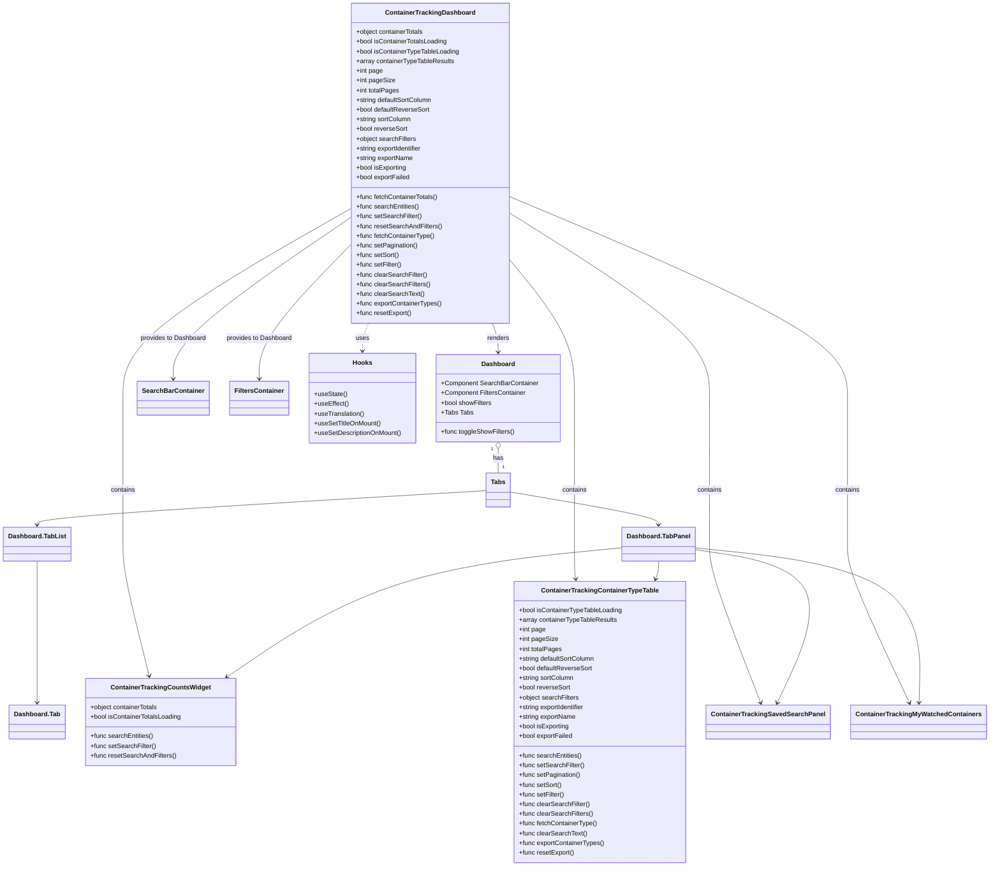

# Diagram: web/portal/src/pages/containertracking/dashboard/ContainerTracking.Dashboard.page.js

> Auto-generated by Obscura crawlers

## Mermaid

### SVG

<svg id="container" width="2381.892578125" xmlns="http://www.w3.org/2000/svg" class="classDiagram" height="2142" viewBox="0 0 2381.892578125 2142" role="graphics-document document" aria-roledescription="class"><g><defs><marker id="container_class-aggregationStart" class="marker aggregation class" refX="18" refY="7" markerWidth="190" markerHeight="240" orient="auto"><path d="M 18,7 L9,13 L1,7 L9,1 Z"></path></marker></defs><defs><marker id="container_class-aggregationEnd" class="marker aggregation class" refX="1" refY="7" markerWidth="20" markerHeight="28" orient="auto"><path d="M 18,7 L9,13 L1,7 L9,1 Z"></path></marker></defs><defs><marker id="container_class-extensionStart" class="marker extension class" refX="18" refY="7" markerWidth="190" markerHeight="240" orient="auto"><path d="M 1,7 L18,13 V 1 Z"></path></marker></defs><defs><marker id="container_class-extensionEnd" class="marker extension class" refX="1" refY="7" markerWidth="20" markerHeight="28" orient="auto"><path d="M 1,1 V 13 L18,7 Z"></path></marker></defs><defs><marker id="container_class-compositionStart" class="marker composition class" refX="18" refY="7" markerWidth="190" markerHeight="240" orient="auto"><path d="M 18,7 L9,13 L1,7 L9,1 Z"></path></marker></defs><defs><marker id="container_class-compositionEnd" class="marker composition class" refX="1" refY="7" markerWidth="20" markerHeight="28" orient="auto"><path d="M 18,7 L9,13 L1,7 L9,1 Z"></path></marker></defs><defs><marker id="container_class-dependencyStart" class="marker dependency class" refX="6" refY="7" markerWidth="190" markerHeight="240" orient="auto"><path d="M 5,7 L9,13 L1,7 L9,1 Z"></path></marker></defs><defs><marker id="container_class-dependencyEnd" class="marker dependency class" refX="13" refY="7" markerWidth="20" markerHeight="28" orient="auto"><path d="M 18,7 L9,13 L14,7 L9,1 Z"></path></marker></defs><defs><marker id="container_class-lollipopStart" class="marker lollipop class" refX="13" refY="7" markerWidth="190" markerHeight="240" orient="auto"><circle stroke="black" fill="transparent" cx="7" cy="7" r="6"></circle></marker></defs><defs><marker id="container_class-lollipopEnd" class="marker lollipop class" refX="1" refY="7" markerWidth="190" markerHeight="240" orient="auto"><circle stroke="black" fill="transparent" cx="7" cy="7" r="6"></circle></marker></defs><g class="root"><g class="clusters"></g><g class="edgePaths"><path d="M1191.278,800L1193.653,806.167C1196.029,812.333,1200.781,824.667,1203.157,836.5C1205.533,848.333,1205.533,859.667,1205.533,865.333L1205.533,871" id="id_ContainerTrackingDashboard_Dashboard_1" class="edge-thickness-normal edge-pattern-solid relation" style=";;;" data-edge="true" data-et="edge" data-id="id_ContainerTrackingDashboard_Dashboard_1" data-points="W3sieCI6MTE5MS4yNzc1MTUxNTU4ODkyLCJ5Ijo4MDB9LHsieCI6MTIwNS41MzMyMDMxMjUsInkiOjgzN30seyJ4IjoxMjA1LjUzMzIwMzEyNSwieSI6ODc3fV0=" marker-end="url(#container_class-dependencyEnd)"></path><path d="M844.938,538.421L773.205,588.184C701.472,637.947,558.007,737.474,486.274,803.904C414.541,870.333,414.541,903.667,414.541,920.333L414.541,937" id="id_ContainerTrackingDashboard_SearchBarContainer_2" class="edge-thickness-normal edge-pattern-solid relation" style=";;;" data-edge="true" data-et="edge" data-id="id_ContainerTrackingDashboard_SearchBarContainer_2" data-points="W3sieCI6ODQ0LjkzNzUsInkiOjUzOC40MjEwMzMxOTc2MzA1fSx7IngiOjQxNC41NDEwMTU2MjUsInkiOjgzN30seyJ4Ijo0MTQuNTQxMDE1NjI1LCJ5Ijo5NDN9XQ==" marker-end="url(#container_class-dependencyEnd)"></path><path d="M844.938,604.2L807.384,643C769.831,681.8,694.725,759.4,657.172,814.867C619.619,870.333,619.619,903.667,619.619,920.333L619.619,937" id="id_ContainerTrackingDashboard_FiltersContainer_3" class="edge-thickness-normal edge-pattern-solid relation" style=";;;" data-edge="true" data-et="edge" data-id="id_ContainerTrackingDashboard_FiltersContainer_3" data-points="W3sieCI6ODQ0LjkzNzUsInkiOjYwNC4xOTk3NjYwNDQ4MDU2fSx7IngiOjYxOS42MTkxNDA2MjUsInkiOjgzN30seyJ4Ijo2MTkuNjE5MTQwNjI1LCJ5Ijo5NDN9XQ==" marker-end="url(#container_class-dependencyEnd)"></path><path d="M844.938,516.769L753.231,570.141C661.524,623.512,478.111,730.256,386.404,808.295C294.697,886.333,294.697,935.667,294.697,985C294.697,1034.333,294.697,1083.667,294.697,1121.5C294.697,1159.333,294.697,1185.667,294.697,1210C294.697,1234.333,294.697,1256.667,294.697,1279C294.697,1301.333,294.697,1323.667,294.697,1346C294.697,1368.333,294.697,1390.667,305.487,1445.03C316.276,1499.393,337.855,1585.786,348.644,1628.982L359.434,1672.179" id="id_ContainerTrackingDashboard_ContainerTrackingCountsWidget_4" class="edge-thickness-normal edge-pattern-solid relation" style=";;;" data-edge="true" data-et="edge" data-id="id_ContainerTrackingDashboard_ContainerTrackingCountsWidget_4" data-points="W3sieCI6ODQ0LjkzNzUsInkiOjUxNi43Njg2MjIxMzg5MTc1fSx7IngiOjI5NC42OTcyNjU2MjUsInkiOjgzN30seyJ4IjoyOTQuNjk3MjY1NjI1LCJ5Ijo5ODV9LHsieCI6Mjk0LjY5NzI2NTYyNSwieSI6MTEzM30seyJ4IjoyOTQuNjk3MjY1NjI1LCJ5IjoxMjEyfSx7IngiOjI5NC42OTcyNjU2MjUsInkiOjEyNzl9LHsieCI6Mjk0LjY5NzI2NTYyNSwieSI6MTM0Nn0seyJ4IjoyOTQuNjk3MjY1NjI1LCJ5IjoxNDEzfSx7IngiOjM2MC44ODc1OTg0NDE2ODksInkiOjE2Nzh9XQ==" marker-end="url(#container_class-dependencyEnd)"></path><path d="M1232.469,641.362L1259.086,673.968C1285.704,706.575,1338.939,771.787,1365.556,829.06C1392.174,886.333,1392.174,935.667,1392.174,985C1392.174,1034.333,1392.174,1083.667,1392.174,1121.5C1392.174,1159.333,1392.174,1185.667,1392.174,1210C1392.174,1234.333,1392.174,1256.667,1392.174,1279C1392.174,1301.333,1392.174,1323.667,1392.174,1346C1392.174,1368.333,1392.174,1390.667,1392.69,1405.013C1393.206,1419.359,1394.239,1425.718,1394.755,1428.898L1395.272,1432.078" id="id_ContainerTrackingDashboard_ContainerTrackingContainerTypeTable_5" class="edge-thickness-normal edge-pattern-solid relation" style=";;;" data-edge="true" data-et="edge" data-id="id_ContainerTrackingDashboard_ContainerTrackingContainerTypeTable_5" data-points="W3sieCI6MTIzMi40Njg3NSwieSI6NjQxLjM2MjAwNzMyNjg5Nzl9LHsieCI6MTM5Mi4xNzM4MjgxMjUsInkiOjgzN30seyJ4IjoxMzkyLjE3MzgyODEyNSwieSI6OTg1fSx7IngiOjEzOTIuMTczODI4MTI1LCJ5IjoxMTMzfSx7IngiOjEzOTIuMTczODI4MTI1LCJ5IjoxMjEyfSx7IngiOjEzOTIuMTczODI4MTI1LCJ5IjoxMjc5fSx7IngiOjEzOTIuMTczODI4MTI1LCJ5IjoxMzQ2fSx7IngiOjEzOTIuMTczODI4MTI1LCJ5IjoxNDEzfSx7IngiOjEzOTYuMjMzMjM4NzMxNTY4NSwieSI6MTQzOH1d" marker-end="url(#container_class-dependencyEnd)"></path><path d="M1232.469,527.825L1313.104,579.354C1393.738,630.883,1555.008,733.942,1635.643,810.137C1716.277,886.333,1716.277,935.667,1716.277,985C1716.277,1034.333,1716.277,1083.667,1716.277,1121.5C1716.277,1159.333,1716.277,1185.667,1716.277,1210C1716.277,1234.333,1716.277,1256.667,1716.277,1279C1716.277,1301.333,1716.277,1323.667,1716.277,1346C1716.277,1368.333,1716.277,1390.667,1736.982,1456.066C1757.687,1521.465,1799.097,1629.93,1819.802,1684.162L1840.507,1738.395" id="id_ContainerTrackingDashboard_ContainerTrackingSavedSearchPanel_6" class="edge-thickness-normal edge-pattern-solid relation" style=";;;" data-edge="true" data-et="edge" data-id="id_ContainerTrackingDashboard_ContainerTrackingSavedSearchPanel_6" data-points="W3sieCI6MTIzMi40Njg3NSwieSI6NTI3LjgyNDgzNDY4NzE1OTV9LHsieCI6MTcxNi4yNzczNDM3NSwieSI6ODM3fSx7IngiOjE3MTYuMjc3MzQzNzUsInkiOjk4NX0seyJ4IjoxNzE2LjI3NzM0Mzc1LCJ5IjoxMTMzfSx7IngiOjE3MTYuMjc3MzQzNzUsInkiOjEyMTJ9LHsieCI6MTcxNi4yNzczNDM3NSwieSI6MTI3OX0seyJ4IjoxNzE2LjI3NzM0Mzc1LCJ5IjoxMzQ2fSx7IngiOjE3MTYuMjc3MzQzNzUsInkiOjE0MTN9LHsieCI6MTg0Mi42NDY4NDA0NDA2ODM3LCJ5IjoxNzQ0fV0=" marker-end="url(#container_class-dependencyEnd)"></path><path d="M1232.469,487.263L1368.118,545.552C1503.766,603.842,1775.064,720.421,1910.713,803.377C2046.361,886.333,2046.361,935.667,2046.361,985C2046.361,1034.333,2046.361,1083.667,2046.361,1121.5C2046.361,1159.333,2046.361,1185.667,2046.361,1210C2046.361,1234.333,2046.361,1256.667,2046.361,1279C2046.361,1301.333,2046.361,1323.667,2046.361,1346C2046.361,1368.333,2046.361,1390.667,2070.751,1456.088C2095.141,1521.509,2143.92,1630.018,2168.31,1684.273L2192.7,1738.528" id="id_ContainerTrackingDashboard_ContainerTrackingMyWatchedContainers_7" class="edge-thickness-normal edge-pattern-solid relation" style=";;;" data-edge="true" data-et="edge" data-id="id_ContainerTrackingDashboard_ContainerTrackingMyWatchedContainers_7" data-points="W3sieCI6MTIzMi40Njg3NSwieSI6NDg3LjI2Mjg3MTY0MTIwMDl9LHsieCI6MjA0Ni4zNjEzMjgxMjUsInkiOjgzN30seyJ4IjoyMDQ2LjM2MTMyODEyNSwieSI6OTg1fSx7IngiOjIwNDYuMzYxMzI4MTI1LCJ5IjoxMTMzfSx7IngiOjIwNDYuMzYxMzI4MTI1LCJ5IjoxMjEyfSx7IngiOjIwNDYuMzYxMzI4MTI1LCJ5IjoxMjc5fSx7IngiOjIwNDYuMzYxMzI4MTI1LCJ5IjoxMzQ2fSx7IngiOjIwNDYuMzYxMzI4MTI1LCJ5IjoxNDEzfSx7IngiOjIxOTUuMTYwMTkyOTAzODIsInkiOjE3NDR9XQ==" marker-end="url(#container_class-dependencyEnd)"></path><path d="M886.129,800L883.753,806.167C881.377,812.333,876.625,824.667,874.249,836C871.873,847.333,871.873,857.667,871.873,862.833L871.873,868" id="id_ContainerTrackingDashboard_Hooks_8" class="edge-thickness-normal edge-pattern-dashed relation" style=";;;" data-edge="true" data-et="edge" data-id="id_ContainerTrackingDashboard_Hooks_8" data-points="W3sieCI6ODg2LjEyODczNDg0NDExMDgsInkiOjgwMH0seyJ4Ijo4NzEuODczMDQ2ODc1LCJ5Ijo4Mzd9LHsieCI6ODcxLjg3MzA0Njg3NSwieSI6ODc0fV0=" marker-end="url(#container_class-dependencyEnd)"></path><path d="M1205.533,1110.25L1205.533,1114.042C1205.533,1117.833,1205.533,1125.417,1205.533,1135.375C1205.533,1145.333,1205.533,1157.667,1205.533,1163.833L1205.533,1170" id="id_Dashboard_Tabs_9" class="edge-thickness-normal edge-pattern-solid relation" style=";;;" data-edge="true" data-et="edge" data-id="id_Dashboard_Tabs_9" data-points="W3sieCI6MTIwNS41MzMyMDMxMjUsInkiOjEwOTN9LHsieCI6MTIwNS41MzMyMDMxMjUsInkiOjExMzN9LHsieCI6MTIwNS41MzMyMDMxMjUsInkiOjExNzB9XQ==" marker-start="url(#container_class-aggregationStart)"></path><path d="M1176.588,1213.734L995.034,1224.612C813.48,1235.489,450.373,1257.245,268.819,1271.289C87.266,1285.333,87.266,1291.667,87.266,1294.833L87.266,1298" id="id_Tabs_Dashboard.TabList_10" class="edge-thickness-normal edge-pattern-solid relation" style=";;;" data-edge="true" data-et="edge" data-id="id_Tabs_Dashboard.TabList_10" data-points="W3sieCI6MTE3Ni41ODc4OTA2MjUsInkiOjEyMTMuNzM0MjMyNDY0MDY4OH0seyJ4Ijo4Ny4yNjU2MjUsInkiOjEyNzl9LHsieCI6ODcuMjY1NjI1LCJ5IjoxMzA0fV0=" marker-end="url(#container_class-dependencyEnd)"></path><path d="M1234.479,1216.978L1294.59,1227.315C1354.701,1237.652,1474.923,1258.326,1535.034,1271.83C1595.145,1285.333,1595.145,1291.667,1595.145,1294.833L1595.145,1298" id="id_Tabs_Dashboard.TabPanel_11" class="edge-thickness-normal edge-pattern-solid relation" style=";;;" data-edge="true" data-et="edge" data-id="id_Tabs_Dashboard.TabPanel_11" data-points="W3sieCI6MTIzNC40Nzg1MTU2MjUsInkiOjEyMTYuOTc3NjE2OTE1ODk2OH0seyJ4IjoxNTk1LjE0NDUzMTI1LCJ5IjoxMjc5fSx7IngiOjE1OTUuMTQ0NTMxMjUsInkiOjEzMDR9XQ==" marker-end="url(#container_class-dependencyEnd)"></path><path d="M87.266,1388L87.266,1392.167C87.266,1396.333,87.266,1404.667,87.266,1463C87.266,1521.333,87.266,1629.667,87.266,1683.833L87.266,1738" id="id_Dashboard.TabList_Dashboard.Tab_12" class="edge-thickness-normal edge-pattern-solid relation" style=";;;" data-edge="true" data-et="edge" data-id="id_Dashboard.TabList_Dashboard.Tab_12" data-points="W3sieCI6ODcuMjY1NjI1LCJ5IjoxMzg4fSx7IngiOjg3LjI2NTYyNSwieSI6MTQxM30seyJ4Ijo4Ny4yNjU2MjUsInkiOjE3NDR9XQ==" marker-end="url(#container_class-dependencyEnd)"></path><path d="M1509.012,1354.632L1411.943,1364.36C1314.875,1374.088,1120.738,1393.544,960.7,1446.869C800.663,1500.195,674.724,1587.39,611.754,1630.987L548.785,1674.585" id="id_Dashboard.TabPanel_ContainerTrackingCountsWidget_13" class="edge-thickness-normal edge-pattern-solid relation" style=";;;" data-edge="true" data-et="edge" data-id="id_Dashboard.TabPanel_ContainerTrackingCountsWidget_13" data-points="W3sieCI6MTUwOS4wMTE3MTg3NSwieSI6MTM1NC42MzIwNTMxNDcyOTQ1fSx7IngiOjkyNi42MDE1NjI1LCJ5IjoxNDEzfSx7IngiOjU0My44NTE4NDUyNTgwNDI5LCJ5IjoxNjc4fV0=" marker-end="url(#container_class-dependencyEnd)"></path><path d="M1595.145,1388L1595.145,1392.167C1595.145,1396.333,1595.145,1404.667,1593.91,1412.066C1592.676,1419.465,1590.208,1425.93,1588.974,1429.162L1587.74,1432.395" id="id_Dashboard.TabPanel_ContainerTrackingContainerTypeTable_14" class="edge-thickness-normal edge-pattern-solid relation" style=";;;" data-edge="true" data-et="edge" data-id="id_Dashboard.TabPanel_ContainerTrackingContainerTypeTable_14" data-points="W3sieCI6MTU5NS4xNDQ1MzEyNSwieSI6MTM4OH0seyJ4IjoxNTk1LjE0NDUzMTI1LCJ5IjoxNDEzfSx7IngiOjE1ODUuNjAwMDA3MzMwNzY0MSwieSI6MTQzOH1d" marker-end="url(#container_class-dependencyEnd)"></path><path d="M1681.277,1359.383L1738.791,1368.319C1796.305,1377.255,1911.333,1395.128,1944.458,1458.318C1977.582,1521.509,1928.802,1630.018,1904.412,1684.273L1880.023,1738.528" id="id_Dashboard.TabPanel_ContainerTrackingSavedSearchPanel_15" class="edge-thickness-normal edge-pattern-solid relation" style=";;;" data-edge="true" data-et="edge" data-id="id_Dashboard.TabPanel_ContainerTrackingSavedSearchPanel_15" data-points="W3sieCI6MTY4MS4yNzczNDM3NSwieSI6MTM1OS4zODI4MjM4NTg3MjF9LHsieCI6MjAyNi4zNjEzMjgxMjUsInkiOjE0MTN9LHsieCI6MTg3Ny41NjI0NjMzNDYxNzk2LCJ5IjoxNzQ0fV0=" marker-end="url(#container_class-dependencyEnd)"></path><path d="M1681.277,1355.176L1771.738,1364.814C1862.199,1374.451,2043.12,1393.725,2132.128,1457.53C2221.137,1521.334,2218.232,1629.668,2216.78,1683.835L2215.328,1738.002" id="id_Dashboard.TabPanel_ContainerTrackingMyWatchedContainers_16" class="edge-thickness-normal edge-pattern-solid relation" style=";;;" data-edge="true" data-et="edge" data-id="id_Dashboard.TabPanel_ContainerTrackingMyWatchedContainers_16" data-points="W3sieCI6MTY4MS4yNzczNDM3NSwieSI6MTM1NS4xNzYyMjk0NDQ1NTY2fSx7IngiOjIyMjQuMDQxMDE1NjI1LCJ5IjoxNDEzfSx7IngiOjIyMTUuMTY3MDIwOTg2OTMwMywieSI6MTc0NH1d" marker-end="url(#container_class-dependencyEnd)"></path></g><g class="edgeLabels"><g class="edgeLabel" transform="translate(1205.533203125, 837)"><g class="label" data-id="id_ContainerTrackingDashboard_Dashboard_1" transform="translate(-27.75, -12)"><foreignObject width="55.5" height="24">

renders

</foreignObject></g></g><g class="edgeLabel" transform="translate(414.541015625, 837)"><g class="label" data-id="id_ContainerTrackingDashboard_SearchBarContainer_2" transform="translate(-82.09375, -12)"><foreignObject width="164.1875" height="24">

provides to Dashboard

</foreignObject></g></g><g class="edgeLabel" transform="translate(619.619140625, 837)"><g class="label" data-id="id_ContainerTrackingDashboard_FiltersContainer_3" transform="translate(-82.09375, -12)"><foreignObject width="164.1875" height="24">

provides to Dashboard

</foreignObject></g></g><g class="edgeLabel" transform="translate(294.697265625, 1212)"><g class="label" data-id="id_ContainerTrackingDashboard_ContainerTrackingCountsWidget_4" transform="translate(-30.890625, -12)"><foreignObject width="61.78125" height="24">

contains

</foreignObject></g></g><g class="edgeLabel" transform="translate(1392.173828125, 1212)"><g class="label" data-id="id_ContainerTrackingDashboard_ContainerTrackingContainerTypeTable_5" transform="translate(-30.890625, -12)"><foreignObject width="61.78125" height="24">

contains

</foreignObject></g></g><g class="edgeLabel" transform="translate(1716.27734375, 1212)"><g class="label" data-id="id_ContainerTrackingDashboard_ContainerTrackingSavedSearchPanel_6" transform="translate(-30.890625, -12)"><foreignObject width="61.78125" height="24">

contains

</foreignObject></g></g><g class="edgeLabel" transform="translate(2046.361328125, 1212)"><g class="label" data-id="id_ContainerTrackingDashboard_ContainerTrackingMyWatchedContainers_7" transform="translate(-30.890625, -12)"><foreignObject width="61.78125" height="24">

contains

</foreignObject></g></g><g class="edgeLabel" transform="translate(871.873046875, 837)"><g class="label" data-id="id_ContainerTrackingDashboard_Hooks_8" transform="translate(-16.4921875, -12)"><foreignObject width="32.984375" height="24">

uses

</foreignObject></g></g><g class="edgeLabel" transform="translate(1205.533203125, 1133)"><g class="label" data-id="id_Dashboard_Tabs_9" transform="translate(-12.703125, -12)"><foreignObject width="25.40625" height="24">

has

</foreignObject></g></g><g class="edgeLabel"><g class="label" data-id="id_Tabs_Dashboard.TabList_10" transform="translate(0, 0)"><foreignObject width="0" height="0">

</foreignObject></g></g><g class="edgeLabel"><g class="label" data-id="id_Tabs_Dashboard.TabPanel_11" transform="translate(0, 0)"><foreignObject width="0" height="0">

</foreignObject></g></g><g class="edgeLabel"><g class="label" data-id="id_Dashboard.TabList_Dashboard.Tab_12" transform="translate(0, 0)"><foreignObject width="0" height="0">

</foreignObject></g></g><g class="edgeLabel"><g class="label" data-id="id_Dashboard.TabPanel_ContainerTrackingCountsWidget_13" transform="translate(0, 0)"><foreignObject width="0" height="0">

</foreignObject></g></g><g class="edgeLabel"><g class="label" data-id="id_Dashboard.TabPanel_ContainerTrackingContainerTypeTable_14" transform="translate(0, 0)"><foreignObject width="0" height="0">

</foreignObject></g></g><g class="edgeLabel"><g class="label" data-id="id_Dashboard.TabPanel_ContainerTrackingSavedSearchPanel_15" transform="translate(0, 0)"><foreignObject width="0" height="0">

</foreignObject></g></g><g class="edgeLabel"><g class="label" data-id="id_Dashboard.TabPanel_ContainerTrackingMyWatchedContainers_16" transform="translate(0, 0)"><foreignObject width="0" height="0">

</foreignObject></g></g><g class="edgeTerminals" transform="translate(1190.5332015625, 1110.4999986607143)"><g class="inner" transform="translate(0, 0)"><foreignObject style="width: 9px; height: 12px;">
1
</foreignObject></g></g><g class="edgeTerminals" transform="translate(1215.5332015625, 1147.4999986607143)"><g class="inner" transform="translate(0, 0)"></g><foreignObject style="width: 9px; height: 12px;">
1
</foreignObject></g></g><g class="nodes"><g class="node default" id="classId-ContainerTrackingDashboard-0" transform="translate(1038.703125, 404)"><g class="basic label-container"><path d="M-193.765625 -396 L193.765625 -396 L193.765625 396 L-193.765625 396" stroke="none" stroke-width="0" fill="#ECECFF" style=""></path><path d="M-193.765625 -396 C-57.71705665785163 -396, 78.33151168429674 -396, 193.765625 -396 M-193.765625 -396 C-68.11114174332619 -396, 57.54334151334763 -396, 193.765625 -396 M193.765625 -396 C193.765625 -88.21429208623272, 193.765625 219.57141582753457, 193.765625 396 M193.765625 -396 C193.765625 -85.2629059692191, 193.765625 225.4741880615618, 193.765625 396 M193.765625 396 C91.11586441118124 396, -11.53389617763753 396, -193.765625 396 M193.765625 396 C81.81175598219964 396, -30.142113035600715 396, -193.765625 396 M-193.765625 396 C-193.765625 176.7649324855033, -193.765625 -42.47013502899341, -193.765625 -396 M-193.765625 396 C-193.765625 98.76588511660941, -193.765625 -198.46822976678118, -193.765625 -396" stroke="#9370DB" stroke-width="1.3" fill="none" stroke-dasharray="0 0" style=""></path></g><g class="annotation-group text" transform="translate(0, -372)"></g><g class="label-group text" transform="translate(-105.953125, -372)"><g class="label" style="font-weight: bolder" transform="translate(0,-12)"><foreignObject width="211.90625" height="24">

ContainerTrackingDashboard

</foreignObject></g></g><g class="members-group text" transform="translate(-181.765625, -324)"><g class="label" style="" transform="translate(0,-12)"><foreignObject width="170.015625" height="24">

+object containerTotals

</foreignObject></g><g class="label" style="" transform="translate(0,12)"><foreignObject width="227.9375" height="24">

+bool isContainerTotalsLoading

</foreignObject></g><g class="label" style="" transform="translate(0,36)"><foreignObject width="257.578125" height="24">

+bool isContainerTypeTableLoading

</foreignObject></g><g class="label" style="" transform="translate(0,60)"><foreignObject width="243.640625" height="24">

+array containerTypeTableResults

</foreignObject></g><g class="label" style="" transform="translate(0,84)"><foreignObject width="66.5625" height="24">

+int page

</foreignObject></g><g class="label" style="" transform="translate(0,108)"><foreignObject width="95.40625" height="24">

+int pageSize

</foreignObject></g><g class="label" style="" transform="translate(0,132)"><foreignObject width="106.890625" height="24">

+int totalPages

</foreignObject></g><g class="label" style="" transform="translate(0,156)"><foreignObject width="190.734375" height="24">

+string defaultSortColumn

</foreignObject></g><g class="label" style="" transform="translate(0,180)"><foreignObject width="183.65625" height="24">

+bool defaultReverseSort

</foreignObject></g><g class="label" style="" transform="translate(0,204)"><foreignObject width="137.703125" height="24">

+string sortColumn

</foreignObject></g><g class="label" style="" transform="translate(0,228)"><foreignObject width="128.140625" height="24">

+bool reverseSort

</foreignObject></g><g class="label" style="" transform="translate(0,252)"><foreignObject width="149.3125" height="24">

+object searchFilters

</foreignObject></g><g class="label" style="" transform="translate(0,276)"><foreignObject width="167.765625" height="24">

+string exportIdentifier

</foreignObject></g><g class="label" style="" transform="translate(0,300)"><foreignObject width="143.0625" height="24">

+string exportName

</foreignObject></g><g class="label" style="" transform="translate(0,324)"><foreignObject width="126.421875" height="24">

+bool isExporting

</foreignObject></g><g class="label" style="" transform="translate(0,348)"><foreignObject width="135.25" height="24">

+bool exportFailed

</foreignObject></g></g><g class="methods-group text" transform="translate(-181.765625, 84)"><g class="label" style="" transform="translate(0,-12)"><foreignObject width="204.15625" height="24">

+func fetchContainerTotals()

</foreignObject></g><g class="label" style="" transform="translate(0,12)"><foreignObject width="156.0625" height="24">

+func searchEntities()

</foreignObject></g><g class="label" style="" transform="translate(0,36)"><foreignObject width="161.65625" height="24">

+func setSearchFilter()

</foreignObject></g><g class="label" style="" transform="translate(0,60)"><foreignObject width="211.421875" height="24">

+func resetSearchAndFilters()

</foreignObject></g><g class="label" style="" transform="translate(0,84)"><foreignObject width="194.78125" height="24">

+func fetchContainerType()

</foreignObject></g><g class="label" style="" transform="translate(0,108)"><foreignObject width="152.90625" height="24">

+func setPagination()

</foreignObject></g><g class="label" style="" transform="translate(0,132)"><foreignObject width="106.046875" height="24">

+func setSort()

</foreignObject></g><g class="label" style="" transform="translate(0,156)"><foreignObject width="112.953125" height="24">

+func setFilter()

</foreignObject></g><g class="label" style="" transform="translate(0,180)"><foreignObject width="175.390625" height="24">

+func clearSearchFilter()

</foreignObject></g><g class="label" style="" transform="translate(0,204)"><foreignObject width="182.609375" height="24">

+func clearSearchFilters()

</foreignObject></g><g class="label" style="" transform="translate(0,228)"><foreignObject width="167.953125" height="24">

+func clearSearchText()

</foreignObject></g><g class="label" style="" transform="translate(0,252)"><foreignObject width="212.90625" height="24">

+func exportContainerTypes()

</foreignObject></g><g class="label" style="" transform="translate(0,276)"><foreignObject width="137.5625" height="24">

+func resetExport()

</foreignObject></g></g><g class="divider" style=""><path d="M-193.765625 -348 C-90.53419930801222 -348, 12.697226383975561 -348, 193.765625 -348 M-193.765625 -348 C-52.130657805097115 -348, 89.50430938980577 -348, 193.765625 -348" stroke="#9370DB" stroke-width="1.3" fill="none" stroke-dasharray="0 0" style=""></path></g><g class="divider" style=""><path d="M-193.765625 60 C-81.607586669348 60, 30.55045166130401 60, 193.765625 60 M-193.765625 60 C-67.02565208239459 60, 59.71432083521083 60, 193.765625 60" stroke="#9370DB" stroke-width="1.3" fill="none" stroke-dasharray="0 0" style=""></path></g></g><g class="node default" id="classId-Dashboard-1" transform="translate(1205.533203125, 985)"><g class="basic label-container"><path d="M-151.640625 -108 L151.640625 -108 L151.640625 108 L-151.640625 108" stroke="none" stroke-width="0" fill="#ECECFF" style=""></path><path d="M-151.640625 -108 C-40.649969484646206 -108, 70.34068603070759 -108, 151.640625 -108 M-151.640625 -108 C-30.478410270138824 -108, 90.68380445972235 -108, 151.640625 -108 M151.640625 -108 C151.640625 -34.36493717606086, 151.640625 39.270125647878274, 151.640625 108 M151.640625 -108 C151.640625 -30.314013328898525, 151.640625 47.37197334220295, 151.640625 108 M151.640625 108 C69.77125921283688 108, -12.098106574326238 108, -151.640625 108 M151.640625 108 C70.71948678055789 108, -10.201651438884227 108, -151.640625 108 M-151.640625 108 C-151.640625 31.0270222609511, -151.640625 -45.9459554780978, -151.640625 -108 M-151.640625 108 C-151.640625 37.279579066576744, -151.640625 -33.44084186684651, -151.640625 -108" stroke="#9370DB" stroke-width="1.3" fill="none" stroke-dasharray="0 0" style=""></path></g><g class="annotation-group text" transform="translate(0, -84)"></g><g class="label-group text" transform="translate(-39.4375, -84)"><g class="label" style="font-weight: bolder" transform="translate(0,-12)"><foreignObject width="78.875" height="24">

Dashboard

</foreignObject></g></g><g class="members-group text" transform="translate(-139.640625, -36)"><g class="label" style="" transform="translate(0,-12)"><foreignObject width="239.84375" height="24">

+Component SearchBarContainer

</foreignObject></g><g class="label" style="" transform="translate(0,12)"><foreignObject width="210.703125" height="24">

+Component FiltersContainer

</foreignObject></g><g class="label" style="" transform="translate(0,36)"><foreignObject width="126.9375" height="24">

+bool showFilters

</foreignObject></g><g class="label" style="" transform="translate(0,60)"><foreignObject width="77.734375" height="24">

+Tabs Tabs

</foreignObject></g></g><g class="methods-group text" transform="translate(-139.640625, 84)"><g class="label" style="" transform="translate(0,-12)"><foreignObject width="181.96875" height="24">

+func toggleShowFilters()

</foreignObject></g></g><g class="divider" style=""><path d="M-151.640625 -60 C-33.71913640741451 -60, 84.20235218517098 -60, 151.640625 -60 M-151.640625 -60 C-51.769590058496576 -60, 48.10144488300685 -60, 151.640625 -60" stroke="#9370DB" stroke-width="1.3" fill="none" stroke-dasharray="0 0" style=""></path></g><g class="divider" style=""><path d="M-151.640625 60 C-79.57879571275734 60, -7.516966425514681 60, 151.640625 60 M-151.640625 60 C-37.7198985876707 60, 76.2008278246586 60, 151.640625 60" stroke="#9370DB" stroke-width="1.3" fill="none" stroke-dasharray="0 0" style=""></path></g></g><g class="node default" id="classId-SearchBarContainer-2" transform="translate(414.541015625, 985)"><g class="basic label-container"><path d="M-84.84375 -42 L84.84375 -42 L84.84375 42 L-84.84375 42" stroke="none" stroke-width="0" fill="#ECECFF" style=""></path><path d="M-84.84375 -42 C-16.988320253460856 -42, 50.86710949307829 -42, 84.84375 -42 M-84.84375 -42 C-48.73457427851951 -42, -12.62539855703902 -42, 84.84375 -42 M84.84375 -42 C84.84375 -12.180559160548857, 84.84375 17.638881678902287, 84.84375 42 M84.84375 -42 C84.84375 -19.440832476314085, 84.84375 3.118335047371829, 84.84375 42 M84.84375 42 C43.950904182385685 42, 3.0580583647713695 42, -84.84375 42 M84.84375 42 C22.629504978762064 42, -39.58474004247587 42, -84.84375 42 M-84.84375 42 C-84.84375 25.109273364623192, -84.84375 8.218546729246384, -84.84375 -42 M-84.84375 42 C-84.84375 24.61509905615583, -84.84375 7.230198112311662, -84.84375 -42" stroke="#9370DB" stroke-width="1.3" fill="none" stroke-dasharray="0 0" style=""></path></g><g class="annotation-group text" transform="translate(0, -18)"></g><g class="label-group text" transform="translate(-72.84375, -18)"><g class="label" style="font-weight: bolder" transform="translate(0,-12)"><foreignObject width="145.6875" height="24">

SearchBarContainer

</foreignObject></g></g><g class="members-group text" transform="translate(-72.84375, 30)"></g><g class="methods-group text" transform="translate(-72.84375, 60)"></g><g class="divider" style=""><path d="M-84.84375 6 C-45.788544913201754 6, -6.733339826403508 6, 84.84375 6 M-84.84375 6 C-50.2943557529365 6, -15.744961505872993 6, 84.84375 6" stroke="#9370DB" stroke-width="1.3" fill="none" stroke-dasharray="0 0" style=""></path></g><g class="divider" style=""><path d="M-84.84375 24 C-22.4256387918784 24, 39.9924724162432 24, 84.84375 24 M-84.84375 24 C-22.995108523646614 24, 38.85353295270677 24, 84.84375 24" stroke="#9370DB" stroke-width="1.3" fill="none" stroke-dasharray="0 0" style=""></path></g></g><g class="node default" id="classId-FiltersContainer-3" transform="translate(619.619140625, 985)"><g class="basic label-container"><path d="M-70.234375 -42 L70.234375 -42 L70.234375 42 L-70.234375 42" stroke="none" stroke-width="0" fill="#ECECFF" style=""></path><path d="M-70.234375 -42 C-24.210390848351864 -42, 21.813593303296273 -42, 70.234375 -42 M-70.234375 -42 C-19.553612095268534 -42, 31.127150809462933 -42, 70.234375 -42 M70.234375 -42 C70.234375 -13.270449214951324, 70.234375 15.459101570097353, 70.234375 42 M70.234375 -42 C70.234375 -17.307557851777588, 70.234375 7.384884296444824, 70.234375 42 M70.234375 42 C24.319033510221686 42, -21.596307979556627 42, -70.234375 42 M70.234375 42 C29.874340910529668 42, -10.485693178940664 42, -70.234375 42 M-70.234375 42 C-70.234375 13.602062552793416, -70.234375 -14.795874894413167, -70.234375 -42 M-70.234375 42 C-70.234375 11.851190936925846, -70.234375 -18.297618126148308, -70.234375 -42" stroke="#9370DB" stroke-width="1.3" fill="none" stroke-dasharray="0 0" style=""></path></g><g class="annotation-group text" transform="translate(0, -18)"></g><g class="label-group text" transform="translate(-58.234375, -18)"><g class="label" style="font-weight: bolder" transform="translate(0,-12)"><foreignObject width="116.46875" height="24">

FiltersContainer

</foreignObject></g></g><g class="members-group text" transform="translate(-58.234375, 30)"></g><g class="methods-group text" transform="translate(-58.234375, 60)"></g><g class="divider" style=""><path d="M-70.234375 6 C-21.733807876392888 6, 26.766759247214225 6, 70.234375 6 M-70.234375 6 C-34.513740815452586 6, 1.2068933690948285 6, 70.234375 6" stroke="#9370DB" stroke-width="1.3" fill="none" stroke-dasharray="0 0" style=""></path></g><g class="divider" style=""><path d="M-70.234375 24 C-34.70044352558592 24, 0.8334879488281643 24, 70.234375 24 M-70.234375 24 C-29.501151596076255 24, 11.23207180784749 24, 70.234375 24" stroke="#9370DB" stroke-width="1.3" fill="none" stroke-dasharray="0 0" style=""></path></g></g><g class="node default" id="classId-ContainerTrackingCountsWidget-4" transform="translate(387.86328125, 1786)"><g class="basic label-container"><path d="M-184.64453125 -108 L184.64453125 -108 L184.64453125 108 L-184.64453125 108" stroke="none" stroke-width="0" fill="#ECECFF" style=""></path><path d="M-184.64453125 -108 C-110.00269615482534 -108, -35.36086105965069 -108, 184.64453125 -108 M-184.64453125 -108 C-62.9335128749795 -108, 58.777505500041 -108, 184.64453125 -108 M184.64453125 -108 C184.64453125 -62.85119701237537, 184.64453125 -17.702394024750745, 184.64453125 108 M184.64453125 -108 C184.64453125 -26.54408773216673, 184.64453125 54.91182453566654, 184.64453125 108 M184.64453125 108 C101.49900530483362 108, 18.353479359667233 108, -184.64453125 108 M184.64453125 108 C54.90830730888396 108, -74.82791663223207 108, -184.64453125 108 M-184.64453125 108 C-184.64453125 47.34953932262435, -184.64453125 -13.300921354751296, -184.64453125 -108 M-184.64453125 108 C-184.64453125 40.56252554357725, -184.64453125 -26.874948912845497, -184.64453125 -108" stroke="#9370DB" stroke-width="1.3" fill="none" stroke-dasharray="0 0" style=""></path></g><g class="annotation-group text" transform="translate(0, -84)"></g><g class="label-group text" transform="translate(-117.3515625, -84)"><g class="label" style="font-weight: bolder" transform="translate(0,-12)"><foreignObject width="234.703125" height="24">

ContainerTrackingCountsWidget

</foreignObject></g></g><g class="members-group text" transform="translate(-172.64453125, -36)"><g class="label" style="" transform="translate(0,-12)"><foreignObject width="170.015625" height="24">

+object containerTotals

</foreignObject></g><g class="label" style="" transform="translate(0,12)"><foreignObject width="227.9375" height="24">

+bool isContainerTotalsLoading

</foreignObject></g></g><g class="methods-group text" transform="translate(-172.64453125, 36)"><g class="label" style="" transform="translate(0,-12)"><foreignObject width="156.0625" height="24">

+func searchEntities()

</foreignObject></g><g class="label" style="" transform="translate(0,12)"><foreignObject width="161.65625" height="24">

+func setSearchFilter()

</foreignObject></g><g class="label" style="" transform="translate(0,36)"><foreignObject width="211.421875" height="24">

+func resetSearchAndFilters()

</foreignObject></g></g><g class="divider" style=""><path d="M-184.64453125 -60 C-69.88440167412644 -60, 44.875727901747126 -60, 184.64453125 -60 M-184.64453125 -60 C-67.22778007439418 -60, 50.18897110121165 -60, 184.64453125 -60" stroke="#9370DB" stroke-width="1.3" fill="none" stroke-dasharray="0 0" style=""></path></g><g class="divider" style=""><path d="M-184.64453125 12 C-53.291951509790294 12, 78.06062823041941 12, 184.64453125 12 M-184.64453125 12 C-69.45294125494631 12, 45.73864874010738 12, 184.64453125 12" stroke="#9370DB" stroke-width="1.3" fill="none" stroke-dasharray="0 0" style=""></path></g></g><g class="node default" id="classId-ContainerTrackingContainerTypeTable-5" transform="translate(1452.740234375, 1786)"><g class="basic label-container"><path d="M-210.43359375 -348 L210.43359375 -348 L210.43359375 348 L-210.43359375 348" stroke="none" stroke-width="0" fill="#ECECFF" style=""></path><path d="M-210.43359375 -348 C-88.76559496355593 -348, 32.90240382288815 -348, 210.43359375 -348 M-210.43359375 -348 C-123.2426138731281 -348, -36.051633996256186 -348, 210.43359375 -348 M210.43359375 -348 C210.43359375 -137.65068012943098, 210.43359375 72.69863974113804, 210.43359375 348 M210.43359375 -348 C210.43359375 -91.28779423216776, 210.43359375 165.4244115356645, 210.43359375 348 M210.43359375 348 C66.67240576297468 348, -77.08878222405065 348, -210.43359375 348 M210.43359375 348 C81.78338163025458 348, -46.86683048949084 348, -210.43359375 348 M-210.43359375 348 C-210.43359375 83.69518525369045, -210.43359375 -180.6096294926191, -210.43359375 -348 M-210.43359375 348 C-210.43359375 180.82590509711096, -210.43359375 13.651810194221923, -210.43359375 -348" stroke="#9370DB" stroke-width="1.3" fill="none" stroke-dasharray="0 0" style=""></path></g><g class="annotation-group text" transform="translate(0, -324)"></g><g class="label-group text" transform="translate(-139.2890625, -324)"><g class="label" style="font-weight: bolder" transform="translate(0,-12)"><foreignObject width="278.578125" height="24">

ContainerTrackingContainerTypeTable

</foreignObject></g></g><g class="members-group text" transform="translate(-198.43359375, -276)"><g class="label" style="" transform="translate(0,-12)"><foreignObject width="257.578125" height="24">

+bool isContainerTypeTableLoading

</foreignObject></g><g class="label" style="" transform="translate(0,12)"><foreignObject width="243.640625" height="24">

+array containerTypeTableResults

</foreignObject></g><g class="label" style="" transform="translate(0,36)"><foreignObject width="66.5625" height="24">

+int page

</foreignObject></g><g class="label" style="" transform="translate(0,60)"><foreignObject width="95.40625" height="24">

+int pageSize

</foreignObject></g><g class="label" style="" transform="translate(0,84)"><foreignObject width="106.890625" height="24">

+int totalPages

</foreignObject></g><g class="label" style="" transform="translate(0,108)"><foreignObject width="190.734375" height="24">

+string defaultSortColumn

</foreignObject></g><g class="label" style="" transform="translate(0,132)"><foreignObject width="183.65625" height="24">

+bool defaultReverseSort

</foreignObject></g><g class="label" style="" transform="translate(0,156)"><foreignObject width="137.703125" height="24">

+string sortColumn

</foreignObject></g><g class="label" style="" transform="translate(0,180)"><foreignObject width="128.140625" height="24">

+bool reverseSort

</foreignObject></g><g class="label" style="" transform="translate(0,204)"><foreignObject width="149.3125" height="24">

+object searchFilters

</foreignObject></g><g class="label" style="" transform="translate(0,228)"><foreignObject width="167.765625" height="24">

+string exportIdentifier

</foreignObject></g><g class="label" style="" transform="translate(0,252)"><foreignObject width="143.0625" height="24">

+string exportName

</foreignObject></g><g class="label" style="" transform="translate(0,276)"><foreignObject width="126.421875" height="24">

+bool isExporting

</foreignObject></g><g class="label" style="" transform="translate(0,300)"><foreignObject width="135.25" height="24">

+bool exportFailed

</foreignObject></g></g><g class="methods-group text" transform="translate(-198.43359375, 84)"><g class="label" style="" transform="translate(0,-12)"><foreignObject width="156.0625" height="24">

+func searchEntities()

</foreignObject></g><g class="label" style="" transform="translate(0,12)"><foreignObject width="161.65625" height="24">

+func setSearchFilter()

</foreignObject></g><g class="label" style="" transform="translate(0,36)"><foreignObject width="152.90625" height="24">

+func setPagination()

</foreignObject></g><g class="label" style="" transform="translate(0,60)"><foreignObject width="106.046875" height="24">

+func setSort()

</foreignObject></g><g class="label" style="" transform="translate(0,84)"><foreignObject width="112.953125" height="24">

+func setFilter()

</foreignObject></g><g class="label" style="" transform="translate(0,108)"><foreignObject width="175.390625" height="24">

+func clearSearchFilter()

</foreignObject></g><g class="label" style="" transform="translate(0,132)"><foreignObject width="182.609375" height="24">

+func clearSearchFilters()

</foreignObject></g><g class="label" style="" transform="translate(0,156)"><foreignObject width="194.78125" height="24">

+func fetchContainerType()

</foreignObject></g><g class="label" style="" transform="translate(0,180)"><foreignObject width="167.953125" height="24">

+func clearSearchText()

</foreignObject></g><g class="label" style="" transform="translate(0,204)"><foreignObject width="212.90625" height="24">

+func exportContainerTypes()

</foreignObject></g><g class="label" style="" transform="translate(0,228)"><foreignObject width="137.5625" height="24">

+func resetExport()

</foreignObject></g></g><g class="divider" style=""><path d="M-210.43359375 -300 C-44.0541593459364 -300, 122.3252750581272 -300, 210.43359375 -300 M-210.43359375 -300 C-107.69205614487883 -300, -4.950518539757667 -300, 210.43359375 -300" stroke="#9370DB" stroke-width="1.3" fill="none" stroke-dasharray="0 0" style=""></path></g><g class="divider" style=""><path d="M-210.43359375 60 C-43.45228596567347 60, 123.52902181865306 60, 210.43359375 60 M-210.43359375 60 C-58.7797282863541 60, 92.8741371772918 60, 210.43359375 60" stroke="#9370DB" stroke-width="1.3" fill="none" stroke-dasharray="0 0" style=""></path></g></g><g class="node default" id="classId-ContainerTrackingSavedSearchPanel-6" transform="translate(1858.681640625, 1786)"><g class="basic label-container"><path d="M-145.5078125 -42 L145.5078125 -42 L145.5078125 42 L-145.5078125 42" stroke="none" stroke-width="0" fill="#ECECFF" style=""></path><path d="M-145.5078125 -42 C-86.81249728863133 -42, -28.11718207726267 -42, 145.5078125 -42 M-145.5078125 -42 C-47.148644700664846 -42, 51.21052309867031 -42, 145.5078125 -42 M145.5078125 -42 C145.5078125 -19.33888658163887, 145.5078125 3.3222268367222583, 145.5078125 42 M145.5078125 -42 C145.5078125 -13.969170628256478, 145.5078125 14.061658743487044, 145.5078125 42 M145.5078125 42 C61.703392301537164 42, -22.10102789692567 42, -145.5078125 42 M145.5078125 42 C31.9521505415522 42, -81.6035114168956 42, -145.5078125 42 M-145.5078125 42 C-145.5078125 23.228832535824658, -145.5078125 4.457665071649316, -145.5078125 -42 M-145.5078125 42 C-145.5078125 11.799606993747837, -145.5078125 -18.400786012504327, -145.5078125 -42" stroke="#9370DB" stroke-width="1.3" fill="none" stroke-dasharray="0 0" style=""></path></g><g class="annotation-group text" transform="translate(0, -18)"></g><g class="label-group text" transform="translate(-133.5078125, -18)"><g class="label" style="font-weight: bolder" transform="translate(0,-12)"><foreignObject width="267.015625" height="24">

ContainerTrackingSavedSearchPanel

</foreignObject></g></g><g class="members-group text" transform="translate(-133.5078125, 30)"></g><g class="methods-group text" transform="translate(-133.5078125, 60)"></g><g class="divider" style=""><path d="M-145.5078125 6 C-56.899648467510545 6, 31.70851556497891 6, 145.5078125 6 M-145.5078125 6 C-43.00072369380629 6, 59.506365112387414 6, 145.5078125 6" stroke="#9370DB" stroke-width="1.3" fill="none" stroke-dasharray="0 0" style=""></path></g><g class="divider" style=""><path d="M-145.5078125 24 C-37.437722131651256 24, 70.63236823669749 24, 145.5078125 24 M-145.5078125 24 C-54.83122388999102 24, 35.845364720017955 24, 145.5078125 24" stroke="#9370DB" stroke-width="1.3" fill="none" stroke-dasharray="0 0" style=""></path></g></g><g class="node default" id="classId-ContainerTrackingMyWatchedContainers-7" transform="translate(2214.041015625, 1786)"><g class="basic label-container"><path d="M-159.8515625 -42 L159.8515625 -42 L159.8515625 42 L-159.8515625 42" stroke="none" stroke-width="0" fill="#ECECFF" style=""></path><path d="M-159.8515625 -42 C-66.02164869475568 -42, 27.808265110488634 -42, 159.8515625 -42 M-159.8515625 -42 C-47.64089163265609 -42, 64.56977923468781 -42, 159.8515625 -42 M159.8515625 -42 C159.8515625 -16.590179832700837, 159.8515625 8.819640334598326, 159.8515625 42 M159.8515625 -42 C159.8515625 -13.418761185354885, 159.8515625 15.16247762929023, 159.8515625 42 M159.8515625 42 C40.48292724015545 42, -78.8857080196891 42, -159.8515625 42 M159.8515625 42 C65.02065734272851 42, -29.810247814542976 42, -159.8515625 42 M-159.8515625 42 C-159.8515625 23.302763488927997, -159.8515625 4.605526977855995, -159.8515625 -42 M-159.8515625 42 C-159.8515625 11.226074121044345, -159.8515625 -19.54785175791131, -159.8515625 -42" stroke="#9370DB" stroke-width="1.3" fill="none" stroke-dasharray="0 0" style=""></path></g><g class="annotation-group text" transform="translate(0, -18)"></g><g class="label-group text" transform="translate(-147.8515625, -18)"><g class="label" style="font-weight: bolder" transform="translate(0,-12)"><foreignObject width="295.703125" height="24">

ContainerTrackingMyWatchedContainers

</foreignObject></g></g><g class="members-group text" transform="translate(-147.8515625, 30)"></g><g class="methods-group text" transform="translate(-147.8515625, 60)"></g><g class="divider" style=""><path d="M-159.8515625 6 C-69.11417958592978 6, 21.62320332814045 6, 159.8515625 6 M-159.8515625 6 C-91.43693821368058 6, -23.022313927361154 6, 159.8515625 6" stroke="#9370DB" stroke-width="1.3" fill="none" stroke-dasharray="0 0" style=""></path></g><g class="divider" style=""><path d="M-159.8515625 24 C-70.74488137331676 24, 18.361799753366483 24, 159.8515625 24 M-159.8515625 24 C-54.131054488953836 24, 51.58945352209233 24, 159.8515625 24" stroke="#9370DB" stroke-width="1.3" fill="none" stroke-dasharray="0 0" style=""></path></g></g><g class="node default" id="classId-Hooks-8" transform="translate(871.873046875, 985)"><g class="basic label-container"><path d="M-132.01953125 -111 L132.01953125 -111 L132.01953125 111 L-132.01953125 111" stroke="none" stroke-width="0" fill="#ECECFF" style=""></path><path d="M-132.01953125 -111 C-27.139807150791555 -111, 77.73991694841689 -111, 132.01953125 -111 M-132.01953125 -111 C-69.29191941059335 -111, -6.564307571186703 -111, 132.01953125 -111 M132.01953125 -111 C132.01953125 -46.13493799449407, 132.01953125 18.730124011011867, 132.01953125 111 M132.01953125 -111 C132.01953125 -45.87867937466284, 132.01953125 19.242641250674325, 132.01953125 111 M132.01953125 111 C63.77810924560613 111, -4.463312758787737 111, -132.01953125 111 M132.01953125 111 C60.43515422894855 111, -11.149222792102904 111, -132.01953125 111 M-132.01953125 111 C-132.01953125 28.02244064818926, -132.01953125 -54.95511870362148, -132.01953125 -111 M-132.01953125 111 C-132.01953125 39.018407013235375, -132.01953125 -32.96318597352925, -132.01953125 -111" stroke="#9370DB" stroke-width="1.3" fill="none" stroke-dasharray="0 0" style=""></path></g><g class="annotation-group text" transform="translate(0, -87)"></g><g class="label-group text" transform="translate(-22.9140625, -87)"><g class="label" style="font-weight: bolder" transform="translate(0,-12)"><foreignObject width="45.828125" height="24">

Hooks

</foreignObject></g></g><g class="members-group text" transform="translate(-120.01953125, -39)"></g><g class="methods-group text" transform="translate(-120.01953125, -9)"><g class="label" style="" transform="translate(0,-12)"><foreignObject width="81.203125" height="24">

+useState()

</foreignObject></g><g class="label" style="" transform="translate(0,12)"><foreignObject width="84.8125" height="24">

+useEffect()

</foreignObject></g><g class="label" style="" transform="translate(0,36)"><foreignObject width="125.140625" height="24">

+useTranslation()

</foreignObject></g><g class="label" style="" transform="translate(0,60)"><foreignObject width="165.515625" height="24">

+useSetTitleOnMount()

</foreignObject></g><g class="label" style="" transform="translate(0,84)"><foreignObject width="217.125" height="24">

+useSetDescriptionOnMount()

</foreignObject></g></g><g class="divider" style=""><path d="M-132.01953125 -63 C-43.04552990996521 -63, 45.92847143006958 -63, 132.01953125 -63 M-132.01953125 -63 C-39.19961345931331 -63, 53.620304331373376 -63, 132.01953125 -63" stroke="#9370DB" stroke-width="1.3" fill="none" stroke-dasharray="0 0" style=""></path></g><g class="divider" style=""><path d="M-132.01953125 -39 C-63.006742729809346 -39, 6.006045790381307 -39, 132.01953125 -39 M-132.01953125 -39 C-69.33536061343816 -39, -6.65118997687631 -39, 132.01953125 -39" stroke="#9370DB" stroke-width="1.3" fill="none" stroke-dasharray="0 0" style=""></path></g></g><g class="node default" id="classId-Tabs-9" transform="translate(1205.533203125, 1212)"><g class="basic label-container"><path d="M-28.9453125 -42 L28.9453125 -42 L28.9453125 42 L-28.9453125 42" stroke="none" stroke-width="0" fill="#ECECFF" style=""></path><path d="M-28.9453125 -42 C-6.060144028425732 -42, 16.825024443148536 -42, 28.9453125 -42 M-28.9453125 -42 C-11.789753625509565 -42, 5.36580524898087 -42, 28.9453125 -42 M28.9453125 -42 C28.9453125 -23.05019725569877, 28.9453125 -4.100394511397539, 28.9453125 42 M28.9453125 -42 C28.9453125 -9.003473222837982, 28.9453125 23.993053554324035, 28.9453125 42 M28.9453125 42 C16.970972412740416 42, 4.996632325480828 42, -28.9453125 42 M28.9453125 42 C16.169366082205045 42, 3.393419664410086 42, -28.9453125 42 M-28.9453125 42 C-28.9453125 24.597301791054377, -28.9453125 7.194603582108755, -28.9453125 -42 M-28.9453125 42 C-28.9453125 17.56914933689306, -28.9453125 -6.861701326213883, -28.9453125 -42" stroke="#9370DB" stroke-width="1.3" fill="none" stroke-dasharray="0 0" style=""></path></g><g class="annotation-group text" transform="translate(0, -18)"></g><g class="label-group text" transform="translate(-16.9453125, -18)"><g class="label" style="font-weight: bolder" transform="translate(0,-12)"><foreignObject width="33.890625" height="24">

Tabs

</foreignObject></g></g><g class="members-group text" transform="translate(-16.9453125, 30)"></g><g class="methods-group text" transform="translate(-16.9453125, 60)"></g><g class="divider" style=""><path d="M-28.9453125 6 C-15.992236870038061 6, -3.0391612400761225 6, 28.9453125 6 M-28.9453125 6 C-8.199310015191006 6, 12.546692469617987 6, 28.9453125 6" stroke="#9370DB" stroke-width="1.3" fill="none" stroke-dasharray="0 0" style=""></path></g><g class="divider" style=""><path d="M-28.9453125 24 C-11.75828848135956 24, 5.428735537280879 24, 28.9453125 24 M-28.9453125 24 C-7.522586161990564 24, 13.900140176018873 24, 28.9453125 24" stroke="#9370DB" stroke-width="1.3" fill="none" stroke-dasharray="0 0" style=""></path></g></g><g class="node default" id="classId-Dashboard.TabList-10" transform="translate(87.265625, 1346)"><g class="basic label-container"><path d="M-79.265625 -42 L79.265625 -42 L79.265625 42 L-79.265625 42" stroke="none" stroke-width="0" fill="#ECECFF" style=""></path><path d="M-79.265625 -42 C-44.48245999544632 -42, -9.69929499089264 -42, 79.265625 -42 M-79.265625 -42 C-17.993129183345232 -42, 43.279366633309536 -42, 79.265625 -42 M79.265625 -42 C79.265625 -10.32342961744807, 79.265625 21.35314076510386, 79.265625 42 M79.265625 -42 C79.265625 -20.325033868527502, 79.265625 1.3499322629449964, 79.265625 42 M79.265625 42 C32.98155388529976 42, -13.302517229400479 42, -79.265625 42 M79.265625 42 C24.504047032983607 42, -30.257530934032786 42, -79.265625 42 M-79.265625 42 C-79.265625 16.731237953828362, -79.265625 -8.537524092343276, -79.265625 -42 M-79.265625 42 C-79.265625 20.80072370305551, -79.265625 -0.39855259388897935, -79.265625 -42" stroke="#9370DB" stroke-width="1.3" fill="none" stroke-dasharray="0 0" style=""></path></g><g class="annotation-group text" transform="translate(0, -18)"></g><g class="label-group text" transform="translate(-67.265625, -18)"><g class="label" style="font-weight: bolder" transform="translate(0,-12)"><foreignObject width="134.53125" height="24">

Dashboard.TabList

</foreignObject></g></g><g class="members-group text" transform="translate(-67.265625, 30)"></g><g class="methods-group text" transform="translate(-67.265625, 60)"></g><g class="divider" style=""><path d="M-79.265625 6 C-29.804625022005517 6, 19.656374955988966 6, 79.265625 6 M-79.265625 6 C-36.351384368938234 6, 6.562856262123532 6, 79.265625 6" stroke="#9370DB" stroke-width="1.3" fill="none" stroke-dasharray="0 0" style=""></path></g><g class="divider" style=""><path d="M-79.265625 24 C-25.73568889020506 24, 27.794247219589877 24, 79.265625 24 M-79.265625 24 C-27.7075539484239 24, 23.8505171031522 24, 79.265625 24" stroke="#9370DB" stroke-width="1.3" fill="none" stroke-dasharray="0 0" style=""></path></g></g><g class="node default" id="classId-Dashboard.TabPanel-11" transform="translate(1595.14453125, 1346)"><g class="basic label-container"><path d="M-86.1328125 -42 L86.1328125 -42 L86.1328125 42 L-86.1328125 42" stroke="none" stroke-width="0" fill="#ECECFF" style=""></path><path d="M-86.1328125 -42 C-44.91944328740909 -42, -3.7060740748181757 -42, 86.1328125 -42 M-86.1328125 -42 C-33.35458059057428 -42, 19.42365131885144 -42, 86.1328125 -42 M86.1328125 -42 C86.1328125 -18.3545977109887, 86.1328125 5.290804578022602, 86.1328125 42 M86.1328125 -42 C86.1328125 -24.646699915673846, 86.1328125 -7.293399831347692, 86.1328125 42 M86.1328125 42 C41.24059281212504 42, -3.651626875749926 42, -86.1328125 42 M86.1328125 42 C25.57110182205446 42, -34.99060885589108 42, -86.1328125 42 M-86.1328125 42 C-86.1328125 16.052087926580374, -86.1328125 -9.895824146839253, -86.1328125 -42 M-86.1328125 42 C-86.1328125 17.513476160879872, -86.1328125 -6.973047678240256, -86.1328125 -42" stroke="#9370DB" stroke-width="1.3" fill="none" stroke-dasharray="0 0" style=""></path></g><g class="annotation-group text" transform="translate(0, -18)"></g><g class="label-group text" transform="translate(-74.1328125, -18)"><g class="label" style="font-weight: bolder" transform="translate(0,-12)"><foreignObject width="148.265625" height="24">

Dashboard.TabPanel

</foreignObject></g></g><g class="members-group text" transform="translate(-74.1328125, 30)"></g><g class="methods-group text" transform="translate(-74.1328125, 60)"></g><g class="divider" style=""><path d="M-86.1328125 6 C-28.527534948079726 6, 29.077742603840548 6, 86.1328125 6 M-86.1328125 6 C-44.142479857052976 6, -2.152147214105952 6, 86.1328125 6" stroke="#9370DB" stroke-width="1.3" fill="none" stroke-dasharray="0 0" style=""></path></g><g class="divider" style=""><path d="M-86.1328125 24 C-47.97716746300563 24, -9.821522426011256 24, 86.1328125 24 M-86.1328125 24 C-51.213534872035076 24, -16.294257244070153 24, 86.1328125 24" stroke="#9370DB" stroke-width="1.3" fill="none" stroke-dasharray="0 0" style=""></path></g></g><g class="node default" id="classId-Dashboard.Tab-12" transform="translate(87.265625, 1786)"><g class="basic label-container"><path d="M-65.953125 -42 L65.953125 -42 L65.953125 42 L-65.953125 42" stroke="none" stroke-width="0" fill="#ECECFF" style=""></path><path d="M-65.953125 -42 C-37.671493963045606 -42, -9.389862926091219 -42, 65.953125 -42 M-65.953125 -42 C-38.60907882307319 -42, -11.265032646146388 -42, 65.953125 -42 M65.953125 -42 C65.953125 -15.648967533441716, 65.953125 10.702064933116567, 65.953125 42 M65.953125 -42 C65.953125 -10.490545379904496, 65.953125 21.018909240191007, 65.953125 42 M65.953125 42 C22.0990207699965 42, -21.755083460007 42, -65.953125 42 M65.953125 42 C18.876077633160527 42, -28.200969733678946 42, -65.953125 42 M-65.953125 42 C-65.953125 20.076095069080747, -65.953125 -1.8478098618385062, -65.953125 -42 M-65.953125 42 C-65.953125 16.323842783664084, -65.953125 -9.352314432671832, -65.953125 -42" stroke="#9370DB" stroke-width="1.3" fill="none" stroke-dasharray="0 0" style=""></path></g><g class="annotation-group text" transform="translate(0, -18)"></g><g class="label-group text" transform="translate(-53.953125, -18)"><g class="label" style="font-weight: bolder" transform="translate(0,-12)"><foreignObject width="107.90625" height="24">

Dashboard.Tab

</foreignObject></g></g><g class="members-group text" transform="translate(-53.953125, 30)"></g><g class="methods-group text" transform="translate(-53.953125, 60)"></g><g class="divider" style=""><path d="M-65.953125 6 C-13.354455114276305 6, 39.24421477144739 6, 65.953125 6 M-65.953125 6 C-22.23010249653335 6, 21.492920006933304 6, 65.953125 6" stroke="#9370DB" stroke-width="1.3" fill="none" stroke-dasharray="0 0" style=""></path></g><g class="divider" style=""><path d="M-65.953125 24 C-18.544313857556787 24, 28.864497284886426 24, 65.953125 24 M-65.953125 24 C-21.403392795817915 24, 23.14633940836417 24, 65.953125 24" stroke="#9370DB" stroke-width="1.3" fill="none" stroke-dasharray="0 0" style=""></path></g></g></g></g></g></svg>
