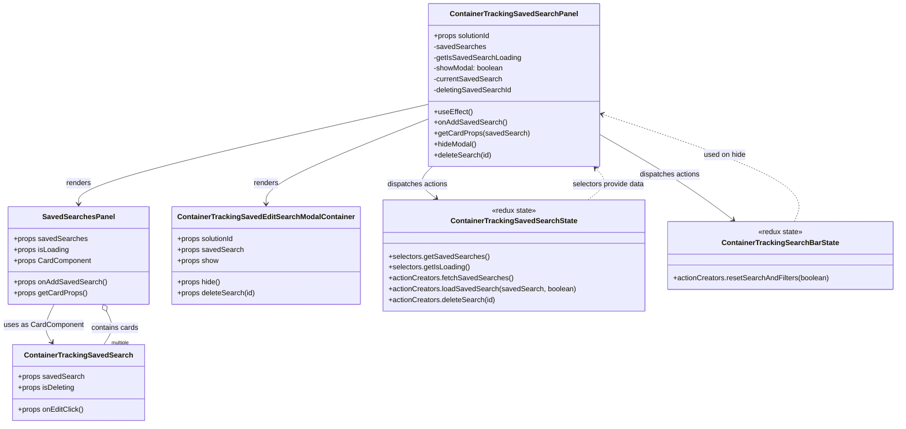
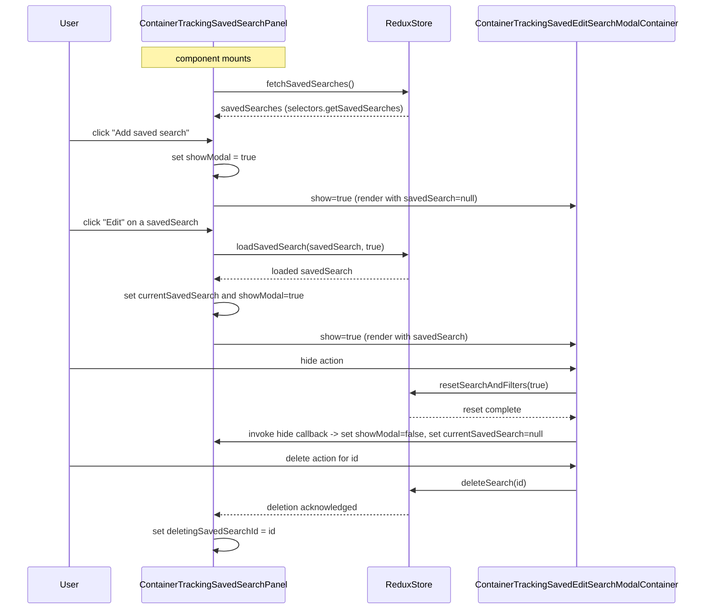

# Diagram: web/portal/src/pages/containertracking/dashboard/components/homepage/ContainerTracking.SavedSearchesPanel.js

> Auto-generated by Obscura crawlers

## Diagram 1

### SVG

<svg id="container" width="1933.2684326171875" xmlns="http://www.w3.org/2000/svg" class="classDiagram" height="938" viewBox="3.0753555297851562 0 1933.2684326171875 938" role="graphics-document document" aria-roledescription="class"><g><defs><marker id="container_class-aggregationStart" class="marker aggregation class" refX="18" refY="7" markerWidth="190" markerHeight="240" orient="auto"><path d="M 18,7 L9,13 L1,7 L9,1 Z"></path></marker></defs><defs><marker id="container_class-aggregationEnd" class="marker aggregation class" refX="1" refY="7" markerWidth="20" markerHeight="28" orient="auto"><path d="M 18,7 L9,13 L1,7 L9,1 Z"></path></marker></defs><defs><marker id="container_class-extensionStart" class="marker extension class" refX="18" refY="7" markerWidth="190" markerHeight="240" orient="auto"><path d="M 1,7 L18,13 V 1 Z"></path></marker></defs><defs><marker id="container_class-extensionEnd" class="marker extension class" refX="1" refY="7" markerWidth="20" markerHeight="28" orient="auto"><path d="M 1,1 V 13 L18,7 Z"></path></marker></defs><defs><marker id="container_class-compositionStart" class="marker composition class" refX="18" refY="7" markerWidth="190" markerHeight="240" orient="auto"><path d="M 18,7 L9,13 L1,7 L9,1 Z"></path></marker></defs><defs><marker id="container_class-compositionEnd" class="marker composition class" refX="1" refY="7" markerWidth="20" markerHeight="28" orient="auto"><path d="M 18,7 L9,13 L1,7 L9,1 Z"></path></marker></defs><defs><marker id="container_class-dependencyStart" class="marker dependency class" refX="6" refY="7" markerWidth="190" markerHeight="240" orient="auto"><path d="M 5,7 L9,13 L1,7 L9,1 Z"></path></marker></defs><defs><marker id="container_class-dependencyEnd" class="marker dependency class" refX="13" refY="7" markerWidth="20" markerHeight="28" orient="auto"><path d="M 18,7 L9,13 L14,7 L9,1 Z"></path></marker></defs><defs><marker id="container_class-lollipopStart" class="marker lollipop class" refX="13" refY="7" markerWidth="190" markerHeight="240" orient="auto"><circle stroke="black" fill="transparent" cx="7" cy="7" r="6"></circle></marker></defs><defs><marker id="container_class-lollipopEnd" class="marker lollipop class" refX="1" refY="7" markerWidth="190" markerHeight="240" orient="auto"><circle stroke="black" fill="transparent" cx="7" cy="7" r="6"></circle></marker></defs><g class="root"><g class="clusters"></g><g class="edgePaths"><path d="M922.754,230.351L798.09,259.459C673.427,288.567,424.1,346.784,299.437,383.558C174.773,420.333,174.773,435.667,174.773,443.333L174.773,451" id="id_ContainerTrackingSavedSearchPanel_SavedSearchesPanel_1" class="edge-thickness-normal edge-pattern-solid relation" style=";;;" data-edge="true" data-et="edge" data-id="id_ContainerTrackingSavedSearchPanel_SavedSearchesPanel_1" data-points="W3sieCI6OTIyLjc1MzkwNjI1LCJ5IjoyMzAuMzUwOTE3OTcxMDQ4Nn0seyJ4IjoxNzQuNzczNDM3NSwieSI6NDA1fSx7IngiOjE3NC43NzM0Mzc1LCJ5Ijo0NTd9XQ==" marker-end="url(#container_class-dependencyEnd)"></path><path d="M120.942,673L116.622,681.667C112.303,690.333,103.663,707.667,102.857,721.665C102.052,735.663,109.08,746.327,112.594,751.659L116.108,756.99" id="id_SavedSearchesPanel_ContainerTrackingSavedSearch_2" class="edge-thickness-normal edge-pattern-solid relation" style=";;;" data-edge="true" data-et="edge" data-id="id_SavedSearchesPanel_ContainerTrackingSavedSearch_2" data-points="W3sieCI6MTIwLjk0MjE4NzUsInkiOjY3M30seyJ4Ijo5NS4wMjM0Mzc1LCJ5Ijo3MjV9LHsieCI6MTE5LjQwOTgwMTEzNjM2MzYzLCJ5Ijo3NjJ9XQ==" marker-end="url(#container_class-dependencyEnd)"></path><path d="M922.754,262.178L864.55,285.982C806.346,309.786,689.939,357.393,631.735,388.863C573.531,420.333,573.531,435.667,573.531,443.333L573.531,451" id="id_ContainerTrackingSavedSearchPanel_ContainerTrackingSavedEditSearchModalContainer_3" class="edge-thickness-normal edge-pattern-solid relation" style=";;;" data-edge="true" data-et="edge" data-id="id_ContainerTrackingSavedSearchPanel_ContainerTrackingSavedEditSearchModalContainer_3" data-points="W3sieCI6OTIyLjc1MzkwNjI1LCJ5IjoyNjIuMTc4NDg5OTIxNTIxOX0seyJ4Ijo1NzMuNTMxMjUsInkiOjQwNX0seyJ4Ijo1NzMuNTMxMjUsInkiOjQ1N31d" marker-end="url(#container_class-dependencyEnd)"></path><path d="M931.958,368L926.059,374.167C920.161,380.333,908.364,392.667,909.673,404.389C910.982,416.112,925.398,427.225,932.606,432.781L939.814,438.337" id="id_ContainerTrackingSavedSearchPanel_ContainerTrackingSavedSearchState_4" class="edge-thickness-normal edge-pattern-solid relation" style=";;;" data-edge="true" data-et="edge" data-id="id_ContainerTrackingSavedSearchPanel_ContainerTrackingSavedSearchState_4" data-points="W3sieCI6OTMxLjk1NzkxMzMwNjQ1MTYsInkiOjM2OH0seyJ4Ijo4OTYuNTY2NDA2MjUsInkiOjQwNX0seyJ4Ijo5NDQuNTY2MTM3Njk1MzEyNSwieSI6NDQyfV0=" marker-end="url(#container_class-dependencyEnd)"></path><path d="M1285.512,293.35L1317.549,311.958C1349.587,330.566,1413.663,367.783,1463.065,399.943C1512.467,432.103,1547.196,459.206,1564.56,472.757L1581.925,486.309" id="id_ContainerTrackingSavedSearchPanel_ContainerTrackingSearchBarState_5" class="edge-thickness-normal edge-pattern-solid relation" style=";;;" data-edge="true" data-et="edge" data-id="id_ContainerTrackingSavedSearchPanel_ContainerTrackingSearchBarState_5" data-points="W3sieCI6MTI4NS41MTE3MTg3NSwieSI6MjkzLjM0OTY5NjI2NjMyMzd9LHsieCI6MTQ3Ny43MzgyODEyNSwieSI6NDA1fSx7IngiOjE1ODYuNjU0OTA3MjI2NTYyNSwieSI6NDkwfV0=" marker-end="url(#container_class-dependencyEnd)"></path><path d="M1261.742,442L1269.643,435.833C1277.545,429.667,1293.349,417.333,1296.111,405.727C1298.873,394.12,1288.595,383.241,1283.455,377.801L1278.316,372.361" id="id_ContainerTrackingSavedSearchState_ContainerTrackingSavedSearchPanel_6" class="edge-thickness-normal edge-pattern-dashed relation" style=";;;" data-edge="true" data-et="edge" data-id="id_ContainerTrackingSavedSearchState_ContainerTrackingSavedSearchPanel_6" data-points="W3sieCI6MTI2MS43NDE1NzcxNDg0Mzc1LCJ5Ijo0NDJ9LHsieCI6MTMwOS4xNTIzNDM3NSwieSI6NDA1fSx7IngiOjEyNzQuMTk1MDk2NDg2MTc1LCJ5IjozNjh9XQ==" marker-end="url(#container_class-dependencyEnd)"></path><path d="M1714.386,490L1720.36,475.833C1726.334,461.667,1738.282,433.333,1667.751,393.471C1597.22,353.61,1444.21,302.219,1367.705,276.524L1291.199,250.829" id="id_ContainerTrackingSearchBarState_ContainerTrackingSavedSearchPanel_7" class="edge-thickness-normal edge-pattern-dashed relation" style=";;;" data-edge="true" data-et="edge" data-id="id_ContainerTrackingSearchBarState_ContainerTrackingSavedSearchPanel_7" data-points="W3sieCI6MTcxNC4zODU2MjAxMTcxODc1LCJ5Ijo0OTB9LHsieCI6MTc1MC4yMzA0Njg3NSwieSI6NDA1fSx7IngiOjEyODUuNTExNzE4NzUsInkiOjI0OC45MTgzODAxNzkwNzk5Mn1d" marker-end="url(#container_class-dependencyEnd)"></path><path d="M236.3,688.439L239.337,694.532C242.374,700.626,248.449,712.813,247.422,725.073C246.395,737.333,238.266,749.667,234.201,755.833L230.137,762" id="id_SavedSearchesPanel_ContainerTrackingSavedSearch_8" class="edge-thickness-normal edge-pattern-solid relation" style=";;;" data-edge="true" data-et="edge" data-id="id_SavedSearchesPanel_ContainerTrackingSavedSearch_8" data-points="W3sieCI6MjI4LjYwNDY4NzUsInkiOjY3M30seyJ4IjoyNTQuNTIzNDM3NSwieSI6NzI1fSx7IngiOjIzMC4xMzcwNzM4NjM2MzYzNywieSI6NzYyfV0=" marker-start="url(#container_class-aggregationStart)"></path></g><g class="edgeLabels"><g class="edgeLabel" transform="translate(174.7734375, 405)"><g class="label" data-id="id_ContainerTrackingSavedSearchPanel_SavedSearchesPanel_1" transform="translate(-27.75, -12)"><foreignObject width="55.5" height="24">

renders

</foreignObject></g></g><g class="edgeLabel" transform="translate(98.09879, 718.83002)"><g class="label" data-id="id_SavedSearchesPanel_ContainerTrackingSavedSearch_2" transform="translate(-87.0234375, -12)"><foreignObject width="174.046875" height="24">

uses as CardComponent

</foreignObject></g></g><g class="edgeLabel" transform="translate(573.53125, 405)"><g class="label" data-id="id_ContainerTrackingSavedSearchPanel_ContainerTrackingSavedEditSearchModalContainer_3" transform="translate(-27.75, -12)"><foreignObject width="55.5" height="24">

renders

</foreignObject></g></g><g class="edgeLabel" transform="translate(900.29039, 407.87059)"><g class="label" data-id="id_ContainerTrackingSavedSearchPanel_ContainerTrackingSavedSearchState_4" transform="translate(-67.71875, -12)"><foreignObject width="135.4375" height="24">

dispatches actions

</foreignObject></g></g><g class="edgeLabel" transform="translate(1441.35936, 383.87015)"><g class="label" data-id="id_ContainerTrackingSavedSearchPanel_ContainerTrackingSearchBarState_5" transform="translate(-67.71875, -12)"><foreignObject width="135.4375" height="24">

dispatches actions

</foreignObject></g></g><g class="edgeLabel" transform="translate(1305.51109, 407.84168)"><g class="label" data-id="id_ContainerTrackingSavedSearchState_ContainerTrackingSavedSearchPanel_6" transform="translate(-80.8671875, -12)"><foreignObject width="161.734375" height="24">

selectors provide data

</foreignObject></g></g><g class="edgeLabel" transform="translate(1561.59528, 341.64451)"><g class="label" data-id="id_ContainerTrackingSearchBarState_ContainerTrackingSavedSearchPanel_7" transform="translate(-47.2265625, -12)"><foreignObject width="94.453125" height="24">

used on hide

</foreignObject></g></g><g class="edgeLabel" transform="translate(254.5234375, 725)"><g class="label" data-id="id_SavedSearchesPanel_ContainerTrackingSavedSearch_8" transform="translate(-52.4765625, -12)"><foreignObject width="104.953125" height="24">

contains cards

</foreignObject></g></g><g class="edgeTerminals" transform="translate(247.2919306724015, 750.6429294134365)"><g class="inner" transform="translate(0, 0)"></g><foreignObject style="width: 72px; height: 12px;">
multiple
</foreignObject></g></g><g class="nodes"><g class="node default" id="classId-ContainerTrackingSavedSearchPanel-0" transform="translate(1104.1328125, 188)"><g class="basic label-container"><path d="M-181.37890625 -180 L181.37890625 -180 L181.37890625 180 L-181.37890625 180" stroke="none" stroke-width="0" fill="#ECECFF" style=""></path><path d="M-181.37890625 -180 C-56.8170334080622 -180, 67.7448394338756 -180, 181.37890625 -180 M-181.37890625 -180 C-47.05120751556663 -180, 87.27649121886674 -180, 181.37890625 -180 M181.37890625 -180 C181.37890625 -42.79043185181999, 181.37890625 94.41913629636002, 181.37890625 180 M181.37890625 -180 C181.37890625 -69.7469468318561, 181.37890625 40.506106336287786, 181.37890625 180 M181.37890625 180 C71.09674504306683 180, -39.185416163866336 180, -181.37890625 180 M181.37890625 180 C95.09048865165754 180, 8.802071053315075 180, -181.37890625 180 M-181.37890625 180 C-181.37890625 65.08926078546354, -181.37890625 -49.821478429072926, -181.37890625 -180 M-181.37890625 180 C-181.37890625 102.44544086549298, -181.37890625 24.890881730985967, -181.37890625 -180" stroke="#9370DB" stroke-width="1.3" fill="none" stroke-dasharray="0 0" style=""></path></g><g class="annotation-group text" transform="translate(0, -156)"></g><g class="label-group text" transform="translate(-133.5078125, -156)"><g class="label" style="font-weight: bolder" transform="translate(0,-12)"><foreignObject width="267.015625" height="24">

ContainerTrackingSavedSearchPanel

</foreignObject></g></g><g class="members-group text" transform="translate(-169.37890625, -108)"><g class="label" style="" transform="translate(0,-12)"><foreignObject width="127.859375" height="24">

+props solutionId

</foreignObject></g><g class="label" style="" transform="translate(0,12)"><foreignObject width="113.21875" height="24">

-savedSearches

</foreignObject></g><g class="label" style="" transform="translate(0,36)"><foreignObject width="190.421875" height="24">

-getIsSavedSearchLoading

</foreignObject></g><g class="label" style="" transform="translate(0,60)"><foreignObject width="156.390625" height="24">

-showModal: boolean

</foreignObject></g><g class="label" style="" transform="translate(0,84)"><foreignObject width="150.984375" height="24">

-currentSavedSearch

</foreignObject></g><g class="label" style="" transform="translate(0,108)"><foreignObject width="172.328125" height="24">

-deletingSavedSearchId

</foreignObject></g></g><g class="methods-group text" transform="translate(-169.37890625, 60)"><g class="label" style="" transform="translate(0,-12)"><foreignObject width="84.8125" height="24">

+useEffect()

</foreignObject></g><g class="label" style="" transform="translate(0,12)"><foreignObject width="157.375" height="24">

+onAddSavedSearch()

</foreignObject></g><g class="label" style="" transform="translate(0,36)"><foreignObject width="205.25" height="24">

+getCardProps(savedSearch)

</foreignObject></g><g class="label" style="" transform="translate(0,60)"><foreignObject width="95.125" height="24">

+hideModal()

</foreignObject></g><g class="label" style="" transform="translate(0,84)"><foreignObject width="127.015625" height="24">

+deleteSearch(id)

</foreignObject></g></g><g class="divider" style=""><path d="M-181.37890625 -132 C-82.45898876625056 -132, 16.460928717498888 -132, 181.37890625 -132 M-181.37890625 -132 C-43.46819886859825 -132, 94.4425085128035 -132, 181.37890625 -132" stroke="#9370DB" stroke-width="1.3" fill="none" stroke-dasharray="0 0" style=""></path></g><g class="divider" style=""><path d="M-181.37890625 36 C-93.93868258212738 36, -6.498458914254769 36, 181.37890625 36 M-181.37890625 36 C-83.38703513275108 36, 14.60483598449784 36, 181.37890625 36" stroke="#9370DB" stroke-width="1.3" fill="none" stroke-dasharray="0 0" style=""></path></g></g><g class="node default" id="classId-SavedSearchesPanel-1" transform="translate(174.7734375, 565)"><g class="basic label-container"><path d="M-151.1953125 -108 L151.1953125 -108 L151.1953125 108 L-151.1953125 108" stroke="none" stroke-width="0" fill="#ECECFF" style=""></path><path d="M-151.1953125 -108 C-77.26856048586937 -108, -3.3418084717387444 -108, 151.1953125 -108 M-151.1953125 -108 C-56.35827685411293 -108, 38.47875879177414 -108, 151.1953125 -108 M151.1953125 -108 C151.1953125 -41.81750700880225, 151.1953125 24.364985982395496, 151.1953125 108 M151.1953125 -108 C151.1953125 -57.55470879306092, 151.1953125 -7.109417586121836, 151.1953125 108 M151.1953125 108 C50.80197753640354 108, -49.59135742719292 108, -151.1953125 108 M151.1953125 108 C33.4136729719807 108, -84.3679665560386 108, -151.1953125 108 M-151.1953125 108 C-151.1953125 34.69992520447694, -151.1953125 -38.60014959104612, -151.1953125 -108 M-151.1953125 108 C-151.1953125 58.62276598780617, -151.1953125 9.245531975612337, -151.1953125 -108" stroke="#9370DB" stroke-width="1.3" fill="none" stroke-dasharray="0 0" style=""></path></g><g class="annotation-group text" transform="translate(0, -84)"></g><g class="label-group text" transform="translate(-75.265625, -84)"><g class="label" style="font-weight: bolder" transform="translate(0,-12)"><foreignObject width="150.53125" height="24">

SavedSearchesPanel

</foreignObject></g></g><g class="members-group text" transform="translate(-139.1953125, -36)"><g class="label" style="" transform="translate(0,-12)"><foreignObject width="160.515625" height="24">

+props savedSearches

</foreignObject></g><g class="label" style="" transform="translate(0,12)"><foreignObject width="122.96875" height="24">

+props isLoading

</foreignObject></g><g class="label" style="" transform="translate(0,36)"><foreignObject width="170.3125" height="24">

+props CardComponent

</foreignObject></g></g><g class="methods-group text" transform="translate(-139.1953125, 60)"><g class="label" style="" transform="translate(0,-12)"><foreignObject width="203.125" height="24">

+props onAddSavedSearch()

</foreignObject></g><g class="label" style="" transform="translate(0,12)"><foreignObject width="160.4375" height="24">

+props getCardProps()

</foreignObject></g></g><g class="divider" style=""><path d="M-151.1953125 -60 C-87.78949812980292 -60, -24.383683759605844 -60, 151.1953125 -60 M-151.1953125 -60 C-61.83333938327179 -60, 27.528633733456417 -60, 151.1953125 -60" stroke="#9370DB" stroke-width="1.3" fill="none" stroke-dasharray="0 0" style=""></path></g><g class="divider" style=""><path d="M-151.1953125 36 C-71.41621693409108 36, 8.362878631817836 36, 151.1953125 36 M-151.1953125 36 C-61.78489534677253 36, 27.62552180645494 36, 151.1953125 36" stroke="#9370DB" stroke-width="1.3" fill="none" stroke-dasharray="0 0" style=""></path></g></g><g class="node default" id="classId-ContainerTrackingSavedSearch-2" transform="translate(174.7734375, 846)"><g class="basic label-container"><path d="M-141.05859375 -84 L141.05859375 -84 L141.05859375 84 L-141.05859375 84" stroke="none" stroke-width="0" fill="#ECECFF" style=""></path><path d="M-141.05859375 -84 C-43.33265825156212 -84, 54.393277246875755 -84, 141.05859375 -84 M-141.05859375 -84 C-60.28999291724426 -84, 20.478607915511475 -84, 141.05859375 -84 M141.05859375 -84 C141.05859375 -31.357344046248933, 141.05859375 21.285311907502134, 141.05859375 84 M141.05859375 -84 C141.05859375 -24.473312258619956, 141.05859375 35.05337548276009, 141.05859375 84 M141.05859375 84 C47.56460157533911 84, -45.92939059932178 84, -141.05859375 84 M141.05859375 84 C28.726478039228596 84, -83.60563767154281 84, -141.05859375 84 M-141.05859375 84 C-141.05859375 17.611262027891144, -141.05859375 -48.77747594421771, -141.05859375 -84 M-141.05859375 84 C-141.05859375 46.434352266167735, -141.05859375 8.868704532335471, -141.05859375 -84" stroke="#9370DB" stroke-width="1.3" fill="none" stroke-dasharray="0 0" style=""></path></g><g class="annotation-group text" transform="translate(0, -60)"></g><g class="label-group text" transform="translate(-113.3359375, -60)"><g class="label" style="font-weight: bolder" transform="translate(0,-12)"><foreignObject width="226.671875" height="24">

ContainerTrackingSavedSearch

</foreignObject></g></g><g class="members-group text" transform="translate(-129.05859375, -12)"><g class="label" style="" transform="translate(0,-12)"><foreignObject width="144.328125" height="24">

+props savedSearch

</foreignObject></g><g class="label" style="" transform="translate(0,12)"><foreignObject width="126.078125" height="24">

+props isDeleting

</foreignObject></g></g><g class="methods-group text" transform="translate(-129.05859375, 60)"><g class="label" style="" transform="translate(0,-12)"><foreignObject width="144.78125" height="24">

+props onEditClick()

</foreignObject></g></g><g class="divider" style=""><path d="M-141.05859375 -36 C-34.92068629362356 -36, 71.21722116275288 -36, 141.05859375 -36 M-141.05859375 -36 C-76.0585380825757 -36, -11.058482415151389 -36, 141.05859375 -36" stroke="#9370DB" stroke-width="1.3" fill="none" stroke-dasharray="0 0" style=""></path></g><g class="divider" style=""><path d="M-141.05859375 36 C-54.121404713504546 36, 32.81578432299091 36, 141.05859375 36 M-141.05859375 36 C-41.11369338477428 36, 58.83120698045144 36, 141.05859375 36" stroke="#9370DB" stroke-width="1.3" fill="none" stroke-dasharray="0 0" style=""></path></g></g><g class="node default" id="classId-ContainerTrackingSavedEditSearchModalContainer-3" transform="translate(573.53125, 565)"><g class="basic label-container"><path d="M-197.5625 -108 L197.5625 -108 L197.5625 108 L-197.5625 108" stroke="none" stroke-width="0" fill="#ECECFF" style=""></path><path d="M-197.5625 -108 C-57.983376062997564 -108, 81.59574787400487 -108, 197.5625 -108 M-197.5625 -108 C-100.58519621924437 -108, -3.607892438488733 -108, 197.5625 -108 M197.5625 -108 C197.5625 -40.99923387719015, 197.5625 26.0015322456197, 197.5625 108 M197.5625 -108 C197.5625 -24.217541221017967, 197.5625 59.564917557964066, 197.5625 108 M197.5625 108 C114.41177314937858 108, 31.26104629875715 108, -197.5625 108 M197.5625 108 C103.84631696075122 108, 10.130133921502448 108, -197.5625 108 M-197.5625 108 C-197.5625 61.53894417790081, -197.5625 15.077888355801619, -197.5625 -108 M-197.5625 108 C-197.5625 34.59574040113014, -197.5625 -38.80851919773971, -197.5625 -108" stroke="#9370DB" stroke-width="1.3" fill="none" stroke-dasharray="0 0" style=""></path></g><g class="annotation-group text" transform="translate(0, -84)"></g><g class="label-group text" transform="translate(-185.5625, -84)"><g class="label" style="font-weight: bolder" transform="translate(0,-12)"><foreignObject width="371.125" height="24">

ContainerTrackingSavedEditSearchModalContainer

</foreignObject></g></g><g class="members-group text" transform="translate(-185.5625, -36)"><g class="label" style="" transform="translate(0,-12)"><foreignObject width="127.859375" height="24">

+props solutionId

</foreignObject></g><g class="label" style="" transform="translate(0,12)"><foreignObject width="144.328125" height="24">

+props savedSearch

</foreignObject></g><g class="label" style="" transform="translate(0,36)"><foreignObject width="91.421875" height="24">

+props show

</foreignObject></g></g><g class="methods-group text" transform="translate(-185.5625, 60)"><g class="label" style="" transform="translate(0,-12)"><foreignObject width="96.296875" height="24">

+props hide()

</foreignObject></g><g class="label" style="" transform="translate(0,12)"><foreignObject width="172.78125" height="24">

+props deleteSearch(id)

</foreignObject></g></g><g class="divider" style=""><path d="M-197.5625 -60 C-63.14211986986075 -60, 71.2782602602785 -60, 197.5625 -60 M-197.5625 -60 C-47.522184772798994 -60, 102.51813045440201 -60, 197.5625 -60" stroke="#9370DB" stroke-width="1.3" fill="none" stroke-dasharray="0 0" style=""></path></g><g class="divider" style=""><path d="M-197.5625 36 C-115.01078566896835 36, -32.459071337936706 36, 197.5625 36 M-197.5625 36 C-56.7721470421117 36, 84.0182059157766 36, 197.5625 36" stroke="#9370DB" stroke-width="1.3" fill="none" stroke-dasharray="0 0" style=""></path></g></g><g class="node default" id="classId-ContainerTrackingSavedSearchState-4" transform="translate(1104.1328125, 565)"><g class="basic label-container"><path d="M-283.0390625 -123 L283.0390625 -123 L283.0390625 123 L-283.0390625 123" stroke="none" stroke-width="0" fill="#ECECFF" style=""></path><path d="M-283.0390625 -123 C-62.915916184590344 -123, 157.2072301308193 -123, 283.0390625 -123 M-283.0390625 -123 C-148.27801615194193 -123, -13.516969803883853 -123, 283.0390625 -123 M283.0390625 -123 C283.0390625 -44.37594689600947, 283.0390625 34.24810620798107, 283.0390625 123 M283.0390625 -123 C283.0390625 -66.42083008767698, 283.0390625 -9.841660175353951, 283.0390625 123 M283.0390625 123 C105.91683795166185 123, -71.2053865966763 123, -283.0390625 123 M283.0390625 123 C139.89371996961708 123, -3.2516225607658384 123, -283.0390625 123 M-283.0390625 123 C-283.0390625 52.62690634468957, -283.0390625 -17.746187310620854, -283.0390625 -123 M-283.0390625 123 C-283.0390625 29.30697464041525, -283.0390625 -64.3860507191695, -283.0390625 -123" stroke="#9370DB" stroke-width="1.3" fill="none" stroke-dasharray="0 0" style=""></path></g><g class="annotation-group text" transform="translate(-49.671875, -99)"><g class="label" style="" transform="translate(0,-12)"><foreignObject width="99.34375" height="24">

«redux state»

</foreignObject></g></g><g class="label-group text" transform="translate(-132.640625, -75)"><g class="label" style="font-weight: bolder" transform="translate(0,-12)"><foreignObject width="265.28125" height="24">

ContainerTrackingSavedSearchState

</foreignObject></g></g><g class="members-group text" transform="translate(-271.0390625, -27)"></g><g class="methods-group text" transform="translate(-271.0390625, 3)"><g class="label" style="" transform="translate(0,-12)"><foreignObject width="218.234375" height="24">

+selectors.getSavedSearches()

</foreignObject></g><g class="label" style="" transform="translate(0,12)"><foreignObject width="179.484375" height="24">

+selectors.getIsLoading()

</foreignObject></g><g class="label" style="" transform="translate(0,36)"><foreignObject width="271.71875" height="24">

+actionCreators.fetchSavedSearches()

</foreignObject></g><g class="label" style="" transform="translate(0,60)"><foreignObject width="409.4375" height="24">

+actionCreators.loadSavedSearch(savedSearch, boolean)

</foreignObject></g><g class="label" style="" transform="translate(0,84)"><foreignObject width="235.78125" height="24">

+actionCreators.deleteSearch(id)

</foreignObject></g></g><g class="divider" style=""><path d="M-283.0390625 -51 C-123.17951356368971 -51, 36.68003537262058 -51, 283.0390625 -51 M-283.0390625 -51 C-84.06365719385352 -51, 114.91174811229297 -51, 283.0390625 -51" stroke="#9370DB" stroke-width="1.3" fill="none" stroke-dasharray="0 0" style=""></path></g><g class="divider" style=""><path d="M-283.0390625 -27 C-57.32541834957652 -27, 168.38822580084695 -27, 283.0390625 -27 M-283.0390625 -27 C-57.76273167736076 -27, 167.51359914527848 -27, 283.0390625 -27" stroke="#9370DB" stroke-width="1.3" fill="none" stroke-dasharray="0 0" style=""></path></g></g><g class="node default" id="classId-ContainerTrackingSearchBarState-5" transform="translate(1682.7578125, 565)"><g class="basic label-container"><path d="M-245.5859375 -75 L245.5859375 -75 L245.5859375 75 L-245.5859375 75" stroke="none" stroke-width="0" fill="#ECECFF" style=""></path><path d="M-245.5859375 -75 C-138.38894527991897 -75, -31.191953059837942 -75, 245.5859375 -75 M-245.5859375 -75 C-144.0412914373378 -75, -42.49664537467564 -75, 245.5859375 -75 M245.5859375 -75 C245.5859375 -30.323634702981593, 245.5859375 14.352730594036814, 245.5859375 75 M245.5859375 -75 C245.5859375 -37.295117737867834, 245.5859375 0.4097645242643324, 245.5859375 75 M245.5859375 75 C86.21260972630753 75, -73.16071804738493 75, -245.5859375 75 M245.5859375 75 C119.06373608926805 75, -7.458465321463905 75, -245.5859375 75 M-245.5859375 75 C-245.5859375 44.8880303176752, -245.5859375 14.776060635350404, -245.5859375 -75 M-245.5859375 75 C-245.5859375 23.650239590323338, -245.5859375 -27.699520819353324, -245.5859375 -75" stroke="#9370DB" stroke-width="1.3" fill="none" stroke-dasharray="0 0" style=""></path></g><g class="annotation-group text" transform="translate(-49.671875, -51)"><g class="label" style="" transform="translate(0,-12)"><foreignObject width="99.34375" height="24">

«redux state»

</foreignObject></g></g><g class="label-group text" transform="translate(-123.078125, -27)"><g class="label" style="font-weight: bolder" transform="translate(0,-12)"><foreignObject width="246.15625" height="24">

ContainerTrackingSearchBarState

</foreignObject></g></g><g class="members-group text" transform="translate(-233.5859375, 21)"></g><g class="methods-group text" transform="translate(-233.5859375, 51)"><g class="label" style="" transform="translate(0,-12)"><foreignObject width="344.09375" height="24">

+actionCreators.resetSearchAndFilters(boolean)

</foreignObject></g></g><g class="divider" style=""><path d="M-245.5859375 -3 C-107.80506229019221 -3, 29.975812919615578 -3, 245.5859375 -3 M-245.5859375 -3 C-139.58699315525485 -3, -33.58804881050969 -3, 245.5859375 -3" stroke="#9370DB" stroke-width="1.3" fill="none" stroke-dasharray="0 0" style=""></path></g><g class="divider" style=""><path d="M-245.5859375 21 C-113.57686129821255 21, 18.432214903574902 21, 245.5859375 21 M-245.5859375 21 C-85.66234808695066 21, 74.26124132609868 21, 245.5859375 21" stroke="#9370DB" stroke-width="1.3" fill="none" stroke-dasharray="0 0" style=""></path></g></g></g></g></g></svg>

## Diagram 2

### SVG

<svg id="container" width="1356" xmlns="http://www.w3.org/2000/svg" height="1174" viewBox="-50 -10 1356 1174" role="graphics-document document" aria-roledescription="sequence"><g><rect x="869" y="1088" fill="#eaeaea" stroke="#666" width="387" height="65" name="Modal" rx="3" ry="3" class="actor actor-bottom"></rect><text x="1062.5" y="1120.5" dominant-baseline="central" alignment-baseline="central" class="actor actor-box" style="text-anchor: middle; font-size: 16px; font-weight: 400;"><tspan x="1062.5" dy="0">ContainerTrackingSavedEditSearchModalContainer</tspan></text></g><g><rect x="669" y="1088" fill="#eaeaea" stroke="#666" width="150" height="65" name="Redux" rx="3" ry="3" class="actor actor-bottom"></rect><text x="744" y="1120.5" dominant-baseline="central" alignment-baseline="central" class="actor actor-box" style="text-anchor: middle; font-size: 16px; font-weight: 400;"><tspan x="744" dy="0">ReduxStore</tspan></text></g><g><rect x="211.5" y="1088" fill="#eaeaea" stroke="#666" width="283" height="65" name="Panel" rx="3" ry="3" class="actor actor-bottom"></rect><text x="353" y="1120.5" dominant-baseline="central" alignment-baseline="central" class="actor actor-box" style="text-anchor: middle; font-size: 16px; font-weight: 400;"><tspan x="353" dy="0">ContainerTrackingSavedSearchPanel</tspan></text></g><g><rect x="0" y="1088" fill="#eaeaea" stroke="#666" width="150" height="65" name="User" rx="3" ry="3" class="actor actor-bottom"></rect><text x="75" y="1120.5" dominant-baseline="central" alignment-baseline="central" class="actor actor-box" style="text-anchor: middle; font-size: 16px; font-weight: 400;"><tspan x="75" dy="0">User</tspan></text></g><g><line id="actor3" x1="1062.5" y1="65" x2="1062.5" y2="1088" class="actor-line 200" stroke-width="0.5px" stroke="#999" name="Modal"></line><g id="root-3"><rect x="869" y="0" fill="#eaeaea" stroke="#666" width="387" height="65" name="Modal" rx="3" ry="3" class="actor actor-top"></rect><text x="1062.5" y="32.5" dominant-baseline="central" alignment-baseline="central" class="actor actor-box" style="text-anchor: middle; font-size: 16px; font-weight: 400;"><tspan x="1062.5" dy="0">ContainerTrackingSavedEditSearchModalContainer</tspan></text></g></g><g><line id="actor2" x1="744" y1="65" x2="744" y2="1088" class="actor-line 200" stroke-width="0.5px" stroke="#999" name="Redux"></line><g id="root-2"><rect x="669" y="0" fill="#eaeaea" stroke="#666" width="150" height="65" name="Redux" rx="3" ry="3" class="actor actor-top"></rect><text x="744" y="32.5" dominant-baseline="central" alignment-baseline="central" class="actor actor-box" style="text-anchor: middle; font-size: 16px; font-weight: 400;"><tspan x="744" dy="0">ReduxStore</tspan></text></g></g><g><line id="actor1" x1="353" y1="65" x2="353" y2="1088" class="actor-line 200" stroke-width="0.5px" stroke="#999" name="Panel"></line><g id="root-1"><rect x="211.5" y="0" fill="#eaeaea" stroke="#666" width="283" height="65" name="Panel" rx="3" ry="3" class="actor actor-top"></rect><text x="353" y="32.5" dominant-baseline="central" alignment-baseline="central" class="actor actor-box" style="text-anchor: middle; font-size: 16px; font-weight: 400;"><tspan x="353" dy="0">ContainerTrackingSavedSearchPanel</tspan></text></g></g><g><line id="actor0" x1="75" y1="65" x2="75" y2="1088" class="actor-line 200" stroke-width="0.5px" stroke="#999" name="User"></line><g id="root-0"><rect x="0" y="0" fill="#eaeaea" stroke="#666" width="150" height="65" name="User" rx="3" ry="3" class="actor actor-top"></rect><text x="75" y="32.5" dominant-baseline="central" alignment-baseline="central" class="actor actor-box" style="text-anchor: middle; font-size: 16px; font-weight: 400;"><tspan x="75" dy="0">User</tspan></text></g></g><g></g><defs><symbol id="computer" width="24" height="24"><path transform="scale(.5)" d="M2 2v13h20v-13h-20zm18 11h-16v-9h16v9zm-10.228 6l.466-1h3.524l.467 1h-4.457zm14.228 3h-24l2-6h2.104l-1.33 4h18.45l-1.297-4h2.073l2 6zm-5-10h-14v-7h14v7z"></path></symbol></defs><defs><symbol id="database" fill-rule="evenodd" clip-rule="evenodd"><path transform="scale(.5)" d="M12.258.001l.256.004.255.005.253.008.251.01.249.012.247.015.246.016.242.019.241.02.239.023.236.024.233.027.231.028.229.031.225.032.223.034.22.036.217.038.214.04.211.041.208.043.205.045.201.046.198.048.194.05.191.051.187.053.183.054.18.056.175.057.172.059.168.06.163.061.16.063.155.064.15.066.074.033.073.033.071.034.07.034.069.035.068.035.067.035.066.035.064.036.064.036.062.036.06.036.06.037.058.037.058.037.055.038.055.038.053.038.052.038.051.039.05.039.048.039.047.039.045.04.044.04.043.04.041.04.04.041.039.041.037.041.036.041.034.041.033.042.032.042.03.042.029.042.027.042.026.043.024.043.023.043.021.043.02.043.018.044.017.043.015.044.013.044.012.044.011.045.009.044.007.045.006.045.004.045.002.045.001.045v17l-.001.045-.002.045-.004.045-.006.045-.007.045-.009.044-.011.045-.012.044-.013.044-.015.044-.017.043-.018.044-.02.043-.021.043-.023.043-.024.043-.026.043-.027.042-.029.042-.03.042-.032.042-.033.042-.034.041-.036.041-.037.041-.039.041-.04.041-.041.04-.043.04-.044.04-.045.04-.047.039-.048.039-.05.039-.051.039-.052.038-.053.038-.055.038-.055.038-.058.037-.058.037-.06.037-.06.036-.062.036-.064.036-.064.036-.066.035-.067.035-.068.035-.069.035-.07.034-.071.034-.073.033-.074.033-.15.066-.155.064-.16.063-.163.061-.168.06-.172.059-.175.057-.18.056-.183.054-.187.053-.191.051-.194.05-.198.048-.201.046-.205.045-.208.043-.211.041-.214.04-.217.038-.22.036-.223.034-.225.032-.229.031-.231.028-.233.027-.236.024-.239.023-.241.02-.242.019-.246.016-.247.015-.249.012-.251.01-.253.008-.255.005-.256.004-.258.001-.258-.001-.256-.004-.255-.005-.253-.008-.251-.01-.249-.012-.247-.015-.245-.016-.243-.019-.241-.02-.238-.023-.236-.024-.234-.027-.231-.028-.228-.031-.226-.032-.223-.034-.22-.036-.217-.038-.214-.04-.211-.041-.208-.043-.204-.045-.201-.046-.198-.048-.195-.05-.19-.051-.187-.053-.184-.054-.179-.056-.176-.057-.172-.059-.167-.06-.164-.061-.159-.063-.155-.064-.151-.066-.074-.033-.072-.033-.072-.034-.07-.034-.069-.035-.068-.035-.067-.035-.066-.035-.064-.036-.063-.036-.062-.036-.061-.036-.06-.037-.058-.037-.057-.037-.056-.038-.055-.038-.053-.038-.052-.038-.051-.039-.049-.039-.049-.039-.046-.039-.046-.04-.044-.04-.043-.04-.041-.04-.04-.041-.039-.041-.037-.041-.036-.041-.034-.041-.033-.042-.032-.042-.03-.042-.029-.042-.027-.042-.026-.043-.024-.043-.023-.043-.021-.043-.02-.043-.018-.044-.017-.043-.015-.044-.013-.044-.012-.044-.011-.045-.009-.044-.007-.045-.006-.045-.004-.045-.002-.045-.001-.045v-17l.001-.045.002-.045.004-.045.006-.045.007-.045.009-.044.011-.045.012-.044.013-.044.015-.044.017-.043.018-.044.02-.043.021-.043.023-.043.024-.043.026-.043.027-.042.029-.042.03-.042.032-.042.033-.042.034-.041.036-.041.037-.041.039-.041.04-.041.041-.04.043-.04.044-.04.046-.04.046-.039.049-.039.049-.039.051-.039.052-.038.053-.038.055-.038.056-.038.057-.037.058-.037.06-.037.061-.036.062-.036.063-.036.064-.036.066-.035.067-.035.068-.035.069-.035.07-.034.072-.034.072-.033.074-.033.151-.066.155-.064.159-.063.164-.061.167-.06.172-.059.176-.057.179-.056.184-.054.187-.053.19-.051.195-.05.198-.048.201-.046.204-.045.208-.043.211-.041.214-.04.217-.038.22-.036.223-.034.226-.032.228-.031.231-.028.234-.027.236-.024.238-.023.241-.02.243-.019.245-.016.247-.015.249-.012.251-.01.253-.008.255-.005.256-.004.258-.001.258.001zm-9.258 20.499v.01l.001.021.003.021.004.022.005.021.006.022.007.022.009.023.01.022.011.023.012.023.013.023.015.023.016.024.017.023.018.024.019.024.021.024.022.025.023.024.024.025.052.049.056.05.061.051.066.051.07.051.075.051.079.052.084.052.088.052.092.052.097.052.102.051.105.052.11.052.114.051.119.051.123.051.127.05.131.05.135.05.139.048.144.049.147.047.152.047.155.047.16.045.163.045.167.043.171.043.176.041.178.041.183.039.187.039.19.037.194.035.197.035.202.033.204.031.209.03.212.029.216.027.219.025.222.024.226.021.23.02.233.018.236.016.24.015.243.012.246.01.249.008.253.005.256.004.259.001.26-.001.257-.004.254-.005.25-.008.247-.011.244-.012.241-.014.237-.016.233-.018.231-.021.226-.021.224-.024.22-.026.216-.027.212-.028.21-.031.205-.031.202-.034.198-.034.194-.036.191-.037.187-.039.183-.04.179-.04.175-.042.172-.043.168-.044.163-.045.16-.046.155-.046.152-.047.148-.048.143-.049.139-.049.136-.05.131-.05.126-.05.123-.051.118-.052.114-.051.11-.052.106-.052.101-.052.096-.052.092-.052.088-.053.083-.051.079-.052.074-.052.07-.051.065-.051.06-.051.056-.05.051-.05.023-.024.023-.025.021-.024.02-.024.019-.024.018-.024.017-.024.015-.023.014-.024.013-.023.012-.023.01-.023.01-.022.008-.022.006-.022.006-.022.004-.022.004-.021.001-.021.001-.021v-4.127l-.077.055-.08.053-.083.054-.085.053-.087.052-.09.052-.093.051-.095.05-.097.05-.1.049-.102.049-.105.048-.106.047-.109.047-.111.046-.114.045-.115.045-.118.044-.12.043-.122.042-.124.042-.126.041-.128.04-.13.04-.132.038-.134.038-.135.037-.138.037-.139.035-.142.035-.143.034-.144.033-.147.032-.148.031-.15.03-.151.03-.153.029-.154.027-.156.027-.158.026-.159.025-.161.024-.162.023-.163.022-.165.021-.166.02-.167.019-.169.018-.169.017-.171.016-.173.015-.173.014-.175.013-.175.012-.177.011-.178.01-.179.008-.179.008-.181.006-.182.005-.182.004-.184.003-.184.002h-.37l-.184-.002-.184-.003-.182-.004-.182-.005-.181-.006-.179-.008-.179-.008-.178-.01-.176-.011-.176-.012-.175-.013-.173-.014-.172-.015-.171-.016-.17-.017-.169-.018-.167-.019-.166-.02-.165-.021-.163-.022-.162-.023-.161-.024-.159-.025-.157-.026-.156-.027-.155-.027-.153-.029-.151-.03-.15-.03-.148-.031-.146-.032-.145-.033-.143-.034-.141-.035-.14-.035-.137-.037-.136-.037-.134-.038-.132-.038-.13-.04-.128-.04-.126-.041-.124-.042-.122-.042-.12-.044-.117-.043-.116-.045-.113-.045-.112-.046-.109-.047-.106-.047-.105-.048-.102-.049-.1-.049-.097-.05-.095-.05-.093-.052-.09-.051-.087-.052-.085-.053-.083-.054-.08-.054-.077-.054v4.127zm0-5.654v.011l.001.021.003.021.004.021.005.022.006.022.007.022.009.022.01.022.011.023.012.023.013.023.015.024.016.023.017.024.018.024.019.024.021.024.022.024.023.025.024.024.052.05.056.05.061.05.066.051.07.051.075.052.079.051.084.052.088.052.092.052.097.052.102.052.105.052.11.051.114.051.119.052.123.05.127.051.131.05.135.049.139.049.144.048.147.048.152.047.155.046.16.045.163.045.167.044.171.042.176.042.178.04.183.04.187.038.19.037.194.036.197.034.202.033.204.032.209.03.212.028.216.027.219.025.222.024.226.022.23.02.233.018.236.016.24.014.243.012.246.01.249.008.253.006.256.003.259.001.26-.001.257-.003.254-.006.25-.008.247-.01.244-.012.241-.015.237-.016.233-.018.231-.02.226-.022.224-.024.22-.025.216-.027.212-.029.21-.03.205-.032.202-.033.198-.035.194-.036.191-.037.187-.039.183-.039.179-.041.175-.042.172-.043.168-.044.163-.045.16-.045.155-.047.152-.047.148-.048.143-.048.139-.05.136-.049.131-.05.126-.051.123-.051.118-.051.114-.052.11-.052.106-.052.101-.052.096-.052.092-.052.088-.052.083-.052.079-.052.074-.051.07-.052.065-.051.06-.05.056-.051.051-.049.023-.025.023-.024.021-.025.02-.024.019-.024.018-.024.017-.024.015-.023.014-.023.013-.024.012-.022.01-.023.01-.023.008-.022.006-.022.006-.022.004-.021.004-.022.001-.021.001-.021v-4.139l-.077.054-.08.054-.083.054-.085.052-.087.053-.09.051-.093.051-.095.051-.097.05-.1.049-.102.049-.105.048-.106.047-.109.047-.111.046-.114.045-.115.044-.118.044-.12.044-.122.042-.124.042-.126.041-.128.04-.13.039-.132.039-.134.038-.135.037-.138.036-.139.036-.142.035-.143.033-.144.033-.147.033-.148.031-.15.03-.151.03-.153.028-.154.028-.156.027-.158.026-.159.025-.161.024-.162.023-.163.022-.165.021-.166.02-.167.019-.169.018-.169.017-.171.016-.173.015-.173.014-.175.013-.175.012-.177.011-.178.009-.179.009-.179.007-.181.007-.182.005-.182.004-.184.003-.184.002h-.37l-.184-.002-.184-.003-.182-.004-.182-.005-.181-.007-.179-.007-.179-.009-.178-.009-.176-.011-.176-.012-.175-.013-.173-.014-.172-.015-.171-.016-.17-.017-.169-.018-.167-.019-.166-.02-.165-.021-.163-.022-.162-.023-.161-.024-.159-.025-.157-.026-.156-.027-.155-.028-.153-.028-.151-.03-.15-.03-.148-.031-.146-.033-.145-.033-.143-.033-.141-.035-.14-.036-.137-.036-.136-.037-.134-.038-.132-.039-.13-.039-.128-.04-.126-.041-.124-.042-.122-.043-.12-.043-.117-.044-.116-.044-.113-.046-.112-.046-.109-.046-.106-.047-.105-.048-.102-.049-.1-.049-.097-.05-.095-.051-.093-.051-.09-.051-.087-.053-.085-.052-.083-.054-.08-.054-.077-.054v4.139zm0-5.666v.011l.001.02.003.022.004.021.005.022.006.021.007.022.009.023.01.022.011.023.012.023.013.023.015.023.016.024.017.024.018.023.019.024.021.025.022.024.023.024.024.025.052.05.056.05.061.05.066.051.07.051.075.052.079.051.084.052.088.052.092.052.097.052.102.052.105.051.11.052.114.051.119.051.123.051.127.05.131.05.135.05.139.049.144.048.147.048.152.047.155.046.16.045.163.045.167.043.171.043.176.042.178.04.183.04.187.038.19.037.194.036.197.034.202.033.204.032.209.03.212.028.216.027.219.025.222.024.226.021.23.02.233.018.236.017.24.014.243.012.246.01.249.008.253.006.256.003.259.001.26-.001.257-.003.254-.006.25-.008.247-.01.244-.013.241-.014.237-.016.233-.018.231-.02.226-.022.224-.024.22-.025.216-.027.212-.029.21-.03.205-.032.202-.033.198-.035.194-.036.191-.037.187-.039.183-.039.179-.041.175-.042.172-.043.168-.044.163-.045.16-.045.155-.047.152-.047.148-.048.143-.049.139-.049.136-.049.131-.051.126-.05.123-.051.118-.052.114-.051.11-.052.106-.052.101-.052.096-.052.092-.052.088-.052.083-.052.079-.052.074-.052.07-.051.065-.051.06-.051.056-.05.051-.049.023-.025.023-.025.021-.024.02-.024.019-.024.018-.024.017-.024.015-.023.014-.024.013-.023.012-.023.01-.022.01-.023.008-.022.006-.022.006-.022.004-.022.004-.021.001-.021.001-.021v-4.153l-.077.054-.08.054-.083.053-.085.053-.087.053-.09.051-.093.051-.095.051-.097.05-.1.049-.102.048-.105.048-.106.048-.109.046-.111.046-.114.046-.115.044-.118.044-.12.043-.122.043-.124.042-.126.041-.128.04-.13.039-.132.039-.134.038-.135.037-.138.036-.139.036-.142.034-.143.034-.144.033-.147.032-.148.032-.15.03-.151.03-.153.028-.154.028-.156.027-.158.026-.159.024-.161.024-.162.023-.163.023-.165.021-.166.02-.167.019-.169.018-.169.017-.171.016-.173.015-.173.014-.175.013-.175.012-.177.01-.178.01-.179.009-.179.007-.181.006-.182.006-.182.004-.184.003-.184.001-.185.001-.185-.001-.184-.001-.184-.003-.182-.004-.182-.006-.181-.006-.179-.007-.179-.009-.178-.01-.176-.01-.176-.012-.175-.013-.173-.014-.172-.015-.171-.016-.17-.017-.169-.018-.167-.019-.166-.02-.165-.021-.163-.023-.162-.023-.161-.024-.159-.024-.157-.026-.156-.027-.155-.028-.153-.028-.151-.03-.15-.03-.148-.032-.146-.032-.145-.033-.143-.034-.141-.034-.14-.036-.137-.036-.136-.037-.134-.038-.132-.039-.13-.039-.128-.041-.126-.041-.124-.041-.122-.043-.12-.043-.117-.044-.116-.044-.113-.046-.112-.046-.109-.046-.106-.048-.105-.048-.102-.048-.1-.05-.097-.049-.095-.051-.093-.051-.09-.052-.087-.052-.085-.053-.083-.053-.08-.054-.077-.054v4.153zm8.74-8.179l-.257.004-.254.005-.25.008-.247.011-.244.012-.241.014-.237.016-.233.018-.231.021-.226.022-.224.023-.22.026-.216.027-.212.028-.21.031-.205.032-.202.033-.198.034-.194.036-.191.038-.187.038-.183.04-.179.041-.175.042-.172.043-.168.043-.163.045-.16.046-.155.046-.152.048-.148.048-.143.048-.139.049-.136.05-.131.05-.126.051-.123.051-.118.051-.114.052-.11.052-.106.052-.101.052-.096.052-.092.052-.088.052-.083.052-.079.052-.074.051-.07.052-.065.051-.06.05-.056.05-.051.05-.023.025-.023.024-.021.024-.02.025-.019.024-.018.024-.017.023-.015.024-.014.023-.013.023-.012.023-.01.023-.01.022-.008.022-.006.023-.006.021-.004.022-.004.021-.001.021-.001.021.001.021.001.021.004.021.004.022.006.021.006.023.008.022.01.022.01.023.012.023.013.023.014.023.015.024.017.023.018.024.019.024.02.025.021.024.023.024.023.025.051.05.056.05.06.05.065.051.07.052.074.051.079.052.083.052.088.052.092.052.096.052.101.052.106.052.11.052.114.052.118.051.123.051.126.051.131.05.136.05.139.049.143.048.148.048.152.048.155.046.16.046.163.045.168.043.172.043.175.042.179.041.183.04.187.038.191.038.194.036.198.034.202.033.205.032.21.031.212.028.216.027.22.026.224.023.226.022.231.021.233.018.237.016.241.014.244.012.247.011.25.008.254.005.257.004.26.001.26-.001.257-.004.254-.005.25-.008.247-.011.244-.012.241-.014.237-.016.233-.018.231-.021.226-.022.224-.023.22-.026.216-.027.212-.028.21-.031.205-.032.202-.033.198-.034.194-.036.191-.038.187-.038.183-.04.179-.041.175-.042.172-.043.168-.043.163-.045.16-.046.155-.046.152-.048.148-.048.143-.048.139-.049.136-.05.131-.05.126-.051.123-.051.118-.051.114-.052.11-.052.106-.052.101-.052.096-.052.092-.052.088-.052.083-.052.079-.052.074-.051.07-.052.065-.051.06-.05.056-.05.051-.05.023-.025.023-.024.021-.024.02-.025.019-.024.018-.024.017-.023.015-.024.014-.023.013-.023.012-.023.01-.023.01-.022.008-.022.006-.023.006-.021.004-.022.004-.021.001-.021.001-.021-.001-.021-.001-.021-.004-.021-.004-.022-.006-.021-.006-.023-.008-.022-.01-.022-.01-.023-.012-.023-.013-.023-.014-.023-.015-.024-.017-.023-.018-.024-.019-.024-.02-.025-.021-.024-.023-.024-.023-.025-.051-.05-.056-.05-.06-.05-.065-.051-.07-.052-.074-.051-.079-.052-.083-.052-.088-.052-.092-.052-.096-.052-.101-.052-.106-.052-.11-.052-.114-.052-.118-.051-.123-.051-.126-.051-.131-.05-.136-.05-.139-.049-.143-.048-.148-.048-.152-.048-.155-.046-.16-.046-.163-.045-.168-.043-.172-.043-.175-.042-.179-.041-.183-.04-.187-.038-.191-.038-.194-.036-.198-.034-.202-.033-.205-.032-.21-.031-.212-.028-.216-.027-.22-.026-.224-.023-.226-.022-.231-.021-.233-.018-.237-.016-.241-.014-.244-.012-.247-.011-.25-.008-.254-.005-.257-.004-.26-.001-.26.001z"></path></symbol></defs><defs><symbol id="clock" width="24" height="24"><path transform="scale(.5)" d="M12 2c5.514 0 10 4.486 10 10s-4.486 10-10 10-10-4.486-10-10 4.486-10 10-10zm0-2c-6.627 0-12 5.373-12 12s5.373 12 12 12 12-5.373 12-12-5.373-12-12-12zm5.848 12.459c.202.038.202.333.001.372-1.907.361-6.045 1.111-6.547 1.111-.719 0-1.301-.582-1.301-1.301 0-.512.77-5.447 1.125-7.445.034-.192.312-.181.343.014l.985 6.238 5.394 1.011z"></path></symbol></defs><defs><marker id="arrowhead" refX="7.9" refY="5" markerUnits="userSpaceOnUse" markerWidth="12" markerHeight="12" orient="auto-start-reverse"><path d="M -1 0 L 10 5 L 0 10 z"></path></marker></defs><defs><marker id="crosshead" markerWidth="15" markerHeight="8" orient="auto" refX="4" refY="4.5"><path fill="none" stroke="#000000" stroke-width="1pt" d="M 1,2 L 6,7 M 6,2 L 1,7" style="stroke-dasharray: 0, 0;"></path></marker></defs><defs><marker id="filled-head" refX="15.5" refY="7" markerWidth="20" markerHeight="28" orient="auto"><path d="M 18,7 L9,13 L14,7 L9,1 Z"></path></marker></defs><defs><marker id="sequencenumber" refX="15" refY="15" markerWidth="60" markerHeight="40" orient="auto"><circle cx="15" cy="15" r="6"></circle></marker></defs><g><rect x="211.5" y="75" fill="#EDF2AE" stroke="#666" width="283" height="39" class="note"></rect><text x="353" y="80" text-anchor="middle" dominant-baseline="middle" alignment-baseline="middle" class="noteText" dy="1em" style="font-size: 16px; font-weight: 400;"><tspan x="353">component mounts</tspan></text></g><text x="547" y="129" text-anchor="middle" dominant-baseline="middle" alignment-baseline="middle" class="messageText" dy="1em" style="font-size: 16px; font-weight: 400;">fetchSavedSearches()</text><line x1="354" y1="162" x2="740" y2="162" class="messageLine0" stroke-width="2" stroke="none" marker-end="url(#arrowhead)" style="fill: none;"></line><text x="550" y="177" text-anchor="middle" dominant-baseline="middle" alignment-baseline="middle" class="messageText" dy="1em" style="font-size: 16px; font-weight: 400;">savedSearches (selectors.getSavedSearches)</text><line x1="743" y1="210" x2="357" y2="210" class="messageLine1" stroke-width="2" stroke="none" marker-end="url(#arrowhead)" style="stroke-dasharray: 3, 3; fill: none;"></line><text x="213" y="225" text-anchor="middle" dominant-baseline="middle" alignment-baseline="middle" class="messageText" dy="1em" style="font-size: 16px; font-weight: 400;">click "Add saved search"</text><line x1="76" y1="258" x2="349" y2="258" class="messageLine0" stroke-width="2" stroke="none" marker-end="url(#arrowhead)" style="fill: none;"></line><text x="354" y="273" text-anchor="middle" dominant-baseline="middle" alignment-baseline="middle" class="messageText" dy="1em" style="font-size: 16px; font-weight: 400;">set showModal = true</text><path d="M 354,306 C 414,296 414,336 354,326" class="messageLine0" stroke-width="2" stroke="none" marker-end="url(#arrowhead)" style="fill: none;"></path><text x="706" y="351" text-anchor="middle" dominant-baseline="middle" alignment-baseline="middle" class="messageText" dy="1em" style="font-size: 16px; font-weight: 400;">show=true (render with savedSearch=null)</text><line x1="354" y1="384" x2="1058.5" y2="384" class="messageLine0" stroke-width="2" stroke="none" marker-end="url(#arrowhead)" style="fill: none;"></line><text x="213" y="399" text-anchor="middle" dominant-baseline="middle" alignment-baseline="middle" class="messageText" dy="1em" style="font-size: 16px; font-weight: 400;">click "Edit" on a savedSearch</text><line x1="76" y1="432" x2="349" y2="432" class="messageLine0" stroke-width="2" stroke="none" marker-end="url(#arrowhead)" style="fill: none;"></line><text x="547" y="447" text-anchor="middle" dominant-baseline="middle" alignment-baseline="middle" class="messageText" dy="1em" style="font-size: 16px; font-weight: 400;">loadSavedSearch(savedSearch, true)</text><line x1="354" y1="480" x2="740" y2="480" class="messageLine0" stroke-width="2" stroke="none" marker-end="url(#arrowhead)" style="fill: none;"></line><text x="550" y="495" text-anchor="middle" dominant-baseline="middle" alignment-baseline="middle" class="messageText" dy="1em" style="font-size: 16px; font-weight: 400;">loaded savedSearch</text><line x1="743" y1="528" x2="357" y2="528" class="messageLine1" stroke-width="2" stroke="none" marker-end="url(#arrowhead)" style="stroke-dasharray: 3, 3; fill: none;"></line><text x="354" y="543" text-anchor="middle" dominant-baseline="middle" alignment-baseline="middle" class="messageText" dy="1em" style="font-size: 16px; font-weight: 400;">set currentSavedSearch and showModal=true</text><path d="M 354,576 C 414,566 414,606 354,596" class="messageLine0" stroke-width="2" stroke="none" marker-end="url(#arrowhead)" style="fill: none;"></path><text x="706" y="621" text-anchor="middle" dominant-baseline="middle" alignment-baseline="middle" class="messageText" dy="1em" style="font-size: 16px; font-weight: 400;">show=true (render with savedSearch)</text><line x1="354" y1="654" x2="1058.5" y2="654" class="messageLine0" stroke-width="2" stroke="none" marker-end="url(#arrowhead)" style="fill: none;"></line><text x="567" y="669" text-anchor="middle" dominant-baseline="middle" alignment-baseline="middle" class="messageText" dy="1em" style="font-size: 16px; font-weight: 400;">hide action</text><line x1="76" y1="702" x2="1058.5" y2="702" class="messageLine0" stroke-width="2" stroke="none" marker-end="url(#arrowhead)" style="fill: none;"></line><text x="905" y="717" text-anchor="middle" dominant-baseline="middle" alignment-baseline="middle" class="messageText" dy="1em" style="font-size: 16px; font-weight: 400;">resetSearchAndFilters(true)</text><line x1="1061.5" y1="750" x2="748" y2="750" class="messageLine0" stroke-width="2" stroke="none" marker-end="url(#arrowhead)" style="fill: none;"></line><text x="902" y="765" text-anchor="middle" dominant-baseline="middle" alignment-baseline="middle" class="messageText" dy="1em" style="font-size: 16px; font-weight: 400;">reset complete</text><line x1="745" y1="798" x2="1058.5" y2="798" class="messageLine1" stroke-width="2" stroke="none" marker-end="url(#arrowhead)" style="stroke-dasharray: 3, 3; fill: none;"></line><text x="709" y="813" text-anchor="middle" dominant-baseline="middle" alignment-baseline="middle" class="messageText" dy="1em" style="font-size: 16px; font-weight: 400;">invoke hide callback -&gt; set showModal=false, set currentSavedSearch=null</text><line x1="1061.5" y1="846" x2="357" y2="846" class="messageLine0" stroke-width="2" stroke="none" marker-end="url(#arrowhead)" style="fill: none;"></line><text x="567" y="861" text-anchor="middle" dominant-baseline="middle" alignment-baseline="middle" class="messageText" dy="1em" style="font-size: 16px; font-weight: 400;">delete action for id</text><line x1="76" y1="894" x2="1058.5" y2="894" class="messageLine0" stroke-width="2" stroke="none" marker-end="url(#arrowhead)" style="fill: none;"></line><text x="905" y="909" text-anchor="middle" dominant-baseline="middle" alignment-baseline="middle" class="messageText" dy="1em" style="font-size: 16px; font-weight: 400;">deleteSearch(id)</text><line x1="1061.5" y1="942" x2="748" y2="942" class="messageLine0" stroke-width="2" stroke="none" marker-end="url(#arrowhead)" style="fill: none;"></line><text x="550" y="957" text-anchor="middle" dominant-baseline="middle" alignment-baseline="middle" class="messageText" dy="1em" style="font-size: 16px; font-weight: 400;">deletion acknowledged</text><line x1="743" y1="990" x2="357" y2="990" class="messageLine1" stroke-width="2" stroke="none" marker-end="url(#arrowhead)" style="stroke-dasharray: 3, 3; fill: none;"></line><text x="354" y="1005" text-anchor="middle" dominant-baseline="middle" alignment-baseline="middle" class="messageText" dy="1em" style="font-size: 16px; font-weight: 400;">set deletingSavedSearchId = id</text><path d="M 354,1038 C 414,1028 414,1068 354,1058" class="messageLine0" stroke-width="2" stroke="none" marker-end="url(#arrowhead)" style="fill: none;"></path></svg>
