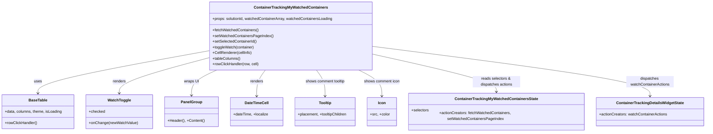

# Diagram: web/portal/src/pages/containertracking/dashboard/components/homepage/ContainerTrackingMyWatchedContainers.js


> Auto-generated by Obscura crawlers

## Diagram 1



### SVG

<svg id="container" width="2943.40625" xmlns="http://www.w3.org/2000/svg" class="classDiagram" height="546" viewBox="0 0 2943.40625 546" role="graphics-document document" aria-roledescription="class"><style>#container{font-family:"trebuchet ms",verdana,arial,sans-serif;font-size:16px;fill:#333;}@keyframes edge-animation-frame{from{stroke-dashoffset:0;}}@keyframes dash{to{stroke-dashoffset:0;}}#container .edge-animation-slow{stroke-dasharray:9,5!important;stroke-dashoffset:900;animation:dash 50s linear infinite;stroke-linecap:round;}#container .edge-animation-fast{stroke-dasharray:9,5!important;stroke-dashoffset:900;animation:dash 20s linear infinite;stroke-linecap:round;}#container .error-icon{fill:#552222;}#container .error-text{fill:#552222;stroke:#552222;}#container .edge-thickness-normal{stroke-width:1px;}#container .edge-thickness-thick{stroke-width:3.5px;}#container .edge-pattern-solid{stroke-dasharray:0;}#container .edge-thickness-invisible{stroke-width:0;fill:none;}#container .edge-pattern-dashed{stroke-dasharray:3;}#container .edge-pattern-dotted{stroke-dasharray:2;}#container .marker{fill:#333333;stroke:#333333;}#container .marker.cross{stroke:#333333;}#container svg{font-family:"trebuchet ms",verdana,arial,sans-serif;font-size:16px;}#container p{margin:0;}#container g.classGroup text{fill:#9370DB;stroke:none;font-family:"trebuchet ms",verdana,arial,sans-serif;font-size:10px;}#container g.classGroup text .title{font-weight:bolder;}#container .nodeLabel,#container .edgeLabel{color:#131300;}#container .edgeLabel .label rect{fill:#ECECFF;}#container .label text{fill:#131300;}#container .labelBkg{background:#ECECFF;}#container .edgeLabel .label span{background:#ECECFF;}#container .classTitle{font-weight:bolder;}#container .node rect,#container .node circle,#container .node ellipse,#container .node polygon,#container .node path{fill:#ECECFF;stroke:#9370DB;stroke-width:1px;}#container .divider{stroke:#9370DB;stroke-width:1;}#container g.clickable{cursor:pointer;}#container g.classGroup rect{fill:#ECECFF;stroke:#9370DB;}#container g.classGroup line{stroke:#9370DB;stroke-width:1;}#container .classLabel .box{stroke:none;stroke-width:0;fill:#ECECFF;opacity:0.5;}#container .classLabel .label{fill:#9370DB;font-size:10px;}#container .relation{stroke:#333333;stroke-width:1;fill:none;}#container .dashed-line{stroke-dasharray:3;}#container .dotted-line{stroke-dasharray:1 2;}#container #compositionStart,#container .composition{fill:#333333!important;stroke:#333333!important;stroke-width:1;}#container #compositionEnd,#container .composition{fill:#333333!important;stroke:#333333!important;stroke-width:1;}#container #dependencyStart,#container .dependency{fill:#333333!important;stroke:#333333!important;stroke-width:1;}#container #dependencyStart,#container .dependency{fill:#333333!important;stroke:#333333!important;stroke-width:1;}#container #extensionStart,#container .extension{fill:transparent!important;stroke:#333333!important;stroke-width:1;}#container #extensionEnd,#container .extension{fill:transparent!important;stroke:#333333!important;stroke-width:1;}#container #aggregationStart,#container .aggregation{fill:transparent!important;stroke:#333333!important;stroke-width:1;}#container #aggregationEnd,#container .aggregation{fill:transparent!important;stroke:#333333!important;stroke-width:1;}#container #lollipopStart,#container .lollipop{fill:#ECECFF!important;stroke:#333333!important;stroke-width:1;}#container #lollipopEnd,#container .lollipop{fill:#ECECFF!important;stroke:#333333!important;stroke-width:1;}#container .edgeTerminals{font-size:11px;line-height:initial;}#container .classTitleText{text-anchor:middle;font-size:18px;fill:#333;}#container .label-icon{display:inline-block;height:1em;overflow:visible;vertical-align:-0.125em;}#container .node .label-icon path{fill:currentColor;stroke:revert;stroke-width:revert;}#container :root{--mermaid-font-family:"trebuchet ms",verdana,arial,sans-serif;}</style><g><defs><marker id="container_class-aggregationStart" class="marker aggregation class" refX="18" refY="7" markerWidth="190" markerHeight="240" orient="auto"><path d="M 18,7 L9,13 L1,7 L9,1 Z"></path></marker></defs><defs><marker id="container_class-aggregationEnd" class="marker aggregation class" refX="1" refY="7" markerWidth="20" markerHeight="28" orient="auto"><path d="M 18,7 L9,13 L1,7 L9,1 Z"></path></marker></defs><defs><marker id="container_class-extensionStart" class="marker extension class" refX="18" refY="7" markerWidth="190" markerHeight="240" orient="auto"><path d="M 1,7 L18,13 V 1 Z"></path></marker></defs><defs><marker id="container_class-extensionEnd" class="marker extension class" refX="1" refY="7" markerWidth="20" markerHeight="28" orient="auto"><path d="M 1,1 V 13 L18,7 Z"></path></marker></defs><defs><marker id="container_class-compositionStart" class="marker composition class" refX="18" refY="7" markerWidth="190" markerHeight="240" orient="auto"><path d="M 18,7 L9,13 L1,7 L9,1 Z"></path></marker></defs><defs><marker id="container_class-compositionEnd" class="marker composition class" refX="1" refY="7" markerWidth="20" markerHeight="28" orient="auto"><path d="M 18,7 L9,13 L1,7 L9,1 Z"></path></marker></defs><defs><marker id="container_class-dependencyStart" class="marker dependency class" refX="6" refY="7" markerWidth="190" markerHeight="240" orient="auto"><path d="M 5,7 L9,13 L1,7 L9,1 Z"></path></marker></defs><defs><marker id="container_class-dependencyEnd" class="marker dependency class" refX="13" refY="7" markerWidth="20" markerHeight="28" orient="auto"><path d="M 18,7 L9,13 L14,7 L9,1 Z"></path></marker></defs><defs><marker id="container_class-lollipopStart" class="marker lollipop class" refX="13" refY="7" markerWidth="190" markerHeight="240" orient="auto"><circle stroke="black" fill="transparent" cx="7" cy="7" r="6"></circle></marker></defs><defs><marker id="container_class-lollipopEnd" class="marker lollipop class" refX="1" refY="7" markerWidth="190" markerHeight="240" orient="auto"><circle stroke="black" fill="transparent" cx="7" cy="7" r="6"></circle></marker></defs><g class="root"><g class="clusters"></g><g class="edgePaths"><path d="M867.092,214.853L749.146,236.544C631.199,258.235,395.307,301.618,277.36,330.475C159.414,359.333,159.414,373.667,159.414,380.833L159.414,388" id="id_ContainerTrackingMyWatchedContainers_BaseTable_1" class="edge-thickness-normal edge-pattern-solid relation" style=";;;" data-edge="true" data-et="edge" data-id="id_ContainerTrackingMyWatchedContainers_BaseTable_1" data-points="W3sieCI6ODY3LjA5MTc5Njg3NSwieSI6MjE0Ljg1MjYxMjkwOTA0OTN9LHsieCI6MTU5LjQxNDA2MjUsInkiOjM0NX0seyJ4IjoxNTkuNDE0MDYyNSwieSI6Mzk0fV0=" marker-end="url(#container_class-dependencyEnd)"></path><path d="M867.092,244.744L805.518,261.453C743.944,278.163,620.796,311.581,559.222,335.457C497.648,359.333,497.648,373.667,497.648,380.833L497.648,388" id="id_ContainerTrackingMyWatchedContainers_WatchToggle_2" class="edge-thickness-normal edge-pattern-solid relation" style=";;;" data-edge="true" data-et="edge" data-id="id_ContainerTrackingMyWatchedContainers_WatchToggle_2" data-points="W3sieCI6ODY3LjA5MTc5Njg3NSwieSI6MjQ0Ljc0NDAxMTE4MjYwNDM3fSx7IngiOjQ5Ny42NDg0Mzc1LCJ5IjozNDV9LHsieCI6NDk3LjY0ODQzNzUsInkiOjM5NH1d" marker-end="url(#container_class-dependencyEnd)"></path><path d="M899.862,296L882.338,304.167C864.814,312.333,829.766,328.667,812.243,345.5C794.719,362.333,794.719,379.667,794.719,388.333L794.719,397" id="id_ContainerTrackingMyWatchedContainers_PanelGroup_3" class="edge-thickness-normal edge-pattern-solid relation" style=";;;" data-edge="true" data-et="edge" data-id="id_ContainerTrackingMyWatchedContainers_PanelGroup_3" data-points="W3sieCI6ODk5Ljg2MTc3MzM5NzAyMDcsInkiOjI5Nn0seyJ4Ijo3OTQuNzE4NzUsInkiOjM0NX0seyJ4Ijo3OTQuNzE4NzUsInkiOjQwM31d" marker-end="url(#container_class-dependencyEnd)"></path><path d="M1100.998,296L1094.881,304.167C1088.764,312.333,1076.531,328.667,1070.414,346C1064.297,363.333,1064.297,381.667,1064.297,390.833L1064.297,400" id="id_ContainerTrackingMyWatchedContainers_DateTimeCell_4" class="edge-thickness-normal edge-pattern-solid relation" style=";;;" data-edge="true" data-et="edge" data-id="id_ContainerTrackingMyWatchedContainers_DateTimeCell_4" data-points="W3sieCI6MTEwMC45OTc3ODM3NTk3MTUsInkiOjI5Nn0seyJ4IjoxMDY0LjI5Njg3NSwieSI6MzQ1fSx7IngiOjEwNjQuMjk2ODc1LCJ5Ijo0MDZ9XQ==" marker-end="url(#container_class-dependencyEnd)"></path><path d="M1316.709,296L1322.826,304.167C1328.943,312.333,1341.177,328.667,1347.293,346C1353.41,363.333,1353.41,381.667,1353.41,390.833L1353.41,400" id="id_ContainerTrackingMyWatchedContainers_Tooltip_5" class="edge-thickness-normal edge-pattern-solid relation" style=";;;" data-edge="true" data-et="edge" data-id="id_ContainerTrackingMyWatchedContainers_Tooltip_5" data-points="W3sieCI6MTMxNi43MDkyNDc0OTAyODUsInkiOjI5Nn0seyJ4IjoxMzUzLjQxMDE1NjI1LCJ5IjozNDV9LHsieCI6MTM1My40MTAxNTYyNSwieSI6NDA2fV0=" marker-end="url(#container_class-dependencyEnd)"></path><path d="M1496.039,296L1512.326,304.167C1528.613,312.333,1561.187,328.667,1577.475,346C1593.762,363.333,1593.762,381.667,1593.762,390.833L1593.762,400" id="id_ContainerTrackingMyWatchedContainers_Icon_6" class="edge-thickness-normal edge-pattern-solid relation" style=";;;" data-edge="true" data-et="edge" data-id="id_ContainerTrackingMyWatchedContainers_Icon_6" data-points="W3sieCI6MTQ5Ni4wMzg5MTA3MDI3MjAyLCJ5IjoyOTZ9LHsieCI6MTU5My43NjE3MTg3NSwieSI6MzQ1fSx7IngiOjE1OTMuNzYxNzE4NzUsInkiOjQwNn1d" marker-end="url(#container_class-dependencyEnd)"></path><path d="M1550.615,228.537L1637.289,247.947C1723.964,267.358,1897.312,306.179,1983.986,332.756C2070.66,359.333,2070.66,373.667,2070.66,380.833L2070.66,388" id="id_ContainerTrackingMyWatchedContainers_ContainerTrackingMyWatchedContainersState_7" class="edge-thickness-normal edge-pattern-solid relation" style=";;;" data-edge="true" data-et="edge" data-id="id_ContainerTrackingMyWatchedContainers_ContainerTrackingMyWatchedContainersState_7" data-points="W3sieCI6MTU1MC42MTUyMzQzNzUsInkiOjIyOC41MzY5MDM1MzQzMTc2N30seyJ4IjoyMDcwLjY2MDE1NjI1LCJ5IjozNDV9LHsieCI6MjA3MC42NjAxNTYyNSwieSI6Mzk0fV0=" marker-end="url(#container_class-dependencyEnd)"></path><path d="M1550.615,195.905L1744.046,220.754C1937.477,245.603,2324.338,295.302,2517.769,329.317C2711.199,363.333,2711.199,381.667,2711.199,390.833L2711.199,400" id="id_ContainerTrackingMyWatchedContainers_ContainerTrackingDetailsWidgetState_8" class="edge-thickness-normal edge-pattern-solid relation" style=";;;" data-edge="true" data-et="edge" data-id="id_ContainerTrackingMyWatchedContainers_ContainerTrackingDetailsWidgetState_8" data-points="W3sieCI6MTU1MC42MTUyMzQzNzUsInkiOjE5NS45MDQ2ODI5MTEyMjg2Nn0seyJ4IjoyNzExLjE5OTIxODc1LCJ5IjozNDV9LHsieCI6MjcxMS4xOTkyMTg3NSwieSI6NDA2fV0=" marker-end="url(#container_class-dependencyEnd)"></path></g><g class="edgeLabels"><g class="edgeLabel" transform="translate(159.4140625, 345)"><g class="label" data-id="id_ContainerTrackingMyWatchedContainers_BaseTable_1" transform="translate(-16.4921875, -12)"><foreignObject width="32.984375" height="24"><div xmlns="http://www.w3.org/1999/xhtml" class="labelBkg" style="display: table-cell; white-space: nowrap; line-height: 1.5; max-width: 200px; text-align: center;"><span class="edgeLabel"><p>uses</p></span></div></foreignObject></g></g><g class="edgeLabel" transform="translate(497.6484375, 345)"><g class="label" data-id="id_ContainerTrackingMyWatchedContainers_WatchToggle_2" transform="translate(-27.75, -12)"><foreignObject width="55.5" height="24"><div xmlns="http://www.w3.org/1999/xhtml" class="labelBkg" style="display: table-cell; white-space: nowrap; line-height: 1.5; max-width: 200px; text-align: center;"><span class="edgeLabel"><p>renders</p></span></div></foreignObject></g></g><g class="edgeLabel" transform="translate(794.71875, 345)"><g class="label" data-id="id_ContainerTrackingMyWatchedContainers_PanelGroup_3" transform="translate(-31.1640625, -12)"><foreignObject width="62.328125" height="24"><div xmlns="http://www.w3.org/1999/xhtml" class="labelBkg" style="display: table-cell; white-space: nowrap; line-height: 1.5; max-width: 200px; text-align: center;"><span class="edgeLabel"><p>wraps UI</p></span></div></foreignObject></g></g><g class="edgeLabel" transform="translate(1064.296875, 345)"><g class="label" data-id="id_ContainerTrackingMyWatchedContainers_DateTimeCell_4" transform="translate(-27.75, -12)"><foreignObject width="55.5" height="24"><div xmlns="http://www.w3.org/1999/xhtml" class="labelBkg" style="display: table-cell; white-space: nowrap; line-height: 1.5; max-width: 200px; text-align: center;"><span class="edgeLabel"><p>renders</p></span></div></foreignObject></g></g><g class="edgeLabel" transform="translate(1353.41015625, 345)"><g class="label" data-id="id_ContainerTrackingMyWatchedContainers_Tooltip_5" transform="translate(-85.1484375, -12)"><foreignObject width="170.296875" height="24"><div xmlns="http://www.w3.org/1999/xhtml" class="labelBkg" style="display: table-cell; white-space: nowrap; line-height: 1.5; max-width: 200px; text-align: center;"><span class="edgeLabel"><p>shows comment tooltip</p></span></div></foreignObject></g></g><g class="edgeLabel" transform="translate(1593.76171875, 345)"><g class="label" data-id="id_ContainerTrackingMyWatchedContainers_Icon_6" transform="translate(-76.078125, -12)"><foreignObject width="152.15625" height="24"><div xmlns="http://www.w3.org/1999/xhtml" class="labelBkg" style="display: table-cell; white-space: nowrap; line-height: 1.5; max-width: 200px; text-align: center;"><span class="edgeLabel"><p>shows comment icon</p></span></div></foreignObject></g></g><g class="edgeLabel" transform="translate(2070.66015625, 345)"><g class="label" data-id="id_ContainerTrackingMyWatchedContainers_ContainerTrackingMyWatchedContainersState_7" transform="translate(-100, -24)"><foreignObject width="200" height="48"><div xmlns="http://www.w3.org/1999/xhtml" class="labelBkg" style="display: table; white-space: break-spaces; line-height: 1.5; max-width: 200px; text-align: center; width: 200px;"><span class="edgeLabel"><p>reads selectors &amp; dispatches actions</p></span></div></foreignObject></g></g><g class="edgeLabel" transform="translate(2711.19921875, 345)"><g class="label" data-id="id_ContainerTrackingMyWatchedContainers_ContainerTrackingDetailsWidgetState_8" transform="translate(-100, -24)"><foreignObject width="200" height="48"><div xmlns="http://www.w3.org/1999/xhtml" class="labelBkg" style="display: table; white-space: break-spaces; line-height: 1.5; max-width: 200px; text-align: center; width: 200px;"><span class="edgeLabel"><p>dispatches watchContainerActions</p></span></div></foreignObject></g></g></g><g class="nodes"><g class="node default" id="classId-ContainerTrackingMyWatchedContainers-0" transform="translate(1208.853515625, 152)"><g class="basic label-container"><path d="M-341.76171875 -144 L341.76171875 -144 L341.76171875 144 L-341.76171875 144" stroke="none" stroke-width="0" fill="#ECECFF" style=""></path><path d="M-341.76171875 -144 C-196.73187534302906 -144, -51.70203193605812 -144, 341.76171875 -144 M-341.76171875 -144 C-114.3796328460979 -144, 113.00245305780419 -144, 341.76171875 -144 M341.76171875 -144 C341.76171875 -52.677269839536535, 341.76171875 38.64546032092693, 341.76171875 144 M341.76171875 -144 C341.76171875 -53.218747272284645, 341.76171875 37.56250545543071, 341.76171875 144 M341.76171875 144 C97.36953801064527 144, -147.02264272870946 144, -341.76171875 144 M341.76171875 144 C72.93217929411861 144, -195.89736016176278 144, -341.76171875 144 M-341.76171875 144 C-341.76171875 58.68917261118935, -341.76171875 -26.621654777621302, -341.76171875 -144 M-341.76171875 144 C-341.76171875 77.80271173197322, -341.76171875 11.605423463946437, -341.76171875 -144" stroke="#9370DB" stroke-width="1.3" fill="none" stroke-dasharray="0 0" style=""></path></g><g class="annotation-group text" transform="translate(0, -120)"></g><g class="label-group text" transform="translate(-147.8515625, -120)"><g class="label" style="font-weight: bolder" transform="translate(0,-12)"><foreignObject width="295.703125" height="24"><div xmlns="http://www.w3.org/1999/xhtml" style="display: table-cell; white-space: nowrap; line-height: 1.5; max-width: 341px; text-align: center;"><span class="nodeLabel markdown-node-label" style=""><p>ContainerTrackingMyWatchedContainers</p></span></div></foreignObject></g></g><g class="members-group text" transform="translate(-329.76171875, -72)"><g class="label" style="" transform="translate(0,-12)"><foreignObject width="511.671875" height="24"><div xmlns="http://www.w3.org/1999/xhtml" style="display: table-cell; white-space: nowrap; line-height: 1.5; max-width: 570px; text-align: center;"><span class="nodeLabel markdown-node-label" style=""><p>+props: solutionId, watchedContainerArray, watchedContainersLoading</p></span></div></foreignObject></g></g><g class="methods-group text" transform="translate(-329.76171875, -24)"><g class="label" style="" transform="translate(0,-12)"><foreignObject width="194.625" height="24"><div xmlns="http://www.w3.org/1999/xhtml" style="display: table-cell; white-space: nowrap; line-height: 1.5; max-width: 252px; text-align: center;"><span class="nodeLabel markdown-node-label" style=""><p>+fetchWatchedContainers()</p></span></div></foreignObject></g><g class="label" style="" transform="translate(0,12)"><foreignObject width="254.109375" height="24"><div xmlns="http://www.w3.org/1999/xhtml" style="display: table-cell; white-space: nowrap; line-height: 1.5; max-width: 311px; text-align: center;"><span class="nodeLabel markdown-node-label" style=""><p>+setWatchedContainersPageIndex()</p></span></div></foreignObject></g><g class="label" style="" transform="translate(0,36)"><foreignObject width="187.375" height="24"><div xmlns="http://www.w3.org/1999/xhtml" style="display: table-cell; white-space: nowrap; line-height: 1.5; max-width: 245px; text-align: center;"><span class="nodeLabel markdown-node-label" style=""><p>+setSelectedContainerId()</p></span></div></foreignObject></g><g class="label" style="" transform="translate(0,60)"><foreignObject width="176.328125" height="24"><div xmlns="http://www.w3.org/1999/xhtml" style="display: table-cell; white-space: nowrap; line-height: 1.5; max-width: 234px; text-align: center;"><span class="nodeLabel markdown-node-label" style=""><p>+toggleWatch(container)</p></span></div></foreignObject></g><g class="label" style="" transform="translate(0,84)"><foreignObject width="165.578125" height="24"><div xmlns="http://www.w3.org/1999/xhtml" style="display: table-cell; white-space: nowrap; line-height: 1.5; max-width: 223px; text-align: center;"><span class="nodeLabel markdown-node-label" style=""><p>+CellRenderer(cellInfo)</p></span></div></foreignObject></g><g class="label" style="" transform="translate(0,108)"><foreignObject width="118.03125" height="24"><div xmlns="http://www.w3.org/1999/xhtml" style="display: table-cell; white-space: nowrap; line-height: 1.5; max-width: 175px; text-align: center;"><span class="nodeLabel markdown-node-label" style=""><p>+tableColumns()</p></span></div></foreignObject></g><g class="label" style="" transform="translate(0,132)"><foreignObject width="196.4375" height="24"><div xmlns="http://www.w3.org/1999/xhtml" style="display: table-cell; white-space: nowrap; line-height: 1.5; max-width: 254px; text-align: center;"><span class="nodeLabel markdown-node-label" style=""><p>+rowClickHandler(row, cell)</p></span></div></foreignObject></g></g><g class="divider" style=""><path d="M-341.76171875 -96 C-133.97202532726104 -96, 73.81766809547793 -96, 341.76171875 -96 M-341.76171875 -96 C-106.68976705759579 -96, 128.38218463480843 -96, 341.76171875 -96" stroke="#9370DB" stroke-width="1.3" fill="none" stroke-dasharray="0 0" style=""></path></g><g class="divider" style=""><path d="M-341.76171875 -48 C-86.56274309285448 -48, 168.63623256429105 -48, 341.76171875 -48 M-341.76171875 -48 C-96.53547117094004 -48, 148.69077640811992 -48, 341.76171875 -48" stroke="#9370DB" stroke-width="1.3" fill="none" stroke-dasharray="0 0" style=""></path></g></g><g class="node default" id="classId-BaseTable-1" transform="translate(159.4140625, 466)"><g class="basic label-container"><path d="M-151.4140625 -72 L151.4140625 -72 L151.4140625 72 L-151.4140625 72" stroke="none" stroke-width="0" fill="#ECECFF" style=""></path><path d="M-151.4140625 -72 C-37.12428295577689 -72, 77.16549658844622 -72, 151.4140625 -72 M-151.4140625 -72 C-83.77736015138284 -72, -16.140657802765674 -72, 151.4140625 -72 M151.4140625 -72 C151.4140625 -19.77621194033889, 151.4140625 32.44757611932222, 151.4140625 72 M151.4140625 -72 C151.4140625 -15.488283158253012, 151.4140625 41.02343368349398, 151.4140625 72 M151.4140625 72 C35.78136434520225 72, -79.8513338095955 72, -151.4140625 72 M151.4140625 72 C77.97730695968936 72, 4.5405514193787155 72, -151.4140625 72 M-151.4140625 72 C-151.4140625 16.63359128443752, -151.4140625 -38.73281743112496, -151.4140625 -72 M-151.4140625 72 C-151.4140625 19.5146066056963, -151.4140625 -32.9707867886074, -151.4140625 -72" stroke="#9370DB" stroke-width="1.3" fill="none" stroke-dasharray="0 0" style=""></path></g><g class="annotation-group text" transform="translate(0, -48)"></g><g class="label-group text" transform="translate(-37.359375, -48)"><g class="label" style="font-weight: bolder" transform="translate(0,-12)"><foreignObject width="74.71875" height="24"><div xmlns="http://www.w3.org/1999/xhtml" style="display: table-cell; white-space: nowrap; line-height: 1.5; max-width: 123px; text-align: center;"><span class="nodeLabel markdown-node-label" style=""><p>BaseTable</p></span></div></foreignObject></g></g><g class="members-group text" transform="translate(-139.4140625, 0)"><g class="label" style="" transform="translate(0,-12)"><foreignObject width="241.46875" height="24"><div xmlns="http://www.w3.org/1999/xhtml" style="display: table-cell; white-space: nowrap; line-height: 1.5; max-width: 299px; text-align: center;"><span class="nodeLabel markdown-node-label" style=""><p>+data, columns, theme, isLoading</p></span></div></foreignObject></g></g><g class="methods-group text" transform="translate(-139.4140625, 48)"><g class="label" style="" transform="translate(0,-12)"><foreignObject width="136.75" height="24"><div xmlns="http://www.w3.org/1999/xhtml" style="display: table-cell; white-space: nowrap; line-height: 1.5; max-width: 194px; text-align: center;"><span class="nodeLabel markdown-node-label" style=""><p>+rowClickHandler()</p></span></div></foreignObject></g></g><g class="divider" style=""><path d="M-151.4140625 -24 C-75.81065835751656 -24, -0.20725421503311736 -24, 151.4140625 -24 M-151.4140625 -24 C-65.73650051096268 -24, 19.94106147807463 -24, 151.4140625 -24" stroke="#9370DB" stroke-width="1.3" fill="none" stroke-dasharray="0 0" style=""></path></g><g class="divider" style=""><path d="M-151.4140625 24 C-49.779219858427425 24, 51.85562278314515 24, 151.4140625 24 M-151.4140625 24 C-44.26506644909982 24, 62.88392960180036 24, 151.4140625 24" stroke="#9370DB" stroke-width="1.3" fill="none" stroke-dasharray="0 0" style=""></path></g></g><g class="node default" id="classId-WatchToggle-2" transform="translate(497.6484375, 466)"><g class="basic label-container"><path d="M-136.8203125 -72 L136.8203125 -72 L136.8203125 72 L-136.8203125 72" stroke="none" stroke-width="0" fill="#ECECFF" style=""></path><path d="M-136.8203125 -72 C-64.93287692604461 -72, 6.954558647910773 -72, 136.8203125 -72 M-136.8203125 -72 C-66.51377031636646 -72, 3.792771867267078 -72, 136.8203125 -72 M136.8203125 -72 C136.8203125 -21.556286253721204, 136.8203125 28.887427492557592, 136.8203125 72 M136.8203125 -72 C136.8203125 -29.67032531686305, 136.8203125 12.6593493662739, 136.8203125 72 M136.8203125 72 C46.35742170282701 72, -44.10546909434598 72, -136.8203125 72 M136.8203125 72 C33.95161766637965 72, -68.9170771672407 72, -136.8203125 72 M-136.8203125 72 C-136.8203125 14.529823393776937, -136.8203125 -42.94035321244613, -136.8203125 -72 M-136.8203125 72 C-136.8203125 31.661928022849963, -136.8203125 -8.676143954300073, -136.8203125 -72" stroke="#9370DB" stroke-width="1.3" fill="none" stroke-dasharray="0 0" style=""></path></g><g class="annotation-group text" transform="translate(0, -48)"></g><g class="label-group text" transform="translate(-46.4375, -48)"><g class="label" style="font-weight: bolder" transform="translate(0,-12)"><foreignObject width="92.875" height="24"><div xmlns="http://www.w3.org/1999/xhtml" style="display: table-cell; white-space: nowrap; line-height: 1.5; max-width: 141px; text-align: center;"><span class="nodeLabel markdown-node-label" style=""><p>WatchToggle</p></span></div></foreignObject></g></g><g class="members-group text" transform="translate(-124.8203125, 0)"><g class="label" style="" transform="translate(0,-12)"><foreignObject width="67.71875" height="24"><div xmlns="http://www.w3.org/1999/xhtml" style="display: table-cell; white-space: nowrap; line-height: 1.5; max-width: 125px; text-align: center;"><span class="nodeLabel markdown-node-label" style=""><p>+checked</p></span></div></foreignObject></g></g><g class="methods-group text" transform="translate(-124.8203125, 48)"><g class="label" style="" transform="translate(0,-12)"><foreignObject width="203.203125" height="24"><div xmlns="http://www.w3.org/1999/xhtml" style="display: table-cell; white-space: nowrap; line-height: 1.5; max-width: 261px; text-align: center;"><span class="nodeLabel markdown-node-label" style=""><p>+onChange(newWatchValue)</p></span></div></foreignObject></g></g><g class="divider" style=""><path d="M-136.8203125 -24 C-53.33664834066856 -24, 30.14701581866288 -24, 136.8203125 -24 M-136.8203125 -24 C-57.9392627024894 -24, 20.941787095021198 -24, 136.8203125 -24" stroke="#9370DB" stroke-width="1.3" fill="none" stroke-dasharray="0 0" style=""></path></g><g class="divider" style=""><path d="M-136.8203125 24 C-77.29435501963874 24, -17.768397539277473 24, 136.8203125 24 M-136.8203125 24 C-68.55262424632745 24, -0.28493599265490843 24, 136.8203125 24" stroke="#9370DB" stroke-width="1.3" fill="none" stroke-dasharray="0 0" style=""></path></g></g><g class="node default" id="classId-PanelGroup-3" transform="translate(794.71875, 466)"><g class="basic label-container"><path d="M-110.25 -63 L110.25 -63 L110.25 63 L-110.25 63" stroke="none" stroke-width="0" fill="#ECECFF" style=""></path><path d="M-110.25 -63 C-39.582928326305435 -63, 31.08414334738913 -63, 110.25 -63 M-110.25 -63 C-37.57017816525769 -63, 35.109643669484626 -63, 110.25 -63 M110.25 -63 C110.25 -29.313586162219167, 110.25 4.372827675561666, 110.25 63 M110.25 -63 C110.25 -24.993619657409177, 110.25 13.012760685181647, 110.25 63 M110.25 63 C53.122885499620416 63, -4.004229000759167 63, -110.25 63 M110.25 63 C23.07215845857003 63, -64.10568308285994 63, -110.25 63 M-110.25 63 C-110.25 19.987186134969022, -110.25 -23.025627730061956, -110.25 -63 M-110.25 63 C-110.25 22.003789101228627, -110.25 -18.992421797542747, -110.25 -63" stroke="#9370DB" stroke-width="1.3" fill="none" stroke-dasharray="0 0" style=""></path></g><g class="annotation-group text" transform="translate(0, -39)"></g><g class="label-group text" transform="translate(-42.328125, -39)"><g class="label" style="font-weight: bolder" transform="translate(0,-12)"><foreignObject width="84.65625" height="24"><div xmlns="http://www.w3.org/1999/xhtml" style="display: table-cell; white-space: nowrap; line-height: 1.5; max-width: 134px; text-align: center;"><span class="nodeLabel markdown-node-label" style=""><p>PanelGroup</p></span></div></foreignObject></g></g><g class="members-group text" transform="translate(-98.25, 9)"></g><g class="methods-group text" transform="translate(-98.25, 39)"><g class="label" style="" transform="translate(0,-12)"><foreignObject width="154.171875" height="24"><div xmlns="http://www.w3.org/1999/xhtml" style="display: table-cell; white-space: nowrap; line-height: 1.5; max-width: 212px; text-align: center;"><span class="nodeLabel markdown-node-label" style=""><p>+Header(), +Content()</p></span></div></foreignObject></g></g><g class="divider" style=""><path d="M-110.25 -15 C-61.96973805904837 -15, -13.689476118096735 -15, 110.25 -15 M-110.25 -15 C-45.87980615036871 -15, 18.490387699262584 -15, 110.25 -15" stroke="#9370DB" stroke-width="1.3" fill="none" stroke-dasharray="0 0" style=""></path></g><g class="divider" style=""><path d="M-110.25 9 C-26.07579242329733 9, 58.09841515340534 9, 110.25 9 M-110.25 9 C-56.055968731669566 9, -1.8619374633391317 9, 110.25 9" stroke="#9370DB" stroke-width="1.3" fill="none" stroke-dasharray="0 0" style=""></path></g></g><g class="node default" id="classId-DateTimeCell-4" transform="translate(1064.296875, 466)"><g class="basic label-container"><path d="M-109.328125 -60 L109.328125 -60 L109.328125 60 L-109.328125 60" stroke="none" stroke-width="0" fill="#ECECFF" style=""></path><path d="M-109.328125 -60 C-65.1140015859144 -60, -20.89987817182879 -60, 109.328125 -60 M-109.328125 -60 C-60.75300601977873 -60, -12.177887039557461 -60, 109.328125 -60 M109.328125 -60 C109.328125 -24.217408483533845, 109.328125 11.56518303293231, 109.328125 60 M109.328125 -60 C109.328125 -29.612727752084524, 109.328125 0.774544495830952, 109.328125 60 M109.328125 60 C54.970478277601295 60, 0.6128315552025896 60, -109.328125 60 M109.328125 60 C50.12915494564997 60, -9.069815108700055 60, -109.328125 60 M-109.328125 60 C-109.328125 34.52432597691704, -109.328125 9.048651953834074, -109.328125 -60 M-109.328125 60 C-109.328125 35.780364299833536, -109.328125 11.560728599667065, -109.328125 -60" stroke="#9370DB" stroke-width="1.3" fill="none" stroke-dasharray="0 0" style=""></path></g><g class="annotation-group text" transform="translate(0, -36)"></g><g class="label-group text" transform="translate(-48.234375, -36)"><g class="label" style="font-weight: bolder" transform="translate(0,-12)"><foreignObject width="96.46875" height="24"><div xmlns="http://www.w3.org/1999/xhtml" style="display: table-cell; white-space: nowrap; line-height: 1.5; max-width: 145px; text-align: center;"><span class="nodeLabel markdown-node-label" style=""><p>DateTimeCell</p></span></div></foreignObject></g></g><g class="members-group text" transform="translate(-97.328125, 12)"><g class="label" style="" transform="translate(0,-12)"><foreignObject width="146.421875" height="24"><div xmlns="http://www.w3.org/1999/xhtml" style="display: table-cell; white-space: nowrap; line-height: 1.5; max-width: 204px; text-align: center;"><span class="nodeLabel markdown-node-label" style=""><p>+dateTime, +localize</p></span></div></foreignObject></g></g><g class="methods-group text" transform="translate(-97.328125, 60)"></g><g class="divider" style=""><path d="M-109.328125 -12 C-61.56333364044995 -12, -13.798542280899895 -12, 109.328125 -12 M-109.328125 -12 C-24.87205073851321 -12, 59.58402352297358 -12, 109.328125 -12" stroke="#9370DB" stroke-width="1.3" fill="none" stroke-dasharray="0 0" style=""></path></g><g class="divider" style=""><path d="M-109.328125 36 C-61.15841603543322 36, -12.98870707086644 36, 109.328125 36 M-109.328125 36 C-29.66667127237642 36, 49.99478245524716 36, 109.328125 36" stroke="#9370DB" stroke-width="1.3" fill="none" stroke-dasharray="0 0" style=""></path></g></g><g class="node default" id="classId-Tooltip-5" transform="translate(1353.41015625, 466)"><g class="basic label-container"><path d="M-129.78515625 -60 L129.78515625 -60 L129.78515625 60 L-129.78515625 60" stroke="none" stroke-width="0" fill="#ECECFF" style=""></path><path d="M-129.78515625 -60 C-49.38469330101253 -60, 31.015769647974935 -60, 129.78515625 -60 M-129.78515625 -60 C-56.14866647000126 -60, 17.48782330999748 -60, 129.78515625 -60 M129.78515625 -60 C129.78515625 -17.604721975002548, 129.78515625 24.790556049994905, 129.78515625 60 M129.78515625 -60 C129.78515625 -20.104610327645005, 129.78515625 19.79077934470999, 129.78515625 60 M129.78515625 60 C50.32823076563801 60, -29.128694718723978 60, -129.78515625 60 M129.78515625 60 C77.52100842928964 60, 25.256860608579274 60, -129.78515625 60 M-129.78515625 60 C-129.78515625 25.769613231574958, -129.78515625 -8.460773536850084, -129.78515625 -60 M-129.78515625 60 C-129.78515625 27.407552703421977, -129.78515625 -5.184894593156045, -129.78515625 -60" stroke="#9370DB" stroke-width="1.3" fill="none" stroke-dasharray="0 0" style=""></path></g><g class="annotation-group text" transform="translate(0, -36)"></g><g class="label-group text" transform="translate(-25.7265625, -36)"><g class="label" style="font-weight: bolder" transform="translate(0,-12)"><foreignObject width="51.453125" height="24"><div xmlns="http://www.w3.org/1999/xhtml" style="display: table-cell; white-space: nowrap; line-height: 1.5; max-width: 101px; text-align: center;"><span class="nodeLabel markdown-node-label" style=""><p>Tooltip</p></span></div></foreignObject></g></g><g class="members-group text" transform="translate(-117.78515625, 12)"><g class="label" style="" transform="translate(0,-12)"><foreignObject width="209.84375" height="24"><div xmlns="http://www.w3.org/1999/xhtml" style="display: table-cell; white-space: nowrap; line-height: 1.5; max-width: 267px; text-align: center;"><span class="nodeLabel markdown-node-label" style=""><p>+placement, +tooltipChildren</p></span></div></foreignObject></g></g><g class="methods-group text" transform="translate(-117.78515625, 60)"></g><g class="divider" style=""><path d="M-129.78515625 -12 C-59.089207710954 -12, 11.606740828092 -12, 129.78515625 -12 M-129.78515625 -12 C-32.89391724059868 -12, 63.997321768802635 -12, 129.78515625 -12" stroke="#9370DB" stroke-width="1.3" fill="none" stroke-dasharray="0 0" style=""></path></g><g class="divider" style=""><path d="M-129.78515625 36 C-28.10853685399769 36, 73.56808254200462 36, 129.78515625 36 M-129.78515625 36 C-74.26292978210083 36, -18.740703314201667 36, 129.78515625 36" stroke="#9370DB" stroke-width="1.3" fill="none" stroke-dasharray="0 0" style=""></path></g></g><g class="node default" id="classId-Icon-6" transform="translate(1593.76171875, 466)"><g class="basic label-container"><path d="M-60.56640625 -60 L60.56640625 -60 L60.56640625 60 L-60.56640625 60" stroke="none" stroke-width="0" fill="#ECECFF" style=""></path><path d="M-60.56640625 -60 C-26.192038816519094 -60, 8.182328616961811 -60, 60.56640625 -60 M-60.56640625 -60 C-26.188860041882485 -60, 8.18868616623503 -60, 60.56640625 -60 M60.56640625 -60 C60.56640625 -12.955692092433843, 60.56640625 34.088615815132314, 60.56640625 60 M60.56640625 -60 C60.56640625 -12.959125203539578, 60.56640625 34.08174959292084, 60.56640625 60 M60.56640625 60 C24.78046411456237 60, -11.005478020875259 60, -60.56640625 60 M60.56640625 60 C19.893505944912597 60, -20.779394360174805 60, -60.56640625 60 M-60.56640625 60 C-60.56640625 28.06181516897361, -60.56640625 -3.876369662052781, -60.56640625 -60 M-60.56640625 60 C-60.56640625 16.106758195243977, -60.56640625 -27.786483609512047, -60.56640625 -60" stroke="#9370DB" stroke-width="1.3" fill="none" stroke-dasharray="0 0" style=""></path></g><g class="annotation-group text" transform="translate(0, -36)"></g><g class="label-group text" transform="translate(-15.3046875, -36)"><g class="label" style="font-weight: bolder" transform="translate(0,-12)"><foreignObject width="30.609375" height="24"><div xmlns="http://www.w3.org/1999/xhtml" style="display: table-cell; white-space: nowrap; line-height: 1.5; max-width: 81px; text-align: center;"><span class="nodeLabel markdown-node-label" style=""><p>Icon</p></span></div></foreignObject></g></g><g class="members-group text" transform="translate(-48.56640625, 12)"><g class="label" style="" transform="translate(0,-12)"><foreignObject width="81.828125" height="24"><div xmlns="http://www.w3.org/1999/xhtml" style="display: table-cell; white-space: nowrap; line-height: 1.5; max-width: 140px; text-align: center;"><span class="nodeLabel markdown-node-label" style=""><p>+src, +color</p></span></div></foreignObject></g></g><g class="methods-group text" transform="translate(-48.56640625, 60)"></g><g class="divider" style=""><path d="M-60.56640625 -12 C-35.57439044568527 -12, -10.582374641370535 -12, 60.56640625 -12 M-60.56640625 -12 C-35.8325704811124 -12, -11.098734712224797 -12, 60.56640625 -12" stroke="#9370DB" stroke-width="1.3" fill="none" stroke-dasharray="0 0" style=""></path></g><g class="divider" style=""><path d="M-60.56640625 36 C-18.21981828900622 36, 24.12676967198756 36, 60.56640625 36 M-60.56640625 36 C-15.895692387747687 36, 28.775021474504626 36, 60.56640625 36" stroke="#9370DB" stroke-width="1.3" fill="none" stroke-dasharray="0 0" style=""></path></g></g><g class="node default" id="classId-ContainerTrackingMyWatchedContainersState-7" transform="translate(2070.66015625, 466)"><g class="basic label-container"><path d="M-366.33203125 -72 L366.33203125 -72 L366.33203125 72 L-366.33203125 72" stroke="none" stroke-width="0" fill="#ECECFF" style=""></path><path d="M-366.33203125 -72 C-140.7225352577808 -72, 84.88696073443839 -72, 366.33203125 -72 M-366.33203125 -72 C-198.32677885227847 -72, -30.32152645455693 -72, 366.33203125 -72 M366.33203125 -72 C366.33203125 -38.682060259680114, 366.33203125 -5.3641205193602275, 366.33203125 72 M366.33203125 -72 C366.33203125 -15.962059278579176, 366.33203125 40.07588144284165, 366.33203125 72 M366.33203125 72 C139.88905111364744 72, -86.55392902270512 72, -366.33203125 72 M366.33203125 72 C138.6483335937828 72, -89.03536406243438 72, -366.33203125 72 M-366.33203125 72 C-366.33203125 33.51407397026851, -366.33203125 -4.971852059462975, -366.33203125 -72 M-366.33203125 72 C-366.33203125 30.857155032777, -366.33203125 -10.285689934445998, -366.33203125 -72" stroke="#9370DB" stroke-width="1.3" fill="none" stroke-dasharray="0 0" style=""></path></g><g class="annotation-group text" transform="translate(0, -48)"></g><g class="label-group text" transform="translate(-167.1640625, -48)"><g class="label" style="font-weight: bolder" transform="translate(0,-12)"><foreignObject width="334.328125" height="24"><div xmlns="http://www.w3.org/1999/xhtml" style="display: table-cell; white-space: nowrap; line-height: 1.5; max-width: 378px; text-align: center;"><span class="nodeLabel markdown-node-label" style=""><p>ContainerTrackingMyWatchedContainersState</p></span></div></foreignObject></g></g><g class="members-group text" transform="translate(-354.33203125, 0)"><g class="label" style="" transform="translate(0,-12)"><foreignObject width="73.453125" height="24"><div xmlns="http://www.w3.org/1999/xhtml" style="display: table-cell; white-space: nowrap; line-height: 1.5; max-width: 131px; text-align: center;"><span class="nodeLabel markdown-node-label" style=""><p>+selectors</p></span></div></foreignObject></g><g class="label" style="" transform="translate(0,12)"><foreignObject width="541.5" height="24"><div xmlns="http://www.w3.org/1999/xhtml" style="display: table-cell; white-space: nowrap; line-height: 1.5; max-width: 599px; text-align: center;"><span class="nodeLabel markdown-node-label" style=""><p>+actionCreators: fetchWatchedContainers, setWatchedContainersPageIndex</p></span></div></foreignObject></g></g><g class="methods-group text" transform="translate(-354.33203125, 72)"></g><g class="divider" style=""><path d="M-366.33203125 -24 C-116.46751131036297 -24, 133.39700862927407 -24, 366.33203125 -24 M-366.33203125 -24 C-203.30577461361378 -24, -40.279517977227556 -24, 366.33203125 -24" stroke="#9370DB" stroke-width="1.3" fill="none" stroke-dasharray="0 0" style=""></path></g><g class="divider" style=""><path d="M-366.33203125 48 C-161.9907592646004 48, 42.3505127207992 48, 366.33203125 48 M-366.33203125 48 C-216.38665705484496 48, -66.44128285968992 48, 366.33203125 48" stroke="#9370DB" stroke-width="1.3" fill="none" stroke-dasharray="0 0" style=""></path></g></g><g class="node default" id="classId-ContainerTrackingDetailsWidgetState-8" transform="translate(2711.19921875, 466)"><g class="basic label-container"><path d="M-224.20703125 -60 L224.20703125 -60 L224.20703125 60 L-224.20703125 60" stroke="none" stroke-width="0" fill="#ECECFF" style=""></path><path d="M-224.20703125 -60 C-84.33599748683511 -60, 55.53503627632978 -60, 224.20703125 -60 M-224.20703125 -60 C-113.56971842776723 -60, -2.9324056055344556 -60, 224.20703125 -60 M224.20703125 -60 C224.20703125 -15.444583723428785, 224.20703125 29.11083255314243, 224.20703125 60 M224.20703125 -60 C224.20703125 -18.604250002517034, 224.20703125 22.791499994965932, 224.20703125 60 M224.20703125 60 C72.34638558968084 60, -79.51426007063833 60, -224.20703125 60 M224.20703125 60 C92.0942404918384 60, -40.01855026632319 60, -224.20703125 60 M-224.20703125 60 C-224.20703125 22.94149434526561, -224.20703125 -14.11701130946878, -224.20703125 -60 M-224.20703125 60 C-224.20703125 17.43052959353792, -224.20703125 -25.13894081292416, -224.20703125 -60" stroke="#9370DB" stroke-width="1.3" fill="none" stroke-dasharray="0 0" style=""></path></g><g class="annotation-group text" transform="translate(0, -36)"></g><g class="label-group text" transform="translate(-136.8984375, -36)"><g class="label" style="font-weight: bolder" transform="translate(0,-12)"><foreignObject width="273.796875" height="24"><div xmlns="http://www.w3.org/1999/xhtml" style="display: table-cell; white-space: nowrap; line-height: 1.5; max-width: 318px; text-align: center;"><span class="nodeLabel markdown-node-label" style=""><p>ContainerTrackingDetailsWidgetState</p></span></div></foreignObject></g></g><g class="members-group text" transform="translate(-212.20703125, 12)"><g class="label" style="" transform="translate(0,-12)"><foreignObject width="287.515625" height="24"><div xmlns="http://www.w3.org/1999/xhtml" style="display: table-cell; white-space: nowrap; line-height: 1.5; max-width: 345px; text-align: center;"><span class="nodeLabel markdown-node-label" style=""><p>+actionCreators: watchContainerActions</p></span></div></foreignObject></g></g><g class="methods-group text" transform="translate(-212.20703125, 60)"></g><g class="divider" style=""><path d="M-224.20703125 -12 C-95.29858852038842 -12, 33.60985420922316 -12, 224.20703125 -12 M-224.20703125 -12 C-106.35704600403305 -12, 11.492939241933897 -12, 224.20703125 -12" stroke="#9370DB" stroke-width="1.3" fill="none" stroke-dasharray="0 0" style=""></path></g><g class="divider" style=""><path d="M-224.20703125 36 C-118.7621052912803 36, -13.317179332560613 36, 224.20703125 36 M-224.20703125 36 C-67.15359416123096 36, 89.89984292753809 36, 224.20703125 36" stroke="#9370DB" stroke-width="1.3" fill="none" stroke-dasharray="0 0" style=""></path></g></g></g></g></g></svg>

## Diagram 2

```mermaid
flowchart TD
    U[User clicks WatchToggle] --> D[Dispatch watchContainerActions]
    D --> T1[update watched state via Redux action]
    U --> L[Component toggleWatch(container) invoked]
    L --> S[update unwatchedContainers state (optimistic)]
    S --> O[dim row using cellOpacity]
    S --> TimerSet[setTimeout 2000 to refresh]
    TimerSet -->|after 2s| F[fetchWatchedContainers()]
    F --> Refresh[BaseTable data refreshed]
    D --> T2[ContainerTrackingDetailsWidgetState.watchContainerActions]
    T2 --> Redux[Redux store updated]
```

> SVG rendering failed for this diagram.
