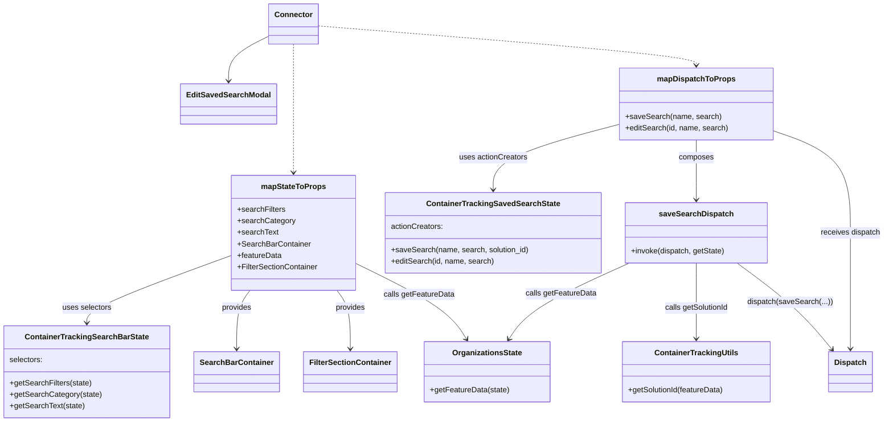

# Diagram: web/portal/src/pages/containertracking/dashboard/components/homepage/ContainerTrackingSavedEditSearchModalContainer.js

> Auto-generated by Obscura crawlers

## Mermaid

### SVG

<svg id="container" width="1809.96484375" xmlns="http://www.w3.org/2000/svg" class="classDiagram" height="880" viewBox="0 0 1809.96484375 880" role="graphics-document document" aria-roledescription="class"><g><defs><marker id="container_class-aggregationStart" class="marker aggregation class" refX="18" refY="7" markerWidth="190" markerHeight="240" orient="auto"><path d="M 18,7 L9,13 L1,7 L9,1 Z"></path></marker></defs><defs><marker id="container_class-aggregationEnd" class="marker aggregation class" refX="1" refY="7" markerWidth="20" markerHeight="28" orient="auto"><path d="M 18,7 L9,13 L1,7 L9,1 Z"></path></marker></defs><defs><marker id="container_class-extensionStart" class="marker extension class" refX="18" refY="7" markerWidth="190" markerHeight="240" orient="auto"><path d="M 1,7 L18,13 V 1 Z"></path></marker></defs><defs><marker id="container_class-extensionEnd" class="marker extension class" refX="1" refY="7" markerWidth="20" markerHeight="28" orient="auto"><path d="M 1,1 V 13 L18,7 Z"></path></marker></defs><defs><marker id="container_class-compositionStart" class="marker composition class" refX="18" refY="7" markerWidth="190" markerHeight="240" orient="auto"><path d="M 18,7 L9,13 L1,7 L9,1 Z"></path></marker></defs><defs><marker id="container_class-compositionEnd" class="marker composition class" refX="1" refY="7" markerWidth="20" markerHeight="28" orient="auto"><path d="M 18,7 L9,13 L1,7 L9,1 Z"></path></marker></defs><defs><marker id="container_class-dependencyStart" class="marker dependency class" refX="6" refY="7" markerWidth="190" markerHeight="240" orient="auto"><path d="M 5,7 L9,13 L1,7 L9,1 Z"></path></marker></defs><defs><marker id="container_class-dependencyEnd" class="marker dependency class" refX="13" refY="7" markerWidth="20" markerHeight="28" orient="auto"><path d="M 18,7 L9,13 L14,7 L9,1 Z"></path></marker></defs><defs><marker id="container_class-lollipopStart" class="marker lollipop class" refX="13" refY="7" markerWidth="190" markerHeight="240" orient="auto"><circle stroke="black" fill="transparent" cx="7" cy="7" r="6"></circle></marker></defs><defs><marker id="container_class-lollipopEnd" class="marker lollipop class" refX="1" refY="7" markerWidth="190" markerHeight="240" orient="auto"><circle stroke="black" fill="transparent" cx="7" cy="7" r="6"></circle></marker></defs><g class="root"><g class="clusters"></g><g class="edgePaths"><path d="M543.82,75.384L530.316,82.32C516.813,89.256,489.805,103.128,476.301,118.731C462.797,134.333,462.797,151.667,462.797,160.333L462.797,169" id="id_Connector_EditSavedSearchModal_1" class="edge-thickness-normal edge-pattern-solid relation" style=";;;" data-edge="true" data-et="edge" data-id="id_Connector_EditSavedSearchModal_1" data-points="W3sieCI6NTQzLjgyMDMxMjUsInkiOjc1LjM4NDMyMDUzNjYyMzM1fSx7IngiOjQ2Mi43OTY4NzUsInkiOjExN30seyJ4Ijo0NjIuNzk2ODc1LCJ5IjoxNzV9XQ==" marker-end="url(#container_class-dependencyEnd)"></path><path d="M593.242,92L593.242,96.167C593.242,100.333,593.242,108.667,593.242,129.5C593.242,150.333,593.242,183.667,593.242,219C593.242,254.333,593.242,291.667,593.242,315.5C593.242,339.333,593.242,349.667,593.242,354.833L593.242,360" id="id_Connector_mapStateToProps_2" class="edge-thickness-normal edge-pattern-dashed relation" style=";;;" data-edge="true" data-et="edge" data-id="id_Connector_mapStateToProps_2" data-points="W3sieCI6NTkzLjI0MjE4NzUsInkiOjkyfSx7IngiOjU5My4yNDIxODc1LCJ5IjoxMTd9LHsieCI6NTkzLjI0MjE4NzUsInkiOjIxN30seyJ4Ijo1OTMuMjQyMTg3NSwieSI6MzI5fSx7IngiOjU5My4yNDIxODc1LCJ5IjozNjZ9XQ==" marker-end="url(#container_class-dependencyEnd)"></path><path d="M642.664,54.006L772.192,64.505C901.72,75.004,1160.776,96.002,1290.304,109.668C1419.832,123.333,1419.832,129.667,1419.832,132.833L1419.832,136" id="id_Connector_mapDispatchToProps_3" class="edge-thickness-normal edge-pattern-dashed relation" style=";;;" data-edge="true" data-et="edge" data-id="id_Connector_mapDispatchToProps_3" data-points="W3sieCI6NjQyLjY2NDA2MjUsInkiOjU0LjAwNTkzNTUzMTQzMzI2Nn0seyJ4IjoxNDE5LjgzMjAzMTI1LCJ5IjoxMTd9LHsieCI6MTQxOS44MzIwMzEyNSwieSI6MTQyfV0=" marker-end="url(#container_class-dependencyEnd)"></path><path d="M464.121,534.587L416.102,552.656C368.083,570.724,272.046,606.862,224.027,630.098C176.008,653.333,176.008,663.667,176.008,668.833L176.008,674" id="id_mapStateToProps_ContainerTrackingSearchBarState_4" class="edge-thickness-normal edge-pattern-solid relation" style=";;;" data-edge="true" data-et="edge" data-id="id_mapStateToProps_ContainerTrackingSearchBarState_4" data-points="W3sieCI6NDY0LjEyMTA5Mzc1LCJ5Ijo1MzQuNTg2NjI4ODQzMjAxMn0seyJ4IjoxNzYuMDA3ODEyNSwieSI6NjQzfSx7IngiOjE3Ni4wMDc4MTI1LCJ5Ijo2ODB9XQ==" marker-end="url(#container_class-dependencyEnd)"></path><path d="M505.816,606L501.323,612.167C496.83,618.333,487.845,630.667,483.352,651C478.859,671.333,478.859,699.667,478.859,713.833L478.859,728" id="id_mapStateToProps_SearchBarContainer_5" class="edge-thickness-normal edge-pattern-solid relation" style=";;;" data-edge="true" data-et="edge" data-id="id_mapStateToProps_SearchBarContainer_5" data-points="W3sieCI6NTA1LjgxNTgzMzk5NjgxNTMsInkiOjYwNn0seyJ4Ijo0NzguODU5Mzc1LCJ5Ijo2NDN9LHsieCI6NDc4Ljg1OTM3NSwieSI6NzM0fV0=" marker-end="url(#container_class-dependencyEnd)"></path><path d="M680.669,606L685.161,612.167C689.654,618.333,698.64,630.667,703.132,651C707.625,671.333,707.625,699.667,707.625,713.833L707.625,728" id="id_mapStateToProps_FilterSectionContainer_6" class="edge-thickness-normal edge-pattern-solid relation" style=";;;" data-edge="true" data-et="edge" data-id="id_mapStateToProps_FilterSectionContainer_6" data-points="W3sieCI6NjgwLjY2ODU0MTAwMzE4NDcsInkiOjYwNn0seyJ4Ijo3MDcuNjI1LCJ5Ijo2NDN9LHsieCI6NzA3LjYyNSwieSI6NzM0fV0=" marker-end="url(#container_class-dependencyEnd)"></path><path d="M722.363,550.708L753.057,566.09C783.751,581.472,845.138,612.236,882.623,638.438C920.108,664.639,933.692,686.279,940.483,697.098L947.275,707.918" id="id_mapStateToProps_OrganizationsState_7" class="edge-thickness-normal edge-pattern-solid relation" style=";;;" data-edge="true" data-et="edge" data-id="id_mapStateToProps_OrganizationsState_7" data-points="W3sieCI6NzIyLjM2MzI4MTI1LCJ5Ijo1NTAuNzA4MjYyNDE3MzE2Nn0seyJ4Ijo5MDYuNTI1MzkwNjI1LCJ5Ijo2NDN9LHsieCI6OTUwLjQ2NDUzNTM2MTg0MjEsInkiOjcxM31d" marker-end="url(#container_class-dependencyEnd)"></path><path d="M1262.391,259.214L1219.012,270.845C1175.633,282.476,1088.875,305.738,1045.496,328.536C1002.117,351.333,1002.117,373.667,1002.117,384.833L1002.117,396" id="id_mapDispatchToProps_ContainerTrackingSavedSearchState_8" class="edge-thickness-normal edge-pattern-solid relation" style=";;;" data-edge="true" data-et="edge" data-id="id_mapDispatchToProps_ContainerTrackingSavedSearchState_8" data-points="W3sieCI6MTI2Mi4zOTA2MjUsInkiOjI1OS4yMTQwNTUyNjcyMTg0fSx7IngiOjEwMDIuMTE3MTg3NSwieSI6MzI5fSx7IngiOjEwMDIuMTE3MTg3NSwieSI6NDAyfV0=" marker-end="url(#container_class-dependencyEnd)"></path><path d="M1419.832,292L1419.832,298.167C1419.832,304.333,1419.832,316.667,1419.832,337.5C1419.832,358.333,1419.832,387.667,1419.832,402.333L1419.832,417" id="id_mapDispatchToProps_saveSearchDispatch_9" class="edge-thickness-normal edge-pattern-solid relation" style=";;;" data-edge="true" data-et="edge" data-id="id_mapDispatchToProps_saveSearchDispatch_9" data-points="W3sieCI6MTQxOS44MzIwMzEyNSwieSI6MjkyfSx7IngiOjE0MTkuODMyMDMxMjUsInkiOjMyOX0seyJ4IjoxNDE5LjgzMjAzMTI1LCJ5Ijo0MjN9XQ==" marker-end="url(#container_class-dependencyEnd)"></path><path d="M1577.273,272.202L1604.273,281.668C1631.272,291.134,1685.271,310.067,1712.27,345.7C1739.27,381.333,1739.27,433.667,1739.27,486C1739.27,538.333,1739.27,590.667,1739.27,631C1739.27,671.333,1739.27,699.667,1739.27,713.833L1739.27,728" id="id_mapDispatchToProps_Dispatch_10" class="edge-thickness-normal edge-pattern-solid relation" style=";;;" data-edge="true" data-et="edge" data-id="id_mapDispatchToProps_Dispatch_10" data-points="W3sieCI6MTU3Ny4yNzM0Mzc1LCJ5IjoyNzIuMjAxNTI2MTIwMTMzMDV9LHsieCI6MTczOS4yNjk1MzEyNSwieSI6MzI5fSx7IngiOjE3MzkuMjY5NTMxMjUsInkiOjQ4Nn0seyJ4IjoxNzM5LjI2OTUzMTI1LCJ5Ijo2NDN9LHsieCI6MTczOS4yNjk1MzEyNSwieSI6NzM0fV0=" marker-end="url(#container_class-dependencyEnd)"></path><path d="M1281.958,549L1247.672,564.667C1213.386,580.333,1144.814,611.667,1103.508,638.161C1062.202,664.655,1048.161,686.31,1041.141,697.138L1034.121,707.966" id="id_saveSearchDispatch_OrganizationsState_11" class="edge-thickness-normal edge-pattern-solid relation" style=";;;" data-edge="true" data-et="edge" data-id="id_saveSearchDispatch_OrganizationsState_11" data-points="W3sieCI6MTI4MS45NTgzOTk2ODE1Mjg2LCJ5Ijo1NDl9LHsieCI6MTA3Ni4yNDIxODc1LCJ5Ijo2NDN9LHsieCI6MTAzMC44NTY3MDIzMDI2MzE3LCJ5Ijo3MTN9XQ==" marker-end="url(#container_class-dependencyEnd)"></path><path d="M1419.832,549L1419.832,564.667C1419.832,580.333,1419.832,611.667,1419.832,638C1419.832,664.333,1419.832,685.667,1419.832,696.333L1419.832,707" id="id_saveSearchDispatch_ContainerTrackingUtils_12" class="edge-thickness-normal edge-pattern-solid relation" style=";;;" data-edge="true" data-et="edge" data-id="id_saveSearchDispatch_ContainerTrackingUtils_12" data-points="W3sieCI6MTQxOS44MzIwMzEyNSwieSI6NTQ5fSx7IngiOjE0MTkuODMyMDMxMjUsInkiOjY0M30seyJ4IjoxNDE5LjgzMjAzMTI1LCJ5Ijo3MTN9XQ==" marker-end="url(#container_class-dependencyEnd)"></path><path d="M1504.789,549L1525.916,564.667C1547.043,580.333,1589.297,611.667,1622.078,641.723C1654.859,671.779,1678.168,700.558,1689.822,714.948L1701.477,729.337" id="id_saveSearchDispatch_Dispatch_13" class="edge-thickness-normal edge-pattern-solid relation" style=";;;" data-edge="true" data-et="edge" data-id="id_saveSearchDispatch_Dispatch_13" data-points="W3sieCI6MTUwNC43ODkyMzY2NjQwMTI4LCJ5Ijo1NDl9LHsieCI6MTYzMS41NTA3ODEyNSwieSI6NjQzfSx7IngiOjE3MDUuMjUzMDgzODgxNTc5LCJ5Ijo3MzR9XQ==" marker-end="url(#container_class-dependencyEnd)"></path></g><g class="edgeLabels"><g class="edgeLabel"><g class="label" data-id="id_Connector_EditSavedSearchModal_1" transform="translate(0, 0)"><foreignObject width="0" height="0">

</foreignObject></g></g><g class="edgeLabel"><g class="label" data-id="id_Connector_mapStateToProps_2" transform="translate(0, 0)"><foreignObject width="0" height="0">

</foreignObject></g></g><g class="edgeLabel"><g class="label" data-id="id_Connector_mapDispatchToProps_3" transform="translate(0, 0)"><foreignObject width="0" height="0">

</foreignObject></g></g><g class="edgeLabel" transform="translate(176.0078125, 643)"><g class="label" data-id="id_mapStateToProps_ContainerTrackingSearchBarState_4" transform="translate(-51.34375, -12)"><foreignObject width="102.6875" height="24">

uses selectors

</foreignObject></g></g><g class="edgeLabel" transform="translate(478.859375, 643)"><g class="label" data-id="id_mapStateToProps_SearchBarContainer_5" transform="translate(-31.3125, -12)"><foreignObject width="62.625" height="24">

provides

</foreignObject></g></g><g class="edgeLabel" transform="translate(707.625, 643)"><g class="label" data-id="id_mapStateToProps_FilterSectionContainer_6" transform="translate(-31.3125, -12)"><foreignObject width="62.625" height="24">

provides

</foreignObject></g></g><g class="edgeLabel" transform="translate(851.38861, 615.36853)"><g class="label" data-id="id_mapStateToProps_OrganizationsState_7" transform="translate(-73.484375, -12)"><foreignObject width="146.96875" height="24">

calls getFeatureData

</foreignObject></g></g><g class="edgeLabel" transform="translate(1002.1171875, 329)"><g class="label" data-id="id_mapDispatchToProps_ContainerTrackingSavedSearchState_8" transform="translate(-71.2734375, -12)"><foreignObject width="142.546875" height="24">

uses actionCreators

</foreignObject></g></g><g class="edgeLabel" transform="translate(1419.83203125, 329)"><g class="label" data-id="id_mapDispatchToProps_saveSearchDispatch_9" transform="translate(-36.453125, -12)"><foreignObject width="72.90625" height="24">

composes

</foreignObject></g></g><g class="edgeLabel" transform="translate(1739.26953125, 486)"><g class="label" data-id="id_mapDispatchToProps_Dispatch_10" transform="translate(-62.6953125, -12)"><foreignObject width="125.390625" height="24">

receives dispatch

</foreignObject></g></g><g class="edgeLabel" transform="translate(1141.16063, 613.33616)"><g class="label" data-id="id_saveSearchDispatch_OrganizationsState_11" transform="translate(-73.484375, -12)"><foreignObject width="146.96875" height="24">

calls getFeatureData

</foreignObject></g></g><g class="edgeLabel" transform="translate(1419.83203125, 643)"><g class="label" data-id="id_saveSearchDispatch_ContainerTrackingUtils_12" transform="translate(-67.5234375, -12)"><foreignObject width="135.046875" height="24">

calls getSolutionId

</foreignObject></g></g><g class="edgeLabel" transform="translate(1615.20114, 630.87593)"><g class="label" data-id="id_saveSearchDispatch_Dispatch_13" transform="translate(-87.71875, -12)"><foreignObject width="175.4375" height="24">

dispatch(saveSearch(...))

</foreignObject></g></g></g><g class="nodes"><g class="node default" id="classId-EditSavedSearchModal-0" transform="translate(462.796875, 217)"><g class="basic label-container"><path d="M-95.4453125 -42 L95.4453125 -42 L95.4453125 42 L-95.4453125 42" stroke="none" stroke-width="0" fill="#ECECFF" style=""></path><path d="M-95.4453125 -42 C-29.877921581808835 -42, 35.68946933638233 -42, 95.4453125 -42 M-95.4453125 -42 C-22.72208102001285 -42, 50.0011504599743 -42, 95.4453125 -42 M95.4453125 -42 C95.4453125 -13.44503079674724, 95.4453125 15.10993840650552, 95.4453125 42 M95.4453125 -42 C95.4453125 -17.443788103917736, 95.4453125 7.1124237921645275, 95.4453125 42 M95.4453125 42 C29.508281752415996 42, -36.42874899516801 42, -95.4453125 42 M95.4453125 42 C56.58019678895963 42, 17.715081077919265 42, -95.4453125 42 M-95.4453125 42 C-95.4453125 13.265546395376763, -95.4453125 -15.468907209246474, -95.4453125 -42 M-95.4453125 42 C-95.4453125 20.947213015737596, -95.4453125 -0.10557396852480849, -95.4453125 -42" stroke="#9370DB" stroke-width="1.3" fill="none" stroke-dasharray="0 0" style=""></path></g><g class="annotation-group text" transform="translate(0, -18)"></g><g class="label-group text" transform="translate(-83.4453125, -18)"><g class="label" style="font-weight: bolder" transform="translate(0,-12)"><foreignObject width="166.890625" height="24">

EditSavedSearchModal

</foreignObject></g></g><g class="members-group text" transform="translate(-83.4453125, 30)"></g><g class="methods-group text" transform="translate(-83.4453125, 60)"></g><g class="divider" style=""><path d="M-95.4453125 6 C-53.61722408332058 6, -11.789135666641158 6, 95.4453125 6 M-95.4453125 6 C-47.28489124930405 6, 0.8755300013918941 6, 95.4453125 6" stroke="#9370DB" stroke-width="1.3" fill="none" stroke-dasharray="0 0" style=""></path></g><g class="divider" style=""><path d="M-95.4453125 24 C-56.78455357474828 24, -18.12379464949656 24, 95.4453125 24 M-95.4453125 24 C-51.6351054809178 24, -7.824898461835602 24, 95.4453125 24" stroke="#9370DB" stroke-width="1.3" fill="none" stroke-dasharray="0 0" style=""></path></g></g><g class="node default" id="classId-Connector-1" transform="translate(593.2421875, 50)"><g class="basic label-container"><path d="M-49.421875 -42 L49.421875 -42 L49.421875 42 L-49.421875 42" stroke="none" stroke-width="0" fill="#ECECFF" style=""></path><path d="M-49.421875 -42 C-22.04082908744489 -42, 5.340216825110218 -42, 49.421875 -42 M-49.421875 -42 C-22.327409725391323 -42, 4.767055549217353 -42, 49.421875 -42 M49.421875 -42 C49.421875 -12.976992053924501, 49.421875 16.046015892150997, 49.421875 42 M49.421875 -42 C49.421875 -9.404373944871757, 49.421875 23.191252110256485, 49.421875 42 M49.421875 42 C21.274373580210316 42, -6.873127839579368 42, -49.421875 42 M49.421875 42 C29.507029167732206 42, 9.592183335464412 42, -49.421875 42 M-49.421875 42 C-49.421875 15.11484876165316, -49.421875 -11.77030247669368, -49.421875 -42 M-49.421875 42 C-49.421875 11.79466544840951, -49.421875 -18.41066910318098, -49.421875 -42" stroke="#9370DB" stroke-width="1.3" fill="none" stroke-dasharray="0 0" style=""></path></g><g class="annotation-group text" transform="translate(0, -18)"></g><g class="label-group text" transform="translate(-37.421875, -18)"><g class="label" style="font-weight: bolder" transform="translate(0,-12)"><foreignObject width="74.84375" height="24">

Connector

</foreignObject></g></g><g class="members-group text" transform="translate(-37.421875, 30)"></g><g class="methods-group text" transform="translate(-37.421875, 60)"></g><g class="divider" style=""><path d="M-49.421875 6 C-14.169462880517294 6, 21.082949238965412 6, 49.421875 6 M-49.421875 6 C-11.968452636495975 6, 25.48496972700805 6, 49.421875 6" stroke="#9370DB" stroke-width="1.3" fill="none" stroke-dasharray="0 0" style=""></path></g><g class="divider" style=""><path d="M-49.421875 24 C-25.649023977779027 24, -1.8761729555580544 24, 49.421875 24 M-49.421875 24 C-28.601387581411647 24, -7.780900162823293 24, 49.421875 24" stroke="#9370DB" stroke-width="1.3" fill="none" stroke-dasharray="0 0" style=""></path></g></g><g class="node default" id="classId-mapStateToProps-2" transform="translate(593.2421875, 486)"><g class="basic label-container"><path d="M-129.12109375 -120 L129.12109375 -120 L129.12109375 120 L-129.12109375 120" stroke="none" stroke-width="0" fill="#ECECFF" style=""></path><path d="M-129.12109375 -120 C-68.75790258359837 -120, -8.394711417196717 -120, 129.12109375 -120 M-129.12109375 -120 C-55.95280488607594 -120, 17.215483977848123 -120, 129.12109375 -120 M129.12109375 -120 C129.12109375 -61.98246322621964, 129.12109375 -3.964926452439286, 129.12109375 120 M129.12109375 -120 C129.12109375 -58.263679341857355, 129.12109375 3.4726413162852907, 129.12109375 120 M129.12109375 120 C46.45743246509218 120, -36.206228819815635 120, -129.12109375 120 M129.12109375 120 C73.31269050220118 120, 17.50428725440237 120, -129.12109375 120 M-129.12109375 120 C-129.12109375 66.34212172520085, -129.12109375 12.684243450401723, -129.12109375 -120 M-129.12109375 120 C-129.12109375 25.661064609956938, -129.12109375 -68.67787078008612, -129.12109375 -120" stroke="#9370DB" stroke-width="1.3" fill="none" stroke-dasharray="0 0" style=""></path></g><g class="annotation-group text" transform="translate(0, -96)"></g><g class="label-group text" transform="translate(-64.7109375, -96)"><g class="label" style="font-weight: bolder" transform="translate(0,-12)"><foreignObject width="129.421875" height="24">

mapStateToProps

</foreignObject></g></g><g class="members-group text" transform="translate(-117.12109375, -48)"><g class="label" style="" transform="translate(0,-12)"><foreignObject width="99.609375" height="24">

+searchFilters

</foreignObject></g><g class="label" style="" transform="translate(0,12)"><foreignObject width="118.65625" height="24">

+searchCategory

</foreignObject></g><g class="label" style="" transform="translate(0,36)"><foreignObject width="84.953125" height="24">

+searchText

</foreignObject></g><g class="label" style="" transform="translate(0,60)"><foreignObject width="151.171875" height="24">

+SearchBarContainer

</foreignObject></g><g class="label" style="" transform="translate(0,84)"><foreignObject width="92.9375" height="24">

+featureData

</foreignObject></g><g class="label" style="" transform="translate(0,108)"><foreignObject width="169.53125" height="24">

+FilterSectionContainer

</foreignObject></g></g><g class="methods-group text" transform="translate(-117.12109375, 120)"></g><g class="divider" style=""><path d="M-129.12109375 -72 C-43.28382289905366 -72, 42.55344795189268 -72, 129.12109375 -72 M-129.12109375 -72 C-37.88169565433064 -72, 53.357702441338716 -72, 129.12109375 -72" stroke="#9370DB" stroke-width="1.3" fill="none" stroke-dasharray="0 0" style=""></path></g><g class="divider" style=""><path d="M-129.12109375 96 C-50.75070479863294 96, 27.619684152734123 96, 129.12109375 96 M-129.12109375 96 C-34.794090934761954 96, 59.53291188047609 96, 129.12109375 96" stroke="#9370DB" stroke-width="1.3" fill="none" stroke-dasharray="0 0" style=""></path></g></g><g class="node default" id="classId-mapDispatchToProps-3" transform="translate(1419.83203125, 217)"><g class="basic label-container"><path d="M-157.44140625 -75 L157.44140625 -75 L157.44140625 75 L-157.44140625 75" stroke="none" stroke-width="0" fill="#ECECFF" style=""></path><path d="M-157.44140625 -75 C-64.85184741463469 -75, 27.73771142073062 -75, 157.44140625 -75 M-157.44140625 -75 C-83.03703376199073 -75, -8.632661273981455 -75, 157.44140625 -75 M157.44140625 -75 C157.44140625 -32.543973692012514, 157.44140625 9.912052615974972, 157.44140625 75 M157.44140625 -75 C157.44140625 -21.817661086536738, 157.44140625 31.364677826926524, 157.44140625 75 M157.44140625 75 C31.53089577905564 75, -94.37961469188872 75, -157.44140625 75 M157.44140625 75 C75.00066891458155 75, -7.440068420836894 75, -157.44140625 75 M-157.44140625 75 C-157.44140625 19.397063550652213, -157.44140625 -36.205872898695574, -157.44140625 -75 M-157.44140625 75 C-157.44140625 43.53445409183121, -157.44140625 12.068908183662415, -157.44140625 -75" stroke="#9370DB" stroke-width="1.3" fill="none" stroke-dasharray="0 0" style=""></path></g><g class="annotation-group text" transform="translate(0, -51)"></g><g class="label-group text" transform="translate(-77.1953125, -51)"><g class="label" style="font-weight: bolder" transform="translate(0,-12)"><foreignObject width="154.390625" height="24">

mapDispatchToProps

</foreignObject></g></g><g class="members-group text" transform="translate(-145.44140625, -3)"></g><g class="methods-group text" transform="translate(-145.44140625, 27)"><g class="label" style="" transform="translate(0,-12)"><foreignObject width="195.25" height="24">

+saveSearch(name, search)

</foreignObject></g><g class="label" style="" transform="translate(0,12)"><foreignObject width="213.6875" height="24">

+editSearch(id, name, search)

</foreignObject></g></g><g class="divider" style=""><path d="M-157.44140625 -27 C-87.43888717349694 -27, -17.436368096993874 -27, 157.44140625 -27 M-157.44140625 -27 C-37.88249619222938 -27, 81.67641386554124 -27, 157.44140625 -27" stroke="#9370DB" stroke-width="1.3" fill="none" stroke-dasharray="0 0" style=""></path></g><g class="divider" style=""><path d="M-157.44140625 -3 C-93.54180155459692 -3, -29.64219685919383 -3, 157.44140625 -3 M-157.44140625 -3 C-50.07440047834531 -3, 57.29260529330938 -3, 157.44140625 -3" stroke="#9370DB" stroke-width="1.3" fill="none" stroke-dasharray="0 0" style=""></path></g></g><g class="node default" id="classId-ContainerTrackingSearchBarState-4" transform="translate(176.0078125, 776)"><g class="basic label-container"><path d="M-168.0078125 -96 L168.0078125 -96 L168.0078125 96 L-168.0078125 96" stroke="none" stroke-width="0" fill="#ECECFF" style=""></path><path d="M-168.0078125 -96 C-63.91196120361738 -96, 40.18389009276524 -96, 168.0078125 -96 M-168.0078125 -96 C-47.60074887764192 -96, 72.80631474471616 -96, 168.0078125 -96 M168.0078125 -96 C168.0078125 -41.708128841461246, 168.0078125 12.583742317077508, 168.0078125 96 M168.0078125 -96 C168.0078125 -48.628174517935236, 168.0078125 -1.2563490358704712, 168.0078125 96 M168.0078125 96 C70.82387415879457 96, -26.360064182410866 96, -168.0078125 96 M168.0078125 96 C56.85534706934507 96, -54.297118361309856 96, -168.0078125 96 M-168.0078125 96 C-168.0078125 42.30556986091557, -168.0078125 -11.388860278168863, -168.0078125 -96 M-168.0078125 96 C-168.0078125 46.34341590645058, -168.0078125 -3.3131681870988388, -168.0078125 -96" stroke="#9370DB" stroke-width="1.3" fill="none" stroke-dasharray="0 0" style=""></path></g><g class="annotation-group text" transform="translate(0, -72)"></g><g class="label-group text" transform="translate(-123.078125, -72)"><g class="label" style="font-weight: bolder" transform="translate(0,-12)"><foreignObject width="246.15625" height="24">

ContainerTrackingSearchBarState

</foreignObject></g></g><g class="members-group text" transform="translate(-156.0078125, -24)"><g class="label" style="" transform="translate(0,-12)"><foreignObject width="69.296875" height="24">

selectors:

</foreignObject></g></g><g class="methods-group text" transform="translate(-156.0078125, 24)"><g class="label" style="" transform="translate(0,-12)"><foreignObject width="169.875" height="24">

+getSearchFilters(state)

</foreignObject></g><g class="label" style="" transform="translate(0,12)"><foreignObject width="188.9375" height="24">

+getSearchCategory(state)

</foreignObject></g><g class="label" style="" transform="translate(0,36)"><foreignObject width="155.21875" height="24">

+getSearchText(state)

</foreignObject></g></g><g class="divider" style=""><path d="M-168.0078125 -48 C-50.051627680078 -48, 67.904557139844 -48, 168.0078125 -48 M-168.0078125 -48 C-48.62407602394562 -48, 70.75966045210876 -48, 168.0078125 -48" stroke="#9370DB" stroke-width="1.3" fill="none" stroke-dasharray="0 0" style=""></path></g><g class="divider" style=""><path d="M-168.0078125 0 C-60.34592422205513 0, 47.31596405588974 0, 168.0078125 0 M-168.0078125 0 C-39.34597795144546 0, 89.31585659710908 0, 168.0078125 0" stroke="#9370DB" stroke-width="1.3" fill="none" stroke-dasharray="0 0" style=""></path></g></g><g class="node default" id="classId-ContainerTrackingSavedSearchState-5" transform="translate(1002.1171875, 486)"><g class="basic label-container"><path d="M-221.1015625 -84 L221.1015625 -84 L221.1015625 84 L-221.1015625 84" stroke="none" stroke-width="0" fill="#ECECFF" style=""></path><path d="M-221.1015625 -84 C-89.09054760081463 -84, 42.92046729837074 -84, 221.1015625 -84 M-221.1015625 -84 C-60.332356973515346 -84, 100.43684855296931 -84, 221.1015625 -84 M221.1015625 -84 C221.1015625 -45.770610080157525, 221.1015625 -7.541220160315049, 221.1015625 84 M221.1015625 -84 C221.1015625 -45.733032942750874, 221.1015625 -7.466065885501749, 221.1015625 84 M221.1015625 84 C81.39994316168324 84, -58.30167617663352 84, -221.1015625 84 M221.1015625 84 C124.57471519500169 84, 28.047867890003374 84, -221.1015625 84 M-221.1015625 84 C-221.1015625 42.88553244132946, -221.1015625 1.7710648826589193, -221.1015625 -84 M-221.1015625 84 C-221.1015625 44.394815803975746, -221.1015625 4.789631607951492, -221.1015625 -84" stroke="#9370DB" stroke-width="1.3" fill="none" stroke-dasharray="0 0" style=""></path></g><g class="annotation-group text" transform="translate(0, -60)"></g><g class="label-group text" transform="translate(-132.640625, -60)"><g class="label" style="font-weight: bolder" transform="translate(0,-12)"><foreignObject width="265.28125" height="24">

ContainerTrackingSavedSearchState

</foreignObject></g></g><g class="members-group text" transform="translate(-209.1015625, -12)"><g class="label" style="" transform="translate(0,-12)"><foreignObject width="109.171875" height="24">

actionCreators:

</foreignObject></g></g><g class="methods-group text" transform="translate(-209.1015625, 36)"><g class="label" style="" transform="translate(0,-12)"><foreignObject width="285.5625" height="24">

+saveSearch(name, search, solution_id)

</foreignObject></g><g class="label" style="" transform="translate(0,12)"><foreignObject width="213.6875" height="24">

+editSearch(id, name, search)

</foreignObject></g></g><g class="divider" style=""><path d="M-221.1015625 -36 C-45.63476224578764 -36, 129.83203800842472 -36, 221.1015625 -36 M-221.1015625 -36 C-64.30162575943072 -36, 92.49831098113856 -36, 221.1015625 -36" stroke="#9370DB" stroke-width="1.3" fill="none" stroke-dasharray="0 0" style=""></path></g><g class="divider" style=""><path d="M-221.1015625 12 C-99.44136305559219 12, 22.218836388815618 12, 221.1015625 12 M-221.1015625 12 C-61.83869392898188 12, 97.42417464203623 12, 221.1015625 12" stroke="#9370DB" stroke-width="1.3" fill="none" stroke-dasharray="0 0" style=""></path></g></g><g class="node default" id="classId-SearchBarContainer-6" transform="translate(478.859375, 776)"><g class="basic label-container"><path d="M-84.84375 -42 L84.84375 -42 L84.84375 42 L-84.84375 42" stroke="none" stroke-width="0" fill="#ECECFF" style=""></path><path d="M-84.84375 -42 C-35.22652196756853 -42, 14.39070606486294 -42, 84.84375 -42 M-84.84375 -42 C-49.654817887255845 -42, -14.46588577451169 -42, 84.84375 -42 M84.84375 -42 C84.84375 -24.077168704981833, 84.84375 -6.1543374099636665, 84.84375 42 M84.84375 -42 C84.84375 -17.652283217514455, 84.84375 6.69543356497109, 84.84375 42 M84.84375 42 C34.951816289927805 42, -14.94011742014439 42, -84.84375 42 M84.84375 42 C33.144096732967604 42, -18.55555653406479 42, -84.84375 42 M-84.84375 42 C-84.84375 10.934322737657318, -84.84375 -20.131354524685364, -84.84375 -42 M-84.84375 42 C-84.84375 13.870665902502658, -84.84375 -14.258668194994684, -84.84375 -42" stroke="#9370DB" stroke-width="1.3" fill="none" stroke-dasharray="0 0" style=""></path></g><g class="annotation-group text" transform="translate(0, -18)"></g><g class="label-group text" transform="translate(-72.84375, -18)"><g class="label" style="font-weight: bolder" transform="translate(0,-12)"><foreignObject width="145.6875" height="24">

SearchBarContainer

</foreignObject></g></g><g class="members-group text" transform="translate(-72.84375, 30)"></g><g class="methods-group text" transform="translate(-72.84375, 60)"></g><g class="divider" style=""><path d="M-84.84375 6 C-39.337853653192326 6, 6.168042693615348 6, 84.84375 6 M-84.84375 6 C-21.548026745062316 6, 41.74769650987537 6, 84.84375 6" stroke="#9370DB" stroke-width="1.3" fill="none" stroke-dasharray="0 0" style=""></path></g><g class="divider" style=""><path d="M-84.84375 24 C-29.7163310145905 24, 25.411087970818997 24, 84.84375 24 M-84.84375 24 C-26.70229238723708 24, 31.43916522552584 24, 84.84375 24" stroke="#9370DB" stroke-width="1.3" fill="none" stroke-dasharray="0 0" style=""></path></g></g><g class="node default" id="classId-FilterSectionContainer-7" transform="translate(707.625, 776)"><g class="basic label-container"><path d="M-93.921875 -42 L93.921875 -42 L93.921875 42 L-93.921875 42" stroke="none" stroke-width="0" fill="#ECECFF" style=""></path><path d="M-93.921875 -42 C-21.548689384808213 -42, 50.82449623038357 -42, 93.921875 -42 M-93.921875 -42 C-50.843053970672486 -42, -7.7642329413449716 -42, 93.921875 -42 M93.921875 -42 C93.921875 -14.869619612230544, 93.921875 12.260760775538913, 93.921875 42 M93.921875 -42 C93.921875 -23.839804746939897, 93.921875 -5.679609493879795, 93.921875 42 M93.921875 42 C20.007431212412783 42, -53.907012575174434 42, -93.921875 42 M93.921875 42 C46.461336323664064 42, -0.9992023526718725 42, -93.921875 42 M-93.921875 42 C-93.921875 23.373955193621253, -93.921875 4.747910387242506, -93.921875 -42 M-93.921875 42 C-93.921875 17.289699705274813, -93.921875 -7.420600589450373, -93.921875 -42" stroke="#9370DB" stroke-width="1.3" fill="none" stroke-dasharray="0 0" style=""></path></g><g class="annotation-group text" transform="translate(0, -18)"></g><g class="label-group text" transform="translate(-81.921875, -18)"><g class="label" style="font-weight: bolder" transform="translate(0,-12)"><foreignObject width="163.84375" height="24">

FilterSectionContainer

</foreignObject></g></g><g class="members-group text" transform="translate(-81.921875, 30)"></g><g class="methods-group text" transform="translate(-81.921875, 60)"></g><g class="divider" style=""><path d="M-93.921875 6 C-26.348967581994103 6, 41.223939836011795 6, 93.921875 6 M-93.921875 6 C-29.005171420025732 6, 35.911532159948536 6, 93.921875 6" stroke="#9370DB" stroke-width="1.3" fill="none" stroke-dasharray="0 0" style=""></path></g><g class="divider" style=""><path d="M-93.921875 24 C-25.43345440740258 24, 43.05496618519484 24, 93.921875 24 M-93.921875 24 C-42.830918946268326 24, 8.260037107463347 24, 93.921875 24" stroke="#9370DB" stroke-width="1.3" fill="none" stroke-dasharray="0 0" style=""></path></g></g><g class="node default" id="classId-OrganizationsState-8" transform="translate(990.009765625, 776)"><g class="basic label-container"><path d="M-129.08203125 -63 L129.08203125 -63 L129.08203125 63 L-129.08203125 63" stroke="none" stroke-width="0" fill="#ECECFF" style=""></path><path d="M-129.08203125 -63 C-41.12934084003339 -63, 46.823349569933214 -63, 129.08203125 -63 M-129.08203125 -63 C-46.16560220800315 -63, 36.7508268339937 -63, 129.08203125 -63 M129.08203125 -63 C129.08203125 -18.944245793165535, 129.08203125 25.11150841366893, 129.08203125 63 M129.08203125 -63 C129.08203125 -25.814656152077653, 129.08203125 11.370687695844694, 129.08203125 63 M129.08203125 63 C27.75598981645959 63, -73.57005161708082 63, -129.08203125 63 M129.08203125 63 C70.38729774440446 63, 11.692564238808927 63, -129.08203125 63 M-129.08203125 63 C-129.08203125 13.101218499969363, -129.08203125 -36.797563000061274, -129.08203125 -63 M-129.08203125 63 C-129.08203125 21.47240533104886, -129.08203125 -20.055189337902277, -129.08203125 -63" stroke="#9370DB" stroke-width="1.3" fill="none" stroke-dasharray="0 0" style=""></path></g><g class="annotation-group text" transform="translate(0, -39)"></g><g class="label-group text" transform="translate(-69.8671875, -39)"><g class="label" style="font-weight: bolder" transform="translate(0,-12)"><foreignObject width="139.734375" height="24">

OrganizationsState

</foreignObject></g></g><g class="members-group text" transform="translate(-117.08203125, 9)"></g><g class="methods-group text" transform="translate(-117.08203125, 39)"><g class="label" style="" transform="translate(0,-12)"><foreignObject width="164.296875" height="24">

+getFeatureData(state)

</foreignObject></g></g><g class="divider" style=""><path d="M-129.08203125 -15 C-55.891322758552974 -15, 17.299385732894052 -15, 129.08203125 -15 M-129.08203125 -15 C-32.163830696334955 -15, 64.75436985733009 -15, 129.08203125 -15" stroke="#9370DB" stroke-width="1.3" fill="none" stroke-dasharray="0 0" style=""></path></g><g class="divider" style=""><path d="M-129.08203125 9 C-29.458664621609046 9, 70.16470200678191 9, 129.08203125 9 M-129.08203125 9 C-57.099009988635004 9, 14.884011272729992 9, 129.08203125 9" stroke="#9370DB" stroke-width="1.3" fill="none" stroke-dasharray="0 0" style=""></path></g></g><g class="node default" id="classId-ContainerTrackingUtils-9" transform="translate(1419.83203125, 776)"><g class="basic label-container"><path d="M-154.390625 -63 L154.390625 -63 L154.390625 63 L-154.390625 63" stroke="none" stroke-width="0" fill="#ECECFF" style=""></path><path d="M-154.390625 -63 C-70.9265285630549 -63, 12.537567873890197 -63, 154.390625 -63 M-154.390625 -63 C-83.49128946131027 -63, -12.591953922620547 -63, 154.390625 -63 M154.390625 -63 C154.390625 -34.33071204572903, 154.390625 -5.661424091458059, 154.390625 63 M154.390625 -63 C154.390625 -31.562140679295034, 154.390625 -0.12428135859006773, 154.390625 63 M154.390625 63 C85.89754525753455 63, 17.40446551506909 63, -154.390625 63 M154.390625 63 C75.95918180556936 63, -2.472261388861284 63, -154.390625 63 M-154.390625 63 C-154.390625 15.28207948172306, -154.390625 -32.43584103655388, -154.390625 -63 M-154.390625 63 C-154.390625 25.585472272894037, -154.390625 -11.829055454211925, -154.390625 -63" stroke="#9370DB" stroke-width="1.3" fill="none" stroke-dasharray="0 0" style=""></path></g><g class="annotation-group text" transform="translate(0, -39)"></g><g class="label-group text" transform="translate(-83.3125, -39)"><g class="label" style="font-weight: bolder" transform="translate(0,-12)"><foreignObject width="166.625" height="24">

ContainerTrackingUtils

</foreignObject></g></g><g class="members-group text" transform="translate(-142.390625, 9)"></g><g class="methods-group text" transform="translate(-142.390625, 39)"><g class="label" style="" transform="translate(0,-12)"><foreignObject width="201.46875" height="24">

+getSolutionId(featureData)

</foreignObject></g></g><g class="divider" style=""><path d="M-154.390625 -15 C-85.31481328757802 -15, -16.23900157515604 -15, 154.390625 -15 M-154.390625 -15 C-59.719406742713446 -15, 34.95181151457311 -15, 154.390625 -15" stroke="#9370DB" stroke-width="1.3" fill="none" stroke-dasharray="0 0" style=""></path></g><g class="divider" style=""><path d="M-154.390625 9 C-63.17508561107448 9, 28.04045377785104 9, 154.390625 9 M-154.390625 9 C-65.64631692067069 9, 23.09799115865863 9, 154.390625 9" stroke="#9370DB" stroke-width="1.3" fill="none" stroke-dasharray="0 0" style=""></path></g></g><g class="node default" id="classId-Dispatch-10" transform="translate(1739.26953125, 776)"><g class="basic label-container"><path d="M-43.8046875 -42 L43.8046875 -42 L43.8046875 42 L-43.8046875 42" stroke="none" stroke-width="0" fill="#ECECFF" style=""></path><path d="M-43.8046875 -42 C-17.996493103339592 -42, 7.811701293320816 -42, 43.8046875 -42 M-43.8046875 -42 C-8.9851586744144 -42, 25.8343701511712 -42, 43.8046875 -42 M43.8046875 -42 C43.8046875 -23.802729719934334, 43.8046875 -5.6054594398686675, 43.8046875 42 M43.8046875 -42 C43.8046875 -19.317550741008514, 43.8046875 3.3648985179829722, 43.8046875 42 M43.8046875 42 C12.384613425532617 42, -19.035460648934766 42, -43.8046875 42 M43.8046875 42 C18.714827020341545 42, -6.37503345931691 42, -43.8046875 42 M-43.8046875 42 C-43.8046875 11.39179616849377, -43.8046875 -19.21640766301246, -43.8046875 -42 M-43.8046875 42 C-43.8046875 13.669440900343513, -43.8046875 -14.661118199312973, -43.8046875 -42" stroke="#9370DB" stroke-width="1.3" fill="none" stroke-dasharray="0 0" style=""></path></g><g class="annotation-group text" transform="translate(0, -18)"></g><g class="label-group text" transform="translate(-31.8046875, -18)"><g class="label" style="font-weight: bolder" transform="translate(0,-12)"><foreignObject width="63.609375" height="24">

Dispatch

</foreignObject></g></g><g class="members-group text" transform="translate(-31.8046875, 30)"></g><g class="methods-group text" transform="translate(-31.8046875, 60)"></g><g class="divider" style=""><path d="M-43.8046875 6 C-14.418997668067082 6, 14.966692163865837 6, 43.8046875 6 M-43.8046875 6 C-12.28637484025991 6, 19.23193781948018 6, 43.8046875 6" stroke="#9370DB" stroke-width="1.3" fill="none" stroke-dasharray="0 0" style=""></path></g><g class="divider" style=""><path d="M-43.8046875 24 C-19.29479324247261 24, 5.215101015054778 24, 43.8046875 24 M-43.8046875 24 C-14.635423356669126 24, 14.533840786661749 24, 43.8046875 24" stroke="#9370DB" stroke-width="1.3" fill="none" stroke-dasharray="0 0" style=""></path></g></g><g class="node default" id="classId-saveSearchDispatch-11" transform="translate(1419.83203125, 486)"><g class="basic label-container"><path d="M-146.61328125 -63 L146.61328125 -63 L146.61328125 63 L-146.61328125 63" stroke="none" stroke-width="0" fill="#ECECFF" style=""></path><path d="M-146.61328125 -63 C-86.26984450953006 -63, -25.926407769060134 -63, 146.61328125 -63 M-146.61328125 -63 C-87.03656797866837 -63, -27.459854707336746 -63, 146.61328125 -63 M146.61328125 -63 C146.61328125 -28.535748256384828, 146.61328125 5.928503487230344, 146.61328125 63 M146.61328125 -63 C146.61328125 -31.044995897024283, 146.61328125 0.910008205951435, 146.61328125 63 M146.61328125 63 C43.28971903713844 63, -60.03384317572312 63, -146.61328125 63 M146.61328125 63 C66.07703080397401 63, -14.459219642051977 63, -146.61328125 63 M-146.61328125 63 C-146.61328125 19.119216687191212, -146.61328125 -24.761566625617576, -146.61328125 -63 M-146.61328125 63 C-146.61328125 26.329173598881987, -146.61328125 -10.341652802236027, -146.61328125 -63" stroke="#9370DB" stroke-width="1.3" fill="none" stroke-dasharray="0 0" style=""></path></g><g class="annotation-group text" transform="translate(0, -39)"></g><g class="label-group text" transform="translate(-73.0234375, -39)"><g class="label" style="font-weight: bolder" transform="translate(0,-12)"><foreignObject width="146.046875" height="24">

saveSearchDispatch

</foreignObject></g></g><g class="members-group text" transform="translate(-134.61328125, 9)"></g><g class="methods-group text" transform="translate(-134.61328125, 39)"><g class="label" style="" transform="translate(0,-12)"><foreignObject width="196.203125" height="24">

+invoke(dispatch, getState)

</foreignObject></g></g><g class="divider" style=""><path d="M-146.61328125 -15 C-54.11169126945627 -15, 38.389898711087454 -15, 146.61328125 -15 M-146.61328125 -15 C-55.04597223539521 -15, 36.52133677920958 -15, 146.61328125 -15" stroke="#9370DB" stroke-width="1.3" fill="none" stroke-dasharray="0 0" style=""></path></g><g class="divider" style=""><path d="M-146.61328125 9 C-34.92439436906146 9, 76.76449251187708 9, 146.61328125 9 M-146.61328125 9 C-46.08264166202203 9, 54.447997925955946 9, 146.61328125 9" stroke="#9370DB" stroke-width="1.3" fill="none" stroke-dasharray="0 0" style=""></path></g></g></g></g></g></svg>
