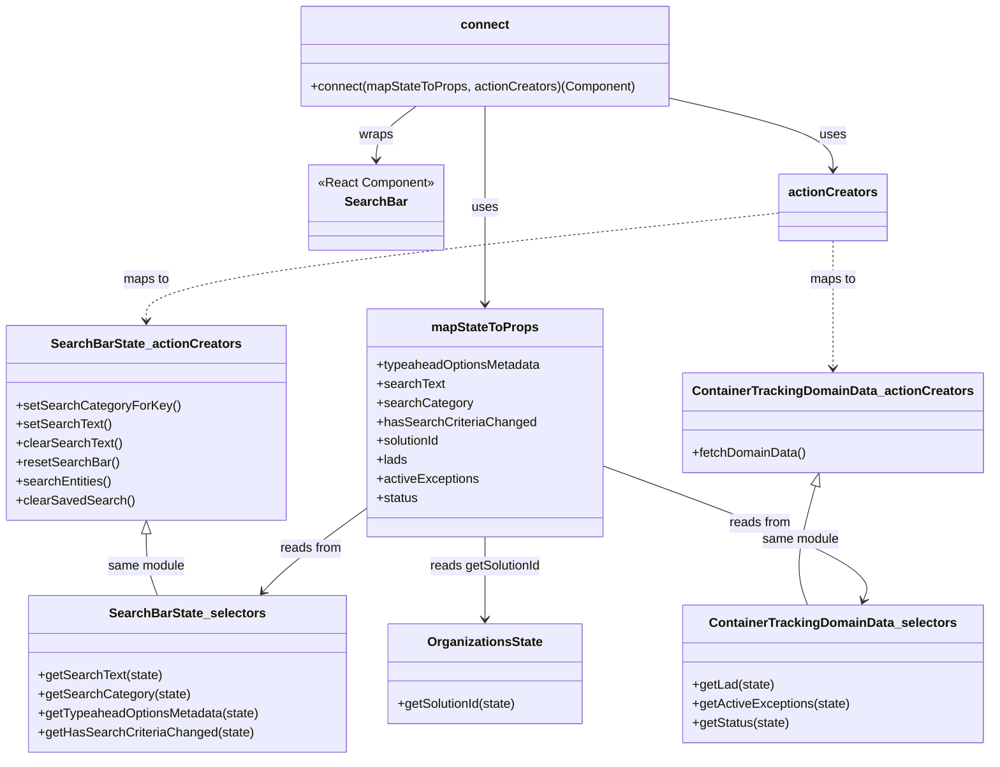

# Diagram: web/portal/src/pages/containertracking/dashboard/components/homepage/ContainerTrackingSearchBarContainer.js

> Auto-generated by Obscura crawlers

## Mermaid

### SVG

<svg id="container" width="1230.64453125" xmlns="http://www.w3.org/2000/svg" class="classDiagram" height="958" viewBox="0 0 1230.64453125 958" role="graphics-document document" aria-roledescription="class"><g><defs><marker id="container_class-aggregationStart" class="marker aggregation class" refX="18" refY="7" markerWidth="190" markerHeight="240" orient="auto"><path d="M 18,7 L9,13 L1,7 L9,1 Z"></path></marker></defs><defs><marker id="container_class-aggregationEnd" class="marker aggregation class" refX="1" refY="7" markerWidth="20" markerHeight="28" orient="auto"><path d="M 18,7 L9,13 L1,7 L9,1 Z"></path></marker></defs><defs><marker id="container_class-extensionStart" class="marker extension class" refX="18" refY="7" markerWidth="190" markerHeight="240" orient="auto"><path d="M 1,7 L18,13 V 1 Z"></path></marker></defs><defs><marker id="container_class-extensionEnd" class="marker extension class" refX="1" refY="7" markerWidth="20" markerHeight="28" orient="auto"><path d="M 1,1 V 13 L18,7 Z"></path></marker></defs><defs><marker id="container_class-compositionStart" class="marker composition class" refX="18" refY="7" markerWidth="190" markerHeight="240" orient="auto"><path d="M 18,7 L9,13 L1,7 L9,1 Z"></path></marker></defs><defs><marker id="container_class-compositionEnd" class="marker composition class" refX="1" refY="7" markerWidth="20" markerHeight="28" orient="auto"><path d="M 18,7 L9,13 L1,7 L9,1 Z"></path></marker></defs><defs><marker id="container_class-dependencyStart" class="marker dependency class" refX="6" refY="7" markerWidth="190" markerHeight="240" orient="auto"><path d="M 5,7 L9,13 L1,7 L9,1 Z"></path></marker></defs><defs><marker id="container_class-dependencyEnd" class="marker dependency class" refX="13" refY="7" markerWidth="20" markerHeight="28" orient="auto"><path d="M 18,7 L9,13 L14,7 L9,1 Z"></path></marker></defs><defs><marker id="container_class-lollipopStart" class="marker lollipop class" refX="13" refY="7" markerWidth="190" markerHeight="240" orient="auto"><circle stroke="black" fill="transparent" cx="7" cy="7" r="6"></circle></marker></defs><defs><marker id="container_class-lollipopEnd" class="marker lollipop class" refX="1" refY="7" markerWidth="190" markerHeight="240" orient="auto"><circle stroke="black" fill="transparent" cx="7" cy="7" r="6"></circle></marker></defs><g class="root"><g class="clusters"></g><g class="edgePaths"><path d="M517.865,134L509.435,140.167C501.005,146.333,484.145,158.667,475.715,170C467.285,181.333,467.285,191.667,467.285,196.833L467.285,202" id="id_connect_SearchBar_1" class="edge-thickness-normal edge-pattern-solid relation" style=";;;" data-edge="true" data-et="edge" data-id="id_connect_SearchBar_1" data-points="W3sieCI6NTE3Ljg2NTMxMjUsInkiOjEzNH0seyJ4Ijo0NjcuMjg1MTU2MjUsInkiOjE3MX0seyJ4Ijo0NjcuMjg1MTU2MjUsInkiOjIwOH1d" marker-end="url(#container_class-dependencyEnd)"></path><path d="M603.988,134L603.988,140.167C603.988,146.333,603.988,158.667,603.988,180C603.988,201.333,603.988,231.667,603.988,262C603.988,292.333,603.988,322.667,603.988,343C603.988,363.333,603.988,373.667,603.988,378.833L603.988,384" id="id_connect_mapStateToProps_2" class="edge-thickness-normal edge-pattern-solid relation" style=";;;" data-edge="true" data-et="edge" data-id="id_connect_mapStateToProps_2" data-points="W3sieCI6NjAzLjk4ODI4MTI1LCJ5IjoxMzR9LHsieCI6NjAzLjk4ODI4MTI1LCJ5IjoxNzF9LHsieCI6NjAzLjk4ODI4MTI1LCJ5IjoyNjJ9LHsieCI6NjAzLjk4ODI4MTI1LCJ5IjozNTN9LHsieCI6NjAzLjk4ODI4MTI1LCJ5IjozOTB9XQ==" marker-end="url(#container_class-dependencyEnd)"></path><path d="M835.688,124.539L869.199,132.283C902.71,140.026,969.732,155.513,1003.243,170.423C1036.754,185.333,1036.754,199.667,1036.754,206.833L1036.754,214" id="id_connect_actionCreators_3" class="edge-thickness-normal edge-pattern-solid relation" style=";;;" data-edge="true" data-et="edge" data-id="id_connect_actionCreators_3" data-points="W3sieCI6ODM1LjY4NzUsInkiOjEyNC41MzkxOTE5NzAyNDk0OH0seyJ4IjoxMDM2Ljc1MzkwNjI1LCJ5IjoxNzF9LHsieCI6MTAzNi43NTM5MDYyNSwieSI6MjIwfV0=" marker-end="url(#container_class-dependencyEnd)"></path><path d="M454.789,641.427L437.759,653.689C420.729,665.951,386.668,690.476,364.811,708.158C342.954,725.84,333.301,736.679,328.474,742.099L323.647,747.519" id="id_mapStateToProps_SearchBarState_selectors_4" class="edge-thickness-normal edge-pattern-solid relation" style=";;;" data-edge="true" data-et="edge" data-id="id_mapStateToProps_SearchBarState_selectors_4" data-points="W3sieCI6NDU0Ljc4OTA2MjUsInkiOjY0MS40MjY4Njg3Nzk0NzU5fSx7IngiOjM1Mi42MDc0MjE4NzUsInkiOjcxNX0seyJ4IjozMTkuNjU2OTUzNjk5NDQ4NTQsInkiOjc1Mn1d" marker-end="url(#container_class-dependencyEnd)"></path><path d="M753.188,589.305L809.703,610.254C866.219,631.203,979.25,673.102,1032.809,701.292C1086.369,729.482,1080.456,743.963,1077.499,751.204L1074.543,758.445" id="id_mapStateToProps_ContainerTrackingDomainData_selectors_5" class="edge-thickness-normal edge-pattern-solid relation" style=";;;" data-edge="true" data-et="edge" data-id="id_mapStateToProps_ContainerTrackingDomainData_selectors_5" data-points="W3sieCI6NzUzLjE4NzUsInkiOjU4OS4zMDUwMzI2NzkyMTU3fSx7IngiOjEwOTIuMjgxMjUsInkiOjcxNX0seyJ4IjoxMDcyLjI3NTA3NDY3ODMwODgsInkiOjc2NH1d" marker-end="url(#container_class-dependencyEnd)"></path><path d="M603.988,678L603.988,684.167C603.988,690.333,603.988,702.667,603.988,720C603.988,737.333,603.988,759.667,603.988,770.833L603.988,782" id="id_mapStateToProps_OrganizationsState_6" class="edge-thickness-normal edge-pattern-solid relation" style=";;;" data-edge="true" data-et="edge" data-id="id_mapStateToProps_OrganizationsState_6" data-points="W3sieCI6NjAzLjk4ODI4MTI1LCJ5Ijo2Nzh9LHsieCI6NjAzLjk4ODI4MTI1LCJ5Ijo3MTV9LHsieCI6NjAzLjk4ODI4MTI1LCJ5Ijo3ODh9XQ==" marker-end="url(#container_class-dependencyEnd)"></path><path d="M971.121,268.95L838.837,282.959C706.552,296.967,441.983,324.983,309.699,347.658C177.414,370.333,177.414,387.667,177.414,396.333L177.414,405" id="id_actionCreators_SearchBarState_actionCreators_7" class="edge-thickness-normal edge-pattern-dashed relation" style=";;;" data-edge="true" data-et="edge" data-id="id_actionCreators_SearchBarState_actionCreators_7" data-points="W3sieCI6OTcxLjEyMTA5Mzc1LCJ5IjoyNjguOTUwMjAyNTA4Mjg0NH0seyJ4IjoxNzcuNDE0MDYyNSwieSI6MzUzfSx7IngiOjE3Ny40MTQwNjI1LCJ5Ijo0MTF9XQ==" marker-end="url(#container_class-dependencyEnd)"></path><path d="M1036.754,304L1036.754,312.167C1036.754,320.333,1036.754,336.667,1036.754,363.5C1036.754,390.333,1036.754,427.667,1036.754,446.333L1036.754,465" id="id_actionCreators_ContainerTrackingDomainData_actionCreators_8" class="edge-thickness-normal edge-pattern-dashed relation" style=";;;" data-edge="true" data-et="edge" data-id="id_actionCreators_ContainerTrackingDomainData_actionCreators_8" data-points="W3sieCI6MTAzNi43NTM5MDYyNSwieSI6MzA0fSx7IngiOjEwMzYuNzUzOTA2MjUsInkiOjM1M30seyJ4IjoxMDM2Ljc1MzkwNjI1LCJ5Ijo0NzF9XQ==" marker-end="url(#container_class-dependencyEnd)"></path><path d="M177.414,674.25L177.414,681.042C177.414,687.833,177.414,701.417,179.866,714.375C182.318,727.333,187.222,739.667,189.674,745.833L192.126,752" id="id_SearchBarState_actionCreators_SearchBarState_selectors_9" class="edge-thickness-normal edge-pattern-solid relation" style=";;;" data-edge="true" data-et="edge" data-id="id_SearchBarState_actionCreators_SearchBarState_selectors_9" data-points="W3sieCI6MTc3LjQxNDA2MjUsInkiOjY1N30seyJ4IjoxNzcuNDE0MDYyNSwieSI6NzE1fSx7IngiOjE5Mi4xMjY0OTM1NjYxNzY0NiwieSI6NzUyfV0=" marker-start="url(#container_class-extensionStart)"></path><path d="M1013.619,613.564L1008.704,630.47C1003.788,647.376,993.956,681.188,992.201,706.261C990.446,731.333,996.766,747.667,999.927,755.833L1003.087,764" id="id_ContainerTrackingDomainData_actionCreators_ContainerTrackingDomainData_selectors_10" class="edge-thickness-normal edge-pattern-solid relation" style=";;;" data-edge="true" data-et="edge" data-id="id_ContainerTrackingDomainData_actionCreators_ContainerTrackingDomainData_selectors_10" data-points="W3sieCI6MTAxOC40MzU1NTc2NjU3NDU4LCJ5Ijo1OTd9LHsieCI6OTg0LjEyNSwieSI6NzE1fSx7IngiOjEwMDMuMDg2ODg1MzQwMDczNSwieSI6NzY0fV0=" marker-start="url(#container_class-extensionStart)"></path></g><g class="edgeLabels"><g class="edgeLabel" transform="translate(467.28515625, 171)"><g class="label" data-id="id_connect_SearchBar_1" transform="translate(-21.390625, -12)"><foreignObject width="42.78125" height="24">

wraps

</foreignObject></g></g><g class="edgeLabel" transform="translate(603.98828125, 262)"><g class="label" data-id="id_connect_mapStateToProps_2" transform="translate(-16.4921875, -12)"><foreignObject width="32.984375" height="24">

uses

</foreignObject></g></g><g class="edgeLabel" transform="translate(1036.75390625, 171)"><g class="label" data-id="id_connect_actionCreators_3" transform="translate(-16.4921875, -12)"><foreignObject width="32.984375" height="24">

uses

</foreignObject></g></g><g class="edgeLabel" transform="translate(383.59462, 692.68851)"><g class="label" data-id="id_mapStateToProps_SearchBarState_selectors_4" transform="translate(-39.1796875, -12)"><foreignObject width="78.359375" height="24">

reads from

</foreignObject></g></g><g class="edgeLabel" transform="translate(947.5479, 661.35037)"><g class="label" data-id="id_mapStateToProps_ContainerTrackingDomainData_selectors_5" transform="translate(-39.1796875, -12)"><foreignObject width="78.359375" height="24">

reads from

</foreignObject></g></g><g class="edgeLabel" transform="translate(603.98828125, 715)"><g class="label" data-id="id_mapStateToProps_OrganizationsState_6" transform="translate(-71.0859375, -12)"><foreignObject width="142.171875" height="24">

reads getSolutionId

</foreignObject></g></g><g class="edgeLabel" transform="translate(177.4140625, 353)"><g class="label" data-id="id_actionCreators_SearchBarState_actionCreators_7" transform="translate(-29.2578125, -12)"><foreignObject width="58.515625" height="24">

maps to

</foreignObject></g></g><g class="edgeLabel" transform="translate(1036.75390625, 353)"><g class="label" data-id="id_actionCreators_ContainerTrackingDomainData_actionCreators_8" transform="translate(-29.2578125, -12)"><foreignObject width="58.515625" height="24">

maps to

</foreignObject></g></g><g class="edgeLabel" transform="translate(177.4140625, 715)"><g class="label" data-id="id_SearchBarState_actionCreators_SearchBarState_selectors_9" transform="translate(-48.9765625, -12)"><foreignObject width="97.953125" height="24">

same module

</foreignObject></g></g><g class="edgeLabel" transform="translate(993.94545, 681.22575)"><g class="label" data-id="id_ContainerTrackingDomainData_actionCreators_ContainerTrackingDomainData_selectors_10" transform="translate(-48.9765625, -12)"><foreignObject width="97.953125" height="24">

same module

</foreignObject></g></g></g><g class="nodes"><g class="node default" id="classId-SearchBar-0" transform="translate(467.28515625, 262)"><g class="basic label-container"><path d="M-85.2109375 -54 L85.2109375 -54 L85.2109375 54 L-85.2109375 54" stroke="none" stroke-width="0" fill="#ECECFF" style=""></path><path d="M-85.2109375 -54 C-21.83334535410959 -54, 41.54424679178082 -54, 85.2109375 -54 M-85.2109375 -54 C-40.02889689559702 -54, 5.153143708805956 -54, 85.2109375 -54 M85.2109375 -54 C85.2109375 -30.093642041304896, 85.2109375 -6.187284082609793, 85.2109375 54 M85.2109375 -54 C85.2109375 -14.723401075188605, 85.2109375 24.55319784962279, 85.2109375 54 M85.2109375 54 C20.588991319640826 54, -44.03295486071835 54, -85.2109375 54 M85.2109375 54 C47.00220241451536 54, 8.793467329030719 54, -85.2109375 54 M-85.2109375 54 C-85.2109375 13.456966634617878, -85.2109375 -27.086066730764244, -85.2109375 -54 M-85.2109375 54 C-85.2109375 11.908066770878186, -85.2109375 -30.183866458243628, -85.2109375 -54" stroke="#9370DB" stroke-width="1.3" fill="none" stroke-dasharray="0 0" style=""></path></g><g class="annotation-group text" transform="translate(-73.2109375, -30)"><g class="label" style="" transform="translate(0,-12)"><foreignObject width="146.421875" height="24">

«React Component»

</foreignObject></g></g><g class="label-group text" transform="translate(-37.2421875, -6)"><g class="label" style="font-weight: bolder" transform="translate(0,-12)"><foreignObject width="74.484375" height="24">

SearchBar

</foreignObject></g></g><g class="members-group text" transform="translate(-73.2109375, 42)"></g><g class="methods-group text" transform="translate(-73.2109375, 72)"></g><g class="divider" style=""><path d="M-85.2109375 18 C-32.00246485919267 18, 21.20600778161466 18, 85.2109375 18 M-85.2109375 18 C-17.345507192785576 18, 50.51992311442885 18, 85.2109375 18" stroke="#9370DB" stroke-width="1.3" fill="none" stroke-dasharray="0 0" style=""></path></g><g class="divider" style=""><path d="M-85.2109375 36 C-38.44719390439965 36, 8.316549691200706 36, 85.2109375 36 M-85.2109375 36 C-40.938763192928754 36, 3.3334111141424927 36, 85.2109375 36" stroke="#9370DB" stroke-width="1.3" fill="none" stroke-dasharray="0 0" style=""></path></g></g><g class="node default" id="classId-connect-1" transform="translate(603.98828125, 71)"><g class="basic label-container"><path d="M-231.69921875 -63 L231.69921875 -63 L231.69921875 63 L-231.69921875 63" stroke="none" stroke-width="0" fill="#ECECFF" style=""></path><path d="M-231.69921875 -63 C-122.86518695468696 -63, -14.031155159373924 -63, 231.69921875 -63 M-231.69921875 -63 C-71.60201664289042 -63, 88.49518546421916 -63, 231.69921875 -63 M231.69921875 -63 C231.69921875 -29.611201338615196, 231.69921875 3.7775973227696085, 231.69921875 63 M231.69921875 -63 C231.69921875 -14.654109328925138, 231.69921875 33.691781342149724, 231.69921875 63 M231.69921875 63 C114.11634864180516 63, -3.466521466389679 63, -231.69921875 63 M231.69921875 63 C93.77535112893023 63, -44.14851649213955 63, -231.69921875 63 M-231.69921875 63 C-231.69921875 14.56963781636069, -231.69921875 -33.86072436727862, -231.69921875 -63 M-231.69921875 63 C-231.69921875 20.37567959706295, -231.69921875 -22.248640805874103, -231.69921875 -63" stroke="#9370DB" stroke-width="1.3" fill="none" stroke-dasharray="0 0" style=""></path></g><g class="annotation-group text" transform="translate(0, -39)"></g><g class="label-group text" transform="translate(-28.9140625, -39)"><g class="label" style="font-weight: bolder" transform="translate(0,-12)"><foreignObject width="57.828125" height="24">

connect

</foreignObject></g></g><g class="members-group text" transform="translate(-219.69921875, 9)"></g><g class="methods-group text" transform="translate(-219.69921875, 39)"><g class="label" style="" transform="translate(0,-12)"><foreignObject width="410.484375" height="24">

+connect(mapStateToProps, actionCreators)(Component)

</foreignObject></g></g><g class="divider" style=""><path d="M-231.69921875 -15 C-96.25215997023804 -15, 39.19489880952392 -15, 231.69921875 -15 M-231.69921875 -15 C-48.64138637680719 -15, 134.41644599638562 -15, 231.69921875 -15" stroke="#9370DB" stroke-width="1.3" fill="none" stroke-dasharray="0 0" style=""></path></g><g class="divider" style=""><path d="M-231.69921875 9 C-71.68729025385335 9, 88.3246382422933 9, 231.69921875 9 M-231.69921875 9 C-132.78301080321376 9, -33.86680285642754 9, 231.69921875 9" stroke="#9370DB" stroke-width="1.3" fill="none" stroke-dasharray="0 0" style=""></path></g></g><g class="node default" id="classId-mapStateToProps-2" transform="translate(603.98828125, 534)"><g class="basic label-container"><path d="M-149.19921875 -144 L149.19921875 -144 L149.19921875 144 L-149.19921875 144" stroke="none" stroke-width="0" fill="#ECECFF" style=""></path><path d="M-149.19921875 -144 C-82.80732330568844 -144, -16.415427861376884 -144, 149.19921875 -144 M-149.19921875 -144 C-40.7930369164183 -144, 67.6131449171634 -144, 149.19921875 -144 M149.19921875 -144 C149.19921875 -85.29349297351709, 149.19921875 -26.586985947034165, 149.19921875 144 M149.19921875 -144 C149.19921875 -75.0415877942648, 149.19921875 -6.083175588529599, 149.19921875 144 M149.19921875 144 C46.84671684839303 144, -55.50578505321394 144, -149.19921875 144 M149.19921875 144 C35.713684252647894 144, -77.77185024470421 144, -149.19921875 144 M-149.19921875 144 C-149.19921875 68.38067677723163, -149.19921875 -7.2386464455367445, -149.19921875 -144 M-149.19921875 144 C-149.19921875 32.41951924380817, -149.19921875 -79.16096151238366, -149.19921875 -144" stroke="#9370DB" stroke-width="1.3" fill="none" stroke-dasharray="0 0" style=""></path></g><g class="annotation-group text" transform="translate(0, -120)"></g><g class="label-group text" transform="translate(-64.7109375, -120)"><g class="label" style="font-weight: bolder" transform="translate(0,-12)"><foreignObject width="129.421875" height="24">

mapStateToProps

</foreignObject></g></g><g class="members-group text" transform="translate(-137.19921875, -72)"><g class="label" style="" transform="translate(0,-12)"><foreignObject width="209.6875" height="24">

+typeaheadOptionsMetadata

</foreignObject></g><g class="label" style="" transform="translate(0,12)"><foreignObject width="84.953125" height="24">

+searchText

</foreignObject></g><g class="label" style="" transform="translate(0,36)"><foreignObject width="118.65625" height="24">

+searchCategory

</foreignObject></g><g class="label" style="" transform="translate(0,60)"><foreignObject width="197.75" height="24">

+hasSearchCriteriaChanged

</foreignObject></g><g class="label" style="" transform="translate(0,84)"><foreignObject width="82.109375" height="24">

+solutionId

</foreignObject></g><g class="label" style="" transform="translate(0,108)"><foreignObject width="38.34375" height="24">

+lads

</foreignObject></g><g class="label" style="" transform="translate(0,132)"><foreignObject width="129.125" height="24">

+activeExceptions

</foreignObject></g><g class="label" style="" transform="translate(0,156)"><foreignObject width="52.390625" height="24">

+status

</foreignObject></g></g><g class="methods-group text" transform="translate(-137.19921875, 144)"></g><g class="divider" style=""><path d="M-149.19921875 -96 C-69.57059380455266 -96, 10.058031140894684 -96, 149.19921875 -96 M-149.19921875 -96 C-32.39758228727412 -96, 84.40405417545176 -96, 149.19921875 -96" stroke="#9370DB" stroke-width="1.3" fill="none" stroke-dasharray="0 0" style=""></path></g><g class="divider" style=""><path d="M-149.19921875 120 C-63.61844377581572 120, 21.96233119836856 120, 149.19921875 120 M-149.19921875 120 C-53.36147835912317 120, 42.47626203175366 120, 149.19921875 120" stroke="#9370DB" stroke-width="1.3" fill="none" stroke-dasharray="0 0" style=""></path></g></g><g class="node default" id="classId-SearchBarState_selectors-3" transform="translate(231.4921875, 851)"><g class="basic label-container"><path d="M-199.375 -99 L199.375 -99 L199.375 99 L-199.375 99" stroke="none" stroke-width="0" fill="#ECECFF" style=""></path><path d="M-199.375 -99 C-118.04296189915016 -99, -36.710923798300314 -99, 199.375 -99 M-199.375 -99 C-42.830586641548734 -99, 113.71382671690253 -99, 199.375 -99 M199.375 -99 C199.375 -49.86345885390728, 199.375 -0.7269177078145646, 199.375 99 M199.375 -99 C199.375 -36.45868943073439, 199.375 26.082621138531223, 199.375 99 M199.375 99 C97.08882844067229 99, -5.197343118655425 99, -199.375 99 M199.375 99 C74.44321505545149 99, -50.48856988909702 99, -199.375 99 M-199.375 99 C-199.375 26.377211410478026, -199.375 -46.24557717904395, -199.375 -99 M-199.375 99 C-199.375 45.36739756942618, -199.375 -8.265204861147637, -199.375 -99" stroke="#9370DB" stroke-width="1.3" fill="none" stroke-dasharray="0 0" style=""></path></g><g class="annotation-group text" transform="translate(0, -75)"></g><g class="label-group text" transform="translate(-94.015625, -75)"><g class="label" style="font-weight: bolder" transform="translate(0,-12)"><foreignObject width="188.03125" height="24">

SearchBarState_selectors

</foreignObject></g></g><g class="members-group text" transform="translate(-187.375, -27)"></g><g class="methods-group text" transform="translate(-187.375, 3)"><g class="label" style="" transform="translate(0,-12)"><foreignObject width="155.21875" height="24">

+getSearchText(state)

</foreignObject></g><g class="label" style="" transform="translate(0,12)"><foreignObject width="188.9375" height="24">

+getSearchCategory(state)

</foreignObject></g><g class="label" style="" transform="translate(0,36)"><foreignObject width="280.734375" height="24">

+getTypeaheadOptionsMetadata(state)

</foreignObject></g><g class="label" style="" transform="translate(0,60)"><foreignObject width="268.28125" height="24">

+getHasSearchCriteriaChanged(state)

</foreignObject></g></g><g class="divider" style=""><path d="M-199.375 -51 C-105.57350650768036 -51, -11.772013015360727 -51, 199.375 -51 M-199.375 -51 C-47.140080036057554 -51, 105.09483992788489 -51, 199.375 -51" stroke="#9370DB" stroke-width="1.3" fill="none" stroke-dasharray="0 0" style=""></path></g><g class="divider" style=""><path d="M-199.375 -27 C-100.34997455724661 -27, -1.3249491144932222 -27, 199.375 -27 M-199.375 -27 C-112.14164400521 -27, -24.908288010419994 -27, 199.375 -27" stroke="#9370DB" stroke-width="1.3" fill="none" stroke-dasharray="0 0" style=""></path></g></g><g class="node default" id="classId-SearchBarState_actionCreators-4" transform="translate(177.4140625, 534)"><g class="basic label-container"><path d="M-169.4140625 -123 L169.4140625 -123 L169.4140625 123 L-169.4140625 123" stroke="none" stroke-width="0" fill="#ECECFF" style=""></path><path d="M-169.4140625 -123 C-85.04213207531593 -123, -0.6702016506318671 -123, 169.4140625 -123 M-169.4140625 -123 C-56.99956196178856 -123, 55.414938576422884 -123, 169.4140625 -123 M169.4140625 -123 C169.4140625 -33.030886006447886, 169.4140625 56.93822798710423, 169.4140625 123 M169.4140625 -123 C169.4140625 -62.32745293021306, 169.4140625 -1.6549058604261262, 169.4140625 123 M169.4140625 123 C81.64206210643808 123, -6.129938287123849 123, -169.4140625 123 M169.4140625 123 C61.2855101779045 123, -46.843042144191 123, -169.4140625 123 M-169.4140625 123 C-169.4140625 49.12309950699763, -169.4140625 -24.753800986004734, -169.4140625 -123 M-169.4140625 123 C-169.4140625 61.15443664776378, -169.4140625 -0.6911267044724383, -169.4140625 -123" stroke="#9370DB" stroke-width="1.3" fill="none" stroke-dasharray="0 0" style=""></path></g><g class="annotation-group text" transform="translate(0, -99)"></g><g class="label-group text" transform="translate(-114.03125, -99)"><g class="label" style="font-weight: bolder" transform="translate(0,-12)"><foreignObject width="228.0625" height="24">

SearchBarState_actionCreators

</foreignObject></g></g><g class="members-group text" transform="translate(-157.4140625, -51)"></g><g class="methods-group text" transform="translate(-157.4140625, -21)"><g class="label" style="" transform="translate(0,-12)"><foreignObject width="200.796875" height="24">

+setSearchCategoryForKey()

</foreignObject></g><g class="label" style="" transform="translate(0,12)"><foreignObject width="118.53125" height="24">

+setSearchText()

</foreignObject></g><g class="label" style="" transform="translate(0,36)"><foreignObject width="132.265625" height="24">

+clearSearchText()

</foreignObject></g><g class="label" style="" transform="translate(0,60)"><foreignObject width="128.0625" height="24">

+resetSearchBar()

</foreignObject></g><g class="label" style="" transform="translate(0,84)"><foreignObject width="120.359375" height="24">

+searchEntities()

</foreignObject></g><g class="label" style="" transform="translate(0,108)"><foreignObject width="146.046875" height="24">

+clearSavedSearch()

</foreignObject></g></g><g class="divider" style=""><path d="M-169.4140625 -75 C-62.779678601088676 -75, 43.85470529782265 -75, 169.4140625 -75 M-169.4140625 -75 C-83.297194739442 -75, 2.819673021115989 -75, 169.4140625 -75" stroke="#9370DB" stroke-width="1.3" fill="none" stroke-dasharray="0 0" style=""></path></g><g class="divider" style=""><path d="M-169.4140625 -51 C-72.55956170372984 -51, 24.294939092540318 -51, 169.4140625 -51 M-169.4140625 -51 C-89.8682876810263 -51, -10.322512862052605 -51, 169.4140625 -51" stroke="#9370DB" stroke-width="1.3" fill="none" stroke-dasharray="0 0" style=""></path></g></g><g class="node default" id="classId-ContainerTrackingDomainData_selectors-5" transform="translate(1036.75390625, 851)"><g class="basic label-container"><path d="M-185.890625 -87 L185.890625 -87 L185.890625 87 L-185.890625 87" stroke="none" stroke-width="0" fill="#ECECFF" style=""></path><path d="M-185.890625 -87 C-67.67718259128233 -87, 50.53625981743534 -87, 185.890625 -87 M-185.890625 -87 C-64.65000585537537 -87, 56.59061328924926 -87, 185.890625 -87 M185.890625 -87 C185.890625 -31.811118244598696, 185.890625 23.37776351080261, 185.890625 87 M185.890625 -87 C185.890625 -51.7444147647778, 185.890625 -16.488829529555602, 185.890625 87 M185.890625 87 C68.73654915662499 87, -48.41752668675002 87, -185.890625 87 M185.890625 87 C81.47452482780263 87, -22.94157534439475 87, -185.890625 87 M-185.890625 87 C-185.890625 24.399840666182506, -185.890625 -38.20031866763499, -185.890625 -87 M-185.890625 87 C-185.890625 32.76258223741032, -185.890625 -21.47483552517936, -185.890625 -87" stroke="#9370DB" stroke-width="1.3" fill="none" stroke-dasharray="0 0" style=""></path></g><g class="annotation-group text" transform="translate(0, -63)"></g><g class="label-group text" transform="translate(-148.921875, -63)"><g class="label" style="font-weight: bolder" transform="translate(0,-12)"><foreignObject width="297.84375" height="24">

ContainerTrackingDomainData_selectors

</foreignObject></g></g><g class="members-group text" transform="translate(-173.890625, -15)"></g><g class="methods-group text" transform="translate(-173.890625, 15)"><g class="label" style="" transform="translate(0,-12)"><foreignObject width="103.09375" height="24">

+getLad(state)

</foreignObject></g><g class="label" style="" transform="translate(0,12)"><foreignObject width="198.859375" height="24">

+getActiveExceptions(state)

</foreignObject></g><g class="label" style="" transform="translate(0,36)"><foreignObject width="122.671875" height="24">

+getStatus(state)

</foreignObject></g></g><g class="divider" style=""><path d="M-185.890625 -39 C-107.32992320271555 -39, -28.769221405431097 -39, 185.890625 -39 M-185.890625 -39 C-68.86920800638718 -39, 48.152208987225634 -39, 185.890625 -39" stroke="#9370DB" stroke-width="1.3" fill="none" stroke-dasharray="0 0" style=""></path></g><g class="divider" style=""><path d="M-185.890625 -15 C-63.73577020163913 -15, 58.419084596721746 -15, 185.890625 -15 M-185.890625 -15 C-110.61887041817418 -15, -35.347115836348365 -15, 185.890625 -15" stroke="#9370DB" stroke-width="1.3" fill="none" stroke-dasharray="0 0" style=""></path></g></g><g class="node default" id="classId-ContainerTrackingDomainData_actionCreators-6" transform="translate(1036.75390625, 534)"><g class="basic label-container"><path d="M-180.9375 -63 L180.9375 -63 L180.9375 63 L-180.9375 63" stroke="none" stroke-width="0" fill="#ECECFF" style=""></path><path d="M-180.9375 -63 C-40.103703755286176 -63, 100.73009248942765 -63, 180.9375 -63 M-180.9375 -63 C-40.66641558622129 -63, 99.60466882755742 -63, 180.9375 -63 M180.9375 -63 C180.9375 -34.605889658766316, 180.9375 -6.211779317532638, 180.9375 63 M180.9375 -63 C180.9375 -20.72953810955395, 180.9375 21.5409237808921, 180.9375 63 M180.9375 63 C65.20662836368537 63, -50.52424327262926 63, -180.9375 63 M180.9375 63 C58.66075685728684 63, -63.61598628542632 63, -180.9375 63 M-180.9375 63 C-180.9375 12.964210575250398, -180.9375 -37.071578849499204, -180.9375 -63 M-180.9375 63 C-180.9375 28.176705329339157, -180.9375 -6.646589341321686, -180.9375 -63" stroke="#9370DB" stroke-width="1.3" fill="none" stroke-dasharray="0 0" style=""></path></g><g class="annotation-group text" transform="translate(0, -39)"></g><g class="label-group text" transform="translate(-168.9375, -39)"><g class="label" style="font-weight: bolder" transform="translate(0,-12)"><foreignObject width="337.875" height="24">

ContainerTrackingDomainData_actionCreators

</foreignObject></g></g><g class="members-group text" transform="translate(-168.9375, 9)"></g><g class="methods-group text" transform="translate(-168.9375, 39)"><g class="label" style="" transform="translate(0,-12)"><foreignObject width="143.765625" height="24">

+fetchDomainData()

</foreignObject></g></g><g class="divider" style=""><path d="M-180.9375 -15 C-96.51272447285938 -15, -12.08794894571875 -15, 180.9375 -15 M-180.9375 -15 C-74.27452621918619 -15, 32.38844756162763 -15, 180.9375 -15" stroke="#9370DB" stroke-width="1.3" fill="none" stroke-dasharray="0 0" style=""></path></g><g class="divider" style=""><path d="M-180.9375 9 C-93.30562773929056 9, -5.673755478581114 9, 180.9375 9 M-180.9375 9 C-85.93672157811868 9, 9.064056843762643 9, 180.9375 9" stroke="#9370DB" stroke-width="1.3" fill="none" stroke-dasharray="0 0" style=""></path></g></g><g class="node default" id="classId-OrganizationsState-7" transform="translate(603.98828125, 851)"><g class="basic label-container"><path d="M-123.12109375 -63 L123.12109375 -63 L123.12109375 63 L-123.12109375 63" stroke="none" stroke-width="0" fill="#ECECFF" style=""></path><path d="M-123.12109375 -63 C-46.017389061182456 -63, 31.086315627635088 -63, 123.12109375 -63 M-123.12109375 -63 C-32.167356748409105 -63, 58.78638025318179 -63, 123.12109375 -63 M123.12109375 -63 C123.12109375 -19.658403531497314, 123.12109375 23.683192937005373, 123.12109375 63 M123.12109375 -63 C123.12109375 -17.88070553657714, 123.12109375 27.238588926845722, 123.12109375 63 M123.12109375 63 C37.13859145481523 63, -48.843910840369546 63, -123.12109375 63 M123.12109375 63 C32.17979354049213 63, -58.761506669015745 63, -123.12109375 63 M-123.12109375 63 C-123.12109375 29.156165022853592, -123.12109375 -4.687669954292815, -123.12109375 -63 M-123.12109375 63 C-123.12109375 30.409251364448245, -123.12109375 -2.1814972711035097, -123.12109375 -63" stroke="#9370DB" stroke-width="1.3" fill="none" stroke-dasharray="0 0" style=""></path></g><g class="annotation-group text" transform="translate(0, -39)"></g><g class="label-group text" transform="translate(-69.8671875, -39)"><g class="label" style="font-weight: bolder" transform="translate(0,-12)"><foreignObject width="139.734375" height="24">

OrganizationsState

</foreignObject></g></g><g class="members-group text" transform="translate(-111.12109375, 9)"></g><g class="methods-group text" transform="translate(-111.12109375, 39)"><g class="label" style="" transform="translate(0,-12)"><foreignObject width="152.375" height="24">

+getSolutionId(state)

</foreignObject></g></g><g class="divider" style=""><path d="M-123.12109375 -15 C-67.22781449079051 -15, -11.334535231581029 -15, 123.12109375 -15 M-123.12109375 -15 C-42.20489546703257 -15, 38.71130281593486 -15, 123.12109375 -15" stroke="#9370DB" stroke-width="1.3" fill="none" stroke-dasharray="0 0" style=""></path></g><g class="divider" style=""><path d="M-123.12109375 9 C-34.26668710419116 9, 54.58771954161767 9, 123.12109375 9 M-123.12109375 9 C-64.9551648962346 9, -6.789236042469227 9, 123.12109375 9" stroke="#9370DB" stroke-width="1.3" fill="none" stroke-dasharray="0 0" style=""></path></g></g><g class="node default" id="classId-actionCreators-8" transform="translate(1036.75390625, 262)"><g class="basic label-container"><path d="M-65.6328125 -42 L65.6328125 -42 L65.6328125 42 L-65.6328125 42" stroke="none" stroke-width="0" fill="#ECECFF" style=""></path><path d="M-65.6328125 -42 C-38.08024865038397 -42, -10.527684800767943 -42, 65.6328125 -42 M-65.6328125 -42 C-20.493013654757156 -42, 24.646785190485687 -42, 65.6328125 -42 M65.6328125 -42 C65.6328125 -24.86342712147763, 65.6328125 -7.7268542429552625, 65.6328125 42 M65.6328125 -42 C65.6328125 -9.995738365962815, 65.6328125 22.00852326807437, 65.6328125 42 M65.6328125 42 C13.912548827127672 42, -37.807714845744655 42, -65.6328125 42 M65.6328125 42 C23.556337166213453 42, -18.520138167573094 42, -65.6328125 42 M-65.6328125 42 C-65.6328125 14.95759890635453, -65.6328125 -12.08480218729094, -65.6328125 -42 M-65.6328125 42 C-65.6328125 15.680910176999394, -65.6328125 -10.638179646001213, -65.6328125 -42" stroke="#9370DB" stroke-width="1.3" fill="none" stroke-dasharray="0 0" style=""></path></g><g class="annotation-group text" transform="translate(0, -18)"></g><g class="label-group text" transform="translate(-53.6328125, -18)"><g class="label" style="font-weight: bolder" transform="translate(0,-12)"><foreignObject width="107.265625" height="24">

actionCreators

</foreignObject></g></g><g class="members-group text" transform="translate(-53.6328125, 30)"></g><g class="methods-group text" transform="translate(-53.6328125, 60)"></g><g class="divider" style=""><path d="M-65.6328125 6 C-35.44299754619096 6, -5.253182592381918 6, 65.6328125 6 M-65.6328125 6 C-27.12085500464812 6, 11.391102490703759 6, 65.6328125 6" stroke="#9370DB" stroke-width="1.3" fill="none" stroke-dasharray="0 0" style=""></path></g><g class="divider" style=""><path d="M-65.6328125 24 C-34.14015807519431 24, -2.6475036503886216 24, 65.6328125 24 M-65.6328125 24 C-36.37702637401098 24, -7.121240248021955 24, 65.6328125 24" stroke="#9370DB" stroke-width="1.3" fill="none" stroke-dasharray="0 0" style=""></path></g></g></g></g></g></svg>
