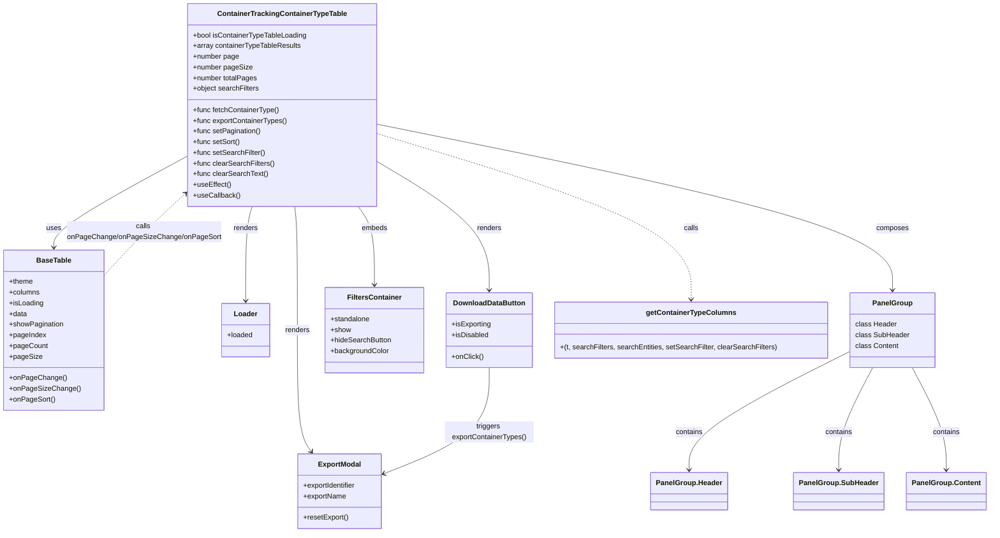

# Diagram: web/portal/src/pages/containertracking/dashboard/components/summaryview/ContainerTrackingContainerTypeTable.js

> Auto-generated by Obscura crawlers

## Mermaid

### SVG

<svg id="container" width="2184.37890625" xmlns="http://www.w3.org/2000/svg" class="classDiagram" height="1196" viewBox="0 0 2184.37890625 1196" role="graphics-document document" aria-roledescription="class"><g><defs><marker id="container_class-aggregationStart" class="marker aggregation class" refX="18" refY="7" markerWidth="190" markerHeight="240" orient="auto"><path d="M 18,7 L9,13 L1,7 L9,1 Z"></path></marker></defs><defs><marker id="container_class-aggregationEnd" class="marker aggregation class" refX="1" refY="7" markerWidth="20" markerHeight="28" orient="auto"><path d="M 18,7 L9,13 L1,7 L9,1 Z"></path></marker></defs><defs><marker id="container_class-extensionStart" class="marker extension class" refX="18" refY="7" markerWidth="190" markerHeight="240" orient="auto"><path d="M 1,7 L18,13 V 1 Z"></path></marker></defs><defs><marker id="container_class-extensionEnd" class="marker extension class" refX="1" refY="7" markerWidth="20" markerHeight="28" orient="auto"><path d="M 1,1 V 13 L18,7 Z"></path></marker></defs><defs><marker id="container_class-compositionStart" class="marker composition class" refX="18" refY="7" markerWidth="190" markerHeight="240" orient="auto"><path d="M 18,7 L9,13 L1,7 L9,1 Z"></path></marker></defs><defs><marker id="container_class-compositionEnd" class="marker composition class" refX="1" refY="7" markerWidth="20" markerHeight="28" orient="auto"><path d="M 18,7 L9,13 L1,7 L9,1 Z"></path></marker></defs><defs><marker id="container_class-dependencyStart" class="marker dependency class" refX="6" refY="7" markerWidth="190" markerHeight="240" orient="auto"><path d="M 5,7 L9,13 L1,7 L9,1 Z"></path></marker></defs><defs><marker id="container_class-dependencyEnd" class="marker dependency class" refX="13" refY="7" markerWidth="20" markerHeight="28" orient="auto"><path d="M 18,7 L9,13 L14,7 L9,1 Z"></path></marker></defs><defs><marker id="container_class-lollipopStart" class="marker lollipop class" refX="13" refY="7" markerWidth="190" markerHeight="240" orient="auto"><circle stroke="black" fill="transparent" cx="7" cy="7" r="6"></circle></marker></defs><defs><marker id="container_class-lollipopEnd" class="marker lollipop class" refX="1" refY="7" markerWidth="190" markerHeight="240" orient="auto"><circle stroke="black" fill="transparent" cx="7" cy="7" r="6"></circle></marker></defs><g class="root"><g class="clusters"></g><g class="edgePaths"><path d="M413.504,350.54L363.758,377.617C314.013,404.693,214.522,458.847,164.777,493.09C115.031,527.333,115.031,541.667,115.031,548.833L115.031,556" id="id_ContainerTrackingContainerTypeTable_BaseTable_1" class="edge-thickness-normal edge-pattern-solid relation" style=";;;" data-edge="true" data-et="edge" data-id="id_ContainerTrackingContainerTypeTable_BaseTable_1" data-points="W3sieCI6NDEzLjUwMzkwNjI1LCJ5IjozNTAuNTM5OTY3NzYxNzQzOX0seyJ4IjoxMTUuMDMxMjUsInkiOjUxM30seyJ4IjoxMTUuMDMxMjUsInkiOjU2Mn1d" marker-end="url(#container_class-dependencyEnd)"></path><path d="M648.029,464L648.892,472.167C649.755,480.333,651.481,496.667,652.344,543C653.207,589.333,653.207,665.667,653.207,742C653.207,818.333,653.207,894.667,658.67,940.197C664.134,985.727,675.06,1000.454,680.524,1007.818L685.987,1015.181" id="id_ContainerTrackingContainerTypeTable_ExportModal_2" class="edge-thickness-normal edge-pattern-solid relation" style=";;;" data-edge="true" data-et="edge" data-id="id_ContainerTrackingContainerTypeTable_ExportModal_2" data-points="W3sieCI6NjQ4LjAyOTM4ODUzNzkwNjEsInkiOjQ2NH0seyJ4Ijo2NTMuMjA3MDMxMjUsInkiOjUxM30seyJ4Ijo2NTMuMjA3MDMxMjUsInkiOjc0Mn0seyJ4Ijo2NTMuMjA3MDMxMjUsInkiOjk3MX0seyJ4Ijo2ODkuNTYxOTg2MDE5NzM2OSwieSI6MTAyMH1d" marker-end="url(#container_class-dependencyEnd)"></path><path d="M552.077,464L549.503,472.167C546.929,480.333,541.781,496.667,539.207,532C536.633,567.333,536.633,621.667,536.633,648.833L536.633,676" id="id_ContainerTrackingContainerTypeTable_Loader_3" class="edge-thickness-normal edge-pattern-solid relation" style=";;;" data-edge="true" data-et="edge" data-id="id_ContainerTrackingContainerTypeTable_Loader_3" data-points="W3sieCI6NTUyLjA3NjYwMTk4NTU1OTYsInkiOjQ2NH0seyJ4Ijo1MzYuNjMyODEyNSwieSI6NTEzfSx7IngiOjUzNi42MzI4MTI1LCJ5Ijo2ODJ9XQ==" marker-end="url(#container_class-dependencyEnd)"></path><path d="M834.371,363.271L875.632,388.226C916.893,413.181,999.415,463.09,1040.676,511.212C1081.938,559.333,1081.938,605.667,1081.938,628.833L1081.938,652" id="id_ContainerTrackingContainerTypeTable_DownloadDataButton_4" class="edge-thickness-normal edge-pattern-solid relation" style=";;;" data-edge="true" data-et="edge" data-id="id_ContainerTrackingContainerTypeTable_DownloadDataButton_4" data-points="W3sieCI6ODM0LjM3MTA5Mzc1LCJ5IjozNjMuMjcwOTcyNjM5MTkyMX0seyJ4IjoxMDgxLjkzNzUsInkiOjUxM30seyJ4IjoxMDgxLjkzNzUsInkiOjY1OH1d" marker-end="url(#container_class-dependencyEnd)"></path><path d="M790.291,464L796.25,472.167C802.209,480.333,814.126,496.667,820.084,526C826.043,555.333,826.043,597.667,826.043,618.833L826.043,640" id="id_ContainerTrackingContainerTypeTable_FiltersContainer_5" class="edge-thickness-normal edge-pattern-solid relation" style=";;;" data-edge="true" data-et="edge" data-id="id_ContainerTrackingContainerTypeTable_FiltersContainer_5" data-points="W3sieCI6NzkwLjI5MTQ1OTgzNzU0NTEsInkiOjQ2NH0seyJ4Ijo4MjYuMDQyOTY4NzUsInkiOjUxM30seyJ4Ijo4MjYuMDQyOTY4NzUsInkiOjY0Nn1d" marker-end="url(#container_class-dependencyEnd)"></path><path d="M834.371,279.116L1024.624,318.096C1214.876,357.077,1595.382,435.039,1785.634,497.186C1975.887,559.333,1975.887,605.667,1975.887,628.833L1975.887,652" id="id_ContainerTrackingContainerTypeTable_PanelGroup_6" class="edge-thickness-normal edge-pattern-solid relation" style=";;;" data-edge="true" data-et="edge" data-id="id_ContainerTrackingContainerTypeTable_PanelGroup_6" data-points="W3sieCI6ODM0LjM3MTA5Mzc1LCJ5IjoyNzkuMTE1NjAyNzYxMDU5N30seyJ4IjoxOTc1Ljg4NjcxODc1LCJ5Ijo1MTN9LHsieCI6MTk3NS44ODY3MTg3NSwieSI6NjU4fV0=" marker-end="url(#container_class-dependencyEnd)"></path><path d="M834.371,300.316L950.35,335.764C1066.328,371.211,1298.285,442.105,1414.264,504.219C1530.242,566.333,1530.242,619.667,1530.242,646.333L1530.242,673" id="id_ContainerTrackingContainerTypeTable_getContainerTypeColumns_7" class="edge-thickness-normal edge-pattern-dashed relation" style=";;;" data-edge="true" data-et="edge" data-id="id_ContainerTrackingContainerTypeTable_getContainerTypeColumns_7" data-points="W3sieCI6ODM0LjM3MTA5Mzc1LCJ5IjozMDAuMzE2MjM1MjI3MTg0NTZ9LHsieCI6MTUzMC4yNDIxODc1LCJ5Ijo1MTN9LHsieCI6MTUzMC4yNDIxODc1LCJ5Ijo2Nzl9XQ==" marker-end="url(#container_class-dependencyEnd)"></path><path d="M1081.938,826L1081.938,850.167C1081.938,874.333,1081.938,922.667,1043.888,962.166C1005.839,1001.665,929.74,1032.33,891.691,1047.663L853.641,1062.996" id="id_DownloadDataButton_ExportModal_8" class="edge-thickness-normal edge-pattern-solid relation" style=";;;" data-edge="true" data-et="edge" data-id="id_DownloadDataButton_ExportModal_8" data-points="W3sieCI6MTA4MS45Mzc1LCJ5Ijo4MjZ9LHsieCI6MTA4MS45Mzc1LCJ5Ijo5NzF9LHsieCI6ODQ4LjA3NjE3MTg3NSwieSI6MTA2NS4yMzgxNDI1NzkwMTV9XQ==" marker-end="url(#container_class-dependencyEnd)"></path><path d="M222.063,622.538L238.419,604.282C254.776,586.026,287.49,549.513,318.658,517.749C349.826,485.985,379.448,458.97,394.259,445.462L409.071,431.955" id="id_BaseTable_ContainerTrackingContainerTypeTable_9" class="edge-thickness-normal edge-pattern-dashed relation" style=";;;" data-edge="true" data-et="edge" data-id="id_BaseTable_ContainerTrackingContainerTypeTable_9" data-points="W3sieCI6MjIyLjA2MjUsInkiOjYyMi41Mzg0MjA1MzE1NjY1fSx7IngiOjMyMC4yMDMxMjUsInkiOjUxM30seyJ4Ijo0MTMuNTAzOTA2MjUsInkiOjQyNy45MTE0NTM3Nzg0ODY2fV0=" marker-end="url(#container_class-dependencyEnd)"></path><path d="M1882.738,789.703L1823.736,819.919C1764.733,850.135,1646.728,910.568,1587.725,954.95C1528.723,999.333,1528.723,1027.667,1528.723,1041.833L1528.723,1056" id="id_PanelGroup_PanelGroup.Header_10" class="edge-thickness-normal edge-pattern-solid relation" style=";;;" data-edge="true" data-et="edge" data-id="id_PanelGroup_PanelGroup.Header_10" data-points="W3sieCI6MTg4Mi43MzgyODEyNSwieSI6Nzg5LjcwMjgzMjA4NDE0MTR9LHsieCI6MTUyOC43MjI2NTYyNSwieSI6OTcxfSx7IngiOjE1MjguNzIyNjU2MjUsInkiOjEwNjJ9XQ==" marker-end="url(#container_class-dependencyEnd)"></path><path d="M1933.451,826L1921.242,850.167C1909.034,874.333,1884.617,922.667,1872.408,961C1860.199,999.333,1860.199,1027.667,1860.199,1041.833L1860.199,1056" id="id_PanelGroup_PanelGroup.SubHeader_11" class="edge-thickness-normal edge-pattern-solid relation" style=";;;" data-edge="true" data-et="edge" data-id="id_PanelGroup_PanelGroup.SubHeader_11" data-points="W3sieCI6MTkzMy40NTExMjkyMzAzNDk0LCJ5Ijo4MjZ9LHsieCI6MTg2MC4xOTkyMTg3NSwieSI6OTcxfSx7IngiOjE4NjAuMTk5MjE4NzUsInkiOjEwNjJ9XQ==" marker-end="url(#container_class-dependencyEnd)"></path><path d="M2018.322,826L2030.531,850.167C2042.74,874.333,2067.157,922.667,2079.366,961C2091.574,999.333,2091.574,1027.667,2091.574,1041.833L2091.574,1056" id="id_PanelGroup_PanelGroup.Content_12" class="edge-thickness-normal edge-pattern-solid relation" style=";;;" data-edge="true" data-et="edge" data-id="id_PanelGroup_PanelGroup.Content_12" data-points="W3sieCI6MjAxOC4zMjIzMDgyNjk2NTA2LCJ5Ijo4MjZ9LHsieCI6MjA5MS41NzQyMTg3NSwieSI6OTcxfSx7IngiOjIwOTEuNTc0MjE4NzUsInkiOjEwNjJ9XQ==" marker-end="url(#container_class-dependencyEnd)"></path></g><g class="edgeLabels"><g class="edgeLabel" transform="translate(115.03125, 513)"><g class="label" data-id="id_ContainerTrackingContainerTypeTable_BaseTable_1" transform="translate(-16.4921875, -12)"><foreignObject width="32.984375" height="24">

uses

</foreignObject></g></g><g class="edgeLabel" transform="translate(653.20703125, 742)"><g class="label" data-id="id_ContainerTrackingContainerTypeTable_ExportModal_2" transform="translate(-27.75, -12)"><foreignObject width="55.5" height="24">

renders

</foreignObject></g></g><g class="edgeLabel" transform="translate(536.6328125, 513)"><g class="label" data-id="id_ContainerTrackingContainerTypeTable_Loader_3" transform="translate(-27.75, -12)"><foreignObject width="55.5" height="24">

renders

</foreignObject></g></g><g class="edgeLabel" transform="translate(1081.9375, 513)"><g class="label" data-id="id_ContainerTrackingContainerTypeTable_DownloadDataButton_4" transform="translate(-27.75, -12)"><foreignObject width="55.5" height="24">

renders

</foreignObject></g></g><g class="edgeLabel" transform="translate(826.04296875, 513)"><g class="label" data-id="id_ContainerTrackingContainerTypeTable_FiltersContainer_5" transform="translate(-28.8515625, -12)"><foreignObject width="57.703125" height="24">

embeds

</foreignObject></g></g><g class="edgeLabel" transform="translate(1975.88671875, 513)"><g class="label" data-id="id_ContainerTrackingContainerTypeTable_PanelGroup_6" transform="translate(-36.453125, -12)"><foreignObject width="72.90625" height="24">

composes

</foreignObject></g></g><g class="edgeLabel" transform="translate(1530.2421875, 513)"><g class="label" data-id="id_ContainerTrackingContainerTypeTable_getContainerTypeColumns_7" transform="translate(-16.4453125, -12)"><foreignObject width="32.890625" height="24">

calls

</foreignObject></g></g><g class="edgeLabel" transform="translate(1081.9375, 971)"><g class="label" data-id="id_DownloadDataButton_ExportModal_8" transform="translate(-100, -24)"><foreignObject width="200" height="48">

triggers exportContainerTypes()

</foreignObject></g></g><g class="edgeLabel" transform="translate(313.2638, 520.74524)"><g class="label" data-id="id_BaseTable_ContainerTrackingContainerTypeTable_9" transform="translate(-168.6796875, -24)"><foreignObject width="337.359375" height="48">

calls onPageChange/onPageSizeChange/onPageSort

</foreignObject></g></g><g class="edgeLabel" transform="translate(1528.72265625, 971)"><g class="label" data-id="id_PanelGroup_PanelGroup.Header_10" transform="translate(-30.890625, -12)"><foreignObject width="61.78125" height="24">

contains

</foreignObject></g></g><g class="edgeLabel" transform="translate(1860.19921875, 971)"><g class="label" data-id="id_PanelGroup_PanelGroup.SubHeader_11" transform="translate(-30.890625, -12)"><foreignObject width="61.78125" height="24">

contains

</foreignObject></g></g><g class="edgeLabel" transform="translate(2091.57421875, 971)"><g class="label" data-id="id_PanelGroup_PanelGroup.Content_12" transform="translate(-30.890625, -12)"><foreignObject width="61.78125" height="24">

contains

</foreignObject></g></g></g><g class="nodes"><g class="node default" id="classId-ContainerTrackingContainerTypeTable-0" transform="translate(623.9375, 236)"><g class="basic label-container"><path d="M-210.43359375 -228 L210.43359375 -228 L210.43359375 228 L-210.43359375 228" stroke="none" stroke-width="0" fill="#ECECFF" style=""></path><path d="M-210.43359375 -228 C-73.12971550029812 -228, 64.17416274940376 -228, 210.43359375 -228 M-210.43359375 -228 C-65.25687850928489 -228, 79.91983673143022 -228, 210.43359375 -228 M210.43359375 -228 C210.43359375 -72.7137217341789, 210.43359375 82.57255653164219, 210.43359375 228 M210.43359375 -228 C210.43359375 -102.1450808932178, 210.43359375 23.70983821356441, 210.43359375 228 M210.43359375 228 C81.15724480254565 228, -48.119104144908704 228, -210.43359375 228 M210.43359375 228 C50.31515596742156 228, -109.80328181515688 228, -210.43359375 228 M-210.43359375 228 C-210.43359375 132.674862948349, -210.43359375 37.349725896697976, -210.43359375 -228 M-210.43359375 228 C-210.43359375 55.285415563741424, -210.43359375 -117.42916887251715, -210.43359375 -228" stroke="#9370DB" stroke-width="1.3" fill="none" stroke-dasharray="0 0" style=""></path></g><g class="annotation-group text" transform="translate(0, -204)"></g><g class="label-group text" transform="translate(-139.2890625, -204)"><g class="label" style="font-weight: bolder" transform="translate(0,-12)"><foreignObject width="278.578125" height="24">

ContainerTrackingContainerTypeTable

</foreignObject></g></g><g class="members-group text" transform="translate(-198.43359375, -156)"><g class="label" style="" transform="translate(0,-12)"><foreignObject width="257.578125" height="24">

+bool isContainerTypeTableLoading

</foreignObject></g><g class="label" style="" transform="translate(0,12)"><foreignObject width="243.640625" height="24">

+array containerTypeTableResults

</foreignObject></g><g class="label" style="" transform="translate(0,36)"><foreignObject width="103.703125" height="24">

+number page

</foreignObject></g><g class="label" style="" transform="translate(0,60)"><foreignObject width="132.53125" height="24">

+number pageSize

</foreignObject></g><g class="label" style="" transform="translate(0,84)"><foreignObject width="144.03125" height="24">

+number totalPages

</foreignObject></g><g class="label" style="" transform="translate(0,108)"><foreignObject width="149.3125" height="24">

+object searchFilters

</foreignObject></g></g><g class="methods-group text" transform="translate(-198.43359375, 12)"><g class="label" style="" transform="translate(0,-12)"><foreignObject width="194.78125" height="24">

+func fetchContainerType()

</foreignObject></g><g class="label" style="" transform="translate(0,12)"><foreignObject width="212.90625" height="24">

+func exportContainerTypes()

</foreignObject></g><g class="label" style="" transform="translate(0,36)"><foreignObject width="152.90625" height="24">

+func setPagination()

</foreignObject></g><g class="label" style="" transform="translate(0,60)"><foreignObject width="106.046875" height="24">

+func setSort()

</foreignObject></g><g class="label" style="" transform="translate(0,84)"><foreignObject width="161.65625" height="24">

+func setSearchFilter()

</foreignObject></g><g class="label" style="" transform="translate(0,108)"><foreignObject width="182.609375" height="24">

+func clearSearchFilters()

</foreignObject></g><g class="label" style="" transform="translate(0,132)"><foreignObject width="167.953125" height="24">

+func clearSearchText()

</foreignObject></g><g class="label" style="" transform="translate(0,156)"><foreignObject width="84.8125" height="24">

+useEffect()

</foreignObject></g><g class="label" style="" transform="translate(0,180)"><foreignObject width="104.46875" height="24">

+useCallback()

</foreignObject></g></g><g class="divider" style=""><path d="M-210.43359375 -180 C-120.92258160251721 -180, -31.411569455034424 -180, 210.43359375 -180 M-210.43359375 -180 C-107.90389236745698 -180, -5.374190984913952 -180, 210.43359375 -180" stroke="#9370DB" stroke-width="1.3" fill="none" stroke-dasharray="0 0" style=""></path></g><g class="divider" style=""><path d="M-210.43359375 -12 C-121.8096363585682 -12, -33.1856789671364 -12, 210.43359375 -12 M-210.43359375 -12 C-121.70904711276992 -12, -32.984500475539846 -12, 210.43359375 -12" stroke="#9370DB" stroke-width="1.3" fill="none" stroke-dasharray="0 0" style=""></path></g></g><g class="node default" id="classId-BaseTable-1" transform="translate(115.03125, 742)"><g class="basic label-container"><path d="M-107.03125 -180 L107.03125 -180 L107.03125 180 L-107.03125 180" stroke="none" stroke-width="0" fill="#ECECFF" style=""></path><path d="M-107.03125 -180 C-45.43131855122436 -180, 16.168612897551284 -180, 107.03125 -180 M-107.03125 -180 C-61.92279629279784 -180, -16.814342585595682 -180, 107.03125 -180 M107.03125 -180 C107.03125 -39.54981948709059, 107.03125 100.90036102581882, 107.03125 180 M107.03125 -180 C107.03125 -82.4150231416966, 107.03125 15.169953716606813, 107.03125 180 M107.03125 180 C25.681172095769682 180, -55.668905808460636 180, -107.03125 180 M107.03125 180 C46.34618133312082 180, -14.338887333758365 180, -107.03125 180 M-107.03125 180 C-107.03125 76.67209853781432, -107.03125 -26.655802924371358, -107.03125 -180 M-107.03125 180 C-107.03125 49.124978765705066, -107.03125 -81.75004246858987, -107.03125 -180" stroke="#9370DB" stroke-width="1.3" fill="none" stroke-dasharray="0 0" style=""></path></g><g class="annotation-group text" transform="translate(0, -156)"></g><g class="label-group text" transform="translate(-37.359375, -156)"><g class="label" style="font-weight: bolder" transform="translate(0,-12)"><foreignObject width="74.71875" height="24">

BaseTable

</foreignObject></g></g><g class="members-group text" transform="translate(-95.03125, -108)"><g class="label" style="" transform="translate(0,-12)"><foreignObject width="54.21875" height="24">

+theme

</foreignObject></g><g class="label" style="" transform="translate(0,12)"><foreignObject width="69.21875" height="24">

+columns

</foreignObject></g><g class="label" style="" transform="translate(0,36)"><foreignObject width="77.203125" height="24">

+isLoading

</foreignObject></g><g class="label" style="" transform="translate(0,60)"><foreignObject width="40.625" height="24">

+data

</foreignObject></g><g class="label" style="" transform="translate(0,84)"><foreignObject width="122.53125" height="24">

+showPagination

</foreignObject></g><g class="label" style="" transform="translate(0,108)"><foreignObject width="82.65625" height="24">

+pageIndex

</foreignObject></g><g class="label" style="" transform="translate(0,132)"><foreignObject width="85.109375" height="24">

+pageCount

</foreignObject></g><g class="label" style="" transform="translate(0,156)"><foreignObject width="71.5" height="24">

+pageSize

</foreignObject></g></g><g class="methods-group text" transform="translate(-95.03125, 108)"><g class="label" style="" transform="translate(0,-12)"><foreignObject width="123.859375" height="24">

+onPageChange()

</foreignObject></g><g class="label" style="" transform="translate(0,12)"><foreignObject width="152.703125" height="24">

+onPageSizeChange()

</foreignObject></g><g class="label" style="" transform="translate(0,36)"><foreignObject width="100.84375" height="24">

+onPageSort()

</foreignObject></g></g><g class="divider" style=""><path d="M-107.03125 -132 C-29.759730200877087 -132, 47.51178959824583 -132, 107.03125 -132 M-107.03125 -132 C-48.966436353277615 -132, 9.09837729344477 -132, 107.03125 -132" stroke="#9370DB" stroke-width="1.3" fill="none" stroke-dasharray="0 0" style=""></path></g><g class="divider" style=""><path d="M-107.03125 84 C-55.9354411156189 84, -4.8396322312378 84, 107.03125 84 M-107.03125 84 C-35.698507729056175 84, 35.63423454188765 84, 107.03125 84" stroke="#9370DB" stroke-width="1.3" fill="none" stroke-dasharray="0 0" style=""></path></g></g><g class="node default" id="classId-ExportModal-2" transform="translate(751.884765625, 1104)"><g class="basic label-container"><path d="M-96.19140625 -84 L96.19140625 -84 L96.19140625 84 L-96.19140625 84" stroke="none" stroke-width="0" fill="#ECECFF" style=""></path><path d="M-96.19140625 -84 C-24.845131934587798 -84, 46.501142380824405 -84, 96.19140625 -84 M-96.19140625 -84 C-32.130194301675104 -84, 31.931017646649792 -84, 96.19140625 -84 M96.19140625 -84 C96.19140625 -49.71145529254966, 96.19140625 -15.422910585099316, 96.19140625 84 M96.19140625 -84 C96.19140625 -34.25461782066305, 96.19140625 15.4907643586739, 96.19140625 84 M96.19140625 84 C56.841862455037976 84, 17.492318660075952 84, -96.19140625 84 M96.19140625 84 C21.64395767400886 84, -52.90349090198228 84, -96.19140625 84 M-96.19140625 84 C-96.19140625 34.24091759613017, -96.19140625 -15.518164807739666, -96.19140625 -84 M-96.19140625 84 C-96.19140625 49.8785342021516, -96.19140625 15.757068404303197, -96.19140625 -84" stroke="#9370DB" stroke-width="1.3" fill="none" stroke-dasharray="0 0" style=""></path></g><g class="annotation-group text" transform="translate(0, -60)"></g><g class="label-group text" transform="translate(-46.4921875, -60)"><g class="label" style="font-weight: bolder" transform="translate(0,-12)"><foreignObject width="92.984375" height="24">

ExportModal

</foreignObject></g></g><g class="members-group text" transform="translate(-84.19140625, -12)"><g class="label" style="" transform="translate(0,-12)"><foreignObject width="121.890625" height="24">

+exportIdentifier

</foreignObject></g><g class="label" style="" transform="translate(0,12)"><foreignObject width="97.1875" height="24">

+exportName

</foreignObject></g></g><g class="methods-group text" transform="translate(-84.19140625, 60)"><g class="label" style="" transform="translate(0,-12)"><foreignObject width="101.859375" height="24">

+resetExport()

</foreignObject></g></g><g class="divider" style=""><path d="M-96.19140625 -36 C-20.370840710024908 -36, 55.449724829950185 -36, 96.19140625 -36 M-96.19140625 -36 C-47.19407331627784 -36, 1.8032596174443256 -36, 96.19140625 -36" stroke="#9370DB" stroke-width="1.3" fill="none" stroke-dasharray="0 0" style=""></path></g><g class="divider" style=""><path d="M-96.19140625 36 C-56.02254248324025 36, -15.853678716480502 36, 96.19140625 36 M-96.19140625 36 C-30.069211679041217 36, 36.052982891917566 36, 96.19140625 36" stroke="#9370DB" stroke-width="1.3" fill="none" stroke-dasharray="0 0" style=""></path></g></g><g class="node default" id="classId-Loader-3" transform="translate(536.6328125, 742)"><g class="basic label-container"><path d="M-53.82421875 -60 L53.82421875 -60 L53.82421875 60 L-53.82421875 60" stroke="none" stroke-width="0" fill="#ECECFF" style=""></path><path d="M-53.82421875 -60 C-29.95821702619197 -60, -6.092215302383941 -60, 53.82421875 -60 M-53.82421875 -60 C-13.994199436774707 -60, 25.835819876450586 -60, 53.82421875 -60 M53.82421875 -60 C53.82421875 -27.385840186404884, 53.82421875 5.228319627190231, 53.82421875 60 M53.82421875 -60 C53.82421875 -29.86859309730443, 53.82421875 0.26281380539113997, 53.82421875 60 M53.82421875 60 C11.506643853231374 60, -30.810931043537252 60, -53.82421875 60 M53.82421875 60 C13.32883655287933 60, -27.16654564424134 60, -53.82421875 60 M-53.82421875 60 C-53.82421875 23.410286436745515, -53.82421875 -13.179427126508969, -53.82421875 -60 M-53.82421875 60 C-53.82421875 24.20750090472974, -53.82421875 -11.584998190540517, -53.82421875 -60" stroke="#9370DB" stroke-width="1.3" fill="none" stroke-dasharray="0 0" style=""></path></g><g class="annotation-group text" transform="translate(0, -36)"></g><g class="label-group text" transform="translate(-25.3046875, -36)"><g class="label" style="font-weight: bolder" transform="translate(0,-12)"><foreignObject width="50.609375" height="24">

Loader

</foreignObject></g></g><g class="members-group text" transform="translate(-41.82421875, 12)"><g class="label" style="" transform="translate(0,-12)"><foreignObject width="58.34375" height="24">

+loaded

</foreignObject></g></g><g class="methods-group text" transform="translate(-41.82421875, 60)"></g><g class="divider" style=""><path d="M-53.82421875 -12 C-12.134113108729984 -12, 29.55599253254003 -12, 53.82421875 -12 M-53.82421875 -12 C-23.3577658193498 -12, 7.108687111300398 -12, 53.82421875 -12" stroke="#9370DB" stroke-width="1.3" fill="none" stroke-dasharray="0 0" style=""></path></g><g class="divider" style=""><path d="M-53.82421875 36 C-16.18563816705612 36, 21.45294241588776 36, 53.82421875 36 M-53.82421875 36 C-13.265234529857615 36, 27.29374969028477 36, 53.82421875 36" stroke="#9370DB" stroke-width="1.3" fill="none" stroke-dasharray="0 0" style=""></path></g></g><g class="node default" id="classId-DownloadDataButton-4" transform="translate(1081.9375, 742)"><g class="basic label-container"><path d="M-95.80859375 -84 L95.80859375 -84 L95.80859375 84 L-95.80859375 84" stroke="none" stroke-width="0" fill="#ECECFF" style=""></path><path d="M-95.80859375 -84 C-55.42848490154436 -84, -15.048376053088717 -84, 95.80859375 -84 M-95.80859375 -84 C-40.048591934617896 -84, 15.711409880764208 -84, 95.80859375 -84 M95.80859375 -84 C95.80859375 -46.25859083158104, 95.80859375 -8.517181663162077, 95.80859375 84 M95.80859375 -84 C95.80859375 -18.114043478498076, 95.80859375 47.77191304300385, 95.80859375 84 M95.80859375 84 C20.76349557742455 84, -54.2816025951509 84, -95.80859375 84 M95.80859375 84 C34.52983614915206 84, -26.748921451695878 84, -95.80859375 84 M-95.80859375 84 C-95.80859375 40.14966084398897, -95.80859375 -3.700678312022063, -95.80859375 -84 M-95.80859375 84 C-95.80859375 28.54639962895672, -95.80859375 -26.90720074208656, -95.80859375 -84" stroke="#9370DB" stroke-width="1.3" fill="none" stroke-dasharray="0 0" style=""></path></g><g class="annotation-group text" transform="translate(0, -60)"></g><g class="label-group text" transform="translate(-78.3203125, -60)"><g class="label" style="font-weight: bolder" transform="translate(0,-12)"><foreignObject width="156.640625" height="24">

DownloadDataButton

</foreignObject></g></g><g class="members-group text" transform="translate(-83.80859375, -12)"><g class="label" style="" transform="translate(0,-12)"><foreignObject width="89.296875" height="24">

+isExporting

</foreignObject></g><g class="label" style="" transform="translate(0,12)"><foreignObject width="83.203125" height="24">

+isDisabled

</foreignObject></g></g><g class="methods-group text" transform="translate(-83.80859375, 60)"><g class="label" style="" transform="translate(0,-12)"><foreignObject width="70.921875" height="24">

+onClick()

</foreignObject></g></g><g class="divider" style=""><path d="M-95.80859375 -36 C-38.02743310908739 -36, 19.75372753182522 -36, 95.80859375 -36 M-95.80859375 -36 C-56.93501542614791 -36, -18.061437102295827 -36, 95.80859375 -36" stroke="#9370DB" stroke-width="1.3" fill="none" stroke-dasharray="0 0" style=""></path></g><g class="divider" style=""><path d="M-95.80859375 36 C-53.66720425309148 36, -11.525814756182953 36, 95.80859375 36 M-95.80859375 36 C-43.36362224489525 36, 9.081349260209507 36, 95.80859375 36" stroke="#9370DB" stroke-width="1.3" fill="none" stroke-dasharray="0 0" style=""></path></g></g><g class="node default" id="classId-FiltersContainer-5" transform="translate(826.04296875, 742)"><g class="basic label-container"><path d="M-110.0859375 -96 L110.0859375 -96 L110.0859375 96 L-110.0859375 96" stroke="none" stroke-width="0" fill="#ECECFF" style=""></path><path d="M-110.0859375 -96 C-49.67110985499761 -96, 10.74371779000478 -96, 110.0859375 -96 M-110.0859375 -96 C-56.994149483601454 -96, -3.9023614672029083 -96, 110.0859375 -96 M110.0859375 -96 C110.0859375 -24.207487570273912, 110.0859375 47.585024859452176, 110.0859375 96 M110.0859375 -96 C110.0859375 -42.907500921581175, 110.0859375 10.18499815683765, 110.0859375 96 M110.0859375 96 C34.51042494982127 96, -41.06508760035746 96, -110.0859375 96 M110.0859375 96 C60.06533731541462 96, 10.044737130829233 96, -110.0859375 96 M-110.0859375 96 C-110.0859375 31.504044957060046, -110.0859375 -32.99191008587991, -110.0859375 -96 M-110.0859375 96 C-110.0859375 24.06631560416831, -110.0859375 -47.86736879166338, -110.0859375 -96" stroke="#9370DB" stroke-width="1.3" fill="none" stroke-dasharray="0 0" style=""></path></g><g class="annotation-group text" transform="translate(0, -72)"></g><g class="label-group text" transform="translate(-58.234375, -72)"><g class="label" style="font-weight: bolder" transform="translate(0,-12)"><foreignObject width="116.46875" height="24">

FiltersContainer

</foreignObject></g></g><g class="members-group text" transform="translate(-98.0859375, -24)"><g class="label" style="" transform="translate(0,-12)"><foreignObject width="89.375" height="24">

+standalone

</foreignObject></g><g class="label" style="" transform="translate(0,12)"><foreignObject width="45.65625" height="24">

+show

</foreignObject></g><g class="label" style="" transform="translate(0,36)"><foreignObject width="137.9375" height="24">

+hideSearchButton

</foreignObject></g><g class="label" style="" transform="translate(0,60)"><foreignObject width="131.5" height="24">

+backgroundColor

</foreignObject></g></g><g class="methods-group text" transform="translate(-98.0859375, 96)"></g><g class="divider" style=""><path d="M-110.0859375 -48 C-49.84885565822096 -48, 10.388226183558075 -48, 110.0859375 -48 M-110.0859375 -48 C-56.22665218951156 -48, -2.3673668790231233 -48, 110.0859375 -48" stroke="#9370DB" stroke-width="1.3" fill="none" stroke-dasharray="0 0" style=""></path></g><g class="divider" style=""><path d="M-110.0859375 72 C-38.407625972137325 72, 33.27068555572535 72, 110.0859375 72 M-110.0859375 72 C-48.83300697574837 72, 12.419923548503263 72, 110.0859375 72" stroke="#9370DB" stroke-width="1.3" fill="none" stroke-dasharray="0 0" style=""></path></g></g><g class="node default" id="classId-PanelGroup-6" transform="translate(1975.88671875, 742)"><g class="basic label-container"><path d="M-93.1484375 -84 L93.1484375 -84 L93.1484375 84 L-93.1484375 84" stroke="none" stroke-width="0" fill="#ECECFF" style=""></path><path d="M-93.1484375 -84 C-45.0816795047137 -84, 2.9850784905726044 -84, 93.1484375 -84 M-93.1484375 -84 C-54.500116325679194 -84, -15.851795151358388 -84, 93.1484375 -84 M93.1484375 -84 C93.1484375 -38.25735641324804, 93.1484375 7.48528717350392, 93.1484375 84 M93.1484375 -84 C93.1484375 -48.07161004633724, 93.1484375 -12.143220092674483, 93.1484375 84 M93.1484375 84 C22.367557786714755 84, -48.41332192657049 84, -93.1484375 84 M93.1484375 84 C18.96865375487883 84, -55.21112999024234 84, -93.1484375 84 M-93.1484375 84 C-93.1484375 30.232496745629426, -93.1484375 -23.535006508741148, -93.1484375 -84 M-93.1484375 84 C-93.1484375 35.49718932491837, -93.1484375 -13.005621350163267, -93.1484375 -84" stroke="#9370DB" stroke-width="1.3" fill="none" stroke-dasharray="0 0" style=""></path></g><g class="annotation-group text" transform="translate(0, -60)"></g><g class="label-group text" transform="translate(-42.328125, -60)"><g class="label" style="font-weight: bolder" transform="translate(0,-12)"><foreignObject width="84.65625" height="24">

PanelGroup

</foreignObject></g></g><g class="members-group text" transform="translate(-81.1484375, -12)"><g class="label" style="" transform="translate(0,-12)"><foreignObject width="92.4375" height="24">

class Header

</foreignObject></g><g class="label" style="" transform="translate(0,12)"><foreignObject width="119.96875" height="24">

class SubHeader

</foreignObject></g><g class="label" style="" transform="translate(0,36)"><foreignObject width="96.59375" height="24">

class Content

</foreignObject></g></g><g class="methods-group text" transform="translate(-81.1484375, 84)"></g><g class="divider" style=""><path d="M-93.1484375 -36 C-21.436465783264666 -36, 50.27550593347067 -36, 93.1484375 -36 M-93.1484375 -36 C-49.45255980348702 -36, -5.75668210697404 -36, 93.1484375 -36" stroke="#9370DB" stroke-width="1.3" fill="none" stroke-dasharray="0 0" style=""></path></g><g class="divider" style=""><path d="M-93.1484375 60 C-33.42018290138898 60, 26.308071697222033 60, 93.1484375 60 M-93.1484375 60 C-55.55523266453096 60, -17.962027829061924 60, 93.1484375 60" stroke="#9370DB" stroke-width="1.3" fill="none" stroke-dasharray="0 0" style=""></path></g></g><g class="node default" id="classId-getContainerTypeColumns-7" transform="translate(1530.2421875, 742)"><g class="basic label-container"><path d="M-302.49609375 -63 L302.49609375 -63 L302.49609375 63 L-302.49609375 63" stroke="none" stroke-width="0" fill="#ECECFF" style=""></path><path d="M-302.49609375 -63 C-78.84877114567863 -63, 144.79855145864275 -63, 302.49609375 -63 M-302.49609375 -63 C-157.4019686813598 -63, -12.30784361271958 -63, 302.49609375 -63 M302.49609375 -63 C302.49609375 -12.980505327057934, 302.49609375 37.03898934588413, 302.49609375 63 M302.49609375 -63 C302.49609375 -20.76601333676902, 302.49609375 21.46797332646196, 302.49609375 63 M302.49609375 63 C84.88856769822857 63, -132.71895835354286 63, -302.49609375 63 M302.49609375 63 C170.51533798997193 63, 38.53458222994385 63, -302.49609375 63 M-302.49609375 63 C-302.49609375 18.409867430973023, -302.49609375 -26.180265138053954, -302.49609375 -63 M-302.49609375 63 C-302.49609375 37.66211186777649, -302.49609375 12.324223735552977, -302.49609375 -63" stroke="#9370DB" stroke-width="1.3" fill="none" stroke-dasharray="0 0" style=""></path></g><g class="annotation-group text" transform="translate(0, -39)"></g><g class="label-group text" transform="translate(-95.9765625, -39)"><g class="label" style="font-weight: bolder" transform="translate(0,-12)"><foreignObject width="191.953125" height="24">

getContainerTypeColumns

</foreignObject></g></g><g class="members-group text" transform="translate(-290.49609375, 9)"></g><g class="methods-group text" transform="translate(-290.49609375, 39)"><g class="label" style="" transform="translate(0,-12)"><foreignObject width="485.015625" height="24">

+(t, searchFilters, searchEntities, setSearchFilter, clearSearchFilters)

</foreignObject></g></g><g class="divider" style=""><path d="M-302.49609375 -15 C-147.46796199592453 -15, 7.560169758150948 -15, 302.49609375 -15 M-302.49609375 -15 C-173.4175943602983 -15, -44.33909497059659 -15, 302.49609375 -15" stroke="#9370DB" stroke-width="1.3" fill="none" stroke-dasharray="0 0" style=""></path></g><g class="divider" style=""><path d="M-302.49609375 9 C-120.34150553415688 9, 61.81308268168624 9, 302.49609375 9 M-302.49609375 9 C-109.14425987962201 9, 84.20757399075598 9, 302.49609375 9" stroke="#9370DB" stroke-width="1.3" fill="none" stroke-dasharray="0 0" style=""></path></g></g><g class="node default" id="classId-PanelGroup.Header-8" transform="translate(1528.72265625, 1104)"><g class="basic label-container"><path d="M-82.640625 -42 L82.640625 -42 L82.640625 42 L-82.640625 42" stroke="none" stroke-width="0" fill="#ECECFF" style=""></path><path d="M-82.640625 -42 C-23.90013873725851 -42, 34.84034752548298 -42, 82.640625 -42 M-82.640625 -42 C-22.56216736630052 -42, 37.51629026739896 -42, 82.640625 -42 M82.640625 -42 C82.640625 -12.697276223692711, 82.640625 16.605447552614578, 82.640625 42 M82.640625 -42 C82.640625 -22.722333971272146, 82.640625 -3.4446679425442923, 82.640625 42 M82.640625 42 C23.08371784120625 42, -36.4731893175875 42, -82.640625 42 M82.640625 42 C37.36527318499336 42, -7.910078630013274 42, -82.640625 42 M-82.640625 42 C-82.640625 13.534678404568332, -82.640625 -14.930643190863336, -82.640625 -42 M-82.640625 42 C-82.640625 8.584427364909558, -82.640625 -24.831145270180883, -82.640625 -42" stroke="#9370DB" stroke-width="1.3" fill="none" stroke-dasharray="0 0" style=""></path></g><g class="annotation-group text" transform="translate(0, -18)"></g><g class="label-group text" transform="translate(-70.640625, -18)"><g class="label" style="font-weight: bolder" transform="translate(0,-12)"><foreignObject width="141.28125" height="24">

PanelGroup.Header

</foreignObject></g></g><g class="members-group text" transform="translate(-70.640625, 30)"></g><g class="methods-group text" transform="translate(-70.640625, 60)"></g><g class="divider" style=""><path d="M-82.640625 6 C-20.190889215703756 6, 42.25884656859249 6, 82.640625 6 M-82.640625 6 C-35.561575334679496 6, 11.517474330641008 6, 82.640625 6" stroke="#9370DB" stroke-width="1.3" fill="none" stroke-dasharray="0 0" style=""></path></g><g class="divider" style=""><path d="M-82.640625 24 C-28.014481090478178 24, 26.611662819043644 24, 82.640625 24 M-82.640625 24 C-42.810726898035455 24, -2.9808287960709094 24, 82.640625 24" stroke="#9370DB" stroke-width="1.3" fill="none" stroke-dasharray="0 0" style=""></path></g></g><g class="node default" id="classId-PanelGroup.SubHeader-9" transform="translate(1860.19921875, 1104)"><g class="basic label-container"><path d="M-96.5703125 -42 L96.5703125 -42 L96.5703125 42 L-96.5703125 42" stroke="none" stroke-width="0" fill="#ECECFF" style=""></path><path d="M-96.5703125 -42 C-49.49919295432093 -42, -2.4280734086418647 -42, 96.5703125 -42 M-96.5703125 -42 C-44.36299826272168 -42, 7.844315974556636 -42, 96.5703125 -42 M96.5703125 -42 C96.5703125 -13.205141604387542, 96.5703125 15.589716791224916, 96.5703125 42 M96.5703125 -42 C96.5703125 -13.248525841834859, 96.5703125 15.502948316330283, 96.5703125 42 M96.5703125 42 C24.291746319420696 42, -47.98681986115861 42, -96.5703125 42 M96.5703125 42 C38.61414620376892 42, -19.342020092462164 42, -96.5703125 42 M-96.5703125 42 C-96.5703125 9.575958802092963, -96.5703125 -22.848082395814075, -96.5703125 -42 M-96.5703125 42 C-96.5703125 16.232853023973963, -96.5703125 -9.534293952052074, -96.5703125 -42" stroke="#9370DB" stroke-width="1.3" fill="none" stroke-dasharray="0 0" style=""></path></g><g class="annotation-group text" transform="translate(0, -18)"></g><g class="label-group text" transform="translate(-84.5703125, -18)"><g class="label" style="font-weight: bolder" transform="translate(0,-12)"><foreignObject width="169.140625" height="24">

PanelGroup.SubHeader

</foreignObject></g></g><g class="members-group text" transform="translate(-84.5703125, 30)"></g><g class="methods-group text" transform="translate(-84.5703125, 60)"></g><g class="divider" style=""><path d="M-96.5703125 6 C-49.64668987392171 6, -2.7230672478434172 6, 96.5703125 6 M-96.5703125 6 C-27.053371074776166 6, 42.46357035044767 6, 96.5703125 6" stroke="#9370DB" stroke-width="1.3" fill="none" stroke-dasharray="0 0" style=""></path></g><g class="divider" style=""><path d="M-96.5703125 24 C-27.28280560129933 24, 42.00470129740134 24, 96.5703125 24 M-96.5703125 24 C-42.44816870867546 24, 11.67397508264908 24, 96.5703125 24" stroke="#9370DB" stroke-width="1.3" fill="none" stroke-dasharray="0 0" style=""></path></g></g><g class="node default" id="classId-PanelGroup.Content-10" transform="translate(2091.57421875, 1104)"><g class="basic label-container"><path d="M-84.8046875 -42 L84.8046875 -42 L84.8046875 42 L-84.8046875 42" stroke="none" stroke-width="0" fill="#ECECFF" style=""></path><path d="M-84.8046875 -42 C-30.93910493150964 -42, 22.92647763698072 -42, 84.8046875 -42 M-84.8046875 -42 C-23.123082385079776 -42, 38.55852272984045 -42, 84.8046875 -42 M84.8046875 -42 C84.8046875 -23.82162164882191, 84.8046875 -5.643243297643821, 84.8046875 42 M84.8046875 -42 C84.8046875 -24.049228859163822, 84.8046875 -6.098457718327644, 84.8046875 42 M84.8046875 42 C43.38766461478686 42, 1.970641729573714 42, -84.8046875 42 M84.8046875 42 C25.88458460517262 42, -33.03551828965476 42, -84.8046875 42 M-84.8046875 42 C-84.8046875 24.95393322744838, -84.8046875 7.907866454896762, -84.8046875 -42 M-84.8046875 42 C-84.8046875 10.204698294341345, -84.8046875 -21.59060341131731, -84.8046875 -42" stroke="#9370DB" stroke-width="1.3" fill="none" stroke-dasharray="0 0" style=""></path></g><g class="annotation-group text" transform="translate(0, -18)"></g><g class="label-group text" transform="translate(-72.8046875, -18)"><g class="label" style="font-weight: bolder" transform="translate(0,-12)"><foreignObject width="145.609375" height="24">

PanelGroup.Content

</foreignObject></g></g><g class="members-group text" transform="translate(-72.8046875, 30)"></g><g class="methods-group text" transform="translate(-72.8046875, 60)"></g><g class="divider" style=""><path d="M-84.8046875 6 C-21.52150337965095 6, 41.7616807406981 6, 84.8046875 6 M-84.8046875 6 C-49.38041474084179 6, -13.956141981683587 6, 84.8046875 6" stroke="#9370DB" stroke-width="1.3" fill="none" stroke-dasharray="0 0" style=""></path></g><g class="divider" style=""><path d="M-84.8046875 24 C-38.17211656173595 24, 8.460454376528105 24, 84.8046875 24 M-84.8046875 24 C-36.80979446043579 24, 11.185098579128422 24, 84.8046875 24" stroke="#9370DB" stroke-width="1.3" fill="none" stroke-dasharray="0 0" style=""></path></g></g></g></g></g></svg>
