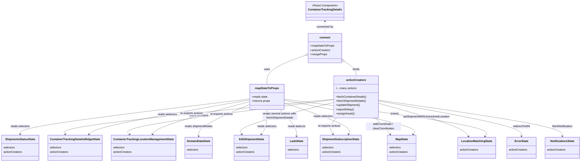

# Diagram: web/portal/src/pages/containertracking/details/ContainerTracking.Details.page.container.js

> Auto-generated by Obscura crawlers

## Mermaid

### SVG

<svg id="container" width="3276.150390625" xmlns="http://www.w3.org/2000/svg" class="classDiagram" height="922" viewBox="0 0 3276.150390625 922" role="graphics-document document" aria-roledescription="class"><g><defs><marker id="container_class-aggregationStart" class="marker aggregation class" refX="18" refY="7" markerWidth="190" markerHeight="240" orient="auto"><path d="M 18,7 L9,13 L1,7 L9,1 Z"></path></marker></defs><defs><marker id="container_class-aggregationEnd" class="marker aggregation class" refX="1" refY="7" markerWidth="20" markerHeight="28" orient="auto"><path d="M 18,7 L9,13 L1,7 L9,1 Z"></path></marker></defs><defs><marker id="container_class-extensionStart" class="marker extension class" refX="18" refY="7" markerWidth="190" markerHeight="240" orient="auto"><path d="M 1,7 L18,13 V 1 Z"></path></marker></defs><defs><marker id="container_class-extensionEnd" class="marker extension class" refX="1" refY="7" markerWidth="20" markerHeight="28" orient="auto"><path d="M 1,1 V 13 L18,7 Z"></path></marker></defs><defs><marker id="container_class-compositionStart" class="marker composition class" refX="18" refY="7" markerWidth="190" markerHeight="240" orient="auto"><path d="M 18,7 L9,13 L1,7 L9,1 Z"></path></marker></defs><defs><marker id="container_class-compositionEnd" class="marker composition class" refX="1" refY="7" markerWidth="20" markerHeight="28" orient="auto"><path d="M 18,7 L9,13 L1,7 L9,1 Z"></path></marker></defs><defs><marker id="container_class-dependencyStart" class="marker dependency class" refX="6" refY="7" markerWidth="190" markerHeight="240" orient="auto"><path d="M 5,7 L9,13 L1,7 L9,1 Z"></path></marker></defs><defs><marker id="container_class-dependencyEnd" class="marker dependency class" refX="13" refY="7" markerWidth="20" markerHeight="28" orient="auto"><path d="M 18,7 L9,13 L14,7 L9,1 Z"></path></marker></defs><defs><marker id="container_class-lollipopStart" class="marker lollipop class" refX="13" refY="7" markerWidth="190" markerHeight="240" orient="auto"><circle stroke="black" fill="transparent" cx="7" cy="7" r="6"></circle></marker></defs><defs><marker id="container_class-lollipopEnd" class="marker lollipop class" refX="1" refY="7" markerWidth="190" markerHeight="240" orient="auto"><circle stroke="black" fill="transparent" cx="7" cy="7" r="6"></circle></marker></defs><g class="root"><g class="clusters"></g><g class="edgePaths"><path d="M1816.24,122L1816.24,127.167C1816.24,132.333,1816.24,142.667,1816.24,154C1816.24,165.333,1816.24,177.667,1816.24,183.833L1816.24,190" id="id_ContainerTrackingDetails_connect_1" class="edge-thickness-normal edge-pattern-dashed relation" style=";;;" data-edge="true" data-et="edge" data-id="id_ContainerTrackingDetails_connect_1" data-points="W3sieCI6MTgxNi4yNDAyMzQzNzUsInkiOjExNn0seyJ4IjoxODE2LjI0MDIzNDM3NSwieSI6MTUzfSx7IngiOjE4MTYuMjQwMjM0Mzc1LCJ5IjoxOTB9XQ==" marker-start="url(#container_class-dependencyStart)"></path><path d="M1706.083,314.128L1669.082,327.607C1632.082,341.086,1558.081,368.043,1521.081,395.688C1484.08,423.333,1484.08,451.667,1484.08,465.833L1484.08,480" id="id_connect_mapStateToProps_2" class="edge-thickness-normal edge-pattern-solid relation" style=";;;" data-edge="true" data-et="edge" data-id="id_connect_mapStateToProps_2" data-points="W3sieCI6MTcyMi4yOTEwMTU2MjUsInkiOjMwOC4yMjQwMTg5MTAzMDU0fSx7IngiOjE0ODQuMDgwMDc4MTI1LCJ5IjozOTV9LHsieCI6MTQ4NC4wODAwNzgxMjUsInkiOjQ4MH1d" marker-start="url(#container_class-aggregationStart)"></path><path d="M1924.418,348.146L1935.811,355.955C1947.204,363.764,1969.991,379.382,1981.384,393.358C1992.777,407.333,1992.777,419.667,1992.777,425.833L1992.777,432" id="id_connect_actionCreators_3" class="edge-thickness-normal edge-pattern-solid relation" style=";;;" data-edge="true" data-et="edge" data-id="id_connect_actionCreators_3" data-points="W3sieCI6MTkxMC4xODk0NTMxMjUsInkiOjMzOC4zOTM1NzQyOTcxODg3Nn0seyJ4IjoxOTkyLjc3NzM0Mzc1LCJ5IjozOTV9LHsieCI6MTk5Mi43NzczNDM3NSwieSI6NDMyfV0=" marker-start="url(#container_class-aggregationStart)"></path><path d="M1386.584,569.362L1244.66,594.635C1102.737,619.908,818.89,670.454,669.763,703.175C520.635,735.896,506.228,750.792,499.024,758.239L491.82,765.687" id="id_mapStateToProps_ContainerTrackingDetailsWidgetState_4" class="edge-thickness-normal edge-pattern-solid relation" style=";;;" data-edge="true" data-et="edge" data-id="id_mapStateToProps_ContainerTrackingDetailsWidgetState_4" data-points="W3sieCI6MTM4Ni41ODM5ODQzNzUsInkiOjU2OS4zNjE2MzkxNjE0MDMzfSx7IngiOjUzNS4wNDI5Njg3NSwieSI6NzIxfSx7IngiOjQ4Ny42NDg1NjY2MzIyMzE0LCJ5Ijo3NzB9XQ==" marker-end="url(#container_class-dependencyEnd)"></path><path d="M1386.584,578.712L1300.029,602.427C1213.475,626.142,1040.365,673.571,949.335,704.599C858.304,735.627,849.352,750.255,844.876,757.569L840.4,764.882" id="id_mapStateToProps_ContainerTrackingLocationManagementState_5" class="edge-thickness-normal edge-pattern-solid relation" style=";;;" data-edge="true" data-et="edge" data-id="id_mapStateToProps_ContainerTrackingLocationManagementState_5" data-points="W3sieCI6MTM4Ni41ODM5ODQzNzUsInkiOjU3OC43MTIzNzUwMDU1NDEzfSx7IngiOjg2Ny4yNTU4NTkzNzUsInkiOjcyMX0seyJ4Ijo4MzcuMjY3NTYxOTgzNDcxMSwieSI6NzcwfV0=" marker-end="url(#container_class-dependencyEnd)"></path><path d="M1386.584,564.022L1174.412,590.185C962.241,616.348,537.898,668.674,325.726,702.004C113.555,735.333,113.555,749.667,113.555,756.833L113.555,764" id="id_mapStateToProps_ShipmentsStatusState_6" class="edge-thickness-normal edge-pattern-solid relation" style=";;;" data-edge="true" data-et="edge" data-id="id_mapStateToProps_ShipmentsStatusState_6" data-points="W3sieCI6MTM4Ni41ODM5ODQzNzUsInkiOjU2NC4wMjIyNzk4OTA5NTJ9LHsieCI6MTEzLjU1NDY4NzUsInkiOjcyMX0seyJ4IjoxMTMuNTU0Njg3NSwieSI6NzcwfV0=" marker-end="url(#container_class-dependencyEnd)"></path><path d="M1484.08,624L1484.08,640.167C1484.08,656.333,1484.08,688.667,1478.765,712.189C1473.45,735.712,1462.82,750.424,1457.505,757.781L1452.19,765.137" id="id_mapStateToProps_EditShipmentState_7" class="edge-thickness-normal edge-pattern-solid relation" style=";;;" data-edge="true" data-et="edge" data-id="id_mapStateToProps_EditShipmentState_7" data-points="W3sieCI6MTQ4NC4wODAwNzgxMjUsInkiOjYyNH0seyJ4IjoxNDg0LjA4MDA3ODEyNSwieSI6NzIxfSx7IngiOjE0NDguNjc2MjQ5MzU0MzM4OCwieSI6NzcwfV0=" marker-end="url(#container_class-dependencyEnd)"></path><path d="M1581.576,585.501L1647.299,608.084C1713.022,630.667,1844.468,675.834,1905.932,705.72C1967.397,735.606,1958.879,750.211,1954.62,757.514L1950.362,764.817" id="id_mapStateToProps_ShipmentSubscriptionState_8" class="edge-thickness-normal edge-pattern-solid relation" style=";;;" data-edge="true" data-et="edge" data-id="id_mapStateToProps_ShipmentSubscriptionState_8" data-points="W3sieCI6MTU4MS41NzYxNzE4NzUsInkiOjU4NS41MDA4MTYwNjIzMzA1fSx7IngiOjE5NzUuOTE0MDYyNSwieSI6NzIxfSx7IngiOjE5NDcuMzM5MTY1ODA1Nzg1MSwieSI6NzcwfV0=" marker-end="url(#container_class-dependencyEnd)"></path><path d="M1581.576,570.904L1710.597,595.92C1839.618,620.936,2097.661,670.968,2220.412,703.387C2343.164,735.807,2330.624,750.614,2324.355,758.018L2318.085,765.421" id="id_mapStateToProps_MapState_9" class="edge-thickness-normal edge-pattern-solid relation" style=";;;" data-edge="true" data-et="edge" data-id="id_mapStateToProps_MapState_9" data-points="W3sieCI6MTU4MS41NzYxNzE4NzUsInkiOjU3MC45MDM2MzAzMDUzNTI2fSx7IngiOjIzNTUuNzAzMTI1LCJ5Ijo3MjF9LHsieCI6MjMxNC4yMDc1MTU0OTU4NjgsInkiOjc3MH1d" marker-end="url(#container_class-dependencyEnd)"></path><path d="M1386.584,594.489L1338.201,615.574C1289.818,636.659,1193.051,678.83,1144.668,709.081C1096.285,739.333,1096.285,757.667,1096.285,766.833L1096.285,776" id="id_mapStateToProps_DomainDataState_10" class="edge-thickness-normal edge-pattern-solid relation" style=";;;" data-edge="true" data-et="edge" data-id="id_mapStateToProps_DomainDataState_10" data-points="W3sieCI6MTM4Ni41ODM5ODQzNzUsInkiOjU5NC40ODg1Mzk0Njg0NDl9LHsieCI6MTA5Ni4yODUxNTYyNSwieSI6NzIxfSx7IngiOjEwOTYuMjg1MTU2MjUsInkiOjc4Mn1d" marker-end="url(#container_class-dependencyEnd)"></path><path d="M1555.85,624L1571.966,640.167C1588.081,656.333,1620.311,688.667,1636.426,714C1652.541,739.333,1652.541,757.667,1652.541,766.833L1652.541,776" id="id_mapStateToProps_LadsState_11" class="edge-thickness-normal edge-pattern-solid relation" style=";;;" data-edge="true" data-et="edge" data-id="id_mapStateToProps_LadsState_11" data-points="W3sieCI6MTU1NS44NTA0MTgzNjE2ODY1LCJ5Ijo2MjR9LHsieCI6MTY1Mi41NDEwMTU2MjUsInkiOjcyMX0seyJ4IjoxNjUyLjU0MTAxNTYyNSwieSI6NzgyfV0=" marker-end="url(#container_class-dependencyEnd)"></path><path d="M1581.576,564.786L1780.1,590.822C1978.624,616.857,2375.671,668.929,2567.316,704.325C2758.961,739.722,2745.203,758.443,2738.324,767.804L2731.445,777.165" id="id_mapStateToProps_LocationMatchingState_12" class="edge-thickness-normal edge-pattern-solid relation" style=";;;" data-edge="true" data-et="edge" data-id="id_mapStateToProps_LocationMatchingState_12" data-points="W3sieCI6MTU4MS41NzYxNzE4NzUsInkiOjU2NC43ODYyMzcyOTMxNzA2fSx7IngiOjI3NzIuNzE4NzUsInkiOjcyMX0seyJ4IjoyNzI3Ljg5MjMzNjAwMjA2NjMsInkiOjc4Mn1d" marker-end="url(#container_class-dependencyEnd)"></path><path d="M1866.375,564.896L1611.37,590.914C1356.365,616.931,846.354,668.965,596.301,702.321C346.248,735.676,356.153,750.351,361.105,757.689L366.058,765.027" id="id_actionCreators_ContainerTrackingDetailsWidgetState_13" class="edge-thickness-normal edge-pattern-solid relation" style=";;;" data-edge="true" data-et="edge" data-id="id_actionCreators_ContainerTrackingDetailsWidgetState_13" data-points="W3sieCI6MTg2Ni4zNzUsInkiOjU2NC44OTYzNzk0MTA3NzI5fSx7IngiOjMzNi4zNDM3NSwieSI6NzIxfSx7IngiOjM2OS40MTQzMjA3NjQ0NjI4LCJ5Ijo3NzB9XQ==" marker-end="url(#container_class-dependencyEnd)"></path><path d="M1866.375,568.225L1668.007,593.688C1469.639,619.15,1072.904,670.075,881.74,702.985C690.576,735.896,704.983,750.792,712.187,758.239L719.391,765.687" id="id_actionCreators_ContainerTrackingLocationManagementState_14" class="edge-thickness-normal edge-pattern-solid relation" style=";;;" data-edge="true" data-et="edge" data-id="id_actionCreators_ContainerTrackingLocationManagementState_14" data-points="W3sieCI6MTg2Ni4zNzUsInkiOjU2OC4yMjUwMDY4MjM4NzI4fSx7IngiOjY3Ni4xNjc5Njg3NSwieSI6NzIxfSx7IngiOjcyMy41NjIzNzA4Njc3Njg1LCJ5Ijo3NzB9XQ==" marker-end="url(#container_class-dependencyEnd)"></path><path d="M1866.375,583.252L1773.517,606.21C1680.66,629.168,1494.944,675.084,1407.401,705.398C1319.858,735.712,1330.488,750.424,1335.803,757.781L1341.118,765.137" id="id_actionCreators_EditShipmentState_15" class="edge-thickness-normal edge-pattern-solid relation" style=";;;" data-edge="true" data-et="edge" data-id="id_actionCreators_EditShipmentState_15" data-points="W3sieCI6MTg2Ni4zNzUsInkiOjU4My4yNTE2MDIyNDgxNDc3fSx7IngiOjEzMDkuMjI4NTE1NjI1LCJ5Ijo3MjF9LHsieCI6MTM0NC42MzIzNDQzOTU2NjEyLCJ5Ijo3NzB9XQ==" marker-end="url(#container_class-dependencyEnd)"></path><path d="M1880.596,672L1872.962,680.167C1865.327,688.333,1850.058,704.667,1846.682,720.136C1843.307,735.606,1851.824,750.211,1856.083,757.514L1860.341,764.817" id="id_actionCreators_ShipmentSubscriptionState_16" class="edge-thickness-normal edge-pattern-solid relation" style=";;;" data-edge="true" data-et="edge" data-id="id_actionCreators_ShipmentSubscriptionState_16" data-points="W3sieCI6MTg4MC41OTYzMTU2NDM0OTEyLCJ5Ijo2NzJ9LHsieCI6MTgzNC43ODkwNjI1LCJ5Ijo3MjF9LHsieCI6MTg2My4zNjM5NTkxOTQyMTQ5LCJ5Ijo3NzB9XQ==" marker-end="url(#container_class-dependencyEnd)"></path><path d="M2104.958,672L2112.593,680.167C2120.227,688.333,2135.497,704.667,2149.401,720.237C2163.305,735.807,2175.844,750.614,2182.114,758.018L2188.384,765.421" id="id_actionCreators_MapState_17" class="edge-thickness-normal edge-pattern-solid relation" style=";;;" data-edge="true" data-et="edge" data-id="id_actionCreators_MapState_17" data-points="W3sieCI6MjEwNC45NTgzNzE4NTY1MDksInkiOjY3Mn0seyJ4IjoyMTUwLjc2NTYyNSwieSI6NzIxfSx7IngiOjIxOTIuMjYxMjM0NTA0MTMyLCJ5Ijo3NzB9XQ==" marker-end="url(#container_class-dependencyEnd)"></path><path d="M2119.18,587.479L2198.464,609.732C2277.747,631.986,2436.315,676.493,2522.478,708.107C2608.641,739.722,2622.398,758.443,2629.277,767.804L2636.156,777.165" id="id_actionCreators_LocationMatchingState_18" class="edge-thickness-normal edge-pattern-solid relation" style=";;;" data-edge="true" data-et="edge" data-id="id_actionCreators_LocationMatchingState_18" data-points="W3sieCI6MjExOS4xNzk2ODc1LCJ5Ijo1ODcuNDc4ODI3NTUxNzU1Mn0seyJ4IjoyNTk0Ljg4MjgxMjUsInkiOjcyMX0seyJ4IjoyNjM5LjcwOTIyNjQ5NzkzMzcsInkiOjc4Mn1d" marker-end="url(#container_class-dependencyEnd)"></path><path d="M2119.18,574.568L2255.87,598.974C2392.561,623.379,2665.941,672.189,2802.632,705.761C2939.322,739.333,2939.322,757.667,2939.322,766.833L2939.322,776" id="id_actionCreators_ErrorState_19" class="edge-thickness-normal edge-pattern-solid relation" style=";;;" data-edge="true" data-et="edge" data-id="id_actionCreators_ErrorState_19" data-points="W3sieCI6MjExOS4xNzk2ODc1LCJ5Ijo1NzQuNTY4MzkxMjA4OTgxN30seyJ4IjoyOTM5LjMyMjI2NTYyNSwieSI6NzIxfSx7IngiOjI5MzkuMzIyMjY1NjI1LCJ5Ijo3ODJ9XQ==" marker-end="url(#container_class-dependencyEnd)"></path><path d="M2119.18,570.139L2294.391,595.283C2469.602,620.426,2820.025,670.713,2995.236,705.023C3170.447,739.333,3170.447,757.667,3170.447,766.833L3170.447,776" id="id_actionCreators_NotificationsState_20" class="edge-thickness-normal edge-pattern-solid relation" style=";;;" data-edge="true" data-et="edge" data-id="id_actionCreators_NotificationsState_20" data-points="W3sieCI6MjExOS4xNzk2ODc1LCJ5Ijo1NzAuMTM5MjA0OTY0NzgyNX0seyJ4IjozMTcwLjQ0NzI2NTYyNSwieSI6NzIxfSx7IngiOjMxNzAuNDQ3MjY1NjI1LCJ5Ijo3ODJ9XQ==" marker-end="url(#container_class-dependencyEnd)"></path></g><g class="edgeLabels"><g class="edgeLabel" transform="translate(1816.240234375, 153)"><g class="label" data-id="id_ContainerTrackingDetails_connect_1" transform="translate(-48.5859375, -12)"><foreignObject width="97.171875" height="24">

connected by

</foreignObject></g></g><g class="edgeLabel" transform="translate(1484.080078125, 395)"><g class="label" data-id="id_connect_mapStateToProps_2" transform="translate(-16.4921875, -12)"><foreignObject width="32.984375" height="24">

uses

</foreignObject></g></g><g class="edgeLabel" transform="translate(1992.77734375, 395)"><g class="label" data-id="id_connect_actionCreators_3" transform="translate(-20.21875, -12)"><foreignObject width="40.4375" height="24">

binds

</foreignObject></g></g><g class="edgeLabel" transform="translate(927.25609, 651.15656)"><g class="label" data-id="id_mapStateToProps_ContainerTrackingDetailsWidgetState_4" transform="translate(-54.8515625, -12)"><foreignObject width="109.703125" height="24">

reads selectors

</foreignObject></g></g><g class="edgeLabel" transform="translate(1099.2168, 657.4464)"><g class="label" data-id="id_mapStateToProps_ContainerTrackingLocationManagementState_5" transform="translate(-54.8515625, -12)"><foreignObject width="109.703125" height="24">

reads selectors

</foreignObject></g></g><g class="edgeLabel" transform="translate(113.5546875, 721)"><g class="label" data-id="id_mapStateToProps_ShipmentsStatusState_6" transform="translate(-54.8515625, -12)"><foreignObject width="109.703125" height="24">

reads selectors

</foreignObject></g></g><g class="edgeLabel" transform="translate(1484.080078125, 721)"><g class="label" data-id="id_mapStateToProps_EditShipmentState_7" transform="translate(-54.8515625, -12)"><foreignObject width="109.703125" height="24">

reads selectors

</foreignObject></g></g><g class="edgeLabel" transform="translate(1805.56745, 662.46688)"><g class="label" data-id="id_mapStateToProps_ShipmentSubscriptionState_8" transform="translate(-54.8515625, -12)"><foreignObject width="109.703125" height="24">

reads selectors

</foreignObject></g></g><g class="edgeLabel" transform="translate(2000.15753, 652.06285)"><g class="label" data-id="id_mapStateToProps_MapState_9" transform="translate(-84.9375, -12)"><foreignObject width="169.875" height="24">

uses getMapCoordinate

</foreignObject></g></g><g class="edgeLabel" transform="translate(1096.28515625, 721)"><g class="label" data-id="id_mapStateToProps_DomainDataState_10" transform="translate(-80.125, -12)"><foreignObject width="160.25" height="24">

reads shipmentModes

</foreignObject></g></g><g class="edgeLabel" transform="translate(1652.541015625, 721)"><g class="label" data-id="id_mapStateToProps_LadsState_11" transform="translate(-50.1640625, -12)"><foreignObject width="100.328125" height="24">

reads ladsList

</foreignObject></g></g><g class="edgeLabel" transform="translate(2214.67583, 647.81482)"><g class="label" data-id="id_mapStateToProps_LocationMatchingState_12" transform="translate(-23.59375, -12)"><foreignObject width="47.1875" height="24">

(none)

</foreignObject></g></g><g class="edgeLabel" transform="translate(1071.95419, 645.9483)"><g class="label" data-id="id_actionCreators_ContainerTrackingDetailsWidgetState_13" transform="translate(-66.2734375, -12)"><foreignObject width="132.546875" height="24">

re-exports actions

</foreignObject></g></g><g class="edgeLabel" transform="translate(1237.46357, 648.95209)"><g class="label" data-id="id_actionCreators_ContainerTrackingLocationManagementState_14" transform="translate(-66.2734375, -12)"><foreignObject width="132.546875" height="24">

re-exports actions

</foreignObject></g></g><g class="edgeLabel" transform="translate(1558.45932, 659.3804)"><g class="label" data-id="id_actionCreators_EditShipmentState_15" transform="translate(-100, -24)"><foreignObject width="200" height="48">

wraps several actions with fetchShipmentDetails

</foreignObject></g></g><g class="edgeLabel" transform="translate(1838.32434, 717.21831)"><g class="label" data-id="id_actionCreators_ShipmentSubscriptionState_16" transform="translate(-66.2734375, -12)"><foreignObject width="132.546875" height="24">

re-exports actions

</foreignObject></g></g><g class="edgeLabel" transform="translate(2149.78663, 719.95276)"><g class="label" data-id="id_actionCreators_MapState_17" transform="translate(-100, -24)"><foreignObject width="200" height="48">

addCoordinate / clearCoordinates

</foreignObject></g></g><g class="edgeLabel" transform="translate(2393.47272, 664.46787)"><g class="label" data-id="id_actionCreators_LocationMatchingState_18" transform="translate(-134.2421875, -12)"><foreignObject width="268.484375" height="24">

setShipmentWithUnresolvedLocation

</foreignObject></g></g><g class="edgeLabel" transform="translate(2939.322265625, 721)"><g class="label" data-id="id_actionCreators_ErrorState_19" transform="translate(-49.515625, -12)"><foreignObject width="99.03125" height="24">

redirectTo404

</foreignObject></g></g><g class="edgeLabel" transform="translate(3170.447265625, 721)"><g class="label" data-id="id_actionCreators_NotificationsState_20" transform="translate(-60.7265625, -12)"><foreignObject width="121.453125" height="24">

fetchNotification

</foreignObject></g></g></g><g class="nodes"><g class="node default" id="classId-ContainerTrackingDetails-0" transform="translate(1816.240234375, 62)"><g class="basic label-container"><path d="M-104.0234375 -54 L104.0234375 -54 L104.0234375 54 L-104.0234375 54" stroke="none" stroke-width="0" fill="#ECECFF" style=""></path><path d="M-104.0234375 -54 C-47.288434779656946 -54, 9.446567940686108 -54, 104.0234375 -54 M-104.0234375 -54 C-28.42687366076551 -54, 47.16969017846898 -54, 104.0234375 -54 M104.0234375 -54 C104.0234375 -20.713165591357814, 104.0234375 12.573668817284371, 104.0234375 54 M104.0234375 -54 C104.0234375 -26.17249554749192, 104.0234375 1.6550089050161603, 104.0234375 54 M104.0234375 54 C40.551177205986654 54, -22.92108308802669 54, -104.0234375 54 M104.0234375 54 C44.79967858429273 54, -14.424080331414544 54, -104.0234375 54 M-104.0234375 54 C-104.0234375 23.019883206471942, -104.0234375 -7.960233587056116, -104.0234375 -54 M-104.0234375 54 C-104.0234375 26.666460722291507, -104.0234375 -0.6670785554169854, -104.0234375 -54" stroke="#9370DB" stroke-width="1.3" fill="none" stroke-dasharray="0 0" style=""></path></g><g class="annotation-group text" transform="translate(-73.2109375, -30)"><g class="label" style="" transform="translate(0,-12)"><foreignObject width="146.421875" height="24">

«React Component»

</foreignObject></g></g><g class="label-group text" transform="translate(-92.0234375, -6)"><g class="label" style="font-weight: bolder" transform="translate(0,-12)"><foreignObject width="184.046875" height="24">

ContainerTrackingDetails

</foreignObject></g></g><g class="members-group text" transform="translate(-92.0234375, 42)"></g><g class="methods-group text" transform="translate(-92.0234375, 72)"></g><g class="divider" style=""><path d="M-104.0234375 18 C-60.56588738505357 18, -17.108337270107143 18, 104.0234375 18 M-104.0234375 18 C-50.677263564196956 18, 2.6689103716060885 18, 104.0234375 18" stroke="#9370DB" stroke-width="1.3" fill="none" stroke-dasharray="0 0" style=""></path></g><g class="divider" style=""><path d="M-104.0234375 36 C-30.200490628742656 36, 43.62245624251469 36, 104.0234375 36 M-104.0234375 36 C-48.07804879210759 36, 7.867339915784825 36, 104.0234375 36" stroke="#9370DB" stroke-width="1.3" fill="none" stroke-dasharray="0 0" style=""></path></g></g><g class="node default" id="classId-connect-1" transform="translate(1816.240234375, 274)"><g class="basic label-container"><path d="M-93.94921875 -84 L93.94921875 -84 L93.94921875 84 L-93.94921875 84" stroke="none" stroke-width="0" fill="#ECECFF" style=""></path><path d="M-93.94921875 -84 C-26.337596096721413 -84, 41.274026556557175 -84, 93.94921875 -84 M-93.94921875 -84 C-42.246626395787345 -84, 9.45596595842531 -84, 93.94921875 -84 M93.94921875 -84 C93.94921875 -31.313355567136938, 93.94921875 21.373288865726124, 93.94921875 84 M93.94921875 -84 C93.94921875 -47.49856875354307, 93.94921875 -10.997137507086137, 93.94921875 84 M93.94921875 84 C53.82578420649331 84, 13.70234966298662 84, -93.94921875 84 M93.94921875 84 C22.408176714185473 84, -49.132865321629055 84, -93.94921875 84 M-93.94921875 84 C-93.94921875 49.29149033781884, -93.94921875 14.582980675637685, -93.94921875 -84 M-93.94921875 84 C-93.94921875 43.3796616404103, -93.94921875 2.7593232808205954, -93.94921875 -84" stroke="#9370DB" stroke-width="1.3" fill="none" stroke-dasharray="0 0" style=""></path></g><g class="annotation-group text" transform="translate(0, -60)"></g><g class="label-group text" transform="translate(-28.9140625, -60)"><g class="label" style="font-weight: bolder" transform="translate(0,-12)"><foreignObject width="57.828125" height="24">

connect

</foreignObject></g></g><g class="members-group text" transform="translate(-81.94921875, -12)"><g class="label" style="" transform="translate(0,-12)"><foreignObject width="134.984375" height="24">

+mapStateToProps

</foreignObject></g><g class="label" style="" transform="translate(0,12)"><foreignObject width="113.078125" height="24">

+actionCreators

</foreignObject></g><g class="label" style="" transform="translate(0,36)"><foreignObject width="94.140625" height="24">

+mergeProps

</foreignObject></g></g><g class="methods-group text" transform="translate(-81.94921875, 84)"></g><g class="divider" style=""><path d="M-93.94921875 -36 C-19.42350487705359 -36, 55.10220899589282 -36, 93.94921875 -36 M-93.94921875 -36 C-36.731004781705735 -36, 20.48720918658853 -36, 93.94921875 -36" stroke="#9370DB" stroke-width="1.3" fill="none" stroke-dasharray="0 0" style=""></path></g><g class="divider" style=""><path d="M-93.94921875 60 C-43.12477358880813 60, 7.6996715723837355 60, 93.94921875 60 M-93.94921875 60 C-32.02887179956757 60, 29.891475150864864 60, 93.94921875 60" stroke="#9370DB" stroke-width="1.3" fill="none" stroke-dasharray="0 0" style=""></path></g></g><g class="node default" id="classId-mapStateToProps-2" transform="translate(1484.080078125, 552)"><g class="basic label-container"><path d="M-97.49609375 -72 L97.49609375 -72 L97.49609375 72 L-97.49609375 72" stroke="none" stroke-width="0" fill="#ECECFF" style=""></path><path d="M-97.49609375 -72 C-56.06794952593539 -72, -14.63980530187078 -72, 97.49609375 -72 M-97.49609375 -72 C-23.143021819708537 -72, 51.21005011058293 -72, 97.49609375 -72 M97.49609375 -72 C97.49609375 -22.432689564683166, 97.49609375 27.13462087063367, 97.49609375 72 M97.49609375 -72 C97.49609375 -25.394536432872066, 97.49609375 21.21092713425587, 97.49609375 72 M97.49609375 72 C45.67713590763396 72, -6.141821934732079 72, -97.49609375 72 M97.49609375 72 C27.566854601223326 72, -42.36238454755335 72, -97.49609375 72 M-97.49609375 72 C-97.49609375 34.93895743298118, -97.49609375 -2.122085134037647, -97.49609375 -72 M-97.49609375 72 C-97.49609375 30.078341723049448, -97.49609375 -11.843316553901104, -97.49609375 -72" stroke="#9370DB" stroke-width="1.3" fill="none" stroke-dasharray="0 0" style=""></path></g><g class="annotation-group text" transform="translate(0, -48)"></g><g class="label-group text" transform="translate(-64.7109375, -48)"><g class="label" style="font-weight: bolder" transform="translate(0,-12)"><foreignObject width="129.421875" height="24">

mapStateToProps

</foreignObject></g></g><g class="members-group text" transform="translate(-85.49609375, 0)"><g class="label" style="" transform="translate(0,-12)"><foreignObject width="88.328125" height="24">

+reads state

</foreignObject></g><g class="label" style="" transform="translate(0,12)"><foreignObject width="106.28125" height="24">

+returns props

</foreignObject></g></g><g class="methods-group text" transform="translate(-85.49609375, 72)"></g><g class="divider" style=""><path d="M-97.49609375 -24 C-57.25846776731327 -24, -17.02084178462654 -24, 97.49609375 -24 M-97.49609375 -24 C-48.83123718953908 -24, -0.1663806290781622 -24, 97.49609375 -24" stroke="#9370DB" stroke-width="1.3" fill="none" stroke-dasharray="0 0" style=""></path></g><g class="divider" style=""><path d="M-97.49609375 48 C-42.25607662482478 48, 12.983940500350442 48, 97.49609375 48 M-97.49609375 48 C-37.801566390631756 48, 21.89296096873649 48, 97.49609375 48" stroke="#9370DB" stroke-width="1.3" fill="none" stroke-dasharray="0 0" style=""></path></g></g><g class="node default" id="classId-actionCreators-3" transform="translate(1992.77734375, 552)"><g class="basic label-container"><path d="M-126.40234375 -120 L126.40234375 -120 L126.40234375 120 L-126.40234375 120" stroke="none" stroke-width="0" fill="#ECECFF" style=""></path><path d="M-126.40234375 -120 C-41.0597506987599 -120, 44.2828423524802 -120, 126.40234375 -120 M-126.40234375 -120 C-41.519771282029225 -120, 43.36280118594155 -120, 126.40234375 -120 M126.40234375 -120 C126.40234375 -27.76169773069992, 126.40234375 64.47660453860016, 126.40234375 120 M126.40234375 -120 C126.40234375 -25.12044054509323, 126.40234375 69.75911890981354, 126.40234375 120 M126.40234375 120 C42.03227934657929 120, -42.337785056841426 120, -126.40234375 120 M126.40234375 120 C49.33237906093049 120, -27.737585628139016 120, -126.40234375 120 M-126.40234375 120 C-126.40234375 24.675078739127088, -126.40234375 -70.64984252174582, -126.40234375 -120 M-126.40234375 120 C-126.40234375 49.14292650597923, -126.40234375 -21.714146988041534, -126.40234375 -120" stroke="#9370DB" stroke-width="1.3" fill="none" stroke-dasharray="0 0" style=""></path></g><g class="annotation-group text" transform="translate(0, -96)"></g><g class="label-group text" transform="translate(-53.6328125, -96)"><g class="label" style="font-weight: bolder" transform="translate(0,-12)"><foreignObject width="107.265625" height="24">

actionCreators

</foreignObject></g></g><g class="members-group text" transform="translate(-114.40234375, -48)"><g class="label" style="" transform="translate(0,-12)"><foreignObject width="115.34375" height="24">

+...many actions

</foreignObject></g></g><g class="methods-group text" transform="translate(-114.40234375, 0)"><g class="label" style="" transform="translate(0,-12)"><foreignObject width="175.171875" height="24">

+fetchContainerDetails()

</foreignObject></g><g class="label" style="" transform="translate(0,12)"><foreignObject width="174.359375" height="24">

+fetchShipmentDetails()

</foreignObject></g><g class="label" style="" transform="translate(0,36)"><foreignObject width="139.40625" height="24">

+updateShipment()

</foreignObject></g><g class="label" style="" transform="translate(0,60)"><foreignObject width="103.546875" height="24">

+reportDelay()

</foreignObject></g><g class="label" style="" transform="translate(0,84)"><foreignObject width="102.109375" height="24">

+assignAsset()

</foreignObject></g></g><g class="divider" style=""><path d="M-126.40234375 -72 C-30.764359671821197 -72, 64.8736244063576 -72, 126.40234375 -72 M-126.40234375 -72 C-35.457931747396884 -72, 55.48648025520623 -72, 126.40234375 -72" stroke="#9370DB" stroke-width="1.3" fill="none" stroke-dasharray="0 0" style=""></path></g><g class="divider" style=""><path d="M-126.40234375 -24 C-33.43449796840254 -24, 59.53334781319492 -24, 126.40234375 -24 M-126.40234375 -24 C-71.36375296976364 -24, -16.325162189527276 -24, 126.40234375 -24" stroke="#9370DB" stroke-width="1.3" fill="none" stroke-dasharray="0 0" style=""></path></g></g><g class="node default" id="classId-ContainerTrackingDetailsWidgetState-4" transform="translate(418.0078125, 842)"><g class="basic label-container"><path d="M-148.8984375 -72 L148.8984375 -72 L148.8984375 72 L-148.8984375 72" stroke="none" stroke-width="0" fill="#ECECFF" style=""></path><path d="M-148.8984375 -72 C-41.88185049105323 -72, 65.13473651789354 -72, 148.8984375 -72 M-148.8984375 -72 C-69.67196155563182 -72, 9.55451438873635 -72, 148.8984375 -72 M148.8984375 -72 C148.8984375 -20.37479056655838, 148.8984375 31.250418866883237, 148.8984375 72 M148.8984375 -72 C148.8984375 -41.97486482271255, 148.8984375 -11.949729645425101, 148.8984375 72 M148.8984375 72 C82.76334574283803 72, 16.628253985676054 72, -148.8984375 72 M148.8984375 72 C39.23401101760501 72, -70.43041546478997 72, -148.8984375 72 M-148.8984375 72 C-148.8984375 28.968160342597436, -148.8984375 -14.063679314805128, -148.8984375 -72 M-148.8984375 72 C-148.8984375 30.89540382848299, -148.8984375 -10.209192343034019, -148.8984375 -72" stroke="#9370DB" stroke-width="1.3" fill="none" stroke-dasharray="0 0" style=""></path></g><g class="annotation-group text" transform="translate(0, -48)"></g><g class="label-group text" transform="translate(-136.8984375, -48)"><g class="label" style="font-weight: bolder" transform="translate(0,-12)"><foreignObject width="273.796875" height="24">

ContainerTrackingDetailsWidgetState

</foreignObject></g></g><g class="members-group text" transform="translate(-136.8984375, 0)"><g class="label" style="" transform="translate(0,-12)"><foreignObject width="65.46875" height="24">

selectors

</foreignObject></g><g class="label" style="" transform="translate(0,12)"><foreignObject width="105.34375" height="24">

actionCreators

</foreignObject></g></g><g class="methods-group text" transform="translate(-136.8984375, 72)"></g><g class="divider" style=""><path d="M-148.8984375 -24 C-54.675251232684204 -24, 39.54793503463159 -24, 148.8984375 -24 M-148.8984375 -24 C-80.17987671923517 -24, -11.461315938470335 -24, 148.8984375 -24" stroke="#9370DB" stroke-width="1.3" fill="none" stroke-dasharray="0 0" style=""></path></g><g class="divider" style=""><path d="M-148.8984375 48 C-43.930916760228115 48, 61.03660397954377 48, 148.8984375 48 M-148.8984375 48 C-61.874847714647004 48, 25.148742070705993 48, 148.8984375 48" stroke="#9370DB" stroke-width="1.3" fill="none" stroke-dasharray="0 0" style=""></path></g></g><g class="node default" id="classId-ContainerTrackingLocationManagementState-5" transform="translate(793.203125, 842)"><g class="basic label-container"><path d="M-176.296875 -72 L176.296875 -72 L176.296875 72 L-176.296875 72" stroke="none" stroke-width="0" fill="#ECECFF" style=""></path><path d="M-176.296875 -72 C-70.76167475990758 -72, 34.773525480184844 -72, 176.296875 -72 M-176.296875 -72 C-71.46281038566481 -72, 33.37125422867038 -72, 176.296875 -72 M176.296875 -72 C176.296875 -25.601535056629558, 176.296875 20.796929886740884, 176.296875 72 M176.296875 -72 C176.296875 -16.038017070104146, 176.296875 39.92396585979171, 176.296875 72 M176.296875 72 C65.93717405610586 72, -44.42252688778828 72, -176.296875 72 M176.296875 72 C50.47368755314213 72, -75.34949989371574 72, -176.296875 72 M-176.296875 72 C-176.296875 29.432104765191205, -176.296875 -13.13579046961759, -176.296875 -72 M-176.296875 72 C-176.296875 41.62905760537424, -176.296875 11.258115210748493, -176.296875 -72" stroke="#9370DB" stroke-width="1.3" fill="none" stroke-dasharray="0 0" style=""></path></g><g class="annotation-group text" transform="translate(0, -48)"></g><g class="label-group text" transform="translate(-164.296875, -48)"><g class="label" style="font-weight: bolder" transform="translate(0,-12)"><foreignObject width="328.59375" height="24">

ContainerTrackingLocationManagementState

</foreignObject></g></g><g class="members-group text" transform="translate(-164.296875, 0)"><g class="label" style="" transform="translate(0,-12)"><foreignObject width="65.46875" height="24">

selectors

</foreignObject></g><g class="label" style="" transform="translate(0,12)"><foreignObject width="105.34375" height="24">

actionCreators

</foreignObject></g></g><g class="methods-group text" transform="translate(-164.296875, 72)"></g><g class="divider" style=""><path d="M-176.296875 -24 C-78.84495309049738 -24, 18.606968819005232 -24, 176.296875 -24 M-176.296875 -24 C-101.54073889112635 -24, -26.784602782252705 -24, 176.296875 -24" stroke="#9370DB" stroke-width="1.3" fill="none" stroke-dasharray="0 0" style=""></path></g><g class="divider" style=""><path d="M-176.296875 48 C-39.0835283538037 48, 98.1298182923926 48, 176.296875 48 M-176.296875 48 C-63.95324489422548 48, 48.390385211549045 48, 176.296875 48" stroke="#9370DB" stroke-width="1.3" fill="none" stroke-dasharray="0 0" style=""></path></g></g><g class="node default" id="classId-ShipmentsStatusState-6" transform="translate(113.5546875, 842)"><g class="basic label-container"><path d="M-105.5546875 -72 L105.5546875 -72 L105.5546875 72 L-105.5546875 72" stroke="none" stroke-width="0" fill="#ECECFF" style=""></path><path d="M-105.5546875 -72 C-34.95212755811065 -72, 35.65043238377871 -72, 105.5546875 -72 M-105.5546875 -72 C-36.4289804291313 -72, 32.6967266417374 -72, 105.5546875 -72 M105.5546875 -72 C105.5546875 -30.100471448550152, 105.5546875 11.799057102899695, 105.5546875 72 M105.5546875 -72 C105.5546875 -27.45040566380338, 105.5546875 17.09918867239324, 105.5546875 72 M105.5546875 72 C59.366533435652116 72, 13.178379371304231 72, -105.5546875 72 M105.5546875 72 C37.72738402489914 72, -30.099919450201725 72, -105.5546875 72 M-105.5546875 72 C-105.5546875 41.16721840112598, -105.5546875 10.334436802251957, -105.5546875 -72 M-105.5546875 72 C-105.5546875 31.942553095466373, -105.5546875 -8.114893809067254, -105.5546875 -72" stroke="#9370DB" stroke-width="1.3" fill="none" stroke-dasharray="0 0" style=""></path></g><g class="annotation-group text" transform="translate(0, -48)"></g><g class="label-group text" transform="translate(-81.765625, -48)"><g class="label" style="font-weight: bolder" transform="translate(0,-12)"><foreignObject width="163.53125" height="24">

ShipmentsStatusState

</foreignObject></g></g><g class="members-group text" transform="translate(-93.5546875, 0)"><g class="label" style="" transform="translate(0,-12)"><foreignObject width="65.46875" height="24">

selectors

</foreignObject></g><g class="label" style="" transform="translate(0,12)"><foreignObject width="105.34375" height="24">

actionCreators

</foreignObject></g></g><g class="methods-group text" transform="translate(-93.5546875, 72)"></g><g class="divider" style=""><path d="M-105.5546875 -24 C-56.10090393541721 -24, -6.647120370834415 -24, 105.5546875 -24 M-105.5546875 -24 C-44.061453092392 -24, 17.431781315216 -24, 105.5546875 -24" stroke="#9370DB" stroke-width="1.3" fill="none" stroke-dasharray="0 0" style=""></path></g><g class="divider" style=""><path d="M-105.5546875 48 C-46.29764401614385 48, 12.959399467712302 48, 105.5546875 48 M-105.5546875 48 C-44.41095905073908 48, 16.73276939852184 48, 105.5546875 48" stroke="#9370DB" stroke-width="1.3" fill="none" stroke-dasharray="0 0" style=""></path></g></g><g class="node default" id="classId-EditShipmentState-7" transform="translate(1396.654296875, 842)"><g class="basic label-container"><path d="M-98.9765625 -72 L98.9765625 -72 L98.9765625 72 L-98.9765625 72" stroke="none" stroke-width="0" fill="#ECECFF" style=""></path><path d="M-98.9765625 -72 C-27.25135421999174 -72, 44.47385406001652 -72, 98.9765625 -72 M-98.9765625 -72 C-38.05920045889812 -72, 22.858161582203763 -72, 98.9765625 -72 M98.9765625 -72 C98.9765625 -38.35657819120022, 98.9765625 -4.713156382400442, 98.9765625 72 M98.9765625 -72 C98.9765625 -15.032649477073264, 98.9765625 41.93470104585347, 98.9765625 72 M98.9765625 72 C37.98433598983494 72, -23.007890520330122 72, -98.9765625 72 M98.9765625 72 C22.281865123464442 72, -54.412832253071116 72, -98.9765625 72 M-98.9765625 72 C-98.9765625 23.17853922945993, -98.9765625 -25.642921541080142, -98.9765625 -72 M-98.9765625 72 C-98.9765625 20.135476824158985, -98.9765625 -31.72904635168203, -98.9765625 -72" stroke="#9370DB" stroke-width="1.3" fill="none" stroke-dasharray="0 0" style=""></path></g><g class="annotation-group text" transform="translate(0, -48)"></g><g class="label-group text" transform="translate(-68.609375, -48)"><g class="label" style="font-weight: bolder" transform="translate(0,-12)"><foreignObject width="137.21875" height="24">

EditShipmentState

</foreignObject></g></g><g class="members-group text" transform="translate(-86.9765625, 0)"><g class="label" style="" transform="translate(0,-12)"><foreignObject width="65.46875" height="24">

selectors

</foreignObject></g><g class="label" style="" transform="translate(0,12)"><foreignObject width="105.34375" height="24">

actionCreators

</foreignObject></g></g><g class="methods-group text" transform="translate(-86.9765625, 72)"></g><g class="divider" style=""><path d="M-98.9765625 -24 C-40.74958632703622 -24, 17.47738984592756 -24, 98.9765625 -24 M-98.9765625 -24 C-57.42403171207448 -24, -15.871500924148961 -24, 98.9765625 -24" stroke="#9370DB" stroke-width="1.3" fill="none" stroke-dasharray="0 0" style=""></path></g><g class="divider" style=""><path d="M-98.9765625 48 C-52.27267141151586 48, -5.568780323031717 48, 98.9765625 48 M-98.9765625 48 C-32.268242356691104 48, 34.44007778661779 48, 98.9765625 48" stroke="#9370DB" stroke-width="1.3" fill="none" stroke-dasharray="0 0" style=""></path></g></g><g class="node default" id="classId-ShipmentSubscriptionState-8" transform="translate(1905.3515625, 842)"><g class="basic label-container"><path d="M-115.12890625 -72 L115.12890625 -72 L115.12890625 72 L-115.12890625 72" stroke="none" stroke-width="0" fill="#ECECFF" style=""></path><path d="M-115.12890625 -72 C-60.02700178772274 -72, -4.925097325445478 -72, 115.12890625 -72 M-115.12890625 -72 C-37.13181909583942 -72, 40.86526805832116 -72, 115.12890625 -72 M115.12890625 -72 C115.12890625 -25.816133561111116, 115.12890625 20.36773287777777, 115.12890625 72 M115.12890625 -72 C115.12890625 -17.772853686984476, 115.12890625 36.45429262603105, 115.12890625 72 M115.12890625 72 C28.23193636034985 72, -58.6650335293003 72, -115.12890625 72 M115.12890625 72 C57.319186342402986 72, -0.4905335651940277 72, -115.12890625 72 M-115.12890625 72 C-115.12890625 18.116620311073937, -115.12890625 -35.766759377852125, -115.12890625 -72 M-115.12890625 72 C-115.12890625 38.87693355882963, -115.12890625 5.753867117659254, -115.12890625 -72" stroke="#9370DB" stroke-width="1.3" fill="none" stroke-dasharray="0 0" style=""></path></g><g class="annotation-group text" transform="translate(0, -48)"></g><g class="label-group text" transform="translate(-100.9140625, -48)"><g class="label" style="font-weight: bolder" transform="translate(0,-12)"><foreignObject width="201.828125" height="24">

ShipmentSubscriptionState

</foreignObject></g></g><g class="members-group text" transform="translate(-103.12890625, 0)"><g class="label" style="" transform="translate(0,-12)"><foreignObject width="65.46875" height="24">

selectors

</foreignObject></g><g class="label" style="" transform="translate(0,12)"><foreignObject width="105.34375" height="24">

actionCreators

</foreignObject></g></g><g class="methods-group text" transform="translate(-103.12890625, 72)"></g><g class="divider" style=""><path d="M-115.12890625 -24 C-25.843002856223166 -24, 63.44290053755367 -24, 115.12890625 -24 M-115.12890625 -24 C-55.27905860140812 -24, 4.570789047183766 -24, 115.12890625 -24" stroke="#9370DB" stroke-width="1.3" fill="none" stroke-dasharray="0 0" style=""></path></g><g class="divider" style=""><path d="M-115.12890625 48 C-57.62764347194901 48, -0.12638069389801387 48, 115.12890625 48 M-115.12890625 48 C-50.37764512019267 48, 14.373616009614665 48, 115.12890625 48" stroke="#9370DB" stroke-width="1.3" fill="none" stroke-dasharray="0 0" style=""></path></g></g><g class="node default" id="classId-MapState-9" transform="translate(2253.234375, 842)"><g class="basic label-container"><path d="M-82.0546875 -72 L82.0546875 -72 L82.0546875 72 L-82.0546875 72" stroke="none" stroke-width="0" fill="#ECECFF" style=""></path><path d="M-82.0546875 -72 C-33.31054256729629 -72, 15.433602365407424 -72, 82.0546875 -72 M-82.0546875 -72 C-20.632091998578126 -72, 40.79050350284375 -72, 82.0546875 -72 M82.0546875 -72 C82.0546875 -20.887705552138925, 82.0546875 30.22458889572215, 82.0546875 72 M82.0546875 -72 C82.0546875 -30.790355804390096, 82.0546875 10.419288391219808, 82.0546875 72 M82.0546875 72 C38.78559276714047 72, -4.483501965719057 72, -82.0546875 72 M82.0546875 72 C36.96295235015908 72, -8.128782799681844 72, -82.0546875 72 M-82.0546875 72 C-82.0546875 23.67783905440642, -82.0546875 -24.64432189118716, -82.0546875 -72 M-82.0546875 72 C-82.0546875 28.956072924975643, -82.0546875 -14.087854150048713, -82.0546875 -72" stroke="#9370DB" stroke-width="1.3" fill="none" stroke-dasharray="0 0" style=""></path></g><g class="annotation-group text" transform="translate(0, -48)"></g><g class="label-group text" transform="translate(-34.765625, -48)"><g class="label" style="font-weight: bolder" transform="translate(0,-12)"><foreignObject width="69.53125" height="24">

MapState

</foreignObject></g></g><g class="members-group text" transform="translate(-70.0546875, 0)"><g class="label" style="" transform="translate(0,-12)"><foreignObject width="65.46875" height="24">

selectors

</foreignObject></g><g class="label" style="" transform="translate(0,12)"><foreignObject width="105.34375" height="24">

actionCreators

</foreignObject></g></g><g class="methods-group text" transform="translate(-70.0546875, 72)"></g><g class="divider" style=""><path d="M-82.0546875 -24 C-48.65669363117711 -24, -15.258699762354226 -24, 82.0546875 -24 M-82.0546875 -24 C-37.98643269341648 -24, 6.081822113167036 -24, 82.0546875 -24" stroke="#9370DB" stroke-width="1.3" fill="none" stroke-dasharray="0 0" style=""></path></g><g class="divider" style=""><path d="M-82.0546875 48 C-32.4179981586402 48, 17.218691182719596 48, 82.0546875 48 M-82.0546875 48 C-45.062111095975595 48, -8.06953469195119 48, 82.0546875 48" stroke="#9370DB" stroke-width="1.3" fill="none" stroke-dasharray="0 0" style=""></path></g></g><g class="node default" id="classId-DomainDataState-10" transform="translate(1096.28515625, 842)"><g class="basic label-container"><path d="M-76.78515625 -60 L76.78515625 -60 L76.78515625 60 L-76.78515625 60" stroke="none" stroke-width="0" fill="#ECECFF" style=""></path><path d="M-76.78515625 -60 C-23.009248024356665 -60, 30.76666020128667 -60, 76.78515625 -60 M-76.78515625 -60 C-15.468871894134246 -60, 45.84741246173151 -60, 76.78515625 -60 M76.78515625 -60 C76.78515625 -18.805510647509173, 76.78515625 22.388978704981653, 76.78515625 60 M76.78515625 -60 C76.78515625 -28.339126827936802, 76.78515625 3.321746344126396, 76.78515625 60 M76.78515625 60 C15.439294488093175 60, -45.90656727381365 60, -76.78515625 60 M76.78515625 60 C20.619835519623088 60, -35.545485210753824 60, -76.78515625 60 M-76.78515625 60 C-76.78515625 20.649066788455862, -76.78515625 -18.701866423088276, -76.78515625 -60 M-76.78515625 60 C-76.78515625 34.859836049012344, -76.78515625 9.719672098024695, -76.78515625 -60" stroke="#9370DB" stroke-width="1.3" fill="none" stroke-dasharray="0 0" style=""></path></g><g class="annotation-group text" transform="translate(0, -36)"></g><g class="label-group text" transform="translate(-64.1015625, -36)"><g class="label" style="font-weight: bolder" transform="translate(0,-12)"><foreignObject width="128.203125" height="24">

DomainDataState

</foreignObject></g></g><g class="members-group text" transform="translate(-64.78515625, 12)"><g class="label" style="" transform="translate(0,-12)"><foreignObject width="65.46875" height="24">

selectors

</foreignObject></g></g><g class="methods-group text" transform="translate(-64.78515625, 60)"></g><g class="divider" style=""><path d="M-76.78515625 -12 C-33.53606511226747 -12, 9.713026025465055 -12, 76.78515625 -12 M-76.78515625 -12 C-23.687762777465515 -12, 29.40963069506897 -12, 76.78515625 -12" stroke="#9370DB" stroke-width="1.3" fill="none" stroke-dasharray="0 0" style=""></path></g><g class="divider" style=""><path d="M-76.78515625 36 C-40.8204247261793 36, -4.855693202358594 36, 76.78515625 36 M-76.78515625 36 C-32.541239902112316 36, 11.702676445775367 36, 76.78515625 36" stroke="#9370DB" stroke-width="1.3" fill="none" stroke-dasharray="0 0" style=""></path></g></g><g class="node default" id="classId-LocationMatchingState-11" transform="translate(2683.80078125, 842)"><g class="basic label-container"><path d="M-106.67578125 -60 L106.67578125 -60 L106.67578125 60 L-106.67578125 60" stroke="none" stroke-width="0" fill="#ECECFF" style=""></path><path d="M-106.67578125 -60 C-42.92338669971525 -60, 20.829007850569496 -60, 106.67578125 -60 M-106.67578125 -60 C-50.58716109555045 -60, 5.501459058899101 -60, 106.67578125 -60 M106.67578125 -60 C106.67578125 -23.805715879495757, 106.67578125 12.388568241008485, 106.67578125 60 M106.67578125 -60 C106.67578125 -16.683812048702087, 106.67578125 26.632375902595825, 106.67578125 60 M106.67578125 60 C61.490242838922754 60, 16.304704427845508 60, -106.67578125 60 M106.67578125 60 C37.49206245830018 60, -31.691656333399635 60, -106.67578125 60 M-106.67578125 60 C-106.67578125 30.28712435228692, -106.67578125 0.57424870457384, -106.67578125 -60 M-106.67578125 60 C-106.67578125 12.206831698894149, -106.67578125 -35.5863366022117, -106.67578125 -60" stroke="#9370DB" stroke-width="1.3" fill="none" stroke-dasharray="0 0" style=""></path></g><g class="annotation-group text" transform="translate(0, -36)"></g><g class="label-group text" transform="translate(-84.0078125, -36)"><g class="label" style="font-weight: bolder" transform="translate(0,-12)"><foreignObject width="168.015625" height="24">

LocationMatchingState

</foreignObject></g></g><g class="members-group text" transform="translate(-94.67578125, 12)"><g class="label" style="" transform="translate(0,-12)"><foreignObject width="105.34375" height="24">

actionCreators

</foreignObject></g></g><g class="methods-group text" transform="translate(-94.67578125, 60)"></g><g class="divider" style=""><path d="M-106.67578125 -12 C-38.44766168628543 -12, 29.780457877429143 -12, 106.67578125 -12 M-106.67578125 -12 C-49.307468291769524 -12, 8.060844666460952 -12, 106.67578125 -12" stroke="#9370DB" stroke-width="1.3" fill="none" stroke-dasharray="0 0" style=""></path></g><g class="divider" style=""><path d="M-106.67578125 36 C-50.29563767507566 36, 6.084505899848679 36, 106.67578125 36 M-106.67578125 36 C-62.29635069053586 36, -17.91692013107172 36, 106.67578125 36" stroke="#9370DB" stroke-width="1.3" fill="none" stroke-dasharray="0 0" style=""></path></g></g><g class="node default" id="classId-LadsState-12" transform="translate(1652.541015625, 842)"><g class="basic label-container"><path d="M-62.9296875 -60 L62.9296875 -60 L62.9296875 60 L-62.9296875 60" stroke="none" stroke-width="0" fill="#ECECFF" style=""></path><path d="M-62.9296875 -60 C-35.73522719187555 -60, -8.540766883751097 -60, 62.9296875 -60 M-62.9296875 -60 C-22.28247093325657 -60, 18.364745633486862 -60, 62.9296875 -60 M62.9296875 -60 C62.9296875 -18.292180871386464, 62.9296875 23.415638257227073, 62.9296875 60 M62.9296875 -60 C62.9296875 -25.332374741268914, 62.9296875 9.335250517462171, 62.9296875 60 M62.9296875 60 C23.30861457254906 60, -16.312458354901878 60, -62.9296875 60 M62.9296875 60 C20.831763082651193 60, -21.266161334697614 60, -62.9296875 60 M-62.9296875 60 C-62.9296875 23.250695916676392, -62.9296875 -13.498608166647216, -62.9296875 -60 M-62.9296875 60 C-62.9296875 29.77312598398697, -62.9296875 -0.45374803202606273, -62.9296875 -60" stroke="#9370DB" stroke-width="1.3" fill="none" stroke-dasharray="0 0" style=""></path></g><g class="annotation-group text" transform="translate(0, -36)"></g><g class="label-group text" transform="translate(-36.390625, -36)"><g class="label" style="font-weight: bolder" transform="translate(0,-12)"><foreignObject width="72.78125" height="24">

LadsState

</foreignObject></g></g><g class="members-group text" transform="translate(-50.9296875, 12)"><g class="label" style="" transform="translate(0,-12)"><foreignObject width="65.46875" height="24">

selectors

</foreignObject></g></g><g class="methods-group text" transform="translate(-50.9296875, 60)"></g><g class="divider" style=""><path d="M-62.9296875 -12 C-14.831060211494645 -12, 33.26756707701071 -12, 62.9296875 -12 M-62.9296875 -12 C-14.667874816803746 -12, 33.59393786639251 -12, 62.9296875 -12" stroke="#9370DB" stroke-width="1.3" fill="none" stroke-dasharray="0 0" style=""></path></g><g class="divider" style=""><path d="M-62.9296875 36 C-28.575859957495297 36, 5.7779675850094065 36, 62.9296875 36 M-62.9296875 36 C-17.134717439483993 36, 28.660252621032015 36, 62.9296875 36" stroke="#9370DB" stroke-width="1.3" fill="none" stroke-dasharray="0 0" style=""></path></g></g><g class="node default" id="classId-ErrorState-13" transform="translate(2939.322265625, 842)"><g class="basic label-container"><path d="M-83.421875 -60 L83.421875 -60 L83.421875 60 L-83.421875 60" stroke="none" stroke-width="0" fill="#ECECFF" style=""></path><path d="M-83.421875 -60 C-33.111442355199905 -60, 17.19899028960019 -60, 83.421875 -60 M-83.421875 -60 C-44.588057343257866 -60, -5.7542396865157315 -60, 83.421875 -60 M83.421875 -60 C83.421875 -20.964396613783478, 83.421875 18.071206772433044, 83.421875 60 M83.421875 -60 C83.421875 -28.0378015271834, 83.421875 3.924396945633198, 83.421875 60 M83.421875 60 C27.56502831388233 60, -28.29181837223534 60, -83.421875 60 M83.421875 60 C44.406681135414324 60, 5.391487270828648 60, -83.421875 60 M-83.421875 60 C-83.421875 20.476133892473506, -83.421875 -19.04773221505299, -83.421875 -60 M-83.421875 60 C-83.421875 28.23902045373572, -83.421875 -3.5219590925285615, -83.421875 -60" stroke="#9370DB" stroke-width="1.3" fill="none" stroke-dasharray="0 0" style=""></path></g><g class="annotation-group text" transform="translate(0, -36)"></g><g class="label-group text" transform="translate(-37.5, -36)"><g class="label" style="font-weight: bolder" transform="translate(0,-12)"><foreignObject width="75" height="24">

ErrorState

</foreignObject></g></g><g class="members-group text" transform="translate(-71.421875, 12)"><g class="label" style="" transform="translate(0,-12)"><foreignObject width="105.34375" height="24">

actionCreators

</foreignObject></g></g><g class="methods-group text" transform="translate(-71.421875, 60)"></g><g class="divider" style=""><path d="M-83.421875 -12 C-37.78814030887409 -12, 7.845594382251818 -12, 83.421875 -12 M-83.421875 -12 C-41.21233294737021 -12, 0.9972091052595857 -12, 83.421875 -12" stroke="#9370DB" stroke-width="1.3" fill="none" stroke-dasharray="0 0" style=""></path></g><g class="divider" style=""><path d="M-83.421875 36 C-40.64160169253979 36, 2.138671614920426 36, 83.421875 36 M-83.421875 36 C-31.320708368768166 36, 20.780458262463668 36, 83.421875 36" stroke="#9370DB" stroke-width="1.3" fill="none" stroke-dasharray="0 0" style=""></path></g></g><g class="node default" id="classId-NotificationsState-14" transform="translate(3170.447265625, 842)"><g class="basic label-container"><path d="M-97.703125 -60 L97.703125 -60 L97.703125 60 L-97.703125 60" stroke="none" stroke-width="0" fill="#ECECFF" style=""></path><path d="M-97.703125 -60 C-55.58986798398642 -60, -13.476610967972846 -60, 97.703125 -60 M-97.703125 -60 C-21.918400229994063 -60, 53.866324540011874 -60, 97.703125 -60 M97.703125 -60 C97.703125 -31.533936080313556, 97.703125 -3.067872160627111, 97.703125 60 M97.703125 -60 C97.703125 -33.71051668898771, 97.703125 -7.421033377975412, 97.703125 60 M97.703125 60 C25.711227938032962 60, -46.280669123934075 60, -97.703125 60 M97.703125 60 C50.1805726177092 60, 2.6580202354184053 60, -97.703125 60 M-97.703125 60 C-97.703125 18.340634424910775, -97.703125 -23.31873115017845, -97.703125 -60 M-97.703125 60 C-97.703125 28.076504201431153, -97.703125 -3.846991597137695, -97.703125 -60" stroke="#9370DB" stroke-width="1.3" fill="none" stroke-dasharray="0 0" style=""></path></g><g class="annotation-group text" transform="translate(0, -36)"></g><g class="label-group text" transform="translate(-66.0625, -36)"><g class="label" style="font-weight: bolder" transform="translate(0,-12)"><foreignObject width="132.125" height="24">

NotificationsState

</foreignObject></g></g><g class="members-group text" transform="translate(-85.703125, 12)"><g class="label" style="" transform="translate(0,-12)"><foreignObject width="105.34375" height="24">

actionCreators

</foreignObject></g></g><g class="methods-group text" transform="translate(-85.703125, 60)"></g><g class="divider" style=""><path d="M-97.703125 -12 C-51.127259454605664 -12, -4.551393909211328 -12, 97.703125 -12 M-97.703125 -12 C-29.263865464157547 -12, 39.175394071684906 -12, 97.703125 -12" stroke="#9370DB" stroke-width="1.3" fill="none" stroke-dasharray="0 0" style=""></path></g><g class="divider" style=""><path d="M-97.703125 36 C-57.44744809076767 36, -17.191771181535344 36, 97.703125 36 M-97.703125 36 C-26.861996687415157 36, 43.979131625169686 36, 97.703125 36" stroke="#9370DB" stroke-width="1.3" fill="none" stroke-dasharray="0 0" style=""></path></g></g></g></g></g></svg>
