# Diagram: web/portal/src/pages/containertracking/details/ContainerTracking.Details.page.js

> Auto-generated by Obscura crawlers

## Mermaid

```mermaid
classDiagram
class ContainerTrackingDetails {
  +id
  +organization
  +containerDetails
  +fetchContainerHistory()
  +fetchContainerActiveExceptions()
  +fetchContainerDetails()
  +fetchContainerMedia()
  +clearContainerDetails()
  +addCoordinate()
  +eventHandler()
  +getMapChildren()
  +render()
}
class Hooks {
  +useState()
  +useEffect()
  +useTranslation()
  +useSetTitleOnMount()
}
class RoutingMapContextProvider
class DetailWithMap {
  +mapChildren
  +detailsChildren
}
class GeofenceBuilderMapContainer {
  +mapLocations
  +selectedMapCoordinate
  +drawAllGeofences
  +selectedLocation
}
class Tabs {
  +TabList
  +Tab
  +TabPanel
}
class ContainerTrackingDetailsWidget {
  +containerDetails
  +toggleWatchContainer()
}
class CommentFeed {
  +fetchComments()
  +addComment()
  +addBatchComments()
  +markCommentsRead()
}
class ContainerTrackingHistoryTab
class ContainerTrackingExceptionsTab
class CoordinatesTable {
  +addCoordinate()
}
class ContainerTrackingLocationManagementModal {
  +updateBucketLocations()
  +fetchCountries()
  +fetchStates()
}
class TabPanelPlaceholder
class Colors
class MapCoordinateType
class isShipper

ContainerTrackingDetails --> Hooks : uses
ContainerTrackingDetails --> RoutingMapContextProvider : wraps with
ContainerTrackingDetails --> DetailWithMap : renders
ContainerTrackingDetails --> GeofenceBuilderMapContainer : renders
ContainerTrackingDetails --> Tabs : uses
ContainerTrackingDetails --> ContainerTrackingDetailsWidget : contains
ContainerTrackingDetails --> CommentFeed : contains
ContainerTrackingDetails --> ContainerTrackingHistoryTab : contains
ContainerTrackingDetails --> ContainerTrackingExceptionsTab : contains
ContainerTrackingDetails --> CoordinatesTable : contains
ContainerTrackingDetails --> ContainerTrackingLocationManagementModal : uses
Tabs --> Tabs.TabList : contains
Tabs --> Tabs.Tab : contains
Tabs --> Tabs.TabPanel : contains
ContainerTrackingDetailsWidget --> CommentFeed : triggers
CommentFeed --> ContainerTrackingDetails : calls fetch/add/update comment functions
GeofenceBuilderMapContainer --> MapCoordinateType : reads
ContainerTrackingDetails --> Colors : reads styling
ContainerTrackingDetails --> isShipper : checks organization role
ContainerTrackingDetails --> TabPanelPlaceholder : falls back to

ContainerTrackingDetails ..> ContainerTrackingDetailsWidget : "passes props"
ContainerTrackingDetails ..> CommentFeed : "passes props"
ContainerTrackingDetails ..> ContainerTrackingLocationManagementModal : "passes many props"
ContainerTrackingDetails ..> GeofenceBuilderMapContainer : "passes mapLocations"
ContainerTrackingDetails ..> CoordinatesTable : "passes containerPositionUpdates"
```

### SVG

<svg id="container" width="4100.552734375" xmlns="http://www.w3.org/2000/svg" class="classDiagram" height="968" viewBox="0 0 4100.552734375 968" role="graphics-document document" aria-roledescription="class"><g><defs><marker id="container_class-aggregationStart" class="marker aggregation class" refX="18" refY="7" markerWidth="190" markerHeight="240" orient="auto"><path d="M 18,7 L9,13 L1,7 L9,1 Z"></path></marker></defs><defs><marker id="container_class-aggregationEnd" class="marker aggregation class" refX="1" refY="7" markerWidth="20" markerHeight="28" orient="auto"><path d="M 18,7 L9,13 L1,7 L9,1 Z"></path></marker></defs><defs><marker id="container_class-extensionStart" class="marker extension class" refX="18" refY="7" markerWidth="190" markerHeight="240" orient="auto"><path d="M 1,7 L18,13 V 1 Z"></path></marker></defs><defs><marker id="container_class-extensionEnd" class="marker extension class" refX="1" refY="7" markerWidth="20" markerHeight="28" orient="auto"><path d="M 1,1 V 13 L18,7 Z"></path></marker></defs><defs><marker id="container_class-compositionStart" class="marker composition class" refX="18" refY="7" markerWidth="190" markerHeight="240" orient="auto"><path d="M 18,7 L9,13 L1,7 L9,1 Z"></path></marker></defs><defs><marker id="container_class-compositionEnd" class="marker composition class" refX="1" refY="7" markerWidth="20" markerHeight="28" orient="auto"><path d="M 18,7 L9,13 L1,7 L9,1 Z"></path></marker></defs><defs><marker id="container_class-dependencyStart" class="marker dependency class" refX="6" refY="7" markerWidth="190" markerHeight="240" orient="auto"><path d="M 5,7 L9,13 L1,7 L9,1 Z"></path></marker></defs><defs><marker id="container_class-dependencyEnd" class="marker dependency class" refX="13" refY="7" markerWidth="20" markerHeight="28" orient="auto"><path d="M 18,7 L9,13 L14,7 L9,1 Z"></path></marker></defs><defs><marker id="container_class-lollipopStart" class="marker lollipop class" refX="13" refY="7" markerWidth="190" markerHeight="240" orient="auto"><circle stroke="black" fill="transparent" cx="7" cy="7" r="6"></circle></marker></defs><defs><marker id="container_class-lollipopEnd" class="marker lollipop class" refX="1" refY="7" markerWidth="190" markerHeight="240" orient="auto"><circle stroke="black" fill="transparent" cx="7" cy="7" r="6"></circle></marker></defs><g class="root"><g class="clusters"></g><g class="edgePaths"><path d="M2185.545,219.415L1840.323,256.346C1495.102,293.277,804.658,367.138,459.437,411.236C114.215,455.333,114.215,469.667,114.215,476.833L114.215,484" id="id_ContainerTrackingDetails_Hooks_1" class="edge-thickness-normal edge-pattern-solid relation" style=";;;" data-edge="true" data-et="edge" data-id="id_ContainerTrackingDetails_Hooks_1" data-points="W3sieCI6MjE4NS41NDQ5MjE4NzUsInkiOjIxOS40MTUwOTIwMzMxNTYzOH0seyJ4IjoxMTQuMjE0ODQzNzUsInkiOjQ0MX0seyJ4IjoxMTQuMjE0ODQzNzUsInkiOjQ5MH1d" marker-end="url(#container_class-dependencyEnd)"></path><path d="M2185.545,222.073L1885.535,258.561C1585.525,295.049,985.505,368.024,685.494,421.179C385.484,474.333,385.484,507.667,385.484,524.333L385.484,541" id="id_ContainerTrackingDetails_RoutingMapContextProvider_2" class="edge-thickness-normal edge-pattern-solid relation" style=";;;" data-edge="true" data-et="edge" data-id="id_ContainerTrackingDetails_RoutingMapContextProvider_2" data-points="W3sieCI6MjE4NS41NDQ5MjE4NzUsInkiOjIyMi4wNzI5NzQwMDkyNDM0N30seyJ4IjozODUuNDg0Mzc1LCJ5Ijo0NDF9LHsieCI6Mzg1LjQ4NDM3NSwieSI6NTQ3fV0=" marker-end="url(#container_class-dependencyEnd)"></path><path d="M2185.545,225.45L1929.36,261.375C1673.174,297.3,1160.804,369.15,904.619,416.742C648.434,464.333,648.434,487.667,648.434,499.333L648.434,511" id="id_ContainerTrackingDetails_DetailWithMap_3" class="edge-thickness-normal edge-pattern-solid relation" style=";;;" data-edge="true" data-et="edge" data-id="id_ContainerTrackingDetails_DetailWithMap_3" data-points="W3sieCI6MjE4NS41NDQ5MjE4NzUsInkiOjIyNS40NTAxODM3MDkyNTYzOH0seyJ4Ijo2NDguNDMzNTkzNzUsInkiOjQ0MX0seyJ4Ijo2NDguNDMzNTkzNzUsInkiOjUxN31d" marker-end="url(#container_class-dependencyEnd)"></path><path d="M2185.545,228.621L1961.092,264.017C1736.64,299.414,1287.735,370.207,1069.397,413.48C851.06,456.754,863.29,472.507,869.405,480.384L875.52,488.261" id="id_ContainerTrackingDetails_GeofenceBuilderMapContainer_4" class="edge-thickness-normal edge-pattern-solid relation" style=";;;" data-edge="true" data-et="edge" data-id="id_ContainerTrackingDetails_GeofenceBuilderMapContainer_4" data-points="W3sieCI6MjE4NS41NDQ5MjE4NzUsInkiOjIyOC42MjA5ODMwNzg1NzQ3fSx7IngiOjgzOC44MzAwNzgxMjUsInkiOjQ0MX0seyJ4Ijo4NzkuMTk5MTEzMTc1Njc1NiwieSI6NDkzfV0=" marker-end="url(#container_class-dependencyEnd)"></path><path d="M2185.545,240.827L2037.239,274.189C1888.934,307.551,1592.322,374.276,1444.017,417.304C1295.711,460.333,1295.711,479.667,1295.711,489.333L1295.711,499" id="id_ContainerTrackingDetails_Tabs_5" class="edge-thickness-normal edge-pattern-solid relation" style=";;;" data-edge="true" data-et="edge" data-id="id_ContainerTrackingDetails_Tabs_5" data-points="W3sieCI6MjE4NS41NDQ5MjE4NzUsInkiOjI0MC44MjY4MTQ4NDgwMzU3fSx7IngiOjEyOTUuNzEwOTM3NSwieSI6NDQxfSx7IngiOjEyOTUuNzEwOTM3NSwieSI6NTA1fV0=" marker-end="url(#container_class-dependencyEnd)"></path><path d="M2548.521,238.198L2709.117,271.998C2869.712,305.798,3190.903,373.399,3356.153,418.937C3521.402,464.474,3530.711,487.948,3535.365,499.685L3540.02,511.423" id="id_ContainerTrackingDetails_ContainerTrackingDetailsWidget_6" class="edge-thickness-normal edge-pattern-solid relation" style=";;;" data-edge="true" data-et="edge" data-id="id_ContainerTrackingDetails_ContainerTrackingDetailsWidget_6" data-points="W3sieCI6MjU0OC41MjE0ODQzNzUsInkiOjIzOC4xOTc2OTY5Njk0OTAyfSx7IngiOjM1MTIuMDkzNzUsInkiOjQ0MX0seyJ4IjozNTQyLjIzMTU3NzI4MDQwNTQsInkiOjUxN31d" marker-end="url(#container_class-dependencyEnd)"></path><path d="M2185.545,252.885L2077.95,284.237C1970.355,315.59,1755.165,378.295,1647.57,434.314C1539.975,490.333,1539.975,539.667,1539.975,587C1539.975,634.333,1539.975,679.667,1877.779,723.653C2215.583,767.639,2891.192,810.278,3228.997,831.597L3566.801,852.917" id="id_ContainerTrackingDetails_CommentFeed_7" class="edge-thickness-normal edge-pattern-solid relation" style=";;;" data-edge="true" data-et="edge" data-id="id_ContainerTrackingDetails_CommentFeed_7" data-points="W3sieCI6MjE4NS41NDQ5MjE4NzUsInkiOjI1Mi44ODQ2MTU1NjYyNzE2Nn0seyJ4IjoxNTM5Ljk3NDYwOTM3NSwieSI6NDQxfSx7IngiOjE1MzkuOTc0NjA5Mzc1LCJ5Ijo1ODl9LHsieCI6MTUzOS45NzQ2MDkzNzUsInkiOjcyNX0seyJ4IjozNTcyLjc4OTA2MjUsInkiOjg1My4yOTQ2ODM5MTA1MjAyfV0=" marker-end="url(#container_class-dependencyEnd)"></path><path d="M2185.545,268.008L2108.602,296.84C2031.66,325.672,1877.774,383.336,1800.831,428.835C1723.889,474.333,1723.889,507.667,1723.889,524.333L1723.889,541" id="id_ContainerTrackingDetails_ContainerTrackingHistoryTab_8" class="edge-thickness-normal edge-pattern-solid relation" style=";;;" data-edge="true" data-et="edge" data-id="id_ContainerTrackingDetails_ContainerTrackingHistoryTab_8" data-points="W3sieCI6MjE4NS41NDQ5MjE4NzUsInkiOjI2OC4wMDc1Mzc0MjkwMTM5NX0seyJ4IjoxNzIzLjg4ODY3MTg3NSwieSI6NDQxfSx7IngiOjE3MjMuODg4NjcxODc1LCJ5Ijo1NDd9XQ==" marker-end="url(#container_class-dependencyEnd)"></path><path d="M2185.545,327.163L2158.467,346.136C2131.389,365.109,2077.232,403.054,2050.154,438.694C2023.076,474.333,2023.076,507.667,2023.076,524.333L2023.076,541" id="id_ContainerTrackingDetails_ContainerTrackingExceptionsTab_9" class="edge-thickness-normal edge-pattern-solid relation" style=";;;" data-edge="true" data-et="edge" data-id="id_ContainerTrackingDetails_ContainerTrackingExceptionsTab_9" data-points="W3sieCI6MjE4NS41NDQ5MjE4NzUsInkiOjMyNy4xNjMxOTcxNjUzNDM2fSx7IngiOjIwMjMuMDc2MTcxODc1LCJ5Ijo0NDF9LHsieCI6MjAyMy4wNzYxNzE4NzUsInkiOjU0N31d" marker-end="url(#container_class-dependencyEnd)"></path><path d="M2240.229,392L2234.835,400.167C2229.442,408.333,2218.654,424.667,2222.55,446.179C2226.445,467.692,2245.023,494.384,2254.312,507.729L2263.601,521.075" id="id_ContainerTrackingDetails_CoordinatesTable_10" class="edge-thickness-normal edge-pattern-solid relation" style=";;;" data-edge="true" data-et="edge" data-id="id_ContainerTrackingDetails_CoordinatesTable_10" data-points="W3sieCI6MjI0MC4yMjg3NDI1NDQwODczLCJ5IjozOTJ9LHsieCI6MjIwNy44NjcxODc1LCJ5Ijo0NDF9LHsieCI6MjI2Ny4wMjgyMDE1NDEzODUsInkiOjUyNn1d" marker-end="url(#container_class-dependencyEnd)"></path><path d="M2514.733,392L2521.016,400.167C2527.298,408.333,2539.863,424.667,2552.783,442.185C2565.704,459.702,2578.98,478.405,2585.618,487.756L2592.256,497.107" id="id_ContainerTrackingDetails_ContainerTrackingLocationManagementModal_11" class="edge-thickness-normal edge-pattern-solid relation" style=";;;" data-edge="true" data-et="edge" data-id="id_ContainerTrackingDetails_ContainerTrackingLocationManagementModal_11" data-points="W3sieCI6MjUxNC43MzM0MTA1OTM4OCwieSI6MzkyfSx7IngiOjI1NTIuNDI3NzM0Mzc1LCJ5Ijo0NDF9LHsieCI6MjU5NS43Mjg5MTE1Mjg3MTYzLCJ5Ijo1MDJ9XQ==" marker-end="url(#container_class-dependencyEnd)"></path><path d="M1238.848,640.47L1223.283,654.559C1207.719,668.647,1176.59,696.823,1161.025,725.578C1145.461,754.333,1145.461,783.667,1145.461,798.333L1145.461,813" id="id_Tabs_Tabs.TabList_12" class="edge-thickness-normal edge-pattern-solid relation" style=";;;" data-edge="true" data-et="edge" data-id="id_Tabs_Tabs.TabList_12" data-points="W3sieCI6MTIzOC44NDc2NTYyNSwieSI6NjQwLjQ3MDI1NzkwMzQ5NDF9LHsieCI6MTE0NS40NjA5Mzc1LCJ5Ijo3MjV9LHsieCI6MTE0NS40NjA5Mzc1LCJ5Ijo4MTl9XQ==" marker-end="url(#container_class-dependencyEnd)"></path><path d="M1295.711,673L1295.711,681.667C1295.711,690.333,1295.711,707.667,1295.711,731C1295.711,754.333,1295.711,783.667,1295.711,798.333L1295.711,813" id="id_Tabs_Tabs.Tab_13" class="edge-thickness-normal edge-pattern-solid relation" style=";;;" data-edge="true" data-et="edge" data-id="id_Tabs_Tabs.Tab_13" data-points="W3sieCI6MTI5NS43MTA5Mzc1LCJ5Ijo2NzN9LHsieCI6MTI5NS43MTA5Mzc1LCJ5Ijo3MjV9LHsieCI6MTI5NS43MTA5Mzc1LCJ5Ijo4MTl9XQ==" marker-end="url(#container_class-dependencyEnd)"></path><path d="M1352.574,638.223L1369.282,652.686C1385.99,667.149,1419.405,696.074,1436.113,725.204C1452.82,754.333,1452.82,783.667,1452.82,798.333L1452.82,813" id="id_Tabs_Tabs.TabPanel_14" class="edge-thickness-normal edge-pattern-solid relation" style=";;;" data-edge="true" data-et="edge" data-id="id_Tabs_Tabs.TabPanel_14" data-points="W3sieCI6MTM1Mi41NzQyMTg3NSwieSI6NjM4LjIyMzA3MzA5Nzk2MTJ9LHsieCI6MTQ1Mi44MjAzMTI1LCJ5Ijo3MjV9LHsieCI6MTQ1Mi44MjAzMTI1LCJ5Ijo4MTl9XQ==" marker-end="url(#container_class-dependencyEnd)"></path><path d="M3570.783,661L3570.783,671.667C3570.783,682.333,3570.783,703.667,3575.736,719.761C3580.689,735.856,3590.595,746.712,3595.547,752.14L3600.5,757.568" id="id_ContainerTrackingDetailsWidget_CommentFeed_15" class="edge-thickness-normal edge-pattern-solid relation" style=";;;" data-edge="true" data-et="edge" data-id="id_ContainerTrackingDetailsWidget_CommentFeed_15" data-points="W3sieCI6MzU3MC43ODMyMDMxMjUsInkiOjY2MX0seyJ4IjozNTcwLjc4MzIwMzEyNSwieSI6NzI1fSx7IngiOjM2MDQuNTQ0NTM0MTIyMjQyNiwieSI6NzYyfV0=" marker-end="url(#container_class-dependencyEnd)"></path><path d="M3816.969,805.22L3846.233,791.85C3875.497,778.48,3934.025,751.74,3963.289,715.703C3992.553,679.667,3992.553,634.333,3992.553,587C3992.553,539.667,3992.553,490.333,3752.87,430.131C3513.187,369.929,3033.822,298.858,2794.139,263.323L2554.457,227.787" id="id_CommentFeed_ContainerTrackingDetails_16" class="edge-thickness-normal edge-pattern-solid relation" style=";;;" data-edge="true" data-et="edge" data-id="id_CommentFeed_ContainerTrackingDetails_16" data-points="W3sieCI6MzgxNi45Njg3NSwieSI6ODA1LjIyMDA5MTk4OTMxODJ9LHsieCI6Mzk5Mi41NTI3MzQzNzUsInkiOjcyNX0seyJ4IjozOTkyLjU1MjczNDM3NSwieSI6NTg5fSx7IngiOjM5OTIuNTUyNzM0Mzc1LCJ5Ijo0NDF9LHsieCI6MjU0OC41MjE0ODQzNzUsInkiOjIyNi45MDc1MDU1MzMwODY3OH1d" marker-end="url(#container_class-dependencyEnd)"></path><path d="M953.727,685L953.727,691.667C953.727,698.333,953.727,711.667,953.727,733C953.727,754.333,953.727,783.667,953.727,798.333L953.727,813" id="id_GeofenceBuilderMapContainer_MapCoordinateType_17" class="edge-thickness-normal edge-pattern-solid relation" style=";;;" data-edge="true" data-et="edge" data-id="id_GeofenceBuilderMapContainer_MapCoordinateType_17" data-points="W3sieCI6OTUzLjcyNjU2MjUsInkiOjY4NX0seyJ4Ijo5NTMuNzI2NTYyNSwieSI6NzI1fSx7IngiOjk1My43MjY1NjI1LCJ5Ijo4MTl9XQ==" marker-end="url(#container_class-dependencyEnd)"></path><path d="M2548.521,255.142L2650.473,286.118C2752.425,317.095,2956.329,379.047,3058.281,426.69C3160.232,474.333,3160.232,507.667,3160.232,524.333L3160.232,541" id="id_ContainerTrackingDetails_Colors_18" class="edge-thickness-normal edge-pattern-solid relation" style=";;;" data-edge="true" data-et="edge" data-id="id_ContainerTrackingDetails_Colors_18" data-points="W3sieCI6MjU0OC41MjE0ODQzNzUsInkiOjI1NS4xNDIxMDY0ODEzNjc0OH0seyJ4IjozMTYwLjIzMjQyMTg3NSwieSI6NDQxfSx7IngiOjMxNjAuMjMyNDIxODc1LCJ5Ijo1NDd9XQ==" marker-end="url(#container_class-dependencyEnd)"></path><path d="M2548.521,246.168L2676.171,278.64C2803.821,311.112,3059.12,376.056,3186.77,425.195C3314.42,474.333,3314.42,507.667,3314.42,524.333L3314.42,541" id="id_ContainerTrackingDetails_isShipper_19" class="edge-thickness-normal edge-pattern-solid relation" style=";;;" data-edge="true" data-et="edge" data-id="id_ContainerTrackingDetails_isShipper_19" data-points="W3sieCI6MjU0OC41MjE0ODQzNzUsInkiOjI0Ni4xNjc3MTA1MTk0Nzk5OH0seyJ4IjozMzE0LjQxOTkyMTg3NSwieSI6NDQxfSx7IngiOjMzMTQuNDE5OTIxODc1LCJ5Ijo1NDd9XQ==" marker-end="url(#container_class-dependencyEnd)"></path><path d="M2548.521,270.63L2621.484,299.025C2694.446,327.42,2840.37,384.21,2913.333,429.272C2986.295,474.333,2986.295,507.667,2986.295,524.333L2986.295,541" id="id_ContainerTrackingDetails_TabPanelPlaceholder_20" class="edge-thickness-normal edge-pattern-solid relation" style=";;;" data-edge="true" data-et="edge" data-id="id_ContainerTrackingDetails_TabPanelPlaceholder_20" data-points="W3sieCI6MjU0OC41MjE0ODQzNzUsInkiOjI3MC42MzAzNTYyMDc5MzQxfSx7IngiOjI5ODYuMjk0OTIxODc1LCJ5Ijo0NDF9LHsieCI6Mjk4Ni4yOTQ5MjE4NzUsInkiOjU0N31d" marker-end="url(#container_class-dependencyEnd)"></path><path d="M2548.521,233.878L2733.45,268.399C2918.378,302.919,3288.234,371.959,3466.198,418.285C3644.162,464.611,3630.233,488.221,3623.269,500.027L3616.305,511.832" id="id_ContainerTrackingDetails_ContainerTrackingDetailsWidget_21" class="edge-thickness-normal edge-pattern-dashed relation" style=";;;" data-edge="true" data-et="edge" data-id="id_ContainerTrackingDetails_ContainerTrackingDetailsWidget_21" data-points="W3sieCI6MjU0OC41MjE0ODQzNzUsInkiOjIzMy44NzgyMDA1NDEyODM4Nn0seyJ4IjozNjU4LjA4OTg0Mzc1LCJ5Ijo0NDF9LHsieCI6MzYxMy4yNTY3MDM5Njk1OTQ2LCJ5Ijo1MTd9XQ==" marker-end="url(#container_class-dependencyEnd)"></path><path d="M2548.521,230.124L2760.264,265.27C2972.006,300.416,3395.49,370.708,3607.232,430.521C3818.975,490.333,3818.975,539.667,3818.975,587C3818.975,634.333,3818.975,679.667,3814.022,707.761C3809.069,735.856,3799.163,746.712,3794.21,752.14L3789.258,757.568" id="id_ContainerTrackingDetails_CommentFeed_22" class="edge-thickness-normal edge-pattern-dashed relation" style=";;;" data-edge="true" data-et="edge" data-id="id_ContainerTrackingDetails_CommentFeed_22" data-points="W3sieCI6MjU0OC41MjE0ODQzNzUsInkiOjIzMC4xMjQyNzA1NzUyMjY2fSx7IngiOjM4MTguOTc0NjA5Mzc1LCJ5Ijo0NDF9LHsieCI6MzgxOC45NzQ2MDkzNzUsInkiOjU4OX0seyJ4IjozODE4Ljk3NDYwOTM3NSwieSI6NzI1fSx7IngiOjM3ODUuMjEzMjc4Mzc3NzU3NCwieSI6NzYyfV0=" marker-end="url(#container_class-dependencyEnd)"></path><path d="M2548.521,313.546L2582.474,334.789C2616.427,356.031,2684.333,398.515,2712.316,429.082C2740.299,459.649,2728.36,478.298,2722.39,487.622L2716.42,496.947" id="id_ContainerTrackingDetails_ContainerTrackingLocationManagementModal_23" class="edge-thickness-normal edge-pattern-dashed relation" style=";;;" data-edge="true" data-et="edge" data-id="id_ContainerTrackingDetails_ContainerTrackingLocationManagementModal_23" data-points="W3sieCI6MjU0OC41MjE0ODQzNzUsInkiOjMxMy41NDY0NjcyMzI4NTU5fSx7IngiOjI3NTIuMjM4MjgxMjUsInkiOjQ0MX0seyJ4IjoyNzEzLjE4NTExMTM4MDkxMiwieSI6NTAyfV0=" marker-end="url(#container_class-dependencyEnd)"></path><path d="M2185.545,232.611L1992.258,267.343C1798.972,302.074,1412.399,371.537,1215.329,414.036C1018.258,456.535,1010.69,472.071,1006.906,479.838L1003.122,487.606" id="id_ContainerTrackingDetails_GeofenceBuilderMapContainer_24" class="edge-thickness-normal edge-pattern-dashed relation" style=";;;" data-edge="true" data-et="edge" data-id="id_ContainerTrackingDetails_GeofenceBuilderMapContainer_24" data-points="W3sieCI6MjE4NS41NDQ5MjE4NzUsInkiOjIzMi42MTE0Mjc0Mzk3MTg3N30seyJ4IjoxMDI1LjgyNjE3MTg3NSwieSI6NDQxfSx7IngiOjEwMDAuNDkzODc2Njg5MTg5MiwieSI6NDkzfV0=" marker-end="url(#container_class-dependencyEnd)"></path><path d="M2405.993,392L2407.65,400.167C2409.307,408.333,2412.621,424.667,2404.801,446.185C2396.981,467.702,2378.026,494.405,2368.548,507.756L2359.071,521.107" id="id_ContainerTrackingDetails_CoordinatesTable_25" class="edge-thickness-normal edge-pattern-dashed relation" style=";;;" data-edge="true" data-et="edge" data-id="id_ContainerTrackingDetails_CoordinatesTable_25" data-points="W3sieCI6MjQwNS45OTI3NDY2OTM0NjQ2LCJ5IjozOTJ9LHsieCI6MjQxNS45MzU1NDY4NzUsInkiOjQ0MX0seyJ4IjoyMzU1LjU5Nzg0MTAwNTA2NzUsInkiOjUyNn1d" marker-end="url(#container_class-dependencyEnd)"></path></g><g class="edgeLabels"><g class="edgeLabel" transform="translate(114.21484375, 441)"><g class="label" data-id="id_ContainerTrackingDetails_Hooks_1" transform="translate(-16.4921875, -12)"><foreignObject width="32.984375" height="24">

uses

</foreignObject></g></g><g class="edgeLabel" transform="translate(385.484375, 441)"><g class="label" data-id="id_ContainerTrackingDetails_RoutingMapContextProvider_2" transform="translate(-39.078125, -12)"><foreignObject width="78.15625" height="24">

wraps with

</foreignObject></g></g><g class="edgeLabel" transform="translate(648.43359375, 441)"><g class="label" data-id="id_ContainerTrackingDetails_DetailWithMap_3" transform="translate(-27.75, -12)"><foreignObject width="55.5" height="24">

renders

</foreignObject></g></g><g class="edgeLabel" transform="translate(1479.67405, 339.93791)"><g class="label" data-id="id_ContainerTrackingDetails_GeofenceBuilderMapContainer_4" transform="translate(-27.75, -12)"><foreignObject width="55.5" height="24">

renders

</foreignObject></g></g><g class="edgeLabel" transform="translate(1295.7109375, 441)"><g class="label" data-id="id_ContainerTrackingDetails_Tabs_5" transform="translate(-16.4921875, -12)"><foreignObject width="32.984375" height="24">

uses

</foreignObject></g></g><g class="edgeLabel" transform="translate(3070.30997, 348.01811)"><g class="label" data-id="id_ContainerTrackingDetails_ContainerTrackingDetailsWidget_6" transform="translate(-30.890625, -12)"><foreignObject width="61.78125" height="24">

contains

</foreignObject></g></g><g class="edgeLabel" transform="translate(1539.974609375, 589)"><g class="label" data-id="id_ContainerTrackingDetails_CommentFeed_7" transform="translate(-30.890625, -12)"><foreignObject width="61.78125" height="24">

contains

</foreignObject></g></g><g class="edgeLabel" transform="translate(1723.888671875, 441)"><g class="label" data-id="id_ContainerTrackingDetails_ContainerTrackingHistoryTab_8" transform="translate(-30.890625, -12)"><foreignObject width="61.78125" height="24">

contains

</foreignObject></g></g><g class="edgeLabel" transform="translate(2023.076171875, 441)"><g class="label" data-id="id_ContainerTrackingDetails_ContainerTrackingExceptionsTab_9" transform="translate(-30.890625, -12)"><foreignObject width="61.78125" height="24">

contains

</foreignObject></g></g><g class="edgeLabel" transform="translate(2220.67484, 459.40148)"><g class="label" data-id="id_ContainerTrackingDetails_CoordinatesTable_10" transform="translate(-30.890625, -12)"><foreignObject width="61.78125" height="24">

contains

</foreignObject></g></g><g class="edgeLabel" transform="translate(2556.18592, 446.2943)"><g class="label" data-id="id_ContainerTrackingDetails_ContainerTrackingLocationManagementModal_11" transform="translate(-16.4921875, -12)"><foreignObject width="32.984375" height="24">

uses

</foreignObject></g></g><g class="edgeLabel" transform="translate(1145.4609375, 725)"><g class="label" data-id="id_Tabs_Tabs.TabList_12" transform="translate(-30.890625, -12)"><foreignObject width="61.78125" height="24">

contains

</foreignObject></g></g><g class="edgeLabel" transform="translate(1295.7109375, 725)"><g class="label" data-id="id_Tabs_Tabs.Tab_13" transform="translate(-30.890625, -12)"><foreignObject width="61.78125" height="24">

contains

</foreignObject></g></g><g class="edgeLabel" transform="translate(1452.8203125, 725)"><g class="label" data-id="id_Tabs_Tabs.TabPanel_14" transform="translate(-30.890625, -12)"><foreignObject width="61.78125" height="24">

contains

</foreignObject></g></g><g class="edgeLabel" transform="translate(3570.783203125, 725)"><g class="label" data-id="id_ContainerTrackingDetailsWidget_CommentFeed_15" transform="translate(-27.4921875, -12)"><foreignObject width="54.984375" height="24">

triggers

</foreignObject></g></g><g class="edgeLabel" transform="translate(3992.552734375, 589)"><g class="label" data-id="id_CommentFeed_ContainerTrackingDetails_16" transform="translate(-100, -24)"><foreignObject width="200" height="48">

calls fetch/add/update comment functions

</foreignObject></g></g><g class="edgeLabel" transform="translate(953.7265625, 725)"><g class="label" data-id="id_GeofenceBuilderMapContainer_MapCoordinateType_17" transform="translate(-20.0078125, -12)"><foreignObject width="40.015625" height="24">

reads

</foreignObject></g></g><g class="edgeLabel" transform="translate(3160.232421875, 441)"><g class="label" data-id="id_ContainerTrackingDetails_Colors_18" transform="translate(-46.09375, -12)"><foreignObject width="92.1875" height="24">

reads styling

</foreignObject></g></g><g class="edgeLabel" transform="translate(3314.419921875, 441)"><g class="label" data-id="id_ContainerTrackingDetails_isShipper_19" transform="translate(-88.09375, -12)"><foreignObject width="176.1875" height="24">

checks organization role

</foreignObject></g></g><g class="edgeLabel" transform="translate(2986.294921875, 441)"><g class="label" data-id="id_ContainerTrackingDetails_TabPanelPlaceholder_20" transform="translate(-43.828125, -12)"><foreignObject width="87.65625" height="24">

falls back to

</foreignObject></g></g><g class="edgeLabel" transform="translate(3146.6757, 345.53493)"><g class="label" data-id="id_ContainerTrackingDetails_ContainerTrackingDetailsWidget_21" transform="translate(-53.578125, -12)"><foreignObject width="107.15625" height="24">

"passes props"

</foreignObject></g></g><g class="edgeLabel" transform="translate(3818.974609375, 589)"><g class="label" data-id="id_ContainerTrackingDetails_CommentFeed_22" transform="translate(-53.578125, -12)"><foreignObject width="107.15625" height="24">

"passes props"

</foreignObject></g></g><g class="edgeLabel" transform="translate(2681.08143, 396.48137)"><g class="label" data-id="id_ContainerTrackingDetails_ContainerTrackingLocationManagementModal_23" transform="translate(-75.4765625, -12)"><foreignObject width="150.953125" height="24">

"passes many props"

</foreignObject></g></g><g class="edgeLabel" transform="translate(1577.22032, 341.9206)"><g class="label" data-id="id_ContainerTrackingDetails_GeofenceBuilderMapContainer_24" transform="translate(-83.5703125, -12)"><foreignObject width="167.140625" height="24">

"passes mapLocations"

</foreignObject></g></g><g class="edgeLabel" transform="translate(2400.23737, 463.11461)"><g class="label" data-id="id_ContainerTrackingDetails_CoordinatesTable_25" transform="translate(-100, -24)"><foreignObject width="200" height="48">

"passes containerPositionUpdates"

</foreignObject></g></g></g><g class="nodes"><g class="node default" id="classId-ContainerTrackingDetails-0" transform="translate(2367.033203125, 200)"><g class="basic label-container"><path d="M-181.48828125 -192 L181.48828125 -192 L181.48828125 192 L-181.48828125 192" stroke="none" stroke-width="0" fill="#ECECFF" style=""></path><path d="M-181.48828125 -192 C-53.445669641995465 -192, 74.59694196600907 -192, 181.48828125 -192 M-181.48828125 -192 C-104.27645865263023 -192, -27.06463605526045 -192, 181.48828125 -192 M181.48828125 -192 C181.48828125 -67.65966690763516, 181.48828125 56.68066618472969, 181.48828125 192 M181.48828125 -192 C181.48828125 -81.0064943232622, 181.48828125 29.987011353475594, 181.48828125 192 M181.48828125 192 C60.359133397737224 192, -60.77001445452555 192, -181.48828125 192 M181.48828125 192 C54.95788462741213 192, -71.57251199517574 192, -181.48828125 192 M-181.48828125 192 C-181.48828125 85.15748889468824, -181.48828125 -21.685022210623515, -181.48828125 -192 M-181.48828125 192 C-181.48828125 57.935734419470094, -181.48828125 -76.12853116105981, -181.48828125 -192" stroke="#9370DB" stroke-width="1.3" fill="none" stroke-dasharray="0 0" style=""></path></g><g class="annotation-group text" transform="translate(0, -168)"></g><g class="label-group text" transform="translate(-92.0234375, -168)"><g class="label" style="font-weight: bolder" transform="translate(0,-12)"><foreignObject width="184.046875" height="24">

ContainerTrackingDetails

</foreignObject></g></g><g class="members-group text" transform="translate(-169.48828125, -120)"><g class="label" style="" transform="translate(0,-12)"><foreignObject width="22.078125" height="24">

+id

</foreignObject></g><g class="label" style="" transform="translate(0,12)"><foreignObject width="98.34375" height="24">

+organization

</foreignObject></g><g class="label" style="" transform="translate(0,36)"><foreignObject width="127.25" height="24">

+containerDetails

</foreignObject></g></g><g class="methods-group text" transform="translate(-169.48828125, -24)"><g class="label" style="" transform="translate(0,-12)"><foreignObject width="176.90625" height="24">

+fetchContainerHistory()

</foreignObject></g><g class="label" style="" transform="translate(0,12)"><foreignObject width="246.953125" height="24">

+fetchContainerActiveExceptions()

</foreignObject></g><g class="label" style="" transform="translate(0,36)"><foreignObject width="175.171875" height="24">

+fetchContainerDetails()

</foreignObject></g><g class="label" style="" transform="translate(0,60)"><foreignObject width="169.0625" height="24">

+fetchContainerMedia()

</foreignObject></g><g class="label" style="" transform="translate(0,84)"><foreignObject width="174.625" height="24">

+clearContainerDetails()

</foreignObject></g><g class="label" style="" transform="translate(0,108)"><foreignObject width="125.40625" height="24">

+addCoordinate()

</foreignObject></g><g class="label" style="" transform="translate(0,132)"><foreignObject width="116.734375" height="24">

+eventHandler()

</foreignObject></g><g class="label" style="" transform="translate(0,156)"><foreignObject width="132.234375" height="24">

+getMapChildren()

</foreignObject></g><g class="label" style="" transform="translate(0,180)"><foreignObject width="66.609375" height="24">

+render()

</foreignObject></g></g><g class="divider" style=""><path d="M-181.48828125 -144 C-45.249439793616745 -144, 90.98940166276651 -144, 181.48828125 -144 M-181.48828125 -144 C-81.04263513928677 -144, 19.403010971426454 -144, 181.48828125 -144" stroke="#9370DB" stroke-width="1.3" fill="none" stroke-dasharray="0 0" style=""></path></g><g class="divider" style=""><path d="M-181.48828125 -48 C-64.60215569396152 -48, 52.28396986207696 -48, 181.48828125 -48 M-181.48828125 -48 C-103.87323704929125 -48, -26.258192848582496 -48, 181.48828125 -48" stroke="#9370DB" stroke-width="1.3" fill="none" stroke-dasharray="0 0" style=""></path></g></g><g class="node default" id="classId-Hooks-1" transform="translate(114.21484375, 589)"><g class="basic label-container"><path d="M-106.21484375 -99 L106.21484375 -99 L106.21484375 99 L-106.21484375 99" stroke="none" stroke-width="0" fill="#ECECFF" style=""></path><path d="M-106.21484375 -99 C-50.92443020770172 -99, 4.365983334596564 -99, 106.21484375 -99 M-106.21484375 -99 C-25.316455446426843 -99, 55.58193285714631 -99, 106.21484375 -99 M106.21484375 -99 C106.21484375 -42.25876313948404, 106.21484375 14.482473721031923, 106.21484375 99 M106.21484375 -99 C106.21484375 -56.73270958220646, 106.21484375 -14.465419164412921, 106.21484375 99 M106.21484375 99 C25.561040346004106 99, -55.09276305799179 99, -106.21484375 99 M106.21484375 99 C53.64725760771593 99, 1.0796714654318578 99, -106.21484375 99 M-106.21484375 99 C-106.21484375 35.780872231470596, -106.21484375 -27.438255537058808, -106.21484375 -99 M-106.21484375 99 C-106.21484375 39.642079098197335, -106.21484375 -19.71584180360533, -106.21484375 -99" stroke="#9370DB" stroke-width="1.3" fill="none" stroke-dasharray="0 0" style=""></path></g><g class="annotation-group text" transform="translate(0, -75)"></g><g class="label-group text" transform="translate(-22.9140625, -75)"><g class="label" style="font-weight: bolder" transform="translate(0,-12)"><foreignObject width="45.828125" height="24">

Hooks

</foreignObject></g></g><g class="members-group text" transform="translate(-94.21484375, -27)"></g><g class="methods-group text" transform="translate(-94.21484375, 3)"><g class="label" style="" transform="translate(0,-12)"><foreignObject width="81.203125" height="24">

+useState()

</foreignObject></g><g class="label" style="" transform="translate(0,12)"><foreignObject width="84.8125" height="24">

+useEffect()

</foreignObject></g><g class="label" style="" transform="translate(0,36)"><foreignObject width="125.140625" height="24">

+useTranslation()

</foreignObject></g><g class="label" style="" transform="translate(0,60)"><foreignObject width="165.515625" height="24">

+useSetTitleOnMount()

</foreignObject></g></g><g class="divider" style=""><path d="M-106.21484375 -51 C-55.56370745287199 -51, -4.912571155743976 -51, 106.21484375 -51 M-106.21484375 -51 C-56.335460818533335 -51, -6.4560778870666695 -51, 106.21484375 -51" stroke="#9370DB" stroke-width="1.3" fill="none" stroke-dasharray="0 0" style=""></path></g><g class="divider" style=""><path d="M-106.21484375 -27 C-38.39547945044727 -27, 29.423884849105463 -27, 106.21484375 -27 M-106.21484375 -27 C-58.880002725108376 -27, -11.545161700216752 -27, 106.21484375 -27" stroke="#9370DB" stroke-width="1.3" fill="none" stroke-dasharray="0 0" style=""></path></g></g><g class="node default" id="classId-RoutingMapContextProvider-2" transform="translate(385.484375, 589)"><g class="basic label-container"><path d="M-115.0546875 -42 L115.0546875 -42 L115.0546875 42 L-115.0546875 42" stroke="none" stroke-width="0" fill="#ECECFF" style=""></path><path d="M-115.0546875 -42 C-45.14667871644798 -42, 24.76133006710404 -42, 115.0546875 -42 M-115.0546875 -42 C-49.81844299108944 -42, 15.417801517821118 -42, 115.0546875 -42 M115.0546875 -42 C115.0546875 -8.432794383699765, 115.0546875 25.13441123260047, 115.0546875 42 M115.0546875 -42 C115.0546875 -10.433143252866472, 115.0546875 21.133713494267056, 115.0546875 42 M115.0546875 42 C56.18431363750345 42, -2.686060224993099 42, -115.0546875 42 M115.0546875 42 C37.25592613105293 42, -40.54283523789414 42, -115.0546875 42 M-115.0546875 42 C-115.0546875 11.60775789778356, -115.0546875 -18.78448420443288, -115.0546875 -42 M-115.0546875 42 C-115.0546875 21.96242472604161, -115.0546875 1.9248494520832224, -115.0546875 -42" stroke="#9370DB" stroke-width="1.3" fill="none" stroke-dasharray="0 0" style=""></path></g><g class="annotation-group text" transform="translate(0, -18)"></g><g class="label-group text" transform="translate(-103.0546875, -18)"><g class="label" style="font-weight: bolder" transform="translate(0,-12)"><foreignObject width="206.109375" height="24">

RoutingMapContextProvider

</foreignObject></g></g><g class="members-group text" transform="translate(-103.0546875, 30)"></g><g class="methods-group text" transform="translate(-103.0546875, 60)"></g><g class="divider" style=""><path d="M-115.0546875 6 C-45.20623910697422 6, 24.642209286051553 6, 115.0546875 6 M-115.0546875 6 C-54.52698250825012 6, 6.000722483499757 6, 115.0546875 6" stroke="#9370DB" stroke-width="1.3" fill="none" stroke-dasharray="0 0" style=""></path></g><g class="divider" style=""><path d="M-115.0546875 24 C-36.87654886478816 24, 41.301589770423675 24, 115.0546875 24 M-115.0546875 24 C-30.468257113344492 24, 54.118173273311015 24, 115.0546875 24" stroke="#9370DB" stroke-width="1.3" fill="none" stroke-dasharray="0 0" style=""></path></g></g><g class="node default" id="classId-DetailWithMap-3" transform="translate(648.43359375, 589)"><g class="basic label-container"><path d="M-97.89453125 -72 L97.89453125 -72 L97.89453125 72 L-97.89453125 72" stroke="none" stroke-width="0" fill="#ECECFF" style=""></path><path d="M-97.89453125 -72 C-28.595789050084278 -72, 40.702953149831444 -72, 97.89453125 -72 M-97.89453125 -72 C-25.53351133938098 -72, 46.82750857123804 -72, 97.89453125 -72 M97.89453125 -72 C97.89453125 -18.247844575239156, 97.89453125 35.50431084952169, 97.89453125 72 M97.89453125 -72 C97.89453125 -39.00326978892049, 97.89453125 -6.006539577840982, 97.89453125 72 M97.89453125 72 C58.043799255995275 72, 18.19306726199055 72, -97.89453125 72 M97.89453125 72 C37.317837870790314 72, -23.258855508419373 72, -97.89453125 72 M-97.89453125 72 C-97.89453125 40.080891120659906, -97.89453125 8.161782241319813, -97.89453125 -72 M-97.89453125 72 C-97.89453125 37.80243103319146, -97.89453125 3.604862066382921, -97.89453125 -72" stroke="#9370DB" stroke-width="1.3" fill="none" stroke-dasharray="0 0" style=""></path></g><g class="annotation-group text" transform="translate(0, -48)"></g><g class="label-group text" transform="translate(-53.8203125, -48)"><g class="label" style="font-weight: bolder" transform="translate(0,-12)"><foreignObject width="107.640625" height="24">

DetailWithMap

</foreignObject></g></g><g class="members-group text" transform="translate(-85.89453125, 0)"><g class="label" style="" transform="translate(0,-12)"><foreignObject width="100.5625" height="24">

+mapChildren

</foreignObject></g><g class="label" style="" transform="translate(0,12)"><foreignObject width="117.96875" height="24">

+detailsChildren

</foreignObject></g></g><g class="methods-group text" transform="translate(-85.89453125, 72)"></g><g class="divider" style=""><path d="M-97.89453125 -24 C-57.30235438070075 -24, -16.710177511401497 -24, 97.89453125 -24 M-97.89453125 -24 C-29.51107248085364 -24, 38.87238628829272 -24, 97.89453125 -24" stroke="#9370DB" stroke-width="1.3" fill="none" stroke-dasharray="0 0" style=""></path></g><g class="divider" style=""><path d="M-97.89453125 48 C-44.10475850144957 48, 9.685014247100867 48, 97.89453125 48 M-97.89453125 48 C-40.04370275243535 48, 17.807125745129298 48, 97.89453125 48" stroke="#9370DB" stroke-width="1.3" fill="none" stroke-dasharray="0 0" style=""></path></g></g><g class="node default" id="classId-GeofenceBuilderMapContainer-4" transform="translate(953.7265625, 589)"><g class="basic label-container"><path d="M-157.3984375 -96 L157.3984375 -96 L157.3984375 96 L-157.3984375 96" stroke="none" stroke-width="0" fill="#ECECFF" style=""></path><path d="M-157.3984375 -96 C-51.09585196470604 -96, 55.206733570587915 -96, 157.3984375 -96 M-157.3984375 -96 C-83.78250026873584 -96, -10.16656303747169 -96, 157.3984375 -96 M157.3984375 -96 C157.3984375 -50.62338767550984, 157.3984375 -5.246775351019679, 157.3984375 96 M157.3984375 -96 C157.3984375 -53.64814832726015, 157.3984375 -11.296296654520305, 157.3984375 96 M157.3984375 96 C33.44058710080641 96, -90.51726329838718 96, -157.3984375 96 M157.3984375 96 C69.68700123911492 96, -18.02443502177016 96, -157.3984375 96 M-157.3984375 96 C-157.3984375 56.38682216985908, -157.3984375 16.77364433971816, -157.3984375 -96 M-157.3984375 96 C-157.3984375 19.22232703319918, -157.3984375 -57.55534593360164, -157.3984375 -96" stroke="#9370DB" stroke-width="1.3" fill="none" stroke-dasharray="0 0" style=""></path></g><g class="annotation-group text" transform="translate(0, -72)"></g><g class="label-group text" transform="translate(-111.71875, -72)"><g class="label" style="font-weight: bolder" transform="translate(0,-12)"><foreignObject width="223.4375" height="24">

GeofenceBuilderMapContainer

</foreignObject></g></g><g class="members-group text" transform="translate(-145.3984375, -24)"><g class="label" style="" transform="translate(0,-12)"><foreignObject width="109.5" height="24">

+mapLocations

</foreignObject></g><g class="label" style="" transform="translate(0,12)"><foreignObject width="179.078125" height="24">

+selectedMapCoordinate

</foreignObject></g><g class="label" style="" transform="translate(0,36)"><foreignObject width="136.796875" height="24">

+drawAllGeofences

</foreignObject></g><g class="label" style="" transform="translate(0,60)"><foreignObject width="131.09375" height="24">

+selectedLocation

</foreignObject></g></g><g class="methods-group text" transform="translate(-145.3984375, 96)"></g><g class="divider" style=""><path d="M-157.3984375 -48 C-45.866944083335625 -48, 65.66454933332875 -48, 157.3984375 -48 M-157.3984375 -48 C-39.84652386672356 -48, 77.70538976655288 -48, 157.3984375 -48" stroke="#9370DB" stroke-width="1.3" fill="none" stroke-dasharray="0 0" style=""></path></g><g class="divider" style=""><path d="M-157.3984375 72 C-65.86444493694236 72, 25.669547626115275 72, 157.3984375 72 M-157.3984375 72 C-75.03213053405847 72, 7.334176431883066 72, 157.3984375 72" stroke="#9370DB" stroke-width="1.3" fill="none" stroke-dasharray="0 0" style=""></path></g></g><g class="node default" id="classId-Tabs-5" transform="translate(1295.7109375, 589)"><g class="basic label-container"><path d="M-56.86328125 -84 L56.86328125 -84 L56.86328125 84 L-56.86328125 84" stroke="none" stroke-width="0" fill="#ECECFF" style=""></path><path d="M-56.86328125 -84 C-29.6963494254673 -84, -2.5294176009346003 -84, 56.86328125 -84 M-56.86328125 -84 C-13.980501045534709 -84, 28.902279158930583 -84, 56.86328125 -84 M56.86328125 -84 C56.86328125 -17.49771417909581, 56.86328125 49.00457164180838, 56.86328125 84 M56.86328125 -84 C56.86328125 -23.56472176998259, 56.86328125 36.87055646003482, 56.86328125 84 M56.86328125 84 C13.403726915299771 84, -30.055827419400458 84, -56.86328125 84 M56.86328125 84 C31.591156288087 84, 6.319031326173999 84, -56.86328125 84 M-56.86328125 84 C-56.86328125 17.147639170512633, -56.86328125 -49.704721658974734, -56.86328125 -84 M-56.86328125 84 C-56.86328125 36.91265162976385, -56.86328125 -10.1746967404723, -56.86328125 -84" stroke="#9370DB" stroke-width="1.3" fill="none" stroke-dasharray="0 0" style=""></path></g><g class="annotation-group text" transform="translate(0, -60)"></g><g class="label-group text" transform="translate(-16.9453125, -60)"><g class="label" style="font-weight: bolder" transform="translate(0,-12)"><foreignObject width="33.890625" height="24">

Tabs

</foreignObject></g></g><g class="members-group text" transform="translate(-44.86328125, -12)"><g class="label" style="" transform="translate(0,-12)"><foreignObject width="58.59375" height="24">

+TabList

</foreignObject></g><g class="label" style="" transform="translate(0,12)"><foreignObject width="32.875" height="24">

+Tab

</foreignObject></g><g class="label" style="" transform="translate(0,36)"><foreignObject width="72.78125" height="24">

+TabPanel

</foreignObject></g></g><g class="methods-group text" transform="translate(-44.86328125, 84)"></g><g class="divider" style=""><path d="M-56.86328125 -36 C-28.52697267159043 -36, -0.19066409318085675 -36, 56.86328125 -36 M-56.86328125 -36 C-24.78039025448934 -36, 7.302500741021319 -36, 56.86328125 -36" stroke="#9370DB" stroke-width="1.3" fill="none" stroke-dasharray="0 0" style=""></path></g><g class="divider" style=""><path d="M-56.86328125 60 C-20.758574393416794 60, 15.346132463166413 60, 56.86328125 60 M-56.86328125 60 C-12.9530331383394 60, 30.9572149733212 60, 56.86328125 60" stroke="#9370DB" stroke-width="1.3" fill="none" stroke-dasharray="0 0" style=""></path></g></g><g class="node default" id="classId-ContainerTrackingDetailsWidget-6" transform="translate(3570.783203125, 589)"><g class="basic label-container"><path d="M-159.61328125 -72 L159.61328125 -72 L159.61328125 72 L-159.61328125 72" stroke="none" stroke-width="0" fill="#ECECFF" style=""></path><path d="M-159.61328125 -72 C-66.5541495836664 -72, 26.504982082667198 -72, 159.61328125 -72 M-159.61328125 -72 C-74.45222800651726 -72, 10.708825236965481 -72, 159.61328125 -72 M159.61328125 -72 C159.61328125 -21.519720625223947, 159.61328125 28.960558749552106, 159.61328125 72 M159.61328125 -72 C159.61328125 -42.073994780827206, 159.61328125 -12.14798956165442, 159.61328125 72 M159.61328125 72 C74.5223186471221 72, -10.568643955755789 72, -159.61328125 72 M159.61328125 72 C79.11357803944858 72, -1.386125171102833 72, -159.61328125 72 M-159.61328125 72 C-159.61328125 38.24357859338188, -159.61328125 4.487157186763767, -159.61328125 -72 M-159.61328125 72 C-159.61328125 29.96912584942737, -159.61328125 -12.061748301145258, -159.61328125 -72" stroke="#9370DB" stroke-width="1.3" fill="none" stroke-dasharray="0 0" style=""></path></g><g class="annotation-group text" transform="translate(0, -48)"></g><g class="label-group text" transform="translate(-117.5859375, -48)"><g class="label" style="font-weight: bolder" transform="translate(0,-12)"><foreignObject width="235.171875" height="24">

ContainerTrackingDetailsWidget

</foreignObject></g></g><g class="members-group text" transform="translate(-147.61328125, 0)"><g class="label" style="" transform="translate(0,-12)"><foreignObject width="127.25" height="24">

+containerDetails

</foreignObject></g></g><g class="methods-group text" transform="translate(-147.61328125, 48)"><g class="label" style="" transform="translate(0,-12)"><foreignObject width="177.640625" height="24">

+toggleWatchContainer()

</foreignObject></g></g><g class="divider" style=""><path d="M-159.61328125 -24 C-93.53848808469428 -24, -27.46369491938856 -24, 159.61328125 -24 M-159.61328125 -24 C-80.48697449420723 -24, -1.3606677384144632 -24, 159.61328125 -24" stroke="#9370DB" stroke-width="1.3" fill="none" stroke-dasharray="0 0" style=""></path></g><g class="divider" style=""><path d="M-159.61328125 24 C-89.19826397259558 24, -18.783246695191167 24, 159.61328125 24 M-159.61328125 24 C-75.04041242206631 24, 9.532456405867379 24, 159.61328125 24" stroke="#9370DB" stroke-width="1.3" fill="none" stroke-dasharray="0 0" style=""></path></g></g><g class="node default" id="classId-CommentFeed-7" transform="translate(3694.87890625, 861)"><g class="basic label-container"><path d="M-122.08984375 -99 L122.08984375 -99 L122.08984375 99 L-122.08984375 99" stroke="none" stroke-width="0" fill="#ECECFF" style=""></path><path d="M-122.08984375 -99 C-59.67235096614688 -99, 2.7451418177062408 -99, 122.08984375 -99 M-122.08984375 -99 C-52.22085295312267 -99, 17.648137843754654 -99, 122.08984375 -99 M122.08984375 -99 C122.08984375 -22.795451388525606, 122.08984375 53.40909722294879, 122.08984375 99 M122.08984375 -99 C122.08984375 -36.43860327573872, 122.08984375 26.122793448522557, 122.08984375 99 M122.08984375 99 C64.97060527331217 99, 7.851366796624333 99, -122.08984375 99 M122.08984375 99 C26.071698864940373 99, -69.94644602011925 99, -122.08984375 99 M-122.08984375 99 C-122.08984375 34.83433400278743, -122.08984375 -29.331331994425142, -122.08984375 -99 M-122.08984375 99 C-122.08984375 39.70579178109292, -122.08984375 -19.58841643781416, -122.08984375 -99" stroke="#9370DB" stroke-width="1.3" fill="none" stroke-dasharray="0 0" style=""></path></g><g class="annotation-group text" transform="translate(0, -75)"></g><g class="label-group text" transform="translate(-52.0078125, -75)"><g class="label" style="font-weight: bolder" transform="translate(0,-12)"><foreignObject width="104.015625" height="24">

CommentFeed

</foreignObject></g></g><g class="members-group text" transform="translate(-110.08984375, -27)"></g><g class="methods-group text" transform="translate(-110.08984375, 3)"><g class="label" style="" transform="translate(0,-12)"><foreignObject width="131.359375" height="24">

+fetchComments()

</foreignObject></g><g class="label" style="" transform="translate(0,12)"><foreignObject width="115.234375" height="24">

+addComment()

</foreignObject></g><g class="label" style="" transform="translate(0,36)"><foreignObject width="163.703125" height="24">

+addBatchComments()

</foreignObject></g><g class="label" style="" transform="translate(0,60)"><foreignObject width="168.171875" height="24">

+markCommentsRead()

</foreignObject></g></g><g class="divider" style=""><path d="M-122.08984375 -51 C-40.19012161529038 -51, 41.70960051941924 -51, 122.08984375 -51 M-122.08984375 -51 C-57.09381966019812 -51, 7.902204429603756 -51, 122.08984375 -51" stroke="#9370DB" stroke-width="1.3" fill="none" stroke-dasharray="0 0" style=""></path></g><g class="divider" style=""><path d="M-122.08984375 -27 C-69.30984660751703 -27, -16.52984946503406 -27, 122.08984375 -27 M-122.08984375 -27 C-38.11975577694194 -27, 45.85033219611611 -27, 122.08984375 -27" stroke="#9370DB" stroke-width="1.3" fill="none" stroke-dasharray="0 0" style=""></path></g></g><g class="node default" id="classId-ContainerTrackingHistoryTab-8" transform="translate(1723.888671875, 589)"><g class="basic label-container"><path d="M-118.0234375 -42 L118.0234375 -42 L118.0234375 42 L-118.0234375 42" stroke="none" stroke-width="0" fill="#ECECFF" style=""></path><path d="M-118.0234375 -42 C-56.35536928257634 -42, 5.312698934847319 -42, 118.0234375 -42 M-118.0234375 -42 C-68.3094540873949 -42, -18.595470674789794 -42, 118.0234375 -42 M118.0234375 -42 C118.0234375 -19.643772920655323, 118.0234375 2.7124541586893542, 118.0234375 42 M118.0234375 -42 C118.0234375 -14.79442743787548, 118.0234375 12.411145124249039, 118.0234375 42 M118.0234375 42 C42.40882722409161 42, -33.20578305181678 42, -118.0234375 42 M118.0234375 42 C65.28196559721874 42, 12.540493694437473 42, -118.0234375 42 M-118.0234375 42 C-118.0234375 17.066876613540092, -118.0234375 -7.8662467729198156, -118.0234375 -42 M-118.0234375 42 C-118.0234375 14.769473574920077, -118.0234375 -12.461052850159845, -118.0234375 -42" stroke="#9370DB" stroke-width="1.3" fill="none" stroke-dasharray="0 0" style=""></path></g><g class="annotation-group text" transform="translate(0, -18)"></g><g class="label-group text" transform="translate(-106.0234375, -18)"><g class="label" style="font-weight: bolder" transform="translate(0,-12)"><foreignObject width="212.046875" height="24">

ContainerTrackingHistoryTab

</foreignObject></g></g><g class="members-group text" transform="translate(-106.0234375, 30)"></g><g class="methods-group text" transform="translate(-106.0234375, 60)"></g><g class="divider" style=""><path d="M-118.0234375 6 C-44.60522135748316 6, 28.81299478503368 6, 118.0234375 6 M-118.0234375 6 C-57.6757372072341 6, 2.6719630855318 6, 118.0234375 6" stroke="#9370DB" stroke-width="1.3" fill="none" stroke-dasharray="0 0" style=""></path></g><g class="divider" style=""><path d="M-118.0234375 24 C-31.726633156785212 24, 54.570171186429576 24, 118.0234375 24 M-118.0234375 24 C-40.07934464615025 24, 37.864748207699506 24, 118.0234375 24" stroke="#9370DB" stroke-width="1.3" fill="none" stroke-dasharray="0 0" style=""></path></g></g><g class="node default" id="classId-ContainerTrackingExceptionsTab-9" transform="translate(2023.076171875, 589)"><g class="basic label-container"><path d="M-131.1640625 -42 L131.1640625 -42 L131.1640625 42 L-131.1640625 42" stroke="none" stroke-width="0" fill="#ECECFF" style=""></path><path d="M-131.1640625 -42 C-53.46621311000254 -42, 24.231636279994916 -42, 131.1640625 -42 M-131.1640625 -42 C-49.64397742730682 -42, 31.876107645386355 -42, 131.1640625 -42 M131.1640625 -42 C131.1640625 -20.32653351820403, 131.1640625 1.3469329635919394, 131.1640625 42 M131.1640625 -42 C131.1640625 -16.891081653623157, 131.1640625 8.217836692753686, 131.1640625 42 M131.1640625 42 C29.578924902615057 42, -72.00621269476989 42, -131.1640625 42 M131.1640625 42 C30.85468215118955 42, -69.4546981976209 42, -131.1640625 42 M-131.1640625 42 C-131.1640625 15.394464061846428, -131.1640625 -11.211071876307145, -131.1640625 -42 M-131.1640625 42 C-131.1640625 21.674895474062104, -131.1640625 1.349790948124209, -131.1640625 -42" stroke="#9370DB" stroke-width="1.3" fill="none" stroke-dasharray="0 0" style=""></path></g><g class="annotation-group text" transform="translate(0, -18)"></g><g class="label-group text" transform="translate(-119.1640625, -18)"><g class="label" style="font-weight: bolder" transform="translate(0,-12)"><foreignObject width="238.328125" height="24">

ContainerTrackingExceptionsTab

</foreignObject></g></g><g class="members-group text" transform="translate(-119.1640625, 30)"></g><g class="methods-group text" transform="translate(-119.1640625, 60)"></g><g class="divider" style=""><path d="M-131.1640625 6 C-70.44235215482661 6, -9.720641809653202 6, 131.1640625 6 M-131.1640625 6 C-66.49503217568899 6, -1.8260018513779812 6, 131.1640625 6" stroke="#9370DB" stroke-width="1.3" fill="none" stroke-dasharray="0 0" style=""></path></g><g class="divider" style=""><path d="M-131.1640625 24 C-27.017182434825912 24, 77.12969763034818 24, 131.1640625 24 M-131.1640625 24 C-28.968381590084107 24, 73.22729931983179 24, 131.1640625 24" stroke="#9370DB" stroke-width="1.3" fill="none" stroke-dasharray="0 0" style=""></path></g></g><g class="node default" id="classId-CoordinatesTable-10" transform="translate(2310.876953125, 589)"><g class="basic label-container"><path d="M-106.63671875 -63 L106.63671875 -63 L106.63671875 63 L-106.63671875 63" stroke="none" stroke-width="0" fill="#ECECFF" style=""></path><path d="M-106.63671875 -63 C-23.666190713263802 -63, 59.304337323472396 -63, 106.63671875 -63 M-106.63671875 -63 C-52.55402863999799 -63, 1.5286614700040246 -63, 106.63671875 -63 M106.63671875 -63 C106.63671875 -13.54190884357245, 106.63671875 35.9161823128551, 106.63671875 63 M106.63671875 -63 C106.63671875 -24.253757070791167, 106.63671875 14.492485858417666, 106.63671875 63 M106.63671875 63 C62.314045920275525 63, 17.99137309055105 63, -106.63671875 63 M106.63671875 63 C55.95208364961157 63, 5.267448549223147 63, -106.63671875 63 M-106.63671875 63 C-106.63671875 26.560801128106057, -106.63671875 -9.878397743787886, -106.63671875 -63 M-106.63671875 63 C-106.63671875 26.841204573929815, -106.63671875 -9.31759085214037, -106.63671875 -63" stroke="#9370DB" stroke-width="1.3" fill="none" stroke-dasharray="0 0" style=""></path></g><g class="annotation-group text" transform="translate(0, -39)"></g><g class="label-group text" transform="translate(-63.8671875, -39)"><g class="label" style="font-weight: bolder" transform="translate(0,-12)"><foreignObject width="127.734375" height="24">

CoordinatesTable

</foreignObject></g></g><g class="members-group text" transform="translate(-94.63671875, 9)"></g><g class="methods-group text" transform="translate(-94.63671875, 39)"><g class="label" style="" transform="translate(0,-12)"><foreignObject width="125.40625" height="24">

+addCoordinate()

</foreignObject></g></g><g class="divider" style=""><path d="M-106.63671875 -15 C-38.28758131758326 -15, 30.06155611483348 -15, 106.63671875 -15 M-106.63671875 -15 C-34.45865648778069 -15, 37.71940577443863 -15, 106.63671875 -15" stroke="#9370DB" stroke-width="1.3" fill="none" stroke-dasharray="0 0" style=""></path></g><g class="divider" style=""><path d="M-106.63671875 9 C-49.05240504782545 9, 8.531908654349095 9, 106.63671875 9 M-106.63671875 9 C-32.05893048831386 9, 42.518857773372275 9, 106.63671875 9" stroke="#9370DB" stroke-width="1.3" fill="none" stroke-dasharray="0 0" style=""></path></g></g><g class="node default" id="classId-ContainerTrackingLocationManagementModal-11" transform="translate(2657.486328125, 589)"><g class="basic label-container"><path d="M-189.97265625 -87 L189.97265625 -87 L189.97265625 87 L-189.97265625 87" stroke="none" stroke-width="0" fill="#ECECFF" style=""></path><path d="M-189.97265625 -87 C-93.54303326650975 -87, 2.8865897169804953 -87, 189.97265625 -87 M-189.97265625 -87 C-60.81447392000402 -87, 68.34370840999196 -87, 189.97265625 -87 M189.97265625 -87 C189.97265625 -25.660991811928263, 189.97265625 35.678016376143475, 189.97265625 87 M189.97265625 -87 C189.97265625 -46.20100750531393, 189.97265625 -5.4020150106278635, 189.97265625 87 M189.97265625 87 C56.53093341859551 87, -76.91078941280898 87, -189.97265625 87 M189.97265625 87 C50.69744198179194 87, -88.57777228641612 87, -189.97265625 87 M-189.97265625 87 C-189.97265625 17.5663645387706, -189.97265625 -51.8672709224588, -189.97265625 -87 M-189.97265625 87 C-189.97265625 28.098250871487544, -189.97265625 -30.803498257024913, -189.97265625 -87" stroke="#9370DB" stroke-width="1.3" fill="none" stroke-dasharray="0 0" style=""></path></g><g class="annotation-group text" transform="translate(0, -63)"></g><g class="label-group text" transform="translate(-167.4296875, -63)"><g class="label" style="font-weight: bolder" transform="translate(0,-12)"><foreignObject width="334.859375" height="24">

ContainerTrackingLocationManagementModal

</foreignObject></g></g><g class="members-group text" transform="translate(-177.97265625, -15)"></g><g class="methods-group text" transform="translate(-177.97265625, 15)"><g class="label" style="" transform="translate(0,-12)"><foreignObject width="188.515625" height="24">

+updateBucketLocations()

</foreignObject></g><g class="label" style="" transform="translate(0,12)"><foreignObject width="123.921875" height="24">

+fetchCountries()

</foreignObject></g><g class="label" style="" transform="translate(0,36)"><foreignObject width="99.421875" height="24">

+fetchStates()

</foreignObject></g></g><g class="divider" style=""><path d="M-189.97265625 -39 C-53.39042767956218 -39, 83.19180089087564 -39, 189.97265625 -39 M-189.97265625 -39 C-78.83630757904308 -39, 32.30004109191384 -39, 189.97265625 -39" stroke="#9370DB" stroke-width="1.3" fill="none" stroke-dasharray="0 0" style=""></path></g><g class="divider" style=""><path d="M-189.97265625 -15 C-88.0976701346549 -15, 13.77731598069019 -15, 189.97265625 -15 M-189.97265625 -15 C-97.75626239391109 -15, -5.539868537822173 -15, 189.97265625 -15" stroke="#9370DB" stroke-width="1.3" fill="none" stroke-dasharray="0 0" style=""></path></g></g><g class="node default" id="classId-TabPanelPlaceholder-12" transform="translate(2986.294921875, 589)"><g class="basic label-container"><path d="M-88.8359375 -42 L88.8359375 -42 L88.8359375 42 L-88.8359375 42" stroke="none" stroke-width="0" fill="#ECECFF" style=""></path><path d="M-88.8359375 -42 C-42.61040916211004 -42, 3.615119175779924 -42, 88.8359375 -42 M-88.8359375 -42 C-43.6639463371433 -42, 1.508044825713398 -42, 88.8359375 -42 M88.8359375 -42 C88.8359375 -9.28007479452716, 88.8359375 23.43985041094568, 88.8359375 42 M88.8359375 -42 C88.8359375 -24.95879519685045, 88.8359375 -7.917590393700898, 88.8359375 42 M88.8359375 42 C32.99635712477609 42, -22.84322325044782 42, -88.8359375 42 M88.8359375 42 C48.220086437336896 42, 7.604235374673792 42, -88.8359375 42 M-88.8359375 42 C-88.8359375 11.563613023238233, -88.8359375 -18.872773953523534, -88.8359375 -42 M-88.8359375 42 C-88.8359375 17.446510856789942, -88.8359375 -7.106978286420116, -88.8359375 -42" stroke="#9370DB" stroke-width="1.3" fill="none" stroke-dasharray="0 0" style=""></path></g><g class="annotation-group text" transform="translate(0, -18)"></g><g class="label-group text" transform="translate(-76.8359375, -18)"><g class="label" style="font-weight: bolder" transform="translate(0,-12)"><foreignObject width="153.671875" height="24">

TabPanelPlaceholder

</foreignObject></g></g><g class="members-group text" transform="translate(-76.8359375, 30)"></g><g class="methods-group text" transform="translate(-76.8359375, 60)"></g><g class="divider" style=""><path d="M-88.8359375 6 C-22.368440801325306 6, 44.09905589734939 6, 88.8359375 6 M-88.8359375 6 C-24.200647867992217 6, 40.434641764015566 6, 88.8359375 6" stroke="#9370DB" stroke-width="1.3" fill="none" stroke-dasharray="0 0" style=""></path></g><g class="divider" style=""><path d="M-88.8359375 24 C-51.117201471969736 24, -13.398465443939472 24, 88.8359375 24 M-88.8359375 24 C-47.08532078660985 24, -5.334704073219697 24, 88.8359375 24" stroke="#9370DB" stroke-width="1.3" fill="none" stroke-dasharray="0 0" style=""></path></g></g><g class="node default" id="classId-Colors-13" transform="translate(3160.232421875, 589)"><g class="basic label-container"><path d="M-35.1015625 -42 L35.1015625 -42 L35.1015625 42 L-35.1015625 42" stroke="none" stroke-width="0" fill="#ECECFF" style=""></path><path d="M-35.1015625 -42 C-19.225887220464696 -42, -3.350211940929391 -42, 35.1015625 -42 M-35.1015625 -42 C-9.093228670535638 -42, 16.915105158928725 -42, 35.1015625 -42 M35.1015625 -42 C35.1015625 -10.421848106874382, 35.1015625 21.156303786251236, 35.1015625 42 M35.1015625 -42 C35.1015625 -16.456623689281876, 35.1015625 9.086752621436247, 35.1015625 42 M35.1015625 42 C18.12589279586121 42, 1.1502230917224168 42, -35.1015625 42 M35.1015625 42 C20.428502334688012 42, 5.755442169376025 42, -35.1015625 42 M-35.1015625 42 C-35.1015625 12.105874667175136, -35.1015625 -17.788250665649727, -35.1015625 -42 M-35.1015625 42 C-35.1015625 18.980457431023318, -35.1015625 -4.039085137953364, -35.1015625 -42" stroke="#9370DB" stroke-width="1.3" fill="none" stroke-dasharray="0 0" style=""></path></g><g class="annotation-group text" transform="translate(0, -18)"></g><g class="label-group text" transform="translate(-23.1015625, -18)"><g class="label" style="font-weight: bolder" transform="translate(0,-12)"><foreignObject width="46.203125" height="24">

Colors

</foreignObject></g></g><g class="members-group text" transform="translate(-23.1015625, 30)"></g><g class="methods-group text" transform="translate(-23.1015625, 60)"></g><g class="divider" style=""><path d="M-35.1015625 6 C-18.993327201877072 6, -2.8850919037541445 6, 35.1015625 6 M-35.1015625 6 C-11.76448720797934 6, 11.572588084041321 6, 35.1015625 6" stroke="#9370DB" stroke-width="1.3" fill="none" stroke-dasharray="0 0" style=""></path></g><g class="divider" style=""><path d="M-35.1015625 24 C-12.42453607397993 24, 10.252490352040141 24, 35.1015625 24 M-35.1015625 24 C-12.846917363795288 24, 9.407727772409423 24, 35.1015625 24" stroke="#9370DB" stroke-width="1.3" fill="none" stroke-dasharray="0 0" style=""></path></g></g><g class="node default" id="classId-MapCoordinateType-14" transform="translate(953.7265625, 861)"><g class="basic label-container"><path d="M-84.953125 -42 L84.953125 -42 L84.953125 42 L-84.953125 42" stroke="none" stroke-width="0" fill="#ECECFF" style=""></path><path d="M-84.953125 -42 C-19.928065595213965 -42, 45.09699380957207 -42, 84.953125 -42 M-84.953125 -42 C-29.59978947910053 -42, 25.75354604179894 -42, 84.953125 -42 M84.953125 -42 C84.953125 -13.340759921762558, 84.953125 15.318480156474884, 84.953125 42 M84.953125 -42 C84.953125 -19.122408849740996, 84.953125 3.7551823005180083, 84.953125 42 M84.953125 42 C31.756489665273257 42, -21.440145669453486 42, -84.953125 42 M84.953125 42 C25.938177745297068 42, -33.076769509405864 42, -84.953125 42 M-84.953125 42 C-84.953125 24.373522135765118, -84.953125 6.7470442715302354, -84.953125 -42 M-84.953125 42 C-84.953125 23.06114851141847, -84.953125 4.122297022836939, -84.953125 -42" stroke="#9370DB" stroke-width="1.3" fill="none" stroke-dasharray="0 0" style=""></path></g><g class="annotation-group text" transform="translate(0, -18)"></g><g class="label-group text" transform="translate(-72.953125, -18)"><g class="label" style="font-weight: bolder" transform="translate(0,-12)"><foreignObject width="145.90625" height="24">

MapCoordinateType

</foreignObject></g></g><g class="members-group text" transform="translate(-72.953125, 30)"></g><g class="methods-group text" transform="translate(-72.953125, 60)"></g><g class="divider" style=""><path d="M-84.953125 6 C-29.3978167135649 6, 26.1574915728702 6, 84.953125 6 M-84.953125 6 C-30.581858454441488 6, 23.789408091117025 6, 84.953125 6" stroke="#9370DB" stroke-width="1.3" fill="none" stroke-dasharray="0 0" style=""></path></g><g class="divider" style=""><path d="M-84.953125 24 C-47.453156521882065 24, -9.95318804376413 24, 84.953125 24 M-84.953125 24 C-38.85449953992043 24, 7.244125920159135 24, 84.953125 24" stroke="#9370DB" stroke-width="1.3" fill="none" stroke-dasharray="0 0" style=""></path></g></g><g class="node default" id="classId-isShipper-15" transform="translate(3314.419921875, 589)"><g class="basic label-container"><path d="M-46.75 -42 L46.75 -42 L46.75 42 L-46.75 42" stroke="none" stroke-width="0" fill="#ECECFF" style=""></path><path d="M-46.75 -42 C-22.576703598252152 -42, 1.596592803495696 -42, 46.75 -42 M-46.75 -42 C-14.458389526440875 -42, 17.83322094711825 -42, 46.75 -42 M46.75 -42 C46.75 -21.00402766332788, 46.75 -0.008055326655757256, 46.75 42 M46.75 -42 C46.75 -24.070939516506396, 46.75 -6.141879033012792, 46.75 42 M46.75 42 C18.320459660336518 42, -10.109080679326965 42, -46.75 42 M46.75 42 C24.497769624001826 42, 2.2455392480036522 42, -46.75 42 M-46.75 42 C-46.75 24.04657198089839, -46.75 6.093143961796777, -46.75 -42 M-46.75 42 C-46.75 9.870200916140327, -46.75 -22.259598167719346, -46.75 -42" stroke="#9370DB" stroke-width="1.3" fill="none" stroke-dasharray="0 0" style=""></path></g><g class="annotation-group text" transform="translate(0, -18)"></g><g class="label-group text" transform="translate(-34.75, -18)"><g class="label" style="font-weight: bolder" transform="translate(0,-12)"><foreignObject width="69.5" height="24">

isShipper

</foreignObject></g></g><g class="members-group text" transform="translate(-34.75, 30)"></g><g class="methods-group text" transform="translate(-34.75, 60)"></g><g class="divider" style=""><path d="M-46.75 6 C-17.47867959644751 6, 11.79264080710498 6, 46.75 6 M-46.75 6 C-14.205526107651103 6, 18.338947784697794 6, 46.75 6" stroke="#9370DB" stroke-width="1.3" fill="none" stroke-dasharray="0 0" style=""></path></g><g class="divider" style=""><path d="M-46.75 24 C-18.233985297881905 24, 10.28202940423619 24, 46.75 24 M-46.75 24 C-16.353113670981784 24, 14.043772658036431 24, 46.75 24" stroke="#9370DB" stroke-width="1.3" fill="none" stroke-dasharray="0 0" style=""></path></g></g><g class="node default" id="classId-Tabs.TabList-16" transform="translate(1145.4609375, 861)"><g class="basic label-container"><path d="M-56.78125 -42 L56.78125 -42 L56.78125 42 L-56.78125 42" stroke="none" stroke-width="0" fill="#ECECFF" style=""></path><path d="M-56.78125 -42 C-25.659975754987457 -42, 5.4612984900250865 -42, 56.78125 -42 M-56.78125 -42 C-22.571016531374752 -42, 11.639216937250495 -42, 56.78125 -42 M56.78125 -42 C56.78125 -11.140193041636909, 56.78125 19.719613916726182, 56.78125 42 M56.78125 -42 C56.78125 -18.027924069185914, 56.78125 5.944151861628171, 56.78125 42 M56.78125 42 C28.921810610781648 42, 1.0623712215632963 42, -56.78125 42 M56.78125 42 C33.43678239381762 42, 10.092314787635253 42, -56.78125 42 M-56.78125 42 C-56.78125 16.65879531240628, -56.78125 -8.68240937518744, -56.78125 -42 M-56.78125 42 C-56.78125 9.904080530924695, -56.78125 -22.19183893815061, -56.78125 -42" stroke="#9370DB" stroke-width="1.3" fill="none" stroke-dasharray="0 0" style=""></path></g><g class="annotation-group text" transform="translate(0, -18)"></g><g class="label-group text" transform="translate(-44.78125, -18)"><g class="label" style="font-weight: bolder" transform="translate(0,-12)"><foreignObject width="89.5625" height="24">

Tabs.TabList

</foreignObject></g></g><g class="members-group text" transform="translate(-44.78125, 30)"></g><g class="methods-group text" transform="translate(-44.78125, 60)"></g><g class="divider" style=""><path d="M-56.78125 6 C-23.475162085788746 6, 9.830925828422508 6, 56.78125 6 M-56.78125 6 C-13.42839283377856 6, 29.92446433244288 6, 56.78125 6" stroke="#9370DB" stroke-width="1.3" fill="none" stroke-dasharray="0 0" style=""></path></g><g class="divider" style=""><path d="M-56.78125 24 C-30.594125993862193 24, -4.407001987724385 24, 56.78125 24 M-56.78125 24 C-19.958120243485418 24, 16.865009513029165 24, 56.78125 24" stroke="#9370DB" stroke-width="1.3" fill="none" stroke-dasharray="0 0" style=""></path></g></g><g class="node default" id="classId-Tabs.Tab-17" transform="translate(1295.7109375, 861)"><g class="basic label-container"><path d="M-43.46875 -42 L43.46875 -42 L43.46875 42 L-43.46875 42" stroke="none" stroke-width="0" fill="#ECECFF" style=""></path><path d="M-43.46875 -42 C-15.729702249170177 -42, 12.009345501659645 -42, 43.46875 -42 M-43.46875 -42 C-14.620857393469148 -42, 14.227035213061704 -42, 43.46875 -42 M43.46875 -42 C43.46875 -15.498370061366185, 43.46875 11.00325987726763, 43.46875 42 M43.46875 -42 C43.46875 -12.777119928732276, 43.46875 16.44576014253545, 43.46875 42 M43.46875 42 C12.1646436811081 42, -19.1394626377838 42, -43.46875 42 M43.46875 42 C16.77541315606529 42, -9.917923687869418 42, -43.46875 42 M-43.46875 42 C-43.46875 24.62104714520018, -43.46875 7.24209429040036, -43.46875 -42 M-43.46875 42 C-43.46875 21.14342444540568, -43.46875 0.28684889081136333, -43.46875 -42" stroke="#9370DB" stroke-width="1.3" fill="none" stroke-dasharray="0 0" style=""></path></g><g class="annotation-group text" transform="translate(0, -18)"></g><g class="label-group text" transform="translate(-31.46875, -18)"><g class="label" style="font-weight: bolder" transform="translate(0,-12)"><foreignObject width="62.9375" height="24">

Tabs.Tab

</foreignObject></g></g><g class="members-group text" transform="translate(-31.46875, 30)"></g><g class="methods-group text" transform="translate(-31.46875, 60)"></g><g class="divider" style=""><path d="M-43.46875 6 C-9.790383636475696 6, 23.88798272704861 6, 43.46875 6 M-43.46875 6 C-8.693990472143177 6, 26.080769055713645 6, 43.46875 6" stroke="#9370DB" stroke-width="1.3" fill="none" stroke-dasharray="0 0" style=""></path></g><g class="divider" style=""><path d="M-43.46875 24 C-10.517772843241623 24, 22.433204313516754 24, 43.46875 24 M-43.46875 24 C-15.04325630244426 24, 13.382237395111481 24, 43.46875 24" stroke="#9370DB" stroke-width="1.3" fill="none" stroke-dasharray="0 0" style=""></path></g></g><g class="node default" id="classId-Tabs.TabPanel-18" transform="translate(1452.8203125, 861)"><g class="basic label-container"><path d="M-63.640625 -42 L63.640625 -42 L63.640625 42 L-63.640625 42" stroke="none" stroke-width="0" fill="#ECECFF" style=""></path><path d="M-63.640625 -42 C-22.886537371850743 -42, 17.867550256298514 -42, 63.640625 -42 M-63.640625 -42 C-27.48773505941429 -42, 8.665154881171418 -42, 63.640625 -42 M63.640625 -42 C63.640625 -17.011049626936433, 63.640625 7.977900746127133, 63.640625 42 M63.640625 -42 C63.640625 -14.634508441729448, 63.640625 12.730983116541104, 63.640625 42 M63.640625 42 C28.075034278671836 42, -7.490556442656327 42, -63.640625 42 M63.640625 42 C37.43112518752126 42, 11.221625375042514 42, -63.640625 42 M-63.640625 42 C-63.640625 12.451398648551717, -63.640625 -17.097202702896567, -63.640625 -42 M-63.640625 42 C-63.640625 12.13543874917477, -63.640625 -17.72912250165046, -63.640625 -42" stroke="#9370DB" stroke-width="1.3" fill="none" stroke-dasharray="0 0" style=""></path></g><g class="annotation-group text" transform="translate(0, -18)"></g><g class="label-group text" transform="translate(-51.640625, -18)"><g class="label" style="font-weight: bolder" transform="translate(0,-12)"><foreignObject width="103.28125" height="24">

Tabs.TabPanel

</foreignObject></g></g><g class="members-group text" transform="translate(-51.640625, 30)"></g><g class="methods-group text" transform="translate(-51.640625, 60)"></g><g class="divider" style=""><path d="M-63.640625 6 C-27.873400154902576 6, 7.8938246901948474 6, 63.640625 6 M-63.640625 6 C-30.332966298757064 6, 2.9746924024858714 6, 63.640625 6" stroke="#9370DB" stroke-width="1.3" fill="none" stroke-dasharray="0 0" style=""></path></g><g class="divider" style=""><path d="M-63.640625 24 C-18.569740661239727 24, 26.501143677520545 24, 63.640625 24 M-63.640625 24 C-35.6800076789569 24, -7.719390357913788 24, 63.640625 24" stroke="#9370DB" stroke-width="1.3" fill="none" stroke-dasharray="0 0" style=""></path></g></g></g></g></g></svg>
