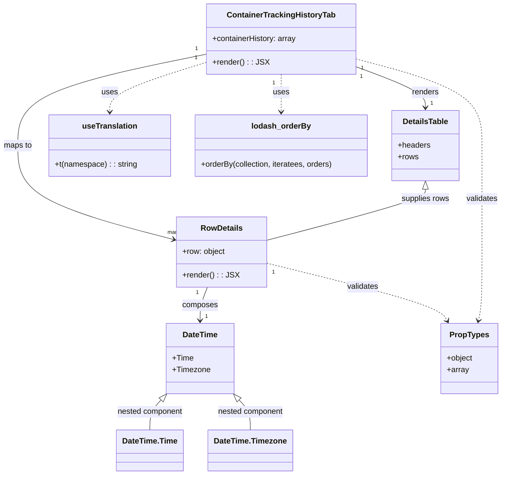

# Diagram: web/portal/src/pages/containertracking/details/components/ContainerTrackingHistoryTab.js

> Auto-generated by Obscura crawlers

## Mermaid

### SVG

<svg id="container" width="1023.708984375" xmlns="http://www.w3.org/2000/svg" class="classDiagram" height="972" viewBox="0 0 1023.708984375 972" role="graphics-document document" aria-roledescription="class"><g><defs><marker id="container_class-aggregationStart" class="marker aggregation class" refX="18" refY="7" markerWidth="190" markerHeight="240" orient="auto"><path d="M 18,7 L9,13 L1,7 L9,1 Z"></path></marker></defs><defs><marker id="container_class-aggregationEnd" class="marker aggregation class" refX="1" refY="7" markerWidth="20" markerHeight="28" orient="auto"><path d="M 18,7 L9,13 L1,7 L9,1 Z"></path></marker></defs><defs><marker id="container_class-extensionStart" class="marker extension class" refX="18" refY="7" markerWidth="190" markerHeight="240" orient="auto"><path d="M 1,7 L18,13 V 1 Z"></path></marker></defs><defs><marker id="container_class-extensionEnd" class="marker extension class" refX="1" refY="7" markerWidth="20" markerHeight="28" orient="auto"><path d="M 1,1 V 13 L18,7 Z"></path></marker></defs><defs><marker id="container_class-compositionStart" class="marker composition class" refX="18" refY="7" markerWidth="190" markerHeight="240" orient="auto"><path d="M 18,7 L9,13 L1,7 L9,1 Z"></path></marker></defs><defs><marker id="container_class-compositionEnd" class="marker composition class" refX="1" refY="7" markerWidth="20" markerHeight="28" orient="auto"><path d="M 18,7 L9,13 L1,7 L9,1 Z"></path></marker></defs><defs><marker id="container_class-dependencyStart" class="marker dependency class" refX="6" refY="7" markerWidth="190" markerHeight="240" orient="auto"><path d="M 5,7 L9,13 L1,7 L9,1 Z"></path></marker></defs><defs><marker id="container_class-dependencyEnd" class="marker dependency class" refX="13" refY="7" markerWidth="20" markerHeight="28" orient="auto"><path d="M 18,7 L9,13 L14,7 L9,1 Z"></path></marker></defs><defs><marker id="container_class-lollipopStart" class="marker lollipop class" refX="13" refY="7" markerWidth="190" markerHeight="240" orient="auto"><circle stroke="black" fill="transparent" cx="7" cy="7" r="6"></circle></marker></defs><defs><marker id="container_class-lollipopEnd" class="marker lollipop class" refX="1" refY="7" markerWidth="190" markerHeight="240" orient="auto"><circle stroke="black" fill="transparent" cx="7" cy="7" r="6"></circle></marker></defs><g class="root"><g class="clusters"></g><g class="edgePaths"><path d="M423.273,110.793L358.938,123.827C294.602,136.862,165.93,162.931,101.594,194.132C37.258,225.333,37.258,261.667,37.258,298C37.258,334.333,37.258,370.667,91.224,402.951C145.19,435.236,253.122,463.471,307.089,477.589L361.055,491.707" id="id_ContainerTrackingHistoryTab_RowDetails_1" class="edge-thickness-normal edge-pattern-solid relation" style=";;;" data-edge="true" data-et="edge" data-id="id_ContainerTrackingHistoryTab_RowDetails_1" data-points="W3sieCI6NDIzLjI3MzQzNzUsInkiOjExMC43OTI5NDEyMTA2MzgyOH0seyJ4IjozNy4yNTc4MTI1LCJ5IjoxODl9LHsieCI6MzcuMjU3ODEyNSwieSI6Mjk4fSx7IngiOjM3LjI1NzgxMjUsInkiOjQwN30seyJ4IjozNjYuODU5Mzc1LCJ5Ijo0OTMuMjI1MTE2MDE3NDM3NzZ9XQ==" marker-end="url(#container_class-dependencyEnd)"></path><path d="M727.25,136.098L751.138,144.915C775.026,153.732,822.802,171.366,846.69,185.35C870.578,199.333,870.578,209.667,870.578,214.833L870.578,220" id="id_ContainerTrackingHistoryTab_DetailsTable_2" class="edge-thickness-normal edge-pattern-solid relation" style=";;;" data-edge="true" data-et="edge" data-id="id_ContainerTrackingHistoryTab_DetailsTable_2" data-points="W3sieCI6NzI3LjI1LCJ5IjoxMzYuMDk4MjEyOTg2NjAwN30seyJ4Ijo4NzAuNTc4MTI1LCJ5IjoxODl9LHsieCI6ODcwLjU3ODEyNSwieSI6MjI2fV0=" marker-end="url(#container_class-dependencyEnd)"></path><path d="M423.273,127.25L390.169,137.542C357.064,147.833,290.854,168.417,257.749,185.375C224.645,202.333,224.645,215.667,224.645,222.333L224.645,229" id="id_ContainerTrackingHistoryTab_useTranslation_3" class="edge-thickness-normal edge-pattern-dashed relation" style=";;;" data-edge="true" data-et="edge" data-id="id_ContainerTrackingHistoryTab_useTranslation_3" data-points="W3sieCI6NDIzLjI3MzQzNzUsInkiOjEyNy4yNTAxNzI2ODY1NTcxOX0seyJ4IjoyMjQuNjQ0NTMxMjUsInkiOjE4OX0seyJ4IjoyMjQuNjQ0NTMxMjUsInkiOjIzNX1d" marker-end="url(#container_class-dependencyEnd)"></path><path d="M575.262,152L575.262,158.167C575.262,164.333,575.262,176.667,575.262,189.5C575.262,202.333,575.262,215.667,575.262,222.333L575.262,229" id="id_ContainerTrackingHistoryTab_lodash_orderBy_4" class="edge-thickness-normal edge-pattern-dashed relation" style=";;;" data-edge="true" data-et="edge" data-id="id_ContainerTrackingHistoryTab_lodash_orderBy_4" data-points="W3sieCI6NTc1LjI2MTcxODc1LCJ5IjoxNTJ9LHsieCI6NTc1LjI2MTcxODc1LCJ5IjoxODl9LHsieCI6NTc1LjI2MTcxODc1LCJ5IjoyMzV9XQ==" marker-end="url(#container_class-dependencyEnd)"></path><path d="M424.477,588L421.955,594.167C419.434,600.333,414.391,612.667,411.869,624C409.348,635.333,409.348,645.667,409.348,650.833L409.348,656" id="id_RowDetails_DateTime_5" class="edge-thickness-normal edge-pattern-solid relation" style=";;;" data-edge="true" data-et="edge" data-id="id_RowDetails_DateTime_5" data-points="W3sieCI6NDI0LjQ3NzAyODM4MzAyNzUsInkiOjU4OH0seyJ4Ijo0MDkuMzQ3NjU2MjUsInkiOjYyNX0seyJ4Ijo0MDkuMzQ3NjU2MjUsInkiOjY2Mn1d" marker-end="url(#container_class-dependencyEnd)"></path><path d="M540.977,537.482L600.089,552.069C659.201,566.655,777.424,595.827,839.501,615.708C901.577,635.588,907.505,646.176,910.469,651.471L913.434,656.765" id="id_RowDetails_PropTypes_6" class="edge-thickness-normal edge-pattern-dashed relation" style=";;;" data-edge="true" data-et="edge" data-id="id_RowDetails_PropTypes_6" data-points="W3sieCI6NTQwLjk3NjU2MjUsInkiOjUzNy40ODIzMDA2MTEwNTU2fSx7IngiOjg5NS42NDg0Mzc1LCJ5Ijo2MjV9LHsieCI6OTE2LjM2NDgwNDMyOTEyODQsInkiOjY2Mn1d" marker-end="url(#container_class-dependencyEnd)"></path><path d="M727.25,120.629L769.879,132.024C812.507,143.419,897.764,166.21,940.393,195.771C983.021,225.333,983.021,261.667,983.021,298C983.021,334.333,983.021,370.667,983.021,407C983.021,443.333,983.021,479.667,983.021,516C983.021,552.333,983.021,588.667,981.766,612.028C980.511,635.389,978,645.779,976.744,650.973L975.489,656.168" id="id_ContainerTrackingHistoryTab_PropTypes_7" class="edge-thickness-normal edge-pattern-dashed relation" style=";;;" data-edge="true" data-et="edge" data-id="id_ContainerTrackingHistoryTab_PropTypes_7" data-points="W3sieCI6NzI3LjI1LCJ5IjoxMjAuNjI4NjM0OTI4ODQ2MTd9LHsieCI6OTgzLjAyMTQ4NDM3NSwieSI6MTg5fSx7IngiOjk4My4wMjE0ODQzNzUsInkiOjI5OH0seyJ4Ijo5ODMuMDIxNDg0Mzc1LCJ5Ijo0MDd9LHsieCI6OTgzLjAyMTQ4NDM3NSwieSI6NTE2fSx7IngiOjk4My4wMjE0ODQzNzUsInkiOjYyNX0seyJ4Ijo5NzQuMDc5MTEwNTIxNzg5LCJ5Ijo2NjJ9XQ==" marker-end="url(#container_class-dependencyEnd)"></path><path d="M870.578,387.25L870.578,390.542C870.578,393.833,870.578,400.417,815.645,418.079C760.711,435.742,650.844,464.483,595.91,478.854L540.977,493.225" id="id_DetailsTable_RowDetails_8" class="edge-thickness-normal edge-pattern-solid relation" style=";;;" data-edge="true" data-et="edge" data-id="id_DetailsTable_RowDetails_8" data-points="W3sieCI6ODcwLjU3ODEyNSwieSI6MzcwfSx7IngiOjg3MC41NzgxMjUsInkiOjQwN30seyJ4Ijo1NDAuOTc2NTYyNSwieSI6NDkzLjIyNTExNjAxNzQzNzc2fV0=" marker-start="url(#container_class-extensionStart)"></path><path d="M332.098,818.749L328.414,822.79C324.729,826.832,317.361,834.916,313.676,845.125C309.992,855.333,309.992,867.667,309.992,873.833L309.992,880" id="id_DateTime_DateTime.Time_9" class="edge-thickness-normal edge-pattern-solid relation" style=";;;" data-edge="true" data-et="edge" data-id="id_DateTime_DateTime.Time_9" data-points="W3sieCI6MzQzLjcxODM1NTc5MTI4NDQsInkiOjgwNn0seyJ4IjozMDkuOTkyMTg3NSwieSI6ODQzfSx7IngiOjMwOS45OTIxODc1LCJ5Ijo4ODB9XQ==" marker-start="url(#container_class-extensionStart)"></path><path d="M486.597,818.749L490.282,822.79C493.966,826.832,501.335,834.916,505.019,845.125C508.703,855.333,508.703,867.667,508.703,873.833L508.703,880" id="id_DateTime_DateTime.Timezone_10" class="edge-thickness-normal edge-pattern-solid relation" style=";;;" data-edge="true" data-et="edge" data-id="id_DateTime_DateTime.Timezone_10" data-points="W3sieCI6NDc0Ljk3Njk1NjcwODcxNTYsInkiOjgwNn0seyJ4Ijo1MDguNzAzMTI1LCJ5Ijo4NDN9LHsieCI6NTA4LjcwMzEyNSwieSI6ODgwfV0=" marker-start="url(#container_class-extensionStart)"></path></g><g class="edgeLabels"><g class="edgeLabel" transform="translate(37.2578125, 298)"><g class="label" data-id="id_ContainerTrackingHistoryTab_RowDetails_1" transform="translate(-29.2578125, -12)"><foreignObject width="58.515625" height="24">

maps to

</foreignObject></g></g><g class="edgeLabel" transform="translate(870.578125, 189)"><g class="label" data-id="id_ContainerTrackingHistoryTab_DetailsTable_2" transform="translate(-27.75, -12)"><foreignObject width="55.5" height="24">

renders

</foreignObject></g></g><g class="edgeLabel" transform="translate(224.64453125, 189)"><g class="label" data-id="id_ContainerTrackingHistoryTab_useTranslation_3" transform="translate(-16.4921875, -12)"><foreignObject width="32.984375" height="24">

uses

</foreignObject></g></g><g class="edgeLabel" transform="translate(575.26171875, 189)"><g class="label" data-id="id_ContainerTrackingHistoryTab_lodash_orderBy_4" transform="translate(-16.4921875, -12)"><foreignObject width="32.984375" height="24">

uses

</foreignObject></g></g><g class="edgeLabel" transform="translate(409.34765625, 625)"><g class="label" data-id="id_RowDetails_DateTime_5" transform="translate(-36.453125, -12)"><foreignObject width="72.90625" height="24">

composes

</foreignObject></g></g><g class="edgeLabel" transform="translate(738.89747, 586.32063)"><g class="label" data-id="id_RowDetails_PropTypes_6" transform="translate(-32.6875, -12)"><foreignObject width="65.375" height="24">

validates

</foreignObject></g></g><g class="edgeLabel" transform="translate(983.021484375, 407)"><g class="label" data-id="id_ContainerTrackingHistoryTab_PropTypes_7" transform="translate(-32.6875, -12)"><foreignObject width="65.375" height="24">

validates

</foreignObject></g></g><g class="edgeLabel" transform="translate(870.578125, 407)"><g class="label" data-id="id_DetailsTable_RowDetails_8" transform="translate(-49.7109375, -12)"><foreignObject width="99.421875" height="24">

supplies rows

</foreignObject></g></g><g class="edgeLabel" transform="translate(309.9921875, 843)"><g class="label" data-id="id_DateTime_DateTime.Time_9" transform="translate(-68.0625, -12)"><foreignObject width="136.125" height="24">

nested component

</foreignObject></g></g><g class="edgeLabel" transform="translate(508.703125, 843)"><g class="label" data-id="id_DateTime_DateTime.Timezone_10" transform="translate(-68.0625, -12)"><foreignObject width="136.125" height="24">

nested component

</foreignObject></g></g><g class="edgeTerminals" transform="translate(403.14341054429696, 99.56654449240735)"><g class="inner" transform="translate(0, 0)"><foreignObject style="width: 9px; height: 12px;">
1
</foreignObject></g></g><g class="edgeTerminals" transform="translate(738.4734729169327, 156.22987164299104)"><g class="inner" transform="translate(0, 0)"><foreignObject style="width: 9px; height: 12px;">
1
</foreignObject></g></g><g class="edgeTerminals" transform="translate(402.1093645998662, 118.12153231388217)"><g class="inner" transform="translate(0, 0)"><foreignObject style="width: 9px; height: 12px;">
1
</foreignObject></g></g><g class="edgeTerminals" transform="translate(560.261719375, 169.50000053571426)"><g class="inner" transform="translate(0, 0)"><foreignObject style="width: 9px; height: 12px;">
1
</foreignObject></g></g><g class="edgeTerminals" transform="translate(403.9694509682036, 598.5208989845503)"><g class="inner" transform="translate(0, 0)"><foreignObject style="width: 9px; height: 12px;">
1
</foreignObject></g></g><g class="edgeTerminals" transform="translate(554.3733783021682, 556.237973520058)"><g class="inner" transform="translate(0, 0)"><foreignObject style="width: 9px; height: 12px;">
1
</foreignObject></g></g><g class="edgeTerminals" transform="translate(740.2826847912488, 139.63913760204107)"><g class="inner" transform="translate(0, 0)"><foreignObject style="width: 9px; height: 12px;">
1
</foreignObject></g></g><g class="edgeTerminals" transform="translate(348.72541773069923, 469.28444022223846)"><g class="inner" transform="translate(0, 0)"></g><foreignObject style="width: 36px; height: 12px;">
many
</foreignObject></g><g class="edgeTerminals" transform="translate(880.5781274999998, 203.50000214285714)"><g class="inner" transform="translate(0, 0)"></g><foreignObject style="width: 9px; height: 12px;">
1
</foreignObject></g><g class="edgeTerminals" transform="translate(419.3476581249999, 639.5000016071428)"><g class="inner" transform="translate(0, 0)"></g><foreignObject style="width: 9px; height: 12px;">
1
</foreignObject></g></g><g class="nodes"><g class="node default" id="classId-RowDetails-0" transform="translate(453.91796875, 516)"><g class="basic label-container"><path d="M-87.05859375 -72 L87.05859375 -72 L87.05859375 72 L-87.05859375 72" stroke="none" stroke-width="0" fill="#ECECFF" style=""></path><path d="M-87.05859375 -72 C-31.747974812261774 -72, 23.562644125476453 -72, 87.05859375 -72 M-87.05859375 -72 C-23.18315562783806 -72, 40.69228249432388 -72, 87.05859375 -72 M87.05859375 -72 C87.05859375 -40.73504618104412, 87.05859375 -9.470092362088238, 87.05859375 72 M87.05859375 -72 C87.05859375 -26.860510368086537, 87.05859375 18.278979263826926, 87.05859375 72 M87.05859375 72 C30.472484544105058 72, -26.113624661789885 72, -87.05859375 72 M87.05859375 72 C41.66511814790734 72, -3.728357454185314 72, -87.05859375 72 M-87.05859375 72 C-87.05859375 34.92986877134113, -87.05859375 -2.1402624573177462, -87.05859375 -72 M-87.05859375 72 C-87.05859375 14.442387755004411, -87.05859375 -43.11522448999118, -87.05859375 -72" stroke="#9370DB" stroke-width="1.3" fill="none" stroke-dasharray="0 0" style=""></path></g><g class="annotation-group text" transform="translate(0, -48)"></g><g class="label-group text" transform="translate(-40.9765625, -48)"><g class="label" style="font-weight: bolder" transform="translate(0,-12)"><foreignObject width="81.953125" height="24">

RowDetails

</foreignObject></g></g><g class="members-group text" transform="translate(-75.05859375, 0)"><g class="label" style="" transform="translate(0,-12)"><foreignObject width="88.125" height="24">

+row: object

</foreignObject></g></g><g class="methods-group text" transform="translate(-75.05859375, 48)"><g class="label" style="" transform="translate(0,-12)"><foreignObject width="109.140625" height="24">

+render() : : JSX

</foreignObject></g></g><g class="divider" style=""><path d="M-87.05859375 -24 C-31.88233685861512 -24, 23.293920032769762 -24, 87.05859375 -24 M-87.05859375 -24 C-21.033507266757994 -24, 44.99157921648401 -24, 87.05859375 -24" stroke="#9370DB" stroke-width="1.3" fill="none" stroke-dasharray="0 0" style=""></path></g><g class="divider" style=""><path d="M-87.05859375 24 C-47.15619156444761 24, -7.25378937889522 24, 87.05859375 24 M-87.05859375 24 C-35.756973923563514 24, 15.544645902872972 24, 87.05859375 24" stroke="#9370DB" stroke-width="1.3" fill="none" stroke-dasharray="0 0" style=""></path></g></g><g class="node default" id="classId-ContainerTrackingHistoryTab-1" transform="translate(575.26171875, 80)"><g class="basic label-container"><path d="M-151.98828125 -72 L151.98828125 -72 L151.98828125 72 L-151.98828125 72" stroke="none" stroke-width="0" fill="#ECECFF" style=""></path><path d="M-151.98828125 -72 C-85.94459263156499 -72, -19.900904013129974 -72, 151.98828125 -72 M-151.98828125 -72 C-85.11678786725489 -72, -18.24529448450977 -72, 151.98828125 -72 M151.98828125 -72 C151.98828125 -31.221509843598866, 151.98828125 9.556980312802267, 151.98828125 72 M151.98828125 -72 C151.98828125 -14.570228484735907, 151.98828125 42.85954303052819, 151.98828125 72 M151.98828125 72 C60.48397464904636 72, -31.02033195190728 72, -151.98828125 72 M151.98828125 72 C52.37199036115503 72, -47.244300527689944 72, -151.98828125 72 M-151.98828125 72 C-151.98828125 30.95698121611001, -151.98828125 -10.086037567779982, -151.98828125 -72 M-151.98828125 72 C-151.98828125 15.747113409363806, -151.98828125 -40.50577318127239, -151.98828125 -72" stroke="#9370DB" stroke-width="1.3" fill="none" stroke-dasharray="0 0" style=""></path></g><g class="annotation-group text" transform="translate(0, -48)"></g><g class="label-group text" transform="translate(-106.0234375, -48)"><g class="label" style="font-weight: bolder" transform="translate(0,-12)"><foreignObject width="212.046875" height="24">

ContainerTrackingHistoryTab

</foreignObject></g></g><g class="members-group text" transform="translate(-139.98828125, 0)"><g class="label" style="" transform="translate(0,-12)"><foreignObject width="173.953125" height="24">

+containerHistory: array

</foreignObject></g></g><g class="methods-group text" transform="translate(-139.98828125, 48)"><g class="label" style="" transform="translate(0,-12)"><foreignObject width="109.140625" height="24">

+render() : : JSX

</foreignObject></g></g><g class="divider" style=""><path d="M-151.98828125 -24 C-52.58699148450002 -24, 46.814298280999964 -24, 151.98828125 -24 M-151.98828125 -24 C-90.44957100721527 -24, -28.910860764430538 -24, 151.98828125 -24" stroke="#9370DB" stroke-width="1.3" fill="none" stroke-dasharray="0 0" style=""></path></g><g class="divider" style=""><path d="M-151.98828125 24 C-43.51529295513771 24, 64.95769533972458 24, 151.98828125 24 M-151.98828125 24 C-33.738490961496026 24, 84.51129932700795 24, 151.98828125 24" stroke="#9370DB" stroke-width="1.3" fill="none" stroke-dasharray="0 0" style=""></path></g></g><g class="node default" id="classId-DetailsTable-2" transform="translate(870.578125, 298)"><g class="basic label-container"><path d="M-67.828125 -72 L67.828125 -72 L67.828125 72 L-67.828125 72" stroke="none" stroke-width="0" fill="#ECECFF" style=""></path><path d="M-67.828125 -72 C-24.140354977225208 -72, 19.547415045549585 -72, 67.828125 -72 M-67.828125 -72 C-27.57093878735663 -72, 12.686247425286737 -72, 67.828125 -72 M67.828125 -72 C67.828125 -26.411724179723677, 67.828125 19.176551640552645, 67.828125 72 M67.828125 -72 C67.828125 -27.305228566465765, 67.828125 17.38954286706847, 67.828125 72 M67.828125 72 C34.096861619095435 72, 0.36559823819087 72, -67.828125 72 M67.828125 72 C35.00975838247605 72, 2.191391764952101 72, -67.828125 72 M-67.828125 72 C-67.828125 19.87901246744247, -67.828125 -32.24197506511506, -67.828125 -72 M-67.828125 72 C-67.828125 27.093272996720586, -67.828125 -17.81345400655883, -67.828125 -72" stroke="#9370DB" stroke-width="1.3" fill="none" stroke-dasharray="0 0" style=""></path></g><g class="annotation-group text" transform="translate(0, -48)"></g><g class="label-group text" transform="translate(-45.328125, -48)"><g class="label" style="font-weight: bolder" transform="translate(0,-12)"><foreignObject width="90.65625" height="24">

DetailsTable

</foreignObject></g></g><g class="members-group text" transform="translate(-55.828125, 0)"><g class="label" style="" transform="translate(0,-12)"><foreignObject width="66.328125" height="24">

+headers

</foreignObject></g><g class="label" style="" transform="translate(0,12)"><foreignObject width="41.96875" height="24">

+rows

</foreignObject></g></g><g class="methods-group text" transform="translate(-55.828125, 72)"></g><g class="divider" style=""><path d="M-67.828125 -24 C-20.25277280301517 -24, 27.32257939396966 -24, 67.828125 -24 M-67.828125 -24 C-14.77741066493752 -24, 38.27330367012496 -24, 67.828125 -24" stroke="#9370DB" stroke-width="1.3" fill="none" stroke-dasharray="0 0" style=""></path></g><g class="divider" style=""><path d="M-67.828125 48 C-29.18633695758526 48, 9.455451084829477 48, 67.828125 48 M-67.828125 48 C-16.353505076300316 48, 35.12111484739937 48, 67.828125 48" stroke="#9370DB" stroke-width="1.3" fill="none" stroke-dasharray="0 0" style=""></path></g></g><g class="node default" id="classId-DateTime-3" transform="translate(409.34765625, 734)"><g class="basic label-container"><path d="M-67.6171875 -72 L67.6171875 -72 L67.6171875 72 L-67.6171875 72" stroke="none" stroke-width="0" fill="#ECECFF" style=""></path><path d="M-67.6171875 -72 C-38.73215169637221 -72, -9.847115892744434 -72, 67.6171875 -72 M-67.6171875 -72 C-27.508116792587586 -72, 12.600953914824828 -72, 67.6171875 -72 M67.6171875 -72 C67.6171875 -18.669244722630026, 67.6171875 34.66151055473995, 67.6171875 72 M67.6171875 -72 C67.6171875 -28.427286276375632, 67.6171875 15.145427447248736, 67.6171875 72 M67.6171875 72 C35.587743271570496 72, 3.558299043140991 72, -67.6171875 72 M67.6171875 72 C35.43828238446193 72, 3.2593772689238563 72, -67.6171875 72 M-67.6171875 72 C-67.6171875 17.075249096774805, -67.6171875 -37.84950180645039, -67.6171875 -72 M-67.6171875 72 C-67.6171875 41.287987245423324, -67.6171875 10.575974490846654, -67.6171875 -72" stroke="#9370DB" stroke-width="1.3" fill="none" stroke-dasharray="0 0" style=""></path></g><g class="annotation-group text" transform="translate(0, -48)"></g><g class="label-group text" transform="translate(-34.625, -48)"><g class="label" style="font-weight: bolder" transform="translate(0,-12)"><foreignObject width="69.25" height="24">

DateTime

</foreignObject></g></g><g class="members-group text" transform="translate(-55.6171875, 0)"><g class="label" style="" transform="translate(0,-12)"><foreignObject width="42.40625" height="24">

+Time

</foreignObject></g><g class="label" style="" transform="translate(0,12)"><foreignObject width="76.609375" height="24">

+Timezone

</foreignObject></g></g><g class="methods-group text" transform="translate(-55.6171875, 72)"></g><g class="divider" style=""><path d="M-67.6171875 -24 C-17.41485783253804 -24, 32.78747183492392 -24, 67.6171875 -24 M-67.6171875 -24 C-34.3505935097562 -24, -1.0839995195124033 -24, 67.6171875 -24" stroke="#9370DB" stroke-width="1.3" fill="none" stroke-dasharray="0 0" style=""></path></g><g class="divider" style=""><path d="M-67.6171875 48 C-26.69673256325388 48, 14.223722373492237 48, 67.6171875 48 M-67.6171875 48 C-18.102294563453327 48, 31.412598373093346 48, 67.6171875 48" stroke="#9370DB" stroke-width="1.3" fill="none" stroke-dasharray="0 0" style=""></path></g></g><g class="node default" id="classId-useTranslation-4" transform="translate(224.64453125, 298)"><g class="basic label-container"><path d="M-123.12890625 -63 L123.12890625 -63 L123.12890625 63 L-123.12890625 63" stroke="none" stroke-width="0" fill="#ECECFF" style=""></path><path d="M-123.12890625 -63 C-58.11832255095091 -63, 6.892261148098186 -63, 123.12890625 -63 M-123.12890625 -63 C-27.234292615945023 -63, 68.66032101810995 -63, 123.12890625 -63 M123.12890625 -63 C123.12890625 -18.18436521791009, 123.12890625 26.631269564179817, 123.12890625 63 M123.12890625 -63 C123.12890625 -16.46546721750571, 123.12890625 30.069065564988577, 123.12890625 63 M123.12890625 63 C53.5109298933919 63, -16.107046463216193 63, -123.12890625 63 M123.12890625 63 C48.69859834059899 63, -25.731709568802017 63, -123.12890625 63 M-123.12890625 63 C-123.12890625 21.71983444620878, -123.12890625 -19.560331107582442, -123.12890625 -63 M-123.12890625 63 C-123.12890625 29.0376138568651, -123.12890625 -4.9247722862698, -123.12890625 -63" stroke="#9370DB" stroke-width="1.3" fill="none" stroke-dasharray="0 0" style=""></path></g><g class="annotation-group text" transform="translate(0, -39)"></g><g class="label-group text" transform="translate(-54.0859375, -39)"><g class="label" style="font-weight: bolder" transform="translate(0,-12)"><foreignObject width="108.171875" height="24">

useTranslation

</foreignObject></g></g><g class="members-group text" transform="translate(-111.12890625, 9)"></g><g class="methods-group text" transform="translate(-111.12890625, 39)"><g class="label" style="" transform="translate(0,-12)"><foreignObject width="168.171875" height="24">

+t(namespace) : : string

</foreignObject></g></g><g class="divider" style=""><path d="M-123.12890625 -15 C-44.629005592346175 -15, 33.87089506530765 -15, 123.12890625 -15 M-123.12890625 -15 C-45.537741813295725 -15, 32.05342262340855 -15, 123.12890625 -15" stroke="#9370DB" stroke-width="1.3" fill="none" stroke-dasharray="0 0" style=""></path></g><g class="divider" style=""><path d="M-123.12890625 9 C-46.78489853213246 9, 29.559109185735082 9, 123.12890625 9 M-123.12890625 9 C-36.710274423528574 9, 49.70835740294285 9, 123.12890625 9" stroke="#9370DB" stroke-width="1.3" fill="none" stroke-dasharray="0 0" style=""></path></g></g><g class="node default" id="classId-lodash_orderBy-5" transform="translate(575.26171875, 298)"><g class="basic label-container"><path d="M-177.48828125 -63 L177.48828125 -63 L177.48828125 63 L-177.48828125 63" stroke="none" stroke-width="0" fill="#ECECFF" style=""></path><path d="M-177.48828125 -63 C-72.62632093231814 -63, 32.235639385363726 -63, 177.48828125 -63 M-177.48828125 -63 C-38.28352006226899 -63, 100.92124112546202 -63, 177.48828125 -63 M177.48828125 -63 C177.48828125 -37.36858590595761, 177.48828125 -11.737171811915218, 177.48828125 63 M177.48828125 -63 C177.48828125 -15.409830380590222, 177.48828125 32.180339238819556, 177.48828125 63 M177.48828125 63 C55.809158224645 63, -65.86996480071 63, -177.48828125 63 M177.48828125 63 C56.09664395291922 63, -65.29499334416155 63, -177.48828125 63 M-177.48828125 63 C-177.48828125 29.469953011521305, -177.48828125 -4.06009397695739, -177.48828125 -63 M-177.48828125 63 C-177.48828125 37.49890576183819, -177.48828125 11.997811523676376, -177.48828125 -63" stroke="#9370DB" stroke-width="1.3" fill="none" stroke-dasharray="0 0" style=""></path></g><g class="annotation-group text" transform="translate(0, -39)"></g><g class="label-group text" transform="translate(-57.7421875, -39)"><g class="label" style="font-weight: bolder" transform="translate(0,-12)"><foreignObject width="115.484375" height="24">

lodash_orderBy

</foreignObject></g></g><g class="members-group text" transform="translate(-165.48828125, 9)"></g><g class="methods-group text" transform="translate(-165.48828125, 39)"><g class="label" style="" transform="translate(0,-12)"><foreignObject width="273.234375" height="24">

+orderBy(collection, iteratees, orders)

</foreignObject></g></g><g class="divider" style=""><path d="M-177.48828125 -15 C-90.80190385887683 -15, -4.115526467753654 -15, 177.48828125 -15 M-177.48828125 -15 C-59.11060723501163 -15, 59.267066779976744 -15, 177.48828125 -15" stroke="#9370DB" stroke-width="1.3" fill="none" stroke-dasharray="0 0" style=""></path></g><g class="divider" style=""><path d="M-177.48828125 9 C-66.78260581036483 9, 43.923069629270344 9, 177.48828125 9 M-177.48828125 9 C-105.14929506829107 9, -32.810308886582135 9, 177.48828125 9" stroke="#9370DB" stroke-width="1.3" fill="none" stroke-dasharray="0 0" style=""></path></g></g><g class="node default" id="classId-PropTypes-6" transform="translate(956.677734375, 734)"><g class="basic label-container"><path d="M-57.86328125 -72 L57.86328125 -72 L57.86328125 72 L-57.86328125 72" stroke="none" stroke-width="0" fill="#ECECFF" style=""></path><path d="M-57.86328125 -72 C-15.941002911360904 -72, 25.98127542727819 -72, 57.86328125 -72 M-57.86328125 -72 C-23.225243955505704 -72, 11.412793338988592 -72, 57.86328125 -72 M57.86328125 -72 C57.86328125 -27.456936101819977, 57.86328125 17.086127796360046, 57.86328125 72 M57.86328125 -72 C57.86328125 -27.01863845411677, 57.86328125 17.962723091766463, 57.86328125 72 M57.86328125 72 C14.899921866607166 72, -28.06343751678567 72, -57.86328125 72 M57.86328125 72 C31.294095683647363 72, 4.724910117294726 72, -57.86328125 72 M-57.86328125 72 C-57.86328125 29.650775118485782, -57.86328125 -12.698449763028435, -57.86328125 -72 M-57.86328125 72 C-57.86328125 30.16004099499957, -57.86328125 -11.679918010000861, -57.86328125 -72" stroke="#9370DB" stroke-width="1.3" fill="none" stroke-dasharray="0 0" style=""></path></g><g class="annotation-group text" transform="translate(0, -48)"></g><g class="label-group text" transform="translate(-38.2578125, -48)"><g class="label" style="font-weight: bolder" transform="translate(0,-12)"><foreignObject width="76.515625" height="24">

PropTypes

</foreignObject></g></g><g class="members-group text" transform="translate(-45.86328125, 0)"><g class="label" style="" transform="translate(0,-12)"><foreignObject width="53.46875" height="24">

+object

</foreignObject></g><g class="label" style="" transform="translate(0,12)"><foreignObject width="44.578125" height="24">

+array

</foreignObject></g></g><g class="methods-group text" transform="translate(-45.86328125, 72)"></g><g class="divider" style=""><path d="M-57.86328125 -24 C-15.690668633447963 -24, 26.481943983104074 -24, 57.86328125 -24 M-57.86328125 -24 C-29.77050758369606 -24, -1.6777339173921177 -24, 57.86328125 -24" stroke="#9370DB" stroke-width="1.3" fill="none" stroke-dasharray="0 0" style=""></path></g><g class="divider" style=""><path d="M-57.86328125 48 C-32.238909840917486 48, -6.614538431834966 48, 57.86328125 48 M-57.86328125 48 C-25.81477661127043 48, 6.2337280274591365 48, 57.86328125 48" stroke="#9370DB" stroke-width="1.3" fill="none" stroke-dasharray="0 0" style=""></path></g></g><g class="node default" id="classId-DateTime.Time-7" transform="translate(309.9921875, 922)"><g class="basic label-container"><path d="M-65.7421875 -42 L65.7421875 -42 L65.7421875 42 L-65.7421875 42" stroke="none" stroke-width="0" fill="#ECECFF" style=""></path><path d="M-65.7421875 -42 C-16.849053937700774 -42, 32.04407962459845 -42, 65.7421875 -42 M-65.7421875 -42 C-22.728784588043744 -42, 20.28461832391251 -42, 65.7421875 -42 M65.7421875 -42 C65.7421875 -25.05838371449148, 65.7421875 -8.11676742898296, 65.7421875 42 M65.7421875 -42 C65.7421875 -16.844056983085768, 65.7421875 8.311886033828465, 65.7421875 42 M65.7421875 42 C33.493203750638585 42, 1.2442200012771707 42, -65.7421875 42 M65.7421875 42 C24.535261516219016 42, -16.671664467561968 42, -65.7421875 42 M-65.7421875 42 C-65.7421875 24.017472438612348, -65.7421875 6.034944877224696, -65.7421875 -42 M-65.7421875 42 C-65.7421875 23.707381166413455, -65.7421875 5.4147623328269106, -65.7421875 -42" stroke="#9370DB" stroke-width="1.3" fill="none" stroke-dasharray="0 0" style=""></path></g><g class="annotation-group text" transform="translate(0, -18)"></g><g class="label-group text" transform="translate(-53.7421875, -18)"><g class="label" style="font-weight: bolder" transform="translate(0,-12)"><foreignObject width="107.484375" height="24">

DateTime.Time

</foreignObject></g></g><g class="members-group text" transform="translate(-53.7421875, 30)"></g><g class="methods-group text" transform="translate(-53.7421875, 60)"></g><g class="divider" style=""><path d="M-65.7421875 6 C-26.504404339829918 6, 12.733378820340164 6, 65.7421875 6 M-65.7421875 6 C-33.01920930468239 6, -0.2962311093647827 6, 65.7421875 6" stroke="#9370DB" stroke-width="1.3" fill="none" stroke-dasharray="0 0" style=""></path></g><g class="divider" style=""><path d="M-65.7421875 24 C-14.345206403004234 24, 37.05177469399153 24, 65.7421875 24 M-65.7421875 24 C-38.60051430823289 24, -11.458841116465777 24, 65.7421875 24" stroke="#9370DB" stroke-width="1.3" fill="none" stroke-dasharray="0 0" style=""></path></g></g><g class="node default" id="classId-DateTime.Timezone-8" transform="translate(508.703125, 922)"><g class="basic label-container"><path d="M-82.96875 -42 L82.96875 -42 L82.96875 42 L-82.96875 42" stroke="none" stroke-width="0" fill="#ECECFF" style=""></path><path d="M-82.96875 -42 C-38.36036078722836 -42, 6.248028425543282 -42, 82.96875 -42 M-82.96875 -42 C-24.097022999152472 -42, 34.774704001695056 -42, 82.96875 -42 M82.96875 -42 C82.96875 -22.484894704338192, 82.96875 -2.969789408676384, 82.96875 42 M82.96875 -42 C82.96875 -15.031818265032229, 82.96875 11.936363469935543, 82.96875 42 M82.96875 42 C26.901924869532046 42, -29.16490026093591 42, -82.96875 42 M82.96875 42 C45.07948426207559 42, 7.190218524151177 42, -82.96875 42 M-82.96875 42 C-82.96875 17.549146231411033, -82.96875 -6.901707537177934, -82.96875 -42 M-82.96875 42 C-82.96875 10.441562661540118, -82.96875 -21.116874676919764, -82.96875 -42" stroke="#9370DB" stroke-width="1.3" fill="none" stroke-dasharray="0 0" style=""></path></g><g class="annotation-group text" transform="translate(0, -18)"></g><g class="label-group text" transform="translate(-70.96875, -18)"><g class="label" style="font-weight: bolder" transform="translate(0,-12)"><foreignObject width="141.9375" height="24">

DateTime.Timezone

</foreignObject></g></g><g class="members-group text" transform="translate(-70.96875, 30)"></g><g class="methods-group text" transform="translate(-70.96875, 60)"></g><g class="divider" style=""><path d="M-82.96875 6 C-36.4466471085845 6, 10.075455782831 6, 82.96875 6 M-82.96875 6 C-43.94496596046589 6, -4.921181920931787 6, 82.96875 6" stroke="#9370DB" stroke-width="1.3" fill="none" stroke-dasharray="0 0" style=""></path></g><g class="divider" style=""><path d="M-82.96875 24 C-31.24196172142328 24, 20.48482655715344 24, 82.96875 24 M-82.96875 24 C-49.296891422710864 24, -15.625032845421728 24, 82.96875 24" stroke="#9370DB" stroke-width="1.3" fill="none" stroke-dasharray="0 0" style=""></path></g></g></g></g></g></svg>
