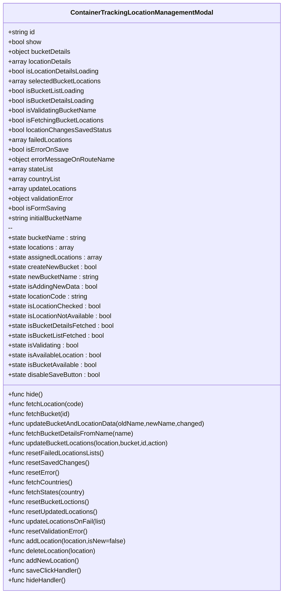

# Diagram: web/portal/src/pages/containertracking/details/components/ContainerTrackingLocationManagementModal.js


> Auto-generated by Obscura crawlers

## Diagram 1



### SVG

<svg id="container" width="691.3671875" xmlns="http://www.w3.org/2000/svg" class="classDiagram" height="1456" viewBox="0 0 691.3671875 1456" role="graphics-document document" aria-roledescription="class"><style>#container{font-family:"trebuchet ms",verdana,arial,sans-serif;font-size:16px;fill:#333;}@keyframes edge-animation-frame{from{stroke-dashoffset:0;}}@keyframes dash{to{stroke-dashoffset:0;}}#container .edge-animation-slow{stroke-dasharray:9,5!important;stroke-dashoffset:900;animation:dash 50s linear infinite;stroke-linecap:round;}#container .edge-animation-fast{stroke-dasharray:9,5!important;stroke-dashoffset:900;animation:dash 20s linear infinite;stroke-linecap:round;}#container .error-icon{fill:#552222;}#container .error-text{fill:#552222;stroke:#552222;}#container .edge-thickness-normal{stroke-width:1px;}#container .edge-thickness-thick{stroke-width:3.5px;}#container .edge-pattern-solid{stroke-dasharray:0;}#container .edge-thickness-invisible{stroke-width:0;fill:none;}#container .edge-pattern-dashed{stroke-dasharray:3;}#container .edge-pattern-dotted{stroke-dasharray:2;}#container .marker{fill:#333333;stroke:#333333;}#container .marker.cross{stroke:#333333;}#container svg{font-family:"trebuchet ms",verdana,arial,sans-serif;font-size:16px;}#container p{margin:0;}#container g.classGroup text{fill:#9370DB;stroke:none;font-family:"trebuchet ms",verdana,arial,sans-serif;font-size:10px;}#container g.classGroup text .title{font-weight:bolder;}#container .nodeLabel,#container .edgeLabel{color:#131300;}#container .edgeLabel .label rect{fill:#ECECFF;}#container .label text{fill:#131300;}#container .labelBkg{background:#ECECFF;}#container .edgeLabel .label span{background:#ECECFF;}#container .classTitle{font-weight:bolder;}#container .node rect,#container .node circle,#container .node ellipse,#container .node polygon,#container .node path{fill:#ECECFF;stroke:#9370DB;stroke-width:1px;}#container .divider{stroke:#9370DB;stroke-width:1;}#container g.clickable{cursor:pointer;}#container g.classGroup rect{fill:#ECECFF;stroke:#9370DB;}#container g.classGroup line{stroke:#9370DB;stroke-width:1;}#container .classLabel .box{stroke:none;stroke-width:0;fill:#ECECFF;opacity:0.5;}#container .classLabel .label{fill:#9370DB;font-size:10px;}#container .relation{stroke:#333333;stroke-width:1;fill:none;}#container .dashed-line{stroke-dasharray:3;}#container .dotted-line{stroke-dasharray:1 2;}#container #compositionStart,#container .composition{fill:#333333!important;stroke:#333333!important;stroke-width:1;}#container #compositionEnd,#container .composition{fill:#333333!important;stroke:#333333!important;stroke-width:1;}#container #dependencyStart,#container .dependency{fill:#333333!important;stroke:#333333!important;stroke-width:1;}#container #dependencyStart,#container .dependency{fill:#333333!important;stroke:#333333!important;stroke-width:1;}#container #extensionStart,#container .extension{fill:transparent!important;stroke:#333333!important;stroke-width:1;}#container #extensionEnd,#container .extension{fill:transparent!important;stroke:#333333!important;stroke-width:1;}#container #aggregationStart,#container .aggregation{fill:transparent!important;stroke:#333333!important;stroke-width:1;}#container #aggregationEnd,#container .aggregation{fill:transparent!important;stroke:#333333!important;stroke-width:1;}#container #lollipopStart,#container .lollipop{fill:#ECECFF!important;stroke:#333333!important;stroke-width:1;}#container #lollipopEnd,#container .lollipop{fill:#ECECFF!important;stroke:#333333!important;stroke-width:1;}#container .edgeTerminals{font-size:11px;line-height:initial;}#container .classTitleText{text-anchor:middle;font-size:18px;fill:#333;}#container .label-icon{display:inline-block;height:1em;overflow:visible;vertical-align:-0.125em;}#container .node .label-icon path{fill:currentColor;stroke:revert;stroke-width:revert;}#container :root{--mermaid-font-family:"trebuchet ms",verdana,arial,sans-serif;}</style><g><defs><marker id="container_class-aggregationStart" class="marker aggregation class" refX="18" refY="7" markerWidth="190" markerHeight="240" orient="auto"><path d="M 18,7 L9,13 L1,7 L9,1 Z"></path></marker></defs><defs><marker id="container_class-aggregationEnd" class="marker aggregation class" refX="1" refY="7" markerWidth="20" markerHeight="28" orient="auto"><path d="M 18,7 L9,13 L1,7 L9,1 Z"></path></marker></defs><defs><marker id="container_class-extensionStart" class="marker extension class" refX="18" refY="7" markerWidth="190" markerHeight="240" orient="auto"><path d="M 1,7 L18,13 V 1 Z"></path></marker></defs><defs><marker id="container_class-extensionEnd" class="marker extension class" refX="1" refY="7" markerWidth="20" markerHeight="28" orient="auto"><path d="M 1,1 V 13 L18,7 Z"></path></marker></defs><defs><marker id="container_class-compositionStart" class="marker composition class" refX="18" refY="7" markerWidth="190" markerHeight="240" orient="auto"><path d="M 18,7 L9,13 L1,7 L9,1 Z"></path></marker></defs><defs><marker id="container_class-compositionEnd" class="marker composition class" refX="1" refY="7" markerWidth="20" markerHeight="28" orient="auto"><path d="M 18,7 L9,13 L1,7 L9,1 Z"></path></marker></defs><defs><marker id="container_class-dependencyStart" class="marker dependency class" refX="6" refY="7" markerWidth="190" markerHeight="240" orient="auto"><path d="M 5,7 L9,13 L1,7 L9,1 Z"></path></marker></defs><defs><marker id="container_class-dependencyEnd" class="marker dependency class" refX="13" refY="7" markerWidth="20" markerHeight="28" orient="auto"><path d="M 18,7 L9,13 L14,7 L9,1 Z"></path></marker></defs><defs><marker id="container_class-lollipopStart" class="marker lollipop class" refX="13" refY="7" markerWidth="190" markerHeight="240" orient="auto"><circle stroke="black" fill="transparent" cx="7" cy="7" r="6"></circle></marker></defs><defs><marker id="container_class-lollipopEnd" class="marker lollipop class" refX="1" refY="7" markerWidth="190" markerHeight="240" orient="auto"><circle stroke="black" fill="transparent" cx="7" cy="7" r="6"></circle></marker></defs><g class="root"><g class="clusters"></g><g class="edgePaths"></g><g class="edgeLabels"></g><g class="nodes"><g class="node default" id="classId-ContainerTrackingLocationManagementModal-0" transform="translate(345.68359375, 728)"><g class="basic label-container"><path d="M-337.68359375 -720 L337.68359375 -720 L337.68359375 720 L-337.68359375 720" stroke="none" stroke-width="0" fill="#ECECFF" style=""></path><path d="M-337.68359375 -720 C-85.88937404408381 -720, 165.90484566183238 -720, 337.68359375 -720 M-337.68359375 -720 C-121.46770226933279 -720, 94.74818921133442 -720, 337.68359375 -720 M337.68359375 -720 C337.68359375 -191.68076709134994, 337.68359375 336.63846581730013, 337.68359375 720 M337.68359375 -720 C337.68359375 -380.1648498594795, 337.68359375 -40.32969971895898, 337.68359375 720 M337.68359375 720 C190.50892095372998 720, 43.33424815745997 720, -337.68359375 720 M337.68359375 720 C189.32511824215305 720, 40.966642734306106 720, -337.68359375 720 M-337.68359375 720 C-337.68359375 197.84056092852188, -337.68359375 -324.31887814295624, -337.68359375 -720 M-337.68359375 720 C-337.68359375 157.43918272988685, -337.68359375 -405.1216345402263, -337.68359375 -720" stroke="#9370DB" stroke-width="1.3" fill="none" stroke-dasharray="0 0" style=""></path></g><g class="annotation-group text" transform="translate(0, -696)"></g><g class="label-group text" transform="translate(-167.4296875, -696)"><g class="label" style="font-weight: bolder" transform="translate(0,-12)"><foreignObject width="334.859375" height="24"><div xmlns="http://www.w3.org/1999/xhtml" style="display: table-cell; white-space: nowrap; line-height: 1.5; max-width: 381px; text-align: center;"><span class="nodeLabel markdown-node-label" style=""><p>ContainerTrackingLocationManagementModal</p></span></div></foreignObject></g></g><g class="members-group text" transform="translate(-325.68359375, -648)"><g class="label" style="" transform="translate(0,-12)"><foreignObject width="67.9375" height="24"><div xmlns="http://www.w3.org/1999/xhtml" style="display: table-cell; white-space: nowrap; line-height: 1.5; max-width: 125px; text-align: center;"><span class="nodeLabel markdown-node-label" style=""><p>+string id</p></span></div></foreignObject></g><g class="label" style="" transform="translate(0,12)"><foreignObject width="82.78125" height="24"><div xmlns="http://www.w3.org/1999/xhtml" style="display: table-cell; white-space: nowrap; line-height: 1.5; max-width: 141px; text-align: center;"><span class="nodeLabel markdown-node-label" style=""><p>+bool show</p></span></div></foreignObject></g><g class="label" style="" transform="translate(0,36)"><foreignObject width="156.78125" height="24"><div xmlns="http://www.w3.org/1999/xhtml" style="display: table-cell; white-space: nowrap; line-height: 1.5; max-width: 214px; text-align: center;"><span class="nodeLabel markdown-node-label" style=""><p>+object bucketDetails</p></span></div></foreignObject></g><g class="label" style="" transform="translate(0,60)"><foreignObject width="158.046875" height="24"><div xmlns="http://www.w3.org/1999/xhtml" style="display: table-cell; white-space: nowrap; line-height: 1.5; max-width: 215px; text-align: center;"><span class="nodeLabel markdown-node-label" style=""><p>+array locationDetails</p></span></div></foreignObject></g><g class="label" style="" transform="translate(0,84)"><foreignObject width="226.5" height="24"><div xmlns="http://www.w3.org/1999/xhtml" style="display: table-cell; white-space: nowrap; line-height: 1.5; max-width: 285px; text-align: center;"><span class="nodeLabel markdown-node-label" style=""><p>+bool isLocationDetailsLoading</p></span></div></foreignObject></g><g class="label" style="" transform="translate(0,108)"><foreignObject width="228.625" height="24"><div xmlns="http://www.w3.org/1999/xhtml" style="display: table-cell; white-space: nowrap; line-height: 1.5; max-width: 286px; text-align: center;"><span class="nodeLabel markdown-node-label" style=""><p>+array selectedBucketLocations</p></span></div></foreignObject></g><g class="label" style="" transform="translate(0,132)"><foreignObject width="189.28125" height="24"><div xmlns="http://www.w3.org/1999/xhtml" style="display: table-cell; white-space: nowrap; line-height: 1.5; max-width: 247px; text-align: center;"><span class="nodeLabel markdown-node-label" style=""><p>+bool isBucketListLoading</p></span></div></foreignObject></g><g class="label" style="" transform="translate(0,156)"><foreignObject width="213.625" height="24"><div xmlns="http://www.w3.org/1999/xhtml" style="display: table-cell; white-space: nowrap; line-height: 1.5; max-width: 272px; text-align: center;"><span class="nodeLabel markdown-node-label" style=""><p>+bool isBucketDetailsLoading</p></span></div></foreignObject></g><g class="label" style="" transform="translate(0,180)"><foreignObject width="220.640625" height="24"><div xmlns="http://www.w3.org/1999/xhtml" style="display: table-cell; white-space: nowrap; line-height: 1.5; max-width: 278px; text-align: center;"><span class="nodeLabel markdown-node-label" style=""><p>+bool isValidatingBucketName</p></span></div></foreignObject></g><g class="label" style="" transform="translate(0,204)"><foreignObject width="236.703125" height="24"><div xmlns="http://www.w3.org/1999/xhtml" style="display: table-cell; white-space: nowrap; line-height: 1.5; max-width: 294px; text-align: center;"><span class="nodeLabel markdown-node-label" style=""><p>+bool isFetchingBucketLocations</p></span></div></foreignObject></g><g class="label" style="" transform="translate(0,228)"><foreignObject width="253.703125" height="24"><div xmlns="http://www.w3.org/1999/xhtml" style="display: table-cell; white-space: nowrap; line-height: 1.5; max-width: 311px; text-align: center;"><span class="nodeLabel markdown-node-label" style=""><p>+bool locationChangesSavedStatus</p></span></div></foreignObject></g><g class="label" style="" transform="translate(0,252)"><foreignObject width="159.53125" height="24"><div xmlns="http://www.w3.org/1999/xhtml" style="display: table-cell; white-space: nowrap; line-height: 1.5; max-width: 217px; text-align: center;"><span class="nodeLabel markdown-node-label" style=""><p>+array failedLocations</p></span></div></foreignObject></g><g class="label" style="" transform="translate(0,276)"><foreignObject width="147.046875" height="24"><div xmlns="http://www.w3.org/1999/xhtml" style="display: table-cell; white-space: nowrap; line-height: 1.5; max-width: 204px; text-align: center;"><span class="nodeLabel markdown-node-label" style=""><p>+bool isErrorOnSave</p></span></div></foreignObject></g><g class="label" style="" transform="translate(0,300)"><foreignObject width="259.796875" height="24"><div xmlns="http://www.w3.org/1999/xhtml" style="display: table-cell; white-space: nowrap; line-height: 1.5; max-width: 317px; text-align: center;"><span class="nodeLabel markdown-node-label" style=""><p>+object errorMessageOnRouteName</p></span></div></foreignObject></g><g class="label" style="" transform="translate(0,324)"><foreignObject width="110.640625" height="24"><div xmlns="http://www.w3.org/1999/xhtml" style="display: table-cell; white-space: nowrap; line-height: 1.5; max-width: 168px; text-align: center;"><span class="nodeLabel markdown-node-label" style=""><p>+array stateList</p></span></div></foreignObject></g><g class="label" style="" transform="translate(0,348)"><foreignObject width="129.734375" height="24"><div xmlns="http://www.w3.org/1999/xhtml" style="display: table-cell; white-space: nowrap; line-height: 1.5; max-width: 187px; text-align: center;"><span class="nodeLabel markdown-node-label" style=""><p>+array countryList</p></span></div></foreignObject></g><g class="label" style="" transform="translate(0,372)"><foreignObject width="169.75" height="24"><div xmlns="http://www.w3.org/1999/xhtml" style="display: table-cell; white-space: nowrap; line-height: 1.5; max-width: 227px; text-align: center;"><span class="nodeLabel markdown-node-label" style=""><p>+array updateLocations</p></span></div></foreignObject></g><g class="label" style="" transform="translate(0,396)"><foreignObject width="166.140625" height="24"><div xmlns="http://www.w3.org/1999/xhtml" style="display: table-cell; white-space: nowrap; line-height: 1.5; max-width: 224px; text-align: center;"><span class="nodeLabel markdown-node-label" style=""><p>+object validationError</p></span></div></foreignObject></g><g class="label" style="" transform="translate(0,420)"><foreignObject width="140.890625" height="24"><div xmlns="http://www.w3.org/1999/xhtml" style="display: table-cell; white-space: nowrap; line-height: 1.5; max-width: 199px; text-align: center;"><span class="nodeLabel markdown-node-label" style=""><p>+bool isFormSaving</p></span></div></foreignObject></g><g class="label" style="" transform="translate(0,444)"><foreignObject width="187.078125" height="24"><div xmlns="http://www.w3.org/1999/xhtml" style="display: table-cell; white-space: nowrap; line-height: 1.5; max-width: 244px; text-align: center;"><span class="nodeLabel markdown-node-label" style=""><p>+string initialBucketName</p></span></div></foreignObject></g><g class="label" style="" transform="translate(0,468)"><foreignObject width="12.90625" height="24"><div xmlns="http://www.w3.org/1999/xhtml" style="display: table-cell; white-space: nowrap; line-height: 1.5; max-width: 70px; text-align: center;"><span class="nodeLabel markdown-node-label" style=""><p>--</p></span></div></foreignObject></g><g class="label" style="" transform="translate(0,492)"><foreignObject width="193.359375" height="24"><div xmlns="http://www.w3.org/1999/xhtml" style="display: table-cell; white-space: nowrap; line-height: 1.5; max-width: 251px; text-align: center;"><span class="nodeLabel markdown-node-label" style=""><p>+state bucketName : string</p></span></div></foreignObject></g><g class="label" style="" transform="translate(0,516)"><foreignObject width="164.109375" height="24"><div xmlns="http://www.w3.org/1999/xhtml" style="display: table-cell; white-space: nowrap; line-height: 1.5; max-width: 222px; text-align: center;"><span class="nodeLabel markdown-node-label" style=""><p>+state locations : array</p></span></div></foreignObject></g><g class="label" style="" transform="translate(0,540)"><foreignObject width="230.890625" height="24"><div xmlns="http://www.w3.org/1999/xhtml" style="display: table-cell; white-space: nowrap; line-height: 1.5; max-width: 288px; text-align: center;"><span class="nodeLabel markdown-node-label" style=""><p>+state assignedLocations : array</p></span></div></foreignObject></g><g class="label" style="" transform="translate(0,564)"><foreignObject width="218.75" height="24"><div xmlns="http://www.w3.org/1999/xhtml" style="display: table-cell; white-space: nowrap; line-height: 1.5; max-width: 276px; text-align: center;"><span class="nodeLabel markdown-node-label" style=""><p>+state createNewBucket : bool</p></span></div></foreignObject></g><g class="label" style="" transform="translate(0,588)"><foreignObject width="223.140625" height="24"><div xmlns="http://www.w3.org/1999/xhtml" style="display: table-cell; white-space: nowrap; line-height: 1.5; max-width: 281px; text-align: center;"><span class="nodeLabel markdown-node-label" style=""><p>+state newBucketName : string</p></span></div></foreignObject></g><g class="label" style="" transform="translate(0,612)"><foreignObject width="220.359375" height="24"><div xmlns="http://www.w3.org/1999/xhtml" style="display: table-cell; white-space: nowrap; line-height: 1.5; max-width: 278px; text-align: center;"><span class="nodeLabel markdown-node-label" style=""><p>+state isAddingNewData : bool</p></span></div></foreignObject></g><g class="label" style="" transform="translate(0,636)"><foreignObject width="197.703125" height="24"><div xmlns="http://www.w3.org/1999/xhtml" style="display: table-cell; white-space: nowrap; line-height: 1.5; max-width: 256px; text-align: center;"><span class="nodeLabel markdown-node-label" style=""><p>+state locationCode : string</p></span></div></foreignObject></g><g class="label" style="" transform="translate(0,660)"><foreignObject width="228.5" height="24"><div xmlns="http://www.w3.org/1999/xhtml" style="display: table-cell; white-space: nowrap; line-height: 1.5; max-width: 286px; text-align: center;"><span class="nodeLabel markdown-node-label" style=""><p>+state isLocationChecked : bool</p></span></div></foreignObject></g><g class="label" style="" transform="translate(0,684)"><foreignObject width="259.8125" height="24"><div xmlns="http://www.w3.org/1999/xhtml" style="display: table-cell; white-space: nowrap; line-height: 1.5; max-width: 317px; text-align: center;"><span class="nodeLabel markdown-node-label" style=""><p>+state isLocationNotAvailable : bool</p></span></div></foreignObject></g><g class="label" style="" transform="translate(0,708)"><foreignObject width="261.671875" height="24"><div xmlns="http://www.w3.org/1999/xhtml" style="display: table-cell; white-space: nowrap; line-height: 1.5; max-width: 319px; text-align: center;"><span class="nodeLabel markdown-node-label" style=""><p>+state isBucketDetailsFetched : bool</p></span></div></foreignObject></g><g class="label" style="" transform="translate(0,732)"><foreignObject width="237.34375" height="24"><div xmlns="http://www.w3.org/1999/xhtml" style="display: table-cell; white-space: nowrap; line-height: 1.5; max-width: 295px; text-align: center;"><span class="nodeLabel markdown-node-label" style=""><p>+state isBucketListFetched : bool</p></span></div></foreignObject></g><g class="label" style="" transform="translate(0,756)"><foreignObject width="177.765625" height="24"><div xmlns="http://www.w3.org/1999/xhtml" style="display: table-cell; white-space: nowrap; line-height: 1.5; max-width: 235px; text-align: center;"><span class="nodeLabel markdown-node-label" style=""><p>+state isValidating : bool</p></span></div></foreignObject></g><g class="label" style="" transform="translate(0,780)"><foreignObject width="233.765625" height="24"><div xmlns="http://www.w3.org/1999/xhtml" style="display: table-cell; white-space: nowrap; line-height: 1.5; max-width: 291px; text-align: center;"><span class="nodeLabel markdown-node-label" style=""><p>+state isAvailableLocation : bool</p></span></div></foreignObject></g><g class="label" style="" transform="translate(0,804)"><foreignObject width="220.890625" height="24"><div xmlns="http://www.w3.org/1999/xhtml" style="display: table-cell; white-space: nowrap; line-height: 1.5; max-width: 279px; text-align: center;"><span class="nodeLabel markdown-node-label" style=""><p>+state isBucketAvailable : bool</p></span></div></foreignObject></g><g class="label" style="" transform="translate(0,828)"><foreignObject width="229.234375" height="24"><div xmlns="http://www.w3.org/1999/xhtml" style="display: table-cell; white-space: nowrap; line-height: 1.5; max-width: 287px; text-align: center;"><span class="nodeLabel markdown-node-label" style=""><p>+state disableSaveButton : bool</p></span></div></foreignObject></g></g><g class="methods-group text" transform="translate(-325.68359375, 240)"><g class="label" style="" transform="translate(0,-12)"><foreignObject width="86.234375" height="24"><div xmlns="http://www.w3.org/1999/xhtml" style="display: table-cell; white-space: nowrap; line-height: 1.5; max-width: 144px; text-align: center;"><span class="nodeLabel markdown-node-label" style=""><p>+func hide()</p></span></div></foreignObject></g><g class="label" style="" transform="translate(0,12)"><foreignObject width="187.609375" height="24"><div xmlns="http://www.w3.org/1999/xhtml" style="display: table-cell; white-space: nowrap; line-height: 1.5; max-width: 245px; text-align: center;"><span class="nodeLabel markdown-node-label" style=""><p>+func fetchLocation(code)</p></span></div></foreignObject></g><g class="label" style="" transform="translate(0,36)"><foreignObject width="153.84375" height="24"><div xmlns="http://www.w3.org/1999/xhtml" style="display: table-cell; white-space: nowrap; line-height: 1.5; max-width: 211px; text-align: center;"><span class="nodeLabel markdown-node-label" style=""><p>+func fetchBucket(id)</p></span></div></foreignObject></g><g class="label" style="" transform="translate(0,60)"><foreignObject width="483.9375" height="24"><div xmlns="http://www.w3.org/1999/xhtml" style="display: table-cell; white-space: nowrap; line-height: 1.5; max-width: 541px; text-align: center;"><span class="nodeLabel markdown-node-label" style=""><p>+func updateBucketAndLocationData(oldName,newName,changed)</p></span></div></foreignObject></g><g class="label" style="" transform="translate(0,84)"><foreignObject width="308.453125" height="24"><div xmlns="http://www.w3.org/1999/xhtml" style="display: table-cell; white-space: nowrap; line-height: 1.5; max-width: 366px; text-align: center;"><span class="nodeLabel markdown-node-label" style=""><p>+func fetchBucketDetailsFromName(name)</p></span></div></foreignObject></g><g class="label" style="" transform="translate(0,108)"><foreignObject width="403.40625" height="24"><div xmlns="http://www.w3.org/1999/xhtml" style="display: table-cell; white-space: nowrap; line-height: 1.5; max-width: 461px; text-align: center;"><span class="nodeLabel markdown-node-label" style=""><p>+func updateBucketLocations(location,bucket,id,action)</p></span></div></foreignObject></g><g class="label" style="" transform="translate(0,132)"><foreignObject width="236.234375" height="24"><div xmlns="http://www.w3.org/1999/xhtml" style="display: table-cell; white-space: nowrap; line-height: 1.5; max-width: 294px; text-align: center;"><span class="nodeLabel markdown-node-label" style=""><p>+func resetFailedLocationsLists()</p></span></div></foreignObject></g><g class="label" style="" transform="translate(0,156)"><foreignObject width="194.234375" height="24"><div xmlns="http://www.w3.org/1999/xhtml" style="display: table-cell; white-space: nowrap; line-height: 1.5; max-width: 252px; text-align: center;"><span class="nodeLabel markdown-node-label" style=""><p>+func resetSavedChanges()</p></span></div></foreignObject></g><g class="label" style="" transform="translate(0,180)"><foreignObject width="126.234375" height="24"><div xmlns="http://www.w3.org/1999/xhtml" style="display: table-cell; white-space: nowrap; line-height: 1.5; max-width: 184px; text-align: center;"><span class="nodeLabel markdown-node-label" style=""><p>+func resetError()</p></span></div></foreignObject></g><g class="label" style="" transform="translate(0,204)"><foreignObject width="159.859375" height="24"><div xmlns="http://www.w3.org/1999/xhtml" style="display: table-cell; white-space: nowrap; line-height: 1.5; max-width: 217px; text-align: center;"><span class="nodeLabel markdown-node-label" style=""><p>+func fetchCountries()</p></span></div></foreignObject></g><g class="label" style="" transform="translate(0,228)"><foreignObject width="190.53125" height="24"><div xmlns="http://www.w3.org/1999/xhtml" style="display: table-cell; white-space: nowrap; line-height: 1.5; max-width: 248px; text-align: center;"><span class="nodeLabel markdown-node-label" style=""><p>+func fetchStates(country)</p></span></div></foreignObject></g><g class="label" style="" transform="translate(0,252)"><foreignObject width="200.71875" height="24"><div xmlns="http://www.w3.org/1999/xhtml" style="display: table-cell; white-space: nowrap; line-height: 1.5; max-width: 258px; text-align: center;"><span class="nodeLabel markdown-node-label" style=""><p>+func resetBucketLoctions()</p></span></div></foreignObject></g><g class="label" style="" transform="translate(0,276)"><foreignObject width="222.21875" height="24"><div xmlns="http://www.w3.org/1999/xhtml" style="display: table-cell; white-space: nowrap; line-height: 1.5; max-width: 280px; text-align: center;"><span class="nodeLabel markdown-node-label" style=""><p>+func resetUpdatedLocations()</p></span></div></foreignObject></g><g class="label" style="" transform="translate(0,300)"><foreignObject width="242.6875" height="24"><div xmlns="http://www.w3.org/1999/xhtml" style="display: table-cell; white-space: nowrap; line-height: 1.5; max-width: 300px; text-align: center;"><span class="nodeLabel markdown-node-label" style=""><p>+func updateLocationsOnFail(list)</p></span></div></foreignObject></g><g class="label" style="" transform="translate(0,324)"><foreignObject width="199.515625" height="24"><div xmlns="http://www.w3.org/1999/xhtml" style="display: table-cell; white-space: nowrap; line-height: 1.5; max-width: 257px; text-align: center;"><span class="nodeLabel markdown-node-label" style=""><p>+func resetValidationError()</p></span></div></foreignObject></g><g class="label" style="" transform="translate(0,348)"><foreignObject width="292.53125" height="24"><div xmlns="http://www.w3.org/1999/xhtml" style="display: table-cell; white-space: nowrap; line-height: 1.5; max-width: 350px; text-align: center;"><span class="nodeLabel markdown-node-label" style=""><p>+func addLocation(location,isNew=false)</p></span></div></foreignObject></g><g class="label" style="" transform="translate(0,372)"><foreignObject width="221.1875" height="24"><div xmlns="http://www.w3.org/1999/xhtml" style="display: table-cell; white-space: nowrap; line-height: 1.5; max-width: 279px; text-align: center;"><span class="nodeLabel markdown-node-label" style=""><p>+func deleteLocation(location)</p></span></div></foreignObject></g><g class="label" style="" transform="translate(0,396)"><foreignObject width="175.125" height="24"><div xmlns="http://www.w3.org/1999/xhtml" style="display: table-cell; white-space: nowrap; line-height: 1.5; max-width: 232px; text-align: center;"><span class="nodeLabel markdown-node-label" style=""><p>+func addNewLocation()</p></span></div></foreignObject></g><g class="label" style="" transform="translate(0,420)"><foreignObject width="178.234375" height="24"><div xmlns="http://www.w3.org/1999/xhtml" style="display: table-cell; white-space: nowrap; line-height: 1.5; max-width: 236px; text-align: center;"><span class="nodeLabel markdown-node-label" style=""><p>+func saveClickHandler()</p></span></div></foreignObject></g><g class="label" style="" transform="translate(0,444)"><foreignObject width="144.265625" height="24"><div xmlns="http://www.w3.org/1999/xhtml" style="display: table-cell; white-space: nowrap; line-height: 1.5; max-width: 202px; text-align: center;"><span class="nodeLabel markdown-node-label" style=""><p>+func hideHandler()</p></span></div></foreignObject></g></g><g class="divider" style=""><path d="M-337.68359375 -672 C-196.7487161328465 -672, -55.81383851569302 -672, 337.68359375 -672 M-337.68359375 -672 C-103.83333006785153 -672, 130.01693361429693 -672, 337.68359375 -672" stroke="#9370DB" stroke-width="1.3" fill="none" stroke-dasharray="0 0" style=""></path></g><g class="divider" style=""><path d="M-337.68359375 216 C-158.43071180703984 216, 20.822170135920317 216, 337.68359375 216 M-337.68359375 216 C-100.05569598862525 216, 137.5722017727495 216, 337.68359375 216" stroke="#9370DB" stroke-width="1.3" fill="none" stroke-dasharray="0 0" style=""></path></g></g></g></g></g></svg>

## Diagram 2

```mermaid
flowchart LR
  User[User Interaction] --> OpenModal[Open Modal(show=true)]
  OpenModal --> FetchInit[fetchBucket(id) & fetchCountries()/fetchStates("US")]
  FetchInit --> BucketDetailsCheck{bucketDetails present?}
  BucketDetailsCheck -- yes --> SetBucketName[setBucketName(bucketDetails.name)]
  BucketDetailsCheck -- no --> ShowDropdown[showDropdown=true]
  ShowDropdown --> SelectOrCreate{Select existing OR Create new}
  SelectOrCreate -- select --> LoadBucketLocations[fetchBucketDetailsFromName(name)]
  LoadBucketLocations --> SetAssignedLocations[setAssignedLocations(locations)]
  SelectOrCreate -- create --> CreateFlow[setIsCreateNewBucket(true)]
  CreateFlow --> ValidateNewBucket[fetchBucketDetailsFromName(newBucketName,true)]
  User --> AddLocationBtn[Click "Add Location"]
  AddLocationBtn --> ShowAddForm[isAddingNewData=true]
  ShowAddForm --> EnterCode[enter locationCode]
  EnterCode --> Lookup[fetchLocation(code)]
  Lookup --> LocationFound{locationDetails found?}
  LocationFound -- yes --> addFound[addLocation(found,true)]
  LocationFound -- no --> ConfirmCreateNew{user confirms create?}
  ConfirmCreateNew -- yes --> FillDetails[fill address/name/city/state/country/zip]
  FillDetails --> addNew[addNewLocation() -> addLocation(data,true)]
  addFound --> LocationsList[(locations list)]
  addNew --> LocationsList
  LocationsList --> Save[Click Save]
  Save --> ValidateAndUpdate[updateBucketAndLocationData(initialBucketName,bucketName,isBucketNameUpdated)]
  ValidateAndUpdate --> Success{failedLocations empty & !isErrorOnSave}
  Success -- yes --> ShowSuccess[show success alert]
  Success -- no --> ShowError[show error alert]
  Close[Close/Cancel] --> hideHandler[hideHandler() -> reset state]
  Save --> Close
```

> SVG rendering failed for this diagram.
