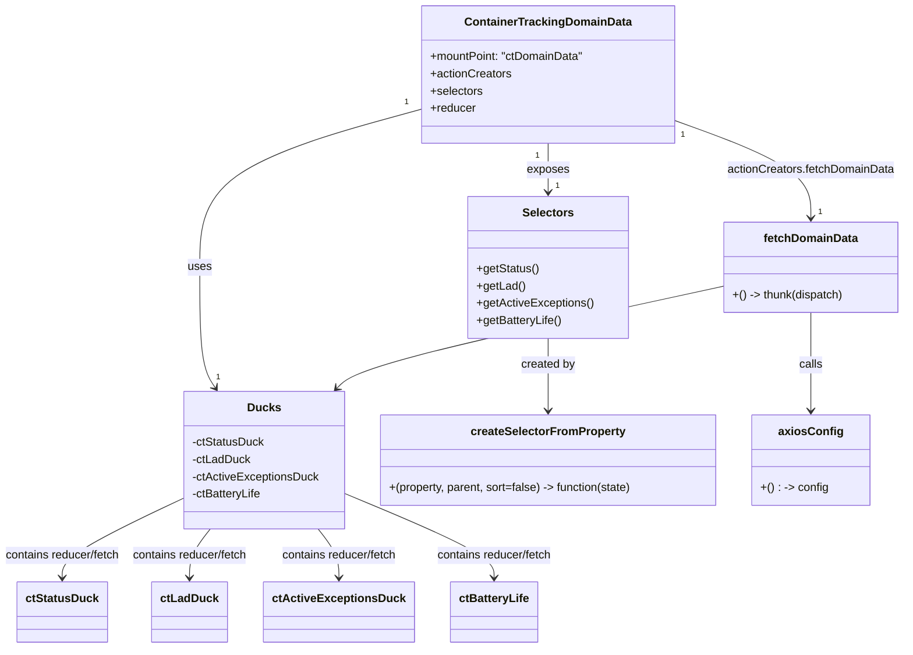

# Diagram: web/portal/src/pages/containertracking/modules/domain-data/ContainerTrackingDomainData.js


> Auto-generated by Obscura crawlers

## Diagram 1



### SVG

<svg id="container" width="1268.11328125" xmlns="http://www.w3.org/2000/svg" class="classDiagram" height="904" viewBox="0 0 1268.11328125 904" role="graphics-document document" aria-roledescription="class"><style>#container{font-family:"trebuchet ms",verdana,arial,sans-serif;font-size:16px;fill:#333;}@keyframes edge-animation-frame{from{stroke-dashoffset:0;}}@keyframes dash{to{stroke-dashoffset:0;}}#container .edge-animation-slow{stroke-dasharray:9,5!important;stroke-dashoffset:900;animation:dash 50s linear infinite;stroke-linecap:round;}#container .edge-animation-fast{stroke-dasharray:9,5!important;stroke-dashoffset:900;animation:dash 20s linear infinite;stroke-linecap:round;}#container .error-icon{fill:#552222;}#container .error-text{fill:#552222;stroke:#552222;}#container .edge-thickness-normal{stroke-width:1px;}#container .edge-thickness-thick{stroke-width:3.5px;}#container .edge-pattern-solid{stroke-dasharray:0;}#container .edge-thickness-invisible{stroke-width:0;fill:none;}#container .edge-pattern-dashed{stroke-dasharray:3;}#container .edge-pattern-dotted{stroke-dasharray:2;}#container .marker{fill:#333333;stroke:#333333;}#container .marker.cross{stroke:#333333;}#container svg{font-family:"trebuchet ms",verdana,arial,sans-serif;font-size:16px;}#container p{margin:0;}#container g.classGroup text{fill:#9370DB;stroke:none;font-family:"trebuchet ms",verdana,arial,sans-serif;font-size:10px;}#container g.classGroup text .title{font-weight:bolder;}#container .nodeLabel,#container .edgeLabel{color:#131300;}#container .edgeLabel .label rect{fill:#ECECFF;}#container .label text{fill:#131300;}#container .labelBkg{background:#ECECFF;}#container .edgeLabel .label span{background:#ECECFF;}#container .classTitle{font-weight:bolder;}#container .node rect,#container .node circle,#container .node ellipse,#container .node polygon,#container .node path{fill:#ECECFF;stroke:#9370DB;stroke-width:1px;}#container .divider{stroke:#9370DB;stroke-width:1;}#container g.clickable{cursor:pointer;}#container g.classGroup rect{fill:#ECECFF;stroke:#9370DB;}#container g.classGroup line{stroke:#9370DB;stroke-width:1;}#container .classLabel .box{stroke:none;stroke-width:0;fill:#ECECFF;opacity:0.5;}#container .classLabel .label{fill:#9370DB;font-size:10px;}#container .relation{stroke:#333333;stroke-width:1;fill:none;}#container .dashed-line{stroke-dasharray:3;}#container .dotted-line{stroke-dasharray:1 2;}#container #compositionStart,#container .composition{fill:#333333!important;stroke:#333333!important;stroke-width:1;}#container #compositionEnd,#container .composition{fill:#333333!important;stroke:#333333!important;stroke-width:1;}#container #dependencyStart,#container .dependency{fill:#333333!important;stroke:#333333!important;stroke-width:1;}#container #dependencyStart,#container .dependency{fill:#333333!important;stroke:#333333!important;stroke-width:1;}#container #extensionStart,#container .extension{fill:transparent!important;stroke:#333333!important;stroke-width:1;}#container #extensionEnd,#container .extension{fill:transparent!important;stroke:#333333!important;stroke-width:1;}#container #aggregationStart,#container .aggregation{fill:transparent!important;stroke:#333333!important;stroke-width:1;}#container #aggregationEnd,#container .aggregation{fill:transparent!important;stroke:#333333!important;stroke-width:1;}#container #lollipopStart,#container .lollipop{fill:#ECECFF!important;stroke:#333333!important;stroke-width:1;}#container #lollipopEnd,#container .lollipop{fill:#ECECFF!important;stroke:#333333!important;stroke-width:1;}#container .edgeTerminals{font-size:11px;line-height:initial;}#container .classTitleText{text-anchor:middle;font-size:18px;fill:#333;}#container .label-icon{display:inline-block;height:1em;overflow:visible;vertical-align:-0.125em;}#container .node .label-icon path{fill:currentColor;stroke:revert;stroke-width:revert;}#container :root{--mermaid-font-family:"trebuchet ms",verdana,arial,sans-serif;}</style><g><defs><marker id="container_class-aggregationStart" class="marker aggregation class" refX="18" refY="7" markerWidth="190" markerHeight="240" orient="auto"><path d="M 18,7 L9,13 L1,7 L9,1 Z"></path></marker></defs><defs><marker id="container_class-aggregationEnd" class="marker aggregation class" refX="1" refY="7" markerWidth="20" markerHeight="28" orient="auto"><path d="M 18,7 L9,13 L1,7 L9,1 Z"></path></marker></defs><defs><marker id="container_class-extensionStart" class="marker extension class" refX="18" refY="7" markerWidth="190" markerHeight="240" orient="auto"><path d="M 1,7 L18,13 V 1 Z"></path></marker></defs><defs><marker id="container_class-extensionEnd" class="marker extension class" refX="1" refY="7" markerWidth="20" markerHeight="28" orient="auto"><path d="M 1,1 V 13 L18,7 Z"></path></marker></defs><defs><marker id="container_class-compositionStart" class="marker composition class" refX="18" refY="7" markerWidth="190" markerHeight="240" orient="auto"><path d="M 18,7 L9,13 L1,7 L9,1 Z"></path></marker></defs><defs><marker id="container_class-compositionEnd" class="marker composition class" refX="1" refY="7" markerWidth="20" markerHeight="28" orient="auto"><path d="M 18,7 L9,13 L1,7 L9,1 Z"></path></marker></defs><defs><marker id="container_class-dependencyStart" class="marker dependency class" refX="6" refY="7" markerWidth="190" markerHeight="240" orient="auto"><path d="M 5,7 L9,13 L1,7 L9,1 Z"></path></marker></defs><defs><marker id="container_class-dependencyEnd" class="marker dependency class" refX="13" refY="7" markerWidth="20" markerHeight="28" orient="auto"><path d="M 18,7 L9,13 L14,7 L9,1 Z"></path></marker></defs><defs><marker id="container_class-lollipopStart" class="marker lollipop class" refX="13" refY="7" markerWidth="190" markerHeight="240" orient="auto"><circle stroke="black" fill="transparent" cx="7" cy="7" r="6"></circle></marker></defs><defs><marker id="container_class-lollipopEnd" class="marker lollipop class" refX="1" refY="7" markerWidth="190" markerHeight="240" orient="auto"><circle stroke="black" fill="transparent" cx="7" cy="7" r="6"></circle></marker></defs><g class="root"><g class="clusters"></g><g class="edgePaths"><path d="M596.754,151.947L544.745,166.122C492.737,180.298,388.72,208.649,336.712,245.491C284.703,282.333,284.703,327.667,284.703,373C284.703,418.333,284.703,463.667,288.323,491.672C291.943,519.678,299.182,530.356,302.802,535.695L306.422,541.034" id="id_ContainerTrackingDomainData_Ducks_1" class="edge-thickness-normal edge-pattern-solid relation" style=";;;" data-edge="true" data-et="edge" data-id="id_ContainerTrackingDomainData_Ducks_1" data-points="W3sieCI6NTk2Ljc1MzkwNjI1LCJ5IjoxNTEuOTQ2NTY0OTQ2NjA0OTh9LHsieCI6Mjg0LjcwMzEyNSwieSI6MjM3fSx7IngiOjI4NC43MDMxMjUsInkiOjM3M30seyJ4IjoyODQuNzAzMTI1LCJ5Ijo1MDl9LHsieCI6MzA5Ljc4ODUzMzgzNDU4NjUsInkiOjU0Nn1d" marker-end="url(#container_class-dependencyEnd)"></path><path d="M772.664,200L772.664,206.167C772.664,212.333,772.664,224.667,772.664,236C772.664,247.333,772.664,257.667,772.664,262.833L772.664,268" id="id_ContainerTrackingDomainData_Selectors_2" class="edge-thickness-normal edge-pattern-solid relation" style=";;;" data-edge="true" data-et="edge" data-id="id_ContainerTrackingDomainData_Selectors_2" data-points="W3sieCI6NzcyLjY2NDA2MjUsInkiOjIwMH0seyJ4Ijo3NzIuNjY0MDYyNSwieSI6MjM3fSx7IngiOjc3Mi42NjQwNjI1LCJ5IjoyNzR9XQ==" marker-end="url(#container_class-dependencyEnd)"></path><path d="M948.574,167.951L980.23,179.459C1011.885,190.967,1075.197,213.984,1106.852,236.658C1138.508,259.333,1138.508,281.667,1138.508,292.833L1138.508,304" id="id_ContainerTrackingDomainData_fetchDomainData_3" class="edge-thickness-normal edge-pattern-solid relation" style=";;;" data-edge="true" data-et="edge" data-id="id_ContainerTrackingDomainData_fetchDomainData_3" data-points="W3sieCI6OTQ4LjU3NDIxODc1LCJ5IjoxNjcuOTUwOTM3NDczMzA2NTd9LHsieCI6MTEzOC41MDc4MTI1LCJ5IjoyMzd9LHsieCI6MTEzOC41MDc4MTI1LCJ5IjozMTB9XQ==" marker-end="url(#container_class-dependencyEnd)"></path><path d="M772.664,472L772.664,478.167C772.664,484.333,772.664,496.667,772.664,513.5C772.664,530.333,772.664,551.667,772.664,562.333L772.664,573" id="id_Selectors_createSelectorFromProperty_4" class="edge-thickness-normal edge-pattern-solid relation" style=";;;" data-edge="true" data-et="edge" data-id="id_Selectors_createSelectorFromProperty_4" data-points="W3sieCI6NzcyLjY2NDA2MjUsInkiOjQ3Mn0seyJ4Ijo3NzIuNjY0MDYyNSwieSI6NTA5fSx7IngiOjc3Mi42NjQwNjI1LCJ5Ijo1Nzl9XQ==" marker-end="url(#container_class-dependencyEnd)"></path><path d="M1138.508,436L1138.508,448.167C1138.508,460.333,1138.508,484.667,1138.508,507.5C1138.508,530.333,1138.508,551.667,1138.508,562.333L1138.508,573" id="id_fetchDomainData_axiosConfig_5" class="edge-thickness-normal edge-pattern-solid relation" style=";;;" data-edge="true" data-et="edge" data-id="id_fetchDomainData_axiosConfig_5" data-points="W3sieCI6MTEzOC41MDc4MTI1LCJ5Ijo0MzZ9LHsieCI6MTEzOC41MDc4MTI1LCJ5Ijo1MDl9LHsieCI6MTEzOC41MDc4MTI1LCJ5Ijo1Nzl9XQ==" marker-end="url(#container_class-dependencyEnd)"></path><path d="M1016.902,399.083L931.492,417.402C846.081,435.722,675.26,472.361,584.54,496.131C493.82,519.901,483.201,530.801,477.892,536.252L472.582,541.702" id="id_fetchDomainData_Ducks_6" class="edge-thickness-normal edge-pattern-solid relation" style=";;;" data-edge="true" data-et="edge" data-id="id_fetchDomainData_Ducks_6" data-points="W3sieCI6MTAxNi45MDIzNDM3NSwieSI6Mzk5LjA4MjkwMzM3Mzg1OTl9LHsieCI6NTA0LjQzOTQ1MzEyNSwieSI6NTA5fSx7IngiOjQ2OC4zOTUyMDY3NjY5MTczLCJ5Ijo1NDZ9XQ==" marker-end="url(#container_class-dependencyEnd)"></path><path d="M263.359,694.146L234.542,707.622C205.724,721.098,148.089,748.049,119.271,766.691C90.453,785.333,90.453,795.667,90.453,800.833L90.453,806" id="id_Ducks_ctStatusDuck_7" class="edge-thickness-normal edge-pattern-solid relation" style=";;;" data-edge="true" data-et="edge" data-id="id_Ducks_ctStatusDuck_7" data-points="W3sieCI6MjYzLjM1OTM3NSwieSI6Njk0LjE0NjQwNDQzODgyODh9LHsieCI6OTAuNDUzMTI1LCJ5Ijo3NzV9LHsieCI6OTAuNDUzMTI1LCJ5Ijo4MTJ9XQ==" marker-end="url(#container_class-dependencyEnd)"></path><path d="M303.044,738L298.43,744.167C293.816,750.333,284.588,762.667,279.974,774C275.359,785.333,275.359,795.667,275.359,800.833L275.359,806" id="id_Ducks_ctLadDuck_8" class="edge-thickness-normal edge-pattern-solid relation" style=";;;" data-edge="true" data-et="edge" data-id="id_Ducks_ctLadDuck_8" data-points="W3sieCI6MzAzLjA0NDE3MjkzMjMzMDgsInkiOjczOH0seyJ4IjoyNzUuMzU5Mzc1LCJ5Ijo3NzV9LHsieCI6Mjc1LjM1OTM3NSwieSI6ODEyfV0=" marker-end="url(#container_class-dependencyEnd)"></path><path d="M446.706,738L451.32,744.167C455.934,750.333,465.162,762.667,469.776,774C474.391,785.333,474.391,795.667,474.391,800.833L474.391,806" id="id_Ducks_ctActiveExceptionsDuck_9" class="edge-thickness-normal edge-pattern-solid relation" style=";;;" data-edge="true" data-et="edge" data-id="id_Ducks_ctActiveExceptionsDuck_9" data-points="W3sieCI6NDQ2LjcwNTgyNzA2NzY2OTIsInkiOjczOH0seyJ4Ijo0NzQuMzkwNjI1LCJ5Ijo3NzV9LHsieCI6NDc0LjM5MDYyNSwieSI6ODEyfV0=" marker-end="url(#container_class-dependencyEnd)"></path><path d="M486.391,690.159L519.133,704.299C551.875,718.44,617.359,746.72,650.102,766.027C682.844,785.333,682.844,795.667,682.844,800.833L682.844,806" id="id_Ducks_ctBatteryLife_10" class="edge-thickness-normal edge-pattern-solid relation" style=";;;" data-edge="true" data-et="edge" data-id="id_Ducks_ctBatteryLife_10" data-points="W3sieCI6NDg2LjM5MDYyNSwieSI6NjkwLjE1OTM2MDczMDU5MzZ9LHsieCI6NjgyLjg0Mzc1LCJ5Ijo3NzV9LHsieCI6NjgyLjg0Mzc1LCJ5Ijo4MTJ9XQ==" marker-end="url(#container_class-dependencyEnd)"></path></g><g class="edgeLabels"><g class="edgeLabel" transform="translate(284.703125, 373)"><g class="label" data-id="id_ContainerTrackingDomainData_Ducks_1" transform="translate(-16.4921875, -12)"><foreignObject width="32.984375" height="24"><div xmlns="http://www.w3.org/1999/xhtml" class="labelBkg" style="display: table-cell; white-space: nowrap; line-height: 1.5; max-width: 200px; text-align: center;"><span class="edgeLabel"><p>uses</p></span></div></foreignObject></g></g><g class="edgeLabel" transform="translate(772.6640625, 237)"><g class="label" data-id="id_ContainerTrackingDomainData_Selectors_2" transform="translate(-29.4296875, -12)"><foreignObject width="58.859375" height="24"><div xmlns="http://www.w3.org/1999/xhtml" class="labelBkg" style="display: table-cell; white-space: nowrap; line-height: 1.5; max-width: 200px; text-align: center;"><span class="edgeLabel"><p>exposes</p></span></div></foreignObject></g></g><g class="edgeLabel" transform="translate(1138.5078125, 237)"><g class="label" data-id="id_ContainerTrackingDomainData_fetchDomainData_3" transform="translate(-117.296875, -12)"><foreignObject width="234.59375" height="24"><div xmlns="http://www.w3.org/1999/xhtml" class="labelBkg" style="display: table; white-space: break-spaces; line-height: 1.5; max-width: 200px; text-align: center; width: 200px;"><span class="edgeLabel"><p>actionCreators.fetchDomainData</p></span></div></foreignObject></g></g><g class="edgeLabel" transform="translate(772.6640625, 509)"><g class="label" data-id="id_Selectors_createSelectorFromProperty_4" transform="translate(-37.9921875, -12)"><foreignObject width="75.984375" height="24"><div xmlns="http://www.w3.org/1999/xhtml" class="labelBkg" style="display: table-cell; white-space: nowrap; line-height: 1.5; max-width: 200px; text-align: center;"><span class="edgeLabel"><p>created by</p></span></div></foreignObject></g></g><g class="edgeLabel" transform="translate(1138.5078125, 509)"><g class="label" data-id="id_fetchDomainData_axiosConfig_5" transform="translate(-16.4453125, -12)"><foreignObject width="32.890625" height="24"><div xmlns="http://www.w3.org/1999/xhtml" class="labelBkg" style="display: table-cell; white-space: nowrap; line-height: 1.5; max-width: 200px; text-align: center;"><span class="edgeLabel"><p>calls</p></span></div></foreignObject></g></g><g class="edgeLabel" transform="translate(735.418, 459.45789)"><g class="label" data-id="id_fetchDomainData_Ducks_6" transform="translate(-70.171875, -12)"><foreignObject width="140.34375" height="24"><div xmlns="http://www.w3.org/1999/xhtml" class="labelBkg" style="display: table-cell; white-space: nowrap; line-height: 1.5; max-width: 200px; text-align: center;"><span class="edgeLabel"><p>dispatches.fetch(...)</p></span></div></foreignObject></g></g><g class="edgeLabel" transform="translate(90.453125, 775)"><g class="label" data-id="id_Ducks_ctStatusDuck_7" transform="translate(-82.453125, -12)"><foreignObject width="164.90625" height="24"><div xmlns="http://www.w3.org/1999/xhtml" class="labelBkg" style="display: table-cell; white-space: nowrap; line-height: 1.5; max-width: 200px; text-align: center;"><span class="edgeLabel"><p>contains reducer/fetch</p></span></div></foreignObject></g></g><g class="edgeLabel" transform="translate(275.359375, 775)"><g class="label" data-id="id_Ducks_ctLadDuck_8" transform="translate(-82.453125, -12)"><foreignObject width="164.90625" height="24"><div xmlns="http://www.w3.org/1999/xhtml" class="labelBkg" style="display: table-cell; white-space: nowrap; line-height: 1.5; max-width: 200px; text-align: center;"><span class="edgeLabel"><p>contains reducer/fetch</p></span></div></foreignObject></g></g><g class="edgeLabel" transform="translate(474.390625, 775)"><g class="label" data-id="id_Ducks_ctActiveExceptionsDuck_9" transform="translate(-82.453125, -12)"><foreignObject width="164.90625" height="24"><div xmlns="http://www.w3.org/1999/xhtml" class="labelBkg" style="display: table-cell; white-space: nowrap; line-height: 1.5; max-width: 200px; text-align: center;"><span class="edgeLabel"><p>contains reducer/fetch</p></span></div></foreignObject></g></g><g class="edgeLabel" transform="translate(682.84375, 775)"><g class="label" data-id="id_Ducks_ctBatteryLife_10" transform="translate(-82.453125, -12)"><foreignObject width="164.90625" height="24"><div xmlns="http://www.w3.org/1999/xhtml" class="labelBkg" style="display: table-cell; white-space: nowrap; line-height: 1.5; max-width: 200px; text-align: center;"><span class="edgeLabel"><p>contains reducer/fetch</p></span></div></foreignObject></g></g><g class="edgeTerminals" transform="translate(575.9252897265119, 142.07647051318622)"><g class="inner" transform="translate(0, 0)"><foreignObject style="width: 9px; height: 12px;"><div xmlns="http://www.w3.org/1999/xhtml" style="display: inline-block; padding-right: 1px; white-space: nowrap;"><span class="edgeLabel">1</span></div></foreignObject></g></g><g class="edgeTerminals" transform="translate(757.66406125, 217.49999892857142)"><g class="inner" transform="translate(0, 0)"><foreignObject style="width: 9px; height: 12px;"><div xmlns="http://www.w3.org/1999/xhtml" style="display: inline-block; padding-right: 1px; white-space: nowrap;"><span class="edgeLabel">1</span></div></foreignObject></g></g><g class="edgeTerminals" transform="translate(959.8961073071979, 188.02741144541116)"><g class="inner" transform="translate(0, 0)"><foreignObject style="width: 9px; height: 12px;"><div xmlns="http://www.w3.org/1999/xhtml" style="display: inline-block; padding-right: 1px; white-space: nowrap;"><span class="edgeLabel">1</span></div></foreignObject></g></g><g class="edgeTerminals" transform="translate(307.38361203758427, 518.0976944736103)"><g class="inner" transform="translate(0, 0)"></g><foreignObject style="width: 9px; height: 12px;"><div xmlns="http://www.w3.org/1999/xhtml" style="display: inline-block; padding-right: 1px; white-space: nowrap;"><span class="edgeLabel">1</span></div></foreignObject></g><g class="edgeTerminals" transform="translate(782.66406125, 251.49999892857142)"><g class="inner" transform="translate(0, 0)"></g><foreignObject style="width: 9px; height: 12px;"><div xmlns="http://www.w3.org/1999/xhtml" style="display: inline-block; padding-right: 1px; white-space: nowrap;"><span class="edgeLabel">1</span></div></foreignObject></g><g class="edgeTerminals" transform="translate(1148.50781125, 287.4999989285715)"><g class="inner" transform="translate(0, 0)"></g><foreignObject style="width: 9px; height: 12px;"><div xmlns="http://www.w3.org/1999/xhtml" style="display: inline-block; padding-right: 1px; white-space: nowrap;"><span class="edgeLabel">1</span></div></foreignObject></g></g><g class="nodes"><g class="node default" id="classId-ContainerTrackingDomainData-0" transform="translate(772.6640625, 104)"><g class="basic label-container"><path d="M-175.91015625 -96 L175.91015625 -96 L175.91015625 96 L-175.91015625 96" stroke="none" stroke-width="0" fill="#ECECFF" style=""></path><path d="M-175.91015625 -96 C-103.52050209085522 -96, -31.130847931710434 -96, 175.91015625 -96 M-175.91015625 -96 C-93.70341937487679 -96, -11.496682499753575 -96, 175.91015625 -96 M175.91015625 -96 C175.91015625 -41.054981050625955, 175.91015625 13.89003789874809, 175.91015625 96 M175.91015625 -96 C175.91015625 -37.54653687436664, 175.91015625 20.906926251266725, 175.91015625 96 M175.91015625 96 C77.3274333616304 96, -21.255289526739205 96, -175.91015625 96 M175.91015625 96 C38.95366773651304 96, -98.00282077697392 96, -175.91015625 96 M-175.91015625 96 C-175.91015625 40.95871451106569, -175.91015625 -14.082570977868613, -175.91015625 -96 M-175.91015625 96 C-175.91015625 38.70957969440187, -175.91015625 -18.580840611196265, -175.91015625 -96" stroke="#9370DB" stroke-width="1.3" fill="none" stroke-dasharray="0 0" style=""></path></g><g class="annotation-group text" transform="translate(0, -72)"></g><g class="label-group text" transform="translate(-111.3046875, -72)"><g class="label" style="font-weight: bolder" transform="translate(0,-12)"><foreignObject width="222.609375" height="24"><div xmlns="http://www.w3.org/1999/xhtml" style="display: table-cell; white-space: nowrap; line-height: 1.5; max-width: 270px; text-align: center;"><span class="nodeLabel markdown-node-label" style=""><p>ContainerTrackingDomainData</p></span></div></foreignObject></g></g><g class="members-group text" transform="translate(-163.91015625, -24)"><g class="label" style="" transform="translate(0,-12)"><foreignObject width="216.515625" height="24"><div xmlns="http://www.w3.org/1999/xhtml" style="display: table-cell; white-space: nowrap; line-height: 1.5; max-width: 274px; text-align: center;"><span class="nodeLabel markdown-node-label" style=""><p>+mountPoint: "ctDomainData"</p></span></div></foreignObject></g><g class="label" style="" transform="translate(0,12)"><foreignObject width="113.078125" height="24"><div xmlns="http://www.w3.org/1999/xhtml" style="display: table-cell; white-space: nowrap; line-height: 1.5; max-width: 170px; text-align: center;"><span class="nodeLabel markdown-node-label" style=""><p>+actionCreators</p></span></div></foreignObject></g><g class="label" style="" transform="translate(0,36)"><foreignObject width="73.453125" height="24"><div xmlns="http://www.w3.org/1999/xhtml" style="display: table-cell; white-space: nowrap; line-height: 1.5; max-width: 131px; text-align: center;"><span class="nodeLabel markdown-node-label" style=""><p>+selectors</p></span></div></foreignObject></g><g class="label" style="" transform="translate(0,60)"><foreignObject width="63.515625" height="24"><div xmlns="http://www.w3.org/1999/xhtml" style="display: table-cell; white-space: nowrap; line-height: 1.5; max-width: 122px; text-align: center;"><span class="nodeLabel markdown-node-label" style=""><p>+reducer</p></span></div></foreignObject></g></g><g class="methods-group text" transform="translate(-163.91015625, 96)"></g><g class="divider" style=""><path d="M-175.91015625 -48 C-48.551727321183336 -48, 78.80670160763333 -48, 175.91015625 -48 M-175.91015625 -48 C-67.25694007314011 -48, 41.39627610371977 -48, 175.91015625 -48" stroke="#9370DB" stroke-width="1.3" fill="none" stroke-dasharray="0 0" style=""></path></g><g class="divider" style=""><path d="M-175.91015625 72 C-67.75814078799927 72, 40.39387467400147 72, 175.91015625 72 M-175.91015625 72 C-72.16403961657504 72, 31.582077016849922 72, 175.91015625 72" stroke="#9370DB" stroke-width="1.3" fill="none" stroke-dasharray="0 0" style=""></path></g></g><g class="node default" id="classId-Ducks-1" transform="translate(374.875, 642)"><g class="basic label-container"><path d="M-111.515625 -96 L111.515625 -96 L111.515625 96 L-111.515625 96" stroke="none" stroke-width="0" fill="#ECECFF" style=""></path><path d="M-111.515625 -96 C-30.50544095565354 -96, 50.50474308869292 -96, 111.515625 -96 M-111.515625 -96 C-45.12183130505856 -96, 21.271962389882873 -96, 111.515625 -96 M111.515625 -96 C111.515625 -44.95784321710474, 111.515625 6.084313565790524, 111.515625 96 M111.515625 -96 C111.515625 -51.52054770037655, 111.515625 -7.041095400753093, 111.515625 96 M111.515625 96 C42.14554655762883 96, -27.224531884742333 96, -111.515625 96 M111.515625 96 C53.02622876652955 96, -5.463167466940902 96, -111.515625 96 M-111.515625 96 C-111.515625 26.001567820182245, -111.515625 -43.99686435963551, -111.515625 -96 M-111.515625 96 C-111.515625 44.28326179534845, -111.515625 -7.433476409303097, -111.515625 -96" stroke="#9370DB" stroke-width="1.3" fill="none" stroke-dasharray="0 0" style=""></path></g><g class="annotation-group text" transform="translate(0, -72)"></g><g class="label-group text" transform="translate(-21.859375, -72)"><g class="label" style="font-weight: bolder" transform="translate(0,-12)"><foreignObject width="43.71875" height="24"><div xmlns="http://www.w3.org/1999/xhtml" style="display: table-cell; white-space: nowrap; line-height: 1.5; max-width: 93px; text-align: center;"><span class="nodeLabel markdown-node-label" style=""><p>Ducks</p></span></div></foreignObject></g></g><g class="members-group text" transform="translate(-99.515625, -24)"><g class="label" style="" transform="translate(0,-12)"><foreignObject width="100.984375" height="24"><div xmlns="http://www.w3.org/1999/xhtml" style="display: table-cell; white-space: nowrap; line-height: 1.5; max-width: 159px; text-align: center;"><span class="nodeLabel markdown-node-label" style=""><p>-ctStatusDuck</p></span></div></foreignObject></g><g class="label" style="" transform="translate(0,12)"><foreignObject width="81.421875" height="24"><div xmlns="http://www.w3.org/1999/xhtml" style="display: table-cell; white-space: nowrap; line-height: 1.5; max-width: 140px; text-align: center;"><span class="nodeLabel markdown-node-label" style=""><p>-ctLadDuck</p></span></div></foreignObject></g><g class="label" style="" transform="translate(0,36)"><foreignObject width="177.171875" height="24"><div xmlns="http://www.w3.org/1999/xhtml" style="display: table-cell; white-space: nowrap; line-height: 1.5; max-width: 235px; text-align: center;"><span class="nodeLabel markdown-node-label" style=""><p>-ctActiveExceptionsDuck</p></span></div></foreignObject></g><g class="label" style="" transform="translate(0,60)"><foreignObject width="98.796875" height="24"><div xmlns="http://www.w3.org/1999/xhtml" style="display: table-cell; white-space: nowrap; line-height: 1.5; max-width: 156px; text-align: center;"><span class="nodeLabel markdown-node-label" style=""><p>-ctBatteryLife</p></span></div></foreignObject></g></g><g class="methods-group text" transform="translate(-99.515625, 96)"></g><g class="divider" style=""><path d="M-111.515625 -48 C-39.346762326323756 -48, 32.82210034735249 -48, 111.515625 -48 M-111.515625 -48 C-30.26827511259566 -48, 50.97907477480868 -48, 111.515625 -48" stroke="#9370DB" stroke-width="1.3" fill="none" stroke-dasharray="0 0" style=""></path></g><g class="divider" style=""><path d="M-111.515625 72 C-24.998791347804044 72, 61.51804230439191 72, 111.515625 72 M-111.515625 72 C-58.65157083998092 72, -5.78751667996184 72, 111.515625 72" stroke="#9370DB" stroke-width="1.3" fill="none" stroke-dasharray="0 0" style=""></path></g></g><g class="node default" id="classId-Selectors-2" transform="translate(772.6640625, 373)"><g class="basic label-container"><path d="M-110.46875 -99 L110.46875 -99 L110.46875 99 L-110.46875 99" stroke="none" stroke-width="0" fill="#ECECFF" style=""></path><path d="M-110.46875 -99 C-30.01558495342151 -99, 50.43758009315698 -99, 110.46875 -99 M-110.46875 -99 C-50.9718823295127 -99, 8.524985340974595 -99, 110.46875 -99 M110.46875 -99 C110.46875 -31.578506955267798, 110.46875 35.842986089464404, 110.46875 99 M110.46875 -99 C110.46875 -42.74651178657107, 110.46875 13.506976426857861, 110.46875 99 M110.46875 99 C45.045302346532196 99, -20.378145306935608 99, -110.46875 99 M110.46875 99 C45.245584334209326 99, -19.977581331581348 99, -110.46875 99 M-110.46875 99 C-110.46875 51.28897299486209, -110.46875 3.577945989724185, -110.46875 -99 M-110.46875 99 C-110.46875 30.229988435304605, -110.46875 -38.54002312939079, -110.46875 -99" stroke="#9370DB" stroke-width="1.3" fill="none" stroke-dasharray="0 0" style=""></path></g><g class="annotation-group text" transform="translate(0, -75)"></g><g class="label-group text" transform="translate(-34.171875, -75)"><g class="label" style="font-weight: bolder" transform="translate(0,-12)"><foreignObject width="68.34375" height="24"><div xmlns="http://www.w3.org/1999/xhtml" style="display: table-cell; white-space: nowrap; line-height: 1.5; max-width: 117px; text-align: center;"><span class="nodeLabel markdown-node-label" style=""><p>Selectors</p></span></div></foreignObject></g></g><g class="members-group text" transform="translate(-98.46875, -27)"></g><g class="methods-group text" transform="translate(-98.46875, 3)"><g class="label" style="" transform="translate(0,-12)"><foreignObject width="86.5625" height="24"><div xmlns="http://www.w3.org/1999/xhtml" style="display: table-cell; white-space: nowrap; line-height: 1.5; max-width: 144px; text-align: center;"><span class="nodeLabel markdown-node-label" style=""><p>+getStatus()</p></span></div></foreignObject></g><g class="label" style="" transform="translate(0,12)"><foreignObject width="67" height="24"><div xmlns="http://www.w3.org/1999/xhtml" style="display: table-cell; white-space: nowrap; line-height: 1.5; max-width: 124px; text-align: center;"><span class="nodeLabel markdown-node-label" style=""><p>+getLad()</p></span></div></foreignObject></g><g class="label" style="" transform="translate(0,36)"><foreignObject width="162.765625" height="24"><div xmlns="http://www.w3.org/1999/xhtml" style="display: table-cell; white-space: nowrap; line-height: 1.5; max-width: 220px; text-align: center;"><span class="nodeLabel markdown-node-label" style=""><p>+getActiveExceptions()</p></span></div></foreignObject></g><g class="label" style="" transform="translate(0,60)"><foreignObject width="119.828125" height="24"><div xmlns="http://www.w3.org/1999/xhtml" style="display: table-cell; white-space: nowrap; line-height: 1.5; max-width: 177px; text-align: center;"><span class="nodeLabel markdown-node-label" style=""><p>+getBatteryLife()</p></span></div></foreignObject></g></g><g class="divider" style=""><path d="M-110.46875 -51 C-43.35560369249235 -51, 23.757542615015296 -51, 110.46875 -51 M-110.46875 -51 C-32.6568309915733 -51, 45.1550880168534 -51, 110.46875 -51" stroke="#9370DB" stroke-width="1.3" fill="none" stroke-dasharray="0 0" style=""></path></g><g class="divider" style=""><path d="M-110.46875 -27 C-50.883585524353094 -27, 8.701578951293811 -27, 110.46875 -27 M-110.46875 -27 C-44.089435967828834 -27, 22.289878064342332 -27, 110.46875 -27" stroke="#9370DB" stroke-width="1.3" fill="none" stroke-dasharray="0 0" style=""></path></g></g><g class="node default" id="classId-createSelectorFromProperty-3" transform="translate(772.6640625, 642)"><g class="basic label-container"><path d="M-236.2734375 -63 L236.2734375 -63 L236.2734375 63 L-236.2734375 63" stroke="none" stroke-width="0" fill="#ECECFF" style=""></path><path d="M-236.2734375 -63 C-84.5427485810583 -63, 67.18794033788339 -63, 236.2734375 -63 M-236.2734375 -63 C-88.2477720305229 -63, 59.77789343895421 -63, 236.2734375 -63 M236.2734375 -63 C236.2734375 -36.88549165493768, 236.2734375 -10.770983309875355, 236.2734375 63 M236.2734375 -63 C236.2734375 -16.0277511628153, 236.2734375 30.9444976743694, 236.2734375 63 M236.2734375 63 C94.7324308863443 63, -46.80857572731139 63, -236.2734375 63 M236.2734375 63 C133.036172460209 63, 29.798907420418004 63, -236.2734375 63 M-236.2734375 63 C-236.2734375 21.551183521646216, -236.2734375 -19.897632956707568, -236.2734375 -63 M-236.2734375 63 C-236.2734375 15.83996772425192, -236.2734375 -31.32006455149616, -236.2734375 -63" stroke="#9370DB" stroke-width="1.3" fill="none" stroke-dasharray="0 0" style=""></path></g><g class="annotation-group text" transform="translate(0, -39)"></g><g class="label-group text" transform="translate(-103.171875, -39)"><g class="label" style="font-weight: bolder" transform="translate(0,-12)"><foreignObject width="206.34375" height="24"><div xmlns="http://www.w3.org/1999/xhtml" style="display: table-cell; white-space: nowrap; line-height: 1.5; max-width: 252px; text-align: center;"><span class="nodeLabel markdown-node-label" style=""><p>createSelectorFromProperty</p></span></div></foreignObject></g></g><g class="members-group text" transform="translate(-224.2734375, 9)"></g><g class="methods-group text" transform="translate(-224.2734375, 39)"><g class="label" style="" transform="translate(0,-12)"><foreignObject width="345.375" height="24"><div xmlns="http://www.w3.org/1999/xhtml" style="display: table-cell; white-space: nowrap; line-height: 1.5; max-width: 424px; text-align: center;"><span class="nodeLabel markdown-node-label" style=""><p>+(property, parent, sort=false) -&gt; function(state)</p></span></div></foreignObject></g></g><g class="divider" style=""><path d="M-236.2734375 -15 C-65.5121515801186 -15, 105.2491343397628 -15, 236.2734375 -15 M-236.2734375 -15 C-95.34464750492464 -15, 45.584142490150725 -15, 236.2734375 -15" stroke="#9370DB" stroke-width="1.3" fill="none" stroke-dasharray="0 0" style=""></path></g><g class="divider" style=""><path d="M-236.2734375 9 C-84.96346449430783 9, 66.34650851138434 9, 236.2734375 9 M-236.2734375 9 C-101.63554911976777 9, 33.00233926046445 9, 236.2734375 9" stroke="#9370DB" stroke-width="1.3" fill="none" stroke-dasharray="0 0" style=""></path></g></g><g class="node default" id="classId-axiosConfig-4" transform="translate(1138.5078125, 642)"><g class="basic label-container"><path d="M-79.5703125 -63 L79.5703125 -63 L79.5703125 63 L-79.5703125 63" stroke="none" stroke-width="0" fill="#ECECFF" style=""></path><path d="M-79.5703125 -63 C-19.966203105168198 -63, 39.637906289663604 -63, 79.5703125 -63 M-79.5703125 -63 C-26.502271449806152 -63, 26.565769600387696 -63, 79.5703125 -63 M79.5703125 -63 C79.5703125 -17.873504810494936, 79.5703125 27.25299037901013, 79.5703125 63 M79.5703125 -63 C79.5703125 -28.289834996759012, 79.5703125 6.420330006481976, 79.5703125 63 M79.5703125 63 C22.735022417819863 63, -34.100267664360274 63, -79.5703125 63 M79.5703125 63 C24.45254863076505 63, -30.665215238469898 63, -79.5703125 63 M-79.5703125 63 C-79.5703125 13.76265659782942, -79.5703125 -35.47468680434116, -79.5703125 -63 M-79.5703125 63 C-79.5703125 29.256442548733844, -79.5703125 -4.487114902532312, -79.5703125 -63" stroke="#9370DB" stroke-width="1.3" fill="none" stroke-dasharray="0 0" style=""></path></g><g class="annotation-group text" transform="translate(0, -39)"></g><g class="label-group text" transform="translate(-42.203125, -39)"><g class="label" style="font-weight: bolder" transform="translate(0,-12)"><foreignObject width="84.40625" height="24"><div xmlns="http://www.w3.org/1999/xhtml" style="display: table-cell; white-space: nowrap; line-height: 1.5; max-width: 133px; text-align: center;"><span class="nodeLabel markdown-node-label" style=""><p>axiosConfig</p></span></div></foreignObject></g></g><g class="members-group text" transform="translate(-67.5703125, 9)"></g><g class="methods-group text" transform="translate(-67.5703125, 39)"><g class="label" style="" transform="translate(0,-12)"><foreignObject width="92.9375" height="24"><div xmlns="http://www.w3.org/1999/xhtml" style="display: table-cell; white-space: nowrap; line-height: 1.5; max-width: 165px; text-align: center;"><span class="nodeLabel markdown-node-label" style=""><p>+() : -&gt; config</p></span></div></foreignObject></g></g><g class="divider" style=""><path d="M-79.5703125 -15 C-27.495133713488485 -15, 24.58004507302303 -15, 79.5703125 -15 M-79.5703125 -15 C-22.636054245551442 -15, 34.298204008897116 -15, 79.5703125 -15" stroke="#9370DB" stroke-width="1.3" fill="none" stroke-dasharray="0 0" style=""></path></g><g class="divider" style=""><path d="M-79.5703125 9 C-23.615947155608183 9, 32.338418188783635 9, 79.5703125 9 M-79.5703125 9 C-20.69133258335816 9, 38.18764733328368 9, 79.5703125 9" stroke="#9370DB" stroke-width="1.3" fill="none" stroke-dasharray="0 0" style=""></path></g></g><g class="node default" id="classId-fetchDomainData-5" transform="translate(1138.5078125, 373)"><g class="basic label-container"><path d="M-121.60546875 -63 L121.60546875 -63 L121.60546875 63 L-121.60546875 63" stroke="none" stroke-width="0" fill="#ECECFF" style=""></path><path d="M-121.60546875 -63 C-69.98324338470523 -63, -18.361018019410466 -63, 121.60546875 -63 M-121.60546875 -63 C-64.23638950954643 -63, -6.8673102690928545 -63, 121.60546875 -63 M121.60546875 -63 C121.60546875 -22.387112710964516, 121.60546875 18.22577457807097, 121.60546875 63 M121.60546875 -63 C121.60546875 -32.42612318190307, 121.60546875 -1.8522463638061453, 121.60546875 63 M121.60546875 63 C30.660243310945503 63, -60.28498212810899 63, -121.60546875 63 M121.60546875 63 C30.076807837936826 63, -61.45185307412635 63, -121.60546875 63 M-121.60546875 63 C-121.60546875 20.748281564456008, -121.60546875 -21.503436871087985, -121.60546875 -63 M-121.60546875 63 C-121.60546875 32.08312267512791, -121.60546875 1.1662453502558208, -121.60546875 -63" stroke="#9370DB" stroke-width="1.3" fill="none" stroke-dasharray="0 0" style=""></path></g><g class="annotation-group text" transform="translate(0, -39)"></g><g class="label-group text" transform="translate(-63.3671875, -39)"><g class="label" style="font-weight: bolder" transform="translate(0,-12)"><foreignObject width="126.734375" height="24"><div xmlns="http://www.w3.org/1999/xhtml" style="display: table-cell; white-space: nowrap; line-height: 1.5; max-width: 176px; text-align: center;"><span class="nodeLabel markdown-node-label" style=""><p>fetchDomainData</p></span></div></foreignObject></g></g><g class="members-group text" transform="translate(-109.60546875, 9)"></g><g class="methods-group text" transform="translate(-109.60546875, 39)"><g class="label" style="" transform="translate(0,-12)"><foreignObject width="155.84375" height="24"><div xmlns="http://www.w3.org/1999/xhtml" style="display: table-cell; white-space: nowrap; line-height: 1.5; max-width: 234px; text-align: center;"><span class="nodeLabel markdown-node-label" style=""><p>+() -&gt; thunk(dispatch)</p></span></div></foreignObject></g></g><g class="divider" style=""><path d="M-121.60546875 -15 C-63.37799437336097 -15, -5.15051999672194 -15, 121.60546875 -15 M-121.60546875 -15 C-49.545564468208596 -15, 22.514339813582808 -15, 121.60546875 -15" stroke="#9370DB" stroke-width="1.3" fill="none" stroke-dasharray="0 0" style=""></path></g><g class="divider" style=""><path d="M-121.60546875 9 C-42.204877256956266 9, 37.19571423608747 9, 121.60546875 9 M-121.60546875 9 C-70.62232208368235 9, -19.639175417364683 9, 121.60546875 9" stroke="#9370DB" stroke-width="1.3" fill="none" stroke-dasharray="0 0" style=""></path></g></g><g class="node default" id="classId-ctStatusDuck-6" transform="translate(90.453125, 854)"><g class="basic label-container"><path d="M-60.4375 -42 L60.4375 -42 L60.4375 42 L-60.4375 42" stroke="none" stroke-width="0" fill="#ECECFF" style=""></path><path d="M-60.4375 -42 C-13.393296754322684 -42, 33.65090649135463 -42, 60.4375 -42 M-60.4375 -42 C-29.58185604282324 -42, 1.2737879143535196 -42, 60.4375 -42 M60.4375 -42 C60.4375 -19.0609502281264, 60.4375 3.8780995437471972, 60.4375 42 M60.4375 -42 C60.4375 -17.100519529734846, 60.4375 7.798960940530307, 60.4375 42 M60.4375 42 C27.05060082179446 42, -6.336298356411078 42, -60.4375 42 M60.4375 42 C28.53410424394798 42, -3.3692915121040414 42, -60.4375 42 M-60.4375 42 C-60.4375 11.916020343249862, -60.4375 -18.167959313500276, -60.4375 -42 M-60.4375 42 C-60.4375 9.42308418236167, -60.4375 -23.15383163527666, -60.4375 -42" stroke="#9370DB" stroke-width="1.3" fill="none" stroke-dasharray="0 0" style=""></path></g><g class="annotation-group text" transform="translate(0, -18)"></g><g class="label-group text" transform="translate(-48.4375, -18)"><g class="label" style="font-weight: bolder" transform="translate(0,-12)"><foreignObject width="96.875" height="24"><div xmlns="http://www.w3.org/1999/xhtml" style="display: table-cell; white-space: nowrap; line-height: 1.5; max-width: 145px; text-align: center;"><span class="nodeLabel markdown-node-label" style=""><p>ctStatusDuck</p></span></div></foreignObject></g></g><g class="members-group text" transform="translate(-48.4375, 30)"></g><g class="methods-group text" transform="translate(-48.4375, 60)"></g><g class="divider" style=""><path d="M-60.4375 6 C-23.21668716606988 6, 14.004125667860237 6, 60.4375 6 M-60.4375 6 C-26.369542040423397 6, 7.698415919153206 6, 60.4375 6" stroke="#9370DB" stroke-width="1.3" fill="none" stroke-dasharray="0 0" style=""></path></g><g class="divider" style=""><path d="M-60.4375 24 C-35.96421040833144 24, -11.490920816662872 24, 60.4375 24 M-60.4375 24 C-21.7741913151835 24, 16.889117369633 24, 60.4375 24" stroke="#9370DB" stroke-width="1.3" fill="none" stroke-dasharray="0 0" style=""></path></g></g><g class="node default" id="classId-ctLadDuck-7" transform="translate(275.359375, 854)"><g class="basic label-container"><path d="M-50.1640625 -42 L50.1640625 -42 L50.1640625 42 L-50.1640625 42" stroke="none" stroke-width="0" fill="#ECECFF" style=""></path><path d="M-50.1640625 -42 C-16.2129382173987 -42, 17.738186065202598 -42, 50.1640625 -42 M-50.1640625 -42 C-16.98262867125618 -42, 16.19880515748764 -42, 50.1640625 -42 M50.1640625 -42 C50.1640625 -13.543959566660131, 50.1640625 14.912080866679737, 50.1640625 42 M50.1640625 -42 C50.1640625 -18.5080037120511, 50.1640625 4.983992575897801, 50.1640625 42 M50.1640625 42 C22.072737636733507 42, -6.018587226532986 42, -50.1640625 42 M50.1640625 42 C18.84535197152485 42, -12.473358556950302 42, -50.1640625 42 M-50.1640625 42 C-50.1640625 16.739223536384607, -50.1640625 -8.521552927230786, -50.1640625 -42 M-50.1640625 42 C-50.1640625 12.719770283859315, -50.1640625 -16.56045943228137, -50.1640625 -42" stroke="#9370DB" stroke-width="1.3" fill="none" stroke-dasharray="0 0" style=""></path></g><g class="annotation-group text" transform="translate(0, -18)"></g><g class="label-group text" transform="translate(-38.1640625, -18)"><g class="label" style="font-weight: bolder" transform="translate(0,-12)"><foreignObject width="76.328125" height="24"><div xmlns="http://www.w3.org/1999/xhtml" style="display: table-cell; white-space: nowrap; line-height: 1.5; max-width: 126px; text-align: center;"><span class="nodeLabel markdown-node-label" style=""><p>ctLadDuck</p></span></div></foreignObject></g></g><g class="members-group text" transform="translate(-38.1640625, 30)"></g><g class="methods-group text" transform="translate(-38.1640625, 60)"></g><g class="divider" style=""><path d="M-50.1640625 6 C-16.263634057098983 6, 17.636794385802034 6, 50.1640625 6 M-50.1640625 6 C-16.88650500123572 6, 16.391052497528563 6, 50.1640625 6" stroke="#9370DB" stroke-width="1.3" fill="none" stroke-dasharray="0 0" style=""></path></g><g class="divider" style=""><path d="M-50.1640625 24 C-15.448968725796277 24, 19.266125048407446 24, 50.1640625 24 M-50.1640625 24 C-21.891349331452915 24, 6.38136383709417 24, 50.1640625 24" stroke="#9370DB" stroke-width="1.3" fill="none" stroke-dasharray="0 0" style=""></path></g></g><g class="node default" id="classId-ctActiveExceptionsDuck-8" transform="translate(474.390625, 854)"><g class="basic label-container"><path d="M-98.8671875 -42 L98.8671875 -42 L98.8671875 42 L-98.8671875 42" stroke="none" stroke-width="0" fill="#ECECFF" style=""></path><path d="M-98.8671875 -42 C-53.80630837832676 -42, -8.745429256653523 -42, 98.8671875 -42 M-98.8671875 -42 C-27.81867468061951 -42, 43.22983813876098 -42, 98.8671875 -42 M98.8671875 -42 C98.8671875 -18.54933023095476, 98.8671875 4.9013395380904825, 98.8671875 42 M98.8671875 -42 C98.8671875 -24.371465854339416, 98.8671875 -6.742931708678832, 98.8671875 42 M98.8671875 42 C29.074000940670174 42, -40.71918561865965 42, -98.8671875 42 M98.8671875 42 C42.32562500450384 42, -14.215937490992317 42, -98.8671875 42 M-98.8671875 42 C-98.8671875 21.734780193976277, -98.8671875 1.469560387952555, -98.8671875 -42 M-98.8671875 42 C-98.8671875 9.572909589693161, -98.8671875 -22.854180820613678, -98.8671875 -42" stroke="#9370DB" stroke-width="1.3" fill="none" stroke-dasharray="0 0" style=""></path></g><g class="annotation-group text" transform="translate(0, -18)"></g><g class="label-group text" transform="translate(-86.8671875, -18)"><g class="label" style="font-weight: bolder" transform="translate(0,-12)"><foreignObject width="173.734375" height="24"><div xmlns="http://www.w3.org/1999/xhtml" style="display: table-cell; white-space: nowrap; line-height: 1.5; max-width: 222px; text-align: center;"><span class="nodeLabel markdown-node-label" style=""><p>ctActiveExceptionsDuck</p></span></div></foreignObject></g></g><g class="members-group text" transform="translate(-86.8671875, 30)"></g><g class="methods-group text" transform="translate(-86.8671875, 60)"></g><g class="divider" style=""><path d="M-98.8671875 6 C-45.28619324331235 6, 8.294801013375306 6, 98.8671875 6 M-98.8671875 6 C-35.3579883433932 6, 28.151210813213595 6, 98.8671875 6" stroke="#9370DB" stroke-width="1.3" fill="none" stroke-dasharray="0 0" style=""></path></g><g class="divider" style=""><path d="M-98.8671875 24 C-43.36680473678091 24, 12.133578026438187 24, 98.8671875 24 M-98.8671875 24 C-35.10888570716169 24, 28.64941608567662 24, 98.8671875 24" stroke="#9370DB" stroke-width="1.3" fill="none" stroke-dasharray="0 0" style=""></path></g></g><g class="node default" id="classId-ctBatteryLife-9" transform="translate(682.84375, 854)"><g class="basic label-container"><path d="M-59.5859375 -42 L59.5859375 -42 L59.5859375 42 L-59.5859375 42" stroke="none" stroke-width="0" fill="#ECECFF" style=""></path><path d="M-59.5859375 -42 C-16.971909904976883 -42, 25.642117690046234 -42, 59.5859375 -42 M-59.5859375 -42 C-19.888508335193087 -42, 19.808920829613825 -42, 59.5859375 -42 M59.5859375 -42 C59.5859375 -23.48300246734135, 59.5859375 -4.966004934682701, 59.5859375 42 M59.5859375 -42 C59.5859375 -16.746714028838547, 59.5859375 8.506571942322907, 59.5859375 42 M59.5859375 42 C12.115290782823024 42, -35.35535593435395 42, -59.5859375 42 M59.5859375 42 C24.89363270636082 42, -9.798672087278362 42, -59.5859375 42 M-59.5859375 42 C-59.5859375 10.897649110500819, -59.5859375 -20.204701778998363, -59.5859375 -42 M-59.5859375 42 C-59.5859375 10.698208471291132, -59.5859375 -20.603583057417737, -59.5859375 -42" stroke="#9370DB" stroke-width="1.3" fill="none" stroke-dasharray="0 0" style=""></path></g><g class="annotation-group text" transform="translate(0, -18)"></g><g class="label-group text" transform="translate(-47.5859375, -18)"><g class="label" style="font-weight: bolder" transform="translate(0,-12)"><foreignObject width="95.171875" height="24"><div xmlns="http://www.w3.org/1999/xhtml" style="display: table-cell; white-space: nowrap; line-height: 1.5; max-width: 142px; text-align: center;"><span class="nodeLabel markdown-node-label" style=""><p>ctBatteryLife</p></span></div></foreignObject></g></g><g class="members-group text" transform="translate(-47.5859375, 30)"></g><g class="methods-group text" transform="translate(-47.5859375, 60)"></g><g class="divider" style=""><path d="M-59.5859375 6 C-30.56572307280848 6, -1.5455086456169624 6, 59.5859375 6 M-59.5859375 6 C-18.1559230233459 6, 23.274091453308202 6, 59.5859375 6" stroke="#9370DB" stroke-width="1.3" fill="none" stroke-dasharray="0 0" style=""></path></g><g class="divider" style=""><path d="M-59.5859375 24 C-32.762880670585645 24, -5.93982384117129 24, 59.5859375 24 M-59.5859375 24 C-29.72940563422321 24, 0.12712623155358216 24, 59.5859375 24" stroke="#9370DB" stroke-width="1.3" fill="none" stroke-dasharray="0 0" style=""></path></g></g></g></g></g></svg>

## Diagram 2

```mermaid
flowchart TD
    A[fetchDomainData()] --> B[build base URL: /containertracking/api/filtervalues]
    B --> C[urlStatus = apiUrl(...CONTAINER_TRACKING_STATUS...)]
    B --> D[urlLads = apiUrl(...CONTAINER_TRACKING_LAD...)]
    B --> E[urlActiveExceptions = apiUrl(...EXCEPTIONS...)]
    B --> F[urlBatteryLife = apiUrl(...BATTERY_LIFE...)]
    A --> G[config = axiosConfig() -> {headers: x-target-feature: CONTAINER_TRACKING}]
    A --> H[dispatch(ctStatusDuck.fetch(urlStatus, config))]
    A --> I[dispatch(ctLadDuck.fetch(urlLads, config))]
    A --> J[dispatch(ctActiveExceptionsDuck.fetch(urlActiveExceptions, config))]
    A --> K[dispatch(ctBatteryLife.fetch(urlBatteryLife, config))]
    H --> L[CT Status API call]
    I --> M[CT Lads API call]
    J --> N[CT Exceptions API call]
    K --> O[CT Battery Life API call]
    style A fill:#f9f,stroke:#333,stroke-width:1px
    style G fill:#fffae6,stroke:#993,stroke-width:1px
    style H fill:#e6f7ff,stroke:#339,stroke-width:1px
```

> SVG rendering failed for this diagram.
